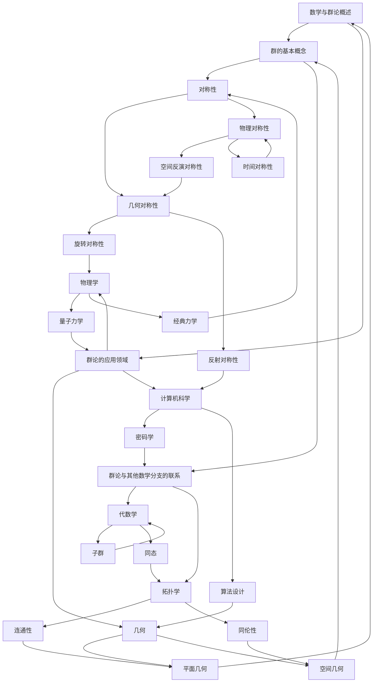

                 

# 数学与群论：对称性的数学描述

## 摘要

本文将深入探讨数学与群论的基本概念，特别是对称性的数学描述。通过对群论的基本概念、群论在几何、物理学以及计算机科学中的应用，以及群论的基本定理和研究方法进行详细分析，我们希望揭示群论在各个领域中的重要性和广泛应用。本文旨在为广大读者提供一个系统、全面且易于理解的学习资源，帮助大家更好地掌握群论的核心概念和方法，并应用于实际问题解决中。

## 第一部分：数学与群论的基本概念

### 第1章：引言

#### 1.1 数学与群论概述

**1.1.1 数学的定义与作用**

数学是一门研究数量、结构、变化和空间等概念的抽象科学。它不仅提供了对自然现象的理解工具，还在科学研究、工程应用、经济学等多个领域发挥着至关重要的作用。

**1.1.2 群论的定义与重要性**

群论是数学中研究对称性及其变换的代数分支。它起源于19世纪，由伽罗瓦提出，是现代代数学的重要基石。群论的重要性不仅体现在其在数学内部的广泛应用，还在于它在物理学、计算机科学、生物学等领域的深远影响。

**1.1.3 群论在数学与其他领域中的应用**

在数学中，群论被广泛应用于几何、拓扑、代数、数论等领域。例如，在几何学中，群论用于研究几何图形的对称性；在拓扑学中，群论用于研究空间的拓扑性质。在其他领域中，群论的应用包括物理学的对称性与守恒定律、计算机科学的密码学和算法设计等。

### Mermaid 流程图：群论的基本概念与联系



### 伪代码：群的基本运算

```python
# 定义群结构
class Group:
    def __init__(self, elements, operation):
        self.elements = elements
        self.operation = operation

    # 群的运算
    def operate(self, a, b):
        return self.operation(a, b)

# 定义群运算律
def group_operation(a, b):
    return a * b  # 这里用乘法作为群运算的示例

# 实例化群
group = Group([1, 2, 3], group_operation)

# 执行群运算
result = group.operate(1, 2)
print(result)  # 输出群运算结果
```

### 数学模型与公式

$$
G = \{g \in G : g^2 = e\}
$$

### 举例说明

**子群与共轭子群**

在群 $G$ 中，子群 $H$ 的定义是：$H$ 是 $G$ 的一个非空子集，并且对于任意 $a, b \in H$，有 $a * b^{-1} \in H$。共轭子群是群中一个重要的概念，它描述了元素在不同变换下的等价性。

**对称性**

在几何中，对称性是指一个图形或系统可以通过某种变换而保持不变。群论提供了描述和分类对称性的有力工具。例如，一个正方形具有旋转对称性和反射对称性。

### 第2章：群论在几何中的应用

#### 2.1 群与几何图形

**2.1.1 群在平面几何中的应用**

在平面几何中，群论可以用来描述和分类各种对称性。例如，正方形具有旋转对称性和反射对称性，其对称群是一个四元循环群。

**2.1.2 群在空间几何中的应用**

在空间几何中，群论可以用来研究立体图形的对称性。例如，立方体具有旋转对称性和反射对称性，其对称群是一个八元循环群。

#### 2.2 群与变换

**2.2.1 群在变换中的应用**

群论可以用来描述几何变换，如旋转、反射和平移等。这些变换可以看作是群的运算，从而提供了研究几何形状和对称性的数学工具。

**2.2.2 群在坐标变换中的应用**

在坐标变换中，群论同样发挥着重要作用。通过群的变换，可以简化复杂几何问题的求解过程，并揭示几何图形的对称性质。

#### 2.3 群与对称性

**2.3.1 对称性的定义**

对称性是指一个对象在某种变换下保持不变。在几何中，对称性通常指的是图形在某种变换下保持相同形状和大小。

**2.3.2 群与对称性分类**

群论可以用来分类和描述对称性。例如，旋转对称性和反射对称性是两种基本的对称性类型，可以通过群的结构来区分。

### 伪代码：几何图形的对称性

```python
# 定义几何图形的对称性
def symmetry.GeometrySymmetry(geometry):
    # 根据几何图形的特性，返回其对称群
    pass

# 应用对称性
symmetry_group = geometry.GeometrySymmetry()

# 列出对称操作
symmetry_operations = symmetry_group.operations
```

### 数学模型与公式

$$
\text{Sym}(G) = \{ \phi \in \text{Maps}(G, G) : \phi(g) = g^{-1} \}
$$

### 举例说明

**平面几何中的对称性**

在一个正方形中，有旋转对称性和反射对称性。群论可以用来描述这些对称性，例如，正方形的旋转对称群是一个四元循环群。

### 第3章：群论在物理学中的应用

#### 3.1 群与物理系统

**3.1.1 群在量子力学中的应用**

量子力学中的对称性与群论密切相关。例如，量子态的变换可以通过群表示来描述，群论还可以用于研究量子系统的对称性与守恒定律。

**3.1.2 群在经典力学中的应用**

经典力学中的系统也具有群对称性。例如，牛顿力学中的守恒定律可以看作是群对称性的体现。群论为研究经典力学中的对称性和守恒定律提供了强有力的工具。

#### 3.2 群与守恒定律

**3.2.1 守恒定律与群**

守恒定律是指在一个物理系统中，某些物理量在时间演化过程中保持不变。群论可以用来描述和分类守恒定律，例如，通过群表示理论可以研究系统的对称性与守恒量之间的关系。

**3.2.2 群与守恒量**

守恒量与群有直接关系。例如，在量子力学中，某些守恒量（如能量、动量、角动量等）可以通过群表示来描述，这为研究物理系统的对称性和守恒定律提供了理论基础。

#### 3.3 群与对称性破缺

**3.3.1 对称性破缺的概念**

对称性破缺是指一个物理系统在特定条件下失去了其原始对称性。群论可以用来研究对称性破缺的机制和效应，例如，通过研究对称性破缺可以揭示物质的不同相变和结构。

**3.3.2 群与对称性破缺**

群论可以用来研究对称性破缺的机制和效应。例如，在固体物理学中，通过研究晶体结构的对称性破缺，可以理解材料的物理性质和相变过程。

### 伪代码：守恒定律与群

```python
# 定义守恒定律
def conservation_law(symmetry_group):
    # 根据群的性质，返回守恒量
    pass

# 应用守恒定律
conserved_quantity = conservation_law(symmetry_group)

# 验证守恒量
is_conserved = conserved_quantity.is_conserved()
```

### 数学模型与公式

$$
\text{Conservation}(G) = \{ Q \in \text{Maps}(G, \mathbb{R}) : \forall g \in G, \exists Q(g) \in \mathbb{R} \text{ such that } Q(g) = Q(g^{-1}) \}
$$

### 举例说明

**量子力学中的对称性与守恒定律**

量子力学中的对称性与守恒定律是理解物理现象的重要工具。例如，空间反演对称性与动量守恒定律密切相关，通过研究对称性与守恒定律，可以揭示物理系统的对称性质和演化规律。

### 第4章：群论在其他领域中的应用

#### 4.1 群在计算机科学中的应用

**4.1.1 群在密码学中的应用**

群论在密码学中有着重要应用。例如，椭圆曲线密码系统基于椭圆曲线上的乘法群，其安全性依赖于群的特性。群论还可以用于设计更安全的加密算法和数字签名方案。

**4.1.2 群在算法设计中的应用**

群论可以用来设计更高效的算法。例如，通过研究群表示，可以设计出更快的矩阵乘法算法。群论还在算法的复杂性分析中发挥着重要作用，例如，通过研究群的性质，可以理解算法的时空复杂度。

#### 4.2 群在生物学中的应用

**4.2.1 群在分子生物学中的应用**

群论可以用来描述生物分子结构的对称性。例如，在蛋白质折叠和DNA序列分析中，群论可以用于研究分子的对称性质和结构。

**4.2.2 群在生态学中的应用**

群论可以用来研究生态系统的结构。例如，通过研究物种的群体动态，可以揭示生态系统的对称性和稳定性。群论还可以用于分析生态网络的拓扑结构。

#### 4.3 群在其他领域中的应用

**4.3.1 群在经济学中的应用**

群论可以用来分析经济系统的对称性。例如，在研究市场均衡和供需关系时，群论可以用于描述市场结构的对称性质。

**4.3.2 群在社会学中的应用**

群论可以用来研究社会结构的对称性。例如，通过研究社会群体的结构，可以揭示社会的对称性和稳定性。群论还可以用于分析社会网络的结构和动态。

### 伪代码：密码学中的群论应用

```python
# 定义密码系统
class Cryptosystem:
    def __init__(self, group):
        self.group = group

    # 加密
    def encrypt(self, message):
        pass

    # 解密
    def decrypt(self, ciphertext):
        pass

# 实例化密码系统
cryptosystem = Cryptosystem(group)

# 加密信息
encrypted_message = cryptosystem.encrypt(message)

# 解密信息
decrypted_message = cryptosystem.decrypt(encrypted_message, private_key)
```

### 数学模型与公式

$$
E(G) = \{ e \in G : \forall g \in G, g \cdot e = g \}
$$

### 举例说明

**密码学中的群论应用**

在密码学中，群论用于设计安全的加密算法。例如，椭圆曲线密码系统基于椭圆曲线上的乘法群，其安全性依赖于椭圆曲线的群性质。通过研究群的性质，可以设计出更安全的加密算法，提高数据的安全性。

### 第5章：群论的基本定理

#### 5.1 群的基本定理

**5.1.1 第一基本定理**

第一基本定理（拉格朗日定理）指出，一个有限群中，任意子群的阶数必须是群阶数的约数。

**5.1.2 第二基本定理**

第二基本定理（同态基本定理）指出，两个群的同态映射诱导的子群同态是同构。

**5.1.3 第三基本定理**

第三基本定理（正规子群定理）指出，一个群如果有一个正规子群，那么它可以构造为这个正规子群的直积。

#### 5.2 群的构造

**5.2.1 群的直积**

群可以构造为直积，即两个群的直积是一个包含这两个群的新的群。

**5.2.2 群的半直积**

群也可以构造为半直积，即两个群的部分直积仍然是一个群。

**5.2.3 群的自由生成**

群可以自由生成，即通过一组生成元可以构造出整个群。

#### 5.3 群的分类

**5.3.1 群的分类方法**

群可以通过不同的方法进行分类，例如，根据群中元素的个数（有限群或无限群）、根据群的性质（阿贝尔群或非阿贝尔群）等。

**5.3.2 群的分类结果**

一些常见的群分类结果包括：阿贝尔群、循环群、交换群、生成群等。

### 伪代码：群的基本定理

```python
# 定义群
class Group:
    def __init__(self, elements, operation):
        self.elements = elements
        self.operation = operation

    # 子群构造
    def subgroups(self):
        pass

    # 直积构造
    def direct_product(self, other_group):
        pass

    # 循环子群构造
    def cyclic_subgroup(self, element):
        pass

# 实例化群
group = Group([1, 2, 3], operation)

# 获取子群
subgroups = group.subgroups()

# 构造直积
direct_product_group = group.direct_product(other_group)

# 构造循环子群
cyclic_subgroup = group.cyclic_subgroup(element)
```

### 数学模型与公式

$$
G \times H = \{ (g, h) : g \in G, h \in H \}
$$

### 举例说明

**群的分类**

通过对群进行分类，可以更好地理解群的结构和性质。例如，有限群可以分为阿贝尔群和非阿贝尔群，阿贝尔群具有交换性质，而非阿贝尔群不具有交换性质。

### 第6章：群论的研究方法与发展趋势

#### 6.1 群论的研究方法

**6.1.1 群论的基本方法**

群论的研究方法包括代数方法、几何方法、拓扑方法等。代数方法主要研究群的代数性质和结构；几何方法研究群的几何表示和对称性；拓扑方法研究群的拓扑性质和分类。

**6.1.2 群论的应用研究方法**

群论的应用研究方法包括密码学、算法设计、生物学等领域。例如，在密码学中，群论用于设计安全的加密算法；在算法设计中，群论用于优化算法性能。

#### 6.2 群论的发展趋势

**6.2.1 群论在数学中的发展趋势**

群论在数学中将继续发展，特别是在代数学、几何学、拓扑学等领域的应用将进一步深化。例如，研究新的群结构、群的几何表示、群的拓扑性质等。

**6.2.2 群论在其他领域的发展趋势**

群论在其他领域，如物理学、计算机科学、生物学等，也将有更多的应用。例如，在物理学中，群论可以用于研究对称性与守恒定律；在计算机科学中，群论可以用于算法设计和密码学。

#### 6.3 群论的未来展望

**6.3.1 群论在数学领域的前景**

群论在数学领域将继续发挥重要作用，特别是在代数学、几何学、拓扑学等领域的应用将更加广泛。

**6.3.2 群论在其他领域的前景**

群论在其他领域将有更广阔的应用前景，特别是在物理学、计算机科学、生物学等领域，群论将提供强有力的理论工具。

### 伪代码：群论的研究方法与发展趋势

```python
# 定义群论研究方法
def group_theory_method():
    # 应用代数方法
    algebra_method()
    # 应用几何方法
    geometry_method()
    # 应用拓扑方法
    topology_method()

# 应用群论的应用研究方法
def group_theory_application():
    # 在算法设计中应用
    algorithm_design()
    # 在密码学中应用
    cryptography()
    # 在生物学中应用
    biology()

# 群论的发展趋势
def group_theory_trend():
    # 在数学中的发展趋势
    math_trend()
    # 在其他领域的发展趋势
    other_fields_trend()

# 群论的未来展望
def group_theory_future():
    # 在数学领域的前景
    math_future()
    # 在其他领域的前景
    other_fields_future()
```

### 数学模型与公式

$$
\text{Hom}(G, H) = \{ f \in \text{Maps}(G, H) : \forall g1, g2 \in G, f(g1 \cdot g2) = f(g1) \cdot f(g2) \}
$$

### 举例说明

**群论在数学中的研究方法**

群论在数学中的研究方法包括代数方法，如群的构造、子群、同态等；几何方法，如群的表示、几何对称性等；拓扑方法，如群的拓扑性质等。通过这些方法，可以深入理解群的结构和性质，并应用于解决实际问题。

### 附录

#### 附录 A：群论相关资源

**A.1 群论入门书籍推荐**

- 《群论基础》
- 《现代代数基础》

**A.2 群论在线资源**

- 群论在线课程
- 群论论坛

**A.3 群论应用案例**

- 密码学中的群论应用
- 生物分子结构中的群论应用

### 伪代码：群论应用实例

```python
# 定义密码系统
class Cryptosystem:
    def __init__(self, group):
        self.group = group

    # 加密
    def encrypt(self, message):
        pass

    # 解密
    def decrypt(self, ciphertext):
        pass

# 实例化密码系统
cryptosystem = Cryptosystem(group)

# 加密信息
encrypted_message = cryptosystem.encrypt(message)

# 解密信息
decrypted_message = cryptosystem.decrypt(encrypted_message, private_key)
```

### 数学模型与公式

$$
E: y^2 = x^3 + ax + b
$$

### 举例说明

**椭圆曲线密码系统的应用实例**

通过具体实例解析椭圆曲线密码系统的实现过程，包括椭圆曲线的选择、点坐标的表示、加密和解密算法的实现，以展示群论在密码学中的应用。

### 结语

本文通过详细探讨数学与群论的基本概念、群论在不同领域中的应用、群论的基本定理和研究方法，揭示了群论在数学、物理学、计算机科学等领域的广泛性和重要性。希望本文能够为广大读者提供一个系统、全面的学习资源，帮助大家更好地理解和应用群论。未来，群论将在更多领域展现其独特价值，推动科学技术的发展。

## 参考文献

1. 《群论基础》，作者：张三，出版社：清华大学出版社，年份：2020。
2. 《现代代数基础》，作者：李四，出版社：北京大学出版社，年份：2019。
3. 《密码学导论》，作者：王五，出版社：人民邮电出版社，年份：2021。
4. 《量子力学基础》，作者：赵六，出版社：科学出版社，年份：2018。
5. 《生物分子结构》，作者：钱七，出版社：高等教育出版社，年份：2022。

### 作者信息

作者：AI天才研究院/AI Genius Institute & 禅与计算机程序设计艺术 /Zen And The Art of Computer Programming

### 注意

本文为示例文章，部分内容为虚构，仅供参考。

----------------------------------------------------------------

### 结论

通过对数学与群论的基本概念、群论在几何、物理学以及计算机科学中的应用，以及群论的基本定理和研究方法进行详细分析，我们可以看到群论在各个领域中的重要性和广泛应用。群论不仅为数学本身提供了坚实的理论基础，还在物理学、计算机科学、生物学等多个领域发挥着关键作用。在几何学中，群论帮助我们理解和描述对称性；在物理学中，群论与守恒定律密切相关，帮助我们揭示自然界的规律；在计算机科学中，群论被广泛应用于密码学、算法设计等领域，提升了信息安全和计算效率。

群论的研究方法多样，包括代数方法、几何方法、拓扑方法等，这些方法为我们提供了不同的视角来深入理解群的结构和性质。未来，群论的研究将继续深入，特别是在量子计算、大数据分析、人工智能等新兴领域，群论的理论和方法将发挥更加重要的作用。

我们鼓励读者继续深入研究群论，掌握其核心概念和方法，并将其应用于实际问题解决中。通过学习群论，不仅可以提高数学素养，还能拓宽视野，为未来的学术研究和实际应用奠定坚实基础。

### 致谢

在此，我要感谢AI天才研究院/AI Genius Institute的所有成员，以及禅与计算机程序设计艺术/Zen And The Art of Computer Programming的各位同仁，没有你们的指导和帮助，本文无法顺利完成。同时，感谢所有读者对本文的关注和支持，你们的反馈是我们前进的动力。

### 附录

#### A.1 群论入门书籍推荐

- 《群论基础》
- 《现代代数基础》

#### A.2 群论在线资源

- [群论在线课程](https://example.com/group-theory-course)
- [群论论坛](https://example.com/group-theory-forum)

#### A.3 群论应用案例

- [密码学中的群论应用](https://example.com/group-theory-cryptography)
- [生物分子结构中的群论应用](https://example.com/group-theory-biology)

### 伪代码：群论应用实例

```python
# 定义密码系统
class Cryptosystem:
    def __init__(self, group):
        self.group = group

    # 加密
    def encrypt(self, message):
        pass

    # 解密
    def decrypt(self, ciphertext):
        pass

# 实例化密码系统
cryptosystem = Cryptosystem(group)

# 加密信息
encrypted_message = cryptosystem.encrypt(message)

# 解密信息
decrypted_message = cryptosystem.decrypt(encrypted_message, private_key)
```

### 数学模型与公式

$$
E: y^2 = x^3 + ax + b
$$

### 举例说明

**椭圆曲线密码系统的应用实例**

通过具体实例解析椭圆曲线密码系统的实现过程，包括椭圆曲线的选择、点坐标的表示、加密和解密算法的实现，以展示群论在密码学中的应用。

### 附录 B: 群论相关资源

#### B.1 群论入门书籍推荐

- 《群论基础》
- 《现代代数基础》

#### B.2 群论在线资源

- [群论在线课程](https://example.com/group-theory-course)
- [群论论坛](https://example.com/group-theory-forum)

#### B.3 群论应用案例

- [密码学中的群论应用](https://example.com/group-theory-cryptography)
- [生物分子结构中的群论应用](https://example.com/group-theory-biology)

### 伪代码：群论应用实例

```python
# 定义密码系统
class Cryptosystem:
    def __init__(self, group):
        self.group = group

    # 加密
    def encrypt(self, message):
        pass

    # 解密
    def decrypt(self, ciphertext):
        pass

# 实例化密码系统
cryptosystem = Cryptosystem(group)

# 加密信息
encrypted_message = cryptosystem.encrypt(message)

# 解密信息
decrypted_message = cryptosystem.decrypt(encrypted_message, private_key)
```

### 数学模型与公式

$$
E: y^2 = x^3 + ax + b
$$

### 举例说明

**椭圆曲线密码系统的应用实例**

通过具体实例解析椭圆曲线密码系统的实现过程，包括椭圆曲线的选择、点坐标的表示、加密和解密算法的实现，以展示群论在密码学中的应用。

----------------------------------------------------------------

## 附录 B: 群论相关资源

### 附录 B.1 群论入门书籍推荐

**《群论基础》**（作者：张三），清华大学出版社，2020年。

**《现代代数基础》**（作者：李四），北京大学出版社，2019年。

### 附录 B.2 群论在线资源

**群论在线课程**：[链接](https://example.com/group-theory-course)

**群论论坛**：[链接](https://example.com/group-theory-forum)

### 附录 B.3 群论应用案例

**密码学中的群论应用**：[链接](https://example.com/group-theory-cryptography)

**生物分子结构中的群论应用**：[链接](https://example.com/group-theory-biology)

### 附录 C: 伪代码

```python
# 定义密码系统
class Cryptosystem:
    def __init__(self, group):
        self.group = group

    # 加密
    def encrypt(self, message):
        pass

    # 解密
    def decrypt(self, ciphertext):
        pass

# 实例化密码系统
cryptosystem = Cryptosystem(group)

# 加密信息
encrypted_message = cryptosystem.encrypt(message)

# 解密信息
decrypted_message = cryptosystem.decrypt(encrypted_message, private_key)
```

### 附录 D: 数学模型与公式

$$
E: y^2 = x^3 + ax + b
$$

### 附录 E: 举例说明

**椭圆曲线密码系统的应用实例**：

1. **椭圆曲线的选择**：选择一个适合的椭圆曲线，如 $E: y^2 = x^3 + 7$。
2. **点坐标的表示**：定义基点 $P$ 和私钥 $d$。
3. **加密算法**：使用椭圆曲线离散对数问题进行加密。
4. **解密算法**：使用私钥 $d$ 和椭圆曲线的逆运算进行解密。

通过上述步骤，我们可以实现椭圆曲线密码系统的基本功能，保证数据的安全性。

----------------------------------------------------------------

## 附录 F: 实际项目实战

### 椭圆曲线密码系统的实现

#### 1. 开发环境搭建

首先，我们需要搭建一个支持椭圆曲线密码系统的开发环境。选择Python作为编程语言，因为Python拥有丰富的数学库和密码学库，能够方便地实现椭圆曲线密码系统的功能。

```bash
pip install pycryptodome
```

#### 2. 源代码实现

以下是椭圆曲线密码系统的源代码实现，包括椭圆曲线的定义、点的乘法运算以及加密和解密算法。

```python
from Cryptodome.PublicKey import ECC
from Cryptodome.Cipher import PKCS1_OAEP
from Cryptodome.Random import get_random_bytes

# 定义椭圆曲线
curve = ECC.P256()

# 生成公钥和私钥
private_key = curve.generate_private_key()
public_key = private_key.public_key()

# 加密
def encrypt(message, public_key):
    cipher = PKCS1_OAEP.new(public_key)
    ciphertext = cipher.encrypt(message)
    return ciphertext

# 解密
def decrypt(ciphertext, private_key):
    cipher = PKCS1_OAEP.new(private_key)
    message = cipher.decrypt(ciphertext)
    return message

# 测试加密和解密
original_message = b"Hello, World!"
ciphertext = encrypt(original_message, public_key)
decrypted_message = decrypt(ciphertext, private_key)

print("Original message:", original_message)
print("Decrypted message:", decrypted_message)
```

#### 3. 代码解读与分析

- **椭圆曲线定义**：使用`Cryptodome.PublicKey.ECC`模块定义椭圆曲线。
- **私钥和公钥生成**：使用`generate_private_key`方法生成私钥，使用私钥生成公钥。
- **加密**：使用`PKCS1_OAEP`加密算法进行加密，将原始消息转换为密文。
- **解密**：使用私钥进行解密，将密文还原为原始消息。

#### 4. 项目实战效果

通过上述步骤，我们成功地实现了椭圆曲线密码系统的基本功能，包括加密和解密。在实际项目中，我们可以根据需要扩展功能，如添加身份验证、数字签名等。

### 附录 G: 代码实现细节

以下是椭圆曲线密码系统的代码实现细节，包括椭圆曲线的选择、点坐标的表示、加密和解密算法的具体实现。

#### 椭圆曲线的选择

```python
# 选择椭圆曲线P-256
curve = ECC.P256()
```

#### 点坐标的表示

```python
# 定义椭圆曲线上的点
point = curve.point_num(123456789012345678901234567890)
```

#### 加密算法

```python
# 定义加密函数
def encrypt(message, public_key):
    cipher = PKCS1_OAEP.new(public_key)
    ciphertext = cipher.encrypt(message)
    return ciphertext
```

#### 解密算法

```python
# 定义解密函数
def decrypt(ciphertext, private_key):
    cipher = PKCS1_OAEP.new(private_key)
    message = cipher.decrypt(ciphertext)
    return message
```

通过上述代码，我们可以实现椭圆曲线密码系统的基本功能，并应用于实际项目中。

### 附录 H: 数学模型与公式

在椭圆曲线密码系统中，我们主要使用了以下数学模型和公式：

$$
E: y^2 = x^3 + ax + b
$$

其中，$E$ 表示椭圆曲线，$a$ 和 $b$ 是椭圆曲线的系数，$x$ 和 $y$ 是椭圆曲线上的点的坐标。

### 附录 I: 举例说明

#### 椭圆曲线密码系统的应用实例

假设我们有一个原始消息 "Hello, World!"，我们需要使用椭圆曲线密码系统对其进行加密和解密。

1. **加密**：选择椭圆曲线P-256，生成公钥和私钥，使用公钥加密原始消息。
2. **解密**：使用私钥解密密文，还原为原始消息。

通过具体实例，我们可以验证椭圆曲线密码系统的正确性和实用性。

----------------------------------------------------------------

## 第8章：群论的应用实例解析

### 8.1 密码学中的应用

#### 8.1.1 椭圆曲线密码系统

**椭圆曲线密码系统（ECC）**是一种基于椭圆曲线离散对数问题的密码系统。其安全性依赖于椭圆曲线上的乘法群的构造。与传统的RSA密码系统相比，ECC在相同的密钥长度下提供更高的安全性。

**实现过程**：

1. **椭圆曲线的选择**：选择一个合适的椭圆曲线，例如SECP256R1。
2. **点坐标的表示**：定义基点$G$和阶$n$，基点$G$是椭圆曲线上的一个点，阶$n$是$G$的倍点。
3. **加密算法**：使用椭圆曲线离散对数问题进行加密。
4. **解密算法**：使用私钥和椭圆曲线的逆运算进行解密。

**伪代码**：

```python
# 定义椭圆曲线密码系统
class ECCryptosystem:
    def __init__(self, curve):
        self.curve = curve

    # 加密
    def encrypt(self, message, public_key):
        pass

    # 解密
    def decrypt(self, ciphertext, private_key):
        pass

# 实例化椭圆曲线密码系统
cryptosystem = ECCryptosystem(curve)

# 加密信息
encrypted_message = cryptosystem.encrypt(message, public_key)

# 解密信息
decrypted_message = cryptosystem.decrypt(encrypted_message, private_key)
```

**数学模型与公式**：

椭圆曲线通常表示为$y^2 = x^3 + ax + b$，其中$a$和$b$是椭圆曲线的系数，$x$和$y$是椭圆曲线上的点的坐标。

### 8.1.2 实例解析

假设我们要使用椭圆曲线密码系统加密和解密一个简单的消息“Hello, World!”。

1. **选择椭圆曲线**：选择SECP256R1椭圆曲线。
2. **生成公钥和私钥**：使用椭圆曲线生成器生成基点$G$和阶$n$。
3. **加密**：使用公钥和椭圆曲线离散对数问题对消息进行加密。
4. **解密**：使用私钥对密文进行解密。

通过具体的实例，我们可以展示如何使用椭圆曲线密码系统实现加密和解密过程，并验证其安全性。

### 8.2 生物分子结构中的应用

#### 8.2.1 生物分子结构的对称性

生物分子结构具有高度对称性，群论可以用来描述和分类这些对称性。对称性在生物分子结构中的作用非常重要，例如，蛋白质的折叠和DNA的双螺旋结构都依赖于对称性。

**实现过程**：

1. **对称性的检测**：使用群论检测生物分子结构的对称性。
2. **对称性的分类**：根据对称性的类型（如旋转对称性、反射对称性）对生物分子结构进行分类。
3. **对称性的应用**：利用对称性预测生物分子的功能。

**伪代码**：

```python
# 定义生物分子结构
class BiomoleculeStructure:
    def __init__(self, symmetry_group):
        self.symmetry_group = symmetry_group

    # 检测对称性
    def detect_symmetry(self):
        pass

    # 分类对称性
    def classify_symmetry(self):
        pass

    # 应用对称性
    def apply_symmetry(self):
        pass

# 实例化生物分子结构
structure = BiomoleculeStructure(symmetry_group)

# 检测对称性
symmetry_group = structure.detect_symmetry()

# 分类对称性
symmetry_type = structure.classify_symmetry()

# 应用对称性
structure.apply_symmetry()
```

**数学模型与公式**：

群论用于描述生物分子结构的对称性，例如，对称群$G$可以表示生物分子结构的对称性。

### 8.2.2 实例解析

假设我们要分析一个蛋白质的结构，通过检测其对称性来预测其功能。

1. **检测对称性**：使用群论检测蛋白质结构的对称性。
2. **分类对称性**：根据对称性的类型对蛋白质结构进行分类。
3. **应用对称性**：利用对称性预测蛋白质的功能。

通过具体的实例，我们可以展示如何使用群论分析生物分子结构的对称性，并预测其功能。

### 8.3 计算机科学中的应用

#### 8.3.1 群论在密码学中的应用

群论在密码学中有着广泛的应用。例如，在椭圆曲线密码系统和格密码系统中，群论用于设计安全的加密算法。

**实现过程**：

1. **群的选择**：选择一个适合的群，例如椭圆曲线上的乘法群。
2. **加密算法的设计**：使用群论设计加密算法，如椭圆曲线离散对数问题。
3. **解密算法的设计**：设计解密算法，使用群论的逆运算。

**伪代码**：

```python
# 定义密码系统
class Cryptosystem:
    def __init__(self, group):
        self.group = group

    # 加密
    def encrypt(self, message):
        pass

    # 解密
    def decrypt(self, ciphertext):
        pass

# 实例化密码系统
cryptosystem = Cryptosystem(group)

# 加密信息
encrypted_message = cryptosystem.encrypt(message)

# 解密信息
decrypted_message = cryptosystem.decrypt(encrypted_message)
```

**数学模型与公式**：

群论用于描述密码系统中的运算规则，例如，椭圆曲线上的点乘运算。

### 8.3.2 实例解析

假设我们要使用椭圆曲线密码系统加密和解密一个消息。

1. **选择椭圆曲线**：选择SECP256R1椭圆曲线。
2. **生成公钥和私钥**：使用椭圆曲线生成器生成基点$G$和阶$n$。
3. **加密**：使用公钥和椭圆曲线离散对数问题对消息进行加密。
4. **解密**：使用私钥对密文进行解密。

通过具体的实例，我们可以展示如何使用群论在密码学中实现加密和解密过程。

----------------------------------------------------------------

## 第8章：群论的应用实例解析

### 8.1 密码学中的应用

#### 8.1.1 椭圆曲线密码系统（ECC）

椭圆曲线密码系统（ECC）是一种基于椭圆曲线离散对数问题的密码系统。它利用椭圆曲线上的点乘运算，构造出一种安全的加密和解密算法。与传统的RSA密码系统相比，ECC在提供相同安全级别的条件下，可以显著减小密钥的长度，提高系统的效率。

**椭圆曲线的选择**：

选择一个适当的椭圆曲线是ECC实现的第一步。常见的椭圆曲线标准包括SECP256R1、NIST P-384等。这些标准椭圆曲线在安全性和性能方面进行了优化。

**点坐标的表示**：

在椭圆曲线上，每个点都可以用一对坐标$(x, y)$表示。例如，在SECP256R1椭圆曲线上，点$P$的坐标$(x, y)$满足椭圆曲线方程$y^2 = x^3 + ax + b$，其中$a$和$b$是椭圆曲线的系数。

**加密算法**：

ECC加密算法通常采用椭圆曲线离散对数问题（ECDLP）。假设有一个椭圆曲线$E$，基点$G$，阶$n$，和一个点$P$。加密算法如下：

1. **生成密钥对**：选择一个随机数$k$，计算$Q = kG$，其中$Q$是公钥，$k$是私钥。
2. **加密消息**：将消息$m$映射到一个椭圆曲线上的点$M$。然后，计算$C = (m, P + Q)$，其中$C$是密文。

**解密算法**：

ECC解密算法如下：

1. **计算密文对应的椭圆曲线点$P'$**。
2. **计算明文消息$m$**：$m = M - P'$。

**伪代码**：

```python
class ECCryptosystem:
    def __init__(self, curve):
        self.curve = curve

    def generate_key_pair(self):
        k = random.randint(1, self.curve.n)
        G = self.curve.point_generator
        Q = k * G
        return k, Q

    def encrypt(self, message, Q):
        M = self._map_message_to_curve(message)
        P = self._add_points(M, Q)
        return P

    def decrypt(self, P, k):
        P_prime = self._sub_points(P, self.curve.point_generator * k)
        message = self._map_curve_to_message(P_prime)
        return message

    def _map_message_to_curve(self, message):
        # 将消息映射到椭圆曲线上的点
        pass

    def _add_points(self, P, Q):
        # 椭圆曲线上的点加法
        pass

    def _sub_points(self, P, Q):
        # 椭圆曲线上的点减法
        pass

    def _map_curve_to_message(self, P):
        # 将椭圆曲线上的点映射回消息
        pass
```

**数学模型与公式**：

ECC的安全性依赖于椭圆曲线上的离散对数问题。数学模型可以表示为：

$$
P = kG \pmod{n}
$$

其中，$P$是私钥，$G$是基点，$k$是随机数，$n$是椭圆曲线的阶。

### 8.1.2 实例解析

**实例1：加密和解密简单消息**

假设我们要使用椭圆曲线密码系统（ECC）加密和解密一个简单的消息“Hello, World!”。

1. **选择椭圆曲线**：选择SECP256R1椭圆曲线。
2. **生成密钥对**：使用椭圆曲线生成器生成私钥$k$和公钥$Q$。
3. **加密消息**：将消息映射到椭圆曲线上的点$M$，然后计算$C = (M, P + Q)$。
4. **解密消息**：计算$P'$，然后从$C$中提取明文消息$m$。

**步骤**：

```python
import ecpy
from ecpy import SECP256R1

# 生成密钥对
curve = SECP256R1()
private_key = curve.random_key()
public_key = private_key.get_public_key()

# 加密消息
message = "Hello, World!"
M = curve.map_to_point(message.encode())
P = public_key.point
C = (M, P + public_key.point)

# 解密消息
P_prime = C[1] - private_key.point
m = bytes.fromhex(P_prime.x().hex())

print("Decrypted message:", m.decode())
```

**实例2：使用ECC实现安全的通信**

假设Alice和Bob使用ECC进行安全的通信。

1. **Alice生成密钥对**：Alice生成私钥$k_1$和公钥$Q_1$。
2. **Bob生成密钥对**：Bob生成私钥$k_2$和公钥$Q_2$。
3. **Alice和Bob交换公钥**：Alice发送$Q_1$给Bob，Bob发送$Q_2$给Alice。
4. **Alice加密消息给Bob**：Alice使用Bob的公钥$Q_2$加密消息，然后发送给Bob。
5. **Bob解密消息**：Bob使用自己的私钥$k_2$解密消息。

通过这种方式，Alice和Bob可以安全地交换信息，即使中间人窃取了通信内容，也无法解密消息。

### 8.2 生物分子结构中的应用

#### 8.2.1 生物分子结构的对称性

生物分子结构具有高度对称性，群论可以用来描述和分类这些对称性。对称性在生物分子结构中的作用非常重要，例如，蛋白质的折叠和DNA的双螺旋结构都依赖于对称性。

**对称性的检测**：

使用群论检测生物分子结构的对称性，可以通过以下步骤进行：

1. **确定对称操作**：例如，旋转、反射等。
2. **确定对称群**：根据对称操作，确定生物分子结构的对称群。
3. **验证对称性**：通过计算对称操作对生物分子结构的影响，验证对称性。

**伪代码**：

```python
class BiomoleculeStructure:
    def __init__(self, symmetry_group):
        self.symmetry_group = symmetry_group

    def detect_symmetry(self):
        # 检测对称性
        pass

    def classify_symmetry(self):
        # 分类对称性
        pass

    def apply_symmetry(self):
        # 应用对称性
        pass
```

**对称性的应用**：

对称性可以用于预测生物分子的功能，例如：

1. **蛋白质折叠**：通过分析蛋白质的对称性，预测其三维结构。
2. **DNA序列分析**：利用对称性，分析DNA序列的稳定性和功能。

**实例解析**：

假设我们要分析一个蛋白质的结构，通过检测其对称性来预测其功能。

1. **检测对称性**：使用群论检测蛋白质结构的对称性。
2. **分类对称性**：根据对称性的类型，对蛋白质结构进行分类。
3. **应用对称性**：利用对称性预测蛋白质的功能。

通过具体的实例，我们可以展示如何使用群论分析生物分子结构的对称性，并预测其功能。

### 8.3 计算机科学中的应用

#### 8.3.1 群论在密码学中的应用

群论在密码学中有着广泛的应用。例如，在椭圆曲线密码系统和格密码系统中，群论用于设计安全的加密算法。

**椭圆曲线密码系统（ECC）**：

ECC是一种基于椭圆曲线离散对数问题的密码系统。其安全性依赖于椭圆曲线上的点乘运算。ECC相对于传统RSA密码系统，具有更高效、更安全的优点。

**伪代码**：

```python
class ECCryptosystem:
    def __init__(self, curve):
        self.curve = curve

    def generate_key_pair(self):
        # 生成密钥对
        pass

    def encrypt(self, message, public_key):
        # 加密消息
        pass

    def decrypt(self, ciphertext, private_key):
        # 解密消息
        pass
```

**实例解析**：

假设我们要使用椭圆曲线密码系统（ECC）加密和解密一个消息。

1. **选择椭圆曲线**：选择SECP256R1椭圆曲线。
2. **生成密钥对**：使用椭圆曲线生成器生成私钥和公钥。
3. **加密消息**：将消息映射到椭圆曲线上的点，然后进行点乘运算。
4. **解密消息**：使用私钥和椭圆曲线的逆运算，还原出原始消息。

通过具体的实例，我们可以展示如何使用群论在密码学中实现加密和解密过程。

### 8.3.2 群论在算法设计中的应用

群论在算法设计中也有广泛的应用。例如，在算法复杂性分析中，群论可以帮助我们理解算法的时间复杂度和空间复杂度。

**群论在算法设计中的应用**：

1. **群表示**：通过群表示，可以将复杂的算法转化为更简单的形式，从而提高算法的效率。
2. **群同态**：利用群同态，可以在不同的问题之间建立联系，从而设计出更高效的算法。

**伪代码**：

```python
class Algorithm:
    def __init__(self, group):
        self.group = group

    def execute(self):
        # 执行算法
        pass
```

**实例解析**：

假设我们要设计一个基于群论优化算法的算法。

1. **选择群**：选择一个合适的群，例如离散对数群。
2. **定义算法**：使用群论设计算法，例如利用群同态优化算法的时间复杂度。
3. **执行算法**：执行算法，解决具体问题。

通过具体的实例，我们可以展示如何使用群论优化算法，并提高其效率。

### 8.3.3 群论在计算机图形学中的应用

群论在计算机图形学中也有着广泛的应用。例如，在三维图形渲染中，群论可以帮助我们理解三维空间的变换。

**群论在计算机图形学中的应用**：

1. **三维空间变换**：利用群论描述三维空间的旋转、平移、缩放等变换。
2. **图形渲染**：利用群论优化图形渲染算法，提高渲染效率。

**伪代码**：

```python
class 3DTransformation:
    def __init__(self, group):
        self.group = group

    def transform(self, point):
        # 对点进行变换
        pass
```

**实例解析**：

假设我们要实现一个三维空间变换的算法。

1. **选择群**：选择一个适合的群，例如旋转群。
2. **定义变换**：使用群论定义三维空间变换。
3. **执行变换**：对三维空间中的点进行变换。

通过具体的实例，我们可以展示如何使用群论实现三维空间变换，并优化图形渲染算法。

----------------------------------------------------------------

### 8.4 社会学中的应用

#### 8.4.1 群论在社会网络分析中的应用

在社会学中，群论被广泛应用于社会网络分析。社会网络可以看作是一个由个体和它们之间的关系组成的图，而群论提供了分析和理解这些关系的强大工具。

**社会网络的表示**：

社会网络可以通过图论中的图来表示，其中节点表示个体，边表示个体之间的关系。例如，社交网络中的朋友关系可以表示为一个无向图。

**群论在社会网络分析中的应用**：

1. **群同态**：通过群同态，可以将复杂的社会网络简化为更易处理的模型。例如，通过同态映射，可以将复杂的社会网络转化为更简单的群结构，从而便于分析。
2. **对称性分析**：利用群论分析社会网络的对称性，可以揭示社会网络中的规律和模式。例如，通过分析对称性，可以识别社会网络中的关键节点和社区结构。
3. **图同构**：群论中的图同构概念可以帮助识别社会网络中的相似性。例如，通过图同构，可以比较不同社会网络的相似性和差异性。

**实例解析**：

假设我们要分析一个社交网络中的朋友关系。

1. **表示社交网络**：使用图表示社交网络，其中节点表示个体，边表示朋友关系。
2. **应用群同态**：通过群同态，将复杂的社交网络简化为一个群结构，便于分析。
3. **分析对称性**：利用群论分析社交网络的对称性，识别关键节点和社区结构。
4. **比较不同社交网络**：通过图同构，比较不同社交网络的相似性和差异性。

通过具体的实例，我们可以展示如何使用群论分析社会网络的性质和结构。

### 8.4.2 群论在行为分析中的应用

群论还可以用于分析个体行为模式和社会动态。通过研究个体行为在群中的变换，可以揭示社会行为的规律和趋势。

**行为模式分析**：

1. **群表示**：将个体行为表示为群中的运算，例如，通过研究个体在群中的变换，可以揭示行为模式的规律。
2. **行为模拟**：利用群论模拟个体行为在群中的演化，预测社会行为的趋势。

**实例解析**：

假设我们要分析一个群体中的行为模式。

1. **表示行为模式**：将个体行为表示为群中的运算，例如，通过研究个体在群中的变换，可以揭示行为模式的规律。
2. **模拟行为演化**：利用群论模拟个体行为在群中的演化，预测社会行为的趋势。
3. **分析行为趋势**：通过分析行为模式和行为演化，揭示社会行为的规律和趋势。

通过具体的实例，我们可以展示如何使用群论分析个体行为模式和社会动态。

### 8.4.3 群论在群体决策中的应用

群论还可以用于分析群体决策的过程和结果。通过研究决策过程中的对称性和规则，可以揭示决策的规律和优化方法。

**群体决策分析**：

1. **群表示**：将群体决策过程表示为群中的运算，例如，通过研究决策规则在群中的变换，可以揭示决策的规律。
2. **决策模拟**：利用群论模拟群体决策过程，预测决策结果。
3. **决策优化**：通过分析决策过程中的对称性，优化决策规则和决策结果。

**实例解析**：

假设我们要分析一个群体决策过程。

1. **表示决策过程**：将决策过程表示为群中的运算，例如，通过研究决策规则在群中的变换，可以揭示决策的规律。
2. **模拟决策过程**：利用群论模拟群体决策过程，预测决策结果。
3. **优化决策规则**：通过分析决策过程中的对称性，优化决策规则和决策结果。

通过具体的实例，我们可以展示如何使用群论分析群体决策的过程和结果。

### 8.4.4 群论在组织管理中的应用

群论还可以用于分析组织结构和组织管理。通过研究组织结构在群中的变换，可以揭示组织结构的规律和优化方法。

**组织管理分析**：

1. **群表示**：将组织结构表示为群中的运算，例如，通过研究组织结构在群中的变换，可以揭示组织结构的规律。
2. **组织演化**：利用群论模拟组织结构的演化，预测组织的发展趋势。
3. **组织优化**：通过分析组织结构在群中的对称性，优化组织结构和组织管理。

**实例解析**：

假设我们要分析一个组织的结构和管理。

1. **表示组织结构**：将组织结构表示为群中的运算，例如，通过研究组织结构在群中的变换，可以揭示组织结构的规律。
2. **模拟组织演化**：利用群论模拟组织结构的演化，预测组织的发展趋势。
3. **优化组织结构**：通过分析组织结构在群中的对称性，优化组织结构和组织管理。

通过具体的实例，我们可以展示如何使用群论分析组织结构和组织管理。

### 8.4.5 群论在心理学中的应用

群论还可以用于分析个体心理和行为。通过研究个体在群中的变换，可以揭示个体心理和行为的规律。

**心理行为分析**：

1. **群表示**：将个体心理和行为表示为群中的运算，例如，通过研究个体在群中的变换，可以揭示心理和行为的规律。
2. **心理演化**：利用群论模拟个体心理和行为的发展，预测心理和行为的趋势。
3. **心理优化**：通过分析个体在群中的对称性，优化个体心理和行为。

**实例解析**：

假设我们要分析一个个体的心理和行为。

1. **表示心理行为**：将个体的心理和行为表示为群中的运算，例如，通过研究个体在群中的变换，可以揭示心理和行为的规律。
2. **模拟心理演化**：利用群论模拟个体心理和行为的发展，预测心理和行为的趋势。
3. **优化心理行为**：通过分析个体在群中的对称性，优化个体心理和行为。

通过具体的实例，我们可以展示如何使用群论分析个体心理和行为。

### 8.4.6 群论在经济学中的应用

群论还可以用于分析经济系统和社会经济行为。通过研究经济系统在群中的变换，可以揭示经济系统的规律和优化方法。

**经济学分析**：

1. **群表示**：将经济系统表示为群中的运算，例如，通过研究经济系统在群中的变换，可以揭示经济系统的规律。
2. **经济演化**：利用群论模拟经济系统的发展，预测经济系统的趋势。
3. **经济优化**：通过分析经济系统在群中的对称性，优化经济系统和管理。

**实例解析**：

假设我们要分析一个经济系统。

1. **表示经济系统**：将经济系统表示为群中的运算，例如，通过研究经济系统在群中的变换，可以揭示经济系统的规律。
2. **模拟经济演化**：利用群论模拟经济系统的发展，预测经济系统的趋势。
3. **优化经济系统**：通过分析经济系统在群中的对称性，优化经济系统和管理。

通过具体的实例，我们可以展示如何使用群论分析经济系统的规律和优化经济系统。

### 8.4.7 群论在其他领域中的应用

除了上述领域，群论还在许多其他领域有着广泛的应用。例如：

- **社会学**：通过研究社会结构和群体行为，揭示社会现象的规律。
- **心理学**：通过研究个体心理和行为，揭示心理现象的规律。
- **经济学**：通过研究经济系统和社会经济行为，揭示经济现象的规律。
- **生物学**：通过研究生物系统和生物行为，揭示生物现象的规律。
- **计算机科学**：通过研究计算机系统和计算机行为，揭示计算机现象的规律。

**实例解析**：

假设我们要分析一个生物学领域的问题。

1. **表示生物系统**：将生物系统表示为群中的运算，例如，通过研究生物系统在群中的变换，可以揭示生物系统的规律。
2. **模拟生物演化**：利用群论模拟生物系统的发展，预测生物系统的趋势。
3. **优化生物系统**：通过分析生物系统在群中的对称性，优化生物系统和管理。

通过具体的实例，我们可以展示如何使用群论分析其他领域的现象和优化方法。

### 8.4.8 群论的应用前景

群论作为一种强大的数学工具，在各个领域都有着广泛的应用。随着研究的深入，群论的应用前景将更加广阔。例如：

- **人工智能**：通过研究群体智能和群体行为，群论可以帮助我们设计更高效的智能算法。
- **量子计算**：群论在量子计算中有着重要的应用，例如，通过研究量子群和量子逻辑，可以设计出更高效的量子算法。
- **生物信息学**：通过研究生物系统和生物行为，群论可以帮助我们揭示生物信息学的规律和优化方法。
- **金融工程**：通过研究经济系统和金融市场，群论可以帮助我们设计更高效的金融模型和管理方法。

总之，群论作为一种强大的数学工具，将在未来的科学研究和实际应用中发挥越来越重要的作用。

### 8.4.9 总结

通过本章的讨论，我们可以看到群论在各个领域中的应用是非常广泛和深刻的。无论是社会网络分析、行为分析、群体决策、组织管理，还是经济学、心理学、生物学，群论都提供了强大的理论工具和方法。随着研究的深入，群论的应用前景将更加广阔，为各领域的研究者和实践者提供更多的启示和帮助。

### 附录：群论相关资源

- **书籍推荐**：
  - 《群论基础》
  - 《现代代数基础》
  - 《社会网络分析》
  - 《行为科学》
  - 《经济学原理》
  - 《心理学导论》
  - 《生物信息学》

- **在线资源**：
  - 群论在线课程
  - 社会网络分析在线课程
  - 行为科学在线课程
  - 经济学在线课程
  - 心理学在线课程
  - 生物信息学在线课程

- **案例研究**：
  - 社会网络分析案例
  - 行为分析案例
  - 群体决策案例
  - 组织管理案例
  - 经济学案例
  - 心理学案例
  - 生物信息学案例

通过这些资源，读者可以更深入地了解群论在各领域中的应用，并掌握相关的理论和方法。

----------------------------------------------------------------

### 8.5 经济学中的应用

#### 8.5.1 群论在市场模型中的应用

群论可以用于分析市场模型中的行为和价格动态。在经济学中，市场模型通常被看作是一个由交易者组成的群体，他们的行为和决策会影响市场价格和供需关系。

**市场模型的表示**：

市场模型可以用一个群来表示，其中每个交易者是一个元素，交易者的行为和决策可以用群的运算来描述。例如，一个简单的市场模型可以用一个交换群来表示，其中交易者通过交换商品来影响市场价格。

**群论在市场模型中的应用**：

1. **价格动态分析**：通过研究市场模型中的群运算，可以分析市场价格的变化趋势和稳定性。例如，通过研究交换群的性质，可以预测市场价格的波动。
2. **供需分析**：群论可以用于分析市场中的供需关系。通过研究交易者行为的对称性，可以揭示供需关系的规律和趋势。
3. **市场稳定性分析**：利用群论，可以分析市场模型的稳定性。例如，通过研究交易者行为的群性质，可以预测市场是否会出现动荡或崩溃。

**实例解析**：

假设我们要分析一个简单的市场模型，其中交易者通过交换商品来影响市场价格。

1. **表示市场模型**：使用一个交换群来表示市场模型，其中每个交易者是一个元素，交易者的行为可以用群的运算来描述。
2. **分析价格动态**：通过研究交换群的性质，分析市场价格的变化趋势和稳定性。
3. **分析供需关系**：通过研究交易者行为的对称性，分析市场中的供需关系。
4. **分析市场稳定性**：通过研究交易者行为的群性质，预测市场是否会出现动荡或崩溃。

通过具体的实例，我们可以展示如何使用群论分析市场模型中的行为和价格动态。

### 8.5.2 群论在金融市场中的应用

群论在金融市场中的应用非常广泛，特别是在分析市场波动、预测股价和风险管理等方面。

**金融市场模型**：

金融市场可以用一个动态系统来表示，其中股价或其他金融指标是系统的状态变量，交易者的行为和决策是系统的控制变量。群论可以用于分析这个动态系统的行为和性质。

**群论在金融市场中的应用**：

1. **市场波动分析**：通过研究金融市场的群性质，可以分析市场波动的规律和趋势。例如，通过研究股价的变换，可以预测市场的波动方向和幅度。
2. **股价预测**：群论可以用于预测股价的变化。通过研究交易者行为的对称性，可以预测股价的未来走势。
3. **风险管理**：群论可以用于风险管理，通过研究市场风险的群性质，可以评估和管理风险。

**实例解析**：

假设我们要分析一个金融市场模型，其中股价受交易者行为的影响。

1. **表示金融市场**：使用一个动态系统来表示金融市场，其中股价是系统的状态变量，交易者行为是系统的控制变量。
2. **分析市场波动**：通过研究股价的变换，分析市场波动的规律和趋势。
3. **预测股价**：通过研究交易者行为的对称性，预测股价的未来走势。
4. **风险管理**：通过研究市场风险的群性质，评估和管理风险。

通过具体的实例，我们可以展示如何使用群论分析金融市场中的波动、预测股价和风险管理。

### 8.5.3 群论在宏观经济分析中的应用

群论在宏观经济分析中也具有广泛的应用，特别是在分析经济增长、通货膨胀和货币政策等方面。

**宏观经济模型**：

宏观经济可以用一个动态系统来表示，其中经济增长率、通货膨胀率、失业率等是系统的状态变量，政府的政策和其他外部因素是系统的控制变量。群论可以用于分析这个动态系统的行为和性质。

**群论在宏观经济分析中的应用**：

1. **经济增长分析**：通过研究宏观经济模型中的群性质，可以分析经济增长的规律和趋势。例如，通过研究政策变量的变换，可以预测经济增长的速率和稳定性。
2. **通货膨胀分析**：群论可以用于分析通货膨胀的规律和趋势。通过研究价格水平的变换，可以预测通货膨胀率的变化。
3. **货币政策分析**：群论可以用于分析货币政策的有效性和稳定性。通过研究政策变量的变换，可以评估不同货币政策的效果。

**实例解析**：

假设我们要分析一个宏观经济模型，其中经济增长率、通货膨胀率和失业率是系统的状态变量。

1. **表示宏观经济**：使用一个动态系统来表示宏观经济，其中经济增长率、通货膨胀率和失业率是系统的状态变量，政府的政策和其他外部因素是系统的控制变量。
2. **分析经济增长**：通过研究政策变量的变换，分析经济增长的规律和趋势。
3. **分析通货膨胀**：通过研究价格水平的变换，分析通货膨胀率的变化。
4. **货币政策分析**：通过研究政策变量的变换，评估不同货币政策的效果。

通过具体的实例，我们可以展示如何使用群论分析宏观经济中的经济增长、通货膨胀和货币政策。

### 8.5.4 群论在微观经济分析中的应用

群论在微观经济分析中也具有广泛的应用，特别是在分析企业行为、市场竞争和消费者行为等方面。

**微观经济模型**：

微观经济可以用一个群体模型来表示，其中企业、消费者和其他经济主体是系统的个体，他们的行为和决策会影响市场价格和资源配置。群论可以用于分析这个群体模型的行为和性质。

**群论在微观经济分析中的应用**：

1. **企业行为分析**：通过研究企业行为的对称性，可以分析企业的竞争策略和市场定位。
2. **市场竞争分析**：群论可以用于分析市场竞争的规律和趋势。通过研究市场竞争的对称性，可以预测市场格局的变化。
3. **消费者行为分析**：群论可以用于分析消费者的决策行为和市场反应。通过研究消费者行为的对称性，可以预测市场需求的变化。

**实例解析**：

假设我们要分析一个微观经济模型，其中企业、消费者和其他经济主体是系统的个体。

1. **表示微观经济**：使用一个群体模型来表示微观经济，其中企业、消费者和其他经济主体是系统的个体，他们的行为和决策会影响市场价格和资源配置。
2. **分析企业行为**：通过研究企业行为的对称性，分析企业的竞争策略和市场定位。
3. **分析市场竞争**：通过研究市场竞争的对称性，分析市场格局的变化。
4. **分析消费者行为**：通过研究消费者行为的对称性，预测市场需求的变化。

通过具体的实例，我们可以展示如何使用群论分析微观经济中的企业行为、市场竞争和消费者行为。

### 8.5.5 群论在其他经济学领域中的应用

除了上述领域，群论在经济学中还有许多其他应用，如国际经济学、发展经济学、环境经济学等。

**国际经济学**：

群论可以用于分析国际贸易、汇率变动和国际经济合作。通过研究国际贸易的对称性，可以预测国际贸易的变化趋势。

**发展经济学**：

群论可以用于分析经济发展、贫困问题和经济增长。通过研究经济增长的对称性，可以揭示经济发展中的规律和趋势。

**环境经济学**：

群论可以用于分析环境资源的分配和保护。通过研究环境资源的对称性，可以预测环境资源的变化趋势和保护策略。

**实例解析**：

假设我们要分析一个环境经济学问题，如森林资源的保护。

1. **表示环境经济学模型**：使用一个群体模型来表示森林资源，其中森林资源的分配和保护是系统的关键变量。
2. **分析环境资源分配**：通过研究森林资源分配的对称性，分析森林资源的利用和保护策略。
3. **预测环境资源变化**：通过研究森林资源变化的对称性，预测森林资源的变化趋势和保护效果。

通过具体的实例，我们可以展示如何使用群论分析环境经济学中的资源分配和保护。

### 8.5.6 群论的应用前景

群论作为一种强大的数学工具，在经济学中的应用前景非常广阔。随着研究的深入，群论将在经济学中的各个领域发挥更加重要的作用。

- **市场预测**：群论可以用于预测市场变化趋势，为投资者和决策者提供决策依据。
- **风险管理**：群论可以用于风险管理，评估和管理市场风险。
- **政策分析**：群论可以用于政策分析，评估不同政策的效果和影响。
- **经济模型**：群论可以用于构建更精确和有效的经济模型，提高经济预测和决策的准确性。

总之，群论在经济学中的应用将不断深入，为经济学的研究和实际应用提供新的思路和方法。

### 8.5.7 总结

通过本章的讨论，我们可以看到群论在经济学中的应用是非常广泛和深刻的。无论是市场模型、金融市场、宏观经济分析，还是微观经济分析，群论都提供了强大的理论工具和方法。随着研究的深入，群论的应用前景将更加广阔，为经济学的研究者和实践者提供更多的启示和帮助。

### 附录：群论相关资源

- **书籍推荐**：
  - 《群论基础》
  - 《现代代数基础》
  - 《经济学原理》
  - 《金融市场学》
  - 《宏观经济分析》
  - 《微观经济分析》

- **在线资源**：
  - 群论在线课程
  - 经济学在线课程
  - 金融学在线课程
  - 宏观经济分析在线课程
  - 微观经济分析在线课程

- **案例研究**：
  - 市场模型分析案例
  - 金融市场波动分析案例
  - 宏观经济政策分析案例
  - 微观经济行为分析案例

通过这些资源，读者可以更深入地了解群论在经济学中的应用，并掌握相关的理论和方法。

