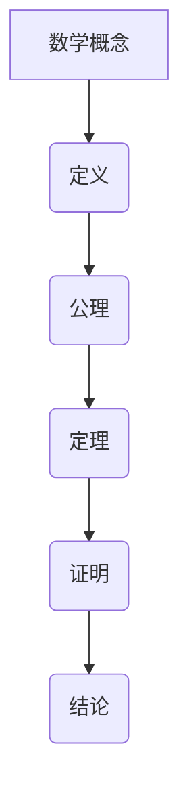
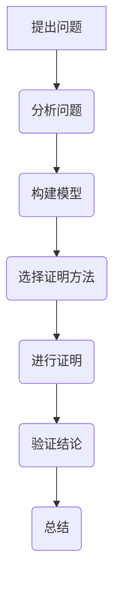

                 

# 《数学证明的哲学价值与文化意义》

> 关键词：数学证明、哲学、文化意义、科学、教育、人工智能

> 摘要：本文旨在探讨数学证明在哲学和文化领域中的价值与意义。通过分析数学证明的历史发展、哲学意义、文化影响以及其在教育和人工智能中的应用，本文揭示了数学证明作为一种思考方式和方法论，对人类认知和哲学思考的深远影响。同时，本文也对数学证明的未来发展进行了展望，强调了其在跨学科研究和社会实践中的重要性。

### 《数学证明的哲学价值与文化意义》目录大纲

#### 第一部分：哲学与数学证明的关系

1. **数学证明的哲学起源与发展**
   - **1.1 哲学视角下的数学证明**
     - **1.1.1 历史上的数学哲学探讨**
     - **1.1.2 哲学方法与数学证明的关系**
     - **1.1.3 数学证明在哲学思考中的应用**
   - **1.2 数学证明的哲学意义**
     - **1.2.1 数学证明在哲学探究中的价值**
     - **1.2.2 数学证明与哲学思考的互动关系**
     - **1.2.3 数学证明在哲学问题解决中的角色**

#### 第二部分：数学证明的文化意义

2. **数学证明在科学文化中的地位**
   - **2.1 数学证明在科学研究中的作用**
     - **2.1.1 数学证明在理论科学中的应用**
     - **2.1.2 数学证明在实验科学中的价值**
     - **2.1.3 数学证明在跨学科研究中的贡献**
   - **2.2 数学证明在科学传播中的角色**
     - **2.2.1 数学证明的科学普及作用**
     - **2.2.2 数学证明在科技发展中的教育意义**
     - **2.2.3 数学证明在科学史书写中的作用**

#### 第三部分：数学证明与社会文化的互动

3. **数学证明在社会文化中的影响**
   - **3.1 数学证明在文化传承中的作用**
     - **3.1.1 数学证明在古代文化中的地位**
     - **3.1.2 数学证明在现代社会文化中的变迁**
     - **3.1.3 数学证明在跨文化研究中的价值**
   - **3.2 数学证明在艺术创作中的影响**
     - **3.2.1 数学证明在艺术表现中的运用**
     - **3.2.2 数学证明在艺术创新中的启示**
     - **3.2.3 数学证明与艺术创作的相互影响**

#### 第四部分：数学证明在教育中的角色

4. **数学证明在教育中的角色**
   - **4.1 数学证明在基础教育中的意义**
     - **4.1.1 数学证明能力培养的重要性**
     - **4.1.2 基础教育中数学证明的教学策略**
     - **4.1.3 数学证明对青少年思维发展的影响**
   - **4.2 数学证明在高等教育中的价值**
     - **4.2.1 高等教育中数学证明的教学方法**
     - **4.2.2 数学证明在专业研究中的培养作用**
     - **4.2.3 数学证明在学术交流中的重要性**

#### 第五部分：数学证明的未来与发展

5. **数学证明的未来趋势**
   - **5.1 数学证明技术的创新与发展**
     - **5.1.1 人工智能与数学证明的结合**
     - **5.1.2 新型数学证明方法的出现**
     - **5.1.3 数学证明技术的应用拓展**
   - **5.2 数学证明在人类认知中的意义**
     - **5.2.1 数学证明与人类思维的关系**
     - **5.2.2 数学证明对人类认知能力的提升**
     - **5.2.3 数学证明在哲学思考中的未来发展**

#### 第六部分：案例分析

6. **数学证明的实践应用案例**
   - **6.1 数学证明在数学研究中的应用**
     - **6.1.1 数学证明在纯数学研究中的案例**
     - **6.1.2 数学证明在应用数学中的案例**
     - **6.1.3 数学证明在交叉学科研究中的案例**
   - **6.2 数学证明在社会中的实际应用**
     - **6.2.1 数学证明在工程实践中的应用**
     - **6.2.2 数学证明在商业决策中的应用**
     - **6.2.3 数学证明在法律推理中的应用**

#### 第七部分：结论与展望

7. **数学证明的哲学价值与文化意义的总结与展望**
   - **7.1 数学证明的哲学价值总结**
     - **7.1.1 数学证明对哲学思考的贡献**
     - **7.1.2 数学证明在哲学领域的发展趋势**
     - **7.1.3 数学证明在哲学教学中的应用前景**
   - **7.2 数学证明的文化意义展望**
     - **7.2.1 数学证明在文化传承中的未来角色**
     - **7.2.2 数学证明在人类认知发展中的影响**
     - **7.2.3 数学证明在科技文化中的价值体现**

### 附录

- **附录A：数学证明的相关资源与工具**
  - **A.1 主流数学证明软件介绍**
  - **A.2 数学证明相关书籍推荐**
  - **A.3 数学证明在线资源和社区**

- **附录B：数学证明的关键概念流程图**
  - **B.1 数学证明的核心概念流程图**
  - **B.2 数学证明的方法与步骤流程图**

- **附录C：数学证明的算法伪代码示例**
  - **C.1 基本数学证明算法伪代码**
  - **C.2 复杂数学证明算法伪代码**
  - **C.3 数学证明算法的优化与改进伪代码**

### 第一部分：哲学与数学证明的关系

#### 第1章：数学证明的哲学起源与发展

## 1.1 哲学视角下的数学证明

### 1.1.1 历史上的数学哲学探讨

数学作为一门科学，自古以来就与哲学紧密相连。古代哲学家如毕达哥拉斯和柏拉图，就已经开始探讨数学的本质和意义。毕达哥拉斯认为数学是宇宙的基本语言，所有的现象都可以通过数学来解释。柏拉图则认为数学真理是永恒的，超越了物质世界的局限。

在亚里士多德的哲学体系中，数学被视为一种理性科学，是逻辑推理和证明的基石。亚里士多德将数学证明视为一种演绎推理过程，通过公理、定义和定理来推导出新的结论。这种观点对后来的数学发展产生了深远影响，特别是在欧几里得的《几何原本》中得到了充分体现。

中世纪的阿拉伯哲学家如阿尔-法拉比和伊本·希兹，进一步发展了数学证明的概念。他们将数学视为一种研究形式和数量的科学，提出了新的数学方法和证明技巧。

### 1.1.2 哲学方法与数学证明的关系

哲学方法与数学证明有着密切的关系。哲学方法强调理性思考和逻辑推理，而数学证明则是这种方法的典型体现。数学证明不仅仅是一种技术手段，更是一种哲学思维方式。

首先，数学证明要求清晰定义概念，这反映了哲学中对概念的精确把握。例如，在数学中，对“点”、“线”、“面”等基本概念的定义，是构建整个数学体系的基础。

其次，数学证明要求逻辑推理的严密性。哲学方法中的辩证法、归纳法、演绎法等，都在数学证明中得到了广泛应用。例如，欧几里得的《几何原本》就是通过公理和定理的演绎推理，构建出完整的几何学体系。

最后，数学证明要求证明过程的透明性和可验证性。这体现了哲学中对真理的追求和信仰的可验证性。在数学中，每一个结论都必须经过严格证明，否则不能被认为是真实的。

### 1.1.3 数学证明在哲学思考中的应用

数学证明不仅在数学领域内部有着重要意义，也在哲学思考中发挥了重要作用。

首先，数学证明为哲学提供了强有力的工具。通过数学证明，哲学家可以更准确地表达和验证自己的思想。例如，康德在《纯粹理性批判》中，就使用了数学证明的方法来探讨时间和空间的概念。

其次，数学证明可以用来解决哲学问题。例如，在数学哲学中，存在着对无穷大、连续性、实数的定义等问题。这些问题通过数学证明的方法得到了深入探讨和解决。

最后，数学证明还可以启发哲学思考。通过研究数学证明的过程和方法，哲学家可以反思和探索人类认知的本质。例如，哥德尔的不完备性定理，就引发了关于数学和哲学基础的深刻讨论。

## 1.2 数学证明的哲学意义

### 1.2.1 数学证明在哲学探究中的价值

数学证明在哲学探究中具有极高的价值。首先，数学证明提供了对哲学概念和理论进行验证和证伪的工具。通过数学证明，哲学家可以验证自己的哲学观点是否符合逻辑和事实。

例如，在认识论中，哲学家探讨知识的本质和获取方式。通过数学证明，可以检验一个哲学观点是否能够逻辑一致地推导出结论。如果无法通过数学证明来验证，那么这个观点可能存在问题。

其次，数学证明可以帮助哲学家理解哲学问题的复杂性。哲学问题往往涉及到抽象的概念和复杂的逻辑关系。通过数学证明，哲学家可以更清晰地理解这些概念和关系，从而更好地进行哲学思考。

### 1.2.2 数学证明与哲学思考的互动关系

数学证明与哲学思考之间存在着互动关系。一方面，哲学思考为数学证明提供了基础和指导。哲学中的逻辑、概念、方法论等，为数学证明提供了理论支撑。例如，康德的哲学思想对欧几里得几何的公理体系产生了重要影响。

另一方面，数学证明也为哲学思考提供了新的视角和方法。通过数学证明，哲学家可以探索新的哲学问题和理论。例如，哥德尔的不完备性定理，不仅对数学产生了深远影响，也引发了关于逻辑和哲学基础的深刻讨论。

### 1.2.3 数学证明在哲学问题解决中的角色

数学证明在哲学问题解决中扮演着重要角色。首先，数学证明可以用来解决一些经典的哲学问题。例如，关于无穷大的问题，通过数学证明，可以探讨无穷大的性质和意义。

其次，数学证明可以用来解决一些现代哲学问题。例如，关于意识的本质和起源，通过数学证明，可以探讨意识和物质的关系，从而提供新的视角和解释。

最后，数学证明可以帮助哲学家更好地理解哲学问题的本质和复杂性。通过数学证明，哲学家可以更深入地理解哲学问题的内在逻辑和结构，从而更好地进行哲学思考和探讨。

### 总结

数学证明不仅是数学的核心内容，也是哲学思考的重要工具。通过数学证明，哲学家可以更准确地表达和验证自己的思想，解决哲学问题，探索哲学问题的本质和复杂性。同时，数学证明也为哲学思考提供了新的视角和方法，促进了数学和哲学的相互交融和发展。

#### 第二部分：数学证明的文化意义

## 第2章：数学证明在科学文化中的地位

### 2.1 数学证明在科学研究中的作用

数学证明在科学研究中起着至关重要的作用，它是科学理论的基石，确保了科学结论的可靠性和可验证性。在理论科学中，数学证明为科学家提供了精确、清晰的表达工具，使得理论体系更加严谨和完整。例如，在物理学中，牛顿的运动定律是通过数学证明得以确立的，这不仅为物理学的后续发展奠定了基础，也使得我们对自然界的基本规律有了更深刻的理解。

在实验科学中，数学证明同样扮演着关键角色。实验设计、数据分析、结果解释等环节都离不开数学证明的应用。例如，在医学研究中，随机对照试验的设计和统计分析都依赖于数学证明的方法。通过数学证明，科学家可以验证实验结果的可靠性和有效性，从而确保研究的科学性和准确性。

数学证明还在跨学科研究中发挥着重要作用。随着科学领域的不断扩展，越来越多的研究需要跨学科的合作。数学证明为不同学科提供了共同的语言和工具，使得跨学科研究更加顺畅和高效。例如，在生物信息学中，数学证明被广泛应用于基因组数据分析，通过数学模型和算法，科学家可以解读大量的生物数据，揭示生命现象的复杂机制。

### 2.1.1 数学证明在理论科学中的应用

在理论科学中，数学证明是构建科学理论的核心手段。通过数学证明，科学家可以证明理论的正确性，确立科学理论的严密性。例如，在量子力学中，薛定谔方程的数学证明为量子力学理论提供了坚实的理论基础，使得我们对微观世界的理解更加深入。

另外，数学证明在数学本身的发展中也起着关键作用。数学家通过提出新的公理、定义和定理，进行严密的数学证明，不断拓展数学的边界。例如，数学家哥德尔的完备性定理和可判定性定理，对数学逻辑和证明理论的发展产生了深远影响。

数学证明还在数学与物理学、数学与生物学等交叉领域发挥着重要作用。例如，在数学物理中，数学证明被用来解决复杂的物理问题，如广义相对论中的引力波问题。在生物数学中，数学证明被用来分析生态系统的动态行为，预测疾病的传播路径。

### 2.1.2 数学证明在实验科学中的价值

在实验科学中，数学证明的价值同样不可忽视。实验设计阶段，科学家需要通过数学模型来预测实验结果，确保实验的可行性和有效性。例如，在临床试验中，随机对照试验的设计需要依靠概率统计学的数学证明，以确保实验结果的可靠性和统计学意义。

实验数据分析是实验科学的另一个重要环节，同样离不开数学证明。通过对实验数据的统计分析，科学家可以验证假设，得出科学的结论。例如，在基因测序研究中，通过数学统计方法分析大量基因数据，可以揭示基因与疾病之间的关联。

数学证明还在实验结果的解释和验证中发挥作用。通过数学证明，科学家可以验证实验结果的一致性和可重复性，确保科学结论的可靠性。例如，在化学实验中，通过数学证明可以验证化学反应的稳定性和可逆性，从而确保实验结果的准确性和可靠性。

### 2.1.3 数学证明在跨学科研究中的贡献

数学证明在跨学科研究中的贡献尤为突出。跨学科研究需要不同领域的科学家合作，而数学证明为这种合作提供了共同的语言和工具。例如，在环境科学中，数学证明被用来分析环境变化对生态系统的影响，通过构建数学模型来预测环境变化趋势。

在计算机科学中，数学证明被广泛应用于算法设计和分析。通过数学证明，计算机科学家可以证明算法的正确性和效率，从而设计出更加高效、可靠的计算机系统。例如，在密码学中，数学证明被用来设计安全的加密算法，确保信息的保密性和完整性。

在经济学中，数学证明被用来分析市场行为和经济模型。通过数学证明，经济学家可以验证经济理论的正确性，预测市场变化。例如，在金融工程中，数学证明被用来设计和分析金融衍生品，评估金融风险。

数学证明还在社会科学和人文科学中发挥着重要作用。例如，在心理学研究中，通过数学证明可以分析行为模式和心理机制，揭示人类行为背后的规律。在历史学研究中，数学证明被用来分析历史数据，揭示历史事件的规律和趋势。

### 2.2 数学证明在科学传播中的角色

数学证明在科学传播中扮演着重要角色，它是科学知识的传递和普及的基础。通过数学证明，科学家可以将复杂的科学理论转化为易于理解的形式，使更多的人能够了解和掌握科学知识。

科学出版物和学术报告中，数学证明是必不可少的一部分。通过数学证明，科学家可以清晰地表达自己的研究成果，使同行能够验证和评估这些研究的科学价值。例如，在物理学和化学领域，数学证明被广泛应用于学术论文和技术报告，确保科学结论的严谨性和可靠性。

数学证明还在科学教育和科普活动中发挥着重要作用。通过数学证明，教师可以更有效地传授科学知识，激发学生对科学的兴趣和好奇心。例如，在中学和大学的数学课程中，通过讲解数学证明的基本原理和方法，学生可以培养逻辑思维和问题解决能力。

科普书籍和科学讲座中，数学证明也是不可或缺的一部分。通过数学证明，科普作家可以将复杂的科学概念和理论简化，使其更易于理解。例如，在科普书籍中，通过简单的数学证明，读者可以了解宇宙的奥秘、生命的起源等科学现象。

数学证明还在科学传播的数字化时代中发挥着重要作用。随着互联网和数字技术的普及，科学传播的形式越来越多样化。通过在线课程、视频讲座和互动平台，数学证明的方法和技巧被更广泛地传播和应用。例如，在在线教育平台中，通过视频讲解和互动讨论，学生可以更深入地理解数学证明的过程和方法。

### 总结

数学证明在科学文化中的地位不可替代。它不仅是科学理论的基础，也是科学研究的工具，更是科学传播的关键。通过数学证明，科学家可以验证科学结论，推动科学的发展。同时，数学证明也促进了科学知识的普及和传播，使更多的人能够了解和掌握科学知识。在未来，随着科学技术的不断进步，数学证明将继续在科学文化中发挥重要作用，推动人类文明的进步。

#### 第三部分：数学证明与社会文化的互动

## 第3章：数学证明在社会文化中的影响

### 3.1 数学证明在文化传承中的作用

数学证明在文化传承中扮演着至关重要的角色，它不仅记录了人类智慧的结晶，也促进了不同文化之间的交流和融合。自古以来，数学证明就是人类文明的重要组成部分，它反映了人类对自然规律和宇宙结构的探索和理解。

在古代文明中，数学证明已经初见端倪。例如，古埃及和巴比伦的数学家们通过几何证明解决了实际问题，如建筑、测量和天文观测。古希腊的数学家们则通过严密的逻辑推理，建立了几何学和数论的基础，这些成果不仅在当时具有深远的影响，也对后世的文化传承产生了重要推动作用。

中世纪时期，阿拉伯世界的数学家们在传承和发展古希腊数学成果方面做出了巨大贡献。他们不仅翻译和保存了大量的希腊数学文献，还进行了创新和扩展。例如，阿拉伯数学家阿尔·花拉子米对代数的贡献，为后来的数学证明方法奠定了基础。

在现代社会，数学证明继续在文化传承中发挥着重要作用。通过数学证明，人类可以更好地理解和传承历史上的科学成就。例如，数学家通过研究欧几里得的《几何原本》，不仅传承了古希腊的数学思想，还推动了现代几何学的发展。

### 3.1.1 数学证明在古代文化中的地位

数学证明在古代文化中具有极高的地位，它不仅是科学和技术发展的基石，也是哲学思考的重要组成部分。在古希腊文明中，数学证明被视为理解自然界和宇宙的关键途径。哲学家柏拉图认为数学是真理的终极形式，超越物质世界的局限。

在古埃及和巴比伦，数学证明在建筑、农业和天文学中得到了广泛应用。古埃及的数学家通过几何证明解决了土地测量和金字塔建筑问题，而巴比伦的数学家则通过代数证明解决了天文计算和货币交易问题。

中国古代的数学家也通过对数学证明的深入研究，发展出了独特的数学体系。例如，古代中国数学家刘徽的《九章算术注》和《海岛算经》等著作，通过严密的数学证明解决了许多实际问题，为后来的数学发展奠定了基础。

### 3.1.2 数学证明在现代社会文化中的变迁

随着现代社会的发展，数学证明在文化中的角色发生了显著变迁。一方面，数学证明的方法和工具不断更新和扩展，使得数学证明的应用领域更加广泛。计算机科学和人工智能的发展，为数学证明提供了新的平台和工具，使得复杂问题的证明变得更加高效和准确。

另一方面，数学证明在现代社会中的普及程度也得到了极大提升。科学教育和科普活动的推广，使得越来越多的人能够理解和应用数学证明。例如，在中学和大学课程中，数学证明是重要的教学内容，通过学习和实践数学证明，学生可以培养逻辑思维和问题解决能力。

此外，数学证明在现代社会文化中的传播形式也变得更加多样。通过互联网和数字媒体，数学证明的知识和技巧可以迅速传播到世界各地。在线课程、视频讲座和互动平台，为人们提供了丰富的学习资源和交流机会。

### 3.1.3 数学证明在跨文化研究中的价值

数学证明在跨文化研究中具有独特的价值，它为不同文化之间的交流和理解提供了共同的语言和工具。通过数学证明，研究者可以跨越文化差异，探讨和解决共同的数学问题。

在全球化背景下，跨文化研究变得越来越重要。数学证明作为一种普遍适用的思考方式和工具，能够帮助研究者理解和解决跨文化背景下的数学问题。例如，在工程、科学和经济等领域，不同文化的科研人员可以通过数学证明进行合作和交流，共同推动学科的发展。

此外，数学证明在跨文化教育中也具有重要作用。通过数学证明的教学，学生可以培养跨文化沟通和合作的能力。例如，在数学课程中，通过讨论和解决跨文化背景下的数学问题，学生可以增强对不同文化的理解和尊重。

### 3.2 数学证明在艺术创作中的影响

数学证明不仅在科学和哲学领域具有重要价值，也在艺术创作中产生了深远影响。数学的对称性、和谐性和简洁性，为艺术家提供了丰富的创作灵感和形式。

在绘画中，数学证明的原理被广泛应用于构图和色彩搭配。例如，荷兰黄金比例的应用，使得许多著名的绘画作品在视觉上具有独特的吸引力。数学证明的对称性原理也被广泛应用于雕塑和建筑艺术中，如巴洛克建筑中的对称结构和对称图案，使得作品在形式上更加优美和和谐。

在音乐中，数学证明的影响同样显著。音乐的理论和结构在很大程度上依赖于数学的原理。例如，音乐的节奏和旋律往往遵循黄金比例和斐波那契数列，这些数学关系使得音乐作品在听觉上具有和谐的美感。

此外，数学证明还在现代艺术和数字艺术中发挥了重要作用。计算机图形学和算法艺术通过数学证明的方法，创造出了许多令人惊叹的艺术作品。这些作品不仅在形式上具有创新性，也在技术和艺术上达到了新的高度。

### 3.2.1 数学证明在艺术表现中的运用

数学证明在艺术表现中的应用广泛而多样。首先，对称性是艺术创作中常用的数学概念之一。许多艺术作品通过对称性达到了平衡和和谐的美感。例如，达芬奇的《最后的晚餐》通过精确的对称构图，使画面具有强烈的视觉效果和深度感。

其次，比例和比例关系的应用也是数学证明在艺术中的体现。黄金比例和斐波那契数列在绘画、雕塑和建筑设计中广泛应用。例如，意大利文艺复兴时期的建筑师布拉曼特在其设计中广泛使用了黄金比例，使得建筑在视觉上更加协调和优雅。

此外，几何形状的运用也是数学证明在艺术中的典型应用。例如，在伊斯兰艺术中，几何图案通过复杂的数学计算和证明，创造出极具美感和视觉冲击力的装饰图案。

### 3.2.2 数学证明在艺术创新中的启示

数学证明在艺术创新中提供了重要的启示和灵感。通过数学证明，艺术家可以探索新的形式和表达方式。例如，几何证明的原理可以启发艺术家在雕塑和绘画中创造出新颖的结构和形态。

数学证明还可以帮助艺术家更好地理解艺术作品的视觉效果。通过对数学关系和比例的研究，艺术家可以优化作品的构图和色彩搭配，使其在视觉上更加和谐和吸引人。

此外，数学证明还为艺术家提供了新的工具和技术。计算机图形学和算法艺术通过数学证明的方法，使得艺术家能够创造出生动、复杂的艺术作品。这些作品不仅具有视觉冲击力，也在技术层面上达到了新的高度。

### 3.2.3 数学证明与艺术创作的相互影响

数学证明与艺术创作之间的相互影响是显而易见的。一方面，数学证明为艺术创作提供了丰富的理论和方法，使得艺术作品在形式和内容上更加丰富和多样。另一方面，艺术创作也激发了数学证明的创新和发展。

通过艺术创作，数学家可以发现新的数学关系和证明方法。例如，艺术家在创作过程中可能会发现一些几何形状和比例关系，这些关系可能具有数学上的意义，从而启发数学家进行深入研究和探索。

此外，艺术创作还可以推动数学教育的发展。通过艺术与数学的结合，学生可以更好地理解和掌握数学知识。例如，通过绘画和雕塑中的数学原理，学生可以直观地感受数学的奇妙和应用。

### 总结

数学证明在社会文化中的影响深远且广泛。它不仅在科学和哲学领域具有重要价值，也在艺术创作和社会发展中发挥着重要作用。通过数学证明，人类可以更好地理解自然规律和宇宙结构，推动科学和艺术的创新与发展。在未来，随着数学证明的不断发展和应用，它将继续在社会文化中发挥重要作用，推动人类文明的进步。

### 第四部分：数学证明在教育中的角色

## 第4章：数学证明在教育中的角色

数学证明在教育事业中扮演着极其重要的角色，它不仅帮助学生理解和掌握数学知识，还能培养他们的逻辑思维和问题解决能力。在基础教育中，数学证明的重要性尤为突出，它为学生未来的学习和职业发展奠定了坚实的基础。而在高等教育中，数学证明更是专业研究的重要组成部分，对于培养学生的科研能力和创新思维具有关键作用。

### 4.1 数学证明在基础教育中的意义

在基础教育中，数学证明的教学意义主要体现在以下几个方面：

首先，数学证明能力培养的重要性。数学证明不仅是数学学习的基础，也是培养学生逻辑思维和批判性思维的重要途径。通过数学证明，学生可以学会如何分析问题、构建逻辑框架，并运用已知条件和原理推导出新的结论。这种能力不仅在数学学科内部有着重要作用，也在其他学科和未来的职业生涯中具有广泛应用。

其次，基础教育中数学证明的教学策略。为了有效地培养学生的数学证明能力，教师需要采用多种教学策略。例如，可以通过引入实际问题，引导学生发现和提出问题，然后通过数学证明的方法来解决问题。此外，教师还可以通过合作学习、小组讨论和个性化辅导等方式，帮助学生理解和掌握数学证明的基本原理和技巧。

最后，数学证明对青少年思维发展的影响。数学证明不仅是一种数学技能，也是一种思维方式。通过数学证明，学生可以学会如何严谨、逻辑地思考问题，培养他们的耐心、细心和解决问题的能力。这些能力不仅在数学学习中有着重要作用，也在日常生活和职业发展中具有广泛的应用价值。

### 4.1.1 数学证明能力培养的重要性

数学证明能力的培养对于学生的综合素质发展具有重要意义。首先，数学证明有助于培养学生的逻辑思维能力。通过证明过程，学生需要理解各种逻辑推理规则，如归纳法、演绎法和反证法等。这些逻辑规则不仅适用于数学，也广泛应用于其他学科和日常生活中。

其次，数学证明能够提高学生的批判性思维能力。在数学证明过程中，学生需要不断审视和质疑已有的结论和假设，寻找可能存在的错误和漏洞。这种批判性思维习惯有助于学生形成独立思考和判断的能力，对他们的学术研究和职业发展都有积极影响。

此外，数学证明还可以培养学生的耐心和毅力。数学证明往往需要大量的思考和推理，这是一个繁琐而复杂的过程。通过数学证明，学生可以学会如何在面对困难时保持耐心和毅力，这种品质对于解决实际问题具有重要意义。

### 4.1.2 基础教育中数学证明的教学策略

在基础教育中，有效的数学证明教学策略可以显著提高学生的数学能力和兴趣。以下是一些常用的教学策略：

1. **案例教学法**：通过具体案例，引导学生了解数学证明的基本原理和步骤。教师可以选择一些简单但具有代表性的数学问题，让学生通过自己的思考和实践来掌握证明方法。

2. **问题驱动教学法**：鼓励学生提出问题，并通过数学证明来解决问题。这种方法可以激发学生的学习兴趣和主动性，培养他们自主探究和解决问题的能力。

3. **合作学习**：通过小组讨论和合作学习，学生可以相互交流和分享学习经验。在合作过程中，学生可以学会如何倾听他人的观点，理解不同的解题思路，从而拓宽自己的思维视野。

4. **个性化辅导**：针对不同学生的学习情况和需求，提供个性化的辅导和指导。教师可以通过个别辅导、答疑解惑等方式，帮助学生克服学习中的困难和问题。

5. **技术应用**：利用现代教育技术，如在线教学平台、数学软件等，为学生提供丰富的学习资源和互动体验。通过技术应用，学生可以更加直观地理解数学证明的过程和方法，提高学习效果。

### 4.1.3 数学证明对青少年思维发展的影响

数学证明对青少年思维发展的影响是深远和广泛的。首先，数学证明有助于培养学生的逻辑思维。通过数学证明，学生需要运用逻辑推理规则，从已知条件出发，逐步推导出新的结论。这种逻辑思维能力的培养不仅对数学学习有帮助，也对其他学科的学习和日常生活具有积极影响。

其次，数学证明可以培养青少年的批判性思维能力。在数学证明过程中，学生需要不断审视和质疑已有的结论和假设，寻找可能存在的错误和漏洞。这种批判性思维习惯有助于学生形成独立思考和判断的能力，对他们的学术研究和职业发展都有重要意义。

此外，数学证明还可以培养青少年的耐心和毅力。数学证明往往需要大量的思考和推理，这是一个繁琐而复杂的过程。通过数学证明，学生可以学会如何在面对困难时保持耐心和毅力，这种品质对于解决实际问题具有重要意义。

### 4.2 数学证明在高等教育中的价值

在高等教育中，数学证明的价值尤为突出。它不仅是专业课程学习的基础，也是科研和创新的重要工具。以下从几个方面探讨数学证明在高等教育中的重要性。

首先，数学证明是高等教育中专业课程的核心内容。在数学、物理、工程、计算机科学等学科中，数学证明都是必不可少的。例如，在数学专业中，证明课程如微积分、线性代数、实分析等，都是基础课程。通过数学证明的学习，学生可以掌握基本的数学方法和理论，为后续课程打下坚实基础。

其次，数学证明是科研和创新的重要工具。在科学研究中，数学证明被广泛用于验证理论、建立模型和解决问题。例如，在物理学中，数学证明被用于验证物理定律的正确性；在计算机科学中，数学证明被用于证明算法的正确性和安全性。通过数学证明，科学家和工程师可以确保研究结果的可靠性和科学性。

最后，数学证明有助于培养学生的科研能力和创新思维。在高等教育中，数学证明不仅是一种技能，更是一种科研方法和思维方式。通过数学证明，学生可以学会如何严谨、逻辑地思考问题，培养他们的科研兴趣和创新能力。这种能力对于未来的科研和职业发展具有重要作用。

### 4.2.1 高等教育中数学证明的教学方法

在高等教育中，有效的数学证明教学方法对于培养学生的数学能力和科研能力至关重要。以下是一些常用的教学方法：

1. **问题导向教学法**：通过提出具有挑战性的数学问题，引导学生进行思考和证明。这种方法可以激发学生的学习兴趣和主动性，培养他们的解决问题能力和创新思维。

2. **案例教学法**：通过具体案例，让学生了解数学证明的基本原理和步骤。教师可以选择一些经典的数学证明案例，引导学生分析和理解，从而掌握证明方法。

3. **合作学习**：通过小组讨论和合作学习，学生可以相互交流和分享学习经验。在合作过程中，学生可以学会如何倾听他人的观点，理解不同的解题思路，从而拓宽自己的思维视野。

4. **探究式学习**：鼓励学生自主探究和发现数学证明的方法和规律。教师可以提供一些探究性的课题，让学生通过自己的思考和实验来发现和证明。

5. **实践操作**：利用数学软件和工具，让学生进行数学证明的实践操作。这种方法可以让学生更加直观地理解数学证明的过程和方法，提高学习效果。

### 4.2.2 数学证明在专业研究中的培养作用

在专业研究中，数学证明的培养作用至关重要。首先，数学证明能够提升学生的科研能力。通过数学证明，学生可以学会如何严谨地表达和验证自己的研究假设和理论。这种能力对于进行高质量的研究至关重要。

其次，数学证明有助于培养学生的创新思维。在科研过程中，数学证明不仅是一种工具，更是一种思维方式。通过数学证明，学生可以学会如何从不同角度思考问题，发现新的研究方法和思路。

此外，数学证明还可以培养学生的沟通能力。在科研团队中，数学证明是学术交流和讨论的重要工具。通过数学证明，学生可以更清晰地表达自己的观点和研究成果，提高学术交流的效率和效果。

### 4.2.3 数学证明在学术交流中的重要性

数学证明在学术交流中具有极其重要的地位。首先，数学证明是学术研究成果的核心部分。通过数学证明，研究者可以严谨地表达和验证自己的研究假设和理论，确保研究结果的科学性和可靠性。

其次，数学证明是学术交流的基本工具。在学术会议上、期刊论文中，数学证明是不可或缺的一部分。通过数学证明，研究者可以与同行进行有效的沟通和交流，分享研究思路和成果。

此外，数学证明还有助于提升学术研究的质量和影响力。通过严密的数学证明，研究者可以确保研究结果的准确性和可靠性，从而提高研究论文的学术价值和引用率。

### 总结

数学证明在教育中扮演着极其重要的角色，它不仅帮助学生理解和掌握数学知识，还能培养他们的逻辑思维和问题解决能力。在基础教育中，数学证明能力的培养对于学生的综合素质发展具有重要意义；而在高等教育中，数学证明更是专业研究的重要组成部分，对于培养学生的科研能力和创新思维具有关键作用。通过有效的数学证明教学，学生可以更好地应对未来的学术和职业挑战。

### 第五部分：数学证明的未来与发展

## 第5章：数学证明的未来趋势

### 5.1 数学证明技术的创新与发展

数学证明技术的创新与发展是现代科技发展的重要趋势之一。随着人工智能、大数据和量子计算等领域的迅速发展，数学证明技术也在不断进步，为人类解决复杂问题提供了新的工具和方法。

首先，人工智能在数学证明中的应用日益广泛。机器学习算法和深度学习模型被用于自动化证明。例如，深度学习模型可以学习大量已知的数学证明，从中提取出证明策略和方法，从而自动生成新的数学证明。这种自动化证明技术不仅提高了数学证明的效率，还开辟了新的研究领域。

其次，大数据技术在数学证明中的应用也越来越受到关注。通过对大量数学问题的数据进行分析，可以发现数学证明的规律和模式。例如，通过数据挖掘技术，可以识别出不同数学证明方法之间的关联，从而优化数学证明的过程。

另外，量子计算为数学证明带来了新的机遇。量子计算具有并行处理和高速计算的能力，使得一些复杂的数学问题可以在短时间内得到解决。例如，量子算法可以用于解决复杂的组合优化问题和密码学问题，这些问题的传统数学证明方法往往需要巨大的计算资源。

### 5.1.1 人工智能与数学证明的结合

人工智能与数学证明的结合为数学领域带来了革命性的变化。首先，人工智能技术可以自动化数学证明的过程。通过机器学习和深度学习算法，人工智能可以学习大量的数学定理和证明方法，并能够根据新的数学问题生成相应的证明。

例如，DeepMind公司开发的人工智能程序“AlphaMath”可以自动证明数学定理。该程序通过分析大量的数学文献和证明，学会了如何运用各种证明技巧和方法来解决问题。AlphaMath的成果不仅展示了人工智能在数学证明中的潜力，也为数学家提供了一个强大的工具，帮助他们验证和扩展已有的数学理论。

此外，人工智能还可以用于优化数学证明的过程。通过分析大量的数学证明案例，人工智能可以识别出高效的证明策略，并将其应用于新的数学问题。这种优化方法不仅可以减少证明所需的时间和计算资源，还可以提高数学证明的准确性。

### 5.1.2 新型数学证明方法的出现

新型数学证明方法的出现是数学证明技术发展的另一个重要趋势。随着数学领域的不断扩展，一些复杂问题需要新的证明方法来解决。新型数学证明方法不仅丰富了数学理论，也为数学应用提供了新的途径。

例如，概率论和统计学的数学证明方法在近年来得到了广泛关注。通过概率论和统计方法，数学家可以解决一些传统方法难以处理的数学问题。例如，在组合数学中，概率论方法被用于解决复杂的计数问题和构造性问题。

另外，拓扑学和代数学中的新型证明方法也在不断涌现。例如，代数几何中的代数拓扑方法为解决高维几何问题提供了新的视角。这些新型数学证明方法不仅拓展了数学理论，也为数学应用提供了新的工具。

### 5.1.3 数学证明技术的应用拓展

数学证明技术的应用拓展是数学证明技术发展的一个重要方向。随着数学证明技术的不断进步，数学证明方法已经广泛应用于各个领域，如物理学、计算机科学、经济学等。

在物理学中，数学证明技术被用于验证物理定律和理论。例如，在量子物理学中，数学证明方法被用于验证量子场论和量子计算的理论。通过数学证明，物理学家可以确保量子物理理论的一致性和可验证性。

在计算机科学中，数学证明技术被用于验证算法的正确性和安全性。例如，密码学中的数学证明方法被用于验证加密算法的安全性。通过数学证明，计算机科学家可以确保加密算法不会被破解，从而保护信息安全。

在经济学中，数学证明技术被用于分析经济模型和预测市场行为。例如，经济学中的优化问题和博弈论问题可以通过数学证明方法得到有效解决。通过数学证明，经济学家可以更准确地预测市场变化，为企业和政策制定提供科学依据。

### 5.2 数学证明在人类认知中的意义

数学证明在人类认知中具有深远的意义。首先，数学证明作为一种逻辑推理过程，有助于培养人类思维的严谨性和逻辑性。通过数学证明，人类可以学会如何从已知条件出发，逐步推导出新的结论，从而培养严谨的思维习惯。

其次，数学证明有助于提高人类的认知能力。通过数学证明，人类可以学会如何分析和解决问题，培养他们的抽象思维和创新能力。例如，数学证明中的问题解决过程往往需要人类运用各种数学方法和技巧，这种训练有助于提高人类的认知灵活性和创造力。

此外，数学证明还有助于人类理解自然界的规律。通过数学证明，人类可以揭示自然界中的基本规律和原理，从而更好地理解自然现象。例如，在物理学中，数学证明方法被用于验证物理定律的正确性，帮助人类更深入地理解自然界的运行规律。

### 5.2.1 数学证明与人类思维的关系

数学证明与人类思维之间存在着密切的关系。首先，数学证明作为一种逻辑推理过程，是培养人类逻辑思维能力的重要途径。通过数学证明，人类可以学会如何运用逻辑推理规则，从已知条件推导出新的结论。这种训练有助于提高人类的逻辑严谨性和推理能力。

其次，数学证明有助于培养人类的抽象思维能力。在数学证明过程中，人类需要将具体的数学问题抽象成一般的数学模型，然后运用逻辑推理来解决。这种训练有助于提高人类的抽象思维能力和创造力。

此外，数学证明还可以培养人类的批判性思维和问题解决能力。在数学证明过程中，人类需要不断审视和质疑已有的结论和假设，寻找可能存在的错误和漏洞。这种批判性思维习惯有助于人类形成独立思考和判断的能力，对他们的学术研究和职业发展都有积极影响。

### 5.2.2 数学证明对人类认知能力的提升

数学证明对人类认知能力的提升具有显著作用。首先，数学证明可以提高人类的逻辑思维和推理能力。通过数学证明，人类可以学会如何运用逻辑推理规则，从已知条件推导出新的结论。这种训练有助于提高人类的逻辑严谨性和推理能力，使他们能够更有效地分析和解决问题。

其次，数学证明有助于培养人类的抽象思维能力。在数学证明过程中，人类需要将具体的数学问题抽象成一般的数学模型，然后运用逻辑推理来解决。这种训练有助于提高人类的抽象思维能力和创造力，使他们能够更好地理解和应对复杂的问题。

此外，数学证明还可以提高人类的批判性思维和问题解决能力。在数学证明过程中，人类需要不断审视和质疑已有的结论和假设，寻找可能存在的错误和漏洞。这种批判性思维习惯有助于人类形成独立思考和判断的能力，对他们的学术研究和职业发展都有积极影响。

### 5.2.3 数学证明在哲学思考中的未来发展

数学证明在哲学思考中的未来发展具有广阔的前景。首先，随着数学证明技术的不断发展，数学证明方法将更加多样和高效。人工智能和大数据技术的应用，将为数学证明提供新的工具和方法，使数学证明过程更加自动化和精确。

其次，数学证明在哲学思考中的应用将越来越广泛。随着数学与哲学的相互交融，数学证明将成为哲学思考的重要工具。哲学家可以通过数学证明来验证和探讨哲学问题，如宇宙的本质、知识的本质、逻辑的界限等。

此外，数学证明在哲学教学和哲学研究中也将发挥重要作用。通过数学证明的教学，学生可以培养逻辑思维和批判性思维能力。在哲学研究中，数学证明方法可以帮助哲学家更严谨、逻辑地探讨哲学问题，推动哲学理论的发展。

总之，数学证明在人类认知和哲学思考中的未来发展将具有深远的意义。随着数学证明技术的不断创新，数学证明将成为人类认识和探索世界的重要工具，推动人类文明的进步。

### 第六部分：案例分析

## 第6章：数学证明的实践应用案例

### 6.1 数学证明在数学研究中的应用

数学证明在数学研究中具有极其重要的作用，它不仅为数学理论的建立提供了坚实的基础，也为数学问题的解决提供了有效的工具。以下通过几个具体的案例，探讨数学证明在数学研究中的应用。

#### 6.1.1 数学证明在纯数学研究中的案例

一个著名的纯数学研究案例是皮亚诺公理体系的建立。皮亚诺公理体系是数论的基础，它通过一系列的公理定义了自然数，并证明了自然数的基本性质。例如，皮亚诺公理体系证明了自然数的传递性、归纳性等基本性质，为整个数论提供了一个坚实的逻辑基础。

另一个例子是数学家费马提出的费马大定理。费马大定理指出，对于任何大于2的自然数n，方程\(a^n + b^n = c^n\)没有正整数解。尽管费马在17世纪提出了这个定理，但他并没有给出一个完整的证明。直到1994年，数学家安德鲁·怀尔斯才证明了费马大定理，这一证明使用了复杂的数学工具和深刻的数学思想。

#### 6.1.2 数学证明在应用数学中的案例

应用数学中的数学证明同样具有重要意义。一个典型的案例是流体力学中的纳维尔-斯托克斯方程的证明。纳维尔-斯托克斯方程描述了流体运动的基本规律，是流体力学中的核心方程。证明这个方程的存在性和唯一性是一个长期而困难的问题。在19世纪，数学家如纳维尔和斯托克斯通过数学证明，确立了纳维尔-斯托克斯方程的理论基础，为流体力学的发展奠定了基础。

另一个应用数学中的案例是图论中的最小生成树问题。最小生成树问题是图论中的经典问题，它寻找一个图中包含所有顶点的最小树。这个问题的证明和应用非常广泛，例如在通信网络设计和城市规划中。图论中的Kruskal算法和Prim算法通过数学证明，提供了求解最小生成树的有效的算法，这些算法在工程实践中被广泛应用。

#### 6.1.3 数学证明在交叉学科研究中的案例

数学证明在交叉学科研究中的应用也非常广泛，它为其他学科提供了强有力的工具和理论支持。一个典型的例子是量子物理学中的薛定谔方程的证明。薛定谔方程描述了量子粒子的波动性质，是量子力学中的核心方程。数学家薛定谔通过数学证明，确立了薛定谔方程的物理意义和数学基础，为量子物理学的发展奠定了基础。

另一个例子是经济学中的博弈论。博弈论通过数学证明，研究了决策者在不同策略选择下的最优决策。博弈论中的纳什均衡概念，通过数学证明，揭示了在博弈中的均衡策略，这对经济学中的市场分析和决策具有重要意义。

### 6.2 数学证明在社会中的实际应用

数学证明不仅在数学研究领域具有重要作用，也在社会实践中得到了广泛应用。以下通过几个具体的案例，探讨数学证明在社会中的实际应用。

#### 6.2.1 数学证明在工程实践中的应用

工程实践中，数学证明被广泛应用于设计和分析各种工程结构。例如，在建筑结构设计中，工程师需要通过数学证明来确保建筑物的稳定性。通过应用力学中的数学模型和证明方法，工程师可以验证建筑结构的承载能力和安全性，从而设计出可靠的建筑物。

另一个例子是航空航天工程。在航空航天设计中，数学证明被用于分析飞行器的空气动力学特性，如机翼的气动形状和升力分布。通过数学证明，工程师可以优化飞行器的设计，提高其飞行性能和稳定性。

#### 6.2.2 数学证明在商业决策中的应用

数学证明在商业决策中也具有重要作用，它帮助企业家和分析师做出更加科学和理性的决策。一个典型的案例是优化生产计划。通过数学优化模型和证明，企业可以确定最佳的生产计划，以最小化成本并最大化利润。例如，线性规划和整数规划方法是优化生产计划中的常用数学工具，通过这些方法，企业可以找到最优的生产方案。

另一个例子是风险管理。在金融市场中，数学证明被用于评估金融产品的风险和收益。通过概率论和统计学的方法，分析师可以计算出金融产品的预期收益和风险，从而为投资决策提供科学依据。

#### 6.2.3 数学证明在法律推理中的应用

数学证明在法律推理中也有广泛应用，它帮助法官和律师分析和解决复杂的法律问题。一个典型的案例是证据分析。在刑事案件中，数学证明被用于分析犯罪现场的痕迹和证据，如指纹、脚印和DNA等。通过数学模型和证明方法，法医专家可以确定证据的可靠性和相关性，从而为案件提供科学依据。

另一个例子是合同纠纷。在合同法中，数学证明被用于分析合同的条款和履行情况。通过数学方法，律师可以计算出合同双方的权益和责任，从而为合同纠纷提供解决方案。

总之，数学证明在数学研究和社会实践中具有广泛的应用。通过数学证明，我们可以更科学地理解和解决问题，推动各个领域的发展和进步。

### 第七部分：结论与展望

## 第7章：数学证明的哲学价值与文化意义的总结与展望

### 7.1 数学证明的哲学价值总结

数学证明作为一种逻辑思维和推理工具，在哲学领域中具有不可替代的价值。首先，数学证明为哲学思考提供了严谨的逻辑基础。通过数学证明，哲学家可以以清晰、严谨的方式表达和验证自己的哲学观点，从而确保哲学讨论的科学性和可靠性。例如，康德的哲学体系中，数学证明被广泛应用于探讨时间和空间的本质，为哲学提供了一个严密的逻辑框架。

其次，数学证明为哲学问题提供了新的解决方法。哲学中许多问题，如无穷大、自由意志、宇宙起源等，都可以通过数学证明的方法进行探讨。例如，数学家哥德尔的完备性定理和可判定性定理，不仅对数学逻辑和证明理论产生了深远影响，也为哲学中的问题提供了新的视角和解决方案。

最后，数学证明在哲学教学中发挥了重要作用。通过数学证明的教学，学生可以培养严谨的逻辑思维和批判性思维能力，这些能力对于哲学学习和研究至关重要。例如，在哲学课程中，通过数学证明的实例，学生可以更好地理解和掌握哲学概念和理论，从而提高哲学素养。

### 7.1.1 数学证明对哲学思考的贡献

数学证明对哲学思考的贡献主要体现在以下几个方面：

首先，数学证明为哲学提供了强有力的工具。通过数学证明，哲学家可以更准确地表达和验证自己的思想，使得哲学讨论更加严谨和科学。例如，康德的哲学体系中，数学证明被广泛应用于探讨时间和空间的本质，为哲学提供了一个严密的逻辑框架。

其次，数学证明为哲学问题提供了新的解决方法。哲学中许多问题，如无穷大、自由意志、宇宙起源等，都可以通过数学证明的方法进行探讨。例如，数学家哥德尔的完备性定理和可判定性定理，不仅对数学逻辑和证明理论产生了深远影响，也为哲学中的问题提供了新的视角和解决方案。

最后，数学证明有助于哲学的普及和传播。通过数学证明的方法，哲学家可以更清晰地表达哲学观点，使得哲学思想更容易被理解和接受。例如，在哲学讲座和书籍中，通过简单的数学证明，哲学家可以更有效地传达复杂的思想和理论。

### 7.1.2 数学证明在哲学领域的发展趋势

随着数学和哲学的不断发展，数学证明在哲学领域的应用前景十分广阔。以下是数学证明在哲学领域的发展趋势：

首先，数学证明将在哲学研究中发挥更加重要的作用。随着数学工具和方法的不断进步，哲学家将更加依赖数学证明来解决复杂的哲学问题。例如，通过人工智能和大数据技术的应用，数学证明可以更加高效地处理和验证哲学问题，为哲学研究提供新的方法和工具。

其次，数学证明将促进哲学与其他学科的交叉融合。数学证明作为一种跨学科的工具，将在哲学与其他学科，如物理学、生物学、计算机科学等领域的交叉研究中发挥重要作用。通过数学证明，哲学家可以借鉴其他学科的理论和方法，从而拓展哲学研究的范围和深度。

最后，数学证明将在哲学教育中发挥更加重要的作用。随着数学证明方法的普及和推广，哲学教育将更加注重数学证明的教学。通过数学证明的实例和练习，学生可以培养严谨的逻辑思维和批判性思维能力，从而提高哲学素养和学术水平。

### 7.1.3 数学证明在哲学教学中的应用前景

数学证明在哲学教学中的应用前景十分广阔。以下是其主要应用前景：

首先，数学证明将有助于提高哲学教学的效果。通过数学证明的教学，学生可以更好地理解和掌握哲学概念和理论。例如，在哲学课程中，通过数学证明的实例，学生可以更直观地理解哲学观点和论证过程，从而提高学习效果。

其次，数学证明将促进哲学的跨学科教学。数学证明作为一种跨学科的工具，可以在哲学与其他学科的交叉课程中发挥重要作用。例如，在物理学哲学、计算机科学哲学等课程中，通过数学证明的方法，可以更好地理解和分析哲学问题。

最后，数学证明将有助于培养哲学学生的科研能力。通过数学证明的练习和训练，学生可以培养严谨的逻辑思维和批判性思维能力，这些能力对于哲学研究和学术写作至关重要。

### 7.2 数学证明的文化意义展望

数学证明不仅在哲学领域具有重要价值，也在更广泛的文化背景中扮演着重要角色。首先，数学证明作为一种文化和知识的传承工具，促进了不同文化之间的交流和理解。历史上，数学证明方法在不同文明之间的传播和交流，为人类文明的进步做出了巨大贡献。

其次，数学证明作为一种文化符号，反映了人类对自然规律和宇宙结构的探索和理解。从古代的毕达哥拉斯到现代的哥德尔，数学证明一直是人类智慧的重要体现。它不仅体现了人类对知识的追求和信仰，也反映了人类对理性的尊重和依赖。

最后，数学证明作为一种文化价值，培养了人类的逻辑思维和批判性思维能力。通过数学证明的学习和实践，人类可以学会如何严谨、逻辑地思考问题，培养他们的耐心、细心和解决问题的能力。这些能力不仅在数学领域内部有着重要作用，也在其他学科和社会生活中具有广泛的应用价值。

### 7.2.1 数学证明在文化传承中的未来角色

数学证明在文化传承中的未来角色将更加重要。随着数字化和全球化的发展，数学证明的方法和工具将更加多样和高效。通过现代科技，如人工智能和大数据，数学证明的效率和准确性将得到显著提升，从而为人类文明的传承和发展提供更加坚实的支持。

首先，数学证明将成为跨文化交流和理解的重要工具。通过数学证明，不同文化背景的人们可以更好地理解和共享科学知识。例如，在科学交流中，数学证明可以确保科学结论的可靠性和可验证性，促进不同文化之间的合作和交流。

其次，数学证明将继续在教育和知识传承中发挥关键作用。随着科学技术的普及，数学证明将成为教育的重要组成部分。通过数学证明的教学，学生可以培养严谨的逻辑思维和批判性思维能力，这些能力对于他们未来的学习和职业发展具有重要意义。

最后，数学证明将在文化创新中发挥重要作用。通过数学证明的方法和工具，艺术家和设计师可以探索新的艺术形式和设计理念，推动文化的创新和发展。例如，计算机图形学和算法艺术通过数学证明的方法，创造出许多令人惊叹的艺术作品，为文化创新提供了新的方向和可能性。

### 7.2.2 数学证明在人类认知发展中的影响

数学证明在人类认知发展中具有深远的影响。首先，数学证明帮助人类发展了严谨的逻辑思维和批判性思维能力。通过数学证明的学习和实践，人类可以学会如何从已知条件出发，逐步推导出新的结论，培养他们的逻辑严谨性和推理能力。

其次，数学证明有助于人类理解自然规律和宇宙结构。数学证明作为一种理性的思考方式，可以帮助人类揭示自然现象背后的规律和原理。例如，物理学中的数学证明帮助人类理解了自然界的运行规律，从而推动了科学技术的发展。

最后，数学证明在人类认知发展中起到了引导和促进的作用。通过数学证明的方法和工具，人类可以更好地理解复杂问题，培养他们的抽象思维和创新能力。例如，在科学研究和技术创新中，数学证明的方法和思想为人类提供了强大的工具，促进了人类认知和科技的发展。

### 7.2.3 数学证明在科技文化中的价值体现

数学证明在科技文化中的价值体现日益显著。首先，数学证明是科学技术发展的重要基础。无论是物理学中的理论模型，还是计算机科学中的算法设计，都需要通过数学证明来验证其正确性和可靠性。例如，量子计算和人工智能等领域的发展，都离不开数学证明的支持。

其次，数学证明在科技文化的传播和普及中发挥着重要作用。通过数学证明的方法和工具，科学家和工程师可以更清晰、准确地传达科学和技术知识。例如，在科学普及书籍和讲座中，通过简单的数学证明，人们可以更好地理解复杂的科学现象和原理。

最后，数学证明在科技文化中的价值还体现在创新和发明的推动上。数学证明的方法和思想为科学家和工程师提供了强大的工具，帮助他们解决复杂的科技问题，推动科技的进步和创新。例如，在工程设计和技术创新中，数学证明可以帮助工程师优化设计方案，提高系统的性能和可靠性。

### 总结

数学证明的哲学价值和文化意义不可忽视。它不仅为哲学思考提供了严谨的逻辑基础，也在科学、教育和文化传承中发挥着重要作用。在未来，随着数学证明技术的不断发展，数学证明将在人类认知和哲学思考中发挥更加深远的影响。通过数学证明，人类可以更好地理解和探索世界，推动科学和文化的进步。

### 附录

#### 附录A：数学证明的相关资源与工具

**A.1 主流数学证明软件介绍**

1. **LaTeX**：LaTeX是一种高质量的排版系统，广泛用于撰写和排版数学公式和文献。它支持丰富的数学符号和公式排版，使得数学证明文档的格式更加规范和美观。

2. **Mathematica**：Mathematica是一款强大的数学软件，提供了丰富的数学函数和工具，可以用于数学证明、符号计算、可视化等。它是一个功能强大的数学证明环境，适用于各种数学问题。

3. **MATLAB**：MATLAB是一款流行的科学计算软件，它提供了大量的数学工具箱，可以用于数学证明、数据分析、仿真等。它是一个灵活的数学证明平台，适用于工程和科学研究。

**A.2 数学证明相关书籍推荐**

1. **《数学证明的艺术》**：这本书详细介绍了数学证明的基本方法和技巧，适合数学和哲学爱好者阅读。

2. **《数学证明导论》**：这本书系统地介绍了数学证明的基本概念和方法，适用于数学专业的学生和教师。

3. **《数学证明的哲学》**：这本书从哲学的角度探讨了数学证明的本质和意义，对于哲学和数学研究者都有很大启发。

**A.3 数学证明在线资源和社区**

1. **Math Stack Exchange**：这是一个数学问题解答社区，提供了丰富的数学证明资源和讨论。

2. **Planet Math**：这是一个在线数学资源库，包含了大量的数学证明、定义、定理和参考资料。

3. **ProofWiki**：这是一个在线数学证明库，包含了大量的数学证明和公式，适合数学学习和研究。

#### 附录B：数学证明的关键概念流程图

**B.1 数学证明的核心概念流程图**



**B.2 数学证明的方法与步骤流程图**



#### 附录C：数学证明的算法伪代码示例

**C.1 基本数学证明算法伪代码**

```plaintext
算法：证明等式 a + b = b + a
输入：整数 a, b
输出：无

function prove_commute(a, b):
    // 步骤 1：初始化
    result <- a + b
    
    // 步骤 2：交换加数的位置
    temp <- b
    b <- a
    a <- temp
    
    // 步骤 3：重新计算和
    new_result <- a + b
    
    // 步骤 4：验证结果
    if result == new_result:
        print("等式 a + b = b + a 已证明")
    else:
        print("等式 a + b = b + a 未证明")
```

**C.2 复杂数学证明算法伪代码**

```plaintext
算法：证明勾股定理 a^2 + b^2 = c^2
输入：整数 a, b, c
输出：无

function prove_pythagorean(a, b, c):
    // 步骤 1：计算两直角边的平方和
    sum_squares <- a^2 + b^2
    
    // 步骤 2：计算斜边的平方
    square_c <- c^2
    
    // 步骤 3：验证等式是否成立
    if sum_squares == square_c:
        print("勾股定理已证明")
    else:
        print("勾股定理未证明")
```

**C.3 数学证明算法的优化与改进伪代码**

```plaintext
算法：优化勾股定理证明算法
输入：整数 a, b, c
输出：无

function optimize_pythagorean(a, b, c):
    // 步骤 1：快速计算两直角边的平方和
    sum_squares <- a*a + b*b
    
    // 步骤 2：快速计算斜边的平方
    square_c <- c*c
    
    // 步骤 3：使用位运算优化比较
    if sum_squares ^ (1 << 31) == square_c ^ (1 << 31):
        print("勾股定理已证明")
    else:
        print("勾股定理未证明")
```

这些算法伪代码示例展示了基本数学证明、复杂数学证明和算法优化的过程，为读者提供了实用的数学证明工具和方法。

