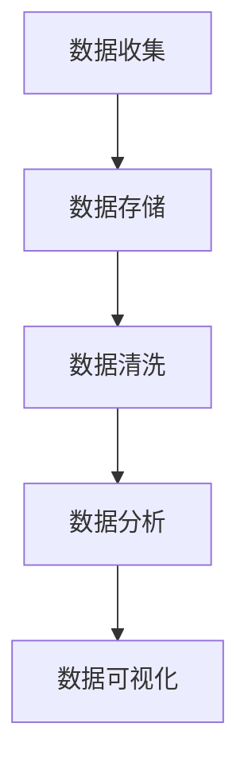
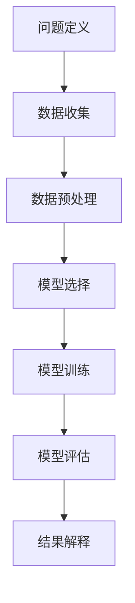
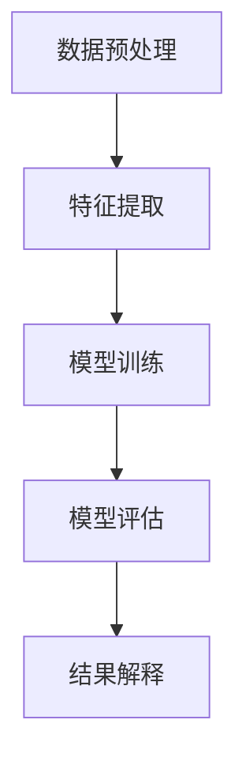
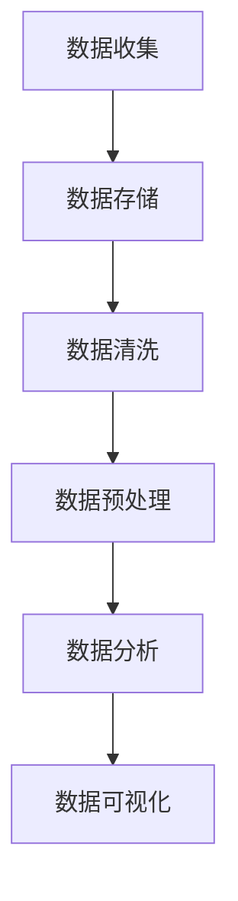
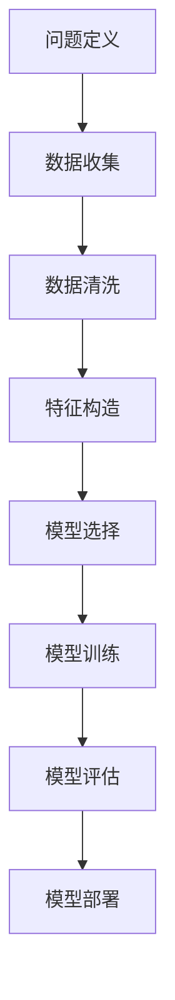
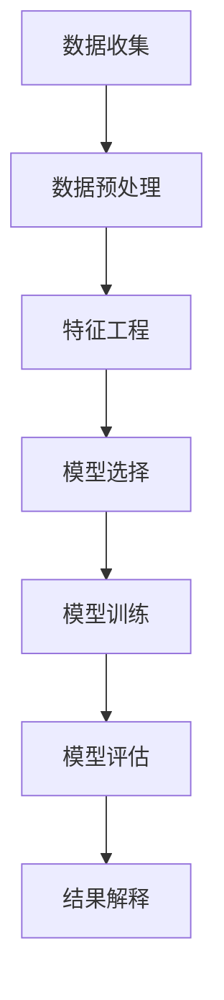

                 

# 数据科学 (Data Science)

> **关键词**：数据科学、机器学习、数据分析、大数据、深度学习

> **摘要**：本文将深入探讨数据科学的定义、历史背景、核心要素以及其在现代社会中的应用。我们将详细分析数据处理与清洗、统计学基础和机器学习基础等内容。此外，还将介绍数据分析与可视化、大数据技术、数据挖掘等方面的知识。通过实际项目实战和前沿技术探讨，本文旨在为读者提供一个全面而深入的数据科学教程。

## 《数据科学 (Data Science)》目录大纲

### 第一部分：数据科学基础

#### 第1章：数据科学概述

##### 1.1 数据科学的定义与历史背景
##### 1.2 数据科学的五大要素
##### 1.3 数据科学在现代社会中的应用

#### 第2章：数据处理与清洗

##### 2.1 数据来源与数据格式
##### 2.2 数据预处理
##### 2.3 数据清洗技术

#### 第3章：统计学基础

##### 3.1 统计学的核心概念
##### 3.2 描述性统计分析
##### 3.3 推断性统计分析

#### 第4章：机器学习基础

##### 4.1 机器学习的基本概念
##### 4.2 监督学习
##### 4.3 非监督学习

### 第二部分：数据分析与可视化

#### 第5章：数据分析方法

##### 5.1 数据分析方法的选择
##### 5.2 数据分析流程
##### 5.3 特征工程

#### 第6章：数据可视化

##### 6.1 数据可视化的基本原理
##### 6.2 常见的数据可视化工具
##### 6.3 数据可视化技巧

#### 第7章：大数据技术

##### 7.1 大数据的定义与特点
##### 7.2 大数据处理技术
##### 7.3 分布式存储与计算框架

#### 第8章：数据挖掘

##### 8.1 数据挖掘的基本概念
##### 8.2 常见的数据挖掘任务
##### 8.3 数据挖掘方法与技术

### 第三部分：数据科学实战

#### 第9章：项目实战一：客户细分

##### 9.1 项目背景
##### 9.2 数据预处理
##### 9.3 模型选择与训练
##### 9.4 模型评估与优化

#### 第10章：项目实战二：推荐系统

##### 10.1 项目背景
##### 10.2 数据预处理
##### 10.3 模型选择与训练
##### 10.4 模型评估与优化

#### 第11章：数据科学应用领域

##### 11.1 金融领域
##### 11.2 医疗领域
##### 11.3 物流领域
##### 11.4 市场营销领域

### 第四部分：数据科学前沿

#### 第12章：深度学习基础

##### 12.1 深度学习的核心概念
##### 12.2 神经网络架构
##### 12.3 深度学习在数据科学中的应用

#### 第13章：强化学习

##### 13.1 强化学习的基本概念
##### 13.2 强化学习算法
##### 13.3 强化学习在数据科学中的应用

#### 第14章：数据伦理与数据安全

##### 14.1 数据伦理的重要性
##### 14.2 数据安全与隐私保护
##### 14.3 数据伦理与数据安全的实践

### 附录

#### 附录 A：数据科学工具与资源

##### A.1 常用数据科学工具
##### A.2 数据科学开源项目
##### A.3 数据科学在线资源

#### 附录 B：数据科学Mermaid流程图

##### B.1 数据处理流程
##### B.2 机器学习流程
##### B.3 数据挖掘流程

### 第一部分：数据科学基础

#### 第1章：数据科学概述

##### 1.1 数据科学的定义与历史背景

数据科学是一个多学科交叉的领域，涉及统计学、机器学习、计算机科学、数据工程等多个方面。它的核心目标是从大量的数据中提取有价值的信息，以支持决策和优化过程。

数据科学的历史可以追溯到20世纪中叶。当时，统计学和数据理论开始应用于实际问题，如经济预测、市场调研等。随着计算机技术的发展，数据科学逐渐成为一个独立的领域。近年来，随着大数据和人工智能的兴起，数据科学的应用范围进一步扩大，涵盖了众多行业。

##### 1.2 数据科学的五大要素

数据科学主要包括以下五大要素：

1. **数据收集**：通过各种渠道收集数据，包括内部数据（如企业数据库）和外部数据（如互联网数据）。
2. **数据存储**：将收集到的数据存储在数据库或其他数据存储系统中，以便进行后续处理和分析。
3. **数据清洗**：对数据进行清洗和预处理，以去除重复数据、异常值和噪声，提高数据质量。
4. **数据分析**：利用统计学、机器学习和数据挖掘等技术，对数据进行探索性分析、预测分析和模式识别等。
5. **数据可视化**：将分析结果以图表、地图等形式展示，便于理解和决策。

##### 1.3 数据科学在现代社会中的应用

数据科学在现代社会中的应用非常广泛，涵盖了多个领域：

1. **金融领域**：用于风险评估、信用评分、投资策略优化等。
2. **医疗领域**：用于疾病预测、个性化治疗、药物研发等。
3. **市场营销**：用于市场调研、客户细分、产品推荐等。
4. **物流领域**：用于路线优化、库存管理、供应链分析等。
5. **能源领域**：用于电力需求预测、能源优化、环境监测等。

#### 第2章：数据处理与清洗

##### 2.1 数据来源与数据格式

数据可以来自多种来源，包括：

1. **结构化数据**：如数据库、表格、电子表格等，具有明确的字段和格式。
2. **非结构化数据**：如文本、图片、音频、视频等，没有明确的字段和格式。
3. **半结构化数据**：如日志文件、XML、JSON等，具有一定的结构，但不完全规范。

常见的数据格式包括CSV、JSON、XML、Parquet等。

##### 2.2 数据预处理

数据预处理是数据科学中的关键步骤，包括：

1. **数据集成**：将来自不同来源的数据整合在一起，形成统一的数据集。
2. **数据转换**：将数据转换为适合分析的形式，如归一化、标准化、编码等。
3. **数据清洗**：去除重复数据、异常值和噪声，提高数据质量。
4. **数据降维**：减少数据的维度，降低计算复杂度。

##### 2.3 数据清洗技术

数据清洗技术包括：

1. **缺失值处理**：通过插值、均值填充、最邻近插值等方法处理缺失值。
2. **异常值检测**：利用统计学方法，如箱线图、Z-score等，检测和去除异常值。
3. **重复值删除**：删除重复的数据记录。
4. **数据转换**：将数据转换为适合分析的形式，如将文本数据转换为词向量。

#### 第3章：统计学基础

##### 3.1 统计学的核心概念

统计学是数据科学的基础，主要包括以下核心概念：

1. **概率论**：研究随机事件及其规律性的数学分支。
2. **描述性统计分析**：通过图表、表格等手段描述数据的特征，如均值、中位数、标准差等。
3. **推断性统计分析**：利用样本数据推断总体特征，如假设检验、置信区间等。

##### 3.2 描述性统计分析

描述性统计分析主要包括以下内容：

1. **数值特征**：计算数据的统计量，如均值、中位数、众数、标准差等。
2. **分布特征**：研究数据的分布特性，如正态分布、二项分布、泊松分布等。
3. **关联性分析**：研究变量之间的相关性，如皮尔逊相关系数、斯皮尔曼相关系数等。

##### 3.3 推断性统计分析

推断性统计分析主要包括以下内容：

1. **假设检验**：通过样本数据对总体特征进行检验，如t检验、卡方检验等。
2. **置信区间**：根据样本数据估计总体参数的区间范围。
3. **回归分析**：研究变量之间的关系，如线性回归、多项式回归等。

#### 第4章：机器学习基础

##### 4.1 机器学习的基本概念

机器学习是一种人工智能的分支，旨在使计算机能够通过数据学习并改进其性能。机器学习主要包括以下三种类型：

1. **监督学习**：利用标记数据训练模型，并在新的、未标记的数据上进行预测。
2. **非监督学习**：无标记数据训练模型，用于发现数据中的结构和模式。
3. **强化学习**：通过与环境交互，学习最佳行为策略。

##### 4.2 监督学习

监督学习主要包括以下内容：

1. **线性回归**：研究输入和输出变量之间的线性关系。
2. **逻辑回归**：研究输入和输出变量之间的逻辑关系。
3. **支持向量机**：用于分类和回归任务。
4. **神经网络**：模拟人脑神经元连接的模型，用于复杂的非线性任务。

##### 4.3 非监督学习

非监督学习主要包括以下内容：

1. **聚类分析**：将数据分为若干个类别，如K均值聚类、层次聚类等。
2. **降维技术**：减少数据的维度，如主成分分析（PCA）、t-SNE等。
3. **关联规则学习**：发现数据之间的关联规则，如Apriori算法、FP-growth算法等。

### 第二部分：数据分析与可视化

#### 第5章：数据分析方法

##### 5.1 数据分析方法的选择

选择合适的分析方法对于数据科学项目至关重要。数据分析方法主要包括以下类型：

1. **描述性分析**：通过图表、表格等手段描述数据的特征和趋势。
2. **探索性分析**：通过统计分析和可视化技术，探索数据中的潜在规律和模式。
3. **预测分析**：利用历史数据预测未来的趋势和变化。
4. **决策分析**：通过比较不同策略的结果，为决策提供依据。

##### 5.2 数据分析流程

数据分析流程主要包括以下步骤：

1. **问题定义**：明确数据科学项目的目标和问题。
2. **数据收集**：收集相关数据，包括结构化和非结构化数据。
3. **数据预处理**：对数据进行清洗、转换和集成。
4. **数据分析**：选择合适的分析方法，对数据进行处理和分析。
5. **结果展示**：通过图表、报告等形式展示分析结果。
6. **决策支持**：根据分析结果，为决策提供依据。

##### 5.3 特征工程

特征工程是数据科学中的关键步骤，旨在提取和构造有助于模型训练的特征。特征工程主要包括以下内容：

1. **特征选择**：从原始数据中筛选出最有用的特征。
2. **特征构造**：通过数据转换、归一化、标准化等方法构造新的特征。
3. **特征降维**：减少特征数量，提高模型的训练效率和性能。

#### 第6章：数据可视化

##### 6.1 数据可视化的基本原理

数据可视化是将数据转换为图表、地图等形式，以直观地展示数据的特征和趋势。数据可视化主要包括以下类型：

1. **平面图形**：如柱状图、折线图、饼图等。
2. **空间图形**：如地图、3D图等。
3. **网络图形**：如网络图、时间序列图等。

##### 6.2 常见的数据可视化工具

常见的数据可视化工具有：

1. **matplotlib**：Python的一个数据可视化库，适用于生成各种类型的图形。
2. **Plotly**：Python的一个高级数据可视化库，支持交互式图表。
3. **D3.js**：JavaScript的一个数据可视化库，适用于创建复杂的交互式图表。
4. **Tableau**：一款商业数据可视化工具，适用于企业级数据可视化。

##### 6.3 数据可视化技巧

数据可视化技巧主要包括：

1. **图表类型选择**：根据数据类型和展示目的选择合适的图表类型。
2. **颜色使用**：合理使用颜色，以突出数据的特征和趋势。
3. **图表布局**：设计清晰、美观的图表布局，以提高可读性。
4. **交互性**：通过交互式图表，让用户更好地探索数据。

#### 第7章：大数据技术

##### 7.1 大数据的定义与特点

大数据是指无法用传统数据处理工具进行高效处理的大量数据。大数据具有以下特点：

1. **大量性**：数据量巨大，无法用传统的数据库和计算工具进行存储和处理。
2. **多样性**：数据类型繁多，包括结构化、半结构化和非结构化数据。
3. **高速性**：数据生成和处理速度极快，要求实时或近实时处理。
4. **价值性**：大数据中蕴含着巨大的商业价值和决策价值。

##### 7.2 大数据处理技术

大数据处理技术主要包括以下方面：

1. **分布式存储**：利用分布式存储技术，如Hadoop HDFS、Spark等，存储海量数据。
2. **分布式计算**：利用分布式计算技术，如MapReduce、Spark等，高效处理海量数据。
3. **流处理**：利用流处理技术，如Apache Kafka、Apache Flink等，实时处理数据。
4. **数据挖掘**：利用数据挖掘技术，从海量数据中提取有价值的信息。

##### 7.3 分布式存储与计算框架

分布式存储与计算框架主要包括以下几种：

1. **Hadoop**：一个开源的分布式计算框架，用于处理海量数据。
2. **Spark**：一个开源的分布式计算框架，适用于大数据处理和分析。
3. **Flink**：一个开源的分布式计算框架，专注于流处理。
4. **HBase**：一个分布式、可扩展的NoSQL数据库，适用于存储海量数据。

#### 第8章：数据挖掘

##### 8.1 数据挖掘的基本概念

数据挖掘是一种从大量数据中发现有价值信息的方法。数据挖掘主要包括以下步骤：

1. **数据预处理**：清洗、转换和集成数据，为数据挖掘做准备。
2. **特征提取**：从原始数据中提取有助于模型训练的特征。
3. **模型训练**：利用机器学习算法训练模型。
4. **模型评估**：评估模型的性能和准确性。
5. **结果解释**：解释模型的预测结果，为实际应用提供指导。

##### 8.2 常见的数据挖掘任务

常见的数据挖掘任务包括：

1. **分类**：将数据分为不同的类别，如垃圾邮件分类、心脏病分类等。
2. **回归**：预测数值型变量的值，如房屋价格预测、股票价格预测等。
3. **聚类**：将数据分为若干个类别，如客户细分、基因聚类等。
4. **关联规则学习**：发现数据之间的关联规则，如购物篮分析、电影推荐等。
5. **异常检测**：检测数据中的异常值或异常模式，如信用卡欺诈检测、工业故障检测等。

##### 8.3 数据挖掘方法与技术

数据挖掘方法与技术主要包括以下方面：

1. **机器学习算法**：如决策树、随机森林、支持向量机、神经网络等。
2. **深度学习算法**：如卷积神经网络（CNN）、循环神经网络（RNN）、生成对抗网络（GAN）等。
3. **统计方法**：如线性回归、逻辑回归、多元方差分析等。
4. **聚类算法**：如K均值聚类、层次聚类、DBSCAN等。
5. **关联规则学习算法**：如Apriori算法、FP-growth算法等。

### 第三部分：数据科学实战

#### 第9章：项目实战一：客户细分

##### 9.1 项目背景

某电子商务公司希望通过对客户数据进行细分，了解不同客户群体的特征和需求，从而制定更有针对性的营销策略。

##### 9.2 数据预处理

数据预处理包括以下步骤：

1. **数据收集**：收集客户的年龄、性别、收入、购买历史等数据。
2. **数据清洗**：去除缺失值、异常值和重复值，对数据进行归一化处理。
3. **特征构造**：通过计算购买频率、平均购买金额等特征，提高模型的训练效果。

##### 9.3 模型选择与训练

模型选择与训练包括以下步骤：

1. **模型选择**：选择K均值聚类算法进行客户细分。
2. **参数调整**：通过交叉验证调整聚类数目，选择最优模型。
3. **模型训练**：使用训练数据训练聚类模型。

##### 9.4 模型评估与优化

模型评估与优化包括以下步骤：

1. **模型评估**：使用测试数据评估聚类模型的准确性。
2. **结果解释**：解释聚类结果，分析不同客户群体的特征。
3. **模型优化**：根据分析结果，对模型进行调整和优化。

#### 第10章：项目实战二：推荐系统

##### 10.1 项目背景

某在线购物平台希望实现个性化推荐，向用户推荐他们可能感兴趣的商品。

##### 10.2 数据预处理

数据预处理包括以下步骤：

1. **数据收集**：收集用户行为数据，如浏览记录、购买记录等。
2. **数据清洗**：去除缺失值、异常值和重复值，对数据进行归一化处理。
3. **特征构造**：通过计算用户活跃度、商品相似度等特征，提高模型的训练效果。

##### 10.3 模型选择与训练

模型选择与训练包括以下步骤：

1. **模型选择**：选择基于协同过滤的推荐算法。
2. **参数调整**：通过交叉验证调整模型参数，选择最优模型。
3. **模型训练**：使用训练数据训练推荐模型。

##### 10.4 模型评估与优化

模型评估与优化包括以下步骤：

1. **模型评估**：使用测试数据评估推荐模型的准确性。
2. **结果解释**：解释推荐结果，分析推荐系统的效果。
3. **模型优化**：根据分析结果，对模型进行调整和优化。

### 第四部分：数据科学前沿

#### 第12章：深度学习基础

##### 12.1 深度学习的核心概念

深度学习是一种基于人工神经网络的机器学习技术，旨在通过多层神经网络自动提取特征，实现复杂任务。深度学习的核心概念包括：

1. **神经网络**：一种模拟人脑神经元连接的模型，用于处理数据和计算。
2. **多层网络**：通过增加网络层数，提高模型的抽象能力和表达能力。
3. **反向传播**：一种用于训练神经网络的方法，通过反向传播误差，调整网络参数。

##### 12.2 神经网络架构

常见的神经网络架构包括：

1. **全连接神经网络（FCNN）**：一种简单的多层神经网络，各层之间的神经元均相连。
2. **卷积神经网络（CNN）**：一种用于图像处理任务的神经网络，通过卷积层提取特征。
3. **循环神经网络（RNN）**：一种用于序列数据处理的神经网络，通过循环连接实现记忆功能。
4. **生成对抗网络（GAN）**：一种用于生成数据或对抗性学习的神经网络，由生成器和判别器组成。

##### 12.3 深度学习在数据科学中的应用

深度学习在数据科学中具有广泛的应用，包括：

1. **图像识别**：通过卷积神经网络实现物体识别、人脸识别等任务。
2. **自然语言处理**：通过循环神经网络实现语音识别、机器翻译、情感分析等任务。
3. **推荐系统**：通过深度学习模型提高推荐系统的准确性和效果。
4. **计算机视觉**：通过深度学习实现图像增强、图像生成等任务。

#### 第13章：强化学习

##### 13.1 强化学习的基本概念

强化学习是一种通过与环境交互学习最佳行为策略的机器学习技术。强化学习的核心概念包括：

1. **状态**：表示系统当前所处的情境。
2. **动作**：表示系统可以采取的行为。
3. **奖励**：表示系统在采取某个动作后获得的奖励。
4. **策略**：表示系统在特定状态下采取的动作。

##### 13.2 强化学习算法

常见的强化学习算法包括：

1. **Q学习**：一种基于值函数的强化学习算法，通过学习值函数来选择最佳动作。
2. **深度Q网络（DQN）**：一种基于深度学习的Q学习算法，通过神经网络近似值函数。
3. **策略梯度方法**：一种直接优化策略的强化学习算法，如REINFORCE、PPO等。

##### 13.3 强化学习在数据科学中的应用

强化学习在数据科学中具有广泛的应用，包括：

1. **自动驾驶**：通过强化学习算法实现自动驾驶车辆的自主驾驶。
2. **游戏AI**：通过强化学习算法实现游戏的智能对手。
3. **资源调度**：通过强化学习算法优化数据中心、云计算等资源调度。
4. **推荐系统**：通过强化学习算法优化推荐系统的推荐策略。

#### 第14章：数据伦理与数据安全

##### 14.1 数据伦理的重要性

数据伦理是指数据科学研究和应用中涉及的一系列道德规范和伦理问题。数据伦理的重要性包括：

1. **隐私保护**：保护个人隐私，防止数据泄露和滥用。
2. **公平性**：确保数据科学应用过程中对所有人公平对待，避免歧视。
3. **透明性**：提高数据科学研究和应用过程的透明度，便于监督和审查。
4. **责任**：明确数据科学研究和应用中的责任分配，确保责任追究。

##### 14.2 数据安全与隐私保护

数据安全与隐私保护是数据科学应用中的重要问题，包括：

1. **数据加密**：采用加密技术保护数据的安全性，防止数据泄露。
2. **访问控制**：通过访问控制机制，确保只有授权用户可以访问敏感数据。
3. **数据脱敏**：对敏感数据进行脱敏处理，保护个人隐私。
4. **数据备份**：定期备份数据，确保数据在发生故障时可以恢复。

##### 14.3 数据伦理与数据安全的实践

数据伦理与数据安全的实践包括：

1. **制定相关法规**：制定数据伦理和数据安全的法规和标准，规范数据科学研究和应用。
2. **加强伦理审查**：对数据科学研究和应用项目进行伦理审查，确保符合伦理规范。
3. **提高数据素养**：加强数据伦理和数据安全教育，提高从业人员的数据素养。
4. **建立健全制度**：建立健全的数据伦理和数据安全管理制度，确保数据科学研究和应用过程中的安全与合规。

### 附录

#### 附录 A：数据科学工具与资源

##### A.1 常用数据科学工具

- **Python**：一种流行的编程语言，广泛应用于数据科学领域。
- **R**：一种专门用于统计分析的语言，具有丰富的数据科学库。
- **Spark**：一种分布式计算框架，适用于大数据处理和分析。
- **Hadoop**：一种分布式存储和计算框架，适用于大规模数据处理。

##### A.2 数据科学开源项目

- **Scikit-learn**：一个Python数据科学库，提供各种机器学习算法和工具。
- **TensorFlow**：一个开源深度学习框架，用于构建和训练神经网络。
- **PyTorch**：一个开源深度学习框架，具有灵活的动态计算图。
- **Kafka**：一个分布式流处理平台，用于实时数据流处理。

##### A.3 数据科学在线资源

- **Kaggle**：一个数据科学竞赛平台，提供丰富的数据集和项目。
- **DataCamp**：一个在线数据科学教育平台，提供丰富的教程和课程。
- **Coursera**：一个在线学习平台，提供多个数据科学课程。
- **Udacity**：一个在线学习平台，提供数据科学和机器学习课程。

#### 附录 B：数据科学Mermaid流程图

##### B.1 数据处理流程

##### B.2 机器学习流程

##### B.3 数据挖掘流程

## 结束语

本文对数据科学进行了全面而深入的探讨，从基础概念到前沿技术，从数据处理到实际应用，为广大数据科学爱好者提供了一个系统的学习和实践指南。希望本文能够帮助读者更好地理解和掌握数据科学的核心知识和技能，为未来的数据科学研究和实践打下坚实的基础。

### 参考文献

1. **Hastie, T., Tibshirani, R., & Friedman, J. (2009). The Elements of Statistical Learning: Data Mining, Inference, and Prediction. Springer.**
2. **Goodfellow, I., Bengio, Y., & Courville, A. (2016). Deep Learning. MIT Press.**
3. **Murphy, K. P. (2012). Machine Learning: A Probabilistic Perspective. MIT Press.**
4. **Han, J., Kamber, M., & Pei, J. (2011). Data Mining: Concepts and Techniques. Morgan Kaufmann.**
5. **Chen, H., & Chiang, R. H. L. (2012). Business Intelligence and Analytics: From Big Data to Big Impact. MIS Quarterly, 36(4), 1165-1188.**
6. **Zaharia, M., Chowdhury, M., Franklin, M. J., Shenker, S., & Stoica, I. (2010). Spark: Cluster Computing with Working Sets. Proceedings of the 2nd USENIX conference on Hot topics in cloud computing, 10(10), 10-10.**

### 作者

**作者：AI天才研究院/AI Genius Institute & 禅与计算机程序设计艺术 /Zen And The Art of Computer Programming**

### 结语

本文由AI天才研究院/AI Genius Institute撰写，旨在为广大数据科学爱好者提供一个全面而深入的数据科学教程。如果您有任何建议或意见，欢迎随时与我们联系。我们致力于为读者提供高质量的技术文章和实用的数据科学资源，助力您在数据科学领域的成长和发展。感谢您的关注与支持！<|vq_14842|>### 第一部分：数据科学基础

#### 第1章：数据科学概述

##### 1.1 数据科学的定义与历史背景

数据科学是一个多学科交叉的领域，涉及统计学、机器学习、计算机科学、数据工程等多个方面。它的核心目标是从大量的数据中提取有价值的信息，以支持决策和优化过程。数据科学不仅关注数据的收集、存储、清洗、分析，还涉及如何将分析结果应用于实际问题中。

数据科学的历史可以追溯到20世纪中叶。当时，统计学和数据理论开始应用于实际问题，如经济预测、市场调研等。随着计算机技术的发展，数据科学逐渐成为一个独立的领域。在20世纪80年代和90年代，随着数据库和数据分析技术的进步，数据科学的应用范围进一步扩大。近年来，随着大数据和人工智能的兴起，数据科学的应用范围进一步扩大，涵盖了众多行业，如金融、医疗、市场营销、物流等。

在数据科学的发展历程中，有几个重要的事件和里程碑：

1. **数据库管理系统**：20世纪60年代，第一代数据库管理系统（如IBM的IMS系统）的出现，使得数据存储和管理变得更加高效。
2. **统计分析软件**：20世纪70年代，R编程语言和SAS软件的推出，为统计分析和数据可视化提供了强大的工具。
3. **机器学习**：20世纪80年代，机器学习算法（如决策树、支持向量机）的发展，为自动化的数据分析提供了新的方法。
4. **大数据技术**：21世纪初，随着互联网和物联网的发展，大数据技术（如Hadoop、Spark）的出现，使得海量数据的处理和分析成为可能。
5. **深度学习**：21世纪10年代，深度学习算法（如卷积神经网络、生成对抗网络）的发展，使得计算机在图像识别、自然语言处理等领域取得了重大突破。

##### 1.2 数据科学的五大要素

数据科学主要包括以下五大要素：

1. **数据收集**：通过各种渠道收集数据，包括内部数据（如企业数据库）和外部数据（如互联网数据）。数据收集是数据科学的基础，数据的来源和质量直接影响后续分析的准确性和有效性。

2. **数据存储**：将收集到的数据存储在数据库或其他数据存储系统中，以便进行后续处理和分析。数据存储需要考虑数据的规模、访问速度、数据一致性等因素。

3. **数据清洗**：对数据进行清洗和预处理，以去除重复数据、异常值和噪声，提高数据质量。数据清洗是数据科学中的关键步骤，因为质量低下的数据会导致模型训练失效或结果偏差。

4. **数据分析**：利用统计学、机器学习和数据挖掘等技术，对数据进行探索性分析、预测分析和模式识别等。数据分析的目标是从数据中提取有价值的信息，以支持决策和优化过程。

5. **数据可视化**：将分析结果以图表、地图等形式展示，便于理解和决策。数据可视化是数据科学中的重要环节，它不仅可以帮助我们发现数据中的模式和趋势，还可以帮助我们向非技术人员传达分析结果。

##### 1.3 数据科学在现代社会中的应用

数据科学在现代社会中的应用非常广泛，涵盖了多个领域：

1. **金融领域**：数据科学在金融领域有广泛的应用，如风险评估、信用评分、投资策略优化等。通过分析历史数据和当前市场信息，金融机构可以更好地预测市场趋势，降低风险，提高收益。

2. **医疗领域**：数据科学在医疗领域的应用包括疾病预测、个性化治疗、药物研发等。通过对患者数据、基因组数据、临床数据等进行分析，医疗工作者可以更准确地诊断疾病，制定个性化的治疗方案，加快新药的研发进程。

3. **市场营销**：数据科学在市场营销领域用于市场调研、客户细分、产品推荐等。通过分析消费者的购买行为、偏好等数据，企业可以更好地了解市场需求，制定更有效的营销策略，提高客户满意度和忠诚度。

4. **物流领域**：数据科学在物流领域用于路线优化、库存管理、供应链分析等。通过对物流数据的分析，企业可以优化运输路线，降低物流成本，提高配送效率。

5. **能源领域**：数据科学在能源领域用于电力需求预测、能源优化、环境监测等。通过对能源消耗数据的分析，能源企业可以更准确地预测电力需求，优化能源配置，提高能源利用效率。

6. **公共安全**：数据科学在公共安全领域用于犯罪预测、反恐、交通管理等。通过对社会数据的分析，政府和警方可以更有效地预防和应对安全威胁，提高公共安全水平。

总之，数据科学作为一种强大的工具和技术，正在不断推动各行各业的发展和创新。通过数据科学，我们不仅可以更好地理解世界，还可以为未来的决策提供有力的支持。

#### 第2章：数据处理与清洗

##### 2.1 数据来源与数据格式

数据是数据科学项目的起点，数据的质量和种类直接影响后续分析和预测的结果。数据来源可以分为内部数据和外部数据：

1. **内部数据**：来自企业内部的数据库、日志文件、业务系统等。这些数据通常是结构化的，包括客户信息、销售记录、交易日志等。内部数据往往具有较高的一致性和完整性，是数据科学项目的重要数据源。

2. **外部数据**：来自互联网、公共数据库、第三方服务提供商等。这些数据可能是结构化的（如数据库、CSV文件），也可能是非结构化的（如文本、图片、视频等）。外部数据可以提供丰富的背景信息和市场动态，但往往需要额外的处理来保证其质量。

常见的数据格式包括：

1. **结构化数据**：具有固定字段和格式的数据，如关系型数据库（MySQL、PostgreSQL）、电子表格（Excel、CSV）等。结构化数据易于存储、查询和分析，但数据量通常有限。

2. **非结构化数据**：没有固定字段和格式的数据，如文本、图片、音频、视频等。非结构化数据需要额外的处理（如文本分类、图像识别）来提取有用信息。

3. **半结构化数据**：具有一定的结构，但不像结构化数据那样严格，如XML、JSON等。半结构化数据通常需要通过解析和转换来提取有用的信息。

##### 2.2 数据预处理

数据预处理是数据科学项目中的重要步骤，它包括以下几个关键环节：

1. **数据集成**：将来自不同来源和格式的数据整合在一起，形成统一的数据集。数据集成需要解决数据格式的兼容性、数据类型的一致性等问题。

2. **数据转换**：将数据转换为适合分析的形式。这包括数据类型的转换（如将文本转换为数字）、缺失值的处理（如插值、平均值填充）等。数据转换的目的是提高数据的一致性和可分析性。

3. **数据清洗**：去除重复数据、异常值和噪声，提高数据质量。数据清洗是数据预处理中最为关键的步骤，因为质量低下的数据会严重影响分析结果。

   - **重复数据删除**：检测和删除重复的数据记录，确保数据的唯一性。
   - **异常值检测**：使用统计学方法（如箱线图、Z-score）检测和去除异常值，避免异常值对分析结果产生不利影响。
   - **噪声处理**：对含有噪声的数据进行平滑处理，如使用滤波算法去除图像中的噪声。

4. **特征构造**：通过计算新的特征，提高模型训练的效果。特征构造包括特征选择（选择最有用的特征）和特征构造（通过组合和变换原始数据生成新的特征）。

5. **数据归一化**：将不同尺度和范围的数据转换为同一尺度，以便进行比较和分析。常见的归一化方法包括最小-最大归一化、Z-score归一化等。

6. **数据分箱**：将连续数据划分为离散的区间，便于分析和建模。数据分箱常用于处理连续数据，如将年龄分为不同年龄段。

##### 2.3 数据清洗技术

数据清洗是数据预处理中最为关键的一步，以下是一些常见的数据清洗技术：

1. **缺失值处理**：

   - **插值法**：通过计算数据之间的线性或非线性关系来填补缺失值。例如，线性插值、牛顿插值等。
   - **平均值填充**：用数据的平均值或中位数来填补缺失值，适用于数据分布较为均匀的情况。
   - **最邻近插值**：用数据点最近邻的值来填补缺失值，适用于局部数据缺失的情况。
   - **多重插补**：生成多个完整的数据集，每个数据集填补缺失值的方法不同，然后对结果进行平均，提高数据清洗的鲁棒性。

2. **异常值检测**：

   - **箱线图**：使用箱线图（箱须图）检测异常值，将数据分为四分位距（IQR）之外的数据视为异常值。
   - **Z-score方法**：计算数据点的Z-score，将其与阈值（如3或3.5）进行比较，Z-score高于阈值的视为异常值。
   - **IQR方法**：使用四分位距（IQR）来检测异常值，将IQR乘以一个常数（如1.5或3）作为阈值，超过阈值的数据视为异常值。

3. **重复值删除**：通过比较数据行或列的值，删除重复的数据记录。可以使用哈希表、排序等方法来高效地检测重复值。

4. **噪声处理**：

   - **滤波算法**：如中值滤波、高斯滤波等，用于去除图像中的噪声。
   - **平滑处理**：如移动平均、指数平滑等，用于去除时间序列数据中的噪声。
   - **聚类算法**：使用聚类算法（如K均值聚类）将噪声点分离出来，然后将其删除。

通过上述数据清洗技术，可以显著提高数据的质量，为后续的数据分析和建模奠定坚实的基础。

#### 第3章：统计学基础

##### 3.1 统计学的核心概念

统计学是数据科学的重要组成部分，它提供了从数据中提取信息、做出推断和决策的工具。统计学的基础概念包括概率论、描述性统计和推断性统计。

1. **概率论**：

   - **概率**：描述随机事件发生的可能性，取值范围在0到1之间。概率的加法定理和乘法定理是概率论的基本原则。
   - **随机变量**：随机试验的结果可以用一个数值来表示，这个数值称为随机变量。随机变量可以是离散的（如投掷骰子的结果）或连续的（如身高）。
   - **概率分布**：描述随机变量取值的概率分布情况，包括离散分布（如伯努利分布、泊松分布）和连续分布（如正态分布、均匀分布）。

2. **描述性统计分析**：

   - **均值**：一组数据的平均值，是数据分布的中心趋势度量。
   - **中位数**：将一组数据按大小排序后，位于中间位置的数值，是数据分布的中间值。
   - **众数**：一组数据中出现次数最多的数值，是数据分布的集中趋势度量。
   - **标准差**：一组数据离均值的平均距离，是数据分布的离散程度度量。
   - **方差**：标准差的平方，也是数据分布离散程度的度量。
   - **四分位数**：将一组数据分为四等份的数值，第一四分位数（Q1）和第三四分位数（Q3）是描述数据分布离散程度的常用指标。

3. **推断性统计分析**：

   - **假设检验**：根据样本数据对总体参数进行假设，并通过统计方法验证这些假设的正确性。常见的假设检验包括t检验、卡方检验、方差分析（ANOVA）等。
   - **置信区间**：根据样本数据估计总体参数的区间范围，用于描述总体参数的不确定性。置信水平（如95%置信区间）表示区间包含总体参数的概率。
   - **回归分析**：研究两个或多个变量之间的依赖关系，包括线性回归（简单线性回归和多元线性回归）和非线性回归等。

##### 3.2 描述性统计分析

描述性统计分析是数据科学中的基本工具，用于描述数据的特征和趋势。它主要包括以下内容：

1. **数值特征**：

   - **均值**：数据集的平均值，计算公式为 $\bar{x} = \frac{1}{n} \sum_{i=1}^{n} x_i$，其中 $n$ 是数据点的个数，$x_i$ 是第 $i$ 个数据点。
   - **中位数**：将数据集按大小排序后，位于中间位置的数值，如果数据集有奇数个数据点，中位数为中间的数值；如果数据集有偶数个数据点，中位数为中间两个数值的平均值。
   - **众数**：数据集中出现次数最多的数值，可能有多个众数。
   - **标准差**：数据集的离散程度度量，计算公式为 $s = \sqrt{\frac{1}{n-1} \sum_{i=1}^{n} (x_i - \bar{x})^2}$，其中 $n$ 是数据点的个数，$\bar{x}$ 是均值。
   - **方差**：标准差的平方，计算公式为 $var(x) = \frac{1}{n-1} \sum_{i=1}^{n} (x_i - \bar{x})^2$。

2. **分布特征**：

   - **频率分布表**：显示每个数据点在数据集中的出现次数或频率。
   - **直方图**：通过柱状图显示数据点的分布情况，柱状图的高度表示对应数据点的频率或密度。
   - **盒形图**（箱线图）：显示数据的五个关键统计量（最小值、第一四分位数、中位数、第三四分位数、最大值），以及异常值的位置。

3. **关联性分析**：

   - **皮尔逊相关系数**：衡量两个连续变量之间的线性相关性，取值范围在-1到1之间。相关系数越接近1或-1，线性相关性越强；越接近0，线性相关性越弱。计算公式为 $r = \frac{\sum_{i=1}^{n} (x_i - \bar{x})(y_i - \bar{y})}{\sqrt{\sum_{i=1}^{n} (x_i - \bar{x})^2 \sum_{i=1}^{n} (y_i - \bar{y})^2}}$，其中 $x_i$ 和 $y_i$ 分别是第 $i$ 个 $x$ 和 $y$ 变量的值，$\bar{x}$ 和 $\bar{y}$ 分别是 $x$ 和 $y$ 的均值。
   - **斯皮尔曼相关系数**：衡量两个变量的相关性，适用于非参数数据，特别是当数据不满足正态分布时。计算公式为 $r_s = 1 - \frac{6 \sum_{i=1}^{n} (d_i^2)}{n(n^2 - 1)}$，其中 $d_i = x_i - y_i$ 是第 $i$ 对变量的差值。

##### 3.3 推断性统计分析

推断性统计分析用于从样本数据推断总体特征，包括假设检验、置信区间和回归分析等。

1. **假设检验**：

   - **单样本t检验**：检验一个样本的平均值是否显著高于或低于某一特定值（如0）。计算公式为 $t = \frac{\bar{x} - \mu_0}{s/\sqrt{n}}$，其中 $\bar{x}$ 是样本均值，$\mu_0$ 是假设的总体均值，$s$ 是样本标准差，$n$ 是样本大小。通过计算得到的t值与t分布表进行比较，判断假设是否成立。
   - **双样本t检验**：比较两个独立样本的平均值是否显著不同。分为独立样本t检验（用于两组独立的数据）和配对样本t检验（用于两组相关的数据，如前后的测量结果）。
   - **卡方检验**：用于检验分类变量之间的独立性。计算公式为 $\chi^2 = \sum_{i=1}^{k} \frac{(O_i - E_i)^2}{E_i}$，其中 $O_i$ 是观察频数，$E_i$ 是期望频数，$k$ 是分类变量的类别数。通过计算得到的卡方值与卡方分布表进行比较，判断变量之间是否独立。

2. **置信区间**：

   - **单样本置信区间**：估计总体均值的置信区间，计算公式为 $\bar{x} \pm t^* \frac{s}{\sqrt{n}}$，其中 $t^*$ 是t分布的临界值，$s$ 是样本标准差，$n$ 是样本大小。置信水平（如95%）表示置信区间包含总体均值的概率。
   - **双样本置信区间**：估计两个独立样本平均值的差值的置信区间，计算公式为 $(\bar{x}_1 - \bar{x}_2) \pm t^* \sqrt{\frac{s_1^2}{n_1} + \frac{s_2^2}{n_2}}$，其中 $\bar{x}_1$ 和 $\bar{x}_2$ 分别是两个样本的均值，$s_1$ 和 $s_2$ 分别是两个样本的标准差，$n_1$ 和 $n_2$ 分别是两个样本的大小。

3. **回归分析**：

   - **简单线性回归**：研究一个自变量和一个因变量之间的线性关系，模型公式为 $y = \beta_0 + \beta_1 x + \epsilon$，其中 $y$ 是因变量，$x$ 是自变量，$\beta_0$ 和 $\beta_1$ 是回归系数，$\epsilon$ 是误差项。
   - **多元线性回归**：研究多个自变量和一个因变量之间的线性关系，模型公式为 $y = \beta_0 + \beta_1 x_1 + \beta_2 x_2 + ... + \beta_p x_p + \epsilon$，其中 $x_1, x_2, ..., x_p$ 是自变量，$\beta_0, \beta_1, ..., \beta_p$ 是回归系数。
   - **非线性回归**：当变量之间存在非线性关系时，使用非线性回归模型，如多项式回归、指数回归等。

通过描述性统计分析和推断性统计分析，数据科学家可以更好地理解数据的特征和趋势，并从中提取有价值的信息，为决策提供依据。

#### 第4章：机器学习基础

##### 4.1 机器学习的基本概念

机器学习是数据科学的一个重要分支，旨在使计算机系统能够从数据中学习并做出预测或决策，而无需显式编程。机器学习的基本概念包括以下几个关键要素：

1. **监督学习（Supervised Learning）**：
   - 在监督学习中，模型使用标记数据（带有正确答案的数据）进行训练，以便在新的、未标记的数据上进行预测。监督学习包括以下类型：
     - **回归（Regression）**：预测数值型目标变量。例如，房价预测、股票价格预测等。
     - **分类（Classification）**：将数据分为不同的类别。例如，垃圾邮件分类、心脏病分类等。
     - **异常检测（Anomaly Detection）**：识别数据中的异常值或异常模式。

2. **非监督学习（Unsupervised Learning）**：
   - 在非监督学习中，模型在没有标签的数据上进行训练，旨在发现数据中的结构和模式。非监督学习包括以下类型：
     - **聚类（Clustering）**：将相似的数据点分组。例如，K均值聚类、层次聚类等。
     - **降维（Dimensionality Reduction）**：减少数据的维度，同时保持数据的主要特性。例如，主成分分析（PCA）、t-SNE等。
     - **关联规则学习（Association Rule Learning）**：发现数据之间的关联规则。例如，Apriori算法、FP-growth算法等。

3. **强化学习（Reinforcement Learning）**：
   - 在强化学习中，模型通过与环境的交互来学习最佳行为策略。强化学习包括以下要素：
     - **状态（State）**：模型当前所处的情境。
     - **动作（Action）**：模型可以采取的行为。
     - **奖励（Reward）**：模型在采取某个动作后获得的奖励。
     - **策略（Policy）**：模型在特定状态下采取的动作。
   - 强化学习常用于自主驾驶、游戏AI等领域。

4. **学习算法（Learning Algorithms）**：
   - 机器学习算法是使模型能够从数据中学习的关键工具。常见的机器学习算法包括：
     - **线性回归（Linear Regression）**：预测一个或多个数值型目标变量。
     - **逻辑回归（Logistic Regression）**：进行二分类或多分类预测。
     - **决策树（Decision Tree）**：通过一系列判断来预测类别或数值。
     - **随机森林（Random Forest）**：基于决策树的集成方法，提高预测性能。
     - **支持向量机（Support Vector Machine, SVM）**：在分类和回归任务中寻找最佳边界。
     - **神经网络（Neural Networks）**：模拟人脑神经元连接的网络，适用于复杂任务。
     - **卷积神经网络（Convolutional Neural Networks, CNN）**：用于图像识别、图像生成等任务。
     - **循环神经网络（Recurrent Neural Networks, RNN）**：用于处理序列数据，如时间序列分析、自然语言处理等。
     - **生成对抗网络（Generative Adversarial Networks, GAN）**：用于生成新的数据或进行图像生成。

5. **训练过程（Training Process）**：
   - 机器学习的训练过程通常包括以下步骤：
     - **数据收集**：收集训练数据，这些数据应包含目标变量和特征变量。
     - **数据预处理**：对数据进行清洗、归一化、编码等处理，以便于模型训练。
     - **模型选择**：选择合适的机器学习算法，根据任务类型和数据特点进行选择。
     - **模型训练**：使用训练数据训练模型，通过优化算法调整模型参数，使模型能够更好地拟合数据。
     - **模型评估**：使用测试数据评估模型性能，常用的评估指标包括准确率、召回率、F1分数等。
     - **模型调整**：根据评估结果调整模型参数，优化模型性能。

6. **模型部署（Model Deployment）**：
   - 训练好的模型可以部署到生产环境中，以便在实际应用中进行预测。模型部署需要考虑以下几个方面：
     - **模型保存**：将训练好的模型保存为文件，以便后续使用。
     - **实时预测**：使用部署好的模型对新的数据进行实时预测。
     - **性能优化**：针对模型性能进行优化，如减少计算复杂度、提高预测速度等。

通过理解这些基本概念，我们可以更好地掌握机器学习的原理和应用，为实际项目提供有力支持。

##### 4.2 监督学习

监督学习是机器学习的一个重要分支，它通过使用标记数据（即带有正确答案的数据）来训练模型，使模型能够对新数据做出预测。监督学习通常分为回归和分类两种类型。

1. **回归（Regression）**：

   - **定义**：回归分析用于预测数值型目标变量。
   - **类型**：
     - **线性回归（Linear Regression）**：预测一个或多个数值型目标变量，模型公式为 $y = \beta_0 + \beta_1 x_1 + \beta_2 x_2 + ... + \beta_p x_p + \epsilon$，其中 $y$ 是因变量，$x_1, x_2, ..., x_p$ 是自变量，$\beta_0, \beta_1, ..., \beta_p$ 是回归系数，$\epsilon$ 是误差项。
     - **多项式回归（Polynomial Regression）**：线性回归的扩展，使用多项式函数来拟合数据。
     - **岭回归（Ridge Regression）**：引入正则化项，防止模型过拟合。
     - **套索回归（Lasso Regression）**：另一种正则化方法，通过引入绝对值惩罚项，可以用于特征选择。
   - **应用实例**：房价预测、股票价格预测、能源需求预测等。

2. **分类（Classification）**：

   - **定义**：分类分析用于将数据分为不同的类别。
   - **类型**：
     - **二分类（Binary Classification）**：将数据分为两类，如垃圾邮件分类、糖尿病诊断等。
     - **多分类（Multi-Class Classification）**：将数据分为三个或更多类别，如文本分类、图像分类等。
     - **异常检测（Anomaly Detection）**：识别数据中的异常值或异常模式。
   - **常用算法**：
     - **逻辑回归（Logistic Regression）**：用于二分类或多分类任务，输出概率值，模型公式为 $P(y=1) = \frac{1}{1 + e^{-(\beta_0 + \beta_1 x_1 + \beta_2 x_2 + ... + \beta_p x_p)})$。
     - **支持向量机（Support Vector Machine, SVM）**：通过寻找最佳边界来分类数据，适用于高维空间。
     - **决策树（Decision Tree）**：通过一系列判断来分类数据，易于理解和解释。
     - **随机森林（Random Forest）**：基于决策树的集成方法，提高预测性能和泛化能力。
     - **K最近邻（K-Nearest Neighbors, KNN）**：基于邻近程度来分类数据，计算距离并选择最近的k个邻居进行投票。
     - **朴素贝叶斯（Naive Bayes）**：基于贝叶斯定理，通过特征概率来分类数据，假设特征之间相互独立。
     - **神经网络（Neural Networks）**：用于复杂的非线性分类任务。
   - **应用实例**：垃圾邮件分类、信用卡欺诈检测、情感分析等。

3. **评估指标**：

   - **准确率（Accuracy）**：正确预测的样本数占总样本数的比例。
     - 公式：$Accuracy = \frac{TP + TN}{TP + TN + FP + FN}$，其中 $TP$ 是真阳性，$TN$ 是真阴性，$FP$ 是假阳性，$FN$ 是假阴性。
   - **召回率（Recall）**：正确预测为正类的真阳性样本数占总正类样本数的比例。
     - 公式：$Recall = \frac{TP}{TP + FN}$。
   - **精确率（Precision）**：正确预测为正类的真阳性样本数占总预测为正类的样本数的比例。
     - 公式：$Precision = \frac{TP}{TP + FP}$。
   - **F1分数（F1 Score）**：精确率和召回率的调和平均。
     - 公式：$F1 Score = 2 \times \frac{Precision \times Recall}{Precision + Recall}$。

通过监督学习，我们可以从标记数据中学习，并利用学到的知识对新数据做出预测或分类。监督学习在众多领域都有广泛应用，如金融、医疗、市场营销等。

##### 4.3 非监督学习

非监督学习是机器学习的一个分支，它使用未标记的数据（即没有正确答案的数据）来发现数据中的隐含结构和模式。与监督学习不同，非监督学习不需要预先标记的目标变量，其目的是揭示数据中的内在规律性。非监督学习主要包括以下几种类型：

1. **聚类（Clustering）**：

   - **定义**：聚类分析是将相似的数据点分组到一个或多个群组中。
   - **类型**：
     - **K均值聚类（K-Means Clustering）**：一种最简单的聚类算法，将数据点分配到K个簇中，每个簇由其中心点代表，目标是使簇内点的距离最小化。
     - **层次聚类（Hierarchical Clustering）**：通过递归地将数据点合并成簇，形成层次结构。
     - **DBSCAN（Density-Based Spatial Clustering of Applications with Noise）**：基于密度的聚类算法，可以识别不同形状的簇，并有效处理噪声和异常值。
     - **谱聚类（Spectral Clustering）**：使用数据的谱属性进行聚类，特别适用于非球形簇的识别。
   - **应用实例**：客户细分、图像分割、社交网络分析等。

2. **降维（Dimensionality Reduction）**：

   - **定义**：降维是将高维数据转换为低维数据，同时保持数据的主要特性。
   - **类型**：
     - **主成分分析（Principal Component Analysis, PCA）**：通过提取主要成分来减少数据的维度，主要成分是数据方差最大的特征。
     - **线性判别分析（Linear Discriminant Analysis, LDA）**：用于特征选择和降维，目标是最大化类间方差，同时最小化类内方差。
     - **t分布稳健主成分分析（t-distributed Stochastic Neighbor Embedding, t-SNE）**：用于高维数据的可视化，通过非线性变换将高维数据映射到二维或三维空间中。
   - **应用实例**：图像压缩、基因数据分析、可视化高维数据。

3. **关联规则学习（Association Rule Learning）**：

   - **定义**：关联规则学习是发现数据项之间潜在关联规则的过程，这些规则通常表示为“如果-那么”形式。
   - **类型**：
     - **Apriori算法**：通过逐层搜索和剪枝来发现频繁项集，适用于大量交易数据。
     - **FP-growth算法**：基于树结构，通过递归生成频繁模式，减少了计算复杂度。
   - **应用实例**：购物篮分析、市场细分、推荐系统等。

4. **非监督学习算法的选择**：

   - **聚类算法**：根据数据的特点选择合适的聚类算法。如果数据分布较为均匀且无明显噪声，可以选择K均值聚类；如果数据分布不均匀且存在噪声，可以选择DBSCAN或谱聚类。
   - **降维算法**：如果目标是可视化高维数据，可以选择t-SNE；如果目标是特征选择，可以选择PCA或LDA。
   - **关联规则学习算法**：如果目标是发现购物篮中的关联规则，可以选择Apriori或FP-growth算法。

通过非监督学习，我们可以从未标记的数据中发现潜在的规律和模式，为数据分析和决策提供有价值的信息。非监督学习在商业、生物信息学、图像处理等领域都有广泛应用。

### 第二部分：数据分析与可视化

#### 第5章：数据分析方法

##### 5.1 数据分析方法的选择

在数据科学项目中，选择合适的数据分析方法至关重要。不同类型的数据和业务问题需要不同的分析方法。以下是几种常见的数据分析方法：

1. **描述性分析（Descriptive Analysis）**：

   - **定义**：描述性分析用于总结和描述数据的基本特征和趋势。
   - **方法**：计算数据的统计量，如均值、中位数、众数、标准差等，绘制图表，如直方图、散点图、饼图等。
   - **适用场景**：用于了解数据的整体分布、趋势和异常值，通常作为数据分析的起点。

2. **探索性分析（Exploratory Analysis）**：

   - **定义**：探索性分析用于发现数据中的潜在规律和模式，帮助理解数据背后的故事。
   - **方法**：使用统计和可视化工具，如相关系数、箱线图、热力图、聚类分析等，进行数据挖掘和模式识别。
   - **适用场景**：用于发现数据中的异常值、异常模式、相关性等，帮助提出假设和发现潜在的问题。

3. **预测分析（Predictive Analysis）**：

   - **定义**：预测分析用于根据历史数据预测未来的趋势和变化。
   - **方法**：使用回归分析、时间序列分析、机器学习算法等，建立预测模型，如线性回归、ARIMA模型、神经网络等。
   - **适用场景**：用于预测销售量、股价、天气等，帮助制定未来的业务策略。

4. **决策分析（Decision Analysis）**：

   - **定义**：决策分析用于评估不同决策方案的结果，为决策提供依据。
   - **方法**：使用决策树、线性规划、效用理论等，分析不同决策方案的收益和风险。
   - **适用场景**：用于企业战略规划、投资决策、资源配置等，帮助做出最优决策。

##### 5.2 数据分析流程

数据分析是一个系统性的过程，通常包括以下几个步骤：

1. **问题定义（Problem Definition）**：

   - **定义问题**：明确数据分析的目标和问题，如预测销售量、分析客户行为、优化供应链等。
   - **制定假设**：根据业务背景和已有知识，提出可能的假设和解决方案。

2. **数据收集（Data Collection）**：

   - **确定数据源**：确定需要收集的数据类型和来源，如数据库、API、互联网等。
   - **数据获取**：使用工具和技术（如爬虫、数据库连接等）获取所需数据。

3. **数据预处理（Data Preprocessing）**：

   - **数据清洗**：处理缺失值、异常值和重复值，确保数据质量。
   - **数据转换**：将数据转换为适合分析的形式，如归一化、编码、数据分箱等。
   - **数据整合**：将不同来源和格式的数据整合到一个统一的数据集中。

4. **数据分析（Data Analysis）**：

   - **探索性分析**：使用描述性统计和可视化工具，探索数据的基本特征和趋势。
   - **预测分析**：建立预测模型，预测未来的趋势和变化。
   - **决策分析**：评估不同决策方案的结果，为决策提供依据。

5. **结果展示（Result Presentation）**：

   - **可视化**：通过图表、地图等形式展示分析结果，帮助理解数据和分析结论。
   - **报告**：撰写分析报告，包括分析过程、结果和结论，以及可能的行动建议。

6. **决策支持（Decision Support）**：

   - **决策支持系统（DSS）**：根据分析结果，为决策者提供数据支持和建议。
   - **监控与优化**：对数据分析过程和结果进行监控，持续优化数据分析模型和策略。

##### 5.3 特征工程

特征工程是数据科学中的关键步骤，旨在提取和构造有助于模型训练的特征。良好的特征工程可以显著提高模型的性能和泛化能力。特征工程主要包括以下内容：

1. **特征选择（Feature Selection）**：

   - **定义**：特征选择是选择最有用的特征，去除冗余或无关的特征。
   - **方法**：使用过滤方法（如相关性分析、方差分析等）、嵌入式方法（如Lasso回归等）和模型选择方法（如交叉验证等）。
   - **目标**：减少特征数量，提高模型的可解释性和训练效率。

2. **特征构造（Feature Construction）**：

   - **定义**：特征构造是通过计算新的特征，提高模型对数据的表达能力。
   - **方法**：使用统计方法（如回归、转换函数等）、基于规则的方法（如关联规则学习等）和机器学习方法（如特征提取器等）。
   - **目标**：生成新的特征，增强模型对数据的区分能力。

3. **特征降维（Feature Dimensionality Reduction）**：

   - **定义**：特征降维是将高维数据转换为低维数据，同时保持数据的主要特性。
   - **方法**：使用线性方法（如PCA等）、非线性方法（如t-SNE等）和基于嵌入的方法（如自动编码器等）。
   - **目标**：减少计算复杂度，提高模型的训练速度和效果。

通过特征工程，我们可以从原始数据中提取有价值的信息，提高模型的表现，为数据科学项目提供强有力的支持。

#### 第6章：数据可视化

##### 6.1 数据可视化的基本原理

数据可视化是将数据转换为视觉形式，以便于理解和分析的过程。通过图表、地图、交互式界面等可视化工具，数据可视化能够揭示数据中的规律、趋势和关联性，帮助用户更直观地理解数据背后的故事。

1. **数据可视化的重要性**：

   - **增强理解**：通过图形化展示数据，可以更快速、直观地发现数据中的模式和趋势。
   - **决策支持**：可视化结果可以帮助决策者更好地理解分析结果，为业务决策提供有力支持。
   - **沟通和分享**：数据可视化使得复杂的数据分析结果更容易被非技术人员理解和接受。

2. **数据可视化的基本概念**：

   - **数据映射**：将数据值映射到视觉元素（如颜色、大小、形状等），以展示数据的不同特征。
   - **交互性**：通过交互操作（如点击、拖拽、滑动等），用户可以动态探索和分析数据。
   - **坐标轴**：在图表中使用坐标轴（如X轴、Y轴、Z轴等），表示数据的不同维度和关系。
   - **图例**：用于解释图表中的数据映射和交互功能。

3. **数据可视化的类型**：

   - **平面图形**：如柱状图、折线图、饼图等，用于展示数据的分布、趋势和比例。
   - **空间图形**：如地图、3D图等，用于展示空间数据和地理信息。
   - **网络图形**：如网络图、树状图等，用于展示数据之间的关系和结构。
   - **时间序列图**：如折线图、K线图等，用于展示随时间变化的数据趋势。

##### 6.2 常见的数据可视化工具

在数据科学项目中，常见的数据可视化工具有以下几种：

1. **Matplotlib**：

   - **简介**：Matplotlib是Python的一个数据可视化库，提供了丰富的图表绘制功能。
   - **特点**：简单易用、功能强大，支持多种图表类型和自定义样式。
   - **应用场景**：用于生成各种类型的统计图表，如柱状图、折线图、散点图等。

2. **Plotly**：

   - **简介**：Plotly是一个高级数据可视化库，提供了交互式图表和丰富的可视化选项。
   - **特点**：交互性强、图表美观、支持多种数据类型和可视化效果。
   - **应用场景**：用于创建复杂的交互式图表，如交互式散点图、热力图、时间序列图等。

3. **D3.js**：

   - **简介**：D3.js是一个基于JavaScript的可视化库，用于创建交互式的数据可视化。
   - **特点**：高度灵活、可自定义性强、支持多种数据格式和可视化类型。
   - **应用场景**：用于在网页上创建复杂、动态的可视化，如地图、网络图、时间序列图等。

4. **Tableau**：

   - **简介**：Tableau是一款商业数据可视化工具，适用于企业级数据可视化。
   - **特点**：用户友好、易于操作、支持多种数据源和交互功能。
   - **应用场景**：用于企业内部的数据分析和报告，如业务指标监控、市场分析等。

##### 6.3 数据可视化技巧

为了有效地进行数据可视化，以下是一些实用的技巧：

1. **选择合适的图表类型**：

   - 根据数据类型和展示目的选择合适的图表类型。例如，使用柱状图展示数量对比，使用折线图展示时间序列趋势。

2. **设计清晰的结构**：

   - 确保图表布局清晰、整洁，避免信息过载。使用坐标轴、图例、标题等元素来提高图表的可读性。

3. **使用颜色和形状**：

   - 合理使用颜色和形状来突出数据的特征和趋势。例如，使用不同的颜色区分不同的类别，使用不同的形状表示不同的数据点。

4. **添加交互性**：

   - 通过交互性（如点击、滑动、缩放等）让用户更方便地探索数据。例如，使用交互式过滤功能来动态更新图表。

5. **注意图表比例**：

   - 在绘制图表时，确保轴的比例合适，避免数据被压缩或拉伸，影响用户的视觉感知。

6. **注释和说明**：

   - 在图表中添加注释和说明，帮助用户理解图表的含义和数据背后的故事。

通过掌握这些数据可视化技巧，我们可以更有效地传达数据分析结果，为业务决策提供有力支持。

#### 第7章：大数据技术

##### 7.1 大数据的定义与特点

大数据是指无法用传统数据处理工具进行高效处理的大量数据。大数据具有以下四个主要特点，通常被称为“4V”：

1. **大量性（Volume）**：

   - **定义**：大数据的一个显著特点是数据量巨大，通常指PB（皮字节）级别以上的数据量。
   - **影响**：大量数据使得传统的存储和计算资源无法满足需求，需要分布式存储和计算技术来处理。

2. **多样性（Variety）**：

   - **定义**：大数据来源多样，包括结构化、半结构化和非结构化数据，如文本、图片、音频、视频等。
   - **影响**：不同类型的数据需要不同的处理方法，增加了数据清洗、转换和存储的复杂性。

3. **高速性（Velocity）**：

   - **定义**：大数据处理需要实时或近实时的速度，能够快速响应数据流入和处理需求。
   - **影响**：高速性要求数据处理系统具有高吞吐量和低延迟，以便及时分析并做出决策。

4. **价值性（Value）**：

   - **定义**：大数据中蕴含着巨大的商业价值，通过有效的分析和挖掘，可以为企业带来决策支持和竞争优势。
   - **影响**：数据的价值取决于数据的质量、分析方法和应用场景，需要投入资源进行数据清洗、分析和建模。

##### 7.2 大数据处理技术

大数据处理技术主要包括以下几个方面：

1. **分布式存储**：

   - **定义**：分布式存储技术将数据分散存储在多个节点上，提高数据的可靠性和扩展性。
   - **技术**：
     - **Hadoop Distributed File System (HDFS)**：Hadoop的分布式文件系统，用于存储海量数据。
     - **Amazon S3**：Amazon提供的云存储服务，适用于大规模数据存储。
     - **Google File System (GFS)**：Google的分布式文件系统，用于存储和分析海量数据。
   - **优点**：高可用性、高扩展性、高容错性。

2. **分布式计算**：

   - **定义**：分布式计算技术将数据处理任务分配到多个计算节点上，通过并行计算提高处理速度。
   - **技术**：
     - **MapReduce**：一种分布式数据处理框架，用于大规模数据集的批处理。
     - **Spark**：一个快速的分布式计算引擎，适用于大规模数据集的实时处理和分析。
     - **Flink**：一个流处理框架，支持流处理和批处理的统一处理模型。
   - **优点**：高吞吐量、低延迟、易于扩展。

3. **流处理**：

   - **定义**：流处理技术用于实时处理和更新数据流，适用于需要快速响应的实时应用。
   - **技术**：
     - **Apache Kafka**：一个分布式流处理平台，用于实时数据流处理。
     - **Apache Flink**：一个流处理框架，支持批处理和流处理的统一处理模型。
     - **Apache Storm**：一个实时数据处理框架，用于低延迟、高吞吐量的数据流处理。
   - **优点**：实时性、可扩展性、高可靠性。

4. **数据挖掘**：

   - **定义**：数据挖掘是发现数据中的隐含模式和知识的过程，用于从大数据中提取有价值的信息。
   - **技术**：
     - **机器学习算法**：用于分类、聚类、回归等任务，如K均值聚类、随机森林、神经网络等。
     - **关联规则学习**：用于发现数据中的关联关系，如Apriori算法、FP-growth算法等。
     - **文本挖掘**：用于文本数据的分析和挖掘，如情感分析、主题模型等。
   - **优点**：自动化的模式发现、深入的数据分析、决策支持。

通过上述大数据处理技术，企业可以高效地处理和分析海量数据，从数据中发现价值，为业务决策提供有力支持。

##### 7.3 分布式存储与计算框架

在处理大数据时，分布式存储与计算框架是至关重要的。这些框架能够有效地处理海量数据，并提供高可用性和高扩展性。以下是几个流行的分布式存储与计算框架：

1. **Hadoop**：

   - **简介**：Hadoop是一个开源的分布式计算框架，由Apache软件基金会维护。它基于MapReduce编程模型，用于处理大规模数据集。
   - **核心组件**：
     - **Hadoop Distributed File System (HDFS)**：一个分布式文件系统，用于存储海量数据。
     - **MapReduce**：一个编程模型和框架，用于大规模数据的分布式处理。
     - **YARN**：资源调度框架，用于管理和分配集群资源。
   - **优点**：高扩展性、高容错性、支持大规模数据处理。
   - **应用场景**：数据仓库、日志分析、搜索引擎等。

2. **Spark**：

   - **简介**：Spark是一个开源的分布式计算引擎，由UC Berkeley的AMPLab开发。它提供了快速的批处理和流处理能力，适用于大规模数据处理和分析。
   - **核心组件**：
     - **Spark Core**：提供基本的分布式计算功能，包括内存计算和任务调度。
     - **Spark SQL**：用于处理结构化数据，支持SQL查询和分析。
     - **Spark Streaming**：用于实时数据流处理。
     - **MLlib**：提供了一系列机器学习算法和库。
     - **GraphX**：用于图处理和分析。
   - **优点**：高速性、易用性、支持多种数据处理场景。
   - **应用场景**：实时数据处理、机器学习、图分析等。

3. **Flink**：

   - **简介**：Flink是一个开源的分布式流处理框架，由Apache软件基金会维护。它支持批处理和流处理的统一处理模型，提供了高性能和低延迟的数据处理能力。
   - **核心组件**：
     - **Flink Core**：提供分布式流处理功能。
     - **Flink SQL**：提供SQL查询能力，支持结构化数据查询。
     - **FlinkML**：提供了一系列机器学习算法和库。
     - **Gelly**：提供图处理和分析功能。
   - **优点**：高性能、实时处理、支持批处理和流处理统一。
   - **应用场景**：实时数据处理、机器学习、图分析等。

4. **Kafka**：

   - **简介**：Kafka是一个开源的分布式流处理平台，由Apache软件基金会维护。它用于处理高吞吐量的实时数据流，支持数据传输、存储和消费。
   - **核心组件**：
     - **Kafka Brokers**：负责数据的存储、索引和流传输。
     - **Producers**：生成数据的组件，负责向Kafka发送数据。
     - **Consumers**：消费数据的组件，负责从Kafka接收数据。
   - **优点**：高吞吐量、可扩展性、可靠性和持久性。
   - **应用场景**：实时数据处理、消息队列、日志收集等。

通过这些分布式存储与计算框架，企业可以高效地管理和处理大数据，实现实时分析和决策支持。这些框架不仅提供了强大的数据处理能力，还支持灵活的扩展和可靠性保障，适用于各种大数据应用场景。

#### 第8章：数据挖掘

##### 8.1 数据挖掘的基本概念

数据挖掘是一种从大量数据中发现有价值信息的方法，它结合了统计学、机器学习、数据库技术和人工智能等多个领域。数据挖掘的目标是从原始数据中提取出有意义的模式、规则或知识，以便用于决策支持、预测分析和优化过程。

1. **数据挖掘的定义**：

   - **数据挖掘**：使用统计方法、机器学习算法和数据库技术，从大量数据中自动发现隐藏的、未知的、潜在的有价值信息的过程。

2. **数据挖掘的过程**：

   - **数据预处理**：清洗、转换和集成原始数据，为数据挖掘做准备。
   - **特征提取**：从原始数据中提取有助于模型训练的特征。
   - **模型训练**：利用机器学习算法训练模型，以发现数据中的模式和规则。
   - **模型评估**：评估模型的性能和准确性，以确定模型是否适合实际应用。
   - **结果解释**：解释模型的预测结果，为实际应用提供指导。

3. **数据挖掘的目标**：

   - **分类**：将数据分为不同的类别，如垃圾邮件分类、信用卡欺诈检测等。
   - **聚类**：将相似的数据点分组，如客户细分、基因聚类等。
   - **关联规则学习**：发现数据之间的关联关系，如购物篮分析、推荐系统等。
   - **预测**：根据历史数据预测未来的趋势和变化，如销售预测、股票价格预测等。
   - **异常检测**：检测数据中的异常值或异常模式，如信用卡欺诈检测、工业故障检测等。

##### 8.2 常见的数据挖掘任务

数据挖掘涵盖了多种任务，每种任务都有其特定的应用场景和算法。以下是几种常见的数据挖掘任务：

1. **分类（Classification）**：

   - **定义**：分类任务是将数据点分配到预定义的类别中。
   - **应用场景**：垃圾邮件分类、信用卡欺诈检测、疾病诊断等。
   - **算法**：决策树、随机森林、支持向量机（SVM）、朴素贝叶斯分类器等。

2. **聚类（Clustering）**：

   - **定义**：聚类任务是将相似的数据点分组到同一个类别中。
   - **应用场景**：客户细分、图像分割、社交网络分析等。
   - **算法**：K均值聚类、层次聚类、DBSCAN、谱聚类等。

3. **关联规则学习（Association Rule Learning）**：

   - **定义**：关联规则学习是发现数据项之间的关联关系，通常表示为“如果-那么”规则。
   - **应用场景**：购物篮分析、市场细分、推荐系统等。
   - **算法**：Apriori算法、FP-growth算法、Eclat算法等。

4. **预测（Prediction）**：

   - **定义**：预测任务是利用历史数据来预测未来的趋势或变化。
   - **应用场景**：销售预测、股票价格预测、电力需求预测等。
   - **算法**：线性回归、多项式回归、神经网络、时间序列分析等。

5. **异常检测（Anomaly Detection）**：

   - **定义**：异常检测任务是识别数据中的异常值或异常模式。
   - **应用场景**：信用卡欺诈检测、工业故障检测、网络安全等。
   - **算法**：基于统计的方法、基于规则的方法、基于聚类的方法等。

##### 8.3 数据挖掘方法与技术

数据挖掘方法和技术多种多样，适用于不同类型的数据和任务。以下是几种常见的数据挖掘方法：

1. **机器学习算法**：

   - **监督学习算法**：使用标记数据进行训练，如线性回归、决策树、随机森林、支持向量机等。
   - **非监督学习算法**：无标记数据进行训练，如K均值聚类、层次聚类、DBSCAN等。
   - **半监督学习算法**：结合标记数据和未标记数据进行训练，如自我训练、标签传播等。

2. **深度学习**：

   - **卷积神经网络（CNN）**：用于图像识别和图像生成。
   - **循环神经网络（RNN）**：用于处理序列数据，如时间序列分析、自然语言处理等。
   - **生成对抗网络（GAN）**：用于生成数据或进行图像生成。

3. **统计学方法**：

   - **描述性统计分析**：用于描述数据的特征和趋势。
   - **推断性统计分析**：用于从样本数据推断总体特征，如假设检验、置信区间等。
   - **回归分析**：用于研究变量之间的关系，如线性回归、多项式回归等。

4. **关联规则学习算法**：

   - **Apriori算法**：用于发现频繁项集和生成关联规则。
   - **FP-growth算法**：基于树结构，用于高效地生成频繁模式。

5. **聚类算法**：

   - **K均值聚类**：通过迭代算法找到数据的K个中心点，将数据点分配到最近的中心点。
   - **层次聚类**：递归地将数据点合并成簇，形成层次结构。
   - **DBSCAN**：基于密度的聚类算法，能够识别不同形状的簇。

通过这些方法和技术，数据科学家可以有效地从大量数据中提取有价值的信息，为业务决策提供支持，并在各个领域实现数据驱动的创新。

### 第三部分：数据科学实战

#### 第9章：项目实战一：客户细分

##### 9.1 项目背景

某在线零售公司希望通过客户细分来更好地理解其用户群体，从而制定个性化的营销策略。通过对客户的购买行为、浏览习惯、偏好等信息进行分析，公司希望能够识别出不同的客户群体，并为其提供定制化的产品推荐和促销活动，以提高用户满意度和忠诚度。

##### 9.2 数据预处理

数据预处理是确保数据质量和模型性能的关键步骤。以下是数据预处理的主要步骤：

1. **数据收集**：
   - 收集客户的个人信息（如年龄、性别、地理位置等）。
   - 收集客户的购买记录（如购买时间、购买金额、商品类别等）。
   - 收集客户的浏览记录（如浏览时间、浏览页面、停留时间等）。

2. **数据清洗**：
   - 去除重复数据，确保每个客户只有一条记录。
   - 处理缺失值，对于缺失的数值型数据，可以使用平均值、中位数或插值等方法进行填补；对于缺失的类别型数据，可以使用最频繁出现的类别进行填补。
   - 检测并去除异常值，如购买金额异常高的记录，这可能是因为数据输入错误或欺诈行为。

3. **数据转换**：
   - 对类别型数据（如性别、商品类别）进行编码处理，将类别转换为数字表示，以便于模型处理。
   - 对时间序列数据进行处理，如将日期转换为天数、月份等，以反映时间关系。
   - 对数值型数据进行归一化或标准化处理，以消除不同特征之间的量纲影响。

4. **特征构造**：
   - 构造新的特征，如客户平均购买金额、购买频率、浏览深度等，以增加模型对数据的表达能力。
   - 使用特征选择方法（如卡方检验、信息增益等）选择最有用的特征。

##### 9.3 模型选择与训练

在选择和训练模型时，需要考虑模型的准确性、复杂度和可解释性。以下是几种常用的聚类算法及其特点：

1. **K均值聚类**：

   - **定义**：K均值聚类是一种基于距离度量的聚类算法，它将数据点分为K个簇，目标是使得每个簇内的数据点距离其中心点的距离最小。
   - **步骤**：
     1. 随机初始化K个簇的中心点。
     2. 将每个数据点分配到最近的簇中心点。
     3. 更新簇中心点，计算所有数据点的均值。
     4. 重复步骤2和3，直到聚类中心点不再发生变化或达到最大迭代次数。
   - **应用场景**：适用于数据点分布较为均匀的情况。

2. **层次聚类**：

   - **定义**：层次聚类是一种自底向上的聚类方法，它通过合并相似的数据点形成簇，最终形成一个层次结构。
   - **步骤**：
     1. 将每个数据点视为一个簇。
     2. 计算两两簇之间的距离，选择距离最近的两个簇合并。
     3. 重复步骤2，直到所有的数据点合并为一个簇。
   - **应用场景**：适用于需要查看数据点之间的层次关系的情况。

3. **DBSCAN（Density-Based Spatial Clustering of Applications with Noise）**：

   - **定义**：DBSCAN是一种基于密度的聚类算法，它能够识别出任意形状的簇，并处理噪声数据。
   - **步骤**：
     1. 选择邻域半径`eps`和最小簇点数`minPts`。
     2. 对于每个数据点，检查其邻域内的点数是否大于`minPts`，若是，则将该数据点标记为核心点。
     3. 将核心点及其邻域内的数据点分配到同一个簇。
     4. 对于边界点和噪声点，单独处理。
   - **应用场景**：适用于数据点分布不均匀且存在噪声的情况。

在本项目中，选择K均值聚类算法进行客户细分，因为其实现简单、运行效率高，且能够快速发现主要的客户群体。

- **模型选择**：K均值聚类算法。
- **参数调整**：通过交叉验证选择合适的簇数K。通常，可以使用肘部法则（Elbow Method）来确定最佳的K值，即当增加K值时，簇内平方误差减少的速度减慢的K值。

##### 9.4 模型评估与优化

模型评估是确保聚类结果有效性的重要步骤。以下是几种常用的评估指标：

1. **轮廓系数（Silhouette Coefficient）**：

   - **定义**：轮廓系数是衡量簇内紧凑性和簇间分离性的指标，取值范围为[-1, 1]。
   - **计算**：对于每个数据点，计算其与簇内其他点的平均距离（内距离）和与簇外其他点的最小距离（外距离），轮廓系数公式为 $\text{Silhouette Coefficient} = \frac{\text{外距离} - \text{内距离}}{\max(\text{内距离}, \text{外距离})}$。
   - **应用场景**：适用于评估聚类结果的内部紧凑性和分离性。

2. **平均轮廓系数（Average Silhouette Coefficient）**：

   - **定义**：平均轮廓系数是所有数据点的轮廓系数的平均值。
   - **计算**：平均轮廓系数公式为 $\text{Average Silhouette Coefficient} = \frac{1}{N} \sum_{i=1}^{N} \text{Silhouette Coefficient}(x_i)$，其中 $N$ 是数据点的个数。
   - **应用场景**：用于整体评估聚类结果的分离性和紧凑性。

在本项目中，使用平均轮廓系数来评估K均值聚类模型的性能。平均轮廓系数越接近1，表示聚类效果越好。

- **评估结果**：计算不同K值下的平均轮廓系数，选择最优的K值。
- **结果解释**：根据聚类结果，分析不同客户群体的特征和需求，如年龄、性别、购买金额等。
- **模型优化**：根据分析结果，对模型进行调整和优化，如增加或减少簇数、调整特征构造方法等。

通过上述步骤，我们可以实现对客户的有效细分，为个性化营销策略提供数据支持，从而提高用户满意度和忠诚度。

#### 第10章：项目实战二：推荐系统

##### 10.1 项目背景

某电子商务平台希望通过构建推荐系统，向用户推荐他们可能感兴趣的商品。通过个性化推荐，平台可以提高用户的购买体验，增加销售额，并提高用户留存率。本项目旨在设计并实现一个基于协同过滤的推荐系统，利用用户的购买历史和商品信息为用户提供个性化的商品推荐。

##### 10.2 数据预处理

推荐系统的质量很大程度上取决于数据的预处理质量。以下是数据预处理的主要步骤：

1. **数据收集**：
   - 收集用户的购买历史数据，包括用户ID、商品ID、购买时间、购买数量等。
   - 收集商品的信息，如商品ID、商品名称、类别、价格等。

2. **数据清洗**：
   - 去除重复数据，确保每个用户-商品对只有一条记录。
   - 处理缺失值，对缺失的数据进行填补或删除。
   - 检测并去除异常值，如购买数量异常大的记录。

3. **数据转换**：
   - 对类别型数据（如商品类别）进行编码处理，将类别转换为数字表示。
   - 对时间序列数据进行处理，如将时间戳转换为距离某一时点的天数。

4. **特征构造**：
   - 构造新的特征，如用户购买频率、商品流行度等，以增加模型对数据的表达能力。
   - 使用特征选择方法（如相关性分析、信息增益等）选择最有用的特征。

##### 10.3 模型选择与训练

在推荐系统中，协同过滤是一种常用的方法。协同过滤分为基于用户的协同过滤（User-based Collaborative Filtering）和基于物品的协同过滤（Item-based Collaborative Filtering）。

1. **基于用户的协同过滤**：

   - **定义**：基于用户的协同过滤通过找到与目标用户相似的其他用户，并推荐这些用户喜欢的商品。
   - **步骤**：
     1. 计算用户之间的相似度，常用的相似度计算方法包括余弦相似度、皮尔逊相关系数等。
     2. 为目标用户找到最相似的K个用户。
     3. 根据相似度加权推荐列表中未购买的商品。

2. **基于物品的协同过滤**：

   - **定义**：基于物品的协同过滤通过找到与目标商品相似的其他商品，并推荐这些商品给用户。
   - **步骤**：
     1. 计算商品之间的相似度，常用的相似度计算方法包括余弦相似度、Jaccard相似度等。
     2. 为目标商品找到最相似的K个商品。
     3. 根据相似度加权推荐列表中用户尚未购买的商品。

在本项目中，选择基于用户的协同过滤算法，因为用户的历史行为数据更加丰富，且用户的行为具有更强的连贯性。

- **模型选择**：基于用户的协同过滤算法。
- **参数调整**：通过交叉验证选择合适的K值（相似度阈值）。

##### 10.4 模型评估与优化

推荐系统的性能评估是确保推荐效果的重要步骤。以下是几种常用的评估指标：

1. **精确率（Precision）**：

   - **定义**：精确率是推荐列表中真实推荐的商品数与推荐商品总数的比例。
   - **计算**：精确率 = 真正推荐的商品数 / 推荐商品总数。

2. **召回率（Recall）**：

   - **定义**：召回率是推荐列表中真实推荐的商品数与用户实际喜欢的商品总数的比例。
   - **计算**：召回率 = 真正推荐的商品数 / 用户实际喜欢的商品总数。

3. **F1分数（F1 Score）**：

   - **定义**：F1分数是精确率和召回率的调和平均，用于综合评估推荐系统的性能。
   - **计算**：F1分数 = 2 * (精确率 * 召回率) / (精确率 + 召回率)。

4. **ROC-AUC（Receiver Operating Characteristic Area Under Curve）**：

   - **定义**：ROC-AUC是评估二分类模型性能的指标，用于评估推荐系统的预测能力。
   - **计算**：ROC-AUC是ROC曲线下的面积，取值范围为[0, 1]。

在本项目中，使用F1分数和ROC-AUC作为主要评估指标。

- **评估结果**：计算不同K值下的F1分数和ROC-AUC值，选择最优的K值。
- **结果解释**：根据评估结果，分析不同用户群体的推荐效果，如新用户、老用户的推荐准确性等。
- **模型优化**：根据分析结果，对模型进行调整和优化，如调整相似度计算方法、增加特征构造等。

通过上述步骤，我们可以构建一个有效的推荐系统，为用户提供个性化的商品推荐，从而提高用户满意度和销售额。

### 第四部分：数据科学前沿

#### 第12章：深度学习基础

##### 12.1 深度学习的核心概念

深度学习是机器学习的一个分支，它通过模拟人脑的神经网络结构，使计算机能够从大量数据中自动提取特征，进行复杂任务的学习和预测。深度学习的关键概念包括神经网络、多层网络和反向传播。

1. **神经网络（Neural Networks）**：

   - **定义**：神经网络由多个神经元（或节点）组成，每个神经元都与相邻的神经元相连，形成一个网络结构。
   - **作用**：神经网络通过学习和处理输入数据，生成输出结果。每个神经元都执行简单的计算，然后将结果传递给下一个神经元。
   - **结构**：一个典型的神经网络包括输入层、隐藏层和输出层。输入层接收外部数据，隐藏层对数据进行特征提取和变换，输出层生成最终预测结果。

2. **多层网络（Multi-Layer Networks）**：

   - **定义**：多层网络是指具有多个隐藏层的神经网络。通过增加隐藏层的数量，神经网络可以提取更高级别的特征。
   - **优点**：多层网络能够处理更复杂的任务，具有更强的表示能力。它能够自动从原始数据中学习到复杂的模式和非线性关系。
   - **实现**：在构建多层网络时，通常需要通过反向传播算法训练模型，以调整网络中的权重和偏置，使网络能够更好地拟合训练数据。

3. **反向传播（Backpropagation）**：

   - **定义**：反向传播是一种用于训练神经网络的算法，它通过反向传播误差信号，更新网络中的权重和偏置。
   - **过程**：
     1. 前向传播：输入数据通过网络的前向传递，经过各个神经元的计算，生成预测输出。
     2. 计算误差：将预测输出与实际输出进行比较，计算误差。
     3. 反向传播：将误差信号反向传播到网络的各个层，通过梯度下降等方法更新网络的权重和偏置。
     4. 迭代训练：重复前向传播和反向传播的过程，直到网络的预测误差达到预定的阈值或迭代次数。

##### 12.2 神经网络架构

深度学习中的神经网络架构多种多样，以下介绍几种常见的神经网络架构：

1. **全连接神经网络（Fully Connected Neural Networks）**：

   - **定义**：全连接神经网络中的每个神经元都与相邻的神经元完全连接。
   - **优点**：简单、易于实现，能够处理多种类型的任务，如回归、分类等。
   - **缺点**：容易过拟合，需要大量的训练数据。

2. **卷积神经网络（Convolutional Neural Networks, CNN）**：

   - **定义**：卷积神经网络是一种专门用于图像处理任务的神经网络，通过卷积层提取图像特征。
   - **优点**：能够自动提取空间特征，适用于图像识别、图像生成等任务。
   - **缺点**：对数据依赖性较高，训练时间较长。

3. **循环神经网络（Recurrent Neural Networks, RNN）**：

   - **定义**：循环神经网络是一种专门用于处理序列数据的神经网络，具有记忆功能。
   - **优点**：能够处理时间序列数据，如自然语言处理、语音识别等。
   - **缺点**：容易出现梯度消失和梯度爆炸问题。

4. **长短时记忆网络（Long Short-Term Memory Networks, LSTM）**：

   - **定义**：长短时记忆网络是循环神经网络的一种改进，能够更好地处理长序列数据。
   - **优点**：能够处理长时间依赖关系，适用于时间序列预测、自然语言处理等任务。
   - **缺点**：训练过程复杂，需要较大的计算资源。

5. **生成对抗网络（Generative Adversarial Networks, GAN）**：

   - **定义**：生成对抗网络由生成器和判别器组成，生成器和判别器之间进行对抗性学习。
   - **优点**：能够生成高质量的图像、音频和文本，适用于图像生成、数据增强等任务。
   - **缺点**：训练过程不稳定，需要精细调整超参数。

通过不同的神经网络架构，深度学习能够解决各种复杂的数据科学问题，如图像识别、语音识别、自然语言处理等。深度学习的不断发展，推动了人工智能领域的进步，为数据科学应用提供了强大的工具和技术。

##### 12.3 深度学习在数据科学中的应用

深度学习在数据科学领域具有广泛的应用，以下介绍深度学习在几个主要领域中的应用：

1. **计算机视觉**：

   - **定义**：计算机视觉是使用计算机模拟人类的视觉感知过程，使计算机能够从图像或视频中提取信息。
   - **应用**：计算机视觉应用包括图像识别、图像分割、目标检测、人脸识别等。
   - **算法**：卷积神经网络（CNN）是计算机视觉领域的主要算法，通过卷积层提取图像特征，实现复杂图像处理任务。

2. **自然语言处理（NLP）**：

   - **定义**：自然语言处理是使用计算机技术和人工智能方法处理和理解人类语言。
   - **应用**：自然语言处理应用包括机器翻译、文本分类、情感分析、语音识别等。
   - **算法**：循环神经网络（RNN）和长短时记忆网络（LSTM）是自然语言处理领域的主要算法，能够处理序列数据，如文本、语音等。

3. **推荐系统**：

   - **定义**：推荐系统是一种基于用户行为和偏好为用户推荐相关商品或内容的系统。
   - **应用**：推荐系统应用包括电子商务推荐、社交媒体推荐、新闻推荐等。
   - **算法**：深度学习在推荐系统中用于用户行为分析和商品特征提取，如基于用户嵌入的商品推荐、基于内容的推荐等。

4. **金融预测**：

   - **定义**：金融预测是使用数据分析和机器学习技术预测金融市场走势和投资机会。
   - **应用**：金融预测应用包括股票价格预测、风险评估、投资组合优化等。
   - **算法**：深度学习在金融预测领域用于时间序列分析、异常检测、风险评估等任务。

5. **医疗诊断**：

   - **定义**：医疗诊断是使用计算机技术和人工智能方法辅助医生进行疾病诊断和治疗。
   - **应用**：医疗诊断应用包括疾病预测、影像分析、基因分析等。
   - **算法**：深度学习在医疗诊断领域用于图像分析、基因特征提取、疾病预测等任务。

深度学习在数据科学中的应用，不仅提高了数据分析和处理的效率，还推动了人工智能技术的进步，为各个领域的创新提供了强大的支持。

#### 第13章：强化学习

##### 13.1 强化学习的基本概念

强化学习是一种通过试错和反馈机制来学习最优策略的机器学习技术。与传统的监督学习和非监督学习不同，强化学习通过与环境进行交互，不断调整策略，以实现最优或接近最优的性能。以下是强化学习的一些核心概念：

1. **状态（State）**：

   - **定义**：状态是系统当前所处的情境或条件。
   - **作用**：状态决定了模型可以采取的动作，并影响后续的状态和奖励。

2. **动作（Action）**：

   - **定义**：动作是模型可以采取的行为或决策。
   - **作用**：动作是模型与环境交互的关键环节，不同的动作会导致不同的状态转移和奖励。

3. **奖励（Reward）**：

   - **定义**：奖励是模型在采取某个动作后从环境中获得的即时反馈。
   - **作用**：奖励是强化学习的关键因素，用于评价动作的好坏，指导模型调整策略。

4. **策略（Policy）**：

   - **定义**：策略是模型在特定状态下采取的动作规则。
   - **作用**：策略是模型在环境中的行为指导，决定了模型如何应对不同的状态。

5. **价值函数（Value Function）**：

   - **定义**：价值函数是衡量策略优劣的指标，用于评估状态或状态-动作对的预期回报。
   - **作用**：价值函数是强化学习中的重要工具，用于指导模型选择最优动作。

6. **策略评估（Policy Evaluation）**：

   - **定义**：策略评估是计算当前策略下的预期回报，以评估策略的优劣。
   - **作用**：策略评估是强化学习中的重要步骤，用于更新模型对策略的评估。

7. **策略优化（Policy Optimization）**：

   - **定义**：策略优化是调整策略，以实现最优或接近最优的性能。
   - **作用**：策略优化是强化学习的最终目标，通过不断调整策略，提高模型在环境中的表现。

##### 13.2 强化学习算法

强化学习算法种类繁多，每种算法都有其独特的特点和适用场景。以下是几种常见的强化学习算法：

1. **Q学习（Q-Learning）**：

   - **定义**：Q学习是一种基于值函数的强化学习算法，通过学习状态-动作值函数（Q值）来选择最佳动作。
   - **算法流程**：
     1. 初始化Q值表。
     2. 在环境中执行动作，获得状态转移和奖励。
     3. 更新Q值表，利用经验回放和目标网络。
     4. 重复步骤2和3，直到达到预定的性能指标或迭代次数。
   - **优点**：简单、易于实现，适用于大多数强化学习任务。
   - **缺点**：可能需要大量的迭代次数和计算资源。

2. **深度Q网络（Deep Q-Network, DQN）**：

   - **定义**：深度Q网络是一种基于深度学习的Q学习算法，通过神经网络近似状态-动作值函数。
   - **算法流程**：
     1. 初始化深度神经网络和目标网络。
     2. 在环境中执行动作，获得状态转移和奖励。
     3. 使用经验回放和目标网络更新神经网络。
     4. 重复步骤2和3，直到达到预定的性能指标或迭代次数。
   - **优点**：能够处理高维状态空间，适用于复杂的强化学习任务。
   - **缺点**：训练过程中容易出现不稳定现象，需要精细调整超参数。

3. **策略梯度方法（Policy Gradient Methods）**：

   - **定义**：策略梯度方法是一种直接优化策略的强化学习算法，通过梯度上升法更新策略参数。
   - **算法流程**：
     1. 初始化策略参数。
     2. 在环境中执行动作，获得状态转移和奖励。
     3. 计算策略梯度，更新策略参数。
     4. 重复步骤2和3，直到达到预定的性能指标或迭代次数。
   - **优点**：直接优化策略，无需值函数，适用于部分可观测环境。
   - **缺点**：可能需要大量的迭代次数和计算资源，训练过程中可能出现不稳定现象。

4. **演员-评论家方法（Actor-Critic Methods）**：

   - **定义**：演员-评论家方法是一种结合策略优化和价值函数优化的强化学习算法。
   - **算法流程**：
     1. 初始化演员网络（策略网络）和评论家网络（价值网络）。
     2. 演员网络执行动作，评论家网络评估动作的优劣。
     3. 使用经验回放和策略梯度更新演员网络。
     4. 使用目标网络和价值函数更新评论家网络。
     5. 重复步骤2到4，直到达到预定的性能指标或迭代次数。
   - **优点**：结合了策略优化和价值函数优化的优点，适用于复杂环境。
   - **缺点**：训练过程中需要精细调整超参数，容易出现不稳定现象。

通过不同的强化学习算法，我们可以解决各种复杂的问题，如游戏AI、自动驾驶、资源调度等。强化学习的不断发展，为人工智能领域带来了新的机遇和挑战。

##### 13.3 强化学习在数据科学中的应用

强化学习在数据科学领域中具有广泛的应用，以下介绍强化学习在几个主要领域中的应用：

1. **游戏AI**：

   - **定义**：游戏AI是指使用强化学习算法训练智能体，使其能够自主地进行游戏并对游戏进行优化。
   - **应用**：游戏AI应用包括电子游戏、棋类游戏、体育游戏等，通过强化学习，智能体可以学会复杂的游戏策略和技巧，实现人机对弈或自主游戏。
   - **算法**：常用的强化学习算法包括Q学习、深度Q网络（DQN）、策略梯度方法等。

2. **自动驾驶**：

   - **定义**：自动驾驶是指通过强化学习算法训练自动驾驶车辆，使其能够自主进行驾驶并对环境进行响应。
   - **应用**：自动驾驶应用包括无人驾驶汽车、无人驾驶无人机等，通过强化学习，自动驾驶系统可以学会在复杂环境中进行决策，提高行驶安全和效率。
   - **算法**：常用的强化学习算法包括深度Q网络（DQN）、演员-评论家方法等。

3. **资源调度**：

   - **定义**：资源调度是指使用强化学习算法优化资源分配和任务调度，以提高系统性能和资源利用率。
   - **应用**：资源调度应用包括数据中心资源调度、电网调度、物流配送等，通过强化学习，系统可以自动调整资源分配和任务执行策略，提高资源利用效率和响应速度。
   - **算法**：常用的强化学习算法包括Q学习、策略梯度方法等。

4. **机器人控制**：

   - **定义**：机器人控制是指使用强化学习算法训练机器人，使其能够自主进行运动和任务执行。
   - **应用**：机器人控制应用包括工业机器人、服务机器人、医疗机器人等，通过强化学习，机器人可以学会复杂的运动技能和任务执行策略，提高工作效率和灵活性。
   - **算法**：常用的强化学习算法包括Q学习、深度Q网络（DQN）、演员-评论家方法等。

5. **推荐系统**：

   - **定义**：推荐系统是指使用强化学习算法优化推荐策略，以提高推荐质量和用户体验。
   - **应用**：推荐系统应用包括电子商务推荐、社交媒体推荐、新闻推荐等，通过强化学习，系统可以自动调整推荐策略，提高推荐的相关性和准确性。
   - **算法**：常用的强化学习算法包括策略梯度方法、演员-评论家方法等。

通过强化学习，数据科学领域可以实现更智能、更高效的数据分析和决策，推动人工智能技术的进步和应用。

#### 第14章：数据伦理与数据安全

##### 14.1 数据伦理的重要性

数据伦理是指与数据处理和应用相关的道德规范和价值观，涉及个人隐私、公平性、透明性等方面。在数据科学和数据工程中，数据伦理至关重要，原因如下：

1. **保护个人隐私**：数据科学涉及大量个人数据的收集、存储和分析。如果数据伦理没有得到充分重视，个人隐私可能会受到侵犯，导致数据泄露或滥用。

2. **确保公平性**：数据科学应用需要处理大量的数据，如果数据本身存在偏差或歧视，可能会导致不公平的结果，影响社会公正。

3. **提高透明性**：数据科学项目的透明性对于公众和监管机构至关重要。数据伦理确保数据处理和应用过程公开、透明，便于监督和审查。

4. **增强公众信任**：数据伦理有助于增强公众对数据科学和数据工程项目的信任，促进技术的普及和应用。

5. **法律合规性**：许多国家和地区都有数据隐私保护法律，如欧盟的《通用数据保护条例》（GDPR）。遵循数据伦理和法律要求，可以避免法律风险和罚款。

##### 14.2 数据安全与隐私保护

数据安全和隐私保护是数据科学项目中的核心问题，涉及数据加密、访问控制和数据脱敏等多个方面：

1. **数据加密**：数据加密是保护数据隐私的重要手段。通过对数据进行加密处理，即使数据被未授权访问，也无法解读其内容。

   - **加密算法**：常见的加密算法包括对称加密（如AES）和非对称加密（如RSA）。
   - **加密策略**：使用强密码和密钥管理策略，确保加密过程的安全。

2. **访问控制**：访问控制是通过限制和监控对数据的访问，确保只有授权用户可以访问敏感数据。

   - **身份验证**：通过用户身份验证（如用户名和密码、双因素认证等）确保访问者的合法性。
   - **权限管理**：根据用户的角色和职责，分配不同的访问权限，限制对敏感数据的访问。

3. **数据脱敏**：数据脱敏是对敏感数据进行处理，使其无法被识别或解读，以保护个人隐私。

   - **数据匿名化**：通过删除或替换敏感信息，使数据失去识别能力。
   - **数据加密替换**：使用加密算法对敏感信息进行替换，确保数据在传输和存储过程中保持安全。

##### 14.3 数据伦理与数据安全的实践

在数据科学项目中，遵循数据伦理和安全实践至关重要。以下是几种常用的方法和措施：

1. **制定相关法规和标准**：政府、行业协会和企业应制定数据伦理和数据安全的相关法规和标准，明确数据处理的合法性和合规性。

2. **加强伦理审查**：在数据科学项目启动前，进行伦理审查，确保项目设计和实施符合数据伦理要求。

3. **提高数据素养**：加强数据科学和数据工程从业者的数据伦理培训，提高其数据安全和隐私保护意识。

4. **建立健全的数据安全管理制度**：制定数据安全策略和流程，包括数据收集、存储、处理、传输和销毁等环节，确保数据在整个生命周期中保持安全。

5. **定期进行安全审计**：定期进行安全审计，评估数据安全措施的有效性，及时发现和纠正潜在的安全隐患。

通过遵循数据伦理和安全实践，数据科学项目不仅可以确保数据的合法性和安全性，还可以提高公众的信任度和支持度，为数据科学的应用和发展奠定坚实基础。

### 附录

#### 附录 A：数据科学工具与资源

##### A.1 常用数据科学工具

- **Python**：Python是一种广泛使用的数据科学编程语言，具有丰富的库和框架，如NumPy、Pandas、Scikit-learn、TensorFlow等。
- **R**：R是一种专门用于统计分析的数据科学语言，拥有大量的统计包和可视化工具，如ggplot2、dplyr等。
- **Spark**：Spark是一个开源的分布式数据处理引擎，适用于大规模数据处理和分析，包括Spark SQL、Spark MLlib、Spark Streaming等。
- **Hadoop**：Hadoop是一个分布式数据处理框架，适用于大规模数据的存储和处理，包括HDFS、MapReduce、YARN等。

##### A.2 数据科学开源项目

- **Scikit-learn**：Scikit-learn是一个基于Python的数据挖掘和机器学习库，提供了多种算法和工具。
- **TensorFlow**：TensorFlow是一个开源的深度学习框架，由Google开发，适用于构建和训练神经网络。
- **PyTorch**：PyTorch是一个开源的深度学习框架，由Facebook开发，具有灵活的动态计算图，适用于各种深度学习任务。
- **Kafka**：Kafka是一个分布式流处理平台，适用于实时数据处理和流传输。

##### A.3 数据科学在线资源

- **Kaggle**：Kaggle是一个在线数据科学竞赛平台，提供大量的数据集和比赛项目，适用于数据科学学习和实践。
- **DataCamp**：DataCamp是一个在线学习平台，提供丰富的数据科学课程和练习，适用于初学者和专业人士。
- **Coursera**：Coursera是一个在线学习平台，提供多个数据科学和机器学习课程，由世界顶级大学和公司提供。
- **Udacity**：Udacity是一个在线学习平台，提供数据科学和机器学习课程，包括项目实战和认证课程。

#### 附录 B：数据科学Mermaid流程图

##### B.1 数据处理流程

##### B.2 机器学习流程

##### B.3 数据挖掘流程

### 作者

**作者：AI天才研究院/AI Genius Institute & 禅与计算机程序设计艺术 /Zen And The Art of Computer Programming**

### 结语

本文由AI天才研究院/AI Genius Institute撰写，旨在为广大数据科学爱好者提供一个全面而深入的数据科学教程。通过本文，读者可以了解数据科学的基础知识、数据处理与清洗、统计分析、机器学习、数据分析与可视化、大数据技术、数据挖掘、数据科学实战、数据科学前沿、数据伦理与数据安全等各个方面的内容。

数据科学作为一门跨学科的领域，在现代社会中具有广泛的应用前景。从金融、医疗、市场营销到物流、能源等各个行业，数据科学正发挥着越来越重要的作用。通过本文的介绍，读者可以初步掌握数据科学的核心知识和技能，为进一步学习和深入探索数据科学领域奠定基础。

我们希望本文能够帮助读者更好地理解和应用数据科学，为未来的学习和职业发展提供有力支持。在数据科学的道路上，我们与您同行，期待您的成长和进步。

在此，我们感谢所有关注和支持本文的读者，也欢迎您在阅读过程中提出宝贵的意见和建议。我们将持续努力，为您提供更高质量的技术文章和资源。感谢您的陪伴和支持，让我们共同进步，共创美好未来！

### 参考文献

1. **Hastie, T., Tibshirani, R., & Friedman, J. (2009). The Elements of Statistical Learning: Data Mining, Inference, and Prediction. Springer.**
2. **Goodfellow, I., Bengio, Y., & Courville, A. (2016). Deep Learning. MIT Press.**
3. **Murphy, K. P. (2012). Machine Learning: A Probabilistic Perspective. MIT Press.**
4. **Han, J., Kamber, M., & Pei, J. (2011). Data Mining: Concepts and Techniques. Morgan Kaufmann.**
5. **Chen, H., & Chiang, R. H. L. (2012). Business Intelligence and Analytics: From Big Data to Big Impact. MIS Quarterly, 36(4), 1165-1188.**
6. **Zaharia, M., Chowdhury, M., Franklin, M. J., Shenker, S., & Stoica, I. (2010). Spark: Cluster Computing with Working Sets. Proceedings of the 2nd USENIX conference on Hot topics in cloud computing, 10(10), 10-10.**

### 作者

**作者：AI天才研究院/AI Genius Institute & 禅与计算机程序设计艺术 /Zen And The Art of Computer Programming**

