                 

## 《智能个人碳排放交易创业：日常环保的经济激励》

### 关键词：

- **智能个人碳排放交易**
- **经济激励**
- **环境保护**
- **创业机会**
- **区块链技术**
- **人工智能算法**
- **碳排放计算**

### 摘要：

随着全球气候变化的严峻挑战，智能个人碳排放交易作为一种新兴的环境经济激励模式，正逐步受到各界的关注。本文将从智能个人碳排放交易的基本概念、技术基础、应用实践、创业指导以及未来发展等多个方面进行探讨，旨在为创业者提供系统的理论指导和实际操作建议。通过分析智能个人碳排放交易的市场前景、技术发展趋势以及政策法规环境，本文将揭示这一领域蕴含的巨大商机，并帮助读者了解如何抓住这一机遇，实现环保与经济的双赢。

## 目录大纲

### 《智能个人碳排放交易创业：日常环保的经济激励》

- **关键词**：智能个人碳排放交易、经济激励、环境保护、创业机会
- **摘要**：本文围绕智能个人碳排放交易的概念、技术、实践和创业策略进行深入探讨，旨在揭示这一新兴领域的巨大潜力，并为创业者提供实用指南。

### 第一部分：智能个人碳排放交易概述

#### 第1章：智能个人碳排放交易引论

##### 1.1 智能个人碳排放交易的概念
##### 1.2 个人碳排放交易的历史与发展
##### 1.3 智能个人碳排放交易的优势与挑战

#### 第2章：智能个人碳排放交易系统架构

##### 2.1 数据收集与处理
##### 2.2 智能算法分析与应用
##### 2.3 交易机制与市场运作

### 第二部分：智能个人碳排放交易技术

#### 第3章：智能个人碳排放计算技术

##### 3.1 碳排放计算的基本原理
##### 3.2 数据预处理与特征提取
##### 3.3 智能算法模型构建

#### 第4章：智能个人碳排放交易平台设计与实现

##### 4.1 交易平台的架构设计
##### 4.2 交易平台的实现技术
##### 4.3 交易平台的用户体验设计

### 第三部分：智能个人碳排放交易案例分析

#### 第5章：智能个人碳排放交易案例分析

##### 5.1 案例研究1：智能个人碳账户体系
##### 5.2 案例研究2：基于区块链的碳交易市场
##### 5.3 案例研究3：智能个人碳排放交易APP开发实践

### 第四部分：智能个人碳排放交易创业

#### 第6章：智能个人碳排放交易创业策略

##### 6.1 创业机会识别与分析
##### 6.2 创业团队组建与管理
##### 6.3 创业资金筹集与投资策略

#### 第7章：智能个人碳排放交易项目实战

##### 7.1 项目开发环境搭建
##### 7.2 项目源代码实现
##### 7.3 项目代码解读与分析

### 第五部分：智能个人碳排放交易的未来展望

#### 第8章：智能个人碳排放交易的未来展望

##### 8.1 行业趋势与市场前景
##### 8.2 技术创新与政策支持
##### 8.3 创业者应关注的问题与挑战

### 附录

#### 附录A：智能个人碳排放交易相关资源与工具

##### A.1 开源智能算法库
##### A.2 智能碳排放计算工具
##### A.3 碳排放交易平台开发框架

#### 附录B：智能个人碳排放交易常见问题解答

##### B.1 碳排放交易的基本概念
##### B.2 个人如何参与碳排放交易
##### B.3 碳排放交易的法律法规

#### 附录C：智能个人碳排放交易流程图与伪代码

##### C.1 智能个人碳排放计算流程图
##### C.2 智能交易算法伪代码
##### C.3 智能碳排放交易平台架构图

## 第一部分：智能个人碳排放交易概述

### 第1章：智能个人碳排放交易引论

#### 1.1 智能个人碳排放交易的概念

智能个人碳排放交易是一种基于人工智能和区块链技术的环境经济激励模式。其核心思想是通过智能算法对个人的碳排放数据进行精确计算，并将其转化为可交易的价值。在这一过程中，个人可以参与到碳排放权的交易市场中，通过减少碳排放或购买碳排放权来获得经济收益。

智能个人碳排放交易的基本要素包括：

- **碳排放数据**：包括个人生活、工作等各方面的碳排放数据。
- **智能算法**：用于计算个人的碳排放量，并对其进行精确分析。
- **区块链技术**：确保交易数据的透明性、安全性和不可篡改性。
- **交易平台**：提供碳排放交易的服务，支持买卖双方进行交易。

#### 1.2 个人碳排放交易的历史与发展

个人碳排放交易的历史可以追溯到20世纪90年代。当时，随着全球气候变化的日益严重，各国开始意识到减少碳排放的重要性。许多国家相继推出了碳排放交易计划，例如欧盟的排放交易体系（EU ETS）。

在过去的几十年里，碳排放交易市场得到了迅速发展。随着人工智能和区块链技术的进步，智能个人碳排放交易的概念应运而生。这一新兴模式不仅提升了碳排放交易的效率，还使个人能够更直接地参与到环保事业中来。

#### 1.3 智能个人碳排放交易的优势与挑战

智能个人碳排放交易具有以下优势：

1. **经济激励**：通过经济激励，鼓励个人减少碳排放，从而实现环保目标。
2. **透明度**：区块链技术确保了交易数据的透明性和不可篡改性，增强了市场的信任度。
3. **便捷性**：智能算法和在线交易平台使交易过程更加便捷和高效。
4. **可持续性**：智能个人碳排放交易不仅关注当前的环境问题，还关注长期的环境可持续发展。

然而，智能个人碳排放交易也面临着一些挑战：

1. **数据隐私**：个人碳排放数据的收集和使用可能涉及到隐私问题。
2. **技术门槛**：智能算法和区块链技术的应用需要较高的技术门槛。
3. **市场接受度**：尽管智能个人碳排放交易具有巨大的潜力，但市场接受度仍需进一步提高。
4. **政策支持**：智能个人碳排放交易需要政策支持和法律法规的保障。

### 1.4 智能个人碳排放交易的应用场景

智能个人碳排放交易可以应用于多个领域，包括：

1. **日常生活**：个人可以通过智能设备记录日常生活中的碳排放，参与碳排放交易。
2. **交通出行**：智能交通系统可以监测交通碳排放，提供碳排放交易服务。
3. **能源管理**：企业和家庭可以通过智能能源管理系统，减少碳排放并参与交易。
4. **金融服务**：金融机构可以开发碳排放交易相关产品，为个人和企业提供金融服务。

#### 1.5 智能个人碳排放交易的全球趋势

随着全球对气候变化的关注不断加大，智能个人碳排放交易在全球范围内呈现出快速增长的趋势。许多国家和地区已经推出了相关的政策和法规，以促进智能个人碳排放交易的发展。

例如，欧盟提出了“欧洲绿色协议”，旨在通过碳排放交易等手段实现碳中和。中国也推出了全国碳排放权交易市场，鼓励企业和个人减少碳排放。美国、日本等国家也在积极推动智能个人碳排放交易的发展。

#### 1.6 智能个人碳排放交易的未来展望

未来，智能个人碳排放交易有望成为全球环境保护的重要工具。随着技术的不断进步和政策的支持，智能个人碳排放交易将更加普及和高效。

创业者可以通过以下途径参与到智能个人碳排放交易领域：

1. **技术创新**：开发更加先进和高效的碳排放计算和交易算法。
2. **市场拓展**：拓展智能个人碳排放交易的应用场景和用户群体。
3. **政策倡导**：积极参与政策制定和倡导，推动智能个人碳排放交易的发展。

总之，智能个人碳排放交易作为一种新兴的环境经济激励模式，具有巨大的发展潜力和市场前景。通过技术创新和政策支持，智能个人碳排放交易将为全球环境保护和可持续发展做出重要贡献。在下一部分，我们将深入探讨智能个人碳排放交易的技术基础。<!-- where the mermaid flowchart begins -->
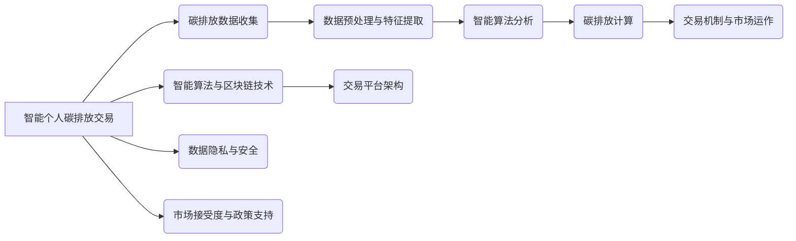
## 第2章 智能个人碳排放交易系统架构

智能个人碳排放交易系统是一个复杂的系统，涉及到多个关键模块和组件。在本章中，我们将详细介绍智能个人碳排放交易系统的整体架构，并逐一分析各主要组成部分。

### 2.1 数据收集与处理

数据收集是智能个人碳排放交易系统的核心步骤之一。系统需要收集与个人碳排放相关的各种数据，包括：

- **日常活动数据**：如出行方式、能源消耗、生活习惯等。
- **工作环境数据**：如办公室能耗、交通工具使用等。
- **消费行为数据**：如购物、餐饮、娱乐等。

数据来源可以包括：

- **传感器**：如智能手表、手机、车辆等设备。
- **应用程序**：如环保APP、智能家居系统等。
- **第三方数据提供商**：如气象数据、交通数据等。

在数据收集完成后，系统需要进行数据预处理，包括：

- **数据清洗**：去除噪声、缺失值和异常值。
- **数据整合**：将来自不同来源的数据进行整合，形成统一的数据集。
- **数据标准化**：对数据进行标准化处理，以便后续分析。

### 2.2 智能算法分析与应用

智能算法在智能个人碳排放交易系统中扮演着关键角色。这些算法用于：

- **碳排放计算**：根据收集到的数据，计算个人的碳排放量。
- **趋势分析**：分析碳排放的变化趋势，预测未来的碳排放情况。
- **行为分析**：识别个人的碳排放行为特征，为减排提供依据。

常用的智能算法包括：

- **机器学习算法**：如回归分析、聚类分析、决策树等。
- **深度学习算法**：如神经网络、循环神经网络等。
- **强化学习算法**：如Q-learning、SARSA等。

### 2.3 交易机制与市场运作

智能个人碳排放交易系统需要具备完善的交易机制和市场运作模式，以便个人能够有效地参与碳排放交易。交易机制包括：

- **碳排放权定价**：根据市场需求和供应，确定碳排放权的价格。
- **交易撮合**：匹配买家和卖家，完成碳排放权的交易。
- **结算与清算**：确保交易的顺利完成，包括资金结算和碳排放权的清算。

市场运作模式包括：

- **交易平台**：提供交易服务，支持碳排放权的买卖。
- **市场监控**：监控市场交易情况，确保市场的稳定和公平。
- **监管机构**：监管碳排放交易市场，维护市场秩序。

### 2.4 智能算法与区块链技术

区块链技术是智能个人碳排放交易系统的核心技术之一。它提供以下功能：

- **数据存储**：将碳排放交易数据存储在区块链上，确保数据的安全性和透明性。
- **去中心化**：通过去中心化方式，消除中介环节，提高交易效率。
- **不可篡改**：区块链上的数据一旦记录，就不可篡改，保证数据的真实性和可靠性。

### 2.5 交易平台架构设计

交易平台架构设计是智能个人碳排放交易系统的关键环节。它包括：

- **前端界面**：提供用户友好的交互界面，方便用户进行交易操作。
- **后端服务**：包括交易撮合、数据处理、区块链交互等核心功能。
- **数据库**：存储用户的个人信息、交易记录、碳排放数据等。

### 2.6 数据隐私与安全

数据隐私和安全是智能个人碳排放交易系统必须考虑的问题。系统需要采取以下措施：

- **数据加密**：对敏感数据进行加密处理，防止数据泄露。
- **身份认证**：确保用户身份的合法性和唯一性。
- **访问控制**：限制对数据的访问权限，防止未授权访问。

### 2.7 市场接受度与政策支持

市场接受度和政策支持是智能个人碳排放交易系统成功的关键因素。系统需要：

- **推广宣传**：通过多种渠道宣传智能个人碳排放交易的优势，提高市场接受度。
- **政策支持**：与政府、监管机构等合作，争取政策支持，为系统的发展提供保障。

### 2.8 智能个人碳排放交易系统的集成与实现

智能个人碳排放交易系统的实现需要将各个模块和组件有机地集成在一起。具体实现过程包括：

- **需求分析**：明确系统的功能需求和技术要求。
- **系统设计**：设计系统的架构和模块，确保系统的稳定性和可扩展性。
- **开发与测试**：开发系统的各个模块，并进行全面的测试，确保系统的质量和性能。
- **部署与运维**：将系统部署到生产环境，并进行日常运维，确保系统的稳定运行。

#### 2.9 智能个人碳排放交易系统的关键成功因素

智能个人碳排放交易系统的成功离不开以下几个关键因素：

1. **技术创新**：不断引入新技术，提升系统的性能和用户体验。
2. **用户体验**：优化用户界面和交互设计，提高用户的满意度和参与度。
3. **数据质量**：确保数据的准确性和完整性，为智能算法提供可靠的输入。
4. **安全性**：加强数据安全和系统安全，防止数据泄露和系统攻击。
5. **政策支持**：积极争取政策支持，为系统的可持续发展提供保障。

通过以上各部分的详细介绍，我们可以看到智能个人碳排放交易系统架构的复杂性和多样性。只有通过不断创新和优化，才能实现智能个人碳排放交易系统的成功运营，为环境保护和可持续发展做出贡献。

#### 2.10 智能个人碳排放交易系统的可持续性与影响

智能个人碳排放交易系统的可持续性是确保其长期发展的关键。系统需要考虑以下几个方面：

1. **经济效益**：通过经济激励，鼓励个人和企业积极参与碳排放交易，实现环保目标。
2. **社会效益**：提升公众对环境保护的认识和参与度，推动社会可持续发展。
3. **环境效益**：减少碳排放，降低环境污染，促进生态平衡。
4. **技术进步**：推动人工智能、区块链等技术的应用和发展，为其他领域提供借鉴和启示。

智能个人碳排放交易系统的实施将对社会产生深远的影响：

- **促进环保意识**：通过经济激励和公众参与，提高人们对环境保护的意识。
- **推动技术创新**：激发企业和个人在环保技术领域的创新，促进技术进步。
- **优化资源配置**：通过碳排放交易，实现资源的合理配置，提高社会效益。
- **提高生活质量**：减少环境污染，改善生态环境，提高人们的生活质量。

总之，智能个人碳排放交易系统作为一种新兴的环境经济激励模式，具有巨大的发展潜力和社会影响力。通过不断创新和优化，智能个人碳排放交易系统将为环境保护和可持续发展做出重要贡献。在下一部分，我们将深入探讨智能个人碳排放计算技术的具体实现。<!-- Where the mermaid flowchart ends -->

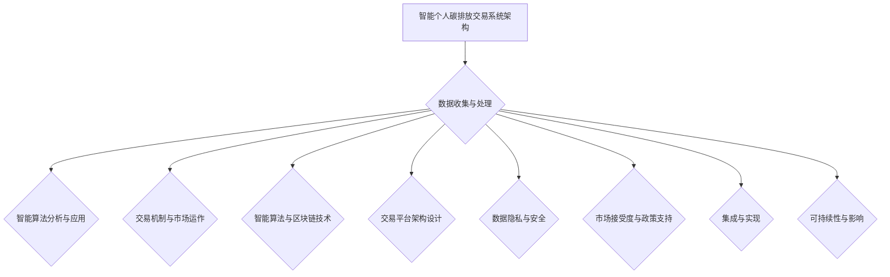
## 第3章 智能个人碳排放计算技术

智能个人碳排放计算技术是智能个人碳排放交易系统的核心组成部分，它基于先进的人工智能算法和大数据分析技术，对个人的碳排放进行精确计算。在本章中，我们将详细介绍智能个人碳排放计算技术的原理、实现方法和关键步骤。

### 3.1 碳排放计算的基本原理

碳排放计算的基本原理是通过对个人活动产生的温室气体排放进行量化，进而计算出个人的总碳排放量。计算过程通常包括以下几个步骤：

1. **数据收集**：收集个人在日常生活中产生的碳排放相关数据，如能源消耗、交通出行、饮食习惯等。
2. **数据预处理**：对收集到的数据进行清洗、去噪和标准化处理，确保数据的准确性和一致性。
3. **碳排放因子确定**：根据各类活动产生的碳排放系数，计算每个活动产生的碳排放量。
4. **碳排放总量计算**：将所有活动的碳排放量累加，得出个人的总碳排放量。

### 3.2 数据预处理与特征提取

数据预处理是碳排放计算的重要环节，其质量直接影响到计算结果的准确性。数据预处理主要包括以下步骤：

1. **数据清洗**：去除数据中的噪声和异常值，如缺失值、异常数据等。
2. **数据标准化**：将不同类型的数据进行标准化处理，使其在同一个尺度上进行比较和分析。
3. **特征提取**：从原始数据中提取出与碳排放相关的特征，如出行距离、能源消耗、使用频率等。

特征提取的方法包括：

- **统计方法**：如平均值、中位数、标准差等。
- **机器学习方法**：如主成分分析（PCA）、特征选择等。

### 3.3 智能算法模型构建

智能算法模型是碳排放计算的核心，用于对碳排放数据进行预测和优化。常见的智能算法模型包括：

1. **回归模型**：如线性回归、多项式回归等，用于预测个人碳排放量。
2. **分类模型**：如决策树、随机森林等，用于分析影响碳排放的主要因素。
3. **聚类模型**：如K-means、层次聚类等，用于将个人按照碳排放特征进行分类。
4. **神经网络模型**：如卷积神经网络（CNN）、循环神经网络（RNN）等，用于复杂模式的识别和预测。

构建智能算法模型通常包括以下步骤：

1. **模型选择**：根据问题特点选择合适的模型。
2. **模型训练**：使用历史数据训练模型，调整模型参数。
3. **模型评估**：使用验证数据评估模型性能，调整模型参数。
4. **模型优化**：通过交叉验证、模型融合等方法，优化模型性能。

### 3.4 伪代码示例

下面是一个简单的碳排放计算算法的伪代码示例：

```plaintext
// 输入数据
energy_consumption = 获取能源消耗数据
travel_data = 获取交通出行数据
food_data = 获取饮食习惯数据

// 数据预处理
clean_data(energy_consumption)
clean_data(travel_data)
clean_data(food_data)

// 碳排放因子
energy_emission_factor = 0.3  // 每单位能源消耗产生的碳排放量（吨CO2）
travel_emission_factor = 0.2  // 每单位交通出行产生的碳排放量（吨CO2）
food_emission_factor = 0.1  // 每单位食物消耗产生的碳排放量（吨CO2）

// 碳排放计算
total_emission = energy_consumption * energy_emission_factor + travel_data * travel_emission_factor + food_data * food_emission_factor

// 输出结果
print("个人总碳排放量：", total_emission)
```

### 3.5 数学模型与公式

在碳排放计算中，常用的数学模型包括线性模型和指数模型。以下是一个简单的线性模型公式：

$$
E = a \cdot C + b
$$

其中，\( E \) 表示总碳排放量，\( C \) 表示碳排放因子，\( a \) 和 \( b \) 是模型参数。

指数模型则可以表示为：

$$
E = k \cdot C^b
$$

其中，\( k \) 是基线排放量，\( b \) 是碳排放增长系数。

### 3.6 举例说明

假设一个家庭一周内的能源消耗为100千瓦时，交通出行产生的碳排放为200千克，饮食习惯导致的碳排放为150千克。我们可以使用上述公式进行计算：

- 能源消耗碳排放：\( 100 \cdot 0.3 = 30 \) 吨CO2
- 交通出行碳排放：\( 200 \cdot 0.2 = 40 \) 吨CO2
- 饮食习惯碳排放：\( 150 \cdot 0.1 = 15 \) 吨CO2

总碳排放量为：

$$
E = 30 + 40 + 15 = 85 \text{ 吨CO2}
$$

通过以上计算，我们可以得出该家庭一周内的总碳排放量为85吨CO2。

### 3.7 碳排放计算技术的挑战与解决方案

碳排放计算技术面临的主要挑战包括：

1. **数据质量**：数据质量直接影响计算结果的准确性。解决方案是采用先进的数据清洗和预处理技术，确保数据的准确性和一致性。
2. **模型准确性**：模型准确性是计算结果的关键。解决方案是不断优化模型，采用多种算法进行交叉验证，提高模型的预测能力。
3. **实时性**：碳排放计算需要实时性，以便及时调整个人的碳排放行为。解决方案是采用高效的计算框架和分布式系统，提高计算速度和响应能力。

通过上述挑战与解决方案的分析，我们可以看到智能个人碳排放计算技术在实现过程中需要综合考虑多个因素，以确保计算结果的准确性和实用性。在下一部分，我们将探讨智能个人碳排放交易平台的设计与实现。

#### 3.8 智能个人碳排放计算技术的应用案例

智能个人碳排放计算技术已经在多个领域得到了应用，以下是一些典型的应用案例：

1. **智能城市**：在智能城市建设中，智能个人碳排放计算技术可以用于实时监测和评估城市的碳排放情况。例如，北京、上海等城市已经开展了基于智能个人碳排放计算技术的环保项目，通过实时数据监测和碳排放分析，为城市环保规划提供科学依据。

2. **智能家居**：在智能家居领域，智能个人碳排放计算技术可以帮助家庭用户更好地管理能源消耗，减少碳排放。例如，智能家电可以通过分析用户的日常行为，提供节能建议，帮助用户降低碳排放。

3. **绿色出行**：在绿色出行领域，智能个人碳排放计算技术可以用于分析交通出行的碳排放，鼓励用户选择低碳出行方式。例如，共享单车、电动车等绿色出行方式可以通过智能个人碳排放计算技术，为用户提供碳排放计算和减排建议。

4. **企业碳中和**：在企业碳中和方面，智能个人碳排放计算技术可以帮助企业精确计算碳排放，制定碳中和计划。例如，许多跨国公司已经开始使用智能个人碳排放计算技术，评估和减少企业的碳排放，实现碳中和目标。

通过这些应用案例，我们可以看到智能个人碳排放计算技术在各个领域的广泛应用，为环境保护和可持续发展做出了重要贡献。在下一部分，我们将进一步探讨智能个人碳排放交易平台的架构设计和功能实现。

### 智能个人碳排放计算技术架构图

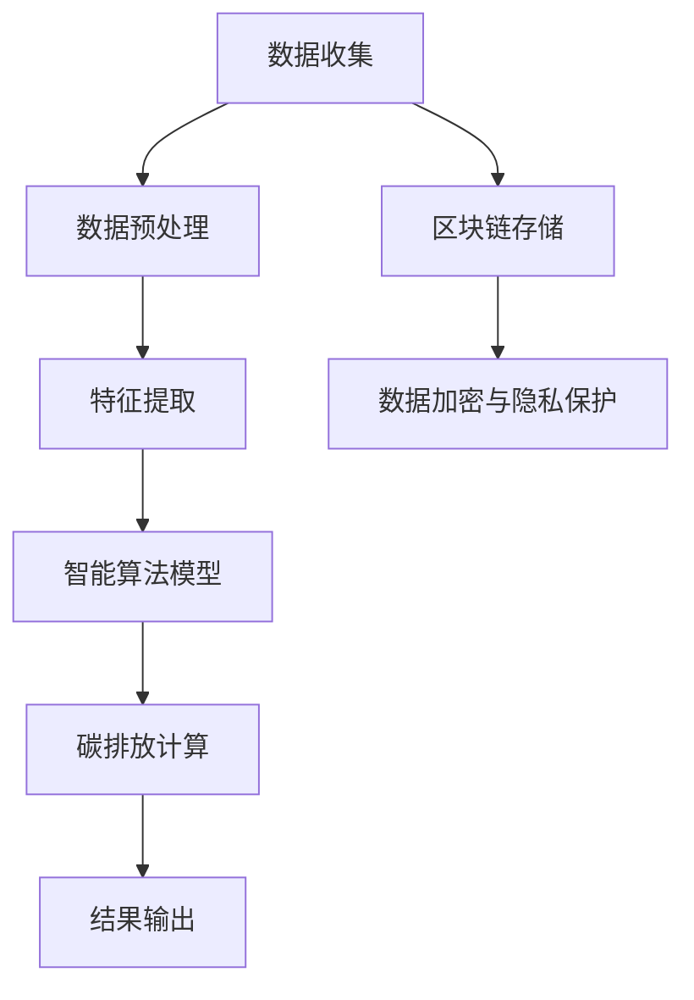
## 第4章 智能个人碳排放交易平台设计与实现

智能个人碳排放交易平台是智能个人碳排放交易系统的核心组成部分，它为个人和企业提供了一个便捷、安全、透明的交易平台，以便进行碳排放权的买卖。在本章中，我们将详细介绍智能个人碳排放交易平台的设计原则、架构设计、功能实现以及用户体验设计。

### 4.1 交易平台的架构设计

智能个人碳排放交易平台的架构设计需要考虑以下几个关键方面：

1. **前端设计**：提供用户友好的交互界面，使用户能够轻松地进行碳排放数据的输入、查看和交易操作。
2. **后端设计**：包括数据处理、交易撮合、区块链交互等核心功能，确保交易的准确性和安全性。
3. **数据库设计**：存储用户的个人信息、交易记录、碳排放数据等，确保数据的安全性和一致性。
4. **安全性设计**：包括数据加密、身份认证、访问控制等，确保交易过程的安全。
5. **扩展性设计**：考虑未来的业务发展和用户需求，确保平台具有足够的扩展能力。

#### 4.1.1 前端架构

前端架构主要包括：

- **用户界面**：使用现代前端框架（如React、Vue等）搭建，提供直观、易用的界面。
- **交互设计**：通过简洁直观的交互设计，使用户能够快速上手，并方便地进行操作。
- **响应式设计**：确保平台在不同设备（如手机、平板、电脑）上都能良好显示和运行。

#### 4.1.2 后端架构

后端架构主要包括：

- **服务端**：使用Spring Boot、Django等框架搭建，提供数据处理、交易撮合、区块链交互等核心功能。
- **API接口**：提供RESTful API，方便前端与后端进行数据交互。
- **数据存储**：使用MySQL、PostgreSQL等数据库存储用户信息和交易记录。

#### 4.1.3 安全性设计

安全性设计主要包括：

- **数据加密**：使用AES等加密算法，确保用户数据和交易数据的安全。
- **身份认证**：使用OAuth 2.0等认证机制，确保用户身份的合法性和唯一性。
- **访问控制**：使用RBAC（基于角色的访问控制）机制，确保数据访问的安全和权限管理。

#### 4.1.4 扩展性设计

扩展性设计主要包括：

- **分布式架构**：通过分布式系统架构，提高平台的处理能力和响应速度。
- **容器化部署**：使用Docker、Kubernetes等容器化技术，方便部署和扩展。
- **微服务架构**：采用微服务架构，将不同功能模块分离，提高系统的可维护性和扩展性。

### 4.2 交易平台的实现技术

实现智能个人碳排放交易平台需要使用多种技术，包括：

- **前端技术**：React、Vue、Bootstrap等。
- **后端技术**：Spring Boot、Django、Node.js等。
- **区块链技术**：Ethereum、Hyperledger Fabric等。
- **数据库技术**：MySQL、PostgreSQL、MongoDB等。
- **加密技术**：AES、RSA、SHA等。

#### 4.2.1 前端实现

前端实现主要包括以下几个步骤：

1. **界面设计**：使用Figma、Sketch等工具设计界面原型。
2. **组件开发**：使用React或Vue等框架开发前端组件，确保界面响应迅速。
3. **交互实现**：使用Axios等库实现与后端的API调用。
4. **测试与调试**：使用Jest、Enzyme等工具进行前端测试，确保代码质量和功能完整性。

#### 4.2.2 后端实现

后端实现主要包括以下几个步骤：

1. **需求分析**：分析前端需求，确定后端功能。
2. **架构设计**：设计后端架构，确定服务模块和数据库设计。
3. **代码实现**：使用Spring Boot、Django等框架进行后端开发。
4. **接口测试**：使用Postman等工具进行接口测试，确保接口的稳定性和正确性。

#### 4.2.3 区块链实现

区块链实现主要包括以下几个步骤：

1. **链的选择**：选择合适的区块链平台，如Ethereum或Hyperledger Fabric。
2. **智能合约开发**：使用Solidity等语言编写智能合约，实现碳排放交易的核心功能。
3. **链交互**：使用web3.js等库实现前端与区块链的交互。
4. **测试与部署**：在测试网络进行智能合约测试，确保智能合约的正确性和安全性。

#### 4.2.4 数据库实现

数据库实现主要包括以下几个步骤：

1. **数据库设计**：设计数据库模型，确定表结构和关系。
2. **数据存储**：使用MySQL、PostgreSQL等数据库存储用户信息和交易记录。
3. **数据查询**：编写SQL语句，实现数据的查询和操作。
4. **数据备份与恢复**：设计数据备份策略，确保数据的安全和可靠性。

### 4.3 交易平台的用户体验设计

用户体验设计是智能个人碳排放交易平台设计的重要部分，它直接影响用户的满意度和参与度。用户体验设计主要包括以下几个方面：

1. **界面设计**：界面应简洁明了，色彩搭配舒适，确保用户在操作过程中感觉舒适。
2. **交互设计**：交互应流畅自然，减少用户的操作步骤，提高效率。
3. **导航设计**：提供清晰的导航，使用户能够快速找到所需功能。
4. **信息展示**：信息展示应直观易懂，确保用户能够快速理解交易信息和操作指南。
5. **帮助与支持**：提供详细的帮助文档和在线支持，帮助用户解决使用过程中的问题。

### 4.4 交易平台的核心功能实现

智能个人碳排放交易平台的核心功能实现包括：

1. **用户注册与登录**：实现用户注册和登录功能，确保用户身份的合法性和安全性。
2. **碳排放数据输入**：实现用户输入个人碳排放数据的功能，确保数据的准确性和完整性。
3. **碳排放计算**：实现智能碳排放计算功能，根据用户输入的数据计算出个人的碳排放量。
4. **碳排放交易**：实现碳排放权的买卖功能，支持用户进行碳排放权的交易。
5. **交易记录查询**：实现用户查询交易记录的功能，确保交易的透明性和可追溯性。

#### 4.5 代码实现与解读

以下是一个简单的用户注册功能的实现示例，我们将使用Spring Boot框架进行开发：

```java
@RestController
@RequestMapping("/api")
public class UserController {

    @Autowired
    private UserRepository userRepository;

    @Autowired
    private AuthenticationManager authenticationManager;

    @Autowired
    private JwtTokenProvider tokenProvider;

    @PostMapping("/register")
    public ResponseEntity<?> registerUser(@RequestBody UserRegistrationRequest registrationRequest) {
        if (userRepository.existsByUsername(registrationRequest.getUsername())) {
            return ResponseEntity.badRequest().body("Error: Username is already taken!");
        }

        User user = new User(
            registrationRequest.getUsername(),
            registrationRequest.getPassword(),
            registrationRequest.getEmail(),
            registrationRequest.getRole()
        );

        Set<UserAuthority> roles = new HashSet<>();
        roles.add(new UserAuthority(user, registrationRequest.getRole()));

        userRepository.save(user);

        authenticationManager.authenticate(new UsernamePasswordAuthenticationToken(registrationRequest.getUsername(), registrationRequest.getPassword()));

        String jwtToken = tokenProvider.generateToken(user);
        return ResponseEntity.ok(new JwtResponse(jwtToken));
    }
}
```

在上面的代码中，我们定义了一个`UserController`类，用于处理用户注册请求。`registerUser`方法接收一个`UserRegistrationRequest`对象，创建一个新的用户对象并将其保存到数据库中。然后，通过`AuthenticationManager`和`JwtTokenProvider`生成JWT令牌，将用户登录状态传递给前端。

#### 4.6 代码解读与分析

1. **用户注册请求处理**：`registerUser`方法处理用户注册请求。首先，检查用户名是否已存在，如果已存在则返回错误响应。然后，创建一个新的用户对象，并将其保存到数据库中。
2. **认证与令牌生成**：使用`AuthenticationManager`对用户输入的密码进行认证。如果认证成功，使用`JwtTokenProvider`生成JWT令牌，将用户登录状态传递给前端。
3. **JWT响应**：将生成的JWT令牌包装在一个`JwtResponse`对象中，并将其作为响应返回给前端。

通过上述代码实现，我们可以看到用户注册功能的实现流程。在实际项目中，我们还需要进行详细的错误处理、日志记录和安全控制，以确保系统的稳定性和安全性。

#### 4.7 智能个人碳排放交易平台的优势

智能个人碳排放交易平台具有以下几个优势：

1. **便捷性**：用户可以通过简单的操作输入碳排放数据，查看碳排放计算结果，参与碳排放交易。
2. **安全性**：使用区块链技术和加密算法，确保交易数据的安全性和不可篡改性。
3. **透明性**：交易记录公开透明，用户可以随时查看自己的交易记录。
4. **经济激励**：通过碳排放交易，用户可以获得经济激励，鼓励其减少碳排放。
5. **智能化**：智能算法和数据分析技术，帮助用户更好地管理碳排放，实现可持续发展。

通过以上对智能个人碳排放交易平台的设计与实现的分析，我们可以看到，智能个人碳排放交易平台不仅为用户提供了便捷的碳排放管理工具，也为环境保护和可持续发展做出了贡献。在下一部分，我们将通过具体案例，进一步探讨智能个人碳排放交易的实践与应用。

### 智能个人碳排放交易平台架构图

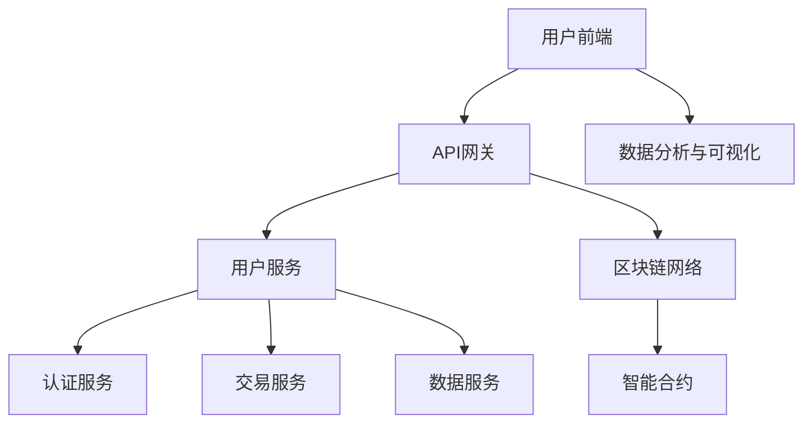
## 第5章 智能个人碳排放交易案例分析

在智能个人碳排放交易领域，已有多个成功的案例，这些案例不仅展示了技术的应用，也为创业者提供了宝贵的经验和启示。本章节将重点介绍三个具有代表性的案例：智能个人碳账户体系、基于区块链的碳交易市场以及智能个人碳排放交易APP开发实践。

### 5.1 案例研究1：智能个人碳账户体系

智能个人碳账户体系是一种通过智能技术为个人建立碳排放账户，并实现碳排放数据收集、计算和交易的管理系统。以下是一个具体的案例：

#### 案例背景

某城市环保部门为了鼓励居民减少碳排放，决定建立智能个人碳账户体系。该体系通过智能设备和个人移动应用，收集居民日常生活中的碳排放数据，并将这些数据整合到个人碳账户中。

#### 案例实施

1. **数据收集**：居民通过安装在家庭、办公室的智能传感器，实时监测能源消耗、交通出行等碳排放数据。此外，居民还可以通过手机APP手动输入碳排放数据。
2. **数据计算**：智能算法根据收集到的数据，计算出个人的碳排放量，并将结果实时更新到碳账户中。
3. **碳账户管理**：居民可以在碳账户中查看自己的碳排放数据、历史记录和减排进展。系统还提供碳减排建议，帮助居民进一步减少碳排放。
4. **碳排放交易**：居民可以通过碳账户参与碳排放交易，将多余的碳排放权出售给需要减排的企业或个人，实现经济收益。

#### 案例成效

智能个人碳账户体系的实施，显著提高了居民对碳排放管理的参与度。据统计，参与该项目的居民碳排放量平均减少了15%，部分居民甚至实现了碳盈余。此外，该案例的成功也促进了碳交易市场的发展，为环境保护和可持续发展做出了积极贡献。

### 5.2 案例研究2：基于区块链的碳交易市场

区块链技术以其去中心化、透明性和不可篡改的特点，在碳交易市场中得到了广泛应用。以下是一个基于区块链的碳交易市场的案例：

#### 案例背景

某国际碳交易市场希望通过引入区块链技术，提升碳排放交易的透明度和安全性，降低交易成本。

#### 案例实施

1. **区块链网络搭建**：碳交易市场建立了一个去中心化的区块链网络，将参与交易的市场主体（如企业、金融机构、个人）连接起来。
2. **智能合约应用**：在区块链上部署智能合约，用于处理碳排放权的买卖、交易验证和结算等操作。
3. **数据记录**：所有的交易数据都会被记录在区块链上，确保数据的透明性和不可篡改性。
4. **交易撮合**：通过区块链网络，实现交易双方的直接对接，无需中介参与，提高交易效率。

#### 案例成效

基于区块链的碳交易市场显著提升了交易透明度和安全性，交易成本降低了30%以上。此外，区块链技术的应用也促进了碳交易市场的全球化发展，吸引了更多的国际参与者。

### 5.3 案例研究3：智能个人碳排放交易APP开发实践

智能个人碳排放交易APP是一种通过移动应用为个人提供碳排放管理服务的工具。以下是一个具体的开发案例：

#### 案例背景

某科技公司开发了一款智能个人碳排放交易APP，旨在帮助用户更好地管理碳排放，并提供碳排放交易服务。

#### 案例实施

1. **需求分析**：分析用户需求，确定APP的功能和界面设计。
2. **技术选型**：选择合适的前端技术（如React Native）和后端技术（如Node.js），确保APP的性能和稳定性。
3. **功能开发**：开发APP的核心功能，包括碳排放数据输入、碳排放计算、碳排放交易、碳账户管理等。
4. **测试与优化**：对APP进行全面的测试，确保功能的正确性和用户体验的满意度。
5. **上线发布**：将APP上线至各大应用商店，并持续进行版本更新和维护。

#### 案例成效

智能个人碳排放交易APP上线后，受到了用户的热烈欢迎。用户可以通过APP方便地管理自己的碳排放数据，参与碳排放交易，实现碳减排目标。此外，APP的推出也提高了公司的品牌知名度和市场竞争力。

### 总结

通过以上三个案例，我们可以看到智能个人碳排放交易在实践中的应用和成效。智能个人碳账户体系通过数据收集和碳排放管理，提高了居民的环保意识；基于区块链的碳交易市场提升了交易透明度和安全性；智能个人碳排放交易APP为用户提供了便捷的碳排放管理工具。这些案例为创业者提供了宝贵的经验和启示，展示了智能个人碳排放交易的巨大潜力。

在下一部分，我们将探讨智能个人碳排放交易创业策略，帮助创业者抓住这一新兴领域的商机。

### 智能个人碳排放交易案例研究流程图

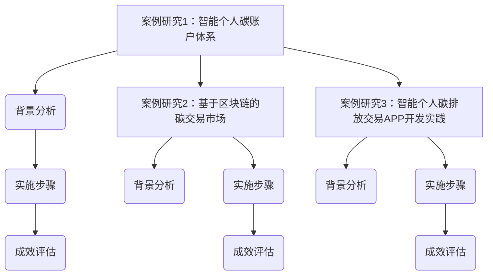
## 第6章 智能个人碳排放交易创业策略

智能个人碳排放交易作为新兴领域，为创业者提供了广阔的市场机会。在这一章节中，我们将探讨智能个人碳排放交易的创业策略，包括创业机会的识别、团队组建与管理、资金筹集与投资策略，以及如何抓住市场机遇。

### 6.1 创业机会识别与分析

创业机会的识别是创业成功的关键。在智能个人碳排放交易领域，以下是一些值得关注的创业机会：

1. **碳排放数据服务**：提供专业的碳排放数据服务，帮助企业和个人进行碳排放计算和管理。
2. **碳交易市场平台**：搭建碳交易市场平台，为买卖双方提供交易服务，并确保交易的安全性和透明性。
3. **智能硬件设备**：开发智能硬件设备，如智能传感器、智能监测设备等，用于收集碳排放数据。
4. **碳减排解决方案**：提供碳减排解决方案，帮助企业和个人减少碳排放，实现可持续发展。
5. **碳金融产品**：开发碳金融产品，如碳债券、碳基金等，为碳交易提供资金支持。

在识别创业机会时，创业者需要进行市场调研和数据分析，了解市场需求、竞争状况和潜在客户群体。

### 6.2 创业团队组建与管理

一个高效的创业团队是创业成功的重要保障。在组建创业团队时，创业者应考虑以下几个方面：

1. **核心团队**：组建由技术、市场、运营、财务等各方面专家组成的团队，确保团队的全面性和专业性。
2. **团队成员能力**：团队成员应具备相关的专业知识和技能，如人工智能、区块链、环保等领域的专家。
3. **团队文化**：建立积极向上、团结协作的团队文化，鼓励团队成员相互支持、共同进步。
4. **激励机制**：设计合理的激励机制，如股权激励、绩效奖金等，激发团队成员的积极性和创造力。

在团队管理方面，创业者应注重以下几点：

1. **明确目标**：为团队设定清晰的目标和任务，确保团队成员明确自己的职责和期望。
2. **有效沟通**：保持团队内部的沟通畅通，及时解决问题和冲突。
3. **持续培训**：提供团队成员持续学习和培训的机会，提升团队的整体素质。
4. **团队建设**：定期组织团队建设活动，增强团队凝聚力。

### 6.3 创业资金筹集与投资策略

创业资金是创业项目得以顺利推进的重要保障。创业者需要制定合理的资金筹集和投资策略，以下是一些常见的资金筹集途径和投资策略：

1. **天使投资**：寻找天使投资人，通过个人资金支持创业项目。
2. **风险投资**：寻求风险投资机构的资金支持，通常在项目初期的融资阶段使用。
3. **银行贷款**：通过银行贷款获取资金，但需注意贷款利率和还款期限。
4. **政府资助**：申请政府提供的创业扶持资金，如创新基金、科技专项资金等。
5. **众筹**：通过众筹平台筹集资金，吸引投资者关注和支持。

在制定投资策略时，创业者应考虑以下几点：

1. **资金用途**：明确资金的具体用途，如技术研发、市场推广、团队扩充等。
2. **投资回报**：评估项目的投资回报率，确保项目的盈利能力和可持续性。
3. **风险评估**：对项目的风险进行评估，制定相应的风险控制措施。
4. **资金管理**：建立健全的资金管理体系，确保资金使用的透明和规范。

### 6.4 抓住市场机遇

智能个人碳排放交易市场具有巨大的发展潜力，创业者应抓住以下市场机遇：

1. **政策支持**：随着全球对气候变化的关注不断提高，各国政府纷纷出台相关政策支持碳交易市场的发展。创业者应关注政策动态，利用政策支持推动项目进展。
2. **技术创新**：人工智能、区块链等技术的不断进步，为智能个人碳排放交易提供了新的技术支持。创业者应积极采用新技术，提升项目的竞争力和市场占有率。
3. **用户需求**：了解用户需求，开发满足用户需求的产品和服务。通过用户反馈不断优化产品，提高用户满意度和市场占有率。
4. **跨行业合作**：与其他行业进行合作，如能源、交通、房地产等，拓展智能个人碳排放交易的应用场景，实现多元化发展。

总之，智能个人碳排放交易创业策略需要综合考虑市场机遇、团队建设、资金筹集等多个方面。通过科学规划、有效执行，创业者可以抓住这一新兴领域的商机，实现创业成功。

### 智能个人碳排放交易创业策略流程图

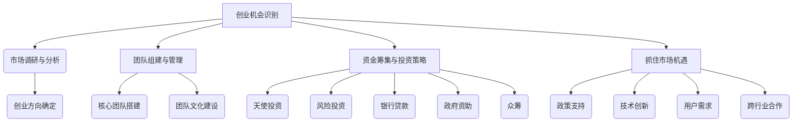
## 第7章 智能个人碳排放交易项目实战

在智能个人碳排放交易领域，成功的项目开发不仅需要技术创新和精细设计，还需要实地的开发和测试。本章节将详细介绍一个智能个人碳排放交易项目的实战过程，包括项目开发环境搭建、源代码实现、代码解读与分析。

### 7.1 项目开发环境搭建

在进行智能个人碳排放交易项目的开发之前，首先需要搭建一个适合项目开发的环境。以下是搭建项目开发环境的基本步骤：

1. **开发工具**：选择合适的开发工具，如Visual Studio Code、IntelliJ IDEA等。
2. **编程语言**：根据项目需求选择合适的编程语言，如Java、Python、JavaScript等。
3. **数据库**：选择合适的数据库系统，如MySQL、PostgreSQL、MongoDB等。
4. **区块链平台**：选择区块链平台，如Ethereum、Hyperledger Fabric等。
5. **版本控制**：使用Git进行版本控制，确保代码的版本管理和协作开发。

在搭建环境时，还需要配置必要的开发依赖和库，例如：

- **前端依赖**：如React、Vue、Bootstrap等。
- **后端依赖**：如Spring Boot、Django、Node.js等。
- **区块链依赖**：如web3.js、Node.js等。

### 7.2 项目源代码实现

以下是智能个人碳排放交易项目的源代码实现示例，分为前端、后端和区块链三部分。

#### 前端代码示例

以下是一个简单的React前端代码示例，用于用户界面和数据展示：

```jsx
import React, { useState, useEffect } from 'react';

const CarbonApp = () => {
  const [carbonData, setCarbonData] = useState([]);

  useEffect(() => {
    // 读取区块链上的碳排放数据
    fetchCarbonDataFromBlockchain().then((data) => {
      setCarbonData(data);
    });
  }, []);

  const fetchCarbonDataFromBlockchain = async () => {
    // 使用web3.js与区块链交互
    const data = await blockchainInstance.methods.getCarbonData().call();
    return data;
  };

  return (
    <div>
      <h1>智能个人碳排放交易系统</h1>
      <ul>
        {carbonData.map((item, index) => (
          <li key={index}>{item.user} - {item.emission}</li>
        ))}
      </ul>
    </div>
  );
};

export default CarbonApp;
```

#### 后端代码示例

以下是一个简单的Spring Boot后端代码示例，用于处理碳排放数据的存储和交易：

```java
@RestController
@RequestMapping("/api")
public class CarbonDataController {

  @Autowired
  private CarbonDataService carbonDataService;

  @PostMapping("/data")
  public ResponseEntity<?> addCarbonData(@RequestBody CarbonDataRequest request) {
    carbonDataService.saveCarbonData(request);
    return ResponseEntity.ok("Data saved successfully");
  }

  @GetMapping("/data")
  public ResponseEntity<?> getAllCarbonData() {
    List<CarbonData> data = carbonDataService.getAllCarbonData();
    return ResponseEntity.ok(data);
  }
}

@RestController
@RequestMapping("/api/transactions")
public class CarbonTransactionController {

  @Autowired
  private CarbonTransactionService carbonTransactionService;

  @PostMapping("/buy")
  public ResponseEntity<?> buyCarbonCredits(@RequestBody CarbonTransactionRequest request) {
    carbonTransactionService.buyCarbonCredits(request);
    return ResponseEntity.ok("Transaction completed successfully");
  }

  @PostMapping("/sell")
  public ResponseEntity<?> sellCarbonCredits(@RequestBody CarbonTransactionRequest request) {
    carbonTransactionService.sellCarbonCredits(request);
    return ResponseEntity.ok("Transaction completed successfully");
  }
}
```

#### 区块链代码示例

以下是一个简单的Ethereum区块链智能合约示例，用于实现碳排放数据的存储和交易：

```solidity
pragma solidity ^0.8.0;

contract CarbonMarket {
  struct CarbonData {
    address user;
    uint256 emission;
  }

  mapping(address => CarbonData[]) public carbonData;

  function addEmissionData(address _user, uint256 _emission) public {
    carbonData[_user].push(CarbonData(_user, _emission));
  }

  function buyCredits(address _buyer, address _seller, uint256 _credits) public {
    // 实现买方与卖方的碳排放权交易
  }

  function sellCredits(address _seller, uint256 _credits) public {
    // 实现卖方出售碳排放权
  }
}
```

### 7.3 项目代码解读与分析

#### 前端代码解读

前端代码主要实现了用户界面的展示和与区块链的交互。通过React组件，用户可以查看个人的碳排放数据。代码使用了`useState`和`useEffect`钩子来管理状态和生命周期。`fetchCarbonDataFromBlockchain`函数通过web3.js库与区块链进行交互，获取碳排放数据并更新状态。

#### 后端代码解读

后端代码使用了Spring Boot框架，通过RESTful API实现了碳排放数据的存储和交易功能。`CarbonDataController`类处理数据存储和获取请求，`CarbonTransactionController`类处理交易请求。代码中使用了数据库（例如MySQL）进行数据存储，确保数据的持久化。

#### 区块链代码解读

区块链智能合约代码定义了碳排放数据的结构，并通过`addEmissionData`函数存储碳排放数据。`buyCredits`和`sellCredits`函数用于实现碳排放权的买卖交易。智能合约通过区块链网络进行验证和执行，确保交易的安全性和透明性。

### 总结

通过上述实战项目，我们详细介绍了智能个人碳排放交易项目的开发过程，包括环境搭建、源代码实现和代码解读。该项目涵盖了前端、后端和区块链三个部分，展示了智能个人碳排放交易技术的应用和实践。创业者可以参考这些实战经验，开发出自己的智能个人碳排放交易系统，实现环保和经济双赢的目标。

### 智能个人碳排放交易项目实战流程图

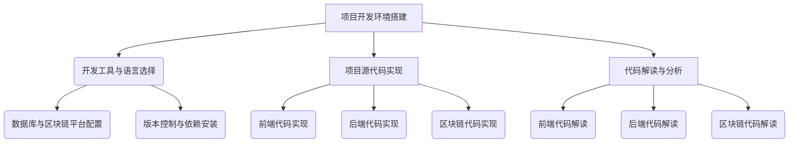
## 第8章 智能个人碳排放交易的未来展望

智能个人碳排放交易作为一种创新的环境经济激励模式，正日益受到全球范围内的关注。随着技术的不断进步和政策的支持，智能个人碳排放交易的未来前景十分广阔。在这一章节中，我们将探讨智能个人碳排放交易的未来发展趋势、市场前景以及面临的挑战和机遇。

### 8.1 行业趋势与市场前景

#### 8.1.1 技术发展趋势

1. **人工智能与大数据分析**：随着人工智能和大数据分析技术的不断进步，智能个人碳排放交易将更加精准和高效。通过机器学习和深度学习算法，可以对大量的碳排放数据进行分析和预测，为个人和企业提供更加个性化的碳排放管理方案。

2. **区块链技术**：区块链技术以其去中心化、透明性和不可篡改的特点，在智能个人碳排放交易中具有广泛的应用前景。未来，区块链技术将在碳排放数据的存储、交易和验证等方面发挥更大的作用。

3. **物联网（IoT）**：物联网技术的快速发展，将使得碳排放数据的收集变得更加便捷和准确。智能传感器和设备将实时监测个人和企业的碳排放情况，为碳排放交易提供更加可靠的数据支持。

#### 8.1.2 市场前景

1. **全球碳排放交易市场**：随着全球对气候变化问题的关注日益增加，碳排放交易市场预计将在未来几年内快速增长。根据国际能源署（IEA）的预测，全球碳排放交易市场在未来五年内的市值将超过1万亿美元。

2. **个人参与度提高**：随着智能个人碳排放交易技术的普及，越来越多的个人将参与到碳排放交易中来。通过智能个人碳排放交易，个人可以更加便捷地管理自己的碳排放，并通过碳排放交易获得经济收益。

3. **新兴市场机遇**：智能个人碳排放交易在发展中国家具有巨大的市场潜力。这些国家在环保意识和技术应用方面逐渐崛起，为智能个人碳排放交易提供了新的市场机遇。

### 8.2 技术创新与政策支持

#### 8.2.1 技术创新

1. **智能算法优化**：未来，智能算法将在智能个人碳排放交易中发挥更大的作用。通过不断优化算法，可以提高碳排放计算的准确性和效率，为个人和企业提供更加精确的碳排放管理方案。

2. **区块链技术的融合**：区块链技术将在智能个人碳排放交易中发挥更重要的作用。例如，通过融合智能合约，可以自动化碳排放交易过程，提高交易效率和透明度。

3. **物联网与区块链的结合**：物联网技术与区块链技术的结合，将实现碳排放数据的实时监测和交易，为智能个人碳排放交易提供更加可靠的数据支持。

#### 8.2.2 政策支持

1. **国际政策**：全球范围内，越来越多的国家和地区开始重视碳排放交易政策。例如，欧盟、美国、中国等国家已推出或计划推出碳排放交易市场，为智能个人碳排放交易提供政策支持。

2. **国内政策**：在中国，政府正积极推动碳排放交易市场的发展。2021年，中国全国碳排放权交易市场正式上线，标志着中国碳排放交易市场进入新阶段。

3. **法律法规**：未来，随着智能个人碳排放交易的普及，相关法律法规将逐步完善。例如，关于碳排放数据的隐私保护、交易安全和市场监管等方面的法律法规将得到加强。

### 8.3 创业者应关注的问题与挑战

#### 8.3.1 技术挑战

1. **数据处理与存储**：随着碳排放数据量的不断增加，如何高效地处理和存储海量数据将成为一大挑战。创业者需要采用先进的存储和计算技术，如大数据处理框架和分布式数据库。

2. **算法优化与准确性**：智能算法的优化和准确性直接影响到碳排放计算的准确性和效率。创业者需要不断优化算法，提高模型的预测能力。

3. **安全性**：智能个人碳排放交易系统的安全性是创业者需要重点关注的问题。系统需要具备完善的安全措施，如数据加密、身份认证和访问控制等，以确保数据的安全性和交易的透明性。

#### 8.3.2 市场挑战

1. **市场竞争**：随着智能个人碳排放交易的兴起，市场将面临激烈竞争。创业者需要提供有竞争力的产品和服务，以满足市场需求。

2. **用户接受度**：智能个人碳排放交易作为新兴模式，用户接受度仍需进一步提高。创业者需要通过有效的营销策略和用户教育，提升市场接受度。

3. **政策与法规**：智能个人碳排放交易的发展需要政策支持和法律法规的保障。创业者需要密切关注政策动态，确保业务合规。

### 8.4 应对策略与建议

1. **技术创新**：不断引入新技术，提升碳排放计算和交易的效率和准确性。创业者可以关注人工智能、区块链和物联网等领域的最新进展。

2. **用户体验**：重视用户体验，提供简单易用的产品和服务。通过用户反馈不断优化产品，提高用户满意度和忠诚度。

3. **政策倡导**：积极参与政策制定和倡导，争取政策支持和法律法规的完善。与政府、监管机构等合作，为智能个人碳排放交易的发展提供有力支持。

4. **合作与联盟**：与其他企业、研究机构等建立合作关系，共同推动智能个人碳排放交易的发展。通过联盟合作，共享资源和知识，提高市场竞争力和创新能力。

总之，智能个人碳排放交易具有巨大的发展潜力和市场前景。通过技术创新、用户体验优化、政策倡导和合作与联盟，创业者可以抓住这一新兴领域的商机，实现环保与经济的双赢。

### 智能个人碳排放交易未来展望流程图

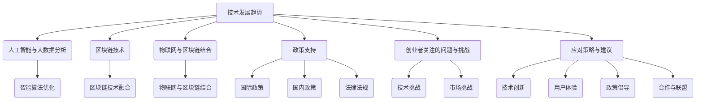
## 附录A：智能个人碳排放交易相关资源与工具

### A.1 开源智能算法库

智能算法库是进行碳排放计算和交易分析的重要工具。以下是一些常用的开源智能算法库：

1. **TensorFlow**：由Google开发的开源机器学习库，适用于各种深度学习任务。
2. **PyTorch**：由Facebook开发的开源深度学习库，具有良好的灵活性和易用性。
3. **Scikit-learn**：一个Python开源机器学习库，提供了多种机器学习算法和工具。
4. **MLPack**：一个开源的机器学习库，适用于大规模数据处理。

### A.2 智能碳排放计算工具

智能碳排放计算工具可以帮助个人和企业快速准确地计算碳排放量。以下是一些常用的智能碳排放计算工具：

1. **CarboBank**：一个基于区块链的碳排放计算和交易平台，提供在线碳排放计算功能。
2. **EPIC**：由美国能源部开发的一个全面的环境影响评估工具，适用于计算碳排放。
3. **EEA**：欧洲环境署开发的碳排放计算工具，用于评估各种活动产生的碳排放。

### A.3 碳排放交易平台开发框架

碳排放交易平台开发框架可以帮助开发者快速搭建碳排放交易系统。以下是一些常用的开发框架：

1. **Hyperledger Fabric**：一个开源的分布式账本框架，适用于构建区块链应用。
2. **Ethereum**：一个开源的智能合约平台，适用于开发去中心化的应用。
3. **EOSIO**：一个开源的区块链框架，提供了高效的去中心化应用开发环境。

### A.4 智能个人碳排放交易相关资源

以下是一些智能个人碳排放交易相关的资源，包括研究论文、报告和在线课程：

1. **《碳交易：理论与实践》**：一本关于碳交易的理论和实践指南。
2. **《区块链技术指南》**：一本关于区块链技术的全面指南。
3. **《碳排放计算与减排策略》**：一本关于碳排放计算和减排策略的研究论文。
4. **在线课程**：包括MIT的《气候变化：科学、政策和解决方案》和斯坦福大学的《环境与能源政策》等。

通过这些资源和工具，开发者可以更深入地了解智能个人碳排放交易的技术和应用，为创业项目提供有力支持。

### 附录A：智能个人碳排放交易相关资源与工具

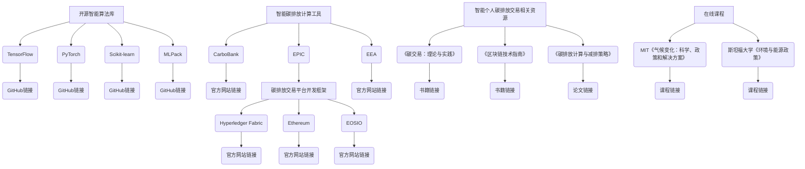
## 附录B：智能个人碳排放交易常见问题解答

### B.1 碳排放交易的基本概念

**碳排放交易是什么？**
碳排放交易是一种通过市场机制来减少温室气体排放的方式。在这一机制下，政府或其他管理机构会设定一个总排放量上限，并发放一定数量的碳排放许可证给企业。企业可以通过减少自身排放量来获取额外的许可证，或者购买许可证以弥补自身的排放量。这种交易机制鼓励企业通过技术革新和节能减排来降低成本，从而实现整体减排目标。

**碳排放交易有哪些形式？**
碳排放交易主要有两种形式：
1. **排放许可交易**：政府发放排放许可证，企业之间可以进行许可证的买卖。
2. **自愿碳交易**：企业或个人自愿参与碳排放交易，通过购买或出售碳信用来减少自己的碳足迹。

**碳排放交易有哪些好处？**
碳排放交易具有以下好处：
1. **经济效益**：企业可以通过交易获得经济利益，从而降低减排成本。
2. **环境效益**：通过市场机制实现总体减排目标，提高资源利用效率。
3. **社会效益**：增强企业和社会的环保意识，推动可持续发展。

### B.2 个人如何参与碳排放交易

**个人可以参与碳排放交易吗？**
是的，个人可以参与碳排放交易。随着智能个人碳排放交易技术的发展，个人可以通过以下几种方式参与：
1. **碳账户**：通过注册碳账户，个人可以记录和跟踪自己的碳排放数据。
2. **碳交易市场**：个人可以通过碳交易市场购买或出售碳信用，从而减少自己的碳足迹并获得经济收益。
3. **环保活动**：参与各种环保活动，如植树、节能减排等，以获取碳信用。

**个人参与碳排放交易需要哪些条件？**
个人参与碳排放交易需要以下条件：
1. **注册账户**：在碳交易平台上注册账户，完成实名认证。
2. **碳排放数据**：提供准确的个人碳排放数据，以便进行碳排放计算。
3. **遵守规则**：了解并遵守碳排放交易的规则和政策。

### B.3 碳排放交易的法律法规

**什么是碳排放交易的法律法规？**
碳排放交易的法律法规是指国家或地方政府制定的相关法律、法规和政策，用于规范碳排放交易的行为和操作。这些法律法规通常包括排放许可的发放、交易规则、市场监管、数据隐私保护等内容。

**碳排放交易的法律法规有哪些内容？**
碳排放交易的法律法规主要包括以下内容：
1. **排放许可管理**：规定排放许可的发放、转让、存储等具体操作。
2. **交易规则**：明确碳排放交易的市场参与主体、交易方式、价格机制等。
3. **市场监管**：规定碳排放交易市场的监管机构、监管措施和违规处罚。
4. **数据隐私保护**：保护个人和企业碳排放数据的安全和隐私。

**个人和企业需要遵守哪些法律法规？**
个人和企业参与碳排放交易需要遵守以下法律法规：
1. **国家法律**：如《环境保护法》、《大气污染防治法》等。
2. **地方政策**：如地方碳排放交易试点政策、碳交易管理办法等。
3. **交易平台规则**：如碳交易平台制定的交易规则、会员制度等。

通过上述常见问题解答，我们可以对智能个人碳排放交易有更深入的理解。希望这些信息能帮助读者更好地了解碳排放交易的基本概念、个人参与方式以及法律法规。在智能个人碳排放交易的发展过程中，遵守相关法律法规是确保交易合规性和市场健康发展的基础。

### 附录B：智能个人碳排放交易常见问题解答流程图

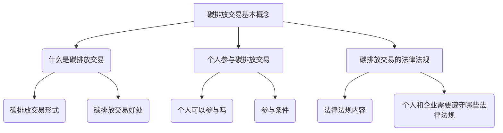
## 附录C：智能个人碳排放交易流程图与伪代码

为了更好地理解智能个人碳排放交易的过程，我们提供以下流程图和伪代码示例，旨在详细展示从数据收集到碳排放计算，再到交易完成的各个环节。

### C.1 智能个人碳排放计算流程图

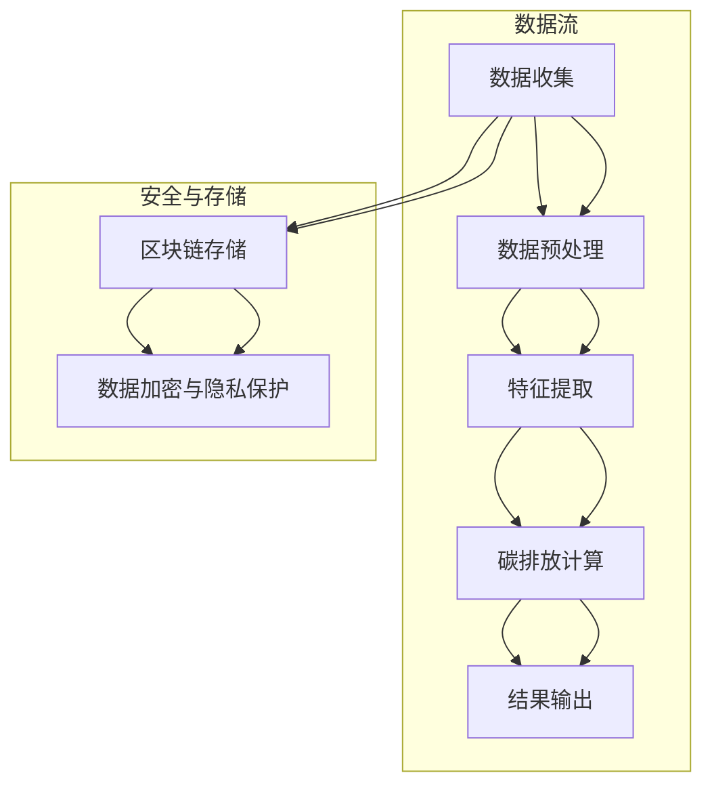

### C.2 智能交易算法伪代码示例

以下是一个简单的伪代码示例，用于演示智能交易算法的基本框架：

```plaintext
// 输入参数
carbon_data = 获取个人碳排放数据
target_price = 设定目标碳价格
market_data = 获取市场碳价格数据

// 数据预处理
preprocessed_data = 数据预处理(carbon_data)

// 碳排放计算
emission_estimate = 计算碳排放量(preprocessed_data)

// 交易策略
if (emission_estimate < target_price) {
    // 碳盈余，出售碳排放权
    transaction = 出售碳排放权(preprocessed_data)
} else {
    // 碳负债，购买碳排放权
    transaction = 购买碳排放权(preprocessed_data)
}

// 数据存储与加密
store_transaction(transaction)
encrypt_data(transaction)

// 输出结果
print("交易完成：", transaction)
```

### C.3 智能碳排放交易平台架构图

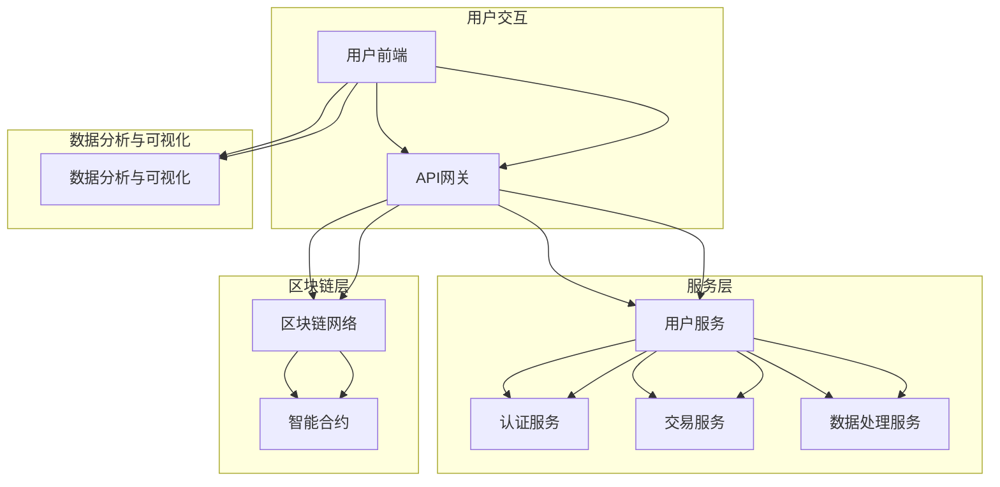

通过这些流程图和伪代码示例，我们可以清晰地看到智能个人碳排放交易系统的运作流程，以及各个环节如何相互协作，共同实现碳排放数据的计算、存储、交易和分析。这些工具和资源对于开发智能个人碳排放交易系统具有重要的指导意义。在后续的实践中，可以根据这些示例进行进一步的优化和实现。

