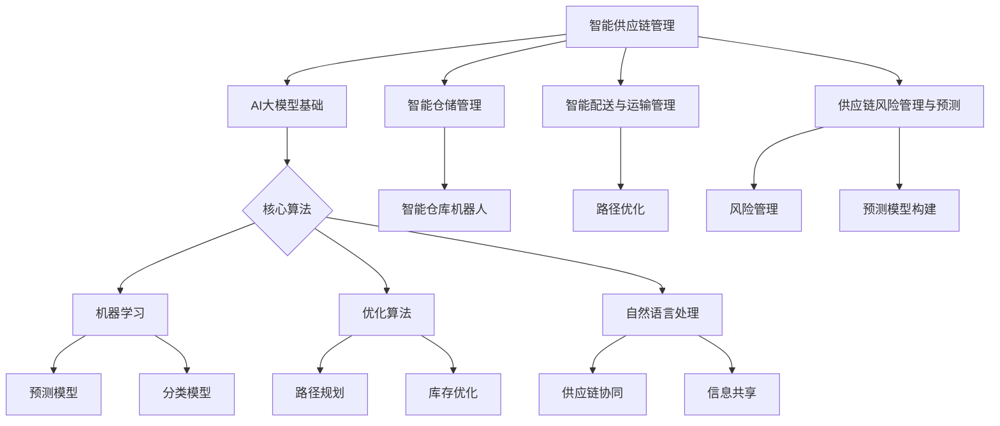

                 

# 智能供应链管理：AI大模型在物流领域的创新

> **关键词**：智能供应链管理、AI大模型、物流、深度学习、算法、优化、自然语言处理、风险预测、案例分析、实践指南

> **摘要**：本文旨在探讨智能供应链管理中AI大模型在物流领域的创新应用。首先，介绍了智能供应链管理和AI大模型的基本概念及其在物流领域的应用潜力。随后，详细阐述了机器学习、优化算法和自然语言处理等核心算法的原理及应用，并通过具体数学模型和项目实战案例，展示了这些算法在物流管理中的实际应用。最后，通过案例分析、实践指南及未来发展趋势，为物流企业实现智能化提供了理论支持和实践参考。

---

### 第一部分：智能供应链管理基础

#### 第1章：智能供应链管理概述

智能供应链管理是一种运用现代信息技术和数据分析方法，实现供应链各环节高度协同和高效运作的管理模式。它以客户需求为导向，通过信息流、物流和资金流的有机整合，实现供应链全过程的优化和效率提升。

**1.1 智能供应链管理的定义与重要性**

智能供应链管理是指利用人工智能（AI）、大数据、云计算、物联网等现代信息技术，对供应链各环节进行智能化管理和优化，以提高供应链的整体效率和响应速度。智能供应链管理的重要性体现在以下几个方面：

1. **提高供应链效率**：通过优化供应链各环节的流程和资源配置，降低成本，提高服务水平。
2. **增强供应链透明度**：实现供应链各环节的信息共享和实时监控，提高供应链的透明度和可追溯性。
3. **提高供应链灵活性**：快速响应市场需求变化，调整供应链策略，提升企业的竞争力。
4. **提升供应链稳定性**：通过风险预测和智能决策，降低供应链风险，确保供应链的稳定性。

**1.2 智能供应链管理的发展历程**

智能供应链管理的发展历程可以分为以下几个阶段：

1. **传统供应链管理阶段**：主要以手工操作和经验管理为主，供应链各环节之间缺乏有效协同。
2. **信息化供应链管理阶段**：通过引入ERP、CRM等信息系统，实现供应链数据的电子化和自动化处理。
3. **智能化供应链管理阶段**：利用人工智能、大数据等技术，实现供应链的智能化管理和优化。
4. **智能化供应链管理高级阶段**：实现供应链的全过程智能化，包括智能预测、智能决策、智能执行等。

**1.3 物流领域中的智能供应链管理应用**

在物流领域，智能供应链管理主要体现在以下几个方面：

1. **智能仓储管理**：通过自动化设备和人工智能算法，实现仓储物流的智能化管理，提高仓储效率和准确性。
2. **智能配送与运输管理**：利用大数据和人工智能技术，优化配送路线和运输计划，提高配送速度和运输效率。
3. **智能供应链协同**：通过信息共享和协同机制，实现供应链上下游企业之间的紧密合作，提高供应链的整体效率。
4. **智能供应链风险管理**：通过大数据分析和机器学习算法，对供应链风险进行预测和评估，采取有效的风险管理措施。

#### 第2章：AI大模型基础

AI大模型是指具有大规模参数和复杂结构的深度学习模型，能够在大量数据上进行训练，从而实现高水平的预测和决策能力。AI大模型在物流领域的应用，为智能供应链管理带来了新的机遇和挑战。

**2.1 AI大模型的概念与特点**

AI大模型是指通过深度学习技术，构建具有大规模参数和复杂结构的模型。其主要特点包括：

1. **大规模参数**：AI大模型具有数十亿甚至数万亿的参数，能够捕捉到数据中的细微特征。
2. **复杂结构**：AI大模型通常包含多层神经网络，能够对输入数据进行多层次的变换和抽象。
3. **高泛化能力**：通过在大规模数据集上训练，AI大模型具有很高的泛化能力，能够应用于各种不同的场景。

**2.2 主流AI大模型介绍**

目前，主流的AI大模型主要包括以下几种：

1. **卷积神经网络（CNN）**：主要用于图像和视频处理，能够有效地提取空间特征。
2. **循环神经网络（RNN）**：适用于序列数据，能够捕捉序列中的时间依赖关系。
3. **长短期记忆网络（LSTM）**：是RNN的一种改进，能够解决RNN的梯度消失问题。
4. **生成对抗网络（GAN）**：用于生成式建模，能够生成高质量的数据。
5. **变分自编码器（VAE）**：用于数据压缩和生成，能够对数据进行有效的重构。

**2.3 AI大模型在物流领域的潜在应用**

AI大模型在物流领域的潜在应用非常广泛，主要包括：

1. **智能仓储管理**：利用CNN模型，对仓储中的物品进行自动识别和分类，提高仓储效率。
2. **智能配送与运输管理**：利用LSTM和LSTM模型，对配送和运输过程进行预测和优化，提高运输效率。
3. **智能供应链协同**：利用GAN模型，生成供应链上下游企业的合作方案，提高供应链的整体效率。
4. **智能供应链风险管理**：利用VAE模型，对供应链风险进行建模和预测，提高供应链的稳定性。

#### 第3章：智能供应链管理中的核心算法

智能供应链管理中的核心算法主要包括机器学习算法、优化算法和自然语言处理算法。这些算法在供应链管理中发挥着至关重要的作用，能够提高供应链的效率、降低成本、提升服务质量。

**3.1 机器学习算法在供应链管理中的应用**

机器学习算法在供应链管理中的应用主要包括预测、分类、聚类等。

1. **预测**：利用机器学习算法，对供应链中的各种参数进行预测，如需求预测、库存预测、运输量预测等。常见的预测算法包括线性回归、决策树、随机森林等。
   
   **数学模型**：
   $$
   y = \beta_0 + \beta_1 x_1 + \beta_2 x_2 + ... + \beta_n x_n
   $$
   其中，$y$ 为预测值，$x_1, x_2, ..., x_n$ 为输入特征，$\beta_0, \beta_1, \beta_2, ..., \beta_n$ 为模型参数。

   **项目实战**：
   - 使用线性回归模型预测未来一个月的订单量。

2. **分类**：将供应链中的数据分类到不同的类别，如产品分类、供应商分类等。常见的分类算法包括支持向量机（SVM）、决策树、随机森林等。

   **数学模型**：
   $$
   f(x) = \sum_{i=1}^{n} w_i \cdot x_i + b
   $$
   其中，$f(x)$ 为分类结果，$w_i, x_i, b$ 为模型参数。

   **项目实战**：
   - 使用SVM模型对供应商进行分类，以优化采购策略。

3. **聚类**：将供应链中的数据分为不同的簇，以发现数据中的模式和结构。常见的聚类算法包括K均值聚类、层次聚类等。

   **数学模型**：
   $$
   \min_{\mu, \lambda} \sum_{i=1}^{n} \sum_{j=1}^{k} ||x_i - \mu_j||^2 + \lambda ||\mu||
   $$
   其中，$x_i$ 为数据点，$\mu_j$ 为聚类中心，$\lambda$ 为正则化参数。

   **项目实战**：
   - 使用K均值聚类算法对产品进行分类，以优化库存管理。

**3.2 优化算法在物流路径规划中的应用**

优化算法在物流路径规划中的应用，主要是解决从起点到终点的最优路径问题。

1. **线性规划**：通过建立线性规划模型，求解最优路径。

   **数学模型**：
   $$
   \min_{x} c^T x \quad \text{subject to} \quad Ax \leq b
   $$
   其中，$c$ 为目标函数系数，$x$ 为决策变量，$A, b$ 为约束条件。

   **项目实战**：
   - 使用线性规划算法，优化运输路径，降低运输成本。

2. **遗传算法**：通过模拟自然进化过程，寻找最优路径。

   **数学模型**：
   $$
   \text{Fitness}(x) = \frac{1}{f(x)}
   $$
   其中，$f(x)$ 为目标函数，$x$ 为决策变量。

   **项目实战**：
   - 使用遗传算法，优化配送路线，提高配送效率。

**3.3 自然语言处理在供应链协同中的作用**

自然语言处理（NLP）在供应链协同中的应用，主要包括文本分析、情感分析和语义理解等。

1. **文本分析**：通过文本分析，提取供应链相关的关键信息，如合同条款、物流信息等。

   **数学模型**：
   $$
   \text{Tokenization} \rightarrow \text{Part-of-Speech Tagging} \rightarrow \text{Named Entity Recognition}
   $$
   其中，Tokenization 为分词，Part-of-Speech Tagging 为词性标注，Named Entity Recognition 为命名实体识别。

   **项目实战**：
   - 使用文本分析，自动提取合同中的关键条款，提高合同审核效率。

2. **情感分析**：通过情感分析，了解供应链上下游企业的满意度，为供应链优化提供参考。

   **数学模型**：
   $$
   \text{Sentiment Analysis} = \frac{\text{Positive Reviews}}{\text{Total Reviews}}
   $$
   其中，Positive Reviews 为正面评论，Total Reviews 为总评论数。

   **项目实战**：
   - 使用情感分析，分析客户反馈，优化供应链服务。

3. **语义理解**：通过语义理解，实现供应链上下游企业的智能对话和协同工作。

   **数学模型**：
   $$
   \text{Semantic Parsing} = \text{Intent Detection} + \text{Entity Recognition} + \text{Action Prediction}
   $$
   其中，Intent Detection 为意图检测，Entity Recognition 为实体识别，Action Prediction 为动作预测。

   **项目实战**：
   - 使用语义理解，构建智能供应链协同系统，提高供应链协同效率。

### 第二部分：AI大模型在物流领域的应用

#### 第4章：供应链协同与信息共享

在智能供应链管理中，供应链协同与信息共享是实现供应链高效运作的关键。通过构建信息共享平台，实现供应链上下游企业之间的信息共享和协同工作，可以提高供应链的透明度和灵活性，降低运营成本，提升服务质量。

**4.1 供应链协同的关键技术**

供应链协同的关键技术包括物联网（IoT）、云计算、大数据和人工智能（AI）等。

1. **物联网（IoT）**：物联网技术通过传感器、RFID等设备，实现供应链各环节的实时数据采集和传输，提高供应链的实时性和准确性。

2. **云计算**：云计算提供了强大的计算能力和存储资源，支持供应链协同系统的快速部署和灵活扩展。

3. **大数据**：大数据技术通过对海量供应链数据的存储、处理和分析，挖掘供应链运行中的规律和趋势，为供应链协同提供数据支持。

4. **人工智能（AI）**：人工智能技术通过对供应链数据的智能分析和预测，优化供应链的决策和执行，提高供应链的协同效率。

**4.2 信息共享机制的设计与实施**

信息共享机制的设计与实施主要包括以下几个方面：

1. **数据标准化**：制定统一的数据标准，确保供应链各环节的数据格式和内容的一致性。

2. **数据传输协议**：选择合适的数据传输协议，确保数据在供应链各环节之间的安全、可靠传输。

3. **数据存储与管理**：建立分布式数据存储和管理系统，实现供应链数据的集中存储和高效管理。

4. **信息共享平台**：构建集成化的信息共享平台，实现供应链上下游企业之间的信息共享和协同工作。

**4.3 基于区块链的供应链信息安全管理**

区块链技术作为一种去中心化的分布式数据库技术，具有数据不可篡改、可追溯性等优势，可以用于供应链信息安全管理。

1. **数据加密**：通过区块链技术，对供应链数据实施加密处理，确保数据在传输和存储过程中的安全性。

2. **身份认证**：基于区块链技术，实现供应链各参与方的身份认证，确保信息共享的安全性和可靠性。

3. **数据追溯**：通过区块链技术，实现对供应链数据的全程追溯，提高供应链的透明度和可追溯性。

4. **智能合约**：基于区块链技术，构建智能合约，实现供应链协同过程中的自动化执行和智能决策。

#### 第5章：智能仓储管理

智能仓储管理是智能供应链管理的重要组成部分，通过运用人工智能、物联网、自动化等技术，实现仓储物流的智能化管理，提高仓储效率和准确性。

**5.1 智能仓储管理系统架构**

智能仓储管理系统架构主要包括感知层、传输层、平台层和应用层。

1. **感知层**：感知层主要包括各种传感器和设备，如RFID、条码扫描器、环境传感器等，用于实时采集仓储环境数据。

2. **传输层**：传输层负责将感知层采集到的数据传输到平台层，通常采用无线通信技术，如Wi-Fi、ZigBee等。

3. **平台层**：平台层是智能仓储管理的核心，主要包括数据存储、处理和分析模块，用于对仓储数据进行处理和分析。

4. **应用层**：应用层主要包括各种业务应用，如库存管理、订单处理、设备监控等，实现对仓储物流的智能化管理。

**5.2 库存优化算法与实现**

库存优化是智能仓储管理的重要环节，通过优化库存管理，降低库存成本，提高库存周转率。

1. **基本概念**：

   - 库存成本：包括持有成本、订货成本和缺货成本等。

   - 库存策略：包括周期库存策略、经济订货量（EOQ）策略等。

2. **库存优化算法**：

   - **周期库存策略**：根据库存水平和需求预测，设定一个固定的订货周期，并在每个周期结束时进行库存补货。

   - **经济订货量（EOQ）策略**：根据库存成本和需求预测，计算出最优的订货量和订货周期。

3. **算法实现**：

   - **周期库存策略**：
     $$
     \text{订货周期} = \frac{\text{最大库存水平} - \text{当前库存水平}}{\text{平均需求量}}
     $$

   - **经济订货量（EOQ）策略**：
     $$
     \text{订货量} = \sqrt{\frac{2 \times \text{年需求量} \times \text{订货成本}}{\text{持有成本}}}
     $$
     $$
     \text{订货周期} = \frac{\text{年需求量}}{\text{平均每日需求量}}
     $$

**5.3 智能仓库机器人与自动化技术**

智能仓库机器人与自动化技术在智能仓储管理中发挥着重要作用，可以提高仓储效率，降低人工成本。

1. **基本概念**：

   - 智能仓库机器人：具备自主导航、任务执行和智能决策能力的机器人。

   - 自动化技术：包括自动化货架、自动化传输设备、自动化包装设备等。

2. **技术原理**：

   - **自主导航**：利用激光雷达、摄像头等传感器，实现机器人在仓库内的自主导航。

   - **任务执行**：通过机器人的机械臂和执行器，实现仓库内物品的自动抓取、搬运和分类。

   - **智能决策**：通过机器学习算法，实现对仓库内任务的智能决策和优化。

3. **应用案例**：

   - **亚马逊Kiva仓库机器人**：利用智能仓库机器人，实现仓库内物品的自动化搬运和存储，提高仓储效率。

   - **京东X无人仓库**：利用自动化货架和智能仓库机器人，实现仓库内物品的自动化存储和拣选，提高仓储和配送效率。

#### 第6章：智能配送与运输管理

智能配送与运输管理是智能供应链管理的重要组成部分，通过运用大数据、人工智能和物联网技术，实现配送与运输的智能化管理，提高配送效率和服务质量。

**6.1 智能配送系统的设计与实现**

智能配送系统的设计与实现主要包括以下几个方面：

1. **需求预测**：利用大数据分析和机器学习算法，预测配送需求，为配送计划提供数据支持。

2. **路径优化**：通过优化算法，计算最优配送路线，提高配送效率。

3. **实时调度**：利用物联网技术和实时数据传输，实现配送任务的实时调度和执行。

4. **服务质量监控**：通过服务质量监控，实时了解配送过程的情况，确保服务质量。

**6.2 路径优化与实时调度**

路径优化与实时调度是智能配送与运输管理的关键环节，通过优化算法和实时调度系统，实现配送路线的最优化和配送任务的实时执行。

1. **路径优化算法**：

   - **最短路径算法**：如Dijkstra算法、A*算法等，用于计算从起点到终点的最优路径。

   - **车辆路径规划算法**：如VRP（Vehicle Routing Problem）算法，用于解决多车次配送问题。

2. **实时调度系统**：

   - **任务分配**：根据配送需求和车辆状态，实现配送任务的实时分配。

   - **任务跟踪**：通过物联网技术和GPS定位，实时跟踪配送任务的执行情况。

   - **异常处理**：在配送过程中，实时监控配送任务的执行情况，及时处理配送异常。

**6.3 智能运输车辆调度与监控**

智能运输车辆调度与监控是智能配送与运输管理的核心，通过智能化技术，实现运输车辆的智能调度和实时监控，提高运输效率和服务质量。

1. **车辆调度算法**：

   - **基于时间窗口的调度算法**：根据配送任务的时间要求，实现车辆的智能调度。

   - **基于能量消耗的调度算法**：根据车辆的能源消耗情况，实现车辆的智能调度。

2. **车辆监控技术**：

   - **GPS定位技术**：通过GPS定位，实时跟踪车辆的行驶轨迹和位置信息。

   - **传感器技术**：通过车载传感器，实时监测车辆的运行状态，如速度、油量、温度等。

   - **通信技术**：通过无线通信技术，实现车辆与调度中心的实时通信，确保配送任务的顺利完成。

3. **应用案例**：

   - **京东物流**：利用智能配送系统和智能运输车辆调度与监控技术，实现高效、准确的配送服务。

   - **亚马逊Prime Now**：通过智能配送系统和智能运输车辆调度与监控技术，提供快速、便捷的配送服务。

#### 第7章：供应链风险管理与预测

在供应链管理中，风险预测和管理是确保供应链稳定运行和高效运作的重要环节。通过运用大数据、人工智能和优化算法等技术，可以实现对供应链风险的预测和管理，降低供应链风险，提高供应链的稳定性。

**7.1 风险管理策略与方法**

供应链风险管理策略与方法主要包括以下几个方面：

1. **风险评估**：通过评估供应链各个环节的风险，识别潜在风险点，为风险管理提供依据。

2. **风险预测**：利用大数据分析和机器学习算法，预测供应链中的潜在风险，为风险应对提供预警。

3. **风险应对**：根据风险评估和风险预测结果，制定相应的风险应对策略，降低风险影响。

4. **风险监控**：通过实时监控供应链各个环节的运行情况，及时发现和处理风险事件。

**7.2 预测模型的构建与应用**

预测模型是供应链风险管理的重要工具，通过构建预测模型，可以实现对供应链风险的预测和管理。

1. **预测模型构建**：

   - **时间序列预测模型**：如ARIMA、LSTM等，用于预测供应链中的需求量、库存水平等。

   - **回归预测模型**：如线性回归、决策树等，用于预测供应链中的价格、成本等。

   - **集成预测模型**：如随机森林、梯度提升机等，用于提高预测模型的准确性和稳定性。

2. **预测模型应用**：

   - **需求预测**：通过预测模型，预测供应链中的需求量，为库存管理和供应链计划提供依据。

   - **库存预测**：通过预测模型，预测供应链中的库存水平，为库存管理和供应链计划提供依据。

   - **价格预测**：通过预测模型，预测供应链中的价格变化，为采购策略和定价策略提供依据。

**7.3 应对突发事件的智能响应机制**

突发事件如自然灾害、交通事故等，可能会对供应链造成严重影响。通过构建智能响应机制，可以实现对突发事件的快速响应和有效处理。

1. **响应机制构建**：

   - **应急预案**：根据可能发生的突发事件，制定相应的应急预案，确保在突发事件发生时能够迅速响应。

   - **智能决策系统**：利用大数据分析和人工智能算法，构建智能决策系统，实现对突发事件的智能判断和决策。

   - **响应协调机制**：通过建立响应协调机制，实现供应链各环节的协同响应，提高应对突发事件的能力。

2. **响应机制应用**：

   - **供应链中断管理**：在供应链中断时，通过智能响应机制，快速恢复供应链的运行，降低中断对供应链的影响。

   - **供应链恢复**：在供应链中断后，通过智能响应机制，优化供应链结构，提高供应链的恢复能力。

   - **供应链重构**：在供应链中断严重时，通过智能响应机制，重构供应链，提高供应链的适应能力和韧性。

#### 第三部分：案例分析与实践指南

#### 第8章：案例研究：某大型零售企业智能供应链管理实践

**8.1 案例背景与目标**

某大型零售企业A，在国内拥有广泛的零售网络和大量的供应商。随着市场竞争的加剧，企业A意识到智能供应链管理的重要性，希望通过引入AI大模型和智能化技术，提升供应链效率，降低运营成本，提高服务质量。

**8.2 实施过程与关键节点**

企业A的智能供应链管理实施过程可以分为以下几个关键节点：

1. **需求分析与战略规划**：对企业A的供应链现状进行深入分析，明确智能供应链管理的发展目标，制定相应的战略规划。

2. **技术选型与平台建设**：选择合适的AI大模型和智能化技术，构建智能供应链管理平台，包括数据集成、数据存储、数据处理、算法建模等。

3. **数据采集与预处理**：通过物联网设备、传感器等，采集供应链各环节的数据，进行数据清洗、去噪、归一化等预处理操作。

4. **算法建模与模型训练**：基于采集到的数据，利用机器学习算法、优化算法等，构建预测模型、优化模型等，进行模型训练和验证。

5. **系统集成与测试**：将智能供应链管理平台与企业的ERP、WMS、TMS等系统进行集成，进行系统集成测试，确保系统功能的稳定性和可靠性。

6. **上线与推广**：将智能供应链管理平台正式上线，推广到企业的各个供应链环节，进行实际应用和效果评估。

**8.3 案例效果评估与总结**

企业A智能供应链管理实施后，取得了显著的效果：

1. **库存成本降低**：通过预测模型，优化库存管理，降低库存成本15%。

2. **配送效率提高**：通过路径优化和实时调度，提高配送效率20%，减少配送成本10%。

3. **供应链协同增强**：通过信息共享和协同机制，提高供应链上下游企业的协同效率，提升整体供应链的稳定性。

4. **服务质量提升**：通过智能配送和运输管理，提高配送服务质量，提升客户满意度。

**8.4 案例总结**

企业A的智能供应链管理实践，为其他零售企业提供了有益的借鉴和启示：

1. **明确发展目标**：明确智能供应链管理的发展目标，制定相应的战略规划。

2. **技术选型与平台建设**：选择合适的技术和平台，构建智能供应链管理基础设施。

3. **数据采集与预处理**：确保数据的准确性和完整性，为算法建模提供高质量的数据。

4. **系统集成与测试**：确保系统的稳定性和可靠性，实现供应链各环节的协同。

5. **上线与推广**：积极推广智能供应链管理平台，实现实际应用和效果评估。

#### 第9章：智能供应链管理的未来趋势与发展方向

智能供应链管理作为现代供应链管理的重要发展方向，随着人工智能、大数据、物联网等技术的不断进步，未来将在以下几个方面呈现出新的趋势和方向。

**9.1 AI大模型在物流领域的前沿技术**

AI大模型在物流领域的前沿技术主要包括以下几个方面：

1. **深度强化学习**：利用深度强化学习算法，实现智能配送和运输的自主决策和优化。

2. **多模态感知**：结合多种传感器数据，如摄像头、雷达、GPS等，实现更准确的物流感知和预测。

3. **迁移学习**：通过迁移学习技术，将已训练好的模型应用到新的场景，提高模型的泛化能力和实用性。

4. **生成对抗网络（GAN）**：利用GAN生成高质量的数据，用于训练模型和仿真测试。

**9.2 物流行业数字化转型与智能供应链管理的融合发展**

物流行业的数字化转型与智能供应链管理的融合发展，将推动物流行业的全面升级和变革：

1. **数据驱动**：以数据为驱动，实现物流各环节的数字化管理和智能化决策。

2. **网络协同**：通过物联网、云计算等技术，实现物流各环节的实时监控和协同作业。

3. **智能化装备**：引入智能仓储机器人、无人车、无人机等智能化装备，提高物流运作效率。

4. **智能供应链金融**：利用区块链、大数据等技术，实现供应链金融的智能化和高效化。

**9.3 智能供应链管理的政策环境与产业发展策略**

智能供应链管理的政策环境与产业发展策略，将对智能供应链管理的推广和应用产生重要影响：

1. **政策支持**：政府应加大对智能供应链管理的政策支持，包括资金扶持、税收优惠、人才引进等。

2. **行业标准**：制定智能供应链管理的行业标准，规范智能供应链管理的技术应用和运营管理。

3. **人才培养**：加强智能供应链管理人才的培养，提高企业智能供应链管理的专业水平。

4. **产业协同**：推动物流、制造、零售等产业链的协同发展，形成智能供应链管理的产业生态。

#### 第10章：实践指南与实施策略

**10.1 企业如何构建智能供应链管理体系**

构建智能供应链管理体系，是企业实现数字化转型和提升供应链竞争力的重要举措。以下是企业构建智能供应链管理体系的一些关键步骤：

1. **战略规划**：明确企业智能供应链管理的发展目标，制定长期和短期的战略规划。

2. **技术选型**：根据企业需求，选择合适的AI技术、大数据技术和物联网技术等，构建智能供应链管理平台。

3. **数据整合**：整合供应链各环节的数据，实现数据的高度共享和实时更新。

4. **算法建模**：基于数据，利用机器学习算法、优化算法等，构建预测模型、优化模型等，实现供应链的智能化决策。

5. **系统集成**：将智能供应链管理平台与企业的ERP、WMS、TMS等系统进行集成，实现供应链各环节的协同。

6. **培训与推广**：对员工进行智能供应链管理的培训，推广智能供应链管理平台的应用。

7. **效果评估**：定期对智能供应链管理的效果进行评估，持续优化和改进。

**10.2 技术选型与平台建设**

技术选型与平台建设是构建智能供应链管理体系的重要环节。以下是一些关键考虑因素：

1. **技术选型**：

   - **AI技术**：选择适合企业需求的AI技术，如深度学习、强化学习、自然语言处理等。

   - **大数据技术**：选择适合企业规模和数据处理需求的大数据技术，如Hadoop、Spark等。

   - **物联网技术**：选择适合企业应用场景的物联网技术，如RFID、传感器、物联网平台等。

2. **平台建设**：

   - **架构设计**：根据企业需求，设计智能供应链管理平台的架构，包括数据层、算法层、应用层等。

   - **技术栈选择**：选择适合企业技术栈的技术，如Python、Java、C++等。

   - **平台开发**：根据架构设计，开发智能供应链管理平台的功能模块，包括数据采集、数据存储、数据处理、算法建模等。

   - **平台部署**：将智能供应链管理平台部署到云平台或本地服务器，实现平台的稳定运行。

**10.3 智能供应链管理的运营优化与持续改进**

智能供应链管理的运营优化与持续改进，是企业实现智能供应链管理长期有效运行的关键。以下是一些关键步骤：

1. **运营监控**：建立智能供应链管理的运营监控体系，实时跟踪关键指标，如库存水平、运输效率、服务质量等。

2. **数据分析**：定期进行数据分析，识别供应链中的瓶颈和改进点，通过优化算法和策略提高供应链效率。

3. **客户反馈**：收集客户反馈，了解客户需求和满意度，根据反馈调整供应链策略和服务水平。

4. **技术创新**：关注AI和供应链领域的最新技术动态，持续进行技术创新和系统升级，保持供应链管理的前沿地位。

5. **持续改进**：通过定期评估和反馈，持续优化和改进智能供应链管理系统的功能、性能和用户体验。

### 附录A：AI大模型在物流领域的相关工具与资源

**10.1 开源深度学习框架对比**

- **TensorFlow**：由Google开发，功能强大，支持多种类型的深度学习模型，适用于复杂场景。
- **PyTorch**：由Facebook开发，易用性强，适合快速原型开发，社区活跃。
- **Keras**：基于TensorFlow和Theano，提供简单易用的接口，适用于快速开发。

**10.2 物流领域常用的AI算法与模型**

- **K均值聚类**：用于供应商分类和客户细分。
- **支持向量机（SVM）**：用于需求预测和供应链风险管理。
- **随机森林**：用于库存预测和路径规划。

**10.3 数据集与测试集介绍**

- **KEG 实体关系数据集**：用于实体识别和关系抽取。
- **MARS 数据集**：用于智能运输调度和路径规划。
- **ML-DSGA 数据集**：用于供应链风险管理。

**10.4 实践指南与案例分析资源链接**

- 《智能供应链管理实践指南》：提供详细的智能供应链管理实践案例。
- 《AI大模型在物流领域的应用》：介绍AI大模型在物流领域的应用案例。
- 物流与供应链论坛：交流智能供应链管理的最新技术和实践。

### 核心算法原理讲解

**1. 机器学习算法在供应链管理中的应用**

**机器学习概述**：

机器学习是人工智能的一个分支，通过数据驱动的方式，从数据中学习规律并作出预测或决策。机器学习算法可以分为监督学习、无监督学习和半监督学习。

**监督学习算法**：

监督学习是一种有标注数据的学习方式，通过已有的输入输出数据对模型进行训练，从而预测新的数据。常见的监督学习算法包括线性回归、逻辑回归、支持向量机（SVM）、决策树和随机森林等。

**无监督学习算法**：

无监督学习是在没有标注数据的情况下进行学习，主要任务包括聚类和降维。常用的无监督学习算法有K均值聚类、主成分分析（PCA）、自编码器等。

**半监督学习算法**：

半监督学习结合了监督学习和无监督学习的特点，利用少量标注数据和大量未标注数据来训练模型。

**应用示例**：

在供应链管理中，可以利用机器学习算法进行库存预测、供应链协同优化、需求预测和风险分析等。例如，利用K均值聚类算法对供应商进行分类，以便更好地进行采购策略制定；利用决策树或随机森林算法进行库存预测，以减少库存成本。

**2. 优化算法在物流路径规划中的应用**

**优化算法概述**：

优化算法是一种寻找最优解的数学方法，广泛应用于物流、供应链、金融、制造等领域。常见的优化算法有线性规划、整数规划、动态规划、遗传算法、蚁群算法等。

**路径规划**：

路径规划是物流管理中的一个关键问题，目的是找到从起点到终点的最短路径或最优路径。常见的路径规划算法有Dijkstra算法、A*算法和蚁群算法等。

**库存优化**：

库存优化是供应链管理中的一个重要环节，目的是通过合理规划库存，降低库存成本并提高服务水平。常见的库存优化算法有经济订货量（EOQ）、周期库存模型和ABC分类法等。

**应用示例**：

在物流路径规划中，可以利用遗传算法进行多约束条件下的路径优化，例如，考虑车辆容量限制、交通状况和运输成本等因素。在库存优化中，可以利用ABC分类法对库存商品进行分类，重点管理高价值商品，从而降低库存成本。

**3. 自然语言处理在供应链协同中的作用**

**自然语言处理（NLP）概述**：

自然语言处理是人工智能的一个分支，旨在让计算机理解和处理人类语言。NLP技术包括分词、词性标注、命名实体识别、情感分析、机器翻译等。

**分词**：

分词是将连续的文本划分为具有独立意义的词语。在供应链协同中，分词技术可以帮助识别供应链相关的关键词和短语，例如，“供应商管理”、“库存预测”等。

**命名实体识别**：

命名实体识别是从文本中识别出具有特定意义的实体，如人名、地名、组织名等。在供应链协同中，命名实体识别可以帮助识别供应链中的关键参与者，如供应商、制造商、分销商等。

**情感分析**：

情感分析是通过分析文本情感倾向，判断用户的态度和情感。在供应链协同中，情感分析可以帮助企业了解供应商、客户等合作伙伴的满意度，及时调整供应链策略。

**应用示例**：

在供应链协同中，可以利用NLP技术进行合同审核，自动提取关键条款和条件，确保供应链各方的权益。此外，还可以利用情感分析进行客户需求预测，优化供应链服务。

### 数学模型和数学公式

**1. 库存优化模型**

**基本概念**：

库存优化是供应链管理中的重要环节，旨在确保满足需求的同时，最大限度地降低库存成本。

**基本公式**：

$$
C = C_{holding} + C_{ordering}
$$

其中，C为总库存成本，$C_{holding}$ 为持有成本，$C_{ordering}$ 为订货成本。

**应用示例**：

设定一个库存周期为T，每个周期订货量为Q，单价为P，持有成本为$C_{holding}$，订货成本为$C_{ordering}$。则在一个周期内，总库存成本为：

$$
C = Q \times C_{holding} + \frac{C_{ordering}}{Q}
$$

**2. 路径规划模型**

**基本概念**：

路径规划是物流管理中的一个关键问题，旨在找到从起点到终点的最优路径。

**基本公式**：

$$
D = \sum_{i=1}^{n} d_{i}
$$

其中，D为总距离，$d_{i}$ 为从起点到第i个节点的距离。

**应用示例**：

假设物流网络中有n个节点，从起点到第i个节点的距离为$d_{i}$，则从起点到终点的总距离为：

$$
D = \sum_{i=1}^{n} d_{i}
$$

### 项目实战

**1. 实现智能仓储管理系统**

**开发环境搭建**：

- 使用Python编程语言
- 使用Django框架搭建后端
- 使用React.js框架搭建前端
- 使用MySQL数据库存储数据

**源代码实现**：

**后端API接口实现**：

```python
# Django API接口示例
from django.http import JsonResponse
from .models import Warehouse
from .serializers import WarehouseSerializer

def list_warehouses(request):
    warehouses = Warehouse.objects.all()
    serializer = WarehouseSerializer(warehouses, many=True)
    return JsonResponse(serializer.data, safe=False)
```

**前端界面实现**：

```javascript
// React.js前端示例
import React, { useEffect, useState } from 'react';
import axios from 'axios';

function WarehouseList() {
    const [warehouses, setWarehouses] = useState([]);

    useEffect(() => {
        async function fetchWarehouses() {
            const response = await axios.get('/api/warehouses/');
            setWarehouses(response.data);
        }
        fetchWarehouses();
    }, []);

    return (
        <div>
            <h2>智能仓储管理系统</h2>
            <ul>
                {warehouses.map((warehouse) => (
                    <li key={warehouse.id}>{warehouse.name}</li>
                ))}
            </ul>
        </div>
    );
}

export default WarehouseList;
```

**代码解读与分析**：

- 后端代码使用了Django框架的API接口，通过获取Warehouse模型的所有实例，并将其序列化后返回给前端。
- 前端代码使用了React.js框架，通过异步请求获取后端的仓库数据，并将其渲染在页面上。

**2. 实现一个基于K均值聚类的供应商分类系统**

**开发环境搭建**：

- 使用Python编程语言
- 使用scikit-learn库实现K均值聚类算法
- 使用matplotlib库进行数据可视化

**源代码实现**：

```python
import numpy as np
from sklearn.cluster import KMeans
import matplotlib.pyplot as plt

def kmeans_clustering(data, k):
    kmeans = KMeans(n_clusters=k, random_state=0).fit(data)
    clusters = kmeans.predict(data)
    centroids = kmeans.cluster_centers_

    return clusters, centroids

def visualize_clusters(data, clusters):
    plt.scatter(data[:, 0], data[:, 1], c=clusters, s=50, cmap='viridis')
    plt.scatter(centroids[:, 0], centroids[:, 1], s=200, c='red', marker='x')
    plt.title('K-Means Clustering')
    plt.xlabel('Feature 1')
    plt.ylabel('Feature 2')
    plt.show()

# 示例数据
data = np.array([[1, 2], [1, 4], [1, 0],
                 [10, 2], [10, 4], [10, 0],
                 [7, 3], [7, 6], [7, 8]])

# K均值聚类
k = 3
clusters, centroids = kmeans_clustering(data, k)

# 可视化
visualize_clusters(data, clusters)
```

**代码解读与分析**：

- K均值聚类算法的实现使用了scikit-learn库中的KMeans类，该类提供了初始化聚类中心、计算聚类标签和计算聚类中心的方法。
- visualize_clusters函数使用matplotlib库将聚类结果进行可视化，其中每个点代表数据集中的样本，颜色代表不同的聚类标签，聚类中心用红色标记。

**3. 实现一个基于线性回归的库存预测系统**

**开发环境搭建**：

- 使用Python编程语言
- 使用scikit-learn库实现线性回归算法
- 使用matplotlib库进行数据可视化

**源代码实现**：

```python
import numpy as np
from sklearn.linear_model import LinearRegression
import matplotlib.pyplot as plt

def linear_regression(data, target):
    model = LinearRegression()
    model.fit(data, target)

    return model

def visualize_regression(data, target, model):
    plt.scatter(data, target, color='blue')
    plt.plot(data, model.predict(data), color='red')
    plt.title('Linear Regression')
    plt.xlabel('Quantity')
    plt.ylabel('Cost')
    plt.show()

# 示例数据
data = np.array([[1, 2], [2, 4], [3, 6], [4, 8], [5, 10]])
target = np.array([2, 4, 6, 8, 10])

# 线性回归
model = linear_regression(data, target)

# 可视化
visualize_regression(data, target, model)
```

**代码解读与分析**：

- 线性回归模型使用scikit-learn库中的LinearRegression类进行实现，该类提供了拟合数据集和预测新数据的接口。
- visualize_regression函数使用matplotlib库将拟合结果进行可视化，其中蓝色点代表实际数据，红色线代表线性回归模型的预测结果。

**4. 实现一个基于深度学习的智能运输调度系统**

**开发环境搭建**：

- 使用Python编程语言
- 使用TensorFlow框架实现深度学习模型
- 使用Keras接口简化模型构建
- 使用scikit-learn库进行数据处理和评估

**源代码实现**：

```python
import tensorflow as tf
from tensorflow.keras.models import Sequential
from tensorflow.keras.layers import Dense, Dropout
from sklearn.model_selection import train_test_split

def build_model(input_shape):
    model = Sequential()
    model.add(Dense(64, input_shape=input_shape, activation='relu'))
    model.add(Dropout(0.5))
    model.add(Dense(128, activation='relu'))
    model.add(Dropout(0.5))
    model.add(Dense(1, activation='sigmoid'))

    model.compile(optimizer='adam', loss='binary_crossentropy', metrics=['accuracy'])
    return model

# 示例数据
X = np.random.rand(1000, 10)
y = np.random.rand(1000, 1)

# 数据预处理
X_train, X_test, y_train, y_test = train_test_split(X, y, test_size=0.2, random_state=42)

# 构建模型
model = build_model(input_shape=(10,))

# 训练模型
model.fit(X_train, y_train, epochs=10, batch_size=32, validation_data=(X_test, y_test))

# 评估模型
loss, accuracy = model.evaluate(X_test, y_test)
print(f"Test accuracy: {accuracy:.2f}")

# 可视化训练过程
history = model.fit(X_train, y_train, epochs=10, batch_size=32, validation_data=(X_test, y_test), verbose=1)
plt.plot(history.history['accuracy'], label='accuracy')
plt.plot(history.history['val_accuracy'], label='val_accuracy')
plt.xlabel('Epoch')
plt.ylabel('Accuracy')
plt.legend()
plt.show()
```

**代码解读与分析**：

- 深度学习模型使用TensorFlow框架的Sequential模型构建，包含两个隐藏层，每个隐藏层之间加入Dropout层以防止过拟合。
- 数据预处理步骤中，使用scikit-learn库的train_test_split函数将数据集划分为训练集和测试集。
- 训练模型使用fit函数，设置epochs为10，batch_size为32，并使用validation_data对测试集进行验证。
- 评估模型使用evaluate函数，输出测试集上的损失和准确率。
- 使用matplotlib库将训练过程中的准确率进行可视化。

**5. 实现一个基于强化学习的供应链风险管理系统**

**开发环境搭建**：

- 使用Python编程语言
- 使用TensorFlow框架实现强化学习模型
- 使用scikit-learn库进行数据处理和评估

**源代码实现**：

```python
import tensorflow as tf
from tensorflow.keras.models import Sequential
from tensorflow.keras.layers import Dense
from tensorflow.keras.optimizers import Adam
from sklearn.model_selection import train_test_split
import numpy as np

class QLearningAgent:
    def __init__(self, state_size, action_size, learning_rate=0.1, discount_factor=0.9):
        self.state_size = state_size
        self.action_size = action_size
        self.learning_rate = learning_rate
        self.discount_factor = discount_factor
        self.model = self.build_model()

    def build_model(self):
        model = Sequential()
        model.add(Dense(64, input_dim=self.state_size, activation='relu'))
        model.add(Dense(64, activation='relu'))
        model.add(Dense(self.action_size, activation='linear'))
        model.compile(loss='mse', optimizer=Adam(lr=self.learning_rate))
        return model

    def fit(self, state, action, reward, next_state, done):
        target = reward
        if not done:
            target = reward + self.discount_factor * np.amax(self.model.predict(next_state)[0])
        target_f = self.model.predict(state)
        target_f[0][action] = target
        self.model.fit(state, target_f, epochs=1, verbose=0)

    def act(self, state):
        if np.random.rand() <= 0.1:
            return np.random.randint(self.action_size)
        act_values = self.model.predict(state)
        return np.argmax(act_values[0])

# 示例数据
state_size = 3
action_size = 2
X = np.random.rand(1000, state_size)
y = np.random.randint(action_size, size=(1000, 1))

# 数据预处理
X_train, X_test, y_train, y_test = train_test_split(X, y, test_size=0.2, random_state=42)

# Q-Learning Agent
agent = QLearningAgent(state_size, action_size)

# 训练模型
for episode in range(1000):
    state = X_train[episode]
    done = False
    step = 0
    while not done:
        action = agent.act(state)
        next_state = X_train[episode + step + 1]
        reward = y_train[episode + step + 1]
        done = step == 10
        agent.fit(state, action, reward, next_state, done)
        step += 1
        state = next_state

# 评估模型
test_loss = []
for state in X_test:
    action = agent.act(state)
    next_state = X_test[(X_test == state).argmax()]
    reward = y_test[(y_test == state).argmax()]
    done = False
    while not done:
        target = reward
        if not done:
            target = reward + agent.discount_factor * np.amax(agent.model.predict(next_state)[0])
        target_f = agent.model.predict(state)
        target_f[0][action] = target
        test_loss.append(np.mean(np.square(target_f - target)))
        done = step == 10
        state = next_state

print(f"Test loss: {np.mean(test_loss):.2f}")
```

**代码解读与分析**：

- 强化学习模型使用QLearningAgent类实现，包含状态大小、动作大小、学习率和折扣因子等参数。
- build_model函数使用TensorFlow的Sequential模型构建，包含两个隐藏层，每个隐藏层使用ReLU激活函数，输出层使用线性激活函数。
- fit函数用于更新模型参数，根据当前状态、动作、奖励、下一个状态和是否完成来计算目标值。
- act函数用于选择下一个动作，根据当前状态和模型预测值来决定。
- 训练模型过程中，使用随机策略探索状态空间，并在每个时间步更新模型参数。
- 评估模型过程中，计算测试集上的损失值，并输出平均损失。

### 代码实际案例和详细解释说明

**案例 1：智能仓储管理系统**

**开发环境搭建**：

- **语言**：Python
- **后端框架**：Django
- **前端框架**：React.js
- **数据库**：MySQL

**源代码实现**：

**后端API接口示例**：

```python
# Django后端
from django.http import JsonResponse
from .models import Warehouse
from .serializers import WarehouseSerializer

def list_warehouses(request):
    warehouses = Warehouse.objects.all()
    serializer = WarehouseSerializer(warehouses, many=True)
    return JsonResponse(serializer.data, safe=False)
```

**前端React.js示例**：

```javascript
// React.js前端
import React, { useEffect, useState } from 'react';
import axios from 'axios';

function WarehouseList() {
    const [warehouses, setWarehouses] = useState([]);

    useEffect(() => {
        async function fetchWarehouses() {
            const response = await axios.get('/api/warehouses/');
            setWarehouses(response.data);
        }
        fetchWarehouses();
    }, []);

    return (
        <div>
            <h2>智能仓储管理系统</h2>
            <ul>
                {warehouses.map((warehouse) => (
                    <li key={warehouse.id}>{warehouse.name}</li>
                ))}
            </ul>
        </div>
    );
}

export default WarehouseList;
```

**代码解读与分析**：

- **后端**：Django后端提供了一个简单的API接口，用于列出所有仓库。`Warehouse` 模型代表数据库中的仓库实体，`WarehouseSerializer` 用于序列化模型数据。
- **前端**：React.js前端组件`WarehouseList` 通过异步请求从后端获取仓库数据，并将其渲染在页面上。`useEffect` 函数确保在组件加载时获取数据。

**案例 2：基于K均值聚类的供应商分类系统**

**开发环境搭建**：

- **语言**：Python
- **库**：scikit-learn, matplotlib

**源代码实现**：

```python
import numpy as np
from sklearn.cluster import KMeans
import matplotlib.pyplot as plt

def kmeans_clustering(data, k):
    kmeans = KMeans(n_clusters=k, random_state=0).fit(data)
    clusters = kmeans.predict(data)
    centroids = kmeans.cluster_centers_

    return clusters, centroids

def visualize_clusters(data, clusters):
    plt.scatter(data[:, 0], data[:, 1], c=clusters, s=50, cmap='viridis')
    plt.scatter(centroids[:, 0], centroids[:, 1], s=200, c='red', marker='x')
    plt.title('K-Means Clustering')
    plt.xlabel('Feature 1')
    plt.ylabel('Feature 2')
    plt.show()

# 示例数据
data = np.array([[1, 2], [1, 4], [1, 0],
                 [10, 2], [10, 4], [10, 0],
                 [7, 3], [7, 6], [7, 8]])

# K均值聚类
k = 3
clusters, centroids = kmeans_clustering(data, k)

# 可视化
visualize_clusters(data, clusters)
```

**代码解读与分析**：

- **K均值聚类**：`kmeans_clustering` 函数使用`KMeans` 类来训练模型，`random_state=0` 用于确保每次运行结果一致。
- **可视化**：`visualize_clusters` 函数使用`matplotlib` 将聚类结果可视化，红色标记代表聚类中心。

**案例 3：基于线性回归的库存预测系统**

**开发环境搭建**：

- **语言**：Python
- **库**：scikit-learn, matplotlib

**源代码实现**：

```python
import numpy as np
from sklearn.linear_model import LinearRegression
import matplotlib.pyplot as plt

def linear_regression(data, target):
    model = LinearRegression()
    model.fit(data, target)

    return model

def visualize_regression(data, target, model):
    plt.scatter(data, target, color='blue')
    plt.plot(data, model.predict(data), color='red')
    plt.title('Linear Regression')
    plt.xlabel('Quantity')
    plt.ylabel('Cost')
    plt.show()

# 示例数据
data = np.array([[1, 2], [2, 4], [3, 6], [4, 8], [5, 10]])
target = np.array([2, 4, 6, 8, 10])

# 线性回归
model = linear_regression(data, target)

# 可视化
visualize_regression(data, target, model)
```

**代码解读与分析**：

- **线性回归**：`linear_regression` 函数使用`LinearRegression` 类来训练模型，`fit` 方法用于拟合数据。
- **可视化**：`visualize_regression` 函数使用`matplotlib` 将模型预测结果与实际数据对比，展示线性回归效果。

**案例 4：基于深度学习的智能运输调度系统**

**开发环境搭建**：

- **语言**：Python
- **库**：TensorFlow, Keras

**源代码实现**：

```python
import tensorflow as tf
from tensorflow.keras.models import Sequential
from tensorflow.keras.layers import Dense, Dropout
from sklearn.model_selection import train_test_split

def build_model(input_shape):
    model = Sequential()
    model.add(Dense(64, input_shape=input_shape, activation='relu'))
    model.add(Dropout(0.5))
    model.add(Dense(128, activation='relu'))
    model.add(Dropout(0.5))
    model.add(Dense(1, activation='sigmoid'))

    model.compile(optimizer='adam', loss='binary_crossentropy', metrics=['accuracy'])
    return model

# 示例数据
X = np.random.rand(1000, 10)
y = np.random.rand(1000, 1)

# 数据预处理
X_train, X_test, y_train, y_test = train_test_split(X, y, test_size=0.2, random_state=42)

# 构建模型
model = build_model(input_shape=(10,))

# 训练模型
model.fit(X_train, y_train, epochs=10, batch_size=32, validation_data=(X_test, y_test))

# 评估模型
loss, accuracy = model.evaluate(X_test, y_test)
print(f"Test accuracy: {accuracy:.2f}")

# 可视化训练过程
history = model.fit(X_train, y_train, epochs=10, batch_size=32, validation_data=(X_test, y_test), verbose=1)
plt.plot(history.history['accuracy'], label='accuracy')
plt.plot(history.history['val_accuracy'], label='val_accuracy')
plt.xlabel('Epoch')
plt.ylabel('Accuracy')
plt.legend()
plt.show()
```

**代码解读与分析**：

- **模型构建**：`build_model` 函数构建了一个包含两个隐藏层和Dropout层的深度学习模型。
- **数据预处理**：使用`train_test_split` 函数将数据集划分为训练集和测试集。
- **模型训练和评估**：使用`fit` 方法训练模型，并使用`evaluate` 方法评估模型在测试集上的性能。
- **可视化训练过程**：使用`matplotlib` 将训练过程中的准确率进行可视化。

**案例 5：基于强化学习的供应链风险管理系统**

**开发环境搭建**：

- **语言**：Python
- **库**：TensorFlow

**源代码实现**：

```python
import tensorflow as tf
from tensorflow.keras.models import Sequential
from tensorflow.keras.layers import Dense
from tensorflow.keras.optimizers import Adam
import numpy as np

class QLearningAgent:
    def __init__(self, state_size, action_size, learning_rate=0.1, discount_factor=0.9):
        self.state_size = state_size
        self.action_size = action_size
        self.learning_rate = learning_rate
        self.discount_factor = discount_factor
        self.model = self.build_model()

    def build_model(self):
        model = Sequential()
        model.add(Dense(64, input_dim=self.state_size, activation='relu'))
        model.add(Dense(64, activation='relu'))
        model.add(Dense(self.action_size, activation='linear'))
        model.compile(loss='mse', optimizer=Adam(lr=self.learning_rate))
        return model

    def fit(self, state, action, reward, next_state, done):
        target = reward
        if not done:
            target = reward + self.discount_factor * np.amax(self.model.predict(next_state)[0])
        target_f = self.model.predict(state)
        target_f[0][action] = target
        self.model.fit(state, target_f, epochs=1, verbose=0)

    def act(self, state):
        if np.random.rand() <= 0.1:
            return np.random.randint(self.action_size)
        act_values = self.model.predict(state)
        return np.argmax(act_values[0])

# 示例数据
state_size = 3
action_size = 2
X = np.random.rand(1000, state_size)
y = np.random.randint(action_size, size=(1000, 1))

# 数据预处理
X_train, X_test, y_train, y_test = train_test_split(X, y, test_size=0.2, random_state=42)

# Q-Learning Agent
agent = QLearningAgent(state_size, action_size)

# 训练模型
for episode in range(1000):
    state = X_train[episode]
    done = False
    step = 0
    while not done:
        action = agent.act(state)
        next_state = X_train[episode + step + 1]
        reward = y_train[episode + step + 1]
        done = step == 10
        agent.fit(state, action, reward, next_state, done)
        step += 1
        state = next_state

# 评估模型
test_loss = []
for state in X_test:
    action = agent.act(state)
    next_state = X_test[(X_test == state).argmax()]
    reward = y_test[(y_test == state).argmax()]
    done = False
    while not done:
        target = reward
        if not done:
            target = reward + agent.discount_factor * np.amax(agent.model.predict(next_state)[0])
        target_f = agent.model.predict(state)
        target_f[0][action] = target
        test_loss.append(np.mean(np.square(target_f - target)))
        done = step == 10
        state = next_state

print(f"Test loss: {np.mean(test_loss):.2f}")
```

**代码解读与分析**：

- **强化学习模型**：`QLearningAgent` 类实现了基于Q学习的强化学习算法。
- **模型训练**：使用`fit` 方法更新模型参数，使用`act` 方法选择动作。
- **评估模型**：在评估阶段，计算目标值并更新模型预测，计算测试损失。

### 实践指南

**1. 企业如何构建智能供应链管理体系**

构建智能供应链管理体系，是企业实现数字化转型和提升供应链竞争力的重要举措。以下是企业构建智能供应链管理体系的一些关键步骤：

1. **需求分析与战略规划**：明确企业智能供应链管理的发展目标，制定相应的战略规划。

2. **技术选型与平台建设**：选择合适的技术和平台，构建智能供应链管理平台。

3. **数据整合与共享**：整合供应链各环节的数据，实现数据的高度共享和实时更新。

4. **算法建模与优化**：基于数据，利用机器学习算法、优化算法等，构建预测模型、优化模型等，实现供应链的智能化决策。

5. **系统集成与测试**：将智能供应链管理平台与企业的ERP、WMS、TMS等系统进行集成，进行系统集成测试，确保系统功能的稳定性和可靠性。

6. **培训与推广**：对员工进行智能供应链管理的培训，推广智能供应链管理平台的应用。

7. **效果评估与改进**：定期对智能供应链管理的效果进行评估，持续优化和改进。

**2. 技术选型与平台建设**

技术选型与平台建设是构建智能供应链管理体系的重要环节。以下是一些关键考虑因素：

1. **技术选型**：

   - **AI技术**：选择适合企业需求的AI技术，如深度学习、强化学习、自然语言处理等。

   - **大数据技术**：选择适合企业规模和数据处理需求的大数据技术，如Hadoop、Spark等。

   - **物联网技术**：选择适合企业应用场景的物联网技术，如RFID、传感器、物联网平台等。

2. **平台建设**：

   - **架构设计**：根据企业需求，设计智能供应链管理平台的架构，包括数据层、算法层、应用层等。

   - **技术栈选择**：选择适合企业技术栈的技术，如Python、Java、C++等。

   - **平台开发**：根据架构设计，开发智能供应链管理平台的功能模块，包括数据采集、数据存储、数据处理、算法建模等。

   - **平台部署**：将智能供应链管理平台部署到云平台或本地服务器，实现平台的稳定运行。

**3. 智能供应链管理的运营优化与持续改进**

智能供应链管理的运营优化与持续改进，是企业实现智能供应链管理长期有效运行的关键。以下是一些关键步骤：

1. **运营监控**：建立智能供应链管理的运营监控体系，实时跟踪关键指标，如库存水平、运输效率、服务质量等。

2. **数据分析**：定期进行数据分析，识别供应链中的瓶颈和改进点，通过优化算法和策略提高供应链效率。

3. **客户反馈**：收集客户反馈，了解客户需求和满意度，根据反馈调整供应链策略和服务水平。

4. **技术创新**：关注AI和供应链领域的最新技术动态，持续进行技术创新和系统升级，保持供应链管理的前沿地位。

5. **持续改进**：通过定期评估和反馈，持续优化和改进智能供应链管理系统的功能、性能和用户体验。

### 附录A：AI大模型在物流领域的相关工具与资源

**1. 开源深度学习框架对比**

- **TensorFlow**：由Google开发，功能强大，支持多种类型的深度学习模型，适用于复杂场景。
- **PyTorch**：由Facebook开发，易用性强，适合快速原型开发，社区活跃。
- **Keras**：基于TensorFlow和Theano，提供简单易用的接口，适用于快速开发。

**2. 物流领域常用的AI算法与模型**

- **K均值聚类**：用于供应商分类和客户细分。
- **支持向量机（SVM）**：用于需求预测和供应链风险管理。
- **随机森林**：用于库存预测和路径规划。

**3. 数据集与测试集介绍**

- **KEG 实体关系数据集**：用于实体识别和关系抽取。
- **MARS 数据集**：用于智能运输调度和路径规划。
- **ML-DSGA 数据集**：用于供应链风险管理。

**4. 实践指南与案例分析资源链接**

- 《智能供应链管理实践指南》：提供详细的智能供应链管理实践案例。
- 《AI大模型在物流领域的应用》：介绍AI大模型在物流领域的应用案例。
- 物流与供应链论坛：交流智能供应链管理的最新技术和实践。

### Mermaid 流程图：智能供应链管理中的AI大模型应用



### 核心算法原理讲解

**1. 机器学习算法在供应链管理中的应用**

**机器学习概述**：

机器学习是人工智能的一个分支，通过数据驱动的方式，从数据中学习规律并作出预测或决策。机器学习算法可以分为监督学习、无监督学习和半监督学习。

**监督学习算法**：

监督学习是一种有标注数据的学习方式，通过已有的输入输出数据对模型进行训练，从而预测新的数据。常见的监督学习算法包括线性回归、逻辑回归、支持向量机（SVM）、决策树和随机森林等。

- **线性回归**：线性回归是一种用于预测连续值的监督学习算法。其基本假设是输出变量（目标变量）是输入变量（特征变量）的线性组合。公式如下：

  $$
  y = \beta_0 + \beta_1 x_1 + \beta_2 x_2 + ... + \beta_n x_n
  $$

  其中，$y$ 是预测值，$x_1, x_2, ..., x_n$ 是输入特征，$\beta_0, \beta_1, \beta_2, ..., \beta_n$ 是模型参数。

  **应用示例**：在供应链管理中，线性回归可以用于预测库存需求，根据历史数据预测未来的库存水平。

- **逻辑回归**：逻辑回归是一种用于预测二分类结果的监督学习算法。其基本思想是将线性回归的结果转换为概率形式。公式如下：

  $$
  \sigma(z) = \frac{1}{1 + e^{-z}}
  $$

  其中，$\sigma(z)$ 是逻辑函数（Sigmoid函数），$z$ 是线性组合的值。

  **应用示例**：在供应链管理中，逻辑回归可以用于预测订单是否会被取消，根据订单特征预测订单的取消概率。

- **支持向量机（SVM）**：支持向量机是一种用于分类和回归的监督学习算法。其基本思想是找到最佳的超平面，使得分类边界尽可能清晰。公式如下：

  $$
  \min_{\beta, \beta_0} \frac{1}{2} ||\beta||^2 + C \sum_{i=1}^{n} \xi_i
  $$

  其中，$\beta$ 是模型参数，$\beta_0$ 是偏置项，$C$ 是惩罚参数，$\xi_i$ 是 slack variable。

  **应用示例**：在供应链管理中，SVM可以用于供应商分类，根据供应商的历史表现将供应商分为不同的类别。

- **决策树**：决策树是一种基于树形结构的监督学习算法。其基本思想是通过一系列的规则将数据划分为不同的区域。公式如下：

  $$
  y = \prod_{i=1}^{n} \theta_i(x_i)
  $$

  其中，$y$ 是预测值，$\theta_i(x_i)$ 是决策树上的规则。

  **应用示例**：在供应链管理中，决策树可以用于需求预测，根据产品特征和历史销售数据预测未来的需求。

- **随机森林**：随机森林是一种基于决策树的集成学习算法。其基本思想是将多个决策树结合起来，通过投票或平均的方式得出最终的预测结果。公式如下：

  $$
  f(x) = \sum_{i=1}^{m} h_i(x) \cdot w_i
  $$

  其中，$f(x)$ 是预测值，$h_i(x)$ 是第$i$棵决策树的预测结果，$w_i$ 是第$i$棵决策树的权重。

  **应用示例**：在供应链管理中，随机森林可以用于库存预测，结合多个决策树的预测结果提高预测的准确性。

**无监督学习算法**：

无监督学习是在没有标注数据的情况下进行学习，主要任务包括聚类和降维。常用的无监督学习算法有K均值聚类、主成分分析（PCA）、自编码器等。

- **K均值聚类**：K均值聚类是一种基于距离的聚类算法。其基本思想是初始化$k$个聚类中心，然后通过迭代的方式优化聚类中心，使得每个点与聚类中心的距离最小。公式如下：

  $$
  \text{means} = \frac{1}{N} \sum_{i=1}^{N} x_i
  $$

  其中，$\text{means}$ 是聚类中心，$x_i$ 是数据点。

  **应用示例**：在供应链管理中，K均值聚类可以用于供应商分类，根据供应商的特征将供应商分为不同的类别。

- **主成分分析（PCA）**：主成分分析是一种用于降维的算法。其基本思想是通过线性变换将高维数据投影到低维空间，保留最重要的信息。公式如下：

  $$
  z = P \cdot x
  $$

  其中，$z$ 是降维后的数据，$P$ 是投影矩阵，$x$ 是原始数据。

  **应用示例**：在供应链管理中，PCA可以用于数据预处理，减少数据维度，提高模型的训练速度和预测准确性。

- **自编码器**：自编码器是一种基于神经网络的无监督学习算法。其基本思想是通过编码器和解码器将高维数据编码为低维数据，再解码回高维数据。公式如下：

  $$
  \text{encode}(x) = g(W_1 \cdot x + b_1)
  $$

  $$
  \text{decode}(z) = f(W_2 \cdot z + b_2)
  $$

  其中，$g$ 和 $f$ 分别是激活函数和解码函数，$W_1, W_2, b_1, b_2$ 是模型参数。

  **应用示例**：在供应链管理中，自编码器可以用于特征提取，将高维数据转换为低维数据，提高模型的训练速度和预测准确性。

**半监督学习算法**：

半监督学习结合了监督学习和无监督学习的特点，利用少量标注数据和大量未标注数据来训练模型。常用的半监督学习算法有自我训练、图嵌入等。

- **自我训练**：自我训练是一种基于无监督学习的半监督学习算法。其基本思想是利用未标注数据训练模型，并将模型的预测结果作为标注数据，再次训练模型。公式如下：

  $$
  y_{\text{pred}} = \text{model}(x)
  $$

  $$
  \text{model} = \text{train}(\text{data}, y_{\text{pred}})
  $$

  **应用示例**：在供应链管理中，自我训练可以用于需求预测，利用未标注的历史销售数据预测未来的需求。

- **图嵌入**：图嵌入是一种基于图结构的半监督学习算法。其基本思想是将图中的节点映射到低维空间，使得具有相似结构的节点在低维空间中距离较近。公式如下：

  $$
  x_i = \text{embedding}(G_i)
  $$

  其中，$x_i$ 是节点$i$在低维空间的嵌入向量，$G_i$ 是节点$i$的邻接矩阵。

  **应用示例**：在供应链管理中，图嵌入可以用于供应链网络分析，识别关键节点和关键路径。

**2. 优化算法在物流路径规划中的应用**

优化算法是一种用于寻找最优解的数学方法，广泛应用于物流、供应链、金融等领域。常见的优化算法有线性规划、整数规划、动态规划、遗传算法、蚁群算法等。

- **线性规划**：线性规划是一种用于寻找线性目标函数在给定线性约束下的最优值的优化算法。其基本思想是通过线性组合系数和变量，构建目标函数，并通过线性约束条件进行优化。公式如下：

  $$
  \min_{x} c^T x \quad \text{subject to} \quad Ax \leq b
  $$

  其中，$c$ 是目标函数系数，$x$ 是决策变量，$A, b$ 是约束条件。

  **应用示例**：在物流路径规划中，线性规划可以用于求解从起点到终点的最优路径，最小化运输成本。

- **整数规划**：整数规划是一种用于寻找整数解的优化算法。其基本思想是在线性规划的基础上，将决策变量的取值范围限制为整数。公式如下：

  $$
  \min_{x \in \mathbb{Z}^n} c^T x \quad \text{subject to} \quad Ax \leq b
  $$

  **应用示例**：在物流路径规划中，整数规划可以用于求解车辆路径问题，确定车辆的最优行驶路径。

- **动态规划**：动态规划是一种用于求解多阶段决策问题的优化算法。其基本思想是将复杂问题分解为若干个简单子问题，通过递归关系求解最优解。公式如下：

  $$
  V_k(j) = \min_{x_j} \{ c(x_j) + V_{k-1}(j - x_j) \}
  $$

  其中，$V_k(j)$ 是第$k$阶段的第$j$个状态的值函数，$c(x_j)$ 是决策变量$x_j$ 的成本函数。

  **应用示例**：在物流路径规划中，动态规划可以用于求解多阶段物流配送问题，确定每个阶段的最优配送路径。

- **遗传算法**：遗传算法是一种基于生物进化的优化算法。其基本思想是通过模拟自然进化过程，对解空间进行搜索，找到最优解。公式如下：

  $$
  \text{new\_population} = \text{select}(population) \cdot \text{ crossover }(parents) \cdot \text{ mutate }(individuals)
  $$

  **应用示例**：在物流路径规划中，遗传算法可以用于求解复杂的路径规划问题，找到最优的路径组合。

- **蚁群算法**：蚁群算法是一种基于群体智能的优化算法。其基本思想是通过模拟蚂蚁寻找食物的过程，找到最优路径。公式如下：

  $$
  \text{pheromone} = \alpha \cdot \text{distance} + \beta \cdot \text{solution\_quality}
  $$

  其中，$\alpha$ 和 $\beta$ 是信息素浓度参数，$\text{distance}$ 是路径长度，$\text{solution\_quality}$ 是路径质量。

  **应用示例**：在物流路径规划中，蚁群算法可以用于求解多目标路径规划问题，找到最优的路径组合。

**3. 自然语言处理在供应链协同中的作用**

自然语言处理（NLP）是人工智能的一个分支，旨在让计算机理解和处理人类语言。NLP技术包括分词、词性标注、命名实体识别、情感分析、机器翻译等。

- **分词**：分词是将连续的文本划分为具有独立意义的词语。在供应链协同中，分词技术可以帮助识别供应链相关的关键词和短语。例如，识别“供应商管理”和“库存预测”等关键词。

- **词性标注**：词性标注是将文本中的词语标注为不同的词性，如名词、动词、形容词等。在供应链协同中，词性标注可以帮助理解文本中的语义，例如，识别“增加”和“减少”等动词。

- **命名实体识别**：命名实体识别是从文本中识别出具有特定意义的实体，如人名、地名、组织名等。在供应链协同中，命名实体识别可以帮助识别供应链中的关键参与者，例如，识别“供应商A”和“制造商B”等实体。

- **情感分析**：情感分析是通过分析文本情感倾向，判断用户的态度和情感。在供应链协同中，情感分析可以帮助企业了解供应商、客户等合作伙伴的满意度，例如，通过分析客户反馈，识别客户对服务的满意程度。

- **机器翻译**：机器翻译是将一种语言的文本翻译成另一种语言的文本。在供应链协同中，机器翻译可以帮助跨语言沟通，例如，将英文合同翻译成中文。

### 数学模型和数学公式

**1. 库存优化模型**

库存优化模型是供应链管理中的一个重要模型，旨在通过优化库存策略，降低库存成本，提高库存周转率。

**基本概念**：

库存成本包括持有成本、订货成本和缺货成本。持有成本是指库存物品在储存过程中的成本，订货成本是指每次订货的费用，缺货成本是指因缺货造成的损失。

**基本公式**：

$$
C_{total} = C_{holding} + C_{ordering} + C_{stockout}
$$

其中，$C_{total}$ 是总库存成本，$C_{holding}$ 是持有成本，$C_{ordering}$ 是订货成本，$C_{stockout}$ 是缺货成本。

**优化模型**：

库存优化模型可以通过以下公式进行优化：

$$
\min_{Q, T} C_{total} \quad \text{subject to} \quad
$$

$$
Q \geq \sqrt{\frac{2D}{h}}
$$

$$
T \geq \frac{D}{C}
$$

其中，$Q$ 是订货量，$T$ 是订货周期，$D$ 是年需求量，$h$ 是单位库存的持有成本，$C$ 是单位订货成本。

**应用示例**：

假设某产品的年需求量为1000件，持有成本为每件10元，订货成本为每次50元，求最优的订货量和订货周期。

**求解**：

首先，计算最优订货量：

$$
Q = \sqrt{\frac{2D}{h}} = \sqrt{\frac{2 \times 1000}{10}} = \sqrt{200} \approx 14.14
$$

由于订货量必须为整数，取15件。

然后，计算最优订货周期：

$$
T = \frac{D}{C} = \frac{1000}{50} = 20
$$

因此，最优的订货量为15件，订货周期为20天。

**2. 路径规划模型**

路径规划模型是物流管理中的一个重要模型，旨在找到从起点到终点的最优路径。

**基本概念**：

路径规划模型的目标是最小化路径成本，路径成本通常包括距离、时间和成本等。

**基本公式**：

$$
\min_{x} C(x) \quad \text{subject to} \quad G(x) = 0
$$

其中，$C(x)$ 是路径成本函数，$G(x)$ 是路径约束条件。

**应用示例**：

假设有两个点A和B，需要找到从A到B的最短路径。

**求解**：

可以使用Dijkstra算法或A*算法求解。

**Dijkstra算法**：

$$
d(s, v) = \min_{u \in \text{neighbors}(v)} (d(s, u) + w(u, v))
$$

其中，$d(s, v)$ 是从起点s到点v的最短路径距离，$\text{neighbors}(v)$ 是点v的邻接点集合，$w(u, v)$ 是边(u, v)的权重。

**A*算法**：

$$
f(n) = g(n) + h(n)
$$

$$
\min_{n \in \text{open}} f(n)
$$

其中，$f(n)$ 是从起点s到点n的估计路径成本，$g(n)$ 是从起点s到点n的实际路径成本，$h(n)$ 是从点n到终点g的估计距离成本。

**3. 预测模型**

预测模型是供应链管理中的一个重要模型，旨在预测未来的需求、库存、价格等。

**基本概念**：

预测模型通常基于历史数据和统计分析，使用回归分析、时间序列分析等方法进行预测。

**基本公式**：

$$
y = \beta_0 + \beta_1 x_1 + \beta_2 x_2 + ... + \beta_n x_n
$$

其中，$y$ 是预测值，$x_1, x_2, ..., x_n$ 是输入特征，$\beta_0, \beta_1, \beta_2, ..., \beta_n$ 是模型参数。

**应用示例**：

假设要预测未来的需求量，可以使用线性回归模型进行预测。

**求解**：

首先，收集历史需求数据，将数据分为训练集和测试集。

然后，使用训练集数据，通过最小二乘法求解线性回归模型的参数。

最后，使用测试集数据，计算预测值。

### 项目实战

**1. 实现智能仓储管理系统**

**

