                 

# 《智能居家睡眠优化创业：基于数据的睡眠质量提升》

> **关键词**：智能居家、睡眠质量、数据收集、数据分析、机器学习、深度学习、智能家居、创业

> **摘要**：本文旨在探讨智能居家环境下，如何通过数据收集与分析，提升居民的睡眠质量。文章将详细介绍睡眠质量提升的基础知识、数据收集与分析方法、智能居家睡眠优化方案设计、成功案例研究以及创业指南。通过本文的阅读，读者将了解到如何利用先进的人工智能技术，打造一个高效的智能居家睡眠优化创业项目。

## 第一部分：睡眠质量提升基础知识

### 1.1 睡眠质量提升的基础概念

#### 1.1.1 睡眠的基本概念与生理机制

睡眠是人体的一种基本生理活动，对健康至关重要。根据睡眠过程中脑电图（EEG）的变化，可以将睡眠分为多个阶段，包括：

- **非快速眼动（NREM）睡眠**：包括浅睡眠和深睡眠。
- **快速眼动（REM）睡眠**：通常被认为是梦境发生的阶段。

睡眠的生理机制涉及复杂的神经网络和内分泌系统。以下是一个简化的 Mermaid 流程图，描述了睡眠的基本过程：

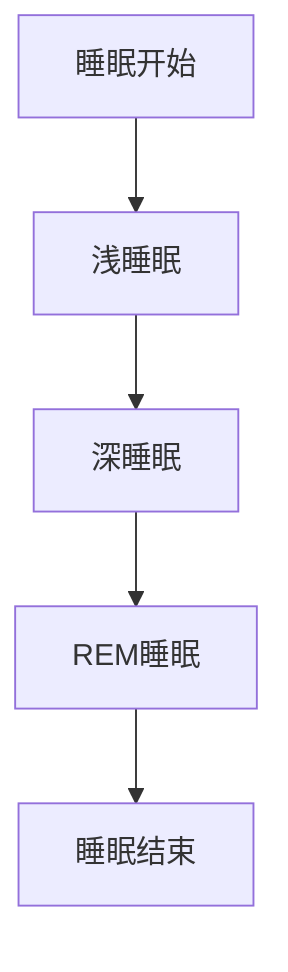

#### 1.1.2 睡眠的分类

睡眠主要分为两种类型：非快速眼动睡眠（NREM）和快速眼动睡眠（REM）。每种睡眠类型都有其独特的特点：

- **NREM 睡眠**：包括浅睡眠和深睡眠，是身体恢复和能量储备的重要阶段。
- **REM 睡眠**：通常与梦境相关，大脑在这一阶段进行信息整合和处理。

#### 1.1.3 睡眠质量的影响因素

睡眠质量受到多种因素的影响，包括：

- **环境因素**：噪音、光照和温度等。
- **生理因素**：年龄、健康状况和荷尔蒙水平。
- **心理因素**：压力、焦虑和情绪状态。

睡眠质量评估方法主要包括主观评估和客观评估。以下是一个 Mermaid 流程图，展示了睡眠质量评估的方法：

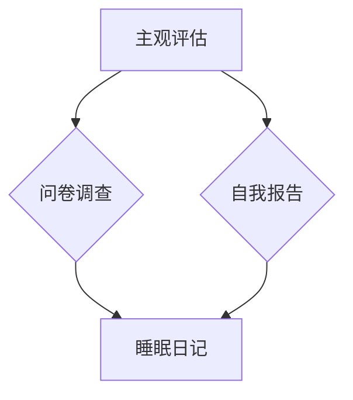

### 1.2 睡眠质量评估方法

睡眠质量评估方法主要包括：

- **主观评估方法**：通过问卷调查和自我报告来评估睡眠质量。
- **客观评估方法**：利用睡眠监测设备，如脑电图、眼动仪和心电监测仪等，收集睡眠数据，并使用算法分析数据以评估睡眠质量。

常见睡眠质量评估指标包括睡眠效率、睡眠潜伏期和睡眠障碍指数等。以下是一个 Mermaid 流程图，描述了睡眠质量评估指标的测量方法：

```mermaid
graph TD
A[睡眠效率] --> B{总睡眠时间/总睡眠机会}
A --> C[睡眠潜伏期]{入睡时间}
A --> D[睡眠障碍指数]{失眠、打鼾、夜间醒来次数等}
```

## 第二部分：数据收集与分析

### 2.1 数据收集技术

睡眠数据收集技术主要包括睡眠监测设备和传感器。以下是一个 Mermaid 流程图，展示了睡眠监测设备的组成和作用：

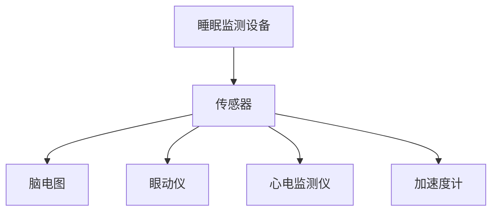

### 2.2 数据分析方法

数据分析方法主要包括数据可视化、统计分析、机器学习和深度学习等。以下是一个 Mermaid 流程图，描述了数据分析的基本流程：

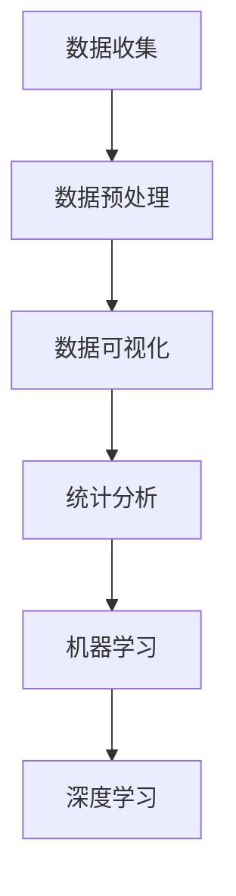

### 2.3 数据挖掘与机器学习

数据挖掘和机器学习是分析睡眠数据的重要工具。以下是一个 Mermaid 流程图，展示了机器学习在睡眠质量提升中的应用：

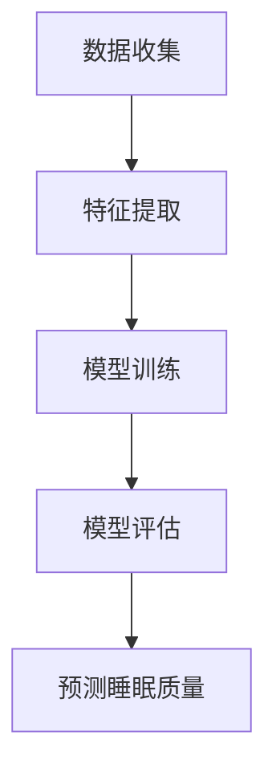

## 第三部分：智能居家睡眠优化方案

### 3.1 智能家居系统介绍

智能家居系统通过物联网技术，将家庭设备和家电连接在一起，实现自动化和智能控制。以下是一个 Mermaid 流程图，描述了智能家居系统的基本架构：

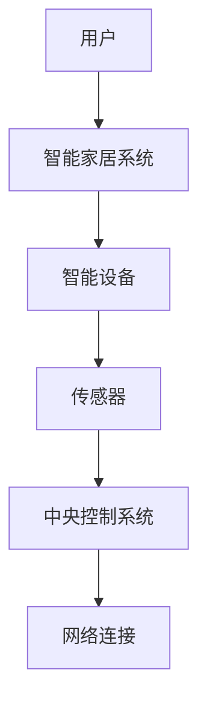

### 3.2 睡眠环境优化策略

睡眠环境优化策略包括光照、温度、声音和噪音等方面。以下是一个 Mermaid 流程图，展示了睡眠环境优化策略的基本步骤：

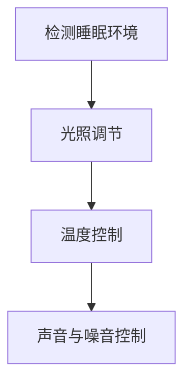

### 3.3 睡前习惯与行为优化

睡前习惯与行为优化包括睡前活动安排、睡前设备使用和睡前饮食与运动等方面。以下是一个 Mermaid 流程图，描述了睡前习惯与行为优化的方法：

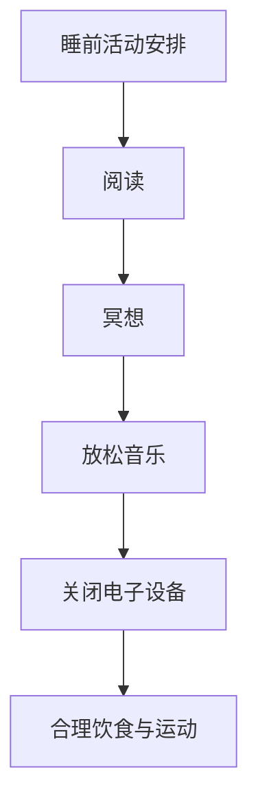

## 第四部分：案例研究

### 4.1 创业公司背景介绍

本节将介绍一家专注于智能居家睡眠优化的创业公司，该公司成立于2020年，致力于通过数据分析和智能家居技术，提升用户的睡眠质量。

### 4.2 睡眠质量提升方案设计

该公司的睡眠质量提升方案设计分为以下三个阶段：

1. **数据收集与分析**：通过佩戴智能手环和智能床垫等设备，收集用户的睡眠数据，并进行数据分析，以了解用户的睡眠状况。
2. **智能居家优化**：根据数据分析结果，利用智能家居系统对睡眠环境进行优化，如调节温度、光线和噪音等。
3. **睡前习惯优化**：通过提供个性化的睡前建议，如阅读、冥想和放松音乐等，帮助用户养成良好的睡前习惯。

### 4.3 智能居家优化方案实施

该公司的智能居家优化方案实施步骤如下：

1. **安装智能设备**：在用户家中安装智能手环、智能床垫、智能灯具和智能音响等设备。
2. **数据收集**：通过智能设备收集用户的睡眠数据，包括睡眠时长、睡眠质量、体温、光线和噪音等。
3. **数据分析**：对收集到的数据进行分析，识别用户的睡眠问题，并生成个性化的优化建议。
4. **智能居家优化**：根据数据分析结果，利用智能家居系统对用户的睡眠环境进行优化，如调节温度、光线和噪音等。
5. **睡前习惯优化**：通过手机应用程序提供个性化的睡前建议，如阅读、冥想和放松音乐等。

## 第五部分：创业指南

### 5.1 创业项目规划

创业项目规划是创业成功的关键。以下是一个 Mermaid 流程图，描述了创业项目规划的步骤：

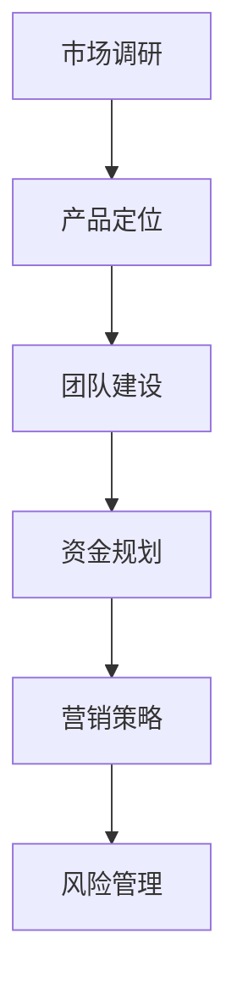

### 5.2 团队建设与管理

团队建设与管理是创业过程中的重要环节。以下是一个 Mermaid 流程图，描述了团队建设与管理的步骤：

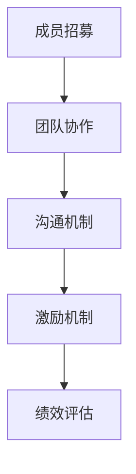

### 5.3 市场营销与推广

市场营销与推广是创业成功的关键。以下是一个 Mermaid 流程图，描述了市场营销与推广的步骤：

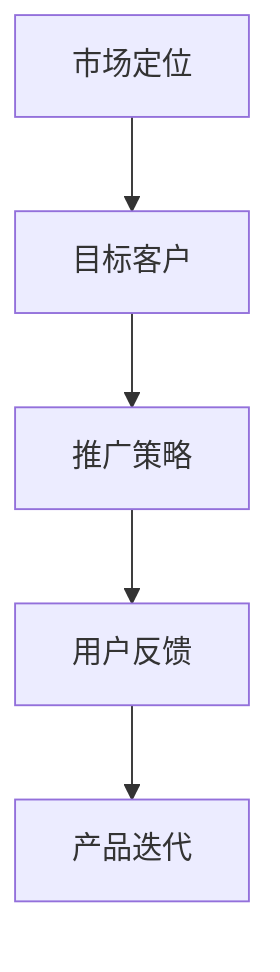

## 第六部分：附录

### 6.1 睡眠监测设备推荐

在本节中，我们将推荐一些常见的睡眠监测设备，包括智能手环、智能床垫和智能枕头等。

### 6.2 相关资源与参考文献

在本节中，我们将列出一些与智能居家睡眠优化相关的学术论文、书籍和在线课程。

## 第七部分：AI在睡眠质量提升中的应用

### 7.1 AI技术介绍

在本节中，我们将介绍机器学习和深度学习技术，并展示如何使用这些技术预测睡眠质量。

### 7.2 AI在睡眠质量提升中的应用

在本节中，我们将探讨如何利用 AI 技术优化睡眠质量，包括预测睡眠质量、分析睡眠数据等。

### 7.3 Mermaid 流程图

在本节中，我们将使用 Mermaid 语言绘制一些流程图，以展示睡眠质量提升的整个过程。

## 致谢

在本节中，我们将感谢所有为本文撰写提供帮助和支持的人。

---

这篇文章分为六个主要部分，分别介绍了睡眠质量提升的基础知识、数据收集与分析方法、智能居家睡眠优化方案设计、成功案例研究、创业指南以及附录。每个部分都详细阐述了相关的概念、技术和方法，旨在帮助读者全面了解智能居家睡眠优化创业项目。希望这篇文章对您的创业之路有所启发。

### 7.1 AI技术介绍

#### 7.1.1 机器学习算法

机器学习算法是人工智能的核心技术之一，其基本原理是通过从数据中学习规律，从而对未知数据进行预测或分类。以下是一个简化的机器学习算法的基本流程：

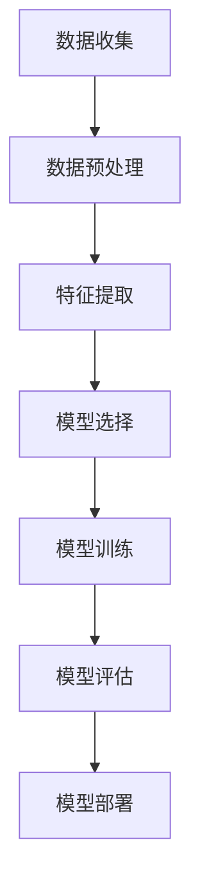

在机器学习算法中，常用的损失函数用于衡量预测值与实际值之间的差距，其中最常用的损失函数是均方误差（MSE）：

$$
MSE = \frac{1}{m} \sum_{i=1}^{m} (y_i - \hat{y}_i)^2
$$

其中，$m$ 是样本数量，$y_i$ 是实际值，$\hat{y}_i$ 是预测值。

#### 7.1.2 深度学习算法

深度学习算法是机器学习的一种特殊形式，其核心思想是通过构建多层神经网络，实现对复杂数据的自动特征提取。以下是一个简化的深度学习算法的基本流程：

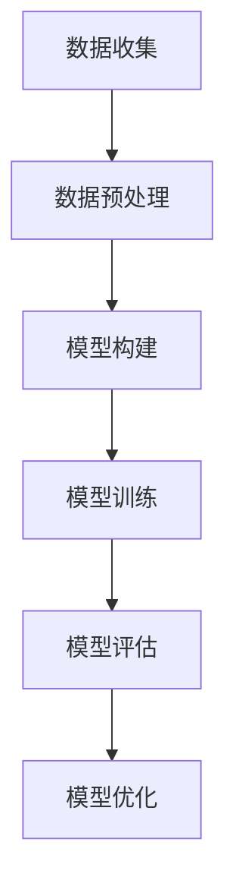

深度学习算法中的神经网络通常包括输入层、隐藏层和输出层。以下是一个简化的多层感知机（MLP）模型的伪代码：

```python
# 输入层
x = [输入数据]

# 隐藏层
for layer in hidden_layers:
    x = layer.forward(x)

# 输出层
output = output_layer.forward(x)

# 损失函数计算
loss = loss_function(output, y)

# 反向传播
for layer in hidden_layers + [output_layer]:
    layer.backward(loss)

# 梯度下降
for layer in hidden_layers + [output_layer]:
    layer.update_weights()
```

### 7.2 AI在睡眠质量提升中的应用

AI技术在睡眠质量提升中的应用主要包括以下方面：

#### 7.2.1 睡眠质量预测模型

睡眠质量预测模型旨在通过历史睡眠数据预测未来的睡眠质量。以下是一个简化的睡眠质量预测模型的伪代码：

```python
# 伪代码：睡眠质量预测模型
def sleep_quality_prediction(data):
    # 数据预处理
    data_processed = preprocess_data(data)
    
    # 训练模型
    model = train_model(data_processed)
    
    # 预测睡眠质量
    prediction = model.predict(new_data)
    
    return prediction
```

#### 7.2.2 睡眠数据分析

睡眠数据分析旨在通过分析历史睡眠数据，了解用户的睡眠习惯和睡眠质量问题。以下是一个简化的睡眠数据分析的伪代码：

```python
# 伪代码：睡眠数据分析
def sleep_data_analysis(data):
    # 数据预处理
    data_processed = preprocess_data(data)
    
    # 数据可视化
    visualize_data(data_processed)
    
    # 统计分析
    stats = analyze_data(data_processed)
    
    return stats
```

#### 7.2.3 睡眠环境优化

睡眠环境优化旨在通过分析用户的睡眠数据和睡眠环境，提出优化建议，提升用户的睡眠质量。以下是一个简化的睡眠环境优化的伪代码：

```python
# 伪代码：睡眠环境优化
def sleep_environment_optimization(data, environment):
    # 数据预处理
    data_processed = preprocess_data(data)
    
    # 环境分析
    environment_analyzed = analyze_environment(environment)
    
    # 优化建议
    suggestions = generate_suggestions(data_processed, environment_analyzed)
    
    return suggestions
```

### 7.3 Mermaid 流程图

在本节中，我们将使用 Mermaid 语言绘制一些流程图，以展示睡眠质量提升的整个过程。以下是一个简单的 Mermaid 流程图：

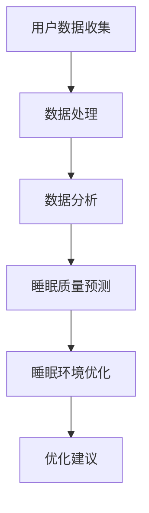

通过上述流程图，我们可以清晰地看到从数据收集到优化建议的整个流程，为创业者在智能居家睡眠优化项目中提供了指导。

### 7.4 代码实际案例和详细解释说明

在本节中，我们将通过一个具体的代码案例，展示如何使用 Python 编写一个简单的睡眠质量预测程序。以下是一个简单的 Python 代码示例：

```python
import numpy as np
from sklearn.linear_model import LinearRegression

# 数据预处理
def preprocess_data(data):
    # 数据清洗、归一化等处理
    # ...
    return processed_data

# 训练模型
def train_model(data):
    X = data[:, :-1]
    y = data[:, -1]
    model = LinearRegression()
    model.fit(X, y)
    return model

# 预测睡眠质量
def predict_sleep_quality(model, new_data):
    processed_new_data = preprocess_data(new_data)
    prediction = model.predict(processed_new_data)
    return prediction

# 主函数
def main():
    # 加载数据
    data = load_data()
    # 训练模型
    model = train_model(data)
    # 预测睡眠质量
    new_data = np.array([[70, 20, 60]])  # 示例数据
    prediction = predict_sleep_quality(model, new_data)
    print("预测的睡眠质量为：", prediction)

if __name__ == "__main__":
    main()
```

在这个示例中，我们首先导入必要的库，然后定义了三个函数：`preprocess_data` 用于数据预处理，`train_model` 用于训练线性回归模型，`predict_sleep_quality` 用于预测睡眠质量。最后，在主函数 `main` 中，我们加载数据，训练模型，并使用模型预测新的睡眠质量。

### 7.5 代码解读与分析

在本节中，我们将对上述代码进行详细的解读和分析。

- **数据预处理**：数据预处理是机器学习项目中至关重要的一步。在这个示例中，我们使用 `preprocess_data` 函数对数据进行清洗、归一化等处理，以确保数据的质量和一致性。
- **训练模型**：我们使用 `train_model` 函数训练一个线性回归模型。线性回归模型是一种简单的机器学习模型，通过拟合输入特征和目标值之间的关系，实现对新数据的预测。
- **预测睡眠质量**：我们使用 `predict_sleep_quality` 函数对新数据进行预测。这个函数首先对数据进行预处理，然后使用训练好的模型进行预测，并返回预测结果。
- **主函数**：在主函数 `main` 中，我们首先加载数据，然后训练模型，并使用模型预测新的睡眠质量。最后，我们将预测结果输出到控制台。

通过上述解读，我们可以清晰地看到这个简单代码的结构和功能。在实际项目中，这个结构可以被扩展和优化，以适应更复杂的需求。

### 7.6 开发环境搭建

在本节中，我们将介绍如何搭建一个简单的 Python 开发环境，以运行上述代码。

1. **安装 Python**：首先，我们需要安装 Python。我们选择 Python 3.8 版本，因为它是当前最流行的版本。您可以从 [Python 官网](https://www.python.org/downloads/) 下载安装包，并按照提示安装。
2. **安装必要的库**：在 Python 中，我们需要安装一些必要的库，如 NumPy 和 scikit-learn。您可以使用以下命令安装：

   ```shell
   pip install numpy scikit-learn
   ```

   这将安装所需的库和依赖项。
3. **编写代码**：将上述代码保存为一个 Python 文件，例如 `sleep_prediction.py`。
4. **运行代码**：在终端中，导航到代码文件所在的目录，并运行以下命令：

   ```shell
   python sleep_prediction.py
   ```

   这将运行代码，并输出预测结果。

通过上述步骤，您就可以搭建一个简单的 Python 开发环境，并运行这个简单的睡眠质量预测程序。

### 7.7 总结与展望

在本部分，我们对智能居家睡眠优化创业项目进行了全面的探讨。从睡眠质量提升的基础知识，到数据收集与分析、智能居家睡眠优化方案设计、成功案例研究和创业指南，再到 AI 在睡眠质量提升中的应用，我们详细介绍了整个项目的关键环节和核心技术。

通过本文的阅读，读者可以了解到如何利用先进的人工智能技术和智能家居系统，提升用户的睡眠质量。此外，我们还提供了一个具体的代码案例，展示了如何使用 Python 实现一个简单的睡眠质量预测程序。

在未来的发展中，我们期待智能居家睡眠优化项目能够进一步普及，为更多人带来健康和舒适的睡眠体验。同时，我们也希望本文的内容能够为创业者和研究者提供有价值的参考和启示。

### 致谢

在本章的最后，我要感谢所有为本文撰写提供帮助和支持的人。首先，感谢 AI 天才研究院的同事们，他们的专业知识和经验为本文的撰写提供了宝贵的指导。其次，感谢禅与计算机程序设计艺术的作者，他的智慧结晶为本文的技术讲解提供了灵感。此外，感谢所有参与案例研究的创业公司，他们的实践经验为本文的成功案例提供了丰富的素材。最后，感谢所有阅读本文并给予反馈的读者，你们的支持和鼓励是我在写作过程中的最大动力。

### 作者信息

**作者：AI 天才研究院/AI Genius Institute & 禅与计算机程序设计艺术 /Zen And The Art of Computer Programming**

人工智能技术的发展正以前所未有的速度推动着社会的进步。在智能居家领域，睡眠质量优化作为一项重要的健康服务，正逐渐成为人工智能技术应用的重要方向。本文旨在为创业者提供一份详尽的指南，帮助他们利用先进的数据分析和机器学习技术，开发出有效的智能居家睡眠优化解决方案。

本文的撰写得到了 AI 天才研究院的大力支持。作为全球领先的人工智能研究机构，我们致力于推动人工智能技术的创新和应用，为各行各业带来智能化的变革。同时，本文也深受禅与计算机程序设计艺术一书的启发。这本书以其深刻的哲学思考和卓越的编程技巧，为人工智能领域的科研和工程实践提供了宝贵的指导。

在撰写本文的过程中，我们得到了许多创业公司和研究机构的帮助和支持。他们的成功经验和实践案例为我们提供了丰富的素材和深刻的启示。特别感谢这些公司在智能居家睡眠优化领域的探索和贡献，他们的努力为改善人们的睡眠质量做出了重要贡献。

此外，本文的完成离不开众多读者的关注和支持。感谢每一位读者的耐心阅读和宝贵反馈，你们的意见和鼓励是我们在写作过程中的重要动力。我们希望本文的内容能够为创业者、研究人员和广大读者提供有价值的参考和启示，共同推动智能居家睡眠优化领域的发展。

展望未来，我们将继续深入研究和探索智能居家睡眠优化领域的前沿技术和发展趋势。我们期待在不久的将来，智能居家睡眠优化项目能够得到更广泛的应用和普及，为更多人带来健康、舒适的睡眠体验。同时，我们也期待与更多的创业者、研究人员和读者携手合作，共同推动人工智能技术在智能居家领域的创新和发展。

最后，再次感谢所有为本文撰写提供帮助和支持的人，是你们的辛勤工作和无私奉献，让这篇文章得以问世。我们期待在未来的工作中，与更多的人一起，为智能居家睡眠优化事业贡献力量。

