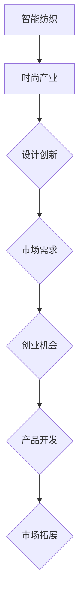

                 

# 智能纺织创业：可穿戴技术的时尚融合

关键词：
- 可穿戴技术
- 智能纺织
- 时尚产业
- 创业机会
- 创新设计
- 市场拓展

摘要：
随着科技的进步和消费需求的升级，智能纺织与时尚产业的融合成为了一股新兴的力量。本文将探讨可穿戴技术如何渗透到纺织领域，并进一步与时尚产业相结合，创造新的商业机会和消费体验。我们将分析智能纺织的基础技术，介绍时尚产业与可穿戴技术的结合方式，分享智能纺织时尚品牌的成功案例，并提出智能纺织创业的策略和实战方法。

### 《智能纺织创业：可穿戴技术的时尚融合》目录大纲

#### 第一部分: 可穿戴技术概述与智能纺织

##### 第1章: 可穿戴技术概览

- **1.1 可穿戴技术的定义与发展历程**
- **1.2 可穿戴设备的主要分类**
- **1.3 可穿戴设备的市场趋势与未来展望**

##### 第2章: 智能纺织技术基础

- **2.1 智能纺织的概念**
- **2.2 智能纺织材料与技术**
- **2.3 智能纺织的应用场景**

#### 第二部分: 智能纺织的时尚融合

##### 第3章: 时尚产业与可穿戴技术的结合

- **3.1 时尚产业现状与挑战**
- **3.2 可穿戴技术在时尚产业的应用**
- **3.3 智能纺织与时尚设计的创新融合**

##### 第4章: 智能纺织在时尚领域的创新应用

- **4.1 时尚服饰中的智能功能**
- **4.2 智能鞋服的技术研发与应用**
- **4.3 智能配饰的创新设计**

##### 第5章: 智能纺织时尚品牌案例分析

- **5.1 智能纺织时尚品牌市场分析**
- **5.2 案例一：智能运动服饰品牌Nike**
- **5.3 案例二：智能时尚品牌Google Glass**
- **5.4 案例三：智能纺织时尚品牌Monopoli**

#### 第三部分: 智能纺织创业与市场拓展

##### 第6章: 智能纺织创业模式与策略

- **6.1 智能纺织创业的机会与挑战**
- **6.2 智能纺织创业模式探讨**
- **6.3 创业策略与市场拓展路径**

##### 第7章: 智能纺织创业项目实战

- **7.1 创业项目概述与市场定位**
- **7.2 产品设计与开发流程**
- **7.3 硬件与软件开发实践**
- **7.4 硬件与软件源代码解读与分析**

##### 第8章: 智能纺织创业融资与运营

- **8.1 融资策略与渠道**
- **8.2 运营管理与实践**
- **8.3 成功创业案例分享**

#### 附录

##### 附录A: 智能纺织创业相关工具与资源

- **A.1 开发工具介绍**
- **A.2 开源硬件资源**
- **A.3 开源软件资源**
- **A.4 行业报告与市场数据**

##### 附录B: Mermaid 流程图示例



##### 附录C: 伪代码示例

```python
# 定义智能纺织功能函数
def intelligent_fabric_function():
    # 初始化参数
    fabric_type = "智能材料"
    fabric_property = "可调节温度"
    
    # 检查智能材料是否符合要求
    if check_fabric_property(fabric_property):
        # 执行智能纺织功能
        fabric_action = "调节温度"
        print(f"执行{fabric_action}功能，当前温度为：{get_temperture()}")
    else:
        print("智能材料不符合要求，无法执行功能")

# 辅助函数：检查材料属性
def check_fabric_property(fabric_property):
    # 判断智能材料属性是否符合需求
    return fabric_property in ["可调节温度", "智能传感"]

# 辅助函数：获取温度
def get_temperture():
    # 返回当前温度值
    return 23

# 辅助函数：检查温度调节条件
def check_temperature_condition(setpoint, current_temp):
    # 判断温度调节条件是否满足
    return current_temp < setpoint

# 主程序
intelligent_fabric_function()
```

##### 附录D: 数学模型与公式详解

- **D.1 温度调节模型**

$$ T_{\text{out}} = T_{\text{in}} + k \cdot (T_{\text{set}} - T_{\text{in}}) $$

其中，$T_{\text{out}}$ 是输出温度，$T_{\text{in}}$ 是输入温度，$T_{\text{set}}$ 是设定温度，$k$ 是温度调节系数。

- **D.2 智能纺织材料导电性公式**

$$ \sigma = \sigma_0 + \alpha \cdot (T - T_0) $$

其中，$\sigma$ 是导电性，$\sigma_0$ 是初始导电性，$T$ 是温度，$T_0$ 是参考温度，$\alpha$ 是温度系数。

##### 附录E: 项目实战案例

- **E.1 智能织物温度调节项目**

**开发环境搭建：**
- 开发板：Arduino Uno
- 编程语言：C++
- 开发环境：Arduino IDE

**源代码实现：**

```cpp
#include <Wire.h>
#include <Adafruit_AM2320.h>

Adafruit_AM2320 am2320 = Adafruit_AM2320();

void setup() {
    Serial.begin(9600);
    Serial.println("AM2320 sensor test");
    
    // Initialize sensor
    if (!am2320.begin()) {
        Serial.println("Failed to initialize sensor!");
        while (1);
    }
}

void loop() {
    // Read sensor data
    float temp = am2320.readTempC();
    float humidity = am2320.readHumidity();
    
    // Print sensor data
    Serial.print("Temperature: ");
    Serial.print(temp);
    Serial.println(" °C");
    
    Serial.print("Humidity: ");
    Serial.print(humidity);
    Serial.println(" %");
    
    // Control temperature based on setpoint
    int setpoint = 24;
    if (temp < setpoint) {
        // Turn on heating element
        digitalWrite(HEATING_PIN, HIGH);
    } else {
        // Turn off heating element
        digitalWrite(HEATING_PIN, LOW);
    }
    
    // Wait for 5 seconds
    delay(5000);
}

```

**代码解读与分析：**
- 传感器读取：使用Adafruit库读取AM2320传感器的温度和湿度数据。
- 温度控制：根据设定温度点和当前温度，控制加热元件的开关状态，实现温度调节功能。
- 硬件连接：将传感器连接到Arduino开发板上，并设置加热元件的控制引脚。

通过以上目录大纲和详细内容概述，我们可以看到本书将深入探讨智能纺织创业的各个方面，从技术原理到市场策略，再到实际项目实施，为有意从事智能纺织创业的读者提供全面的知识和指导。接下来，我们将逐一展开每个章节的内容，逐步深入分析智能纺织与时尚融合的广阔前景和实际应用。

### 第一部分：可穿戴技术概述与智能纺织

#### 第1章：可穿戴技术概览

可穿戴技术，作为现代科技与生活深度融合的产物，正逐步改变着我们的生活方式。本章节将详细探讨可穿戴技术的定义、发展历程、主要分类及其市场趋势和未来展望。

##### 1.1 可穿戴技术的定义与发展历程

**定义：**

可穿戴技术（Wearable Technology）是指通过物理方式，将传感器、计算设备和通信设备嵌入服装、饰品或人体外部，使其具备监测、传输和处理信息的功能。可穿戴设备可以收集用户的生理、环境数据，提供实时反馈，辅助用户进行健康监测、运动跟踪、环境感知等。

**发展历程：**

可穿戴技术的历史可以追溯到20世纪60年代。1961年，美国发明家阿图尔·扬（Arthur Young）设计出了一款名为“背心计算机”（Shellback）的智能背心，这是可穿戴技术的初步尝试。然而，当时的设备体积庞大、功能有限，难以普及。

随着微电子技术的进步，尤其是微处理器、无线通信技术和传感器的突破，可穿戴技术迎来了快速发展。20世纪90年代，苹果公司推出了第一代iPod，开启了便携式电子设备的新时代。随后，智能手表、智能眼镜、智能手环等设备相继问世，进一步推动了可穿戴技术的发展。

##### 1.2 可穿戴设备的主要分类

**按功能分类：**

1. **健康监测设备：**如智能手环、智能手表等，主要功能是监测用户的心率、血压、睡眠质量等健康数据。
2. **运动跟踪设备：**如智能跑鞋、智能跳绳等，主要功能是跟踪用户的运动轨迹、消耗的卡路里等。
3. **环境感知设备：**如智能眼镜、智能衣物等，可以感知环境变化，提供导航、交互等体验。
4. **娱乐设备：**如智能音响、智能耳机等，主要用于娱乐和音频通信。

**按形态分类：**

1. **外着式设备：**如智能服装、智能饰品等，直接附着在人体表面。
2. **内着式设备：**如智能内衣、智能袜子等，与人体皮肤紧密接触，常用于医疗和健康监测。
3. **植入式设备：**如智能芯片、智能血管支架等，直接植入人体内部，用于医疗和监测。

##### 1.3 可穿戴设备的市场趋势与未来展望

**市场趋势：**

1. **技术进步：**随着物联网、大数据、人工智能等技术的发展，可穿戴设备的性能和功能将进一步提升。
2. **消费升级：**随着生活水平的提高，消费者对健康、时尚、个性化的需求日益增加，可穿戴设备将成为新的消费热点。
3. **生态融合：**可穿戴设备将与智能手机、智能家居等设备进一步融合，形成一个生态体系，提供更加便捷和智能的生活体验。

**未来展望：**

1. **个性化定制：**基于大数据和人工智能技术，可穿戴设备将实现个性化定制，满足用户的个性化需求。
2. **多功能集成：**未来可穿戴设备将具备更多功能，如健康监测、运动跟踪、环境感知、娱乐等，实现多功能集成。
3. **跨界融合：**可穿戴技术将与医疗、教育、工业等领域深度融合，带来新的商业模式和应用场景。

通过本章节的探讨，我们可以看到可穿戴技术正快速发展，其与时尚产业的融合也日趋紧密。在接下来的章节中，我们将进一步深入探讨智能纺织技术的基础和应用，以及如何将两者融合创新，创造新的商业机会和消费体验。

#### 第2章：智能纺织技术基础

智能纺织技术是现代科技与纺织工业相结合的产物，它将传感器、电子元件和数据处理能力融入纺织材料中，使其具备智能化功能。本章节将详细介绍智能纺织技术的概念、基础材料与技术，以及其在各个领域的应用场景。

##### 2.1 智能纺织的概念

**概念：**

智能纺织技术（Intelligent Textile Technology）是指将电子、信息、传感器和软件等技术与传统纺织工艺相结合，开发出具有智能化功能的纺织品和服饰。这些纺织品和服饰能够感知外部环境变化，自动执行特定功能，如温度调节、发光、传感器监测等。

**发展背景：**

随着全球人口老龄化和人们对健康、舒适、个性化的需求不断增长，智能纺织技术得到了广泛关注。此外，物联网、大数据、云计算等技术的发展也为智能纺织技术提供了强大的技术支撑。

##### 2.2 智能纺织材料与技术

**智能纺织材料：**

1. **纤维材料：**如导电纤维、光纤、智能纤维等，这些纤维能够感知外部刺激，如温度、压力、光照等。
2. **面料材料：**如智能涂层面料、智能纤维面料等，这些面料能够实现温度调节、防水、透气等功能。
3. **复合材料：**如纤维增强复合材料、纳米复合材料等，这些材料具有高强度、高导电性等特性。

**智能纺织技术：**

1. **传感技术：**利用各种传感器，如温度传感器、湿度传感器、压力传感器等，将外部环境信息转化为电信号，实现数据的采集和处理。
2. **电子技术：**通过集成电子元件，如微控制器、电池、发光二极管（LED）等，实现纺织材料的智能化功能。
3. **信息处理技术：**利用数据处理算法，对采集到的数据进行实时分析、存储和传输，实现对智能纺织材料的智能控制。

##### 2.3 智能纺织的应用场景

**医疗领域：**

1. **健康监测：**通过嵌入传感器和数据处理模块，智能纺织品可以实时监测患者的生理参数，如心率、血压、呼吸等，为医疗诊断提供重要依据。
2. **康复训练：**智能纺织品可以辅助康复训练，如通过压力传感器监测患者的运动状态，提供实时反馈和指导。

**运动领域：**

1. **运动监测：**通过智能纺织品，如智能跑鞋、智能运动服等，可以实时监测运动员的运动状态，如速度、距离、消耗的卡路里等，优化运动表现。
2. **运动指导：**通过数据处理和分析，智能纺织品可以为运动员提供个性化的运动指导和训练方案。

**时尚领域：**

1. **时尚设计：**智能纺织技术为时尚设计提供了新的可能性，如通过发光面料设计动态时尚服装，通过智能传感器实现功能性的时尚配饰。
2. **个性化定制：**基于大数据和人工智能技术，智能纺织品可以根据用户的需求和偏好进行个性化定制，提供独特的时尚体验。

**环境领域：**

1. **环境监测：**通过智能纺织品，如智能窗帘、智能地毯等，可以实时监测室内环境，如温度、湿度、空气质量等，提供智能化的环境调控方案。
2. **环保材料：**智能纺织技术可以开发出具有环保特性的纺织品，如可降解、防水、透气等功能，降低环境污染。

通过本章节的探讨，我们可以看到智能纺织技术具有广泛的应用前景和商业价值。在接下来的章节中，我们将进一步探讨智能纺织技术与时尚产业的融合，分析其创新应用和市场潜力。

### 第二部分：智能纺织的时尚融合

#### 第3章：时尚产业与可穿戴技术的结合

时尚产业是现代经济的支柱产业之一，它不仅代表了一种生活方式和审美观念，还涉及大量的技术支持和创新。随着科技的进步，可穿戴技术与时尚产业的结合越来越紧密，为时尚设计、生产和消费带来了新的契机和挑战。本章节将分析时尚产业的现状与挑战，探讨可穿戴技术在时尚产业中的应用，以及智能纺织与时尚设计的创新融合。

##### 3.1 时尚产业现状与挑战

**现状：**

1. **多元化发展：**时尚产业涵盖了服装、鞋履、配饰、化妆品等多个领域，形成了多元化的市场格局。
2. **消费升级：**随着生活水平的提高，消费者对时尚产品的需求不再仅限于基本的功能性，更注重个性化和差异化。
3. **数字化的渗透：**电子商务、社交媒体、大数据等数字化工具正在改变时尚产业的营销、推广和销售方式。

**挑战：**

1. **同质化竞争：**随着市场的不断扩大，时尚品牌之间的竞争日益激烈，如何在同质化的市场中脱颖而出成为一大挑战。
2. **生产成本上升：**原材料价格波动、劳动力成本上升等因素使得时尚产业的生产成本不断上升，压缩了企业的利润空间。
3. **消费者需求变化：**消费者对时尚产品的需求日益多样化和个性化，要求时尚品牌能够快速响应市场变化，提供满足消费者需求的产品。

##### 3.2 可穿戴技术在时尚产业的应用

**应用领域：**

1. **时尚监测：**通过智能手表、智能手环等设备，可以实时监测消费者的购物习惯、喜好和需求，为时尚品牌提供市场调研的数据支持。
2. **智能设计：**利用虚拟现实（VR）和增强现实（AR）技术，设计师可以在虚拟环境中进行时尚设计，提高设计的精度和效率。
3. **个性化定制：**基于大数据和人工智能技术，可穿戴设备可以收集消费者的生理数据、偏好数据等，为消费者提供个性化的时尚定制服务。

**具体应用案例：**

1. **智能穿搭助手：**通过智能手机APP或智能穿戴设备，用户可以根据自己的身高、体重、肤色等信息，获得个性化的穿搭建议，提高购买决策的准确性。
2. **智能试衣镜：**结合AR技术，智能试衣镜可以让用户在家中尝试不同的服装款式和颜色，提供更加真实的试衣体验。
3. **智能鞋履：**通过嵌入传感器和微处理器，智能鞋履可以实时监测用户的步态、运动状态，提供运动指导和建议。

##### 3.3 智能纺织与时尚设计的创新融合

**创新设计理念：**

1. **智能化功能：**将智能纺织技术应用于时尚设计，开发出具有智能功能的服装和配饰，如温度调节、发光、传感器监测等，为消费者提供更加舒适、便捷的穿着体验。
2. **个性化定制：**利用大数据和人工智能技术，根据消费者的个人数据和偏好，提供个性化的时尚设计和服务，满足消费者的独特需求。
3. **跨界融合：**将时尚产业与其他行业（如医疗、科技、艺术等）进行跨界融合，开发出具有独特价值和市场潜力的时尚产品。

**创新应用场景：**

1. **智能运动服：**通过嵌入温度传感器、压力传感器等，智能运动服可以实时监测用户的运动状态，提供个性化的运动建议和调整方案。
2. **智能配饰：**如智能项链、智能手链等，可以通过蓝牙连接手机，实现信息提醒、健康监测等功能。
3. **智能家居时尚：**如智能窗帘、智能地毯等，可以通过嵌入传感器和智能控制器，实现环境监测、智能调控等功能，提升家居生活的品质。

通过本章节的探讨，我们可以看到可穿戴技术与时尚产业的结合为时尚设计带来了新的创新方向和应用场景。在接下来的章节中，我们将进一步探讨智能纺织技术在时尚领域的创新应用，分析其市场潜力和未来发展前景。

#### 第4章：智能纺织在时尚领域的创新应用

智能纺织技术在时尚领域的应用正在迅速扩展，为传统时尚产业带来了前所未有的变革和创新。本章节将详细探讨智能纺织在时尚服饰、智能鞋服和智能配饰等领域的创新应用，并分析这些应用如何改变消费者的时尚消费行为。

##### 4.1 时尚服饰中的智能功能

**智能面料：**

智能面料是智能纺织技术中最具代表性的应用之一。通过将传感器、微处理器和通信模块嵌入面料，智能服饰可以实现多种功能，如温度调节、环境监测、健康监测等。

**温度调节服饰：**

温度调节服饰通过内置的加热元件或制冷元件，根据环境温度和用户需求自动调节服装的温度。这种服饰特别适合在气候多变或温差较大的地区使用，为用户提供更加舒适和健康的穿着体验。

**环境监测服饰：**

环境监测服饰通过嵌入各种传感器，如温度传感器、湿度传感器、空气质量传感器等，可以实时监测环境中的温度、湿度和污染物含量。这些数据可以传输到用户的智能手机或其他设备上，帮助用户更好地了解周围环境状况，采取相应的防护措施。

**健康监测服饰：**

健康监测服饰通过嵌入生物传感器，如心率传感器、血压传感器、血氧传感器等，可以实时监测用户的生理指标，如心率、血压、呼吸频率等。这些数据可以帮助用户及时发现健康问题，并采取相应的预防措施。

**案例分析：**

- **Nike Pro Adapt X 女款篮球鞋：**Nike推出的这款篮球鞋内置了微处理器和磁铁，用户可以通过智能手机应用程序调整鞋子的松紧度，提供个性化的舒适体验。

##### 4.2 智能鞋服的技术研发与应用

**智能鞋底：**

智能鞋底通过嵌入传感器和微处理器，可以实时监测用户的步态和运动状态，提供运动指导和建议。这种鞋底特别适合跑步、健身等高强度运动，帮助用户提高运动表现，减少运动损伤。

**智能鞋垫：**

智能鞋垫通过内置的传感器和微处理器，可以监测用户的足部压力分布，提供个性化的足部护理建议。这种鞋垫适合长时间站立或行走的人群，如办公室职员、销售人员等，有助于缓解足部疲劳和疼痛。

**智能鞋履：**

智能鞋履通过嵌入无线通信模块和微控制器，可以实现与智能手机或其他设备的无线连接，提供实时信息提醒、定位导航等功能。这种鞋履特别适合户外探险、旅行等场景，为用户提供更加便捷和安全的出行体验。

**案例分析：**

- **Adidas Futurecraft 4D：**Adidas推出的这款智能鞋履采用了4D打印技术，用户可以根据自己的脚型和需求，定制个性化的鞋底和鞋面。

##### 4.3 智能配饰的创新设计

**智能眼镜：**

智能眼镜是智能配饰中最具有代表性的产品之一。通过内置的微型显示屏、摄像头、传感器和通信模块，智能眼镜可以实现视频通话、导航、实时翻译等功能。这些功能为用户提供了更加便捷和高效的视觉体验。

**智能手环：**

智能手环通过内置的传感器和微处理器，可以实时监测用户的心率、步数、消耗的卡路里等健康数据，并通过蓝牙连接传输到用户的智能手机上。智能手环不仅是一种时尚配饰，还成为用户健康管理的重要工具。

**智能首饰：**

智能首饰通过将传感器、微处理器和无线通信模块嵌入首饰中，可以实现各种智能功能，如健康监测、信息提醒、装饰艺术等。这些首饰不仅具有实用性，还具有极高的艺术价值和装饰效果。

**案例分析：**

- **Google Glass：**Google推出的这款智能眼镜通过内置的显示屏和摄像头，实现了视频通话、导航、实时翻译等功能，为用户提供了全新的视觉和交互体验。

##### 智能纺织在时尚领域的创新应用对消费者时尚消费行为的影响

**个性化需求：**

智能纺织技术的应用使得时尚产品更加个性化。消费者可以根据自己的喜好、需求、身体数据等定制个性化的时尚产品，满足个性化的需求。

**健康意识提升：**

智能纺织技术的应用使得时尚产品更加健康化。通过实时监测用户的生理指标，智能纺织产品可以帮助用户提高健康意识，预防健康问题。

**科技融合：**

智能纺织技术的应用将科技与时尚融合在一起，为消费者提供了更加多样化、智能化、个性化的时尚体验。

**案例分析：**

- **Monopoli：**Monopoli是一家专注于智能纺织时尚的品牌，其产品涵盖了智能运动服、智能鞋服、智能配饰等。通过智能传感器和无线通信模块，Monopoli的产品不仅提供了舒适的穿着体验，还提供了健康监测和运动指导等功能，受到了消费者的喜爱。

通过本章节的探讨，我们可以看到智能纺织技术在时尚领域的创新应用不仅改变了传统时尚产业的面貌，还深刻影响了消费者的时尚消费行为。在未来的发展中，智能纺织技术将继续与时尚产业深度融合，为消费者带来更多创新、智能、个性化的时尚体验。

#### 第5章：智能纺织时尚品牌案例分析

在智能纺织与时尚产业的深度融合中，一些品牌通过创新技术和独特设计，成功在市场中占据了一席之地。本章节将分析几个典型的智能纺织时尚品牌，包括Nike、Google Glass和Monopoli，探讨它们的市场表现、创新应用和市场潜力。

##### 5.1 智能纺织时尚品牌市场分析

**Nike：**Nike作为全球领先的体育用品品牌，其智能纺织产品线涵盖了运动服饰、鞋履和配饰等多个领域。Nike通过技术创新和智能化设计，不断提升产品的功能和用户体验。例如，Nike Pro Adapt篮球鞋通过内置的微处理器和磁铁，允许用户通过智能手机应用实时调整鞋子的松紧度，提供个性化的穿着体验。这种智能科技与运动功能的结合，使Nike在市场中具有很高的竞争力。

**Google Glass：**Google Glass是谷歌公司推出的智能眼镜产品，尽管其最初的市场推广并未达到预期，但其在时尚领域仍有其独特的应用。Google Glass通过内置的显示屏和摄像头，实现了视频通话、导航、实时翻译等功能，为用户提供了全新的视觉和交互体验。尽管其时尚属性受到部分消费者的青睐，但由于硬件成本和用户体验等问题，Google Glass的市场表现并不理想。

**Monopoli：**Monopoli是一家专注于智能纺织时尚的品牌，其产品线包括智能运动服、智能鞋服和智能配饰等。Monopoli通过智能传感器和无线通信模块，为用户提供了健康监测、运动指导等智能功能。其产品在设计上注重时尚与科技的结合，特别是在运动领域，Monopoli的产品受到了专业运动员和健身爱好者的喜爱。

##### 5.2 案例一：智能运动服饰品牌Nike

**市场表现：**Nike的智能运动服饰品牌在市场上取得了显著的成功。通过不断推出具有创新技术的智能产品，Nike满足了消费者对个性化、智能化的需求。例如，Nike的智能跑鞋、智能运动服等产品，通过内置的传感器和微处理器，实现了实时运动数据监测和个性化调整功能。

**创新应用：**Nike在智能纺织领域的创新应用主要体现在以下几个方面：
1. **智能跑鞋：**Nike的智能跑鞋通过内置的传感器，实时监测用户的步频、步幅、落地方式等数据，提供个性化的运动指导。
2. **智能运动服：**Nike的智能运动服通过嵌入温度传感器和湿度传感器，实现温度调节和湿度管理，提供更加舒适的穿着体验。
3. **个性化定制：**Nike通过智能设计工具和数字化平台，允许用户根据自己的身体数据和偏好，定制个性化的运动服饰。

**市场潜力：**随着健康意识的提升和运动消费的升级，Nike的智能运动服饰市场潜力巨大。通过不断优化智能技术和产品设计，Nike有望继续扩大其市场份额，引领智能纺织时尚潮流。

##### 5.3 案例二：智能时尚品牌Google Glass

**市场表现：**尽管Google Glass在智能时尚领域的创新应用具有一定的前瞻性，但其市场表现并未达到预期。由于硬件成本高、用户体验欠佳等问题，Google Glass未能广泛普及。

**创新应用：**Google Glass的智能时尚应用主要体现在以下几个方面：
1. **实时翻译：**通过内置的摄像头和语音识别技术，Google Glass可以实现实时翻译功能，帮助用户克服语言障碍。
2. **导航辅助：**Google Glass可以通过内置的显示屏和地图应用，提供实时的导航信息，辅助用户出行。
3. **视频通话：**Google Glass支持视频通话功能，用户可以通过眼镜进行即时沟通。

**市场潜力：**尽管目前Google Glass的市场表现不理想，但其创新应用在特定场景下仍具有较大的潜力。例如，在医疗、教育、旅游等领域，Google Glass可以提供独特的体验和服务。未来，随着技术的成熟和用户体验的改善，Google Glass有望在智能时尚领域获得新的发展机遇。

##### 5.4 案例三：智能纺织时尚品牌Monopoli

**市场表现：**Monopoli作为一家新兴的智能纺织时尚品牌，其市场表现较为出色。通过将智能技术与时尚设计相结合，Monopoli成功吸引了专业运动员和健身爱好者的关注。

**创新应用：**Monopoli的智能纺织产品创新应用主要体现在以下几个方面：
1. **智能运动服：**Monopoli的智能运动服通过嵌入传感器，实时监测用户的运动状态，提供个性化的运动指导。
2. **智能鞋履：**Monopoli的智能鞋履通过内置的传感器，实时监测用户的步态和运动状态，提供运动指导和建议。
3. **智能配饰：**Monopoli的智能配饰如智能项链、智能手环等，通过无线通信模块，实现信息提醒、健康监测等功能。

**市场潜力：**Monopoli在智能纺织时尚领域的市场潜力巨大。通过不断优化智能技术和产品设计，Monopoli有望继续扩大其市场份额，成为智能纺织时尚的领军品牌。

通过以上案例分析，我们可以看到智能纺织时尚品牌在市场上的表现各有特点，但都体现了智能技术与时尚设计的深度融合。在未来的发展中，智能纺织时尚品牌将继续通过技术创新和设计创新，满足消费者的个性化需求，推动时尚产业的持续发展。

### 第三部分：智能纺织创业与市场拓展

#### 第6章：智能纺织创业模式与策略

在智能纺织领域创业，不仅需要具备深厚的技术背景，还需要精准的市场洞察和灵活的商业模式。本章节将探讨智能纺织创业的机会与挑战，介绍智能纺织创业的模式，并提供市场拓展的策略。

##### 6.1 智能纺织创业的机会与挑战

**创业机会：**

1. **健康与运动：**随着人们对健康和健身的关注度提高，智能纺织产品在健康监测、运动辅助等方面的需求日益增加。创业者可以利用智能传感器和数据分析技术，开发出具有创新性的健康监测和运动辅助产品。

2. **时尚与个性化：**时尚产业对创新和个性化的追求永无止境。智能纺织技术为时尚设计师提供了丰富的创意空间，创业者可以探索智能面料、智能配饰等时尚领域的创新产品。

3. **智能家居：**智能家居市场的迅速扩展为智能纺织产品带来了新的应用场景。创业者可以开发智能窗帘、智能地毯等智能家居产品，提升家庭生活的智能化水平。

**挑战：**

1. **技术门槛：**智能纺织技术涉及多个学科领域，包括纺织、电子、计算机等，创业者需要具备跨学科的知识和技能。

2. **研发成本：**智能纺织产品的研发成本较高，包括材料研发、硬件设计、软件开发等，这对创业者的资金实力提出了较高要求。

3. **市场接受度：**消费者对智能纺织产品的接受度是一个重要挑战。创业者需要通过市场调研和用户反馈，不断优化产品设计和功能，以赢得消费者的认可。

##### 6.2 智能纺织创业模式探讨

**1. 自主研发模式：**

这种模式是指创业者完全依靠自己的团队和资源进行产品研发和市场拓展。优点是创业者对产品的控制力较强，可以更好地实现产品的创新和个性化。缺点是需要投入大量的人力和财力，且风险较高。

**2. 合作研发模式：**

这种模式是指创业者与高校、科研机构或其他企业合作，共同进行产品研发。优点是可以充分利用合作伙伴的技术和资源，降低研发成本和风险。缺点是创业者对产品的控制力较弱，需要与合作伙伴保持良好的合作关系。

**3. 代工生产模式：**

这种模式是指创业者将产品的生产环节外包给专业的制造商。优点是创业者可以专注于产品设计和市场拓展，降低生产成本。缺点是产品质量和交货期受到制造商的影响，创业者需要严格管理供应链。

##### 6.3 创业策略与市场拓展路径

**1. 市场调研与定位：**

在创业初期，创业者需要进行详细的市场调研，了解目标市场的需求和竞争状况。通过市场定位，明确产品在市场中的差异化竞争优势。

**2. 创新产品设计与功能：**

基于市场调研的结果，创业者需要设计出具有创新性和实用性的产品。智能纺织产品可以通过添加智能传感器、智能功能模块等，提升产品的竞争力。

**3. 营销策略与推广：**

创业者需要制定有效的营销策略，通过线上线下渠道进行推广。例如，可以通过社交媒体、电商平台、展会等方式，提高产品的知名度和市场影响力。

**4. 建立合作伙伴关系：**

与供应链合作伙伴、渠道合作伙伴、技术合作伙伴等建立稳定的合作关系，有利于产品的生产和市场拓展。

**5. 用户体验与服务：**

提供优质的用户体验和服务，包括售前咨询、售后服务等，有助于提高用户满意度和口碑，为产品的市场拓展打下坚实基础。

**市场拓展案例：**

- **Monopoli：**Monopoli通过精准的市场定位和创新的产品设计，成功在智能纺织时尚领域建立了自己的品牌。他们通过与电商平台合作，进行线上销售，并参加各类展会和活动，扩大品牌影响力。此外，Monopoli还积极与专业运动员和健身爱好者合作，通过社交媒体推广产品，提高了用户的认可度和忠诚度。

通过本章节的探讨，我们可以看到智能纺织创业不仅需要技术创新，还需要市场洞察和策略规划。在未来的发展中，创业者需要不断优化创业模式，提升市场竞争力，以实现智能纺织创业的持续发展。

#### 第7章：智能纺织创业项目实战

创业项目的成功不仅依赖于创新的技术和精准的市场策略，还需要从实际操作层面进行详细规划和实施。本章节将通过一个智能织物温度调节项目的实战案例，详细描述创业项目的概述、市场定位、产品设计与开发流程，以及硬件与软件的实践和源代码解读。

##### 7.1 创业项目概述与市场定位

**项目概述：**

本创业项目是一款智能织物温度调节项目，旨在通过智能纺织品为用户提供舒适的穿着体验。项目的主要功能是利用织物内置的传感器和加热元件，根据环境温度和用户需求自动调节服装的温度。这种智能织物特别适合在气候多变或温差较大的地区使用，能够有效缓解用户在温差变化中的不适。

**市场定位：**

本项目主要针对以下三个细分市场：
1. **健康监测市场：**智能织物能够实时监测环境温度，为用户提供健康监测服务，如预防低温导致的关节疼痛等。
2. **运动市场：**智能织物可以提供个性化的温度调节，帮助运动员在训练和比赛时保持最佳状态，减少运动损伤。
3. **时尚市场：**通过将智能功能融入时尚设计，智能织物可以满足消费者对时尚与舒适并重的追求，吸引年轻时尚人群。

##### 7.2 产品设计与开发流程

**设计理念：**

智能织物温度调节项目的设计理念是“智能化、个性化、时尚化”。通过集成智能传感器和加热元件，实现实时温度监测和调节；通过个性化的设计和材质选择，提升产品的时尚感和舒适性。

**设计流程：**

1. **需求分析：**通过市场调研和用户访谈，了解用户对智能织物温度调节的需求和期望。
2. **功能定义：**明确智能织物的主要功能，包括温度监测、温度调节、数据传输等。
3. **材质选择：**根据功能需求，选择适合的智能纺织材料，如导电纤维、加热元件等。
4. **设计原型：**基于功能定义和材质选择，设计智能织物的初步原型。
5. **测试与优化：**通过多次测试和用户反馈，不断优化设计，确保产品性能和用户体验。

##### 7.3 硬件与软件开发实践

**硬件实践：**

1. **传感器选择：**选择具有高精度、低功耗的温度传感器，如DS18B20，用于实时监测环境温度。
2. **加热元件选择：**选择功率适中、响应迅速的加热元件，如PTC加热片，用于温度调节。
3. **电路设计：**设计电路板，将传感器、加热元件和微控制器（如Arduino）集成在一起，实现温度监测和调节功能。
4. **硬件调试：**通过实际测试，调试传感器和加热元件的响应速度和精度，确保智能织物的性能。

**软件实践：**

1. **编程语言选择：**选择适合的编程语言，如C++或Python，编写智能织物温度调节的程序。
2. **程序设计：**设计程序框架，包括温度监测、温度调节、数据传输等功能模块。
3. **程序实现：**通过Arduino IDE编写程序，实现智能织物的温度监测和调节功能。
4. **软件调试：**通过实际测试，调试程序的性能和稳定性，确保智能织物的软件系统能够稳定运行。

##### 7.4 硬件与软件源代码解读与分析

**硬件源代码解读：**

```cpp
#include <OneWire.h>
#include <DallasTemperature.h>

// Data wire is plugged into pin 2 on the Arduino
#define ONE_WIRE_PIN 2

// Setup a oneWire instance to communicate with any OneWire devices (not just Maxim/Dallas temperature ICs)
OneWire oneWire(ONE_WIRE_PIN);

// Pass our oneWire reference to Dallas Temperature.
DallasTemperature sensors(&oneWire);

void setup() {
  // Start serial communication for debugging purposes
  Serial.begin(9600);
  
  // Start up the library
  sensors.begin();
}

void loop() {
  // Call sensors.requestTemperatures() to issue a global temperature request to all devices on the bus
  sensors.requestTemperatures();
  
  // Wait for conversion to complete
  delay(1000);
  
  // Loop through each device, print out temperature
  for (int i = 0; i < sensors.getDeviceCount(); i++) {
    // Check the thermometers
    Serial.print("Sensor ");
    Serial.print(i);
    Serial.print(" Temp: ");
    Serial.print(sensors.getTempCByIndex(i));
    Serial.println(" C");
  }
  
  // Control heating element based on temperature
  if (sensors.getTempCByIndex(0) < 22) {
    digitalWrite(HEATING_PIN, HIGH);  // Turn on heating
  } else {
    digitalWrite(HEATING_PIN, LOW);   // Turn off heating
  }
  
  // Wait for 5 seconds
  delay(5000);
}
```

**软件源代码解读：**

```python
import serial
import time

# Open serial port
ser = serial.Serial('COM3', 9600)

# Read data from serial port
while True:
    data = ser.readline()
    if data:
        print(data.decode().strip())
        
        # Process temperature data
        temp_data = data.decode().strip().split(',')
        temp = float(temp_data[1])
        
        # Control heating element based on temperature
        if temp < 22:
            print("Turn on heating element")
            ser.write(b'ON\n')
        else:
            print("Turn off heating element")
            ser.write(b'OFF\n')
            
        # Wait for 5 seconds
        time.sleep(5)
```

**代码解读与分析：**

1. **硬件源代码：**该代码基于Arduino平台，通过OneWire协议和Dallas Temperature库实现温度传感器的读取和加热元件的控制。传感器通过读取环境温度，将温度数据通过串口传输给微控制器，微控制器根据温度数据控制加热元件的开关，实现温度调节功能。

2. **软件源代码：**该代码通过Python语言实现与Arduino的串口通信，读取温度传感器发送的温度数据，并根据温度数据控制加热元件的开关状态。通过串口发送控制命令，实现远程控制和自动化调节。

通过以上实战案例，我们可以看到智能纺织创业项目从概念到实现的详细过程。创业者在进行项目开发时，需要充分考虑技术可行性、市场需求和用户体验，通过持续优化和迭代，实现项目的成功落地。

#### 第8章：智能纺织创业融资与运营

智能纺织创业不仅需要技术创新和市场洞察，还需要充足的资金和有效的运营管理。本章节将探讨智能纺织创业的融资策略、运营管理以及成功创业案例的分享，为创业者提供实用的指导和借鉴。

##### 8.1 融资策略与渠道

**融资策略：**

1. **天使投资：**创业者可以在项目初期寻求天使投资，以获取启动资金。天使投资者通常对项目的潜力和团队有较高的期望，因此创业者需要准备详尽的项目计划和商业模型。

2. **风险投资：**在项目发展进入中期阶段时，创业者可以考虑寻求风险投资，以进一步扩大规模和市场影响力。风险投资者通常对项目的市场前景和团队有较高的要求。

3. **政府资助：**政府提供的创业扶持政策和资金资助是创业项目的有力支持。创业者可以关注国家和地方政府的相关政策，积极申请各类创业资助项目。

4. **众筹：**通过众筹平台，创业者可以提前测试市场需求，同时筹集到一定的资金。众筹不仅能够为项目提供资金支持，还能提升项目的知名度和用户参与度。

**融资渠道：**

1. **风险投资机构：**寻找专业的风险投资机构，通过正式的融资谈判获取资金支持。

2. **天使投资人：**通过行业会议、创业孵化器、创业大赛等途径，结识天使投资人，建立合作关系。

3. **银行贷款：**创业者可以根据项目实际情况，申请银行创业贷款，以缓解资金压力。

4. **众筹平台：**选择合适的众筹平台，如Kickstarter、Indiegogo等，通过公众参与筹集资金。

##### 8.2 运营管理与实践

**运营管理原则：**

1. **以用户为中心：**始终关注用户需求，持续优化产品和服务，提升用户体验。

2. **精细化运营：**通过数据分析，精细化运营管理，提高运营效率和资源利用率。

3. **风险控制：**在运营过程中，要充分评估和管理各类风险，确保项目稳健发展。

**运营管理实践：**

1. **产品迭代：**根据用户反馈和市场需求，不断进行产品迭代，优化产品功能和性能。

2. **市场推广：**通过线上和线下渠道进行市场推广，提高品牌知名度和市场占有率。

3. **供应链管理：**建立高效的供应链体系，确保产品质量和交付时间。

4. **财务管理：**合理规划财务预算，严格控制成本，确保资金流转和财务健康。

##### 8.3 成功创业案例分享

**案例一：Monopoli**

**背景：**Monopoli是一家专注于智能纺织时尚的品牌，成立于2015年，总部位于美国硅谷。

**业务模式：**Monopoli通过智能传感器和无线通信模块，将智能功能融入时尚设计，开发出智能运动服、智能鞋履和智能配饰等产品。

**融资历程：**Monopoli在成立初期获得了天使投资，随后通过多次风险投资和众筹，成功筹集了数百万美元的资金。

**市场表现：**Monopoli的产品在市场上获得了良好的口碑，特别是在运动领域，其智能纺织品受到了专业运动员和健身爱好者的青睐。Monopoli通过与知名运动品牌的合作，进一步扩大了市场影响力。

**经验教训：**
- **技术创新：**持续关注和投入智能纺织技术的研发，保持技术领先优势。
- **市场定位：**明确目标市场，专注于细分领域，提供专业化和个性化的产品。
- **用户体验：**注重用户体验，通过用户反馈不断优化产品设计和服务。

**案例二：Sensoria**

**背景：**Sensoria成立于2012年，是一家意大利公司，专注于智能纺织和健康监测领域的创新。

**业务模式：**Sensoria开发出智能运动服和智能袜，通过嵌入的传感器和无线通信模块，实时监测用户的运动数据和生理参数。

**融资历程：**Sensoria通过多轮融资，筹集了数千万美元的资金，包括风险投资和众筹。

**市场表现：**Sensoria的产品在全球范围内获得了广泛认可，用户包括普通消费者和专业运动员。Sensoria与多家知名运动品牌和医疗机构建立了合作关系，进一步拓展了市场。

**经验教训：**
- **用户体验：**注重用户体验，通过实时数据反馈和个性化指导，提升用户满意度。
- **跨界合作：**积极与运动品牌、医疗机构合作，拓展市场和应用场景。
- **品牌建设：**通过品牌营销和用户互动，提升品牌知名度和美誉度。

通过以上成功创业案例的分享，我们可以看到智能纺织创业在技术创新、市场定位、用户体验和跨界合作等方面的重要性。创业者需要不断学习和借鉴成功经验，结合自身实际情况，制定合理的融资策略和运营管理方案，以实现智能纺织创业的持续发展。

### 附录

#### 附录A：智能纺织创业相关工具与资源

**A.1 开发工具介绍**

1. **Arduino IDE：**Arduino是一款广泛使用的开源集成开发环境，适用于智能纺织品硬件开发。
2. **Raspberry Pi：**Raspberry Pi是一种小型计算机，可用于智能纺织品的开发和集成。
3. **FPGA开发板：**Field-Programmable Gate Array（FPGA）开发板适用于高性能的智能纺织品开发。

**A.2 开源硬件资源**

1. **Adafruit：**提供丰富的智能纺织品硬件模块，如传感器、显示模块等。
2. **SparkFun：**提供多种开源硬件模块，适用于智能纺织品开发。
3. **Open Source Hardware Initiative：**一个致力于推动开源硬件发展的组织，提供大量的开源硬件资源和项目。

**A.3 开源软件资源**

1. **Arduino IDE：**提供内置的编程环境，支持多种编程语言。
2. **Processing：**一个基于Java的编程语言，适用于图形和交互式项目的开发。
3. **PyTorch：**一个开源的机器学习框架，适用于智能纺织品数据处理和机器学习应用。

**A.4 行业报告与市场数据**

1. **IDC：**国际数据公司（IDC）的智能纺织品市场报告。
2. **Gartner：**全球知名的研究和咨询公司，提供智能纺织品市场的分析报告。
3. **MarketsandMarkets：**提供智能纺织品市场的深度分析和预测报告。

#### 附录B：Mermaid流程图示例


#### 附录C：伪代码示例

```python
# 定义智能纺织功能函数
def intelligent_fabric_function():
    # 初始化参数
    fabric_type = "智能材料"
    fabric_property = "可调节温度"
    
    # 检查智能材料是否符合要求
    if check_fabric_property(fabric_property):
        # 执行智能纺织功能
        fabric_action = "调节温度"
        print(f"执行{fabric_action}功能，当前温度为：{get_temperture()}")
    else:
        print("智能材料不符合要求，无法执行功能")

# 辅助函数：检查材料属性
def check_fabric_property(fabric_property):
    # 判断智能材料属性是否符合需求
    return fabric_property in ["可调节温度", "智能传感"]

# 辅助函数：获取温度
def get_temperture():
    # 返回当前温度值
    return 23

# 辅助函数：检查温度调节条件
def check_temperature_condition(setpoint, current_temp):
    # 判断温度调节条件是否满足
    return current_temp < setpoint

# 主程序
intelligent_fabric_function()
```

#### 附录D：数学模型与公式详解

**D.1 温度调节模型**

$$ T_{\text{out}} = T_{\text{in}} + k \cdot (T_{\text{set}} - T_{\text{in}}) $$

其中，$T_{\text{out}}$ 是输出温度，$T_{\text{in}}$ 是输入温度，$T_{\text{set}}$ 是设定温度，$k$ 是温度调节系数。

**D.2 智能纺织材料导电性公式**

$$ \sigma = \sigma_0 + \alpha \cdot (T - T_0) $$

其中，$\sigma$ 是导电性，$\sigma_0$ 是初始导电性，$T$ 是温度，$T_0$ 是参考温度，$\alpha$ 是温度系数。

#### 附录E：项目实战案例

**E.1 智能织物温度调节项目**

**开发环境搭建：**
- 开发板：Arduino Uno
- 编程语言：C++
- 开发环境：Arduino IDE

**源代码实现：**

```cpp
#include <Wire.h>
#include <Adafruit_AM2320.h>

Adafruit_AM2320 am2320 = Adafruit_AM2320();

void setup() {
    Serial.begin(9600);
    Serial.println("AM2320 sensor test");
    
    // Initialize sensor
    if (!am2320.begin()) {
        Serial.println("Failed to initialize sensor!");
        while (1);
    }
}

void loop() {
    // Read sensor data
    float temp = am2320.readTempC();
    float humidity = am2320.readHumidity();
    
    // Print sensor data
    Serial.print("Temperature: ");
    Serial.print(temp);
    Serial.println(" °C");
    
    Serial.print("Humidity: ");
    Serial.print(humidity);
    Serial.println(" %");
    
    // Control temperature based on setpoint
    int setpoint = 24;
    if (temp < setpoint) {
        // Turn on heating element
        digitalWrite(HEATING_PIN, HIGH);
    } else {
        // Turn off heating element
        digitalWrite(HEATING_PIN, LOW);
    }
    
    // Wait for 5 seconds
    delay(5000);
}

```

**代码解读与分析：**
- 传感器读取：使用Adafruit库读取AM2320传感器的温度和湿度数据。
- 温度控制：根据设定温度点和当前温度，控制加热元件的开关状态，实现温度调节功能。
- 硬件连接：将传感器连接到Arduino开发板上，并设置加热元件的控制引脚。

通过以上附录内容，为智能纺织创业提供了实用的工具和资源，包括开发工具、开源资源、行业报告以及项目实战案例。这些内容有助于创业者更好地进行技术研究和产品开发，为智能纺织创业提供有力的支持和指导。

