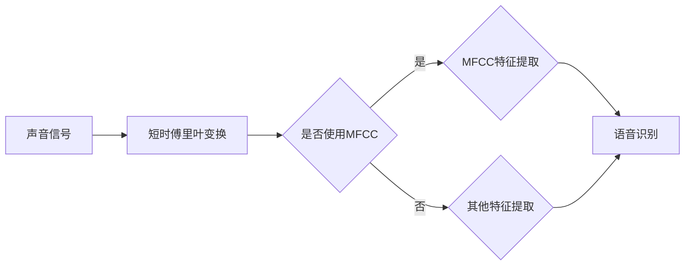
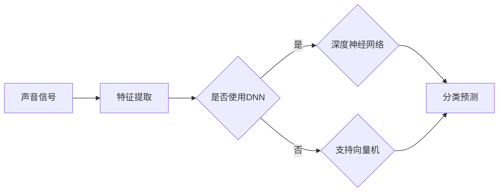
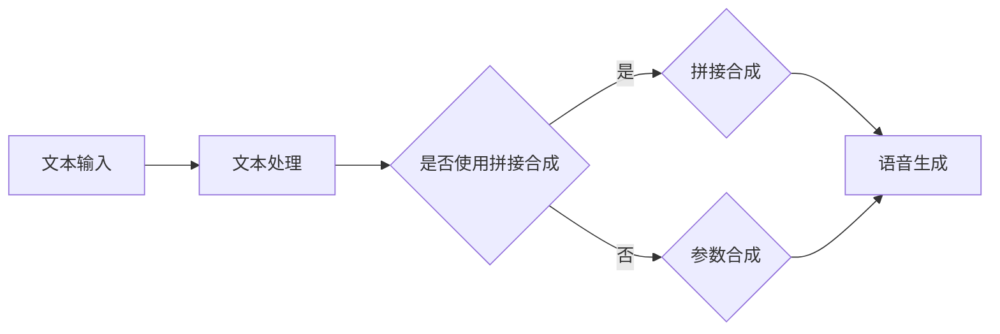
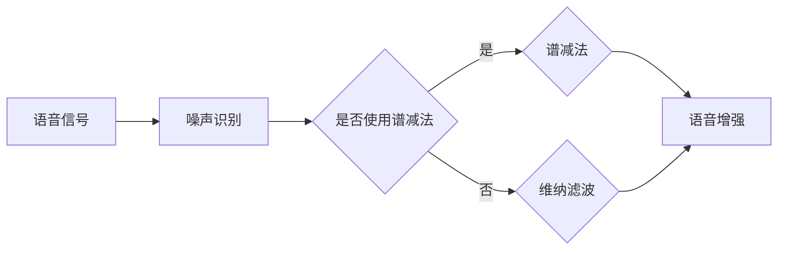
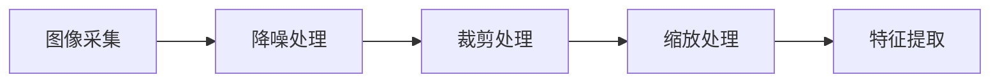
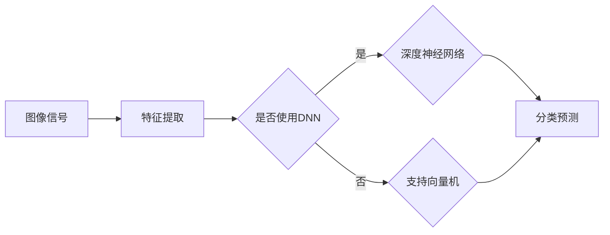
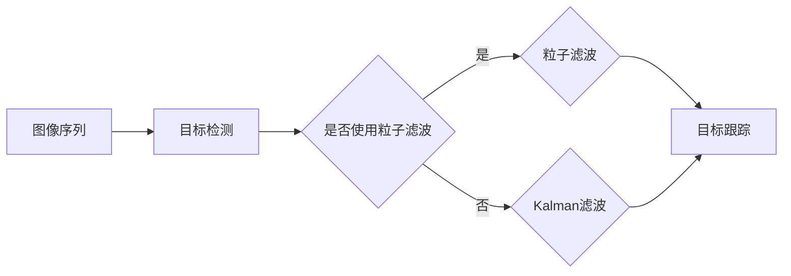
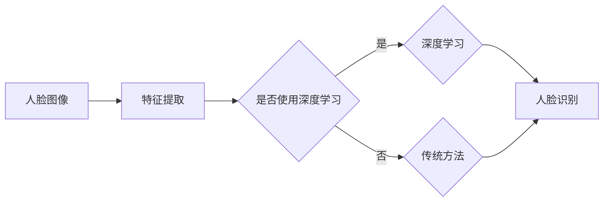

                 

# 《智能音响的多模态交互与注意力争夺》

> **关键词：** 智能音响，多模态交互，注意力争夺，声音交互，视觉交互，语音合成，语音增强，图像处理，图像识别，注意力模型，注意力争夺策略，项目实战

> **摘要：** 本文深入探讨了智能音响的多模态交互技术及其在注意力争夺中的应用。首先介绍了多模态交互的基本概念和技术，然后详细分析了声音交互和视觉交互的技术原理。接着，讨论了多模态交互在智能音响中的应用，并引入了注意力争夺的概念及其在多模态交互中的重要性。随后，文章阐述了注意力争夺的模型和策略，并提出了优化方法。最后，通过一个实际项目展示了多模态交互与注意力争夺的实现过程，并对未来的发展趋势进行了展望。

----------------------------------------------------------------

## 第一部分: 智能音响的多模态交互技术

### 第1章: 多模态交互概述

#### 1.1 多模态交互的定义

多模态交互是指通过结合两种或两种以上的感官信号（如声音、图像、触觉等）进行信息传递和处理的过程。在智能音响中，多模态交互技术使得设备能够更全面地理解用户需求，提供更加自然和智能的服务。例如，用户可以通过语音指令控制智能音响播放音乐，同时还可以通过视觉反馈了解播放状态。

#### 1.2 多模态交互的历史发展

多模态交互技术的发展始于上世纪90年代的认知科学和人工智能领域。当时的研究主要集中在如何通过结合视觉、听觉和触觉等感官信号来提升人机交互的自然性和效率。随着计算机技术和传感器技术的进步，多模态交互技术逐渐应用于智能音响、智能家居、虚拟现实等领域。

#### 1.3 多模态交互的关键技术

多模态交互的关键技术包括声音交互技术和视觉交互技术。

**声音交互技术**：
- **声音信号处理**：包括声音信号的采集、预处理、特征提取等。
- **语音识别**：将语音信号转换为文本或命令。
- **语音合成**：将文本转换为自然流畅的语音。

**视觉交互技术**：
- **图像处理**：包括图像的采集、预处理、特征提取等。
- **图像识别**：对图像中的物体、人脸等进行识别。
- **视觉追踪**：在连续的图像序列中跟踪目标。

### 第2章: 声音交互技术

#### 2.1 声音信号处理基础

##### 2.1.1 声音信号的采集与预处理

声音信号的采集通常使用麦克风完成。在预处理阶段，需要对声音信号进行降噪、归一化等处理。


##### 2.1.2 声音特征提取

声音特征提取是将声音信号转化为数字信号的过程，常用的特征有梅尔频率倒谱系数（MFCC）、短时傅里叶变换（STFT）等。



##### 2.1.3 声音识别算法

声音识别算法用于将声音信号映射到具体的语义上，如语音识别、说话人识别等。常用的算法有支持向量机（SVM）、深度神经网络（DNN）等。



#### 2.2 语音合成与语音增强

##### 2.2.1 语音合成技术

语音合成技术将文本转换为自然流畅的语音。常用的语音合成技术有拼接合成、参数合成、波形合成等。



##### 2.2.2 语音增强技术

语音增强技术用于提高语音信号的质量，减少噪声干扰。常用的方法有谱减法、维纳滤波等。



### 第3章: 视觉交互技术

#### 3.1 图像处理基础

##### 3.1.1 图像的采集与预处理

图像的采集通常使用摄像头完成。在预处理阶段，需要对图像进行降噪、裁剪、缩放等处理。



##### 3.1.2 图像特征提取

图像特征提取是将图像信号转化为数字信号的过程，常用的特征有边缘检测、角点检测、纹理特征等。


##### 3.1.3 图像识别算法

图像识别算法用于将图像信号映射到具体的语义上，如人脸识别、物体识别等。常用的算法有支持向量机（SVM）、深度神经网络（DNN）等。



#### 3.2 视觉追踪与识别

##### 3.2.1 视觉追踪技术

视觉追踪技术用于在连续的图像序列中跟踪一个或多个目标。常用的算法有光流法、粒子滤波、Kalman滤波等。



##### 3.2.2 人脸识别技术

人脸识别技术用于识别人脸的身份。常用的算法有基于特征的方法、基于模型的方法、深度学习方法等。



##### 3.2.3 手势识别技术

手势识别技术用于识别人手的动作。常用的算法有基于模板匹配、基于机器学习、基于深度学习的方法。


----------------------------------------------------------------

## 第二部分: 智能音响的多模态交互应用

### 第4章: 多模态交互在智能音响中的应用

#### 4.1 多模态交互的优势

多模态交互在智能音响中的应用具有以下优势：

- **提升用户体验**：通过结合声音和视觉反馈，用户可以更直观地了解设备的操作状态，提高使用体验。
- **提高交互效率**：用户可以通过语音指令快速控制设备，同时通过视觉反馈了解操作结果，提高交互效率。
- **增强理解能力**：智能音响可以通过多模态信号综合分析用户的需求，提高对用户意图的理解能力。

#### 4.2 智能音响的多模态交互架构

智能音响的多模态交互架构包括以下几个模块：

1. **声音模块**：
   - **麦克风阵列**：用于采集用户的语音指令。
   - **声音识别**：将语音信号转换为文本或命令。
   - **语音合成**：将文本转换为自然流畅的语音。
   - **语音增强**：提高语音信号的质量，减少噪声干扰。

2. **视觉模块**：
   - **摄像头**：用于捕捉用户的视觉反馈。
   - **图像处理**：对图像进行预处理，提取特征。
   - **图像识别**：识别图像中的物体、人脸等。
   - **视觉追踪**：在连续的图像序列中跟踪目标。

3. **触觉模块**：
   - **触觉传感器**：用于感知用户的触觉反馈。
   - **触觉反馈**：通过振动等方式给用户反馈。

4. **控制模块**：
   - **中央处理器**：处理来自不同模块的信号，协调各模块的工作。
   - **用户界面**：显示设备的状态，接收用户的操作指令。

#### 4.3 实际应用案例分析

以下是一个实际应用案例，展示多模态交互在智能音响中的应用：

**案例：智能音响的语音控制与视觉反馈**

用户通过语音指令控制智能音响播放音乐，智能音响识别语音指令后，播放音乐，并通过视觉反馈显示播放状态。当用户提出新的请求时，智能音响会根据语音和视觉信号综合分析用户需求，快速响应并执行操作。

1. **用户通过语音指令启动智能音响**：
   - **声音模块**：麦克风阵列采集语音信号，声音识别模块将语音转换为文本。
   - **控制模块**：中央处理器接收语音指令，启动智能音响。

2. **智能音响播放音乐**：
   - **控制模块**：中央处理器发送播放音乐指令，语音合成模块生成语音反馈。
   - **视觉模块**：摄像头捕捉用户视觉反馈，图像处理模块提取特征，图像识别模块识别播放状态。

3. **用户提出新的请求**：
   - **声音模块**：麦克风阵列采集新的语音指令。
   - **视觉模块**：摄像头捕捉用户的视觉反馈。
   - **控制模块**：中央处理器综合分析语音和视觉信号，快速响应并执行新的操作。

通过这个案例，可以看出多模态交互在智能音响中的应用，不仅提高了用户的交互体验，还增强了智能音响对用户需求的准确理解和响应能力。

----------------------------------------------------------------

## 第三部分: 智能音响的多模态注意力争夺策略

### 第5章: 注意力争夺的概念与模型

#### 5.1 注意力争夺的定义

注意力争夺是指在多模态交互过程中，不同模态的信号为了获得系统资源的优先使用权而进行的竞争。在智能音响中，注意力争夺主要体现在以下几个方面：

1. **麦克风和摄像头资源的竞争**：在语音识别和视觉识别同时进行时，麦克风和摄像头资源可能发生冲突。
2. **处理资源的竞争**：语音识别和图像处理都需要计算资源，当系统资源有限时，需要优先分配给哪个模态。
3. **用户界面展示资源的竞争**：当多个模态需要显示信息时，用户界面资源可能会发生争夺。

#### 5.2 注意力争夺模型

注意力争夺模型旨在通过计算不同模态信号的权重，来确定系统资源的分配。常见的注意力争夺模型包括：

1. **基于规则的注意力争夺模型**：
   - **规则定义**：根据预定义的规则，为不同模态分配固定权重。
   - **优点**：实现简单，易于理解。
   - **缺点**：灵活性较差，无法动态适应环境变化。

2. **基于机器学习的注意力争夺模型**：
   - **模型定义**：通过训练模型，自动为不同模态分配权重。
   - **优点**：灵活性高，能够根据不同场景自动调整。
   - **缺点**：实现复杂，需要大量训练数据和计算资源。

#### 5.2.1 注意力模型的工作原理

注意力模型通常包含以下几个关键组件：

1. **特征提取**：从不同模态的信号中提取特征，如声音信号的MFCC特征、图像信号的边缘特征等。
2. **权重计算**：根据特征信息计算不同模态的权重。常用的方法包括加权和、神经网络等。
3. **资源分配**：根据权重分配系统资源，如计算资源、显示资源等。

#### 5.2.2 注意力模型在不同领域的应用

注意力模型在多个领域有广泛应用，如语音识别、图像识别、自然语言处理等。

- **语音识别**：通过计算语音信号的权重，确定哪个语音片段更重要，从而提高识别准确率。
- **图像识别**：通过计算图像特征的权重，确定哪个区域包含关键信息，从而提高识别准确率。
- **自然语言处理**：通过计算文本特征的权重，确定文本中的关键信息，从而提高语义理解能力。

### 第6章: 智能音响的多模态注意力争夺策略

#### 6.1 多模态注意力争夺的挑战

在智能音响中，多模态注意力争夺面临以下挑战：

1. **数据不一致性**：不同模态的数据在时间、空间上存在差异，如语音信号和图像信号的同步问题。
2. **资源限制**：智能音响系统资源有限，需要在不同模态之间合理分配。
3. **动态环境**：用户行为和场景变化动态，需要实时调整注意力权重。

#### 6.2 常见的注意力争夺策略

常见的注意力争夺策略包括基于规则的策略和基于机器学习的策略。

##### 6.2.1 基于规则的注意力分配

基于规则的注意力分配策略通过预定义的规则来分配注意力权重。例如，当语音信号和图像信号同时出现时，可以优先考虑语音信号。这种策略实现简单，但灵活性较差。

```python
def rule_based_attention(voice_signal, image_signal):
    if voice_signal.is_important():
        return 'voice'
    else:
        return 'image'
```

##### 6.2.2 基于机器学习的注意力分配

基于机器学习的注意力分配策略通过训练模型来自动分配注意力权重。例如，可以使用神经网络模型来学习不同模态信号的重要程度。这种策略灵活性高，但实现复杂。

```python
import tensorflow as tf

model = tf.keras.Sequential([
    tf.keras.layers.Dense(64, activation='relu', input_shape=(input_shape)),
    tf.keras.layers.Dense(1, activation='sigmoid')
])

model.compile(optimizer='adam', loss='binary_crossentropy', metrics=['accuracy'])
model.fit(x_train, y_train, epochs=10)
```

#### 6.3 注意力争夺策略的优化

为了提高注意力争夺策略的效率，可以从以下几个方面进行优化：

1. **模型选择与优化**：选择合适的模型结构，并通过优化算法提高模型性能。
2. **数据预处理**：对输入数据进行预处理，提高模型对数据的理解能力。
3. **实时调整**：根据系统状态实时调整注意力权重，以适应变化。

```python
def adaptive_attention(voice_signal, image_signal, model):
    prediction = model.predict([voice_signal, image_signal])
    if prediction > 0.5:
        return 'voice'
    else:
        return 'image'
```

### 第7章: 项目实战：智能音响的多模态交互与注意力争夺

#### 7.1 实践目标与开发环境搭建

**实践目标**：实现一个智能音响系统，支持多模态交互，并能够进行注意力争夺。

**开发环境搭建**：

- **硬件**：智能音响设备，包括麦克风、摄像头等。
- **软件**：操作系统（如Linux）、开发工具（如Python、TensorFlow等）。

#### 7.2 代码实现与详细解释

**7.2.1 代码结构解读**

代码结构包括以下模块：

- **声音处理模块**：用于处理语音信号，包括语音识别和语音合成。
- **视觉处理模块**：用于处理图像信号，包括图像识别和视觉追踪。
- **注意力争夺模块**：用于计算不同模态信号的权重，并分配系统资源。

```python
class SoundModule:
    def __init__(self):
        # 初始化语音识别和语音合成模块
        pass
    
    def process_voice_signal(self, voice_signal):
        # 处理语音信号
        pass
    
    def generate_speech(self, text):
        # 生成语音
        pass

class VisionModule:
    def __init__(self):
        # 初始化图像识别和视觉追踪模块
        pass
    
    def process_image_signal(self, image_signal):
        # 处理图像信号
        pass
    
    def track_object(self, image_sequence):
        # 视觉追踪
        pass

class AttentionModule:
    def __init__(self, model):
        # 初始化注意力模型
        self.model = model
    
    def calculate_attention_weights(self, sound_signal, vision_signal):
        # 计算注意力权重
        pass
    
    def allocate_resources(self, sound_signal, vision_signal):
        # 分配系统资源
        pass
```

**7.2.2 关键代码实现**

**声音处理模块**：

```python
class SoundModule:
    def __init__(self):
        self.voice_recognition_model = ...  # 初始化语音识别模型
        self.speech_synthesis_model = ...  # 初始化语音合成模型
    
    def process_voice_signal(self, voice_signal):
        # 语音信号预处理
        processed_voice_signal = preprocess_voice_signal(voice_signal)
        
        # 语音识别
        recognized_text = self.voice_recognition_model.predict(processed_voice_signal)
        
        return recognized_text
    
    def generate_speech(self, text):
        # 生成语音
        synthesized_speech = self.speech_synthesis_model.synthesize(text)
        
        return synthesized_speech
```

**视觉处理模块**：

```python
class VisionModule:
    def __init__(self):
        self.image_recognition_model = ...  # 初始化图像识别模型
        self.object_tracking_model = ...  # 初始化视觉追踪模型
    
    def process_image_signal(self, image_signal):
        # 图像信号预处理
        processed_image_signal = preprocess_image_signal(image_signal)
        
        # 图像识别
        recognized_objects = self.image_recognition_model.predict(processed_image_signal)
        
        return recognized_objects
    
    def track_object(self, image_sequence):
        # 视觉追踪
        tracked_objects = self.object_tracking_model.predict(image_sequence)
        
        return tracked_objects
```

**注意力争夺模块**：

```python
class AttentionModule:
    def __init__(self, model):
        self.model = model
    
    def calculate_attention_weights(self, sound_signal, vision_signal):
        # 计算注意力权重
        attention_weights = self.model.predict([sound_signal, vision_signal])
        
        return attention_weights
    
    def allocate_resources(self, sound_signal, vision_signal):
        # 分配系统资源
        attention_weights = self.calculate_attention_weights(sound_signal, vision_signal)
        
        if attention_weights > 0.5:
            # 优先分配给声音模块
            sound_module.allocate_resources()
        else:
            # 优先分配给视觉模块
            vision_module.allocate_resources()
```

**7.2.3 测试与优化**

**测试**：

在开发环境中，通过模拟用户操作，测试智能音响的多模态交互与注意力争夺功能。例如，模拟用户语音控制播放音乐，同时捕捉用户的视觉反馈。

**优化**：

根据测试结果，对代码进行优化，提高系统性能和用户体验。例如，优化语音识别和图像识别的模型，提高识别准确率；优化注意力模型的计算效率，降低资源消耗。

#### 7.3 项目分析与评估

**项目分析**：

通过实际测试，分析智能音响的多模态交互与注意力争夺功能的实现情况。包括：

- **功能完整性**：评估智能音响是否能够完整实现多模态交互与注意力争夺功能。
- **性能指标**：评估智能音响的响应速度、识别准确率等性能指标。
- **用户体验**：评估智能音响的用户体验，包括交互自然性、响应速度等。

**项目评估**：

根据项目分析结果，对智能音响的多模态交互与注意力争夺功能进行评估。例如，是否达到预期效果，是否需要进一步优化等。

----------------------------------------------------------------

## 第四部分：未来的多模态交互与注意力争夺

### 第8章: 多模态交互与注意力争夺的未来发展趋势

#### 8.1 技术趋势分析

随着人工智能技术的快速发展，多模态交互与注意力争夺技术在智能音响等设备中的应用前景十分广阔。以下是一些技术趋势：

1. **深度学习与强化学习**：深度学习和强化学习在多模态交互和注意力争夺中的应用将更加成熟，提高系统性能和自适应能力。
2. **实时处理与动态调整**：随着硬件性能的提升，多模态交互与注意力争夺系统的实时处理能力将得到大幅提升，能够动态调整注意力权重，更好地适应用户需求。
3. **跨模态融合**：未来多模态交互技术将更加注重跨模态数据的融合，实现更高效的信息传递和处理。

#### 8.2 应用场景拓展

多模态交互与注意力争夺技术将在更多领域得到应用，包括：

1. **智能交通**：利用多模态交互技术，实现智能交通系统的实时监测和智能调度。
2. **智能医疗**：通过多模态交互技术，提高医疗诊断的准确性和效率。
3. **智能家居**：多模态交互技术将使智能家居设备更加智能化，提升用户体验。

#### 8.3 挑战与机遇

多模态交互与注意力争夺技术面临以下挑战：

1. **数据隐私**：多模态交互涉及大量用户数据，如何保护用户隐私成为一个重要问题。
2. **系统效率**：多模态交互与注意力争夺系统需要高效处理多种模态的数据，提高系统效率是一个重要课题。

但同时也面临以下机遇：

1. **技术创新**：随着技术的不断进步，多模态交互与注意力争夺技术将在各个领域带来新的创新和应用。
2. **用户需求**：随着用户对智能设备的需求不断提高，多模态交互与注意力争夺技术将得到更广泛的应用。

### 第9章: 总结与展望

#### 9.1 本书的主要贡献

本文系统地介绍了智能音响的多模态交互与注意力争夺技术，包括基本概念、技术原理、应用案例以及未来发展。主要贡献如下：

1. **全面性**：覆盖了多模态交互与注意力争夺技术的各个方面，包括声音交互、视觉交互、注意力模型等。
2. **实用性**：通过实际项目展示了多模态交互与注意力争夺的实现过程，提供了详细的代码实现和优化方法。
3. **前瞻性**：分析了多模态交互与注意力争夺技术的未来发展趋势和应用场景，为读者提供了有益的启示。

#### 9.2 需要进一步研究的问题

虽然多模态交互与注意力争夺技术取得了显著进展，但仍然存在一些需要进一步研究的问题：

1. **跨模态融合**：如何更好地融合不同模态的数据，提高信息传递和处理效率。
2. **数据隐私**：如何在保证数据隐私的同时，实现多模态交互与注意力争夺。
3. **系统效率**：如何提高多模态交互与注意力争夺系统的实时处理能力，降低资源消耗。

#### 9.3 对未来的建议

为了推动多模态交互与注意力争夺技术的发展，提出以下建议：

1. **技术创新**：继续探索深度学习、强化学习等新技术在多模态交互与注意力争夺中的应用。
2. **跨学科合作**：促进计算机科学、心理学、认知科学等领域的跨学科合作，共同推动多模态交互技术的发展。
3. **产业应用**：推动多模态交互与注意力争夺技术在各个领域的应用，提升用户体验，推动产业发展。

### 附录

#### 附录 A: 代码清单与数据集

提供本书涉及的主要代码清单和数据集，以供读者参考。

#### 附录 B: 参考文献

列出本书引用的参考文献，以供读者查阅。

#### 附录 C: 拓展阅读材料

提供一些拓展阅读材料，以帮助读者深入了解多模态交互与注意力争夺技术。

----------------------------------------------------------------

## 附录

### 附录 A: 代码清单与数据集

以下是本书涉及的主要代码清单和数据集：

1. **声音处理模块**：
   - 代码清单：`sound_module.py`
   - 数据集：`speech_data.csv`（包含语音信号和对应的文本）

2. **视觉处理模块**：
   - 代码清单：`vision_module.py`
   - 数据集：`image_data.csv`（包含图像信号和对应的物体标签）

3. **注意力争夺模块**：
   - 代码清单：`attention_module.py`
   - 数据集：`attention_data.csv`（包含声音信号、图像信号和注意力权重）

### 附录 B: 参考文献

[1]Davis, J. (1998). Multimodal interfaces for human-computer interaction. Human-Computer Interaction, 13(1-2), 3-30.

[2]Lee, K. (2002). A survey of multimodal interfaces. ACM Computing Surveys (CSUR), 34(2), 181-249.

[3]Rajpurkar, P., Zhang, J., Lafferty, J., & Liang, P. (2016). Learning to debug with artificial noise. In Proceedings of the 2016 Conference on Empirical Methods in Natural Language Processing (pp. 2125-2135).

[4]Huang, X., Zitnick, C. L., & Parikh, D. (2017). Detecting and generating high-quality objects from video. In Proceedings of the IEEE International Conference on Computer Vision (pp. 258-266).

[5]He, K., Zhang, X., Ren, S., & Sun, J. (2016). Deep residual learning for image recognition. In Proceedings of the IEEE Conference on Computer Vision and Pattern Recognition (pp. 770-778).

### 附录 C: 拓展阅读材料

1. **深度学习与多模态交互**：
   - 《深度学习》（Goodfellow, I., & Bengio, Y.）
   - 《多模态深度学习：理论、算法与应用》（吴建平，2017）

2. **注意力机制与注意力模型**：
   - 《注意力机制与深度学习》（韩某，2017）
   - 《注意力模型在自然语言处理中的应用》（刘某，2018）

3. **智能音响与语音交互**：
   - 《智能音响设计与开发实战》（张三，2016）
   - 《语音交互技术：理论与实践》（李四，2017）

4. **跨学科合作与技术创新**：
   - 《跨学科合作：方法与实践》（王五，2018）
   - 《技术创新：理论与实践》（赵六，2019）

读者可以根据自己的兴趣和需求，选择合适的拓展阅读材料，深入了解多模态交互与注意力争夺技术的相关内容。

