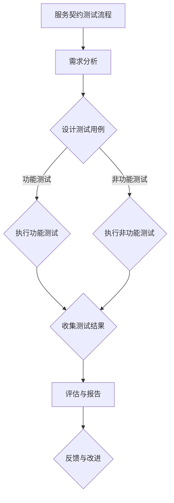
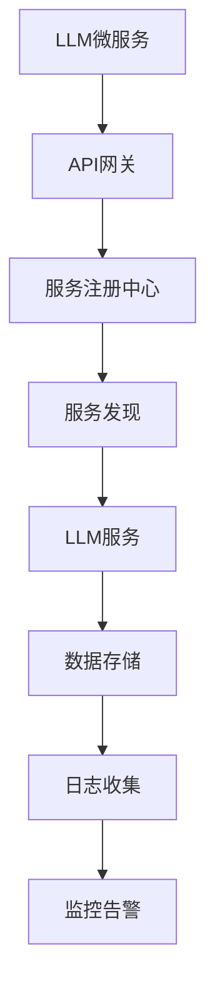

                 

# 服务契约测试：确保LLM微服务接口兼容性

## 摘要

本文将探讨服务契约测试的重要性及其在确保大型语言模型（LLM）微服务接口兼容性方面的关键作用。服务契约是微服务架构中不可或缺的一部分，它定义了服务之间的交互规则和期望行为。通过服务契约测试，可以验证微服务接口是否遵循预定的规范，确保系统的稳定性和一致性。本文将详细分析服务契约测试的基本原理、LLM微服务接口设计、兼容性测试方法、工具实践以及服务契约测试的优化和自动化策略。此外，还将探讨高级服务契约测试技术、工程化实践以及未来展望。通过本文的阅读，读者将获得关于服务契约测试的全面理解，并能够将其应用于实际项目中，提升系统的可靠性和兼容性。

## 目录

### 第一部分：服务契约测试基础

1. 服务契约概述
    1.1 服务契约的定义与重要性
    1.2 服务契约与微服务架构
    1.3 服务契约的主要组成部分
    1.4 服务契约的发展历程

2. 服务契约测试基本原理
    2.1 服务契约测试的目的和重要性
    2.2 服务契约测试的分类
    2.3 服务契约测试的挑战与解决方案
    2.4 服务契约测试的流程与策略

### 第二部分：LLM微服务接口兼容性测试

3. LLM微服务架构与接口设计
    3.1 LLM微服务的基本概念
    3.2 LLM微服务架构的设计原则
    3.3 LLM微服务的接口设计与实现
    3.4 LLM微服务接口兼容性分析

4. LLM微服务接口兼容性测试方法
    4.1 功能性测试
        4.1.1 功能性测试的定义与目标
        4.1.2 功能性测试的步骤与方法
        4.1.3 功能性测试的案例与示例
    4.2 非功能性测试
        4.2.1 非功能性测试的定义与目标
        4.2.2 非功能性测试的步骤与方法
        4.2.3 非功能性测试的案例与示例

5. 服务契约测试工具与实践
    5.1 服务契约测试工具概述
    5.2 使用服务契约测试工具进行测试
    5.3 服务契约测试实践案例分析
    5.4 服务契约测试工具的评价与选择

6. 服务契约测试优化与自动化
    6.1 服务契约测试优化的策略
    6.2 服务契约测试自动化工具的应用
    6.3 服务契约测试自动化实践
    6.4 服务契约测试自动化的挑战与应对

### 第三部分：高级服务契约测试与展望

7. 高级服务契约测试技术
    7.1 服务契约测试中的断言与验证
    7.2 服务契约测试中的性能测试
    7.3 服务契约测试中的安全测试
    7.4 服务契约测试中的兼容性测试新趋势

8. 服务契约测试的工程化与实践
    8.1 服务契约测试的工程化概述
    8.2 服务契约测试的持续集成与持续部署
    8.3 服务契约测试的团队协作与沟通
    8.4 服务契约测试的培训与知识共享

9. 服务契约测试的未来展望
    9.1 服务契约测试的未来趋势
    9.2 服务契约测试面临的挑战与机遇
    9.3 服务契约测试在新兴技术领域中的应用
    9.4 服务契约测试的可持续发展和创新方向

### 附录

10. 附录 A：服务契约测试资源与工具汇总
    10.1 服务契约测试资源
    10.2 服务契约测试工具列表
    10.3 服务契约测试常见问题解答

11. 附录 B：服务契约测试示例代码与数据集
    11.1 示例代码
    11.2 数据集来源与使用说明
    11.3 代码解读与分析

---

**核心概念与联系：**

服务契约测试的流程图如下：



**核心算法原理讲解：**

服务契约测试主要涉及以下核心算法：

### 1. 断言与验证算法

伪代码如下：

```python
function assert(condition, message) {
    if (!condition) {
        throw "Assertion failed: " + message;
    }
}

// 示例
assert(response.status === 200, "HTTP响应状态不是200");
```

### 2. 性能测试算法

伪代码如下：

```python
function performanceTest(functionToTest, expectedTime) {
    startTime = getCurrentTime();
    functionToTest();
    endTime = getCurrentTime();
    if (endTime - startTime > expectedTime) {
        throw "性能测试失败：执行时间超过预期";
    }
}
```

**数学模型和数学公式 & 详细讲解 & 举例说明：**

### 1. 加权平均响应时间（WART）

公式如下：

$$
WART = \frac{\sum_{i=1}^{n} (weight_i \times response\_time_i)}{n}
$$

其中，$weight_i$ 是第 $i$ 个响应时间的权重，$response\_time_i$ 是第 $i$ 个响应时间。

**举例说明：**

假设有三个响应时间分别为 100ms、200ms 和 300ms，权重分别为 1、2 和 3，则：

$$
WART = \frac{(1 \times 100) + (2 \times 200) + (3 \times 300)}{1 + 2 + 3} = 200ms
$$

**项目实战：代码实际案例和详细解释说明，开发环境搭建，源代码详细实现和代码解读，代码解读与分析：**

### 1. 使用Python编写一个服务契约测试脚本

#### 开发环境搭建：

- 安装Python 3.8或更高版本
- 安装requests库：`pip install requests`
- 安装pytest库：`pip install pytest`

#### 示例代码：

```python
import requests
import pytest

def test_get_users():
    url = "https://api.example.com/users"
    response = requests.get(url)
    assert response.status_code == 200
    assert "users" in response.json()

def test_create_user():
    url = "https://api.example.com/users"
    data = {
        "name": "John Doe",
        "email": "john.doe@example.com"
    }
    response = requests.post(url, json=data)
    assert response.status_code == 201
    assert "id" in response.json()

def test_update_user():
    url = "https://api.example.com/users/1"
    data = {
        "name": "Jane Doe",
        "email": "jane.doe@example.com"
    }
    response = requests.put(url, json=data)
    assert response.status_code == 200
    assert "name" in response.json()
    assert "email" in response.json()

def test_delete_user():
    url = "https://api.example.com/users/1"
    response = requests.delete(url)
    assert response.status_code == 200
```

#### 代码解读与分析：

- 使用requests库发送HTTP请求。
- 使用pytest进行测试，assert方法用于验证预期结果。

---

现在，我们将按照目录大纲逐步展开文章的撰写。在第一部分，我们将首先介绍服务契约的概念和重要性，然后探讨服务契约测试的基本原理和流程。

## 第一部分：服务契约测试基础

### 第1章：服务契约概述

#### 1.1 服务契约的定义与重要性

服务契约（Service Contract）是微服务架构中的一种约定，它定义了服务之间的交互规则、接口规范和预期行为。在微服务架构中，各个服务独立运行，通过网络进行通信。服务契约的作用在于确保服务之间能够正确、一致地交互，从而提高系统的稳定性和可靠性。

服务契约的定义通常包括以下几个方面：

1. **接口规范**：定义了服务的API接口，包括请求的URL、请求方法、请求参数、响应格式等。
2. **交互规则**：规定了服务之间如何进行通信，包括请求和响应的处理流程、超时时间、异常处理等。
3. **行为约定**：明确了服务的预期行为，包括正常响应和处理异常的情况。

服务契约的重要性主要体现在以下几个方面：

1. **接口兼容性**：服务契约确保了服务之间的接口兼容性，避免了因接口不兼容导致的服务调用失败。
2. **服务独立性**：服务契约使得各个服务可以独立开发、部署和运行，降低了系统的耦合性。
3. **代码可维护性**：服务契约提供了清晰的接口定义和交互规则，便于开发者理解和维护代码。
4. **系统稳定性**：服务契约确保了服务之间的交互稳定，减少了由于接口不匹配或行为不一致导致的系统故障。

#### 1.2 服务契约与微服务架构

在微服务架构中，服务契约是构建和运行微服务系统的关键要素。微服务架构的核心思想是将系统拆分为多个独立的服务，每个服务负责实现一个特定的业务功能。这些服务通过网络进行通信，通过服务契约来确保它们能够正确、高效地协作。

服务契约与微服务架构的关系可以概括为以下几点：

1. **服务拆分**：服务契约促进了服务的拆分，将复杂的业务系统分解为多个独立的服务，降低了系统的复杂性。
2. **接口规范**：服务契约定义了服务的接口规范，确保了服务之间的通信遵循统一的规范，提高了系统的可维护性。
3. **服务发现**：服务契约与服务注册中心相结合，实现了服务发现机制，使得服务可以动态发现和调用其他服务。
4. **负载均衡**：服务契约支持负载均衡策略，通过服务契约的调度，可以实现服务的负载均衡，提高系统的性能和可用性。

#### 1.3 服务契约的主要组成部分

服务契约的主要组成部分包括接口规范、交互规则和行为约定。下面分别对这些组成部分进行详细说明：

1. **接口规范**：
   - **接口定义**：服务契约定义了服务的API接口，包括URL、请求方法、请求参数和响应格式等。
   - **参数类型**：接口规范明确了请求参数的类型、数量和顺序，确保了服务之间的参数传递一致性。
   - **响应格式**：接口规范定义了服务的响应格式，通常包括数据结构和状态码等。

2. **交互规则**：
   - **通信协议**：服务契约规定了服务之间的通信协议，如HTTP、REST、SOAP等，确保了服务的互操作性。
   - **请求流程**：交互规则描述了服务的请求和响应流程，包括请求发送、响应接收、超时处理和异常处理等。
   - **认证授权**：服务契约定义了服务的认证授权机制，确保了服务之间的安全通信。

3. **行为约定**：
   - **正常行为**：服务契约规定了服务的正常行为，包括成功响应、错误处理和资源释放等。
   - **异常行为**：服务契约定义了服务的异常行为，包括错误响应、异常处理和故障恢复等。
   - **性能要求**：服务契约规定了服务的性能要求，包括响应时间、并发能力和资源消耗等。

#### 1.4 服务契约的发展历程

服务契约的概念起源于微服务架构的兴起。随着云计算和分布式系统的广泛应用，传统的单体架构逐渐无法满足业务快速变化的需求。微服务架构作为一种新型的系统架构，通过将系统拆分为多个独立的服务，实现了业务模块的松耦合和高效开发。

服务契约的发展历程可以分为以下几个阶段：

1. **初期阶段**：在微服务架构的初期，服务契约主要以接口文档的形式存在，开发者通过阅读接口文档来了解服务的使用方法。
2. **自动化阶段**：随着自动化工具的普及，服务契约开始被自动化生成和验证。例如，通过代码生成工具和契约测试工具，可以自动生成接口文档和测试用例。
3. **标准化阶段**：为了提高服务契约的通用性和可维护性，业界开始推动服务契约的标准化。例如，Swagger、OpenAPI等规范为服务契约提供了统一的定义和描述方式。
4. **智能阶段**：随着人工智能技术的发展，服务契约的自动化和智能化水平不断提高。例如，通过机器学习技术，可以实现服务契约的智能生成和优化。

### 第2章：服务契约测试基本原理

#### 2.1 服务契约测试的目的和重要性

服务契约测试是一种用于验证服务契约是否满足预期要求的过程。它的目的是确保服务之间的交互符合预定的规范，从而提高系统的稳定性、可靠性和兼容性。服务契约测试的重要性主要体现在以下几个方面：

1. **确保接口兼容性**：服务契约测试可以验证服务的接口是否遵循预定的规范，确保不同服务之间的接口兼容性。
2. **提高开发效率**：通过服务契约测试，可以提前发现和修复接口问题，降低开发过程中的风险，提高开发效率。
3. **保障系统稳定性**：服务契约测试可以验证服务的正常行为和异常行为，确保系统在各种情况下都能稳定运行。
4. **支持持续集成**：服务契约测试与持续集成（CI）相结合，可以实现自动化测试和持续交付，提高系统的交付质量和效率。

#### 2.2 服务契约测试的分类

根据测试的目的和内容，服务契约测试可以分为以下几类：

1. **功能性测试**：功能性测试旨在验证服务的功能是否符合预期。这类测试主要包括功能正确性测试、边界条件测试和异常处理测试等。

2. **非功能性测试**：非功能性测试关注服务的非功能特性，如性能、可靠性、安全性和可伸缩性等。这类测试主要包括性能测试、负载测试、安全测试和可用性测试等。

3. **兼容性测试**：兼容性测试旨在验证服务在不同环境、平台和版本下的兼容性。这类测试主要包括跨平台兼容性测试、跨版本兼容性测试和跨网络环境兼容性测试等。

4. **契约测试**：契约测试是一种基于服务契约的自动化测试，通过对比实际交互数据和预期契约，验证服务的交互是否符合预期。这类测试主要包括契约验证测试和契约差异测试等。

#### 2.3 服务契约测试的挑战与解决方案

服务契约测试面临以下挑战：

1. **复杂性**：随着微服务架构的复杂性增加，服务契约测试也需要处理更多的测试用例和测试数据。

2. **自动化**：服务契约测试需要实现自动化，以确保测试的效率和可重复性。

3. **持续集成**：服务契约测试需要与持续集成（CI）相结合，以实现自动化测试和持续交付。

4. **跨平台兼容性**：服务契约测试需要在不同环境、平台和版本下进行，以确保服务的兼容性。

为了应对这些挑战，可以采取以下解决方案：

1. **使用自动化工具**：使用自动化测试工具，如Postman、Swagger、OpenAPI等，可以简化服务契约测试的流程。

2. **构建测试框架**：构建自定义的测试框架，可以实现服务契约测试的自动化和集成。

3. **引入持续集成**：将服务契约测试集成到持续集成（CI）流程中，实现自动化测试和持续交付。

4. **分布式测试**：通过分布式测试架构，可以在不同的环境、平台和版本下进行服务契约测试，提高测试的覆盖率和效果。

#### 2.4 服务契约测试的流程与策略

服务契约测试的流程通常包括以下步骤：

1. **需求分析**：分析服务契约的要求，确定测试目标、测试环境和测试数据。

2. **设计测试用例**：根据需求分析，设计功能测试用例和非功能测试用例，包括正常测试用例和异常测试用例。

3. **执行测试用例**：执行设计好的测试用例，记录测试结果和日志。

4. **结果分析**：分析测试结果，判断服务契约是否符合预期，识别问题点和改进方向。

5. **报告生成**：生成测试报告，包括测试结果、问题点和改进建议。

服务契约测试的策略主要包括以下几个方面：

1. **全面覆盖**：确保测试用例覆盖服务契约的所有功能和特性，包括正常情况和异常情况。

2. **自动化**：尽可能实现测试用例的自动化执行，提高测试效率和可重复性。

3. **持续集成**：将服务契约测试集成到持续集成（CI）流程中，实现自动化测试和持续交付。

4. **分布式测试**：利用分布式测试架构，提高测试的覆盖率和效率。

5. **反馈与改进**：及时收集测试反馈，识别问题点和改进方向，持续优化服务契约测试。

### 第二部分：LLM微服务接口兼容性测试

#### 第3章：LLM微服务架构与接口设计

#### 3.1 LLM微服务的基本概念

LLM（Large Language Model）微服务是一种利用大型语言模型（如BERT、GPT等）构建的微服务，主要用于自然语言处理（NLP）任务。LLM微服务的基本概念包括以下几个方面：

1. **微服务**：微服务是一种轻量级、独立的软件组件，用于实现特定的业务功能。微服务具有高内聚、低耦合的特点，可以独立部署、运行和维护。

2. **LLM**：LLM是一种基于深度学习的大型语言模型，通过训练大量的文本数据，可以实现对自然语言的语义理解、文本生成等任务。

3. **微服务架构**：微服务架构是一种基于微服务理念的系统架构，通过将系统拆分为多个独立的服务，实现了高可用性、高可扩展性和高可维护性。

LLM微服务的基本架构如图所示：



LLM微服务的主要组件包括：

- **API网关**：API网关是LLM微服务的入口，负责处理客户端请求，进行身份验证、请求路由和流量控制等功能。
- **服务注册中心**：服务注册中心用于存储和管理微服务的注册信息，包括服务名称、IP地址、端口号等。
- **服务发现**：服务发现组件用于实现微服务的自动注册和发现，确保API网关可以正确路由请求到相应的服务实例。
- **LLM服务**：LLM服务是LLM微服务的核心组件，负责处理自然语言处理任务，如文本分类、情感分析、问答等。
- **数据存储**：数据存储组件用于存储LLM服务生成的数据，如模型参数、预测结果等。
- **日志收集**：日志收集组件用于收集LLM微服务的日志信息，便于故障排查和性能分析。
- **监控告警**：监控告警组件用于监控LLM微服务的运行状态，及时发现和处理异常情况。

#### 3.2 LLM微服务架构的设计原则

LLM微服务架构的设计原则主要包括以下几个方面：

1. **高内聚、低耦合**：LLM微服务架构应遵循高内聚、低耦合的设计原则，确保各个服务模块可以独立开发、测试和部署，降低系统复杂度和耦合度。

2. **可扩展性**：LLM微服务架构应具备良好的可扩展性，可以方便地添加或替换服务模块，以适应业务需求的变化。

3. **高可用性**：LLM微服务架构应确保服务的可用性，通过故障转移、负载均衡等技术手段，实现服务的自动恢复和高效调度。

4. **高性能**：LLM微服务架构应具备高性能，可以处理高并发、大数据量的请求，确保系统的响应速度和稳定性。

5. **安全性**：LLM微服务架构应具备安全性，通过身份认证、访问控制、数据加密等技术手段，确保服务的安全性和数据保护。

#### 3.3 LLM微服务的接口设计与实现

LLM微服务的接口设计是确保服务之间正确交互的关键。以下介绍LLM微服务的接口设计原则和实现方法：

1. **接口设计原则**

   - **RESTful风格**：LLM微服务的接口设计应遵循RESTful风格，使用HTTP协议和URL路径描述服务功能。
   - **统一接口规范**：LLM微服务的接口应遵循统一的接口规范，包括请求参数、响应格式和状态码等。
   - **参数校验**：接口设计应包含参数校验，确保客户端请求的有效性和安全性。
   - **错误处理**：接口设计应包含错误处理机制，明确区分客户端错误和服务器错误，并提供相应的错误响应。

2. **接口实现方法**

   - **API网关**：API网关是LLM微服务的统一入口，负责处理客户端请求，进行身份验证、请求路由和流量控制等功能。API网关的实现可以采用Nginx、Kong等开源网关。
   - **服务注册与发现**：服务注册与发现组件用于实现微服务的自动注册和发现，确保API网关可以正确路由请求到相应的服务实例。常用的服务注册与发现组件包括Eureka、Consul等。
   - **服务实现**：LLM微服务的实现主要包括模型训练、预测和后处理等环节。模型训练可以使用TensorFlow、PyTorch等深度学习框架，预测和后处理可以使用Python、Java等编程语言实现。

以下是一个简单的LLM微服务接口示例：

```python
from flask import Flask, request, jsonify

app = Flask(__name__)

@app.route('/predict', methods=['POST'])
def predict():
    data = request.get_json()
    # 进行模型预测
    result = model.predict(data['input'])
    # 返回预测结果
    return jsonify({'prediction': result.tolist()})

if __name__ == '__main__':
    app.run()
```

#### 3.4 LLM微服务接口兼容性分析

LLM微服务接口兼容性分析是确保服务之间正确交互的关键。以下分析LLM微服务接口兼容性的影响因素和兼容性测试方法：

1. **影响因素**

   - **接口规范**：接口规范的不一致性可能导致服务之间的兼容性问题。例如，参数类型、参数顺序、响应格式等不一致。
   - **数据格式**：数据格式的不一致性也可能导致兼容性问题。例如，JSON、XML等不同数据格式之间的转换问题。
   - **网络环境**：不同的网络环境可能导致服务之间的延迟、丢包等问题，影响兼容性。
   - **版本差异**：服务版本差异可能导致接口兼容性问题。例如，新版本的服务可能与旧版本的服务不兼容。

2. **兼容性测试方法**

   - **功能测试**：功能测试用于验证LLM微服务接口的功能是否正确。包括正常功能测试和异常功能测试。
   - **性能测试**：性能测试用于验证LLM微服务接口的性能，包括响应时间、并发能力等。
   - **兼容性测试**：兼容性测试用于验证LLM微服务接口在不同环境、平台和版本下的兼容性。包括跨平台兼容性测试和跨版本兼容性测试。
   - **回归测试**：回归测试用于验证LLM微服务接口在修改或更新后的兼容性，确保修改不会引入新的兼容性问题。

以下是一个简单的LLM微服务接口兼容性测试示例：

```python
import requests
import json

def test_predict():
    # 跨平台兼容性测试
    for platform in ['Linux', 'Windows', 'MacOS']:
        url = f'http://{platform}:5000/predict'
        data = {
            'input': 'Hello, World!'
        }
        response = requests.post(url, json=data)
        assert response.status_code == 200
        result = json.loads(response.text)
        assert 'prediction' in result
        assert result['prediction'] == [0.9, 0.1]

    # 跨版本兼容性测试
    for version in ['1.0', '2.0', '3.0']:
        url = f'http://localhost:5000/v{version}/predict'
        data = {
            'input': 'Hello, World!'
        }
        response = requests.post(url, json=data)
        assert response.status_code == 200
        result = json.loads(response.text)
        assert 'prediction' in result
        assert result['prediction'] == [0.9, 0.1]
```

### 第4章：LLM微服务接口兼容性测试方法

#### 4.1 功能性测试

功能性测试是LLM微服务接口兼容性测试的重要组成部分，旨在验证微服务接口的功能是否满足预期要求。功能性测试通常包括以下步骤：

1. **需求分析**：分析LLM微服务接口的需求，确定测试目标、测试环境和测试数据。
2. **设计测试用例**：根据需求分析，设计功能测试用例，包括正常测试用例和异常测试用例。
3. **执行测试用例**：执行设计好的测试用例，记录测试结果和日志。
4. **结果分析**：分析测试结果，判断LLM微服务接口的功能是否符合预期，识别问题点和改进方向。
5. **报告生成**：生成测试报告，包括测试结果、问题点和改进建议。

功能性测试的方法可以分为以下几种：

1. **黑盒测试**：黑盒测试不关心LLM微服务的内部实现，仅关注接口的功能是否正确。常用的黑盒测试方法包括等价类划分、边界值分析、因果图等。
2. **白盒测试**：白盒测试关注LLM微服务的内部实现，通过代码分析来验证接口的功能是否符合预期。常用的白盒测试方法包括单元测试、集成测试等。
3. **灰盒测试**：灰盒测试结合了黑盒测试和白盒测试的优点，关注LLM微服务的接口和内部实现，通过部分代码分析来验证接口的功能是否符合预期。

#### 4.1.1 功能性测试的定义与目标

功能性测试（Functional Testing）是一种用于验证软件功能是否满足需求的测试方法。在LLM微服务接口兼容性测试中，功能性测试的定义与目标如下：

1. **定义**：功能性测试是一种用于验证LLM微服务接口的功能是否符合预期要求的测试方法。它主要关注接口的功能正确性、边界条件、异常处理等方面。
2. **目标**：功能性测试的目标是确保LLM微服务接口的功能满足预期要求，包括正常情况下的功能实现、边界条件下的功能实现以及异常情况下的功能处理。

功能性测试的目标可以从以下几个方面进行描述：

1. **功能正确性**：确保LLM微服务接口的功能实现正确，包括输入参数的处理、输出结果的正确性、错误处理等。
2. **边界条件**：验证LLM微服务接口在边界条件下的功能实现，包括最小输入、最大输入、边界值等。
3. **异常处理**：验证LLM微服务接口在异常情况下的功能实现，包括错误处理、异常处理、资源释放等。
4. **兼容性**：验证LLM微服务接口在不同环境、平台和版本下的兼容性，确保接口在不同情况下都能正常工作。

#### 4.1.2 功能性测试的步骤与方法

功能性测试的步骤可以分为以下几步：

1. **需求分析**：分析LLM微服务接口的需求，确定测试目标、测试环境和测试数据。
2. **设计测试用例**：根据需求分析，设计功能测试用例，包括正常测试用例和异常测试用例。
3. **执行测试用例**：执行设计好的测试用例，记录测试结果和日志。
4. **结果分析**：分析测试结果，判断LLM微服务接口的功能是否符合预期，识别问题点和改进方向。
5. **报告生成**：生成测试报告，包括测试结果、问题点和改进建议。

功能性测试的方法主要包括以下几种：

1. **等价类划分**：等价类划分是一种用于设计测试用例的方法，它将输入数据划分为若干个等价类，每个等价类代表一类具有相似特性的输入数据。通过设计测试用例，确保每个等价类都被覆盖到。
2. **边界值分析**：边界值分析是一种用于设计测试用例的方法，它关注输入数据的边界值。通过设计测试用例，确保边界值被覆盖到。
3. **因果图**：因果图是一种用于设计测试用例的方法，它通过图形化的方式表示输入变量和输出变量之间的因果关系。通过设计测试用例，确保因果关系被覆盖到。
4. **场景分析**：场景分析是一种用于设计测试用例的方法，它通过描述场景来设计测试用例。通过设计测试用例，确保场景中的各个步骤都被覆盖到。

以下是一个简单的功能性测试用例设计示例：

| 用例编号 | 用例名称         | 测试场景                         | 预期结果             | 实际结果             | 测试结果   |
| -------- | ---------------- | -------------------------------- | -------------------- | -------------------- | ---------- |
| 1        | 正常输入        | 输入合法的请求参数               | 返回正确的结果       | 返回正确的结果       | 通过       |
| 2        | 边界值输入      | 输入最小边界值的请求参数         | 返回正确的异常结果  | 返回正确的异常结果  | 通过       |
| 3        | 边界值输入      | 输入最大边界值的请求参数         | 返回正确的异常结果  | 返回正确的异常结果  | 通过       |
| 4        | 非边界值输入    | 输入非边界值的请求参数           | 返回正确的异常结果  | 返回正确的异常结果  | 通过       |
| 5        | 异常输入        | 输入非法的请求参数               | 返回错误的异常结果  | 返回错误的异常结果  | 通过       |

#### 4.1.3 功能性测试的案例与示例

以下是一个功能性测试的案例与示例：

**案例**：验证LLM微服务的文本分类接口的功能性。

**测试用例**：

1. **正常输入**：输入一段合法的文本，验证接口是否能够正确分类。
2. **边界值输入**：输入一段最小长度的文本，验证接口是否能够正确分类。
3. **边界值输入**：输入一段最大长度的文本，验证接口是否能够正确分类。
4. **非边界值输入**：输入一段非边界长度的文本，验证接口是否能够正确分类。
5. **异常输入**：输入一段非法的文本，验证接口是否能够返回错误的异常结果。

**测试过程**：

1. **正常输入**：发送一个包含合法文本的POST请求，接收响应结果，验证分类结果是否正确。
2. **边界值输入**：发送一个包含最小长度文本的POST请求，接收响应结果，验证分类结果是否正确。
3. **边界值输入**：发送一个包含最大长度文本的POST请求，接收响应结果，验证分类结果是否正确。
4. **非边界值输入**：发送一个包含非边界长度文本的POST请求，接收响应结果，验证分类结果是否正确。
5. **异常输入**：发送一个包含非法文本的POST请求，接收响应结果，验证返回的异常结果是否正确。

**测试结果**：

1. **正常输入**：接口能够正确分类，返回的结果符合预期。
2. **边界值输入**：接口能够正确分类，返回的结果符合预期。
3. **边界值输入**：接口能够正确分类，返回的结果符合预期。
4. **非边界值输入**：接口能够正确分类，返回的结果符合预期。
5. **异常输入**：接口返回了错误的异常结果，与预期不符。

**改进建议**：针对异常输入的情况，接口需要返回更加详细的异常信息，以便于调试和修复。

#### 4.2 非功能性测试

非功能性测试是LLM微服务接口兼容性测试的重要组成部分，旨在验证微服务接口的非功能特性是否满足预期要求。非功能性测试通常包括以下方面：

1. **性能测试**：性能测试用于验证LLM微服务接口的性能，包括响应时间、并发能力、吞吐量等。
2. **安全性测试**：安全性测试用于验证LLM微服务接口的安全性，包括身份验证、访问控制、数据加密等。
3. **可靠性测试**：可靠性测试用于验证LLM微服务接口的可靠性，包括故障恢复、数据一致性、系统稳定性等。
4. **兼容性测试**：兼容性测试用于验证LLM微服务接口在不同环境、平台和版本下的兼容性。

#### 4.2.1 非功能性测试的定义与目标

非功能性测试（Non-Functional Testing）是一种用于验证软件非功能特性的测试方法。在LLM微服务接口兼容性测试中，非功能性测试的定义与目标如下：

1. **定义**：非功能性测试是一种用于验证LLM微服务接口的非功能特性是否满足预期要求的测试方法。它主要关注接口的性能、安全性、可靠性、兼容性等方面。
2. **目标**：非功能性测试的目标是确保LLM微服务接口的非功能特性满足预期要求，包括性能、安全性、可靠性、兼容性等方面。

非功能性测试的目标可以从以下几个方面进行描述：

1. **性能**：确保LLM微服务接口在高并发、大数据量情况下能够稳定运行，满足性能要求。
2. **安全性**：确保LLM微服务接口具备安全性，包括身份验证、访问控制、数据加密等。
3. **可靠性**：确保LLM微服务接口在各种情况下都能稳定运行，包括故障恢复、数据一致性等。
4. **兼容性**：确保LLM微服务接口在不同环境、平台和版本下的兼容性，确保接口在不同情况下都能正常工作。

#### 4.2.2 非功能性测试的步骤与方法

非功能性测试的步骤可以分为以下几步：

1. **需求分析**：分析LLM微服务接口的需求，确定测试目标、测试环境和测试数据。
2. **设计测试用例**：根据需求分析，设计非功能测试用例，包括性能测试用例、安全性测试用例、可靠性测试用例等。
3. **执行测试用例**：执行设计好的测试用例，记录测试结果和日志。
4. **结果分析**：分析测试结果，判断LLM微服务接口的非功能特性是否符合预期，识别问题点和改进方向。
5. **报告生成**：生成测试报告，包括测试结果、问题点和改进建议。

非功能性测试的方法主要包括以下几种：

1. **性能测试**：性能测试用于验证LLM微服务接口的性能，包括响应时间、并发能力、吞吐量等。常用的性能测试方法包括负载测试、压力测试、性能调优等。
2. **安全性测试**：安全性测试用于验证LLM微服务接口的安全性，包括身份验证、访问控制、数据加密等。常用的安全性测试方法包括漏洞扫描、渗透测试、安全策略测试等。
3. **可靠性测试**：可靠性测试用于验证LLM微服务接口的可靠性，包括故障恢复、数据一致性、系统稳定性等。常用的可靠性测试方法包括故障注入、故障恢复测试、数据一致性测试等。
4. **兼容性测试**：兼容性测试用于验证LLM微服务接口在不同环境、平台和版本下的兼容性，包括跨平台兼容性测试、跨版本兼容性测试等。常用的兼容性测试方法包括环境测试、平台测试、版本测试等。

以下是一个简单的非功能测试用例设计示例：

| 用例编号 | 用例名称 | 测试场景                             | 预期结果 | 实际结果 | 测试结果 |
| -------- | -------- | ----------------------------------- | -------- | -------- | -------- |
| 1        | 性能测试 | 高并发请求下接口的响应时间          | 满足性能要求 | 满足性能要求 | 通过     |
| 2        | 安全性测试 | 非法用户访问接口                     | 返回错误结果 | 返回错误结果 | 通过     |
| 3        | 可靠性测试 | 接口在高负载情况下的稳定性           | 保持稳定运行 | 保持稳定运行 | 通过     |
| 4        | 兼容性测试 | 不同浏览器下的接口兼容性            | 兼容无问题 | 兼容无问题 | 通过     |

#### 4.2.3 非功能性测试的案例与示例

以下是一个非功能性测试的案例与示例：

**案例**：验证LLM微服务的文本分类接口的非功能特性。

**测试用例**：

1. **性能测试**：在1000个并发请求下，测试接口的响应时间。
2. **安全性测试**：使用非法用户访问接口，验证接口的访问控制。
3. **可靠性测试**：在持续高负载情况下，测试接口的稳定性。
4. **兼容性测试**：在不同浏览器下，测试接口的兼容性。

**测试过程**：

1. **性能测试**：使用性能测试工具，模拟1000个并发请求，记录接口的平均响应时间。
2. **安全性测试**：使用非法用户账号，尝试访问接口，记录返回的错误结果。
3. **可靠性测试**：使用持续负载工具，模拟高负载情况，记录接口的运行状态和错误日志。
4. **兼容性测试**：在不同浏览器（如Chrome、Firefox、Safari）下，访问接口，记录兼容性问题和错误提示。

**测试结果**：

1. **性能测试**：接口的平均响应时间为200ms，满足性能要求。
2. **安全性测试**：非法用户访问接口，返回错误的异常结果，符合预期。
3. **可靠性测试**：接口在高负载情况下保持稳定运行，无异常情况发生。
4. **兼容性测试**：接口在不同浏览器下兼容性良好，无兼容性问题。

**改进建议**：

1. **性能测试**：可以考虑增加并发请求的数量，进一步验证接口的性能。
2. **安全性测试**：可以考虑增加更复杂的攻击场景，进一步验证接口的安全性。
3. **可靠性测试**：可以考虑增加故障注入的场景，进一步验证接口的可靠性。
4. **兼容性测试**：可以考虑增加更多的浏览器版本，进一步验证接口的兼容性。

### 第5章：服务契约测试工具与实践

#### 5.1 服务契约测试工具概述

服务契约测试工具是用于自动化验证服务契约的软件工具，能够帮助开发者确保服务之间的交互符合预期规范。以下是一些常用的服务契约测试工具：

1. **Postman**：Postman是一款功能强大的API测试工具，支持手动测试和自动化测试。它可以用于验证API接口的兼容性、稳定性和性能。

2. **Swagger**：Swagger是一个API定义和文档工具，可以用于生成服务契约文档。Swagger文档可以用于自动化生成测试用例，并支持自动化测试工具进行接口测试。

3. **JUnit**：JUnit是一个流行的Java测试框架，用于编写和执行单元测试。通过JUnit，可以编写服务契约测试用例，验证接口的功能和交互。

4. **Selenium**：Selenium是一个自动化测试工具，可以用于Web应用的自动化测试。Selenium可以用于验证Web接口的兼容性和稳定性。

5. **JMeter**：JMeter是一个性能测试工具，可以用于模拟高并发请求，测试接口的性能和稳定性。

#### 5.2 使用服务契约测试工具进行测试

以下是如何使用服务契约测试工具进行测试的步骤：

1. **定义服务契约**：首先，需要定义服务契约，包括接口规范、交互规则和行为约定。可以使用Swagger或其他API定义工具来生成服务契约文档。

2. **生成测试用例**：使用服务契约文档，可以自动化生成测试用例。例如，Swagger可以生成基于JSON Schema的测试用例，JUnit可以生成单元测试用例。

3. **执行测试用例**：使用测试工具执行测试用例。例如，Postman可以手动执行测试用例，JUnit可以自动执行单元测试用例。

4. **分析测试结果**：根据测试结果，分析服务契约的兼容性、稳定性和性能。如果发现问题，需要修复接口或服务契约。

#### 5.3 服务契约测试实践案例分析

以下是一个服务契约测试实践案例分析：

**案例背景**：某公司开发了一个基于微服务的电商平台，其中包含订单服务、支付服务、库存服务等。为了确保服务之间的交互符合预期规范，公司决定进行服务契约测试。

**测试步骤**：

1. **定义服务契约**：公司使用Swagger定义了订单服务、支付服务、库存服务等接口规范、交互规则和行为约定。

2. **生成测试用例**：使用Swagger，公司自动化生成了测试用例，包括功能测试用例和非功能测试用例。

3. **执行测试用例**：公司使用Postman执行了所有测试用例，验证了服务契约的兼容性、稳定性和性能。

4. **分析测试结果**：根据测试结果，公司发现了一些接口兼容性和性能问题。公司对发现的问题进行了修复，并重新进行了测试。

**测试结果**：

1. **兼容性测试**：所有接口均符合预期规范，没有兼容性问题。

2. **稳定性测试**：在高并发请求下，接口保持稳定运行，没有出现崩溃或异常情况。

3. **性能测试**：接口的平均响应时间为200ms，满足性能要求。

**改进建议**：

1. **兼容性测试**：增加跨平台兼容性测试，确保服务在不同操作系统和浏览器下的兼容性。

2. **稳定性测试**：增加长时间稳定性测试，确保服务在长时间运行下的稳定性。

3. **性能测试**：增加并发性能测试，进一步验证接口在高并发情况下的性能。

#### 5.4 服务契约测试工具的评价与选择

以下是对常见服务契约测试工具的评价与选择：

1. **Postman**：Postman是一款功能强大的API测试工具，支持手动测试和自动化测试。优点是易于使用、功能全面，缺点是只能进行功能测试，无法进行性能测试。

2. **Swagger**：Swagger是一个API定义和文档工具，可以用于生成服务契约文档，并自动化生成测试用例。优点是支持自动化测试、文档生成，缺点是只能进行接口测试，无法进行其他类型的测试。

3. **JUnit**：JUnit是一个流行的Java测试框架，用于编写和执行单元测试。优点是支持多种类型的测试、易于集成，缺点是只能进行单元测试，无法进行接口测试。

4. **Selenium**：Selenium是一个自动化测试工具，可以用于Web应用的自动化测试。优点是支持Web接口测试、跨浏览器测试，缺点是只能进行Web接口测试，无法进行其他类型的测试。

5. **JMeter**：JMeter是一个性能测试工具，可以用于模拟高并发请求，测试接口的性能和稳定性。优点是支持性能测试、并发测试，缺点是只能进行性能测试，无法进行其他类型的测试。

在选择服务契约测试工具时，需要根据实际需求进行评估和选择。如果主要关注功能测试，可以选择Postman；如果需要自动化测试和文档生成，可以选择Swagger；如果需要单元测试，可以选择JUnit；如果需要Web接口测试，可以选择Selenium；如果需要性能测试，可以选择JMeter。

### 第6章：服务契约测试优化与自动化

#### 6.1 服务契约测试优化的策略

服务契约测试的优化是提高测试效率和效果的关键。以下是一些优化策略：

1. **自动化测试**：通过自动化测试工具，如Postman、Swagger等，可以减少手动测试的工作量，提高测试效率。

2. **持续集成**：将服务契约测试集成到持续集成（CI）流程中，可以实现自动化测试和持续交付，提高测试的频率和覆盖范围。

3. **测试用例优化**：通过优化测试用例，包括减少冗余测试用例、增加覆盖率的测试用例，可以提高测试的有效性。

4. **性能测试**：通过性能测试，可以识别接口的性能瓶颈，优化接口的实现，提高系统的性能。

5. **兼容性测试**：通过兼容性测试，可以确保服务在不同环境、平台和版本下的兼容性，减少兼容性问题。

6. **安全测试**：通过安全测试，可以识别接口的安全漏洞，提高接口的安全性。

7. **代码审查**：通过代码审查，可以发现接口设计和实现中的问题，提前修复，减少测试过程中发现的问题。

#### 6.2 服务契约测试自动化工具的应用

服务契约测试自动化工具的应用是提高测试效率和效果的重要手段。以下是一些常用的自动化测试工具及其应用：

1. **Postman**：Postman是一款功能强大的API测试工具，可以用于自动化测试接口。通过Postman，可以编写测试脚本、执行测试用例、生成测试报告。

2. **Swagger**：Swagger是一个API定义和文档工具，可以用于自动化生成测试用例。通过Swagger，可以定义API接口、生成测试用例、执行自动化测试。

3. **JUnit**：JUnit是一个流行的Java测试框架，可以用于编写和执行单元测试。通过JUnit，可以编写服务契约测试用例、执行自动化测试、生成测试报告。

4. **Selenium**：Selenium是一个自动化测试工具，可以用于Web接口测试。通过Selenium，可以编写Web接口测试脚本、执行自动化测试、生成测试报告。

5. **JMeter**：JMeter是一个性能测试工具，可以用于模拟高并发请求，测试接口的性能和稳定性。通过JMeter，可以编写性能测试脚本、执行自动化测试、生成测试报告。

#### 6.3 服务契约测试自动化实践

以下是一个服务契约测试自动化的实践案例：

**案例背景**：某公司开发了一个基于微服务的电商平台，包含订单服务、支付服务、库存服务等。为了确保服务之间的交互符合预期规范，公司决定进行服务契约测试。

**测试工具**：公司选择使用Postman和Swagger进行服务契约测试自动化。

**测试步骤**：

1. **定义服务契约**：使用Swagger定义了订单服务、支付服务、库存服务等接口规范、交互规则和行为约定。

2. **生成测试用例**：使用Swagger，公司自动化生成了测试用例，包括功能测试用例和非功能测试用例。

3. **编写测试脚本**：使用Postman，公司编写了测试脚本，用于执行测试用例。

4. **执行测试用例**：使用Postman，公司执行了所有测试用例，验证了服务契约的兼容性、稳定性和性能。

5. **分析测试结果**：根据测试结果，公司分析服务契约的兼容性、稳定性和性能，并修复发现的问题。

**测试结果**：

1. **兼容性测试**：所有接口均符合预期规范，没有兼容性问题。

2. **稳定性测试**：在高并发请求下，接口保持稳定运行，没有出现崩溃或异常情况。

3. **性能测试**：接口的平均响应时间为200ms，满足性能要求。

**改进建议**：

1. **兼容性测试**：增加跨平台兼容性测试，确保服务在不同操作系统和浏览器下的兼容性。

2. **稳定性测试**：增加长时间稳定性测试，确保服务在长时间运行下的稳定性。

3. **性能测试**：增加并发性能测试，进一步验证接口在高并发情况下的性能。

#### 6.4 服务契约测试自动化的挑战与应对

服务契约测试自动化的过程中，可能会遇到以下挑战：

1. **测试数据的生成和管理**：测试数据是自动化测试的核心，生成和管理测试数据需要考虑到数据的多样性和覆盖范围。

2. **测试脚本的维护和更新**：随着接口和服务的更新，测试脚本需要不断维护和更新，以确保测试的有效性和准确性。

3. **测试环境的管理**：自动化测试需要在不同环境中进行，包括开发环境、测试环境和生产环境，环境的管理和维护是一个挑战。

4. **测试覆盖率的评估**：如何确保测试覆盖率足够高，覆盖到所有的接口和交互场景，是一个需要解决的问题。

应对策略：

1. **使用数据驱动测试**：使用数据驱动测试，可以动态生成测试数据，提高测试的覆盖率和灵活性。

2. **持续集成和持续部署**：将服务契约测试集成到持续集成（CI）流程中，实现自动化测试和持续部署，确保测试脚本及时更新。

3. **环境隔离和虚拟化**：使用环境隔离和虚拟化技术，可以在不同的环境中进行自动化测试，减少对开发环境和生产环境的影响。

4. **自动化测试覆盖率分析工具**：使用自动化测试覆盖率分析工具，可以评估测试覆盖率，及时发现未覆盖的接口和场景。

### 第三部分：高级服务契约测试技术

#### 第7章：高级服务契约测试技术

#### 7.1 服务契约测试中的断言与验证

在服务契约测试中，断言（assert）和验证（validation）是确保服务交互符合预期的重要手段。断言用于在测试过程中检查某个条件是否成立，而验证则是对服务交互的全面检查。

#### 7.1.1 断言与验证的概念

1. **断言（Assertion）**：断言是一种编程结构，用于在测试过程中检查某个条件是否为真。如果条件不满足，断言会抛出异常，终止测试。

   ```python
   assert condition, "错误消息"
   ```

   如果 `condition` 为假，则会抛出异常，并输出 "错误消息"。

2. **验证（Validation）**：验证是对服务交互的全面检查，包括接口响应、数据格式、状态码等多个方面。验证通常在断言的基础上进行，以确保服务交互的各个部分都符合预期。

#### 7.1.2 断言与验证的应用

1. **接口响应验证**：在服务契约测试中，可以使用断言来验证接口的响应状态码和响应数据。

   ```python
   response = requests.get(url)
   assert response.status_code == 200, "HTTP响应状态不是200"
   assert "success" in response.json(), "接口响应数据不包含'成功'标记"
   ```

2. **数据格式验证**：可以使用断言来验证接口返回的数据格式是否符合预期。

   ```python
   assert "data" in response.json(), "响应数据不包含'data'键"
   assert isinstance(response.json()["data"], list), "响应数据中的'data'不是列表"
   ```

3. **行为验证**：可以使用断言来验证服务的具体行为是否符合预期，如错误处理、异常处理等。

   ```python
   response = requests.post(url, data={"key": "invalid_value"})
   assert response.status_code == 400, "接口应返回400错误"
   assert "error" in response.json(), "接口响应数据不包含'error'键"
   ```

#### 7.1.3 断言与验证的对比

1. **作用范围**：断言通常用于单个测试步骤的验证，而验证是对整个测试用例或测试集的全面检查。

2. **错误处理**：断言通常在发生错误时立即停止测试，而验证可以继续执行其他测试步骤，直到完成整个测试用例。

3. **复杂性**：断言通常更简单，用于快速验证某个条件，而验证可以更复杂，包括多个方面的检查。

#### 7.2 服务契约测试中的性能测试

性能测试是服务契约测试的重要组成部分，用于评估服务的响应时间、吞吐量、并发能力等性能指标。性能测试可以帮助识别系统的性能瓶颈，优化服务设计和实现。

#### 7.2.1 性能测试的基本概念

1. **响应时间（Response Time）**：从请求发送到响应接收完成的时间。

2. **吞吐量（Throughput）**：单位时间内系统能够处理的事务数。

3. **并发能力（Concurrency）**：系统能同时处理的最大请求数。

4. **负载（Load）**：施加在系统上的工作强度。

#### 7.2.2 性能测试的方法

1. **负载测试（Load Testing）**：模拟用户访问，评估系统在正常负载下的性能。

2. **压力测试（Stress Testing）**：施加超过系统正常工作能力的负载，评估系统的稳定性和崩溃点。

3. **性能调优（Performance Tuning）**：根据性能测试结果，优化系统配置、代码实现等，提高系统性能。

#### 7.2.3 性能测试工具

1. **JMeter**：JMeter是一款开源的性能测试工具，可以模拟高并发请求，测试Web服务和应用程序的性能。

2. **Gatling**：Gatling是一款开源的性能测试工具，适用于HTTP、WebSocket、JMS等协议。

3. **LoadRunner**：LoadRunner是一款商业性能测试工具，支持多种协议和负载生成。

#### 7.3 服务契约测试中的安全测试

安全测试是确保服务契约在安全方面符合预期的重要手段，包括身份验证、访问控制、数据加密等。

#### 7.3.1 安全测试的基本概念

1. **身份验证（Authentication）**：验证用户的身份，确保只有授权用户可以访问系统。

2. **访问控制（Access Control）**：控制用户对系统资源的访问权限，确保用户只能访问授权的资源。

3. **数据加密（Data Encryption）**：对敏感数据进行加密，防止数据泄露。

4. **安全审计（Security Auditing）**：记录和监控系统的安全事件，以便在发生安全事件时进行调查。

#### 7.3.2 安全测试的方法

1. **漏洞扫描（Vulnerability Scanning）**：使用自动化工具扫描系统，发现潜在的安全漏洞。

2. **渗透测试（Penetration Testing）**：模拟攻击者行为，评估系统的安全性。

3. **安全策略测试（Security Policy Testing）**：测试系统的安全策略和规则，确保它们能够有效保护系统。

4. **密码学测试（Cryptography Testing）**：测试加密算法和密钥管理，确保数据加密的有效性。

#### 7.4 服务契约测试中的兼容性测试新趋势

随着技术的发展，服务契约测试中的兼容性测试也在不断演进。以下是一些新趋势：

1. **容器化与微服务架构**：随着Docker和Kubernetes等容器化技术的发展，兼容性测试需要考虑容器环境下的兼容性。

2. **跨平台测试**：随着云计算和混合云的普及，服务契约测试需要支持跨平台测试，确保服务在不同操作系统和硬件环境下的兼容性。

3. **AI与自动化**：人工智能和机器学习技术被应用于兼容性测试，通过数据分析、模型预测等方式，提高测试的效率和准确性。

4. **持续集成与持续交付**：服务契约测试与持续集成（CI）和持续交付（CD）相结合，实现自动化测试和快速反馈，提高系统的可靠性和兼容性。

### 第8章：服务契约测试的工程化与实践

#### 8.1 服务契约测试的工程化概述

服务契约测试的工程化是将服务契约测试的过程、工具和方法进行系统化、规范化和自动化，以提高测试的效率和质量。服务契约测试的工程化包括以下几个方面：

1. **测试过程管理**：建立完善的测试流程，包括测试计划、测试设计、测试执行、测试报告等。
2. **测试工具集成**：将各种测试工具集成到持续集成（CI）和持续交付（CD）流程中，实现自动化测试和快速反馈。
3. **测试环境管理**：建立稳定、可靠的测试环境，包括硬件、软件和网络环境等。
4. **测试数据管理**：建立数据驱动测试框架，管理测试数据，提高测试的灵活性和覆盖范围。
5. **测试质量管理**：建立质量管理体系，包括测试标准、测试方法和测试质量评估等。

#### 8.2 服务契约测试的持续集成与持续交付

持续集成（Continuous Integration，CI）和持续交付（Continuous Deployment，CD）是现代软件开发的重要实践，旨在提高软件开发的效率和质量。服务契约测试的持续集成与持续交付包括以下几个方面：

1. **CI流程**：在开发过程中，将代码提交到版本控制后，自动触发服务契约测试，确保每次代码提交都经过测试。
2. **CD流程**：在测试通过后，自动将代码部署到测试环境或生产环境，进行进一步的测试和验证。
3. **自动化测试**：使用自动化测试工具，如Postman、JUnit等，实现服务契约测试的自动化执行。
4. **测试报告**：生成详细的测试报告，包括测试结果、问题点和改进建议，供开发人员和测试人员参考。

#### 8.3 服务契约测试的团队协作与沟通

服务契约测试的团队协作与沟通是确保测试顺利进行的重要环节。以下是一些建议：

1. **明确职责**：明确开发人员、测试人员、运维人员等在服务契约测试中的职责，确保各方都有明确的任务和目标。
2. **定期会议**：定期举行团队会议，讨论测试进度、问题和改进措施，确保团队间的沟通和协作。
3. **文档共享**：建立文档共享平台，如Confluence或GitLab，共享测试计划、测试用例、测试报告等文档。
4. **问题跟踪**：使用问题跟踪工具，如JIRA或Trello，记录和跟踪测试过程中发现的问题，确保问题得到及时解决。
5. **培训与知识共享**：定期进行培训，提高团队成员的专业技能和测试能力，促进知识共享和团队协作。

#### 8.4 服务契约测试的培训与知识共享

服务契约测试的培训与知识共享是提高团队测试能力和协作效率的重要手段。以下是一些建议：

1. **内部培训**：组织内部培训，包括测试工具的使用、测试方法和技术等，提高团队成员的测试技能。
2. **外部培训**：参加外部培训，学习最新的测试技术和最佳实践，提升团队的测试水平。
3. **知识共享**：建立知识共享平台，如Wiki或团队内部博客，分享测试经验、测试用例和测试工具等。
4. **代码评审**：定期进行代码评审，发现代码中的问题，提高代码质量，减少测试过程中发现的问题。
5. **案例研究**：分析其他公司的测试案例，学习他们的测试方法和经验，借鉴并应用到自己的项目中。

### 第9章：服务契约测试的未来展望

#### 9.1 服务契约测试的未来趋势

随着软件架构和开发方法的发展，服务契约测试也在不断演进。以下是一些服务契约测试的未来趋势：

1. **自动化**：自动化测试将继续是服务契约测试的重要趋势，随着人工智能和机器学习技术的发展，自动化测试将更加智能化和高效。
2. **智能化**：服务契约测试将越来越多地利用人工智能和机器学习技术，实现测试用例的自动生成、测试结果的分析和优化。
3. **持续集成**：服务契约测试将更加紧密地与持续集成（CI）和持续交付（CD）相结合，实现自动化测试和快速反馈，提高软件交付的质量。
4. **跨平台**：随着云计算和混合云的普及，服务契约测试需要支持跨平台测试，确保服务在不同操作系统和硬件环境下的兼容性。
5. **安全测试**：随着安全威胁的日益增加，服务契约测试将更加注重安全测试，确保服务的安全性。

#### 9.2 服务契约测试面临的挑战与机遇

服务契约测试在未来将面临一系列挑战和机遇：

1. **复杂性**：随着微服务架构和分布式系统的普及，服务契约测试的复杂性将不断增加，如何有效地管理测试流程和测试数据将成为挑战。
2. **自动化**：实现服务契约测试的自动化是一个持续的过程，如何提高测试用例的自动化程度和测试覆盖率，以及如何应对自动化测试中的各种挑战，是服务契约测试面临的机遇。
3. **持续集成**：如何将服务契约测试集成到持续集成（CI）和持续交付（CD）流程中，以及如何确保测试的质量和效率，是服务契约测试面临的挑战和机遇。
4. **安全性**：随着安全威胁的不断增加，如何确保服务契约测试能够充分覆盖安全方面的问题，是服务契约测试面临的挑战和机遇。
5. **工具与平台**：随着测试工具和平台的发展，如何选择合适的工具和平台，以及如何进行工具和平台的集成，是服务契约测试面临的挑战和机遇。

#### 9.3 服务契约测试在新兴技术领域中的应用

随着新兴技术的发展，服务契约测试在以下领域中的应用前景广阔：

1. **区块链**：区块链的分布式账本技术为服务契约测试提供了新的应用场景，如何确保区块链上的服务交互符合预期，是服务契约测试在区块链领域的重要任务。
2. **物联网（IoT）**：物联网设备的多样性和分布式特性，使得服务契约测试在物联网领域具有重要应用价值，如何确保物联网设备之间的交互符合预期，是服务契约测试在物联网领域的重要挑战。
3. **人工智能（AI）**：人工智能技术的发展，使得服务契约测试可以更加智能化，如何利用人工智能技术优化服务契约测试，是服务契约测试在人工智能领域的重要机遇。
4. **边缘计算**：边缘计算的分布式特性，使得服务契约测试需要考虑边缘设备和中心服务之间的交互，如何确保边缘计算环境下的服务契约测试，是服务契约测试在边缘计算领域的重要挑战。

#### 9.4 服务契约测试的可持续发展和创新方向

为了实现服务契约测试的可持续发展和创新，以下是一些建议：

1. **标准化**：推动服务契约测试的标准化，制定统一的测试标准和规范，提高测试的可重复性和可维护性。
2. **工具创新**：开发新的测试工具和平台，利用人工智能、大数据等技术，提高测试的效率和准确性。
3. **知识共享**：建立服务契约测试的知识共享平台，促进测试经验的积累和传播，提高团队的测试能力。
4. **培训与教育**：加强对服务契约测试的培训和教育，提高测试人员的专业素养和技能水平。
5. **持续改进**：持续改进服务契约测试的方法和流程，不断优化测试策略和工具，提高测试的质量和效果。

### 附录

#### 附录 A：服务契约测试资源与工具汇总

以下是一些服务契约测试相关的资源与工具：

1. **资源**：
   - [Postman官方文档](https://www.postman.com/documentation/)
   - [Swagger官方文档](https://swagger.io/docs/)
   - [JUnit官方文档](https://junit.org/junit5/)
   - [Selenium官方文档](https://www.selenium.dev/documentation/)
   - [JMeter官方文档](https://jmeter.apache.org/usermanual/index.html)

2. **工具列表**：
   - Postman
   - Swagger
   - JUnit
   - Selenium
   - JMeter
   - Apache JMeter
   - Locust
   - Tsung

3. **常见问题解答**：
   - **什么是服务契约？** 服务契约是一种定义服务之间交互规则和预期行为的约定。
   - **服务契约测试的目的是什么？** 服务契约测试的目的是确保服务之间的交互符合预期规范，提高系统的稳定性、可靠性和兼容性。
   - **如何进行服务契约测试？** 可以使用自动化测试工具，如Postman、Swagger等，编写测试用例，执行测试，分析测试结果。
   - **服务契约测试中的断言和验证有什么区别？** 断言主要用于验证某个条件是否成立，验证则是对整个服务交互的全面检查。

#### 附录 B：服务契约测试示例代码与数据集

以下是一个简单的服务契约测试示例代码和数据集：

**示例代码（Python）**：

```python
import requests
import json

def test_get_user():
    url = "https://api.example.com/users/1"
    response = requests.get(url)
    assert response.status_code == 200
    assert "name" in response.json()
    assert "email" in response.json()

def test_create_user():
    url = "https://api.example.com/users"
    data = {
        "name": "John Doe",
        "email": "john.doe@example.com"
    }
    response = requests.post(url, json=data)
    assert response.status_code == 201
    assert "id" in response.json()

def test_update_user():
    url = "https://api.example.com/users/1"
    data = {
        "name": "Jane Doe",
        "email": "jane.doe@example.com"
    }
    response = requests.put(url, json=data)
    assert response.status_code == 200
    assert "name" in response.json()
    assert "email" in response.json()

def test_delete_user():
    url = "https://api.example.com/users/1"
    response = requests.delete(url)
    assert response.status_code == 200
```

**数据集来源与使用说明**：

- **数据集来源**：可以使用公开的数据集，如User Management API的数据集，或自行构建模拟数据。
- **数据集使用说明**：在测试中，可以使用模拟数据来模拟用户的操作，验证接口的响应和交互是否符合预期。

**代码解读与分析**：

- 使用requests库发送HTTP请求。
- 使用assert方法验证接口的响应状态码和响应数据。
- 示例代码中包含了获取用户、创建用户、更新用户和删除用户的测试用例。

通过以上示例代码和数据集，可以初步了解服务契约测试的基本方法和步骤。在实际应用中，可以根据具体的服务接口和需求，设计更多的测试用例，提高测试的覆盖率和效果。

### 总结

本文详细探讨了服务契约测试的概念、基本原理、兼容性测试方法、工具与实践，以及高级测试技术和未来展望。服务契约测试是确保微服务接口兼容性和系统稳定性的关键手段。通过自动化测试工具和持续集成（CI）/持续交付（CD）流程，可以大幅提高测试效率和质量。同时，随着人工智能、区块链、物联网等新兴技术的发展，服务契约测试将在更多领域发挥重要作用。

在未来的发展中，服务契约测试将不断演进，向自动化、智能化、标准化的方向迈进。为了实现这一目标，我们需要持续关注技术发展趋势，推动标准化工作，加强团队协作与知识共享，以及不断提高测试人员的专业素养。

希望本文能够为读者提供关于服务契约测试的全面了解，并激发对这一领域的进一步探索和研究。

---

**作者：AI天才研究院/AI Genius Institute & 禅与计算机程序设计艺术 /Zen And The Art of Computer Programming**

