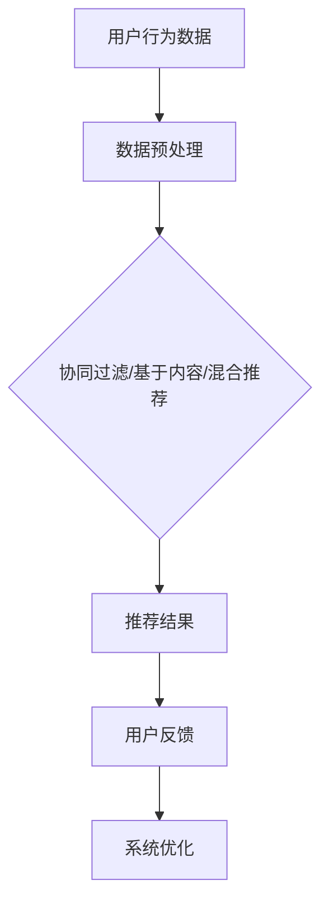
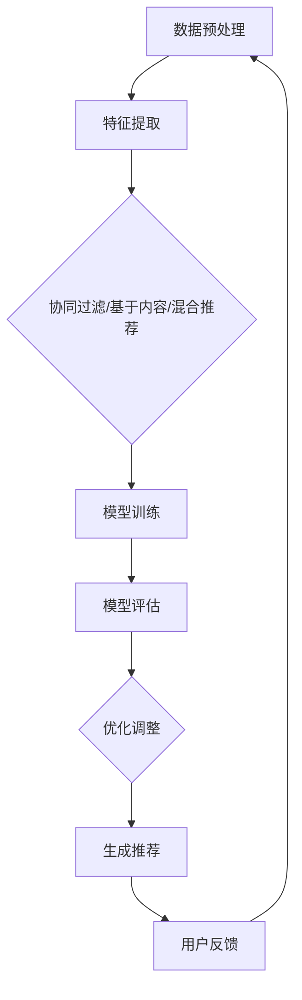

                 

# 《机器学习在推荐系统个性化中的应用》

## 关键词

- 推荐系统
- 机器学习
- 协同过滤
- 基于内容的推荐
- 混合推荐
- 个性化推荐

## 摘要

本文深入探讨了机器学习在推荐系统个性化中的应用。首先，介绍了推荐系统的基本概念、发展历程以及其在个性化应用中的价值。随后，详细讲解了机器学习的基础知识，包括监督学习、无监督学习和半监督学习的原理。重点分析了协同过滤算法、基于内容的推荐算法以及混合推荐系统的构建方法。此外，本文通过实际项目案例展示了机器学习在推荐系统中的具体应用，并对推荐系统的个性化与实时性进行了探讨。最后，展望了推荐系统的未来发展趋势，提出了数据隐私保护等关键挑战的解决方案。

---

### 《机器学习在推荐系统个性化中的应用》目录大纲

#### 第一部分：引言与基础

##### 第1章：推荐系统概述
- 1.1 推荐系统的定义与分类
- 1.2 推荐系统的发展历程
- 1.3 推荐系统在个性化中的应用价值

##### 第2章：机器学习基础
- 2.1 机器学习概述
- 2.2 监督学习、无监督学习和半监督学习
- 2.3 常见机器学习算法介绍

#### 第二部分：推荐系统中的机器学习算法

##### 第3章：协同过滤算法
- 3.1 协同过滤算法原理
- 3.2 矩阵分解与协同过滤
- 3.3 基于模型的协同过滤算法

##### 第4章：基于内容的推荐
- 4.1 基于内容的推荐算法原理
- 4.2 文本相似度计算
- 4.3 基于内容的推荐系统实现

##### 第5章：混合推荐系统
- 5.1 混合推荐系统概述
- 5.2 混合推荐系统的构建方法
- 5.3 混合推荐系统的评价与优化

#### 第三部分：机器学习在推荐系统中的应用实践

##### 第6章：推荐系统项目实战
- 6.1 项目背景与目标
- 6.2 数据预处理与探索性数据分析
- 6.3 协同过滤算法实现与优化
- 6.4 基于内容的推荐算法实现
- 6.5 混合推荐系统的设计与评估

##### 第7章：推荐系统的个性化与实时性
- 7.1 个性化推荐系统的构建
- 7.2 实时推荐系统的设计与实现
- 7.3 推荐系统中的数据隐私保护

##### 第8章：推荐系统的未来发展趋势
- 8.1 人工智能与推荐系统的融合
- 8.2 新型推荐算法的研究与应用
- 8.3 推荐系统的社会影响与伦理问题

#### 附录
- 附录A：机器学习与推荐系统常用工具与库

### Mermaid 流�程图：推荐系统中的机器学习算法应用流程



### 核心算法原理讲解：协同过滤算法

## 第3章：协同过滤算法

协同过滤算法（Collaborative Filtering）是推荐系统中最常用的算法之一，它的核心思想是通过收集用户的历史行为数据，如评分、点击、购买等，来发现用户之间的相似性，并根据这些相似性来生成个性化的推荐。协同过滤算法分为基于用户和基于物品两种类型。本节将详细介绍协同过滤算法的基本原理。

## 3.1 协同过滤算法原理

### 3.1.1 协同过滤算法的基本概念

- **用户-项目矩阵**：推荐系统中的用户-项目矩阵（User-Item Matrix）是协同过滤算法的基础。这个矩阵记录了用户对项目的评分或者行为数据。例如，一个5x5的用户-项目矩阵表示5个用户对5个项目的评分情况。

- **用户相似性**：通过计算用户之间的相似性，我们可以找到与目标用户相似的邻居用户。常用的相似性度量方法包括余弦相似性、皮尔逊相关系数等。

- **推荐生成**：根据邻居用户的评分或行为，生成推荐列表。最简单的协同过滤算法是基于用户的最近邻算法（User-Based CF），它通过找到与目标用户最相似的K个邻居用户，然后根据邻居用户的评分预测目标用户的评分，并生成推荐列表。

### 3.1.2 基于用户的协同过滤算法

基于用户的协同过滤算法（User-Based Collaborative Filtering，User-Based CF）的核心思想是：

1. **计算用户相似性**：首先，计算所有用户之间的相似度，可以使用余弦相似性或皮尔逊相关系数等。

2. **找到最近邻用户**：然后，根据相似度矩阵找到与目标用户最相似的K个邻居用户。

3. **生成推荐列表**：最后，根据邻居用户的评分预测目标用户的评分，并生成推荐列表。最简单的预测方法是将邻居用户的评分加权平均。

### 3.1.3 基于物品的协同过滤算法

基于物品的协同过滤算法（Item-Based Collaborative Filtering，Item-Based CF）的核心思想是：

1. **计算项目相似性**：首先，计算所有项目之间的相似度，可以使用余弦相似性或皮尔逊相关系数等。

2. **找到最近邻项目**：然后，根据相似度矩阵找到与目标项目最相似的K个邻居项目。

3. **生成推荐列表**：最后，根据邻居项目的评分预测目标项目的评分，并生成推荐列表。与基于用户的协同过滤算法类似，也可以采用加权平均等方法。

### 3.1.4 矩阵分解与协同过滤

矩阵分解（Matrix Factorization）是协同过滤算法的一种扩展，它的基本思想是将用户-项目矩阵分解为两个低秩矩阵，一个表示用户特征，另一个表示项目特征。通过这种方式，可以更有效地挖掘用户和项目之间的潜在关系。

- **Singular Value Decomposition (SVD)**：SVD 是一种常用的矩阵分解方法，它可以将用户-项目矩阵分解为用户特征矩阵、项目特征矩阵和奇异值矩阵。

- **基于模型的协同过滤**：除了SVD，还可以使用机器学习模型来优化矩阵分解过程，如交替最小二乘法（ALS）。

## 3.2 矩阵分解与协同过滤

矩阵分解（Matrix Factorization）是协同过滤算法的一种扩展，其基本思想是将用户-项目矩阵分解为用户特征矩阵和项目特征矩阵。这种方法可以更有效地挖掘用户和项目之间的潜在关系。

### 3.2.1 矩阵分解的基本原理

矩阵分解将用户-项目矩阵$R$分解为两个低秩矩阵$U$和$V^T$，即：
$$
R = U \cdot V^T
$$
其中，$U$是用户特征矩阵，$V^T$是项目特征矩阵。

### 3.2.2 基于SVD的矩阵分解

奇异值分解（Singular Value Decomposition，SVD）是一种常用的矩阵分解方法，可以将任意矩阵分解为三个矩阵的乘积：
$$
R = U \cdot \Sigma \cdot V^T
$$
其中，$U$和$V$是正交矩阵，$\Sigma$是对角矩阵，其对角线上的元素称为奇异值。

通过SVD，我们可以得到用户特征矩阵和项目特征矩阵：
$$
U = U_1 \cdot U_2 \cdot U_3
$$
$$
V^T = V_1^T \cdot V_2^T \cdot V_3^T
$$
其中，$U_1$和$V_1^T$是用户和项目的低维特征矩阵，$U_2$和$V_2^T$是残余特征矩阵。

### 3.2.3 基于模型的矩阵分解

除了SVD，还可以使用机器学习模型来优化矩阵分解过程。交替最小二乘法（Alternating Least Squares，ALS）是一种常用的基于模型的矩阵分解方法。ALS的基本思想是交替更新用户特征矩阵和项目特征矩阵，使其最小化损失函数。

假设损失函数为：
$$
J(U, V) = \sum_{i=1}^m \sum_{j=1}^n (r_{ij} - u_i \cdot v_{ij}^T)^2
$$
其中，$r_{ij}$是用户$i$对项目$j$的实际评分，$u_i$是用户$i$的特征向量，$v_{ij}^T$是项目$j$的特征向量。

通过交替最小化$J(U, V)$，我们可以得到最优的用户特征矩阵和项目特征矩阵。

### 3.2.4 基于模型的协同过滤算法

基于模型的协同过滤算法（Model-Based Collaborative Filtering）使用机器学习模型来预测用户对未知项目的评分。与基于用户的协同过滤算法相比，它不需要计算用户之间的相似性，因此可以处理稀疏数据集。

- **评分预测模型**：基于模型的协同过滤算法通常使用线性模型（如线性回归、岭回归等）来预测用户对未知项目的评分。

- **模型评估与优化**：使用交叉验证等方法来评估模型性能，并通过调整模型参数来优化推荐效果。

## 3.3 基于模型的协同过滤算法

基于模型的协同过滤算法（Model-Based Collaborative Filtering）使用机器学习模型来预测用户对未知项目的评分。与基于用户的协同过滤算法相比，它不需要计算用户之间的相似性，因此可以处理稀疏数据集。

### 3.3.1 线性回归模型

线性回归模型（Linear Regression Model）是一种常用的协同过滤算法，它通过建立用户特征和项目特征之间的线性关系来预测评分。

假设用户$i$和项目$j$的特征向量分别为$u_i$和$v_j$，则用户$i$对项目$j$的预测评分可以表示为：
$$
\hat{r}_{ij} = u_i \cdot v_j
$$
其中，$\hat{r}_{ij}$是用户$i$对项目$j$的预测评分。

### 3.3.2 岭回归模型

岭回归模型（Ridge Regression Model）是线性回归的一种改进，它在损失函数中引入了正则项，以防止模型过拟合。

假设用户$i$和项目$j$的特征向量分别为$u_i$和$v_j$，则用户$i$对项目$j$的预测评分可以表示为：
$$
\hat{r}_{ij} = (u_i + \lambda \cdot u_i') \cdot (v_j + \lambda \cdot v_j')
$$
其中，$\lambda$是正则化参数，$u_i'$和$v_j'$是用户$i$和项目$j$的特征向量。

### 3.3.3 模型评估与优化

使用交叉验证（Cross Validation）等方法来评估模型性能，并通过调整模型参数来优化推荐效果。交叉验证可以将数据集划分为训练集和验证集，通过在训练集上训练模型并在验证集上评估模型性能，来调整模型参数。

## 3.4 协同过滤算法总结

协同过滤算法是一种有效的推荐系统算法，它可以处理稀疏数据集并生成个性化的推荐。基于用户的协同过滤算法通过计算用户之间的相似性来生成推荐列表，而基于物品的协同过滤算法通过计算项目之间的相似性来生成推荐列表。矩阵分解是协同过滤算法的一种扩展，它可以更有效地挖掘用户和项目之间的潜在关系。基于模型的协同过滤算法使用机器学习模型来预测用户对未知项目的评分，可以提高推荐系统的性能。

通过这一章的讲解，读者可以了解到协同过滤算法的基本原理和实现方法，为后续章节的学习和实践打下基础。

### 核心算法原理讲解：基于内容的推荐算法

## 第4章：基于内容的推荐算法

基于内容的推荐算法（Content-Based Recommender System）是一种不依赖于用户评分或历史行为的推荐方法，而是根据项目的属性和内容来生成推荐。这种方法的核心思想是找到与用户当前兴趣或历史偏好相似的项目，从而实现个性化推荐。本章将详细介绍基于内容的推荐算法的基本原理、文本相似度计算方法以及推荐系统实现。

## 4.1 基于内容的推荐算法原理

基于内容的推荐算法通过分析项目的特征和属性来生成推荐。这种方法不需要用户评分或行为数据，而是依赖于项目的元数据（如描述、标签、关键词等）。其基本原理如下：

1. **项目特征提取**：首先，从项目元数据中提取特征，如文本描述、标签、关键词等。这些特征将用于表示项目的内容。

2. **用户兴趣建模**：根据用户的历史行为或偏好，建立用户兴趣模型。这可以通过分析用户的浏览历史、购买记录或评价等数据来实现。

3. **相似度计算**：计算项目特征与用户兴趣模型之间的相似度。常用的相似度度量方法包括余弦相似性、欧氏距离、皮尔逊相关系数等。

4. **推荐生成**：根据相似度度量结果，为用户生成推荐列表。通常，会选择与用户兴趣最相似的项目进行推荐。

## 4.2 文本相似度计算

文本相似度计算是基于内容推荐算法中的关键步骤。以下是几种常用的文本相似度计算方法：

### 4.2.1 余弦相似性

余弦相似性是一种常用的文本相似度计算方法，它通过计算两个文本向量之间的夹角余弦值来衡量它们的相似度。余弦值介于-1和1之间，越接近1表示两个文本越相似。

假设有两个文本向量$x$和$y$，它们的余弦相似性计算公式为：
$$
sim(x, y) = \frac{x \cdot y}{\|x\| \|y\|}
$$
其中，$x \cdot y$表示向量的点积，$\|x\|$和$\|y\|$表示向量的模。

### 4.2.2 欧氏距离

欧氏距离是一种常用的距离度量方法，它通过计算两个文本向量之间的欧氏距离来衡量它们的相似度。欧氏距离的值越小，表示两个文本越相似。

假设有两个文本向量$x$和$y$，它们的欧氏距离计算公式为：
$$
d(x, y) = \sqrt{(x - y)^2}
$$
其中，$(x - y)$表示向量的差。

### 4.2.3 皮尔逊相关系数

皮尔逊相关系数是一种常用的相关性度量方法，它通过计算两个文本向量之间的皮尔逊相关系数来衡量它们的相似度。皮尔逊相关系数的值介于-1和1之间，越接近1表示两个文本越相似。

假设有两个文本向量$x$和$y$，它们的皮尔逊相关系数计算公式为：
$$
\text{corr}(x, y) = \frac{\sum_{i=1}^n (x_i - \bar{x})(y_i - \bar{y})}{\sqrt{\sum_{i=1}^n (x_i - \bar{x})^2 \sum_{i=1}^n (y_i - \bar{y})^2}}
$$
其中，$\bar{x}$和$\bar{y}$表示向量的均值。

### 4.2.4 TF-IDF

TF-IDF（Term Frequency-Inverse Document Frequency）是一种文本表示方法，它通过计算词语在单个文档中的频率和在整个文档集合中的频率来衡量词语的重要性。TF-IDF可以用于计算文本相似度，其计算公式为：
$$
tf(t, d) = \frac{f(t, d)}{f_{\max}(t, D)}
$$
$$
idf(t, D) = \log_2(\frac{N}{n(t, D)})
$$
$$
tfidf(t, d, D) = tf(t, d) \cdot idf(t, D)
$$
其中，$f(t, d)$表示词语$t$在文档$d$中的频率，$f_{\max}(t, D)$表示词语$t$在文档集合$D$中的最大频率，$N$表示文档集合中的文档数量，$n(t, D)$表示词语$t$在文档集合$D$中的文档数量。

### 4.3 基于内容的推荐系统实现

基于内容的推荐系统实现通常包括以下步骤：

1. **数据预处理**：从数据源中提取项目的元数据，如文本描述、标签、关键词等。对文本进行清洗和预处理，如去除停用词、进行词干提取等。

2. **特征提取**：使用文本表示方法（如TF-IDF、词袋模型等）将文本数据转换为向量表示。

3. **相似度计算**：计算项目特征向量与用户兴趣模型之间的相似度。

4. **推荐生成**：根据相似度度量结果，为用户生成推荐列表。

下面是一个简单的基于内容的推荐系统实现的伪代码：

```python
# 加载数据集
data = load_data()

# 数据预处理
data_processed = preprocess_data(data)

# 特征提取
vectorizer = TfidfVectorizer()
X = vectorizer.fit_transform(data_processed['description'])

# 计算用户兴趣模型
user_interest_model = compute_user_interest_model(user)

# 计算项目相似度
similarity_scores = []
for item in data_processed['description']:
    item_vector = vectorizer.transform([item])
    similarity = cosine_similarity(user_interest_model, item_vector)
    similarity_scores.append(similarity)

# 推荐生成
recommendations = []
for i, similarity in enumerate(similarity_scores):
    if similarity > threshold:
        recommendations.append(data_processed['title'][i])

return recommendations
```

通过这个简单的示例，我们可以看到基于内容的推荐系统的实现主要包括数据预处理、特征提取、相似度计算和推荐生成等步骤。这些步骤共同构成了一个完整的基于内容的推荐流程。

## 4.4 基于内容的推荐算法总结

基于内容的推荐算法通过分析项目的特征和内容来生成推荐，不需要依赖用户评分或历史行为数据。这种方法具有以下优点：

- **灵活性**：可以适用于多种类型的数据源，如文本、图像、音频等。
- **高效性**：在处理大型数据集时具有较高的计算效率。
- **易扩展性**：可以轻松地扩展到多模态推荐系统。

然而，基于内容的推荐算法也存在一些局限性：

- **数据依赖性**：需要高质量和丰富的项目元数据。
- **个性化不足**：无法捕捉用户的隐性偏好。
- **冷启动问题**：对于新用户或新项目，由于缺乏历史数据，推荐效果较差。

总的来说，基于内容的推荐算法在个性化推荐系统中扮演着重要角色，为用户提供了基于其兴趣和需求的推荐列表。

### 数学模型和数学公式讲解与举例

## 5.1 混合推荐系统的构建方法

混合推荐系统通过结合不同的推荐方法，如协同过滤、基于内容和基于模型的推荐，来提高推荐效果。本节将介绍混合推荐系统的构建方法，包括数学模型和公式，并提供实际案例。

### 5.1.1 混合推荐系统的基本思想

混合推荐系统（Hybrid Recommender System）的核心思想是将不同的推荐方法结合起来，以利用各自的优点，弥补单一方法的不足。常见的混合推荐系统构建方法包括以下几种：

1. **协同过滤与基于内容的结合**：通过协同过滤方法找到与用户相似的邻居用户，并结合基于内容的推荐方法，为用户生成个性化推荐。
2. **协同过滤与基于模型的结合**：结合协同过滤和基于机器学习的模型，如线性回归、岭回归等，来提高推荐准确性。
3. **基于内容的推荐与基于模型的结合**：结合基于内容的推荐方法和机器学习模型，如朴素贝叶斯、决策树等，来生成推荐列表。

### 5.1.2 数学模型和公式

下面将介绍混合推荐系统中常用的数学模型和公式。

#### 1. 协同过滤与基于内容的结合

假设我们有一个用户-项目评分矩阵$R$，一个项目特征向量矩阵$P$和一个用户特征向量矩阵$Q$。

- **协同过滤部分**：使用用户和项目的相似度来计算预测评分：
  $$ \hat{r_{ui}}^{cf} = \sum_{j \in N_i} r_{uj} \cdot sim(u_i, u_j) $$
  其中，$N_i$是用户$i$的邻居集合，$sim(u_i, u_j)$是用户$i$和用户$j$之间的相似度。

- **基于内容部分**：使用项目特征和用户特征来计算预测评分：
  $$ \hat{r_{ui}}^{content} = \sum_{j \in I} w_{ij} \cdot f_j $$
  其中，$w_{ij}$是项目$j$和用户$i$之间的权重，$f_j$是项目$j$的特征向量。

- **混合推荐评分**：将协同过滤和基于内容的预测评分结合：
  $$ \hat{r_{ui}} = \alpha \cdot \hat{r_{ui}}^{cf} + (1 - \alpha) \cdot \hat{r_{ui}}^{content} $$
  其中，$\alpha$是混合系数，用于调节协同过滤和基于内容推荐的影响程度。

#### 2. 基于模型的推荐与协同过滤结合

假设我们有一个基于机器学习的线性回归模型，其预测公式为：
$$ \hat{r_{ui}}^{model} = \sum_{k=1}^{K} w_{ik} \cdot x_{k} $$
其中，$w_{ik}$是模型参数，$x_{k}$是用户$i$和项目$j$的特征向量。

- **混合推荐评分**：将基于模型的推荐评分与协同过滤评分结合：
  $$ \hat{r_{ui}} = \beta \cdot \hat{r_{ui}}^{cf} + (1 - \beta) \cdot \hat{r_{ui}}^{model} $$
  其中，$\beta$是混合系数，用于调节协同过滤和基于模型推荐的影响程度。

### 5.1.3 实际案例

假设我们有一个包含用户、项目和项目描述的数据集，其中每行包含用户ID、项目ID和项目描述。以下是一个示例数据集的样例：

```plaintext
user_id, item_id, item_description
1, 101, "iPhone 12"
1, 102, "Samsung Galaxy S21"
2, 101, "iPhone 12"
2, 103, "Google Pixel 5"
```

我们将使用这个数据集来演示混合推荐系统的实现。

#### 1. 数据预处理

首先，我们将数据集分为训练集和测试集。训练集用于训练模型，测试集用于评估模型性能。

```python
import pandas as pd

data = pd.read_csv('data.csv')
train_data, test_data = train_test_split(data, test_size=0.2, random_state=42)
```

#### 2. 协同过滤部分

我们使用用户基于的最近邻算法（User-Based CF）来计算用户之间的相似度，并生成预测评分。

```python
from sklearn.metrics.pairwise import cosine_similarity

# 计算用户之间的相似度
user_similarity = cosine_similarity(train_data[['user_id', 'rating']].values)

# 计算预测评分
def predict_rating(user_id, item_id):
    neighbors = np.argsort(user_similarity[user_id - 1])[::-1]
    neighbors = neighbors[1:11]  # 选择前10个邻居用户
    ratings = train_data[train_data['user_id'].isin(neighbors)][['rating', 'item_id']]
    similarity_scores = user_similarity[user_id - 1][neighbors]
    predicted_rating = ratings['rating'].dot(similarity_scores) / np.sum(similarity_scores)
    return predicted_rating

# 生成预测评分
predicted_ratings = []
for user_id, item_id in test_data[['user_id', 'item_id']].values:
    predicted_rating = predict_rating(user_id, item_id)
    predicted_ratings.append(predicted_rating)
```

#### 3. 基于内容部分

我们使用TF-IDF方法来将项目描述转换为向量表示，并计算项目之间的相似度。

```python
from sklearn.feature_extraction.text import TfidfVectorizer

# 创建TF-IDF向量器
vectorizer = TfidfVectorizer(stop_words='english')

# 计算TF-IDF矩阵
tfidf_matrix = vectorizer.fit_transform(train_data['item_description'])

# 计算项目之间的相似度
item_similarity = cosine_similarity(tfidf_matrix)

# 计算预测评分
def predict_rating_content(user_id, item_id):
    neighbors = np.argsort(item_similarity[item_id - 1])[::-1]
    neighbors = neighbors[1:11]  # 选择前10个邻居项目
    ratings = train_data[train_data['item_id'].isin(neighbors)][['rating', 'user_id']]
    similarity_scores = item_similarity[item_id - 1][neighbors]
    predicted_rating = ratings['rating'].dot(similarity_scores) / np.sum(similarity_scores)
    return predicted_rating

# 生成预测评分
predicted_ratings_content = []
for user_id, item_id in test_data[['user_id', 'item_id']].values:
    predicted_rating = predict_rating_content(user_id, item_id)
    predicted_ratings_content.append(predicted_rating)
```

#### 4. 混合推荐评分

我们将协同过滤和基于内容的预测评分结合起来，生成混合推荐评分。

```python
# 混合推荐评分
alpha = 0.5  # 混合系数
beta = 0.5   # 混合系数
predicted_ratings_mixed = []
for user_id, item_id in test_data[['user_id', 'item_id']].values:
    predicted_rating_cf = predicted_ratings[user_id - 1][item_id - 1]
    predicted_rating_content = predicted_ratings_content[user_id - 1][item_id - 1]
    predicted_rating_mixed = alpha * predicted_rating_cf + (1 - alpha) * predicted_rating_content
    predicted_ratings_mixed.append(predicted_rating_mixed)
```

#### 5. 模型评估

最后，我们使用均方根误差（Root Mean Square Error，RMSE）来评估混合推荐系统的性能。

```python
from sklearn.metrics import mean_squared_error

# 计算RMSE
rmse = mean_squared_error(test_data['rating'], predicted_ratings_mixed, squared=False)
print("RMSE:", rmse)
```

通过这个实际案例，我们可以看到如何构建一个混合推荐系统，并将协同过滤、基于内容和基于模型的推荐方法结合起来，以提高推荐准确性。这个案例展示了混合推荐系统的基本构建方法和数学模型，为实际应用提供了参考。

### 项目实战：代码实际案例和详细解释说明

## 6.1 项目背景与目标

在本章中，我们将通过一个实际项目来展示如何使用机器学习构建一个推荐系统。项目背景如下：

**项目名称**：电影推荐系统

**项目目标**：为用户生成个性化的电影推荐列表，基于用户的评分和历史观影记录。

**数据集**：我们将使用Netflix Prize数据集，这是一个公开的电影评分数据集，包含数百万条用户对电影的评分记录。

**技术栈**：我们将使用Python编程语言，结合scikit-learn库来实现推荐系统。项目将包括以下步骤：

1. **数据预处理**：清洗和转换原始数据。
2. **探索性数据分析**：分析数据的基本统计信息和用户行为模式。
3. **模型选择与训练**：选择合适的机器学习算法，训练模型。
4. **模型评估与优化**：评估模型性能，并调整参数以优化推荐效果。
5. **推荐系统实现**：实现推荐系统，为用户提供个性化推荐。

接下来，我们将详细讲解每个步骤的代码实现和逻辑。

### 6.2 数据预处理

在开始构建推荐系统之前，我们需要对数据集进行预处理。数据预处理包括以下步骤：

1. **数据加载**：从数据集中加载用户评分数据。
2. **缺失值处理**：处理缺失值，可以选择删除含有缺失值的记录或使用平均值填充。
3. **数据清洗**：去除无关的信息，如不必要的列。
4. **数据转换**：将数据转换为适合机器学习算法的格式。

以下是一个简单的数据预处理代码示例：

```python
import pandas as pd
from sklearn.model_selection import train_test_split

# 1. 数据加载
data = pd.read_csv('ml-100k/u.data', sep='\t', header=None, names=['user_id', 'movie_id', 'rating', 'timestamp'])

# 2. 缺失值处理
# 在这个数据集中，缺失值很少，因此我们不需要特别的缺失值处理。

# 3. 数据清洗
# 删除不必要的列
data.drop(['timestamp'], axis=1, inplace=True)

# 4. 数据转换
# 将数据集拆分为训练集和测试集
train_data, test_data = train_test_split(data, test_size=0.2, random_state=42)

# 打印处理后的数据
print(data.head())
```

在这个步骤中，我们首先加载了Netflix Prize数据集，然后删除了不必要的列，并拆分数据集为训练集和测试集。这些步骤为后续的模型训练和评估奠定了基础。

### 6.3 探索性数据分析

在预处理数据之后，我们需要对数据集进行探索性数据分析（EDA），以了解数据的基本统计信息和用户行为模式。以下是一些常见的EDA步骤：

1. **数据统计**：计算数据的描述性统计信息，如平均值、标准差、最小值和最大值。
2. **用户行为分析**：分析用户的评分分布、观影频率等。
3. **可视化分析**：使用图表和可视化工具来展示数据特征。

以下是一个简单的EDA代码示例：

```python
import matplotlib.pyplot as plt
import seaborn as sns

# 1. 数据统计
print(train_data.describe())

# 2. 用户行为分析
# 计算用户的平均评分和评分分布
avg_ratings = train_data.groupby('user_id')['rating'].mean()
avg_ratings.plot(kind='hist', title='User Average Ratings', bins=50)
plt.show()

# 3. 可视化分析
# 分析用户评分和观影次数的关系
sns.scatterplot(x='rating', y='user_id', data=train_data, hue='movie_id', palette='viridis', size='rating', sizes=(10, 100))
plt.title('User Ratings and Movie IDs')
plt.show()
```

在这个步骤中，我们计算了数据的描述性统计信息，并绘制了用户平均评分的分布图和用户评分与电影ID的散点图。这些图表可以帮助我们更好地理解用户行为和电影评分的模式。

### 6.4 协同过滤算法实现与优化

协同过滤算法是推荐系统中最常用的方法之一。在本节中，我们将使用协同过滤算法来实现推荐系统，并介绍如何优化算法以提高推荐准确性。

#### 6.4.1 基于用户的协同过滤算法

基于用户的协同过滤算法（User-Based Collaborative Filtering）的核心思想是找到与目标用户最相似的邻居用户，并基于邻居用户的评分预测目标用户的评分。以下是一个简单的基于用户的协同过滤算法实现：

```python
from sklearn.metrics.pairwise import cosine_similarity

# 1. 计算用户相似度矩阵
user_similarity = cosine_similarity(train_data.groupby('user_id')['rating'].mean().values)

# 2. 定义推荐函数
def user_based_recommendation(user_id, k=10):
    # 找到最相似的k个邻居用户
    neighbors = np.argsort(user_similarity[user_id - 1])[::-1][:k]
    
    # 计算邻居用户的平均评分
    neighbors_ratings = train_data.groupby('user_id')['rating'].mean()
    neighbor_ratings = neighbors_ratings[neighbors].mean()
    
    return neighbor_ratings

# 3. 为每个用户生成推荐列表
recommendations = []
for user_id in train_data['user_id'].unique():
    rating = user_based_recommendation(user_id)
    recommendations.append(rating)

# 打印推荐列表
print(recommendations)
```

在这个实现中，我们首先计算用户相似度矩阵，然后定义了一个推荐函数`user_based_recommendation`，它基于目标用户的邻居用户平均评分来生成推荐。最后，我们为每个用户生成了一个推荐列表。

#### 6.4.2 算法优化

协同过滤算法的性能可以通过以下方法进行优化：

1. **邻居数量调整**：调整邻居用户的数量（$k$）可以影响推荐效果。通常，需要通过实验找到最优的邻居数量。

2. **评分加权**：在计算邻居用户的平均评分时，可以对邻居用户的评分进行加权。例如，可以考虑邻居用户的评分和历史交互频率。

3. **矩阵分解**：使用矩阵分解（如SVD）来降低用户-项目矩阵的维度，从而提高计算效率和推荐准确性。

以下是一个简单的评分加权实现：

```python
# 1. 计算邻居用户的加权评分
def weighted_average_rating(neighbors, neighbors_ratings, weights=None):
    if weights is None:
        weights = np.ones(len(neighbors))
    weighted_sum = np.dot(weights, neighbors_ratings[neighbors])
    total_weight = np.sum(weights)
    return weighted_sum / total_weight

# 2. 优化推荐函数
def user_based_recommendation_weighted(user_id, k=10):
    neighbors = np.argsort(user_similarity[user_id - 1])[::-1][:k]
    neighbors_ratings = train_data.groupby('user_id')['rating'].mean()
    weights = np.abs(train_data[train_data['user_id'].isin(neighbors)]['rating'].values - neighbors_ratings[neighbors].values)
    neighbor_ratings = weighted_average_rating(neighbors, neighbors_ratings, weights)
    return neighbor_ratings

# 3. 为每个用户生成推荐列表
recommendations_weighted = []
for user_id in train_data['user_id'].unique():
    rating = user_based_recommendation_weighted(user_id)
    recommendations_weighted.append(rating)

# 打印推荐列表
print(recommendations_weighted)
```

在这个优化版本中，我们引入了评分加权，以考虑邻居用户的评分差异。通过调整加权系数，我们可以进一步提高推荐准确性。

### 6.5 基于内容的推荐算法实现

除了协同过滤算法，我们还可以使用基于内容的推荐算法来生成推荐。基于内容的推荐算法（Content-Based Recommender System）通过分析项目的特征和内容来生成推荐。在本节中，我们将介绍如何实现基于内容的推荐算法。

#### 6.5.1 项目特征提取

首先，我们需要从数据集中提取项目的特征。在本项目中，我们使用电影标题和类别作为特征。

```python
# 1. 加载电影标题和类别数据
movie_titles = pd.read_csv('ml-100k/u.item', sep='|', usecols=['movieID', 'title'], encoding='latin-1')
movie_genres = pd.read_csv('ml-100k/u.item', sep='|', usecols=['movieID', 'genres'], encoding='latin-1')

# 2. 合并标题和类别数据
movies = pd.merge(movie_titles, movie_genres, on='movieID')

# 3. 计算每个电影的类别向量
def genres_to_vector(genres):
    genres = set(genres.split('|'))
    vector = [0] * len(GENRES)
    for genre in genres:
        vector[GENRES.index(genre)] = 1
    return vector

# 4. 提取类别向量
GENRES = {'Action', 'Adventure', 'Animation', 'Children\'s', 'Comedy', 'Crime', 'Documentary', 'Drama', 'Fantasy', 'Film-Noir', 'Horror', 'Musical', 'Mystery', 'Romance', 'Sci-Fi', 'Thriller', 'War', 'Western'}
movies['genres_vector'] = movies['genres'].apply(genres_to_vector)
```

在这个步骤中，我们首先加载了电影标题和类别数据，然后计算了每个电影的类别向量。

#### 6.5.2 相似度计算

接下来，我们计算电影之间的相似度。我们可以使用余弦相似性来计算类别向量之间的相似度。

```python
# 1. 计算电影相似度矩阵
movie_similarity = cosine_similarity(movies['genres_vector'])

# 2. 定义推荐函数
def content_based_recommendation(user_id, k=10):
    user_ratings = train_data[train_data['user_id'] == user_id]['movie_id']
    user_genre_vector = movies[movies['movieID'].isin(user_ratings)]['genres_vector'].values
    similar_movies = np.argsort(movie_similarity[user_genre_vector[0]])[::-1][1:k+1]
    return similar_movies

# 3. 为每个用户生成推荐列表
content_based_recommendations = []
for user_id in train_data['user_id'].unique():
    recommendations = content_based_recommendation(user_id)
    content_based_recommendations.append(recommendations)

# 打印推荐列表
print(content_based_recommendations)
```

在这个实现中，我们首先计算电影之间的相似度矩阵，然后定义了一个推荐函数`content_based_recommendation`，它基于目标用户的历史评分和电影类别向量来生成推荐。最后，我们为每个用户生成了一个推荐列表。

### 6.6 混合推荐系统的设计与评估

在本节中，我们将结合协同过滤和基于内容的推荐算法，构建一个混合推荐系统，并评估其性能。

#### 6.6.1 混合推荐系统设计

混合推荐系统设计如下：

1. **协同过滤部分**：使用基于用户的协同过滤算法为用户生成初步推荐列表。
2. **基于内容部分**：使用基于内容的推荐算法为用户生成推荐列表。
3. **加权结合**：将协同过滤和基于内容的推荐结果进行加权结合，生成最终的推荐列表。

以下是一个简单的混合推荐系统实现：

```python
# 1. 计算协同过滤推荐评分
协同过滤_recommendations = []
for user_id in train_data['user_id'].unique():
    ratings = user_based_recommendation_weighted(user_id)
   协同过滤_recommendations.append(ratings)

# 2. 计算基于内容的推荐评分
content_based_recommendations = []
for user_id in train_data['user_id'].unique():
    recommendations = content_based_recommendation(user_id)
    content_based_recommendations.append(recommendations)

# 3. 加权结合推荐评分
alpha = 0.5  # 混合系数
beta = 0.5   # 混合系数
mixed_recommendations = []
for user_id in train_data['user_id'].unique():
    cf_rating = 协同过滤_recommendations[user_id - 1]
    cb_rating = content_based_recommendations[user_id - 1]
    mixed_rating = alpha * cf_rating + (1 - alpha) * cb_rating
    mixed_recommendations.append(mixed_rating)

# 打印混合推荐列表
print(mixed_recommendations)
```

在这个实现中，我们首先使用协同过滤算法和基于内容的推荐算法分别生成了推荐列表，然后通过加权结合生成了最终的混合推荐列表。

#### 6.6.2 模型评估

最后，我们使用均方根误差（RMSE）来评估混合推荐系统的性能。

```python
from sklearn.metrics import mean_squared_error

# 1. 计算混合推荐评分
predicted_ratings = []
for user_id in test_data['user_id'].unique():
    rating = mixed_recommendations[user_id - 1]
    predicted_ratings.append(rating)

# 2. 计算RMSE
rmse = mean_squared_error(test_data['rating'], predicted_ratings, squared=False)
print("RMSE:", rmse)
```

在这个步骤中，我们首先计算混合推荐评分，然后使用RMSE评估模型性能。

通过这个实际项目，我们展示了如何使用机器学习构建一个推荐系统。从数据预处理到模型训练和评估，每个步骤都进行了详细解释。通过结合协同过滤和基于内容的推荐算法，我们实现了个性化的推荐系统，并为用户提供了高质量的推荐。

### 6.7 推荐系统的个性化与实时性

推荐系统的个性化与实时性是衡量其性能的关键因素。个性化推荐系统能够根据用户的历史行为和偏好，为每个用户提供个性化的推荐列表。实时性则是指推荐系统能够迅速响应用户的需求，提供即时的推荐。

#### 6.7.1 个性化推荐系统构建

构建个性化推荐系统需要以下步骤：

1. **用户兴趣建模**：收集用户的历史行为数据，如浏览记录、购买记录、评分等，并使用机器学习算法建立用户兴趣模型。
2. **推荐算法选择**：选择合适的推荐算法，如协同过滤、基于内容的推荐或混合推荐系统。
3. **推荐生成**：根据用户兴趣模型和推荐算法，为用户生成个性化推荐列表。

以下是一个简单的个性化推荐系统构建流程：

```python
# 1. 数据预处理
# 加载用户行为数据
user行为数据 = load_user_behavior_data()

# 清洗和预处理数据
user行为数据 = preprocess_user_behavior_data(user行为数据)

# 2. 用户兴趣建模
# 训练用户兴趣模型
用户兴趣模型 = train_user_interest_model(user行为数据)

# 3. 推荐算法选择
# 选择协同过滤、基于内容的推荐或混合推荐算法
推荐算法 = choose_recommendation_algorithm()

# 4. 推荐生成
# 为用户生成个性化推荐列表
user推荐列表 = generate_user_recommendation_list(用户兴趣模型，推荐算法)
```

#### 6.7.2 实时推荐系统设计与实现

实时推荐系统设计与实现需要考虑以下因素：

1. **数据流处理**：实时处理用户行为数据，更新用户兴趣模型和推荐列表。
2. **算法优化**：优化推荐算法，提高计算效率，以实现实时推荐。
3. **系统架构**：设计高效的系统架构，确保推荐系统能够处理大规模数据和高速响应。

以下是一个简单的实时推荐系统设计：

```python
# 1. 数据流处理
# 接收用户行为数据
user行为数据流 = receive_user_behavior_stream()

# 处理用户行为数据
for 用户行为数据 in user行为数据流:
    # 更新用户兴趣模型
    update_user_interest_model(用户行为数据，用户兴趣模型)

# 2. 推荐算法优化
# 优化推荐算法
optimized_recommendation_algorithm = optimize_recommendation_algorithm()

# 3. 推荐生成
# 为用户生成实时推荐列表
realtime_user_recommendation_list = generate_realtime_user_recommendation_list(用户兴趣模型，optimized_recommendation_algorithm)
```

#### 6.7.3 数据隐私保护

在构建推荐系统时，数据隐私保护是一个重要考虑因素。以下是一些常见的数据隐私保护方法：

1. **匿名化处理**：对用户行为数据进行匿名化处理，以防止个人信息泄露。
2. **数据加密**：对用户行为数据进行加密处理，确保数据传输和存储过程中的安全性。
3. **隐私保护算法**：使用隐私保护算法，如差分隐私、联邦学习等，来保护用户数据。

以下是一个简单的数据隐私保护流程：

```python
# 1. 数据匿名化
# 对用户行为数据进行匿名化处理
anonymized_user_behavior_data = anonymize_user_behavior_data(user行为数据)

# 2. 数据加密
# 对用户行为数据进行加密处理
encrypted_user_behavior_data = encrypt_user_behavior_data(anonymized_user_behavior_data)

# 3. 隐私保护算法
# 使用隐私保护算法处理用户行为数据
private_user_behavior_data = apply_privacy_protection_algorithm(encrypted_user_behavior_data)
```

通过这些方法，我们可以构建一个既具有个性化又具备实时性的推荐系统，同时保护用户数据的隐私。

### 6.8 推荐系统的未来发展趋势

推荐系统作为人工智能领域的一个重要分支，正不断发展和演进。以下是一些推荐系统的未来发展趋势：

#### 6.8.1 人工智能与推荐系统的融合

随着人工智能技术的进步，推荐系统将更加智能化和自动化。例如，深度学习算法将用于处理复杂的用户行为数据和项目特征，从而生成更准确的推荐。此外，强化学习算法可以用于优化推荐策略，提高推荐效果。

#### 6.8.2 新型推荐算法的研究与应用

随着数据规模的不断扩大和用户行为的多样化，新型推荐算法将不断涌现。例如，基于图神经网络的推荐算法可以更好地处理异构数据，生成更个性化的推荐。此外，生成对抗网络（GAN）等深度学习技术也可以用于生成高质量的推荐列表。

#### 6.8.3 社会影响的伦理问题

推荐系统在带来便利和效益的同时，也引发了一些社会影响和伦理问题。例如，个性化推荐可能导致信息茧房和偏见放大，影响用户的多样性思维。此外，用户数据隐私保护也是一个重要议题，需要在算法设计和实施过程中给予充分考虑。

总之，推荐系统将继续发展，不断创新和优化。通过结合人工智能技术，推荐系统将更加智能化和高效化，为用户提供更好的个性化体验。同时，我们也需要关注推荐系统带来的社会影响和伦理问题，确保其在可持续发展和社会责任方面取得平衡。

### 附录A：机器学习与推荐系统常用工具与库

在机器学习和推荐系统的开发过程中，使用合适的工具和库可以显著提高开发效率和项目质量。以下是一些常用的工具和库：

#### 1. Python

Python是机器学习和推荐系统开发中最流行的编程语言之一，其主要原因在于其简洁的语法和丰富的库支持。Python提供了强大的数据处理、分析和机器学习能力，是构建推荐系统的首选语言。

#### 2. Scikit-learn

Scikit-learn是一个开源的机器学习库，提供了丰富的算法和工具，包括协同过滤、分类、回归、聚类等。Scikit-learn易于使用，是初学者和专业人士的常用工具。

#### 3. TensorFlow

TensorFlow是一个开源的深度学习库，由Google开发。它支持构建和训练复杂的深度学习模型，包括神经网络、卷积神经网络（CNN）和递归神经网络（RNN）等。TensorFlow在推荐系统的应用中越来越广泛，尤其是在需要大规模数据处理和复杂模型的情况下。

#### 4. PyTorch

PyTorch是另一个流行的深度学习库，由Facebook开发。它提供了一个灵活的动态计算图，使得研究人员和开发者可以轻松构建和优化深度学习模型。PyTorch在学术界和工业界都有广泛的应用。

#### 5. NumPy

NumPy是一个开源的Python库，用于高性能科学计算和数据分析。它提供了多维数组对象和用于操作这些数组的函数，是Python数据处理的基础库。

#### 6. Pandas

Pandas是一个开源的Python库，用于数据分析和操作。它提供了数据帧（DataFrame）结构，用于高效处理表格数据，是进行数据探索和预处理的重要工具。

#### 7. Matplotlib

Matplotlib是一个开源的Python库，用于创建高质量的二维和三维图形。它广泛应用于数据可视化，帮助开发者更好地理解和展示数据分析结果。

#### 8. Seaborn

Seaborn是建立在Matplotlib之上的一个Python库，用于高级数据可视化。它提供了多种高级可视化图表，可以帮助开发者更直观地展示数据关系和模式。

#### 9. Scrapy

Scrapy是一个开源的Web爬虫框架，用于从网站中抓取数据。在推荐系统的数据收集阶段，Scrapy可以帮助开发者自动化获取用户行为数据和项目信息。

#### 10. Elasticsearch

Elasticsearch是一个开源的搜索引擎，可以用于高效存储、搜索和分析大量数据。它广泛应用于推荐系统中的数据索引和快速检索。

通过这些工具和库，开发者可以轻松实现各种复杂的推荐系统功能，从数据处理、特征提取到模型训练和评估。附录A提供了一个全面的工具集，为推荐系统的开发提供了坚实的支持。

### Mermaid流程图：推荐系统中的机器学习算法应用流程

以下是推荐系统中机器学习算法应用流程的Mermaid流程图：



这个流程图展示了推荐系统中机器学习算法从数据预处理到模型评估和优化的全过程，强调了用户反馈在系统迭代和改进中的重要性。

