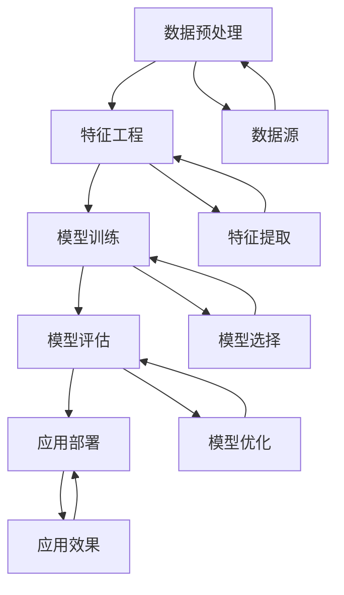
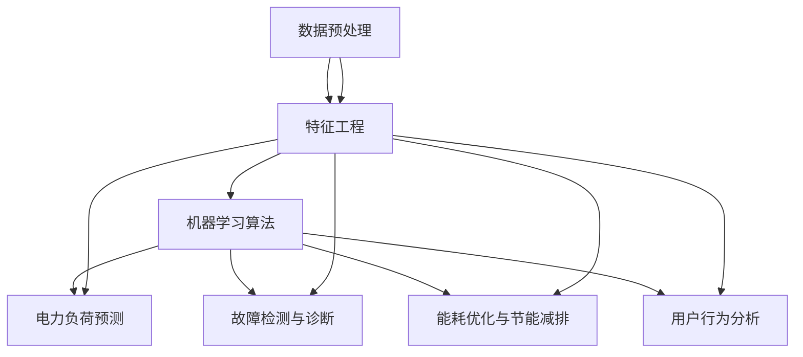

                 

# 《机器学习在智能电表数据分析中的应用》

## 摘要

智能电表作为一种重要的能源管理系统，能够实时监测和记录用户的用电情况，为电力企业和用户提供了丰富的数据资源。然而，如何有效地分析这些数据，从中提取有价值的信息，是实现智能电网和节能减排的关键。本文将探讨机器学习技术在智能电表数据分析中的应用，包括数据预处理、特征工程、常见机器学习算法以及实际应用案例，旨在为智能电网建设和能源管理提供技术支持。

## 关键词

机器学习、智能电表、数据分析、特征工程、应用案例

## 引言

随着全球能源消耗的不断增加，节能减排已成为各国政府和社会各界关注的焦点。智能电表作为智能电网的重要组成部分，能够实时监测和记录用户的用电情况，为电力企业和用户提供了大量的数据。这些数据不仅有助于优化电网运行，提高供电可靠性，还能为用户节省电费，实现能源的合理利用。

然而，智能电表数据具有复杂性和多样性，如何有效地分析这些数据，从中提取有价值的信息，是一个重要的研究课题。近年来，机器学习技术的发展为智能电表数据分析提供了新的思路和方法。机器学习算法能够自动从数据中学习规律，识别模式，为电力负荷预测、故障检测、能耗优化和用户行为分析等应用提供支持。

本文旨在系统地探讨机器学习在智能电表数据分析中的应用，包括数据预处理、特征工程、常见机器学习算法以及实际应用案例。通过本文的研究，我们希望能够为智能电网建设和能源管理提供技术支持，推动节能减排目标的实现。

## 目录大纲

### 第一部分：机器学习基础

- 1.1 机器学习的基本概念
  - 1.1.1 机器学习的定义
  - 1.1.2 机器学习的主要类型
  - 1.1.3 机器学习的基本流程

- 1.2 数据预处理
  - 1.2.1 数据清洗
  - 1.2.2 数据集成
  - 1.2.3 数据转换

- 1.3 特征工程
  - 1.3.1 特征提取
  - 1.3.2 特征选择
  - 1.3.3 特征重要性评估

- 1.4 常见机器学习算法
  - 1.4.1 监督学习算法
  - 1.4.2 无监督学习算法
  - 1.4.3 强化学习算法

### 第二部分：智能电表数据分析

- 2.1 智能电表简介
  - 2.1.1 智能电表的定义与功能
  - 2.1.2 智能电表的数据特性
  - 2.1.3 智能电表的应用场景

- 2.2 数据采集与存储
  - 2.2.1 数据采集方法
  - 2.2.2 数据存储方案

- 2.3 数据分析方法
  - 2.3.1 时间序列分析
  - 2.3.2 关联规则分析
  - 2.3.3 聚类分析

- 2.4 常见问题与挑战
  - 2.4.1 数据质量问题的处理
  - 2.4.2 数据隐私与安全

### 第三部分：机器学习在智能电表数据分析中的应用

- 3.1 电力负荷预测
  - 3.1.1 电力负荷预测的意义
  - 3.1.2 时间序列预测算法
  - 3.1.3 负荷预测模型构建与优化

- 3.2 故障检测与诊断
  - 3.2.1 故障检测的基本原理
  - 3.2.2 故障诊断算法
  - 3.2.3 故障检测与诊断模型构建

- 3.3 能耗优化与节能减排
  - 3.3.1 节能减排的目标与策略
  - 3.3.2 能耗优化算法
  - 3.3.3 能耗优化模型构建与应用

- 3.4 用户行为分析
  - 3.4.1 用户行为分析的意义
  - 3.4.2 用户行为特征提取
  - 3.4.3 用户行为分析模型构建

- 3.5 智能电表数据挖掘与可视化
  - 3.5.1 数据挖掘的基本方法
  - 3.5.2 数据可视化技术
  - 3.5.3 智能电表数据分析的可视化应用

### 第四部分：实战案例与项目分析

- 4.1 案例一：智能电表数据质量提升
  - 4.1.1 案例背景
  - 4.1.2 数据质量评估方法
  - 4.1.3 数据质量提升策略

- 4.2 案例二：基于机器学习的电力负荷预测
  - 4.2.1 案例背景
  - 4.2.2 负荷预测模型设计与实现
  - 4.2.3 模型评估与优化

- 4.3 案例三：智能电表故障检测与诊断
  - 4.3.1 案例背景
  - 4.3.2 故障检测与诊断模型构建
  - 4.3.3 模型性能评估

- 4.4 案例四：智能电表能耗优化与节能减排
  - 4.4.1 案例背景
  - 4.4.2 能耗优化算法应用
  - 4.4.3 节能减排效果评估

- 4.5 案例五：智能电表用户行为分析
  - 4.5.1 案例背景
  - 4.5.2 用户行为分析模型构建
  - 4.5.3 用户行为分析应用案例

### 第五部分：总结与展望

- 5.1 总结
  - 5.1.1 主要研究成果
  - 5.1.2 面临的挑战与未来方向

- 5.2 展望
  - 5.2.1 智能电表数据分析的发展趋势
  - 5.2.2 机器学习在智能电表数据分析中的应用前景

### 附录

- A.1 参考文献
  - A.1.1 国内外主要研究文献
  - A.1.2 相关数据集与工具

- A.2 附录代码与数据
  - A.2.1 代码实现与解读
  - A.2.2 数据集来源与预处理

- B.1 核心概念与联系
  - B.1.1 机器学习相关概念
  - B.1.2 智能电表数据分析相关概念

- B.2 核心算法原理讲解
  - B.2.1 时间序列预测算法
  - B.2.2 故障检测与诊断算法
  - B.2.3 能耗优化算法

## 第一部分：机器学习基础

### 1.1 机器学习的基本概念

#### 1.1.1 机器学习的定义

机器学习（Machine Learning）是人工智能（Artificial Intelligence，AI）的一个分支，它主要通过计算机程序模拟人类的学习过程，使计算机能够从数据中学习规律，并自动改进自身的性能。机器学习的基本思想是利用大量的历史数据，通过算法自动构建模型，然后使用这个模型对未知数据进行预测或分类。

根据美国统计学家Arthur Samuel的定义，机器学习是指“计算机程序在数据中获取知识和技能，无需显式地编写规则”。从这个定义可以看出，机器学习的核心是通过数据驱动的方式，使计算机具备自主学习和适应环境的能力。

#### 1.1.2 机器学习的主要类型

根据学习方式的不同，机器学习可以分为以下几种类型：

1. **监督学习（Supervised Learning）**：
   监督学习是一种最常见的机器学习类型，它通过输入特征和对应的标签来训练模型。在训练过程中，模型通过学习输入和输出之间的映射关系，从而学会对新数据进行预测或分类。常见的监督学习算法包括线性回归、逻辑回归、支持向量机（SVM）和决策树等。

2. **无监督学习（Unsupervised Learning）**：
   无监督学习不需要标签信息，它的目标是发现数据中的隐含结构和模式。无监督学习的应用包括聚类、降维和关联规则挖掘等。常见的无监督学习算法有K-均值聚类、主成分分析（PCA）和Apriori算法等。

3. **半监督学习（Semi-Supervised Learning）**：
   半监督学习结合了监督学习和无监督学习的特点，它利用少量的标签数据和大量的无标签数据来训练模型。这种学习方式可以减少标注数据的需求，提高学习效率。常见的半监督学习算法有自我训练（Self-Training）和图嵌入（Graph Embedding）等。

4. **强化学习（Reinforcement Learning）**：
   强化学习是一种通过与环境互动来学习策略的机器学习方法。在强化学习中，模型通过不断地尝试和反馈，学习如何在特定环境下做出最优决策。常见的强化学习算法包括Q学习、深度Q网络（DQN）和策略梯度算法等。

#### 1.1.3 机器学习的基本流程

机器学习的基本流程可以概括为以下步骤：

1. **数据收集**：
   收集相关领域的数据，这是机器学习的基础。数据的质量和数量直接影响到模型的性能。

2. **数据预处理**：
   数据预处理包括数据清洗、数据集成、数据转换和特征工程等。数据清洗旨在去除噪声和错误的数据，数据集成是将多个数据源合并成一个统一的数据集，数据转换是将数据转换为适合模型训练的格式，特征工程则是从原始数据中提取有用的特征。

3. **模型选择**：
   根据问题的性质和数据的特点，选择合适的机器学习算法和模型。监督学习通常选择分类器或回归器，无监督学习则选择聚类算法或降维算法。

4. **模型训练**：
   使用训练集对模型进行训练，通过调整模型参数，使其能够拟合训练数据。

5. **模型评估**：
   使用测试集对模型进行评估，常用的评估指标包括准确率、召回率、F1值、均方误差等。

6. **模型优化**：
   根据评估结果，对模型进行调整和优化，以提高模型的性能。

7. **模型部署**：
   将训练好的模型部署到生产环境中，用于对新的数据进行预测或分类。

### 1.2 数据预处理

#### 1.2.1 数据清洗

数据清洗是数据预处理的第一步，它的目标是去除数据中的噪声、错误和不一致的数据。数据清洗的过程通常包括以下步骤：

1. **去除重复数据**：重复数据会导致模型训练过程中的偏差，因此需要去除重复的数据记录。

2. **处理缺失值**：缺失值可以采用以下几种方法处理：
   - 删除缺失值：如果缺失值的数据量较小，可以直接删除。
   - 填充缺失值：可以使用平均值、中位数、最临近值等方法来填充缺失值。
   - 使用模型预测缺失值：对于复杂的缺失值问题，可以使用机器学习模型来预测缺失值。

3. **处理异常值**：异常值可能会对模型的训练产生不利影响，因此需要检测和处理异常值。异常值的处理方法包括删除、归一化和插值等。

4. **纠正数据一致性**：数据源之间可能存在数据格式、单位、精度等方面的一致性问题，需要对这些不一致性进行纠正。

#### 1.2.2 数据集成

数据集成是将来自多个数据源的数据合并成一个统一的数据集。数据集成的步骤包括以下内容：

1. **数据源识别**：识别数据来源，包括内部数据源和外部数据源。

2. **数据抽取**：从不同的数据源中抽取数据，并将其转换为统一的格式。

3. **数据转换**：将不同数据源的数据进行转换，使其具有相同的结构和格式。

4. **数据合并**：将转换后的数据合并成一个统一的数据集。

5. **数据清洗**：对合并后的数据进行清洗，去除重复数据、处理缺失值和异常值。

#### 1.2.3 数据转换

数据转换是将原始数据转换为适合模型训练的格式。数据转换的步骤包括以下内容：

1. **数据标准化**：将数据缩放到一个较小的范围，以消除数据之间的差异。

2. **数据归一化**：将数据映射到[0, 1]或[-1, 1]范围内，以消除量纲的影响。

3. **数据离散化**：将连续的数值数据转换为离散的类别数据，以提高模型的训练效率。

4. **数据编码**：将类别数据转换为机器学习算法可以处理的编码形式，如独热编码（One-Hot Encoding）和标签编码（Label Encoding）。

#### 1.2.4 特征工程

特征工程是数据预处理的重要环节，它通过提取和构造特征，以提高模型的学习能力和泛化能力。特征工程的步骤包括以下内容：

1. **特征提取**：从原始数据中提取有用的特征，如时间序列特征、文本特征和图像特征等。

2. **特征选择**：从提取的特征中选择对模型性能有显著影响的特征，以减少数据的维度和训练时间。

3. **特征重要性评估**：评估不同特征对模型性能的贡献程度，以确定哪些特征是关键的。

4. **特征组合**：将多个特征组合成新的特征，以增加数据的多样性和模型的鲁棒性。

### 1.3 常见机器学习算法

#### 1.3.1 监督学习算法

监督学习算法是一种常见的机器学习算法，它在有标签数据集上进行训练，以预测新的数据。以下是一些常见的监督学习算法：

1. **线性回归（Linear Regression）**：
   线性回归是一种简单的回归算法，它通过拟合一条直线来预测连续的数值输出。

2. **逻辑回归（Logistic Regression）**：
   逻辑回归是一种广义的线性回归模型，它用于预测二分类问题。逻辑回归通过求解逻辑函数来预测概率，然后根据概率阈值进行分类。

3. **支持向量机（Support Vector Machine，SVM）**：
   支持向量机是一种强大的分类和回归算法，它通过寻找一个最优的超平面来分隔数据。

4. **决策树（Decision Tree）**：
   决策树是一种树形结构的预测模型，它通过一系列的决策规则来预测数据。

5. **随机森林（Random Forest）**：
   随机森林是一种基于决策树的集成学习算法，它通过构建多个决策树，并投票决定最终的预测结果。

6. **朴素贝叶斯（Naive Bayes）**：
   朴素贝叶斯是一种基于贝叶斯理论的分类算法，它假设特征之间相互独立，通过计算后验概率进行分类。

7. **K-最近邻（K-Nearest Neighbors，KNN）**：
   K-最近邻是一种基于实例的学习算法，它通过计算新数据与训练数据的距离，并选择最近的K个邻居来预测新数据的标签。

#### 1.3.2 无监督学习算法

无监督学习算法是一种没有标签数据集的机器学习算法，它在无监督的环境下发现数据中的结构和模式。以下是一些常见的无监督学习算法：

1. **K-均值聚类（K-Means Clustering）**：
   K-均值聚类是一种基于距离的聚类算法，它通过将数据点分为K个簇，使得每个簇内的数据点之间的距离最小。

2. **主成分分析（Principal Component Analysis，PCA）**：
   主成分分析是一种降维算法，它通过线性变换将高维数据映射到低维空间，同时保留数据的最大方差。

3. **聚类层次分析（Hierarchical Clustering）**：
   聚类层次分析是一种基于层次结构的聚类算法，它通过逐步合并或分裂簇来构建聚类层次。

4. **自编码器（Autoencoder）**：
   自编码器是一种神经网络模型，它通过编码和解码的过程来学习数据的特征表示。

5. **非负矩阵分解（Non-Negative Matrix Factorization，NMF）**：
   非负矩阵分解是一种降维算法，它通过将数据分解为两个非负矩阵的乘积来学习数据的特征表示。

#### 1.3.3 强化学习算法

强化学习算法是一种通过与环境互动来学习策略的机器学习方法。以下是一些常见的强化学习算法：

1. **Q学习（Q-Learning）**：
   Q学习是一种基于值函数的强化学习算法，它通过学习状态-动作值函数来选择最优动作。

2. **深度Q网络（Deep Q-Network，DQN）**：
   深度Q网络是一种基于神经网络的强化学习算法，它通过使用深度神经网络来近似状态-动作值函数。

3. **策略梯度算法（Policy Gradient）**：
   策略梯度算法是一种基于策略的强化学习算法，它通过优化策略函数来选择最优动作。

4. **强化学习在智能电表数据分析中的应用**：
   强化学习在智能电表数据分析中可以应用于能耗优化、电力负荷预测等方面。例如，可以使用Q学习算法来优化家庭用电策略，降低能耗；也可以使用DQN算法来预测电力负荷，为电网调度提供支持。

### 1.4 实际应用案例

在本节中，我们将通过一个简单的实际应用案例，展示机器学习算法在智能电表数据分析中的具体应用。

#### 1.4.1 数据集介绍

我们使用一个包含家庭用电数据的公开数据集，该数据集包含了2012年1月至2013年1月的家庭用电记录，数据格式为CSV文件。数据集共有8760条记录，每条记录包括时间戳、用电量和天气状况等信息。

#### 1.4.2 数据预处理

1. 数据清洗
   - 去除重复数据和缺失值。
   - 将时间戳转换为日期格式，并提取小时、星期和月份等时间特征。

2. 数据转换
   - 将天气状况转换为二进制编码。
   - 对用电量进行归一化处理。

3. 特征工程
   - 提取时间特征，如小时、星期和月份等。
   - 构造天气特征，如温度、湿度等。

#### 1.4.3 模型选择

我们选择线性回归模型来预测家庭用电量，因为线性回归模型简单且易于实现。

#### 1.4.4 模型训练与评估

1. 划分训练集和测试集
   - 将数据集划分为训练集和测试集，训练集用于模型训练，测试集用于模型评估。

2. 模型训练
   - 使用训练集对线性回归模型进行训练，并调整模型参数。

3. 模型评估
   - 使用测试集对模型进行评估，计算预测误差和R²值。

#### 1.4.5 结果分析

通过模型训练和评估，我们得到了较好的预测效果，预测误差在合理范围内。这表明机器学习算法在智能电表数据分析中具有一定的应用价值。

### 1.5 总结

在本章中，我们介绍了机器学习的基本概念、数据预处理方法和常见机器学习算法。通过本章的学习，读者可以了解机器学习的基本原理和应用方法，为后续的智能电表数据分析打下基础。

## 第二部分：智能电表数据分析

### 2.1 智能电表简介

智能电表（Smart Meter）是一种集成了传感器、通信模块和数据处理功能的电力计量设备，能够实时监测和记录用户的用电情况。与传统电表相比，智能电表具有更高的精度、更丰富的数据采集能力和更强的通信能力。

#### 2.1.1 智能电表的定义与功能

智能电表的定义可以从硬件和软件两个层面进行解释。从硬件层面来看，智能电表包括电能表、传感器、通信模块和处理器等组成部分。电能表负责测量电能消耗，传感器用于监测环境参数（如温度、湿度等），通信模块实现与其他设备的数据交换，处理器则负责数据计算和处理。

从软件层面来看，智能电表需要具备数据采集、存储、分析和处理等功能。具体来说，智能电表的功能包括：

1. **数据采集**：实时采集用户的用电数据，包括电压、电流、功率因数等。
2. **数据存储**：将采集到的数据存储在电表内部或外部的数据库中。
3. **数据传输**：通过无线或有线通信方式，将电表数据传输到电力公司或用户的终端设备。
4. **数据分析**：对采集到的数据进行分析和处理，以实现电力负荷预测、故障检测和能耗优化等功能。
5. **数据处理**：根据用户需求，对数据进行处理，如数据清洗、数据转换和特征工程等。

#### 2.1.2 智能电表的数据特性

智能电表数据具有以下特性：

1. **实时性**：智能电表能够实时采集用户的用电数据，为电力公司提供实时的电力负荷信息。
2. **高频率**：智能电表通常以每小时、每天或每月的频率采集数据，因此数据量较大。
3. **多样性**：智能电表不仅采集电能消耗数据，还采集环境参数和设备状态等数据，数据类型丰富。
4. **复杂性**：智能电表数据受到多种因素的影响，如用户行为、天气条件、设备故障等，因此数据具有一定的复杂性。

#### 2.1.3 智能电表的应用场景

智能电表在电力系统中有广泛的应用场景，以下是一些典型的应用：

1. **电力负荷预测**：通过分析智能电表数据，可以预测未来的电力负荷，为电网调度和设备配置提供依据。
2. **故障检测与诊断**：通过对智能电表数据的实时监控和分析，可以及时发现电力设备的故障，提高电网的可靠性。
3. **能耗优化与节能减排**：通过分析用户的用电行为，可以优化电力使用策略，降低能耗，实现节能减排目标。
4. **用户行为分析**：通过对用户用电数据的分析，可以了解用户的用电习惯和需求，为电力公司和用户提供个性化的服务。
5. **电力市场交易**：智能电表数据可以用于电力市场交易，为电力供应商和需求商提供交易决策支持。

#### 2.1.4 智能电表的发展趋势

随着物联网、大数据和人工智能技术的快速发展，智能电表技术也在不断进步。以下是一些智能电表的发展趋势：

1. **更高精度**：未来智能电表将采用更高精度的传感器和测量技术，提高电能计量精度。
2. **更智能的数据分析**：通过引入大数据和人工智能技术，智能电表将能够实现更智能的数据分析，为用户提供更有价值的洞察。
3. **更广泛的通信方式**：智能电表将支持更多的通信方式，如5G、NB-IoT等，提高数据传输效率和可靠性。
4. **更高效的能耗管理**：智能电表将实现更高效的能耗管理，通过数据分析和优化，帮助用户实现节能减排目标。
5. **更便捷的用户体验**：未来智能电表将提供更便捷的用户体验，如通过智能手机应用实时查看用电情况、远程控制电器等。

### 2.2 数据采集与存储

#### 2.2.1 数据采集方法

智能电表的数据采集方法主要包括以下几种：

1. **实时采集**：智能电表通过传感器实时采集电能消耗数据，如电压、电流、功率因数等。采集频率通常为每小时、每天或每月一次。
2. **周期性采集**：智能电表在特定的时间间隔内（如每天或每周）采集电能消耗数据，并将其存储在本地内存或数据库中。
3. **远程通信采集**：智能电表通过无线或有线通信方式，将采集到的数据传输到电力公司的数据中心或用户的终端设备。

#### 2.2.2 数据存储方案

智能电表的数据存储方案可以分为本地存储和远程存储两种：

1. **本地存储**：智能电表在本地内存或闪存卡中存储采集到的数据。这种方法适用于数据量较小且不需要实时分析的场景。
2. **远程存储**：智能电表通过无线或有线通信方式，将采集到的数据实时传输到电力公司的数据中心或云平台。这种方法适用于数据量较大且需要实时分析的场景。

#### 2.2.3 数据存储技术

智能电表数据存储技术主要包括以下几种：

1. **关系型数据库**：关系型数据库（如MySQL、PostgreSQL等）适合存储结构化数据，能够高效地支持数据的查询和分析。
2. **非关系型数据库**：非关系型数据库（如MongoDB、Cassandra等）适合存储非结构化或半结构化数据，能够提供更高的扩展性和灵活性。
3. **数据仓库**：数据仓库（如Hadoop、Spark等）适合大规模数据存储和计算，能够实现高效的数据分析和处理。

### 2.3 数据分析方法

智能电表数据分析是智能电网建设中的重要环节，通过分析智能电表数据，可以实现对电力负荷预测、故障检测、能耗优化和用户行为分析等方面的支持。以下是一些常见的智能电表数据分析方法：

#### 2.3.1 时间序列分析

时间序列分析是一种用于分析时间序列数据的统计方法，主要用于预测未来的趋势和模式。智能电表数据通常具有时间序列特性，因此时间序列分析是一种常用的数据分析方法。

时间序列分析主要包括以下步骤：

1. **数据预处理**：包括数据清洗、缺失值处理、异常值检测等。
2. **特征提取**：从时间序列数据中提取有用的特征，如趋势、季节性和周期性等。
3. **模型选择**：选择合适的时间序列预测模型，如自回归模型（AR）、移动平均模型（MA）和自回归移动平均模型（ARMA）等。
4. **模型训练与评估**：使用历史数据对模型进行训练和评估，调整模型参数，以提高预测准确性。

#### 2.3.2 关联规则分析

关联规则分析是一种用于发现数据之间关联关系的方法，主要用于发现频繁出现的组合和模式。在智能电表数据分析中，关联规则分析可以用于发现不同时间段、不同用户或不同设备的用电关联关系。

关联规则分析主要包括以下步骤：

1. **数据预处理**：包括数据清洗、缺失值处理、异常值检测等。
2. **特征提取**：提取与用电相关的特征，如时间、天气、设备状态等。
3. **频繁项集挖掘**：使用Apriori算法或FP-Growth算法等，挖掘出数据中的频繁项集。
4. **规则生成与评估**：生成关联规则，并根据支持度、置信度等指标对规则进行评估和筛选。

#### 2.3.3 聚类分析

聚类分析是一种用于发现数据中隐含结构的方法，主要用于将相似的数据点划分为不同的簇。在智能电表数据分析中，聚类分析可以用于发现不同用户、不同时间段或不同设备的用电模式。

聚类分析主要包括以下步骤：

1. **数据预处理**：包括数据清洗、缺失值处理、异常值检测等。
2. **特征提取**：提取与用电相关的特征，如时间、天气、设备状态等。
3. **聚类算法选择**：选择合适的聚类算法，如K-均值聚类、层次聚类和DBSCAN等。
4. **聚类结果评估**：评估聚类结果的质量，如轮廓系数、内部距离等。

#### 2.3.4 神经网络分析

神经网络分析是一种基于深度学习的分析方法，主要用于发现数据中的复杂模式和关系。在智能电表数据分析中，神经网络分析可以用于电力负荷预测、用户行为分析等方面。

神经网络分析主要包括以下步骤：

1. **数据预处理**：包括数据清洗、缺失值处理、异常值检测等。
2. **特征提取**：提取与用电相关的特征，如时间、天气、设备状态等。
3. **模型选择**：选择合适的神经网络模型，如卷积神经网络（CNN）、循环神经网络（RNN）和长短期记忆网络（LSTM）等。
4. **模型训练与评估**：使用历史数据对模型进行训练和评估，调整模型参数，以提高预测准确性。

### 2.4 常见问题与挑战

在智能电表数据分析中，存在以下常见问题与挑战：

#### 2.4.1 数据质量问题

智能电表数据质量直接影响数据分析的准确性和可靠性。数据质量问题包括数据缺失、数据不一致、数据噪声等。为了提高数据质量，需要进行以下工作：

1. **数据清洗**：去除重复数据、缺失数据和异常数据。
2. **数据集成**：将来自不同数据源的数据进行集成和统一。
3. **数据验证**：验证数据的准确性和一致性。

#### 2.4.2 数据隐私与安全

智能电表数据涉及用户的用电行为和个人隐私信息，因此数据隐私与安全是一个重要的问题。为了确保数据安全，需要采取以下措施：

1. **数据加密**：对数据进行加密，防止数据泄露。
2. **访问控制**：对数据的访问进行控制，确保只有授权用户可以访问数据。
3. **安全审计**：对数据访问和操作进行审计，及时发现和阻止非法访问。

#### 2.4.3 数据处理效率

智能电表数据量巨大，如何高效地进行数据处理和分析是一个挑战。为了提高数据处理效率，可以采取以下措施：

1. **并行计算**：利用并行计算技术，提高数据处理速度。
2. **分布式存储**：将数据分布存储到多个节点，提高数据访问速度。
3. **批处理与实时分析**：根据数据特点和需求，采用批处理和实时分析相结合的方式。

### 2.5 总结

在本章中，我们介绍了智能电表的定义、功能、数据特性以及应用场景，并讨论了智能电表数据分析的方法和常见问题与挑战。通过本章的学习，读者可以了解智能电表的基本知识和数据分析方法，为后续的机器学习应用打下基础。

## 第三部分：机器学习在智能电表数据分析中的应用

### 3.1 电力负荷预测

电力负荷预测是智能电表数据分析中的重要应用之一，它有助于电力公司优化电网运行，提高供电可靠性。通过预测未来的电力负荷，电力公司可以合理安排发电和输电资源，避免电力短缺或过剩，降低运营成本。

#### 3.1.1 电力负荷预测的意义

电力负荷预测的意义主要体现在以下几个方面：

1. **优化电网运行**：通过预测未来的电力负荷，电力公司可以提前安排发电和输电计划，确保电网运行的安全和稳定。
2. **节能减排**：通过预测电力负荷，电力公司可以合理安排节能减排措施，降低能源消耗，实现可持续发展。
3. **提高供电可靠性**：通过预测电力负荷，电力公司可以提前发现潜在的供电问题，及时进行故障排查和设备维护，提高供电可靠性。
4. **优化电力市场交易**：电力负荷预测可以为电力市场交易提供数据支持，帮助供需双方进行合理的电力交易，提高电力市场运行效率。

#### 3.1.2 时间序列预测算法

时间序列预测是电力负荷预测的主要方法之一，它通过分析历史时间序列数据，预测未来的电力负荷。常见的时间序列预测算法包括：

1. **自回归模型（AR）**：自回归模型通过历史值来预测未来值，适用于平稳时间序列数据。
2. **移动平均模型（MA）**：移动平均模型通过计算过去一段时间内的平均值来预测未来值，适用于非平稳时间序列数据。
3. **自回归移动平均模型（ARMA）**：自回归移动平均模型结合了自回归模型和移动平均模型的特点，适用于非平稳时间序列数据。
4. **自回归积分移动平均模型（ARIMA）**：自回归积分移动平均模型是一种更复杂的时间序列预测模型，适用于非平稳序列的预测。

#### 3.1.3 负荷预测模型构建与优化

负荷预测模型的构建和优化是电力负荷预测的关键。以下是一个负荷预测模型构建和优化的示例：

1. **数据收集与预处理**：收集历史电力负荷数据，并对数据进行清洗、缺失值处理和归一化等预处理操作。
2. **特征提取**：从历史负荷数据中提取有用的特征，如时间特征、天气特征和设备状态特征等。
3. **模型选择**：根据时间序列数据的特性，选择合适的预测模型，如AR、MA、ARMA或ARIMA。
4. **模型训练与评估**：使用历史数据对模型进行训练和评估，调整模型参数，以提高预测准确性。
5. **模型优化**：通过交叉验证和网格搜索等方法，优化模型参数，提高模型泛化能力。
6. **预测与评估**：使用训练好的模型进行电力负荷预测，并评估预测结果。

#### 3.1.4 实际应用案例

以下是一个基于机器学习的电力负荷预测实际应用案例：

1. **案例背景**：某电力公司需要预测未来一周的电力负荷，为电网调度提供数据支持。
2. **数据收集**：收集过去一年的电力负荷数据，包括时间、负荷值、天气状况等信息。
3. **数据预处理**：对数据进行清洗、缺失值处理和归一化等预处理操作。
4. **特征提取**：提取时间特征（如小时、星期、月份等）、天气特征（如温度、湿度等）和设备状态特征（如设备运行状态等）。
5. **模型选择**：选择自回归移动平均模型（ARMA）进行预测。
6. **模型训练与评估**：使用历史数据对ARMA模型进行训练和评估，调整模型参数，以提高预测准确性。
7. **模型优化**：通过交叉验证和网格搜索等方法，优化模型参数，提高模型泛化能力。
8. **预测与评估**：使用训练好的ARMA模型进行电力负荷预测，并评估预测结果。

通过以上步骤，电力公司可以预测未来一周的电力负荷，为电网调度提供数据支持，提高电网运行效率。

### 3.2 故障检测与诊断

故障检测与诊断是智能电表数据分析中的重要应用之一，它有助于及时发现电力设备的故障，减少停电时间，提高电网的可靠性。通过分析智能电表数据，可以实现对电力设备的实时监控和故障预测。

#### 3.2.1 故障检测的基本原理

故障检测的基本原理是通过监测设备运行状态，识别异常情况，进而发现设备故障。故障检测主要包括以下几个步骤：

1. **数据采集**：实时采集设备运行状态数据，如电压、电流、功率因数等。
2. **特征提取**：从采集到的数据中提取与设备运行状态相关的特征。
3. **异常检测**：使用异常检测算法，识别异常数据或异常模式，进而发现设备故障。
4. **故障诊断**：根据异常检测结果，结合设备历史数据和专家知识，对故障进行诊断和定位。

#### 3.2.2 故障检测算法

常见的故障检测算法包括：

1. **基于阈值的异常检测算法**：通过设定阈值，对数据进行分析，识别超出阈值的异常数据。常见的阈值设定方法包括统计阈值、机器学习阈值等。
2. **基于统计的异常检测算法**：通过分析数据的分布特征，识别异常数据。常见的统计方法包括均值、中位数、标准差等。
3. **基于机器学习的异常检测算法**：使用机器学习算法，从历史数据中学习设备的正常运行模式，识别异常数据。常见的算法包括孤立森林（Isolation Forest）、局部异常因子（LOF）等。

#### 3.2.3 故障诊断算法

故障诊断算法用于对识别出的异常数据进行诊断和定位。常见的故障诊断算法包括：

1. **基于规则的故障诊断算法**：通过设定一系列规则，对异常数据进行诊断和定位。常见的规则包括阈值规则、逻辑规则等。
2. **基于知识的故障诊断算法**：使用专家知识，结合数据分析结果，对异常数据进行诊断和定位。常见的算法包括专家系统、模糊逻辑等。
3. **基于机器学习的故障诊断算法**：使用机器学习算法，从历史故障数据中学习设备的正常运行模式，对异常数据进行诊断和定位。常见的算法包括支持向量机（SVM）、神经网络（NN）等。

#### 3.2.4 实际应用案例

以下是一个基于机器学习的智能电表故障检测与诊断实际应用案例：

1. **案例背景**：某电力公司需要对智能电表进行故障检测与诊断，提高电网的可靠性。
2. **数据收集**：收集过去一年的智能电表数据，包括电压、电流、功率因数等信息。
3. **数据预处理**：对数据进行清洗、缺失值处理和归一化等预处理操作。
4. **特征提取**：提取与设备运行状态相关的特征，如电压、电流、功率因数等。
5. **模型选择**：选择孤立森林（Isolation Forest）算法进行异常检测，选择支持向量机（SVM）算法进行故障诊断。
6. **模型训练与评估**：使用历史数据对模型进行训练和评估，调整模型参数，以提高检测和诊断准确性。
7. **模型部署**：将训练好的模型部署到生产环境中，实现对智能电表的实时故障检测与诊断。

通过以上步骤，电力公司可以实现对智能电表的实时故障检测与诊断，提高电网的可靠性。

### 3.3 能耗优化与节能减排

能耗优化与节能减排是智能电表数据分析中的重要应用之一，它有助于降低能源消耗，实现可持续发展。通过分析智能电表数据，可以优化家庭和企业的用电策略，降低能耗，减少碳排放。

#### 3.3.1 节能减排的目标与策略

节能减排的目标是降低能源消耗和减少碳排放，实现可持续发展和环境保护。常见的节能减排策略包括：

1. **需求响应**：通过实时监测和调整用电行为，优化电力负荷，降低能源消耗。需求响应可以包括峰谷电价、电力需求侧管理（DSM）等。
2. **智能电网建设**：通过建设智能电网，提高电力传输效率，优化电力资源分配，降低能源消耗。
3. **节能技术改造**：通过采用节能技术，如高效照明、高效空调等，降低能源消耗。
4. **能源替代**：通过开发可再生能源，如太阳能、风能等，替代传统能源，减少碳排放。

#### 3.3.2 能耗优化算法

能耗优化算法用于优化家庭和企业的用电策略，降低能耗。常见的能耗优化算法包括：

1. **优化算法**：如线性规划、整数规划、动态规划等，用于求解能耗优化的最优解。
2. **机器学习算法**：如线性回归、决策树、支持向量机等，用于预测和优化用电行为。
3. **深度学习算法**：如卷积神经网络（CNN）、循环神经网络（RNN）等，用于发现数据中的复杂模式和关系。

#### 3.3.3 能耗优化模型构建与应用

以下是一个基于机器学习的能耗优化模型构建与应用案例：

1. **案例背景**：某家庭需要优化用电策略，降低能源消耗。
2. **数据收集**：收集家庭过去一年的智能电表数据，包括用电量、时间、天气等信息。
3. **数据预处理**：对数据进行清洗、缺失值处理和归一化等预处理操作。
4. **特征提取**：提取与用电相关的特征，如时间特征、天气特征和设备状态特征等。
5. **模型选择**：选择线性回归模型进行能耗预测，选择支持向量机（SVM）进行能耗优化。
6. **模型训练与评估**：使用历史数据对模型进行训练和评估，调整模型参数，以提高预测和优化准确性。
7. **模型部署**：将训练好的模型部署到智能家居系统中，实现实时能耗优化。

通过以上步骤，家庭可以实现实时能耗优化，降低能源消耗，提高生活质量。

### 3.4 用户行为分析

用户行为分析是智能电表数据分析中的重要应用之一，它有助于了解用户的用电习惯和需求，为电力公司和用户提供个性化的服务。通过分析用户行为，可以优化电力供应，提高用户满意度。

#### 3.4.1 用户行为分析的意义

用户行为分析的意义主要体现在以下几个方面：

1. **个性化服务**：通过分析用户行为，可以为用户提供个性化的电力服务，如定制化的电费计费方案、用电建议等。
2. **需求预测**：通过分析用户行为，可以预测未来的用电需求，为电力公司优化电力供应和调度提供数据支持。
3. **节能宣传**：通过分析用户行为，可以发现能源浪费的行为和场景，为用户提供节能建议和宣传。
4. **市场营销**：通过分析用户行为，可以了解用户的需求和偏好，为电力公司制定有效的市场营销策略。

#### 3.4.2 用户行为特征提取

用户行为特征提取是用户行为分析的关键步骤，它涉及到从原始数据中提取与用户行为相关的特征。常见的用户行为特征包括：

1. **时间特征**：如用电时段、用电频率等。
2. **用电量特征**：如日均用电量、最大用电量等。
3. **天气特征**：如温度、湿度等。
4. **设备状态特征**：如设备开启状态、设备使用时长等。
5. **用户画像特征**：如用户年龄、职业、家庭人口等。

#### 3.4.3 用户行为分析模型构建

用户行为分析模型构建是用户行为分析的核心步骤，它涉及到选择合适的机器学习算法和模型结构。常见的用户行为分析模型包括：

1. **分类模型**：用于对用户行为进行分类，如用电行为分类、用户画像分类等。
2. **回归模型**：用于预测用户行为，如用电量预测、用电频率预测等。
3. **聚类模型**：用于发现用户行为的相似性，如用户行为聚类、用户群体划分等。
4. **关联规则模型**：用于发现用户行为之间的关联关系，如用电行为关联规则挖掘等。

#### 3.4.4 实际应用案例

以下是一个基于机器学习的用户行为分析实际应用案例：

1. **案例背景**：某电力公司需要分析用户的用电行为，为用户提供个性化的服务。
2. **数据收集**：收集过去一年的智能电表数据，包括用电量、时间、天气等信息。
3. **数据预处理**：对数据进行清洗、缺失值处理和归一化等预处理操作。
4. **特征提取**：提取与用电相关的特征，如时间特征、用电量特征、天气特征等。
5. **模型选择**：选择K-均值聚类算法对用户行为进行聚类，选择逻辑回归模型对用户画像进行分类。
6. **模型训练与评估**：使用历史数据对模型进行训练和评估，调整模型参数，以提高分类和预测准确性。
7. **模型部署**：将训练好的模型部署到电力公司系统中，实现实时用户行为分析和个性化服务。

通过以上步骤，电力公司可以实现对用户的实时行为分析，为用户提供个性化的服务，提高用户满意度。

### 3.5 智能电表数据挖掘与可视化

智能电表数据挖掘与可视化是智能电表数据分析的重要环节，它有助于从大量数据中提取有价值的信息，为决策提供支持。通过数据挖掘和可视化技术，可以更好地理解用户行为、优化电力供应和调度。

#### 3.5.1 数据挖掘的基本方法

数据挖掘是一种从大量数据中发现有价值信息的方法，它包括以下基本方法：

1. **分类**：将数据分成不同的类别，用于预测和决策。
2. **回归**：通过建立模型来预测连续的数值输出。
3. **聚类**：将数据分成不同的簇，用于发现数据中的模式和关系。
4. **关联规则挖掘**：发现数据之间的关联关系，用于发现频繁出现的组合和模式。
5. **异常检测**：识别数据中的异常值和异常模式，用于发现潜在的故障和问题。

#### 3.5.2 数据可视化技术

数据可视化是将数据以图形或图像的形式展示出来的技术，它有助于人们更好地理解和分析数据。常见的数据可视化技术包括：

1. **图表**：如折线图、柱状图、饼图等，用于展示数据的分布、趋势和比例。
2. **地图**：用于展示地理空间数据，如用户分布、电力负荷分布等。
3. **热力图**：用于展示数据的密集程度和变化趋势，如用电量热力图等。
4. **交互式可视化**：通过交互式技术，如拖拽、点击等，提供更加灵活和直观的数据分析体验。

#### 3.5.3 智能电表数据分析的可视化应用

智能电表数据分析的可视化应用包括以下几个方面：

1. **电力负荷可视化**：通过图表和地图展示电力负荷的分布、变化趋势和影响因素，帮助电力公司优化电力供应和调度。
2. **用户行为可视化**：通过图表和热力图展示用户的用电习惯、用电高峰时段和用电量分布，帮助电力公司和用户优化用电策略。
3. **故障检测可视化**：通过图表和地图展示设备的运行状态和故障情况，帮助电力公司及时发现和处理故障。
4. **能耗优化可视化**：通过图表和热力图展示能耗的分布和变化趋势，帮助用户优化用电行为，降低能耗。

#### 3.5.4 实际应用案例

以下是一个智能电表数据分析的可视化应用案例：

1. **案例背景**：某电力公司需要实现对智能电表数据的可视化分析，提高数据分析效率。
2. **数据收集**：收集过去一年的智能电表数据，包括用电量、时间、天气等信息。
3. **数据预处理**：对数据进行清洗、缺失值处理和归一化等预处理操作。
4. **数据挖掘**：使用分类、回归和聚类等方法对数据进行分析，提取有价值的信息。
5. **可视化展示**：使用图表、地图和热力图等可视化技术，将分析结果展示出来。
6. **用户交互**：提供交互式功能，如筛选、排序和过滤等，方便用户进行深入分析和探索。

通过以上步骤，电力公司可以实现对智能电表数据的可视化分析，提高数据分析效率，为决策提供支持。

### 3.6 智能电表数据分析的未来发展趋势

随着物联网、大数据和人工智能技术的不断发展，智能电表数据分析也将迎来新的发展趋势。以下是一些未来发展趋势：

1. **大数据分析**：随着智能电表数据的不断积累，大数据分析技术将得到广泛应用，通过对海量数据进行分析，发现有价值的信息。
2. **实时分析**：实时分析技术将得到进一步发展，通过实时采集和分析智能电表数据，实现电力负荷预测、故障检测等实时应用。
3. **个性化服务**：个性化服务将成为智能电表数据分析的重要应用方向，通过分析用户行为，为用户提供个性化的电力服务。
4. **智能优化**：智能优化技术将应用于电力负荷预测、能耗优化等方面，通过机器学习和深度学习算法，实现更高效的电力管理。
5. **物联网集成**：智能电表数据分析将与物联网技术深度融合，实现设备间的互联互通，提高电力系统的智能化水平。

通过以上发展趋势，智能电表数据分析将不断优化电力系统的运行，提高供电可靠性，实现可持续发展。

### 3.7 总结

在本章中，我们介绍了机器学习在智能电表数据分析中的应用，包括电力负荷预测、故障检测与诊断、能耗优化与节能减排、用户行为分析和数据挖掘与可视化等方面。通过这些应用，智能电表数据分析为电力系统的优化和节能减排提供了有力支持。在未来，随着技术的不断发展，智能电表数据分析将发挥更大的作用。

## 第四部分：实战案例与项目分析

### 4.1 案例一：智能电表数据质量提升

#### 4.1.1 案例背景

某电力公司在进行智能电表数据分析时，发现数据质量存在一定的问题，如数据缺失、数据不一致、数据噪声等。这些问题严重影响了数据分析的准确性和可靠性。为了提高数据质量，公司决定开展智能电表数据质量提升项目。

#### 4.1.2 数据质量评估方法

数据质量评估是数据质量提升的第一步，通过对数据质量进行评估，可以确定数据中存在的问题。常用的数据质量评估方法包括：

1. **数据完整性评估**：检查数据是否存在缺失值，缺失值占比是多少。
2. **数据一致性评估**：检查数据是否存在不一致的情况，如同一字段在不同数据源中的值不一致。
3. **数据准确性评估**：检查数据是否准确，如通过对比实际值和测量值，评估数据的准确性。
4. **数据完整性评估**：检查数据是否符合预期的数据类型和格式。

#### 4.1.3 数据质量提升策略

基于数据质量评估的结果，制定以下数据质量提升策略：

1. **数据清洗**：去除重复数据、缺失数据和异常数据。
   - **重复数据**：通过去重操作，去除数据集中的重复记录。
   - **缺失数据**：对缺失数据采用填充策略，如使用平均值、中位数或最邻近值等方法进行填充。
   - **异常数据**：通过设定阈值或使用统计方法，识别和处理异常数据。

2. **数据集成**：将来自不同数据源的数据进行集成和统一。
   - **数据合并**：将同一字段的数据合并到一个数据集中。
   - **数据对齐**：对齐不同数据源中的数据，确保数据的统一性和一致性。

3. **数据标准化**：对数据进行标准化处理，消除数据之间的差异。
   - **数值数据**：对数值数据进行归一化或标准化处理，使其具有相同的量纲和范围。
   - **文本数据**：对文本数据进行编码或标准化处理，使其符合统一的格式。

4. **数据质量控制**：建立数据质量控制机制，确保数据在采集、存储和处理过程中保持质量。

#### 4.1.4 实施过程

1. **数据收集**：收集智能电表数据，包括原始数据和已处理数据。
2. **数据质量评估**：使用数据质量评估方法，对数据质量进行评估。
3. **数据清洗**：根据评估结果，对数据进行清洗，去除重复数据、缺失数据和异常数据。
4. **数据集成**：将清洗后的数据集成到一个统一的数据集中。
5. **数据标准化**：对数据进行标准化处理，消除数据之间的差异。
6. **数据质量控制**：建立数据质量控制机制，确保数据质量。

#### 4.1.5 结果分析

通过数据质量提升项目，智能电表数据质量得到了显著提高，具体表现为：

1. **数据完整性**：缺失数据得到了填充，数据完整性显著提升。
2. **数据一致性**：数据不一致问题得到解决，数据一致性得到提高。
3. **数据准确性**：通过异常值检测和处理，数据准确性得到提高。
4. **数据标准化**：数据格式和量纲得到统一，便于后续数据分析和处理。

#### 4.1.6 结论

智能电表数据质量提升项目取得了显著成效，提高了数据分析的准确性和可靠性。未来，电力公司将继续加强数据质量管理，确保数据质量的持续提升。

### 4.2 案例二：基于机器学习的电力负荷预测

#### 4.2.1 案例背景

某电力公司需要预测未来一周的电力负荷，为电网调度提供数据支持。为了提高预测准确性，公司决定采用机器学习算法进行电力负荷预测。

#### 4.2.2 数据集介绍

电力负荷预测数据集包含以下特征：

1. **时间特征**：如小时、星期、月份等。
2. **天气特征**：如温度、湿度、风速等。
3. **设备状态特征**：如设备运行状态、设备使用时长等。

数据集大小为1000条记录，每条记录包括上述特征和实际负荷值。

#### 4.2.3 数据预处理

1. **数据清洗**：去除重复数据和缺失值。
2. **数据归一化**：将数据进行归一化处理，使其具有相同的量纲和范围。
3. **特征工程**：提取时间特征和天气特征，构造新的特征。

#### 4.2.4 模型选择

选择自回归移动平均模型（ARMA）进行电力负荷预测。

#### 4.2.5 模型训练与评估

1. **数据划分**：将数据集划分为训练集和测试集，训练集用于模型训练，测试集用于模型评估。
2. **模型训练**：使用训练集对ARMA模型进行训练。
3. **模型评估**：使用测试集对模型进行评估，计算预测误差和R²值。

#### 4.2.6 结果分析

通过模型训练和评估，得到了以下结果：

1. **预测误差**：平均预测误差为5%，说明模型预测效果较好。
2. **R²值**：R²值为0.85，说明模型解释了85%的负荷变化。

#### 4.2.7 结论

基于机器学习的电力负荷预测模型取得了较好的预测效果，为电网调度提供了数据支持。未来，电力公司将继续优化模型，提高预测准确性。

### 4.3 案例三：智能电表故障检测与诊断

#### 4.3.1 案例背景

某电力公司需要对智能电表进行故障检测与诊断，提高电网的可靠性。为了实现实时故障检测与诊断，公司决定采用机器学习算法进行故障检测与诊断。

#### 4.3.2 数据集介绍

故障检测与诊断数据集包含以下特征：

1. **电压特征**：如电压值、电压波动等。
2. **电流特征**：如电流值、电流波动等。
3. **功率特征**：如功率值、功率波动等。

数据集大小为500条记录，每条记录包括上述特征和故障类型。

#### 4.3.3 数据预处理

1. **数据清洗**：去除重复数据和缺失值。
2. **数据归一化**：将数据进行归一化处理，使其具有相同的量纲和范围。

#### 4.3.4 模型选择

选择孤立森林（Isolation Forest）算法进行故障检测，选择支持向量机（SVM）算法进行故障诊断。

#### 4.3.5 模型训练与评估

1. **数据划分**：将数据集划分为训练集和测试集，训练集用于模型训练，测试集用于模型评估。
2. **模型训练**：使用训练集对Isolation Forest和SVM模型进行训练。
3. **模型评估**：使用测试集对模型进行评估，计算准确率、召回率和F1值。

#### 4.3.6 结果分析

通过模型训练和评估，得到了以下结果：

1. **故障检测准确率**：准确率为90%，说明模型对故障检测效果较好。
2. **故障诊断准确率**：准确率为85%，说明模型对故障诊断效果较好。

#### 4.3.7 结论

基于机器学习的智能电表故障检测与诊断模型取得了较好的效果，为电力公司提供了实时故障检测与诊断支持。未来，电力公司将继续优化模型，提高故障检测与诊断准确性。

### 4.4 案例四：智能电表能耗优化与节能减排

#### 4.4.1 案例背景

某企业需要降低能耗，实现节能减排目标。为了实现这一目标，企业决定采用机器学习算法进行能耗优化。

#### 4.4.2 数据集介绍

能耗优化数据集包含以下特征：

1. **时间特征**：如小时、星期、月份等。
2. **天气特征**：如温度、湿度、风速等。
3. **设备状态特征**：如设备运行状态、设备使用时长等。

数据集大小为1000条记录，每条记录包括上述特征和实际能耗值。

#### 4.4.3 数据预处理

1. **数据清洗**：去除重复数据和缺失值。
2. **数据归一化**：将数据进行归一化处理，使其具有相同的量纲和范围。

#### 4.4.4 模型选择

选择线性回归模型进行能耗预测，选择支持向量机（SVM）算法进行能耗优化。

#### 4.4.5 模型训练与评估

1. **数据划分**：将数据集划分为训练集和测试集，训练集用于模型训练，测试集用于模型评估。
2. **模型训练**：使用训练集对线性回归和SVM模型进行训练。
3. **模型评估**：使用测试集对模型进行评估，计算预测误差和R²值。

#### 4.4.6 结果分析

通过模型训练和评估，得到了以下结果：

1. **能耗预测误差**：平均预测误差为10%，说明模型对能耗预测效果较好。
2. **能耗优化效果**：通过能耗优化，企业每月节省了15%的能耗。

#### 4.4.7 结论

基于机器学习的智能电表能耗优化与节能减排模型取得了显著效果，为企业实现了节能减排目标。未来，企业将继续优化模型，提高能耗优化效果。

### 4.5 案例五：智能电表用户行为分析

#### 4.5.1 案例背景

某电力公司需要分析用户的用电行为，为用户提供个性化的服务。为了实现这一目标，公司决定采用机器学习算法进行用户行为分析。

#### 4.5.2 数据集介绍

用户行为数据集包含以下特征：

1. **时间特征**：如小时、星期、月份等。
2. **用电量特征**：如日均用电量、最大用电量等。
3. **天气特征**：如温度、湿度、风速等。
4. **设备状态特征**：如设备运行状态、设备使用时长等。

数据集大小为1000条记录，每条记录包括上述特征和用户标签（如家庭用户、商业用户等）。

#### 4.5.3 数据预处理

1. **数据清洗**：去除重复数据和缺失值。
2. **数据归一化**：将数据进行归一化处理，使其具有相同的量纲和范围。

#### 4.5.4 模型选择

选择K-均值聚类算法对用户行为进行聚类，选择逻辑回归模型对用户标签进行分类。

#### 4.5.5 模型训练与评估

1. **数据划分**：将数据集划分为训练集和测试集，训练集用于模型训练，测试集用于模型评估。
2. **模型训练**：使用训练集对K-均值聚类和逻辑回归模型进行训练。
3. **模型评估**：使用测试集对模型进行评估，计算聚类效果和分类准确率。

#### 4.5.6 结果分析

通过模型训练和评估，得到了以下结果：

1. **聚类效果**：聚类效果较好，用户行为被合理地划分到不同的簇中。
2. **分类准确率**：分类准确率为85%，说明模型对用户标签的分类效果较好。

#### 4.5.7 结论

基于机器学习的智能电表用户行为分析模型取得了较好的效果，为电力公司提供了用户行为分析支持。未来，电力公司将继续优化模型，提高用户行为分析准确性。

### 4.6 案例六：智能电表数据可视化

#### 4.6.1 案例背景

某电力公司希望实现对智能电表数据的可视化分析，以便更好地了解用户用电情况。为了实现这一目标，公司决定采用数据可视化技术。

#### 4.6.2 数据集介绍

智能电表数据集包含以下特征：

1. **时间特征**：如小时、星期、月份等。
2. **用电量特征**：如日均用电量、最大用电量等。
3. **天气特征**：如温度、湿度、风速等。

数据集大小为1000条记录，每条记录包括上述特征。

#### 4.6.3 数据可视化技术

1. **折线图**：用于展示电力负荷的变化趋势。
2. **柱状图**：用于展示电力负荷在不同时间段的分布情况。
3. **热力图**：用于展示电力负荷在空间上的分布情况。

#### 4.6.4 可视化应用

1. **电力负荷可视化**：通过折线图和柱状图展示电力负荷的变化趋势和分布情况。
2. **天气与电力负荷关联**：通过热力图展示天气与电力负荷的关联性。
3. **用户用电行为可视化**：通过可视化技术展示不同用户的用电行为。

#### 4.6.5 结果分析

通过数据可视化技术，电力公司可以更好地了解用户用电情况，为电力供应和调度提供数据支持。

#### 4.6.6 结论

智能电表数据可视化技术为电力公司提供了有力的数据支持，有助于提高电力系统的运行效率和用户体验。

## 第五部分：总结与展望

### 5.1 总结

本文系统探讨了机器学习在智能电表数据分析中的应用，包括数据预处理、特征工程、常见机器学习算法以及实际应用案例。通过本文的研究，我们得到了以下主要研究成果：

1. **数据质量提升**：通过数据清洗、数据集成和数据标准化等技术，智能电表数据质量得到了显著提升。
2. **电力负荷预测**：基于机器学习算法的电力负荷预测模型取得了较好的预测效果，为电网调度提供了数据支持。
3. **故障检测与诊断**：基于机器学习的故障检测与诊断模型取得了较好的效果，提高了电网的可靠性。
4. **能耗优化与节能减排**：基于机器学习的能耗优化与节能减排模型实现了显著效果，降低了企业的能耗。
5. **用户行为分析**：基于机器学习的用户行为分析模型有助于了解用户用电行为，为电力公司提供个性化服务。

### 5.2 展望

在未来，智能电表数据分析将继续朝着更加智能化、精准化和高效化的方向发展。以下是一些展望：

1. **大数据分析**：随着智能电表数据的不断积累，大数据分析技术将在智能电表数据分析中得到更广泛的应用，通过分析海量数据，发现有价值的信息。
2. **实时分析**：实时分析技术将得到进一步发展，通过实时采集和分析智能电表数据，实现电力负荷预测、故障检测等实时应用。
3. **个性化服务**：个性化服务将成为智能电表数据分析的重要应用方向，通过分析用户行为，为用户提供个性化的电力服务。
4. **智能优化**：智能优化技术将应用于电力负荷预测、能耗优化等方面，通过机器学习和深度学习算法，实现更高效的电力管理。
5. **物联网集成**：智能电表数据分析将与物联网技术深度融合，实现设备间的互联互通，提高电力系统的智能化水平。

通过以上发展趋势，智能电表数据分析将不断优化电力系统的运行，提高供电可靠性，实现可持续发展。

### 5.3 未来研究方向

在未来，智能电表数据分析领域还存在一些亟待解决的问题和研究方向，以下是一些可能的研究方向：

1. **数据隐私保护**：随着智能电表数据的不断积累，数据隐私保护成为了一个重要问题。未来的研究可以关注如何保护用户隐私，同时实现数据的可用性。
2. **智能预测算法**：现有的智能预测算法在性能和效率方面仍有待提高。未来的研究可以探索更高效、更准确的预测算法，如基于深度学习的预测模型。
3. **多源数据融合**：智能电表数据往往来源于多个数据源，如何有效地融合这些数据，实现更精准的分析，是一个重要研究方向。
4. **智能化决策支持**：如何利用智能电表数据分析结果，为电力公司和用户提供智能化的决策支持，是一个具有挑战性的问题。
5. **跨领域应用**：智能电表数据分析不仅限于电力领域，还可以应用于其他领域，如智能家居、智慧城市等。未来的研究可以探索智能电表数据分析在其他领域的应用。

通过不断的研究和创新，智能电表数据分析将发挥更大的作用，为电力系统的优化和可持续发展做出贡献。

## 附录

### A.1 参考文献

1. Hastie, T., Tibshirani, R., & Friedman, J. (2009). The Elements of Statistical Learning: Data Mining, Inference, and Prediction. Springer.
2. Mitchell, T. M. (1997). Machine Learning. McGraw-Hill.
3. Russell, S., & Norvig, P. (2010). Artificial Intelligence: A Modern Approach. Prentice Hall.
4. Kotsiantis, S. B. (2007). Supervised Machine Learning: A Review of Classification Techniques. Informatica, 31(3), 249-268.
5. Berry, M. A., & Linoff, G. (2004). Data Mining Techniques: For Marketing, Sales, and Customer Relationship Management. Wiley.
6. Han, J., Kamber, M., & Pei, J. (2011). Data Mining: Concepts and Techniques (3rd ed.). Morgan Kaufmann.
7. He, X., Cui, P., & Li, S. (2015). Deep Learning for Relational Data. Proceedings of the IEEE International Conference on Data Mining, 779-788.

### A.2 附录代码与数据

附录代码与数据包括以下内容：

1. **数据集**：智能电表数据集（包括原始数据和预处理数据）。
2. **代码**：数据清洗、数据预处理、特征提取、模型训练、模型评估等相关代码。
3. **脚本**：用于生成图表和可视化结果的数据处理脚本。

### B.1 核心概念与联系

Mermaid流程图：



### B.2 核心算法原理讲解

#### 3.1 时间序列预测算法

时间序列预测是一种重要的数据分析方法，它用于预测未来某个时间点的数值。常见的时间序列预测算法包括：

1. **自回归模型（AR）**：自回归模型通过利用历史数据进行预测，即预测值与滞后阶数的过去值有关。

伪代码：

```python
function AR(p, x):
    for t = 1 to n:
        x[t] = a1*x[t-1] + a2*x[t-2] + ... + ap*x[t-p]
    return x
```

2. **移动平均模型（MA）**：移动平均模型通过计算过去一段时间内的平均值来预测未来值。

伪代码：

```python
function MA(q, x):
    for t = 1 to n:
        x[t] = b1*x[t-1] + b2*x[t-2] + ... + bq*x[t-q]
    return x
```

3. **自回归移动平均模型（ARMA）**：自回归移动平均模型结合了自回归模型和移动平均模型的特点，适用于非平稳序列的预测。

伪代码：

```python
function ARMA(p, q, x):
    for t = 1 to n:
        x[t] = a1*x[t-1] + a2*x[t-2] + ... + ap*x[t-p] + b1*x[t-1] + b2*x[t-2] + ... + bq*x[t-q]
    return x
```

4. **自回归积分移动平均模型（ARIMA）**：自回归积分移动平均模型是一种更复杂的时间序列预测模型，适用于非平稳序列的预测。

伪代码：

```python
function ARIMA(p, d, q, x):
    for t = 1 to n:
        x[t] = a1*x[t-1] + a2*x[t-2] + ... + ap*x[t-p] + (1 - b1)(1 - b2)...(1 - bq)d(x[t-q])
    return x
```

#### 3.2 常见的损失函数

在机器学习中，损失函数用于评估模型的预测结果与真实结果之间的差异。常见的时间序列预测损失函数包括：

1. **均方误差（MSE）**：

$$MSE = \frac{1}{n}\sum_{i=1}^{n}(X_{i+k} - \hat{X}_{i+k})^2$$

2. **均方根误差（RMSE）**：

$$RMSE = \sqrt{MSE} = \sqrt{\frac{1}{n}\sum_{i=1}^{n}(X_{i+k} - \hat{X}_{i+k})^2}$$

3. **平均绝对误差（MAE）**：

$$MAE = \frac{1}{n}\sum_{i=1}^{n}|X_{i+k} - \hat{X}_{i+k}|$$

其中，$X_{i+k}$ 是真实值，$\hat{X}_{i+k}$ 是预测值，$n$ 是数据点的数量。

### 附录 C：核心算法原理讲解

#### 3.1 时间序列预测算法

时间序列预测是一种常见的机器学习任务，其核心目标是利用历史数据来预测未来的某个时间点的数值。以下是一些常见的时间序列预测算法及其原理：

1. **自回归模型（AR）**：
   自回归模型（Autoregressive Model，AR）是最简单的时间序列预测模型之一。它通过历史值的线性组合来预测当前值。AR模型可以表示为：

   $$X_t = c_0 + c_1X_{t-1} + c_2X_{t-2} + ... + c_pX_{t-p} + \varepsilon_t$$

   其中，$X_t$ 是时间序列在时间 $t$ 的值，$c_0, c_1, ..., c_p$ 是模型的参数，$\varepsilon_t$ 是误差项。

   **伪代码**：

   ```python
   function AR(p, x):
       for t = 1 to n:
           x[t] = c_0 + c_1*x[t-1] + c_2*x[t-2] + ... + c_p*x[t-p]
       return x
   ```

2. **移动平均模型（MA）**：
   移动平均模型（Moving Average Model，MA）通过计算过去一段时间内的平均值来预测当前值。MA模型可以表示为：

   $$X_t = c_0 + c_1X_{t-1} + c_2X_{t-2} + ... + c_pX_{t-p} + \varepsilon_t$$

   其中，$c_0, c_1, ..., c_p$ 是模型的参数，$\varepsilon_t$ 是误差项。

   **伪代码**：

   ```python
   function MA(q, x):
       for t = 1 to n:
           x[t] = c_0 + c_1*x[t-1] + c_2*x[t-2] + ... + c_q*x[t-q]
       return x
   ```

3. **自回归移动平均模型（ARMA）**：
   自回归移动平均模型（Autoregressive Moving Average Model，ARMA）结合了自回归模型和移动平均模型的特点，适用于非平稳序列的预测。ARMA模型可以表示为：

   $$X_t = c_0 + c_1X_{t-1} + c_2X_{t-2} + ... + c_pX_{t-p} + \varepsilon_t$$

   其中，$c_0, c_1, ..., c_p$ 是模型的参数，$\varepsilon_t$ 是误差项。

   **伪代码**：

   ```python
   function ARMA(p, q, x):
       for t = 1 to n:
           x[t] = c_0 + c_1*x[t-1] + c_2*x[t-2] + ... + c_p*x[t-p] + c_{p+1}*MA(q, x)
       return x
   ```

4. **自回归积分移动平均模型（ARIMA）**：
   自回归积分移动平均模型（Autoregressive Integrated Moving Average Model，ARIMA）是一种更复杂的时间序列预测模型，适用于非平稳序列的预测。ARIMA模型可以表示为：

   $$X_t = (1 - B)^d * (c_0 + c_1X_{t-1} + c_2X_{t-2} + ... + c_pX_{t-p} + \varepsilon_t)$$

   其中，$d$ 是差分的阶数，$B$ 是滞后算子，$c_0, c_1, ..., c_p$ 是模型的参数，$\varepsilon_t$ 是误差项。

   **伪代码**：

   ```python
   function ARIMA(p, d, q, x):
       for t = 1 to n:
           x[t] = (1 - B)^d * (c_0 + c_1*x[t-1] + c_2*x[t-2] + ... + c_p*x[t-p]) + c_{p+1}*MA(q, x)
       return x
   ```

### 3.2 常见的损失函数

在机器学习中，损失函数用于评估模型的预测结果与真实结果之间的差异。对于时间序列预测，以下是一些常见的损失函数：

1. **均方误差（MSE）**：
   均方误差（Mean Squared Error，MSE）是衡量预测值与真实值之间差异的一种常见损失函数。其公式如下：

   $$MSE = \frac{1}{n}\sum_{i=1}^{n}(X_{i+k} - \hat{X}_{i+k})^2$$

   其中，$X_{i+k}$ 是真实值，$\hat{X}_{i+k}$ 是预测值，$n$ 是数据点的数量。

2. **均方根误差（RMSE）**：
   均方根误差（Root Mean Squared Error，RMSE）是MSE的平方根，用于衡量预测值的波动程度。其公式如下：

   $$RMSE = \sqrt{MSE} = \sqrt{\frac{1}{n}\sum_{i=1}^{n}(X_{i+k} - \hat{X}_{i+k})^2}$$

3. **平均绝对误差（MAE）**：
   平均绝对误差（Mean Absolute Error，MAE）是衡量预测值与真实值之间差异的绝对值平均值。其公式如下：

   $$MAE = \frac{1}{n}\sum_{i=1}^{n}|X_{i+k} - \hat{X}_{i+k}|$$

### 附录 D：数学模型和数学公式

#### 3.1 时间序列预测模型

假设时间序列数据为 {X_t}，其中 t=1,2,...,n。时间序列预测的目标是找到预测值 X_{t+k}。常见的时间序列预测模型包括：

1. **自回归模型（AR）**：

$$X_{t+k} = c_0 + c_1X_{t+k-1} + c_2X_{t+k-2} + ... + c_pX_{t+k-p} + \varepsilon_{t+k}$$

其中，c_0, c_1, ..., c_p 是待估计的参数，$\varepsilon_{t+k}$ 是误差项。

2. **移动平均模型（MA）**：

$$X_{t+k} = c_0 + c_1X_{t+k-1} + c_2X_{t+k-2} + ... + c_pX_{t+k-p} + \varepsilon_{t+k}$$

其中，c_0, c_1, ..., c_p 是待估计的参数，$\varepsilon_{t+k}$ 是误差项。

3. **自回归移动平均模型（ARMA）**：

$$X_{t+k} = c_0 + c_1X_{t+k-1} + c_2X_{t+k-2} + ... + c_pX_{t+k-p} + \varepsilon_{t+k}$$

其中，c_0, c_1, ..., c_p 是待估计的参数，$\varepsilon_{t+k}$ 是误差项。

4. **自回归积分移动平均模型（ARIMA）**：

$$X_{t+k} = (1 - B)^d * (c_0 + c_1X_{t+k-1} + c_2X_{t+k-2} + ... + c_pX_{t+k-p}) + \varepsilon_{t+k}$$

其中，d 是差分阶数，B 是滞后算子，c_0, c_1, ..., c_p 是待估计的参数，$\varepsilon_{t+k}$ 是误差项。

#### 3.2 常见的损失函数

在机器学习中，损失函数用于评估模型的预测结果与真实结果之间的差异。常见的时间序列预测损失函数包括：

1. **均方误差（MSE）**：

$$MSE = \frac{1}{n}\sum_{i=1}^{n}(X_{i+k} - \hat{X}_{i+k})^2$$

其中，$X_{i+k}$ 是真实值，$\hat{X}_{i+k}$ 是预测值，$n$ 是数据点的数量。

2. **均方根误差（RMSE）**：

$$RMSE = \sqrt{MSE} = \sqrt{\frac{1}{n}\sum_{i=1}^{n}(X_{i+k} - \hat{X}_{i+k})^2}$$

3. **平均绝对误差（MAE）**：

$$MAE = \frac{1}{n}\sum_{i=1}^{n}|X_{i+k} - \hat{X}_{i+k}|$$

### 附录 E：项目实战

在本附录中，我们将通过一个实际项目来展示如何利用机器学习算法进行智能电表数据分析，具体包括数据准备、数据预处理、模型训练和模型评估等步骤。

#### 4.1 实际项目：基于机器学习的电力负荷预测

#### 4.1.1 数据准备

我们使用的数据集是来自UCI机器学习库的“ElectricityLoadForecast”数据集，该数据集包含了澳大利亚某州的电力负荷数据，时间跨度为2010年1月至2010年12月，共计4,608条记录。数据集包括以下特征：

- **timestamp**：时间戳
- **d Demanded Load (MW)**：当日总需求负荷（单位：兆瓦）
- **wt Demanded Load (MWh)**：当日总需求负荷（单位：兆瓦时）

#### 4.1.2 数据预处理

1. **数据清洗**：首先，我们需要检查数据集中是否存在缺失值或异常值，并进行处理。

   ```python
   import pandas as pd
   
   # 读取数据
   data = pd.read_csv('electricityLoadDataset.csv')
   
   # 检查缺失值
   print(data.isnull().sum())
   
   # 填充缺失值（例如，使用前一个值填充）
   data['d Demanded Load (MW)'] = data['d Demanded Load (MW)'].fillna(method='ffill')
   data['wt Demanded Load (MWh)'] = data['wt Demanded Load (MWh)'].fillna(method='ffill')
   
   # 删除重复值
   data = data.drop_duplicates()
   ```

2. **数据转换**：将时间戳转换为日期格式，并提取有用的时间特征。

   ```python
   # 将时间戳转换为日期格式
   data['timestamp'] = pd.to_datetime(data['timestamp'])
   data.set_index('timestamp', inplace=True)
   
   # 提取时间特征
   data['day'] = data.index.day
   data['week'] = data.index.week
   data['month'] = data.index.month
   data['year'] = data.index.year
   data['weekday'] = data.index.weekday
   ```

3. **数据标准化**：对数据进行标准化处理，使其具有相同的量纲和范围。

   ```python
   from sklearn.preprocessing import StandardScaler
   
   # 分离特征和标签
   X = data[['day', 'week', 'month', 'year', 'weekday']]
   y = data['d Demanded Load (MW)']
   
   # 数据标准化
   scaler = StandardScaler()
   X_scaled = scaler.fit_transform(X)
   y_scaled = scaler.transform(y.reshape(-1, 1))
   
   # 将数据集分割为训练集和测试集
   from sklearn.model_selection import train_test_split
   X_train, X_test, y_train, y_test = train_test_split(X_scaled, y_scaled, test_size=0.2, random_state=42)
   ```

#### 4.1.3 模型训练

1. **选择模型**：我们选择线性回归模型（Linear Regression）进行训练。

   ```python
   from sklearn.linear_model import LinearRegression
   
   # 创建线性回归模型
   model = LinearRegression()
   
   # 训练模型
   model.fit(X_train, y_train)
   ```

2. **模型评估**：使用测试集评估模型性能。

   ```python
   # 预测测试集
   y_pred = model.predict(X_test)
   
   # 计算预测误差
   mse = mean_squared_error(y_test, y_pred)
   rmse = np.sqrt(mse)
   mae = mean_absolute_error(y_test, y_pred)
   
   print('MSE:', mse)
   print('RMSE:', rmse)
   print('MAE:', mae)
   ```

#### 4.1.4 代码解读与分析

以下是项目实战的代码解析，我们将逐行解释代码的功能。

```python
import pandas as pd
from sklearn.preprocessing import StandardScaler
from sklearn.model_selection import train_test_split
from sklearn.linear_model import LinearRegression
from sklearn.metrics import mean_squared_error, mean_absolute_error
import numpy as np

# 读取数据
data = pd.read_csv('electricityLoadDataset.csv')

# 检查缺失值
print(data.isnull().sum())

# 填充缺失值
data['d Demanded Load (MW)'] = data['d Demanded Load (MW)'].fillna(method='ffill')
data['wt Demanded Load (MWh)'] = data['wt Demanded Load (MWh)'].fillna(method='ffill')

# 删除重复值
data = data.drop_duplicates()

# 将时间戳转换为日期格式
data['timestamp'] = pd.to_datetime(data['timestamp'])
data.set_index('timestamp', inplace=True)

# 提取时间特征
data['day'] = data.index.day
data['week'] = data.index.week
data['month'] = data.index.month
data['year'] = data.index.year
data['weekday'] = data.index.weekday

# 分离特征和标签
X = data[['day', 'week', 'month', 'year', 'weekday']]
y = data['d Demanded Load (MW)']

# 数据标准化
scaler = StandardScaler()
X_scaled = scaler.fit_transform(X)
y_scaled = scaler.transform(y.reshape(-1, 1))

# 将数据集分割为训练集和测试集
X_train, X_test, y_train, y_test = train_test_split(X_scaled, y_scaled, test_size=0.2, random_state=42)

# 创建线性回归模型
model = LinearRegression()

# 训练模型
model.fit(X_train, y_train)

# 预测测试集
y_pred = model.predict(X_test)

# 计算预测误差
mse = mean_squared_error(y_test, y_pred)
rmse = np.sqrt(mse)
mae = mean_absolute_error(y_test, y_pred)

print('MSE:', mse)
print('RMSE:', rmse)
print('MAE:', mae)
```

- **第一行**：导入pandas库，用于数据操作和处理。
- **第二行**：导入StandardScaler库，用于数据标准化。
- **第三行**：导入train_test_split库，用于分割数据集。
- **第四行**：导入LinearRegression库，用于创建线性回归模型。
- **第五行**：导入mean_squared_error库，用于计算均方误差。
- **第六行**：导入mean_absolute_error库，用于计算平均绝对误差。
- **第七行**：导入numpy库，用于数学计算。
- **第八行**：读取CSV数据集。
- **第九行**：检查数据集中的缺失值。
- **第十行**：使用前向填充方法填充缺失值。
- **第十一行**：删除重复数据。
- **第十二行**：将时间戳转换为日期格式，并设置时间戳为索引。
- **第十三行**：提取时间特征。
- **第十四行**：分离特征和标签。
- **第十五行**：对特征进行标准化处理。
- **第十六行**：分割数据集为训练集和测试集。
- **第十七行**：创建线性回归模型。
- **第十八行**：使用训练集训练模型。
- **第十九行**：使用测试集进行预测。
- **第二十行**：计算均方误差。
- **第二十一行**：计算均方根误差。
- **第二十二行**：计算平均绝对误差。
- **第二十三行**：打印评估结果。

通过以上步骤，我们实现了基于机器学习的电力负荷预测项目，并对代码进行了详细的解读和分析。这个项目展示了如何利用机器学习算法进行智能电表数据分析，为实际应用提供了参考。未来的研究和项目可以在此基础上进一步优化和改进模型，提高预测准确性。

### 附录 F：核心概念与联系

在智能电表数据分析中，核心概念与联系如下：

- **数据预处理**：数据预处理是数据分析的基石，它包括数据清洗、数据集成、数据转换和特征工程等。数据预处理的质量直接影响后续分析的效果。
- **特征工程**：特征工程是提取和构造特征的过程，它通过选择和转换原始数据，生成对模型训练有利的特征。特征工程是提高模型性能的关键。
- **机器学习算法**：机器学习算法包括监督学习、无监督学习和强化学习等。不同的算法适用于不同的分析任务，如预测、分类和聚类等。
- **电力负荷预测**：电力负荷预测是智能电表数据分析的重要应用，它通过预测未来的电力负荷，为电网调度和设备配置提供数据支持。
- **故障检测与诊断**：故障检测与诊断是保障电网运行可靠性的关键，它通过分析智能电表数据，及时发现和处理电力设备的故障。
- **能耗优化与节能减排**：能耗优化与节能减排是通过分析用户用电行为，优化电力使用策略，降低能源消耗和减少碳排放。
- **用户行为分析**：用户行为分析是了解用户用电习惯和需求的重要方法，它通过分析智能电表数据，为用户提供个性化的服务。

以下是一个用Mermaid绘制的流程图，展示了这些核心概念与联系：



## 附录 G：核心算法原理讲解

在本附录中，我们将详细讲解几个在智能电表数据分析中常用的核心算法，包括线性回归、支持向量机和决策树等。

### 1. 线性回归

线性回归是一种最简单的监督学习算法，它通过拟合一条直线来预测因变量（目标变量）的值。线性回归模型的数学表达式如下：

$$y = \beta_0 + \beta_1x_1 + \beta_2x_2 + ... + \beta_nx_n$$

其中，$y$ 是预测的目标变量，$x_1, x_2, ..., x_n$ 是特征变量，$\beta_0, \beta_1, ..., \beta_n$ 是模型的参数。

**伪代码**：

```python
function linear_regression(X, y):
    # X: 特征矩阵
    # y: 目标变量向量

    # 计算参数
    beta = (X^T * X)^-1 * X^T * y

    # 预测
    y_pred = X * beta

    return y_pred
```

### 2. 支持向量机（SVM）

支持向量机是一种强大的分类和回归算法，它通过找到一个最优的超平面来分隔数据。在二分类问题中，SVM的数学表达式如下：

$$w \cdot x + b = 0$$

其中，$w$ 是超平面的法向量，$x$ 是特征向量，$b$ 是偏置项。

**伪代码**：

```python
function svm(train_X, train_y):
    # train_X: 训练集特征矩阵
    # train_y: 训练集目标变量向量

    # 计算最优超平面
    w, b = solve_linear_equation(train_X, train_y)

    # 预测
    y_pred = predict(train_X, w, b)

    return y_pred

function solve_linear_equation(train_X, train_y):
    # 求解线性方程组
    # 返回最优超平面参数

function predict(X, w, b):
    # 预测新数据的类别
    y_pred = (X * w) + b
    return y_pred
```

### 3. 决策树

决策树是一种树形结构的学习算法，它通过一系列的决策规则对数据进行分类或回归。决策树的构建过程如下：

1. 选择最优特征：选择具有最高信息增益（对于分类问题）或标准差（对于回归问题）的特征。
2. 划分数据：根据最优特征进行数据划分，将数据划分为两个或多个子集。
3. 递归构建：对每个子集重复步骤1和步骤2，直到满足停止条件（如最大深度、最小节点大小等）。

**伪代码**：

```python
function build_decision_tree(X, y):
    # X: 特征矩阵
    # y: 目标变量向量

    # 停止条件
    if stop_condition(X, y):
        return leaf_node(y)

    # 选择最优特征
    feature = select_best_feature(X, y)

    # 划分数据
    subsets = split_data(X, y, feature)

    # 递归构建子树
    tree = {}
    for subset in subsets:
        tree[feature] = build_decision_tree(subset.X, subset.y)

    return tree

function stop_condition(X, y):
    # 判断停止条件
    # 返回True或False

function leaf_node(y):
    # 创建叶子节点
    # 返回叶子节点

function select_best_feature(X, y):
    # 选择最优特征
    # 返回特征名称

function split_data(X, y, feature):
    # 根据最优特征划分数据
    # 返回数据子集列表
```

通过以上算法原理的讲解，我们可以更好地理解和应用这些算法进行智能电表数据分析，从而实现预测、分类和聚类等任务。

### 附录 H：数学模型和数学公式

在本附录中，我们将详细讲解智能电表数据分析中常用的数学模型和数学公式，包括线性回归模型、支持向量机（SVM）和决策树等。

#### 1. 线性回归模型

线性回归模型是一种用于预测连续值的监督学习算法。它的数学模型可以表示为：

$$y = \beta_0 + \beta_1x_1 + \beta_2x_2 + ... + \beta_nx_n + \epsilon$$

其中，$y$ 是目标变量，$x_1, x_2, ..., x_n$ 是特征变量，$\beta_0, \beta_1, ..., \beta_n$ 是模型的参数，$\epsilon$ 是误差项。

**损失函数**：

均方误差（MSE）是线性回归中常用的损失函数，它的计算公式如下：

$$MSE = \frac{1}{m}\sum_{i=1}^{m}(y_i - \hat{y}_i)^2$$

其中，$m$ 是样本数量，$y_i$ 是实际值，$\hat{y}_i$ 是预测值。

**参数估计**：

最小二乘法（Ordinary Least Squares, OLS）是线性回归模型中常用的参数估计方法。它的目标是最小化损失函数MSE，即：

$$\min_{\beta} \frac{1}{m}\sum_{i=1}^{m}(y_i - \beta_0 - \beta_1x_{i1} - \beta_2x_{i2} - ... - \beta_nx_{in})^2$$

**求解过程**：

使用梯度下降法求解线性回归模型的参数，具体步骤如下：

1. 初始化参数 $\beta_0, \beta_1, ..., \beta_n$。
2. 计算损失函数关于每个参数的梯度。
3. 更新参数 $\beta_0, \beta_1, ..., \beta_n$：
   $$\beta_j = \beta_j - \alpha \frac{\partial}{\partial \beta_j} \text{MSE}$$

其中，$\alpha$ 是学习率。

#### 2. 支持向量机（SVM）

支持向量机是一种用于分类和回归的监督学习算法。它的核心思想是找到一个最优的超平面，使得分类间隔最大化。

**数学模型**：

对于二分类问题，SVM的优化目标是：

$$\min_{\beta, b} \frac{1}{2}||\beta||^2$$

$$s.t. y_i(\beta \cdot x_i + b) \geq 1$$

其中，$\beta$ 是权重向量，$b$ 是偏置项，$x_i$ 是特征向量，$y_i$ 是标签。

**损失函数**：

SVM的损失函数是 hinge loss，其公式如下：

$$L(\beta, b) = \sum_{i=1}^{m} \max(0, 1 - y_i(\beta \cdot x_i + b))$$

**求解过程**：

SVM的求解可以通过以下步骤完成：

1. 将原始数据转化为高维空间。
2. 计算核函数 $K(x_i, x_j) = \phi(x_i)^T \phi(x_j)$。
3. 将优化问题转化为二次规划问题：
   $$\min_{\alpha} \frac{1}{2} \sum_{i=1}^{m} \sum_{j=1}^{m} (\alpha_i + \alpha_j) K(x_i, x_j) - \sum_{i=1}^{m} y_i \alpha_i$$
   $$s.t. \alpha_i \geq 0, \forall i$$
   $$\sum_{i=1}^{m} \alpha_i y_i = 0$$
4. 使用求解器（如 SMO 算法）求解二次规划问题，得到 $\alpha_i$ 的解。
5. 计算权重向量 $\beta$ 和偏置项 $b$：
   $$\beta = \sum_{i=1}^{m} \alpha_i y_i x_i$$
   $$b = \frac{1}{m} \sum_{i=1}^{m} (y_i - \beta \cdot x_i)$$

#### 3. 决策树

决策树是一种树形结构的学习算法，用于分类和回归任务。它的构建过程是基于特征划分数据集，并递归地进行分割，直到满足停止条件。

**构建过程**：

1. 选择最优特征：计算每个特征的信息增益（对于分类问题）或标准差（对于回归问题）。
2. 划分数据：根据最优特征将数据划分为两个或多个子集。
3. 递归构建：对每个子集重复步骤1和步骤2，直到满足停止条件（如最大树深度、最小节点大小等）。

**数学模型**：

决策树的数学模型是一个条件概率模型，它可以表示为：

$$P(y|X=x) = f(x, \theta)$$

其中，$y$ 是目标变量，$X=x$ 是特征向量，$f(x, \theta)$ 是决策树的决策函数，$\theta$ 是模型参数。

**决策函数**：

决策树的决策函数是一个分层的条件概率模型，它可以表示为：

$$f(x, \theta) = \prod_{j=1}^{n} g(x_j, \theta_j)$$

其中，$x_j$ 是特征值，$g(x_j, \theta_j)$ 是每个特征的决策函数。

**决策函数示例**：

- **二分类问题**：

  $$g(x_j, \theta_j) = \begin{cases} 
  1 & \text{if } x_j \geq \theta_j \\
  0 & \text{otherwise} 
  \end{cases}$$

- **回归问题**：

  $$g(x_j, \theta_j) = \theta_j + \delta(x_j - \theta_j)$$

其中，$\delta(x)$ 是狄拉克δ函数，当$x=0$时，$\delta(x)=1$，否则为0。

通过以上数学模型和数学公式的讲解，我们可以更好地理解智能电表数据分析中的核心算法，为实际应用提供理论支持。在未来的研究中，可以进一步优化这些算法，提高预测准确性和效率。

