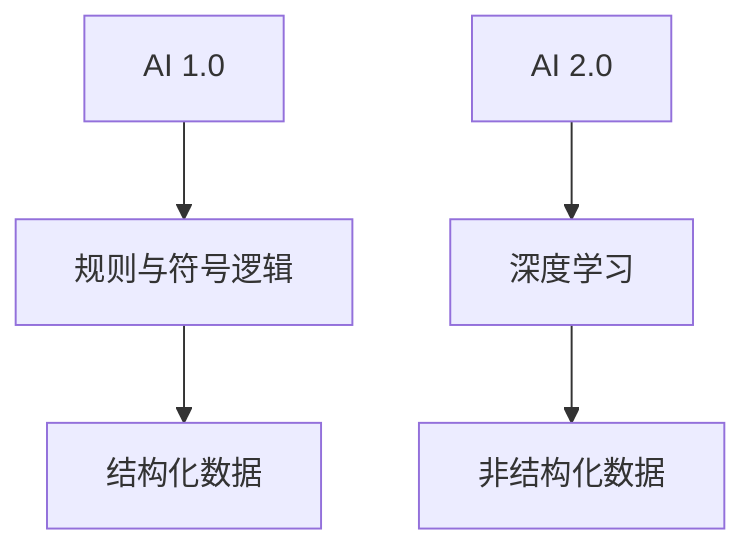
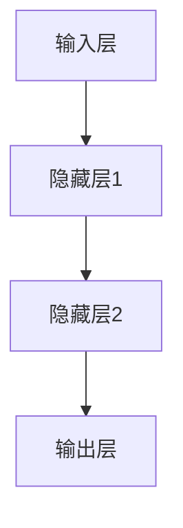

                 

### 文章标题

《李开复：AI 2.0 时代的意义》

---

**关键词：** AI 2.0，深度学习，自然语言处理，应用领域，未来展望

**摘要：** 本文将深入探讨AI 2.0时代的背景、意义、核心技术及其应用领域，分析其对社会的深远影响，并展望AI 2.0的未来发展趋势。通过梳理李开复关于AI 2.0的观点，我们旨在为读者呈现一幅全面、清晰的AI 2.0时代图景。

### 第一部分：AI 2.0 时代的背景与意义

**第1章：AI 2.0 的概念与起源**

#### 1.1 AI 2.0 的定义

AI 2.0，即下一代人工智能，是相对于AI 1.0而言的。AI 1.0主要是指基于规则和符号逻辑的专家系统，而AI 2.0则是指以深度学习为代表的基于数据驱动的人工智能。它不仅能够处理结构化数据，还能处理非结构化数据，如文本、图像、语音等。

#### 1.2 AI 2.0 与 AI 1.0 的区别

**Mermaid 流程图：**



**1.2.1 AI 2.0 与 AI 1.0 的区别**

- AI 1.0依赖于人类专家的知识和规则，而AI 2.0则基于大量的数据，通过深度学习等方法自我学习和改进。
- AI 1.0在处理结构化数据时表现出色，但AI 2.0在处理非结构化数据，如图像、文本、语音等方面具有更强的能力。
- AI 1.0的应用场景相对有限，而AI 2.0的应用场景更加广泛，包括医疗、金融、教育、交通等多个领域。

#### 1.3 AI 2.0 的发展历程

AI 2.0的发展历程可以分为几个重要阶段：

- **2012年：** 深度学习突破，AlexNet在ImageNet竞赛中取得优异成绩，标志着深度学习时代的到来。
- **2016年：** Google的AlphaGo战胜世界围棋冠军李世石，展示了AI在决策和策略方面的强大能力。
- **2018年：** 自然语言处理（NLP）领域取得了重要突破，BERT模型在多项NLP任务中取得领先。
- **至今：** AI 2.0技术不断演进，应用领域不断扩大，逐渐渗透到各行各业。

**1.4 AI 2.0 时代的意义**

AI 2.0时代的到来，不仅推动了人工智能技术的快速发展，还带来了深远的社会影响：

- **社会影响：** AI 2.0使得人工智能在多个领域实现了突破，提升了人类的生活质量。
- **经济推动：** AI 2.0推动了新产业、新业态的诞生，为经济增长注入新动力。
- **个人生活改变：** AI 2.0使得人们的生活更加便捷，工作方式更加智能化。

### 第二部分：AI 2.0 的核心技术

**第2章：深度学习与神经网络**

#### 2.1 深度学习的基础

**2.1.1 神经网络的基本结构**

神经网络是深度学习的基础，其基本结构包括输入层、隐藏层和输出层。每个层由多个神经元组成，神经元之间通过权重进行连接。

**Mermaid 流程图：**



**2.1.2 深度学习的基本原理**

深度学习通过多层神经网络的堆叠，实现对数据的层次化特征提取。其基本原理包括：

- **前向传播：** 输入数据通过神经网络层，逐层传递，直至输出层。
- **反向传播：** 根据输出结果与预期结果的差距，反向传播误差，调整网络权重。

**伪代码：**

```python
# 前向传播
def forward_propagation(input_data):
    # 计算各层的输出
    # ...

# 反向传播
def backward_propagation(error):
    # 计算各层的误差
    # ...
    # 更新网络权重
    # ...
```

**2.1.3 神经网络的训练过程**

神经网络的训练过程主要包括：

- **数据预处理：** 对输入数据进行归一化、去噪等处理。
- **初始化权重：** 随机初始化网络权重。
- **前向传播：** 计算各层的输出。
- **反向传播：** 计算误差并更新权重。
- **迭代优化：** 重复前向传播和反向传播，直至满足停止条件。

**2.2 主流深度学习框架**

当前主流的深度学习框架包括TensorFlow、PyTorch等。它们提供了丰富的API和工具，方便开发者搭建和训练深度学习模型。

- **TensorFlow：** 由Google开发，具有强大的计算能力和灵活性。
- **PyTorch：** 由Facebook开发，具有简洁的API和动态计算图。

#### 2.3 自然语言处理与AI 2.0

**3.1 自然语言处理的基本原理**

自然语言处理（NLP）是AI 2.0中的重要领域，其基本原理包括：

- **词嵌入：** 将词汇映射到高维向量空间。
- **序列模型：** 处理文本序列，如循环神经网络（RNN）。
- **注意力机制：** 提高模型对重要信息的关注。
- **转换器架构：** 结合编码器和解码器，实现文本生成和翻译。

**3.2 自然语言处理在AI 2.0中的应用**

自然语言处理在AI 2.0中的应用非常广泛，包括：

- **文本分类：** 对文本进行分类，如情感分析、新闻分类等。
- **机器翻译：** 实现跨语言文本翻译。
- **对话系统：** 建立人机对话界面，如聊天机器人。

### 第三部分：AI 2.0 的应用领域

**第4章：AI 2.0 在医疗健康领域的应用**

#### 4.1 AI 2.0 在医疗健康领域的现状

AI 2.0在医疗健康领域取得了显著成果，包括：

- **医疗影像分析：** 通过深度学习模型，自动识别和诊断病变。
- **疾病预测与诊断：** 利用大数据和机器学习算法，预测疾病风险和诊断疾病。
- **药物研发：** 通过虚拟筛选和分子模拟，加速药物研发进程。

#### 4.2 AI 2.0 在医疗健康领域的挑战与机遇

AI 2.0在医疗健康领域面临以下挑战：

- **隐私保护：** 如何保护患者隐私，确保数据安全。
- **数据安全：** 如何防止数据泄露和恶意攻击。
- **医疗伦理：** 如何平衡人工智能与医疗伦理的关系。

同时，AI 2.0在医疗健康领域也带来巨大机遇：

- **个性化治疗：** 根据患者数据，实现精准医疗。
- **医疗资源优化：** 提高医疗资源利用效率。
- **公共卫生监测：** 通过大数据分析，实现疾病预警和防控。

**第5章：AI 2.0 在金融领域的应用**

#### 5.1 AI 2.0 在金融领域的现状

AI 2.0在金融领域得到了广泛应用，包括：

- **风险管理：** 通过机器学习算法，预测市场风险和信用风险。
- **信贷审批：** 自动评估借款人信用，提高审批效率。
- **量化交易：** 利用算法进行高频交易和资产配置。

#### 5.2 AI 2.0 在金融领域的挑战与机遇

AI 2.0在金融领域面临以下挑战：

- **法律合规：** 遵守相关法律法规，确保交易合规。
- **技术瓶颈：** 提高算法性能，应对复杂市场环境。
- **创新与变革：** 推动金融行业创新和变革。

同时，AI 2.0在金融领域也带来巨大机遇：

- **智能投顾：** 提供个性化投资建议。
- **金融普惠：** 让更多人享受到金融服务。
- **风险管理优化：** 提高风险管理的精度和效率。

### 第四部分：AI 2.0 的未来展望

**第6章：AI 2.0 对社会的影响**

#### 6.1 AI 2.0 对就业市场的影响

AI 2.0对就业市场的影响主要体现在以下几个方面：

- **新职业的出现：** 如数据科学家、机器学习工程师等。
- **职业转型的挑战：** 部分传统职业面临被取代的风险。
- **教育体系的变革：** 教育体系需适应AI时代的需求。

#### 6.2 AI 2.0 对社会治理的影响

AI 2.0对社会治理的影响主要包括：

- **公共安全：** 利用AI技术进行犯罪预测和预防。
- **网络安全：** 提高网络防护能力，防范网络攻击。
- **智慧城市建设：** 通过AI技术实现城市智能化管理。

#### 6.3 AI 2.0 对社会治理的影响

AI 2.0对社会治理的影响包括：

- **公共安全：** 利用AI技术进行犯罪预测和预防。
- **网络安全：** 提高网络防护能力，防范网络攻击。
- **智慧城市建设：** 通过AI技术实现城市智能化管理。

### 第五部分：AI 2.0 的未来展望

#### 7.1 AI 2.0 的技术创新

未来AI 2.0的技术创新将主要集中在以下几个方面：

- **大模型的发展趋势：** 大规模模型将进一步提高AI的效能。
- **小样本学习与少样本学习：** 降低对大量训练数据的需求。
- **新型神经网络架构：** 如图神经网络、生成对抗网络等。

#### 7.2 AI 2.0 的国际合作与竞争

AI 2.0的国际合作与竞争将影响全球AI产业的发展：

- **全球AI产业的发展现状：** 美国、中国、欧盟等国家在AI领域取得重要进展。
- **国际合作的重要性：** 促进AI技术的全球共享和应用。
- **AI竞争的格局与展望：** 全球AI竞争将更加激烈，但合作共赢也将成为趋势。

### 附录

#### 附录 A：AI 2.0 的开源工具与资源

- **TensorFlow：** https://www.tensorflow.org/
- **PyTorch：** https://pytorch.org/
- **Keras：** https://keras.io/

#### 附录 B：AI 2.0 的重要论文与书籍推荐

- **《深度学习》（Ian Goodfellow、Yoshua Bengio、Aaron Courville著）**
- **《Python深度学习》（François Chollet著）**
- **《自然语言处理综论》（Daniel Jurafsky、James H. Martin著）**

#### 附录 C：AI 2.0 的常用数学公式与概念解释

- **激活函数：** \( f(x) = \text{ReLU}(x) = \max(0, x) \)
- **损失函数：** \( \text{Loss}(y, \hat{y}) = \frac{1}{2} \sum_{i} (y_i - \hat{y}_i)^2 \)
- **梯度下降：** \( w_{t+1} = w_t - \alpha \cdot \nabla_w J(w_t) \)

### 作者

**作者：** AI天才研究院/AI Genius Institute & 禅与计算机程序设计艺术 /Zen And The Art of Computer Programming

---

以上是《李开复：AI 2.0 时代的意义》的正文部分，接下来我们将详细探讨AI 2.0的核心技术、应用领域以及未来展望。让我们一步一步深入分析，揭示AI 2.0时代的奥秘。

