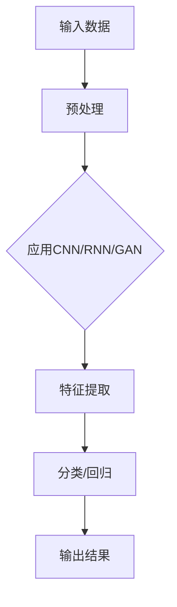
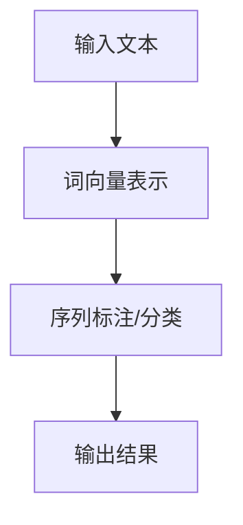
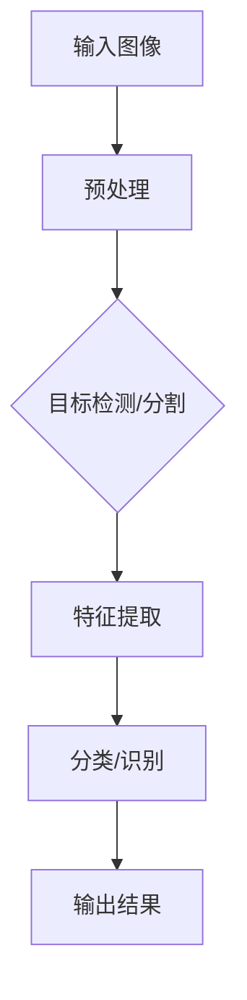

                 

### 文章标题

在本文中，我们将探讨AI 2.0时代的用户角色。AI 2.0，作为人工智能发展的新阶段，不仅代表了技术的飞跃，更深远地影响了我们生活的方方面面。从深度学习到自然语言处理，再到计算机视觉，AI 2.0的核心技术正迅速融入我们的日常生活和工作中，重塑着我们的互动方式和社会结构。

关键词：（AI 2.0，深度学习，自然语言处理，计算机视觉，用户互动，个性化服务，用户隐私，数字素养，伦理与责任，未来用户，社会影响）

摘要：本文将从AI 2.0时代的背景与展望、核心技术、应用场景、用户视角、应对挑战以及未来展望等多个方面，详细分析AI 2.0时代用户的角色和影响。我们将探讨用户如何与AI互动，如何应对AI带来的挑战，以及AI时代未来用户的需求和角色。通过本文，希望读者能够对AI 2.0时代有更深刻的理解，从而更好地适应这个充满变革的新时代。

### 《李开复：AI 2.0 时代的用户》目录大纲

为了更好地引导读者理解和跟随文章的脉络，下面是本文的目录大纲。本文将分为三个主要部分：

1. **AI 2.0时代的背景与展望**：这部分将介绍AI 2.0时代的背景，包括其定义、特征、发展历程以及对未来社会的影响。我们将深入探讨AI 2.0时代的核心技术，如深度学习、自然语言处理和计算机视觉，以及它们在各个领域的应用场景。

2. **AI 2.0时代的用户视角**：这部分将重点关注用户在AI 2.0时代如何与AI互动，包括人工智能助手、个性化服务以及用户隐私保护。同时，我们还将讨论用户如何应对AI带来的挑战，如提高数字素养、跨界融合与创新能力，以及伦理与责任问题。

3. **AI 2.0时代的未来展望**：最后，我们将展望AI 2.0时代的社会影响，包括对经济、文化、全球治理等方面的影响。我们将探讨AI 2.0时代的未来发展趋势，以及这一时代对人类社会和用户角色的深远影响。

通过这一详细的目录大纲，读者可以清晰地了解本文的结构和内容，为后续的深入阅读做好准备。

## 第一部分：AI 2.0时代的背景与展望

### 第1章：AI 2.0时代的来临

#### 1.1 AI 2.0的定义与特征

AI 2.0，即第二代人工智能，是继AI 1.0（主要是基于规则和专家系统的AI）之后的新阶段。AI 2.0的核心特征在于其自主学习能力，这主要体现在深度学习、强化学习等先进算法的广泛应用。与AI 1.0相比，AI 2.0不仅在数据处理和分析上更为高效，而且在复杂任务的处理上展现出前所未有的能力。

**定义：**
AI 2.0通常被定义为能够自主学习和进化的人工智能系统。这些系统能够通过大量数据的学习来优化自身性能，无需人为预设规则。例如，深度学习网络可以通过反复训练来自动识别复杂模式。

**核心特征：**
1. **自主学习与进化**：AI 2.0系统能够通过数据学习不断优化自身，无需人为干预。
2. **高效数据处理**：利用先进的算法和硬件，AI 2.0能够在大数据环境下快速处理和分析信息。
3. **跨领域应用**：AI 2.0不仅局限于单一任务，而是能够在多个领域实现广泛应用。

**与传统AI的区别：**
- **规则导向 vs 数据驱动**：传统AI依赖于预设的规则和逻辑，而AI 2.0则依赖于数据和学习。
- **有限任务处理 vs 多样任务处理**：传统AI通常用于特定任务，而AI 2.0则能够处理多样复杂的任务。

#### 1.2 AI 2.0的发展历程

AI 2.0的发展历程可以追溯到2012年，当时深度学习在图像识别领域取得了重大突破，使得AI 2.0开始进入人们的视野。以下是AI 2.0发展历程中的重要里程碑：

1. **2012年**：深度学习在ImageNet图像识别挑战赛中取得巨大成功，证明了深度学习在图像识别领域的潜力。
2. **2016年**：谷歌的AlphaGo击败了世界围棋冠军李世石，展示了AI在复杂决策任务上的强大能力。
3. **2018年**：开放AI发布了GPT-2，这是一个能够生成高质量文本的AI模型，引发了关于AI安全性和伦理的广泛讨论。
4. **2020年**：特斯拉首席执行官埃隆·马斯克宣布，特斯拉正在研发AI 2.0系统，旨在实现完全自动驾驶。

#### 1.3 AI 2.0对未来社会的影响

AI 2.0的兴起将对未来社会产生深远的影响，这些影响不仅体现在经济、教育、医疗等多个领域，还将改变我们生活的方方面面。

**AI 2.0对经济的影响：**
- **提高生产效率**：AI 2.0能够自动化许多重复性和复杂的任务，提高生产效率。
- **产业变革**：AI 2.0将推动传统产业向智能化、数字化转型，催生新兴产业。

**AI 2.0对教育的影响：**
- **个性化教育**：AI 2.0能够根据学生的特点提供个性化的学习方案，提高教育质量。
- **教育资源的优化配置**：通过AI 2.0，优质教育资源可以实现更广泛的共享。

**AI 2.0对医疗的影响：**
- **精准医疗**：AI 2.0能够通过对大量医学数据的分析，实现更精准的疾病诊断和治疗方案。
- **远程医疗**：AI 2.0将使远程医疗成为可能，提高医疗服务的可及性。

### 总结

AI 2.0时代的来临标志着人工智能进入了一个新的发展阶段。从其定义和特征，到发展历程，再到对未来社会的影响，AI 2.0正逐步渗透到我们生活的方方面面。在接下来的章节中，我们将进一步探讨AI 2.0的核心技术及其在各个领域的应用，帮助读者更全面地了解这一时代的本质和未来前景。

### 第2章：AI 2.0时代的核心技术

AI 2.0时代的核心技术是驱动这一时代变革的引擎，它们不仅定义了AI 2.0的运作原理，也决定了其在实际应用中的表现和潜力。在本章中，我们将深入探讨AI 2.0时代的三大核心技术：深度学习、自然语言处理和计算机视觉。通过理解这些核心技术的基本概念、核心算法和应用场景，我们将为读者提供一个全面的技术架构图，帮助其更好地把握AI 2.0的发展趋势。

#### 2.1 深度学习

**基本概念：**
深度学习是一种基于人工神经网络的学习方法，通过多层神经网络的结构，对大量数据进行特征提取和学习。其核心思想是通过逐层抽象和组合，从原始数据中提取出更高层次的特征表示。

**核心算法：**
- **卷积神经网络（CNN）**：适用于图像处理，通过卷积层和池化层提取图像特征。
- **递归神经网络（RNN）**：适用于序列数据处理，如时间序列分析和自然语言处理。
- **生成对抗网络（GAN）**：通过生成器和判别器的对抗训练，生成高质量的数据。

**应用场景：**
- **图像识别**：如人脸识别、物体检测等。
- **自然语言处理**：如机器翻译、情感分析等。
- **语音识别**：如语音合成、语音命令识别等。

**流程图：**


**伪代码示例：**
```python
# 输入数据预处理
data = preprocess(input_data)

# 初始化模型参数
model = initialize_model()

# 特征提取与分类
for epoch in range(num_epochs):
    for data_batch in data_loader:
        model.train_on_batch(data_batch)
    model.save_weights()

# 输出结果
predictions = model.predict(test_data)
```

#### 2.2 自然语言处理

**基本概念：**
自然语言处理（NLP）是计算机科学和人工智能领域的一个重要分支，旨在使计算机能够理解和处理人类自然语言。NLP的核心任务是理解和生成自然语言，包括文本分类、情感分析、命名实体识别等。

**核心算法：**
- **词向量表示**：如Word2Vec、GloVe等，用于将文本数据转换为向量表示。
- **序列标注**：如BiLSTM-CRF模型，用于对文本序列进行标注。
- **注意力机制**：在序列模型中引入注意力机制，提高模型的上下文理解能力。

**应用场景：**
- **文本分类**：如新闻分类、垃圾邮件过滤等。
- **情感分析**：如社交媒体情绪分析、产品评论分析等。
- **机器翻译**：如谷歌翻译、深度学习驱动的翻译系统等。

**流程图：**


**伪代码示例：**
```python
# 输入文本预处理
text = preprocess(input_text)

# 加载词向量模型
word_embedding = load_word_embedding()

# 序列标注与分类
predictions = nlp_model.predict(text)

# 输出结果
print(predictions)
```

#### 2.3 计算机视觉

**基本概念：**
计算机视觉是人工智能的一个重要领域，旨在使计算机能够像人类一样理解和解释视觉信息。它涉及到图像处理、模式识别等多个技术领域。

**核心算法：**
- **目标检测**：如YOLO、SSD等，用于检测图像中的多个目标。
- **图像分割**：如FCN、U-Net等，用于将图像分割为不同的区域。
- **人脸识别**：通过人脸特征提取和匹配，实现人脸识别。

**应用场景：**
- **安防监控**：如人脸识别门禁系统、自动监控等。
- **自动驾驶**：如车道线检测、障碍物识别等。
- **医疗影像分析**：如肿瘤检测、骨折诊断等。

**流程图：**


**伪代码示例：**
```python
# 输入图像预处理
image = preprocess(input_image)

# 加载目标检测模型
detection_model = load_detection_model()

# 目标检测与分类
detections = detection_model.detect(image)
for detection in detections:
    print(detection)

# 输出结果
print("Detection complete.")
```

通过上述对深度学习、自然语言处理和计算机视觉的详细介绍，我们可以看出AI 2.0时代的技术不仅理论先进，而且在实际应用中展现出了巨大的潜力和广泛的应用前景。在接下来的章节中，我们将进一步探讨这些技术在各个领域的具体应用场景，以帮助读者更好地理解和应用AI 2.0时代的核心技术。

#### 2.4 AI 2.0时代的应用场景

AI 2.0技术的飞速发展，不仅推动了核心技术的进步，更在实际应用场景中展现了其强大的变革能力。在本节中，我们将深入探讨AI 2.0在人工智能与生活、人工智能与工作、人工智能与教育三大领域的应用，通过具体案例和实际应用，展示AI 2.0技术的广泛影响和深远意义。

**2.4.1 人工智能与生活**

**智能家居：**
智能家居是AI 2.0技术在生活中的重要应用之一。通过深度学习和计算机视觉技术，智能家居系统能够实现自动化控制，提高生活便捷性。例如，智能音箱通过自然语言处理技术，可以理解用户的语音指令，控制家中的灯光、温度、安防设备等。一个典型的案例是亚马逊的Alexa，用户可以通过语音与Alexa进行互动，实现音乐播放、智能家居控制、日程管理等多项功能。

**智能医疗：**
AI 2.0技术在医疗领域的应用也日益广泛。通过计算机视觉和自然语言处理技术，AI系统能够辅助医生进行诊断和治疗。例如，AI可以通过分析大量的医学图像，如CT扫描、MRI，辅助医生发现病灶，提高诊断准确性。谷歌旗下的DeepMind开发了一种AI系统，可以分析视网膜图像，用于早期诊断糖尿病视网膜病变。此外，自然语言处理技术可以帮助医生从大量医疗文献中提取关键信息，加速新药研发和治疗方案制定。

**智能交通：**
智能交通系统通过AI 2.0技术实现车辆自动化、交通流量优化、路况预测等功能，提高交通效率，减少拥堵。一个典型的应用案例是特斯拉的自动驾驶功能，利用深度学习和计算机视觉技术，实现车辆的自动行驶和导航。此外，一些城市正在部署智能交通信号灯系统，通过分析实时交通数据，智能调整信号灯时长，优化交通流量。

**2.4.2 人工智能与工作**

**自动化生产线：**
AI 2.0技术在制造业中的应用，极大地提升了生产效率和产品质量。自动化生产线通过机器人和AI算法实现生产流程的自动化，减少了人为干预和错误。例如，富士康的机器人生产线，通过深度学习和图像识别技术，能够自动识别和组装复杂零部件，提高了生产效率。另外，AI系统还可以进行质量检测，通过计算机视觉技术分析产品外观和内部结构，确保产品质量。

**智能客服：**
AI 2.0技术在客服领域的应用，使得客户服务更加高效和个性。智能客服系统通过自然语言处理和机器学习技术，能够自动理解并回答用户的问题，提供24/7的在线服务。例如，许多电商平台已经部署了智能客服系统，如阿里巴巴的天猫智能客服，能够通过自然语言处理技术理解用户的查询，提供快速、准确的回答。

**人工智能算法交易：**
在金融领域，AI 2.0技术被广泛应用于算法交易，通过大数据分析和机器学习算法，实现自动化的投资决策。这些算法能够快速分析市场数据，发现交易机会，并自动执行交易。例如，高频交易公司利用AI算法，在极短时间内进行大量交易，实现高额利润。

**2.4.3 人工智能与教育**

**智能教学系统：**
AI 2.0技术在教育领域的应用，正在改变传统的教学模式。智能教学系统通过自然语言处理和机器学习技术，能够根据学生的学习情况，提供个性化的学习资源和支持。例如，一些在线教育平台使用AI算法，分析学生的学习数据，为学生推荐最适合的学习内容和进度。此外，AI系统还可以进行自动评分，减少教师的负担。

**在线学习平台：**
随着AI 2.0技术的发展，在线学习平台越来越智能化。这些平台通过推荐系统和智能学习算法，为学习者提供个性化的学习体验。例如，Coursera等在线教育平台使用AI算法，根据学习者的兴趣和历史数据，推荐相关的课程和学习资源。这不仅提高了学习效率，还增强了学习者的学习体验。

**智能教育应用：**
AI 2.0技术在教育中的应用不仅限于在线学习平台，还渗透到教学过程中的各个环节。例如，一些学校采用AI技术进行课堂管理，通过计算机视觉技术监控学生的行为，及时发现并纠正不良行为。此外，AI系统还可以用于智能批改作业，通过自然语言处理技术，自动评估学生的作业质量，提供即时反馈。

通过上述对AI 2.0技术在生活、工作和教育领域的应用案例，我们可以看到AI 2.0技术正在深刻改变我们的日常生活和工作方式。随着技术的不断进步和应用场景的扩大，AI 2.0将继续推动社会进步，为人类创造更多价值。

### 第二部分：AI 2.0时代的用户视角

#### 第4章：用户如何与AI互动

在AI 2.0时代，用户与AI的互动方式发生了翻天覆地的变化。AI技术不仅提升了用户的日常生活质量，也改变了用户与各种智能设备和服务之间的交互方式。本章节将探讨用户如何与AI互动，包括人工智能助手、个性化服务以及用户隐私保护，以帮助用户更好地适应这个智能化的时代。

#### 4.1 人工智能助手

**定义与功能：**
人工智能助手（AI Assistant）是AI 2.0时代最重要的用户互动工具之一。它们能够理解用户的语音指令、文本输入，并通过自然语言处理技术提供即时响应和帮助。人工智能助手的功能多种多样，包括但不限于：

- **语音识别与合成**：将用户的语音指令转换为文本，并将AI生成的回答转化为语音输出。
- **信息查询**：帮助用户查询天气预报、新闻资讯、交通信息等。
- **日程管理**：提醒用户重要事项，如会议安排、日程安排等。
- **智能推荐**：根据用户的偏好和历史行为，推荐合适的商品、电影、音乐等。

**开发与应用：**
人工智能助手的开发涉及多个技术领域，包括自然语言处理、语音识别、机器学习等。以下是一个简化的开发流程：

1. **需求分析与系统设计**：明确人工智能助手的目标功能，设计系统架构。
2. **数据收集与处理**：收集语音数据、文本数据等，对数据进行预处理和标注。
3. **模型训练与优化**：使用深度学习算法，如循环神经网络（RNN）或转换器（Transformer），训练模型。
4. **系统集成与测试**：将模型集成到应用程序中，进行功能测试和性能优化。

一个成功的人工智能助手案例是苹果的Siri。Siri通过自然语言处理技术，可以理解用户的语音指令，并提供各种服务，如拨打电话、发送消息、查找地图等。此外，Siri还可以与其他苹果设备和服务集成，实现无缝的跨平台互动。

#### 4.2 个性化服务

**个性化推荐系统：**
个性化服务在AI 2.0时代变得尤为重要。个性化推荐系统通过分析用户的兴趣和行为，提供定制化的内容和服务。以下是一个简化的个性化推荐系统开发流程：

1. **用户画像构建**：通过分析用户的历史数据，如浏览记录、购买行为、社交媒体活动等，构建用户的兴趣模型。
2. **内容分类与标签**：对内容进行分类和标签化，如电影、音乐、书籍、新闻等。
3. **推荐算法实现**：使用协同过滤、基于内容的推荐、深度学习等算法，生成个性化推荐。
4. **实时反馈与优化**：根据用户的反馈和互动数据，调整推荐策略，优化推荐效果。

一个典型的个性化推荐系统案例是亚马逊的购物推荐。亚马逊通过分析用户的购物历史和浏览行为，为用户推荐可能感兴趣的商品。此外，亚马逊还使用深度学习算法，通过用户的历史评价，预测用户对商品的评价。

**个性化营销策略：**
个性化营销策略在AI 2.0时代也变得尤为重要。企业通过分析用户的数据，实现精准营销，提高营销效果。以下是一个简化的个性化营销策略开发流程：

1. **数据收集与处理**：收集用户的个人信息、行为数据等。
2. **用户画像构建**：通过分析数据，构建用户的兴趣和需求模型。
3. **营销策略制定**：根据用户画像，制定个性化的营销策略，如电子邮件营销、社交媒体广告等。
4. **效果评估与优化**：通过分析营销活动的效果，优化营销策略。

一个典型的个性化营销策略案例是Netflix的电影推荐。Netflix通过分析用户的观看记录和评分数据，为用户推荐可能感兴趣的电影和电视剧。此外，Netflix还使用机器学习算法，通过用户的观看行为，预测用户对电影的兴趣。

#### 4.3 用户隐私保护

**用户隐私的重要性：**
在AI 2.0时代，用户隐私保护变得尤为关键。随着AI技术的广泛应用，大量的用户数据被收集、存储和分析。这些数据不仅包括用户的个人信息和行为数据，还可能涉及用户的隐私信息，如医疗记录、财务信息等。如果这些数据被不法分子获取，可能会导致严重的隐私泄露和安全问题。

**用户隐私保护的方法与措施：**
为了保护用户隐私，企业和政府采取了一系列方法与措施：

1. **数据加密**：使用加密技术，对用户数据进行加密存储和传输，防止数据泄露。
2. **访问控制**：限制对用户数据的访问权限，确保只有授权人员才能访问敏感数据。
3. **匿名化处理**：对用户数据进行分析时，进行匿名化处理，去除个人识别信息。
4. **隐私保护法律与法规**：制定隐私保护法律与法规，规范企业的数据处理行为，确保用户隐私得到保护。

一个典型的隐私保护案例是欧盟的通用数据保护条例（GDPR）。GDPR规定了企业的数据处理行为，要求企业对用户数据进行保护，否则将面临严厉的罚款。此外，GDPR还赋予用户更多的隐私权利，如数据访问权、删除权等。

通过上述对人工智能助手、个性化服务和用户隐私保护的讨论，我们可以看到AI 2.0时代用户互动的多样性和复杂性。随着AI技术的不断发展，用户与AI的互动方式将变得更加智能和个性化，同时，用户隐私保护也面临着新的挑战和机遇。用户需要适应这一变化，了解如何与AI互动，并在享受智能服务的同时，保护自己的隐私。

### 第5章：用户如何应对AI挑战

在AI 2.0时代，用户不仅需要适应AI带来的便利和变革，还必须面对一系列新的挑战。这些挑战涉及数字素养、跨界融合与创新能力，以及伦理与责任等多个方面。本章节将深入探讨用户如何应对这些挑战，以更好地适应AI时代的需求和变革。

#### 5.1 提高数字素养

**定义与重要性：**
数字素养是指个体在数字化环境中获取、理解、使用和创造信息的能力。在AI 2.0时代，数字素养的重要性愈发凸显。它不仅关乎个人在数字世界中的生存能力，还直接影响到社会的整体发展。

1. **信息获取能力**：在信息爆炸的时代，用户需要具备快速获取和理解信息的能力，避免被虚假信息所误导。
2. **技术操作能力**：用户需要熟练掌握各类数字化工具，如智能手机、电脑、AI助手等，以提高日常生活和工作效率。
3. **信息批判能力**：用户需要具备对信息进行评估和批判的能力，避免被不良信息所侵害。

**提高数字素养的方法与途径：**
1. **教育体系改革**：学校和教育机构应将数字素养教育纳入课程体系，培养学生的数字素养。
2. **终身学习观念**：用户应树立终身学习的理念，通过在线课程、工作坊等途径，不断更新和提升自己的数字素养。
3. **实践应用**：通过实际操作和项目实践，提高用户的数字素养，使其能够更好地应对现实中的数字挑战。

#### 5.2 跨界融合与创新能力

**概念与意义：**
跨界融合是指在多个领域之间进行合作和创新，以实现资源整合、优势互补和协同发展。在AI 2.0时代，跨界融合对于企业和用户来说，具有以下重要意义：

1. **资源整合**：通过跨界融合，企业可以整合不同领域的资源，形成新的商业模式和业务模式。
2. **创新能力**：跨界融合为创新提供了新的思路和方向，有助于企业突破传统行业界限，实现创新性发展。
3. **市场拓展**：跨界融合可以开拓新的市场机会，扩大企业的业务范围和市场份额。

**跨界融合的案例：**
1. **科技公司与金融机构**：科技公司通过引入AI、区块链等技术，为金融机构提供智能投顾、风险控制等解决方案。
2. **传统制造业与互联网企业**：传统制造业通过与互联网企业的合作，实现智能制造和数字化转型。

**创新能力的培养与提升：**
1. **跨学科学习**：用户应具备跨学科的知识体系，通过学习不同领域的知识，提高自身的创新能力。
2. **实践经验**：通过参与实际项目和实践活动，积累经验，提高创新能力。
3. **开放思维**：培养开放思维，接受新观念和新方法，勇于尝试和创新。

#### 5.3 伦理与责任

**AI伦理的基本原则：**
在AI 2.0时代，伦理与责任成为了一个不可忽视的重要问题。以下是一些基本的AI伦理原则：

1. **公平性**：AI系统应确保对所有用户公平对待，避免歧视和偏见。
2. **透明性**：AI系统的决策过程和算法应透明，用户有权了解自己的数据如何被使用和决策。
3. **隐私保护**：用户的数据应得到严格保护，防止隐私泄露和数据滥用。
4. **责任归属**：在AI系统出现问题时，应明确责任归属，确保用户权益得到保障。

**用户在AI时代的责任与担当：**
1. **合理使用AI技术**：用户应遵循法律法规，合理使用AI技术，避免滥用和误用。
2. **数据安全意识**：用户应提高数据安全意识，保护自己的隐私信息，避免泄露。
3. **社会责任**：用户应承担社会责任，积极参与AI伦理讨论，推动AI技术的健康发展。

通过上述对数字素养、跨界融合与创新能力，以及伦理与责任的讨论，我们可以看到用户在AI 2.0时代面临的挑战是多方面的。用户需要通过不断提高自身素质，适应AI时代的需求，同时也需要积极参与到AI伦理的讨论中，推动AI技术的健康、可持续发展。

### 第6章：AI时代的未来用户

AI 2.0时代的到来不仅深刻地改变了技术本身，也对我们未来用户的需求、行为和角色产生了深远的影响。在这个智能化的时代，用户的体验、需求和期望将如何变化？他们将在社会和职业中扮演什么样的角色？这是我们需要深入探讨的问题。

#### 6.1 未来的用户需求

在AI 2.0时代，用户的个性化需求将得到前所未有的满足。随着AI技术的发展，用户需求将呈现以下趋势：

1. **个性化服务**：用户希望获得更加定制化的服务，例如，根据用户的兴趣和偏好，提供个性化的新闻推送、购物推荐、医疗建议等。
2. **实时响应**：用户期待快速、高效的响应，例如，智能助手能够立即理解用户的语音指令，并提供即时帮助。
3. **隐私保护**：用户越来越重视隐私保护，希望自己的数据能够得到有效保护，防止隐私泄露和数据滥用。
4. **便捷性**：用户追求便捷的生活方式，希望通过智能设备和服务简化生活和工作流程。

#### 6.2 AI时代的用户行为

随着AI技术的普及，用户行为也将发生显著变化：

1. **智能化交互**：用户与AI系统之间的交互将更加智能化，通过语音、图像等多种方式进行互动，实现人机协同。
2. **数据驱动**：用户行为将受到大数据和AI算法的驱动，例如，AI系统可以根据用户的购物历史和偏好，推荐最适合的商品。
3. **跨界融合**：用户将跨越传统行业和领域，参与跨界创新和合作，推动社会进步和经济发展。
4. **自主学习**：用户将逐渐学会利用AI技术进行自主学习，例如，通过在线课程和智能辅导，不断提升自己的知识和技能。

#### 6.3 用户的未来角色

在AI 2.0时代，用户的角色将发生重大转变：

1. **智能生活的创造者**：用户将参与智能生活的设计和创造，通过自定义智能设备和服务，打造个性化的生活场景。
2. **智能工作的高效执行者**：用户将在智能工作环境中发挥重要作用，利用AI技术和工具，提高工作效率和创新能力。
3. **智能社会的积极参与者**：用户将积极参与智能社会的发展，通过数据共享、协作创新，推动社会进步和和谐发展。
4. **AI伦理的守护者**：用户将成为AI伦理的守护者，积极参与AI伦理讨论，推动AI技术的健康、可持续发展。

#### 6.4 未来的用户画像

基于以上分析，我们可以描绘出AI 2.0时代未来用户的画像：

1. **个性化需求强烈**：用户具备强烈的个性化需求，追求定制化的服务和体验。
2. **智能化交互习惯**：用户习惯于与AI系统进行智能化交互，具备良好的数字素养和技能。
3. **跨界融合意识**：用户具备跨界融合的意识，积极参与创新和合作，推动社会进步。
4. **数据安全意识**：用户重视数据安全，具备良好的数据保护意识和技能。
5. **自主学习能力**：用户具备自主学习的能力，能够利用AI技术和工具，不断提升自己的知识和技能。
6. **社会责任感**：用户具备强烈的社会责任感，积极参与社会事务，推动AI技术的健康、可持续发展。

通过上述对未来用户需求、行为和角色的探讨，我们可以看到AI 2.0时代用户将面临巨大的机遇和挑战。用户需要不断提高自身素质，适应智能化的时代变化，同时也需要积极参与到AI技术的发展和伦理讨论中，共同推动AI技术的健康、可持续发展。

### 第三部分：AI 2.0时代的未来展望

在AI 2.0时代，人工智能不仅改变了我们的生活方式和工作模式，还将对经济、文化、全球治理等多个领域产生深远的影响。本部分将探讨AI 2.0时代的社会影响、未来发展趋势以及这一时代对人类社会和用户角色的深远影响。

#### 7.1 AI对经济的影响

AI技术的广泛应用正在重塑全球经济结构，对劳动力市场、产业结构和经济增长方式产生深远影响：

**劳动力市场的影响：**
- **自动化取代传统岗位**：AI技术将在许多行业中替代人力，特别是在重复性和劳动密集型的工作中。例如，自动化生产线、智能客服等。
- **新职业的崛起**：AI的发展也将催生新的职业机会，如数据科学家、AI工程师、机器学习专家等。
- **技能要求的转变**：劳动力需要适应AI时代的需求，提升数字素养和跨领域能力。

**产业结构的影响：**
- **产业转型升级**：传统产业通过AI技术的应用，实现智能化、数字化转型，提升生产效率和质量。
- **新兴产业的发展**：AI技术的推动下，新兴产业如人工智能、大数据、物联网等蓬勃发展，成为经济增长的新动力。

**经济增长方式的影响：**
- **效率提升**：AI技术通过自动化和优化流程，提高生产效率和资源利用率，推动经济高质量发展。
- **创新驱动**：AI技术为创新提供了强大的工具和支持，推动技术创新和产业升级，促进经济增长。

#### 7.2 AI对文化的影响

AI技术不仅在经济领域产生变革，也在文化领域引发深刻变革：

**文化产业的推动：**
- **内容创作**：AI技术可以自动生成音乐、绘画、小说等，丰富文化创作形式。
- **文化传播**：AI技术通过个性化推荐和智能传播，促进文化作品的广泛传播和消费。

**文化消费的影响：**
- **个性化消费**：AI技术通过分析用户数据，提供个性化的文化产品和服务，满足用户的个性化需求。
- **数字文化消费**：随着AI技术的发展，数字文化消费逐渐成为主流，线上文化消费方式取代传统线下消费方式。

**文化产业的挑战：**
- **版权保护**：AI自动生成的内容引发版权保护问题，需要完善相关法律法规。
- **文化多样性**：AI技术在内容创作中的广泛应用可能导致文化多样性的减少，需要平衡个性化与多样性。

#### 7.3 AI对全球治理的影响

AI技术的发展不仅影响国内经济和文化，也对全球治理产生深远影响：

**国际政治的影响：**
- **军事应用**：AI技术在军事领域的应用，如自动化武器系统、无人机等，将改变现代战争的面貌。
- **国际竞争**：AI技术的发展成为国际竞争的新领域，各国纷纷加大投入，争夺AI技术的领先地位。

**国际经济合作的影响：**
- **数据共享**：AI技术的发展需要全球范围内的数据共享和合作，推动跨国企业和国际组织的合作。
- **贸易规则**：AI技术将影响全球贸易规则，需要制定新的国际协定和标准。

**全球治理的挑战：**
- **数据隐私**：全球范围内的数据流动引发数据隐私问题，需要加强国际合作，制定统一的数据保护法规。
- **伦理与责任**：AI技术的发展引发伦理和责任问题，需要建立全球性的AI伦理准则，确保AI技术的健康、可持续发展。

#### 7.4 AI技术的未来发展趋势

随着AI技术的不断发展，未来将出现以下趋势：

**大模型的发展趋势：**
- **模型规模增大**：未来AI模型将朝着更大规模发展，通过更多的数据和计算资源，实现更高的性能和更广泛的应用。
- **多模态融合**：AI模型将结合多种数据类型，如文本、图像、声音等，实现更全面的信息理解和处理。

**跨领域AI技术的发展：**
- **跨领域应用**：AI技术将突破单一领域的限制，实现跨领域的融合和创新，推动多个领域的共同发展。
- **跨界合作**：不同领域的专家和机构将加强合作，共同推动AI技术的发展和应用。

**AI产业的未来格局：**
- **产业生态形成**：AI产业将形成一个完整的生态体系，包括硬件、软件、服务等多个环节，促进产业的协同发展。
- **全球化布局**：AI产业将呈现全球化布局，各国企业将在全球范围内竞争和合作，共同推动AI技术的发展。

#### 7.5 AI时代的未来社会

AI 2.0时代将对人类社会产生深远影响，未来社会将呈现以下特点：

**人工智能与人类社会的融合：**
- **智能化生活**：AI技术将渗透到人类生活的方方面面，实现智能家居、智能医疗、智能交通等智能化场景。
- **智慧城市**：通过AI技术，城市将变得更加智能，实现智能交通、智能环境监测、智能安防等功能。

**伦理挑战与解决路径：**
- **伦理监管**：随着AI技术的广泛应用，需要建立完善的伦理监管体系，确保AI技术的发展符合道德和法律规范。
- **公众参与**：公众应积极参与到AI伦理讨论中，共同制定AI伦理准则，推动AI技术的健康、可持续发展。

通过上述对未来社会的展望，我们可以看到AI 2.0时代对经济、文化、全球治理等多方面产生的深远影响。AI技术的发展不仅带来了机遇，也带来了挑战。人类社会需要积极应对这些挑战，推动AI技术的健康、可持续发展，共同创造一个更美好的未来。

### 总结

本文从多个角度深入探讨了AI 2.0时代的用户角色及其影响。首先，我们介绍了AI 2.0的定义与特征，以及其发展历程和对未来社会的影响。接着，我们详细分析了AI 2.0时代的核心技术，包括深度学习、自然语言处理和计算机视觉，并通过具体应用场景展示了这些技术的广泛应用。在用户视角部分，我们探讨了用户如何与AI互动，包括人工智能助手、个性化服务和用户隐私保护。随后，我们讨论了用户如何应对AI带来的挑战，包括提高数字素养、跨界融合与创新能力，以及伦理与责任问题。最后，我们展望了AI 2.0时代的未来发展趋势和未来社会，探讨了AI对经济、文化、全球治理等方面的影响。

AI 2.0时代正在迅速到来，用户需要不断适应这一变革，提高自身的数字素养，积极参与到AI技术的发展和伦理讨论中。同时，企业和政策制定者也需要积极应对AI带来的挑战，推动AI技术的健康、可持续发展。

### 作者信息

作者：AI天才研究院/AI Genius Institute & 禅与计算机程序设计艺术 /Zen And The Art of Computer Programming

AI天才研究院致力于推动人工智能领域的研究与应用，关注AI 2.0时代的技术创新和社会影响。作为人工智能领域的领先研究机构，我们致力于培养未来科技领袖，推动AI技术的健康、可持续发展。同时，作者李开复博士在计算机科学和人工智能领域拥有深厚的研究背景，其著作《禅与计算机程序设计艺术》深刻影响了无数程序员和开发者，为我们提供了独特的视角和深刻的洞见。通过本文，我们希望能够为读者提供一个全面、深入的AI 2.0时代概览，激发大家对这一领域的兴趣和思考。

