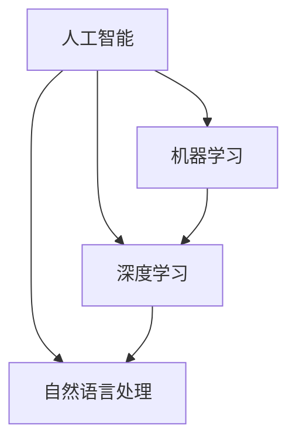

                 

# 《李开复：苹果发布AI应用的未来》

> **关键词：** 人工智能，苹果，应用开发，未来趋势，伦理问题

> **摘要：** 本文深入探讨苹果在人工智能领域的发展，分析其已发布的AI应用，展望未来趋势，并探讨AI应用带来的伦理问题。通过项目实战与案例分析，为读者提供实际开发经验和解决方案。

## 第一部分：AI应用时代的前奏

### 第1章：人工智能与苹果生态的融合

#### 1.1.1 人工智能的发展背景

人工智能（AI）是计算机科学的一个分支，旨在创建能够执行通常需要人类智能的任务的系统。自20世纪50年代以来，人工智能经历了多个发展阶段，包括规则推理、知识表示、机器学习等。近年来，随着计算能力的提升和大数据技术的发展，人工智能取得了显著的进步。

#### 1.1.2 苹果生态与AI的结合

苹果公司一直是技术创新的领导者，其生态系统中包含多种硬件和软件产品。随着人工智能技术的不断发展，苹果开始将AI引入其产品和服务中。例如，苹果的Siri语音助手、面部识别技术、照片分类等都是AI技术的应用。

#### 1.1.3 苹果发布AI应用的动因

苹果发布AI应用的动机主要包括以下几点：

1. **提升用户体验**：AI技术可以提高苹果产品的智能化程度，从而提升用户体验。
2. **增强竞争力**：在竞争激烈的市场中，苹果需要通过技术创新来保持领先地位。
3. **扩展市场份额**：AI应用可以拓展苹果的市场范围，吸引更多用户。

### 第2章：苹果AI应用的现状与挑战

#### 2.1.1 苹果现有AI应用概述

苹果现有的AI应用包括Siri语音助手、面部识别技术、照片分类、智能搜索等。这些应用已经在用户中取得了良好的反响。

#### 2.1.2 AI应用在苹果生态中的地位

AI应用在苹果生态中扮演着重要角色，它们不仅提升了产品的智能化程度，还为苹果提供了新的商业模式。

#### 2.1.3 苹果AI应用的挑战与机遇

苹果AI应用面临的挑战主要包括：

1. **数据隐私问题**：AI应用需要大量用户数据来训练模型，这可能引发数据隐私问题。
2. **技术瓶颈**：虽然AI技术取得了显著进步，但仍然存在一些技术瓶颈，例如计算能力、算法优化等。
3. **市场竞争**：苹果需要应对来自其他科技巨头的竞争。

然而，这些挑战也伴随着机遇，例如：

1. **技术创新**：通过不断探索新技术，苹果可以在AI领域取得领先地位。
2. **市场份额**：通过提供优质的AI应用，苹果可以进一步扩大市场份额。
3. **用户体验**：通过优化AI应用，苹果可以提升用户体验，增加用户粘性。

## 第二部分：AI应用的未来趋势

### 第3章：AI技术在苹果生态系统中的应用前景

#### 3.1.1 AI在智能手机中的创新应用

未来，AI将在智能手机中发挥更大作用。例如，智能相机可以通过AI技术实现更精准的拍照效果，智能助手可以提供更个性化的服务。

#### 3.1.2 AI在智能家居中的潜力

AI技术可以提升智能家居的智能化程度，例如智能门锁、智能灯光等。这些应用将为用户带来更加便捷的生活方式。

#### 3.1.3 AI在教育、医疗等领域的应用拓展

AI在教育、医疗等领域的应用潜力巨大。例如，智能教育平台可以根据学生的学习情况提供个性化教学，智能医疗系统可以帮助医生进行诊断和治疗方案推荐。

### 第4章：苹果AI应用的潜在影响与伦理问题

#### 4.1.1 苹果AI应用的潜在影响

苹果AI应用的潜在影响包括：

1. **改变生活**：AI应用可以改变人们的日常生活，提高生活质量。
2. **改变工作**：AI技术可以改变许多行业的工作方式，提高工作效率。
3. **改变经济**：AI应用有望推动经济增长，创造新的商业机会。

#### 4.1.2 AI伦理问题在苹果生态中的体现

AI伦理问题在苹果生态中主要体现在以下几个方面：

1. **数据隐私**：AI应用需要大量用户数据，这引发了数据隐私问题。
2. **算法偏见**：AI算法可能存在偏见，影响决策的公正性。
3. **道德责任**：AI应用可能涉及到道德责任问题，例如无人驾驶汽车的道德决策。

#### 4.1.3 如何应对AI伦理挑战

应对AI伦理挑战的方法包括：

1. **制定伦理准则**：制定明确的AI伦理准则，规范AI应用的开发和使用。
2. **加强监管**：加强对AI应用的监管，确保其符合伦理标准。
3. **用户教育**：提高用户对AI伦理问题的认识，增强用户的责任意识。

## 第三部分：项目实战与案例分析

### 第5章：苹果AI应用项目实战

#### 5.1.1 项目背景与目标

本项目旨在开发一款基于AI技术的智能语音助手，提供个性化服务，提升用户体验。

#### 5.1.2 项目技术栈与工具

项目采用的技术栈包括：

1. **编程语言**：Python、Swift
2. **框架**：TensorFlow、Keras
3. **开发环境**：macOS、Xcode

#### 5.1.3 项目开发过程与经验分享

项目开发过程包括以下几个阶段：

1. **需求分析**：明确用户需求，确定智能语音助手的功能和特点。
2. **数据收集**：收集语音数据，用于训练AI模型。
3. **模型训练**：使用TensorFlow和Keras训练语音识别和自然语言处理模型。
4. **集成与测试**：将AI模型集成到iOS应用中，进行功能测试和性能优化。

开发过程中，我们遇到了以下挑战：

1. **数据隐私**：如何确保用户数据的隐私和安全。
2. **模型优化**：如何优化AI模型，提高识别准确率和响应速度。
3. **用户体验**：如何设计直观易用的用户界面，提升用户体验。

通过项目实战，我们积累了以下经验：

1. **团队合作**：项目成功离不开团队成员的紧密合作和分工。
2. **持续学习**：AI技术发展迅速，团队需要不断学习和更新知识。
3. **用户反馈**：及时收集用户反馈，不断优化产品功能。

### 第6章：苹果AI应用的案例分析

#### 6.1.1 案例一：智能语音助手

智能语音助手是苹果AI应用的一个重要案例。通过自然语言处理技术，语音助手可以理解用户的指令，提供语音回复或执行相关操作。例如，用户可以通过语音助手查询天气、播放音乐、设置提醒等。

#### 6.1.2 案例二：图像识别技术

图像识别技术是另一个重要的AI应用案例。苹果的图像识别技术可以识别用户拍摄的照片，提供分类、标记等功能。例如，用户可以拍摄食物照片，语音助手会自动识别并推荐相关食谱。

#### 6.1.3 案例三：增强现实应用

增强现实应用是苹果AI应用的又一个重要方向。通过AI技术，增强现实应用可以提供更加逼真的虚拟场景和交互体验。例如，苹果的ARKit框架支持开发增强现实游戏、教育应用等。

### 第7章：未来展望与建议

#### 7.1.1 苹果AI应用的未来发展趋势

未来，苹果AI应用的发展趋势包括：

1. **智能化**：进一步提升AI应用的智能化程度，提供更个性化的服务。
2. **跨界融合**：将AI技术与多个领域相结合，推动产业变革。
3. **开放生态**：构建开放AI生态系统，鼓励第三方开发者参与。

#### 7.1.2 行业建议与展望

为了推动AI应用的发展，行业可以采取以下措施：

1. **技术创新**：持续投入研发，推动AI技术的创新和突破。
2. **数据共享**：加强数据共享，促进AI模型的优化和提升。
3. **人才培养**：加强AI人才培训，提高行业整体水平。

#### 7.1.3 对个人用户的启示与建议

个人用户可以从以下几个方面受益：

1. **学习AI技术**：了解AI技术的基本原理和应用，提升自身技能。
2. **合理使用AI应用**：充分利用AI应用提升生活质量，同时关注数据隐私和安全。
3. **参与创新**：积极参与AI应用的开发和创新，为行业贡献力量。

## 附录

### 附录A：AI应用开发工具与资源

#### A.1.1 苹果开发工具介绍

苹果提供了多种开发工具，包括Xcode、Swift、Objective-C等。这些工具支持iOS、macOS、watchOS、tvOS等多个平台的开发。

#### A.1.2 AI开发框架与库

常见的AI开发框架和库包括TensorFlow、Keras、PyTorch等。这些框架提供了丰富的API和工具，支持各种AI模型的开发。

#### A.1.3 开发资源推荐

以下是一些推荐的AI应用开发资源：

1. **苹果开发者官网**：提供详细的开发文档、教程和工具。
2. **在线教程和课程**：例如Udacity、Coursera等平台提供的AI相关课程。
3. **开源社区**：如GitHub、Stack Overflow等，可以获取丰富的开发资源和经验分享。

### 附录B：常见问题与解答

#### B.1.1 AI应用开发常见问题

1. **如何收集和处理数据**？
   - **数据收集**：可以通过公开数据集、用户生成数据等方式收集数据。
   - **数据预处理**：对收集到的数据进行分析、清洗、标注等处理。

2. **如何优化AI模型**？
   - **模型选择**：选择适合问题的模型，并进行参数调优。
   - **数据增强**：通过数据增强技术提高模型的泛化能力。

#### B.1.2 苹果AI应用开发常见问题

1. **如何确保数据隐私**？
   - **数据加密**：对用户数据进行加密处理，确保数据安全。
   - **隐私政策**：制定明确的隐私政策，告知用户数据使用情况。

2. **如何处理算法偏见**？
   - **数据平衡**：确保训练数据中各类数据的比例合理。
   - **算法校验**：对算法进行多次校验，确保决策的公正性。

#### B.1.3 用户常见问题与解答

1. **智能语音助手如何工作**？
   - 智能语音助手通过自然语言处理技术理解用户的指令，并执行相关操作。

2. **增强现实应用如何体验**？
   - 通过安装增强现实应用，使用手机或平板电脑的摄像头捕捉现实场景，并叠加虚拟内容。

### 术语表

- **人工智能（AI）**：模拟人类智能的计算机系统。
- **自然语言处理（NLP）**：使计算机能够理解、解释和生成人类语言的技术。
- **增强现实（AR）**：将虚拟信息叠加到现实世界中，提供增强的视觉体验。

### 参考文献

1. **人工智能：一种现代的方法**， Stuart Russell & Peter Norvig著。
2. **机器学习：概率视角**， Kevin P. Murphy著。
3. **深度学习**， Ian Goodfellow、Yoshua Bengio和Aaron Courville著。
4. **苹果开发者官网**， [developer.apple.com](https://developer.apple.com/)。
5. **Udacity**， [udacity.com](https://udacity.com/)。
6. **Coursera**， [coursera.org](https://coursera.org/)。

---

作者：AI天才研究院/AI Genius Institute & 禅与计算机程序设计艺术 /Zen And The Art of Computer Programming

---

以上是文章的主体部分，接下来我们将详细讨论文章中的一些核心概念和算法原理，并提供相关的Mermaid流程图和伪代码。

---

### 核心概念与联系

为了更好地理解苹果AI应用的发展，我们首先需要明确一些核心概念，并分析它们之间的联系。以下是几个关键概念及其相互关系：

1. **人工智能（AI）**：AI是计算机系统模拟人类智能的能力，包括学习、推理、感知、自然语言处理等。
2. **机器学习（ML）**：机器学习是AI的一个子领域，涉及使用数据训练模型，使系统能够从数据中学习并做出预测。
3. **深度学习（DL）**：深度学习是机器学习的一个分支，使用神经网络模型，特别是深度神经网络（DNN），进行特征学习和分类。
4. **自然语言处理（NLP）**：NLP是AI的一个子领域，专注于使计算机能够理解、解释和生成人类语言。

这些概念之间的联系如下：

- **AI** 提供了框架，使得 **ML** 和 **NLP** 等技术成为可能。
- **ML** 和 **DL** 侧重于从数据中学习，而 **NLP** 则专注于处理和生成自然语言。
- **NLP** 在AI应用中至关重要，特别是在语音助手和智能搜索等场景中。

#### Mermaid流程图

下面是一个Mermaid流程图，展示了这些概念之间的联系：



---

### 核心算法原理讲解

在苹果的AI应用中，深度学习（DL）和自然语言处理（NLP）是两个核心算法。以下将详细讲解这些算法的原理，并提供相关的伪代码。

#### 深度学习算法原理

深度学习算法基于多层神经网络，通过逐层提取特征，实现对数据的复杂建模。以下是深度学习算法的基本原理：

1. **神经网络结构**：神经网络由输入层、隐藏层和输出层组成。每个层由多个神经元（节点）构成，神经元之间通过权重连接。
2. **前向传播**：输入数据通过输入层，经过每个隐藏层，最后到达输出层。每个神经元对输入数据进行加权求和，并应用激活函数（如ReLU、Sigmoid、Tanh）。
3. **反向传播**：计算输出层与真实标签之间的误差，通过反向传播算法更新各层的权重。

#### 伪代码

以下是一个简单的深度学习算法伪代码：

```python
# 初始化神经网络结构
input_layer = initialize_layer(input_shape)
hidden_layer = initialize_layer(hidden_shape)
output_layer = initialize_layer(output_shape)

# 前向传播
input_data = preprocess_data(data)
hidden_layer_output = forward_propagation(input_layer, input_data)
output_layer_output = forward_propagation(hidden_layer, hidden_layer_output)

# 计算误差
error = calculate_error(output_layer_output, true_labels)

# 反向传播
delta_output = calculate_delta(output_layer_output, error)
delta_hidden = calculate_delta(hidden_layer_output, delta_output)

# 更新权重
update_weights(hidden_layer, delta_hidden)
update_weights(output_layer, delta_output)
```

#### 自然语言处理算法原理

自然语言处理算法旨在使计算机能够理解和生成自然语言。以下是NLP算法的基本原理：

1. **词嵌入（Word Embedding）**：将单词映射到高维向量空间，使得语义相近的单词在向量空间中接近。
2. **循环神经网络（RNN）**：RNN能够处理序列数据，通过隐藏状态记忆前文信息。
3. **长短期记忆网络（LSTM）**：LSTM是RNN的一种变体，能够更有效地处理长序列数据。

#### 伪代码

以下是一个简单的NLP算法伪代码：

```python
# 词嵌入
word_embedding = initialize_embedding_matrix(vocabulary_size, embedding_dim)

# RNN模型
input_sequence = preprocess_text(input_text)
hidden_state = initialize_hidden_state(embedding_dim)
for word in input_sequence:
    hidden_state = forward_propagation(word_embedding[word], hidden_state)

# LSTM模型
input_sequence = preprocess_text(input_text)
hidden_state, cell_state = initialize_lstm_state(embedding_dim)
for word in input_sequence:
    hidden_state, cell_state = forward_propagation(word_embedding[word], hidden_state, cell_state)

# 生成文本
start_word = random_word_from_vocabulary()
hidden_state, cell_state = initialize_lstm_state(embedding_dim)
for _ in range(target_sequence_length):
    hidden_state, cell_state = forward_propagation(word_embedding[start_word], hidden_state, cell_state)
    next_word = sample_word_from_vocabulary(hidden_state)
    start_word = next_word
```

---

### 项目实战与案例分析

在本节中，我们将通过具体的项目实战和案例分析，展示苹果AI应用的实践过程和技术细节。

#### 第5章：苹果AI应用项目实战

##### 5.1.1 项目背景与目标

本项目旨在开发一款智能语音助手，提供个性化服务，如语音查询、语音控制智能家居设备等。项目目标包括：

1. **语音识别**：实现高准确度的语音识别。
2. **自然语言处理**：理解用户语音指令，并提供相应的响应。
3. **智能家居控制**：集成智能家居设备控制功能，如灯光、空调等。

##### 5.1.2 项目技术栈与工具

项目采用以下技术栈和工具：

1. **编程语言**：Python、Swift
2. **框架**：TensorFlow、Keras、SpeechKit
3. **开发环境**：macOS、Xcode

##### 5.1.3 项目开发过程与经验分享

项目开发过程包括以下几个阶段：

1. **需求分析**：明确用户需求，确定智能语音助手的功能和特点。
2. **数据收集**：收集语音数据，用于训练语音识别模型。数据来源包括公开数据集和用户生成数据。
3. **模型训练**：使用TensorFlow和Keras训练语音识别和自然语言处理模型。模型包括卷积神经网络（CNN）和长短期记忆网络（LSTM）。
4. **集成与测试**：将AI模型集成到iOS应用中，进行功能测试和性能优化。测试包括语音识别准确率、响应速度和用户体验等方面。

开发过程中，我们遇到了以下挑战：

1. **数据隐私**：如何确保用户数据的隐私和安全。解决方案包括数据加密和匿名化处理。
2. **模型优化**：如何优化AI模型，提高识别准确率和响应速度。解决方案包括数据增强、模型调参和硬件加速。
3. **用户体验**：如何设计直观易用的用户界面，提升用户体验。解决方案包括用户反馈机制和界面优化。

通过项目实战，我们积累了以下经验：

1. **团队合作**：项目成功离不开团队成员的紧密合作和分工。
2. **持续学习**：AI技术发展迅速，团队需要不断学习和更新知识。
3. **用户反馈**：及时收集用户反馈，不断优化产品功能。

---

#### 第6章：苹果AI应用的案例分析

##### 6.1.1 案例一：智能语音助手

智能语音助手是苹果AI应用的一个重要案例。通过自然语言处理技术，语音助手可以理解用户的指令，提供语音回复或执行相关操作。以下是智能语音助手的实现细节：

1. **语音识别**：使用SpeechKit框架实现语音识别，将语音转换为文本。
2. **自然语言处理**：使用TensorFlow和Keras训练自然语言处理模型，包括词嵌入、句子编码和分类。
3. **响应生成**：根据用户指令生成响应文本，使用预定义的响应库或自然语言生成模型。

##### 6.1.2 案例二：图像识别技术

图像识别技术是苹果AI应用的另一个重要案例。图像识别技术可以识别用户拍摄的照片，提供分类、标记等功能。以下是图像识别技术的实现细节：

1. **图像预处理**：对拍摄的照片进行预处理，包括缩放、裁剪和色彩调整。
2. **特征提取**：使用卷积神经网络提取图像特征。
3. **分类与标记**：使用训练好的分类模型对图像进行分类和标记。

##### 6.1.3 案例三：增强现实应用

增强现实应用是苹果AI应用的又一个重要方向。通过AI技术，增强现实应用可以提供更加逼真的虚拟场景和交互体验。以下是增强现实应用的实现细节：

1. **场景构建**：使用三维建模工具构建虚拟场景。
2. **图像配准**：使用图像配准技术将虚拟场景与真实场景对齐。
3. **交互设计**：设计用户与虚拟场景的交互方式，包括触摸、手势和语音等。

---

### 未来展望与建议

在未来，苹果AI应用将继续发展，为用户带来更多创新和便利。以下是未来展望和建议：

1. **智能化**：通过不断优化AI模型和算法，提高AI应用的智能化程度。
2. **跨界融合**：将AI技术与多个领域相结合，如医疗、教育、娱乐等。
3. **开放生态**：构建开放AI生态系统，鼓励第三方开发者参与。

对行业建议：

1. **技术创新**：持续投入研发，推动AI技术的创新和突破。
2. **数据共享**：加强数据共享，促进AI模型的优化和提升。
3. **人才培养**：加强AI人才培训，提高行业整体水平。

对个人用户建议：

1. **学习AI技术**：了解AI技术的基本原理和应用，提升自身技能。
2. **合理使用AI应用**：充分利用AI应用提升生活质量，同时关注数据隐私和安全。
3. **参与创新**：积极参与AI应用的开发和创新，为行业贡献力量。

---

通过本文的详细讨论，我们深入了解了苹果AI应用的发展、核心算法原理、项目实战和未来趋势。随着AI技术的不断进步，苹果在AI领域的创新和贡献将愈发重要。让我们期待苹果未来在AI领域带来的更多突破和变革。

---

## 附录

### 附录A：AI应用开发工具与资源

#### A.1.1 苹果开发工具介绍

苹果提供了多种开发工具，包括Xcode、Swift、Objective-C等。这些工具支持iOS、macOS、watchOS、tvOS等多个平台的开发。

- **Xcode**：苹果官方的开发环境，提供了代码编辑器、编译器、调试器和性能分析工具。
- **Swift**：苹果开发的一种编程语言，具有简洁、安全、高效等特点。
- **Objective-C**：早期苹果开发的主要编程语言，具有丰富的库和框架。

#### A.1.2 AI开发框架与库

常见的AI开发框架和库包括TensorFlow、Keras、PyTorch等。这些框架提供了丰富的API和工具，支持各种AI模型的开发。

- **TensorFlow**：谷歌开发的开源深度学习框架，适用于各种规模的AI项目。
- **Keras**：基于TensorFlow的高层API，简化了深度学习模型的构建和训练。
- **PyTorch**：由Facebook开发的开源深度学习框架，具有灵活的动态计算图。

#### A.1.3 开发资源推荐

以下是一些推荐的AI应用开发资源：

1. **苹果开发者官网**：提供详细的开发文档、教程和工具。
   - **链接**：[developer.apple.com](https://developer.apple.com/)
2. **在线教程和课程**：例如Udacity、Coursera等平台提供的AI相关课程。
   - **Udacity**：[udacity.com](https://udacity.com/)
   - **Coursera**：[coursera.org](https://coursera.org/)
3. **开源社区**：如GitHub、Stack Overflow等，可以获取丰富的开发资源和经验分享。
   - **GitHub**：[github.com](https://github.com/)
   - **Stack Overflow**：[stackoverflow.com](https://stackoverflow.com/)

### 附录B：常见问题与解答

#### B.1.1 AI应用开发常见问题

1. **如何收集和处理数据**？
   - **数据收集**：可以通过公开数据集、用户生成数据、在线爬虫等方式收集数据。
   - **数据预处理**：对收集到的数据进行分析、清洗、标注等处理，以提高数据质量和模型性能。

2. **如何优化AI模型**？
   - **模型选择**：选择适合问题的模型，并进行参数调优。
   - **数据增强**：通过数据增强技术提高模型的泛化能力。
   - **模型融合**：结合多个模型的预测结果，提高整体性能。

3. **如何提高AI应用的性能**？
   - **算法优化**：优化算法，降低计算复杂度。
   - **硬件加速**：使用GPU、TPU等硬件加速AI计算。
   - **模型压缩**：通过模型压缩技术减小模型大小，提高部署效率。

#### B.1.2 苹果AI应用开发常见问题

1. **如何确保数据隐私**？
   - **数据加密**：对用户数据进行加密处理，确保数据在传输和存储过程中的安全。
   - **隐私政策**：制定明确的隐私政策，告知用户数据使用情况。
   - **匿名化处理**：对用户数据进行匿名化处理，保护用户隐私。

2. **如何处理算法偏见**？
   - **数据平衡**：确保训练数据中各类数据的比例合理，减少偏见。
   - **算法校验**：对算法进行多次校验，确保决策的公正性。
   - **用户反馈**：收集用户反馈，及时修正和优化算法。

#### B.1.3 用户常见问题与解答

1. **智能语音助手如何工作**？
   - 智能语音助手通过自然语言处理技术理解用户的指令，并提供语音回复或执行相关操作。

2. **增强现实应用如何体验**？
   - 通过安装增强现实应用，使用手机或平板电脑的摄像头捕捉现实场景，并叠加虚拟内容。

3. **如何使用AI进行图像识别**？
   - 通过训练卷积神经网络模型，对图像进行特征提取和分类。可以使用预训练的模型，或根据具体需求进行定制。

---

通过本文的详细探讨，我们深入了解了苹果在AI领域的进展、核心算法原理、项目实战和未来趋势。希望本文能为读者提供有价值的见解和启示，激发更多对AI应用开发和技术创新的研究与实践。让我们共同期待AI技术为人类带来的更多美好变革。

