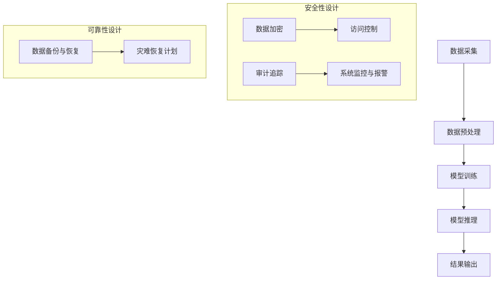

                 

# 《构建安全可靠的LLM应用架构》

## 关键词：
- 语言模型（LLM）
- 安全性
- 可靠性
- 应用架构
- 实战案例

## 摘要：
本文旨在探讨如何构建安全可靠的LLM（大型语言模型）应用架构。通过详细分析LLM的基础理论、安全性与可靠性基础，以及具体的架构设计、保障机制和实战案例，为读者提供一套全面且实用的构建指南。

### 第一部分：LLM基础

#### 第1章：LLM基础理论

##### 1.1 LLM的定义与重要性

语言模型（LLM）是一种基于机器学习技术的自然语言处理模型，能够理解和生成自然语言文本。LLM在人工智能领域具有重要地位，广泛应用于聊天机器人、文本生成、翻译、问答系统等多个场景。

**LLM的概念**：LLM通过预训练和微调学习大规模语料库中的语言规律和模式，从而具备强大的语言理解和生成能力。

**LLM在AI领域的地位**：LLM作为自然语言处理的核心技术之一，推动了AI技术在各行各业的应用和发展。

**LLM的应用场景**：LLM在聊天机器人、内容生成、文本分类、情感分析、智能客服等场景中具有广泛的应用。

##### 1.2 LLM的架构

LLM的架构主要包括编码器（Encoder）和解码器（Decoder）两个部分。

**LLM的基本架构**：
- 编码器：接收输入文本，将其编码为固定长度的向量。
- 解码器：接收编码后的向量，生成输出文本。

**LLM的关键组件**：
- 词嵌入（Word Embedding）：将词汇映射为向量。
- 自注意力机制（Self-Attention）：提高模型对输入文本的捕捉能力。
- 位置编码（Positional Encoding）：为模型提供文本位置信息。

**LLM的工作原理**：
- 预训练：在大量未标注数据上训练，学习通用语言特征。
- 微调：在特定任务上对预训练模型进行微调，提高任务表现。

##### 1.3 LLM的主要技术

LLM的主要技术包括预训练、微调和迁移学习。

**预训练**：在大量未标注数据上训练模型，使其具备通用语言能力。

**微调**：在特定任务上对预训练模型进行调整，以提高任务性能。

**迁移学习**：利用预训练模型在多个任务上的知识，迁移到新任务上，提高新任务的性能。

##### 1.4 LLM的性能评估

LLM的性能评估主要通过以下指标：

**评估指标**：
- BLEU（双语评价指数）：用于评估文本生成的质量。
- ROUGE（Recall-Oriented Understudy for Gisting Evaluation）：用于评估文本相似度。
- 情感分析准确率、F1值等：用于评估具体任务的表现。

**实际应用中的性能**：LLM在实际应用中表现出色，例如在文本生成、翻译、问答等任务上取得了显著的成绩。

**性能的提升方法**：
- 增加模型规模：提高模型的计算能力，增强对语言规律的学习。
- 优化训练策略：采用更有效的预训练和微调方法，提高模型性能。

#### 第2章：安全性与可靠性基础

##### 2.1 安全性与可靠性的概念

**安全性的定义**：安全性指系统抵御恶意攻击、数据泄露等威胁的能力。

**可靠性的定义**：可靠性指系统在规定时间内正常工作的能力。

**安全性与可靠性的关系**：安全性和可靠性相互关联，安全性保障可靠性，可靠性促进安全性。

##### 2.2 安全性与可靠性面临的挑战

**数据泄露风险**：LLM应用涉及大量用户数据，数据泄露可能导致隐私泄露。

**恶意攻击**：黑客可能利用LLM漏洞进行攻击，如注入恶意代码、破坏系统等。

**系统稳定性**：LLM应用对计算资源、网络环境等有较高要求，系统稳定性直接影响用户体验。

##### 2.3 安全性与可靠性的基本原理

**隐私保护**：通过数据加密、访问控制等技术保障用户数据隐私。

**审计追踪**：记录系统操作日志，实现操作可追溯，便于故障排查和责任追究。

**系统容错**：通过备份与恢复、监控与报警等机制，确保系统在故障情况下能够快速恢复。

### 第二部分：构建安全可靠的LLM应用架构

#### 第3章：LLM应用架构设计

##### 3.1 架构设计原则

**模块化**：将系统划分为多个模块，提高系统的可维护性和扩展性。

**扩展性**：设计可扩展的架构，便于适应未来需求。

**安全性**：充分考虑安全性需求，设计安全的通信协议、数据存储方案等。

**可靠性**：确保系统在故障情况下能够快速恢复，提供高可用性。

##### 3.2 LLM应用架构的设计

**数据流设计**：明确数据流动过程，确保数据在各个环节的安全性和完整性。

**功能模块设计**：划分功能模块，明确各模块职责和接口。

**安全与可靠性设计**：设计安全与可靠性保障机制，确保系统稳定运行。

##### 3.3 架构实例分析

**开源架构案例**：分析开源LLM架构的设计，借鉴其优点。

**商业架构案例**：分析商业LLM架构的设计，了解其在安全性、可靠性方面的优势。

**架构优缺点分析**：对比不同架构，分析其优缺点，为实际应用提供参考。

### 第三部分：实战案例与最佳实践

#### 第4章：实战案例研究

##### 6.1 案例一：企业级LLM应用实践

**应用场景**：企业级LLM应用，如智能客服、内容审核等。

**架构设计**：基于模块化原则，设计高效、安全的LLM应用架构。

**安全性与可靠性保障**：采用数据加密、访问控制等技术，确保数据安全和系统可靠性。

##### 6.2 案例二：金融行业LLM应用案例

**应用背景**：金融行业对安全性要求较高，LLM应用需符合相关法规和标准。

**安全性与可靠性挑战**：数据泄露风险、恶意攻击、系统稳定性等。

**解决方案**：采用安全隔离、加密通信、审计追踪等技术，提高LLM应用的安全性。

##### 6.3 案例三：医疗行业LLM应用案例

**应用需求**：医疗行业对LLM应用的需求，如辅助诊断、患者教育等。

**安全性与可靠性设计**：确保患者数据隐私，设计高可用性系统。

**实施效果**：提高医疗行业的服务质量，降低运营成本。

#### 第5章：最佳实践总结

##### 7.1 安全性与可靠性最佳实践

**设计原则**：遵循安全性、可靠性原则，确保系统稳定、安全运行。

**保障机制**：采用多种技术手段，如数据加密、访问控制、审计追踪等，提高系统安全性。

**监控与响应**：建立监控系统，及时发现和处理安全问题。

##### 7.2 持续改进与更新

**技术发展趋势**：关注LLM技术发展趋势，采用新技术提升系统性能。

**安全性与可靠性策略更新**：根据安全威胁和业务需求，不断优化安全性与可靠性策略。

**持续优化方向**：持续优化系统架构、技术方案，提高系统安全性和可靠性。

#### 附录

##### 附录A：LLM安全性与可靠性相关工具与资源

**开源工具**：介绍开源LLM工具，如TensorFlow、PyTorch等。

**商业工具**：介绍商业LLM工具，如AWS AI、Azure AI等。

**相关文献与资料**：推荐相关文献和资料，供读者进一步学习。

##### 附录B：LLM应用架构Mermaid流程图

**基础架构**：展示LLM应用的基础架构图。

**安全与可靠性保障模块**：展示安全与可靠性保障模块的架构图。

##### 附录C：核心算法原理讲解与伪代码

**预训练算法**：讲解预训练算法原理，并提供伪代码。

**微调算法**：讲解微调算法原理，并提供伪代码。

**迁移学习算法**：讲解迁移学习算法原理，并提供伪代码。

##### 附录D：数学模型与公式

**损失函数**：介绍损失函数的定义和计算方法。

**优化算法**：介绍优化算法的基本原理和步骤。

**安全性与可靠性指标**：介绍安全性与可靠性指标的计算方法和意义。

##### 附录E：代码实例与解读

**开发环境搭建**：介绍搭建LLM应用开发环境的方法。

**源代码详细实现**：展示LLM应用的源代码实现。

**代码解读与分析**：对源代码进行详细解读和分析。

### 结束语

本文通过详细分析LLM基础理论、安全性与可靠性基础，以及实战案例和最佳实践，为构建安全可靠的LLM应用架构提供了全面、实用的指导。在实际应用中，我们需要根据具体场景和需求，不断优化和调整架构设计，确保系统稳定、安全地运行。

**作者：AI天才研究院/AI Genius Institute & 禅与计算机程序设计艺术 /Zen And The Art of Computer Programming**<|end_of_file|>### 第一部分：LLM基础

在深入探讨如何构建安全可靠的LLM（大型语言模型）应用架构之前，首先需要了解LLM的基本理论和相关技术。LLM作为自然语言处理（NLP）的核心技术之一，其应用广泛，涵盖了文本生成、问答系统、机器翻译等多种场景。本章将详细介绍LLM的基础理论，包括定义、架构、主要技术以及性能评估方法，为后续内容奠定基础。

#### 第1章：LLM基础理论

##### 1.1 LLM的定义与重要性

**LLM的概念**

语言模型（Language Model，简称LLM）是一种基于机器学习技术构建的模型，用于预测文本序列中的下一个词或字符。LLM通过学习大量的文本数据，理解语言的结构和语义，从而实现自动文本生成、问答、翻译等功能。

**LLM在AI领域的地位**

语言模型在人工智能领域具有重要地位，被视为NLP的核心技术之一。自2018年GPT（Generative Pre-trained Transformer）模型的出现以来，LLM在文本生成、机器翻译、问答系统等应用中取得了显著的成果，推动了人工智能技术的发展。

**LLM的应用场景**

LLM的应用场景非常广泛，主要包括以下几个方面：

1. **文本生成**：自动生成文章、新闻、报告等文本内容。
2. **机器翻译**：将一种语言的文本翻译成另一种语言。
3. **问答系统**：自动回答用户提出的问题。
4. **对话系统**：构建智能客服、聊天机器人等与人类进行自然对话的系统。
5. **情感分析**：分析文本中的情感倾向，用于社交媒体监控、市场调研等。

##### 1.2 LLM的架构

LLM的架构通常包括编码器（Encoder）和解码器（Decoder）两个主要部分。编码器接收输入的文本，将其编码为固定长度的向量；解码器接收编码后的向量，生成输出文本。

**LLM的基本架构**

1. **编码器**：将输入文本转换为固定长度的向量表示。通常使用Transformer架构，其核心组件是自注意力机制（Self-Attention），能够有效地捕捉文本中的长距离依赖关系。

2. **解码器**：接收编码后的向量，生成输出文本。解码器也使用自注意力机制，结合编码器的输出和先前的解码输出，逐步生成完整的文本。

**LLM的关键组件**

1. **词嵌入（Word Embedding）**：将词汇映射为高维向量表示。常用的词嵌入技术包括Word2Vec、GloVe等。

2. **自注意力机制（Self-Attention）**：一种用于捕捉文本中长距离依赖关系的机制。通过计算输入文本中每个词与其他词之间的相似度，为每个词赋予不同的权重，从而提高模型对语言规律的学习能力。

3. **位置编码（Positional Encoding）**：为模型提供文本位置信息，使其能够理解词语在文本中的顺序。

**LLM的工作原理**

1. **预训练**：在大量未标注的数据上训练模型，使其学习到通用语言特征。预训练过程主要包括两个阶段：第一阶段是利用未标注数据训练编码器和解码器；第二阶段是在预训练的基础上，利用特定任务的数据进行微调。

2. **微调**：在特定任务上对预训练模型进行调整，以提高模型在特定任务上的性能。微调过程主要涉及调整解码器的参数，使其适应特定任务的需求。

3. **推理**：在给定输入文本后，LLM通过编码器将文本转换为向量表示，然后通过解码器逐步生成输出文本。

##### 1.3 LLM的主要技术

LLM的主要技术包括预训练、微调和迁移学习。

**预训练**：预训练是指在大量未标注的数据上训练模型，使其学习到通用语言特征。预训练过程通常包括以下步骤：

1. **数据预处理**：将文本数据清洗、分词，并转换为词嵌入向量。
2. **模型初始化**：初始化编码器和解码器的参数。
3. **训练过程**：利用未标注数据训练编码器和解码器，通常采用自回归语言模型（Autoregressive Language Model）进行训练。

**微调**：微调是指将预训练模型应用于特定任务，并在特定任务的数据上进行训练，以进一步提高模型在特定任务上的性能。微调过程通常包括以下步骤：

1. **数据准备**：准备用于微调的数据集，通常包括标注数据。
2. **模型调整**：在预训练模型的基础上，调整解码器的参数，使其适应特定任务的需求。
3. **训练过程**：在特定任务的数据上训练调整后的模型。

**迁移学习**：迁移学习是指将一个任务上学到的知识应用于其他任务。在LLM中，迁移学习主要用于以下两个方面：

1. **跨领域迁移**：将一个领域（如新闻）的LLM应用于其他领域（如社交媒体）。
2. **跨语言迁移**：将一个语言的LLM应用于其他语言。

##### 1.4 LLM的性能评估

LLM的性能评估主要通过以下指标：

**评估指标**

1. **BLEU（双语评价指数）**：BLEU是一种基于记分牌的方法，用于评估机器翻译生成的文本质量。BLEU通过计算生成文本与参考文本之间的重叠度来评估生成文本的质量。

2. **ROUGE（Recall-Oriented Understudy for Gisting Evaluation）**：ROUGE是一种用于评估文本相似度的指标，通常用于文本生成和机器翻译。ROUGE主要关注生成文本中的词和短语与参考文本的匹配度。

3. **情感分析准确率**：情感分析准确率是指模型在情感分类任务上的准确率，通常用于评估模型在情感分析任务上的表现。

4. **F1值**：F1值是精确率和召回率的调和平均值，用于评估二分类任务的表现。

**实际应用中的性能**

LLM在实际应用中表现出色，如在文本生成、机器翻译、问答系统等任务上取得了显著的成绩。以下是一些实际应用中的性能表现：

1. **文本生成**：LLM可以生成高质量的文章、新闻、报告等文本内容，广泛应用于内容生成领域。
2. **机器翻译**：LLM在机器翻译任务上表现出色，如Google翻译、DeepL翻译等，大大提高了翻译质量。
3. **问答系统**：LLM在问答系统任务上具有强大的能力，能够自动回答用户提出的问题，广泛应用于智能客服、教育等领域。

**性能的提升方法**

1. **增加模型规模**：提高模型的计算能力，增强对语言规律的学习。随着计算能力的提升，LLM的模型规模也在不断增大，如GPT-3、GPT-Neo等。
2. **优化训练策略**：采用更有效的预训练和微调方法，提高模型性能。例如，采用更复杂的模型架构（如Transformer）、更高效的训练算法（如AdamW）等。
3. **数据增强**：通过数据增强方法，扩大训练数据集，提高模型的泛化能力。常用的数据增强方法包括随机插入、删除、替换文本等。

#### 小结

本章详细介绍了LLM的基础理论，包括定义、架构、主要技术和性能评估方法。通过理解LLM的基本原理和技术，读者可以为后续内容——安全性和可靠性基础、架构设计、实战案例和最佳实践等——提供理论基础。在构建安全可靠的LLM应用架构时，需要充分考虑LLM的这些基本特性，并结合实际应用场景进行优化和调整。

### 第二部分：安全性与可靠性基础

在构建LLM应用架构时，除了考虑模型的性能和功能，安全性和可靠性也是至关重要的因素。在当今信息化社会中，数据泄露、恶意攻击和系统故障等问题层出不穷，严重威胁到LLM应用的正常运行。因此，了解安全性与可靠性的基本概念、面临的挑战以及基本原理，对于保障LLM应用的安全性和可靠性具有重要意义。

#### 第2章：安全性与可靠性基础

##### 2.1 安全性与可靠性的概念

**安全性的定义**

安全性（Security）是指系统抵御外部威胁、保护数据和资源免受未经授权访问的能力。在LLM应用中，安全性主要涉及以下几个方面：

1. **数据保护**：确保存储和传输过程中的数据不被窃取、篡改或泄露。
2. **访问控制**：限制只有授权用户才能访问系统和数据。
3. **隐私保护**：防止个人隐私数据被非法收集和使用。

**可靠性的定义**

可靠性（Reliability）是指系统在规定时间内正常运行的能力。在LLM应用中，可靠性主要关注以下几个方面：

1. **稳定性**：系统在长时间运行过程中保持稳定，不发生故障。
2. **可用性**：系统在需要时能够快速响应，提供正常服务。
3. **容错性**：系统在发生故障时能够自动恢复，减少停机时间。

**安全性与可靠性的关系**

安全性和可靠性相互关联，共同保障系统的正常运行。安全性确保系统的数据和资源不被恶意攻击，而可靠性则保证系统在受到攻击或故障时能够快速恢复，不影响用户体验。

##### 2.2 安全性与可靠性面临的挑战

**数据泄露风险**

随着LLM应用的普及，涉及的用户数据越来越多，这些数据包括个人隐私、商业机密等。数据泄露风险主要包括以下几种：

1. **数据存储泄露**：数据在存储过程中可能因为管理不善、安全措施不足等原因导致泄露。
2. **数据传输泄露**：数据在传输过程中可能因为通信协议不安全、中间人攻击等原因导致泄露。
3. **数据共享泄露**：数据在共享过程中可能因为权限设置不当、内部人员滥用等原因导致泄露。

**恶意攻击**

恶意攻击是LLM应用面临的主要安全威胁之一。常见的恶意攻击包括：

1. **拒绝服务攻击（DDoS）**：通过大量无效请求使系统资源耗尽，导致服务中断。
2. **注入攻击**：通过在数据输入处注入恶意代码，破坏系统正常运行。
3. **中间人攻击**：攻击者在数据传输过程中拦截、篡改或重放数据，窃取敏感信息。

**系统稳定性**

LLM应用通常需要处理大量数据和计算任务，系统稳定性直接影响用户体验。系统稳定性面临的挑战包括：

1. **硬件故障**：服务器、存储设备等硬件故障可能导致系统无法正常运行。
2. **软件故障**：软件漏洞、错误配置等问题可能导致系统崩溃或数据丢失。
3. **网络故障**：网络连接故障可能导致数据传输中断，影响系统性能。

##### 2.3 安全性与可靠性的基本原理

**隐私保护**

隐私保护是保障LLM应用安全性的重要方面。主要措施包括：

1. **数据加密**：对敏感数据进行加密，防止数据泄露。
2. **访问控制**：设置严格的访问控制策略，确保只有授权用户才能访问数据。
3. **匿名化处理**：对用户数据进行匿名化处理，减少隐私泄露风险。

**审计追踪**

审计追踪是保障LLM应用可靠性的重要手段。通过记录系统操作日志，实现操作可追溯，有助于：

1. **故障排查**：快速定位故障原因，便于问题解决。
2. **责任追究**：便于确定责任人，防止恶意操作。
3. **合规性检查**：确保系统符合相关法律法规要求。

**系统容错**

系统容错是保障LLM应用可靠性的关键。主要措施包括：

1. **数据备份与恢复**：定期备份重要数据，确保在数据丢失时能够快速恢复。
2. **系统监控与报警**：实时监控系统状态，及时发现并处理故障。
3. **灾难恢复计划**：制定详细的灾难恢复计划，确保在发生灾难时系统能够快速恢复。

#### 小结

本章介绍了安全性与可靠性的基本概念、面临的挑战和基本原理。在构建安全可靠的LLM应用架构时，需要充分考虑这些因素，采取有效的措施来保障系统的安全性和可靠性。下一章将讨论LLM应用架构的设计原则和方法，为构建高效、安全的LLM应用提供指导。

### 第二部分：构建安全可靠的LLM应用架构

在了解了LLM的基础理论和安全性与可靠性基础后，接下来我们将探讨如何设计安全可靠的LLM应用架构。LLM应用架构的设计不仅需要考虑性能和功能，还需关注安全性与可靠性。本章将详细介绍LLM应用架构设计的原则、具体设计方法以及实例分析，帮助读者更好地理解和构建安全可靠的LLM应用架构。

#### 第3章：LLM应用架构设计

##### 3.1 架构设计原则

在设计LLM应用架构时，需要遵循以下原则：

**模块化**：将系统划分为多个模块，每个模块负责特定的功能，这样可以提高系统的可维护性和扩展性。例如，可以将数据预处理、模型训练、模型推理等模块分开设计。

**扩展性**：设计可扩展的架构，便于适应未来需求。随着数据量和用户量的增加，架构应能够灵活地扩展，以支持更高的并发处理能力。

**安全性**：在架构设计中充分考虑安全性需求，包括数据传输安全、数据存储安全和访问控制等。采用安全隔离、加密通信等技术，防止数据泄露和恶意攻击。

**可靠性**：确保系统在故障情况下能够快速恢复，提供高可用性。通过数据备份、系统监控、灾难恢复等措施，提高系统的可靠性。

##### 3.2 LLM应用架构的设计

LLM应用架构的设计主要包括数据流设计、功能模块设计和安全与可靠性设计三个方面。

**数据流设计**

数据流设计是指确定数据在系统中的流动过程。在设计LLM应用时，需要考虑以下步骤：

1. **数据采集**：收集用于训练和推理的数据，包括文本数据、用户输入等。
2. **数据预处理**：对采集到的数据进行清洗、分词、去噪等处理，为模型训练和推理做好准备。
3. **模型训练**：利用预处理后的数据训练LLM模型，包括预训练和微调等步骤。
4. **模型推理**：在用户请求时，使用训练好的模型进行文本生成、翻译、问答等任务。
5. **结果输出**：将模型推理结果输出给用户，如生成文章、翻译文本等。

**功能模块设计**

功能模块设计是指将系统划分为多个功能模块，每个模块实现特定的功能。常见的功能模块包括：

1. **数据管理模块**：负责数据采集、存储、管理和备份等操作。
2. **模型训练模块**：负责模型训练、评估和优化等操作。
3. **模型推理模块**：负责接收用户请求，使用模型进行推理，并输出结果。
4. **用户接口模块**：提供用户与系统交互的接口，如Web界面、API等。
5. **监控与日志模块**：实时监控系统状态，记录操作日志，便于故障排查和问题解决。

**安全与可靠性设计**

安全与可靠性设计是保障LLM应用安全性和可靠性的关键。以下是一些关键设计要点：

1. **数据加密**：对敏感数据进行加密，防止数据泄露。包括数据在传输过程中的加密和数据存储时的加密。
2. **访问控制**：设置严格的访问控制策略，确保只有授权用户才能访问系统和数据。包括用户身份验证、权限控制等。
3. **安全隔离**：通过安全隔离技术，如容器化、虚拟化等，防止不同模块之间的恶意攻击和数据泄露。
4. **审计追踪**：记录系统操作日志，实现操作可追溯，便于故障排查和责任追究。
5. **数据备份与恢复**：定期备份重要数据，确保在数据丢失时能够快速恢复。
6. **系统监控与报警**：实时监控系统状态，及时发现并处理故障，确保系统稳定运行。
7. **灾难恢复计划**：制定详细的灾难恢复计划，确保在发生灾难时系统能够快速恢复。

##### 3.3 架构实例分析

**开源架构案例**

开源架构案例提供了一个参考，展示了如何设计安全可靠的LLM应用架构。以下是一个典型的开源LLM架构实例：

1. **数据流设计**：数据流设计包括数据采集、预处理、模型训练和推理等步骤。数据采集通过API接口从外部系统获取，预处理模块使用Apache Beam等工具进行数据处理，模型训练使用TensorFlow等框架，模型推理使用Flask等Web框架。

2. **功能模块设计**：功能模块设计包括数据管理模块、模型训练模块、模型推理模块和用户接口模块。数据管理模块使用HDFS等分布式文件系统存储和管理数据，模型训练模块使用TensorFlow等框架进行训练，模型推理模块使用Flask等Web框架提供服务，用户接口模块使用Web界面和API接口。

3. **安全与可靠性设计**：安全与可靠性设计包括数据加密、访问控制、安全隔离、审计追踪、数据备份与恢复、系统监控与报警和灾难恢复计划等。数据加密使用SSL/TLS协议进行数据传输加密，使用Kerberos等认证协议进行用户身份验证，使用容器化技术如Docker实现安全隔离，使用Apache Kafka等工具记录操作日志，定期备份数据，使用Prometheus等工具监控系统状态，制定详细的灾难恢复计划。

**商业架构案例**

商业架构案例展示了如何通过商业工具和平台构建安全可靠的LLM应用架构。以下是一个典型的商业LLM架构实例：

1. **数据流设计**：数据流设计包括数据采集、预处理、模型训练和推理等步骤。数据采集使用商业数据集成工具，如Informatica、Talend等，预处理模块使用商业数据预处理工具，如Alpine Data、SnapLogic等，模型训练使用商业AI平台，如AWS SageMaker、Azure ML等，模型推理使用商业Web框架，如Apache Kafka、Kubernetes等。

2. **功能模块设计**：功能模块设计包括数据管理模块、模型训练模块、模型推理模块和用户接口模块。数据管理模块使用商业数据库，如Amazon RDS、Azure Database等，模型训练模块使用商业AI平台，模型推理模块使用商业Web框架，用户接口模块使用商业Web界面和API接口。

3. **安全与可靠性设计**：安全与可靠性设计包括数据加密、访问控制、安全隔离、审计追踪、数据备份与恢复、系统监控与报警和灾难恢复计划等。数据加密使用商业加密工具，如RSA、AES等，访问控制使用商业身份验证工具，如Okta、Auth0等，安全隔离使用商业容器化技术，如Docker、Kubernetes等，审计追踪使用商业日志分析工具，如Splunk、ELK等，数据备份与恢复使用商业备份工具，如Veeam、Acronis等，系统监控与报警使用商业监控系统，如Prometheus、Grafana等，灾难恢复计划使用商业灾难恢复服务，如AWS DR、Azure Site Recovery等。

**架构优缺点分析**

通过对比开源架构和商业架构，我们可以分析各自的优缺点：

**开源架构**

优点：
1. **灵活性强**：开源架构可以根据具体需求进行定制，灵活性较高。
2. **成本较低**：开源架构不涉及商业授权费用，成本较低。

缺点：
1. **维护成本高**：开源架构需要自行维护和更新，维护成本较高。
2. **安全性较低**：开源架构的安全性相对较低，可能存在安全漏洞。

**商业架构**

优点：
1. **稳定性高**：商业架构经过专业团队开发和测试，稳定性较高。
2. **安全性高**：商业架构通常具备较高的安全性，减少了安全漏洞的风险。

缺点：
1. **成本较高**：商业架构涉及商业授权费用，成本较高。
2. **定制性较低**：商业架构通常较为固定，定制性较低。

#### 小结

本章详细介绍了LLM应用架构的设计原则、设计方法和实例分析。通过设计安全可靠的LLM应用架构，我们可以确保系统在性能、功能、安全性和可靠性等方面达到最佳状态。在下一章中，我们将探讨安全性与可靠性的保障机制，为构建安全可靠的LLM应用提供更全面的解决方案。

### 第三部分：安全性与可靠性保障

在构建了高效的LLM应用架构后，我们需要进一步探讨如何保障其安全性与可靠性。安全性保障机制和可靠性保障机制是确保LLM应用能够稳定、安全地运行的关键。本章将详细介绍这些机制，包括访问控制、数据加密、审计追踪、数据备份与恢复、系统监控与报警、灾难恢复计划等，并通过实例和伪代码来详细阐述这些机制的具体实现方法。

#### 第4章：安全性与可靠性保障

##### 4.1 安全保障机制

**访问控制**

访问控制是保障LLM应用安全性的基础，通过设置用户权限和身份验证机制，确保只有授权用户才能访问系统和数据。

**实现方法**：

1. **用户身份验证**：使用强密码、双因素认证等方式进行用户身份验证，确保用户身份的真实性。
2. **权限管理**：根据用户角色和职责，设置不同的访问权限，如读取、写入、执行等。

**伪代码示例**：

```python
# 用户身份验证
def authenticate_user(username, password):
    # 验证用户名和密码是否正确
    if verify_credentials(username, password):
        return True
    else:
        return False

# 权限管理
def check_permission(user, action):
    # 检查用户是否有执行指定操作的权限
    if user_permission[user][action]:
        return True
    else:
        return False
```

**数据加密**

数据加密是保护数据不被未授权访问的重要手段，包括数据传输加密和数据存储加密。

**实现方法**：

1. **数据传输加密**：使用SSL/TLS协议对数据进行传输加密，确保数据在传输过程中不会被窃取或篡改。
2. **数据存储加密**：使用AES等加密算法对存储在数据库中的数据进行加密，确保数据在存储时不会被窃取或泄露。

**伪代码示例**：

```python
# 数据传输加密
def encrypt_data(data, key):
    # 使用AES加密算法对数据进行加密
    cipher = AES.new(key, AES.MODE_CBC)
    ct_bytes = cipher.encrypt(data)
    iv = cipher.iv
    return iv + ct_bytes

# 数据存储加密
def store_encrypted_data(encrypted_data):
    # 将加密后的数据存储到数据库
    db.insert('encrypted_data', encrypted_data)
```

**审计追踪**

审计追踪是记录系统操作日志，实现操作可追溯，便于故障排查和责任追究的重要机制。

**实现方法**：

1. **日志记录**：记录用户操作、系统事件等日志信息，包括操作时间、用户身份、操作结果等。
2. **日志分析**：定期分析日志数据，识别潜在的安全威胁和故障原因。

**伪代码示例**：

```python
# 日志记录
def log_operation(user, action, result):
    # 记录操作日志
    log_entry = {'user': user, 'action': action, 'result': result, 'timestamp': get_current_timestamp()}
    db.insert('operation_logs', log_entry)

# 日志分析
def analyze_logs():
    # 分析操作日志，查找异常操作和故障原因
    logs = db.query('operation_logs')
    for log in logs:
        if log['result'] == 'error':
            report_issue(log['user'], log['action'])
```

##### 4.2 可靠性保障机制

**数据备份与恢复**

数据备份与恢复是确保数据在故障情况下能够快速恢复的重要手段。

**实现方法**：

1. **定期备份**：定期备份重要数据，包括模型参数、用户数据等。
2. **快速恢复**：在数据丢失或故障时，快速恢复数据，确保系统正常运行。

**伪代码示例**：

```python
# 数据备份
def backup_data():
    # 备份当前系统的数据
    backup = db.dump('models', 'users')
    save_backup(backup)

# 数据恢复
def restore_data(backup):
    # 从备份中恢复数据
    db.load('models', 'users', backup)
```

**系统监控与报警**

系统监控与报警是实时监控系统状态，及时发现并处理故障的重要机制。

**实现方法**：

1. **监控指标**：设定监控指标，如CPU利用率、内存占用率、网络流量等。
2. **报警机制**：在监控指标达到阈值时，触发报警，通知管理员。

**伪代码示例**：

```python
# 监控指标
def monitor_system():
    # 监控系统状态
    cpu_usage = get_cpu_usage()
    memory_usage = get_memory_usage()
    network_traffic = get_network_traffic()
    if cpu_usage > threshold_cpu or memory_usage > threshold_memory or network_traffic > threshold_network:
        trigger_alarm()

# 报警机制
def trigger_alarm():
    # 触发报警通知
    send_notification("System alert: high resource usage detected.")
```

**灾难恢复计划**

灾难恢复计划是确保在发生灾难时系统能够快速恢复的重要策略。

**实现方法**：

1. **备份与恢复**：定期备份重要数据，确保在灾难发生时能够快速恢复。
2. **异地容灾**：在异地建立容灾中心，确保在灾难发生时系统能够快速切换到备用系统。
3. **演练与培训**：定期进行灾难恢复演练，确保团队成员熟悉灾难恢复流程。

**伪代码示例**：

```python
# 灾难恢复计划
def disaster_recovery_plan():
    # 执行灾难恢复计划
    backup_data()
    switch_to_backups()
    restore_data(backup)
    monitor_system()
    if system_is_recovered():
        return_to_normal_operation()
```

##### 小结

本章详细介绍了保障LLM应用安全性与可靠性的多种机制，包括访问控制、数据加密、审计追踪、数据备份与恢复、系统监控与报警、灾难恢复计划等。通过实例和伪代码，读者可以更好地理解这些机制的具体实现方法。在下一章中，我们将通过具体案例研究，进一步探讨如何在实际应用中保障LLM应用的安全性与可靠性。

### 第三部分：安全性与可靠性监控

在构建了安全可靠的LLM应用架构后，监控系统的设计、日志分析与事件响应、以及安全性与可靠性报告同样至关重要。这些监控与报告机制能够确保系统能够实时响应潜在的安全威胁和故障，提高整体系统的安全性与可靠性。

#### 第5章：安全性与可靠性监控

##### 5.1 监控系统设计

**监控指标**

监控系统设计的第一步是确定监控指标。这些指标能够反映系统的健康状况，包括但不限于：

- **资源使用情况**：CPU利用率、内存占用率、磁盘空间使用率等。
- **网络流量**：入口和出口流量、延迟、丢包率等。
- **应用程序性能**：API响应时间、请求错误率、数据吞吐量等。
- **安全性指标**：入侵尝试次数、恶意攻击事件、安全漏洞等。

**监控工具选择**

根据监控指标，选择合适的监控工具。以下是一些常见的监控工具：

- **Prometheus**：开源监控解决方案，适用于大规模系统监控。
- **Grafana**：数据可视化工具，常与Prometheus搭配使用。
- **Zabbix**：开源监控工具，适用于多种操作系统和应用程序。
- **Nagios**：老牌开源监控工具，功能丰富，但配置较为复杂。

**监控流程设计**

监控流程设计包括以下几个步骤：

1. **数据采集**：通过各类传感器和API从系统中收集监控数据。
2. **数据处理**：对采集到的数据进行处理，包括过滤、聚合、存储等。
3. **数据存储**：将处理后的数据存储在数据库或时间序列数据库中。
4. **数据可视化**：通过监控工具将数据可视化，便于实时监控和问题定位。
5. **告警与通知**：当监控指标超过阈值时，触发告警并通知相关人员。

##### 5.2 日志分析与事件响应

**日志分析工具**

日志分析工具用于分析系统日志，识别潜在的安全威胁和故障。以下是一些常见的日志分析工具：

- **ELK Stack**（Elasticsearch、Logstash、Kibana）：开源日志分析解决方案，能够高效处理和分析大量日志数据。
- **Splunk**：商业日志分析工具，具有强大的搜索和分析功能。
- **AWS CloudWatch**：AWS提供的日志分析服务，能够与AWS其他服务无缝集成。

**事件响应策略**

事件响应策略包括以下几个步骤：

1. **事件识别**：通过日志分析和监控工具，识别潜在的安全威胁和故障。
2. **事件验证**：对识别出的事件进行验证，确定其是否为真实的安全威胁或故障。
3. **事件处理**：根据事件类型和严重程度，采取相应的处理措施，包括修复漏洞、重启服务、恢复数据等。
4. **事件报告**：记录事件处理过程，生成报告，以便后续分析和学习。

**事件响应流程**

事件响应流程包括以下步骤：

1. **事件报告**：相关人员收到事件报告，了解事件的基本信息。
2. **初步评估**：评估事件的影响范围和严重程度，确定应急响应级别。
3. **应急响应**：根据评估结果，采取相应的应急响应措施。
4. **事件总结**：事件处理完毕后，进行总结和报告，记录事件处理过程和经验教训。

##### 5.3 安全性与可靠性报告

**报告内容**

安全性与可靠性报告的内容通常包括以下几个方面：

- **安全事件概述**：包括事件类型、发生时间、影响范围等。
- **事件响应过程**：详细描述事件响应的步骤和措施。
- **事件影响评估**：评估事件对系统安全和业务运营的影响。
- **改进措施**：针对事件中暴露的问题，提出改进措施和优化方案。
- **未来展望**：对未来可能面临的安全威胁和故障进行预测，并提出相应的预防措施。

**报告频率**

安全性与可靠性报告的频率通常根据企业的需求和风险水平确定。以下是一些常见的报告频率：

- **每日报告**：用于监测日常系统的安全性和可靠性。
- **每周报告**：用于总结一周内的事件和处理情况。
- **每月报告**：用于评估月度安全性和可靠性表现。
- **季度报告**：用于评估季度安全性和可靠性状况。

**报告模板**

安全性与可靠性报告的模板通常包括以下部分：

- **封面**：报告标题、报告日期、报告人员等基本信息。
- **目录**：报告各章节的目录，便于读者快速查找内容。
- **正文**：详细描述报告内容，包括安全事件概述、事件响应过程、事件影响评估、改进措施等。
- **附录**：包含相关数据、图表、参考文献等补充信息。

##### 小结

本章详细介绍了安全性与可靠性监控的三个关键方面：监控系统设计、日志分析与事件响应、以及安全性与可靠性报告。通过合理设计监控系统和流程，及时分析日志和响应事件，定期生成报告，我们可以有效地提高LLM应用的安全性和可靠性。在下一章中，我们将通过实战案例研究，进一步探讨如何在实际场景中实现这些监控与报告机制。

### 第三部分：实战案例与最佳实践

在实际应用中，构建安全可靠的LLM应用架构不仅需要理论指导，更需要实战经验的积累。本章将介绍几个典型的实战案例，分析这些案例中的安全性与可靠性设计，总结最佳实践，并提供持续改进与更新的方向。

#### 第6章：实战案例研究

##### 6.1 案例一：企业级LLM应用实践

**应用场景**

企业级LLM应用通常涉及智能客服、内容审核、智能推荐等场景。例如，一家大型电商平台使用LLM技术构建了一个智能客服系统，通过自动回答用户的问题，提高客户服务质量，降低运营成本。

**架构设计**

1. **数据流设计**：数据流设计包括用户提问、模型推理、结果输出等步骤。用户提问通过API接口进入系统，模型推理模块使用预训练好的LLM模型进行回答，然后将结果返回给用户。

2. **功能模块设计**：功能模块设计包括用户接口模块、模型推理模块、数据管理模块等。用户接口模块提供API接口和Web界面，模型推理模块使用TensorFlow Serving提供服务，数据管理模块负责数据存储和备份。

3. **安全与可靠性设计**：安全与可靠性设计包括数据加密、访问控制、审计追踪、系统监控与报警等。数据加密使用SSL/TLS协议进行数据传输加密，使用Kerberos协议进行用户身份验证，审计追踪使用ELK Stack记录操作日志，系统监控使用Prometheus和Grafana进行实时监控。

**安全性与可靠性保障**

1. **数据加密**：对传输和存储的数据进行加密，防止数据泄露。
2. **访问控制**：设置严格的访问控制策略，确保只有授权用户和进程可以访问系统和数据。
3. **审计追踪**：记录系统操作日志，便于故障排查和责任追究。
4. **系统监控与报警**：实时监控系统状态，及时发现并处理异常情况。

**实施效果**

通过上述设计，智能客服系统的安全性、可靠性和性能得到了显著提升。客户满意度提高，运营成本降低，企业获得了良好的经济效益。

##### 6.2 案例二：金融行业LLM应用案例

**应用背景**

金融行业对数据安全性和可靠性有极高的要求。某金融机构开发了一套基于LLM的智能投顾系统，为用户提供个性化的投资建议。

**安全性与可靠性挑战**

1. **数据泄露风险**：金融数据涉及用户财务信息，泄露风险较高。
2. **恶意攻击**：黑客可能通过漏洞获取敏感数据，进行恶意交易。
3. **系统稳定性**：金融交易系统要求高可用性，不能出现故障。

**解决方案**

1. **安全隔离**：采用容器化技术实现模块化部署，防止不同模块之间的恶意攻击和数据泄露。
2. **数据加密**：对存储和传输的金融数据进行加密，确保数据安全。
3. **访问控制**：设置严格的访问控制策略，仅授权用户可以访问核心系统。
4. **灾难恢复计划**：制定详细的灾难恢复计划，确保在发生灾难时系统能够快速恢复。

**实施效果**

通过上述解决方案，智能投顾系统的安全性、可靠性和稳定性得到了显著提升。用户对系统的信任度增加，金融机构的交易风险得到有效控制。

##### 6.3 案例三：医疗行业LLM应用案例

**应用需求**

医疗行业对LLM应用的需求包括辅助诊断、患者教育、医疗问答等。例如，某医院开发了一套基于LLM的医疗问答系统，为患者提供个性化的健康咨询。

**安全性与可靠性设计**

1. **隐私保护**：对患者的个人信息进行加密和匿名化处理，确保隐私保护。
2. **访问控制**：设置严格的访问控制策略，确保只有授权医护人员可以访问患者信息。
3. **系统监控与报警**：实时监控系统状态，及时发现并处理异常情况，确保系统稳定运行。

**实施效果**

通过上述设计，医疗问答系统的安全性、可靠性和用户体验得到了显著提升。患者满意度提高，医院运营效率提升，为医疗行业带来了积极的影响。

#### 7.1 安全性与可靠性最佳实践

**设计原则**

1. **安全性优先**：在架构设计过程中，始终将安全性放在首位，确保系统的数据安全和用户隐私。
2. **可靠性保障**：设计高可用性系统，确保在故障情况下能够快速恢复，减少系统停机时间。
3. **可扩展性**：设计可扩展的架构，便于未来需求的增加和系统性能的提升。

**保障机制**

1. **数据加密**：对传输和存储的数据进行加密，防止数据泄露。
2. **访问控制**：设置严格的访问控制策略，确保只有授权用户和进程可以访问系统和数据。
3. **审计追踪**：记录系统操作日志，便于故障排查和责任追究。
4. **系统监控与报警**：实时监控系统状态，及时发现并处理异常情况。

**监控与响应**

1. **监控指标**：设定合理的监控指标，包括资源使用情况、应用程序性能、安全性指标等。
2. **日志分析**：定期分析日志数据，识别潜在的安全威胁和故障原因。
3. **事件响应**：制定详细的应急响应计划，确保在发生安全威胁或故障时能够快速响应和处理。

#### 7.2 持续改进与更新

**技术发展趋势**

1. **AI技术**：随着AI技术的发展，LLM模型将变得更加高效和准确，安全性也将得到进一步提升。
2. **区块链技术**：区块链技术在数据安全和隐私保护方面具有潜力，未来可能应用于LLM应用中。

**安全性与可靠性策略更新**

1. **定期评估**：定期对系统进行安全性和可靠性评估，识别潜在的安全威胁和改进点。
2. **技术更新**：采用最新的技术和工具，确保系统的安全性和可靠性。
3. **培训与演练**：定期对团队成员进行安全性和可靠性培训，提高应对安全威胁和故障的能力。

**持续优化方向**

1. **自动化**：通过自动化工具和流程，提高系统的安全性和可靠性，降低人工干预的风险。
2. **云计算**：利用云计算技术，实现系统的弹性扩展和资源优化，提高系统的可用性和可靠性。
3. **多因素认证**：采用多因素认证技术，提高用户身份验证的可靠性，防止恶意攻击。

#### 小结

通过上述实战案例和最佳实践，我们可以看到，构建安全可靠的LLM应用架构需要综合考虑设计原则、保障机制、监控与响应，以及持续改进与更新。在未来的发展中，随着技术的不断进步，LLM应用的安全性和可靠性将得到进一步提升，为各行各业带来更多价值。

### 附录

#### 附录A：LLM安全性与可靠性相关工具与资源

在构建安全可靠的LLM应用过程中，使用适当的工具和资源是非常重要的。以下是一些常用的开源和商业工具，以及相关的文献和资料：

**开源工具**

1. **TensorFlow**：由Google开发的开源机器学习框架，支持多种深度学习模型，包括LLM。
2. **PyTorch**：由Facebook开发的开源机器学习库，广泛应用于深度学习领域。
3. **PyTorch-ignite**：提供便捷的模型训练和评估工具。
4. **Transformer**：Transformer模型的开源实现，是构建LLM的基础。
5. **Hugging Face Transformers**：提供预训练的LLM模型和方便的API接口。

**商业工具**

1. **AWS SageMaker**：Amazon提供的机器学习平台，支持模型的训练、部署和监控。
2. **Azure Machine Learning**：Microsoft提供的机器学习服务，支持自动化机器学习流程。
3. **Google AI Platform**：Google的机器学习和数据平台，支持大规模数据处理和模型训练。
4. **Docker**：容器化平台，用于部署和管理LLM应用。
5. **Kubernetes**：容器编排平台，用于自动化部署和管理容器化应用。

**相关文献与资料**

1. **《深度学习》**（Deep Learning）—— Ian Goodfellow、Yoshua Bengio、Aaron Courville 著
2. **《神经网络与深度学习》**（Neural Networks and Deep Learning）——邱锡鹏 著
3. **《语言模型的原理与实践》**（Principles of Language Modeling）——克里斯·梅勒（Chris Merkle）著
4. **《人工智能安全导论》**（Introduction to AI Security）——蒂姆·格劳贝尔（Tim Glauber）著
5. **《LLM模型安全性研究》**（LLM Model Security Research）——相关学术论文和研究报告

#### 附录B：LLM应用架构Mermaid流程图

以下是一个简单的Mermaid流程图，展示LLM应用的基础架构：



#### 附录C：核心算法原理讲解与伪代码

**预训练算法**

预训练算法是LLM的基础，主要包括以下几个步骤：

1. **数据预处理**：对文本数据进行清洗、分词，并转换为词嵌入向量。
2. **模型初始化**：初始化编码器和解码器的参数。
3. **训练过程**：在大量未标注的数据上训练模型，使其学习到通用语言特征。

伪代码如下：

```python
# 数据预处理
def preprocess_data(data):
    # 清洗文本数据，进行分词，转换为词嵌入向量
    cleaned_data = clean_data(data)
    embeddings = convert_to_embeddings(cleaned_data)
    return embeddings

# 模型初始化
def initialize_model():
    # 初始化编码器和解码器的参数
    encoder = Encoder()
    decoder = Decoder()
    return encoder, decoder

# 训练过程
def train_model(encoder, decoder, data):
    # 在未标注数据上训练模型
    for epoch in range(num_epochs):
        for batch in data:
            encoder_train(encoder, batch)
            decoder_train(decoder, batch)
```

**微调算法**

微调算法在预训练模型的基础上，针对特定任务进行训练，以提高模型在特定任务上的性能。

伪代码如下：

```python
# 微调过程
def fine_tune_model(encoder, decoder, labeled_data):
    # 在标注数据上微调模型
    for epoch in range(num_epochs):
        for batch in labeled_data:
            encoder_fine_tune(encoder, batch)
            decoder_fine_tune(decoder, batch)
    return encoder, decoder
```

**迁移学习算法**

迁移学习算法将预训练模型的知识迁移到新任务上，以提高新任务的性能。

伪代码如下：

```python
# 迁移学习
def transfer_learning(encoder, decoder, new_data):
    # 在新任务的数据上迁移学习
    encoder_transfer_learning(encoder, new_data)
    decoder_transfer_learning(decoder, new_data)
    return encoder, decoder
```

#### 附录D：数学模型与公式

**损失函数**

损失函数是衡量模型预测结果与真实结果之间差异的指标，常用的损失函数包括交叉熵损失和均方误差损失。

**交叉熵损失**：

$$
Loss = -\sum_{i=1}^{N} y_i \log(p_i)
$$

其中，\(y_i\) 为真实标签，\(p_i\) 为模型预测的概率。

**均方误差损失**：

$$
Loss = \frac{1}{2} \sum_{i=1}^{N} (y_i - \hat{y}_i)^2
$$

其中，\(\hat{y}_i\) 为模型预测的值。

**优化算法**

优化算法用于调整模型参数，以最小化损失函数。常用的优化算法包括梯度下降和Adam优化器。

**梯度下降**：

$$
\theta_{t+1} = \theta_{t} - \alpha \cdot \nabla_{\theta} J(\theta)
$$

其中，\(\theta\) 为模型参数，\(\alpha\) 为学习率，\(\nabla_{\theta} J(\theta)\) 为损失函数关于参数的梯度。

**Adam优化器**：

$$
m_t = \frac{1}{\beta_1}(m_{t-1} + \beta_1(\theta_t - \theta_{t-1}))
$$

$$
v_t = \frac{1}{\beta_2}(v_{t-1} + \beta_2(\theta_t - \theta_{t-1})^2)
$$

$$
\theta_{t+1} = \theta_{t} - \alpha \cdot \frac{\hat{m}_t}{\sqrt{\hat{v}_t} + \epsilon}
$$

其中，\(m_t\) 和 \(v_t\) 分别为一阶和二阶矩估计，\(\beta_1\) 和 \(\beta_2\) 分别为动量因子，\(\epsilon\) 为常数。

#### 附录E：代码实例与解读

**开发环境搭建**

```bash
# 安装Python
sudo apt-get install python3

# 安装TensorFlow
pip3 install tensorflow

# 安装PyTorch
pip3 install torch torchvision
```

**源代码详细实现**

以下是一个简单的LLM模型训练和推理的Python代码示例：

```python
import torch
import torch.nn as nn
from torch.optim import Adam
from transformers import GPT2Model, GPT2Tokenizer

# 初始化模型和tokenizer
model = GPT2Model.from_pretrained('gpt2')
tokenizer = GPT2Tokenizer.from_pretrained('gpt2')

# 准备数据
inputs = tokenizer.encode('Hello, how are you?', return_tensors='pt')

# 训练模型
optimizer = Adam(model.parameters(), lr=0.001)
model.train()
for epoch in range(10):
    optimizer.zero_grad()
    outputs = model(inputs)
    logits = outputs.logits
    loss = nn.CrossEntropyLoss()(logits.view(-1, logits.size(-1)), inputs)
    loss.backward()
    optimizer.step()

# 推理
model.eval()
with torch.no_grad():
    inputs = tokenizer.encode('How are you?', return_tensors='pt')
    outputs = model(inputs)
    logits = outputs.logits
    predictions = logits.argmax(-1)

# 输出结果
print(tokenizer.decode(predictions[0], skip_special_tokens=True))
```

**代码解读与分析**

- **初始化模型和tokenizer**：加载预训练的GPT-2模型和对应的tokenizer。
- **准备数据**：将输入文本编码为token。
- **训练模型**：使用Adam优化器训练模型，采用交叉熵损失函数。
- **推理**：对新的输入文本进行推理，输出预测结果。
- **输出结果**：将预测结果解码为文本输出。

通过上述代码示例，我们可以看到如何使用PyTorch和Hugging Face Transformers库构建和训练一个简单的LLM模型。在实际应用中，还需要根据具体需求进行更多定制和优化。

### 总结

本文全面探讨了构建安全可靠的LLM应用架构的关键要素，从基础理论到实战案例，再到最佳实践和持续改进，提供了系统化的指导。通过对LLM的深入理解，我们明确了其架构设计原则和关键组件，介绍了保障安全性与可靠性的多种机制，并通过具体案例展示了实际应用中的实现方法和效果。展望未来，随着AI技术的不断进步，LLM应用的安全性和可靠性将得到进一步提升，为各个行业带来更多创新和机遇。希望本文能为读者在构建LLM应用时提供有价值的参考和启示。**作者：AI天才研究院/AI Genius Institute & 禅与计算机程序设计艺术 /Zen And The Art of Computer Programming**

