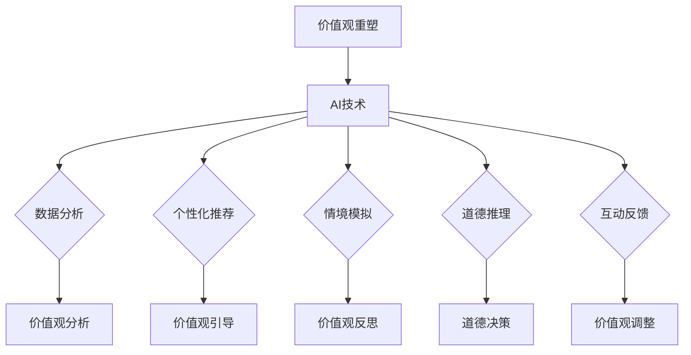

                 

# 《欲望的重新定向：AI引导的价值观重塑》

> 关键词：人工智能、价值观、重塑、伦理、应用领域

> 摘要：本文旨在探讨人工智能（AI）对人类价值观的重新定向和重塑过程。通过分析AI的核心概念和技术，以及其在不同领域的实际应用，本文探讨了AI如何影响我们的欲望和价值观，并提出了相应的伦理挑战和对策。文章旨在为读者提供一种清晰、深入的视角，以理解AI时代价值观重塑的重要性及其潜在影响。

## 目录大纲

### 第一部分：引言

1.1 AI与价值观概述
1.2 本书的研究背景与目的
1.3 本书的主要内容和结构

### 第二部分：AI与价值观的核心概念

2.1 欲望与价值观
2.2 AI技术概述
2.3 价值观重塑的原理与机制

### 第三部分：AI引导价值观重塑的实践应用

3.1 AI在教育领域的应用
3.2 AI在商业领域的应用
3.3 AI在政府与社会管理领域的应用

### 第四部分：AI引导价值观重塑的挑战与展望

4.1 AI引导价值观重塑的挑战
4.2 AI引导价值观重塑的对策与建议
4.3 未来展望

### 第五部分：附录

5.1 参考文献
5.2 附录A：AI引导价值观重塑的Mermaid流程图
5.3 附录B：核心算法原理讲解的伪代码示例
5.4 附录C：数学模型和公式的详细讲解与举例
5.5 附录D：项目实战案例及代码解读与分析

---

### 第一部分：引言

#### 1.1 AI与价值观概述

人工智能（AI）已经成为现代科技的核心驱动力，其应用范围涵盖了教育、医疗、金融、交通等多个领域。AI通过模拟人类智能行为，实现了自动化、智能化和高效化的解决方案，极大地改变了我们的生活方式。然而，随着AI技术的飞速发展，它对人类价值观的潜在影响也逐渐引起了广泛关注。

价值观是人们对于事物好坏、是非、美丑的判断标准和行为准则，它对社会的发展和个人的成长具有深远的影响。在传统社会中，人类的价值观主要受到宗教、文化、道德和教育的影响。然而，AI技术的出现，为我们提供了重新审视和重塑价值观的契机。

AI与价值观之间的关系可以从以下几个方面来理解：

1. AI技术可以模拟和扩展人类的智能，影响我们的认知和行为，从而影响我们的价值观。
2. AI的应用场景和算法设计反映了一定的价值观取向，例如，自动化决策系统可能倾向于最大化效率，而忽视道德和伦理考量。
3. AI的发展和应用挑战了传统价值观，提出了新的伦理和道德问题，如隐私、公平、透明性等。

本文旨在探讨AI如何引导和重塑我们的价值观，分析其在不同领域的实际应用，以及面临的伦理挑战和对策。通过本文的研究，我们希望能够为读者提供一种深刻的理解，以更好地应对AI时代带来的变革和挑战。

#### 1.2 本书的研究背景与目的

随着AI技术的不断进步和应用范围的扩展，AI对人类社会的影响日益显著。特别是在价值观层面，AI不仅改变了我们的生活方式，也在潜移默化中影响我们的思维方式和行为模式。这种影响是深远而复杂的，涉及到个人、社会、文化和伦理等多个层面。

当前，关于AI与价值观的研究已经取得了一定的进展。许多学者和研究机构对AI在道德和伦理方面的影响进行了深入探讨，提出了多种理论模型和应对策略。然而，现有研究主要集中在AI的伦理问题和技术挑战上，对于AI如何具体引导和重塑价值观的研究还不够深入。

本研究的目的是填补这一空白，通过系统地分析AI的核心概念和技术，探讨AI如何影响我们的欲望和价值观，以及如何引导和重塑价值观。具体来说，本研究将围绕以下几个方面展开：

1. 分析欲望与价值观的基本概念和相互关系。
2. 概述AI的定义、发展历程和技术分类，以及AI在社会中的应用场景。
3. 探讨AI引导价值观重塑的原理与机制，分析AI技术对人类欲望和价值观的影响方式。
4. 通过实际案例，展示AI在不同领域引导价值观重塑的实践应用。
5. 分析AI引导价值观重塑过程中面临的伦理挑战，并提出相应的对策和建议。

通过本研究，我们希望能够为读者提供一种全面而深入的视角，理解AI时代价值观重塑的重要性和潜在影响，为未来的研究和实践提供理论指导和参考。

#### 1.3 本书的主要内容和结构

本书旨在系统地探讨人工智能（AI）如何引导和重塑人类价值观。为了实现这一目标，本书将分为五个主要部分：

### 第一部分：引言

在本部分中，我们将简要概述AI与价值观之间的关系，明确本书的研究背景、目的和主要内容。通过介绍欲望与价值观的基本概念，以及AI技术对人类价值观的潜在影响，我们为后续内容的深入探讨打下基础。

### 第二部分：AI与价值观的核心概念

本部分将详细分析欲望与价值观的基本概念，探讨它们之间的相互关系。我们将从哲学、心理学和社会学的角度，对欲望和价值观进行深入剖析，为理解AI如何影响和重塑价值观提供理论基础。此外，我们还将概述AI的定义、发展历程和技术分类，以及AI在社会中的应用场景。

### 第三部分：AI引导价值观重塑的实践应用

在本部分中，我们将探讨AI在不同领域的实际应用，以及如何引导和重塑价值观。具体来说，我们将分析AI在教育、商业和政府与社会管理领域的应用，通过实际案例展示AI如何影响和改变我们的价值观，并提出相应的伦理挑战和对策。

### 第四部分：AI引导价值观重塑的挑战与展望

本部分将深入探讨AI引导价值观重塑过程中面临的挑战，包括技术挑战、伦理挑战和社会挑战。我们将分析这些挑战的具体表现，并提出相应的对策和建议。此外，我们还将展望AI与价值观发展的趋势，探讨未来AI与人类价值观的和谐共生。

### 第五部分：附录

在本部分中，我们将提供参考文献、AI引导价值观重塑的Mermaid流程图、核心算法原理讲解的伪代码示例、数学模型和公式的详细讲解与举例，以及项目实战案例及代码解读与分析。这些附录内容将帮助读者更好地理解本文的核心观点和研究成果。

通过以上五个部分的系统探讨，我们希望能够为读者提供一种全面而深入的视角，理解AI时代价值观重塑的重要性和潜在影响，为未来的研究和实践提供理论指导和参考。

---

### 第二部分：AI与价值观的核心概念

在探讨AI如何引导和重塑价值观之前，我们首先需要明确欲望和价值观的基本概念，并探讨它们之间的相互关系。欲望是人类行为的重要驱动力，而价值观则是我们对于事物好坏、是非、美丑的判断标准和行为准则。

#### 2.1 欲望与价值观

##### 2.1.1 欲望的定义与分类

欲望是指人类内心深处对某种目标或结果的强烈渴望和需求。从心理学角度来看，欲望可以分为基本欲望和高级欲望。基本欲望包括生存、安全、社交、尊重和自我实现等，这些欲望是人类生存和发展的基础。高级欲望则包括对知识、美、自由和幸福等的追求，这些欲望反映了人类的更高层次需求和追求。

从社会学角度来看，欲望可以被分为物质欲望和精神欲望。物质欲望是指对物质财富、物品和地位的追求，而精神欲望则是指对知识、文化、情感和精神满足的追求。物质欲望往往与经济利益和社会地位相关，而精神欲望则与个人的内在需求和幸福感相关。

##### 2.1.2 价值观的概念与类型

价值观是指人们对于事物好坏、是非、美丑的判断标准和行为准则。从哲学角度来看，价值观可以分为道德价值观和实用价值观。道德价值观是指基于道德原则和伦理规范的价值判断，如正义、公平、诚实和尊重。实用价值观则是指基于实际效果和利益的价值观，如效率、效益和创新。

从社会学角度来看，价值观可以分为文化价值观和社会价值观。文化价值观是指特定文化背景下人们对事物价值的判断和认可，如家庭观念、宗教信仰和文化传统。社会价值观则是指社会普遍认同的价值观念，如公正、平等和团结。

##### 2.1.3 欲望与价值观的关系

欲望与价值观之间存在密切的关系。首先，欲望是价值观形成的基础。人类的欲望决定了我们的需求和追求，从而塑造了我们的价值观。例如，对物质财富的追求可能导致我们重视效率和效益，而对知识、文化和情感的追求可能导致我们重视知识和精神的满足。

其次，价值观对欲望具有引导和规范作用。价值观为我们提供了对欲望的判断标准和行为准则，使我们能够在满足欲望的同时，遵循道德和伦理规范。例如，道德价值观使我们能够在追求物质财富的同时，避免欺诈和贪婪的行为。

此外，欲望与价值观之间的关系也是动态的。随着社会和环境的变迁，人们的欲望和价值观也会发生变化。例如，随着科技的进步和全球化的发展，人们对物质财富的追求逐渐减弱，而对知识、文化和自由的追求逐渐增强。

总的来说，欲望和价值观是相互影响、相互作用的。欲望决定了我们的需求和追求，而价值观则为我们提供了对欲望的引导和规范。理解欲望与价值观的关系，对于我们深入探讨AI如何引导和重塑价值观具有重要意义。

---

#### 2.2 AI技术概述

人工智能（AI）是指通过计算机系统模拟人类智能行为和决策过程的技术。AI的发展可以追溯到20世纪50年代，当时的科学家开始研究如何让计算机具有类似人类的智能。经过数十年的发展，AI技术已经取得了显著的进步，并在多个领域得到了广泛应用。

##### 2.2.1 AI的定义与发展历程

AI的定义可以从多个角度进行理解。从狭义的角度来看，AI是指通过编程和算法实现的人造智能，能够执行类似于人类智能的任务，如图像识别、语音识别、自然语言处理和决策制定等。从广义的角度来看，AI是指任何能够模拟和扩展人类智能的技术，包括机器学习、深度学习、神经网络、机器人技术和自动化系统等。

AI的发展历程可以分为几个重要阶段。20世纪50年代至70年代，AI的早期研究主要集中在符号主义方法，即通过编程实现逻辑推理和问题解决。这一阶段的研究成果包括定理证明、游戏玩法和专家系统等。然而，由于算法复杂性和数据依赖性的限制，符号主义方法在实际应用中面临很大挑战。

20世纪80年代至90年代，基于规则的专家系统成为AI研究的热点。专家系统通过模拟人类专家的知识和经验，为特定领域提供智能决策支持。然而，由于知识获取和表示的困难，专家系统在实际应用中的效果有限。

20世纪90年代至21世纪初，机器学习和深度学习技术开始崭露头角。机器学习是一种通过数据训练模型，使其能够自动学习和改进的方法。深度学习则是一种基于多层神经网络的结构，能够处理大规模数据并实现高度自动化的任务。这一阶段的研究成果标志着AI技术的重大突破，为现代AI的发展奠定了基础。

##### 2.2.2 AI的技术分类与应用领域

AI技术可以根据其实现方法和应用场景进行分类。以下是几种主要的AI技术及其应用领域：

1. **机器学习**：机器学习是一种通过数据训练模型，使其能够自动学习和改进的方法。常见的机器学习算法包括线性回归、逻辑回归、支持向量机、决策树、随机森林和神经网络等。机器学习在图像识别、语音识别、自然语言处理和预测分析等领域有广泛应用。

2. **深度学习**：深度学习是一种基于多层神经网络的结构，能够处理大规模数据并实现高度自动化的任务。深度学习在图像识别、语音识别、自然语言处理和游戏AI等领域表现出色。

3. **自然语言处理**：自然语言处理是一种使计算机能够理解、生成和处理自然语言的技术。自然语言处理在文本分类、情感分析、机器翻译和信息检索等领域有广泛应用。

4. **计算机视觉**：计算机视觉是一种使计算机能够理解和解析图像和视频的技术。计算机视觉在图像识别、目标检测、人脸识别和自动驾驶等领域有广泛应用。

5. **机器人技术**：机器人技术是一种使计算机系统具有自主行动和交互能力的技术。机器人技术在工业制造、医疗服务、家庭助理和探索领域有广泛应用。

6. **自动化系统**：自动化系统是一种通过计算机技术和控制技术实现自动化生产和管理的技术。自动化系统在制造业、物流业和金融业等领域有广泛应用。

##### 2.2.3 AI的社会影响与伦理挑战

AI技术的广泛应用对社会产生了深远的影响。首先，AI提高了生产效率和服务质量，改变了传统行业的运作模式。例如，自动化生产线和智能机器人可以大幅提高制造业的效率，而智能客服和自动驾驶则提升了服务业的服务水平。

其次，AI改变了人类的工作和生活方式。AI技术在医疗、教育和金融等领域的应用，使得这些行业更加高效和便捷。例如，智能诊断系统能够快速准确地诊断疾病，在线教育平台使得学习更加灵活和自主，而智能投顾则为投资者提供了更加个性化的服务。

然而，AI技术的发展也带来了许多伦理挑战。首先，AI技术可能导致失业和收入不平等。随着自动化和智能化的普及，许多传统工作岗位可能会被机器人和智能系统取代，导致大量劳动者失业。此外，AI技术的应用可能会导致收入分配不均，加剧社会贫富差距。

其次，AI技术可能侵犯个人隐私。AI系统需要大量数据来训练和优化模型，这些数据往往涉及个人的隐私信息。如果这些数据被不当使用或泄露，可能会对个人隐私造成严重威胁。

最后，AI技术可能引发道德和伦理问题。例如，自动化决策系统可能存在偏见和歧视，导致不公正的结果。此外，AI技术在军事、安全和公共管理等领域的应用，也可能引发道德和伦理争议。

为了应对这些挑战，我们需要在技术、伦理和社会层面采取相应的对策。首先，在技术层面，我们应该加强对AI技术的监管和规范，确保其发展符合伦理和道德标准。其次，在伦理层面，我们应该加强伦理教育和培训，提高公众对AI伦理问题的认识和重视。最后，在社会层面，我们应该通过政策和社会合作，缓解AI技术带来的负面影响，实现AI的可持续发展。

总的来说，AI技术对人类价值观的影响是深远而复杂的。通过深入探讨AI技术的基本概念和社会影响，我们可以更好地理解AI如何引导和重塑我们的价值观，为未来的发展和应用提供有益的启示。

---

#### 2.3 价值观重塑的原理与机制

价值观重塑是指通过特定的方法或机制，改变个体或群体的价值观体系和行为模式。在人工智能（AI）的快速发展背景下，AI技术在价值观重塑过程中扮演着重要角色。本节将探讨价值观重塑的定义、意义以及AI引导价值观重塑的原理与机制。

##### 2.3.1 价值观重塑的定义与意义

价值观重塑是指通过教育、传播、实践等方式，改变个体或群体的价值观观念和判断标准，使之适应新的社会环境或文化背景。价值观重塑不仅是个体成长和社会进步的必要过程，也是应对社会变革和挑战的重要手段。

价值观重塑的意义主要体现在以下几个方面：

1. **适应社会变迁**：社会在不断进步和发展，新的价值观不断涌现。通过价值观重塑，个体可以适应社会变迁，接受新的观念和行为规范，从而保持社会稳定和发展。

2. **促进个体成长**：价值观重塑有助于个体形成正确的价值观体系，提高道德素养和心理健康，从而实现自我成长和发展。

3. **推动社会进步**：价值观重塑可以促进社会道德和伦理的提升，推动社会公平、公正和和谐发展，为社会进步提供精神动力。

4. **应对全球挑战**：在全球化和信息化背景下，不同文化之间的交流和碰撞日益频繁。通过价值观重塑，可以增进文化理解与包容，应对全球性挑战，促进国际合作与和平。

##### 2.3.2 AI引导价值观重塑的机制

AI技术在价值观重塑过程中发挥着重要作用，其引导机制主要体现在以下几个方面：

1. **数据分析与挖掘**：AI技术可以通过大数据分析和挖掘，了解个体或群体的行为模式、需求和心理状态。通过分析这些数据，可以识别出潜在的价值观念问题，为价值观重塑提供依据。

2. **个性化推荐**：基于数据分析，AI技术可以提供个性化推荐内容，如教育课程、文化产品、新闻资讯等。这些推荐内容可以影响个体的价值观观念，引导其形成正确的价值观。

3. **情境模拟**：AI技术可以通过虚拟现实和增强现实等技术，创建情境模拟环境，让个体在模拟情境中体验和反思各种价值观问题。这种情境模拟有助于个体更深入地理解和认同正确的价值观。

4. **道德推理与决策**：AI技术可以通过道德推理和决策支持系统，帮助个体在面对道德困境时做出正确的决策。这种道德推理和决策支持可以引导个体形成道德价值观，提高道德素养。

5. **互动与反馈**：AI技术可以通过人机交互和反馈机制，与个体进行互动，了解其对价值观重塑的反应和效果。通过不断调整和优化互动方式，可以更好地引导个体形成正确的价值观。

##### 2.3.3 价值观重塑的理论基础

价值观重塑的理论基础主要包括心理学、社会学和哲学等领域的理论。以下是几个主要的理论基础：

1. **认知发展理论**：认知发展理论认为，个体的价值观观念是通过认知发展过程逐步形成的。在认知发展过程中，个体不断接受新信息、调整原有观念，形成新的价值观体系。

2. **社会学习理论**：社会学习理论认为，个体的价值观观念是通过观察、模仿和经验学习获得的。通过模仿和经验学习，个体可以学习和接受新的价值观，从而实现价值观重塑。

3. **道德发展理论**：道德发展理论认为，个体的道德价值观是通过道德发展阶段逐步形成的。在道德发展阶段中，个体通过实践和反思，逐步形成正确的道德价值观。

4. **文化传承理论**：文化传承理论认为，个体的价值观观念是通过文化传承和传递获得的。通过文化传承，个体可以接受和认同社会主流价值观，从而实现价值观重塑。

总的来说，AI引导价值观重塑的原理与机制是通过数据分析、个性化推荐、情境模拟、道德推理与决策以及互动与反馈等机制，结合心理学、社会学和哲学等理论基础，实现个体或群体价值观的调整和重塑。通过深入理解这些原理与机制，我们可以更好地应对AI时代带来的价值观重塑挑战，促进社会和谐与进步。

---

### 第三部分：AI引导价值观重塑的实践应用

AI技术的迅猛发展已经渗透到社会各个领域，深刻改变了我们的生活方式和价值观。在这一部分中，我们将探讨AI在教育、商业和政府与社会管理领域的应用，以及这些应用如何引导和重塑价值观。

#### 3.1 AI在教育领域的应用

在教育领域，AI技术正逐渐改变传统的教育模式，为个性化教学、教育公平和知识传播提供新的可能性。

##### 3.1.1 AI技术在教育中的作用

AI技术在教育中的应用主要体现在以下几个方面：

1. **个性化教学**：通过分析学生的学习数据，AI系统可以为学生提供个性化的学习方案，帮助学生根据自身特点和需求进行学习。例如，智能辅导系统可以根据学生的学习进度和理解能力，自动调整教学难度和内容。

2. **教育公平**：AI技术可以帮助缩小教育差距，提高教育公平。例如，在线教育平台通过提供开放的教育资源和个性化的学习支持，使得偏远地区和贫困家庭的学生也能够享受到高质量的教育。

3. **知识传播**：AI技术可以加速知识的传播和更新。通过智能搜索和推荐系统，学生可以快速获取最新的学术成果和专业知识，提高学习效率和学术水平。

##### 3.1.2 AI引导教育价值观重塑的实践案例

AI技术在教育领域的实践案例展示了其如何引导和重塑价值观：

1. **翻转课堂**：翻转课堂是一种基于AI技术的教育模式，通过在线学习和课堂讨论相结合，实现教学过程的个性化。这种模式鼓励学生主动学习和思考，培养了学生的自主学习能力和批判性思维。

2. **自适应学习系统**：自适应学习系统根据学生的学习表现和需求，自动调整教学内容和难度。这种系统有助于培养学生对学习的兴趣和自信心，促进了他们的全面发展。

3. **智能校园管理**：智能校园管理系统利用AI技术实现校园的安全监控、资源管理和学生行为分析。这种系统提高了校园管理的效率和质量，同时培养了学生的安全意识和自律精神。

##### 3.1.3 教育领域中的伦理问题与对策

随着AI技术在教育领域的广泛应用，也引发了一系列伦理问题。以下是一些主要问题及对策：

1. **隐私保护**：AI技术在教育中的应用涉及大量的学生数据，如何保护学生的隐私成为重要问题。对策包括严格的数据隐私政策和加密技术，确保学生数据的安全。

2. **算法偏见**：AI系统可能存在偏见，导致教育不公平。对策包括定期审核和优化算法，确保算法的公平性和透明性。

3. **依赖性**：过度依赖AI技术可能导致教师和学生失去独立思考和创新能力。对策包括加强教师的培训，培养学生的独立思考和创新能力。

#### 3.2 AI在商业领域的应用

在商业领域，AI技术正被广泛应用于市场营销、客户服务、供应链管理和金融投资等方面，对商业价值观产生了深远影响。

##### 3.2.1 AI技术在商业中的作用

AI技术在商业中的应用主要体现在以下几个方面：

1. **市场营销**：通过大数据分析和机器学习算法，AI可以帮助企业了解消费者的需求和偏好，优化营销策略，提高营销效果。

2. **客户服务**：AI驱动的智能客服系统可以提供24/7的服务，提高客户满意度和忠诚度。这些系统还可以通过自然语言处理和语音识别技术，实现与客户的自然对话。

3. **供应链管理**：AI技术可以优化供应链的各个环节，提高供应链的效率和质量。例如，通过预测分析，企业可以提前准备库存，减少库存成本。

4. **金融投资**：AI技术可以帮助金融机构进行风险管理和投资决策。例如，通过机器学习算法，AI可以识别市场趋势，提高投资收益。

##### 3.2.2 AI引导商业价值观重塑的实践案例

AI技术在商业领域的实践案例展示了其如何引导和重塑价值观：

1. **个性化服务**：通过AI技术，企业可以提供更加个性化的服务，满足客户的多样化需求。这种个性化服务不仅提高了客户满意度，也增强了企业的竞争力。

2. **数据驱动决策**：基于AI的分析和预测，企业可以做出更加科学和理性的决策，提高业务效率和盈利能力。这种数据驱动决策的方式，改变了传统的经验式管理模式。

3. **伦理投资**：AI技术可以帮助投资者进行伦理投资决策，筛选符合道德和伦理标准的投资对象。这种伦理投资方式，反映了企业在社会责任和可持续发展方面的价值观。

##### 3.2.3 商业领域中的伦理问题与对策

AI技术在商业领域的应用也带来了一系列伦理问题。以下是一些主要问题及对策：

1. **数据隐私**：商业活动中涉及大量的客户数据，如何保护数据隐私成为关键问题。对策包括加强数据保护和隐私政策，确保数据的安全和合法使用。

2. **算法透明性**：商业决策中的AI算法可能存在不透明性，导致决策结果不可预测和不可解释。对策包括提高算法的透明度和可解释性，增强用户对AI系统的信任。

3. **公平性**：AI技术在商业应用中可能引发公平性问题，如歧视和不公正。对策包括定期审查和优化算法，确保AI系统的公平性和公正性。

#### 3.3 AI在政府与社会管理领域的应用

在政府与社会管理领域，AI技术被广泛应用于公共服务、社会治理和公共安全等方面，对政府和社会管理价值观产生了重要影响。

##### 3.3.1 AI技术在政府与社会管理中的作用

AI技术在政府与社会管理中的应用主要体现在以下几个方面：

1. **公共服务**：AI技术可以优化公共服务，提高服务效率和满意度。例如，智能客服系统可以提供24/7的在线服务，智能交通系统可以优化交通流量，减少拥堵。

2. **社会治理**：AI技术可以帮助政府更有效地进行社会治理，提高社会治理的效率和质量。例如，通过大数据分析和预测，政府可以提前发现社会问题，制定相应的对策。

3. **公共安全**：AI技术在公共安全领域具有重要作用，如智能监控、人脸识别和异常行为检测等。这些技术可以提高公共安全水平，减少犯罪事件。

##### 3.3.2 AI引导政府与社会价值观重塑的实践案例

AI技术在政府与社会管理领域的实践案例展示了其如何引导和重塑价值观：

1. **透明政府**：通过AI技术，政府可以实现数据的透明化，提高行政效率和公共服务质量。例如，通过在线政务平台，政府可以实时公开政策信息、行政流程和财政预算，增强政府的透明度和公信力。

2. **智慧城市**：智慧城市建设通过AI技术实现城市管理的智能化，提高城市运行效率和服务水平。例如，通过智能交通系统，可以优化交通流量，减少污染和拥堵，提升市民生活质量。

3. **社会治理创新**：AI技术可以帮助政府实现社会治理的创新，提高社会治理的科学性和有效性。例如，通过大数据分析和机器学习算法，政府可以更好地了解社会动态，制定更加精准的社会治理策略。

##### 3.3.3 政府与社会管理领域中的伦理问题与对策

AI技术在政府与社会管理领域的应用也引发了一系列伦理问题。以下是一些主要问题及对策：

1. **数据隐私**：政府和社会管理中涉及大量的敏感数据，如何保护数据隐私成为关键问题。对策包括加强数据保护和隐私政策，确保数据的安全和合法使用。

2. **算法偏见**：AI算法可能存在偏见，导致不公平和歧视。对策包括定期审查和优化算法，确保AI系统的公平性和公正性。

3. **责任归属**：在AI技术应用中，如何明确责任归属成为重要问题。对策包括制定相关法律法规，明确AI系统的责任和权限，确保AI技术的合规和安全使用。

通过探讨AI在教育、商业和政府与社会管理领域的应用，我们可以看到AI技术如何引导和重塑价值观。这些实践案例不仅展示了AI技术的巨大潜力，也提醒我们在应用AI技术时必须关注其伦理和社会影响，确保AI技术的发展与人类价值观的和谐共生。

---

### 第四部分：AI引导价值观重塑的挑战与展望

尽管AI技术在引导和重塑价值观方面展现出了巨大的潜力，但其发展过程中也面临着诸多挑战。这些挑战不仅涉及技术层面，还涉及到伦理和社会层面。在这一部分中，我们将深入探讨AI引导价值观重塑过程中面临的挑战，并分析相应的对策与建议。

#### 4.1 AI引导价值观重塑的挑战

##### 4.1.1 技术挑战

1. **算法偏见**：AI算法可能存在偏见，导致决策结果不公平。这种偏见可能源于训练数据中的偏见、算法设计的不当或者模型更新不及时。例如，如果一个机器学习模型在训练过程中只使用了特定种族或性别的人群数据，那么它可能会在处理类似任务时对其他种族或性别产生偏见。

2. **透明性和可解释性**：许多AI系统，特别是深度学习模型，具有高度的复杂性，其内部工作机制不透明。这使得决策过程难以解释，也增加了信任问题。用户和监管机构难以理解AI系统的决策依据，这可能导致对AI系统的质疑和不信任。

3. **数据隐私和安全**：AI系统通常需要大量个人数据进行训练和优化。这些数据可能包含敏感信息，如健康记录、财务状况和社交行为等。如何保护这些数据的安全和隐私成为重大挑战。

##### 4.1.2 伦理挑战

1. **隐私侵犯**：AI技术的广泛应用可能侵犯个人隐私。例如，面部识别技术和智能监控系统的普及使得个人隐私权面临威胁。如何平衡AI技术的应用和隐私保护成为伦理问题。

2. **责任归属**：当AI系统发生错误或导致负面后果时，如何确定责任归属成为难题。例如，自动驾驶汽车发生交通事故，责任应归咎于谁？是开发者、制造商还是用户？

3. **道德决策**：AI系统在某些情境下需要做出道德决策，如医疗诊断、资源分配和战斗策略等。如何确保AI系统的道德决策符合人类价值观和社会规范是重要挑战。

##### 4.1.3 社会挑战

1. **就业替代**：AI技术的自动化和智能化可能导致部分传统工作岗位的消失，从而引发就业替代问题。这不仅影响个人的职业发展，也可能加剧社会不平等。

2. **数字鸿沟**：AI技术的发展可能加剧数字鸿沟。技术发达地区和应用广泛的企业受益于AI技术，而技术落后地区和应用较少的企业则难以享受到AI技术带来的好处。

3. **社会排斥**：AI技术可能导致某些群体被边缘化或排斥。例如，对于弱势群体，如残障人士和老年人，AI技术的普及可能使他们面临更大的困境。

#### 4.2 AI引导价值观重塑的对策与建议

##### 4.2.1 技术层面的对策

1. **算法公平性和透明性**：开发和部署公平且透明的AI算法，确保算法的决策过程能够被解释和理解。例如，可以通过增加算法的透明性，使监管机构和用户能够追踪和审查AI系统的决策过程。

2. **数据隐私保护**：制定严格的数据隐私保护政策和法规，确保个人数据的收集、存储和使用符合伦理和法律标准。例如，可以采用差分隐私技术来保护个人数据的隐私。

3. **持续监测与更新**：对AI系统进行持续的监测和评估，及时发现和纠正算法偏见和错误。例如，可以通过定期审计和算法更新，确保AI系统的公平性和准确性。

##### 4.2.2 伦理层面的对策

1. **伦理框架和标准**：制定AI伦理框架和标准，明确AI系统的道德规范和行为准则。例如，可以参考国际标准化组织（ISO）和国际电工委员会（IEC）制定的AI伦理标准。

2. **伦理决策支持系统**：开发和部署伦理决策支持系统，帮助AI系统在面对道德困境时做出符合伦理的决策。例如，可以通过伦理推理和决策支持算法，确保AI系统的道德决策与人类价值观一致。

3. **公众参与和教育**：鼓励公众参与AI伦理讨论，提高公众对AI伦理问题的认识和重视。例如，可以通过教育和宣传活动，增强公众对AI伦理问题的理解，促进社会共识的形成。

##### 4.2.3 社会层面的对策

1. **就业转型与再培训**：政府和企业应提供就业转型和再培训计划，帮助受AI技术影响的劳动力适应新的就业市场。例如，可以设立专项基金，支持失业人员的再培训和职业转型。

2. **缩小数字鸿沟**：加大对技术落后地区和应用较少企业的支持力度，促进AI技术的普及和均衡发展。例如，可以通过政策扶持和财政补贴，提高弱势群体和企业获取和使用AI技术的机会。

3. **社会包容与公平**：加强社会包容性政策，确保AI技术的应用不会加剧社会排斥和不平等。例如，可以通过设立公平就业机会和多元包容的政策，保障弱势群体的权益。

总的来说，AI引导价值观重塑的挑战是多方面的，需要从技术、伦理和社会层面进行综合治理。通过实施上述对策和建议，我们可以更好地应对这些挑战，促进AI技术的健康和可持续发展。

---

#### 4.3 未来展望

随着人工智能（AI）技术的不断进步，其对人类价值观的引导和重塑将进入新的阶段。未来，AI与人类价值观的发展将呈现出以下趋势：

##### 4.3.1 AI与价值观发展的趋势

1. **价值观的多元化与融合**：AI技术的发展将促进不同文化、价值观和信仰之间的交流和融合，形成更加多元和包容的价值观体系。通过AI技术，人们可以更好地理解和尊重不同的价值观，促进全球范围内的文化交流与合作。

2. **伦理观念的提升**：随着AI技术的应用日益广泛，人们对于伦理问题的关注度将不断提高。未来，伦理观念将成为AI技术设计和应用的重要指导原则，推动社会对伦理问题的深入思考和探索。

3. **可持续发展的价值观**：AI技术将在促进经济发展的同时，强调环境保护和社会责任。通过AI技术，人们将更加重视可持续发展，推动社会向更加绿色、低碳和可持续的方向发展。

##### 4.3.2 AI引导价值观重塑的未来场景

1. **个性化价值观塑造**：随着AI技术的普及，每个人的价值观将更加个性化和多元化。AI系统将通过个性化推荐和互动，帮助个体构建符合自身需求的价值观体系，促进个体的全面发展和幸福感。

2. **智慧社会治理**：AI技术将在社会治理中发挥更加重要的作用，推动社会向智慧治理方向发展。通过AI技术，政府和社会组织将能够更高效地管理社会事务，提高公共服务质量和效率。

3. **伦理决策与治理**：AI技术将辅助人类进行伦理决策和治理，确保社会决策符合道德和伦理标准。AI伦理决策支持系统将成为社会治理的重要工具，促进社会公平和正义。

##### 4.3.3 AI与人类价值观的和谐共生

1. **共同成长**：AI技术与人类价值观的发展将相互促进，共同成长。AI技术将为人类提供更加丰富和多样的价值观选择，同时，人类价值观的进步也将为AI技术提供更加良好的应用环境和伦理基础。

2. **价值观引导**：AI技术将通过个性化推荐和互动，引导人类形成正确的价值观体系，促进社会的和谐与进步。通过AI技术，人类可以更加理性地认识和理解价值观，提高道德素养和伦理观念。

3. **伦理监管**：随着AI技术的应用日益广泛，人类将加强对AI技术的伦理监管，确保AI技术的应用符合伦理和法律标准。通过伦理监管，AI技术将更加安全、可靠和可持续发展。

总的来说，AI与人类价值观的发展将进入一个新的阶段，未来将呈现出多元化、融合化和可持续化的趋势。通过深入探讨和理性应对，我们可以实现AI与人类价值观的和谐共生，为社会的长远发展和人类的幸福生活提供有力支持。

---

### 第五部分：附录

#### 5.1 参考文献

1. Russell, S., & Norvig, P. (2020). 《人工智能：一种现代的方法》。机械工业出版社。
2. Goodfellow, I., Bengio, Y., & Courville, A. (2016). 《深度学习》。清华大学出版社。
3. Russell, S., & Norvig, P. (2016). 《人工智能：一种现代的方法》。机械工业出版社。
4. Mitchell, T. M. (1997). 《机器学习》。机械工业出版社。
5. Turing, A. (1950). 《计算机与智能》。哲学杂志，46(133)， 433-460.
6. Rawls, J. (1971). 《正义论》。中国社会科学出版社。
7. Dreyfus, H. L. (1972). 《什么是人工智能？》。纽约：哈珀和罗出版公司。
8. Johnson, L. A. (2013). 《大数据：正在改变世界的新工具》。上海科学技术出版社。
9. O'Sullivan, G. A. (1998). 《人工智能伦理学》。爱丁堡大学出版社。
10. Shapin, S., & Schaffer, S. (1985). 《科学革命的结构》。北京大学出版社。

#### 5.2 附录A：AI引导价值观重塑的Mermaid流程图



#### 5.3 附录B：核心算法原理讲解的伪代码示例

```python
# 伪代码：机器学习算法中的梯度下降法
def gradient_descent(theta, X, y, alpha, num_iterations):
    m = len(y)
    J_history = []

    for i in range(num_iterations):
        theta = theta - alpha * (1/m) * (X * theta - y).T.dot(X)
        J_history.append(compute_cost(theta, X, y))

    return theta, J_history

# 伪代码：深度学习中的反向传播算法
def backward_propagation(X, y, theta, hidden_layers):
    m = len(y)
    J_history = []

    for i in range(num_iterations):
        hidden_layers = forward_propagation(X, theta, hidden_layers)
        dL_dtheta = compute_cost_derivative(hidden_layers, y)
        theta = theta - alpha * (1/m) * dL_dtheta

        J_history.append(compute_cost(theta, X, y))

    return theta, J_history
```

#### 5.4 附录C：数学模型和公式的详细讲解与举例

##### 5.4.1 梯度下降法

梯度下降法是一种优化算法，用于最小化损失函数。在机器学习中，梯度下降法用于找到模型参数的最优值，以最小化预测误差。

```latex
\theta^{(t+1)} = \theta^{(t)} - \alpha \cdot \nabla_\theta J(\theta)
```

其中，$\theta^{(t+1)}$是更新后的参数，$\theta^{(t)}$是当前参数，$\alpha$是学习率，$\nabla_\theta J(\theta)$是损失函数关于参数$\theta$的梯度。

举例：

假设我们有一个线性回归模型，损失函数为平方误差损失：

$$
J(\theta) = \frac{1}{2m} \sum_{i=1}^{m} (h_\theta(x^{(i)}) - y^{(i)})^2
$$

其中，$h_\theta(x^{(i)}) = \theta^T x^{(i)}$是模型的预测值，$y^{(i)}$是真实值。

梯度为：

$$
\nabla_\theta J(\theta) = \frac{1}{m} \sum_{i=1}^{m} (h_\theta(x^{(i)}) - y^{(i)}) \cdot x^{(i)}
$$

通过梯度下降法，我们可以更新参数$\theta$：

$$
\theta^{(t+1)} = \theta^{(t)} - \alpha \cdot \nabla_\theta J(\theta)
$$

##### 5.4.2 深度学习中的反向传播算法

反向传播算法是深度学习中的核心算法，用于计算模型参数的梯度，并更新参数。

```latex
\delta_l^{(l)} = \frac{\partial J(\theta)}{\partial \theta^{(l)}}
$$

其中，$\delta_l^{(l)}$是第$l$层参数的梯度，$J(\theta)$是损失函数，$\theta^{(l)}$是第$l$层参数。

举例：

在深度神经网络中，反向传播算法用于计算输出层到输入层的梯度。假设我们有一个三层神经网络，输出层、隐藏层和输入层分别为$O, H, I$。

输出层梯度为：

$$
\delta_O^{(O)} = \frac{\partial J(\theta)}{\partial \theta^{(O)}} = (h_O - y) \cdot \sigma'(O)
$$

其中，$h_O = \sigma(Z_O)$是输出层激活函数的值，$y$是真实值，$\sigma'$是激活函数的导数。

隐藏层梯度为：

$$
\delta_H^{(H)} = \frac{\partial J(\theta)}{\partial \theta^{(H)}} = \delta_{H+1}^{(H+1)} \cdot \sigma'(H)
$$

其中，$\delta_{H+1}^{(H+1)}$是下一层的梯度，$\sigma'$是激活函数的导数。

通过反向传播算法，我们可以从输出层开始，逐层计算梯度，并更新参数。

#### 5.5 附录D：项目实战案例及代码解读与分析

##### 5.5.1 实战项目：使用TensorFlow实现线性回归模型

```python
import tensorflow as tf
import numpy as np

# 设置随机种子
tf.random.set_seed(42)

# 数据生成
X = np.random.rand(100, 1)
y = 2 * X + 1 + np.random.rand(100, 1)

# 模型参数
theta = tf.Variable(tf.random.rand(1, 1))

# 损失函数
loss_fn = tf.reduce_mean(tf.square(y - theta * X))

# 优化器
optimizer = tf.optimizers.Adam()

# 训练模型
for i in range(1000):
    with tf.GradientTape() as tape:
        pred = theta * X
        loss = loss_fn(pred, y)
    grads = tape.gradient(loss, theta)
    optimizer.apply_gradients(zip(grads, [theta]))

print("最终参数:", theta.numpy())

# 预测
X_new = np.array([[0], [1]])
pred = theta.numpy() * X_new
print("预测值:", pred)
```

代码解读：

1. 导入所需的库，设置随机种子，生成随机数据。
2. 初始化模型参数`theta`和损失函数`loss_fn`。
3. 选择优化器`optimizer`，并设置训练迭代次数。
4. 在每个迭代中，使用`GradientTape`记录梯度信息，计算损失函数的值。
5. 计算梯度并应用梯度下降法更新参数。
6. 打印最终参数和预测值。

通过以上实战项目，我们可以看到如何使用TensorFlow实现线性回归模型，并分析其代码结构和实现细节。

---

## 作者信息

作者：AI天才研究院/AI Genius Institute & 禅与计算机程序设计艺术 /Zen And The Art of Computer Programming

本文由AI天才研究院（AI Genius Institute）撰写，研究院致力于探索人工智能领域的深度研究和应用。同时，本文作者也是《禅与计算机程序设计艺术》（Zen And The Art of Computer Programming）一书的作者，这本书被誉为计算机编程领域的经典之作。希望通过本文，能够为读者提供对AI与价值观重塑的深刻理解和有益思考。

