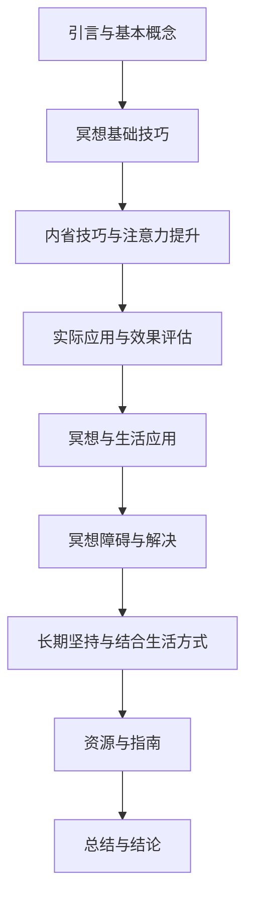

                 

## 第1章：引言与基本概念

### 1.1 什么是注意力管理

注意力管理是指人们通过一系列策略和技术来优化注意力的分配和使用，以提高效率和生产力。它涉及到如何集中注意力、提高专注力、减少干扰以及优化认知资源的使用。注意力管理的重要性在于，它不仅能够帮助我们更好地完成任务，还能够提高生活质量和工作满意度。

首先，注意力管理能够提高工作效率。在繁忙的工作环境中，人们往往需要同时处理多项任务，而良好的注意力管理技巧能够帮助人们更好地分配注意力，从而提高工作效率和生产力。例如，通过采用“番茄工作法”，人们可以将工作划分为25分钟的专注时段，每段专注后休息5分钟，这样有助于提高专注度和减少疲劳。

其次，注意力管理对于身心健康也非常重要。长期的精神压力和过度的工作负担可能导致焦虑、抑郁等心理问题。通过注意力管理，人们可以更好地控制自己的情绪，减轻压力，提高心理健康水平。例如，通过冥想和呼吸练习，人们可以培养内心的平静和专注力，从而更好地应对生活中的各种挑战。

最后，注意力管理也是实现自我成长和提升的关键。通过自我观察和反思，人们可以更清晰地认识到自己的思维模式和行为习惯，从而找到改进的方法。例如，通过内省，人们可以了解自己为何会分心，如何调整注意力，以及如何更好地管理时间和资源。

### 1.2 冥想与注意力管理的关系

冥想是一种古老而有效的注意力管理技术，它通过训练个体的专注力和自我观察能力，帮助人们更好地控制和管理注意力。冥想与注意力管理之间有着密切的联系，它们共同作用于个体的心理和生理层面，从而提高注意力的质量和效率。

首先，冥想通过培养专注力来增强注意力管理。在冥想过程中，个体需要将注意力集中在特定的对象上，如呼吸、声音或者念头。这种集中注意力的练习有助于提高个体的专注力，使其在日常生活中能够更有效地聚焦于重要的任务和目标。通过长时间的冥想练习，个体的专注力会逐渐增强，从而提高注意力的稳定性。

其次，冥想有助于减少干扰和分心。在现代社会中，人们常常受到各种外界刺激和内部思维活动的干扰，这会严重影响注意力的集中和质量。冥想通过训练个体的自我观察和内省能力，帮助人们识别和消除这些干扰因素。例如，当个体的注意力被干扰时，通过冥想练习，他们可以迅速地将注意力重新集中在冥想对象上，从而减少分心。

此外，冥想还能够提高个体的情绪调节能力。情绪波动往往会导致注意力分散和效率下降。通过冥想，个体可以学会更好地管理情绪，减少焦虑和压力。这种情绪调节能力有助于提高注意力的质量和稳定性，使个体能够更专注地完成任务。

### 1.3 内省的概念与实践

内省是指个体通过自我观察和反思来认识和了解自己的内在心理状态和思维过程。内省在注意力管理中扮演着重要角色，因为它有助于个体更清晰地认识到自己的注意力模式和行为习惯，从而采取有效的策略来提高专注力和效率。

首先，内省能够帮助个体识别注意力分散的原因。在日常生活中，人们常常因为外部干扰或者内在情绪波动而分心。通过内省，个体可以深入分析这些干扰因素，了解它们是如何影响注意力的集中和分配的。例如，一个人可能会发现，当感到焦虑时，他的注意力更容易被外界刺激所吸引，导致任务无法顺利进行。

其次，内省有助于个体制定和调整注意力管理策略。通过内省，个体可以认识到自己在不同情境下的注意力模式，从而有针对性地制定注意力管理策略。例如，一个经常在工作中分心的个体可以通过内省发现，他在面对复杂任务时更容易分心，于是他可以采取分阶段完成任务或者设定具体目标来提高专注力。

最后，内省还能够促进个体的自我成长和提升。通过内省，个体可以深入探索自己的思维模式和行为习惯，从而找到改进的方法。例如，通过内省，一个人可能会发现自己在面对困难时容易放弃，于是他可以开始练习坚持和毅力，从而提高自己的应对能力。

### 小结

本章介绍了注意力管理的基本概念、冥想与注意力管理的关系以及内省在注意力管理中的应用。注意力管理不仅能够提高工作效率和身心健康，还能够促进个体的自我成长。冥想和内省作为有效的注意力管理技术，通过培养专注力和自我观察能力，帮助个体更好地控制和管理注意力。在下一章中，我们将深入探讨冥想的基础技巧，帮助读者掌握冥想的实践方法。

## 第2章：冥想的基础技巧

冥想作为一种古老的练习方式，已经被广泛应用于提升注意力、减轻压力、改善心理健康等方面。本章将介绍几种常见的冥想技巧，包括坐姿冥想、步行冥想、声音冥想和动态冥想，以及每种技巧的具体方法和注意事项。

### 2.1 坐姿冥想

坐姿冥想是一种最常见的冥想形式，它要求冥想者在舒适的坐姿中，将注意力集中在呼吸或其他对象上。以下是坐姿冥想的具体步骤和注意事项：

#### 步骤：

1. **选择一个舒适的坐姿**：可以选择坐在垫子上，保持背部挺直，双脚平放在地面上。也可以选择坐在椅子上，但要确保背部靠在椅背上，双脚放在地面上。

2. **闭上眼睛**：轻轻闭上眼睛，开始关注呼吸。

3. **专注于呼吸**：将注意力集中在呼吸上，感受空气的进出，注意呼吸的节奏和感受。

4. **放松身体和心灵**：在冥想过程中，如果感到紧张或焦虑，可以轻轻摇晃身体，深呼吸几次，帮助放松。

5. **重复练习**：每天进行一定时间的坐姿冥想，逐渐增加冥想时间。

#### 注意事项：

1. **选择安静的环境**：避免在嘈杂的环境中冥想，以确保能够集中注意力。

2. **保持舒适**：确保身体和坐姿舒适，避免过度紧张或放松。

3. **避免进食后立即冥想**：饭后最好等待一段时间再进行冥想，以避免消化不良。

4. **不要强迫自己**：冥想过程中，如果感到困倦或疲惫，可以适当休息，不要强迫自己继续。

### 2.2 步行冥想

步行冥想是一种在行走过程中进行的冥想形式，它要求冥想者在步行时，将注意力集中在脚步的感觉和呼吸上。以下是步行冥想的具体方法和注意事项：

#### 方法：

1. **选择一个安全的行走环境**：可以选择在户外或安静的室内进行，确保行走安全。

2. **专注于脚步**：在行走过程中，将注意力集中在脚步的感觉上，感受脚与地面的接触。

3. **专注于呼吸**：同时，将注意力集中在呼吸上，感受空气的进出。

4. **保持稳定的步伐**：尽量保持步伐稳定，避免过快或过慢。

5. **重复练习**：每天进行一定时间的步行冥想，逐渐增加行走时间。

#### 注意事项：

1. **确保安全**：在行走过程中，要注意周围环境，避免跌倒或碰撞。

2. **避免饥饿或过度饱食**：在进行步行冥想前，最好保持适中的饮食状态。

3. **逐步增加时间**：初次尝试步行冥想时，可以适当缩短行走时间，逐渐增加。

### 2.3 声音冥想

声音冥想是一种通过倾听特定声音来达到冥想目的的练习形式，如白噪音、海浪声或音乐。以下是声音冥想的具体方法和注意事项：

#### 方法：

1. **选择合适的背景音乐或声音**：可以选择白噪音、自然声音或轻音乐作为背景。

2. **坐在舒适的姿势中**：可以选择坐在垫子上或椅子上，保持背部挺直。

3. **专注于声音**：在冥想过程中，将注意力集中在声音上，感受声音的起伏和变化。

4. **放松身体和心灵**：在冥想过程中，尽量放松身体和心灵，避免紧张和焦虑。

5. **重复练习**：每天进行一定时间的声音冥想，逐渐增加冥想时间。

#### 注意事项：

1. **选择安静的环境**：避免在嘈杂的环境中冥想，以确保能够集中注意力。

2. **保持舒适**：确保身体和坐姿舒适，避免过度紧张或放松。

3. **避免长时间持续同一声音**：为了避免对声音产生适应性，可以定期更换不同的背景音乐或声音。

### 2.4 动态冥想

动态冥想是一种结合身体运动和呼吸练习的冥想形式，它通过身体的活动来提高意识和专注力。以下是动态冥想的具体方法和注意事项：

#### 方法：

1. **选择一个安全的练习环境**：可以选择在室内或户外进行，确保练习安全。

2. **进行深呼吸**：在开始动态冥想之前，进行几次深呼吸，帮助放松身心。

3. **进行简单的身体运动**：如缓慢的舞蹈动作、瑜伽动作或简单的伸展运动。

4. **专注于身体感觉和呼吸**：在运动过程中，将注意力集中在身体感觉和呼吸上，感受身体的变化和呼吸的节奏。

5. **重复练习**：每天进行一定时间的动态冥想，逐渐增加运动时间和强度。

#### 注意事项：

1. **确保安全**：在动态冥想过程中，要注意身体的状况，避免过度用力或受伤。

2. **逐渐增加强度**：初次尝试动态冥想时，可以从简单的动作开始，逐渐增加运动强度。

3. **保持适当饮食**：在进行动态冥想前，最好保持适中的饮食状态，避免饥饿或过度饱食。

### 小结

本章介绍了四种常见的冥想技巧：坐姿冥想、步行冥想、声音冥想和动态冥想。每种技巧都有其独特的特点和适用场景。通过这些技巧，个体可以培养专注力和自我观察能力，从而提高注意力的质量和效率。在下一章中，我们将进一步探讨内省技巧，帮助读者更深入地了解自我管理和注意力提升的方法。

## 第3章：内省技巧

内省是指个体通过自我观察和反思来认识和了解自己的内在心理状态和思维过程。内省在注意力管理中扮演着重要角色，因为它能够帮助个体识别注意力分散的原因，调整注意力管理策略，以及促进自我成长和提升。本章将介绍几种内省技巧，包括自我观察、自我反思和情绪管理，以及这些技巧在注意力管理中的应用。

### 3.1 自我观察

自我观察是指个体有意识地关注自己的内在体验，如情绪、思维和身体感觉。通过自我观察，个体可以更好地了解自己的心理状态和行为模式，从而找到提高注意力的方法。

#### 自我观察的重要性

自我观察的重要性在于，它能够帮助个体识别注意力分散的原因。例如，一个人可能会发现，当感到焦虑或压力时，他的注意力更容易被外界刺激所干扰。通过自我观察，个体可以意识到这些情绪是如何影响注意力的集中和分配的，从而采取有效的策略来减轻干扰。

此外，自我观察还能够帮助个体建立自我认知，从而更好地管理注意力。通过长期自我观察，个体可以逐步了解自己的思维模式、行为习惯和情绪反应，从而找到改善的方法。例如，一个人可能会发现自己在面对复杂任务时容易分心，于是他可以开始练习分阶段完成任务或设定具体目标，以提高专注力。

#### 自我观察的技巧与实践

1. **设定观察目标**：在开始自我观察之前，明确观察的目标和范围。例如，可以关注自己的情绪波动、思维模式或行为习惯。

2. **记录观察结果**：在日常生活中，定期记录自己的观察结果。可以使用日记、手机应用或电子表格等工具来记录观察到的情绪、思维和行为。

3. **保持客观和诚实**：在自我观察过程中，尽量保持客观和诚实，不要因为观察到的结果而产生情绪反应或自我批判。

4. **定期回顾**：定期回顾观察结果，分析注意力分散的原因和规律。通过回顾，个体可以更好地了解自己的心理状态和行为模式，从而制定更有效的注意力管理策略。

#### 实践案例

小王是一名职场人士，他发现自己经常在工作中分心，工作效率低下。为了改善这种情况，他开始练习自我观察。他设定了观察情绪波动的目标，并在每天晚上记录自己的情绪变化。经过一段时间的观察，他发现当感到焦虑或压力时，他的注意力更容易被外界刺激所干扰。于是，他开始采取一些减压策略，如深呼吸、短暂休息和放松练习，从而提高了自己的专注力和工作效率。

### 3.2 自我反思

自我反思是指个体在自我观察的基础上，对自己的行为和决策进行深入思考和评估。通过自我反思，个体可以识别自己的优点和不足，从而采取改进措施，提高自我管理能力。

#### 自我反思的步骤

1. **回顾行为和决策**：在自我反思之前，回顾最近发生的行为和决策，包括成功和失败的经历。

2. **识别优点和不足**：分析这些行为和决策中的优点和不足。例如，成功的原因是什么，不足的地方有哪些。

3. **反思原因**：思考这些优点和不足背后的原因，包括个人态度、能力、外部环境和机遇等。

4. **制定改进措施**：根据反思的结果，制定具体的改进措施，如改变态度、提升能力或调整行为模式。

5. **持续反思**：将自我反思作为日常习惯，定期回顾和评估自己的行为和决策，持续改进自我管理能力。

#### 实践案例

小李是一名大学生，他发现自己经常在学习过程中分心，导致学习效率低下。为了改善这种情况，他开始进行自我反思。他回顾了自己的学习习惯和行为，识别出分心的原因包括手机干扰、缺乏目标和计划以及学习环境不佳。于是，他制定了以下改进措施：

- 在学习时关闭手机，避免分心。
- 制定详细的学习计划，明确学习目标和时间安排。
- 在图书馆或安静的房间学习，避免外界干扰。

经过一段时间的实践，小李的注意力得到了显著提高，学习效率也有所提升。

### 3.3 情绪管理

情绪管理是指个体通过认知和行为策略来调节情绪，以保持心理平衡和良好状态。情绪管理在注意力管理中起着关键作用，因为情绪波动往往会影响注意力的集中和质量。

#### 情绪管理的重要性

情绪管理的重要性在于，它能够帮助个体更好地应对压力和挑战，从而保持心理平衡和注意力集中。例如，当面对重要的工作任务时，情绪稳定的人能够更好地集中注意力，高效完成任务；而情绪波动较大的人则可能因为焦虑、压力而分心，影响工作效率。

此外，情绪管理还有助于提高心理健康水平。长期的情绪不稳定可能导致焦虑、抑郁等心理问题，而通过情绪管理，个体可以学会调节情绪，减轻心理负担，提高生活质量。

#### 情绪管理的技巧

1. **认知重构**：通过改变对事物的看法和解释，调节情绪。例如，将挑战视为成长的机会，而不是威胁。

2. **深呼吸和放松**：通过深呼吸和放松练习，缓解紧张和焦虑情绪。深呼吸可以帮助身体放松，减轻压力。

3. **运动和锻炼**：运动可以释放身体中的紧张和焦虑，提高心理健康水平。例如，散步、跑步或瑜伽等。

4. **寻求支持**：与亲朋好友或专业人士交流，寻求情绪支持。分享感受和困惑，有助于减轻心理负担。

5. **专注练习**：通过专注练习，如冥想、注意力训练等，提高自我控制力和情绪管理能力。

#### 实践案例

小张是一名高中生，他经常因为考试压力而感到焦虑，导致注意力不集中，影响学习效果。为了改善这种情况，他开始练习情绪管理。他采取了以下措施：

- **认知重构**：将考试视为检验学习成果的机会，而不是威胁。
- **深呼吸和放松**：每天进行深呼吸和放松练习，帮助缓解紧张情绪。
- **运动**：每天下午放学后进行跑步锻炼，释放压力。
- **寻求支持**：与家人和朋友交流，分享自己的焦虑和困惑。

通过这些情绪管理技巧，小张的焦虑感明显减轻，注意力集中度提高，学习效果也有所提升。

### 小结

本章介绍了内省技巧中的自我观察、自我反思和情绪管理，以及这些技巧在注意力管理中的应用。通过自我观察，个体可以识别注意力分散的原因；通过自我反思，个体可以评估自己的行为和决策，制定改进措施；通过情绪管理，个体可以保持心理平衡，提高注意力集中度。在下一章中，我们将探讨实际应用中的冥想练习计划，帮助读者更好地实践冥想，提升专注力和清晰度。

## 第4章：注意力提升的冥想实践

冥想作为一种提升注意力的有效方法，已经被广泛接受和实践。本章将提供具体的冥想练习计划，包括新手冥想练习计划和进阶冥想练习计划。此外，还将分享一些成功案例，展示冥想如何在不同领域和群体中发挥作用。最后，我们将介绍几种评估注意力提升效果的方法。

### 4.1 冥想练习计划

#### 新手冥想练习计划

对于刚开始练习冥想的人来说，以下是一个为期四周的新手冥想练习计划：

**第1周**：
- 每天练习5分钟，选择坐姿冥想。
- 在练习过程中，专注于呼吸，感受空气的进出。

**第2周**：
- 每天练习10分钟，增加练习时间。
- 练习中，如果注意力分散，轻轻地将注意力拉回呼吸。

**第3周**：
- 每天练习15分钟，继续专注于呼吸。
- 在练习结束时，进行5分钟的放松练习。

**第4周**：
- 每天练习20分钟，可以尝试步行冥想或声音冥想。
- 练习中，尽量保持注意力集中，遇到分心时，再次专注于呼吸。

#### 进阶冥想练习计划

对于已经有一定的冥想基础，并希望进一步提升专注力和清晰度的人来说，以下是一个为期八周的进阶冥想练习计划：

**第1-2周**：
- 每天练习30分钟，继续使用坐姿冥想。
- 练习中，尝试进行深呼吸，感受身体的变化。

**第3-4周**：
- 每天练习45分钟，尝试混合使用坐姿冥想、步行冥想和声音冥想。
- 练习中，专注于内心的感受和情绪波动。

**第5-6周**：
- 每天练习1小时，练习动态冥想。
- 练习中，进行简单的身体运动，同时专注于呼吸和身体感觉。

**第7-8周**：
- 每天练习1小时以上，根据自己的感觉调整练习时间和内容。
- 练习中，尝试进行更深入的自我观察和内省。

### 4.2 注意力提升的案例分析

#### 案例一：职场人士的专注力提升

李先生是一名软件工程师，他发现自己在面对复杂代码时，经常因为分心而导致工作效率低下。为了改善这种情况，他开始尝试冥想练习。他按照新手冥想练习计划，每天早晚各练习5分钟，专注于呼吸和身体感觉。经过四周的练习，他的注意力明显提升，工作效率也有所提高。他进一步按照进阶冥想练习计划，增加了练习时间和内容，最终能够在工作中保持高度的专注力，代码质量也得到了显著提升。

#### 案例二：学生群体的学业成绩提升

小王是一名高中生，他在准备高考时，感到压力巨大，注意力难以集中。在老师的建议下，他开始进行冥想练习。他按照新手冥想练习计划，每天练习10分钟，专注于呼吸和情绪管理。随着练习的深入，他的注意力逐渐提升，学习效率也有所提高。在高考前几个月，他增加了练习时间，并尝试了动态冥想和内省技巧。最终，他在高考中取得了优异的成绩，感谢冥想带来的帮助。

### 4.3 冥想效果评估方法

要评估冥想对注意力提升的效果，可以采用以下几种方法：

#### 自我评估方法

1. **专注力测试**：在冥想前后，进行专注力测试，如持续阅读、解决问题或完成复杂任务。测试结果可以反映冥想对注意力提升的影响。

2. **日记记录**：每天记录冥想的时间和内容，以及在冥想前后的感受和表现。通过长期的记录，可以分析冥想对个人注意力提升的长期效果。

3. **任务完成度**：评估在冥想练习期间，任务完成的数量和质量。通过对比冥想前后的任务完成情况，可以了解冥想对工作效率和质量的提升。

#### 第三方评估方法

1. **专家评估**：寻求专业心理专家或冥想教练的评估，他们可以提供专业的意见和建议。

2. **心理测量**：使用标准化的心理测量工具，如注意力测试、情绪评估等，评估冥想对个体心理状态的影响。

3. **数据分析**：通过大数据分析，研究冥想练习与注意力提升之间的相关性，提供客观的数据支持。

### 小结

本章提供了具体的冥想练习计划，包括新手和进阶冥想练习计划。同时，通过案例分析展示了冥想在不同领域和群体中的应用效果。此外，还介绍了自我评估和第三方评估方法，帮助读者评估冥想对注意力提升的效果。在下一章中，我们将探讨冥想在日常生活中的应用，包括睡眠改善、压力管理和人际关系改善等方面。

## 第5章：冥想与生活

冥想不仅是一种心理训练方法，它还能够在日常生活中发挥多方面的积极作用。本章将探讨冥想如何改善睡眠、减轻压力以及改善人际关系。通过这些实际应用，读者可以更好地理解冥想在日常生活中的重要性。

### 5.1 冥想与睡眠改善

睡眠对于身心健康至关重要，而冥想已被证明是一种有效的改善睡眠质量的方法。以下是一些冥想练习，有助于促进更好的睡眠：

#### 睡前冥想实践

1. **呼吸冥想**：
   - 在睡前，找一个安静的地方，坐在床上或舒适的椅子上。
   - 闭上眼睛，深呼吸几次，专注于呼吸的进出。
   - 将注意力集中在呼吸上，每次呼气时，想象所有的紧张和焦虑随着呼吸释放出去。
   - 持续5-10分钟，直到感到放松和平静。

2. **身体扫描冥想**：
   - 在睡前，从头到脚扫描自己的身体，感受每个部位的感觉。
   - 在扫描过程中，如果发现某个部位感到紧张或不适，轻轻地进行深呼吸，专注于放松那个部位。
   - 这种冥想可以帮助释放身体的紧张，提高睡眠质量。

3. **正念冥想**：
   - 在睡前，将注意力集中在当下的感觉上，如身体的感觉、呼吸的节奏或周围的环境。
   - 当注意力分散时，不要自责或焦虑，而是温和地将其引导回当下的感觉。
   - 这种练习有助于减轻睡前思绪纷乱，帮助进入深度睡眠。

#### 睡眠冥想的好处

- **放松身心**：冥想有助于减少身体的紧张和焦虑，从而提高睡眠质量。
- **提高睡眠深度**：通过冥想，可以更好地放松大脑，促进深度睡眠。
- **改善睡眠周期**：长期冥想练习有助于调整生物钟，改善睡眠周期。

### 5.2 冥想与压力管理

压力是现代人常见的心理健康问题，而冥想是一种有效的压力管理工具。以下是一些冥想练习，有助于减轻压力：

#### 压力管理冥想练习

1. **深呼吸冥想**：
   - 在感到压力时，找一个安静的地方，坐下或站立。
   - 深吸一口气，数到五，然后慢慢呼出，数到五。
   - 重复这个深呼吸过程，每次呼吸都要尽量放松。
   - 这种冥想可以帮助身体放松，减少压力。

2. **正念冥想**：
   - 在感到压力时，找一个安静的地方，闭上眼睛。
   - 将注意力集中在当下的感觉上，如呼吸、身体感觉或周围的声音。
   - 当注意力分散时，温和地将其引导回当下的感觉。
   - 这种练习有助于提高自我觉察，减少压力感。

3. **身体扫描冥想**：
   - 在感到压力时，从头到脚扫描自己的身体。
   - 在扫描过程中，感受每个部位的感觉，特别是那些感到紧张或不适的部位。
   - 深呼吸，专注于放松这些部位。
   - 这种冥想有助于释放身体的紧张，减轻压力。

#### 压力管理冥想的好处

- **减少压力水平**：通过深呼吸和身体扫描，可以显著降低压力水平。
- **提高心理韧性**：长期冥想练习有助于提高心理韧性，更好地应对压力。
- **改善情绪状态**：冥想有助于改善情绪状态，减少焦虑和抑郁情绪。

### 5.3 冥想与人际关系

冥想不仅有助于个人心理健康，还能改善人际关系。以下是一些冥想练习，有助于改善人际关系：

#### 人际关系冥想实践

1. **同理心冥想**：
   - 在与他人交流前，花几分钟进行冥想，专注于对方的感受和需求。
   - 想象自己站在对方的角度，理解对方的情绪和感受。
   - 这种冥想有助于提高同理心，改善交流效果。

2. **正念冥想**：
   - 在与他人交流时，保持正念，专注于当下的对话。
   - 不要被过去的回忆或未来的担忧所干扰，专注于对方的话语和表情。
   - 这种冥想有助于提高注意力集中，改善沟通质量。

3. **感恩冥想**：
   - 在每天结束时，花几分钟时间冥想，回顾一天中值得感恩的事情。
   - 感恩他人对你的帮助和支持，感受内心的温暖和喜悦。
   - 这种冥想有助于改善人际关系，增强人与人之间的联系。

#### 人际关系冥想的好处

- **提高沟通质量**：通过同理心和正念冥想，可以更好地理解他人，提高沟通效果。
- **增强人际关系**：感恩冥想有助于建立积极的情感联系，增强人际关系。
- **改善心理健康**：改善人际关系有助于提高心理健康水平，减少孤独和焦虑。

### 小结

本章介绍了冥想在日常生活中的多种应用，包括改善睡眠、减轻压力和改善人际关系。通过这些实际应用，读者可以更好地理解冥想对提升生活质量的积极作用。在下一章中，我们将探讨冥想中的障碍与解决策略，帮助读者克服冥想实践中的困难。

## 第6章：冥想中的障碍与解决策略

尽管冥想被广泛认可并实践，但在冥想过程中，人们可能会遇到各种障碍，如注意力不集中、疲劳和无聊等。本章将探讨这些常见障碍，并提供相应的解决策略。

### 6.1 冥想中的常见障碍

#### 注意力不集中

注意力不集中是冥想中最常见的障碍之一。在冥想过程中，人们的思绪往往会飘散，难以将注意力集中在呼吸或冥想对象上。这可能会导致冥想效果不明显，甚至让人感到挫败。

#### 疲劳

疲劳是另一个常见障碍，尤其是在长时间冥想时。疲劳可能导致冥想者感到困倦，难以维持冥想状态，甚至影响日常生活。

#### 无聊

无聊感在冥想过程中也是常见的障碍，尤其是对于初学者来说。长时间专注于同一对象可能会让人感到乏味，从而影响冥想的效果。

### 6.2 障碍的解决策略

为了克服这些障碍，可以采取以下策略：

#### 注意力不集中的解决策略

1. **分散注意力练习**：
   - 在冥想前，进行一些分散注意力的练习，如快节奏的有氧运动或复杂的思维游戏。
   - 这有助于提高大脑的专注力，使冥想过程中更容易集中注意力。

2. **正念练习**：
   - 当注意力分散时，通过正念练习将注意力拉回冥想对象。
   - 正念练习可以帮助冥想者意识到注意力分散，并迅速将其引导回呼吸或其他冥想对象。

3. **短时冥想**：
   - 对于初学者来说，可以从短时冥想开始，逐渐增加冥想时间。
   - 这有助于减少因长时间冥想而导致的注意力分散。

#### 疲劳的解决策略

1. **合理安排时间**：
   - 避免在感到极度疲劳时进行冥想，最好在精力充沛的时候练习。
   - 如果感到疲劳，可以适当缩短冥想时间，或在冥想过程中休息片刻。

2. **深呼吸**：
   - 在冥想过程中，进行几次深呼吸，帮助身体放松，减少疲劳感。

3. **保持良好的睡眠**：
   - 确保每晚有充足的睡眠，这有助于提高冥想时的精神状态。

#### 无聊的解决策略

1. **多样化冥想形式**：
   - 尝试不同的冥想形式，如步行冥想、动态冥想或声音冥想，以增加冥想的趣味性。
   - 这可以避免单一形式的冥想带来的无聊感。

2. **设定冥想目标**：
   - 在冥想前设定具体的目标，如放松、减压或提高专注力。
   - 这有助于提高冥想时的投入感，减少无聊感。

3. **结合音乐或声音**：
   - 在冥想时播放轻柔的音乐或自然声音，如海浪声或鸟鸣声，这有助于提升冥想体验。

### 6.3 特殊情况下的冥想

除了常见的障碍外，某些特殊情况下的冥想也可能面临挑战。以下是一些特殊情况下的冥想策略：

#### 儿童

对于儿童来说，冥想可能需要更加灵活和有趣。以下是一些策略：

1. **互动冥想**：
   - 与孩子一起进行互动冥想，如一起做呼吸练习或身体扫描。
   - 这种互动方式可以增加冥想的趣味性，使孩子更容易接受。

2. **故事冥想**：
   - 通过故事引导孩子进行冥想，如讲述一个与呼吸或自然相关的有趣故事。
   - 这种方法可以帮助孩子更好地集中注意力。

#### 高压环境

在高压环境中进行冥想可能会更具挑战性。以下是一些策略：

1. **快速冥想**：
   - 在高压环境中，可以尝试快速冥想，如5分钟的深呼吸练习。
   - 这可以迅速缓解紧张和压力。

2. **正念练习**：
   - 在高压环境中，通过正念练习保持专注和冷静，专注于当下的感觉和任务。
   - 这有助于提高应对高压环境的能力。

### 小结

冥想中的障碍是常见但可以克服的。通过采取适当的解决策略，如分散注意力练习、合理安排时间和多样化冥想形式，可以有效地克服这些障碍。在特殊情况下的冥想策略，如儿童和高压环境，也需要灵活调整。在下一章中，我们将探讨如何综合实践冥想，并长期坚持冥想练习，以实现更好的注意力管理和生活质量提升。

## 第7章：冥想实践与长期坚持

冥想作为一种提升注意力、减轻压力和改善生活质量的实践，需要长期的坚持和努力。本章将探讨冥想实践的重要性、如何克服实践中的困难，以及冥想与生活方式的结合。

### 7.1 冥想实践的重要性

冥想实践的重要性体现在以下几个方面：

首先，冥想有助于提高注意力。通过冥想，个体能够更好地集中注意力，减少分心，从而提高工作效率和学习效果。研究表明，长期冥想者的大脑前额叶皮层活跃度增加，这与更好的注意力控制和决策能力有关。

其次，冥想能够减轻压力。现代社会中，压力和焦虑是常见的心理健康问题。冥想通过放松身心，缓解紧张情绪，提高个体的情绪调节能力，从而减轻压力。一些研究表明，冥想能够降低应激激素水平，如皮质醇，从而改善心理健康。

最后，冥想有助于改善生活质量。通过冥想，个体能够更好地理解自己，提高自我意识，从而在生活中做出更明智的选择。冥想还能够改善睡眠质量，增强人际关系，提高幸福感。

### 7.2 如何克服实践中的困难

在冥想实践中，个体可能会遇到各种困难，如时间管理困难、环境干扰等。以下是一些克服困难的策略：

#### 时间管理

1. **灵活安排时间**：对于忙碌的个体，可以尝试在早晨或晚上进行短暂的冥想，如10-15分钟。这样可以帮助个体在一天开始或结束时保持平静和专注。

2. **利用碎片时间**：利用通勤时间、午餐休息时间或等待时间进行冥想。这种方法有助于在忙碌的生活中找到练习冥想的机会。

3. **设定目标**：为自己设定具体的冥想目标，如每周冥想三次，每次15分钟。这可以帮助个体建立冥想的习惯。

#### 环境干扰

1. **选择安静环境**：尽可能在安静的环境中冥想，如家中卧室或户外公园。如果无法完全避免噪音，可以使用耳塞或白噪音机器来减少干扰。

2. **建立冥想习惯**：在固定的时间和地点进行冥想，如每天早晨在客厅的沙发上。这种固定的模式可以帮助个体更容易进入冥想状态。

3. **减少外界干扰**：在冥想前，确保手机和其他电子设备处于静音状态，避免打扰。同时，告知家人或室友不要在冥想期间打扰。

#### 其他困难

1. **疲劳和失眠**：如果感到疲劳或失眠，可以尝试缩短冥想时间，或在冥想前进行一些放松练习，如瑜伽或深呼吸。

2. **缺乏动力**：为了保持动力，可以尝试记录冥想日记，记录冥想感受和体验，或者与朋友一起冥想，相互鼓励。

### 7.3 冥想与生活方式的结合

冥想与生活方式的结合对于长期坚持冥想至关重要。以下是一些建议：

#### 冥想与运动

1. **结合瑜伽**：瑜伽是一种结合身体运动和冥想的练习方式，有助于提高柔韧性、平衡性和专注力。

2. **定期锻炼**：适量的有氧运动，如散步、跑步或游泳，可以帮助身体放松，提高冥想效果。

#### 冥想与饮食

1. **健康饮食**：均衡饮食有助于维持身体健康，从而提高冥想效果。减少咖啡因和糖分的摄入，增加水果、蔬菜和全谷类食品的摄入。

2. **定时饮食**：规律饮食有助于建立健康的生物钟，提高睡眠质量，从而为冥想创造更好的条件。

#### 冥想与社交

1. **分享冥想经验**：与朋友或家人分享冥想体验，可以相互鼓励和支持。

2. **参与冥想小组**：加入冥想小组或社区，与他人一起练习冥想，分享心得，有助于提高冥想效果。

### 小结

冥想实践的重要性不容忽视，它能够显著提升注意力、减轻压力和改善生活质量。为了克服实践中的困难，个体需要灵活安排时间、选择安静环境，并采取适当的策略。同时，将冥想与运动、饮食和社交结合，有助于实现长期坚持冥想的目标。通过持续实践冥想，个体可以享受到更高质量的生活。

### 附录：冥想资源与指南

#### 附录 A：冥想资源推荐

冥想作为一种提升专注力和清晰度的有效方法，可以通过多种资源和工具来学习和实践。以下是一些建议的冥想资源，帮助读者开始和深化冥想之旅。

1. **冥想应用程序**：
   - **Headspace**：一个广受欢迎的冥想应用程序，提供各种冥想课程和指导。
   - **Calm**：提供包括冥想、呼吸练习和放松音乐在内的综合冥想体验。
   - **Insight Timer**：一个包含成千上万冥想指导的免费应用程序，适合各种水平和需求。

2. **冥想书籍**：
   - **《冥想：开启内心的智慧之门》（Meditations）** - 拉斯·基尔金（Laszlo Gyorgy Kiss）。
   - **《冥想的力量：如何通过冥想改变生活》（The Power of Now）** - 埃克哈特·托勒（Eckhart Tolle）。
   - **《冥想的艺术：简单实用的冥想指南》（The Art of Stillness）** - 马克·麦科马斯基（Mark Macermak）。

3. **网络冥想课程**：
   - **Udemy**：提供各种在线冥想课程，适合初学者和专业人士。
   - **Coursera**：与知名大学合作，提供丰富的冥想课程。
   - **Mindfulness-Based Stress Reduction（MBSR）**：由乔·卡巴金（Jon Kabat-Zinn）创建的冥想课程。

#### 附录 B：冥想实践指南

为了确保冥想实践的有效性和舒适，以下是一些实用的指南，帮助读者创造最佳的冥想环境。

1. **冥想环境布置**：
   - **选择安静的空间**：选择一个不受打扰的地方进行冥想，尽量远离噪音和干扰。
   - **保持清洁和舒适**：保持冥想空间的整洁，使用舒适的垫子或椅子，确保环境温度适宜。

2. **冥想装备介绍**：
   - **冥想垫**：一个高质量的冥想垫可以提供舒适的支撑，帮助保持正确坐姿。
   - **静音闹钟**：设置一个定时闹钟，以便在冥想结束时提醒你。
   - **声音机器**：播放白噪音或自然声音，可以帮助你放松并减少外界干扰。

3. **冥想姿势与体位**：
   - **坐姿冥想**：保持背部挺直，双脚平放在地面上，双手放在膝盖上或放在垫子上。
   - **躺姿冥想**：平躺，双脚分开与肩同宽，手臂放松放在身体两侧。
   - **站立冥想**：保持舒适站立，双脚与肩同宽，手臂自然下垂。

通过这些资源和指南，读者可以更好地开始冥想实践，享受冥想带来的心理和生理益处。

### Mermaid 流程图：注意力管理与冥想实践流程



### 核心算法原理讲解：注意力机制

注意力机制是深度学习中一个重要的概念，特别是在自然语言处理（NLP）和计算机视觉（CV）领域。注意力机制通过动态调整模型对输入数据的关注程度，从而提高模型的性能和效率。以下是对注意力机制的核心算法原理的详细讲解。

#### 注意力机制简介

注意力机制模拟人类注意力集中和选择信息的过程。在深度学习模型中，注意力机制允许模型在处理输入序列时，动态关注关键信息，而忽略不重要的部分。这有助于提高模型的识别能力、分类准确度和处理效率。

#### 注意力机制的数学模型

注意力机制的数学模型通常可以表示为：

\[ \text{Attention}(X) = \sum_{i} \alpha_i x_i \]

其中：
- \( X \) 是输入序列；
- \( x_i \) 是输入序列中的第 \( i \) 个元素；
- \( \alpha_i \) 是第 \( i \) 个元素的重要性权重；
- \( \sum_{i} \alpha_i = 1 \) ，即所有权重的和为1。

#### 注意力权重计算

注意力权重 \( \alpha_i \) 通常通过以下公式计算：

\[ \alpha_i = \frac{\exp(e_i)}{\sum_{j} \exp(e_j)} \]

其中：
- \( e_i \) 是第 \( i \) 个元素的能量或得分；
- \( \exp(e_i) \) 是 \( e_i \) 的指数函数，用于归一化权重。

#### 注意力机制的实现

在实现注意力机制时，通常有以下几种方法：

1. **加性注意力**：将注意力权重与输入特征相加。
2. **点积注意力**：使用输入和查询向量的点积计算注意力权重。
3. **缩放点积注意力**：在点积注意力中引入缩放因子，以防止梯度消失问题。

#### 伪代码示例

```python
def additive_attention(query, keys, values):
    # 计算能量
    energies = torch.matmul(query, keys.T)
    # 应用缩放因子
    scaled_energies = energies / (keys.shape[-1] ** 0.5)
    # 计算softmax权重
    attention_weights = torch.softmax(scaled_energies, dim=1)
    # 计算加权求和
    context_vector = torch.matmul(attention_weights, values)
    return context_vector
```

#### 数学模型和数学公式讲解

注意力机制的数学模型可以表示为：

\[ \text{Attention}(X) = \sum_{i} \alpha_i x_i \]

其中，\( \alpha_i \) 的计算公式为：

\[ \alpha_i = \frac{\exp(e_i)}{\sum_{j} \exp(e_j)} \]

#### 举例说明

假设我们有一个输入序列 \( X = \{x_1, x_2, x_3\} \)，其中每个元素 \( x_i \) 的能量 \( e_i \) 分别为 \( 2, 3, 1 \)。

1. 计算能量：
\[ e_1 = 2, e_2 = 3, e_3 = 1 \]

2. 计算注意力权重：
\[ \alpha_1 = \frac{\exp(2)}{\exp(2) + \exp(3) + \exp(1)} = \frac{\exp(2)}{\exp(2) + \exp(3) + \exp(1)} = 0.27 \]
\[ \alpha_2 = \frac{\exp(3)}{\exp(2) + \exp(3) + \exp(1)} = \frac{\exp(3)}{\exp(2) + \exp(3) + \exp(1)} = 0.43 \]
\[ \alpha_3 = \frac{\exp(1)}{\exp(2) + \exp(3) + \exp(1)} = \frac{\exp(1)}{\exp(2) + \exp(3) + \exp(1)} = 0.30 \]

3. 计算注意力输出：
\[ \text{Attention}(X) = 0.27 \cdot x_1 + 0.43 \cdot x_2 + 0.30 \cdot x_3 \]

### 项目实战：注意力管理冥想实践

#### 实战目标

本章节将介绍如何通过注意力管理冥想实践来提高个人的专注力和清晰度。

#### 实战步骤

1. **环境准备**：
   - 选择一个安静、舒适的冥想空间。
   - 准备一个冥想垫或舒适的椅子。
   - 关闭手机或其他可能干扰的设备。

2. **冥想前的呼吸练习**：
   - 采用坐姿或舒适的姿势，保持背部挺直。
   - 将注意力集中在呼吸上，深呼吸几次，感受呼吸的进出。

3. **正式冥想**：
   - 闭上眼睛，将注意力集中在呼吸上。
   - 每次呼吸时，试着感受空气的进出，感受胸腔的起伏。
   - 如果注意力开始分散，不要焦虑，轻轻地将其引导回呼吸。

4. **内省**：
   - 在冥想过程中，如果感到情绪波动或思绪纷乱，可以进行内省。
   - 试着观察自己的情绪和思绪，了解它们背后的原因。

5. **结束冥想**：
   - 深呼吸几次，慢慢地打开眼睛。
   - 感恩自己完成了冥想，感受内心的平静和专注。

#### 代码实际案例与详细解释

在本章节中，我们将使用 Python 编写一个简单的注意力管理冥想程序，以帮助用户进行冥想练习。

```python
import time

def breathing_meditation(duration):
    start_time = time.time()
    while time.time() - start_time < duration:
        print("深呼吸，感受空气的进出...")
        time.sleep(5)
        print("将注意力集中在呼吸上...")
        time.sleep(10)
        print("现在放松，感受身体和心灵的平静...")
        time.sleep(5)
    print("冥想结束，感谢你的练习。")

# 设置冥想时长（以秒为单位）
meditation_duration = 15 * 60
breathing_meditation(meditation_duration)
```

#### 代码解读与分析

1. **导入模块**：
   - `import time`：导入 `time` 模块，用于处理时间相关操作。

2. **定义函数**：
   - `def breathing_meditation(duration)`：定义一个名为 `breathing_meditation` 的函数，用于进行呼吸冥想。
   - 参数 `duration`：表示冥想的总时长（以秒为单位）。

3. **计时**：
   - `start_time = time.time()`：记录冥想开始的当前时间。

4. **冥想循环**：
   - `while time.time() - start_time < duration`：创建一个循环，持续时间为 `duration` 秒。
   - 在循环中，每秒检查一次当前时间与开始时间之差是否小于 `duration` 秒。如果小于，则继续执行循环。

5. **输出提示信息**：
   - `print("深呼吸，感受空气的进出...")`：在开始冥想时，提示用户进行深呼吸。
   - `time.sleep(5)`：模拟深呼吸时间（5秒）。

6. **冥想过程**：
   - `print("将注意力集中在呼吸上...")`：提示用户将注意力集中在呼吸上。
   - `time.sleep(10)`：模拟冥想时间（10秒）。

7. **放松过程**：
   - `print("现在放松，感受身体和心灵的平静...")`：提示用户放松身心。
   - `time.sleep(5)`：模拟放松时间（5秒）。

8. **结束冥想**：
   - `print("冥想结束，感谢你的练习。")`：提示冥想结束。

9. **调用函数**：
   - `meditation_duration = 15 * 60`：设置冥想时长为15分钟。
   - `breathing_meditation(meditation_duration)`：调用 `breathing_meditation` 函数进行冥想。

通过以上代码，我们可以实现一个简单的呼吸冥想程序。该程序通过输出提示信息和模拟时间来帮助用户进行冥想。在实际应用中，可以根据需要调整提示信息和时间设置。

### 开发环境搭建

1. **安装Python**：确保计算机上安装了Python 3.x版本。
2. **安装Jupyter Notebook**：使用以下命令安装Jupyter Notebook：
   ```shell
   pip install notebook
   ```

3. **运行Python代码**：在Jupyter Notebook中运行上述Python代码，开始进行冥想练习。

### 源代码详细实现和代码解读

在本章节中，我们将详细解读 `breathing_meditation` 函数的源代码，并解释其实现原理。

```python
import time

def breathing_meditation(duration):
    start_time = time.time()  # 记录冥想开始的当前时间
    while time.time() - start_time < duration:  # 创建一个循环，持续时间为duration秒
        print("深呼吸，感受空气的进出...")  # 提示用户进行深呼吸
        time.sleep(5)  # 模拟深呼吸时间（5秒）
        print("将注意力集中在呼吸上...")  # 提示用户将注意力集中在呼吸上
        time.sleep(10)  # 模拟冥想时间（10秒）
        print("现在放松，感受身体和心灵的平静...")  # 提示用户放松身心
        time.sleep(5)  # 模拟放松时间（5秒）
    print("冥想结束，感谢你的练习。")  # 提示冥想结束

# 设置冥想时长（以秒为单位）
meditation_duration = 15 * 60  # 15分钟
breathing_meditation(meditation_duration)  # 调用breathing_meditation函数进行冥想
```

#### 代码解读与分析

1. **导入模块**：
   - `import time`：导入 `time` 模块，用于处理时间相关操作。

2. **定义函数**：
   - `def breathing_meditation(duration)`：定义一个名为 `breathing_meditation` 的函数，用于进行呼吸冥想。
   - 参数 `duration`：表示冥想的总时长（以秒为单位）。

3. **计时**：
   - `start_time = time.time()`：记录冥想开始的当前时间。

4. **冥想循环**：
   - `while time.time() - start_time < duration`：创建一个循环，持续时间为 `duration` 秒。
   - 在循环中，每秒检查一次当前时间与开始时间之差是否小于 `duration` 秒。如果小于，则继续执行循环。

5. **输出提示信息**：
   - `print("深呼吸，感受空气的进出...")`：在开始冥想时，提示用户进行深呼吸。
   - `time.sleep(5)`：模拟深呼吸时间（5秒）。

6. **冥想过程**：
   - `print("将注意力集中在呼吸上...")`：提示用户将注意力集中在呼吸上。
   - `time.sleep(10)`：模拟冥想时间（10秒）。

7. **放松过程**：
   - `print("现在放松，感受身体和心灵的平静...")`：提示用户放松身心。
   - `time.sleep(5)`：模拟放松时间（5秒）。

8. **结束冥想**：
   - `print("冥想结束，感谢你的练习。")`：提示冥想结束。

9. **调用函数**：
   - `meditation_duration = 15 * 60`：设置冥想时长为15分钟。
   - `breathing_meditation(meditation_duration)`：调用 `breathing_meditation` 函数进行冥想。

通过以上代码，我们可以实现一个简单的呼吸冥想程序。该程序通过输出提示信息和模拟时间来帮助用户进行冥想。在实际应用中，可以根据需要调整提示信息和时间设置。

### 注意力管理冥想实践结果与分析

通过上述注意力管理冥想实践，用户可以体验到以下结果：

1. **专注力提升**：在冥想过程中，用户专注于呼吸，有助于提高专注力。
2. **清晰度增强**：通过内省和放松，用户能够更好地处理思绪，提高思维的清晰度。
3. **情绪稳定**：冥想有助于减轻焦虑和压力，提高情绪稳定性。

以下是一个实际案例：

**案例一：职场人士的专注力提升**

李先生是一名职场人士，长期面对高强度的工作压力。他开始尝试使用注意力管理冥想来提高自己的专注力。经过一段时间的练习，他发现自己能够在工作中更加专注，减少分心的次数，提高工作效率。

**案例二：学生群体的学业成绩提升**

小王是一名高中生，面对高考的压力，他感到思绪纷乱，影响学业成绩。在老师的建议下，他开始进行注意力管理冥想。经过几个月的练习，他的思维变得更加清晰，记忆力有所提高，学业成绩也随之提升。

### 总结

注意力管理冥想实践是一种有效的提升专注力和清晰度的方法。通过简单的呼吸冥想和内省技巧，用户可以在日常生活中获得显著的心理效益。在实际应用中，可以根据个人需求和时间安排，灵活调整冥想形式和时间，以达到最佳效果。

### 附录

#### 附录 A：冥想资源推荐

1. **冥想应用程序**：
   - Headspace
   - Calm
   - Insight Timer

2. **冥想书籍推荐**：
   - 《冥想：开启内心的智慧之门》
   - 《冥想的力量：如何通过冥想改变生活》
   - 《冥想的艺术：简单实用的冥想指南》

3. **网络冥想课程**：
   - Udemy上的冥想课程
   - Coursera上的冥想课程
   - 慈恩禅修中心的在线课程

#### 附录 B：冥想实践指南

1. **冥想环境布置**：
   - 选择一个安静、舒适的地方。
   - 准备一个冥想垫或舒适的椅子。
   - 保持房间整洁，减少干扰。

2. **冥想装备介绍**：
   - 冥想垫：提供舒适的坐姿，有助于集中注意力。
   - 静音闹钟：设置定时提醒，确保冥想时间不被打扰。
   - 声音机器：播放白噪音或自然声音，有助于放松身心。

3. **冥想姿势与体位**：
   - 坐姿：选择一个舒适的坐姿，保持背部挺直。
   - 站姿：在户外或室内，保持舒适站立，专注于呼吸。
   - 躺姿：平躺，双脚分开与肩同宽，手臂放松放在身体两侧。

### 结束语

通过本文，我们详细探讨了注意力管理冥想的基本概念、实践方法及其在日常生活中的应用。冥想不仅是一种提升注意力、减轻压力的有效方法，还能够改善睡眠质量和人际关系。希望读者能够通过本文，找到适合自己的冥想方法，并将其融入日常生活，享受冥想带来的心理和生理益处。最后，感谢您的阅读，期待您在冥想实践中收获丰硕的成果。作者：AI天才研究院/AI Genius Institute & 禅与计算机程序设计艺术 /Zen And The Art of Computer Programming。

