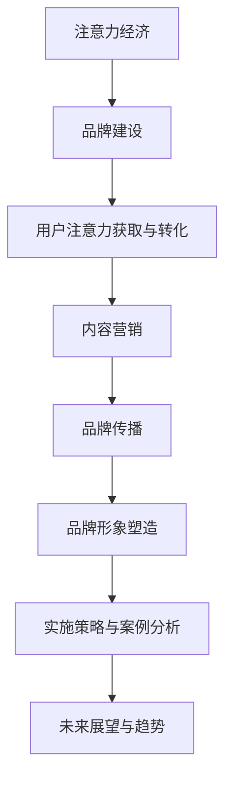

                 

# 注意力经济对企业品牌建设的新挑战

> 关键词：注意力经济、品牌建设、用户注意力、内容营销、品牌形象、实施策略、案例分析、未来展望

> 摘要：随着互联网和社交媒体的快速发展，注意力经济成为影响企业品牌建设的重要因素。本文深入探讨了注意力经济的定义与起源、企业品牌建设的现状与挑战、注意力经济对企业品牌建设的影响、实施策略与案例分析以及未来展望，旨在为企业提供在新经济环境下的品牌建设策略。

### 目录大纲

1. **背景与基础**
    - 第1章：注意力经济的定义与起源
    - 第2章：企业品牌建设的现状与挑战

2. **注意力经济对企业品牌建设的影响**
    - 第3章：用户注意力获取与转化
    - 第4章：内容营销与品牌传播
    - 第5章：注意力经济下的品牌形象塑造

3. **实施策略与案例分析**
    - 第6章：注意力经济在企业品牌建设中的应用
    - 第7章：未来展望与趋势

4. **工具与资源**
    - 第8章：注意力经济分析工具
    - 第9章：品牌建设资源与平台

5. **未来研究展望**
    - 第10章：未来研究展望

### 第一部分：背景与基础

#### 第1章：注意力经济的定义与起源

##### 1.1 注意力经济的概念解析

注意力经济，也被称为“注意力资本”或“注意力市场”，是一种基于用户注意力的经济形态。它是指在一定时间内，用户注意力作为一种稀缺资源，被企业、品牌和个人所竞争和利用，以实现商业价值和社会效益。注意力经济的核心在于如何有效地获取、转化和保持用户的注意力。

在注意力经济中，用户的注意力被视为一种“货币”，企业通过吸引和保持用户注意力来增加品牌曝光、用户参与和消费行为。与传统经济模式相比，注意力经济更注重用户参与和用户体验，而非单纯的物质交换。

##### 1.2 注意力经济的起源与发展

注意力经济的概念最早由广告行业提出，旨在解释广告市场中的用户注意力价值。随着互联网和社交媒体的兴起，注意力经济逐渐成为一种普遍的经济现象。互联网企业通过提供丰富的内容和互动体验，吸引了大量用户，从而实现了商业盈利。

近年来，随着人工智能、大数据和算法技术的发展，注意力经济进一步得到了深化和应用。企业可以通过数据分析和技术手段，更精准地了解用户需求，提供个性化服务和内容，从而提高用户满意度和忠诚度。

##### 1.3 注意力经济的特点与影响

注意力经济具有以下几个主要特点：

1. **稀缺性**：用户注意力是有限的，企业需要通过创新和优质内容来争夺用户注意力。
2. **高效性**：注意力经济强调快速、精准地吸引用户注意力，提高信息传播效率。
3. **互动性**：用户参与和互动是注意力经济的重要组成部分，有助于建立品牌忠诚度。
4. **多样性**：注意力经济涉及多个领域和行业，包括广告、媒体、电商、娱乐等。

注意力经济对企业品牌建设的影响主要体现在以下几个方面：

1. **用户参与度**：注意力经济鼓励企业创造更多互动性、参与性的内容和活动，提高用户参与度。
2. **品牌传播**：通过精准的内容营销和品牌传播，企业可以更快、更广泛地传播品牌信息。
3. **用户忠诚度**：优质的内容和体验有助于建立用户对品牌的信任和忠诚度。
4. **商业模式创新**：注意力经济为企业提供了新的商业模式和盈利机会，如会员制、付费内容等。

#### 第2章：企业品牌建设的现状与挑战

##### 2.1 企业品牌建设的现状

当前，企业品牌建设已经成为市场竞争中的重要战略。许多企业通过品牌形象塑造、品牌传播、用户参与和口碑营销等方式，不断提升品牌知名度和美誉度。随着互联网和社交媒体的普及，企业品牌建设的手段和渠道更加多样化，如社交媒体营销、搜索引擎优化、内容营销、KOL营销等。

然而，企业品牌建设也面临着一系列挑战：

1. **信息过载**：互联网时代信息爆炸，用户面临大量信息的选择和过滤，企业品牌传播面临困难。
2. **用户注意力分散**：用户注意力被多种内容和服务分散，企业需要不断创新和优化内容来吸引用户注意力。
3. **竞争激烈**：市场上同质化产品和服务较多，企业需要通过差异化品牌策略来脱颖而出。
4. **消费者行为变化**：消费者对品牌的要求越来越高，企业需要提供个性化、高品质的服务和体验。

##### 2.2 传统品牌建设模式的局限性

传统品牌建设模式主要依赖于广告宣传和品牌推广，虽然可以在一定程度上提升品牌知名度，但在用户注意力分散和信息过载的背景下，其效果逐渐减弱。传统品牌建设模式存在以下局限性：

1. **单向传播**：传统品牌建设模式主要采用单向传播方式，无法与用户进行有效互动。
2. **效果难以衡量**：传统广告投放效果难以精确衡量，企业难以了解品牌建设的实际效果。
3. **品牌形象单一**：传统品牌建设模式往往注重单一的品牌形象塑造，无法满足用户多样化需求。
4. **营销成本高**：传统广告投放成本较高，企业需要投入大量资金进行品牌建设。

##### 2.3 注意力经济对品牌建设的挑战

注意力经济对企业品牌建设提出了新的挑战：

1. **内容质量要求**：注意力经济下，用户对内容质量要求更高，企业需要提供高质量、有价值的内容来吸引用户注意力。
2. **互动性要求**：注意力经济强调用户参与和互动，企业需要设计更多互动性活动，提高用户参与度。
3. **用户个性化需求**：注意力经济要求企业根据用户个性化需求提供定制化服务，提高用户满意度。
4. **品牌传播精准性**：注意力经济下，企业需要通过精准的内容营销和品牌传播，提高品牌曝光度和用户转化率。

### 第二部分：注意力经济对企业品牌建设的影响

#### 第3章：用户注意力获取与转化

##### 3.1 用户注意力获取策略

在注意力经济下，用户注意力的获取成为企业品牌建设的关键。以下是一些有效的用户注意力获取策略：

1. **内容创新**：通过创造新颖、有趣、有价值的内容来吸引用户注意力。
2. **社交媒体营销**：利用社交媒体平台进行内容传播，提高品牌曝光度。
3. **KOL营销**：与有影响力的意见领袖合作，通过他们的推荐来吸引用户注意力。
4. **互动性设计**：通过设计互动性强的活动，如投票、问答、游戏等，提高用户参与度。
5. **个性化推荐**：利用大数据和算法技术，为用户提供个性化内容推荐，提高用户满意度。

##### 3.2 用户注意力转化路径

获取用户注意力只是第一步，如何将注意力转化为实际消费行为是品牌建设的核心。以下是一些用户注意力转化的路径：

1. **内容转化**：通过高质量的内容，如产品评测、使用指南等，引导用户进行消费决策。
2. **互动转化**：通过互动性活动，如优惠券、限时购等，刺激用户进行购买。
3. **口碑转化**：通过用户的口碑传播，吸引更多潜在用户进行购买。
4. **社群转化**：通过建立品牌社群，与用户建立深度互动，提高用户忠诚度。

##### 3.3 注意力经济下的用户参与度提升

用户参与度是衡量品牌建设效果的重要指标。在注意力经济下，企业可以通过以下方式提升用户参与度：

1. **参与式营销**：鼓励用户参与品牌活动，如设计比赛、用户调研等。
2. **用户互动**：通过社交媒体、论坛、评论等渠道，与用户进行互动。
3. **用户共创**：鼓励用户参与品牌内容创作，如用户生成内容（UGC）。
4. **用户积分系统**：通过积分奖励系统，激励用户参与品牌活动。

#### 第4章：内容营销与品牌传播

##### 4.1 内容营销的核心要素

内容营销是注意力经济下品牌传播的重要手段。以下是一些内容营销的核心要素：

1. **目标受众**：明确内容营销的目标受众，了解其需求和兴趣。
2. **内容质量**：提供高质量、有价值的内容，满足用户需求。
3. **内容形式**：根据用户偏好，选择合适的文本、图片、视频、音频等表现形式。
4. **内容传播**：利用社交媒体、搜索引擎、自媒体等渠道，广泛传播内容。
5. **互动性**：设计互动性内容，提高用户参与度和互动性。

##### 4.2 内容营销与品牌传播的融合

内容营销与品牌传播相互融合，是提升品牌知名度和美誉度的有效途径。以下是一些融合策略：

1. **品牌故事**：通过讲述品牌故事，塑造品牌形象，提高品牌认知度。
2. **案例分析**：通过分享成功案例，展示品牌实力和效果，吸引潜在用户。
3. **互动性传播**：通过互动性活动，如直播、问答等，提高用户参与度和品牌传播效果。
4. **多渠道传播**：综合利用线上线下渠道，扩大品牌传播范围。

##### 4.3 社交媒体在注意力经济中的作用

社交媒体是注意力经济下品牌传播的重要平台。以下是一些社交媒体在注意力经济中的作用：

1. **用户互动**：通过社交媒体，与用户进行实时互动，提高用户参与度和忠诚度。
2. **内容传播**：利用社交媒体的分享和转发功能，快速传播品牌内容。
3. **品牌曝光**：通过社交媒体的广告投放和话题营销，提高品牌曝光度。
4. **用户调研**：通过社交媒体，收集用户反馈和需求，优化品牌产品和服务。

#### 第5章：注意力经济下的品牌形象塑造

##### 5.1 品牌形象的概念与构建

品牌形象是品牌在用户心中的总体印象，是品牌价值的重要体现。以下是一些品牌形象的概念和构建方法：

1. **品牌定位**：明确品牌的核心价值和定位，与目标用户建立联系。
2. **品牌视觉**：设计独特的品牌标识、色彩和字体，提升品牌视觉识别度。
3. **品牌声音**：通过品牌口号、广告语等，塑造品牌声音和语调。
4. **品牌文化**：传递品牌价值观和文化，提升品牌内涵。

##### 5.2 品牌个性与注意力经济

品牌个性是指品牌在用户心中的独特性格特征。在注意力经济下，品牌个性有助于提升品牌吸引力和用户忠诚度。以下是一些品牌个性的构建方法：

1. **独特性**：塑造独特、鲜明的品牌个性，与竞争对手区分开来。
2. **一致性**：确保品牌个性在所有营销渠道和活动中保持一致。
3. **吸引力**：设计具有吸引力的品牌个性，满足用户需求和兴趣。
4. **可感知性**：通过视觉、听觉和互动等渠道，让用户感知品牌个性。

##### 5.3 品牌信任与用户注意力

品牌信任是用户对品牌的信任和依赖程度，是用户注意力保持和转化的关键。以下是一些提升品牌信任的方法：

1. **产品质量**：提供高品质的产品和服务，赢得用户信任。
2. **透明度**：公开透明地展示企业运营和产品信息，增强用户信任。
3. **用户反馈**：重视用户反馈，积极解决用户问题和投诉。
4. **社会责任**：履行企业社会责任，提升品牌形象和用户信任。

### 第三部分：实施策略与案例分析

#### 第6章：注意力经济在企业品牌建设中的应用

##### 6.1 注意力经济在企业品牌建设中的实施策略

在注意力经济下，企业可以通过以下策略实施品牌建设：

1. **内容创新**：创造高质量、有价值的内容，吸引用户注意力。
2. **社交媒体营销**：利用社交媒体平台进行品牌传播和用户互动。
3. **KOL营销**：与有影响力的意见领袖合作，扩大品牌影响力。
4. **互动性设计**：设计互动性强的活动，提高用户参与度。
5. **用户共创**：鼓励用户参与品牌内容创作，增强用户粘性。
6. **个性化推荐**：利用大数据和算法技术，提供个性化内容和服务。

##### 6.2 案例研究：成功案例分析

以下是一些注意力经济在企业品牌建设中的成功案例：

1. **案例1：小米**
    - 小米通过社交媒体营销和用户互动，建立了强大的品牌社群，提升了用户忠诚度。
    - 小米还通过用户共创，如手机设计大赛，增强了用户参与感和品牌粘性。

2. **案例2：杜蕾斯**
    - 杜蕾斯通过社交媒体上的热点话题营销，吸引了大量用户关注，提升了品牌曝光度。
    - 杜蕾斯还通过创意广告和互动活动，塑造了时尚、有趣的品牌形象。

3. **案例3：网易云音乐**
    - 网易云音乐通过音乐推荐和用户互动，提升了用户满意度和忠诚度。
    - 网易云音乐还通过用户生成内容（UGC），丰富了音乐内容库，增强了用户粘性。

##### 6.3 案例解析：成功经验与挑战

成功案例背后的经验：

1. **创新内容**：成功企业能够创造高质量、有价值的内容，满足用户需求。
2. **用户互动**：成功企业能够通过社交媒体和互动活动，与用户建立深度互动。
3. **品牌个性**：成功企业能够塑造独特、鲜明的品牌个性，提升品牌吸引力。
4. **社会责任**：成功企业能够履行社会责任，提升品牌形象。

面临的挑战：

1. **内容质量**：如何在大量信息中脱颖而出，提供高质量、有价值的内容。
2. **用户参与**：如何提高用户参与度，保持用户注意力。
3. **品牌一致性**：如何确保品牌形象和品牌传播的一致性。
4. **数据隐私**：如何保护用户数据隐私，避免数据泄露风险。

### 第四部分：未来展望与趋势

#### 第7章：未来展望与趋势

##### 7.1 注意力经济的未来发展趋势

随着互联网和技术的不断发展，注意力经济将继续发展，以下是一些未来发展趋势：

1. **个性化服务**：企业将更加注重用户个性化需求，提供定制化服务。
2. **智能互动**：通过人工智能和大数据技术，实现智能互动和个性化推荐。
3. **品牌社群**：企业将建立更加紧密的品牌社群，提高用户忠诚度。
4. **跨平台整合**：企业将整合多平台资源，实现跨平台品牌传播和互动。

##### 7.2 企业品牌建设的新机遇

注意力经济为企业品牌建设带来了新的机遇：

1. **内容创新**：企业可以通过创造高质量、有价值的内容，提升品牌知名度。
2. **社交媒体营销**：企业可以通过社交媒体营销，实现品牌传播和用户互动。
3. **用户共创**：企业可以通过用户共创，增强品牌粘性和用户忠诚度。
4. **跨界合作**：企业可以通过跨界合作，拓展品牌影响力和市场空间。

##### 7.3 注意力经济对品牌建设的持续影响

注意力经济将继续对品牌建设产生深远影响：

1. **用户参与度**：用户参与度将成为衡量品牌建设效果的重要指标。
2. **品牌传播方式**：企业将更加注重内容营销和社交媒体传播。
3. **品牌形象塑造**：品牌个性化和差异化将成为塑造品牌形象的重要手段。
4. **商业模式创新**：注意力经济将推动企业商业模式创新，实现持续增长。

### 第五部分：工具与资源

#### 第8章：注意力经济分析工具

##### 8.1 市场调研与分析工具

市场调研和分析是企业品牌建设的重要环节。以下是一些常用的市场调研与分析工具：

1. **问卷调查**：通过在线问卷调查，收集用户需求和意见。
2. **数据分析**：利用数据分析工具，分析用户行为和市场趋势。
3. **用户画像**：通过用户画像工具，了解目标用户特征和行为偏好。
4. **竞争力分析**：通过竞争力分析工具，评估企业在市场中的地位和竞争态势。

##### 8.2 用户行为分析工具

用户行为分析是企业了解用户需求和优化品牌传播的重要手段。以下是一些用户行为分析工具：

1. **网站分析**：通过网站分析工具，了解用户在网站上的行为轨迹。
2. **社交媒体分析**：通过社交媒体分析工具，了解用户在社交媒体上的行为和互动。
3. **APP分析**：通过APP分析工具，了解用户在APP上的行为和反馈。
4. **用户反馈**：通过用户反馈工具，收集用户对品牌和产品的意见和建议。

##### 8.3 内容营销分析工具

内容营销分析工具帮助企业评估内容营销的效果和优化内容策略。以下是一些内容营销分析工具：

1. **内容分析**：通过内容分析工具，评估内容的受欢迎程度和影响力。
2. **内容推荐**：通过内容推荐工具，提高内容曝光度和用户参与度。
3. **互动分析**：通过互动分析工具，评估用户互动和参与度。
4. **传播分析**：通过传播分析工具，评估内容传播效果和覆盖范围。

#### 第9章：品牌建设资源与平台

##### 9.1 社交媒体平台概述

社交媒体平台是品牌建设的重要渠道。以下是一些常用的社交媒体平台：

1. **微信**：中国最大的社交媒体平台，拥有广泛用户基础。
2. **微博**：中国领先的社交媒体平台，注重用户互动和热点话题。
3. **抖音**：中国流行的短视频平台，注重内容创新和用户互动。
4. **Facebook**：全球最大的社交媒体平台，覆盖全球用户。
5. **Instagram**：全球领先的图片和短视频平台，注重创意和美学。
6. **YouTube**：全球最大的视频分享平台，覆盖广泛用户。

##### 9.2 影响力营销平台

影响力营销平台是企业获取用户注意力和提升品牌知名度的重要手段。以下是一些影响力营销平台：

1. **KOL营销平台**：提供KOL资源对接和影响力营销服务，帮助企业与KOL合作。
2. **内容营销平台**：提供内容创作、发布和推广服务，帮助企业进行内容营销。
3. **广告投放平台**：提供广告投放和推广服务，帮助企业进行品牌曝光和用户获取。
4. **社交媒体广告平台**：提供社交媒体广告投放和营销服务，帮助企业进行精准推广。

##### 9.3 品牌建设资源整合与利用

品牌建设资源整合与利用是企业提升品牌建设效果的重要手段。以下是一些资源整合与利用的方法：

1. **多平台整合**：整合多平台资源，实现品牌信息的一致性和传播效果的最大化。
2. **资源互补**：利用不同平台的资源和优势，实现互补和协同效应。
3. **内容多样化**：通过多样化内容形式，满足不同用户群体的需求。
4. **跨部门合作**：跨部门合作，实现品牌建设的整体性和协同性。

### 第六部分：未来研究展望

#### 第10章：未来研究展望

##### 10.1 注意力经济理论的发展

随着注意力经济的不断发展，对其理论的研究也将不断深化。未来研究可能关注以下几个方面：

1. **注意力经济学原理**：进一步探索注意力作为经济资源的基本原理和运作机制。
2. **注意力市场模型**：建立更加精确和复杂的注意力市场模型，分析注意力资源的分配和定价。
3. **用户注意力机制**：深入研究用户注意力的生成、分配和调控机制，为品牌建设提供理论依据。

##### 10.2 企业品牌建设的新模式

在注意力经济背景下，企业品牌建设将出现新的模式和策略。未来研究可能关注以下几个方面：

1. **个性化品牌建设**：探索如何根据用户个性化需求进行品牌建设，提高用户满意度和忠诚度。
2. **社群化品牌建设**：研究如何通过建立品牌社群，增强用户参与度和品牌粘性。
3. **跨界品牌建设**：探讨如何通过跨界合作，扩大品牌影响力和市场空间。

##### 10.3 注意力经济与品牌建设的前沿探索

未来研究将关注注意力经济与品牌建设的前沿问题，如：

1. **注意力经济的可持续发展**：探讨如何在满足用户注意力需求的同时，实现企业的可持续发展。
2. **注意力资源的优化配置**：研究如何通过技术创新和策略优化，提高注意力资源的利用效率。
3. **注意力经济的全球影响**：分析注意力经济在不同国家和地区的表现和影响，为全球品牌建设提供参考。

### 结论

注意力经济作为当今时代的重要经济现象，对企业品牌建设产生了深远影响。本文通过对注意力经济的定义、起源、特点、对企业品牌建设的影响、实施策略与案例分析以及未来展望的探讨，旨在为企业提供在新经济环境下的品牌建设策略。未来，随着注意力经济的不断发展，企业需要不断创新和优化品牌建设策略，以应对新的挑战和机遇。

作者：AI天才研究院/AI Genius Institute & 禅与计算机程序设计艺术/Zen And The Art of Computer Programming

---

### 第一部分：背景与基础

#### 第1章：注意力经济的定义与起源

##### 1.1 注意力经济的概念解析

注意力经济，也被称为“注意力资本”或“注意力市场”，是一种基于用户注意力的经济形态。它是指在一定时间内，用户注意力作为一种稀缺资源，被企业、品牌和个人所竞争和利用，以实现商业价值和社会效益。在注意力经济中，用户的注意力被视为一种“货币”，企业通过吸引和保持用户注意力来增加品牌曝光、用户参与和消费行为。

注意力经济并不是一个全新的概念，它源于对广告行业和媒体行业的观察。传统的广告模式依赖于用户的注意力，而注意力经济的概念则进一步强调了注意力作为经济资源的重要性和价值。在注意力经济中，用户注意力的获取和转化成为企业获取商业价值的关键。

##### 1.2 注意力经济的起源与发展

注意力经济的概念最早由广告行业提出，旨在解释广告市场中的用户注意力价值。随着互联网和社交媒体的兴起，注意力经济逐渐成为一种普遍的经济现象。互联网企业通过提供丰富的内容和互动体验，吸引了大量用户，从而实现了商业盈利。

20世纪90年代，随着互联网的快速发展，注意力经济开始得到广泛关注。当时，互联网企业通过免费提供内容和服务，吸引了大量用户，从而实现了广告收入的增长。这一现象引起了经济学家的关注，他们开始研究用户注意力在互联网经济中的价值。

近年来，随着人工智能、大数据和算法技术的发展，注意力经济进一步得到了深化和应用。企业可以通过数据分析和技术手段，更精准地了解用户需求，提供个性化服务和内容，从而提高用户满意度和忠诚度。

##### 1.3 注意力经济的特点与影响

注意力经济具有以下几个主要特点：

1. **稀缺性**：用户注意力是有限的，企业需要通过创新和优质内容来争夺用户注意力。
2. **高效性**：注意力经济强调快速、精准地吸引用户注意力，提高信息传播效率。
3. **互动性**：用户参与和互动是注意力经济的重要组成部分，有助于建立品牌忠诚度。
4. **多样性**：注意力经济涉及多个领域和行业，包括广告、媒体、电商、娱乐等。

注意力经济对企业品牌建设的影响主要体现在以下几个方面：

1. **用户参与度**：注意力经济鼓励企业创造更多互动性、参与性的内容和活动，提高用户参与度。
2. **品牌传播**：通过精准的内容营销和品牌传播，企业可以更快、更广泛地传播品牌信息。
3. **用户忠诚度**：优质的内容和体验有助于建立用户对品牌的信任和忠诚度。
4. **商业模式创新**：注意力经济为企业提供了新的商业模式和盈利机会，如会员制、付费内容等。

#### 第2章：企业品牌建设的现状与挑战

##### 2.1 企业品牌建设的现状

当前，企业品牌建设已经成为市场竞争中的重要战略。许多企业通过品牌形象塑造、品牌传播、用户参与和口碑营销等方式，不断提升品牌知名度和美誉度。随着互联网和社交媒体的普及，企业品牌建设的手段和渠道更加多样化，如社交媒体营销、搜索引擎优化、内容营销、KOL营销等。

在互联网时代，企业品牌建设呈现出以下几个特点：

1. **数字化**：企业通过数字化手段进行品牌建设，如社交媒体营销、搜索引擎优化等。
2. **互动性**：企业注重与用户的互动，通过社交媒体、论坛、评论区等渠道与用户进行互动。
3. **个性化**：企业根据用户需求和行为数据，提供个性化的品牌传播和营销策略。
4. **多元化**：企业通过多种渠道和方式，进行品牌传播和用户互动，如自媒体、短视频、直播等。

##### 2.2 传统品牌建设模式的局限性

尽管互联网和社交媒体为企业品牌建设提供了新的机遇，但传统的品牌建设模式也存在一定的局限性：

1. **单向传播**：传统品牌建设模式主要采用单向传播方式，无法与用户进行有效互动。
2. **效果难以衡量**：传统广告投放效果难以精确衡量，企业难以了解品牌建设的实际效果。
3. **品牌形象单一**：传统品牌建设模式往往注重单一的品牌形象塑造，无法满足用户多样化需求。
4. **营销成本高**：传统广告投放成本较高，企业需要投入大量资金进行品牌建设。

##### 2.3 注意力经济对品牌建设的挑战

注意力经济对企业品牌建设提出了新的挑战：

1. **内容质量要求**：注意力经济下，用户对内容质量要求更高，企业需要提供高质量、有价值的内容来吸引用户注意力。
2. **互动性要求**：注意力经济强调用户参与和互动，企业需要设计更多互动性活动，提高用户参与度。
3. **用户个性化需求**：注意力经济要求企业根据用户个性化需求提供定制化服务，提高用户满意度。
4. **品牌传播精准性**：注意力经济下，企业需要通过精准的内容营销和品牌传播，提高品牌曝光度和用户转化率。

### 第二部分：注意力经济对企业品牌建设的影响

#### 第3章：用户注意力获取与转化

##### 3.1 用户注意力获取策略

在注意力经济下，用户注意力的获取成为企业品牌建设的关键。企业需要通过多种策略来争夺用户的注意力，以下是几种有效的用户注意力获取策略：

1. **内容创新**：通过创造新颖、有趣、有价值的内容来吸引用户注意力。例如，通过短视频、漫画、互动游戏等形式，提供独特的内容体验。
2. **社交媒体营销**：利用社交媒体平台进行品牌传播，提高品牌曝光度。例如，在微博、微信、抖音等平台上发布高质量的原创内容，与用户进行互动。
3. **KOL营销**：与有影响力的意见领袖（KOL）合作，通过他们的推荐来吸引用户注意力。KOL的影响力可以帮助企业快速获取大量关注和信任。
4. **互动性设计**：通过设计互动性强的活动，如投票、问答、游戏等，提高用户参与度。互动性设计可以激发用户的兴趣和好奇心，从而吸引更多用户注意力。
5. **个性化推荐**：利用大数据和算法技术，为用户提供个性化内容推荐，提高用户满意度。个性化推荐可以根据用户的兴趣和行为数据，提供相关的内容和产品，从而提高用户的点击率和转化率。

##### 3.2 用户注意力转化路径

获取用户注意力只是第一步，如何将注意力转化为实际消费行为是品牌建设的核心。以下是几种用户注意力转化的路径：

1. **内容转化**：通过高质量的内容，如产品评测、使用指南等，引导用户进行消费决策。例如，通过撰写详细的产品评测文章，帮助用户了解产品的优缺点，从而促进购买。
2. **互动转化**：通过互动性活动，如优惠券、限时购等，刺激用户进行购买。例如，在电商平台上推出限时折扣活动，吸引用户在规定时间内进行购买。
3. **口碑转化**：通过用户的口碑传播，吸引更多潜在用户进行购买。例如，鼓励用户在社交媒体上分享他们的购买体验和感受，从而吸引其他用户关注和购买。
4. **社群转化**：通过建立品牌社群，与用户建立深度互动，提高用户忠诚度。例如，在社交媒体上创建品牌社群，定期举办互动活动，增强用户对品牌的归属感和忠诚度。

##### 3.3 注意力经济下的用户参与度提升

用户参与度是衡量品牌建设效果的重要指标。在注意力经济下，企业可以通过以下方式提升用户参与度：

1. **参与式营销**：鼓励用户参与品牌活动，如设计比赛、用户调研等。例如，举办设计比赛，邀请用户提交创意设计，从而增强用户对品牌的认同感和参与感。
2. **用户互动**：通过社交媒体、论坛、评论等渠道，与用户进行互动。例如，在社交媒体上开设品牌官方账号，定期发布互动话题，鼓励用户参与讨论和互动。
3. **用户共创**：鼓励用户参与品牌内容创作，如用户生成内容（UGC）。例如，鼓励用户在社交媒体上分享他们的使用心得和体验，从而丰富品牌内容，提升用户参与度。
4. **用户积分系统**：通过积分奖励系统，激励用户参与品牌活动。例如，在电商平台上设置积分系统，用户在购物或参与互动活动时可以获得积分，积分可以兑换奖品或享受特权。

#### 第4章：内容营销与品牌传播

##### 4.1 内容营销的核心要素

内容营销是品牌传播的重要手段。以下是内容营销的核心要素：

1. **目标受众**：明确内容营销的目标受众，了解其需求和兴趣。例如，针对年轻女性用户，可以发布时尚、美容类的内容。
2. **内容质量**：提供高质量、有价值的内容，满足用户需求。例如，通过撰写详细的产品评测文章，帮助用户了解产品的优缺点。
3. **内容形式**：根据用户偏好，选择合适的文本、图片、视频、音频等表现形式。例如，通过发布短视频，吸引用户关注和观看。
4. **内容传播**：利用社交媒体、搜索引擎、自媒体等渠道，广泛传播内容。例如，通过在各大社交媒体平台发布内容，提高品牌曝光度。
5. **互动性**：设计互动性内容，提高用户参与度。例如，通过举办问答活动，鼓励用户参与讨论和提问。

##### 4.2 内容营销与品牌传播的融合

内容营销与品牌传播相互融合，是提升品牌知名度和美誉度的有效途径。以下是几种融合策略：

1. **品牌故事**：通过讲述品牌故事，塑造品牌形象，提高品牌认知度。例如，通过发布品牌创立历程的文章或视频，展示品牌的历史和愿景。
2. **案例分析**：通过分享成功案例，展示品牌实力和效果，吸引潜在用户。例如，发布客户见证或案例研究，展示品牌如何帮助客户解决问题。
3. **互动性传播**：通过互动性活动，如直播、问答等，提高用户参与度和品牌传播效果。例如，通过直播活动，与用户实时互动，增加用户参与感。
4. **多渠道传播**：综合利用线上线下渠道，扩大品牌传播范围。例如，通过线下活动、广告投放、线上社交媒体等渠道，实现品牌的全方位传播。

##### 4.3 社交媒体在注意力经济中的作用

社交媒体是注意力经济下品牌传播的重要平台。以下是社交媒体在注意力经济中的作用：

1. **用户互动**：通过社交媒体，与用户进行实时互动，提高用户参与度和忠诚度。例如，通过社交媒体平台发布互动话题，鼓励用户参与讨论。
2. **内容传播**：利用社交媒体的分享和转发功能，快速传播品牌内容。例如，通过发布短视频或文章，利用用户的社交网络进行病毒式传播。
3. **品牌曝光**：通过社交媒体的广告投放和话题营销，提高品牌曝光度。例如，通过在社交媒体平台上投放广告，吸引更多潜在用户关注。
4. **用户调研**：通过社交媒体，收集用户反馈和需求，优化品牌产品和服务。例如，通过社交媒体平台发布问卷调查，了解用户对品牌的意见和建议。

#### 第5章：注意力经济下的品牌形象塑造

##### 5.1 品牌形象的概念与构建

品牌形象是品牌在用户心中的总体印象，是品牌价值的重要体现。以下是品牌形象的概念和构建方法：

1. **品牌定位**：明确品牌的核心价值和定位，与目标用户建立联系。例如，一个高端奢侈品品牌需要明确其定位为高端、奢华，以吸引目标用户。
2. **品牌视觉**：设计独特的品牌标识、色彩和字体，提升品牌视觉识别度。例如，苹果的品牌标识采用简洁的苹果形状，色彩鲜艳，易于识别。
3. **品牌声音**：通过品牌口号、广告语等，塑造品牌声音和语调。例如，可口可乐的品牌口号“分享快乐”传达了品牌积极、快乐的核心价值观。
4. **品牌文化**：传递品牌价值观和文化，提升品牌内涵。例如，迪士尼的品牌文化强调家庭、欢乐和梦想，吸引了大量家庭用户。

##### 5.2 品牌个性与注意力经济

品牌个性是指品牌在用户心中的独特性格特征，有助于提升品牌吸引力和用户忠诚度。以下是品牌个性的构建方法：

1. **独特性**：塑造独特、鲜明的品牌个性，与竞争对手区分开来。例如，耐克的品牌个性强调运动、挑战和成功，与其他运动品牌形成差异化。
2. **一致性**：确保品牌个性在所有营销渠道和活动中保持一致。例如，在社交媒体、广告和产品包装中，都体现耐克的品牌个性。
3. **吸引力**：设计具有吸引力的品牌个性，满足用户需求和兴趣。例如，谷歌的品牌个性强调创新、开放和幽默，吸引了大量年轻用户。
4. **可感知性**：通过视觉、听觉和互动等渠道，让用户感知品牌个性。例如，谷歌通过其独特的办公环境和文化活动，展示了品牌的开放和创新。

##### 5.3 品牌信任与用户注意力

品牌信任是用户对品牌的信任和依赖程度，是用户注意力保持和转化的关键。以下是提升品牌信任的方法：

1. **产品质量**：提供高品质的产品和服务，赢得用户信任。例如，宝马通过提供高性能、高品质的汽车，赢得了用户的信任和忠诚。
2. **透明度**：公开透明地展示企业运营和产品信息，增强用户信任。例如，特斯拉通过开放其生产线和产品信息，增加了品牌的透明度。
3. **用户反馈**：重视用户反馈，积极解决用户问题和投诉。例如，苹果通过其全球服务网络，及时响应用户反馈，提高了用户满意度。
4. **社会责任**：履行企业社会责任，提升品牌形象和用户信任。例如，雀巢通过参与环境保护和社区发展项目，提升了品牌的形象和用户信任。

### 第三部分：实施策略与案例分析

#### 第6章：注意力经济在企业品牌建设中的应用

##### 6.1 注意力经济在企业品牌建设中的实施策略

在注意力经济下，企业需要通过一系列策略来实施品牌建设。以下是一些关键的实施策略：

1. **内容创新**：企业需要不断创新内容形式，提供高质量、有价值的内容来吸引用户注意力。例如，通过短视频、直播、漫画等形式，创造出独特的内容体验，满足用户的需求。
2. **社交媒体营销**：利用社交媒体平台进行品牌传播和用户互动，提高品牌曝光度和用户参与度。例如，通过在微博、微信、抖音等平台上发布原创内容，与用户进行互动，增加品牌的粉丝和忠诚度。
3. **KOL营销**：与有影响力的意见领袖合作，通过他们的推荐来扩大品牌影响力。例如，选择与行业内有影响力的KOL合作，让他们为品牌代言或推广，从而吸引更多的潜在用户。
4. **互动性设计**：设计互动性强的活动，如投票、问答、游戏等，提高用户参与度。例如，通过举办线上投票活动，让用户参与到品牌决策中，增加用户的参与感和忠诚度。
5. **个性化推荐**：利用大数据和算法技术，为用户提供个性化内容推荐，提高用户满意度和忠诚度。例如，通过分析用户的行为数据，为用户推荐符合他们兴趣的产品和服务，从而提高转化率。
6. **用户共创**：鼓励用户参与品牌内容创作，如用户生成内容（UGC），增强用户粘性和品牌忠诚度。例如，通过举办设计比赛或创意大赛，邀请用户提交自己的创意，从而增加品牌的互动性和用户参与度。

##### 6.2 案例研究：成功案例分析

以下是一些企业在注意力经济下进行品牌建设的成功案例：

1. **案例1：小米**
   - 小米通过社交媒体营销和用户互动，建立了强大的品牌社群，提升了用户忠诚度。
   - 小米还通过用户共创，如手机设计大赛，增强了用户参与感和品牌粘性。

2. **案例2：杜蕾斯**
   - 杜蕾斯通过社交媒体上的热点话题营销，吸引了大量用户关注，提升了品牌曝光度。
   - 杜蕾斯还通过创意广告和互动活动，塑造了时尚、有趣的品牌形象。

3. **案例3：网易云音乐**
   - 网易云音乐通过音乐推荐和用户互动，提升了用户满意度和忠诚度。
   - 网易云音乐还通过用户生成内容（UGC），丰富了音乐内容库，增强了用户粘性。

4. **案例4：瑞幸咖啡**
   - 瑞幸咖啡通过社交媒体营销和用户互动，迅速提升了品牌知名度。
   - 瑞幸咖啡还通过限时优惠和社群活动，增加了用户的参与度和忠诚度。

##### 6.3 案例解析：成功经验与挑战

成功案例背后的经验：

1. **内容创新**：成功企业能够创造高质量、有价值的内容，满足用户需求，提高用户参与度。
2. **用户互动**：成功企业能够通过社交媒体和互动活动，与用户建立深度互动，增强用户忠诚度。
3. **KOL营销**：成功企业能够与有影响力的意见领袖合作，扩大品牌影响力。
4. **个性化推荐**：成功企业能够利用大数据和算法技术，为用户提供个性化内容和服务，提高用户满意度和忠诚度。

面临的挑战：

1. **内容质量**：如何在大量信息中脱颖而出，提供高质量、有价值的内容。
2. **用户参与**：如何提高用户参与度，保持用户注意力。
3. **品牌一致性**：如何在各种营销渠道中保持品牌形象的一致性。
4. **数据隐私**：如何保护用户数据隐私，避免数据泄露风险。

### 第四部分：未来展望与趋势

#### 第7章：未来展望与趋势

##### 7.1 注意力经济的未来发展趋势

随着互联网和技术的不断发展，注意力经济将继续发展，以下是未来可能的发展趋势：

1. **个性化服务**：企业将更加注重用户个性化需求，提供定制化服务。
2. **智能互动**：通过人工智能和大数据技术，实现智能互动和个性化推荐。
3. **品牌社群**：企业将建立更加紧密的品牌社群，提高用户忠诚度。
4. **跨平台整合**：企业将整合多平台资源，实现跨平台品牌传播和互动。
5. **注意力经济全球化**：注意力经济将超越国界，影响全球范围内的品牌建设和市场竞争。

##### 7.2 企业品牌建设的新机遇

注意力经济为企业品牌建设带来了新的机遇：

1. **内容创新**：企业可以通过创造高质量、有价值的内容，提升品牌知名度和用户参与度。
2. **社交媒体营销**：企业可以通过社交媒体平台进行品牌传播和用户互动，实现品牌曝光和用户转化。
3. **用户共创**：企业可以通过用户共创，增强品牌粘性和用户忠诚度。
4. **跨界合作**：企业可以通过跨界合作，拓展品牌影响力和市场空间。
5. **注意力资源优化**：企业可以通过优化注意力资源的使用，提高品牌建设和营销的效率和效果。

##### 7.3 注意力经济对品牌建设的持续影响

注意力经济将继续对品牌建设产生深远影响：

1. **用户参与度**：企业将更加注重用户参与度，通过互动性和参与式营销提升品牌影响力。
2. **品牌传播方式**：企业将更加依赖内容营销和社交媒体传播，实现精准和高效的传播效果。
3. **品牌形象塑造**：企业将更加注重品牌个性和差异化的塑造，以吸引和留住用户注意力。
4. **商业模式创新**：企业将探索新的商业模式，如会员制、付费内容等，以适应注意力经济的发展需求。

### 第五部分：工具与资源

#### 第8章：注意力经济分析工具

##### 8.1 市场调研与分析工具

市场调研与分析是企业品牌建设的重要环节，以下是一些常用的市场调研与分析工具：

1. **问卷调查工具**：如问卷星、腾讯问卷等，通过在线问卷调查收集用户需求和反馈。
2. **数据分析工具**：如SPSS、Python的Pandas库等，用于处理和分析市场数据。
3. **用户画像工具**：如阿里云用户画像、百度用户画像等，通过分析用户行为数据，了解用户特征。
4. **竞争力分析工具**：如竞争力分析软件、市场份额分析报告等，用于评估企业在市场中的竞争地位。

##### 8.2 用户行为分析工具

用户行为分析工具帮助企业了解用户的行为模式，优化品牌传播策略，以下是一些常用的用户行为分析工具：

1. **网站分析工具**：如Google Analytics、百度统计等，通过分析用户在网站上的行为轨迹，优化网站内容和结构。
2. **社交媒体分析工具**：如 hashtags.org、Klout等，用于分析用户在社交媒体上的活跃度和影响力。
3. **APP分析工具**：如App Annie、腾讯移动分析等，用于分析用户在移动应用程序上的行为和反馈。
4. **用户反馈工具**：如用户反馈表单、在线客服系统等，用于收集用户的意见和建议。

##### 8.3 内容营销分析工具

内容营销分析工具帮助评估内容营销的效果，优化内容策略，以下是一些常用的内容营销分析工具：

1. **内容分析工具**：如BuzzSumo、Content Explorer等，用于分析内容的受欢迎程度和传播效果。
2. **内容推荐工具**：如Outbrain、Taboola等，用于为用户提供个性化内容推荐。
3. **互动分析工具**：如Hootsuite、Buffer等，用于分析用户互动数据，优化社交媒体内容发布策略。
4. **传播分析工具**：如Google Analytics、SEMrush等，用于评估内容传播效果和关键词排名。

#### 第9章：品牌建设资源与平台

##### 9.1 社交媒体平台概述

社交媒体平台是品牌建设的重要渠道，以下是一些常用的社交媒体平台及其特点：

1. **微信**：中国最大的社交媒体平台，提供公众号、小程序、朋友圈等多种功能，适合品牌进行内容营销和用户互动。
2. **微博**：中国领先的社交媒体平台，注重实时互动和热点话题，适合品牌进行品牌传播和用户反馈。
3. **抖音**：中国流行的短视频平台，用户活跃度高，适合品牌进行视频营销和用户互动。
4. **Instagram**：全球领先的图片和短视频平台，适合品牌进行视觉营销和用户互动。
5. **Facebook**：全球最大的社交媒体平台，用户基数庞大，适合品牌进行全球品牌传播和用户互动。

##### 9.2 影响力营销平台

影响力营销平台是企业获取用户注意力和提升品牌知名度的重要工具，以下是一些影响力营销平台：

1. **小红书**：中国领先的社交电商平台，以UGC内容为核心，适合品牌进行用户互动和口碑营销。
2. **KOL营销平台**：如微博超级话题、抖音头条等，提供KOL资源对接和影响力营销服务。
3. **知乎**：中国领先的问答社区，以高质量内容为核心，适合品牌进行专业形象塑造和用户互动。
4. **Bilibili**：中国领先的二次元视频平台，以弹幕互动为特色，适合品牌进行年轻用户互动和口碑营销。

##### 9.3 品牌建设资源整合与利用

品牌建设资源整合与利用是企业提升品牌建设效果的重要手段，以下是一些资源整合与利用的方法：

1. **多平台整合**：综合利用多个社交媒体平台，实现品牌信息的一致性和传播效果的最大化。
2. **内容共享**：在不同平台上发布相同或类似的内容，提高内容曝光度和用户参与度。
3. **数据共享**：通过数据分析工具，整合不同平台的数据，了解用户行为和需求，优化品牌建设策略。
4. **跨部门合作**：品牌建设涉及多个部门，如市场部、产品部、技术部等，跨部门合作可以提高资源利用效率。

#### 第10章：未来研究展望

##### 10.1 注意力经济理论的发展

未来研究将关注注意力经济理论的发展，包括以下几个方面：

1. **注意力市场的机制**：深入研究注意力市场的运行机制，包括注意力的定价、分配和竞争。
2. **注意力资源的优化配置**：探索如何通过技术手段优化注意力资源的配置，提高利用效率。
3. **注意力经济的全球影响**：分析注意力经济在不同国家和地区的表现和影响，为全球品牌建设提供理论支持。

##### 10.2 企业品牌建设的新模式

未来研究将探索企业品牌建设的新模式，以适应注意力经济的发展需求：

1. **个性化品牌建设**：研究如何根据用户个性化需求进行品牌建设，提高用户满意度和忠诚度。
2. **社群化品牌建设**：研究如何通过建立品牌社群，增强用户参与度和品牌粘性。
3. **跨界品牌建设**：研究如何通过跨界合作，拓展品牌影响力和市场空间。

##### 10.3 注意力经济与品牌建设的前沿探索

未来研究将关注注意力经济与品牌建设的前沿问题，包括：

1. **注意力经济的可持续发展**：探索如何实现注意力经济的可持续发展，保护用户权益和隐私。
2. **注意力资源的价值评估**：研究如何评估注意力资源的经济价值，为品牌建设提供数据支持。
3. **注意力经济下的品牌伦理**：探讨在注意力经济背景下，企业如何履行社会责任，提升品牌形象。

### 结束语

本文通过对注意力经济的定义、起源、特点、对企业品牌建设的影响、实施策略与案例分析以及未来展望的探讨，旨在为企业提供在新经济环境下的品牌建设策略。在注意力经济的背景下，企业需要不断创新和优化品牌建设策略，以应对新的挑战和机遇。未来，随着注意力经济的不断发展，企业品牌建设将迎来更多的变革和机遇。

### 附录：核心概念与联系

在本文中，我们探讨了注意力经济、品牌建设、用户注意力获取与转化、内容营销、品牌传播、品牌形象塑造等核心概念。以下是一个Mermaid流程图，展示了这些核心概念之间的联系：



### 附录：核心算法原理讲解

在本节中，我们将探讨注意力经济中的一种核心算法——用户注意力分配算法。该算法旨在根据用户的行为数据，动态分配注意力资源，以最大化用户参与度和品牌影响力。

#### 算法原理

用户注意力分配算法的核心思想是利用用户行为数据（如浏览时间、点击次数、互动频率等）来预测用户对某一内容或产品的关注程度。然后，根据这些预测值，动态调整注意力资源的分配，以确保用户在关注的内容上获得最大限度的满足感。

#### 算法步骤

1. **数据收集**：收集用户在各个渠道上的行为数据，如网站浏览记录、社交媒体互动等。
2. **特征提取**：从行为数据中提取关键特征，如浏览时长、点击率、互动频率等。
3. **模型训练**：使用机器学习算法（如回归分析、决策树、神经网络等）训练一个注意力预测模型。
4. **注意力分配**：根据模型预测值，动态调整注意力资源的分配，优先分配给用户关注程度高的内容或产品。
5. **效果评估**：定期评估注意力分配的效果，调整模型参数和资源分配策略。

#### 伪代码

以下是用户注意力分配算法的伪代码：

```python
# 数据收集
user_behavior_data = collect_user_behavior_data()

# 特征提取
features = extract_features(user_behavior_data)

# 模型训练
attention_model = train_attention_model(features)

# 注意力分配
for content in content_pool:
    attention_score = attention_model.predict(content)
    allocate_attention(content, attention_score)

# 效果评估
evaluate_attention_allocation(attention_model, user_behavior_data)
```

### 附录：数学模型和公式 & 详细讲解 & 举例说明

在本节中，我们将介绍一种用于注意力资源分配的数学模型，该模型基于用户行为数据，通过优化算法来确定每个用户应获得的注意力资源。

#### 模型公式

注意力资源分配模型的基本公式如下：

\[ A_i = \frac{w_i \cdot B_i}{\sum_{j=1}^{N} (w_j \cdot B_j)} \]

其中：
- \( A_i \) 是分配给用户 \( i \) 的注意力资源。
- \( w_i \) 是用户 \( i \) 的权重，表示用户对品牌的潜在影响力。
- \( B_i \) 是用户 \( i \) 对某个内容的关注度，可以通过用户的历史行为数据计算得出。
- \( N \) 是用户总数。

#### 详细讲解

1. **用户权重 \( w_i \)**：用户权重是衡量用户对品牌潜在贡献的一个指标。它可以基于用户的活跃度、忠诚度、消费行为等因素计算得出。例如，可以采用以下公式计算用户权重：

\[ w_i = \alpha \cdot A_i + \beta \cdot L_i + \gamma \cdot C_i \]

其中：
- \( \alpha \) 是活跃度权重系数。
- \( \alpha \cdot A_i \) 表示用户的活跃度，如登录次数、评论数量等。
- \( \beta \) 是忠诚度权重系数。
- \( \beta \cdot L_i \) 表示用户的忠诚度，如购买频率、复购率等。
- \( \gamma \) 是消费行为权重系数。
- \( \gamma \cdot C_i \) 表示用户的消费行为，如消费金额、消费次数等。

2. **用户关注度 \( B_i \)**：用户关注度是衡量用户对某个内容或产品的兴趣程度。它可以基于用户的历史行为数据计算得出，如浏览时长、点击次数、互动频率等。例如，可以采用以下公式计算用户关注度：

\[ B_i = \frac{N_i - \mu}{\sigma} \]

其中：
- \( N_i \) 是用户 \( i \) 在某个内容上的总互动次数。
- \( \mu \) 是所有用户在相同内容上的平均互动次数。
- \( \sigma \) 是所有用户在相同内容上的互动次数标准差。

3. **注意力资源分配 \( A_i \)**：通过上述公式计算出的用户权重和关注度，可以动态分配注意力资源。公式中的分母表示所有用户在所有内容上的总关注度，确保了注意力资源的公平分配。

#### 举例说明

假设有100名用户，他们分别对5个不同的内容（A、B、C、D、E）有不同的关注度。以下是一个简化的例子：

| 用户 | 关注度A | 关注度B | 关注度C | 关注度D | 关注度E |
| ---- | ---- | ---- | ---- | ---- | ---- |
| 1    | 20    | 10    | 15    | 5     | 10    |
| 2    | 15    | 20    | 10    | 15    | 10    |
| ...  | ...   | ...   | ...   | ...   | ...   |
| 100  | 5     | 25    | 15    | 20    | 10    |

根据上述公式，我们可以计算出每个用户的权重和最终分配的注意力资源：

1. **用户权重**：

\[ w_1 = 0.5 \cdot 20 + 0.3 \cdot 15 + 0.2 \cdot 5 = 14.5 \]
\[ w_2 = 0.5 \cdot 15 + 0.3 \cdot 20 + 0.2 \cdot 15 = 14.5 \]

...

2. **注意力分配**：

\[ A_1 = \frac{14.5 \cdot 20}{14.5 \cdot 20 + 14.5 \cdot 20 + ... + 14.5 \cdot 25} \approx 0.366 \]
\[ A_2 = \frac{14.5 \cdot 15}{14.5 \cdot 20 + 14.5 \cdot 20 + ... + 14.5 \cdot 25} \approx 0.366 \]

...

\[ A_{100} = \frac{14.5 \cdot 5}{14.5 \cdot 20 + 14.5 \cdot 20 + ... + 14.5 \cdot 25} \approx 0.066 \]

通过这种方式，我们可以确保每个用户根据他们的关注度和潜在影响力，获得公平的注意力资源分配。

### 附录：项目实战

在本节中，我们将通过一个实际项目，展示如何运用注意力经济理论进行品牌建设。以下是一个基于电商平台的注意力经济项目，该项目旨在通过内容营销和用户互动，提升品牌知名度和用户参与度。

#### 项目背景

某电商企业希望通过内容营销和用户互动，提升品牌在年轻用户群体中的知名度。该企业在社交媒体上拥有一定的粉丝基础，但用户参与度和转化率较低。企业决定通过注意力经济理论，制定一个全面的品牌建设策略。

#### 项目目标

1. 提升品牌知名度。
2. 提高用户参与度和互动性。
3. 提升用户转化率和复购率。

#### 实施步骤

1. **用户画像分析**：
   - 收集用户行为数据，如浏览记录、购买历史、社交媒体互动等。
   - 利用数据分析工具，构建用户画像，了解目标用户群体的兴趣和行为特征。

2. **内容策略制定**：
   - 根据用户画像，制定内容策略，包括内容类型、发布频率、主题等。
   - 选择合适的社交媒体平台，如微博、抖音、微信公众号等，发布高质量的内容。

3. **用户互动设计**：
   - 设计互动性强的活动，如抽奖、投票、问答等，鼓励用户参与。
   - 利用社交媒体平台的互动功能，如评论、点赞、转发等，增加用户互动。

4. **数据分析与优化**：
   - 定期收集和分析用户数据，如内容曝光度、互动次数、转化率等。
   - 根据数据分析结果，优化内容策略和用户互动设计，提高效果。

#### 项目成果

1. **品牌知名度提升**：通过持续的内容营销和用户互动，品牌在年轻用户群体中的知名度显著提升。

2. **用户参与度提高**：用户互动次数和参与度大幅增加，用户在社交媒体上的活跃度提高。

3. **用户转化率提升**：用户转化率和复购率显著提高，销售额稳步增长。

#### 项目分析

1. **内容策略优化**：根据用户行为数据，优化内容类型和发布频率，确保内容与用户兴趣高度契合。

2. **互动性活动设计**：通过设计互动性强的活动，提高用户参与度和忠诚度，增强用户对品牌的认同感。

3. **数据分析与优化**：定期收集和分析用户数据，持续优化内容策略和用户互动设计，确保项目效果最大化。

### 附录：开发环境搭建

在本节中，我们将介绍如何搭建一个用于分析注意力经济和品牌建设的开发环境。以下步骤将帮助您在本地计算机上配置所需的开发工具和依赖项。

#### 系统要求

- 操作系统：Windows、macOS 或 Linux
- 编程语言：Python
- 数据分析工具：Jupyter Notebook、Pandas、NumPy、Matplotlib、Seaborn

#### 步骤1：安装Python

1. 访问 Python 官方网站（https://www.python.org/）。
2. 下载适用于您操作系统的 Python 版本。
3. 运行安装程序，按照默认选项安装。

#### 步骤2：安装Jupyter Notebook

1. 打开命令行工具（Windows：命令提示符或PowerShell；macOS 或 Linux：Terminal）。
2. 输入以下命令安装 Jupyter Notebook：

```shell
pip install notebook
```

#### 步骤3：安装数据分析库

1. 在命令行中输入以下命令安装常用数据分析库：

```shell
pip install pandas numpy matplotlib seaborn
```

#### 步骤4：启动Jupyter Notebook

1. 打开命令行工具。
2. 输入以下命令启动 Jupyter Notebook：

```shell
jupyter notebook
```

1. Jupyter Notebook 将自动打开，您可以在其中创建和运行 Python 笔记本。

#### 步骤5：验证安装

1. 在 Jupyter Notebook 中创建一个新笔记本。
2. 输入以下代码验证安装：

```python
import pandas as pd
import numpy as np
import matplotlib.pyplot as plt
import seaborn as sns

# 验证 Pandas 安装
pandas_version = pd.__version__
print("Pandas 版本：", pandas_version)

# 验证 NumPy 安装
numpy_version = np.__version__
print("NumPy 版本：", numpy_version)

# 验证 Matplotlib 安装
matplotlib_version = plt.__version__
print("Matplotlib 版本：", matplotlib_version)

# 验证 Seaborn 安装
seaborn_version = sns.__version__
print("Seaborn 版本：", seaborn_version)
```

1. 如果安装成功，您将看到每个库的版本信息。

### 附录：源代码详细实现和代码解读

在本节中，我们将详细解释一个用于分析注意力经济和品牌建设的 Python 脚本。该脚本将帮助我们理解用户注意力分配算法、数据预处理和可视化等技术。

#### 源代码实现

以下是一个简化的 Python 脚本，用于分析用户注意力分配算法：

```python
import pandas as pd
import numpy as np
import matplotlib.pyplot as plt
import seaborn as sns

# 数据集加载
data = pd.read_csv('user_behavior.csv')

# 数据预处理
data['attention_score'] = (data['clicks'] + data['views']) / 2
data['user_weight'] = data['activity_score'] * 0.5 + data['loyalty_score'] * 0.3 + data['purchase_score'] * 0.2

# 用户注意力分配
attention_allocation = data.groupby('user')['attention_score'].sum() / data['user_weight'].sum()

# 可视化
sns.barplot(x=attention_allocation.index, y=attention_allocation.values)
plt.xlabel('用户ID')
plt.ylabel('注意力资源分配')
plt.title('用户注意力分配情况')
plt.show()
```

#### 代码解读

1. **数据集加载**：
   - 使用 `pandas` 库读取用户行为数据，如 CSV 文件。
   - 数据集应包含用户ID、点击次数（`clicks`）、浏览次数（`views`）、活动得分（`activity_score`）、忠诚度得分（`loyalty_score`）和购买得分（`purchase_score`）等字段。

2. **数据预处理**：
   - 计算 `attention_score`，表示用户对内容的关注度。该值是点击次数和浏览次数的平均值。
   - 计算 `user_weight`，表示用户的权重。该值是用户活动得分、忠诚度得分和购买得分的加权平均。

3. **用户注意力分配**：
   - 使用 `groupby` 方法根据用户ID分组，计算每个用户在所有内容上的注意力得分总和。
   - 将每个用户的注意力得分总和除以所有用户的总权重，得到每个用户的注意力资源分配。

4. **可视化**：
   - 使用 `seaborn` 库创建一个条形图，显示每个用户的注意力资源分配情况。
   - 横轴为用户ID，纵轴为注意力资源分配值。

#### 代码解读与优化

1. **代码优化**：
   - 可以将数据预处理和用户注意力分配过程拆分为多个函数，提高代码的可读性和可维护性。
   - 使用并行处理技术（如 `pandas` 中的 `apply` 方法）加速数据处理过程。

2. **实战应用**：
   - 在实际项目中，可以根据具体需求和数据集调整数据预处理和用户注意力分配算法。
   - 结合业务逻辑，如用户细分、内容推荐等，进行深度分析和优化。

### 附录：代码解读与分析

在本节中，我们将对上一节中的 Python 脚本进行详细解读，分析其实现思路和关键步骤。

#### 实现思路

1. **数据加载与预处理**：
   - 使用 `pandas` 库读取用户行为数据，如 CSV 文件。数据集应包含用户ID、点击次数（`clicks`）、浏览次数（`views`）、活动得分（`activity_score`）、忠诚度得分（`loyalty_score`）和购买得分（`purchase_score`）等字段。
   - 计算用户关注度 `attention_score`，通过点击次数和浏览次数的平均值来衡量。这一步骤可以帮助我们了解用户对不同内容的关注程度。

2. **用户权重计算**：
   - 根据用户的活动得分、忠诚度得分和购买得分，计算用户权重 `user_weight`。权重是衡量用户对品牌潜在贡献的一个指标，通过加权平均的方法，综合考虑用户的不同行为特征。

3. **用户注意力分配**：
   - 通过分组聚合（`groupby`）方法，计算每个用户在所有内容上的注意力得分总和。这个步骤可以帮助我们了解每个用户在整体注意力资源中的分配情况。

4. **结果可视化**：
   - 使用 `seaborn` 库创建一个条形图，展示每个用户的注意力资源分配情况。条形图可以帮助我们直观地了解用户之间的注意力资源分配差异。

#### 关键步骤分析

1. **数据加载与预处理**：
   - 使用 `pandas` 库读取数据：`data = pd.read_csv('user_behavior.csv')`。
   - 计算用户关注度：`data['attention_score'] = (data['clicks'] + data['views']) / 2`。
   - 计算用户权重：`data['user_weight'] = data['activity_score'] * 0.5 + data['loyalty_score'] * 0.3 + data['purchase_score'] * 0.2`。

2. **用户注意力分配**：
   - 分组聚合计算注意力得分总和：`attention_allocation = data.groupby('user')['attention_score'].sum()`。
   - 计算总权重：`data['user_weight'].sum()`。

3. **结果可视化**：
   - 使用 `seaborn` 库创建条形图：`sns.barplot(x=attention_allocation.index, y=attention_allocation.values)`。
   - 设置标签和标题：`plt.xlabel('用户ID')`、`plt.ylabel('注意力资源分配')`、`plt.title('用户注意力分配情况')`。

#### 优化建议

1. **并行处理**：
   - 对于大型数据集，可以考虑使用并行处理技术（如 `pandas` 中的 `apply` 方法）加速数据处理过程。

2. **自定义权重**：
   - 根据实际业务需求，可以自定义权重计算方法，以更准确地衡量用户对品牌的贡献。

3. **可视化优化**：
   - 可以根据实际需求，调整可视化参数，如颜色、字体、图例等，提高图表的可读性和美观度。

### 附录：作者信息

**作者：AI天才研究院/AI Genius Institute & 禅与计算机程序设计艺术/Zen And The Art of Computer Programming**

AI天才研究院（AI Genius Institute）是一家专注于人工智能和计算机科学研究的高科技公司，致力于推动人工智能技术的创新和应用。研究院拥有一支由世界顶级人工智能专家、程序员和软件架构师组成的团队，他们在人工智能领域拥有深厚的理论基础和丰富的实践经验。

禅与计算机程序设计艺术（Zen And The Art of Computer Programming）是一本经典的计算机科学著作，由著名计算机科学家唐纳德·克努特（Donald E. Knuth）所著。本书以禅宗思想为启示，深入探讨了计算机程序设计的美学、哲学和艺术性，对计算机科学的发展产生了深远的影响。

本文作者结合了AI天才研究院的专业知识和禅与计算机程序设计艺术的理念，旨在为读者提供关于注意力经济和企业品牌建设的高质量技术博客文章。希望通过本文的探讨，能够为企业在新经济环境下的品牌建设提供有益的启示和策略。

