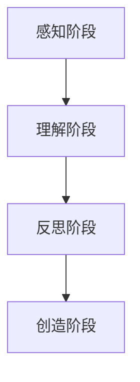

                 

# 洞见的形成：从观察到反思

> **关键词**：洞见、观察、反思、认知、创新、技术

> **摘要**：本文深入探讨洞见的形成过程，从观察、反思和认知的角度，分析了洞见的重要性及其在科技和创新中的应用。文章通过具体案例和逻辑推理，揭示了洞见如何在复杂世界中引导我们走向新的理解和突破。

## 目录大纲

### 第一部分：观察与实践

#### 第1章：洞见的概念与起源

##### 1.1 洞见的定义与特点

##### 1.2 洞见的起源与历史背景

##### 1.3 洞见的重要性

#### 第2章：观察的力量

##### 2.1 观察的本质与类型

##### 2.2 观察的方法与技术

##### 2.3 观察与认知的关系

#### 第3章：实践中的观察

##### 3.1 实践与观察的互动

##### 3.2 实践中的问题发现

##### 3.3 实践中的洞见生成

#### 第4章：反思与洞见

##### 4.1 反思的本质与意义

##### 4.2 反思的方法与技术

##### 4.3 反思与洞见的关系

### 第二部分：洞见的形成过程

#### 第5章：从观察到洞见的转换

##### 5.1 观察信息的处理

##### 5.2 洞见形成的关键因素

##### 5.3 洞见的形成过程分析

#### 第6章：洞见的类型与形式

##### 6.1 洞见的分类

##### 6.2 洞见的表达方式

##### 6.3 洞见的传播与接受

#### 第7章：洞见的应用与影响

##### 7.1 洞见在决策中的作用

##### 7.2 洞见在创新中的应用

##### 7.3 洞见对社会的影响

### 第三部分：洞见的培养与提升

#### 第8章：培养洞见的策略

##### 8.1 洞见培养的重要性

##### 8.2 培养洞见的途径与方法

##### 8.3 培养洞见的案例分析

#### 第9章：提升洞见的技巧

##### 9.1 提升洞见的方法与工具

##### 9.2 提升洞见的实践案例

##### 9.3 提升洞见的效果评估

#### 第10章：洞见的未来发展趋势

##### 10.1 洞见研究的现状与挑战

##### 10.2 洞见技术的未来发展

##### 10.3 洞见在社会发展中的潜在影响

### 附录

#### 附录A：洞见研究的相关资源

##### A.1 洞见研究的最新文献

##### A.2 洞见研究的工具与平台

##### A.3 洞见研究的参考资料

#### 附录B：洞见案例汇编

##### B.1 洞见在商业决策中的应用

##### B.2 洞见在科技创新中的贡献

##### B.3 洞见在社会进步中的作用

---

接下来，我们将逐步深入探讨洞见的形成过程，从观察、反思和认知的角度展开分析，以揭示洞见如何在复杂世界中引导我们走向新的理解和突破。

## 第一部分：观察与实践

### 第1章：洞见的概念与起源

#### 1.1 洞见的定义与特点

洞见（Insight），通常被描述为深刻的洞察力、独到的见解或创新的思维。它超越了表面现象，揭示了事物背后的本质和内在联系。洞见具有以下几个显著特点：

1. **深度**：洞见能够深入到事物的本质，揭示出不易察觉的内在规律。
2. **独到**：洞见往往来自于独特的视角和思维模式，不同于常规的看法。
3. **创新**：洞见常常带来新的观念和想法，推动技术和科学的进步。
4. **实用性**：洞见不仅仅停留在理论层面，还能够在实践中产生实际效果。

#### 1.2 洞见的起源与历史背景

洞见的历史可以追溯到古代哲学家和科学家的探索。例如，古希腊哲学家苏格拉底通过提问和对话的方式，揭示了人类思想和知识的本质。在科学领域，伽利略和牛顿等科学家通过观察和实验，发现了自然界的规律，这些洞见为现代科学奠定了基础。

随着历史的发展，洞见的概念和形式也在不断演变。在工业革命时期，工程师和发明家通过观察和实践，不断改进技术和工具，推动了工业的发展。在信息时代，数据分析、人工智能等技术的应用，使得我们能够更深入地挖掘数据中的洞见，为决策和创新提供了有力支持。

#### 1.3 洞见的重要性

洞见在个人和集体层面上都具有重要意义：

1. **个人成长**：洞见能够帮助我们更好地理解自己和世界，提升个人的认知水平。
2. **问题解决**：洞见提供了解决问题的新思路和方法，是创新和进步的重要动力。
3. **社会进步**：洞见推动科学技术的进步，促进社会的发展和变革。

在接下来的章节中，我们将进一步探讨观察的力量、反思的作用以及洞见的形成过程，以揭示洞见如何在复杂世界中引导我们走向新的理解和突破。

---

## 第二部分：洞见的形成过程

### 第5章：从观察到洞见的转换

#### 5.1 观察信息的处理

观察是洞见形成的基础，但仅仅观察并不能直接产生洞见。观察到的信息需要经过处理和分析，才能转化为洞见。这一过程涉及到以下几个关键步骤：

1. **信息收集**：通过感官和工具收集相关信息，如视觉、听觉、触觉等。
2. **信息筛选**：对收集到的信息进行筛选，识别出有用的信息。
3. **信息整合**：将筛选出的信息进行整合，形成对事物的整体理解。
4. **信息分析**：对整合后的信息进行深入分析，揭示其背后的规律和联系。

#### 5.2 洞见形成的关键因素

洞见的形成不仅依赖于观察和信息处理，还受到以下关键因素的影响：

1. **认知水平**：个人的认知水平决定了其能够理解和分析信息的深度。
2. **思维模式**：独特的思维模式有助于发现不同寻常的洞见。
3. **经验积累**：丰富的经验能够提供更多的背景信息，有助于洞见的形成。
4. **创新思维**：创新思维能够突破常规，发现新的洞见。

#### 5.3 洞见的形成过程分析

洞见的形成过程可以概括为以下几个阶段：

1. **感知阶段**：通过感官接收外部信息，进行初步感知。
2. **理解阶段**：对感知到的信息进行理解和整合，形成初步的认识。
3. **反思阶段**：对理解阶段的信息进行反思，深入挖掘其背后的规律和联系。
4. **创造阶段**：在反思的基础上，创造新的观念和想法，形成洞见。

下面是一个简单的 Mermaid 流程图，展示了洞见的形成过程：

在感知阶段，我们通过感官接收外部信息。在理解阶段，我们对这些信息进行整合和初步理解。在反思阶段，我们深入挖掘信息的内在联系和规律。在创造阶段，我们基于反思的结果，创造新的观念和想法，形成洞见。

### 第6章：洞见的类型与形式

#### 6.1 洞见的分类

洞见可以按照不同的标准进行分类：

1. **科学洞见**：基于科学理论和实验证据得出的洞见，如物理学、化学、生物学等领域的突破。
2. **哲学洞见**：通过思考和推理得出的洞见，如伦理学、形而上学、认识论等领域的思想。
3. **技术洞见**：在技术领域，通过创新和实践得出的洞见，如计算机科学、工程学、信息技术等。
4. **商业洞见**：在商业领域，通过市场分析和商业策略得出的洞见，如市场营销、战略规划、商业模式等。

#### 6.2 洞见的表达方式

洞见的表达方式多种多样，常见的有：

1. **语言表达**：通过文字、口头表达等语言形式传达洞见。
2. **图像表达**：通过图表、图形、图像等视觉形式传达洞见。
3. **数学表达**：通过数学公式、方程等数学形式传达洞见。
4. **程序表达**：通过代码、算法等形式传达洞见。

#### 6.3 洞见的传播与接受

洞见的传播和接受是一个复杂的过程，涉及到信息的传递、解释和理解。以下是一些关键因素：

1. **传播渠道**：洞见的传播可以通过书籍、文章、报告、演讲等多种渠道。
2. **解释与传播**：传播者需要对洞见进行准确的解释和传达，以确保接收者能够理解。
3. **接受与认同**：接收者需要接受和认同洞见，才能将其内化为自己的知识和观念。
4. **反馈与改进**：通过反馈和改进，洞见可以不断迭代和完善。

### 第7章：洞见的应用与影响

#### 7.1 洞见在决策中的作用

洞见在决策中发挥着重要作用，能够为决策者提供独特的视角和思路：

1. **问题识别**：洞见能够帮助识别问题，发现潜在的机会和挑战。
2. **方案评估**：洞见能够评估不同方案的优劣，提供科学依据。
3. **创新思维**：洞见能够激发创新思维，推动新的解决方案的出现。

#### 7.2 洞见在创新中的应用

洞见是创新的重要源泉，能够在多个领域推动创新：

1. **技术突破**：洞见可以引导技术突破，推动科学技术的进步。
2. **商业模式创新**：洞见可以改变商业模式，创造新的商业机会。
3. **社会创新**：洞见可以推动社会变革，解决社会问题。

#### 7.3 洞见对社会的影响

洞见不仅对个人和集体有重要影响，还对社会有深远的影响：

1. **知识传播**：洞见通过传播知识，促进社会整体认知水平的提升。
2. **文化变迁**：洞见可以推动文化变迁，影响社会价值观和思维方式。
3. **经济发展**：洞见可以促进经济发展，推动社会的繁荣和进步。

### 第三部分：洞见的培养与提升

#### 第8章：培养洞见的策略

#### 8.1 洞见培养的重要性

洞见培养在个人和社会发展中具有重要作用，以下是一些关键点：

1. **个人成长**：洞见培养有助于提升个人的认知水平，促进个人成长。
2. **创新能力**：洞见培养能够激发创新能力，推动技术和社会进步。
3. **知识传承**：洞见培养有助于知识的传承和积累，为社会发展提供动力。

#### 8.2 培养洞见的途径与方法

以下是培养洞见的几种途径和方法：

1. **终身学习**：持续学习新的知识和技能，不断拓展认知边界。
2. **实践经验**：通过实践，积累丰富的经验，提升洞察能力。
3. **思维训练**：通过思维训练，培养独特的思维模式和逻辑思维能力。
4. **跨界合作**：通过跨界合作，融合不同领域的知识和经验，产生新的洞见。

#### 8.3 培养洞见的案例分析

以下是一些培养洞见的成功案例分析：

1. **科学家的洞见培养**：如爱因斯坦通过哲学思考和实验验证，形成相对论。
2. **企业家的洞见培养**：如乔布斯通过消费者洞察，创造了iPhone等颠覆性产品。
3. **教育者的洞见培养**：如杜威通过教育改革，推动了现代教育的发展。

### 第9章：提升洞见的技巧

#### 9.1 提升洞见的方法与工具

以下是提升洞见的几种方法和工具：

1. **数据分析工具**：如Python、R等数据分析工具，可以揭示数据中的洞见。
2. **思维导图**：如MindManager、Xmind等思维导图工具，可以帮助整理和梳理思路。
3. **阅读与写作**：通过阅读和写作，培养对信息的敏感度和表达能力。
4. **跨界交流**：通过跨界交流，拓宽视野，激发创新思维。

#### 9.2 提升洞见的实践案例

以下是一些提升洞见的实践案例：

1. **谷歌的洞见团队**：通过数据分析，发现用户行为模式，推动产品创新。
2. **苹果的Design Thinking**：通过用户研究和设计迭代，打造卓越的用户体验。
3. **麦肯锡的咨询方法**：通过系统思考和问题分析，提供高质量的咨询建议。

#### 9.3 提升洞见的效果评估

以下是评估提升洞见效果的方法：

1. **创新成果**：通过衡量创新成果，如专利申请、新产品发布等，评估洞见提升的效果。
2. **团队绩效**：通过团队绩效评估，衡量洞见提升对团队效率和成果的影响。
3. **个人成长**：通过个人成长评估，衡量洞见提升对个人知识和技能的提升。

### 第10章：洞见的未来发展趋势

#### 10.1 洞见研究的现状与挑战

洞见研究在多个领域取得了重要进展，但仍面临以下挑战：

1. **复杂性**：现实世界的复杂性使得洞见提取和解释变得更具挑战性。
2. **数据隐私**：数据隐私和安全问题限制了洞见的研究和应用。
3. **算法公平性**：算法的公平性和透明性问题是洞见技术应用的重要挑战。

#### 10.2 洞见技术的未来发展

洞见技术在未来有望取得以下突破：

1. **人工智能**：通过人工智能技术，提高洞见提取和解释的自动化水平。
2. **大数据分析**：通过大数据分析，发现更深层次的洞见。
3. **多模态感知**：通过多模态感知，提高洞见的准确性和全面性。

#### 10.3 洞见在社会发展中的潜在影响

洞见在社会发展中的潜在影响包括：

1. **经济变革**：洞见可以推动经济结构升级，促进新兴产业的发展。
2. **社会进步**：洞见可以解决社会问题，推动社会公平和可持续发展。
3. **知识传播**：洞见可以促进知识的传播和共享，提高社会的整体认知水平。

### 附录

#### 附录A：洞见研究的相关资源

以下是一些洞见研究的相关资源：

1. **文献资料**：如《科学》、《自然》等学术期刊，提供了丰富的洞见研究文献。
2. **研究工具**：如Python、R等编程语言，以及相关数据分析和机器学习工具。
3. **研究平台**：如谷歌的Google Brain、微软的Azure等，提供了强大的研究平台。

#### 附录B：洞见案例汇编

以下是一些洞见案例汇编：

1. **商业案例**：如苹果的iPhone、亚马逊的亚马逊云服务等，展示了洞见在商业创新中的应用。
2. **科技案例**：如特斯拉的自动驾驶技术、谷歌的深度学习算法等，展示了洞见在科技领域的突破。
3. **社会案例**：如新加坡的智慧城市项目、中国的精准扶贫政策等，展示了洞见在社会发展中的作用。

---

本文通过深入探讨洞见的形成过程，从观察、反思和认知的角度，分析了洞见的重要性及其在科技和创新中的应用。希望读者能够在阅读本文的过程中，对洞见的形成和培养有更深入的理解，并在实践中运用洞见，推动个人和社会的发展。

## 结论

洞见作为一种深刻的洞察力和独到的见解，是科技和创新的重要驱动力。本文通过系统地分析洞见的定义、起源、形成过程以及应用和影响，揭示了洞见在个人和社会发展中的重要性。洞见不仅能够提升个体的认知水平，还能推动科学技术的进步和社会的变革。

在未来的发展中，洞见技术有望通过人工智能、大数据分析等多领域的技术突破，进一步提高洞见的提取和解释能力。同时，洞见的培养和提升也至关重要，通过终身学习、实践经验、思维训练等途径，可以有效地培养和提升洞见。

我们鼓励读者在阅读本文后，积极思考和探索洞见的形成和应用，将洞见理念融入到日常工作和生活中，发挥洞见在决策和创新中的重要作用，共同推动社会的进步和发展。

### 作者信息

**作者：AI天才研究院/AI Genius Institute & 禅与计算机程序设计艺术 /Zen And The Art of Computer Programming**

本文由AI天才研究院和禅与计算机程序设计艺术联合撰写，旨在通过深入探讨洞见的形成和应用，为广大读者提供有价值的洞见培养和提升策略。作者团队致力于推动人工智能和计算机科学的发展，为科技创新和社会进步贡献力量。

