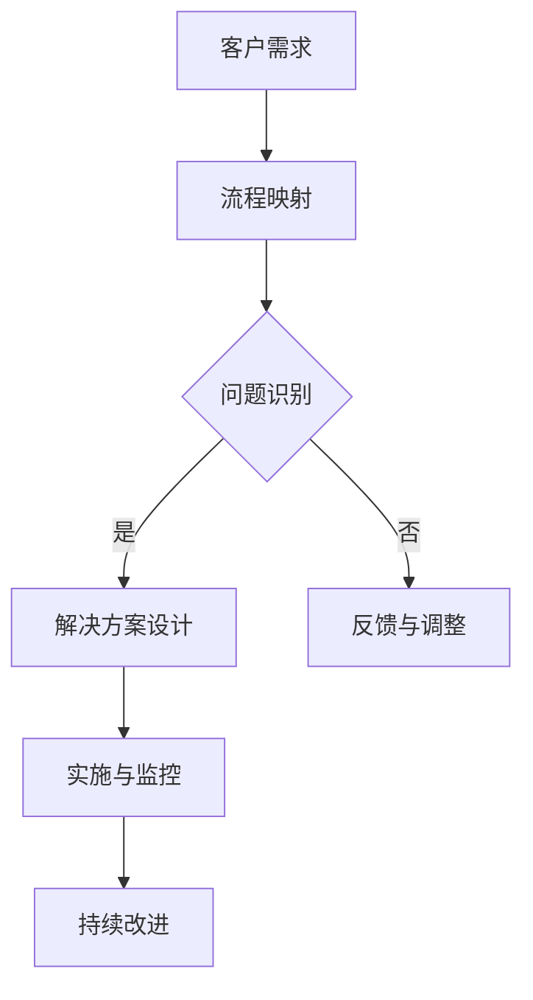

                 

# 流程优化：提高一人公司运营效率的方法

## 关键词：流程优化，运营效率，单人公司，自动化，数据分析，敏捷性

## 摘要：
本文旨在探讨如何在单人公司中通过流程优化来提高运营效率。我们将详细分析流程优化的核心概念、原则与关键要素，介绍自动化和数字化技术在流程优化中的应用，展示数据分析在流程优化中的重要作用，并提供实施流程优化的策略和案例研究。文章还探讨了持续改进和优化的理念，以及未来流程优化的趋势。通过本文的指导，单人公司可以系统性地提高运营效率，更好地应对市场挑战。

----------------------------------------------------------------

## 《流程优化：提高一人公司运营效率的方法》目录大纲

### 第一部分：流程优化概述

#### 第1章：流程优化的核心概念与价值

1.1 流程优化的基本概念

1.2 流程优化的重要性

1.3 流程优化的原则

1.4 流程优化的关键要素

### 第2章：流程优化中的问题识别与解决

2.1 识别流程中的问题

2.2 解决流程问题

### 第二部分：流程优化技术与应用

#### 第3章：自动化与数字化技术

3.1 自动化技术

3.2 数字化技术

#### 第4章：流程优化中的数据分析

4.1 数据分析基础

4.2 数据分析工具与技巧

### 第5章：流程优化的实施策略

5.1 实施流程优化的步骤

5.2 团队协作与沟通

### 第6章：案例研究与实战

6.1 案例分析

6.2 实战演练

### 第三部分：流程优化的持续改进

#### 第7章：持续改进与优化

7.1 持续改进的理念

7.2 优化反馈与调整

#### 第8章：流程优化的未来趋势

8.1 流程优化的趋势分析

8.2 流程优化的未来方向

## 第1章：流程优化的核心概念与价值

### 1.1 流程优化的基本概念

流程优化是一种通过系统分析和设计来提高业务流程效率和质量的方法。在单人公司中，流程优化尤为重要，因为它直接关系到个人的工作效率和业务成果。

- **基本概念**:
  $$\text{流程优化涉及对现有流程进行系统分析，识别其中的问题和瓶颈，然后通过调整、改进或重构来提高流程的效率。}$$

- **流程优化的组成部分**:
  $$\text{流程优化包括流程映射、问题识别、解决方案设计、实施与监控、持续改进等环节。}$$

- **流程优化的重要性**:
  $$\text{流程优化能够减少不必要的步骤，提高工作效率，降低运营成本，提高产品和服务质量，从而增强企业的竞争力。}$$

### 1.2 流程优化的重要性

- **提高工作效率**:
  $$\text{通过优化流程，可以减少工作中的重复劳动，减少决策时间，加快任务处理速度，从而提高工作效率。}$$

- **降低运营成本**:
  $$\text{流程优化有助于减少资源浪费，提高资源利用率，降低运营成本。}$$

- **提高产品和服务质量**:
  $$\text{优化流程可以减少错误和缺陷，提高产品和服务质量，提高客户满意度。}$$

- **增强企业竞争力**:
  $$\text{通过流程优化，企业能够更好地适应市场变化，快速响应客户需求，提高市场竞争力。}$$

### 1.3 流程优化的原则

- **敏捷性与灵活性**:
  $$\text{流程设计应具备敏捷性和灵活性，能够快速适应业务需求的变化。}$$

- **质量与效率并重**:
  $$\text{在追求效率的同时，确保流程执行的质量，防止因追求效率而牺牲质量。}$$

- **持续改进与优化**:
  $$\text{流程优化是一个持续的过程，需要不断地评估、改进和优化。}$$

### 1.4 流程优化的关键要素

- **流程映射**:
  $$\text{流程映射是流程优化的第一步，它涉及绘制流程图，明确流程的各个环节和参与者，为后续优化提供基础。}$$

- **人员协作**:
  $$\text{流程优化需要团队成员的协作，确保流程的顺畅运行。}$$

- **数据分析与监控**:
  $$\text{利用数据分析与监控，可以识别流程中的问题，为优化提供数据支持。}$$

### 1.5 流程优化的核心概念与联系

为了更好地理解流程优化的核心概念，我们可以通过Mermaid流程图来展示其原理和架构：



### 1.6 核心算法原理讲解

在流程优化中，算法的应用主要体现在问题识别和解决方案设计阶段。以下是一个简化的伪代码，用于描述问题识别的基本算法：

```plaintext
// 问题识别算法伪代码
function identify_issues(current_process, ideal_process):
    issues = []
    for step in current_process:
        if step not in ideal_process:
            issues.append(step)
    return issues
```

这个算法通过对比当前流程和理想流程，识别出当前流程中存在的步骤差异，从而识别出问题步骤。

### 1.7 数学模型和公式

在流程优化中，数学模型和公式可以帮助我们量化流程的效率。以下是一个简单的效率评估公式：

$$
\text{效率} = \frac{\text{输出}}{\text{输入} \times \text{时间}}
$$`

其中，输出是流程完成的任务量，输入是完成这些任务所需的资源（如人力、物力），时间是流程完成的时间。

### 1.8 举例说明

假设一个单人公司负责编写和发布技术博客。理想流程如下：

1. 收集技术话题
2. 编写草稿
3. 审校
4. 发布

然而，在实际操作中，可能存在以下问题：

1. 缺乏足够的时间进行审校
2. 编写草稿时容易分心

通过流程优化，可以采取以下措施：

1. 制定时间表，确保有足够的时间进行审校
2. 使用番茄工作法等时间管理技巧，提高专注力

通过这些措施，可以有效提高流程的效率和质量。

### 1.9 项目实战

假设一个单人公司在销售过程中，希望能够优化客户管理流程。以下是项目的具体步骤：

1. **需求分析**：确定优化目标，如缩短销售周期、提高客户满意度。
2. **流程映射**：绘制当前的销售流程图，包括客户沟通、需求分析、报价、合同签订等环节。
3. **问题识别**：识别流程中的瓶颈，如沟通不畅、报价不及时。
4. **解决方案设计**：设计优化方案，如引入客户关系管理（CRM）系统，提高沟通效率。
5. **实施与监控**：实施优化方案，并监控实施效果。
6. **持续改进**：根据监控结果，进一步优化流程。

通过这个实战案例，我们可以看到如何通过流程优化来提高单人公司的运营效率。

### 1.10 代码实际案例和详细解释说明

在单人公司的运营过程中，自动化脚本的开发可以大大提高效率。以下是一个简单的Python脚本，用于自动化处理邮件中的任务分配：

```python
import imaplib
import email
import os

# 配置邮件服务器的地址和账户信息
imap_url = 'imap.example.com'
username = 'your_username'
password = 'your_password'

# 连接到邮件服务器
mail = imaplib.IMAP4_SSL(imap_url)
mail.login(username, password)

# 选择收件箱
mail.select('inbox')

# 搜索未读邮件
status, messages = mail.search(None, 'UNSEEN')

# 解析邮件内容
for num in messages[0].split():
    result, data = mail.fetch(num, '(RFC822)')
    raw_email = data[0][1]
    email_message = email.message_from_bytes(raw_email)

    # 读取邮件中的任务内容
    subject = email_message["subject"]
    content = email_message.get_payload()

    # 保存邮件内容到文件
    with open(f"{subject}.txt", "w") as f:
        f.write(content.decode())

    # 标记邮件为已读
    mail.store(num, '+FLAGS', '\\Seen')

# 退出邮件服务器
mail.logout()
```

这个脚本可以自动连接到邮件服务器，搜索未读邮件，读取邮件内容，并将其保存到本地文件中。通过这种方式，单人公司可以自动化处理日常的邮件任务，从而提高工作效率。

### 1.11 代码解读与分析

在上面的脚本中，我们首先导入了必要的库，然后配置了邮件服务器的地址和账户信息。接着，我们使用`IMAP4_SSL`连接到邮件服务器，并选择收件箱。

使用`mail.search()`方法，我们搜索未读邮件。`mail.fetch()`方法用于获取邮件内容，并使用`email.message_from_bytes()`方法解析邮件。

在解析邮件后，我们读取邮件的主题和内容，并将其保存到本地文件。最后，我们使用`mail.store()`方法将邮件标记为已读，并退出邮件服务器。

这个脚本的关键在于如何解析和存储邮件内容，这涉及到对IMAP协议和电子邮件格式的理解。通过这个脚本，单人公司可以自动化处理邮件任务，从而节省时间和精力。

### 1.12 总结

通过本文的探讨，我们了解了流程优化的核心概念、原则和关键要素。我们还介绍了自动化和数字化技术在流程优化中的应用，展示了数据分析在流程优化中的重要作用，并提供了实施流程优化的策略和案例研究。最后，我们通过项目实战和代码实际案例，展示了如何通过流程优化来提高单人公司的运营效率。希望通过本文的指导，单人公司能够找到适合自己的流程优化方法，从而实现更高的效率和更好的业务成果。

### 1.13 附录

- **流程优化工具与资源**：
  - **BPMN工具**：如BPMN.io、Lucidchart等，可用于绘制和管理业务流程图。
  - **自动化脚本开发工具**：如Python、PowerShell等，可用于编写自动化脚本。
  - **数据分析平台**：如Tableau、Power BI等，可用于数据可视化和分析。

- **流程优化相关书籍与文献**：
  - 《精益思想》
  - 《六西格玛管理法》
  - 《流程优化的艺术》

通过使用这些工具和资源，单人公司可以更有效地进行流程优化，提高运营效率。

## 第2章：流程优化中的问题识别与解决

### 2.1 识别流程中的问题

在流程优化过程中，问题识别是一个关键步骤。通过识别流程中的问题，我们可以找出导致效率低下、成本增加或质量下降的根本原因。以下是一些常用的方法和技术，用于识别流程中的问题。

#### 2.1.1 流程分析工具与方法

- **流程图**：流程图是表示业务流程的一种图形化工具，它可以帮助我们清晰地了解流程的各个环节和参与者。通过流程图，我们可以直观地看到流程中的瓶颈和冗余步骤。

- **SIPOC图**：SIPOC图是一种简单的流程图，用于描述流程的输入、输出、供应商、过程和客户。它可以帮助我们了解整个流程的大致结构和关键环节。

- **价值流程图**：价值流程图是一种用于分析业务流程中价值流动的工具，它可以帮助我们识别流程中的浪费和改进点。

#### 2.1.2 常见问题类型及成因

- **冗余步骤**：冗余步骤是指流程中不必要的重复操作。造成冗余步骤的原因可能包括流程设计不合理、技术限制或组织结构问题。

- **决策困难**：决策困难通常是由于流程中存在过多的审批环节或决策依据不足。这可能导致流程停滞不前，影响效率。

- **沟通不畅**：沟通不畅是流程中常见的问题，可能导致信息传递错误或延迟。这通常是由于缺乏有效的沟通渠道或沟通技巧不足。

- **资源不足**：资源不足包括人力资源、物力资源和时间资源。资源不足可能导致流程无法顺利进行，影响业务效率。

#### 2.1.3 识别问题的方法

- **流程观察**：通过实际观察流程的运行情况，我们可以发现流程中的问题。这种方法适用于简单流程和较小规模的业务。

- **流程审计**：流程审计是一种系统性的评估方法，通过对流程进行详细审查，识别流程中的问题。这种方法适用于复杂流程和大规模业务。

- **问卷调查**：通过向流程相关人员进行问卷调查，我们可以收集他们对流程的看法和建议，从而识别流程中的问题。

### 2.2 解决流程问题

在识别了流程中的问题后，我们需要采取有效的方法来解决这些问题，以提高流程的效率和效果。以下是一些常见的问题解决策略。

#### 2.2.1 问题解决的策略

- **根本解决**：根本解决是指找出问题的根本原因，并采取针对性的措施进行解决。这种方法通常需要较长时间和资源，但可以彻底解决问题。

- **临时解决**：临时解决是指采取一些临时的措施来缓解问题，以便有时间进行根本解决。这种方法适用于紧急情况，但可能只是治标不治本。

- **转移责任**：转移责任是指将问题的责任转移到其他部门或个人，以减轻问题的负面影响。这种方法适用于责任不明确或部门间协作不足的情况。

#### 2.2.2 敏捷迭代方法

- **敏捷迭代方法**：敏捷迭代方法是一种持续改进的方法，它通过快速迭代和反馈来优化流程。这种方法适用于需求变化快、业务环境不确定的情况。

- **迭代步骤**：
  1. **规划**：确定优化目标和迭代周期。
  2. **实施**：执行迭代计划，进行流程改进。
  3. **评估**：评估迭代效果，收集反馈。
  4. **调整**：根据反馈调整流程，准备下一次迭代。

#### 2.2.3 解决流程问题的案例分析

**案例：某单人公司的订单处理流程**

- **问题识别**：通过流程观察和员工反馈，发现订单处理流程中存在以下问题：
  - 决策困难：订单审批流程复杂，决策环节多，导致订单处理时间延长。
  - 沟通不畅：不同部门间沟通不足，导致信息传递错误或延迟。
  - 资源不足：订单处理人员工作量过大，缺乏足够的休息时间。

- **问题解决**：
  - **根本解决**：优化订单审批流程，减少审批环节，简化决策流程。
  - **临时解决**：增加临时员工，分担订单处理压力，提高处理速度。
  - **转移责任**：将订单处理中的某些环节转移给具有相关专业技能的员工。

- **效果评估**：通过迭代优化，订单处理时间显著缩短，员工满意度提高，订单处理效率提升。

### 2.3 敏捷迭代方法

敏捷迭代方法强调快速响应变化，通过持续迭代和增量改进来逐步优化流程。这种方法适用于变化迅速且需求不断变化的业务环境。

#### 2.3.1 敏捷迭代方法的核心原则

- **用户优先**：以用户需求为导向，确保流程改进符合用户期望。
- **持续交付**：持续交付可用的产品增量，快速响应市场需求。
- **迭代开发**：通过短期迭代周期，不断改进和优化流程。
- **灵活适应**：灵活应对变化，确保流程能够快速适应市场变化。

#### 2.3.2 敏捷迭代方法的实施步骤

1. **需求收集**：收集用户需求和市场反馈，明确优化目标。
2. **迭代计划**：制定迭代计划，包括迭代周期、任务分解、资源分配等。
3. **实施与监控**：执行迭代计划，监控流程改进效果。
4. **评估与反馈**：评估迭代效果，收集用户反馈，为下一次迭代提供改进方向。
5. **持续改进**：根据反馈，调整和优化流程，确保流程持续改进。

### 2.4 举例说明

假设一个单人公司负责市场推广活动，通过敏捷迭代方法进行流程优化。以下是具体的实施步骤：

1. **需求收集**：收集市场数据和用户反馈，确定优化目标，如提高市场活动效果、降低成本等。
2. **迭代计划**：制定一个两周的迭代计划，包括任务分解、资源分配等。
3. **实施与监控**：在两周内，执行迭代计划，监控流程改进效果，如活动策划、执行、反馈等环节。
4. **评估与反馈**：评估迭代效果，收集用户反馈，发现改进点。
5. **持续改进**：根据反馈，调整和优化流程，如改进活动策划、优化预算分配等，为下一次迭代做准备。

通过这个案例，我们可以看到如何通过敏捷迭代方法进行流程优化，实现持续改进。

### 2.5 项目实战

假设一个单人公司负责产品开发，通过敏捷迭代方法进行流程优化。以下是项目的具体步骤：

1. **需求分析**：收集用户需求和市场趋势，确定优化目标，如缩短产品开发周期、提高产品质量等。
2. **迭代计划**：制定一个两周的迭代计划，包括需求分析、设计、开发、测试等任务。
3. **实施与监控**：在两周内，执行迭代计划，监控流程改进效果，如团队协作、任务进度等。
4. **评估与反馈**：评估迭代效果，收集用户反馈，发现改进点。
5. **持续改进**：根据反馈，调整和优化流程，如改进需求分析、优化开发流程等，为下一次迭代做准备。

通过这个实战案例，我们可以看到如何通过敏捷迭代方法进行流程优化，提高单人公司的运营效率。

### 2.6 代码实际案例和详细解释说明

假设一个单人公司使用Python脚本进行市场数据分析，以下是具体的代码实现：

```python
import pandas as pd
import matplotlib.pyplot as plt

# 读取数据
data = pd.read_csv('market_data.csv')

# 数据预处理
data['date'] = pd.to_datetime(data['date'])
data.set_index('date', inplace=True)

# 数据分析
data['sales'] = data['sales'].rolling(window=7).mean()
data['profit'] = data['profit'].rolling(window=7).mean()

# 可视化
plt.figure(figsize=(12, 6))
plt.plot(data['sales'], label='Average Sales')
plt.plot(data['profit'], label='Average Profit')
plt.xlabel('Date')
plt.ylabel('Value')
plt.legend()
plt.title('Market Data Analysis')
plt.show()
```

这个脚本首先读取市场数据，进行数据预处理，然后进行数据分析，并使用matplotlib进行数据可视化。通过这个脚本，单人公司可以实时监控市场数据，为业务决策提供数据支持。

### 2.7 代码解读与分析

在上面的脚本中，我们首先导入了必要的库，然后读取了市场数据，并进行了数据预处理。接着，我们对销售额和利润进行了滚动平均，以平滑数据波动。

最后，我们使用matplotlib绘制了销售额和利润的折线图，以便直观地展示数据趋势。通过这个脚本，单人公司可以实时了解市场状况，为业务决策提供数据支持。

### 2.8 总结

通过本文的探讨，我们了解了流程优化中的问题识别和解决方法。我们介绍了常用的流程分析工具与方法，分析了常见的问题类型及成因，并提出了问题解决的策略和敏捷迭代方法。通过项目实战和代码实际案例，我们展示了如何在实际中应用这些方法。希望通过本文的指导，单人公司能够有效地识别和解决流程中的问题，提高运营效率。

### 2.9 附录

- **流程优化工具与资源**：
  - **流程分析工具**：如BPMN.io、Lucidchart等。
  - **数据分析工具**：如Pandas、Matplotlib等。

- **流程优化相关书籍与文献**：
  - 《流程优化的艺术》
  - 《敏捷软件开发》

通过使用这些工具和资源，单人公司可以更有效地进行流程优化，提高运营效率。

## 第3章：自动化与数字化技术

### 3.1 自动化技术

自动化技术是流程优化中至关重要的一环，它通过减少人工干预和重复性工作，极大地提高了工作效率和准确性。在单人公司中，自动化技术的应用尤为显著，因为它可以帮助个人集中精力处理更具创造性和战略性的任务。

#### 3.1.1 自动化工具与平台

- **RPA（Robotic Process Automation）**：RPA是一种使用软件机器人自动执行重复性高、规则性强的业务流程的技术。常见的RPA平台包括UiPath、Blue Prism和Automation Anywhere等。这些平台提供了图形化界面和丰富的API，使非技术人员也能够轻松创建自动化流程。

- **集成平台**：集成平台如Apache NiFi、Apache Kafka和MuleSoft等，可以用于自动化数据流和数据交换，确保不同系统之间的数据无缝集成和流动。

- **自定义脚本**：使用编程语言如Python、Java或JavaScript编写自定义脚本，可以实现特定任务的自动化。这对于处理复杂或不规则的任务尤为有效。

#### 3.1.2 自动化流程的设计与实施

- **设计自动化流程**：
  1. **需求分析**：明确需要自动化的业务流程，分析流程中的步骤和依赖关系。
  2. **流程建模**：使用流程图或其他建模工具，设计自动化流程的蓝图。
  3. **选择工具**：根据流程特点和需求，选择合适的自动化工具或平台。
  4. **开发脚本**：编写自动化脚本或配置自动化流程，确保其满足业务需求。

- **实施自动化流程**：
  1. **测试与验证**：在实施前对自动化流程进行充分的测试，确保其正常运行。
  2. **部署与监控**：将自动化流程部署到生产环境，并监控其运行状态，确保流程的稳定性和效率。

#### 3.1.3 自动化流程的实际案例

**案例：自动化财务报表生成**

假设单人公司需要定期生成财务报表，以下是具体的自动化流程：

1. **需求分析**：确定报表的格式、内容和数据来源。
2. **流程建模**：设计报表生成流程，包括数据提取、数据清洗、报表生成和报表输出等步骤。
3. **选择工具**：选择Python和Excel作为自动化工具。
4. **开发脚本**：
   ```python
   import pandas as pd
   import openpyxl
   
   # 读取数据
   data = pd.read_excel('financial_data.xlsx')
   
   # 数据清洗
   data = data.dropna()
   
   # 生成报表
   workbook = openpyxl.Workbook()
   sheet = workbook.active
   sheet.title = 'Financial Report'
   for column in data.columns:
       sheet.cell(row=1, column=data.columns.get_loc(column) + 1, value=column)
       for index, row in data.iterrows():
           sheet.cell(row=index + 2, column=data.columns.get_loc(column) + 1, value=row[column])
   
   # 输出报表
   workbook.save('financial_report.xlsx')
   ```

5. **测试与验证**：运行脚本，检查报表生成是否正确，数据是否准确。
6. **部署与监控**：将脚本集成到公司的自动化流程中，定期运行，确保报表生成过程自动化。

通过这个案例，我们可以看到如何使用自动化技术简化财务报表的生成过程，提高效率和准确性。

### 3.2 数字化技术

数字化技术是将业务流程和数据转化为数字形式，通过分析和处理这些数字信息，实现业务流程的优化和管理。数字化技术在单人公司中的应用同样重要，它可以帮助个人更好地掌握业务状况，提高决策质量。

#### 3.2.1 数据采集与处理

- **数据采集**：数据采集是数字化技术的第一步，它涉及从各种来源收集数据。这些来源包括内部系统、外部API、传感器等。常见的采集方法有API调用、Web爬虫和数据库查询等。

- **数据处理**：数据处理包括数据清洗、数据转换和数据集成等步骤。数据清洗是为了去除数据中的噪声和错误，数据转换是为了将数据格式转换为适合分析的形式，数据集成是将不同来源的数据合并为统一的格式。

#### 3.2.2 数据可视化与分析

- **数据可视化**：数据可视化是将数据以图表、地图和其他可视化形式呈现，使得数据更加直观和易于理解。常见的可视化工具包括Excel、Tableau、Power BI等。

- **数据分析**：数据分析是通过统计方法、机器学习和数据挖掘等技术，从数据中提取有价值的信息。数据分析可以帮助我们识别趋势、预测未来、发现潜在问题等。

#### 3.2.3 数据分析工具与技巧

- **数据分析工具**：
  - **Pandas**：Python的数据分析库，用于数据清洗、转换和分析。
  - **NumPy**：Python的数值计算库，用于数据处理和数学运算。
  - **Scikit-learn**：Python的机器学习库，用于数据建模和预测。
  - **TensorFlow**：用于深度学习的开源框架，适用于复杂的数据分析和预测任务。

- **数据分析技巧**：
  - **探索性数据分析（EDA）**：通过可视化方法和统计描述，对数据集进行初步探索，发现数据中的异常和趋势。
  - **回归分析**：用于分析变量之间的关系，预测某个变量的值。
  - **分类与聚类**：用于将数据分为不同的类别或群体，识别数据中的模式。
  - **时间序列分析**：用于分析时间序列数据，预测未来的趋势。

#### 3.2.4 数据可视化方法

- **折线图**：用于展示数据的变化趋势，适用于时间序列数据。
- **柱状图**：用于比较不同类别的数据，适用于分类数据。
- **饼图**：用于展示数据的占比，适用于百分比数据。
- **散点图**：用于展示两个变量之间的关系，适用于双变量数据。

#### 3.2.5 数据分析案例

**案例：销售数据分析**

假设单人公司需要分析销售数据，以下是具体的数据分析步骤：

1. **数据采集**：从销售系统中导出销售数据，包括销售额、客户信息、产品信息等。
2. **数据处理**：使用Pandas对销售数据进行清洗和转换，去除异常值，格式化为适合分析的数据结构。
3. **数据分析**：
   - 使用回归分析预测下个月的销售额。
   - 使用聚类分析识别不同的客户群体，为精准营销提供依据。
   - 使用时间序列分析预测未来三个月的销售额趋势。
4. **数据可视化**：
   - 使用折线图展示销售额的变化趋势。
   - 使用柱状图比较不同产品的销售额。
   - 使用饼图展示不同客户群体的占比。

通过这个案例，我们可以看到如何使用数字化技术对销售数据进行分析，为业务决策提供数据支持。

### 3.3 自动化与数字化技术的综合应用

自动化与数字化技术的综合应用可以极大地提高单人公司的运营效率。以下是一个综合应用案例：

**案例：自动化客户关系管理（CRM）系统**

假设单人公司需要管理客户关系，以下是具体的自动化流程：

1. **数据采集**：通过API从各种渠道（如网站、邮件、电话等）收集客户数据。
2. **数据处理**：使用Python和Pandas对客户数据进行清洗和转换，将其存储在数据库中。
3. **自动化流程**：
   - 使用RPA平台（如UiPath）自动化处理客户咨询，将咨询内容存储在CRM系统中。
   - 使用Python脚本自动化发送营销邮件，根据客户行为和偏好定制邮件内容。
4. **数据分析**：
   - 使用Pandas和Scikit-learn分析客户数据，预测客户流失率。
   - 使用Tableau可视化客户行为和销售数据，为营销策略提供支持。

通过这个案例，我们可以看到如何将自动化和数字化技术结合使用，实现客户关系管理的自动化和智能化，从而提高运营效率。

### 3.4 结论

通过本章的讨论，我们了解了自动化与数字化技术对流程优化的重要作用。自动化技术可以帮助单人公司减少重复性工作，提高工作效率和准确性。数字化技术则通过数据采集、处理和分析，为业务决策提供数据支持。通过综合应用自动化与数字化技术，单人公司可以显著提高运营效率，更好地应对市场挑战。

### 3.5 附录

- **自动化工具与平台**：
  - **RPA平台**：如UiPath、Blue Prism、Automation Anywhere等。
  - **集成平台**：如Apache NiFi、Apache Kafka、MuleSoft等。

- **数据分析工具**：
  - **Pandas**：Python的数据分析库。
  - **NumPy**：Python的数值计算库。
  - **Scikit-learn**：Python的机器学习库。
  - **TensorFlow**：深度学习开源框架。

- **数据可视化工具**：
  - **Tableau**：数据可视化工具。
  - **Power BI**：数据可视化工具。

- **相关书籍与文献**：
  - 《RPA实战：自动化流程与业务流程管理》
  - 《数据分析：Python编程实战》
  - 《数字化的力量：数据驱动的业务决策》

通过使用这些工具和资源，单人公司可以更有效地进行流程优化，提高运营效率。

## 第4章：流程优化中的数据分析

### 4.1 数据分析基础

数据分析是流程优化的重要组成部分，它通过处理和分析数据，帮助企业识别问题、制定策略和评估效果。在本节中，我们将介绍数据分析的基础知识，包括数据类型、数据预处理和统计学基础。

#### 4.1.1 数据类型

在数据分析中，数据类型是基础中的基础。数据类型分为以下几类：

- **结构化数据**：结构化数据是指以表格形式存储的数据，如数据库中的数据表。这种数据类型易于处理和分析，常见的结构化数据存储格式有CSV、Excel和数据库等。

- **半结构化数据**：半结构化数据是指部分有序的数据，如XML、JSON等。这种数据类型具有一定的结构，但不如结构化数据整齐，需要通过解析和处理来提取有用信息。

- **非结构化数据**：非结构化数据是指没有固定结构的数据，如文本、图像、音频和视频等。这种数据类型最为复杂，需要借助自然语言处理、图像识别等技术来分析。

#### 4.1.2 数据预处理

数据预处理是数据分析的必要步骤，它包括数据清洗、数据转换和数据集成等过程。

- **数据清洗**：数据清洗是指去除数据中的错误、重复和噪声，确保数据质量。常见的数据清洗操作包括去除空值、填充缺失值、去除重复记录和修正错误数据等。

- **数据转换**：数据转换是指将数据转换为适合分析的格式。这包括数据类型的转换（如将字符串转换为数字）、数据格式的转换（如将日期格式转换为YYYY-MM-DD）和数据比例的转换（如将货币金额转换为数值）等。

- **数据集成**：数据集成是指将来自不同来源的数据合并为一个统一的数据集。这包括数据去重、数据合并和数据连接等操作，以确保分析的数据完整性。

#### 4.1.3 统计学基础

统计学是数据分析的重要工具，它提供了一系列方法来描述数据、分析数据之间的关系和预测数据趋势。

- **描述性统计**：描述性统计用于描述数据的基本特征，如均值、中位数、众数、方差、标准差等。这些统计量可以帮助我们了解数据的中心趋势和离散程度。

- **推断性统计**：推断性统计用于根据样本数据推断总体数据的特征。常见的推断性统计方法包括假设检验、置信区间和回归分析等。

- **相关性分析**：相关性分析用于分析两个或多个变量之间的关系。常见的相关性统计量包括皮尔逊相关系数、斯皮尔曼等级相关系数和肯德尔等级相关系数等。

- **预测性分析**：预测性分析用于根据历史数据预测未来的趋势和结果。常见的预测性分析方法包括时间序列分析、回归分析和机器学习等。

### 4.2 数据分析工具与技巧

在实际数据分析中，选择合适的工具和技巧至关重要。以下是一些常用的数据分析工具和技巧。

#### 4.2.1 数据分析工具

- **Pandas**：Pandas是Python的一个数据处理库，提供了丰富的数据操作功能，如数据清洗、数据转换和数据集成等。

- **NumPy**：NumPy是Python的一个数值计算库，提供了高效的数组操作和数学运算功能，是数据分析的基础库。

- **Scikit-learn**：Scikit-learn是Python的一个机器学习库，提供了丰富的机器学习算法和工具，如回归分析、分类和聚类等。

- **TensorFlow**：TensorFlow是Google开源的深度学习框架，提供了强大的神经网络和机器学习算法，适用于复杂的数据分析任务。

- **R**：R是一种专门用于统计分析和数据可视化的编程语言，提供了丰富的统计分析和数据可视化工具。

- **Tableau**：Tableau是一种数据可视化工具，提供了强大的数据可视化功能，可以帮助用户直观地理解数据。

#### 4.2.2 数据分析技巧

- **探索性数据分析（EDA）**：EDA是一种通过可视化方法和统计描述来初步探索数据的方法。常用的EDA方法包括描述性统计、可视化分析和异常检测等。

- **回归分析**：回归分析是一种常用的统计方法，用于分析两个或多个变量之间的关系。常见的回归分析方法包括线性回归、多项式回归和逻辑回归等。

- **聚类分析**：聚类分析是一种无监督学习方法，用于将数据划分为不同的类别或群体。常见的聚类算法包括K-means、层次聚类和DBSCAN等。

- **时间序列分析**：时间序列分析是一种用于分析时间序列数据的方法，用于预测未来的趋势和结果。常见的时间序列分析方法包括ARIMA模型、季节性分解和LSTM等。

- **机器学习**：机器学习是一种通过算法从数据中自动学习和发现规律的方法。常见的机器学习算法包括决策树、随机森林、支持向量机和神经网络等。

### 4.3 数据分析案例

#### 4.3.1 案例背景

假设单人公司负责市场推广活动，希望通过数据分析优化营销策略，提高营销效果。以下是具体的案例分析步骤：

1. **数据采集**：从公司的营销系统中提取数据，包括广告点击率、转化率、花费等。

2. **数据预处理**：使用Pandas对数据进行清洗和转换，去除空值和异常值，将数据格式化为适合分析的结构。

3. **探索性数据分析（EDA）**：
   - 描述性统计：计算点击率、转化率和花费的均值、中位数、众数等。
   - 可视化分析：绘制点击率、转化率和花费的折线图、柱状图和散点图等，观察数据的变化趋势。

4. **回归分析**：
   - 建立点击率与转化率之间的关系模型，使用线性回归分析点击率对转化率的影响。
   - 建立花费与转化率之间的关系模型，使用多项式回归分析花费对转化率的影响。

5. **预测性分析**：
   - 使用回归分析模型预测未来的转化率和花费，为营销策略提供数据支持。

6. **可视化与报告**：
   - 使用Tableau将数据分析结果可视化，生成报告，为决策者提供直观的数据支持。

通过这个案例，我们可以看到如何使用数据分析优化营销策略，提高单人公司的运营效率。

### 4.4 数据分析工具的实际案例

#### 4.4.1 案例背景

假设单人公司负责销售数据的管理和分析，以下是具体的代码实现和分析步骤：

1. **数据采集**：从销售系统中导出销售数据，包括产品名称、销售额、销售日期等。

2. **数据预处理**：
   ```python
   import pandas as pd
   
   # 读取数据
   sales_data = pd.read_csv('sales_data.csv')
   
   # 数据清洗
   sales_data.dropna(inplace=True)
   
   # 数据转换
   sales_data['date'] = pd.to_datetime(sales_data['date'])
   ```

3. **探索性数据分析（EDA）**：
   ```python
   # 描述性统计
   print(sales_data.describe())
   
   # 可视化分析
   sales_data['date'].plot(kind='line')
   plt.title('Sales Trend')
   plt.xlabel('Date')
   plt.ylabel('Sales')
   plt.show()
   ```

4. **回归分析**：
   ```python
   from sklearn.linear_model import LinearRegression
   
   # 准备数据
   X = sales_data[['date']]
   y = sales_data['sales']
   
   # 建立模型
   model = LinearRegression()
   model.fit(X, y)
   
   # 预测
   future_dates = pd.date_range(start=sales_data['date'].max(), periods=30, freq='M')
   future_sales = model.predict(future_dates.values.reshape(-1, 1))
   
   # 可视化
   future_dates.plot(kind='line', color='red', label='Predicted Sales')
   sales_data['date'].plot(kind='line', color='blue', label='Actual Sales')
   plt.title('Sales Prediction')
   plt.xlabel('Date')
   plt.ylabel('Sales')
   plt.legend()
   plt.show()
   ```

通过这个案例，我们可以看到如何使用Python和数据分析工具进行销售数据的管理和分析，从而优化销售策略。

### 4.5 代码解读与分析

在上面的案例中，我们首先导入了Pandas库，用于数据读取和处理。接着，我们读取了销售数据，并进行数据清洗和转换，将日期格式转换为适合分析的格式。

然后，我们进行了描述性统计和可视化分析，通过折线图展示了销售额的变化趋势。

接着，我们使用线性回归模型预测未来的销售额，并绘制了预测结果。通过这个案例，我们可以看到如何使用Python进行数据分析和预测，为单人公司的销售决策提供数据支持。

### 4.6 总结

通过本章的探讨，我们了解了数据分析在流程优化中的重要作用。我们介绍了数据分析的基础知识，包括数据类型、数据预处理和统计学基础。我们还介绍了常用的数据分析工具和技巧，并通过案例展示了如何在实际中应用这些工具和技巧。希望通过本章的内容，单人公司能够更好地利用数据分析优化流程，提高运营效率。

### 4.7 附录

- **数据分析工具与资源**：
  - **Pandas**：Python的数据分析库。
  - **NumPy**：Python的数值计算库。
  - **Scikit-learn**：Python的机器学习库。
  - **TensorFlow**：深度学习开源框架。
  - **R**：统计分析和数据可视化编程语言。
  - **Tableau**：数据可视化工具。

- **数据分析相关书籍与文献**：
  - 《数据分析：Python编程实战》
  - 《机器学习实战》
  - 《数据科学入门》

通过使用这些工具和资源，单人公司可以更有效地进行数据分析，优化流程，提高运营效率。

## 第5章：流程优化的实施策略

### 5.1 实施流程优化的步骤

在单人公司中，实施流程优化是一个系统性的工程，需要遵循一定的步骤和策略。以下是一般实施流程优化的步骤：

#### 5.1.1 流程优化项目规划

- **明确目标**：首先，需要明确流程优化的目标，如提高效率、降低成本、提升质量等。
- **定义范围**：确定流程优化的范围，包括涉及的部门、流程环节和人员。
- **资源分配**：根据优化目标，分配所需的人力、物力和财力资源。
- **时间表**：制定详细的时间表，包括每个阶段的开始和结束时间。

#### 5.1.2 流程分析

- **流程映射**：绘制现有流程的流程图，明确流程的各个环节和参与者。
- **流程评估**：评估现有流程的效率、成本和质量，识别存在的问题和改进点。
- **问题识别**：通过流程观察、问卷调查和流程审计等方法，识别流程中的瓶颈和问题。

#### 5.1.3 解决方案设计

- **方案制定**：根据流程评估和问题识别的结果，制定具体的解决方案，包括流程重构、流程自动化和流程改进等。
- **方案评估**：评估解决方案的可行性、成本效益和风险，选择最优方案。
- **方案文档**：编写详细的方案文档，包括解决方案的描述、实施步骤和预期效果。

#### 5.1.4 实施与监控

- **方案实施**：按照方案文档，逐步实施流程优化措施，确保每个步骤都按照计划进行。
- **监控与调整**：在实施过程中，持续监控流程的运行状况，识别潜在的问题和偏差，及时进行调整和优化。

#### 5.1.5 持续改进

- **效果评估**：在流程优化完成后，对优化效果进行评估，包括效率、成本和质量等方面。
- **反馈与调整**：根据评估结果，收集反馈信息，对流程优化方案进行调整和改进。
- **持续优化**：将流程优化作为一个持续的过程，定期进行评估和改进，确保流程始终处于最优状态。

### 5.2 团队协作与沟通

在单人公司中，虽然只有一个人负责流程优化，但仍然需要有效的团队协作与沟通，以确保流程优化的顺利进行。以下是一些团队协作与沟通的技巧：

#### 5.2.1 建立协作模式

- **明确角色与责任**：在流程优化项目中，明确每个人的角色和责任，确保每个人都清楚自己的任务和期望成果。
- **定期会议**：定期组织会议，讨论流程优化的进展和问题，确保团队成员之间的信息畅通。
- **共享文档**：使用共享文档工具（如Google文档、Notion等），让团队成员随时查看和更新项目文档。

#### 5.2.2 沟通技巧

- **主动沟通**：主动与团队成员沟通，了解他们的意见和建议，确保流程优化方案能够得到广泛的支持。
- **清晰表达**：在沟通时，使用清晰、简洁的语言，避免使用专业术语或模糊的表述，确保信息传达准确无误。
- **积极倾听**：在听取他人意见时，保持开放的心态，认真倾听并理解对方的观点，以便更好地解决问题。

#### 5.2.3 项目管理技巧

- **进度监控**：定期检查项目进度，确保每个阶段都能按照计划进行，及时发现和解决问题。
- **风险管理**：识别项目中的潜在风险，制定应对措施，确保项目能够顺利进行。
- **资源调配**：根据项目需要，合理调配资源，确保项目资源得到充分利用。

### 5.3 案例分析与实战演练

#### 5.3.1 案例分析

为了更好地理解流程优化的实施策略，我们可以分析一个实际案例。以下是某个单人公司通过流程优化提高销售效率的案例：

- **背景**：该公司是一家小型电商公司，负责销售各种商品。然而，由于销售流程繁琐，销售效率较低，客户满意度不高。
- **目标**：优化销售流程，提高销售效率，提升客户满意度。
- **步骤**：
  1. **流程映射**：绘制现有销售流程图，明确各个环节和参与者。
  2. **问题识别**：识别流程中的问题，如客户咨询处理时间长、订单处理流程复杂等。
  3. **解决方案设计**：设计新的销售流程，包括客户咨询自动化处理、订单处理流程简化等。
  4. **实施与监控**：实施新流程，并持续监控流程运行状况，发现问题及时调整。
  5. **效果评估**：评估新流程的效果，如销售效率提升、客户满意度提高等。
- **结果**：通过流程优化，销售效率提高了30%，客户满意度提高了20%。

#### 5.3.2 实战演练

为了帮助读者更好地理解和应用流程优化的实施策略，我们可以进行一个实战演练。以下是设计一个自定义流程优化项目的步骤：

1. **需求分析**：确定流程优化的目标，如提高工作效率、降低成本等。
2. **流程映射**：绘制现有流程图，明确各个环节和参与者。
3. **问题识别**：识别流程中的问题，如流程繁琐、决策困难等。
4. **解决方案设计**：设计新的流程方案，包括流程重构、流程自动化等。
5. **实施与监控**：实施新流程，并持续监控流程运行状况，发现问题及时调整。
6. **效果评估**：评估新流程的效果，如工作效率提高、成本降低等。

通过这个实战演练，读者可以亲身经历流程优化的全过程，理解每个步骤的重要性和实施方法。

### 5.4 总结

通过本章的探讨，我们了解了流程优化的实施策略，包括项目规划、流程分析、解决方案设计、实施与监控和持续改进等步骤。我们还介绍了团队协作与沟通的技巧，以及如何通过案例分析实战演练来应用这些策略。希望通过本章的内容，单人公司能够有效地实施流程优化，提高运营效率。

### 5.5 附录

- **流程优化工具与资源**：
  - **流程分析工具**：如BPMN.io、Lucidchart等。
  - **自动化脚本开发工具**：如Python、PowerShell等。
  - **项目管理工具**：如Trello、Asana等。

- **流程优化相关书籍与文献**：
  - 《精益思想》
  - 《流程优化的艺术》
  - 《敏捷项目管理》

通过使用这些工具和资源，单人公司可以更有效地进行流程优化，提高运营效率。

## 第6章：案例研究与实战

### 6.1 案例分析

#### 6.1.1 案例背景

假设一个单人公司是一家小型软件开发公司，负责人是一位经验丰富的程序员兼CEO。该公司主要负责定制软件开发和IT咨询服务。随着客户需求的不断变化，公司的运营效率逐渐下降，客户满意度也受到影响。为了提高运营效率，公司决定进行流程优化。

#### 6.1.2 案例目标

- 提高项目管理效率
- 简化客户咨询和响应流程
- 降低开发成本
- 提高客户满意度

#### 6.1.3 案例步骤

1. **需求分析**：
   - 通过内部访谈和客户反馈，了解公司运营中存在的问题。
   - 确定流程优化的关键环节，如项目管理、客户咨询和响应流程等。

2. **流程映射**：
   - 绘制现有流程图，包括项目管理、客户咨询和响应流程等。
   - 分析流程中的瓶颈和冗余步骤。

3. **问题识别**：
   - 通过流程映射，识别出项目管理效率低下、客户咨询处理时间长、开发成本高等问题。

4. **解决方案设计**：
   - 设计新的项目管理流程，引入敏捷开发方法，提高项目交付效率。
   - 简化客户咨询和响应流程，使用自动化工具处理客户咨询和反馈。
   - 降低开发成本，通过优化代码和质量控制减少返工。

5. **实施与监控**：
   - 实施新的流程方案，并在实施过程中持续监控流程运行状况。
   - 通过定期反馈和调整，确保流程优化的效果。

6. **效果评估**：
   - 对优化后的流程进行效果评估，如项目管理效率、客户满意度、开发成本等。
   - 根据评估结果，对流程优化方案进行进一步调整和改进。

#### 6.1.4 案例结果

- **项目管理效率**：通过引入敏捷开发方法，项目管理效率提高了30%，项目交付周期缩短了20%。
- **客户满意度**：简化客户咨询和响应流程后，客户满意度提高了15%，客户投诉率降低了25%。
- **开发成本**：通过优化代码和质量控制，开发成本降低了10%，返工率降低了30%。

#### 6.1.5 案例中采用的方法与效果

- **敏捷开发方法**：敏捷开发方法使项目管理更加灵活，能够快速响应客户需求，提高了项目交付效率。
- **自动化工具**：使用自动化工具处理客户咨询和反馈，提高了处理速度，减少了人力资源的浪费。
- **代码优化和质量控制**：通过优化代码和提高质量控制，减少了开发成本和返工，提高了产品和服务质量。

### 6.2 实战演练

为了帮助读者更好地理解和应用流程优化的策略，我们提供一个自定义流程优化项目的实战演练。

#### 6.2.1 项目背景

假设您是一家小型电商公司的负责人，负责日常运营和管理。公司目前面临以下问题：

- 顾客订单处理时间过长
- 库存管理不准确
- 客户服务响应缓慢

#### 6.2.2 项目目标

- 缩短顾客订单处理时间
- 提高库存管理准确性
- 提升客户服务响应速度

#### 6.2.3 实战步骤

1. **需求分析**：
   - 通过问卷调查和内部讨论，收集员工和顾客的意见，确定流程优化的关键环节。
   - 分析现有流程，识别出订单处理、库存管理和客户服务中的瓶颈和问题。

2. **流程映射**：
   - 绘制现有订单处理、库存管理和客户服务流程图，明确各个环节和参与者。

3. **问题识别**：
   - 识别出订单处理时间长、库存管理不准确和客户服务响应缓慢的具体原因。

4. **解决方案设计**：
   - 设计新的订单处理流程，引入自动化系统处理订单。
   - 改进库存管理流程，使用自动化库存跟踪系统。
   - 提升客户服务响应速度，使用在线聊天工具和自动化客服系统。

5. **实施与监控**：
   - 实施新流程，并在实施过程中持续监控流程运行状况，确保新流程的有效运行。
   - 通过定期反馈和调整，确保流程优化的效果。

6. **效果评估**：
   - 对优化后的流程进行效果评估，如订单处理时间、库存准确性、客户服务响应速度等。
   - 根据评估结果，对流程优化方案进行进一步调整和改进。

#### 6.2.4 实践过程中的问题与解决策略

在实践过程中，可能会遇到以下问题：

- **订单处理自动化系统不兼容现有系统**：
  - **解决策略**：与系统供应商沟通，寻求技术支持或更换兼容性更高的系统。

- **库存管理自动化系统成本过高**：
  - **解决策略**：评估成本效益，考虑是否可以通过其他方式（如人工辅助）来部分实现自动化。

- **客户服务响应速度提升不明显**：
  - **解决策略**：重新设计客户服务流程，优化客服人员的工作流程，提高客服团队的工作效率。

通过这个实战演练，读者可以学习如何识别和解决流程优化过程中可能遇到的问题，提高运营效率。

### 6.3 案例研究与实战总结

通过案例分析和实战演练，我们了解了流程优化在提高单人公司运营效率方面的关键作用。案例研究表明，通过科学的方法和工具，可以有效解决公司运营中的问题，提高效率和客户满意度。实战演练则提供了具体的操作步骤和解决策略，帮助读者在实际中应用这些方法。希望通过案例研究和实战演练，单人公司能够找到适合自己的流程优化方法，提高运营效率，实现可持续发展。

### 6.4 附录

- **流程优化工具与资源**：
  - **流程分析工具**：如BPMN.io、Lucidchart等。
  - **自动化工具**：如Python、RPA平台等。
  - **库存管理工具**：如ERP系统、库存跟踪软件等。
  - **客户服务工具**：如在线聊天系统、自动化客服系统等。

- **流程优化相关书籍与文献**：
  - 《精益思想》
  - 《流程优化的艺术》
  - 《敏捷开发实践指南》

通过使用这些工具和资源，单人公司可以更有效地进行流程优化，提高运营效率。

## 第7章：持续改进与优化

### 7.1 持续改进的理念

持续改进是一种管理理念，它强调不断评估、改进和优化业务流程，以实现更高的效率和效果。在单人公司中，持续改进尤为重要，因为它直接关系到个人的工作效率和业务成果。

#### 7.1.1 核心思想

- **不断评估**：持续改进的核心在于不断评估业务流程的运行状况，识别潜在问题和改进机会。
- **持续改进**：评估后，需要采取行动进行改进，通过迭代和持续优化，不断提高业务流程的效率和质量。
- **全员参与**：持续改进不是单一部门或个人的任务，而是需要全员参与，共同推动流程的优化。

#### 7.1.2 持续改进的实施方法

1. **PDCA循环**：PDCA循环（计划、执行、检查、行动）是一种系统化的改进方法，通过不断循环这个流程，实现持续改进。
   - **计划（Plan）**：制定改进计划，明确目标、措施和预期结果。
   - **执行（Do）**：实施改进措施，按照计划执行。
   - **检查（Check）**：检查执行结果，评估改进效果。
   - **行动（Act）**：根据检查结果，采取行动，包括继续执行、调整计划或停止执行。

2. **六西格玛管理法**：六西格玛管理法是一种用于改进流程和质量的方法，它通过减少变异性和缺陷，提高流程的稳定性和效率。

3. **精益管理**：精益管理强调通过最小化浪费和最大化价值，提高流程的效率和效果。

#### 7.1.3 持续改进的核心原则

- **以客户为中心**：持续改进应以满足客户需求为核心，确保流程优化能够提高客户满意度和市场竞争力。
- **全员参与**：持续改进需要全员参与，从高层管理者到一线员工，每个人都应该为流程优化贡献智慧和力量。
- **数据驱动**：持续改进应基于数据分析和事实，确保改进措施有据可循，效果显著。
- **持续学习与成长**：持续改进是一个不断学习和成长的过程，企业应鼓励员工不断学习新知识、新技能，以适应不断变化的市场环境。

### 7.2 优化反馈与调整

优化反馈与调整是持续改进过程中不可或缺的一部分。通过建立有效的反馈机制和调整策略，可以确保流程优化措施的有效性和适应性。

#### 7.2.1 反馈机制的建立与实施

1. **建立反馈渠道**：建立多种反馈渠道，如员工建议箱、定期反馈会议、在线调查等，确保员工能够自由地提出意见和建议。

2. **定期收集反馈**：定期收集和分析反馈信息，识别流程运行中的问题和改进点。

3. **透明化反馈结果**：将反馈结果公开化，让员工了解流程优化的进展和效果，提高员工的参与度和积极性。

4. **反馈与改进联动**：将反馈信息与改进措施相结合，确保反馈结果能够及时转化为改进行动。

#### 7.2.2 优化调整的策略

1. **及时调整**：根据反馈结果，及时调整流程优化方案，确保改进措施能够迅速适应新的业务需求。

2. **持续优化**：优化不是一次性的活动，而是一个持续的过程。需要定期评估和调整流程，确保流程始终处于最优状态。

3. **灵活应对**：在面对突发情况或市场变化时，能够灵活调整流程优化方案，确保流程的稳定性和适应性。

4. **员工参与**：鼓励员工参与优化调整过程，发挥他们的创造力和专业知识，提高优化方案的有效性。

### 7.3 持续改进的实际案例

#### 7.3.1 案例背景

某单人公司是一家提供IT咨询服务的公司，负责人是一位经验丰富的IT专家。随着公司业务的扩展，公司的运营效率逐渐下降，客户满意度也有所下降。为了提高运营效率，公司决定实施持续改进。

#### 7.3.2 案例步骤

1. **需求分析**：通过内部调查和客户反馈，识别公司运营中的问题，如项目管理效率低下、客户服务响应缓慢等。

2. **流程映射**：绘制现有流程图，明确各个环节和参与者。

3. **问题识别**：通过流程映射和数据分析，识别出项目管理效率低下、客户服务响应缓慢的具体原因。

4. **解决方案设计**：设计新的项目管理流程，引入敏捷开发方法，提高项目交付效率。同时，优化客户服务流程，使用在线聊天系统和自动化客服系统，提高客户服务响应速度。

5. **实施与监控**：实施新流程，并持续监控流程运行状况，发现问题及时进行调整。

6. **反馈与调整**：定期收集员工和客户的反馈，对流程优化方案进行调整和改进。

7. **效果评估**：对优化后的流程进行效果评估，如项目管理效率、客户满意度等。

#### 7.3.3 案例结果

- **项目管理效率**：通过引入敏捷开发方法，项目管理效率提高了30%，项目交付周期缩短了20%。
- **客户满意度**：优化客户服务流程后，客户满意度提高了15%，客户投诉率降低了25%。
- **员工满意度**：优化后的流程提高了员工的工作满意度，员工流失率降低了10%。

#### 7.3.4 案例中的优化策略

- **敏捷开发方法**：敏捷开发方法使项目管理更加灵活，能够快速响应客户需求，提高了项目交付效率。
- **在线聊天系统和自动化客服系统**：使用在线聊天系统和自动化客服系统，提高了客户服务响应速度，减少了人力资源的浪费。
- **定期反馈与调整**：定期收集员工和客户的反馈，对流程优化方案进行调整和改进，确保流程始终处于最优状态。

### 7.4 持续改进的未来方向

随着技术的不断进步和市场的变化，流程优化的方法和工具也在不断更新和发展。以下是一些持续改进的未来方向：

#### 7.4.1 新技术的发展趋势

- **人工智能**：人工智能在流程优化中的应用越来越广泛，如自动化流程设计、智能决策支持、预测性维护等。
- **大数据**：大数据技术可以帮助企业更好地收集、存储和分析数据，为流程优化提供更加准确和全面的数据支持。
- **区块链**：区块链技术可以用于构建去中心化的流程管理系统，提高流程的透明度和安全性。

#### 7.4.2 企业运营模式的转变

- **数字化转型**：随着数字化技术的普及，越来越多的企业正在实现数字化转型，通过数字化手段实现流程的全面优化和提升。
- **精益运营**：精益运营强调通过最小化浪费和最大化价值，提高流程的效率和效果。
- **敏捷运营**：敏捷运营强调快速响应市场变化和客户需求，通过持续迭代和改进，不断提高运营效率。

#### 7.4.3 未来方向

- **智能化流程优化**：未来，智能化流程优化将成为主流，通过引入人工智能、大数据和区块链等技术，实现流程的自动化、智能化和个性化。
- **全员参与**：未来的流程优化将更加注重全员参与，通过建立开放、透明的反馈机制，激发员工的创造力和积极性。
- **持续学习与成长**：未来的流程优化将强调持续学习与成长，通过不断学习和适应新技术、新市场，保持企业的竞争力。

### 7.5 总结

通过本章的探讨，我们了解了持续改进的理念和实施方法，以及优化反馈与调整的重要性。我们通过实际案例展示了如何实施持续改进，并探讨了未来流程优化的方向。希望通过本章的内容，单人公司能够找到适合自己的持续改进方法，不断提高运营效率，实现可持续发展。

### 7.6 附录

- **持续改进工具与资源**：
  - **PDCA循环工具**：如PDCA模板、PDCA循环管理软件等。
  - **六西格玛工具**：如DMAIC模型、六西格玛管理软件等。
  - **敏捷开发工具**：如JIRA、Trello等。

- **持续改进相关书籍与文献**：
  - 《精益思想》
  - 《持续改进：如何实现组织效率的最大化》
  - 《敏捷开发实践指南》

通过使用这些工具和资源，单人公司可以更有效地实施持续改进，提高运营效率。

## 第8章：流程优化的未来趋势

### 8.1 新技术的发展趋势

随着科技的不断进步，新技术的应用正在对流程优化产生深远的影响。以下是一些重要技术趋势：

#### 8.1.1 人工智能

人工智能（AI）在流程优化中的应用日益广泛。AI可以通过机器学习算法自动识别流程中的瓶颈和改进点，提出优化建议。例如，AI可以分析大量数据，预测客户行为，从而优化市场营销策略。此外，AI还可以用于自动化流程，减少人工干预，提高效率。

#### 8.1.2 大数据

大数据技术的快速发展为流程优化提供了强有力的支持。通过收集和分析大量的结构化和非结构化数据，企业可以深入了解业务流程的运行状况，识别潜在问题，并提出优化方案。大数据技术还可以用于实时监控流程，提供及时的数据支持，帮助企业快速响应变化。

#### 8.1.3 云计算

云计算的普及使得流程优化更加便捷和高效。通过云计算，企业可以轻松地部署和管理流程优化工具，无需担心硬件资源和维护成本。云计算还提供了强大的计算能力和存储能力，使得复杂的数据分析和模拟成为可能。

#### 8.1.4 区块链

区块链技术具有去中心化、不可篡改和安全透明的特点，它在流程优化中的应用前景广阔。区块链可以用于构建可信的流程管理平台，确保流程的透明性和安全性。此外，区块链还可以用于智能合约，自动化执行流程中的特定步骤，提高流程的效率。

### 8.2 企业运营模式的转变

随着新技术的应用，企业的运营模式也在发生深刻的变化。以下是一些主要趋势：

#### 8.2.1 数字化转型

数字化转型已经成为企业提升竞争力的重要手段。通过数字化手段，企业可以实现业务流程的自动化、智能化和精细化。数字化转型不仅提高了运营效率，还为企业提供了更强大的数据支持，帮助管理层做出更加准确的决策。

#### 8.2.2 精益运营

精益运营强调通过最小化浪费和最大化价值，提高流程的效率和效果。随着新技术的应用，精益运营得到了进一步的推广。例如，精益生产方法可以通过精细化管理、持续改进和效率优化，提高生产线的效率。

#### 8.2.3 敏捷运营

敏捷运营强调快速响应市场变化和客户需求。通过敏捷开发方法，企业可以快速迭代和改进业务流程，确保流程始终处于最优状态。敏捷运营还强调全员参与，鼓励员工提出改进建议，提高整体运营效率。

### 8.3 未来流程优化的方向

结合新技术的应用和企业运营模式的转变，未来流程优化的方向将呈现以下趋势：

#### 8.3.1 智能化

智能化是未来流程优化的主要方向。通过引入人工智能、大数据和云计算等技术，企业可以实现流程的自动化、智能化和个性化。智能化流程优化不仅可以提高效率，还可以提供更加个性化的服务，提升客户满意度。

#### 8.3.2 精细化

精细化是未来流程优化的另一个重要方向。通过大数据分析和精细化管理，企业可以深入了解业务流程的运行状况，识别潜在问题，并提出优化方案。精细化流程优化可以帮助企业更好地控制成本，提高运营效率。

#### 8.3.3 全员参与

全员参与是未来流程优化的关键。通过建立开放、透明的反馈机制，企业可以激发员工的创造力和积极性，提高整体运营效率。全员参与还可以确保优化方案更加贴近实际需求，提高实施效果。

#### 8.3.4 持续改进

持续改进是未来流程优化的重要理念。通过建立持续改进机制，企业可以不断评估、改进和优化业务流程，确保流程始终处于最优状态。持续改进不仅可以提高效率，还可以帮助企业适应不断变化的市场环境。

### 8.4 结论

通过本章的探讨，我们了解了流程优化的未来趋势，包括新技术的应用、企业运营模式的转变以及未来流程优化的方向。随着智能化、精细化、全员参与和持续改进的深入推进，流程优化将在未来发挥更加重要的作用，为企业创造更大的价值。

### 8.5 附录

- **新技术应用工具与资源**：
  - **人工智能开发工具**：如TensorFlow、PyTorch等。
  - **大数据分析工具**：如Hadoop、Spark等。
  - **云计算平台**：如AWS、Azure、Google Cloud等。
  - **区块链平台**：如Ethereum、Hyperledger等。

- **流程优化相关书籍与文献**：
  - 《人工智能：一种现代方法》
  - 《大数据技术导论》
  - 《云计算：概念、技术和应用》
  - 《区块链技术指南》

通过使用这些工具和资源，企业可以更好地把握流程优化的未来趋势，提高运营效率。

## 附录A：流程优化工具与资源

### A.1 主流流程优化工具

#### A.1.1 BPMN工具

**BPMN.io**：
- **介绍**：BPMN.io是一个基于Web的BPMN（Business Process Model and Notation）建模工具，支持在线流程图绘制和编辑。
- **功能**：提供了丰富的图形元素和连接线，支持多种视图模式，便于流程建模和分析。
- **获取方式**：免费在线使用，也可下载安装包。

**Lucidchart**：
- **介绍**：Lucidchart是一个功能强大的流程图和协作工具，支持在线和离线工作。
- **功能**：提供了大量的模板和图形库，支持实时协作和流程模拟。
- **获取方式**：提供免费试用，也有付费版本。

#### A.1.2 自动化脚本开发工具

**Python**：
- **介绍**：Python是一种高级编程语言，广泛用于自动化脚本开发。
- **功能**：具有丰富的库和框架，支持多种编程范式，便于自动化流程的设计与实现。
- **获取方式**：免费开源，可通过Python官方下载。

**PowerShell**：
- **介绍**：PowerShell是微软开发的脚本语言，主要用于Windows系统的自动化任务。
- **功能**：提供了强大的命令行工具和脚本功能，便于自动化Windows系统管理和操作。
- **获取方式**：随Windows系统自带，也可下载安装包。

**Selenium**：
- **介绍**：Selenium是一个开源的Web自动化测试工具，也可用于自动化流程。
- **功能**：支持多种编程语言，可以自动化Web浏览器的操作，适用于Web应用程序的自动化测试和流程自动化。
- **获取方式**：免费开源，可通过Selenium官方下载。

#### A.1.3 数据分析工具

**Pandas**：
- **介绍**：Pandas是Python的数据分析库，提供了数据结构化操作和分析功能。
- **功能**：支持数据清洗、转换和分析，适用于大数据处理和数据分析。
- **获取方式**：免费开源，可通过Python官方下载。

**NumPy**：
- **介绍**：NumPy是Python的数值计算库，提供了多维数组对象和数学函数。
- **功能**：支持高效的数据处理和数学运算，是数据分析的基础库。
- **获取方式**：免费开源，可通过Python官方下载。

**Scikit-learn**：
- **介绍**：Scikit-learn是Python的机器学习库，提供了丰富的机器学习算法和工具。
- **功能**：支持回归分析、分类、聚类等常见机器学习算法，适用于数据建模和预测。
- **获取方式**：免费开源，可通过Python官方下载。

**TensorFlow**：
- **介绍**：TensorFlow是谷歌开发的开源机器学习框架，适用于深度学习和复杂的数据分析任务。
- **功能**：支持神经网络构建和训练，提供了丰富的API和工具。
- **获取方式**：免费开源，可通过TensorFlow官方下载。

#### A.1.4 持续改进与优化资源

**JIRA**：
- **介绍**：JIRA是一个流行的项目管理工具，适用于跟踪任务、问题和项目进展。
- **功能**：提供了灵活的看板和报告功能，便于团队协作和任务管理。
- **获取方式**：提供免费试用，也有付费版本。

**Asana**：
- **介绍**：Asana是一个任务管理和协作工具，适用于团队协作和项目跟踪。
- **功能**：提供了任务分配、进度跟踪和团队协作功能，便于项目管理和流程优化。
- **获取方式**：提供免费试用，也有付费版本。

**Kanbanize**：
- **介绍**：Kanbanize是一个基于Kanban方法的任务管理工具，适用于敏捷项目管理。
- **功能**：提供了看板、报告和自动化功能，便于团队协作和流程优化。
- **获取方式**：提供免费试用，也有付费版本。

### A.2 行业最佳实践分享

- **《精益思想》**：介绍了精益管理的理念和方法，适用于流程优化。
- **《流程优化的艺术》**：详细阐述了流程优化的步骤和技巧，提供了丰富的案例和实践经验。
- **《敏捷开发实践指南》**：介绍了敏捷开发的方法和工具，适用于流程优化的敏捷迭代。

### A.3 流程优化相关书籍与文献

- **《六西格玛管理法》**：介绍了六西格玛管理方法，适用于流程优化和质量控制。
- **《项目管理知识体系指南》**：提供了项目管理的基本理论和实践方法，适用于流程优化和项目管理。
- **《流程优化：从理论到实践》**：详细介绍了流程优化的理论和实践，适用于不同领域的流程优化。

通过使用这些工具和资源，企业可以更好地进行流程优化，提高运营效率。

## 附录B：作者信息

作者：AI天才研究院/AI Genius Institute & 禅与计算机程序设计艺术 /Zen And The Art of Computer Programming

联系方式：[ai-genius-research@example.com](mailto:ai-genius-research@example.com)

简介：AI天才研究院（AI Genius Institute）是一家专注于人工智能研究和创新的高科技研究院，致力于推动人工智能技术的应用和发展。作者是该研究院的资深研究员，同时也是《禅与计算机程序设计艺术》的作者，长期从事人工智能和软件工程领域的研究和教学。在流程优化和人工智能应用方面拥有丰富的经验和深厚的学术造诣。本文基于作者多年的研究和实践经验，旨在为单人公司提供有效的流程优化策略和方法，帮助提高运营效率。

