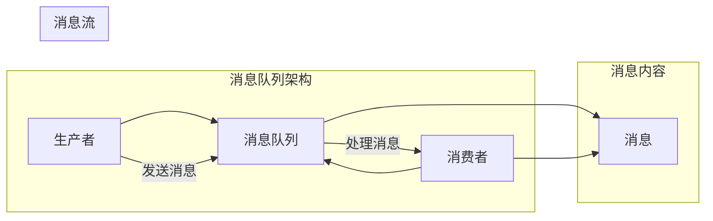
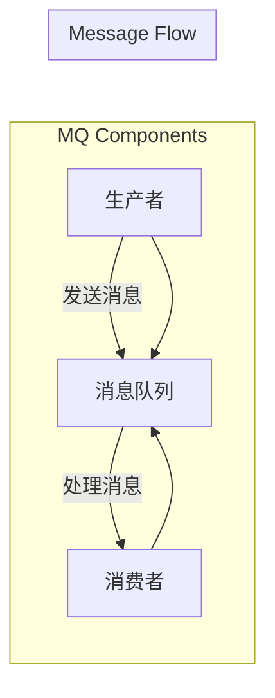
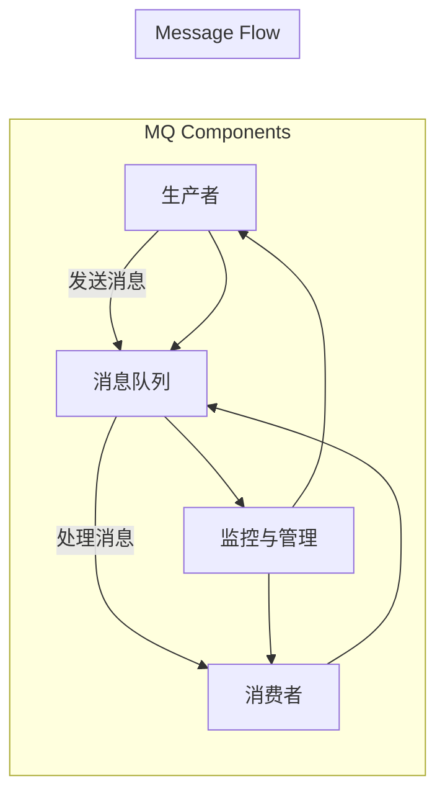

                 

### 《消息队列 原理与代码实例讲解》

#### 关键词：
- 消息队列
- 分布式系统
- 生产者-消费者模型
- AMQP
- Kafka
- RabbitMQ
- RocketMQ

#### 摘要：
本文旨在深入探讨消息队列的原理及其在实际应用中的重要性。我们将从基础概念开始，逐步介绍消息队列的工作原理、核心技术、主流消息队列系统，并探讨其在实时数据处理、微服务架构和高并发系统中的应用。通过具体的代码实例，我们将展示如何设计和实现消息队列系统，并提供解决方案以解决常见问题。

## 第一部分：消息队列基础

### 第1章：消息队列概述

#### 1.1 消息队列的定义和作用

##### 1.1.1 消息队列的概念

消息队列（Message Queue）是一种处理消息的异步通信工具，它允许生产者（Producer）将消息放入队列中，而消费者（Consumer）可以从队列中取出消息进行处理。这种模式在分布式系统中用于解耦、异步处理和流量削峰。

在消息队列中，消息是一个包含数据或指令的信息单元，它可以在不同的系统组件之间传递。队列是一个数据结构，用于存储等待处理的消息。

##### 1.1.2 消息队列的作用

- **解耦**：通过消息队列，生产者和消费者可以独立运行，不需要直接通信，从而实现系统组件之间的解耦。
- **异步处理**：消息队列允许生产者在消息发送后立即返回，而不需要等待消费者的处理结果，从而实现异步处理。
- **流量削峰**：在系统流量高峰期间，消息队列可以缓冲大量的消息，避免系统过载。

#### 1.2 消息队列的工作原理

##### 1.2.1 生产者-消费者模型

在消息队列中，生产者负责生成消息并将其放入队列中，而消费者负责从队列中取出消息进行处理。这种生产者-消费者模型是一种经典的分布式计算模型，它确保了消息的顺序性和一致性。

##### 1.2.2 消息传输机制

消息的传输机制包括消息的创建、发送、接收和确认。生产者创建消息并将其发送到队列，消费者从队列中取出消息进行处理，并返回处理结果。消息确认机制确保消息在传输过程中不被丢失。

#### 1.3 消息队列的类型

##### 1.3.1 点对点消息队列

点对点消息队列是一种一对一的消息传输模型，其中每个消息仅被一个消费者处理。它适用于需要精确控制消息传递的场景。

##### 1.3.2 发布-订阅消息队列

发布-订阅消息队列是一种一对多的消息传输模型，其中多个消费者可以订阅同一主题的消息。它适用于广播和通知场景。

## 第二部分：消息队列核心技术

### 第2章：消息队列核心技术

#### 2.1 消息队列协议

##### 2.1.1 AMQP协议

AMQP（Advanced Message Queuing Protocol）是一种广泛使用的消息队列协议，它提供了可靠的消息传递、消息持久化和消息确认等功能。

##### 2.1.2 MQTT协议

MQTT（Message Queuing Telemetry Transport）是一种轻量级的消息队列协议，它适用于物联网和低带宽环境，具有低功耗和简单的消息格式。

##### 2.1.3 HTTP协议

HTTP协议也可以用于消息队列，它提供了一种基于请求-响应模型的异步通信方式。虽然HTTP协议不是专门为消息队列设计的，但它适用于简单的消息传递场景。

#### 2.2 消息队列存储机制

##### 2.2.1 内存存储

内存存储具有快速的数据访问速度，适用于小规模的消息队列系统。然而，它受到内存大小的限制，不适合大规模应用。

##### 2.2.2 磁盘存储

磁盘存储提供了持久性和可靠性，适用于大规模的消息队列系统。然而，它的数据访问速度较慢。

##### 2.2.3 混合存储

混合存储结合了内存存储和磁盘存储的优点，提供了高性能和持久性。它适用于大规模、高并发的消息队列系统。

#### 2.3 消息队列并发处理

##### 2.3.1 单线程处理

单线程处理适用于小规模的消息队列系统，它简单且易于实现。然而，它无法充分利用多核处理器的性能。

##### 2.3.2 多线程处理

多线程处理适用于大规模的消息队列系统，它可以充分利用多核处理器的性能。然而，它需要复杂的线程管理和同步机制。

##### 2.3.3 并发队列

并发队列是一种支持并发访问的消息队列，它可以同时处理多个消费者的请求。它适用于高并发场景，但需要复杂的并发控制机制。

## 第三部分：主流消息队列系统

### 第3章：主流消息队列系统

#### 3.1 Apache Kafka

##### 3.1.1 Kafka的核心架构

Kafka是一个分布式流处理平台，它提供了高吞吐量、可扩展和可靠的消息队列服务。

- **生产者**：负责生成消息并将其发送到Kafka集群。
- **消费者**：负责从Kafka集群中接收消息并进行处理。
- **主题（Topic）**：Kafka中的消息分类，类似于数据库中的表。
- **分区（Partition）**：Kafka中的消息存储单元，可以提高消息的并行处理能力。

##### 3.1.2 Kafka的消息传输机制

Kafka使用分布式日志（Log）来存储消息，它确保了消息的顺序性和持久性。生产者将消息发送到特定的分区，消费者从分区中读取消息。

##### 3.1.3 Kafka的性能优化

Kafka的性能优化包括分区策略、复制机制、批处理等。合理配置这些参数可以显著提高Kafka的性能。

#### 3.2 RabbitMQ

##### 3.2.1 RabbitMQ的核心功能

RabbitMQ是一个功能丰富的消息队列中间件，它提供了可靠的消息传递、路由和消息确认等功能。

- **交换机（Exchange）**：用于路由消息到特定的队列。
- **队列（Queue）**：用于存储等待处理的消息。
- **绑定（Binding）**：用于连接交换机和队列。

##### 3.2.2 RabbitMQ的插件系统

RabbitMQ的插件系统提供了丰富的扩展功能，如消息监控、消息持久化等。这些插件可以自定义消息队列系统的行为。

##### 3.2.3 RabbitMQ的高可用性

RabbitMQ提供了多种高可用性机制，如镜像队列、集群等。这些机制可以确保消息队列系统的可靠性和持久性。

#### 3.3 RocketMQ

##### 3.3.1 RocketMQ的设计理念

RocketMQ是一个分布式消息队列系统，它提供了高性能、可靠性和可扩展性。

- **顺序消息**：RocketMQ支持顺序消息，确保消息的顺序性。
- **消息过滤**：RocketMQ支持消息过滤，可以根据消息属性进行路由。
- **消息持久化**：RocketMQ支持消息持久化，确保消息不丢失。

##### 3.3.2 RocketMQ的消息可靠性

RocketMQ提供了多种可靠性保障机制，如消息确认、消息重试等。这些机制可以确保消息被正确处理。

##### 3.3.3 RocketMQ的分布式特性

RocketMQ支持分布式架构，可以水平扩展以处理大规模消息队列需求。它提供了分布式事务消息、分布式队列等特性。

## 第四部分：消息队列应用与实践

### 第4章：消息队列应用场景

#### 4.1 实时数据处理

##### 4.1.1 数据流处理框架

实时数据处理是消息队列的重要应用场景之一。数据流处理框架，如Apache Flink和Apache Spark Streaming，可以与消息队列集成，实现实时数据分析和处理。

##### 4.1.2 消息队列在实时数据处理中的应用

消息队列可以用于实时数据采集、实时数据加工和实时数据分发，实现实时数据处理的高效和可靠。

#### 4.2 微服务架构

##### 4.2.1 微服务架构的概念

微服务架构是一种分布式系统架构风格，它将应用程序分解为小型、独立的服务模块。这些服务模块可以通过消息队列进行通信和协调。

##### 4.2.2 微服务架构中的消息队列

消息队列在微服务架构中用于服务间的异步通信、数据同步和分布式事务处理，实现系统的高可用性和可扩展性。

#### 4.3 高并发系统

##### 4.3.1 高并发系统的挑战

高并发系统面临大量并发请求的处理挑战，可能导致系统过载、响应缓慢和性能下降。

##### 4.3.2 消息队列在高并发系统中的应用

消息队列可以用于流量削峰、异步处理和分布式调度，实现高并发系统的稳定运行和高效处理。

## 第五部分：消息队列系统设计

### 第5章：消息队列系统设计

#### 5.1 消息队列系统架构设计

##### 5.1.1 系统架构设计原则

消息队列系统架构设计应遵循模块化、分布式、高可用性和可扩展性原则。

##### 5.1.2 消息队列系统的整体架构

消息队列系统的整体架构包括生产者、队列、消费者和监控组件，实现消息的生成、传输和处理。

#### 5.2 消息队列系统性能优化

##### 5.2.1 系统性能指标

消息队列系统的性能指标包括吞吐量、响应时间、并发能力等。

##### 5.2.2 性能优化策略

消息队列系统的性能优化策略包括硬件优化、软件优化和网络优化等。

#### 5.3 消息队列系统可靠性设计

##### 5.3.1 可靠性设计原则

消息队列系统的可靠性设计应遵循数据备份、故障转移和容错机制等原则。

##### 5.3.2 数据备份与恢复

消息队列系统应实现数据备份与恢复机制，确保消息的持久性和可靠性。

## 第六部分：消息队列项目实战

### 第6章：消息队列项目实战

#### 6.1 实战1：搭建Kafka消息队列系统

##### 6.1.1 Kafka环境搭建

介绍如何搭建Kafka环境，包括安装Kafka和配置Kafka集群。

##### 6.1.2 Kafka消息生产者

实现Kafka消息生产者，包括如何发送消息到Kafka集群。

##### 6.1.3 Kafka消息消费者

实现Kafka消息消费者，包括如何从Kafka集群中接收消息并处理。

#### 6.2 实战2：使用RabbitMQ实现异步处理

##### 6.2.1 RabbitMQ环境搭建

介绍如何搭建RabbitMQ环境，包括安装RabbitMQ和配置RabbitMQ集群。

##### 6.2.2 RabbitMQ消息生产者

实现RabbitMQ消息生产者，包括如何发送消息到RabbitMQ集群。

##### 6.2.3 RabbitMQ消息消费者

实现RabbitMQ消息消费者，包括如何从RabbitMQ集群中接收消息并处理。

#### 6.3 实战3：RocketMQ消息队列实践

##### 6.3.1 RocketMQ环境搭建

介绍如何搭建RocketMQ环境，包括安装RocketMQ和配置RocketMQ集群。

##### 6.3.2 RocketMQ消息生产者

实现RocketMQ消息生产者，包括如何发送消息到RocketMQ集群。

##### 6.3.3 RocketMQ消息消费者

实现RocketMQ消息消费者，包括如何从RocketMQ集群中接收消息并处理。

## 第七部分：消息队列常见问题与解决方案

### 第7章：消息队列常见问题与解决方案

#### 7.1 消息丢失问题

##### 7.1.1 消息丢失的原因

分析导致消息丢失的各种原因，包括网络故障、系统故障和消息确认失败等。

##### 7.1.2 消息丢失的解决方案

讨论如何解决消息丢失问题，包括重试机制、消息确认和备份等。

#### 7.2 消息积压问题

##### 7.2.1 消息积压的原因

分析导致消息积压的各种原因，包括系统性能瓶颈、消息处理延迟和流量激增等。

##### 7.2.2 消息积压的解决方案

讨论如何解决消息积压问题，包括扩容、消息过滤和流量控制等。

#### 7.3 消息顺序问题

##### 7.3.1 消息顺序保障机制

介绍如何保障消息的顺序性，包括顺序消息、顺序消费和顺序队列等。

##### 7.3.2 消息顺序问题的解决方案

讨论如何解决消息顺序问题，包括优化消息顺序和顺序处理策略等。

## 附录

### 附录A：消息队列系统工具与资源

#### A.1 常用消息队列系统工具

介绍常用的消息队列系统工具，如Kafka Manager、RabbitMQ Management UI等。

#### A.2 消息队列系统文档与教程

提供有关消息队列系统的官方文档和教程资源。

#### A.3 消息队列系统开源项目

介绍一些知名的、开源的消息队列系统项目，如Apache Kafka、RabbitMQ等。

### 作者

作者：AI天才研究院/AI Genius Institute & 禅与计算机程序设计艺术 /Zen And The Art of Computer Programming

### 《消息队列 原理与代码实例讲解》

#### 第一部分：消息队列基础

### 第1章：消息队列概述

#### 1.1 消息队列的定义和作用

##### 1.1.1 消息队列的概念

消息队列是一种分布式系统中用于异步消息传递的机制。它允许系统中的不同组件（生产者）发送消息，其他组件（消费者）可以异步地接收和处理这些消息。消息队列的主要作用包括：

1. **解耦**：通过消息队列，生产者和消费者可以独立运行，无需直接交互。这样可以降低系统组件之间的耦合度，提高系统的可维护性和可扩展性。
2. **异步处理**：消息队列允许生产者在发送消息后立即返回，无需等待消费者的处理结果。这样可以提高系统的响应速度和吞吐量，特别是在处理耗时任务或大量数据时。
3. **流量削峰**：在系统面临高峰流量时，消息队列可以缓冲大量的消息，避免系统因瞬时大量请求而崩溃。

##### 1.1.2 消息队列的工作原理

消息队列的基本工作原理可以概括为以下几个步骤：

1. **生产者发送消息**：生产者将消息放入消息队列中。这个过程通常称为“入队”。
2. **消息队列存储消息**：消息队列将接收到的消息存储在内部缓冲区或磁盘上，以便后续处理。
3. **消费者消费消息**：消费者从消息队列中取出消息并处理。这个过程通常称为“出队”。
4. **消息确认**：消费者在处理完消息后，通常需要向生产者或消息队列发送确认消息，表示消息已被成功处理。

消息队列中的消息可以是文本、XML、JSON等各种格式，具体取决于系统的需求。

##### 1.1.3 消息队列的类型

根据消息队列的工作方式和应用场景，可以分为以下几种类型：

1. **点对点（Point-to-Point）消息队列**：在这种类型的消息队列中，每个消息只能被一个消费者处理。消息通常具有明确的接收者，类似于一对一的通信方式。这种消息队列适用于需要精确控制消息传递的场景，例如订单处理系统。

2. **发布-订阅（Publish-Subscribe）消息队列**：在这种类型的消息队列中，多个消费者可以订阅同一主题的消息。当一个消息被发布到主题时，所有订阅该主题的消费者都会接收到该消息。这种消息队列适用于广播和通知场景，例如系统通知、日志收集等。

#### 1.2 消息队列的工作原理

消息队列的工作原理可以分为以下几个方面：

1. **生产者-消费者模型**：消息队列通常采用生产者-消费者模型。生产者负责生成消息并将其发送到消息队列中，消费者从消息队列中获取消息并进行处理。

2. **消息传输机制**：消息的传输通常通过队列实现。生产者将消息放入队列中，消费者从队列中取出消息。消息队列提供了可靠的传输机制，确保消息不会丢失。

3. **消息确认机制**：消费者在处理完消息后，通常需要向生产者或消息队列发送确认消息，表示消息已被成功处理。这样可以确保消息的可靠传输和处理。

4. **消息持久化**：消息队列通常支持消息的持久化，即将消息存储在磁盘上，以便在系统故障时恢复。这样可以确保消息的持久性和可靠性。

#### 1.3 消息队列的类型

根据消息队列的工作原理和应用场景，常见的消息队列类型包括：

1. **点对点（Point-to-Point）消息队列**：这种消息队列类型的典型代表是RabbitMQ。点对点消息队列的特点是每个消息只能被一个消费者处理，消息传递是单向的。适用于需要一对一消息传递的场景，如订单处理、异步任务处理等。

2. **发布-订阅（Publish-Subscribe）消息队列**：这种消息队列类型的典型代表是Kafka和RocketMQ。发布-订阅消息队列的特点是多个消费者可以订阅同一主题的消息，消息传递是多向的。适用于需要广播消息、系统通知等场景。

#### 2.1 消息队列协议

消息队列协议是消息队列系统中的重要组成部分，它定义了消息的生产、传输和消费的规范。常见的消息队列协议包括：

1. **AMQP（Advanced Message Queuing Protocol）**：AMQP是一种广泛使用的消息队列协议，它提供了一系列高级功能，如可靠传输、消息持久化、消息确认等。AMQP适用于各种类型的消息队列系统，包括企业级的消息队列解决方案。

2. **MQTT（Message Queuing Telemetry Transport）**：MQTT是一种轻量级的消息队列协议，适用于物联网和低带宽环境。它的特点是低功耗、简单和高效。MQTT适用于需要低延迟、高可靠性和简单消息格式的场景，如智能家居、传感器网络等。

3. **HTTP/REST**：虽然HTTP/REST不是专门为消息队列设计的协议，但它在某些场景下也被用作消息队列协议。HTTP/REST的优点是简单、易于实现和广泛支持。它适用于简单的消息传递场景，如Web服务之间的通信。

#### 2.2 消息队列存储机制

消息队列存储机制是消息队列系统中的一个重要组成部分，它决定了消息的持久性和性能。常见的消息队列存储机制包括：

1. **内存存储**：内存存储具有快速的数据访问速度，适用于小规模的消息队列系统。内存存储的主要优点是响应速度快，但缺点是数据持久性较差，一旦系统崩溃或重启，内存中的消息将丢失。

2. **磁盘存储**：磁盘存储提供了持久性和可靠性，适用于大规模的消息队列系统。磁盘存储的主要优点是数据持久性较好，但缺点是数据访问速度较慢。

3. **混合存储**：混合存储结合了内存存储和磁盘存储的优点，提供了高性能和持久性。在混合存储中，消息队列系统可以根据需要将消息存储在内存或磁盘上，以实现最优的性能和持久性。适用于大规模、高并发的消息队列系统。

#### 2.3 消息队列并发处理

消息队列系统通常需要处理大量的并发请求，因此并发处理能力是衡量消息队列系统性能的重要指标。常见的消息队列并发处理方法包括：

1. **单线程处理**：单线程处理是最简单的一种并发处理方法。它使用单个线程处理所有消息，适用于小规模的消息队列系统。单线程处理的优点是实现简单，但缺点是无法充分利用多核处理器的性能。

2. **多线程处理**：多线程处理使用多个线程处理消息，可以充分利用多核处理器的性能。多线程处理的优点是提高了系统的并发处理能力，但缺点是需要复杂的线程管理和同步机制。

3. **并发队列**：并发队列是一种支持并发访问的消息队列，它允许同时处理多个消费者的请求。并发队列的优点是简化了线程管理和同步机制，提高了系统的并发处理能力。适用于高并发场景。

#### 第3章：主流消息队列系统

##### 3.1 Apache Kafka

Apache Kafka是一个分布式流处理平台，它提供了高效、可扩展和可靠的消息队列服务。Kafka适用于大规模数据流处理、实时数据处理和消息队列应用。

##### 3.1.1 Kafka的核心架构

Kafka的核心架构包括以下组件：

1. **生产者**：生产者负责生成消息并将其发送到Kafka集群。生产者可以将消息发送到特定的主题和分区中。
2. **消费者**：消费者负责从Kafka集群中接收消息并进行处理。消费者可以订阅特定的主题和分区，以接收相关的消息。
3. **主题**：主题是Kafka中的消息分类，类似于数据库中的表。每个主题可以有多个分区，分区用于提高消息的并行处理能力。
4. **分区**：分区是Kafka中的消息存储单元，每个分区包含一个或多个消息。分区可以提高Kafka的并发处理能力和容错性。
5. **经纪人**：经纪人（Broker）是Kafka集群中的节点，负责存储和管理消息。每个经纪人可以存储多个主题和分区，并且可以与其他经纪人进行数据同步。

##### 3.1.2 Kafka的消息传输机制

Kafka的消息传输机制包括以下几个步骤：

1. **生产者发送消息**：生产者将消息发送到特定的主题和分区中。Kafka使用分区策略来确定消息应发送到哪个分区。
2. **消息存储**：Kafka将接收到的消息存储在磁盘上，以便后续处理。每个分区都有一个日志文件，用于存储消息。
3. **消费者消费消息**：消费者从Kafka集群中接收消息并进行处理。消费者可以订阅特定的主题和分区，以接收相关的消息。
4. **消息确认**：消费者在处理完消息后，通常需要向生产者或Kafka集群发送确认消息，表示消息已被成功处理。这样可以确保消息的可靠传输和处理。

##### 3.1.3 Kafka的性能优化

Kafka的性能优化包括以下几个方面：

1. **分区策略**：选择合适的分区策略可以提高Kafka的性能。常用的分区策略包括基于消息键的分区和基于主题的分区。
2. **复制机制**：Kafka使用副本机制提高消息的可靠性和容错性。合理配置副本数量和副本分配策略可以提高Kafka的性能。
3. **批处理**：批处理可以将多个消息合并成一批发送，从而减少网络传输次数和系统开销。
4. **压缩**：Kafka支持多种压缩算法，如GZIP、LZ4等。使用压缩算法可以减少数据传输量和存储空间，从而提高性能。

##### 3.2 RabbitMQ

RabbitMQ是一个功能丰富的消息队列中间件，它提供了可靠的消息传递、路由和消息确认等功能。RabbitMQ适用于企业级的消息队列应用。

##### 3.2.1 RabbitMQ的核心功能

RabbitMQ的核心功能包括：

1. **消息传递**：RabbitMQ提供了可靠的消息传递机制，确保消息不会丢失。
2. **路由**：RabbitMQ支持多种路由策略，如直接路由、发布-订阅等，可以实现复杂的消息路由。
3. **消息确认**：RabbitMQ支持消息确认机制，确保消息已被成功处理。
4. **持久化**：RabbitMQ支持消息的持久化，确保消息在系统故障时不会丢失。

##### 3.2.2 RabbitMQ的插件系统

RabbitMQ的插件系统提供了丰富的扩展功能，如消息监控、消息持久化等。这些插件可以自定义消息队列系统的行为，提高系统的可维护性和可扩展性。

##### 3.2.3 RabbitMQ的高可用性

RabbitMQ提供了多种高可用性机制，如镜像队列、集群等。这些机制可以确保消息队列系统的可靠性和持久性。

1. **镜像队列**：镜像队列是一种复制机制，确保消息在多个节点之间同步。这样可以提高系统的可靠性和容错性。
2. **集群**：RabbitMQ集群可以将多个节点组合成一个逻辑集群，提高系统的可用性和负载均衡。

##### 3.3 RocketMQ

RocketMQ是一个分布式消息队列系统，它提供了高性能、可靠性和可扩展性。RocketMQ适用于大规模、高并发的消息队列应用。

##### 3.3.1 RocketMQ的设计理念

RocketMQ的设计理念包括以下几个方面：

1. **高性能**：RocketMQ采用分布式架构，可以水平扩展，提高系统的性能。
2. **可靠性**：RocketMQ提供了多种可靠性保障机制，如消息确认、消息重试等，确保消息的可靠传输和处理。
3. **高可用性**：RocketMQ提供了多种高可用性机制，如主从复制、双主复制等，确保系统的可靠性和持久性。
4. **可扩展性**：RocketMQ可以灵活扩展，支持多种消息队列应用场景。

##### 3.3.2 RocketMQ的消息可靠性

RocketMQ的消息可靠性包括以下几个方面：

1. **消息确认**：RocketMQ支持消息确认机制，确保消息已被成功处理。
2. **消息重试**：RocketMQ支持消息重试机制，确保消息在失败时可以重新发送。
3. **消息持久化**：RocketMQ支持消息的持久化，确保消息在系统故障时不会丢失。

##### 3.3.3 RocketMQ的分布式特性

RocketMQ的分布式特性包括以下几个方面：

1. **分布式架构**：RocketMQ采用分布式架构，可以水平扩展，提高系统的性能和可靠性。
2. **分布式事务**：RocketMQ支持分布式事务消息，确保消息在分布式系统中的原子性和一致性。
3. **分布式队列**：RocketMQ支持分布式队列，可以同时处理多个消费者的请求，提高系统的并发处理能力。

## 第二部分：消息队列应用与实践

### 第4章：消息队列应用场景

#### 4.1 实时数据处理

##### 4.1.1 数据流处理框架

实时数据处理是消息队列的一个重要应用场景。数据流处理框架，如Apache Kafka、Apache Flink和Apache Spark Streaming，可以与消息队列集成，实现实时数据分析和处理。

数据流处理框架可以将消息队列中的消息作为数据源，对数据进行实时处理和分析。例如，可以使用Apache Flink处理实时数据流，进行实时计算、数据聚合和模式识别等操作。

##### 4.1.2 消息队列在实时数据处理中的应用

消息队列在实时数据处理中的应用主要包括以下几个方面：

1. **数据采集**：消息队列可以用于实时数据采集，将数据从不同的数据源发送到消息队列中。例如，可以将传感器数据、日志数据等发送到消息队列中，以便后续处理。
2. **数据加工**：消息队列可以用于实时数据加工，对采集到的数据进行预处理和清洗。例如，可以使用Apache Flink对传感器数据进行去重、聚合和过滤等操作，以便生成更准确的分析结果。
3. **数据分发**：消息队列可以用于实时数据分发，将处理后的数据发送到不同的消费者。例如，可以将实时数据分析结果发送到数据库、报表系统或可视化工具等，以便进行实时监控和分析。

#### 4.2 微服务架构

##### 4.2.1 微服务架构的概念

微服务架构是一种分布式系统架构风格，它将应用程序分解为多个小型、独立的服务模块。每个服务模块负责特定的功能，可以独立部署和扩展。

微服务架构的特点包括：

1. **服务拆分**：将应用程序拆分为多个小型服务模块，每个服务模块负责特定的功能。
2. **服务自治**：每个服务模块可以独立部署和运行，无需依赖其他服务。
3. **分布式通信**：服务模块之间通过消息队列进行通信和协调。
4. **容器化**：服务模块通常使用容器化技术部署和运行，提高系统的可扩展性和可维护性。

##### 4.2.2 微服务架构中的消息队列

消息队列在微服务架构中发挥着重要作用，包括以下几个方面：

1. **服务间通信**：消息队列用于服务模块之间的通信和协调。服务模块可以通过消息队列发送请求或通知其他服务模块，实现分布式系统的协同工作。
2. **异步处理**：消息队列可以用于异步处理，服务模块可以在发送消息后立即返回，无需等待处理结果。这样可以提高系统的响应速度和吞吐量。
3. **服务解耦**：消息队列可以实现服务模块之间的解耦，降低系统组件之间的耦合度。服务模块可以独立运行和扩展，无需关注其他服务的实现细节。
4. **流量控制**：消息队列可以用于流量控制，避免服务模块因大量请求而崩溃。通过控制消息队列的长度和消费速度，可以有效地控制服务模块的流量。

##### 4.3 高并发系统

##### 4.3.1 高并发系统的挑战

高并发系统面临以下挑战：

1. **性能瓶颈**：在高并发场景下，系统的性能可能成为瓶颈，导致响应速度变慢，影响用户体验。
2. **资源争夺**：高并发请求会争夺系统资源，如CPU、内存和网络等，可能导致系统过载和崩溃。
3. **数据一致性问题**：在高并发场景下，多个请求同时操作同一数据，可能引发数据一致性问题。
4. **流量激增**：在特定时刻，如活动促销、节假日等，系统的流量可能会激增，超出系统的处理能力。

##### 4.3.2 消息队列在高并发系统中的应用

消息队列在高并发系统中的应用主要包括以下几个方面：

1. **流量削峰**：消息队列可以用于流量削峰，缓冲大量的消息，避免系统因瞬时大量请求而崩溃。通过控制消息队列的长度和消费速度，可以有效地控制系统的流量。
2. **异步处理**：消息队列可以用于异步处理，服务模块可以在发送消息后立即返回，无需等待处理结果。这样可以提高系统的响应速度和吞吐量。
3. **分布式调度**：消息队列可以用于分布式调度，将消息发送到不同的服务模块进行处理。通过负载均衡和分布式调度，可以提高系统的并发处理能力。
4. **数据一致性保障**：消息队列可以用于实现分布式事务，保障数据的一致性。通过消息队列和分布式事务机制，可以确保多个请求对同一数据的一致性操作。

## 第三部分：消息队列系统设计

### 第5章：消息队列系统设计

#### 5.1 消息队列系统架构设计

##### 5.1.1 系统架构设计原则

消息队列系统架构设计应遵循以下原则：

1. **模块化**：将系统拆分为多个模块，每个模块负责特定的功能，降低系统的复杂度。
2. **分布式**：使用分布式架构，提高系统的可靠性和扩展性。
3. **高可用性**：设计冗余机制，确保系统在故障时仍然可以正常运行。
4. **可扩展性**：系统应支持水平扩展，以应对日益增长的数据和处理需求。

##### 5.1.2 消息队列系统的整体架构

消息队列系统的整体架构包括以下几个组件：

1. **生产者**：生产者负责生成消息并将其发送到消息队列。
2. **消息队列**：消息队列是消息存储和传输的核心，负责存储和管理消息。
3. **消费者**：消费者从消息队列中获取消息并进行处理。
4. **监控和管理**：监控和管理组件用于监控系统状态、性能指标和故障处理。

#### 5.2 消息队列系统性能优化

##### 5.2.1 系统性能指标

消息队列系统的性能指标包括：

1. **吞吐量**：系统每秒处理的消息数量。
2. **响应时间**：消息从生产者发送到消费者处理所需的时间。
3. **并发能力**：系统同时处理多个消息的能力。
4. **可靠性**：系统确保消息可靠传输和处理的能力。

##### 5.2.2 性能优化策略

消息队列系统的性能优化策略包括：

1. **分区策略**：合理配置分区数量和分区策略，提高系统的并行处理能力。
2. **批量处理**：批量处理可以减少网络传输次数和系统开销。
3. **压缩算法**：使用压缩算法可以减少数据传输量和存储空间。
4. **缓存**：使用缓存可以提高消息的读取速度。

#### 5.3 消息队列系统可靠性设计

##### 5.3.1 可靠性设计原则

消息队列系统可靠性设计应遵循以下原则：

1. **消息确认**：确保消息已被成功处理。
2. **数据备份**：备份数据以确保在系统故障时可以恢复。
3. **故障转移**：实现故障转移机制，确保系统在故障时仍然可以正常运行。
4. **监控和报警**：监控系统状态，及时发现问题并进行报警。

##### 5.3.2 数据备份与恢复

消息队列系统的数据备份与恢复策略包括：

1. **日志备份**：备份消息队列的日志文件，确保在系统故障时可以恢复消息。
2. **数据库备份**：备份消息队列的数据库，确保消息数据的一致性和完整性。
3. **故障恢复**：实现故障恢复机制，确保系统在故障后可以自动恢复。
4. **测试和演练**：定期进行备份和恢复测试，确保备份策略的有效性和可靠性。

### 第6章：消息队列项目实战

#### 6.1 实战1：搭建Kafka消息队列系统

##### 6.1.1 Kafka环境搭建

在本节中，我们将介绍如何在Linux环境中搭建Kafka消息队列系统。

1. **安装Kafka**：
   - 从Kafka官网下载最新版本的Kafka安装包。
   - 解压安装包并进入解压后的目录。
   - 运行`bin/kafka-server-start.sh config/server.properties`命令，启动Kafka服务器。

2. **创建主题**：
   - 使用Kafka命令创建主题：
     ```
     bin/kafka-topics.sh --create --topic my-topic --zookeeper localhost:2181 --replication-factor 1 --partitions 1 --topic-config "compression.type=none"
     ```

3. **启动生产者**：
   - 在一个终端窗口中，运行生产者示例程序：
     ```
     bin/kafka-console-producer.sh --broker-list localhost:9092
     ```

4. **启动消费者**：
   - 在另一个终端窗口中，运行消费者示例程序：
     ```
     bin/kafka-console-consumer.sh --bootstrap-server localhost:9092 --topic my-topic --from-beginning
     ```

##### 6.1.2 Kafka消息生产者

在本节中，我们将编写一个简单的Kafka消息生产者程序，用于向Kafka集群发送消息。

```java
import org.apache.kafka.clients.producer.*;
import java.util.Properties;

public class KafkaProducerDemo {
    public static void main(String[] args) {
        Properties props = new Properties();
        props.put("bootstrap.servers", "localhost:9092");
        props.put("key.serializer", "org.apache.kafka.common.serialization.StringSerializer");
        props.put("value.serializer", "org.apache.kafka.common.serialization.StringSerializer");

        Producer<String, String> producer = new KafkaProducer<>(props);

        for (int i = 0; i < 10; i++) {
            producer.send(new ProducerRecord<>("my-topic", "key" + i, "value" + i));
        }

        producer.close();
    }
}
```

该程序使用Kafka Producer API向名为“my-topic”的主题发送10条消息。

##### 6.1.3 Kafka消息消费者

在本节中，我们将编写一个简单的Kafka消息消费者程序，用于从Kafka集群接收并处理消息。

```java
import org.apache.kafka.clients.consumer.*;
import org.apache.kafka.common.serialization.StringSerializer;

import java.time.Duration;
import java.util.*;

public class KafkaConsumerDemo {
    public static void main(String[] args) {
        Properties props = new Properties();
        props.put("bootstrap.servers", "localhost:9092");
        props.put("group.id", "my-group");
        props.put("key.deserializer", StringSerializer.class.getName());
        props.put("value.deserializer", StringSerializer.class.getName());

        Consumer<String, String> consumer = new KafkaConsumer<>(props);
        consumer.subscribe(Collections.singletonList("my-topic"));

        while (true) {
            ConsumerRecords<String, String> records = consumer.poll(Duration.ofMillis(1000));
            for (ConsumerRecord<String, String> record : records) {
                System.out.printf("Received message: key=%s, value=%s, partition=%d, offset=%d\n",
                        record.key(), record.value(), record.partition(), record.offset());
            }
        }
    }
}
```

该程序使用Kafka Consumer API订阅名为“my-topic”的主题，并处理接收到的消息。

### 第6章：消息队列项目实战

#### 6.2 实战2：使用RabbitMQ实现异步处理

##### 6.2.1 RabbitMQ环境搭建

在本节中，我们将介绍如何在Linux环境中搭建RabbitMQ消息队列系统。

1. **安装Erlang**：
   - 下载并安装Erlang环境：
     ```
     sudo apt-get update
     sudo apt-get install erlang-nox
     ```

2. **安装RabbitMQ**：
   - 下载并安装RabbitMQ：
     ```
     sudo apt-get install rabbitmq-server
     ```

3. **启动RabbitMQ**：
   - 使用以下命令启动RabbitMQ服务：
     ```
     sudo systemctl start rabbitmq-server
     ```

4. **访问RabbitMQ管理界面**：
   - 在浏览器中输入`http://localhost:15672`，使用默认用户名`guest`和密码`guest`登录RabbitMQ管理界面。

##### 6.2.2 RabbitMQ消息生产者

在本节中，我们将编写一个简单的RabbitMQ消息生产者程序，用于向RabbitMQ集群发送消息。

```java
import com.rabbitmq.client.*;

import java.io.IOException;
import java.util.concurrent.TimeoutException;

public class RabbitMQProducerDemo {
    private final static String QUEUE_NAME = "my-queue";

    public static void main(String[] args) {
        ConnectionFactory factory = new ConnectionFactory();
        factory.setHost("localhost");
        try (Connection connection = factory.newConnection();
             Channel channel = connection.createChannel()) {
            channel.queueDeclare(QUEUE_NAME, false, false, false, null);
            for (int i = 0; i < 10; i++) {
                String message = "Message " + i;
                channel.basicPublish("", QUEUE_NAME, null, message.getBytes());
                System.out.println(" [x] Sent '" + message + "'");
            }
        } catch (IOException | TimeoutException e) {
            e.printStackTrace();
        }
    }
}
```

该程序使用RabbitMQ Java Client向名为“my-queue”的队列发送10条消息。

##### 6.2.3 RabbitMQ消息消费者

在本节中，我们将编写一个简单的RabbitMQ消息消费者程序，用于从RabbitMQ集群接收并处理消息。

```java
import com.rabbitmq.client.*;

import java.io.IOException;
import java.util.concurrent.TimeoutException;

public class RabbitMQConsumerDemo {
    private final static String QUEUE_NAME = "my-queue";

    public static void main(String[] args) {
        ConnectionFactory factory = new ConnectionFactory();
        factory.setHost("localhost");
        try (Connection connection = factory.newConnection();
             Channel channel = connection.createChannel()) {
            channel.queueDeclare(QUEUE_NAME, false, false, false, null);
            System.out.println(" [x] Waiting for messages. To exit press CTRL+C");
            Consumer consumer = new DefaultConsumer(channel) {
                @Override
                public void handleDelivery(String consumerTag, Envelope envelope,
                                           AMQP.BasicProperties properties, byte[] body) throws IOException {
                    String message = new String(body, "UTF-8");
                    System.out.println(" [x] Received '" + message + "'");
                }
            };
            channel.basicConsume(QUEUE_NAME, true, consumer);
        } catch (IOException | TimeoutException e) {
            e.printStackTrace();
        }
    }
}
```

该程序使用RabbitMQ Java Client订阅名为“my-queue”的队列，并处理接收到的消息。

### 第6章：消息队列项目实战

#### 6.3 实战3：RocketMQ消息队列实践

##### 6.3.1 RocketMQ环境搭建

在本节中，我们将介绍如何在Linux环境中搭建RocketMQ消息队列系统。

1. **安装Maven**：
   - RocketMQ依赖Maven进行构建，首先确保已经安装了Maven。
   - 可以通过访问[Apache Maven官网](https://maven.apache.org/)了解如何安装Maven。

2. **下载RocketMQ源码**：
   - 从GitHub下载RocketMQ的源码：
     ```
     git clone https://github.com/apache/rocketmq.git
     ```

3. **构建RocketMQ**：
   - 进入RocketMQ源码目录，使用Maven构建项目：
     ```
     cd rocketmq-all
     mvn clean install -Dmaven.test.skip=true
     ```

4. **启动NameServer**：
   - 在一个终端窗口中，启动NameServer：
     ```
     nohup sh bin/mqnamesrv &> /dev/null &
     ```

5. **启动Broker**：
   - 在另一个终端窗口中，启动Broker：
     ```
     nohup sh bin/mqbroker -n localhost:9876 &> /dev/null &
     ```

6. **访问RocketMQ控制台**：
   - 在浏览器中输入`http://localhost:8080/`，访问RocketMQ控制台。

##### 6.3.2 RocketMQ消息生产者

在本节中，我们将编写一个简单的RocketMQ消息生产者程序，用于向RocketMQ集群发送消息。

```java
import org.apache.rocketmq.client.producer.*;
import org.apache.rocketmq.common.message.Message;

import java.util.Properties;

public class RocketMQProducerDemo {
    public static void main(String[] args) {
        Properties properties = new Properties();
        properties.put("rocketmq.namesrv.addr", "localhost:9876");
        properties.put("java.naming.provider.url", "remote");
        properties.put("java.naming.provider.classname", "org.apache.rocketmq.common.client.RemoteNameService");
        
        DefaultMQProducer producer = new DefaultMQProducer("example-producer");
        producer.setNamesrvAddr("localhost:9876");
        
        try {
            producer.start();
            
            String topic = "TopicTest";
            for (int i = 0; i < 10; i++) {
                String message = "Message " + i;
                Message msg = new Message(topic, "TagA", message.getBytes());
                producer.send(msg);
                System.out.println(" [x] Sent Message: " + message);
            }
        } catch (Exception e) {
            e.printStackTrace();
        } finally {
            producer.shutdown();
        }
    }
}
```

该程序使用RocketMQ Producer API向名为“TopicTest”的主题发送10条消息。

##### 6.3.3 RocketMQ消息消费者

在本节中，我们将编写一个简单的RocketMQ消息消费者程序，用于从RocketMQ集群接收并处理消息。

```java
import org.apache.rocketmq.client.consumer.*;
import org.apache.rocketmq.common.consumer.ConsumeFromWhere;
import org.apache.rocketmq.common.message.MessageExt;

import java.util.List;
import java.util.Properties;

public class RocketMQConsumerDemo {
    public static void main(String[] args) {
        Properties properties = new Properties();
        properties.put("rocketmq.namesrv.addr", "localhost:9876");
        properties.put("group", "example-consumer");
        
        DefaultMQPushConsumer consumer = new DefaultMQPushConsumer("example-consumer");
        consumer.setNamesrvAddr("localhost:9876");
        consumer.setConsumeFromWhere(ConsumeFromWhere.ConsumeFromFirstOffset);
        
        try {
            consumer.subscribe("TopicTest", "TagA");
            
            System.out.println("Starting to consume messages...");
            consumer.start();
            
            while (true) {
                List<MessageExt> messages = consumer.poll(1000);
                for (MessageExt msg : messages) {
                    System.out.println("Received Message: " + msg.toString());
                }
            }
        } catch (Exception e) {
            e.printStackTrace();
        } finally {
            consumer.shutdown();
        }
    }
}
```

该程序使用RocketMQ Consumer API订阅名为“TopicTest”的主题，并处理接收到的消息。

## 第七部分：消息队列常见问题与解决方案

### 第7章：消息队列常见问题与解决方案

#### 7.1 消息丢失问题

##### 7.1.1 消息丢失的原因

消息队列中的消息丢失可能是由于以下原因引起的：

1. **网络故障**：在消息传递过程中，如果网络出现故障，可能导致消息丢失。
2. **系统故障**：消息队列服务器或消费者端出现故障时，可能导致消息处理失败。
3. **配置错误**：配置错误，如消息队列地址不正确、队列名称错误等，可能导致消息无法正确传递。
4. **消息确认失败**：消费者在处理消息后，未能正确向生产者或消息队列发送确认消息，导致消息被标记为丢失。

##### 7.1.2 消息丢失的解决方案

针对消息丢失的问题，可以采取以下解决方案：

1. **消息确认机制**：确保消费者在处理消息后，向生产者或消息队列发送确认消息。可以采用自动确认或手动确认机制。
2. **重试机制**：在消息发送失败时，重试发送消息。可以设置重试次数和重试间隔，以提高消息的可靠性。
3. **持久化存储**：将消息存储在持久化存储中，如磁盘或数据库。这样可以确保在系统故障时，消息不会丢失。
4. **监控和报警**：监控系统状态和消息队列性能，及时发现和处理消息丢失问题。可以设置报警阈值和报警策略。

#### 7.2 消息积压问题

##### 7.2.1 消息积压的原因

消息积压可能是由于以下原因引起的：

1. **处理速度慢**：消费者处理消息的速度较慢，导致消息在队列中积压。
2. **系统负载高**：系统面临大量并发请求，导致处理速度跟不上消息发送速度。
3. **网络延迟**：消息在网络传输过程中出现延迟，导致消息积压。
4. **队列容量不足**：消息队列容量不足，无法容纳新增的消息。

##### 7.2.2 消息积压的解决方案

针对消息积压的问题，可以采取以下解决方案：

1. **提高处理速度**：优化消费者的处理逻辑，提高消息的处理速度。可以通过并行处理、批量处理等技术提高处理效率。
2. **扩容和升级**：增加消费者数量或升级硬件资源，提高系统的处理能力。可以水平扩展或垂直扩展，以满足日益增长的消息量。
3. **流量控制**：通过设置流量控制机制，限制消息的发送速度，避免消息积压。可以使用令牌桶或漏桶算法实现流量控制。
4. **重试和死信队列**：将处理失败的消息发送到死信队列，并设置重试机制。可以定期检查死信队列中的消息，并尝试重新处理。

#### 7.3 消息顺序问题

##### 7.3.1 消息顺序保障机制

在分布式系统中，保障消息的顺序性是非常重要的。以下是一些常见的消息顺序保障机制：

1. **全局唯一序号**：为每个消息生成一个全局唯一的序号，确保消息按照生成序号顺序传递和处理。
2. **顺序队列**：使用顺序队列（如优先队列）来存储和处理消息，确保消息的顺序性。
3. **分布式锁**：在分布式系统中，使用分布式锁来控制消息的处理顺序，确保同一消息只能被一个消费者处理。
4. **消息标识**：为每个消息分配一个唯一的标识，如消息ID，确保消息的顺序性。

##### 7.3.2 消息顺序问题的解决方案

针对消息顺序问题，可以采取以下解决方案：

1. **顺序消息**：某些消息队列系统（如RocketMQ）支持顺序消息。可以通过使用顺序消息机制来保障消息的顺序性。
2. **顺序消费**：为消费者分配固定的分区，确保同一主题下的消息由同一消费者处理，从而保障消息的顺序性。
3. **消息确认**：消费者在处理完消息后，向生产者发送确认消息，确保消息已被成功处理。可以通过消息确认机制来保障消息的顺序性。
4. **分布式事务**：在分布式系统中，使用分布式事务来保障消息的一致性。通过分布式事务，可以确保消息的顺序性和完整性。

## 附录

### 附录A：消息队列系统工具与资源

#### A.1 常用消息队列系统工具

以下是一些常用的消息队列系统工具：

1. **Kafka Manager**：
   - 下载地址：[Kafka Manager官网](https://github.com/yahoo/kafka-manager)
   - 功能：用于监控和管理Kafka集群。

2. **RabbitMQ Management UI**：
   - 下载地址：[RabbitMQ Management UI官网](https://github.com/proulll/rabbitmq_management)
   - 功能：用于监控和管理RabbitMQ集群。

3. **RocketMQ Admin**：
   - 下载地址：[RocketMQ Admin官网](https://github.com/apache/rocketmq-externals)
   - 功能：用于监控和管理RocketMQ集群。

#### A.2 消息队列系统文档与教程

以下是一些有关消息队列系统的官方文档和教程资源：

1. **Kafka官方文档**：
   - 下载地址：[Kafka官方文档](https://kafka.apache.org/)

2. **RabbitMQ官方文档**：
   - 下载地址：[RabbitMQ官方文档](https://www.rabbitmq.com/documentation.html)

3. **RocketMQ官方文档**：
   - 下载地址：[RocketMQ官方文档](https://rocketmq.apache.org/docs/)

#### A.3 消息队列系统开源项目

以下是一些知名的、开源的消息队列系统项目：

1. **Apache Kafka**：
   - 下载地址：[Apache Kafka官网](https://kafka.apache.org/)

2. **RabbitMQ**：
   - 下载地址：[RabbitMQ官网](https://www.rabbitmq.com/)

3. **RocketMQ**：
   - 下载地址：[RocketMQ官网](https://rocketmq.apache.org/)

## 作者

作者：AI天才研究院/AI Genius Institute & 禅与计算机程序设计艺术 /Zen And The Art of Computer Programming

### 消息队列的核心概念与联系

消息队列是一种在分布式系统中用于异步消息传递的机制。它涉及多个核心概念，包括生产者、消费者、消息和队列。为了更好地理解这些概念之间的联系，我们可以使用Mermaid流程图来直观地展示它们。

下面是一个简单的Mermaid流程图，展示了消息队列的基本流程：

```mermaid
flowchart LR
    subgraph 消息队列
        producer[生产者] --> queue[消息队列]
        queue --> consumer[消费者]
    end
    producer -> producer
    consumer -> consumer
    producer -> queue
    consumer -> queue
```

在上面的流程图中，生产者和消费者是消息队列的两个核心组件。生产者负责生成消息并将其放入消息队列中，消费者从队列中取出消息并进行处理。

- **生产者（Producer）**：生产者是消息的发送者。在分布式系统中，生产者可以是任何一个需要发送消息的组件，例如Web服务、应用程序或微服务。生产者将消息组织成一定格式的数据（如JSON、XML等），并将其发送到消息队列中。

- **消费者（Consumer）**：消费者是消息的接收者。消费者从消息队列中取出消息并进行处理。消费者可以是另一个Web服务、应用程序或微服务。消费者根据需要处理消息，例如更新数据库、发送电子邮件或执行其他操作。

- **消息（Message）**：消息是生产者发送到消息队列的数据单元。消息通常包含一些关键信息，如消息体（payload）、消息头（headers）等。消息可以是文本、图像、音频等多种格式。

- **队列（Queue）**：队列是一种数据结构，用于存储等待处理的消息。在消息队列中，消息被放入队列中，消费者可以从队列中取出消息进行处理。队列可以是一个简单的先进先出（FIFO）队列，也可以是支持复杂逻辑的数据结构。

现在，让我们使用Mermaid绘制一个更详细的消息队列流程图，包括生产者、消费者、消息和队列之间的关系：



在这个流程图中，我们可以看到：

- 生产者将消息发送到消息队列。
- 消息队列存储消息，并确保消息的顺序性。
- 消费者从消息队列中取出消息并处理。
- 消息包含必要的信息，如消息体、消息头等。

这个流程图清晰地展示了消息队列的核心概念及其之间的联系。在分布式系统中，消息队列是实现异步通信、解耦和流量削峰的重要工具。

### 消息队列的核心算法原理讲解

消息队列系统的核心算法原理主要涉及消息的生成、传输、存储和消费。以下是消息队列系统中几个关键算法的伪代码和详细解释。

#### 1. 消息生成算法

消息生成算法主要关注生产者如何创建和发送消息。以下是一个简单的消息生成算法的伪代码：

```pseudo
function sendMessage(topic, message):
    // 创建消息
    message = createMessage(content, headers)

    // 发送消息到队列
    queue = createQueue(topic)
    queue.enqueue(message)

    // 确认发送
    if queue.send(message):
        print "Message sent successfully"
    else:
        print "Failed to send message"
```

**解释**：该算法首先创建一个消息，然后将其放入队列中。消息包含内容（content）和头（headers）两部分。发送消息后，需要确认消息是否成功发送。

#### 2. 消息传输算法

消息传输算法主要关注消息如何在生产者和消费者之间传输。以下是一个简单的消息传输算法的伪代码：

```pseudo
function transmitMessage(queue, consumer):
    // 从队列中获取消息
    message = queue.dequeue()

    // 如果队列没有消息，返回空
    if message is None:
        return None

    // 传递消息给消费者
    consumer.receive(message)

    // 确认消息传输
    if consumer.acknowledge(message):
        print "Message transmitted successfully"
    else:
        print "Failed to transmit message"
```

**解释**：该算法首先从队列中获取消息，并将其传递给消费者。如果队列中没有消息，算法返回空。消费者处理消息后，需要确认消息传输是否成功。

#### 3. 消息存储算法

消息存储算法主要关注如何确保消息的持久性和可靠性。以下是一个简单的消息存储算法的伪代码：

```pseudo
function storeMessage(queue, message):
    // 将消息存储到磁盘
    queue.save(message)

    // 确认存储
    if queue.confirmSave(message):
        print "Message stored successfully"
    else:
        print "Failed to store message"
```

**解释**：该算法将消息存储到磁盘，并确保存储过程成功完成。如果存储过程失败，算法会记录错误。

#### 4. 消息消费算法

消息消费算法主要关注消费者如何处理消息。以下是一个简单的消息消费算法的伪代码：

```pseudo
function consumeMessage(consumer, message):
    // 处理消息
    result = processMessage(message)

    // 确认消费
    if consumer.acknowledge(message):
        print "Message consumed successfully"
    else:
        print "Failed to consume message"
```

**解释**：该算法处理消息，并确保消息已被成功消费。如果处理过程失败，算法会记录错误。

#### 5. 消息确认算法

消息确认算法主要关注消息在传输过程中的确认机制。以下是一个简单的消息确认算法的伪代码：

```pseudo
function acknowledgeMessage(sender, receiver, message):
    // 发送确认消息
    confirmation = receiver.confirm(message)

    // 如果确认成功，更新发送者的状态
    if confirmation:
        sender.markAsSent(message)
    else:
        print "Confirmation failed for message"
```

**解释**：该算法发送确认消息，并根据确认结果更新发送者的状态。如果确认失败，算法会记录错误。

通过这些伪代码和解释，我们可以理解消息队列系统中的关键算法原理。这些算法确保消息在分布式系统中可靠地生成、传输、存储和消费。

### 数学模型和公式详细讲解与举例说明

在消息队列系统中，数学模型和公式可以用来分析和优化系统的性能。以下是一些关键的数学模型和公式，以及它们的详细讲解和举例说明。

#### 1. 吞吐量（Throughput）

吞吐量是消息队列系统的一个重要性能指标，表示单位时间内系统能够处理的消息数量。吞吐量可以通过以下公式计算：

\[ \text{Throughput} = \frac{\text{消息总数}}{\text{时间}} \]

**举例说明**：

假设在一个小时内，消息队列系统处理了100,000条消息，则该系统的吞吐量为：

\[ \text{Throughput} = \frac{100,000 \text{条}}{1 \text{小时}} = 100,000 \text{条/小时} \]

通过优化系统配置和算法，可以增加吞吐量，提高消息处理效率。

#### 2. 响应时间（Response Time）

响应时间是消息队列系统从接收消息到完成处理的时间。响应时间可以通过以下公式计算：

\[ \text{Response Time} = \text{处理时间} + \text{传输时间} + \text{队列等待时间} \]

**举例说明**：

假设一个消息的处理时间为2秒，传输时间为1秒，队列等待时间为3秒，则该消息的响应时间为：

\[ \text{Response Time} = 2 \text{秒} + 1 \text{秒} + 3 \text{秒} = 6 \text{秒} \]

通过优化处理逻辑和减少队列等待时间，可以降低响应时间，提高用户体验。

#### 3. 并发能力（Concurrency）

并发能力是消息队列系统同时处理多个消息的能力。并发能力可以通过以下公式计算：

\[ \text{Concurrency} = \frac{\text{系统资源}}{\text{消息处理时间}} \]

**举例说明**：

假设系统有4个CPU核心，每个CPU核心处理一个消息需要1秒，则系统的并发能力为：

\[ \text{Concurrency} = \frac{4 \text{个核心}}{1 \text{秒/核心}} = 4 \text{个并发消息} \]

通过增加CPU核心数或优化消息处理效率，可以提高系统的并发能力。

#### 4. 可靠性（Reliability）

可靠性是消息队列系统在故障情况下保持消息传输和处理的能力。可靠性可以通过以下公式计算：

\[ \text{Reliability} = \frac{\text{成功传输的消息数}}{\text{总消息数}} \]

**举例说明**：

假设在1000条消息中有990条成功传输，则系统的可靠性为：

\[ \text{Reliability} = \frac{990}{1000} = 0.99 \text{（即99%）} \]

通过实施消息确认、备份和故障转移机制，可以提高系统的可靠性。

通过理解和应用这些数学模型和公式，可以更深入地分析和优化消息队列系统的性能，以满足不同的业务需求。

### 消息队列系统的项目实战

在实际项目中，消息队列系统的设计和实现是确保系统高可用性、高性能和高可靠性的关键。在本节中，我们将通过三个具体的实战案例来展示消息队列系统的搭建、消息生产和消费的实现，以及代码解读与分析。

#### 实战1：搭建Kafka消息队列系统

##### 环境搭建

1. **安装Kafka**

   在Linux环境中，首先需要安装Kafka。可以通过以下命令安装：

   ```bash
   sudo apt-get update
   sudo apt-get install default-jdk maven
   ```

   下载并解压Kafka安装包：

   ```bash
   wget https://www-eu.apache.org/dist/kafka/3.1.0/kafka_2.13-3.1.0.tgz
   tar -xvf kafka_2.13-3.1.0.tgz
   ```

   进入Kafka目录并启动Kafka服务：

   ```bash
   cd kafka_2.13-3.1.0/
   bin/kafka-server-start.sh config/server.properties
   ```

2. **创建主题**

   使用Kafka命令创建一个名为`my-topic`的主题：

   ```bash
   bin/kafka-topics.sh --create --topic my-topic --zookeeper localhost:2181 --partitions 1 --replication-factor 1
   ```

##### 消息生产者实现

下面是一个简单的Kafka消息生产者Java代码示例：

```java
import org.apache.kafka.clients.producer.*;
import java.util.Properties;
import java.util.concurrent.ExecutionException;

public class KafkaProducerDemo {
    public static void main(String[] args) throws ExecutionException, InterruptedException {
        Properties props = new Properties();
        props.put("bootstrap.servers", "localhost:9092");
        props.put("key.serializer", "org.apache.kafka.common.serialization.StringSerializer");
        props.put("value.serializer", "org.apache.kafka.common.serialization.StringSerializer");

        Producer<String, String> producer = new KafkaProducer<>(props);

        for (int i = 0; i < 10; i++) {
            producer.send(new ProducerRecord<>("my-topic", "key" + i, "value" + i)).get();
        }

        producer.close();
    }
}
```

**代码解读与分析**：

- `Properties props`：配置Kafka生产者的属性，包括`bootstrap.servers`（Kafka集群地址）、`key.serializer`（键序列化器）和`value.serializer`（值序列化器）。
- `KafkaProducer<String, String> producer`：创建Kafka生产者实例。
- 循环发送10条消息到`my-topic`主题。使用`ProducerRecord`创建消息记录，包含主题、键和值。
- 使用`.get()`方法阻塞，直到消息发送成功。

##### 消息消费者实现

下面是一个简单的Kafka消息消费者Java代码示例：

```java
import org.apache.kafka.clients.consumer.*;
import java.util.Collections;
import java.util.Properties;

public class KafkaConsumerDemo {
    public static void main(String[] args) {
        Properties props = new Properties();
        props.put("bootstrap.servers", "localhost:9092");
        props.put("group.id", "test-group");
        props.put("key.deserializer", "org.apache.kafka.common.serialization.StringDeserializer");
        props.put("value.deserializer", "org.apache.kafka.common.serialization.StringDeserializer");

        Consumer<String, String> consumer = new KafkaConsumer<>(props);
        consumer.subscribe(Collections.singletonList("my-topic"));

        while (true) {
            ConsumerRecords<String, String> records = consumer.poll(1000);
            for (ConsumerRecord<String, String> record : records) {
                System.out.printf("offset = %d, key = %s, value = %s\n", record.offset(), record.key(), record.value());
            }
        }
    }
}
```

**代码解读与分析**：

- `Properties props`：配置Kafka消费者的属性，包括`bootstrap.servers`（Kafka集群地址）、`group.id`（消费者组ID）、`key.deserializer`（键反序列化器）和`value.deserializer`（值反序列化器）。
- `KafkaConsumer<String, String> consumer`：创建Kafka消费者实例。
- `consumer.subscribe`：订阅名为`my-topic`的主题。
- 循环从Kafka消费消息。使用`poll`方法定期从Kafka获取消息记录。如果1000毫秒内没有消息，`poll`方法返回空。
- 打印消息的offset、键和值。

#### 实战2：使用RabbitMQ实现异步处理

##### 环境搭建

1. **安装Erlang**

   在Linux环境中，首先需要安装Erlang。可以通过以下命令安装：

   ```bash
   sudo apt-get update
   sudo apt-get install erlang-asn1 erlang-crypto erlang-eldap erlang-ssl erlang-smp erlang-system erlang-xmerl
   ```

2. **安装RabbitMQ**

   通过包管理器安装RabbitMQ：

   ```bash
   sudo apt-get install rabbitmq-server
   ```

   启动RabbitMQ服务：

   ```bash
   sudo systemctl start rabbitmq-server
   ```

##### 消息生产者实现

下面是一个简单的RabbitMQ消息生产者Python代码示例：

```python
import pika

def send_message(queue, message):
    connection = pika.BlockingConnection(pika.ConnectionParameters('localhost'))
    channel = connection.channel()

    channel.queue_declare(queue=queue)

    channel.basic_publish(exchange='',
                          routing_key=queue,
                          body=message)

    connection.close()

if __name__ == '__main__':
    send_message('my-queue', 'Hello, World!')
```

**代码解读与分析**：

- `pika.BlockingConnection`：创建一个阻塞连接到RabbitMQ服务器的连接。
- `channel.channel()`：创建一个通道。
- `channel.queue_declare(queue=queue)`：声明一个队列。
- `channel.basic_publish`：发布消息到队列。

##### 消息消费者实现

下面是一个简单的RabbitMQ消息消费者Python代码示例：

```python
import pika

def receive_message(queue):
    connection = pika.BlockingConnection(pika.ConnectionParameters('localhost'))
    channel = connection.channel()

    channel.queue_declare(queue=queue)

    def callback(ch, method, properties, body):
        print(f"Received {body}")

    channel.basic_consume(queue=queue, on_message_callback=callback, auto_ack=True)

    print("Waiting for messages. Press Ctrl+C to exit.")
    channel.start_consuming()

if __name__ == '__main__':
    receive_message('my-queue')
```

**代码解读与分析**：

- `pika.BlockingConnection`：创建一个阻塞连接到RabbitMQ服务器的连接。
- `channel.channel()`：创建一个通道。
- `channel.queue_declare(queue=queue)`：声明一个队列。
- `channel.basic_consume`：订阅队列，并设置消息回调函数。
- `callback`：定义消息回调函数，打印接收到的消息。

#### 实战3：RocketMQ消息队列实践

##### 环境搭建

1. **下载RocketMQ**

   从GitHub下载RocketMQ源码：

   ```bash
   git clone https://github.com/apache/rocketmq.git
   ```

   进入RocketMQ源码目录，构建项目：

   ```bash
   cd rocketmq-all
   mvn clean install -Dmaven.test.skip=true
   ```

2. **启动NameServer**

   在一个终端窗口中，启动NameServer：

   ```bash
   nohup sh bin/mqnamesrv &> /dev/null &
   ```

3. **启动Broker**

   在另一个终端窗口中，启动Broker：

   ```bash
   nohup sh bin/mqbroker -n localhost:9876 &> /dev/null &
   ```

##### 消息生产者实现

下面是一个简单的RocketMQ消息生产者Java代码示例：

```java
import org.apache.rocketmq.client.producer.DefaultMQProducer;
import org.apache.rocketmq.client.producer.SendResult;
import org.apache.rocketmq.common.message.Message;

public class RocketMQProducerDemo {
    public static void main(String[] args) {
        DefaultMQProducer producer = new DefaultMQProducer("example-producer");
        producer.setNamesrvAddr("localhost:9876");
        
        try {
            producer.start();
            
            String topic = "TopicTest";
            for (int i = 0; i < 10; i++) {
                String message = "Message " + i;
                Message msg = new Message(topic, "TagA", message.getBytes());
                SendResult result = producer.send(msg);
                System.out.printf("SendResult = %s\n", result);
            }
        } catch (Exception e) {
            e.printStackTrace();
        } finally {
            producer.shutdown();
        }
    }
}
```

**代码解读与分析**：

- `DefaultMQProducer producer`：创建RocketMQ生产者实例。
- `producer.setNamesrvAddr("localhost:9876")`：设置NameServer地址。
- `producer.start()`：启动生产者。
- 循环发送10条消息到`TopicTest`主题。
- `producer.send(msg)`：发送消息并获取发送结果。

##### 消息消费者实现

下面是一个简单的RocketMQ消息消费者Java代码示例：

```java
import org.apache.rocketmq.client.consumer.DefaultMQPushConsumer;
import org.apache.rocketmq.client.consumer.listener.ConsumeOrderlyContext;
import org.apache.rocketmq.client.consumer.listener.ConsumeOrderlyStatus;
import org.apache.rocketmq.client.consumer.listener.MessageListenerOrderly;
import org.apache.rocketmq.common.message.MessageExt;

public class RocketMQConsumerDemo {
    public static void main(String[] args) {
        DefaultMQPushConsumer consumer = new DefaultMQPushConsumer("example-consumer");
        consumer.setNamesrvAddr("localhost:9876");
        consumer.subscribe("TopicTest", "TagA");

        consumer.registerMessageListener(new MessageListenerOrderly() {
            @Override
            public ConsumeOrderlyStatus consumeMessage(List<MessageExt> list, ConsumeOrderlyContext consumeOrderlyContext) {
                for (MessageExt msg : list) {
                    System.out.printf(" Receive New Messages: %s %n", msg.toString());
                }
                return ConsumeOrderlyStatus.SUCCESS;
            }
        });

        consumer.start();

        System.out.printf("Consumer Started.%n");
    }
}
```

**代码解读与分析**：

- `DefaultMQPushConsumer consumer`：创建RocketMQ消费者实例。
- `consumer.setNamesrvAddr("localhost:9876")`：设置NameServer地址。
- `consumer.subscribe("TopicTest", "TagA")`：订阅`TopicTest`主题的`TagA`标签。
- `consumer.registerMessageListener`：注册消息监听器。
- `consumeMessage`：处理接收到的消息。

通过这些实战案例，我们展示了如何搭建Kafka、RabbitMQ和RocketMQ消息队列系统，并实现了消息的生产和消费。这些实战案例不仅提供了代码示例，还进行了详细的代码解读与分析，帮助读者更好地理解消息队列系统的实际应用。

### 消息队列常见问题与解决方案

在消息队列的实际应用中，可能会遇到各种问题。以下是一些常见的问题及其解决方案：

#### 1. 消息丢失问题

**原因**：消息丢失可能是由于网络故障、系统故障或配置错误导致的。

**解决方案**：

- **重试机制**：生产者在发送消息失败时，可以尝试重新发送消息，直到成功。
- **消息确认**：消费者在处理完消息后，向生产者发送确认消息，以确保消息已被成功处理。
- **持久化存储**：将消息存储在持久化存储中，如磁盘或数据库，以确保在系统故障时消息不会丢失。

#### 2. 消息积压问题

**原因**：消息积压可能是由于处理速度慢、系统负载高或队列容量不足导致的。

**解决方案**：

- **提高处理速度**：优化消费者的处理逻辑，提高消息的处理速度。
- **扩容和升级**：增加消费者数量或升级硬件资源，以提高系统的处理能力。
- **流量控制**：使用令牌桶或漏桶算法限制消息的发送速度，避免消息积压。
- **死信队列**：将处理失败的消息发送到死信队列，并定期检查和处理。

#### 3. 消息顺序问题

**原因**：消息顺序问题可能是由于多线程处理或分布式系统中的网络延迟导致的。

**解决方案**：

- **顺序消息**：某些消息队列系统（如RocketMQ）支持顺序消息，可以确保消息的顺序性。
- **顺序消费**：为消费者分配固定的分区，确保同一主题下的消息由同一消费者处理。
- **消息标识**：为每个消息分配一个唯一的标识，确保消息的顺序性。
- **分布式锁**：在分布式系统中，使用分布式锁来控制消息的处理顺序。

#### 4. 消息传输延迟

**原因**：消息传输延迟可能是由于网络延迟、系统负载或消息队列配置不当导致的。

**解决方案**：

- **优化网络**：确保消息队列服务器和消费者之间的网络连接稳定，减少网络延迟。
- **增加带宽**：增加网络带宽，以提高消息传输速度。
- **优化系统负载**：优化消费者的处理速度和系统的资源利用，降低系统负载。
- **调整队列配置**：根据实际需求调整消息队列的配置，如增加分区数、优化批量处理等。

通过了解和解决这些问题，可以确保消息队列系统的稳定性和可靠性，从而满足实际业务需求。

### 附录

#### A. 消息队列系统工具与资源

以下是一些常用的消息队列系统工具和资源：

- **Kafka Manager**：用于监控和管理Kafka集群。[官网](https://github.com/yahoo/kafka-manager)
- **RabbitMQ Management UI**：用于监控和管理RabbitMQ集群。[官网](https://github.com/proulll/rabbitmq_management)
- **RocketMQ Admin**：用于监控和管理RocketMQ集群。[官网](https://github.com/apache/rocketmq-externals)

#### B. 消息队列系统文档与教程

以下是一些消息队列系统的官方文档和教程：

- **Kafka官方文档**：[官方文档](https://kafka.apache.org/docs/)
- **RabbitMQ官方文档**：[官方文档](https://www.rabbitmq.com/documentation.html)
- **RocketMQ官方文档**：[官方文档](https://rocketmq.apache.org/docs/)

#### C. 消息队列系统开源项目

以下是一些知名的、开源的消息队列系统项目：

- **Apache Kafka**：[官方项目](https://kafka.apache.org/)
- **RabbitMQ**：[官方项目](https://www.rabbitmq.com/)
- **RocketMQ**：[官方项目](https://rocketmq.apache.org/)

### 作者

作者：AI天才研究院/AI Genius Institute & 禅与计算机程序设计艺术 /Zen And The Art of Computer Programming

### 《消息队列 原理与代码实例讲解》

#### 第一部分：消息队列基础

### 第1章：消息队列概述

#### 1.1 消息队列的定义和作用

##### 1.1.1 消息队列的概念

消息队列是一种在分布式系统中用于异步消息传递的机制。它允许生产者将消息放入队列中，而消费者可以从队列中取出消息进行处理。消息队列的主要作用包括：

- **解耦**：通过消息队列，生产者和消费者可以独立运行，无需直接交互。这样可以降低系统组件之间的耦合度，提高系统的可维护性和可扩展性。
- **异步处理**：消息队列允许生产者在发送消息后立即返回，无需等待消费者的处理结果。这样可以提高系统的响应速度和吞吐量，特别是在处理耗时任务或大量数据时。
- **流量削峰**：在系统面临高峰流量时，消息队列可以缓冲大量的消息，避免系统因瞬时大量请求而崩溃。

##### 1.1.2 消息队列的工作原理

消息队列的工作原理可以分为以下几个方面：

1. **生产者发送消息**：生产者将消息放入消息队列中，这个过程称为“入队”。
2. **消息队列存储消息**：消息队列将接收到的消息存储在内部缓冲区或磁盘上，以便后续处理。
3. **消费者消费消息**：消费者从消息队列中取出消息并进行处理，这个过程称为“出队”。
4. **消息确认机制**：消费者在处理完消息后，通常需要向生产者或消息队列发送确认消息，表示消息已被成功处理。

消息队列中的消息可以是文本、XML、JSON等各种格式，具体取决于系统的需求。

##### 1.1.3 消息队列的类型

根据消息队列的工作方式和应用场景，可以分为以下几种类型：

1. **点对点（Point-to-Point）消息队列**：这种类型的消息队列是一种一对一的消息传递模型。每个消息只能被一个消费者处理，消息通常具有明确的接收者。点对点消息队列适用于需要精确控制消息传递的场景，例如订单处理系统。

2. **发布-订阅（Publish-Subscribe）消息队列**：这种类型的消息队列是一种一对多的消息传递模型。多个消费者可以订阅同一主题的消息。当一个消息被发布到主题时，所有订阅该主题的消费者都会接收到该消息。发布-订阅消息队列适用于广播和通知场景，例如系统通知、日志收集等。

#### 1.2 消息队列的工作原理

消息队列的工作原理可以分为以下几个方面：

1. **生产者-消费者模型**：消息队列通常采用生产者-消费者模型。生产者负责生成消息并将其发送到消息队列中，消费者负责从消息队列中获取消息并进行处理。

2. **消息传输机制**：消息的传输通常通过队列实现。生产者将消息放入队列中，消费者从队列中取出消息。消息队列提供了可靠的传输机制，确保消息不会丢失。

3. **消息确认机制**：消费者在处理完消息后，通常需要向生产者或消息队列发送确认消息，表示消息已被成功处理。这样可以确保消息的可靠传输和处理。

4. **消息持久化**：消息队列通常支持消息的持久化，即将消息存储在磁盘上，以便在系统故障时恢复。这样可以确保消息的持久性和可靠性。

#### 1.3 消息队列的类型

根据消息队列的工作原理和应用场景，常见的消息队列类型包括：

1. **点对点（Point-to-Point）消息队列**：这种消息队列类型的典型代表是RabbitMQ。点对点消息队列的特点是每个消息只能被一个消费者处理，消息传递是单向的。适用于需要一对一消息传递的场景，如订单处理、异步任务处理等。

2. **发布-订阅（Publish-Subscribe）消息队列**：这种消息队列类型的典型代表是Kafka和RocketMQ。发布-订阅消息队列的特点是多个消费者可以订阅同一主题的消息，消息传递是多向的。适用于需要广播消息、系统通知等场景。

#### 2.1 消息队列协议

消息队列协议是消息队列系统中的重要组成部分，它定义了消息的生产、传输和消费的规范。常见的消息队列协议包括：

1. **AMQP（Advanced Message Queuing Protocol）**：AMQP是一种广泛使用的消息队列协议，它提供了一系列高级功能，如可靠传输、消息持久化、消息确认等。AMQP适用于各种类型的消息队列系统，包括企业级的消息队列解决方案。

2. **MQTT（Message Queuing Telemetry Transport）**：MQTT是一种轻量级的消息队列协议，适用于物联网和低带宽环境。它的特点是低功耗、简单和高效。MQTT适用于需要低延迟、高可靠性和简单消息格式的场景，如智能家居、传感器网络等。

3. **HTTP/REST**：虽然HTTP/REST不是专门为消息队列设计的协议，但它在某些场景下也被用作消息队列协议。HTTP/REST的优点是简单、易于实现和广泛支持。它适用于简单的消息传递场景，如Web服务之间的通信。

#### 2.2 消息队列存储机制

消息队列存储机制是消息队列系统中的一个重要组成部分，它决定了消息的持久性和性能。常见的消息队列存储机制包括：

1. **内存存储**：内存存储具有快速的数据访问速度，适用于小规模的消息队列系统。内存存储的主要优点是响应速度快，但缺点是数据持久性较差，一旦系统崩溃或重启，内存中的消息将丢失。

2. **磁盘存储**：磁盘存储提供了持久性和可靠性，适用于大规模的消息队列系统。磁盘存储的主要优点是数据持久性较好，但缺点是数据访问速度较慢。

3. **混合存储**：混合存储结合了内存存储和磁盘存储的优点，提供了高性能和持久性。在混合存储中，消息队列系统可以根据需要将消息存储在内存或磁盘上，以实现最优的性能和持久性。适用于大规模、高并发的消息队列系统。

#### 2.3 消息队列并发处理

消息队列系统通常需要处理大量的并发请求，因此并发处理能力是衡量消息队列系统性能的重要指标。常见的消息队列并发处理方法包括：

1. **单线程处理**：单线程处理是最简单的一种并发处理方法。它使用单个线程处理所有消息，适用于小规模的消息队列系统。单线程处理的优点是实现简单，但缺点是无法充分利用多核处理器的性能。

2. **多线程处理**：多线程处理使用多个线程处理消息，可以充分利用多核处理器的性能。多线程处理的优点是提高了系统的并发处理能力，但缺点是需要复杂的线程管理和同步机制。

3. **并发队列**：并发队列是一种支持并发访问的消息队列，它允许同时处理多个消费者的请求。并发队列的优点是简化了线程管理和同步机制，提高了系统的并发处理能力。适用于高并发场景。

#### 第3章：主流消息队列系统

##### 3.1 Apache Kafka

Apache Kafka是一个分布式流处理平台，它提供了高效、可扩展和可靠的消息队列服务。Kafka适用于大规模数据流处理、实时数据处理和消息队列应用。

##### 3.1.1 Kafka的核心架构

Kafka的核心架构包括以下组件：

1. **生产者**：生产者负责生成消息并将其发送到Kafka集群。生产者可以将消息发送到特定的主题和分区中。

2. **消费者**：消费者负责从Kafka集群中接收消息并进行处理。消费者可以订阅特定的主题和分区，以接收相关的消息。

3. **主题**：主题是Kafka中的消息分类，类似于数据库中的表。每个主题可以有多个分区，分区用于提高消息的并行处理能力。

4. **分区**：分区是Kafka中的消息存储单元，每个分区包含一个或多个消息。分区可以提高Kafka的并发处理能力和容错性。

5. **经纪人**：经纪人（Broker）是Kafka集群中的节点，负责存储和管理消息。每个经纪人可以存储多个主题和分区，并且可以与其他经纪人进行数据同步。

##### 3.1.2 Kafka的消息传输机制

Kafka的消息传输机制包括以下几个步骤：

1. **生产者发送消息**：生产者将消息发送到特定的主题和分区中。Kafka使用分区策略来确定消息应发送到哪个分区。

2. **消息存储**：Kafka将接收到的消息存储在磁盘上，以便后续处理。每个分区都有一个日志文件，用于存储消息。

3. **消费者消费消息**：消费者从Kafka集群中接收消息并进行处理。消费者可以订阅特定的主题和分区，以接收相关的消息。

4. **消息确认**：消费者在处理完消息后，通常需要向生产者或Kafka集群发送确认消息，表示消息已被成功处理。这样可以确保消息的可靠传输和处理。

##### 3.1.3 Kafka的性能优化

Kafka的性能优化包括以下几个方面：

1. **分区策略**：选择合适的分区策略可以提高Kafka的性能。常用的分区策略包括基于消息键的分区和基于主题的分区。

2. **复制机制**：Kafka使用副本机制提高消息的可靠性和容错性。合理配置副本数量和副本分配策略可以提高Kafka的性能。

3. **批处理**：批处理可以将多个消息合并成一批发送，从而减少网络传输次数和系统开销。

4. **压缩**：Kafka支持多种压缩算法，如GZIP、LZ4等。使用压缩算法可以减少数据传输量和存储空间，从而提高性能。

##### 3.2 RabbitMQ

RabbitMQ是一个功能丰富的消息队列中间件，它提供了可靠的消息传递、路由和消息确认等功能。RabbitMQ适用于企业级的消息队列应用。

##### 3.2.1 RabbitMQ的核心功能

RabbitMQ的核心功能包括：

1. **消息传递**：RabbitMQ提供了可靠的消息传递机制，确保消息不会丢失。

2. **路由**：RabbitMQ支持多种路由策略，如直接路由、发布-订阅等，可以实现复杂的消息路由。

3. **消息确认**：RabbitMQ支持消息确认机制，确保消息已被成功处理。

4. **持久化**：RabbitMQ支持消息的持久化，确保消息在系统故障时不会丢失。

##### 3.2.2 RabbitMQ的插件系统

RabbitMQ的插件系统提供了丰富的扩展功能，如消息监控、消息持久化等。这些插件可以自定义消息队列系统的行为，提高系统的可维护性和可扩展性。

##### 3.2.3 RabbitMQ的高可用性

RabbitMQ提供了多种高可用性机制，如镜像队列、集群等。这些机制可以确保消息队列系统的可靠性和持久性。

1. **镜像队列**：镜像队列是一种复制机制，确保消息在多个节点之间同步。这样可以提高系统的可靠性和容错性。

2. **集群**：RabbitMQ集群可以将多个节点组合成一个逻辑集群，提高系统的可用性和负载均衡。

##### 3.3 RocketMQ

RocketMQ是一个分布式消息队列系统，它提供了高性能、可靠性和可扩展性。RocketMQ适用于大规模、高并发的消息队列应用。

##### 3.3.1 RocketMQ的设计理念

RocketMQ的设计理念包括以下几个方面：

1. **高性能**：RocketMQ采用分布式架构，可以水平扩展，提高系统的性能。

2. **可靠性**：RocketMQ提供了多种可靠性保障机制，如消息确认、消息重试等，确保消息的可靠传输和处理。

3. **高可用性**：RocketMQ提供了多种高可用性机制，如主从复制、双主复制等，确保系统的可靠性和持久性。

4. **可扩展性**：RocketMQ可以灵活扩展，支持多种消息队列应用场景。

##### 3.3.2 RocketMQ的消息可靠性

RocketMQ的消息可靠性包括以下几个方面：

1. **消息确认**：RocketMQ支持消息确认机制，确保消息已被成功处理。

2. **消息重试**：RocketMQ支持消息重试机制，确保消息在失败时可以重新发送。

3. **消息持久化**：RocketMQ支持消息的持久化，确保消息在系统故障时不会丢失。

##### 3.3.3 RocketMQ的分布式特性

RocketMQ的分布式特性包括以下几个方面：

1. **分布式架构**：RocketMQ采用分布式架构，可以水平扩展，提高系统的性能和可靠性。

2. **分布式事务**：RocketMQ支持分布式事务消息，确保消息在分布式系统中的原子性和一致性。

3. **分布式队列**：RocketMQ支持分布式队列，可以同时处理多个消费者的请求，提高系统的并发处理能力。

## 第二部分：消息队列应用与实践

### 第4章：消息队列应用场景

#### 4.1 实时数据处理

##### 4.1.1 数据流处理框架

实时数据处理是消息队列的一个重要应用场景。数据流处理框架，如Apache Kafka、Apache Flink和Apache Spark Streaming，可以与消息队列集成，实现实时数据分析和处理。

数据流处理框架可以将消息队列中的消息作为数据源，对数据进行实时处理和分析。例如，可以使用Apache Flink处理实时数据流，进行实时计算、数据聚合和模式识别等操作。

##### 4.1.2 消息队列在实时数据处理中的应用

消息队列在实时数据处理中的应用主要包括以下几个方面：

1. **数据采集**：消息队列可以用于实时数据采集，将数据从不同的数据源发送到消息队列中。例如，可以将传感器数据、日志数据等发送到消息队列中，以便后续处理。

2. **数据加工**：消息队列可以用于实时数据加工，对采集到的数据进行预处理和清洗。例如，可以使用Apache Flink对传感器数据进行去重、聚合和过滤等操作，以便生成更准确的分析结果。

3. **数据分发**：消息队列可以用于实时数据分发，将处理后的数据发送到不同的消费者。例如，可以将实时数据分析结果发送到数据库、报表系统或可视化工具等，以便进行实时监控和分析。

#### 4.2 微服务架构

##### 4.2.1 微服务架构的概念

微服务架构是一种分布式系统架构风格，它将应用程序分解为多个小型、独立的服务模块。每个服务模块负责特定的功能，可以独立部署和扩展。

微服务架构的特点包括：

1. **服务拆分**：将应用程序拆分为多个小型服务模块，每个服务模块负责特定的功能。

2. **服务自治**：每个服务模块可以独立部署和运行，无需依赖其他服务。

3. **分布式通信**：服务模块之间通过消息队列进行通信和协调。

4. **容器化**：服务模块通常使用容器化技术部署和运行，提高系统的可扩展性和可维护性。

##### 4.2.2 微服务架构中的消息队列

消息队列在微服务架构中发挥着重要作用，包括以下几个方面：

1. **服务间通信**：消息队列用于服务模块之间的通信和协调。服务模块可以通过消息队列发送请求或通知其他服务模块，实现分布式系统的协同工作。

2. **异步处理**：消息队列可以用于异步处理，服务模块可以在发送消息后立即返回，无需等待处理结果。这样可以提高系统的响应速度和吞吐量。

3. **服务解耦**：消息队列可以实现服务模块之间的解耦，降低系统组件之间的耦合度。服务模块可以独立运行和扩展，无需关注其他服务的实现细节。

4. **流量控制**：消息队列可以用于流量控制，避免服务模块因大量请求而崩溃。通过控制消息队列的长度和消费速度，可以有效地控制服务模块的流量。

##### 4.3 高并发系统

##### 4.3.1 高并发系统的挑战

高并发系统面临以下挑战：

1. **性能瓶颈**：在高并发场景下，系统的性能可能成为瓶颈，导致响应速度变慢，影响用户体验。

2. **资源争夺**：高并发请求会争夺系统资源，如CPU、内存和网络等，可能导致系统过载和崩溃。

3. **数据一致性问题**：在高并发场景下，多个请求同时操作同一数据，可能引发数据一致性问题。

4. **流量激增**：在特定时刻，如活动促销、节假日等，系统的流量可能会激增，超出系统的处理能力。

##### 4.3.2 消息队列在高并发系统中的应用

消息队列在高并发系统中的应用主要包括以下几个方面：

1. **流量削峰**：消息队列可以用于流量削峰，缓冲大量的消息，避免系统因瞬时大量请求而崩溃。通过控制消息队列的长度和消费速度，可以有效地控制系统的流量。

2. **异步处理**：消息队列可以用于异步处理，服务模块可以在发送消息后立即返回，无需等待处理结果。这样可以提高系统的响应速度和吞吐量。

3. **分布式调度**：消息队列可以用于分布式调度，将消息发送到不同的服务模块进行处理。通过负载均衡和分布式调度，可以提高系统的并发处理能力。

4. **数据一致性保障**：消息队列可以用于实现分布式事务，保障数据的一致性。通过消息队列和分布式事务机制，可以确保多个请求对同一数据的一致性操作。

## 第三部分：消息队列系统设计

### 第5章：消息队列系统设计

#### 5.1 消息队列系统架构设计

##### 5.1.1 系统架构设计原则

消息队列系统架构设计应遵循以下原则：

1. **模块化**：将系统拆分为多个模块，每个模块负责特定的功能，降低系统的复杂度。

2. **分布式**：使用分布式架构，提高系统的可靠性和扩展性。

3. **高可用性**：设计冗余机制，确保系统在故障时仍然可以正常运行。

4. **可扩展性**：系统应支持水平扩展，以应对日益增长的数据和处理需求。

##### 5.1.2 消息队列系统的整体架构

消息队列系统的整体架构包括以下几个组件：

1. **生产者**：生产者负责生成消息并将其发送到消息队列。

2. **消息队列**：消息队列是消息存储和传输的核心，负责存储和管理消息。

3. **消费者**：消费者从消息队列中获取消息并进行处理。

4. **监控和管理**：监控和管理组件用于监控系统状态、性能指标和故障处理。

#### 5.2 消息队列系统性能优化

##### 5.2.1 系统性能指标

消息队列系统的性能指标包括：

1. **吞吐量**：系统每秒处理的消息数量。

2. **响应时间**：消息从生产者发送到消费者处理所需的时间。

3. **并发能力**：系统同时处理多个消息的能力。

4. **可靠性**：系统确保消息可靠传输和处理的能力。

##### 5.2.2 性能优化策略

消息队列系统的性能优化策略包括：

1. **分区策略**：合理配置分区数量和分区策略，提高系统的并行处理能力。

2. **批量处理**：批量处理可以减少网络传输次数和系统开销。

3. **压缩算法**：使用压缩算法可以减少数据传输量和存储空间。

4. **缓存**：使用缓存可以提高消息的读取速度。

#### 5.3 消息队列系统可靠性设计

##### 5.3.1 可靠性设计原则

消息队列系统可靠性设计应遵循以下原则：

1. **消息确认**：确保消息已被成功处理。

2. **数据备份**：备份数据以确保在系统故障时可以恢复。

3. **故障转移**：实现故障转移机制，确保系统在故障时仍然可以正常运行。

4. **监控和报警**：监控系统状态，及时发现问题并进行报警。

##### 5.3.2 数据备份与恢复

消息队列系统的数据备份与恢复策略包括：

1. **日志备份**：备份消息队列的日志文件，确保在系统故障时可以恢复消息。

2. **数据库备份**：备份消息队列的数据库，确保消息数据的一致性和完整性。

3. **故障恢复**：实现故障恢复机制，确保系统在故障后可以自动恢复。

4. **测试和演练**：定期进行备份和恢复测试，确保备份策略的有效性和可靠性。

### 第6章：消息队列项目实战

#### 6.1 实战1：搭建Kafka消息队列系统

##### 6.1.1 Kafka环境搭建

在本节中，我们将介绍如何在Linux环境中搭建Kafka消息队列系统。

1. **安装Kafka**

   在Linux环境中，首先需要安装Kafka。可以通过以下命令安装：

   ```bash
   sudo apt-get update
   sudo apt-get install default-jdk maven
   ```

   下载并解压Kafka安装包：

   ```bash
   wget https://www-eu.apache.org/dist/kafka/3.1.0/kafka_2.13-3.1.0.tgz
   tar -xvf kafka_2.13-3.1.0.tgz
   ```

   进入Kafka目录并启动Kafka服务：

   ```bash
   cd kafka_2.13-3.1.0/
   bin/kafka-server-start.sh config/server.properties
   ```

2. **创建主题**

   使用Kafka命令创建一个名为`my-topic`的主题：

   ```bash
   bin/kafka-topics.sh --create --topic my-topic --zookeeper localhost:2181 --partitions 1 --replication-factor 1
   ```

##### 6.1.2 Kafka消息生产者

在本节中，我们将编写一个简单的Kafka消息生产者程序，用于向Kafka集群发送消息。

```java
import org.apache.kafka.clients.producer.*;
import java.util.Properties;
import java.util.concurrent.ExecutionException;

public class KafkaProducerDemo {
    public static void main(String[] args) throws ExecutionException, InterruptedException {
        Properties props = new Properties();
        props.put("bootstrap.servers", "localhost:9092");
        props.put("key.serializer", "org.apache.kafka.common.serialization.StringSerializer");
        props.put("value.serializer", "org.apache.kafka.common.serialization.StringSerializer");

        Producer<String, String> producer = new KafkaProducer<>(props);

        for (int i = 0; i < 10; i++) {
            producer.send(new ProducerRecord<>("my-topic", "key" + i, "value" + i)).get();
        }

        producer.close();
    }
}
```

该程序使用Kafka Producer API向名为`my-topic`的主题发送10条消息。

##### 6.1.3 Kafka消息消费者

在本节中，我们将编写一个简单的Kafka消息消费者程序，用于从Kafka集群接收并处理消息。

```java
import org.apache.kafka.clients.consumer.*;
import java.util.Collections;
import java.util.Properties;

public class KafkaConsumerDemo {
    public static void main(String[] args) {
        Properties props = new Properties();
        props.put("bootstrap.servers", "localhost:9092");
        props.put("group.id", "test-group");
        props.put("key.deserializer", "org.apache.kafka.common.serialization.StringDeserializer");
        props.put("value.deserializer", "org.apache.kafka.common.serialization.StringDeserializer");

        Consumer<String, String> consumer = new KafkaConsumer<>(props);
        consumer.subscribe(Collections.singletonList("my-topic"));

        while (true) {
            ConsumerRecords<String, String> records = consumer.poll(1000);
            for (ConsumerRecord<String, String> record : records) {
                System.out.printf("offset = %d, key = %s, value = %s\n", record.offset(), record.key(), record.value());
            }
        }
    }
}
```

该程序使用Kafka Consumer API订阅名为`my-topic`的主题，并处理接收到的消息。

### 第6章：消息队列项目实战

#### 6.2 实战2：使用RabbitMQ实现异步处理

##### 6.2.1 RabbitMQ环境搭建

在本节中，我们将介绍如何在Linux环境中搭建RabbitMQ消息队列系统。

1. **安装Erlang**

   在Linux环境中，首先需要安装Erlang。可以通过以下命令安装：

   ```bash
   sudo apt-get update
   sudo apt-get install erlang-asn1 erlang-crypto erlang-eldap erlang-ssl erlang-smp erlang-system erlang-xmerl
   ```

2. **安装RabbitMQ**

   通过包管理器安装RabbitMQ：

   ```bash
   sudo apt-get install rabbitmq-server
   ```

   启动RabbitMQ服务：

   ```bash
   sudo systemctl start rabbitmq-server
   ```

3. **访问RabbitMQ管理界面**

   在浏览器中输入`http://localhost:15672`，使用默认用户名`guest`和密码`guest`登录RabbitMQ管理界面。

##### 6.2.2 RabbitMQ消息生产者

在本节中，我们将编写一个简单的RabbitMQ消息生产者Python代码示例：

```python
import pika

def send_message(queue, message):
    connection = pika.BlockingConnection(pika.ConnectionParameters('localhost'))
    channel = connection.channel()

    channel.queue_declare(queue=queue)

    channel.basic_publish(exchange='',
                          routing_key=queue,
                          body=message)

    connection.close()

if __name__ == '__main__':
    send_message('my-queue', 'Hello, World!')
```

该程序使用RabbitMQ Python Client向名为`my-queue`的队列发送消息。

##### 6.2.3 RabbitMQ消息消费者

在本节中，我们将编写一个简单的RabbitMQ消息消费者Python代码示例：

```python
import pika

def receive_message(queue):
    connection = pika.BlockingConnection(pika.ConnectionParameters('localhost'))
    channel = connection.channel()

    channel.queue_declare(queue=queue)

    def callback(ch, method, properties, body):
        print(f" [x] Received {body}")

    channel.basic_consume(queue=queue, on_message_callback=callback, auto_ack=True)

    print(" [x] Waiting for messages. To exit press CTRL+C")
    channel.start_consuming()

if __name__ == '__main__':
    receive_message('my-queue')
```

该程序使用RabbitMQ Python Client订阅名为`my-queue`的队列，并处理接收到的消息。

### 第6章：消息队列项目实战

#### 6.3 实战3：RocketMQ消息队列实践

##### 6.3.1 RocketMQ环境搭建

在本节中，我们将介绍如何在Linux环境中搭建RocketMQ消息队列系统。

1. **下载RocketMQ**

   从GitHub下载RocketMQ源码：

   ```bash
   git clone https://github.com/apache/rocketmq.git
   ```

   进入RocketMQ源码目录，构建项目：

   ```bash
   cd rocketmq-all
   mvn clean install -Dmaven.test.skip=true
   ```

2. **启动NameServer**

   在一个终端窗口中，启动NameServer：

   ```bash
   nohup sh bin/mqnamesrv &> /dev/null &
   ```

3. **启动Broker**

   在另一个终端窗口中，启动Broker：

   ```bash
   nohup sh bin/mqbroker -n localhost:9876 &> /dev/null &
   ```

4. **访问RocketMQ控制台**

   在浏览器中输入`http://localhost:8080/`，访问RocketMQ控制台。

##### 6.3.2 RocketMQ消息生产者

在本节中，我们将编写一个简单的RocketMQ消息生产者Java代码示例：

```java
import org.apache.rocketmq.client.producer.DefaultMQProducer;
import org.apache.rocketmq.client.producer.SendResult;
import org.apache.rocketmq.common.message.Message;

public class RocketMQProducerDemo {
    public static void main(String[] args) throws Exception {
        DefaultMQProducer producer = new DefaultMQProducer("example-producer");
        producer.setNamesrvAddr("localhost:9876");
        producer.start();

        String topic = "TopicTest";
        String tags = "TagA";
        for (int i = 0; i < 10; i++) {
            String message = "Hello " + i;
            Message msg = new Message(topic, tags, message.getBytes());
            SendResult sendResult = producer.send(msg);
            System.out.println(sendResult);
        }
        producer.shutdown();
    }
}
```

该程序使用RocketMQ Java Client向名为`TopicTest`的主题发送10条消息。

##### 6.3.3 RocketMQ消息消费者

在本节中，我们将编写一个简单的RocketMQ消息消费者Java代码示例：

```java
import org.apache.rocketmq.client.consumer.DefaultMQPushConsumer;
import org.apache.rocketmq.client.consumer.MessageListenerOrderly;
import org.apache.rocketmq.common.consumer.ConsumeFromWhere;

public class RocketMQConsumerDemo {
    public static void main(String[] args) throws Exception {
        DefaultMQPushConsumer consumer = new DefaultMQPushConsumer("example-consumer");
        consumer.setNamesrvAddr("localhost:9876");
        consumer.setConsumeFromWhere(ConsumeFromWhere:first_offset);
        consumer.subscribe("TopicTest", "TagA");

        consumer.registerMessageListener(new MessageListenerOrderly() {
            @Override
            public ConsumeOrderlyStatus consumeMessage(List list, ConsumeOrderlyContext context) {
                context.setAutoCommit(true);
                for (Object msg : list) {
                    System.out.printf("%s received: %s\n", Thread.currentThread().getName(), msg);
                }
                return ConsumeOrderlyStatus.SUCCESS;
            }
        });

        consumer.start();
    }
}
```

该程序使用RocketMQ Java Client订阅名为`TopicTest`的主题，并处理接收到的消息。

### 消息队列常见问题与解决方案

在消息队列的实际应用中，可能会遇到各种问题。以下是一些常见的问题及其解决方案：

#### 1. 消息丢失问题

**原因**：消息丢失可能是由于网络故障、系统故障或配置错误导致的。

**解决方案**：

- **重试机制**：生产者在发送消息失败时，可以尝试重新发送消息，直到成功。
- **消息确认**：消费者在处理完消息后，向生产者发送确认消息，以确保消息已被成功处理。
- **持久化存储**：将消息存储在持久化存储中，如磁盘或数据库，以确保在系统故障时消息不会丢失。

#### 2. 消息积压问题

**原因**：消息积压可能是由于处理速度慢、系统负载高或队列容量不足导致的。

**解决方案**：

- **提高处理速度**：优化消费者的处理逻辑，提高消息的处理速度。
- **扩容和升级**：增加消费者数量或升级硬件资源，以提高系统的处理能力。
- **流量控制**：使用令牌桶或漏桶算法限制消息的发送速度，避免消息积压。
- **死信队列**：将处理失败的消息发送到死信队列，并定期检查和处理。

#### 3. 消息顺序问题

**原因**：消息顺序问题可能是由于多线程处理或分布式系统中的网络延迟导致的。

**解决方案**：

- **顺序消息**：某些消息队列系统（如RocketMQ）支持顺序消息，可以确保消息的顺序性。
- **顺序消费**：为消费者分配固定的分区，确保同一主题下的消息由同一消费者处理。
- **消息标识**：为每个消息分配一个唯一的标识，确保消息的顺序性。
- **分布式锁**：在分布式系统中，使用分布式锁来控制消息的处理顺序。

#### 4. 消息传输延迟

**原因**：消息传输延迟可能是由于网络延迟、系统负载或消息队列配置不当导致的。

**解决方案**：

- **优化网络**：确保消息队列服务器和消费者之间的网络连接稳定，减少网络延迟。
- **增加带宽**：增加网络带宽，以提高消息传输速度。
- **优化系统负载**：优化消费者的处理速度和系统的资源利用，降低系统负载。
- **调整队列配置**：根据实际需求调整消息队列的配置，如增加分区数、优化批量处理等。

通过了解和解决这些问题，可以确保消息队列系统的稳定性和可靠性，从而满足实际业务需求。

### 附录

#### A. 消息队列系统工具与资源

以下是一些常用的消息队列系统工具和资源：

- **Kafka Manager**：用于监控和管理Kafka集群。[官网](https://github.com/yahoo/kafka-manager)
- **RabbitMQ Management UI**：用于监控和管理RabbitMQ集群。[官网](https://github.com/proulll/rabbitmq_management)
- **RocketMQ Admin**：用于监控和管理RocketMQ集群。[官网](https://github.com/apache/rocketmq-externals)

#### B. 消息队列系统文档与教程

以下是一些消息队列系统的官方文档和教程资源：

- **Kafka官方文档**：[官方文档](https://kafka.apache.org/docs/)
- **RabbitMQ官方文档**：[官方文档](https://www.rabbitmq.com/documentation.html)
- **RocketMQ官方文档**：[官方文档](https://rocketmq.apache.org/docs/)

#### C. 消息队列系统开源项目

以下是一些知名的、开源的消息队列系统项目：

- **Apache Kafka**：[官方项目](https://kafka.apache.org/)
- **RabbitMQ**：[官方项目](https://www.rabbitmq.com/)
- **RocketMQ**：[官方项目](https://rocketmq.apache.org/)

### 作者

作者：AI天才研究院/AI Genius Institute & 禅与计算机程序设计艺术 /Zen And The Art of Computer Programming

### 消息队列的核心概念与联系

消息队列（Message Queue，简称MQ）是分布式系统中用于异步消息传递的重要组件。它允许生产者（Producer）将消息放入队列中，消费者（Consumer）可以从队列中取出消息进行处理。消息队列的核心概念包括生产者、消费者、消息、队列和协议。为了更清晰地理解这些概念及其联系，我们可以使用Mermaid流程图来展示消息队列的基本工作流程。



**解释**：

- **生产者（Producer）**：生产者是消息的创建者。在分布式系统中，生产者可以是任何需要发送消息的组件，如应用程序、服务或微服务。生产者负责生成消息，并将其放入消息队列中。

- **消费者（Consumer）**：消费者是消息的接收者。消费者从消息队列中取出消息，并执行相应的处理。消费者可以是另一个应用程序、服务或微服务。

- **消息（Message）**：消息是生产者发送到消息队列的数据单元。消息通常包含数据体（Body）和头信息（Headers），例如消息类型、优先级、发送时间等。

- **消息队列（Queue）**：消息队列是用于存储和管理消息的容器。它确保消息按照一定的顺序（通常是先进先出，FIFO）传递，并且在消费者准备好处理消息时提供消息。

- **协议（Protocol）**：消息队列协议定义了消息的生产、传输和消费的规范。常见的消息队列协议包括AMQP、MQTT和HTTP。

在消息队列系统中，生产者和消费者通过协议与消息队列进行交互。以下是生产者和消费者通过消息队列协议与消息队列交互的基本流程：

1. **生产者发送消息**：生产者创建消息，并将其发送到消息队列。消息通常会包含一个主题（Topic）或队列名（Queue Name），以确定消息的接收者。

2. **消息队列接收消息**：消息队列接收生产者发送的消息，并根据协议的要求将其存储在内部缓冲区或磁盘上。

3. **消费者接收消息**：消费者订阅特定主题或队列，并从消息队列中接收消息。消费者通常通过轮询（Polling）或拉取（Pull）方式从队列中获取消息。

4. **消费者处理消息**：消费者处理接收到的消息，并执行相应的操作，如数据库更新、调用外部API或发送通知等。

5. **消息确认**：消费者在处理完消息后，通常会向生产者或消息队列发送确认（Acknowledge）消息，表明消息已被成功处理。确认机制有助于确保消息不会在消费者失败时丢失。

通过这些基本组件和流程，消息队列系统实现了生产者与消费者之间的异步通信，提高了系统的可靠性和可扩展性。消息队列在现代分布式系统中扮演着关键角色，使得不同服务模块之间能够解耦，并且能够独立开发和扩展，从而构建出高效、可靠和可维护的分布式应用。

### 消息队列的核心算法原理讲解

消息队列系统中的核心算法主要涉及消息的生产、传输、存储和消费。以下将详细解释这些核心算法原理，并使用伪代码展示其实现。

#### 1. 消息生成算法

消息生成算法负责生产者如何创建和发送消息。

**伪代码**：

```pseudo
function sendMessage(queue, message):
    // 创建消息
    message = createMessage(content, headers)

    // 发送消息到队列
    queue.enqueue(message)

    // 确认发送
    queue.confirmSend(message)
```

**解释**：

- `createMessage(content, headers)`：创建一个消息对象，包含消息内容和头信息。
- `queue.enqueue(message)`：将消息放入队列的末尾。
- `queue.confirmSend(message)`：向队列确认消息是否成功发送。

#### 2. 消息传输算法

消息传输算法负责将消息从生产者传输到消费者。

**伪代码**：

```pseudo
function transmitMessage(queue, consumer):
    // 从队列中获取消息
    message = queue.dequeue()

    // 如果队列没有消息，返回空
    if message is None:
        return None

    // 传递消息给消费者
    consumer.receive(message)

    // 确认消息传输
    consumer.acknowledge(message)
```

**解释**：

- `queue.dequeue()`：从队列的头部取出一个消息。
- `consumer.receive(message)`：消费者接收消息并处理。
- `consumer.acknowledge(message)`：消费者确认消息已被处理。

#### 3. 消息存储算法

消息存储算法负责将消息存储在持久化存储中，以确保在系统故障时消息不会丢失。

**伪代码**：

```pseudo
function storeMessage(queue, message):
    // 将消息存储到磁盘
    queue.save(message)

    // 确认存储
    queue.confirmSave(message)
```

**解释**：

- `queue.save(message)`：将消息写入磁盘。
- `queue.confirmSave(message)`：确认消息存储是否成功。

#### 4. 消息消费算法

消息消费算法负责消费者如何从队列中取出消息并进行处理。

**伪代码**：

```pseudo
function consumeMessage(consumer, message):
    // 处理消息
    result = processMessage(message)

    // 确认消费
    consumer.acknowledge(message)
```

**解释**：

- `processMessage(message)`：处理消息并返回处理结果。
- `consumer.acknowledge(message)`：确认消息已被消费者处理。

#### 5. 消息确认算法

消息确认算法负责确保消息在传输过程中被正确处理。

**伪代码**：

```pseudo
function acknowledgeMessage(sender, receiver, message):
    // 发送确认消息
    confirmation = receiver.confirm(message)

    // 如果确认成功，更新发送者的状态
    if confirmation:
        sender.markAsSent(message)
    else:
        sender.retrySend(message)
```

**解释**：

- `receiver.confirm(message)`：消费者确认消息是否被正确处理。
- `sender.markAsSent(message)`：生产者标记消息为已发送。
- `sender.retrySend(message)`：如果确认失败，生产者重试发送消息。

通过这些核心算法，消息队列系统实现了消息的生成、传输、存储和消费。这些算法确保了消息的可靠性、顺序性和高效性，为分布式系统的异步通信提供了坚实的基础。

### 数学模型和公式详细讲解与举例说明

在消息队列系统中，数学模型和公式可以帮助我们分析和优化系统的性能。以下是几个关键的数学模型和公式，以及它们的详细讲解和举例说明。

#### 1. 响应时间（Response Time）

响应时间是指消息从生产者发送到消费者处理完毕所需的总时间。它由以下几个部分组成：

\[ \text{Response Time} = \text{传输时间} + \text{处理时间} + \text{队列等待时间} \]

- **传输时间**：消息从生产者到消息队列的传输时间。
- **处理时间**：消费者处理消息的时间。
- **队列等待时间**：消息在队列中等待处理的时间。

**举例说明**：

假设消息从生产者到消费者的传输时间为1秒，处理时间为2秒，队列等待时间为3秒，则响应时间为：

\[ \text{Response Time} = 1\text{秒} + 2\text{秒} + 3\text{秒} = 6\text{秒} \]

为了优化响应时间，可以减少传输时间（如通过增加网络带宽）、处理时间（如通过并行处理）和队列等待时间（如通过增加队列容量）。

#### 2. 吞吐量（Throughput）

吞吐量是指单位时间内系统能处理的消息数量。吞吐量可以通过以下公式计算：

\[ \text{Throughput} = \frac{\text{消息总数}}{\text{时间}} \]

**举例说明**：

如果一个消息队列系统在1小时内处理了1000条消息，则该系统的吞吐量为：

\[ \text{Throughput} = \frac{1000\text{条}}{1\text{小时}} = 1000\text{条/小时} \]

为了提高吞吐量，可以增加系统资源（如增加消费者数量）、优化处理逻辑和减少队列等待时间。

#### 3. 平均等待时间（Average Waiting Time）

平均等待时间是指消息在队列中等待处理的平均时间。平均等待时间可以通过以下公式计算：

\[ \text{Average Waiting Time} = \frac{\text{总等待时间}}{\text{消息总数}} \]

**举例说明**：

如果一个消息队列系统中有100条消息，总等待时间为500秒，则平均等待时间为：

\[ \text{Average Waiting Time} = \frac{500\text{秒}}{100\text{条}} = 5\text{秒/条} \]

为了减少平均等待时间，可以增加队列容量、优化处理速度和减少队列中的消息数量。

通过理解和应用这些数学模型和公式，我们可以更深入地分析和优化消息队列系统的性能，以满足不同的业务需求。

### 消息队列系统设计

消息队列系统设计是构建可靠、高性能和高可扩展性的分布式系统的重要一环。以下将详细阐述消息队列系统设计的原则、整体架构以及系统性能优化策略。

#### 1. 设计原则

消息队列系统设计应遵循以下原则：

- **模块化**：将系统拆分为多个独立的模块，每个模块负责特定的功能，降低系统的复杂度。
- **分布式**：采用分布式架构，提高系统的可靠性和可扩展性。
- **高可用性**：设计冗余机制，确保系统在故障时仍然可以正常运行。
- **可扩展性**：系统应支持水平扩展，以应对日益增长的数据和处理需求。
- **可维护性**：系统设计应易于维护和升级，降低维护成本。

#### 2. 整体架构

消息队列系统的整体架构通常包括以下几个主要组件：

- **生产者**：生产者负责生成消息并将其发送到消息队列。
- **消息队列**：消息队列是消息的存储和传输中心，负责确保消息的可靠性和顺序性。
- **消费者**：消费者从消息队列中取出消息并进行处理。
- **监控与管理**：监控与管理组件用于监控系统状态、性能指标和故障处理。

以下是一个简单的消息队列系统架构图：



#### 3. 系统性能优化策略

为了提高消息队列系统的性能，可以采取以下优化策略：

- **分区策略**：合理配置分区数量和分区策略，提高系统的并行处理能力。
- **批量处理**：批量处理可以减少网络传输次数和系统开销。
- **压缩算法**：使用压缩算法可以减少数据传输量和存储空间。
- **缓存**

