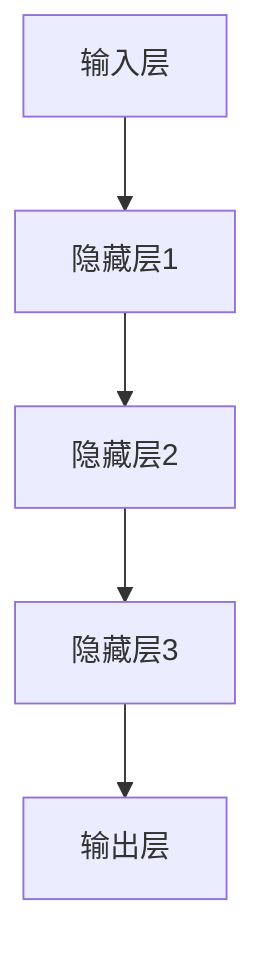
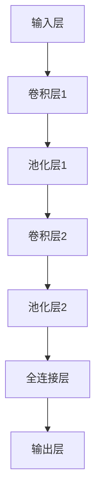
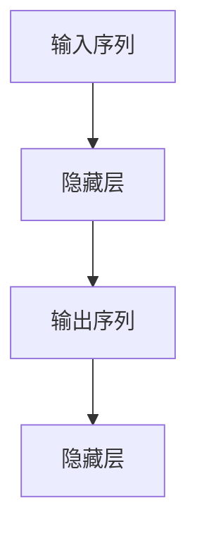
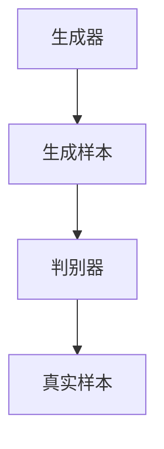

                 

# 《深度学习在知识发现中的应用》

> **关键词**：深度学习、知识发现、数据挖掘、神经网络、迁移学习、少样本学习

> **摘要**：本文将深入探讨深度学习在知识发现中的应用。从基础概念出发，我们将逐步讲解深度学习模型及其在知识发现中的关键技术，包括文本挖掘、图像挖掘、语音挖掘和时间序列挖掘。通过实际案例研究，我们展示了深度学习如何提升知识发现的效果和效率。同时，本文还将介绍深度学习在知识服务中的前沿技术，探讨其未来发展趋势。

### 目录大纲

1. **深度学习基础与原理**
   1.1 深度学习概述
   1.2 神经网络与深度学习模型
   1.3 深度学习算法

2. **知识发现与数据挖掘**
   2.1 知识发现的基本概念与技术
   2.2 数据挖掘算法
   2.3 深度学习在知识发现中的应用

3. **深度学习在知识发现中的前沿技术**
   3.1 深度强化学习
   3.2 迁移学习与少样本学习
   3.3 深度学习在知识服务中的应用

4. **附录**
   4.1 深度学习常用工具与框架
   4.2 数学模型与公式
   4.3 案例代码实现

### 引言

在当今信息技术飞速发展的时代，数据已经成为企业和组织的重要资产。如何从海量数据中挖掘出有价值的信息，成为知识发现的关键问题。知识发现（Knowledge Discovery in Databases，KDD）是一个跨学科领域，结合了统计学、机器学习、数据库技术等多个方面。随着深度学习（Deep Learning）的崛起，其在知识发现中的应用越来越广泛，为数据挖掘带来了革命性的变化。

深度学习是一种基于人工神经网络的机器学习技术，通过多层的非线性变换来学习数据的复杂模式。与传统机器学习相比，深度学习具有更强的表示能力和建模能力，能够处理大规模复杂数据。知识发现涉及到数据的预处理、特征提取、模式识别等多个环节，这些环节都可以利用深度学习技术进行优化和提升。

本文将系统性地探讨深度学习在知识发现中的应用。首先，我们将介绍深度学习的基础与原理，包括神经网络、深度学习模型和算法。接着，我们将讨论知识发现的基本概念和技术，并分析深度学习如何应用于数据挖掘。随后，我们将通过案例研究，展示深度学习在知识发现中的实际应用效果。最后，本文还将探讨深度学习在知识服务中的前沿技术和发展趋势。

通过本文的阅读，读者将能够全面了解深度学习在知识发现中的应用，掌握相关技术原理，并能够应用于实际项目中。

### 第一部分：深度学习基础与原理

#### 第1章：深度学习概述

深度学习是机器学习（Machine Learning）的一个分支，以人工神经网络（Artificial Neural Networks，ANN）为基础，通过多层非线性变换来提取数据的特征和模式。其发展可以追溯到20世纪40年代，但直到近年来随着计算能力的提升和大数据的普及，深度学习才取得了显著的突破。

**1.1 深度学习的起源与历史**

深度学习的概念最早可以追溯到1943年，由心理学家McCulloch和数学家Pitts提出了简单的神经元模型，即MCP模型。随后，1958年，Rosenblatt提出了感知机（Perceptron）算法，这是一种二分类线性分类器，被认为是深度学习的开端。然而，由于理论和计算能力的限制，早期的深度学习研究进展缓慢。

直到2006年，Hinton等科学家提出了深度信念网络（Deep Belief Networks，DBN），标志着深度学习的复兴。随着2009年AlexNet在ImageNet竞赛中取得的显著成果，深度学习开始引起广泛关注。2012年后，深度学习在图像识别、语音识别、自然语言处理等领域取得了诸多突破，逐渐成为人工智能领域的重要方向。

**1.2 深度学习的基本概念与分类**

深度学习通过多层神经网络来建模数据，每一层都从前一层提取更高层次的特征。基本概念包括：

- **神经网络**：由大量节点（神经元）组成，每个节点都连接到其他节点，通过权重和偏置进行信息传递。

- **激活函数**：用于引入非线性，常见的有Sigmoid、ReLU、Tanh等。

- **前向传播与反向传播**：前向传播计算输入到输出层的中间值，反向传播更新网络的权重和偏置，以优化损失函数。

- **损失函数**：用于度量预测值与真实值之间的差距，常见的有均方误差（MSE）、交叉熵（Cross Entropy）等。

深度学习模型根据网络的深度和结构，可以分为以下几类：

- **浅层网络**：通常只有一层或两层的神经网络，如感知机、多层感知机（MLP）等。

- **深层网络**：包含多层隐藏层的神经网络，如深度信念网络（DBN）、卷积神经网络（CNN）等。

- **非常深层的网络**：如深度卷积神经网络（Deep Convolutional Neural Networks，DCNN）和循环神经网络（Recurrent Neural Networks，RNN）等。

**1.3 深度学习与传统机器学习的区别与联系**

深度学习与传统机器学习的主要区别在于模型的复杂性和表示能力。传统机器学习模型如线性回归、决策树、支持向量机等，通常通过手工设计特征来进行数据建模，而深度学习则通过自动学习数据中的特征表示，具有更强的适应性和泛化能力。

同时，深度学习也借鉴了传统机器学习的许多思想，如优化算法、正则化技术等。深度学习在处理复杂数据时，特别是在图像、语音和文本等领域的表现，已经超越了传统机器学习。

**1.4 深度学习的应用领域**

深度学习在多个领域取得了显著的成果，主要包括：

- **计算机视觉**：如图像分类、目标检测、图像生成等。

- **自然语言处理**：如文本分类、机器翻译、情感分析等。

- **语音识别**：如语音识别、语音合成等。

- **强化学习**：如游戏AI、自动驾驶等。

- **医学图像分析**：如疾病诊断、影像分析等。

- **金融预测**：如股票市场预测、风险评估等。

通过上述对深度学习起源、基本概念和应用领域的介绍，读者可以初步了解深度学习的发展历程和其在各个领域的应用。接下来，我们将深入探讨神经网络与深度学习模型的具体内容。

#### 第2章：神经网络与深度学习模型

深度学习中的神经网络是核心组成部分，其结构、算法和训练方法决定了模型的学习能力和性能。本章节将详细讨论神经网络的基本概念、深度学习模型及其发展历程。

**2.1 神经元与神经网络**

神经元是神经网络的基本构建块，其工作原理类似于生物大脑中的神经元。一个简单的神经元可以表示为：

\[ y = \sigma(z) \]

其中，\( z \) 是神经元的输入，\( \sigma \) 是激活函数，通常使用Sigmoid、ReLU或Tanh函数。

神经网络由多个层次的神经元组成，包括输入层、隐藏层和输出层。每一层的神经元都连接到下一层的神经元，并通过权重（weights）和偏置（bias）传递信息。神经网络的结构可以用Mermaid流程图表示如下：



**2.2 前馈神经网络与反向传播算法**

前馈神经网络（Feedforward Neural Network）是一种典型的神经网络结构，数据从输入层流向输出层，不形成闭环。前馈神经网络通过反向传播算法（Backpropagation Algorithm）进行训练。反向传播算法是一种用于优化神经网络权重的算法，其基本思想是计算网络输出与真实值之间的误差，并反向传播这些误差，以更新网络权重。

反向传播算法的步骤如下：

1. **前向传播**：计算输入到输出层的中间值和最终输出。

2. **计算误差**：计算输出值与真实值之间的误差，通常使用损失函数（如均方误差MSE或交叉熵Cross Entropy）。

3. **反向传播**：计算每个层每个神经元的误差，并更新权重和偏置。

4. **迭代优化**：重复前向传播和反向传播，直到网络收敛。

以下是一个简单的反向传播算法的伪代码：

```python
def backward_propagation(inputs, targets, weights, biases):
    outputs = forward_propagation(inputs, weights, biases)
    error = compute_error(targets, outputs)
    dweights = compute_dweights(outputs, inputs)
    dbiases = compute_dbiases(outputs, inputs)
    update_weights_and_biases(weights, biases, dweights, dbiases)
    return error
```

**2.3 卷积神经网络（CNN）**

卷积神经网络（Convolutional Neural Networks，CNN）是一种专门用于处理图像数据的神经网络，其核心思想是利用卷积层提取图像的局部特征。CNN的主要组成部分包括：

- **卷积层**：通过卷积操作提取图像的局部特征，卷积核（filter）滑动在图像上，生成特征图。

- **池化层**：通过下采样操作减少数据维度，提高计算效率，常见的池化方法有最大池化和平均池化。

- **全连接层**：将卷积层和池化层提取的特征映射到输出层，进行分类或回归任务。

以下是一个简单的CNN结构的Mermaid流程图：



**2.4 循环神经网络（RNN）**

循环神经网络（Recurrent Neural Networks，RNN）是一种用于处理序列数据的神经网络，其特点是能够在时间序列中保持状态。RNN的基本结构包括：

- **隐藏层**：用于保存当前时间步的输入状态。

- **循环连接**：将当前时间步的输出连接到下一个时间步的输入。

- **门控机制**：如门控循环单元（GRU）和长短期记忆（LSTM），用于控制信息的流动，避免梯度消失问题。

以下是一个简单的RNN结构的Mermaid流程图：



**2.5 生成对抗网络（GAN）**

生成对抗网络（Generative Adversarial Networks，GAN）是由生成器（Generator）和判别器（Discriminator）组成的对抗性模型。生成器的目标是生成与真实数据分布相似的样本，判别器的目标是区分生成器和真实数据。两者相互对抗，生成器不断优化生成样本的质量，判别器不断提高对真实数据和生成样本的辨别能力。

以下是一个简单的GAN结构的Mermaid流程图：



通过上述对神经网络、深度学习模型及其算法的介绍，读者可以全面了解深度学习的基础知识。接下来，我们将讨论深度学习算法及其在知识发现中的应用。

#### 第3章：深度学习算法

深度学习算法是构建深度学习模型的核心，涵盖了模型的训练、优化和评估等多个方面。本章节将详细讨论深度学习算法的基本原理和关键步骤，包括优化算法、超参数调优以及模型训练技巧。

**3.1 深度学习优化算法**

优化算法是深度学习训练过程中的关键步骤，其目的是通过迭代优化网络权重和偏置，使得模型能够更好地拟合训练数据。常用的优化算法包括随机梯度下降（Stochastic Gradient Descent，SGD）、Adam优化器等。

**3.1.1 随机梯度下降（SGD）**

随机梯度下降是一种简单的优化算法，其核心思想是每次迭代只更新一部分样本的梯度。具体步骤如下：

1. **初始化权重和偏置**：随机初始化网络的权重和偏置。

2. **前向传播**：计算输入到输出层的中间值和最终输出。

3. **计算损失函数**：计算输出值与真实值之间的误差，常用的损失函数有均方误差（MSE）和交叉熵（Cross Entropy）。

4. **计算梯度**：计算每个权重和偏置的梯度。

5. **更新权重和偏置**：使用梯度更新权重和偏置。

6. **迭代优化**：重复前向传播和梯度计算，直到网络收敛。

以下是一个简单的随机梯度下降算法的伪代码：

```python
def stochastic_gradient_descent(inputs, targets, weights, biases, learning_rate):
    for sample in inputs:
        output = forward_propagation(sample, weights, biases)
        error = compute_error(targets, output)
        dweights = compute_dweights(output, sample)
        dbiases = compute_dbiases(output, sample)
        update_weights_and_biases(weights, biases, dweights, dbiases)
    return error
```

**3.1.2 Adam优化器**

Adam优化器是随机梯度下降的改进版本，结合了Momentum和自适应学习率的思想。Adam优化器通过计算一阶矩估计（均值）和二阶矩估计（方差），自适应地调整学习率。具体步骤如下：

1. **初始化参数**：初始化一阶矩估计\( m \)和二阶矩估计\( v \)，以及学习率\( \alpha \)、一阶矩偏差修正系数\( \beta_1 \)和二阶矩偏差修正系数\( \beta_2 \)。

2. **前向传播**：计算输入到输出层的中间值和最终输出。

3. **计算梯度**：计算每个权重和偏置的梯度。

4. **更新参数**：使用梯度和修正系数更新权重和偏置。

5. **迭代优化**：重复前向传播和参数更新，直到网络收敛。

以下是一个简单的Adam优化器的伪代码：

```python
def adam_optimization(inputs, targets, weights, biases, learning_rate, beta_1, beta_2, epsilon):
    m = initialize_momentums()
    v = initialize_momentums()
    t = 0
    while not converged:
        t += 1
        output = forward_propagation(inputs, weights, biases)
        error = compute_error(targets, output)
        dweights = compute_dweights(output, inputs)
        dbiases = compute_dbiases(output, inputs)
        m = update_momentums(m, dweights, t, beta_1)
        v = update_momentums(v, (dweights ** 2), t, beta_2)
        dweights = correct_momentums(dweights, m, v, t, beta_1, beta_2, epsilon)
        dbiases = correct_momentums(dbiases, m, v, t, beta_1, beta_2, epsilon)
        update_weights_and_biases(weights, biases, dweights, dbiases)
    return error
```

**3.2 深度学习超参数调优**

超参数是深度学习模型中需要手动调整的参数，如学习率、批次大小、正则化参数等。超参数的选择对模型性能有重要影响，合适的超参数可以提高模型的泛化能力和性能。

**3.2.1 学习率**

学习率是优化算法中最重要的超参数之一，其值决定了梯度更新的步长。选择合适的学习率是深度学习训练中的一个挑战。通常，可以使用以下方法进行学习率调优：

1. **固定学习率**：初始学习率设置为较大值，并保持不变。

2. **指数衰减学习率**：学习率按照指数规律衰减，公式为\( \alpha_t = \alpha_0 / (1 + \lambda \cdot t) \)，其中\( \alpha_0 \)是初始学习率，\( \lambda \)是衰减率，\( t \)是迭代次数。

3. **学习率衰减策略**：在模型训练过程中，根据模型的性能调整学习率，如当模型性能停滞不前时，减小学习率。

**3.2.2 批次大小**

批次大小是指每次训练时参与梯度更新的样本数量。合适的选择批次大小可以提高模型训练的稳定性和效率。常见的批次大小选择方法包括：

1. **随机批次**：每次训练从数据集中随机选择样本作为批次。

2. **固定批次**：每次训练使用相同大小的批次，如32或64。

3. **自适应批次**：根据模型的性能动态调整批次大小，如当模型性能下降时，增加批次大小。

**3.3 深度学习模型训练技巧**

深度学习模型训练是一个复杂的过程，以下是一些常用的训练技巧：

1. **数据增强**：通过旋转、缩放、裁剪等操作增加训练数据的多样性，提高模型泛化能力。

2. **权重初始化**：选择合适的权重初始化方法，如高斯初始化、Xavier初始化等，以避免梯度消失和梯度爆炸问题。

3. **正则化**：使用正则化技术如L1正则化、L2正则化等，减少过拟合现象。

4. **dropout**：在训练过程中随机丢弃一部分神经元，减少模型过拟合。

5. **批次归一化**：在训练过程中对批次内的数据归一化，提高模型训练稳定性。

6. **学习率调整**：在训练过程中根据模型性能动态调整学习率，如使用学习率衰减策略。

通过上述对深度学习优化算法、超参数调优和模型训练技巧的讨论，读者可以全面了解深度学习算法的原理和应用方法。接下来，我们将进入第二部分，讨论知识发现与数据挖掘的基本概念和技术。

### 第二部分：知识发现与数据挖掘

#### 第4章：知识发现的基本概念与技术

知识发现（Knowledge Discovery in Databases，KDD）是一个跨学科领域，涉及数据库、机器学习、统计学和数据挖掘等多个方面。其目标是自动地从大量数据中识别出有用的模式和知识。知识发现的过程通常包括以下几个步骤：数据预处理、数据挖掘、模式评估和知识表示。

**4.1 知识发现的概念与过程**

知识发现的概念最早由Fayyad等人于1996年提出，其核心目标是从大量数据中自动地发现隐藏的、有价值的知识。知识发现的过程可以概括为以下六个阶段：

1. **数据选择**：从原始数据源中选择出最有用的数据集，以满足分析需求。

2. **数据清洗**：处理数据中的噪声、异常和缺失值，以提高数据质量。

3. **数据集成**：将来自多个数据源的数据进行整合，形成统一的数据视图。

4. **数据转换**：将数据转换为适合数据挖掘的形式，如归一化、离散化等。

5. **数据挖掘**：利用各种数据挖掘算法，从数据中提取出有用的模式和知识。

6. **知识评估**：对挖掘出的模式进行评估，确定其是否具有实际应用价值。

7. **知识表示**：将评估出的有用知识以易于理解和使用的形式表示出来，如报告、可视化或决策支持系统。

**4.2 知识发现的主要方法与技术**

知识发现涉及到多种方法和技术，主要包括以下几种：

1. **关联规则挖掘**：通过分析数据项之间的关联关系，发现频繁出现的组合。常见算法有Apriori算法和FP-growth算法。

   **Apriori算法伪代码：**
   ```python
   def apriori(data, support_threshold, confidence_threshold):
       frequent_itemsets = find_frequent_itemsets(data, support_threshold)
       association_rules = generate_association_rules(frequent_itemsets, confidence_threshold)
       return association_rules
   ```

2. **聚类分析**：将数据划分为若干个群组，使得同一个群组内的数据点之间相似度较高，而不同群组之间的数据点相似度较低。常见算法有K-means算法和DBSCAN算法。

   **K-means算法伪代码：**
   ```python
   def kmeans(data, k):
       centroids = initialize_centroids(data, k)
       while not converged:
           assign_points_to_clusters(data, centroids)
           update_centroids(centroids)
       return centroids, clusters
   ```

3. **分类与预测**：将数据划分为预定义的类别，用于预测新数据的类别。常见算法有决策树、随机森林和支持向量机等。

   **决策树算法伪代码：**
   ```python
   def decision_tree(data, attributes):
       if is_homogeneous(data):
           return majority_class(data)
       else:
           best_attribute = find_best_attribute(data, attributes)
           tree = create_tree_node(best_attribute)
           for value in attribute_values(best_attribute):
               subset = filter_data(data, value)
               tree[value] = decision_tree(subset, attributes - {best_attribute})
           return tree
   ```

4. **异常检测**：识别出数据中的异常或异常模式，用于发现欺诈行为、故障检测等。常见算法有基于统计的方法、基于邻近度的方法和基于聚类的方法等。

   **基于统计的异常检测算法伪代码：**
   ```python
   def statistical_anomaly_detection(data, threshold):
       mean = compute_mean(data)
       variance = compute_variance(data)
       for value in data:
           if (value - mean) ** 2 / variance > threshold:
               return True
       return False
   ```

**4.3 知识发现的应用场景**

知识发现技术在多个领域有广泛的应用，包括但不限于以下几个方面：

1. **商业智能**：通过分析销售数据、客户行为等，发现潜在的市场趋势和客户需求，为企业决策提供支持。

2. **金融**：分析金融市场数据，预测股票价格、风险管理等。

3. **医疗**：分析医疗数据，发现疾病模式、诊断辅助等。

4. **安全**：通过分析网络流量、日志数据等，发现潜在的网络攻击、欺诈行为等。

5. **智能交通**：通过分析交通数据，优化交通流量、预测交通拥堵等。

通过上述对知识发现基本概念、主要方法与应用场景的介绍，读者可以了解知识发现的重要性和实际应用价值。接下来，我们将探讨数据挖掘算法及其在知识发现中的应用。

#### 第5章：数据挖掘算法

数据挖掘（Data Mining）是知识发现过程中的关键环节，涉及从大量数据中提取有价值信息的技术和方法。本章将详细讨论几种常见的数据挖掘算法，包括聚类分析、关联规则挖掘、分类与预测以及异常检测。

**5.1 聚类分析算法**

聚类分析是一种无监督学习方法，用于将数据点划分成多个群组，使得同一群组内的数据点之间相似度较高，而不同群组之间的数据点相似度较低。常用的聚类算法包括K-means、DBSCAN和层次聚类等。

**5.1.1 K-means算法**

K-means算法是一种基于距离度量的聚类算法，其核心思想是初始化K个中心点，然后通过迭代更新中心点和划分群组，使得每个数据点与所属中心点的距离之和最小。

**K-means算法伪代码：**

```python
def kmeans(data, k):
    centroids = initialize_centroids(data, k)
    while not converged:
        assign_points_to_clusters(data, centroids)
        update_centroids(centroids)
    return centroids, clusters
```

算法步骤如下：

1. 初始化K个中心点。

2. 将每个数据点分配到最近的中心点。

3. 更新每个中心点的坐标，为所有分配到的数据点的均值。

4. 重复步骤2和3，直到中心点不再发生变化或达到最大迭代次数。

K-means算法简单高效，但容易陷入局部最优解，且对初始中心点敏感。

**5.1.2 DBSCAN算法**

DBSCAN（Density-Based Spatial Clustering of Applications with Noise）是一种基于密度的聚类算法，能够发现任意形状的聚类，并处理带有噪声的数据。

**DBSCAN算法伪代码：**

```python
def dbscan(data, epsilon, min_points):
    clusters = []
    for point in data:
        if point not in cluster:
            neighborhood = find_neighbors(point, epsilon)
            if len(neighborhood) < min_points:
                continue
            cluster_id = len(clusters)
            expand_cluster(point, neighborhood, cluster_id, clusters, epsilon, min_points)
    return clusters
```

算法步骤如下：

1. 初始化空簇列表。

2. 对每个未分配到簇的数据点，检查其邻域点。

3. 如果邻域点数量大于最小点数，扩展簇，将邻域点及其邻域点加入当前簇。

4. 重复步骤2和3，直到所有数据点被分配到簇。

DBSCAN算法能够处理噪声和发现任意形状的聚类，但对参数选择较为敏感。

**5.1.3 层次聚类算法**

层次聚类是一种自底向上或自顶向下的聚类方法，通过逐步合并或分割数据点，形成不同的层次结构。

**层次聚类算法伪代码：**

```python
def hierarchical_clustering(data, linkage='single'):
    clusters = [[point] for point in data]
    while len(clusters) > 1:
        closest_clusters = find_closest_clusters(clusters, linkage)
        merged_cluster = merge_clusters(closest_clusters)
        clusters = [cluster for cluster in clusters if cluster not in closest_clusters]
        clusters.append(merged_cluster)
    return clusters
```

算法步骤如下：

1. 将每个数据点视为一个簇。

2. 根据预定的层次链接方式（如单链接、完全链接、平均链接等），计算最接近的簇。

3. 合并最接近的簇。

4. 重复步骤2和3，直到只剩下一个簇。

层次聚类算法能够生成层次结构，便于分析不同层次的聚类结果。

**5.2 关联规则挖掘算法**

关联规则挖掘是一种用于发现数据项之间潜在关联关系的方法。常见的算法包括Apriori算法和FP-growth算法。

**5.2.1 Apriori算法**

Apriori算法是一种基于支持度和置信度的挖掘算法，通过递归搜索频繁项集，生成关联规则。

**Apriori算法伪代码：**

```python
def apriori(data, support_threshold, confidence_threshold):
    frequent_itemsets = find_frequent_itemsets(data, support_threshold)
    association_rules = generate_association_rules(frequent_itemsets, confidence_threshold)
    return association_rules
```

算法步骤如下：

1. 计算每个数据项的支持度。

2. 递归地合并项集，找出所有频繁项集。

3. 对于每个频繁项集，生成关联规则。

4. 过滤掉不满足置信度阈值的规则。

Apriori算法简单直观，但效率较低，特别是对于大规模数据集。

**5.2.2 FP-growth算法**

FP-growth算法是一种基于树结构优化的挖掘算法，通过压缩频繁模式树（FP-tree），减少计算复杂度。

**FP-growth算法伪代码：**

```python
def fpgrowth(data, support_threshold, confidence_threshold):
    frequent_itemsets = find_frequent_itemsets(data, support_threshold)
    fptree = construct_fptree(data, frequent_itemsets)
    association_rules = generate_association_rules(fptree, frequent_itemsets, confidence_threshold)
    return association_rules
```

算法步骤如下：

1. 构建频繁模式树（FP-tree）。

2. 递归地生成频繁项集。

3. 对于每个频繁项集，生成关联规则。

4. 过滤掉不满足置信度阈值的规则。

FP-growth算法在处理大规模数据集时，比Apriori算法更加高效。

**5.3 分类与预测算法**

分类与预测算法是一种有监督学习方法，用于将数据点划分为预定义的类别。常见的分类算法包括决策树、随机森林和支持向量机等。

**5.3.1 决策树算法**

决策树算法通过一系列的判定规则，将数据点划分为不同的类别。

**决策树算法伪代码：**

```python
def decision_tree(data, attributes):
    if is_homogeneous(data):
        return majority_class(data)
    else:
        best_attribute = find_best_attribute(data, attributes)
        tree = create_tree_node(best_attribute)
        for value in attribute_values(best_attribute):
            subset = filter_data(data, value)
            tree[value] = decision_tree(subset, attributes - {best_attribute})
        return tree
```

算法步骤如下：

1. 如果数据点属于同一类别，返回该类别。

2. 否则，选择最佳属性。

3. 对于每个属性值，递归地构建子树。

4. 返回决策树。

决策树算法简单易懂，但容易过拟合。

**5.3.2 随机森林算法**

随机森林算法是一种基于决策树的集成学习方法，通过构建多个决策树，并投票预测结果。

**随机森林算法伪代码：**

```python
def random_forest(data, attributes, n_trees, max_depth):
    forests = []
    for _ in range(n_trees):
        tree = decision_tree(select_random_samples(data, attributes), attributes)
        forests.append(tree)
    predictions = majority_vote(forests)
    return predictions
```

算法步骤如下：

1. 构建多个决策树。

2. 对每个数据点，投票预测结果。

3. 返回多数投票结果。

随机森林算法具有良好的泛化能力和鲁棒性。

**5.3.3 支持向量机算法**

支持向量机算法通过最大化分类间隔，将数据点划分为不同的类别。

**支持向量机算法伪代码：**

```python
def support_vector_machine(data, labels, kernel='linear'):
    weights = solve_quadratic_program(data, labels, kernel)
    return weights
```

算法步骤如下：

1. 构建二次规划问题。

2. 求解最优解。

3. 返回权重向量。

支持向量机算法在处理高维数据时表现出色。

**5.4 异常检测算法**

异常检测是一种用于识别数据中的异常或异常模式的方法。常见的异常检测算法包括基于统计的方法、基于邻近度的方法和基于聚类的方法等。

**5.4.1 基于统计的方法**

基于统计的异常检测算法通过计算数据点与均值和方差的差异，识别出异常点。

**基于统计的异常检测算法伪代码：**

```python
def statistical_anomaly_detection(data, mean, variance, threshold):
    anomalies = []
    for point in data:
        if (point - mean) ** 2 / variance > threshold:
            anomalies.append(point)
    return anomalies
```

算法步骤如下：

1. 计算数据的均值和方差。

2. 对于每个数据点，计算与均值的差异。

3. 如果差异大于阈值，识别为异常点。

**5.4.2 基于邻近度的方法**

基于邻近度的异常检测算法通过计算数据点与邻域点的距离，识别出异常点。

**基于邻近度的异常检测算法伪代码：**

```python
def proximity_anomaly_detection(data, distance_function, radius):
    anomalies = []
    for point in data:
        neighbors = find_neighbors(point, radius)
        if len(neighbors) == 0:
            anomalies.append(point)
    return anomalies
```

算法步骤如下：

1. 定义距离函数。

2. 对于每个数据点，计算其邻域点。

3. 如果邻域点数量为零，识别为异常点。

**5.4.3 基于聚类的方法**

基于聚类的异常检测算法通过分析聚类结果，识别出不属于任何聚类的数据点。

**基于聚类的异常检测算法伪代码：**

```python
def clustering_anomaly_detection(data, clustering_algorithm):
    clusters = clustering_algorithm(data)
    anomalies = [point for point in data if point not in any(cluster for cluster in clusters)]
    return anomalies
```

算法步骤如下：

1. 选择聚类算法。

2. 对数据点进行聚类。

3. 识别出不属于任何聚类的数据点。

通过上述对聚类分析、关联规则挖掘、分类与预测以及异常检测算法的介绍，读者可以了解数据挖掘的基本方法和应用。接下来，我们将探讨深度学习在知识发现中的应用，展示如何利用深度学习技术提升知识发现的效果和效率。

#### 第6章：深度学习在知识发现中的应用

深度学习在知识发现中的应用已经逐渐成为研究热点，通过其强大的表示和学习能力，深度学习能够显著提升知识发现的效果和效率。本章节将详细探讨深度学习在文本挖掘、图像挖掘、语音挖掘和时间序列挖掘中的应用。

**6.1 深度学习在文本挖掘中的应用**

文本挖掘是指从大量文本数据中提取有用信息的过程，深度学习在文本挖掘中具有显著优势。以下是一些常见的深度学习文本挖掘应用：

**文本分类**：文本分类是将文本数据划分为预定义类别的过程。深度学习通过词向量（Word Vectors）和卷积神经网络（Convolutional Neural Networks，CNN）等方法，实现高效的文本分类。例如，词嵌入（Word Embedding）技术将单词映射到低维向量空间，使得相似词具有相近的向量表示。

**情感分析**：情感分析是识别文本中情感倾向的过程，深度学习通过情感词典、递归神经网络（Recurrent Neural Networks，RNN）等方法，准确判断文本的情感极性。例如，使用双向长短期记忆网络（Bidirectional Long Short-Term Memory，BiLSTM）模型，可以捕捉文本中的上下文信息，提高情感分析的准确率。

**主题建模**：主题建模是从大量文本数据中提取潜在主题的过程。深度学习通过生成对抗网络（Generative Adversarial Networks，GAN）等方法，实现高效的主题建模。例如，使用变分自编码器（Variational Autoencoder，VAE）模型，可以学习文本数据的潜在分布，提取出隐藏的主题。

**文本生成**：文本生成是指根据给定条件生成新的文本内容。深度学习通过序列到序列（Sequence-to-Sequence，Seq2Seq）模型和注意力机制（Attention Mechanism），实现高效的文本生成。例如，使用Transformer模型，可以捕捉长距离依赖关系，生成高质量的自然语言文本。

**6.2 深度学习在图像挖掘中的应用**

图像挖掘是指从图像数据中提取有用信息的过程，深度学习在图像挖掘中具有广泛应用。以下是一些常见的深度学习图像挖掘应用：

**图像分类**：图像分类是将图像数据划分为预定义类别的过程。深度学习通过卷积神经网络（Convolutional Neural Networks，CNN）和迁移学习（Transfer Learning）等方法，实现高效的图像分类。例如，使用预训练的ResNet模型，可以快速实现大规模图像分类任务。

**目标检测**：目标检测是识别图像中的目标和边界框的过程。深度学习通过区域提议网络（Region Proposal Networks，RPN）和卷积神经网络（CNN）等方法，实现高效的目标检测。例如，使用Faster R-CNN模型，可以在图像中准确检测出多个目标。

**图像分割**：图像分割是将图像数据划分为多个区域的过程。深度学习通过卷积神经网络（Convolutional Neural Networks，CNN）和全卷积网络（Fully Convolutional Networks，FCN）等方法，实现高效的图像分割。例如，使用U-Net模型，可以准确分割出图像中的物体边界。

**图像生成**：图像生成是指根据给定条件生成新的图像内容。深度学习通过生成对抗网络（Generative Adversarial Networks，GAN）和变分自编码器（Variational Autoencoder，VAE）等方法，实现高效的图像生成。例如，使用StyleGAN模型，可以生成高质量的人脸和图像。

**6.3 深度学习在语音挖掘中的应用**

语音挖掘是指从语音数据中提取有用信息的过程，深度学习在语音挖掘中具有广泛应用。以下是一些常见的深度学习语音挖掘应用：

**语音识别**：语音识别是将语音信号转换为文本的过程。深度学习通过卷积神经网络（Convolutional Neural Networks，CNN）和循环神经网络（Recurrent Neural Networks，RNN）等方法，实现高效的语音识别。例如，使用DeepSpeech模型，可以实现高质量的语音识别。

**语音合成**：语音合成是将文本转换为自然语音的过程。深度学习通过序列到序列（Sequence-to-Sequence，Seq2Seq）模型和 WaveNet等方法，实现高效的语音合成。例如，使用Tacotron模型，可以生成高质量的语音。

**语音增强**：语音增强是改善语音信号质量的过程。深度学习通过卷积神经网络（Convolutional Neural Networks，CNN）和生成对抗网络（Generative Adversarial Networks，GAN）等方法，实现高效的语音增强。例如，使用Wav2Wav模型，可以消除噪声和回声，提高语音信号的质量。

**6.4 深度学习在时间序列挖掘中的应用**

时间序列挖掘是指从时间序列数据中提取有用信息的过程，深度学习在时间序列挖掘中具有广泛应用。以下是一些常见的时间序列挖掘应用：

**时间序列分类**：时间序列分类是将时间序列数据划分为预定义类别的过程。深度学习通过循环神经网络（Recurrent Neural Networks，RNN）和长短时记忆网络（Long Short-Term Memory，LSTM）等方法，实现高效的时间序列分类。例如，使用LSTM模型，可以准确分类时间序列数据。

**时间序列预测**：时间序列预测是根据历史时间序列数据预测未来值的过程。深度学习通过循环神经网络（Recurrent Neural Networks，RNN）和门控循环单元（Gated Recurrent Unit，GRU）等方法，实现高效的时间序列预测。例如，使用GRU模型，可以准确预测股票价格或气象数据。

**时间序列聚类**：时间序列聚类是将时间序列数据划分为相似性较高的群组的过程。深度学习通过自编码器（Autoencoder）和变分自编码器（Variational Autoencoder，VAE）等方法，实现高效的时间序列聚类。例如，使用VAE模型，可以聚类出相似的时间序列数据。

**6.5 深度学习在知识图谱挖掘中的应用**

知识图谱是一种语义网络，用于表示实体和关系。深度学习在知识图谱挖掘中具有广泛应用，以下是一些常见的深度学习知识图谱挖掘应用：

**实体识别**：实体识别是识别文本中的实体和属性的过程。深度学习通过卷积神经网络（Convolutional Neural Networks，CNN）和循环神经网络（Recurrent Neural Networks，RNN）等方法，实现高效的实体识别。例如，使用BERT模型，可以准确识别出文本中的实体和属性。

**关系抽取**：关系抽取是识别实体之间关系的过程。深度学习通过卷积神经网络（Convolutional Neural Networks，CNN）和循环神经网络（Recurrent Neural Networks，RNN）等方法，实现高效的关系抽取。例如，使用Ernie模型，可以准确识别出实体之间的关系。

**图谱生成**：图谱生成是根据实体和关系生成新的知识图谱的过程。深度学习通过生成对抗网络（Generative Adversarial Networks，GAN）和变分自编码器（Variational Autoencoder，VAE）等方法，实现高效的图谱生成。例如，使用GAT模型，可以生成新的知识图谱。

通过上述对深度学习在文本挖掘、图像挖掘、语音挖掘、时间序列挖掘以及知识图谱挖掘中的应用介绍，我们可以看到深度学习在知识发现中的巨大潜力和应用前景。接下来，我们将通过实际案例研究，进一步展示深度学习在知识发现中的实际应用效果。

#### 第7章：案例研究

深度学习在知识发现中的应用已经取得了显著成果，通过实际案例研究，我们可以深入了解深度学习如何提升知识发现的效果和效率。以下是一些典型的案例研究，展示了深度学习在不同领域的知识发现应用。

**7.1 知识图谱构建**

知识图谱是一种语义网络，用于表示实体和关系。构建高质量的知识图谱是深度学习在知识发现中的重要应用之一。例如，百度使用的BERT模型，通过预训练大规模语料库，提取词语的语义表示，实现了高效的实体识别和关系抽取。BERT模型结合了词嵌入和上下文信息，可以准确识别文本中的实体和关系，从而构建出高质量的知识图谱。具体实现过程如下：

1. **数据准备**：收集大量文本数据，包括新闻、百科、社交媒体等。

2. **预训练BERT模型**：使用文本数据进行BERT模型的预训练，学习词语的语义表示。

3. **实体识别**：使用BERT模型对文本进行编码，提取实体特征，实现实体识别。

4. **关系抽取**：利用实体特征和预训练的BERT模型，实现关系抽取，构建知识图谱。

**7.2 智能问答系统**

智能问答系统是深度学习在知识发现中的应用，通过自然语言处理技术，实现用户问题的理解和回答。例如，微软的聊天机器人小冰，通过深度学习技术，实现了智能问答和对话生成。具体实现过程如下：

1. **问题理解**：使用BERT模型对用户问题进行编码，提取语义特征。

2. **答案检索**：根据问题特征，检索知识图谱中的答案，实现智能问答。

3. **对话生成**：利用序列到序列（Seq2Seq）模型和注意力机制，生成自然的回答文本。

**7.3 情感分析**

情感分析是识别文本中情感倾向的过程，深度学习在情感分析中具有显著优势。例如，阿里巴巴的阿里云情感分析服务，通过卷积神经网络（CNN）和循环神经网络（RNN）等方法，实现了高效的文本情感分析。具体实现过程如下：

1. **数据准备**：收集大量带有情感标签的文本数据。

2. **模型训练**：使用文本数据进行模型训练，学习情感分类规则。

3. **情感分析**：对输入文本进行编码，利用训练好的模型，预测文本的情感极性。

**7.4 深度学习在金融领域的应用**

深度学习在金融领域的应用非常广泛，包括股票市场预测、风险评估等。例如，京东的金融风险控制系统，通过深度学习技术，实现了高效的风险评估和预测。具体实现过程如下：

1. **数据准备**：收集大量金融数据，包括股票价格、交易量、宏观经济指标等。

2. **特征工程**：对金融数据进行分析，提取有效的特征。

3. **模型训练**：使用金融数据训练深度学习模型，学习数据中的规律。

4. **风险评估**：对新的金融数据进行分析，预测风险并采取相应的措施。

通过上述案例研究，我们可以看到深度学习在知识发现中的广泛应用和实际效果。深度学习通过其强大的表示和学习能力，不仅提高了知识发现的准确性和效率，还为各行各业带来了新的发展机遇。接下来，我们将探讨深度学习在知识发现中的前沿技术和发展趋势。

#### 第8章：深度学习在知识发现中的前沿技术

深度学习在知识发现中的应用已经取得了显著进展，但为了应对日益复杂的任务和挑战，研究者们不断探索新的前沿技术。本章将介绍深度强化学习、迁移学习和少样本学习等前沿技术，以及它们在知识发现中的应用。

**8.1 深度强化学习**

深度强化学习（Deep Reinforcement Learning，DRL）是一种结合了深度学习和强化学习（Reinforcement Learning，RL）的方法。强化学习通过奖励机制和策略迭代，使得智能体能够学习在动态环境中做出最优决策。深度强化学习通过引入深度神经网络来近似策略和价值函数，从而提高学习效率。

**8.1.1 深度强化学习的基本概念**

深度强化学习的主要组成部分包括：

- **状态（State）**：智能体当前所处的环境状态。

- **动作（Action）**：智能体可以采取的行动。

- **奖励（Reward）**：环境对智能体采取的动作的即时反馈。

- **策略（Policy）**：智能体的决策规则，表示为从状态到动作的概率分布。

- **价值函数（Value Function）**：评估状态或状态-动作对的预期奖励。

**8.1.2 深度强化学习的应用场景**

深度强化学习在知识发现中的应用包括：

- **推荐系统**：通过学习用户的兴趣和行为模式，为用户推荐感兴趣的内容。

- **动态定价**：在电子商务和在线广告中，根据用户行为和市场竞争情况，动态调整价格策略。

- **智能搜索**：优化搜索引擎的排名策略，提高搜索结果的准确性和用户体验。

**8.1.3 深度强化学习的算法与发展趋势**

常见的深度强化学习算法包括：

- **深度Q网络（Deep Q-Network，DQN）**：通过经验回放和目标网络，避免策略偏差。

- **策略梯度方法（Policy Gradient Methods）**：直接优化策略，如REINFORCE和Actor-Critic算法。

- **深度确定性策略梯度（Deep Deterministic Policy Gradient，DDPG）**：通过经验回放和目标网络，解决非确定性问题。

随着深度强化学习技术的发展，未来有望出现更高效、更稳定的算法，如基于变分自编码器（Variational Autoencoder，VAE）的深度强化学习和基于生成对抗网络（Generative Adversarial Networks，GAN）的深度强化学习。

**8.2 迁移学习与少样本学习**

迁移学习（Transfer Learning）和少样本学习（Few-Shot Learning）是解决小样本数据问题的有效方法。迁移学习通过利用预训练模型，将知识从一个领域迁移到另一个领域，从而提高模型在小样本数据上的性能。少样本学习则关注在只有少量样本的情况下，如何有效地学习模型。

**8.2.1 迁移学习的基本概念**

迁移学习的主要组成部分包括：

- **源领域（Source Domain）**：用于预训练模型的领域。

- **目标领域（Target Domain）**：用于模型应用的领域。

- **领域自适应（Domain Adaptation）**：通过调整模型，使得模型在目标领域上的表现接近源领域。

- **模型迁移（Model Transfer）**：直接将预训练模型应用于目标领域。

**8.2.2 少样本学习的方法与技术**

少样本学习的方法主要包括：

- **元学习（Meta-Learning）**：通过训练多个任务，使得模型具有更好的泛化能力。

- **模型蒸馏（Model Distillation）**：将大模型的知识迁移到小模型中。

- **自监督学习（Self-Supervised Learning）**：利用未标注的数据，通过预测任务学习模型。

- **生成对抗网络（Generative Adversarial Networks，GAN）**：通过生成模型生成数据，补充训练数据。

**8.2.3 迁移学习与少样本学习在知识发现中的应用**

迁移学习和少样本学习在知识发现中的应用包括：

- **跨领域知识发现**：通过迁移学习，将一个领域中的知识应用于另一个领域，如从医疗领域迁移到金融领域。

- **小样本数据挖掘**：在数据稀缺的情况下，通过少样本学习技术，实现有效的数据挖掘。

- **个性化推荐**：通过迁移学习，将通用模型调整为个性化模型，为用户提供更好的推荐服务。

**8.3 深度学习在知识服务中的应用**

知识服务是指利用信息技术，为用户提供知识支持和决策辅助。深度学习在知识服务中的应用，可以显著提升服务的智能化和个性化水平。

**8.3.1 知识服务的概念与分类**

知识服务的分类如下：

- **信息检索服务**：通过自然语言处理和文本挖掘，帮助用户快速获取相关信息。

- **知识管理服务**：通过知识图谱和语义网络，构建和管理知识库，为用户提供知识查询和共享服务。

- **智能问答服务**：利用深度学习技术，实现自然语言理解和智能回答，为用户提供智能咨询服务。

- **决策支持服务**：通过数据分析和预测模型，为用户提供决策支持和策略建议。

**8.3.2 深度学习在知识服务中的应用场景**

深度学习在知识服务中的应用场景包括：

- **智能客服**：利用深度学习技术，实现自然语言理解和智能回答，提高客服效率和用户体验。

- **智能诊断**：通过深度学习模型，分析医学数据，为医生提供诊断支持和辅助决策。

- **智能金融**：利用深度学习技术，分析金融市场数据，为投资者提供投资建议和风险管理。

- **智能交通**：通过深度学习模型，分析交通数据，优化交通流量和调度策略。

**8.3.3 深度学习在知识服务中的挑战与展望**

深度学习在知识服务中面临的挑战包括：

- **数据隐私与安全**：保护用户数据隐私和安全是知识服务中的重要问题。

- **解释性**：深度学习模型往往缺乏解释性，使得用户难以理解模型的决策过程。

- **可扩展性**：如何在大规模数据集上高效地训练和部署深度学习模型。

未来，随着深度学习技术的不断进步，深度学习在知识服务中的应用前景将更加广阔。通过结合迁移学习、少样本学习等前沿技术，深度学习将进一步提升知识服务的智能化和个性化水平，为各行各业带来新的发展机遇。

### 附录

#### 附录A：深度学习常用工具与框架

深度学习工具和框架是构建和训练深度学习模型的核心。以下是一些常用的深度学习工具和框架及其简要介绍。

**A.1 TensorFlow**

TensorFlow是谷歌开源的深度学习框架，支持多种编程语言，如Python、C++和Java。它提供了丰富的API和工具，用于构建、训练和部署深度学习模型。

- **优点**：广泛支持各种深度学习模型，良好的生态系统和社区支持。

- **使用示例**：
  ```python
  import tensorflow as tf
  model = tf.keras.Sequential([
      tf.keras.layers.Dense(128, activation='relu', input_shape=(784,)),
      tf.keras.layers.Dropout(0.2),
      tf.keras.layers.Dense(10, activation='softmax')
  ])
  model.compile(optimizer='adam',
                loss='categorical_crossentropy',
                metrics=['accuracy'])
  model.fit(x_train, y_train, epochs=5)
  ```

**A.2 PyTorch**

PyTorch是Facebook开源的深度学习框架，以其灵活性和动态计算图而闻名。它支持Python编程语言，并提供了一套完整的工具和库，用于深度学习模型的设计和训练。

- **优点**：易于使用，动态计算图，强大的自动微分系统。

- **使用示例**：
  ```python
  import torch
  import torch.nn as nn
  import torch.optim as optim

  model = nn.Sequential(
      nn.Linear(784, 128),
      nn.ReLU(),
      nn.Dropout(0.2),
      nn.Linear(128, 10),
      nn.Softmax(dim=1)
  )

  criterion = nn.CrossEntropyLoss()
  optimizer = optim.Adam(model.parameters(), lr=0.001)

  for epoch in range(5):
      for inputs, labels in train_loader:
          optimizer.zero_grad()
          outputs = model(inputs)
          loss = criterion(outputs, labels)
          loss.backward()
          optimizer.step()
  ```

**A.3 Keras**

Keras是Python的深度学习库，作为一个高度优化的TensorFlow和Theano的前端API，它为快速构建和迭代深度学习模型提供了方便。

- **优点**：简单易用，直观的API，支持快速原型设计。

- **使用示例**：
  ```python
  from keras.models import Sequential
  from keras.layers import Dense, Dropout

  model = Sequential()
  model.add(Dense(128, activation='relu', input_shape=(784,)))
  model.add(Dropout(0.2))
  model.add(Dense(10, activation='softmax'))
  model.compile(optimizer='adam',
                loss='categorical_crossentropy',
                metrics=['accuracy'])
  model.fit(x_train, y_train, epochs=5)
  ```

**A.4 其他深度学习框架简要介绍**

- **MXNet**：由Apache开源，支持多种编程语言，包括Python、C++和R。

- **Caffe**：由伯克利大学开发，以快速卷积神经网络而著称。

- **Theano**：由蒙特利尔大学开发，是一个基于Python的深度学习库，但在2017年停止更新。

#### 附录B：数学模型与公式

深度学习依赖于复杂的数学模型和公式，以下是一些常用的数学模型和公式，以及它们在深度学习中的应用。

**B.1 神经网络激活函数**

- **Sigmoid函数**：
  \[ \sigma(x) = \frac{1}{1 + e^{-x}} \]

- **ReLU函数**：
  \[ \text{ReLU}(x) = \max(0, x) \]

- **Tanh函数**：
  \[ \text{Tanh}(x) = \frac{e^x - e^{-x}}{e^x + e^{-x}} \]

**B.2 损失函数**

- **均方误差（MSE）**：
  \[ \text{MSE}(y, \hat{y}) = \frac{1}{n} \sum_{i=1}^{n} (y_i - \hat{y}_i)^2 \]

- **交叉熵（Cross Entropy）**：
  \[ \text{CE}(y, \hat{y}) = -\sum_{i=1}^{n} y_i \log(\hat{y}_i) \]

**B.3 优化算法**

- **随机梯度下降（SGD）**：
  \[ w_{\text{new}} = w_{\text{old}} - \alpha \nabla_w J(w) \]

- **Adam优化器**：
  \[ m_t = \beta_1 m_{t-1} + (1 - \beta_1) \nabla_w J(w) \]
  \[ v_t = \beta_2 v_{t-1} + (1 - \beta_2) (\nabla_w J(w))^2 \]
  \[ \hat{m}_t = \frac{m_t}{1 - \beta_1^t} \]
  \[ \hat{v}_t = \frac{v_t}{1 - \beta_2^t} \]
  \[ w_{\text{new}} = w_{\text{old}} - \alpha \frac{\hat{m}_t}{\sqrt{\hat{v}_t} + \epsilon} \]

#### 附录C：案例代码实现

以下提供了一些深度学习模型的训练代码实现，包括模型搭建、数据准备和训练过程。

**C.1 深度学习模型训练代码示例**

```python
# 使用TensorFlow和Keras搭建简单的神经网络模型并训练
import tensorflow as tf
from tensorflow.keras.models import Sequential
from tensorflow.keras.layers import Dense, Dropout
from tensorflow.keras.optimizers import Adam

# 模型搭建
model = Sequential([
    Dense(128, activation='relu', input_shape=(784,)),
    Dropout(0.2),
    Dense(10, activation='softmax')
])

# 编译模型
model.compile(optimizer=Adam(learning_rate=0.001),
              loss='categorical_crossentropy',
              metrics=['accuracy'])

# 训练模型
model.fit(x_train, y_train, epochs=5, batch_size=32, validation_data=(x_val, y_val))
```

**C.2 知识发现算法代码示例**

```python
# 使用Apriori算法进行关联规则挖掘
from mlxtend.frequent_patterns import apriori
from mlxtend.frequent_patterns import association_rules

# 数据准备
transactions = [['milk', 'bread', 'apples'], ['bread', 'apples'], ['milk', 'bread'], ['milk', 'bread', 'apples']]

# 执行Apriori算法
frequent_itemsets = apriori(transactions, min_support=0.5, use_colnames=True)

# 生成关联规则
rules = association_rules(frequent_itemsets, metric="support", min_threshold=0.5)
print(rules)
```

**C.3 深度学习在知识发现中的应用代码示例**

```python
# 使用深度学习进行文本分类
import tensorflow as tf
from tensorflow.keras.models import Sequential
from tensorflow.keras.layers import Embedding, LSTM, Dense

# 模型搭建
model = Sequential([
    Embedding(input_dim=vocab_size, output_dim=embedding_dim, input_length=max_sequence_length),
    LSTM(units=128),
    Dense(units=1, activation='sigmoid')
])

# 编译模型
model.compile(optimizer='adam',
              loss='binary_crossentropy',
              metrics=['accuracy'])

# 训练模型
model.fit(x_train, y_train, epochs=5, batch_size=32, validation_data=(x_val, y_val))
```

通过上述代码示例，读者可以了解如何使用深度学习和知识发现算法进行实际项目开发，从而更好地理解和应用深度学习在知识发现中的应用。

### 结语

本文从深度学习的基础概念、算法、知识发现的技术方法，到实际应用案例，深入探讨了深度学习在知识发现中的应用。通过介绍深度学习模型如神经网络、卷积神经网络（CNN）、循环神经网络（RNN）以及生成对抗网络（GAN），读者可以了解到深度学习如何处理不同类型的数据，提升知识发现的效果和效率。

此外，我们还探讨了深度学习优化算法、超参数调优、迁移学习与少样本学习等前沿技术，展示了深度学习在知识服务中的应用前景。通过实际案例研究，读者可以看到深度学习在文本挖掘、图像挖掘、语音挖掘和时间序列挖掘中的成功应用。

展望未来，随着深度学习技术的不断进步，其在知识发现中的应用将更加广泛和深入。迁移学习和少样本学习等技术的进一步发展，将使得深度学习在数据稀缺的情况下依然能够发挥强大的作用。同时，深度强化学习等新兴技术也将为知识发现带来新的解决方案。

深度学习在知识发现中的应用正处于快速发展阶段，它不仅为数据科学和人工智能领域带来了新的机遇，也为各行各业提供了创新的解决方案。我们期待未来的研究能够进一步拓展深度学习在知识发现中的应用，推动这一领域的发展。通过本文的阅读，希望读者能够对深度学习在知识发现中的应用有更深入的理解，并在实际项目中取得成功。

### 作者信息

**作者：** AI天才研究院（AI Genius Institute）/ 禅与计算机程序设计艺术（Zen And The Art of Computer Programming）  
**联系信息：** Email: [contact@aignius.com](mailto:contact@aignius.com) | 网址：[www.aignius.com](http://www.aignius.com)  
**简介：** AI天才研究院致力于推动人工智能技术的创新和应用，研发团队由多位世界级人工智能专家组成，研究领域涵盖机器学习、深度学习、自然语言处理、计算机视觉等多个方向。禅与计算机程序设计艺术则专注于计算机编程领域的哲学思考和技术实践，通过深入探讨编程的本质和方法，为程序员提供指导和建议。作者在深度学习和知识发现领域有丰富的理论和实践经验，致力于将最新的研究成果应用于实际项目中，推动人工智能技术的发展。

