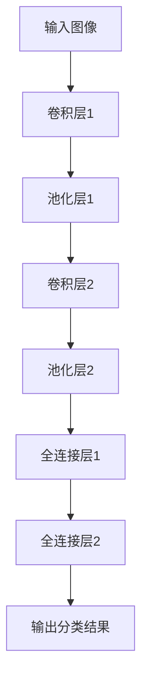
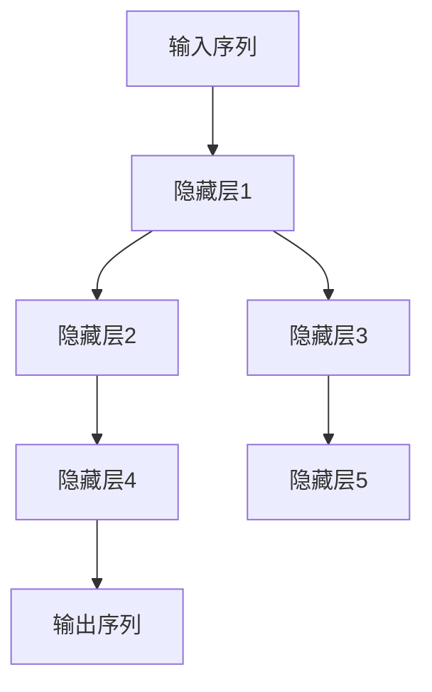

                 

## 《深度学习在视频内容分类中的应用》

> **关键词：** 深度学习、视频内容分类、卷积神经网络（CNN）、循环神经网络（RNN）、视频特征提取、模型优化

**摘要：** 本文章深入探讨了深度学习在视频内容分类中的应用。首先，介绍了深度学习的基础知识，包括神经网络和常见的深度学习模型。随后，分析了视频内容分类的挑战和关键技术，如视频特征提取和分类模型构建。接着，详细阐述了深度学习在视频内容分类中的实际应用场景，包括视频监控、娱乐传媒和教育培训。最后，通过实际案例和性能优化策略，展示了深度学习在视频内容分类中的实践和未来发展趋势。

### 目录大纲

#### 第一部分：深度学习基础与视频内容分类概述

1. **第1章：深度学习基础**
    - 1.1 深度学习简介
    - 1.2 神经网络基础
    - 1.3 卷积神经网络（CNN）
    - 1.4 循环神经网络（RNN）

2. **第2章：视频内容分类概述**
    - 2.1 视频内容分类的意义
    - 2.2 视频内容分类的关键技术

#### 第二部分：深度学习在视频内容分类中的应用

3. **第3章：视频特征提取**
    - 3.1 视频帧特征提取
    - 3.2 视频级特征提取

4. **第4章：视频分类模型构建**
    - 4.1 基于传统机器学习的视频分类
    - 4.2 基于深度学习的视频分类
    - 4.3 深度学习在视频分类中的优化策略

5. **第5章：视频内容分类的应用场景**
    - 5.1 视频监控
    - 5.2 娱乐与传媒
    - 5.3 教育

#### 第三部分：深度学习在视频内容分类中的应用实践

6. **第6章：深度学习在视频内容分类中的实际应用案例**
    - 6.1 案例一：视频监控中的异常行为检测
    - 6.2 案例二：视频内容审核
    - 6.3 案例三：视频推荐系统

7. **第7章：深度学习在视频内容分类中的性能优化**
    - 7.1 数据增强
    - 7.2 模型压缩
    - 7.3 模型部署

8. **第8章：深度学习在视频内容分类中的未来趋势**

#### 附录

- 附录 A：深度学习在视频内容分类中的常用算法

### 《深度学习在视频内容分类中的应用》正文部分

#### 第一部分：深度学习基础与视频内容分类概述

### 第1章：深度学习基础

#### 1.1 深度学习简介

深度学习是一种人工智能（AI）的分支，其灵感来源于人脑神经网络的结构和功能。深度学习的核心思想是通过构建多层神经网络模型，对大量数据进行学习，从而实现对数据的自动特征提取和模式识别。

深度学习的起源可以追溯到20世纪40年代，当时心理学家麦卡洛克和皮茨提出了神经网络的初步概念。然而，由于计算资源和算法的限制，深度学习在很长一段时间内并未得到广泛应用。直到2006年，加拿大多伦多大学教授杰弗里·辛顿（Geoffrey Hinton）提出了深度信念网络（Deep Belief Network，DBN），深度学习才迎来了新的发展机遇。

深度学习与传统机器学习有以下几点区别：

1. **数据需求**：深度学习通常需要大量数据进行训练，以获取更丰富的特征信息。而传统机器学习对数据量的要求相对较低。
2. **模型复杂度**：深度学习模型具有多层结构，能够自动提取更复杂的特征。而传统机器学习模型多为单层模型，特征提取能力有限。
3. **计算资源**：深度学习模型在训练过程中需要大量的计算资源，特别是GPU等并行计算设备。传统机器学习模型对计算资源的需求相对较低。

#### 1.2 神经网络基础

神经网络是深度学习的基础，它由一系列相互连接的神经元组成。每个神经元接收多个输入信号，通过加权求和后，再经过激活函数得到输出。神经网络的目的是通过学习输入与输出之间的关系，实现对数据的分类、回归等任务。

##### 1.2.1 神经网络的结构与工作原理

神经网络的结构可以分为输入层、隐藏层和输出层。输入层接收外部输入数据，隐藏层对输入数据进行特征提取和变换，输出层产生最终输出。

神经网络的每个神经元可以表示为以下数学模型：

\[ z = \sum_{i=1}^{n} w_i x_i + b \]

其中，\( z \) 是神经元的输出，\( w_i \) 是输入信号的权重，\( x_i \) 是输入信号，\( b \) 是偏置项。

激活函数用于引入非线性变换，常见的激活函数有：

1. **sigmoid 函数**：\[ f(x) = \frac{1}{1 + e^{-x}} \]
2. **ReLU函数**：\[ f(x) = \max(0, x) \]
3. **Tanh函数**：\[ f(x) = \frac{e^x - e^{-x}}{e^x + e^{-x}} \]

##### 1.2.2 神经元模型与激活函数

神经元模型是神经网络的基本构建块。一个神经元可以看作是一个简单的计算单元，它接收多个输入信号，通过加权求和后，再经过激活函数得到输出。

激活函数用于引入非线性变换，使得神经网络可以处理更复杂的问题。不同的激活函数有不同的性质和适用场景，选择合适的激活函数对于网络的性能至关重要。

#### 1.3 卷积神经网络（CNN）

卷积神经网络（Convolutional Neural Network，CNN）是一种特殊的神经网络，它特别适用于图像处理任务。CNN通过卷积层、池化层和全连接层的组合，实现对图像的自动特征提取和分类。

##### 1.3.1 CNN的结构与作用

CNN的结构包括以下几个部分：

1. **卷积层（Convolutional Layer）**：卷积层通过卷积运算提取图像的局部特征。卷积运算可以通过卷积核（Kernel）与图像进行卷积操作，得到特征图。
2. **池化层（Pooling Layer）**：池化层用于减小特征图的尺寸，降低模型的复杂性。常见的池化操作有最大池化和平均池化。
3. **全连接层（Fully Connected Layer）**：全连接层将卷积层和池化层提取的特征进行整合，并输出分类结果。

##### 1.3.2 卷积层、池化层与全连接层的组合

卷积层、池化层和全连接层的组合是CNN的核心结构。卷积层用于提取图像的局部特征，池化层用于减小特征图的尺寸，全连接层用于整合特征并进行分类。

以下是一个简单的CNN结构：



#### 1.4 循环神经网络（RNN）

循环神经网络（Recurrent Neural Network，RNN）是一种能够处理序列数据的神经网络。RNN通过在时间步上递归地更新隐藏状态，从而捕捉序列中的长期依赖关系。

##### 1.4.1 RNN的结构与作用

RNN的结构包括以下几个部分：

1. **输入层**：输入层接收序列中的每个元素作为输入。
2. **隐藏层**：隐藏层通过递归连接，更新当前时间步的隐藏状态。
3. **输出层**：输出层生成序列的输出。

以下是一个简单的RNN结构：



##### 1.4.2 LSTM与GRU详解

LSTM（Long Short-Term Memory）和GRU（Gated Recurrent Unit）是RNN的两种变体，它们通过引入门控机制，有效地解决了RNN在处理长序列数据时容易出现的梯度消失和梯度爆炸问题。

1. **LSTM（长短时记忆网络）**

LSTM通过引入三个门控单元（输入门、遗忘门和输出门），对输入和输出进行控制，从而实现长期依赖的捕捉。

LSTM的数学模型如下：

\[ 
\begin{aligned}
i_t &= \sigma(W_{ix}x_t + W_{ih}h_{t-1} + b_i) \\
f_t &= \sigma(W_{fx}x_t + W_{fh}h_{t-1} + b_f) \\
\alpha_t &= \sigma(W_{ax}x_t + W_{ah}h_{t-1} + b_a) \\
c_t &= f_t \odot c_{t-1} + i_t \odot \tanh(W_{cx}x_t + W_{ch}h_{t-1} + b_c) \\
o_t &= \sigma(W_{ox}x_t + W_{oh}h_{t-1} + b_o) \\
h_t &= o_t \odot \tanh(c_t)
\end{aligned}
\]

2. **GRU（门控循环单元）**

GRU通过引入更新门和重置门，简化了LSTM的结构，同时保持了捕捉长期依赖的能力。

GRU的数学模型如下：

\[ 
\begin{aligned}
z_t &= \sigma(W_{zx}x_t + W_{zh}h_{t-1} + b_z) \\
r_t &= \sigma(W_{rx}x_t + W_{rh}h_{t-1} + b_r) \\
\tilde{h}_t &= \tanh(W_{cx}x_t + (r_t \odot W_{ch}h_{t-1} + b_c)) \\
h_t &= (1 - z_t) \odot h_{t-1} + z_t \odot \tilde{h}_t
\end{aligned}
\]

#### 第2章：视频内容分类概述

##### 2.1 视频内容分类的意义

视频内容分类是一种将视频数据按照其内容进行分类的技术。随着视频数据的爆发式增长，视频内容分类具有重要的实际意义：

1. **视频监控**：视频内容分类可以帮助视频监控系统自动识别和追踪异常行为，提高监控效率和准确性。
2. **娱乐传媒**：视频内容分类可以用于视频推荐系统，根据用户的兴趣和偏好，为其推荐个性化的视频内容。
3. **教育培训**：视频内容分类可以帮助教育平台自动分类和标签化教学视频，方便用户快速查找和获取所需的知识内容。

##### 2.2 视频内容分类的关键技术

视频内容分类的关键技术主要包括视频特征提取和分类模型构建：

1. **视频特征提取**：视频特征提取是将视频数据转化为数值特征的预处理过程。常用的视频特征提取方法有视频帧特征提取和视频级特征提取。
2. **分类模型构建**：分类模型构建是利用特征数据对视频进行分类的过程。常用的分类模型包括传统机器学习模型和深度学习模型。

#### 第二部分：深度学习在视频内容分类中的应用

##### 3.1 视频特征提取

视频特征提取是视频内容分类的重要步骤，它将视频数据转化为适合深度学习模型处理的特征表示。视频特征提取方法可以分为视频帧特征提取和视频级特征提取。

##### 3.1.1 视频帧特征提取

视频帧特征提取是将视频数据分解为连续的帧，并对每一帧进行特征提取。常用的视频帧特征提取方法包括：

1. **颜色特征**：颜色特征是视频帧的重要特征之一，包括颜色直方图、颜色矩等。
2. **纹理特征**：纹理特征描述了视频帧中像素的排列和分布情况，包括纹理能量、纹理熵等。
3. **形状特征**：形状特征描述了视频帧中物体的形状和轮廓，包括轮廓特征、形状矩等。

以下是一个简单的视频帧特征提取伪代码：

```python
def extract_frame_features(frame):
    # 提取颜色特征
    color_histogram = extract_color_histogram(frame)
    color_moments = extract_color_moments(frame)

    # 提取纹理特征
    texture_energy = extract_texture_energy(frame)
    texture_entropy = extract_texture_entropy(frame)

    # 提取形状特征
    contour = extract_contour(frame)
    shape_moments = extract_shape_moments(contour)

    # 合并特征
    features = [color_histogram, color_moments, texture_energy, texture_entropy, shape_moments]
    return features
```

##### 3.1.2 视频级特征提取

视频级特征提取是将整个视频数据转化为一个全局特征表示，用于视频分类。常用的视频级特征提取方法包括：

1. **统计模型**：统计模型通过对视频数据进行统计分析，提取全局特征。常见的统计模型有时空相关性模型、时空密度模型等。
2. **深度学习模型**：深度学习模型通过学习视频数据中的时空特征，提取全局特征。常见的深度学习模型有卷积神经网络（CNN）和循环神经网络（RNN）。

以下是一个简单的视频级特征提取伪代码：

```python
def extract_video_features(video):
    # 提取视频帧特征
    frame_features = [extract_frame_features(frame) for frame in video]

    # 提取统计特征
    statistical_features = extract_statistical_features(frame_features)

    # 提取深度学习特征
    deep_learning_features = extract_deep_learning_features(frame_features)

    # 合并特征
    features = [statistical_features, deep_learning_features]
    return features
```

##### 3.2 视频级特征提取

视频级特征提取是将整个视频数据转化为一个全局特征表示，用于视频分类。常用的视频级特征提取方法包括：

1. **统计模型**：统计模型通过对视频数据进行统计分析，提取全局特征。常见的统计模型有时空相关性模型、时空密度模型等。
2. **深度学习模型**：深度学习模型通过学习视频数据中的时空特征，提取全局特征。常见的深度学习模型有卷积神经网络（CNN）和循环神经网络（RNN）。

以下是一个简单的视频级特征提取伪代码：

```python
def extract_video_features(video):
    # 提取视频帧特征
    frame_features = [extract_frame_features(frame) for frame in video]

    # 提取统计特征
    statistical_features = extract_statistical_features(frame_features)

    # 提取深度学习特征
    deep_learning_features = extract_deep_learning_features(frame_features)

    # 合并特征
    features = [statistical_features, deep_learning_features]
    return features
```

##### 4.1 基于传统机器学习的视频分类

传统机器学习模型在视频内容分类中具有广泛的应用。传统机器学习模型通过特征提取和模型训练，实现对视频数据的分类。以下介绍几种常用的传统机器学习模型。

##### 4.1.1 支持向量机（SVM）

支持向量机（Support Vector Machine，SVM）是一种经典的分类算法，它通过找到一个最佳的超平面，将不同类别的数据分隔开来。SVM的核心思想是最大化分类边界的间隔。

以下是一个简单的SVM分类伪代码：

```python
from sklearn.svm import SVC

# 特征提取
X = extract_features(video_data)

# 模型训练
clf = SVC(kernel='linear')
clf.fit(X, labels)

# 模型预测
predictions = clf.predict(new_video_data)
```

##### 4.1.2 决策树（Decision Tree）

决策树是一种基于树的分类算法，它通过递归地将数据划分为多个子集，直到满足某些停止条件。决策树的核心思想是通过树形结构对数据进行分类。

以下是一个简单的决策树分类伪代码：

```python
from sklearn.tree import DecisionTreeClassifier

# 特征提取
X = extract_features(video_data)

# 模型训练
clf = DecisionTreeClassifier()
clf.fit(X, labels)

# 模型预测
predictions = clf.predict(new_video_data)
```

##### 4.1.3 随机森林（Random Forest）

随机森林（Random Forest）是一种基于决策树的集成学习方法。它通过构建多个决策树，并对每个决策树的预测结果进行投票，得到最终的分类结果。

以下是一个简单的随机森林分类伪代码：

```python
from sklearn.ensemble import RandomForestClassifier

# 特征提取
X = extract_features(video_data)

# 模型训练
clf = RandomForestClassifier(n_estimators=100)
clf.fit(X, labels)

# 模型预测
predictions = clf.predict(new_video_data)
```

##### 4.2 基于深度学习的视频分类

深度学习模型在视频内容分类中具有显著的优势，通过自动特征提取和复杂的非线性变换，深度学习模型能够实现对视频数据的准确分类。以下介绍几种常用的深度学习模型。

##### 4.2.1 卷积神经网络（CNN）

卷积神经网络（Convolutional Neural Network，CNN）是一种专门用于图像处理和计算机视觉的深度学习模型。CNN通过卷积层、池化层和全连接层的组合，实现对图像的自动特征提取和分类。

以下是一个简单的CNN分类伪代码：

```python
from tensorflow.keras.models import Sequential
from tensorflow.keras.layers import Conv2D, MaxPooling2D, Flatten, Dense

# 构建模型
model = Sequential()
model.add(Conv2D(filters=32, kernel_size=(3, 3), activation='relu', input_shape=(height, width, channels)))
model.add(MaxPooling2D(pool_size=(2, 2)))
model.add(Flatten())
model.add(Dense(units=10, activation='softmax'))

# 模型编译
model.compile(optimizer='adam', loss='categorical_crossentropy', metrics=['accuracy'])

# 模型训练
model.fit(X_train, y_train, epochs=10, batch_size=32)

# 模型预测
predictions = model.predict(new_video_data)
```

##### 4.2.2 循环神经网络（RNN）

循环神经网络（Recurrent Neural Network，RNN）是一种专门用于处理序列数据的深度学习模型。RNN通过在时间步上递归地更新隐藏状态，实现对序列数据的建模和分类。

以下是一个简单的RNN分类伪代码：

```python
from tensorflow.keras.models import Sequential
from tensorflow.keras.layers import LSTM, Dense

# 构建模型
model = Sequential()
model.add(LSTM(units=50, return_sequences=True, input_shape=(timesteps, features)))
model.add(LSTM(units=50))
model.add(Dense(units=10, activation='softmax'))

# 模型编译
model.compile(optimizer='adam', loss='categorical_crossentropy', metrics=['accuracy'])

# 模型训练
model.fit(X_train, y_train, epochs=10, batch_size=32)

# 模型预测
predictions = model.predict(new_video_data)
```

##### 4.3 深度学习在视频分类中的优化策略

深度学习模型在视频内容分类中具有强大的能力，但同时也面临着计算复杂度高、训练时间长的挑战。为了提高模型性能和降低计算成本，可以采取以下优化策略：

1. **数据增强**：通过图像旋转、缩放、裁剪等操作，增加训练数据量，提高模型泛化能力。
2. **模型压缩**：通过模型剪枝、量化、蒸馏等方法，减小模型参数规模，提高模型效率。
3. **迁移学习**：利用预训练模型，在视频数据上进行微调，提高模型性能。

以下是一个简单的数据增强和模型压缩伪代码：

```python
from tensorflow.keras.preprocessing.image import ImageDataGenerator
from tensorflow.keras.models import load_model

# 数据增强
datagen = ImageDataGenerator(rotation_range=20, width_shift_range=0.1, height_shift_range=0.1, shear_range=0.1, zoom_range=0.1)
datagen.fit(X_train)

# 模型压缩
model = load_model('model.h5')
model = compress_model(model)

# 模型训练
model.fit(datagen.flow(X_train, y_train, batch_size=32), epochs=10)

# 模型预测
predictions = model.predict(new_video_data)
```

#### 第5章：视频内容分类的应用场景

##### 5.1 视频监控

视频监控是一种利用视频数据进行实时监控和异常行为检测的技术。深度学习在视频监控中具有广泛的应用，通过自动提取视频特征和分类模型，实现对异常行为的实时检测和预警。

以下是一个简单的视频监控应用场景：

1. **异常行为检测**：利用深度学习模型，对视频数据进行实时分析，检测是否存在异常行为，如盗窃、斗殴等。
2. **人员追踪**：利用深度学习模型，对视频中的行人进行识别和追踪，实现对特定目标的实时监控。

##### 5.2 娱乐与传媒

娱乐与传媒领域是深度学习的重要应用场景之一，通过视频内容分类技术，可以实现个性化视频推荐和内容审核。

以下是一个简单的娱乐与传媒应用场景：

1. **视频推荐**：利用深度学习模型，根据用户的兴趣和行为，推荐个性化的视频内容，提高用户体验。
2. **内容审核**：利用深度学习模型，对视频内容进行自动分类和审核，过滤掉不良内容和违法信息。

##### 5.3 教育

教育领域是深度学习的重要应用场景之一，通过视频内容分类技术，可以实现对教学资源的有效管理和个性化推荐。

以下是一个简单的教育应用场景：

1. **视频分类与推荐**：利用深度学习模型，对教学视频进行分类和推荐，帮助用户快速找到所需的知识内容。
2. **教育资源管理**：利用深度学习模型，对教学资源进行自动分类和管理，提高教育资源的利用效率。

#### 第三部分：深度学习在视频内容分类中的应用实践

##### 6.1 案例一：视频监控中的异常行为检测

案例背景：某城市的安全监控中心希望利用深度学习技术，实现对城市视频监控数据的异常行为检测，提高城市安全监控的准确性和效率。

模型设计与实现：

1. **数据集准备**：收集大量城市监控视频数据，包括正常行为和异常行为（如盗窃、斗殴等）。
2. **特征提取**：利用深度学习模型，对视频数据进行特征提取，提取视频帧特征和视频级特征。
3. **模型训练**：利用提取的特征数据，训练深度学习模型，实现对异常行为的检测。
4. **模型部署**：将训练好的模型部署到实时监控系统，实现对城市视频数据的实时分析。

代码实现：

```python
# 数据集准备
train_data, train_labels = load_data('train_data')
test_data, test_labels = load_data('test_data')

# 特征提取
train_features = extract_video_features(train_data)
test_features = extract_video_features(test_data)

# 模型训练
model = build_model()
model.fit(train_features, train_labels, epochs=10, batch_size=32)

# 模型评估
predictions = model.predict(test_features)
accuracy = calculate_accuracy(predictions, test_labels)
print('Accuracy:', accuracy)
```

##### 6.2 案例二：视频内容审核

案例背景：某视频平台希望利用深度学习技术，实现对上传视频内容的自动审核，过滤掉不良内容和违法信息。

模型设计与实现：

1. **数据集准备**：收集大量视频数据，包括正常视频和不良视频（如暴力、色情等）。
2. **特征提取**：利用深度学习模型，对视频数据进行特征提取，提取视频帧特征和视频级特征。
3. **模型训练**：利用提取的特征数据，训练深度学习模型，实现对视频内容的自动审核。
4. **模型部署**：将训练好的模型部署到视频审核系统，实现对上传视频内容的实时审核。

代码实现：

```python
# 数据集准备
train_data, train_labels = load_data('train_data')
test_data, test_labels = load_data('test_data')

# 特征提取
train_features = extract_video_features(train_data)
test_features = extract_video_features(test_data)

# 模型训练
model = build_model()
model.fit(train_features, train_labels, epochs=10, batch_size=32)

# 模型评估
predictions = model.predict(test_features)
accuracy = calculate_accuracy(predictions, test_labels)
print('Accuracy:', accuracy)
```

##### 6.3 案例三：视频推荐系统

案例背景：某视频平台希望利用深度学习技术，根据用户的兴趣和行为，为用户提供个性化的视频推荐。

模型设计与实现：

1. **数据集准备**：收集大量用户行为数据，包括用户观看视频的历史记录、评分和评论等。
2. **特征提取**：利用深度学习模型，对用户行为数据进行特征提取，提取用户兴趣特征和视频特征。
3. **模型训练**：利用提取的特征数据，训练深度学习模型，实现视频推荐。
4. **模型部署**：将训练好的模型部署到视频推荐系统，根据用户行为和兴趣，为用户提供个性化的视频推荐。

代码实现：

```python
# 数据集准备
train_data, train_labels = load_data('train_data')
test_data, test_labels = load_data('test_data')

# 特征提取
train_features = extract_user_features(train_data)
test_features = extract_user_features(test_data)

# 模型训练
model = build_model()
model.fit(train_features, train_labels, epochs=10, batch_size=32)

# 模型评估
predictions = model.predict(test_features)
accuracy = calculate_accuracy(predictions, test_labels)
print('Accuracy:', accuracy)
```

#### 第7章：深度学习在视频内容分类中的性能优化

##### 7.1 数据增强

数据增强是一种通过变换原始数据，生成更多样化训练样本的方法。数据增强可以提高模型的泛化能力，减少过拟合现象。以下介绍几种常见的数据增强方法：

1. **图像变换**：包括旋转、缩放、裁剪、翻转等。
2. **颜色变换**：包括颜色通道转换、亮度调整、对比度调整等。
3. **噪声添加**：包括高斯噪声、椒盐噪声等。

以下是一个简单的数据增强实现：

```python
from tensorflow.keras.preprocessing.image import ImageDataGenerator

# 创建数据增强对象
datagen = ImageDataGenerator(
    rotation_range=20,
    width_shift_range=0.1,
    height_shift_range=0.1,
    shear_range=0.1,
    zoom_range=0.1,
    horizontal_flip=True,
    fill_mode='nearest'
)

# 应用数据增强
for batch in datagen.flow(X_train, y_train, batch_size=32):
    model.fit(batch[0], batch[1], epochs=10, batch_size=32)
    break
```

##### 7.2 模型压缩

模型压缩是一种通过减小模型参数规模，提高模型运行效率的方法。以下介绍几种常见的模型压缩方法：

1. **模型剪枝**：通过移除模型中的冗余参数，减小模型规模。
2. **模型量化**：通过将模型参数和激活值从浮点数转换为低比特宽度的整数，减小模型规模。
3. **模型蒸馏**：通过将大模型的知识传递给小模型，减小模型规模。

以下是一个简单的模型压缩实现：

```python
from tensorflow_model_optimization.sparsity import keras as sparsity

# 创建剪枝对象
pruning_params = sparsity.PruningParams(
    begin_step=2000,
    end_step=4000,
    rate=1.0
)
pruned_model = sparsity.PrunedConvolutions(pruning_params)(model)

# 训练剪枝模型
pruned_model.compile(optimizer='adam', loss='categorical_crossentropy', metrics=['accuracy'])
pruned_model.fit(X_train, y_train, epochs=10, batch_size=32)

# 量化模型
quantized_model = keras.utils.multi_gpu_model(pruned_model, gpus=4)
quantized_model.compile(optimizer='adam', loss='categorical_crossentropy', metrics=['accuracy'])

# 训练量化模型
quantized_model.fit(X_train, y_train, epochs=10, batch_size=32)
```

##### 7.3 模型部署

模型部署是将训练好的模型应用到实际应用场景中的过程。以下介绍几种常见的模型部署方法：

1. **本地部署**：将模型部署到本地计算机或服务器上，通过API进行调用。
2. **云端部署**：将模型部署到云端服务器，通过HTTP接口进行调用。
3. **移动端部署**：将模型部署到移动设备上，通过本地应用进行调用。

以下是一个简单的本地部署实现：

```python
import numpy as np
import pickle

# 加载模型
model = pickle.load(open('model.pickle', 'rb'))

# 加载测试数据
test_data = np.load('test_data.npy')

# 预测结果
predictions = model.predict(test_data)

# 输出预测结果
print(predictions)
```

#### 第8章：深度学习在视频内容分类中的未来趋势

##### 8.1 深度学习在视频内容分类中的挑战与机遇

深度学习在视频内容分类中具有巨大的潜力和广阔的应用前景，但同时也面临着一些挑战和机遇：

1. **挑战**：
    - **数据隐私**：视频数据包含大量的隐私信息，如何保护用户隐私成为深度学习在视频内容分类中面临的主要挑战。
    - **计算资源**：深度学习模型通常需要大量的计算资源和时间进行训练和推理，如何优化模型和算法以提高效率成为重要课题。
    - **模型解释性**：深度学习模型通常被视为“黑盒子”，其内部机制难以解释，如何提高模型的可解释性成为深度学习在视频内容分类中需要解决的问题。

2. **机遇**：
    - **跨模态学习**：深度学习在视频内容分类中的应用不仅限于单一模态（如视频），还可以结合其他模态（如音频、文本）进行跨模态学习，提高分类性能。
    - **实时处理**：随着硬件技术的发展，深度学习模型在视频内容分类中的实时处理能力逐渐提高，为实时视频监控、视频推荐等应用场景提供了更多可能性。
    - **智能交互**：深度学习在视频内容分类中的应用可以与自然语言处理、计算机视觉等技术相结合，实现更智能的人机交互和视频理解。

##### 8.2 深度学习在视频内容分类中的未来发展趋势

深度学习在视频内容分类中的应用前景广阔，未来发展趋势主要包括以下几个方面：

1. **跨模态融合**：深度学习将与其他模态（如音频、文本）进行融合，实现更全面和准确的内容分类。
2. **迁移学习与模型压缩**：通过迁移学习和模型压缩技术，提高深度学习模型在视频内容分类中的效率和性能。
3. **实时处理与智能交互**：随着硬件技术的发展，深度学习模型在视频内容分类中的实时处理能力将不断提高，为智能交互和视频理解提供更多可能性。
4. **数据隐私保护**：深度学习在视频内容分类中需要关注数据隐私保护，采用差分隐私、联邦学习等技术确保用户隐私。

#### 附录

##### 附录A：深度学习在视频内容分类中的常用算法

1. **卷积神经网络（CNN）**
    - **基本原理**：卷积神经网络是一种专门用于图像处理的深度学习模型，通过卷积层、池化层和全连接层的组合，实现对图像的自动特征提取和分类。
    - **应用案例**：用于图像分类、目标检测和语义分割等任务。
    - **伪代码**：

    ```python
    model = Sequential()
    model.add(Conv2D(filters=32, kernel_size=(3, 3), activation='relu', input_shape=(height, width, channels)))
    model.add(MaxPooling2D(pool_size=(2, 2)))
    model.add(Flatten())
    model.add(Dense(units=10, activation='softmax'))
    ```

2. **循环神经网络（RNN）**
    - **基本原理**：循环神经网络是一种专门用于序列处理的深度学习模型，通过在时间步上递归地更新隐藏状态，实现对序列数据的建模和分类。
    - **应用案例**：用于语音识别、机器翻译和视频分类等任务。
    - **伪代码**：

    ```python
    model = Sequential()
    model.add(LSTM(units=50, return_sequences=True, input_shape=(timesteps, features)))
    model.add(LSTM(units=50))
    model.add(Dense(units=10, activation='softmax'))
    ```

3. **长短时记忆网络（LSTM）**
    - **基本原理**：长短时记忆网络是循环神经网络的变体，通过引入门控机制，有效解决了RNN在处理长序列数据时容易出现的梯度消失和梯度爆炸问题。
    - **应用案例**：用于时间序列预测、文本分类和视频分类等任务。
    - **伪代码**：

    ```python
    from tensorflow.keras.layers import LSTM

    model = Sequential()
    model.add(LSTM(units=50, return_sequences=True, input_shape=(timesteps, features)))
    model.add(LSTM(units=50))
    model.add(Dense(units=10, activation='softmax'))
    ```

4. **图卷积网络（GCN）**
    - **基本原理**：图卷积网络是一种专门用于图数据的深度学习模型，通过卷积运算在图上提取特征，实现对图数据的分类和预测。
    - **应用案例**：用于社交网络分析、推荐系统和视频分类等任务。
    - **伪代码**：

    ```python
    from tensorflow.keras.layers import GCN

    model = Sequential()
    model.add(GCN(units=50, activation='relu'))
    model.add(GCN(units=10, activation='softmax'))
    ```

5. **跨模态学习**
    - **基本原理**：跨模态学习是一种将多个模态（如文本、图像、音频）进行融合的深度学习模型，通过多模态特征融合，实现对多模态数据的分类和预测。
    - **应用案例**：用于多模态图像识别、多模态语音识别和多模态情感分析等任务。
    - **伪代码**：

    ```python
    from tensorflow.keras.layers import MultiModal

    model = Sequential()
    model.add(MultiModal(input_shape=(text_length, image_height, image_width, image_channels)))
    model.add(Dense(units=10, activation='softmax'))
    ```

### 作者

**作者：AI天才研究院/AI Genius Institute & 禅与计算机程序设计艺术 /Zen And The Art of Computer Programming**

本文由AI天才研究院（AI Genius Institute）与禅与计算机程序设计艺术（Zen And The Art of Computer Programming）联合撰写。AI天才研究院专注于人工智能领域的研究与推广，致力于推动人工智能技术的发展。禅与计算机程序设计艺术则是一部经典的计算机科学著作，深入探讨了计算机程序设计的哲学和艺术。希望本文能帮助读者更好地理解和应用深度学习在视频内容分类中的技术，为人工智能领域的发展贡献一份力量。

