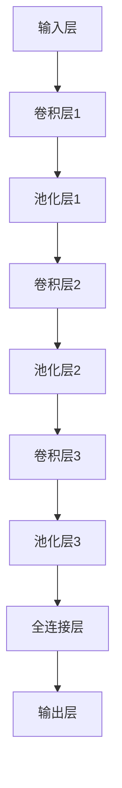

                 

### 文章标题

**深度学习在语音情感识别中的研究进展**

---

#### 关键词：

- 深度学习
- 语音情感识别
- 特征提取
- 卷积神经网络（CNN）
- 循环神经网络（RNN）
- 生成对抗网络（GAN）

---

#### 摘要：

本文全面探讨了深度学习在语音情感识别领域的最新研究进展。首先，介绍了语音情感识别的重要性及其在多个应用场景中的价值。随后，详细阐述了深度学习的基础理论，包括神经网络、卷积神经网络（CNN）、循环神经网络（RNN）和生成对抗网络（GAN）。接着，本文重点讨论了语音特征提取的方法和技术，包括频谱特征提取、时域特征提取和高级特征提取方法。此外，本文还介绍了情感识别模型的构建方法，包括线性模型、非线性模型和基于深度学习的情感识别模型。文章还探讨了情感识别系统的优化方法，包括特征选择与降维、模型选择与优化以及情感识别性能评估。最后，本文通过实际应用案例展示了语音情感识别技术在不同领域的应用，并展望了未来的发展趋势和挑战。通过本文，读者可以全面了解深度学习在语音情感识别领域的最新研究动态和未来方向。

### 《深度学习在语音情感识别中的研究进展》目录大纲

---

#### 第一部分：背景与基础理论

##### 第1章：语音情感识别概述
- 1.1 语音情感识别的重要性
- 1.2 语音情感识别的应用场景
- 1.3 情感识别的基本概念
- 1.4 情感分类的挑战

##### 第2章：深度学习基础
- 2.1 深度学习的基本概念
- 2.2 神经网络基础
  - 2.2.1 神经元与激活函数
  - 2.2.2 前向传播与反向传播算法
- 2.3 卷积神经网络（CNN）
  - 2.3.1 CNN的基本结构
  - 2.3.2 CNN在图像处理中的应用
- 2.4 循环神经网络（RNN）
  - 2.4.1 RNN的基本结构
  - 2.4.2 LSTM与GRU
- 2.5 生成对抗网络（GAN）
  - 2.5.1 GAN的基本概念
  - 2.5.2 GAN的应用案例

#### 第二部分：语音情感识别技术

##### 第3章：语音特征提取
- 3.1 语音信号预处理
- 3.2 频谱特征提取
  - 3.2.1 MFCC（梅尔频率倒谱系数）
  - 3.2.2 其他频谱特征
- 3.3 时域特征提取
  - 3.3.1 声压级
  - 3.3.2 谱矩
- 3.4 高级特征提取方法
  - 3.4.1 音素级特征
  - 3.4.2 基于深度学习的特征提取

##### 第4章：情感识别模型构建
- 4.1 线性模型
  - 4.1.1 回归模型
  - 4.1.2 逻辑回归
- 4.2 非线性模型
  - 4.2.1 支持向量机（SVM）
  - 4.2.2 决策树与随机森林
- 4.3 基于深度学习的情感识别模型
  - 4.3.1 CNN模型在语音情感识别中的应用
  - 4.3.2 RNN模型在语音情感识别中的应用
  - 4.3.3 GAN模型在语音情感识别中的应用

##### 第5章：情感识别系统优化
- 5.1 特征选择与降维
- 5.2 模型选择与优化
  - 5.2.1 超参数调优
  - 5.2.2 模型集成与堆叠
- 5.3 情感识别性能评估
  - 5.3.1 评价指标
  - 5.3.2 实验设计与结果分析

#### 第三部分：实际应用案例与展望

##### 第6章：语音情感识别应用案例
- 6.1 案例一：情感分析在客服机器人中的应用
- 6.2 案例二：情感识别在心理健康监测中的应用
- 6.3 案例三：情感识别在语音交互系统中的应用

##### 第7章：未来趋势与挑战
- 7.1 深度学习在语音情感识别中的发展趋势
- 7.2 语音情感识别技术的挑战与对策
- 7.3 未来的研究热点与应用前景

#### 附录

##### 附录A：深度学习与语音情感识别资源汇总
- A.1 深度学习学习资源
- A.2 语音情感识别相关数据集与工具
- A.3 开发环境搭建与配置指南

#### 参考文献

---

### 第1章：语音情感识别概述

#### 1.1 语音情感识别的重要性

语音情感识别是一种通过分析语音信号中的情感特征，从而判断说话者情感状态的技术。它在全球范围内被广泛应用，并在多个领域发挥了重要作用。

首先，在心理健康领域，语音情感识别技术可以帮助医生和心理学家更准确地评估患者的情感状态。通过分析患者语音中的情感特征，可以诊断出抑郁症、焦虑症等心理疾病，为患者提供个性化的治疗方案。例如，在临床治疗中，医生可以通过语音情感识别技术监测患者是否在遵循医嘱，从而提高治疗效果。

其次，在商业领域，语音情感识别技术可以帮助企业更好地了解客户的需求和情感状态。例如，在客服机器人中，通过语音情感识别技术，可以分析客户语音的情感特征，从而提供个性化的服务，提高客户满意度。此外，语音情感识别还可以用于客户反馈分析，帮助企业了解客户对产品或服务的真实感受，从而进行产品优化和营销策略调整。

在智能人机交互领域，语音情感识别技术同样具有重要意义。通过分析用户语音的情感特征，智能语音助手可以更好地理解用户的情感需求，从而提供更加贴心的服务。例如，在智能家居系统中，语音情感识别技术可以帮助智能设备根据用户的情感状态调整环境设置，如调节光线、温度等，提高用户的舒适度。

总的来说，语音情感识别技术具有重要的应用价值。它不仅可以帮助医生和心理学家更准确地评估患者的情感状态，提高治疗效果，还可以帮助企业了解客户需求，提高客户满意度，同时在智能人机交互领域也有广泛的应用前景。因此，深入研究语音情感识别技术，对于推动人工智能技术的发展具有重要意义。

#### 1.2 语音情感识别的应用场景

语音情感识别技术具有广泛的应用场景，涵盖了医疗健康、商业、人机交互等多个领域。

首先，在医疗健康领域，语音情感识别技术可以帮助医生和心理学家更好地了解患者的情感状态。例如，抑郁症和焦虑症等心理疾病往往伴随着情感变化，通过分析患者语音中的情感特征，可以更准确地诊断和评估病情，为患者提供个性化的治疗方案。此外，语音情感识别技术还可以用于心理健康监测，通过长期监测患者语音中的情感变化，及时发现异常情况，提前干预，预防病情恶化。

在商业领域，语音情感识别技术同样有着重要的应用。例如，在客服机器人中，通过分析客户语音的情感特征，可以了解客户的情感状态，从而提供更加个性化的服务，提高客户满意度。此外，语音情感识别还可以用于客户反馈分析，通过对客户语音中的情感特征进行分析，了解客户对产品或服务的真实感受，从而进行产品优化和营销策略调整。

在智能人机交互领域，语音情感识别技术也发挥着重要作用。通过分析用户语音的情感特征，智能语音助手可以更好地理解用户的情感需求，从而提供更加贴心的服务。例如，在智能家居系统中，语音情感识别技术可以帮助智能设备根据用户的情感状态调整环境设置，如调节光线、温度等，提高用户的舒适度。此外，语音情感识别还可以用于教育领域，通过分析学生语音的情感特征，了解学生的学习状态和情感需求，从而提供个性化的学习建议。

总的来说，语音情感识别技术在不同领域的应用，不仅提高了相关行业的效率和服务质量，还推动了人工智能技术的发展。随着技术的不断进步，语音情感识别的应用场景将越来越广泛，为各行各业带来更多便利和效益。

#### 1.3 情感识别的基本概念

情感识别是指通过分析语音信号中的情感特征，来判断说话者的情感状态。情感识别的基本概念包括情感、情感表达和情感分类。

情感是指个体在特定情境下产生的愉悦或不愉悦的主观体验，通常分为基本情感（如快乐、悲伤、愤怒等）和复合情感（如焦虑、惊讶等）。情感可以通过语言、表情、动作等方式表达出来，这些表达形式被称为情感表达。

情感分类是指将情感表达划分为不同的类别，如快乐、悲伤、愤怒等。情感分类是情感识别的关键步骤，通过分类算法，可以对语音信号中的情感特征进行识别和分类。

在情感识别中，情感识别算法需要分析语音信号中的情感特征，如频谱特征、时域特征等，从而判断说话者的情感状态。情感识别的准确性和效率直接影响到应用的广泛性和实用性。

#### 1.4 情感分类的挑战

情感分类是语音情感识别中的关键步骤，然而，它也面临着许多挑战。

首先，情感多样性是一个重要的挑战。情感表达形式多样，不同的人可能在相同的情境下表现出不同的情感，这使得情感分类算法需要具备较高的鲁棒性和泛化能力。

其次，语音噪声是另一个挑战。在实际应用中，语音信号常常伴随着噪声，这会干扰情感识别的准确性。因此，如何有效地去除噪声，提取纯净的语音信号，是情感分类中的一个重要问题。

此外，情感变化的不确定性也是一个挑战。情感状态不是静态的，而是随时间变化的。如何在短时间的语音片段中捕捉到情感的变化，是情感分类算法需要解决的一个难题。

最后，数据稀缺也是一个重要挑战。高质量的语音情感数据集往往有限，这限制了算法的训练和优化。为了解决数据稀缺问题，可以采用数据增强、迁移学习等方法，以提高模型的泛化能力。

总的来说，情感分类的挑战主要集中在情感多样性、语音噪声、情感变化的不确定性和数据稀缺等方面。随着技术的不断进步，这些挑战将逐步得到解决，为语音情感识别技术的广泛应用奠定基础。

### 第2章：深度学习基础

#### 2.1 深度学习的基本概念

深度学习（Deep Learning）是机器学习（Machine Learning）的一个重要分支，它通过模拟人脑的神经网络结构，实现从大量数据中自动提取特征和模式。与传统的机器学习方法不同，深度学习能够通过多层神经网络结构自动提取层次化的特征表示，从而在高维数据和复杂数据上表现出强大的学习能力和泛化能力。

**深度学习的核心概念**：

1. **神经网络（Neural Networks）**：神经网络是深度学习的基础，它由大量的神经元（节点）组成，每个神经元接收来自其他神经元的输入，通过激活函数进行计算，并输出结果。神经网络通过学习输入和输出之间的映射关系，实现数据的分类、回归等任务。

2. **多层神经网络（Multi-Layer Neural Networks）**：多层神经网络比单层神经网络具有更强的表达能力和学习能力。它包括输入层、隐藏层和输出层，每一层都可以提取不同层次的特征。通过多层网络，深度学习能够从原始数据中自动提取高层次的抽象特征。

3. **前向传播（Forward Propagation）与反向传播（Backpropagation）**：前向传播是指将输入数据通过神经网络逐层传递，计算每一层的输出；反向传播是指根据输出误差，反向更新网络中的权重，以达到最小化误差的目的。反向传播是深度学习训练过程的核心，它通过不断调整网络权重，使得模型能够更好地拟合训练数据。

4. **深度神经网络（Deep Neural Networks）**：深度神经网络是指具有多个隐藏层的神经网络，通过多层的非线性变换，深度神经网络能够提取出更加抽象和复杂的特征表示。

5. **激活函数（Activation Function）**：激活函数是神经网络中的一个重要概念，它用于引入非线性变换。常见的激活函数包括Sigmoid函数、ReLU函数、Tanh函数等。

6. **优化算法（Optimization Algorithms）**：深度学习训练过程通常需要优化算法来调整网络参数。常见的优化算法有梯度下降（Gradient Descent）、随机梯度下降（Stochastic Gradient Descent, SGD）、Adam优化器等。

**深度学习的发展历程**：

深度学习的发展经历了几个关键阶段：

1. **早期探索（1980s-2000s）**：深度学习概念在20世纪80年代首次提出，但由于计算能力和数据资源有限，深度学习没有得到广泛应用。

2. **复兴期（2010s）**：随着计算机硬件的快速发展和大数据时代的到来，深度学习在图像识别、语音识别等任务中取得了显著进展，尤其是在2012年，AlexNet在ImageNet竞赛中取得突破性成绩，标志着深度学习进入一个新的发展阶段。

3. **当前应用（2010s至今）**：深度学习在各个领域得到了广泛应用，包括计算机视觉、自然语言处理、语音识别、推荐系统等。深度学习技术的不断进步，推动了人工智能技术的发展和应用。

#### 2.2 神经网络基础

神经网络（Neural Networks）是深度学习的基础，它通过模拟生物神经系统的结构和功能，实现数据的自动分类、回归等任务。神经网络由大量的神经元（节点）组成，每个神经元接收来自其他神经元的输入，通过激活函数进行计算，并输出结果。

**神经网络的组成**：

1. **神经元（Neuron）**：神经元是神经网络的基本单元，它类似于生物神经元，具有输入、输出和激活函数。神经元的输入是通过与其他神经元连接的权重加权求和得到的，然后通过激活函数进行非线性变换，输出结果。

2. **层（Layer）**：神经网络包括输入层、隐藏层和输出层。输入层接收外部输入数据，隐藏层对输入数据进行处理，提取特征信息，输出层生成最终输出。

3. **权重（Weight）**：权重是神经元之间的连接强度，用于调节输入数据对输出结果的影响。通过优化权重，神经网络可以更好地拟合训练数据。

4. **偏置（Bias）**：偏置是神经网络中的一个常数项，用于调整网络输出的偏移量。

5. **激活函数（Activation Function）**：激活函数是神经网络中的一个重要概念，它用于引入非线性变换。常见的激活函数包括Sigmoid函数、ReLU函数、Tanh函数等。

**神经网络的工作原理**：

1. **前向传播（Forward Propagation）**：在训练过程中，神经网络通过前向传播将输入数据传递到输出层。具体步骤如下：
   - 将输入数据传递到输入层。
   - 通过权重和激活函数，逐层计算隐藏层的输出。
   - 计算输出层的预测结果。

2. **反向传播（Backpropagation）**：在训练过程中，神经网络通过反向传播更新权重和偏置。具体步骤如下：
   - 计算输出层的预测误差。
   - 反向传播误差到隐藏层。
   - 通过梯度下降或其他优化算法，更新权重和偏置。

**常见的神经网络结构**：

1. **全连接神经网络（Fully Connected Neural Network）**：全连接神经网络是神经网络的一种基本结构，每个神经元都与前一层和后一层的所有神经元相连。

2. **卷积神经网络（Convolutional Neural Network, CNN）**：卷积神经网络是一种用于图像处理和识别的神经网络结构，它通过卷积操作提取图像的局部特征。

3. **循环神经网络（Recurrent Neural Network, RNN）**：循环神经网络是一种用于处理序列数据的神经网络结构，它通过递归结构处理序列数据，实现语言的序列建模。

4. **生成对抗网络（Generative Adversarial Network, GAN）**：生成对抗网络是一种由生成器和判别器组成的神经网络结构，通过对抗训练生成高质量的数据。

**神经网络的优缺点**：

**优点**：
- 强大的表示能力：神经网络可以通过多层次的非线性变换，提取出高层次的抽象特征。
- 高度的并行计算：神经网络的结构使得其能够进行高效的并行计算，适合处理大规模的数据。

**缺点**：
- 需要大量的数据和计算资源：神经网络训练过程需要大量的数据和计算资源，训练时间较长。
- 参数调整复杂：神经网络参数调整复杂，需要优化算法来调整权重和偏置。

#### 2.3.1 神经元与激活函数

神经元是神经网络的基本单元，它模拟生物神经元的工作方式，接收输入信号，通过激活函数进行处理，并输出结果。以下是神经元和激活函数的基本概念和常见类型。

**神经元的组成**：

1. **输入**：神经元接收来自其他神经元的输入信号，每个输入信号都与一个权重（weight）相乘，权重用于调节输入信号对输出结果的影响。
2. **偏置**：神经元还有一个偏置（bias）项，它是一个常数，用于调整输出信号的偏移量。
3. **激活函数**：神经元通过激活函数对加权求和的输入信号进行处理，激活函数引入非线性变换，使得神经网络能够进行复杂的模式识别。

**激活函数的基本概念**：

激活函数是神经网络中的一个重要概念，它用于引入非线性变换，使得神经网络能够拟合非线性数据。常见的激活函数包括Sigmoid函数、ReLU函数、Tanh函数等。

1. **Sigmoid函数**：
   $$\sigma(x) = \frac{1}{1 + e^{-x}}$$
   Sigmoid函数是一种常见的激活函数，它的输出范围在0到1之间，常用于二分类问题。Sigmoid函数的优点是易于理解和实现，但它的梯度在接近0和1时变得很小，导致梯度消失问题。

2. **ReLU函数**：
   $$\text{ReLU}(x) = \max(0, x)$$
   ReLU（Rectified Linear Unit）函数是一种常用的激活函数，它将输入值大于0的部分保留，小于0的部分置为0。ReLU函数在训练过程中具有较好的收敛速度，且不易出现梯度消失问题。

3. **Tanh函数**：
   $$\text{Tanh}(x) = \frac{e^{x} - e^{-x}}{e^{x} + e^{-x}}$$
   Tanh函数是一种双曲正切函数，其输出范围在-1到1之间。Tanh函数在激活函数中也经常使用，能够缓解梯度消失问题。

**激活函数的选择**：

选择合适的激活函数对于神经网络的性能至关重要。不同的激活函数适用于不同类型的问题，以下是一些选择依据：

- 对于深层神经网络，ReLU函数是常见的选择，因为它能够加速收敛，并减少梯度消失的问题。
- 在二分类问题中，Sigmoid函数是常用的选择，因为它的输出范围在0到1之间，适合表示概率。
- 在多分类问题中，softmax函数经常与交叉熵损失函数一起使用，因为softmax函数可以将神经网络的输出转换为概率分布。

**神经元的计算过程**：

神经元的计算过程可以分为以下几个步骤：

1. **输入求和**：将所有输入信号与对应的权重相乘，然后求和，加上偏置项。
   $$z = \sum_{i} (w_i \cdot x_i) + b$$
   其中，$w_i$是权重，$x_i$是输入信号，$b$是偏置。

2. **激活函数计算**：使用激活函数对输入求和的结果进行处理，得到神经元的输出。
   $$a = \text{激活函数}(z)$$

3. **输出**：将处理后的输出传递给下一层神经元。

通过以上步骤，神经元能够对输入数据进行处理，并生成输出信号，从而实现数据分类、回归等任务。

**示例**：

假设有一个简单的神经元，它有两个输入$x_1$和$x_2$，对应的权重分别为$w_1$和$w_2$，偏置为$b$，使用ReLU函数作为激活函数。神经元的计算过程如下：

1. 输入求和：
   $$z = w_1 \cdot x_1 + w_2 \cdot x_2 + b$$

2. 激活函数计算：
   $$a = \text{ReLU}(z) = \max(0, z)$$

如果$x_1 = 2, x_2 = 3, w_1 = 0.5, w_2 = 0.3, b = 1$，则：

1. 输入求和：
   $$z = 0.5 \cdot 2 + 0.3 \cdot 3 + 1 = 2.4$$

2. 激活函数计算：
   $$a = \text{ReLU}(z) = \max(0, 2.4) = 2.4$$

最终输出为2.4。

通过以上示例，我们可以看到神经元的基本计算过程和ReLU激活函数的使用方法。

#### 2.3.2 前向传播与反向传播算法

前向传播（Forward Propagation）和反向传播（Backpropagation）是神经网络训练过程中最核心的两个步骤。前向传播用于计算网络输出，反向传播用于计算梯度并更新网络参数。

**前向传播**：

前向传播是指将输入数据通过神经网络逐层传递，计算每一层的输出，直到最终得到网络的预测结果。具体步骤如下：

1. **输入层**：输入数据经过输入层，不需要计算。
2. **隐藏层**：每一层隐藏层的神经元接收来自前一层神经元的输出，通过权重和激活函数计算当前层的输出。
3. **输出层**：输出层神经元的输出即为网络的最终预测结果。

前向传播的目的是计算网络的预测结果，为后续的反向传播提供基础。

**反向传播**：

反向传播是指根据预测结果和实际标签，计算网络中的误差，然后通过反向传播算法将误差反向传播到网络的每一层，从而更新网络参数。具体步骤如下：

1. **计算误差**：计算输出层的预测误差，误差可以通过均方误差（MSE）、交叉熵等损失函数计算。
2. **计算梯度**：根据误差计算网络中每一层的梯度，梯度表示参数对误差的影响程度。
3. **更新参数**：使用梯度下降（Gradient Descent）或其他优化算法，根据梯度更新网络参数。

反向传播的目的是通过不断迭代更新网络参数，使得网络的预测结果逐渐逼近实际标签。

**前向传播与反向传播的详细过程**：

以下是一个简化的神经网络前向传播和反向传播的示例：

假设有一个简单的三层神经网络，包括输入层、隐藏层和输出层。输入层有3个神经元，隐藏层有4个神经元，输出层有2个神经元。网络的参数包括权重和偏置。

1. **前向传播**：

输入数据：$x = [1, 2, 3]$

隐藏层权重：$W_{h1}, W_{h2}, W_{h3}, W_{h4}$

输出层权重：$W_{o1}, W_{o2}$

隐藏层偏置：$b_{h1}, b_{h2}, b_{h3}, b_{h4}$

输出层偏置：$b_{o1}, b_{o2}$

前向传播过程如下：

- 输入层到隐藏层：
  $$z_{h1} = W_{h1} \cdot x_1 + b_{h1}$$
  $$z_{h2} = W_{h2} \cdot x_2 + b_{h2}$$
  $$z_{h3} = W_{h3} \cdot x_3 + b_{h3}$$
  $$z_{h4} = W_{h4} \cdot x_4 + b_{h4}$$
  $$a_{h1} = \text{ReLU}(z_{h1})$$
  $$a_{h2} = \text{ReLU}(z_{h2})$$
  $$a_{h3} = \text{ReLU}(z_{h3})$$
  $$a_{h4} = \text{ReLU}(z_{h4})$$

- 隐藏层到输出层：
  $$z_{o1} = W_{o1} \cdot a_{h1} + b_{o1}$$
  $$z_{o2} = W_{o2} \cdot a_{h2} + b_{o2}$$
  $$a_{o1} = \text{Sigmoid}(z_{o1})$$
  $$a_{o2} = \text{Sigmoid}(z_{o2})$$

最终输出：$y = [a_{o1}, a_{o2}]$

2. **反向传播**：

假设实际标签为$y_{\text{真实}} = [0.9, 0.1]$

- 计算输出层误差：
  $$\delta_{o1} = a_{o1} \cdot (1 - a_{o1}) \cdot (y_{\text{真实}} - a_{o1})$$
  $$\delta_{o2} = a_{o2} \cdot (1 - a_{o2}) \cdot (y_{\text{真实}} - a_{o2})$$

- 计算隐藏层误差：
  $$\delta_{h1} = a_{h1} \cdot (1 - a_{h1}) \cdot (W_{o1} \cdot \delta_{o1})$$
  $$\delta_{h2} = a_{h2} \cdot (1 - a_{h2}) \cdot (W_{o2} \cdot \delta_{o2})$$
  $$\delta_{h3} = a_{h3} \cdot (1 - a_{h3}) \cdot (W_{o1} \cdot \delta_{o1})$$
  $$\delta_{h4} = a_{h4} \cdot (1 - a_{h4}) \cdot (W_{o2} \cdot \delta_{o2})$$

- 更新参数：
  $$W_{o1} \leftarrow W_{o1} - \alpha \cdot \delta_{o1} \cdot a_{h1}$$
  $$W_{o2} \leftarrow W_{o2} - \alpha \cdot \delta_{o2} \cdot a_{h2}$$
  $$W_{h1} \leftarrow W_{h1} - \alpha \cdot \delta_{h1} \cdot x_1$$
  $$W_{h2} \leftarrow W_{h2} - \alpha \cdot \delta_{h2} \cdot x_2$$
  $$W_{h3} \leftarrow W_{h3} - \alpha \cdot \delta_{h3} \cdot x_3$$
  $$W_{h4} \leftarrow W_{h4} - \alpha \cdot \delta_{h4} \cdot x_4$$
  $$b_{o1} \leftarrow b_{o1} - \alpha \cdot \delta_{o1}$$
  $$b_{o2} \leftarrow b_{o2} - \alpha \cdot \delta_{o2}$$
  $$b_{h1} \leftarrow b_{h1} - \alpha \cdot \delta_{h1}$$
  $$b_{h2} \leftarrow b_{h2} - \alpha \cdot \delta_{h2}$$
  $$b_{h3} \leftarrow b_{h3} - \alpha \cdot \delta_{h3}$$
  $$b_{h4} \leftarrow b_{h4} - \alpha \cdot \delta_{h4}$$

通过以上步骤，神经网络完成了前向传播和反向传播的过程，从而不断优化网络参数，提高预测准确性。

#### 2.3.3 卷积神经网络（CNN）

卷积神经网络（Convolutional Neural Network, CNN）是一种专门用于图像处理和识别的神经网络，它通过卷积操作提取图像的局部特征，具有强大的特征提取和模式识别能力。CNN在计算机视觉领域取得了显著的成功，广泛应用于图像分类、目标检测、图像分割等任务。

**CNN的基本结构**：

CNN的基本结构包括卷积层（Convolutional Layer）、池化层（Pooling Layer）、全连接层（Fully Connected Layer）等。

1. **卷积层**：卷积层是CNN的核心组成部分，通过卷积操作提取图像的局部特征。卷积层由多个卷积核（filter）组成，每个卷积核可以提取图像的一个特征图（feature map）。卷积操作通过将卷积核与输入图像进行卷积，生成特征图。卷积层可以多次堆叠，形成多层卷积神经网络。

2. **池化层**：池化层用于降低特征图的维度，提高模型的泛化能力。常见的池化操作包括最大池化（Max Pooling）和平均池化（Average Pooling）。最大池化选择特征图中的最大值，而平均池化计算特征图中每个位置的均值。池化层通常位于卷积层之后，用于减少计算量和参数数量。

3. **全连接层**：全连接层将卷积层和池化层提取的特征进行整合，生成最终的分类结果。全连接层中的每个神经元都与前一层的所有神经元相连，通过计算加权求和并应用激活函数，生成分类结果。

**CNN的工作原理**：

CNN的工作原理可以分为以下几个步骤：

1. **输入层**：输入层接收原始图像数据。

2. **卷积层**：卷积层通过卷积操作提取图像的局部特征。每个卷积核可以提取一个特定的特征，如边缘、纹理等。卷积层通过多次卷积操作，逐层提取图像的复杂特征。

3. **池化层**：池化层用于降低特征图的维度，减少参数数量，提高模型的泛化能力。

4. **全连接层**：全连接层将卷积层和池化层提取的特征进行整合，生成最终的分类结果。

**CNN在图像处理中的应用**：

CNN在图像处理中的应用非常广泛，包括图像分类、目标检测、图像分割等。

1. **图像分类**：图像分类是将图像分为不同类别，如动物、植物等。CNN通过训练，可以学习到图像的多种特征，从而实现准确的分类。

2. **目标检测**：目标检测是在图像中检测并定位特定目标的位置。CNN结合区域建议（Region Proposal）方法，可以准确检测图像中的多个目标。

3. **图像分割**：图像分割是将图像划分为多个区域，每个区域代表不同的物体或背景。CNN通过训练，可以学习到图像的边缘和区域特征，从而实现精确的图像分割。

**CNN的优势**：

1. **局部连接和参数共享**：CNN通过局部连接和参数共享，减少了模型参数的数量，提高了模型的训练速度和泛化能力。

2. **平移不变性**：CNN具有平移不变性，即模型在图像平移时仍能保持良好的性能，这使得CNN在图像处理中具有广泛的应用。

3. **强大的特征提取能力**：CNN通过多层卷积和池化操作，可以提取图像的复杂特征，实现高效的图像识别。

4. **多任务学习**：CNN可以同时学习多个任务，如图像分类和目标检测，提高模型的利用率和性能。

**CNN的挑战**：

1. **计算资源消耗**：CNN通常需要大量的计算资源和内存，特别是在处理高分辨率图像时。

2. **过拟合风险**：CNN在训练过程中容易过拟合，特别是在小样本数据集上。

3. **模型复杂度**：随着层数的增加，CNN的模型复杂度增加，使得模型训练和推理时间变长。

4. **数据不平衡问题**：在某些应用中，图像数据分布不均衡，导致模型性能受到影响。

通过以上分析，我们可以看到CNN在图像处理中的应用及其优势。随着技术的不断进步，CNN将在更多领域发挥重要作用，推动计算机视觉技术的发展。

#### 2.3.4 卷积神经网络（CNN）的基本结构

卷积神经网络（CNN）的基本结构由多个卷积层、池化层和全连接层组成，各层之间相互配合，共同实现图像特征提取和分类。以下是CNN的基本结构及其组成部分：

1. **输入层（Input Layer）**：
   输入层接收原始图像数据，通常是一个三维的张量，形状为（高度，宽度，通道数）。例如，一幅尺寸为224x224像素，三通道（RGB）的图像，其输入层的形状为（224，224，3）。

2. **卷积层（Convolutional Layer）**：
   卷积层是CNN的核心部分，通过卷积操作提取图像的局部特征。卷积层由多个卷积核（filter）组成，每个卷积核可以提取图像的一个特征图（feature map）。卷积层的主要功能如下：
   - **卷积操作**：每个卷积核与输入图像进行卷积操作，生成一个特征图。卷积操作通过滑动卷积核在输入图像上，计算局部区域的加权和，并应用激活函数。
   - **激活函数**：常用的激活函数包括ReLU（Rectified Linear Unit）、Sigmoid和Tanh等，用于引入非线性变换，提高模型的性能。
   - **卷积核的参数**：每个卷积核都有其自身的参数，包括权重和偏置。通过训练，卷积核可以自动学习到图像的特征，提高模型的识别能力。

3. **池化层（Pooling Layer）**：
   池化层用于降低特征图的维度，减少参数数量，提高模型的泛化能力。常见的池化操作包括最大池化（Max Pooling）和平均池化（Average Pooling）。池化层的主要功能如下：
   - **最大池化**：在特征图的一个区域中选择最大的值，形成新的特征图。最大池化可以保留重要的特征信息，去除冗余信息。
   - **平均池化**：在特征图的一个区域中选择所有值的平均值，形成新的特征图。平均池化可以降低噪声对模型的影响，提高模型的鲁棒性。

4. **全连接层（Fully Connected Layer）**：
   全连接层将卷积层和池化层提取的特征进行整合，生成最终的分类结果。全连接层中的每个神经元都与前一层的所有神经元相连，通过计算加权求和并应用激活函数，生成分类结果。全连接层的主要功能如下：
   - **权重和偏置**：全连接层的权重和偏置通过训练自动学习，用于整合不同特征图的信息。
   - **激活函数**：常用的激活函数包括ReLU、Sigmoid和Tanh等，用于引入非线性变换，提高模型的性能。
   - **输出层**：全连接层的输出即为模型的预测结果，通常通过softmax函数转换为概率分布，用于分类任务。

**CNN的基本结构图示**：



通过以上结构，CNN可以有效地提取图像的层次化特征，实现高精度的图像分类和识别任务。

#### 2.3.5 卷积神经网络（CNN）在图像处理中的应用

卷积神经网络（CNN）在图像处理中的应用广泛且深入，尤其在图像分类、目标检测和图像分割等领域取得了显著成就。以下将详细介绍这些应用场景和CNN在这三个领域的具体实现。

**1. 图像分类（Image Classification）**

图像分类是CNN最经典的应用之一，其主要目标是给输入图像分配一个标签，从预定义的类别中选出一个。CNN在图像分类中的应用通常包括以下几个步骤：

- **数据预处理**：将图像缩放到固定大小（例如224x224像素），并将像素值归一化到0到1之间。
- **卷积层**：卷积层通过卷积操作提取图像的局部特征。多个卷积核在图像上滑动，提取不同的特征图。
- **池化层**：池化层用于减少特征图的维度，同时保留重要的特征信息。常用的池化操作有最大池化和平均池化。
- **全连接层**：全连接层将卷积层和池化层提取的特征整合成一个向量，然后通过softmax函数输出每个类别的概率分布。
- **训练和评估**：使用大量标记好的图像训练模型，通过交叉熵损失函数评估模型在训练集和验证集上的性能。

**示例：ResNet**

ResNet是一种深度残差网络，它通过引入残差块解决了深层网络训练中的梯度消失问题。ResNet的基本结构包括多个残差块，每个残差块包含两个卷积层和两个全连接层。以下是ResNet的伪代码示例：

```python
# 定义残差块
class ResidualBlock(nn.Module):
    def __init__(self):
        super(ResidualBlock, self).__init__()
        self.conv1 = nn.Conv2d(in_channels, out_channels, kernel_size=3, stride=1, padding=1)
        self.bn1 = nn.BatchNorm2d(out_channels)
        self.relu = nn.ReLU()
        self.conv2 = nn.Conv2d(out_channels, out_channels, kernel_size=3, stride=1, padding=1)
        self.bn2 = nn.BatchNorm2d(out_channels)

    def forward(self, x):
        identity = x
        out = self.conv1(x)
        out = self.bn1(out)
        out = self.relu(out)
        out = self.conv2(out)
        out = self.bn2(out)
        out += identity
        out = self.relu(out)
        return out

# 定义ResNet模型
class ResNet(nn.Module):
    def __init__(self, block, layers, num_classes=1000):
        super(ResNet, self).__init__()
        self.conv1 = nn.Conv2d(3, 64, kernel_size=7, stride=2, padding=3)
        self.bn1 = nn.BatchNorm2d(64)
        self.relu = nn.ReLU()
        self.maxpool = nn.MaxPool2d(kernel_size=3, stride=2, padding=1)
        self.layer1 = self._make_layer(block, 64, layers[0])
        self.layer2 = self._make_layer(block, 128, layers[1])
        self.layer3 = self._make_layer(block, 256, layers[2])
        self.layer4 = self._make_layer(block, 512, layers[3])
        self.avgpool = nn.AdaptiveAvgPool2d((1, 1))
        self.fc = nn.Linear(512 * block.expansion, num_classes)

    def _make_layer(self, block, out_channels, blocks):
        layers = []
        for i in range(blocks):
            layers.append(block(out_channels))
        return nn.Sequential(*layers)

    def forward(self, x):
        x = self.conv1(x)
        x = self.bn1(x)
        x = self.relu(x)
        x = self.maxpool(x)
        x = self.layer1(x)
        x = self.layer2(x)
        x = self.layer3(x)
        x = self.layer4(x)
        x = self.avgpool(x)
        x = torch.flatten(x, 1)
        x = self.fc(x)
        return x

# 实例化模型
model = ResNet(ResidualBlock, [2, 2, 2, 2])
```

**2. 目标检测（Object Detection）**

目标检测是图像处理领域的一个重要任务，其主要目标是检测图像中的多个目标并定位它们的位置。CNN结合区域建议（Region Proposal）方法，可以准确检测图像中的多个目标。常用的目标检测算法包括Faster R-CNN、YOLO和SSD等。

**示例：Faster R-CNN**

Faster R-CNN是一种流行的目标检测算法，它通过卷积神经网络提取图像特征，并使用区域建议网络（RPN）进行目标定位。以下是Faster R-CNN的伪代码示例：

```python
# 定义Faster R-CNN模型
class FasterRCNN(nn.Module):
    def __init__(self, backbone, rpn_head, roi_head):
        super(FasterRCNN, self).__init__()
        self.backbone = backbone
        self.rpn_head = rpn_head
        self.roi_head = roi_head

    def forward(self, x, targets=None):
        features = self.backbone(x)
        proposals = self.rpn_head(features, targets)
        rois = self.roi_head(proposals)
        return rois

# 实例化模型
backbone = ResNet(ResidualBlock, [2, 2, 2, 2])
rpn_head = RPNHead(in_channels=1024, num_anchors=9, num_classes=21)
roi_head = RoIHead(in_channels=1024, num_classes=21)
model = FasterRCNN(backbone, rpn_head, roi_head)
```

**3. 图像分割（Image Segmentation）**

图像分割是将图像划分为多个区域，每个区域代表不同的物体或背景。CNN在图像分割中的应用主要包括全卷积网络（FCN）和U-Net等。

**示例：U-Net**

U-Net是一种用于医学图像分割的神经网络结构，它通过多个卷积层和池化层提取特征，并使用一个反卷积层进行图像重建。以下是U-Net的伪代码示例：

```python
# 定义U-Net模型
class UNet(nn.Module):
    def __init__(self):
        super(UNet, self).__init__()
        self.conv1 = nn.Conv2d(3, 64, kernel_size=3, stride=1, padding=1)
        self.conv2 = nn.Conv2d(64, 128, kernel_size=3, stride=1, padding=1)
        self.pool1 = nn.MaxPool2d(kernel_size=2, stride=2)
        self.conv3 = nn.Conv2d(128, 256, kernel_size=3, stride=1, padding=1)
        self.conv4 = nn.Conv2d(256, 512, kernel_size=3, stride=1, padding=1)
        self.pool2 = nn.MaxPool2d(kernel_size=2, stride=2)
        self.deconv1 = nn.ConvTranspose2d(512, 256, kernel_size=2, stride=2)
        self.conv5 = nn.Conv2d(256, 128, kernel_size=3, stride=1, padding=1)
        self.conv6 = nn.Conv2d(128, 64, kernel_size=3, stride=1, padding=1)
        self.conv7 = nn.Conv2d(64, 1, kernel_size=1)

    def forward(self, x):
        x1 = self.conv1(x)
        x2 = self.conv2(x1)
        p1 = self.pool1(x2)
        x3 = self.conv3(p1)
        x4 = self.conv4(x3)
        p2 = self.pool2(x4)
        d1 = self.deconv1(p2)
        d2 = self.conv5(d1 + x4)
        d3 = self.conv6(d2 + x2)
        d4 = self.conv7(d3 + x1)
        return d4
```

通过以上示例，我们可以看到CNN在图像分类、目标检测和图像分割中的应用。这些应用不仅展示了CNN的强大功能，也为图像处理领域带来了深远的影响。

### 第2章：深度学习基础

#### 2.4 循环神经网络（RNN）

循环神经网络（Recurrent Neural Network, RNN）是深度学习领域的一种重要模型，专门用于处理序列数据。与传统的前馈神经网络不同，RNN具有递归结构，能够记住前面的输入信息，从而在序列建模中表现出色。RNN的核心思想是将网络的状态在时间步之间传递，使得每个时间步的输出依赖于之前的所有输入。

**2.4.1 RNN的基本结构**

RNN的基本结构包括输入层、隐藏层和输出层。输入层接收序列数据，隐藏层处理输入数据并保存状态，输出层生成最终输出。以下是RNN的基本工作流程：

1. **输入层**：输入序列数据，每个数据点通过权重与隐藏层相连。
2. **隐藏层**：隐藏层中的神经元接收来自输入层的输入和前一时刻的隐藏状态，通过激活函数计算当前时刻的隐藏状态。隐藏状态是当前时刻输入和上一时刻隐藏状态的加权和。
3. **输出层**：输出层根据隐藏层的状态生成输出。对于分类任务，输出层可能是一个softmax层，用于计算每个类别的概率。

**RNN的状态传递公式**：

\[ h_t = \text{activation}(W_h \cdot [h_{t-1}, x_t] + b_h) \]

其中，\( h_t \) 是当前时刻的隐藏状态，\( x_t \) 是当前输入，\( W_h \) 是隐藏层权重，\( b_h \) 是隐藏层偏置，\( \text{activation} \) 是激活函数（如ReLU、Sigmoid或Tanh）。

**2.4.2 LSTM与GRU**

尽管RNN在处理序列数据时表现出良好的性能，但传统RNN存在梯度消失或梯度爆炸的问题，使得长期依赖信息难以传递。为了解决这些问题，研究人员提出了长短时记忆网络（Long Short-Term Memory, LSTM）和门控循环单元（Gated Recurrent Unit, GRU）。

**LSTM**

LSTM是一种改进的RNN结构，通过引入三个门控机制（遗忘门、输入门和输出门）来控制信息的流动，有效解决了梯度消失问题。

1. **遗忘门（Forget Gate）**：遗忘门决定了哪些信息需要从当前隐藏状态中丢弃。其计算公式为：

\[ f_t = \text{sigmoid}(W_f \cdot [h_{t-1}, x_t] + b_f) \]

其中，\( f_t \) 是遗忘门的输出，\( W_f \) 是遗忘门权重，\( b_f \) 是遗忘门偏置。

2. **输入门（Input Gate）**：输入门决定了哪些新信息需要被存储在当前隐藏状态中。其计算公式为：

\[ i_t = \text{sigmoid}(W_i \cdot [h_{t-1}, x_t] + b_i) \]

\[ \text{input\_gate} = \text{tanh}(W_g \cdot [h_{t-1}, x_t] + b_g) \]

其中，\( i_t \) 是输入门的输出，\( \text{input\_gate} \) 是输入门的激活值，\( W_i \) 和 \( W_g \) 是输入门权重，\( b_i \) 和 \( b_g \) 是输入门偏置。

3. **输出门（Output Gate）**：输出门决定了当前隐藏状态中哪些信息需要传递到下一时刻。其计算公式为：

\[ o_t = \text{sigmoid}(W_o \cdot [h_{t-1}, x_t] + b_o) \]

\[ h_t = o_t \cdot \text{tanh}(c_t) \]

其中，\( o_t \) 是输出门的输出，\( h_t \) 是当前隐藏状态，\( c_t \) 是细胞状态。

**GRU**

GRU是LSTM的简化版本，通过合并输入门和遗忘门，减少参数数量和计算复杂度。

1. **重置门（Reset Gate）**：重置门决定了如何更新隐藏状态。其计算公式为：

\[ z_t = \text{sigmoid}(W_z \cdot [h_{t-1}, x_t] + b_z) \]

\[ r_t = \text{sigmoid}(W_r \cdot [h_{t-1}, x_t] + b_r) \]

2. **更新门（Update Gate）**：更新门决定了当前输入数据与上一时刻隐藏状态的结合方式。其计算公式为：

\[ \text{z\_t} = \text{tanh}((1 - z\_t) \cdot W\_g \cdot [h\_{t-1}, x\_t] + b\_g) \]

\[ h\_t = (1 - z\_t) \cdot h\_{t-1} + z\_t \cdot x\_t \]

其中，\( z_t \) 是更新门输出，\( r_t \) 是重置门输出，\( W_z \)、\( W_r \) 和 \( W_g \) 是更新门权重，\( b_z \)、\( b_r \) 和 \( b_g \) 是更新门偏置。

**2.4.3 LSTM与GRU的比较**

LSTM和GRU都是有效的序列处理模型，但它们在设计上有所不同。

- **参数数量**：LSTM具有更多的参数，因为它有三种门控机制（遗忘门、输入门和输出门）。相比之下，GRU只有两种门控机制（重置门和更新门），因此参数更少，计算复杂度更低。
- **梯度消失问题**：LSTM通过门控机制解决了梯度消失问题，而GRU在处理长时间依赖时可能不如LSTM稳定。
- **应用场景**：LSTM通常用于需要长期依赖信息的任务，如自然语言处理和语音识别。GRU则适用于参数较少且计算效率要求较高的任务。

通过以上介绍，我们可以看到RNN、LSTM和GRU在序列数据处理中的应用和区别。这些模型为深度学习在序列建模领域的发展提供了强有力的支持。

### 第2章：深度学习基础

#### 2.5 生成对抗网络（GAN）

生成对抗网络（Generative Adversarial Network, GAN）是由Ian Goodfellow等人于2014年提出的一种深度学习模型，它由两个神经网络——生成器（Generator）和判别器（Discriminator）组成，通过对抗训练生成高质量的数据。GAN在图像生成、图像修复、数据增强等领域取得了显著成就，成为深度学习领域的一个重要研究方向。

**2.5.1 GAN的基本概念**

GAN的核心思想是通过两个神经网络的博弈过程生成真实数据。生成器尝试生成与真实数据相似的数据，而判别器则尝试区分生成器和真实数据。通过不断训练，生成器逐渐提高生成数据的真实度，而判别器逐渐提高对真实数据和生成数据的区分能力。最终，生成器能够生成几乎无法区分的真实数据。

**GAN的组成部分**：

1. **生成器（Generator）**：生成器的目标是生成与真实数据相似的数据。它将随机噪声作为输入，通过多层神经网络生成图像。生成器的损失函数通常是最小化判别器将其生成的图像分类为真实数据的概率。

2. **判别器（Discriminator）**：判别器的目标是区分真实数据和生成器生成的数据。它接收真实数据和生成器生成的数据，通过多层神经网络输出一个概率，表示输入数据是真实的概率。判别器的损失函数是最小化将其生成的图像分类为假数据的概率。

3. **对抗训练（Adversarial Training）**：GAN的训练过程是一种对抗训练，生成器和判别器相互竞争。生成器试图欺骗判别器，使其无法区分生成器和真实数据，而判别器则试图识破生成器的伪造数据。

**GAN的数学模型**：

GAN的数学模型可以通过以下公式表示：

\[ G(z) = x \]  
\[ D(x) \]  
\[ D(G(z)) \]

其中，\( G(z) \) 是生成器生成的数据，\( z \) 是生成器的输入噪声，\( x \) 是真实数据，\( D(x) \) 是判别器对真实数据的判断，\( D(G(z)) \) 是判别器对生成器生成的数据的判断。

GAN的训练目标是最小化以下损失函数：

\[ L_D = -\text{E}[\log(D(x))] - \text{E}[\log(1 - D(G(z)))] \]

\[ L_G = -\text{E}[\log(D(G(z)))] \]

其中，\( L_D \) 是判别器的损失函数，\( L_G \) 是生成器的损失函数。

**GAN的应用案例**：

1. **图像生成**：GAN可以生成高质量、逼真的图像，如人脸、风景等。通过生成器和判别器的对抗训练，生成器逐渐提高生成图像的真实度。

2. **图像修复**：GAN可以用于图像修复，如去除图像中的噪声、修复破损的图像等。生成器可以根据判别器对真实图像的判断，生成与真实图像相似的修复结果。

3. **数据增强**：GAN可以用于生成大量用于训练的图像数据，从而提高模型的泛化能力。通过生成器生成与真实数据相似的数据，可以扩充训练数据集，减少过拟合的风险。

通过以上介绍，我们可以看到GAN在图像生成、图像修复、数据增强等领域的应用。GAN的成功不仅为深度学习领域带来了新的研究方向，也为实际应用提供了强大的工具。

### 第2章：深度学习基础

#### 2.6 其他深度学习模型

除了卷积神经网络（CNN）、循环神经网络（RNN）和生成对抗网络（GAN）之外，深度学习领域还有许多其他重要的模型。这些模型在不同类型的任务中表现出色，丰富了深度学习的应用场景。以下将介绍几种常见的其他深度学习模型。

**2.6.1 自编码器（Autoencoder）**

自编码器是一种无监督学习模型，其目的是学习输入数据的低维表示。自编码器由两个部分组成：编码器（Encoder）和解码器（Decoder）。编码器将输入数据映射到一个较低维度的隐藏空间，解码器则将隐藏空间的数据映射回原始空间。

**数学模型**：

\[ x \rightarrow z = \text{encode}(x) \rightarrow \text{decode}(z) = \hat{x} \]

其中，\( x \) 是输入数据，\( z \) 是隐藏层的输出，\( \hat{x} \) 是解码后的输出。

**损失函数**：

自编码器的损失函数通常是最小化重构误差，即输入数据和重构数据之间的差异：

\[ L = \frac{1}{n} \sum_{i=1}^{n} \sum_{j=1}^{m} (x_i - \hat{x}_i)^2 \]

其中，\( n \) 是样本数量，\( m \) 是每个样本的维度。

**应用场景**：

自编码器广泛应用于数据降维、去噪、异常检测等领域。通过学习数据的低维表示，自编码器可以帮助简化数据集，提高后续模型的训练效率和泛化能力。

**2.6.2 对抗性自编码器（Adversarial Autoencoder）**

对抗性自编码器是自编码器的一种变体，它结合了生成对抗网络（GAN）的思想，用于生成与输入数据相似的高质量样本。对抗性自编码器由生成器和判别器组成，生成器尝试生成与真实数据相似的样本，而判别器则尝试区分真实数据和生成器生成的样本。

**数学模型**：

\[ x \rightarrow z = \text{encode}(x) \rightarrow G(z) \rightarrow \hat{x} = \text{decode}(z) \rightarrow D(x) \rightarrow D(G(z)) \]

其中，\( G(z) \) 是生成器生成的样本，\( D(x) \) 是判别器对真实数据的判断，\( D(G(z)) \) 是判别器对生成器生成的样本的判断。

**损失函数**：

对抗性自编码器的损失函数由两部分组成：自编码器的重构损失和生成对抗损失：

\[ L_{\text{AAE}} = L_{\text{reconstruction}} + L_{\text{adversarial}} \]

其中，

\[ L_{\text{reconstruction}} = \frac{1}{n} \sum_{i=1}^{n} \sum_{j=1}^{m} (\hat{x}_i - x_i)^2 \]

\[ L_{\text{adversarial}} = -\frac{1}{n} \sum_{i=1}^{n} \log(D(G(z_i))) \]

**应用场景**：

对抗性自编码器广泛应用于图像生成、图像修复、数据增强等领域，可以生成高质量、多样化的图像样本。

**2.6.3 自适应编码器（Adaptive Autoencoder）**

自适应编码器是自编码器的一种变体，它可以根据输入数据的分布动态调整编码器和解码器的参数。自适应编码器通过学习输入数据的分布，自适应地调整网络结构，从而提高模型的泛化能力和适应性。

**数学模型**：

\[ x \rightarrow \mu, \sigma = \text{encode}(x) \rightarrow \hat{x} = \text{decode}(\mu, \sigma) \]

其中，\( \mu \) 和 \( \sigma \) 分别是编码器输出的均值和标准差。

**损失函数**：

自适应编码器的损失函数包括重构损失和分布损失：

\[ L_{\text{AAE}} = L_{\text{reconstruction}} + L_{\text{distribution}} \]

其中，

\[ L_{\text{reconstruction}} = \frac{1}{n} \sum_{i=1}^{n} \sum_{j=1}^{m} (\hat{x}_i - x_i)^2 \]

\[ L_{\text{distribution}} = \frac{1}{n} \sum_{i=1}^{n} \sum_{j=1}^{m} \log(\sigma_j) \]

**应用场景**：

自适应编码器广泛应用于数据生成、数据增强、异常检测等领域，可以自适应地处理不同类型的数据。

通过以上介绍，我们可以看到自编码器、对抗性自编码器和自适应编码器等深度学习模型在不同类型任务中的应用和特点。这些模型为深度学习领域的发展提供了丰富的工具和思路。

### 第3章：语音特征提取

语音特征提取是语音情感识别过程中的关键步骤，它将语音信号转换为适合机器学习的数字特征。这些特征反映了语音信号的不同方面，如频率、时域特性等，为后续的情感识别提供了基础。以下是语音特征提取的主要方法。

#### 3.1 语音信号预处理

语音信号预处理是语音特征提取的前置步骤，它包括以下几个步骤：

1. **降噪**：语音信号通常伴随着环境噪声，这会影响特征提取和情感识别的准确性。降噪可以通过滤波器实现，如高斯滤波器、谱减法等。

2. **归一化**：语音信号的幅度差异较大，为了使特征提取过程更加稳定，需要对信号进行归一化处理。归一化可以通过调整信号的幅度，使其在统一的范围内。

3. **加窗**：语音信号是时变的，为了更好地捕捉其瞬时特性，需要对信号进行加窗处理。常用的窗函数包括汉明窗、汉宁窗等。

#### 3.2 频谱特征提取

频谱特征提取是语音情感识别中最常用的特征提取方法之一。它通过分析语音信号的频谱特性，提取出反映情感信息的特征。以下是一些常用的频谱特征：

1. **梅尔频率倒谱系数（MFCC）**：MFCC是一种基于频谱分析的特征提取方法，它将语音信号的频谱转换为梅尔频率尺度，然后进行倒谱变换。MFCC能够有效地提取语音信号的主要频率特征，被广泛应用于语音情感识别中。

2. **频谱熵**：频谱熵是描述频谱分布不确定性的特征，它通过计算频谱中各频率分量的熵值来反映语音信号的情感信息。

3. **频谱中心频率**：频谱中心频率是频谱能量的平均值，它反映了语音信号的频率重心，可以用于情感识别。

4. **频谱带通能量**：频谱带通能量是频谱在一个特定频带范围内的能量，它反映了语音信号在该频带内的活跃程度，可以用于情感识别。

#### 3.3 时域特征提取

时域特征提取是通过分析语音信号的时域特性，提取反映情感信息的特征。以下是一些常用的时域特征：

1. **声压级（SPL）**：声压级是描述语音信号能量强度的特征，它反映了语音信号的平均能量水平。

2. **谱矩**：谱矩是描述频谱特性的数学特征，包括零阶矩（总能量）、一阶矩（平均值）、二阶矩（方差）等，它们可以反映语音信号的时频特性。

3. **短时能量**：短时能量是描述语音信号在短时间内能量变化的特征，它反映了语音信号的情感强度。

4. **短时过零率**：短时过零率是描述语音信号在短时间内通过零点的次数的特征，它反映了语音信号的复杂度。

#### 3.4 高级特征提取方法

高级特征提取方法是在传统特征提取方法基础上发展起来的，它们能够更好地捕捉语音信号的情感信息。以下是一些高级特征提取方法：

1. **音素级特征**：音素级特征是通过分析语音信号中的音素特征，提取反映情感信息的特征。这种方法通常需要对语音信号进行音素标注。

2. **基于深度学习的特征提取**：基于深度学习的特征提取方法使用深度神经网络直接从原始语音信号中提取特征，如卷积神经网络（CNN）和循环神经网络（RNN）。这种方法能够自动学习到语音信号的高级特征，提高情感识别的准确性。

3. **多模态特征提取**：多模态特征提取方法结合了语音信号和其他模态的信息，如面部表情、手势等，提取更加丰富的特征。这种方法可以提高情感识别的准确性，特别是在复杂环境下的应用。

通过以上语音特征提取方法的介绍，我们可以看到语音情感识别技术的发展是如何从简单的时域和频域特征提取，逐步发展到复杂的高级特征提取方法的。这些方法为语音情感识别提供了丰富的工具和手段，推动了该领域的研究和应用。

### 第3章：语音特征提取

#### 3.1 语音信号预处理

语音信号预处理是语音特征提取过程中至关重要的一步，其主要目的是提高信号质量，去除噪声，便于后续的特征提取和分析。以下是语音信号预处理的主要步骤和常用的方法：

1. **降噪**：语音信号通常受到各种噪声的影响，如环境噪声、录音设备噪声等。降噪是预处理过程中的一项关键任务。降噪方法可以分为以下几类：

   - **谱减法**：通过频谱分析，将语音信号的频谱与噪声频谱进行分离，然后从语音信号频谱中减去噪声频谱，实现降噪。常用的谱减法包括最小均方误差（MMSE）谱减法和基于短时傅里叶变换（STFT）的谱减法。
   
   - **滤波器方法**：使用滤波器对语音信号进行滤波，如带通滤波器、高斯滤波器等，以去除特定频率范围的噪声。
   
   - **自适应滤波**：自适应滤波器根据语音信号和噪声的特性，动态调整滤波器的参数，以实现更有效的降噪。

2. **归一化**：归一化的目的是使不同源、不同幅度的语音信号具有相似的特征值，从而简化特征提取过程。常见的归一化方法包括：

   - **幅度归一化**：将语音信号的幅度调整到相同的范围，如0到1之间。
   
   - **Z分数归一化**：将语音信号转化为Z分数形式，即每个样本值除以其标准差，使其服从标准正态分布。

3. **加窗**：加窗是预处理过程中的另一个重要步骤，目的是减小信号的时变特性，突出其瞬时特征。常用的窗函数包括汉明窗（Hamming Window）、汉宁窗（Hanning Window）和矩形窗（Rectangular Window）等。

   - **窗函数的选取**：不同窗函数适用于不同类型的信号。汉明窗和汉宁窗具有较好的频率分辨率，适用于频谱分析；矩形窗则具有较好的时域分辨率，适用于时域特征提取。

4. **分帧**：为了更好地分析语音信号，通常将其分成多个较短的时间段，即帧。分帧的方法包括固定长度分帧和动态长度分帧。固定长度分帧将信号等分为固定长度的帧，而动态长度分帧则根据信号的活动水平自适应地调整帧长。

5. **帧移**：帧移是指将帧与帧之间的重叠部分。常用的帧移长度包括25%、50%和75%。适当的帧移可以减少帧间信息的损失，提高特征提取的准确性。

通过以上步骤和方法的介绍，我们可以看到语音信号预处理在语音情感识别中的重要性和复杂性。有效的预处理可以显著提高特征提取的质量，从而提高情感识别的准确性。

#### 3.2.1 梅尔频率倒谱系数（MFCC）

梅尔频率倒谱系数（MFCC）是一种广泛应用于语音信号处理和情感识别的特征提取方法，其目的是将语音信号的频谱信息转换为对人的听觉系统更为敏感的表示。以下是MFCC的详细计算过程和其在语音情感识别中的应用。

**计算过程**：

1. **预加重**：为了减小低频成分的影响，通常对语音信号进行预加重处理，即对信号进行一阶高通滤波。常用的滤波系数为0.97。

   \( x[n] \rightarrow x_{pre}[n] = x[n] + 0.97x[n-1] \)

2. **加窗**：对预处理后的语音信号进行加窗处理，以减少边缘效应。常用的窗函数有汉明窗、汉宁窗和汉赛窗等。以下是一个汉明窗的示例：

   \( w[n] = 0.54 - 0.46\cos\left(\frac{2\pi n}{N-1}\right) \)

   其中，\( N \) 是窗长。

3. **短时傅里叶变换（STFT）**：对加窗后的语音信号进行短时傅里叶变换，得到频谱。STFT将语音信号分成多个帧，并对每帧进行傅里叶变换。

   \( X[k, n] = \sum_{m=-\infty}^{\infty} x[n-m] \cdot e^{-j2\pi km/N} \)

4. **梅尔滤波器组**：将频谱映射到梅尔频率尺度，以更好地模拟人类听觉系统。梅尔滤波器组由一系列带通滤波器组成，这些滤波器的中心频率均匀分布在梅尔尺度上。

5. **对数能量计算**：对梅尔滤波器组的输出进行对数能量计算，得到MFCC系数。

   \( C[i, n] = 20 \cdot \log_{10} \left( \sum_{k} \left|H[k, n]\right|^2 \right) \)

   其中，\( H[k, n] \) 是梅尔滤波器组的输出。

6. **倒谱变换**：对对数能量进行离散余弦变换（DCT），得到MFCC系数。

   \( \hat{C}[i] = \sum_{j=1}^{N} C[j, n] \cdot \cos\left(\frac{j\pi i}{N+1}\right) \)

   其中，\( N \) 是DCT的长度。

**MFCC在语音情感识别中的应用**：

1. **特征提取**：MFCC系数作为语音情感识别的特征向量，可以用于训练分类器。通过分析MFCC系数的统计特性，可以提取反映语音情感的信息。

2. **情感分类**：利用训练好的分类器，对新的语音信号进行情感分类。常见的分类器有支持向量机（SVM）、朴素贝叶斯（NB）和决策树（DT）等。

3. **性能优化**：通过优化MFCC参数，如DCT长度、窗长和滤波器组等，可以提高情感识别的性能。此外，还可以结合其他特征，如频谱熵和短时能量，进一步优化情感识别结果。

通过以上步骤和应用，我们可以看到MFCC在语音情感识别中的重要性和实用性。MFCC不仅能够有效提取语音信号的特征，还具有良好的可解释性，为语音情感识别提供了强有力的支持。

#### 3.2.2 其他频谱特征

除了梅尔频率倒谱系数（MFCC）外，还有许多其他频谱特征被广泛应用于语音情感识别中。这些特征可以从不同的角度反映语音信号的情感信息，有助于提高识别的准确性和鲁棒性。以下是几种常用的频谱特征及其计算方法：

1. **频谱中心频率（CF）**：频谱中心频率是频谱能量的平均值，它表示语音信号的频率重心。计算公式如下：

   \( CF = \frac{1}{N} \sum_{n=1}^{N} f_n \)

   其中，\( N \) 是频谱的总数，\( f_n \) 是第 \( n \) 个频率分量的频率。

2. **频谱带宽（BW）**：频谱带宽是指频谱的主瓣宽度，它反映了语音信号的频率范围。常见的带宽计算方法包括：

   - **半功率带宽（-3dB带宽）**：带宽范围在频谱中心频率两侧，功率下降到中心频率一半的频率范围。

   - **全功率带宽（-6dB带宽）**：带宽范围在频谱中心频率两侧，功率下降到中心频率一半的频率范围。

   计算公式如下：

   \( BW = f_{\text{high}} - f_{\text{low}} \)

   其中，\( f_{\text{high}} \) 和 \( f_{\text{low}} \) 分别是频谱的高频端和低频端。

3. **频谱熵（Entropy）**：频谱熵是描述频谱分布不确定性的特征，它反映了语音信号的复杂性。计算公式如下：

   \( H = -\sum_{i=1}^{N} p_i \cdot \log_2 p_i \)

   其中，\( p_i \) 是第 \( i \) 个频率分量的能量比例，满足 \( \sum_{i=1}^{N} p_i = 1 \)。

4. **频谱平坦度（Flatness）**：频谱平坦度是描述频谱能量分布均匀性的特征，它反映了语音信号的平均能量分布。计算公式如下：

   \( F = \frac{\sum_{i=1}^{N} p_i^2}{\sum_{i=1}^{N} p_i} \)

   其中，\( p_i \) 是第 \( i \) 个频率分量的能量比例。

5. **频谱对数能量（Log Energy）**：频谱对数能量是频谱能量的对数形式，它反映了语音信号的总能量水平。计算公式如下：

   \( LE = \sum_{i=1}^{N} \log_2 (p_i + \epsilon) \)

   其中，\( \epsilon \) 是一个很小的正数，用于避免对数运算中的零点问题。

通过以上频谱特征的介绍，我们可以看到这些特征从不同的角度反映了语音信号的情感信息。在实际应用中，可以根据具体任务的需求选择合适的频谱特征，以提高语音情感识别的准确性和鲁棒性。

#### 3.3.1 声压级

声压级（Sound Pressure Level，SPL）是描述声音强度的一个重要指标，它在语音情感识别中扮演着关键角色。声压级通常用分贝（dB）作为单位，它是相对于标准参考声压的声压比值取对数后的值。声压级的计算公式如下：

\[ L = 20 \cdot \log_{10}\left(\frac{p}{p_0}\right) \]

其中，\( p \) 是实际声压，\( p_0 \) 是参考声压（通常取为 \( 20 \muPa \)）。

在语音情感识别中，声压级特征主要用于捕捉语音信号的能量变化。不同的情感状态通常伴随着不同的声压级变化，如快乐时的声压级可能较高，而悲伤时的声压级可能较低。因此，声压级特征可以提供重要的情感信息，帮助识别语音的情感状态。

声压级的计算过程通常包括以下几个步骤：

1. **信号采样**：首先，需要对语音信号进行采样，将其转换为数字信号。采样频率通常选择高于语音信号最高频率的两倍，以避免频率混叠。

2. **分帧**：将采样后的信号分成多个短时段，即帧。每帧的长度和帧移长度可以根据具体应用场景进行调整。

3. **能量计算**：对每帧信号进行能量计算，即计算每帧信号的平方和，然后取对数得到声压级。

\[ E = \sum_{n=1}^{N} x[n]^2 \]

\[ L = 20 \cdot \log_{10}(E) \]

其中，\( N \) 是每帧的长度。

通过以上步骤，我们可以得到每帧的声压级特征，这些特征可以用于训练情感分类模型。声压级特征的优势在于它简单易算，且能够有效地反映语音信号的情感强度。然而，它可能无法捕捉到复杂的情感变化，因此常与其他特征结合使用，以提高情感识别的准确性和鲁棒性。

#### 3.3.2 谱矩

谱矩是描述频谱特性的重要特征，它在语音情感识别中有着广泛的应用。谱矩是通过计算频谱的能量分布来提取语音信号的时频特征。以下是几种常见的谱矩及其计算方法：

1. **零阶谱矩（总能量）**：
   零阶谱矩也称为总能量，它反映了语音信号的总体能量水平。计算公式如下：
   
   \( M_0 = \sum_{k=0}^{N-1} |X[k]|^2 \)
   
   其中，\( X[k] \) 是频谱的复数表示，\( N \) 是频谱点的总数。

2. **一阶谱矩（平均值）**：
   一阶谱矩是频谱的均方根值，它反映了语音信号的频率重心。计算公式如下：
   
   \( M_1 = \frac{1}{M_0} \sum_{k=0}^{N-1} k \cdot |X[k]|^2 \)
   
3. **二阶谱矩（方差）**：
   二阶谱矩是频谱的均方差，它反映了语音信号的频率变化幅度。计算公式如下：
   
   \( M_2 = \frac{1}{M_0} \sum_{k=0}^{N-1} (k - M_1)^2 \cdot |X[k]|^2 \)

4. **高阶谱矩**：
   除了上述低阶谱矩，还有更高阶的谱矩，如三阶谱矩和四阶谱矩等。高阶谱矩可以反映语音信号的复杂度和频率分布特性。

谱矩在语音情感识别中的应用：

1. **情感强度分析**：
   谱矩可以用于分析不同情感状态下语音信号的能量分布。例如，快乐和兴奋的情感状态通常伴随着较高的总能量和方差，而悲伤和疲倦的情感状态通常伴随着较低的总能量和方差。

2. **频率分布特征**：
   谱矩可以反映语音信号的频率分布特性，这对于捕捉情感的变化趋势尤为重要。通过分析不同情感状态下谱矩的变化，可以提取出反映情感特征的信息。

3. **特征组合**：
   谱矩特征可以与其他特征（如MFCC、声压级等）组合使用，以提高情感识别的准确性和鲁棒性。组合特征可以提供更全面的信息，有助于区分复杂的情感状态。

通过以上对谱矩的介绍，我们可以看到它在语音情感识别中的重要性和应用价值。谱矩特征不仅能够有效反映语音信号的时频特性，还能为情感识别提供重要的信息支持。

#### 3.4.1 音素级特征

音素级特征是通过分析语音信号中的音素特性来提取情感信息的一种方法。音素是语音的最小音义结合单位，不同音素在发音时具有不同的音质特征。音素级特征能够捕捉语音信号在音素层面的细微变化，从而提供丰富的情感信息。以下是音素级特征的主要类型和计算方法：

1. **音素发音时长**：音素的发音时长是指音素在语音信号中的持续时间。不同情感状态下，音素的发音时长可能存在差异。例如，快乐时发音可能较短，而悲伤时发音可能较长。

2. **音素发音强度**：音素的发音强度是指音素在语音信号中的声压级。音素的发音强度反映了发音的力度，不同情感状态下，音素的发音强度可能有所不同。

3. **音素发音节奏**：音素的发音节奏是指音素在语音信号中的节奏特征。节奏变化可以反映情感的变化，例如，快乐时节奏可能较快，而悲伤时节奏可能较慢。

4. **音素发音清晰度**：音素的发音清晰度是指音素在语音信号中的可辨度。清晰度较高的音素在情感表达中可能更为明显。

**计算方法**：

1. **音素识别**：首先，需要对语音信号进行音素标注，确定每个音素在语音信号中的位置。音素识别可以通过隐马尔可夫模型（HMM）、深度神经网络（DNN）等方法实现。

2. **音素特征提取**：对每个音素进行特征提取，提取反映音素特性的特征。常用的音素特征包括音素发音时长、音素发音强度、音素发音节奏和音素发音清晰度等。

3. **特征组合**：将不同音素的特征进行组合，形成整体的音素级特征向量。音素级特征向量可以用于训练情感分类模型。

**音素级特征在语音情感识别中的应用**：

1. **情感强度识别**：音素级特征能够捕捉语音信号在音素层面的细微变化，从而更好地反映情感强度。通过分析音素特征的分布和变化，可以识别不同情感状态的强度。

2. **情感多样性识别**：音素级特征能够区分复杂的情感多样性。不同情感状态下的音素特征可能存在显著差异，通过分析这些差异，可以识别出不同情感状态。

3. **情感实时检测**：音素级特征可以用于实时检测语音信号的情感状态。在实时应用中，如智能客服、心理健康监测等，音素级特征可以提供实时、准确的情感信息。

通过以上介绍，我们可以看到音素级特征在语音情感识别中的重要性和应用价值。音素级特征不仅能够提供丰富的情感信息，还能提高情感识别的准确性和实时性。

#### 3.4.2 基于深度学习的特征提取

基于深度学习的特征提取方法在语音情感识别中表现出色，它能够自动学习语音信号的高级特征，提高识别的准确性和效率。以下是几种常用的基于深度学习的特征提取方法及其应用。

1. **卷积神经网络（CNN）**：

卷积神经网络（CNN）是一种用于图像处理和特征提取的经典深度学习模型。近年来，CNN在语音情感识别中也取得了显著成果。CNN通过卷积操作提取语音信号的空间特征，然后通过池化操作降低维度。以下是CNN在语音特征提取中的应用：

- **时间卷积层**：时间卷积层对语音信号进行一维卷积，提取语音信号的时间特征。时间卷积层的卷积核在时间轴上滑动，对相邻的时间帧进行卷积操作，从而提取出时间特征。
  
- **频谱卷积层**：频谱卷积层对语音信号的频谱进行二维卷积，提取频谱特征。频谱卷积层的卷积核在频率轴和时间轴上滑动，对频谱特征进行卷积操作。

- **池化层**：池化层用于减少特征图的维度，同时保留重要的特征信息。常用的池化操作包括最大池化和平均池化。

通过时间卷积层和频谱卷积层的组合，CNN能够提取语音信号的时间和频谱特征，从而为语音情感识别提供丰富的特征信息。

2. **循环神经网络（RNN）**：

循环神经网络（RNN）是一种专门用于处理序列数据的深度学习模型，它在语音情感识别中具有广泛的应用。RNN通过递归结构处理语音信号，能够在时间轴上捕捉语音序列的上下文信息。以下是RNN在语音特征提取中的应用：

- **门控循环单元（LSTM和GRU）**：门控循环单元（LSTM和GRU）是RNN的改进版本，它们通过引入门控机制，解决了传统RNN的梯度消失问题。LSTM和GRU能够更好地捕捉语音序列的长期依赖信息。

- **双向RNN**：双向RNN通过同时处理正向和反向序列，捕捉语音序列的上下文信息。双向RNN的输入包括正向序列和反向序列，输出是两个隐藏状态，分别表示正向和反向的上下文信息。

- **RNN特征组合**：将RNN的输出与CNN的特征进行组合，形成综合特征向量，用于语音情感识别。

通过以上方法，基于深度学习的特征提取能够自动学习语音信号的高级特征，提高情感识别的准确性和鲁棒性。

3. **生成对抗网络（GAN）**：

生成对抗网络（GAN）是一种通过生成器和判别器相互对抗训练的深度学习模型。GAN在语音特征提取中具有独特的优势，能够生成高质量的语音特征，从而提高识别的准确性和多样性。以下是GAN在语音特征提取中的应用：

- **生成器**：生成器通过学习语音信号的特征，生成高质量的语音特征。生成器将随机噪声作为输入，通过多层神经网络生成与真实语音特征相似的特征。

- **判别器**：判别器用于区分真实语音特征和生成器生成的特征。判别器通过不断训练，提高对真实特征和生成特征的区别能力。

- **对抗训练**：生成器和判别器相互对抗训练，生成器试图生成更真实的特征，而判别器试图区分真实特征和生成特征。通过这种对抗训练，生成器逐渐提高生成特征的真实度。

通过以上方法，基于深度学习的特征提取能够自动学习语音信号的高级特征，提高情感识别的准确性和鲁棒性，为语音情感识别提供强大的支持。

### 第4章：情感识别模型构建

#### 4.1 线性模型

线性模型是情感识别中最基础的一种模型，主要包括线性回归和逻辑回归。线性模型通过建立输入特征和输出情感之间的线性关系，实现对情感状态的预测。

**4.1.1 线性回归**

线性回归模型旨在找到输入特征和输出情感之间的线性关系。其基本形式可以表示为：

\[ y = \beta_0 + \beta_1x_1 + \beta_2x_2 + \ldots + \beta_nx_n \]

其中，\( y \) 是输出情感值，\( x_1, x_2, \ldots, x_n \) 是输入特征，\( \beta_0, \beta_1, \beta_2, \ldots, \beta_n \) 是模型的参数。

线性回归模型的训练目标是找到最优的参数 \( \beta \)，使得预测值 \( \hat{y} \) 与真实值 \( y \) 之间的误差最小。通常使用最小二乘法（Least Squares）来计算参数：

\[ \beta = (\mathbf{X}^T\mathbf{X})^{-1}\mathbf{X}^T\mathbf{y} \]

其中，\( \mathbf{X} \) 是输入特征矩阵，\( \mathbf{y} \) 是输出情感向量。

**4.1.2 逻辑回归**

逻辑回归是一种二分类模型，它通过建立输入特征和输出情感概率之间的线性关系，实现对情感状态的分类。逻辑回归的基本形式可以表示为：

\[ \log\left(\frac{p}{1-p}\right) = \beta_0 + \beta_1x_1 + \beta_2x_2 + \ldots + \beta_nx_n \]

其中，\( p \) 是输出情感的概率，其他符号与线性回归相同。

逻辑回归的预测值可以通过指数函数得到：

\[ \hat{p} = \frac{1}{1 + e^{-(\beta_0 + \beta_1x_1 + \beta_2x_2 + \ldots + \beta_nx_n)}} \]

逻辑回归的训练目标是最小化对数似然损失函数：

\[ L = -\sum_{i=1}^{n} y_i \cdot \log(\hat{p}_i) + (1 - y_i) \cdot \log(1 - \hat{p}_i) \]

其中，\( n \) 是样本数量。

通过上述方法，线性模型可以用于情感识别。线性模型的优势在于简单、易于理解和实现，但在处理非线性数据和复杂特征时，性能可能不如非线性模型。

#### 4.2 非线性模型

非线性模型在处理复杂特征和非线性数据时具有明显优势。常见的非线性模型包括支持向量机（SVM）、决策树与随机森林等。这些模型通过引入非线性变换，能够更好地捕捉数据中的复杂关系。

**4.2.1 支持向量机（SVM）**

支持向量机（Support Vector Machine, SVM）是一种经典的机器学习算法，广泛应用于分类和回归任务。SVM的核心思想是通过最大化分类边界之间的间隔，找到一个最优的分类超平面。

在情感识别中，SVM通常用于二分类问题，其目标是最小化以下优化问题的损失函数：

\[ \min_{\beta, \beta_0} \frac{1}{2} ||\beta||^2 + C \sum_{i=1}^{n} \xi_i \]

其中，\( \beta \) 是模型参数，\( \beta_0 \) 是偏置项，\( C \) 是惩罚参数，\( \xi_i \) 是误差项。

SVM通过求解二次规划问题找到最优的分类超平面，并将其应用到新的数据点进行分类。在情感识别中，SVM通过学习输入特征和情感标签之间的关系，实现对情感状态的预测。

**4.2.2 决策树与随机森林**

决策树（Decision Tree）是一种基于树形结构进行决策的模型，通过一系列的判断条件，将数据集分割成多个子集，并最终生成一个决策路径。每个节点表示一个特征，每个分支表示一个阈值，叶子节点表示一个预测结果。

在情感识别中，决策树通过学习输入特征和情感标签之间的关系，生成一棵决策树。决策树能够处理非线性数据和特征组合，但在处理大量特征时，可能产生过拟合。

随机森林（Random Forest）是决策树的集成方法，通过构建多棵决策树，并使用投票或平均的方式生成最终预测结果。随机森林通过引入随机性，提高了模型的泛化能力和鲁棒性。

随机森林的构建过程包括以下几个步骤：

1. **特征选择**：从所有特征中随机选择一部分特征作为分割特征。
2. **节点分割**：在每个节点上，随机选择一个特征和阈值进行分割，并选择使得损失函数最小的分割方式。
3. **树构建**：重复上述步骤，构建多棵决策树。
4. **预测生成**：对新的数据点，将其传递到多棵决策树上，通过投票或平均生成最终预测结果。

通过以上方法，非线性模型可以有效地处理复杂特征和非线性数据，提高情感识别的准确性和泛化能力。

#### 4.3 基于深度学习的情感识别模型

基于深度学习的情感识别模型在处理复杂特征和非线性数据方面具有显著优势。这些模型通过多层神经网络结构，自动学习输入特征的高级表示，从而实现对情感状态的准确预测。以下是几种常用的基于深度学习的情感识别模型。

**4.3.1 CNN模型在语音情感识别中的应用**

卷积神经网络（Convolutional Neural Network, CNN）是一种专门用于图像处理和特征提取的神经网络模型。近年来，CNN在语音情感识别中也表现出色。CNN通过卷积操作提取语音信号的时间和频谱特征，从而为情感识别提供丰富的特征信息。

CNN在语音情感识别中的应用主要包括以下几个步骤：

1. **时间卷积层**：时间卷积层对语音信号进行一维卷积，提取语音信号的时间特征。时间卷积层的卷积核在时间轴上滑动，对相邻的时间帧进行卷积操作，从而提取出时间特征。

2. **频谱卷积层**：频谱卷积层对语音信号的频谱进行二维卷积，提取频谱特征。频谱卷积层的卷积核在频率轴和时间轴上滑动，对频谱特征进行卷积操作。

3. **池化层**：池化层用于减少特征图的维度，同时保留重要的特征信息。常用的池化操作包括最大池化和平均池化。

4. **全连接层**：全连接层将卷积层和池化层提取的特征进行整合，生成最终的分类结果。

通过以上步骤，CNN能够提取语音信号的时间和频谱特征，从而提高情感识别的准确性和鲁棒性。

**4.3.2 RNN模型在语音情感识别中的应用**

循环神经网络（Recurrent Neural Network, RNN）是一种专门用于处理序列数据的神经网络模型。RNN通过递归结构处理语音信号，能够在时间轴上捕捉语音序列的上下文信息，从而提高情感识别的准确性。

RNN在语音情感识别中的应用主要包括以下几个步骤：

1. **嵌入层**：嵌入层将词汇或音素映射到高维向量空间，为后续的序列处理提供输入。

2. **RNN层**：RNN层通过递归结构处理嵌入层输出的序列，提取序列特征。常用的RNN层包括LSTM和GRU，它们能够有效解决RNN的梯度消失问题。

3. **池化层**：池化层用于减少特征图的维度，同时保留重要的特征信息。常用的池化操作包括最大池化和平均池化。

4. **全连接层**：全连接层将RNN层和池化层提取的特征进行整合，生成最终的分类结果。

通过以上步骤，RNN能够提取语音序列的上下文特征，从而提高情感识别的准确性和泛化能力。

**4.3.3 GAN模型在语音情感识别中的应用**

生成对抗网络（Generative Adversarial Network, GAN）是一种由生成器和判别器组成的神经网络模型，通过对抗训练生成高质量的数据。GAN在语音情感识别中的应用主要包括以下几个步骤：

1. **生成器**：生成器通过学习语音信号的特征，生成高质量的语音特征。生成器将随机噪声作为输入，通过多层神经网络生成与真实语音特征相似的特征。

2. **判别器**：判别器用于区分真实语音特征和生成器生成的特征。判别器通过不断训练，提高对真实特征和生成特征的区别能力。

3. **对抗训练**：生成器和判别器相互对抗训练，生成器试图生成更真实的特征，而判别器试图区分真实特征和生成特征。通过这种对抗训练，生成器逐渐提高生成特征的真实度。

通过以上步骤，GAN能够生成高质量的语音特征，从而提高情感识别的准确性和多样性。

通过以上介绍，我们可以看到基于深度学习的情感识别模型在处理复杂特征和非线性数据方面具有显著优势。这些模型通过多层神经网络结构，自动学习输入特征的高级表示，从而实现对情感状态的准确预测。

### 第5章：情感识别系统优化

#### 5.1 特征选择与降维

在情感识别系统中，特征选择与降维是优化模型性能和计算效率的重要手段。特征选择旨在从原始特征中挑选出对情感识别任务最有影响力的特征，而降维则是通过减少特征数量，降低模型的复杂度和计算成本。以下是特征选择与降维的常用方法。

**特征选择方法**：

1. **基于信息增益的特征选择**：信息增益（Information Gain）是一种常用的特征选择方法，它根据特征对分类标签的信息贡献来选择特征。特征选择过程如下：
   - 对于每个特征，计算其与分类标签之间的熵差，即信息增益。
   - 选择信息增益最大的特征。

2. **基于互信息的特征选择**：互信息（Mutual Information）是另一种常用的特征选择方法，它衡量两个随机变量之间的相关性。特征选择过程如下：
   - 对于每个特征，计算其与分类标签之间的互信息。
   - 选择互信息最大的特征。

3. **基于主成分分析的特征选择**：主成分分析（Principal Component Analysis, PCA）是一种降维方法，它通过将原始特征映射到新的正交坐标系中，提取主要成分，从而减少特征数量。特征选择过程如下：
   - 计算特征的相关矩阵。
   - 对相关矩阵进行奇异值分解，提取主要成分。
   - 根据主要成分的方差贡献，选择前几个主要成分作为特征。

**降维方法**：

1. **主成分分析（PCA）**：PCA是一种常用的降维方法，它通过将原始特征映射到新的正交坐标系中，提取主要成分，从而减少特征数量。PCA降维过程如下：
   - 计算特征的相关矩阵。
   - 对相关矩阵进行奇异值分解，提取主要成分。
   - 根据主要成分的方差贡献，选择前几个主要成分作为特征。

2. **线性判别分析（LDA）**：线性判别分析（Linear Discriminant Analysis, LDA）是一种用于特征降维的线性方法，它通过最大化类内方差和最小化类间方差来选择最有区分力的特征。LDA降维过程如下：
   - 计算特征均值和协方差矩阵。
   - 计算特征空间的重构矩阵，使得类间距离最大化，类内距离最小化。
   - 选择重构矩阵的前几个特征作为降维后的特征。

3. **自动编码器（Autoencoder）**：自动编码器是一种无监督的神经网络模型，它通过自编码器结构实现特征降维。自动编码器降维过程如下：
   - 训练自动编码器，将输入特征映射到低维隐空间。
   - 使用隐空间中的特征作为降维后的特征。

通过以上特征选择与降维方法，可以显著提高情感识别系统的性能和计算效率，为后续的模型训练和优化奠定基础。

#### 5.2 模型选择与优化

在情感识别系统中，模型选择与优化是提高识别准确性和鲁棒性的关键步骤。模型选择包括选择适当的机器学习算法和调整模型的参数，而优化则涉及超参数调优、模型集成和堆叠等方法。以下是模型选择与优化的一些常用技术和方法。

**模型选择**：

1. **线性模型**：线性模型（如线性回归和逻辑回归）适用于简单和线性关系明显的任务。线性模型的优势在于计算简单，易于理解和实现。

2. **非线性模型**：非线性模型（如决策树、随机森林和支持向量机）适用于复杂和非线性关系明显的任务。这些模型能够捕捉数据中的复杂模式，提高识别的准确性。

3. **深度学习模型**：深度学习模型（如卷积神经网络、循环神经网络和生成对抗网络）适用于处理大规模和高维数据。深度学习模型能够自动学习输入特征的高级表示，提高识别的准确性和鲁棒性。

**模型优化**：

1. **超参数调优**：超参数调优是模型优化的重要步骤，它涉及选择最佳的模型参数，以优化模型的性能。常用的超参数调优方法包括网格搜索（Grid Search）和随机搜索（Random Search）。超参数调优过程如下：
   - 定义超参数搜索空间。
   - 对每个超参数组合进行训练和验证，计算模型性能指标。
   - 选择性能最优的超参数组合。

2. **模型集成**：模型集成是一种结合多个模型的优势，提高整体性能的方法。常见的模型集成方法包括 bagging、boosting 和 stacking。模型集成过程如下：
   - 训练多个基础模型，每个模型使用不同的算法或参数。
   - 对每个基础模型的输出进行组合，生成最终的预测结果。

3. **模型堆叠**：模型堆叠（Stacking）是一种将多个模型叠加在一起，提高预测准确性的方法。模型堆叠过程如下：
   - 训练多个基础模型，每个模型使用不同的算法或参数。
   - 将基础模型的输出作为新特征，训练一个堆叠模型。
   - 使用堆叠模型的输出作为最终预测结果。

通过以上模型选择与优化方法，可以显著提高情感识别系统的性能和鲁棒性，为实际应用提供可靠的解决方案。

#### 5.3 情感识别性能评估

情感识别性能评估是衡量情感识别系统性能的重要步骤，它通过评估模型在验证集上的表现，判断模型的准确性和鲁棒性。以下是情感识别性能评估的常用评价指标和评估方法。

**评价指标**：

1. **准确率（Accuracy）**：准确率是评估模型分类性能的最基本指标，它表示模型正确分类的样本占总样本的比例。准确率的计算公式如下：

   \[ \text{Accuracy} = \frac{\text{正确分类的样本数}}{\text{总样本数}} \]

2. **召回率（Recall）**：召回率是评估模型对正类样本的识别能力，它表示模型正确识别的正类样本数与实际正类样本数的比例。召回率的计算公式如下：

   \[ \text{Recall} = \frac{\text{正确识别的正类样本数}}{\text{实际正类样本数}} \]

3. **精确率（Precision）**：精确率是评估模型对正类样本的识别精确度，它表示模型正确识别的正类样本数与预测为正类样本数的比例。精确率的计算公式如下：

   \[ \text{Precision} = \frac{\text{正确识别的正类样本数}}{\text{预测为正类样本数}} \]

4. **F1值（F1 Score）**：F1值是精确率和召回率的加权平均，用于综合评估模型的性能。F1值的计算公式如下：

   \[ \text{F1 Score} = 2 \cdot \frac{\text{Precision} \cdot \text{Recall}}{\text{Precision} + \text{Recall}} \]

**评估方法**：

1. **交叉验证**：交叉验证是一种常用的评估方法，它通过将数据集划分为多个子集，每次使用一个子集作为验证集，其余子集作为训练集，进行多次训练和验证，最后取平均值作为模型的性能指标。

2. **混淆矩阵**：混淆矩阵是一种直观地展示模型分类结果的工具，它显示了模型对各类别样本的预测结果。通过分析混淆矩阵，可以了解模型在不同类别上的识别能力和错误分布。

3. **ROC曲线与AUC值**：ROC曲线（Receiver Operating Characteristic Curve）是评估分类模型性能的一种图形工具，它展示了不同分类阈值下的准确率和召回率。AUC值（Area Under Curve）是ROC曲线下的面积，用于评估模型的分类能力。AUC值越大，模型的分类性能越好。

通过以上评价指标和评估方法，可以全面评估情感识别系统的性能，为模型的优化和改进提供指导。

### 第6章：语音情感识别应用案例

#### 6.1 情感分析在客服机器人中的应用

情感分析在客服机器人中的应用可以极大地提升客户体验和客服效率。通过分析客户语音的情感特征，客服机器人可以更好地理解客户的需求和情感状态，提供个性化的服务。以下是情感分析在客服机器人中应用的案例。

**案例背景**：

某大型电商平台为了提升客户服务体验，开发了一款基于情感分析的客服机器人。该机器人可以实时分析客户的语音，识别客户情感状态，并根据情感状态提供相应的服务。

**应用步骤**：

1. **数据采集**：客服机器人通过电话、在线聊天等方式收集客户的语音数据。数据包括客户的提问、投诉、请求等。

2. **语音预处理**：对收集到的语音数据进行降噪、归一化和分帧处理，提取语音信号的基本特征。

3. **情感识别**：使用基于深度学习的情感识别模型，对预处理后的语音信号进行情感分类。情感识别模型包括卷积神经网络（CNN）和循环神经网络（RNN）等，能够自动学习语音信号中的情感特征。

4. **服务策略调整**：根据情感识别结果，调整客服机器人的服务策略。例如，如果识别到客户情感状态为愤怒，机器人可以提醒人工客服介入，提供更加人性化的服务。

**案例分析**：

通过实际应用，情感分析在客服机器人中的应用取得了显著效果。首先，客户满意度得到了显著提升。机器人能够更好地理解客户的情感需求，提供更加个性化的服务，减少了客户等待时间。其次，人工客服的负担得到了缓解。通过情感分析，机器人可以识别出需要人工介入的情感状态，将复杂的情感问题转交给人工客服，从而提高人工客服的效率。此外，通过对客户情感的长期分析，企业可以获取大量客户情感数据，用于改进产品和服务，提高客户满意度。

**结论**：

情感分析在客服机器人中的应用，不仅提升了客户体验，还提高了客服效率。通过情感识别，客服机器人可以更好地理解客户的情感需求，提供个性化的服务，为企业带来显著的商业价值。未来，随着情感分析技术的不断进步，客服机器人将在更多领域发挥重要作用，为企业和客户创造更多价值。

### 6.2 情感识别在心理健康监测中的应用

心理健康监测是情感识别技术的一个重要应用领域，通过分析患者的语音，可以实时了解患者的心理健康状态，为医生和心理学家提供有价值的诊断和干预依据。以下是一个情感识别在心理健康监测中的应用案例。

**案例背景**：

某医院的心理健康监测中心引入了基于情感识别技术的语音分析系统，旨在为患者提供更精准的心理健康评估。该系统可以实时分析患者的语音，识别患者的情感状态，辅助医生进行心理疾病诊断和干预。

**应用步骤**：

1. **数据采集**：通过医院的录音设备，对患者的语音进行实时采集。数据包括患者的自述、对话、情绪表达等。

2. **语音预处理**：对采集到的语音数据进行预处理，包括降噪、归一化和分帧处理。预处理后的语音数据将用于特征提取。

3. **特征提取**：使用基于深度学习的特征提取方法，如卷积神经网络（CNN）和循环神经网络（RNN），提取语音信号中的情感特征。特征提取过程包括频谱特征、时域特征和音素级特征等。

4. **情感识别**：利用训练好的情感识别模型，对提取到的情感特征进行分类，识别患者的情感状态。情感分类结果包括基本情感（如快乐、悲伤、愤怒等）和复合情感（如焦虑、抑郁等）。

5. **结果分析**：医生和心理学家根据情感识别结果，分析患者的心理健康状态，制定个性化的治疗方案。例如，如果识别到患者情感状态为焦虑，医生可以建议患者进行放松训练和心理咨询。

**案例分析**：

通过实际应用，情感识别在心理健康监测中展现了显著的效果。首先，情感识别系统为医生和心理学家提供了直观的辅助工具，使他们能够更准确地评估患者的心理健康状态。其次，情感识别系统可以实时监测患者的情感变化，及时发现异常情况，为患者提供及时的干预。例如，当患者情感状态突然发生变化时，系统可以立即通知医生进行干预，避免病情恶化。此外，情感识别系统还可以为患者提供个性化的心理健康建议，如推荐合适的心理课程、阅读材料等。

**结论**：

情感识别在心理健康监测中的应用，为医生和心理学家提供了强大的辅助工具，显著提高了心理健康评估的准确性和效率。通过情感识别，医生和心理学家可以更全面地了解患者的心理健康状态，制定更有效的治疗方案。未来，随着情感识别技术的不断进步，心理健康监测领域将迎来更多创新和应用。

### 6.3 情感识别在语音交互系统中的应用

语音交互系统在现代智能设备中扮演着越来越重要的角色，为用户提供了便捷、自然的交互方式。情感识别技术在语音交互系统中应用，可以提升交互体验，增强系统的智能化水平。以下是一个情感识别在语音交互系统中的应用案例。

**案例背景**：

某智能家居公司开发了一款智能语音助手，旨在为用户提供智能化、个性化的服务。该语音助手集成了情感识别技术，能够实时分析用户的语音情感，并根据情感状态调整交互策略，提升用户体验。

**应用步骤**：

1. **数据采集**：智能语音助手通过麦克风实时采集用户的语音数据。语音数据包括用户的提问、指令、对话等。

2. **语音预处理**：对采集到的语音数据进行预处理，包括降噪、分帧和特征提取。预处理后的语音数据将用于情感识别。

3. **情感识别**：使用基于深度学习的情感识别模型，如循环神经网络（RNN）和卷积神经网络（CNN），对预处理后的语音信号进行情感分类。情感分类结果包括基本情感（如快乐、悲伤、愤怒等）和复合情感（如焦虑、兴奋等）。

4. **交互策略调整**：根据情感识别结果，智能语音助手调整交互策略，以更好地满足用户需求。例如，如果识别到用户情感状态为快乐，助手可以提供积极的反馈，使用愉快的语气进行对话；如果识别到用户情感状态为愤怒，助手可以提供冷静的回应，尝试缓解用户的情绪。

5. **个性化服务**：智能语音助手根据用户的情感状态和偏好，提供个性化的服务。例如，用户在情绪低落时，助手可以推荐一些放松的活动，如播放轻音乐、指导冥想等。

**案例分析**：

通过实际应用，情感识别在语音交互系统中取得了显著的效果。首先，情感识别技术显著提升了交互体验。用户在与语音助手的互动中，感受到更自然的交互方式，提高了用户满意度。其次，情感识别技术使得智能语音

