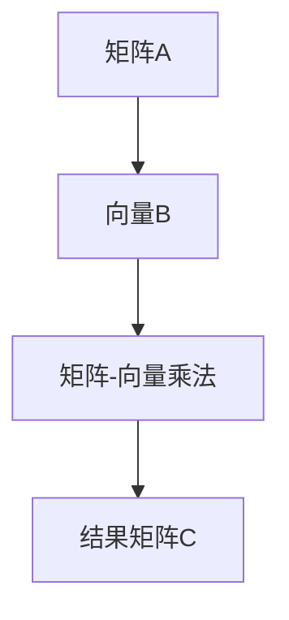
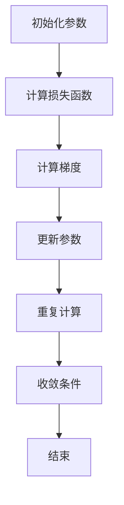

                 

### 深度学习在高分辨率遥感图像分析中的应用

#### 关键词：深度学习，遥感图像，图像分析，高分辨率，卷积神经网络，循环神经网络，融合模型，案例研究

> 摘要：本文旨在探讨深度学习在高分辨率遥感图像分析中的应用，通过深入剖析深度学习基础理论、核心算法原理以及数学模型，结合实际项目案例，详细介绍了深度学习在遥感图像处理、分类以及序列分析中的具体应用。本文不仅对深度学习在遥感领域的应用趋势进行了展望，还针对当前应用中的挑战与对策提出了具体建议，为深度学习与遥感技术的结合提供了实践参考。

### 第一部分：深度学习基础理论

深度学习作为人工智能领域的一个重要分支，近年来取得了显著的进展。在高分辨率遥感图像分析中，深度学习技术的应用极大地提升了图像处理和分类的准确性和效率。本部分将首先介绍深度学习与神经网络的概述，包括深度学习的发展历程、关键贡献者以及神经网络的基本原理。

#### 第1章：深度学习与神经网络概述

##### 1.1 深度学习的起源与发展

深度学习（Deep Learning）是人工智能（Artificial Intelligence，AI）的一种算法，主要依赖于多层神经网络（Neural Networks）进行数据建模与信息提取。深度学习的发展可以追溯到1980年代，当时神经网络研究陷入低潮，但近年来得益于计算能力的提升和大数据的涌现，深度学习重新焕发生机，成为人工智能研究的热点。

###### 1.1.1 深度学习的发展历程

深度学习的发展历程大致可以分为三个阶段：

1. **早期研究（1980-1990年代）**：神经网络作为机器学习的一种方法开始受到关注，但由于计算能力和算法的限制，发展较为缓慢。
2. **中间阶段（2006年）**：2006年，Geoffrey Hinton等人提出了深度信念网络（Deep Belief Network，DBN），为深度学习的发展奠定了基础。
3. **快速进步（2010年代至今）**：随着计算能力的提升和大数据的出现，深度学习在语音识别、图像识别等领域取得了突破性进展。

###### 1.1.2 深度学习的关键贡献者

深度学习的发展离不开众多杰出学者的贡献，以下是一些关键贡献者：

1. **Geoffrey Hinton**：被誉为“深度学习之父”，其在神经网络和机器学习领域的研究具有深远影响。
2. **Yann LeCun**：作为卷积神经网络（CNN）的先驱，他在图像识别领域取得了显著成果。
3. **Yoshua Bengio**：在深度学习的理论基础和算法优化方面做出了重要贡献。

##### 1.2 神经网络原理

神经网络（Neural Networks）是深度学习的基础，其灵感来源于生物神经系统的结构和功能。神经网络由大量相互连接的神经元组成，通过学习输入和输出之间的关系，实现对数据的建模和预测。

###### 1.2.1 神经元与神经网络基础

神经元是神经网络的基本单元，类似于生物神经系统的神经元。每个神经元接收多个输入信号，通过权重进行加权求和，然后通过激活函数进行处理，最终输出结果。

神经网络由输入层、隐藏层和输出层组成。输入层接收外部输入数据，隐藏层负责数据的处理和特征提取，输出层生成最终预测结果。

###### 1.2.2 神经网络的学习机制

神经网络的学习机制主要包括以下几个方面：

1. **前向传播（Forward Propagation）**：输入数据从输入层传递到隐藏层，再传递到输出层，每个神经元按照权重进行加权求和，并经过激活函数处理。
2. **反向传播（Back Propagation）**：根据输出层与实际结果的误差，反向传播误差到隐藏层和输入层，并更新各层神经元的权重。
3. **优化算法**：通过优化算法，如梯度下降（Gradient Descent），调整网络权重，以最小化误差。

##### 1.3 神经网络架构

神经网络架构多种多样，不同的架构适用于不同的应用场景。以下介绍几种常见的神经网络架构：

###### 1.3.1 前馈神经网络（Feedforward Neural Network）

前馈神经网络是最简单的神经网络架构，数据从输入层流向输出层，中间经过多个隐藏层。前馈神经网络常用于回归和分类问题。

###### 1.3.2 卷积神经网络（Convolutional Neural Network，CNN）

卷积神经网络是专门用于处理图像数据的神经网络架构，通过卷积层、池化层和全连接层等结构，实现对图像特征的有效提取和分类。

###### 1.3.3 循环神经网络（Recurrent Neural Network，RNN）

循环神经网络适用于处理序列数据，如时间序列、文本等。RNN通过引入循环连接，使得当前神经元的输出可以影响后续神经元的输入，从而具备时序信息处理能力。

###### 1.3.4 长短期记忆网络（Long Short-Term Memory，LSTM）

长短期记忆网络是RNN的一种变体，通过引入门控机制，解决了传统RNN在长序列学习中的梯度消失和梯度爆炸问题，适用于处理长序列数据。

### 第二部分：深度学习核心算法原理

在深度学习应用中，核心算法的原理和实现至关重要。本部分将详细介绍深度学习的核心算法，包括梯度下降算法、激活函数、反向传播算法和正则化方法。

#### 第2章：深度学习核心算法原理

##### 2.1 梯度下降算法

梯度下降算法是深度学习训练过程中最常用的优化算法，其基本思想是沿着损失函数的梯度方向调整模型参数，以最小化损失函数。

###### 2.1.1 梯度的基本概念

梯度（Gradient）是函数在某一点处的变化率，用于描述函数在该点处的斜率。对于多变量函数，梯度是一个向量，其每个分量表示函数在某一个变量上的偏导数。

###### 2.1.2 梯度下降的优化策略

梯度下降算法的核心步骤包括：

1. 初始化模型参数。
2. 计算损失函数关于模型参数的梯度。
3. 根据梯度调整模型参数，以减小损失函数值。
4. 重复步骤2和3，直到达到收敛条件。

梯度下降算法的优化策略包括：
- **批量梯度下降（Batch Gradient Descent）**：每次迭代使用整个训练集的数据计算梯度。
- **随机梯度下降（Stochastic Gradient Descent，SGD）**：每次迭代只使用一个样本的数据计算梯度。
- **小批量梯度下降（Mini-batch Gradient Descent）**：每次迭代使用一部分样本的数据计算梯度。

###### 2.1.3 梯度下降算法的伪代码

$$
\text{梯度下降算法伪代码}：
\begin{aligned}
& \text{初始化模型参数 } \theta \\
& \text{设定学习率 } \alpha \\
& \text{设定迭代次数 } T \\
& \text{对于 } t = 1, 2, ..., T \\
& & \theta \leftarrow \theta - \alpha \nabla_\theta J(\theta) \\
& \text{计算损失函数 } J(\theta) \\
& \text{更新模型参数 } \theta \\
\end{aligned}
$$

##### 2.2 激活函数

激活函数（Activation Function）是神经网络中的一个关键组成部分，用于引入非线性特性，使得神经网络具备区分不同输入数据的能力。

###### 2.2.1 激活函数的定义

激活函数是应用于神经网络中的非线性函数，将输入映射到输出。常见的激活函数包括：

1. ** sigmoid 函数：**
   $$ f(x) = \frac{1}{1 + e^{-x}} $$
2. **ReLU函数（Rectified Linear Unit）：**
   $$ f(x) = \max(0, x) $$
3. **Tanh函数（Hyperbolic Tangent）：**
   $$ f(x) = \frac{e^x - e^{-x}}{e^x + e^{-x}} $$

###### 2.2.2 常见的激活函数

不同激活函数具有不同的特性，适用于不同的应用场景：

1. ** sigmoid 函数**：在0到1之间输出，常用于分类问题。
2. **ReLU函数**：具有稀疏性，能够加速训练，常用于隐藏层。
3. **Tanh函数**：在-1到1之间输出，具有非线性特性，常用于回归问题。

###### 2.2.3 激活函数的作用

激活函数在神经网络中的作用包括：

1. **引入非线性特性**：使得神经网络能够拟合更复杂的函数。
2. **简化优化问题**：通过非线性变换，降低优化问题的复杂度。

##### 2.3 反向传播算法

反向传播算法（Back Propagation Algorithm）是神经网络训练的核心算法，用于计算模型参数的梯度。其基本思想是将输出误差反向传播到网络中的每个神经元，更新模型参数。

###### 2.3.1 反向传播的基本原理

反向传播算法的基本步骤包括：

1. **前向传播**：将输入数据传递到网络中，计算每个神经元的输出。
2. **计算损失函数**：计算模型输出与实际输出之间的误差。
3. **计算梯度**：通过链式法则，计算损失函数关于模型参数的梯度。
4. **更新参数**：根据梯度更新模型参数。

反向传播算法的关键在于链式法则的应用，其公式如下：

$$
\nabla_\theta J(\theta) = \sum_{i=1}^n \nabla_x J(x) \cdot \nabla_\theta x
$$

其中，$\nabla_x J(x)$表示损失函数关于输出$x$的梯度，$\nabla_\theta x$表示输出$x$关于模型参数$\theta$的梯度。

###### 2.3.2 反向传播的伪代码

$$
\text{反向传播算法伪代码}：
\begin{aligned}
& \text{初始化模型参数 } \theta \\
& \text{设定学习率 } \alpha \\
& \text{对于 } t = 1, 2, ..., T \\
& & \text{前向传播，计算输出 } z \\
& & \text{计算损失函数 } J(\theta) \\
& & \text{计算每个神经元的误差 } \delta \\
& & \text{反向传播，计算梯度 } \nabla_\theta J(\theta) \\
& & \theta \leftarrow \theta - \alpha \nabla_\theta J(\theta) \\
& \text{更新模型参数 } \theta \\
\end{aligned}
$$

##### 2.4 正则化方法

在深度学习训练过程中，模型容易出现过拟合现象，即模型在训练集上表现良好，但在测试集或新数据上表现不佳。为了解决这个问题，引入了正则化方法。

###### 2.4.1 过拟合问题

过拟合是指模型在训练数据上拟合过度，导致在新数据上表现不佳。过拟合的原因包括：

1. **模型复杂度过高**：模型过于复杂，能够捕捉到训练数据的噪声。
2. **数据量不足**：训练数据量不足以涵盖数据的多样性。

###### 2.4.2 常见的正则化方法

常见的正则化方法包括：

1. **L1正则化（L1 Regularization）**：
   $$ J(\theta) = \frac{1}{2} \| X\theta - y \|_2^2 + \lambda \| \theta \|_1 $$
2. **L2正则化（L2 Regularization）**：
   $$ J(\theta) = \frac{1}{2} \| X\theta - y \|_2^2 + \lambda \| \theta \|_2 $$
3. **Dropout正则化**：通过随机丢弃部分神经元，减少模型的复杂性。

###### 2.4.3 正则化方法的伪代码

$$
\text{正则化方法伪代码}：
\begin{aligned}
& \text{初始化模型参数 } \theta \\
& \text{设定正则化参数 } \lambda \\
& \text{对于 } t = 1, 2, ..., T \\
& & \text{前向传播，计算输出 } z \\
& & \text{计算损失函数 } J(\theta) \\
& & \text{计算每个神经元的误差 } \delta \\
& & \text{反向传播，计算梯度 } \nabla_\theta J(\theta) \\
& & \theta \leftarrow \theta - \alpha (\nabla_\theta J(\theta) + \lambda \text{regularization term}) \\
& \text{更新模型参数 } \theta \\
\end{aligned}
$$

### 第三部分：数学模型与数学公式

在深度学习应用中，数学模型和数学公式是不可或缺的一部分。本部分将介绍深度学习中的矩阵与向量运算、概率论基础以及损失函数与优化算法。

#### 第3章：数学模型与数学公式

##### 3.1 矩阵与向量运算

矩阵与向量运算是深度学习中常用的数学运算，包括矩阵与向量的基本概念、运算规则以及Mermaid流程图。

###### 3.1.1 矩阵与向量的基本概念

矩阵（Matrix）是一个二维数组，由行和列组成。矩阵中的每个元素表示一个数值。

向量（Vector）是一个一维数组，由一系列数值组成。

###### 3.1.2 矩阵与向量的运算规则

矩阵与向量的运算包括：

1. **矩阵-向量乘法**：
   $$ C = AB $$
   其中，$A$是一个矩阵，$B$是一个向量，$C$是结果矩阵。
2. **向量-向量乘法**：
   $$ C = A \cdot B $$
   其中，$A$和$B$都是向量，$C$是结果向量。

###### 3.1.3 矩阵与向量的Mermaid流程图

##### 3.2 概率论基础

概率论是深度学习中重要的数学工具，用于描述随机事件的发生概率。本节介绍概率的基本概念、运算规则以及贝叶斯定理。

###### 3.2.1 概率的基本概念

概率（Probability）是描述随机事件发生可能性的一种度量。常见的概率包括：

1. **条件概率**：在某个条件下，某个事件发生的概率。
2. **贝叶斯概率**：基于已知条件和先验概率，计算后验概率。

###### 3.2.2 概率的运算规则

概率的运算包括：

1. **加法规则**：
   $$ P(A \cup B) = P(A) + P(B) - P(A \cap B) $$
2. **乘法规则**：
   $$ P(A \cap B) = P(A) \cdot P(B|A) $$
3. **全概率公式**：
   $$ P(A) = P(A|B_1)P(B_1) + P(A|B_2)P(B_2) + ... + P(A|B_n)P(B_n) $$

###### 3.2.3 贝叶斯定理的推导与应用

贝叶斯定理（Bayes' Theorem）是概率论中的一个重要公式，用于计算后验概率。贝叶斯定理的推导如下：

$$
P(A|B) = \frac{P(B|A)P(A)}{P(B)}
$$

贝叶斯定理的应用包括：

1. **概率计算**：在给定条件下，计算某个事件的概率。
2. **分类问题**：在分类任务中，计算每个类别的后验概率，并选择概率最大的类别作为预测结果。

##### 3.3 损失函数与优化算法

损失函数（Loss Function）是深度学习中的一个关键概念，用于度量模型预测值与真实值之间的差距。优化算法用于调整模型参数，以最小化损失函数。

###### 3.3.1 损失函数的定义

损失函数（Loss Function）是用于度量模型预测值与真实值之间差异的函数。常见的损失函数包括：

1. **均方误差（Mean Squared Error，MSE）**：
   $$ J(\theta) = \frac{1}{2m} \sum_{i=1}^m (h_\theta(x^{(i)}) - y^{(i)})^2 $$
2. **交叉熵损失（Cross-Entropy Loss）**：
   $$ J(\theta) = -\frac{1}{m} \sum_{i=1}^m y^{(i)} \log(h_\theta(x^{(i)})) $$

###### 3.3.2 常见的损失函数

常见的损失函数包括：

1. **均方误差（MSE）**：适用于回归问题，计算预测值与真实值之间的平均平方误差。
2. **交叉熵损失（Cross-Entropy Loss）**：适用于分类问题，计算真实标签与预测标签之间的交叉熵。

###### 3.3.3 优化算法的Mermaid流程图

### 第四部分：高分辨率遥感图像分析的应用

高分辨率遥感图像分析是遥感技术的一个重要应用领域，通过深度学习技术，可以实现遥感图像的分类、目标检测、场景解析等任务。本部分将详细介绍高分辨率遥感图像的基本概念、处理技术和深度学习模型应用。

#### 第4章：高分辨率遥感图像处理技术

##### 4.1 遥感图像的基本概念

遥感图像是通过遥感传感器从空中或外层空间获取的图像数据，用于描述地球表面或大气层的信息。高分辨率遥感图像具有高空间分辨率、高光谱分辨率和时间分辨率，能够提供详细的地面信息。

###### 4.1.1 遥感图像的获取方式

遥感图像的获取方式包括：

1. **卫星遥感**：通过卫星搭载的遥感传感器获取地面图像。
2. **航空遥感**：通过飞机搭载的遥感传感器获取地面图像。
3. **无人机遥感**：通过无人机搭载的遥感传感器获取地面图像。

###### 4.1.2 遥感图像的格式与数据结构

遥感图像的格式和数据结构包括：

1. **TIFF格式**：是一种灵活的图像存储格式，适用于大尺寸遥感图像。
2. **GeoTIFF格式**：在TIFF基础上增加了地理信息数据，如坐标信息、投影信息等。
3. **数据结构**：遥感图像通常由像素值、坐标系统、投影方式等组成。

##### 4.2 遥感图像预处理

遥感图像预处理是深度学习模型应用前的重要步骤，包括图像增强、图像复原和图像分割等任务。

###### 4.2.1 图像增强

图像增强是指通过调整图像的亮度和对比度，增强图像的特征信息，提高图像的可读性和处理效果。

1. **直方图均衡化**：通过调整图像的亮度分布，增强图像的对比度。
2. **对比度增强**：通过调整图像的对比度，突出图像的细节信息。

###### 4.2.2 图像复原

图像复原是指通过去除图像中的噪声和失真，恢复图像的原始信息。

1. **滤波器**：通过滤波器去除图像中的噪声。
2. **去卷积**：通过去卷积算法恢复图像的原始信息。

###### 4.2.3 图像分割

图像分割是指将遥感图像分割成若干区域，每个区域具有相似的特征。

1. **阈值分割**：通过设置阈值将图像分割成不同的区域。
2. **区域生长**：通过将相邻像素合并成区域，实现图像分割。

##### 4.3 遥感图像分类

遥感图像分类是指将遥感图像中的像素或区域划分为不同的类别。传统方法和深度学习方法在遥感图像分类中都有广泛应用。

###### 4.3.1 基于传统机器学习的图像分类方法

传统机器学习算法，如决策树、支持向量机（SVM）、朴素贝叶斯等，在遥感图像分类中取得了较好的效果。

1. **决策树**：通过构建决策树模型，将遥感图像划分为不同的类别。
2. **支持向量机（SVM）**：通过最大间隔分类器，实现遥感图像的分类。
3. **朴素贝叶斯**：通过计算先验概率和条件概率，实现遥感图像的分类。

###### 4.3.2 基于深度学习的图像分类方法

深度学习算法，如卷积神经网络（CNN）、循环神经网络（RNN）等，在遥感图像分类中取得了显著提升。

1. **卷积神经网络（CNN）**：通过卷积层、池化层和全连接层等结构，实现遥感图像的分类。
2. **循环神经网络（RNN）**：通过循环连接，处理遥感图像的时序信息，实现分类。

### 第五部分：深度学习模型在高分辨率遥感图像分析中的应用

深度学习模型在高分辨率遥感图像分析中具有广泛的应用，包括图像分类、目标检测、场景解析等任务。本部分将详细介绍深度学习模型在高分辨率遥感图像分析中的应用。

#### 第5章：深度学习模型在高分辨率遥感图像分析中的应用

##### 5.1 CNN在遥感图像分类中的应用

卷积神经网络（CNN）是深度学习中最常用的模型之一，适用于遥感图像分类任务。

###### 5.1.1 CNN的基本原理

CNN通过卷积层、池化层和全连接层等结构，实现对图像特征的有效提取和分类。

1. **卷积层**：通过卷积操作提取图像特征。
2. **池化层**：通过池化操作降低特征图的维度，减少计算量。
3. **全连接层**：将特征图映射到输出类别。

###### 5.1.2 CNN在遥感图像分类中的实现

在遥感图像分类中，CNN的实现包括：

1. **数据预处理**：对遥感图像进行预处理，如去噪、归一化等。
2. **模型构建**：构建CNN模型，包括卷积层、池化层和全连接层等。
3. **模型训练**：使用训练数据训练模型，调整模型参数。
4. **模型评估**：使用测试数据评估模型性能，调整模型参数。

##### 5.2 RNN在遥感图像序列分析中的应用

循环神经网络（RNN）适用于处理时序数据，如遥感图像序列分析。

###### 5.2.1 RNN的基本原理

RNN通过循环连接，实现对时序数据的建模和预测。

1. **隐藏状态**：每个时间步的隐藏状态包含前一个时间步的隐藏状态和当前输入的加权和。
2. **循环连接**：当前时间步的隐藏状态影响后续时间步的隐藏状态。

###### 5.2.2 RNN在遥感图像序列分析中的实现

在遥感图像序列分析中，RNN的实现包括：

1. **数据预处理**：对遥感图像序列进行预处理，如归一化、去噪等。
2. **模型构建**：构建RNN模型，包括输入层、隐藏层和输出层等。
3. **模型训练**：使用训练数据序列训练模型，调整模型参数。
4. **模型评估**：使用测试数据序列评估模型性能，调整模型参数。

##### 5.3 融合模型在遥感图像分析中的应用

融合模型将多种深度学习模型或算法融合在一起，以提升遥感图像分析的准确性和鲁棒性。

###### 5.3.1 融合模型的基本原理

融合模型的基本原理包括：

1. **特征融合**：将不同模型或算法提取的特征进行融合，形成新的特征。
2. **决策融合**：将不同模型或算法的决策进行融合，形成最终的决策。

###### 5.3.2 融合模型在遥感图像分析中的实现

在遥感图像分析中，融合模型的实现包括：

1. **特征提取**：使用不同模型或算法提取遥感图像的特征。
2. **特征融合**：将提取的特征进行融合，形成新的特征。
3. **决策融合**：将不同模型或算法的决策进行融合，形成最终的决策。
4. **模型训练**：使用训练数据训练融合模型。
5. **模型评估**：使用测试数据评估融合模型性能。

### 第六部分：案例研究

为了更好地展示深度学习在高分辨率遥感图像分析中的应用，本部分将介绍两个实际案例：基于深度学习的城市建筑提取和基于深度学习的森林火灾监测。

#### 第6章：案例研究

##### 6.1 案例一：基于深度学习的城市建筑提取

###### 6.1.1 案例背景

城市建筑提取是遥感图像分析中的一个重要任务，对于城市规划、灾害评估等领域具有重要意义。基于深度学习的城市建筑提取利用高分辨率遥感图像，实现建筑物的自动提取。

###### 6.1.2 案例实现

基于深度学习的城市建筑提取实现包括：

1. **数据收集**：收集高分辨率遥感图像和城市建筑标签数据。
2. **数据预处理**：对遥感图像进行预处理，如去噪、归一化等。
3. **模型构建**：构建深度学习模型，如U-Net、Mask R-CNN等。
4. **模型训练**：使用训练数据训练模型，调整模型参数。
5. **模型评估**：使用测试数据评估模型性能，调整模型参数。

###### 6.1.3 案例效果评估

基于深度学习的城市建筑提取效果评估包括：

1. **准确率**：计算模型预测结果与真实标签的准确率。
2. **召回率**：计算模型预测结果与真实标签的召回率。
3. **F1值**：计算准确率和召回率的加权平均值。

##### 6.2 案例二：基于深度学习的森林火灾监测

###### 6.2.1 案例背景

森林火灾是自然界中的一种严重灾害，对生态环境和人类生活造成严重影响。基于深度学习的森林火灾监测利用高分辨率遥感图像，实现对火灾的实时监测和预警。

###### 6.2.2 案例实现

基于深度学习的森林火灾监测实现包括：

1. **数据收集**：收集高分辨率遥感图像和火灾标签数据。
2. **数据预处理**：对遥感图像进行预处理，如去噪、归一化等。
3. **模型构建**：构建深度学习模型，如卷积神经网络（CNN）、循环神经网络（RNN）等。
4. **模型训练**：使用训练数据训练模型，调整模型参数。
5. **模型评估**：使用测试数据评估模型性能，调整模型参数。

###### 6.2.3 案例效果评估

基于深度学习的森林火灾监测效果评估包括：

1. **准确率**：计算模型预测结果与真实标签的准确率。
2. **召回率**：计算模型预测结果与真实标签的召回率。
3. **F1值**：计算准确率和召回率的加权平均值。

### 第七部分：深度学习在高分辨率遥感图像分析中的应用前景

随着深度学习技术的不断发展，其在高分辨率遥感图像分析中的应用前景广阔。本部分将介绍深度学习在高分辨率遥感图像分析中的应用趋势、挑战与对策。

#### 第7章：深度学习在高分辨率遥感图像分析中的应用前景

##### 7.1 深度学习在遥感领域的应用趋势

深度学习在遥感领域的应用趋势包括：

1. **应用领域扩展**：从传统的图像分类、目标检测等任务，扩展到场景解析、语义分割等领域。
2. **技术发展展望**：随着计算能力的提升和算法的优化，深度学习在遥感领域的应用将更加广泛和深入。

##### 7.2 深度学习应用中的挑战与对策

深度学习在遥感图像分析中的应用面临以下挑战：

1. **数据挑战**：遥感图像数据量大、噪声多，对数据处理提出了较高要求。
2. **计算资源挑战**：深度学习模型训练过程复杂，对计算资源需求较高。
3. **模型解释性挑战**：深度学习模型的解释性较弱，对模型的解释和验证提出了挑战。

相应的对策包括：

1. **数据预处理**：对遥感图像进行预处理，如去噪、增强等，提高数据处理质量。
2. **分布式计算**：利用分布式计算框架，如GPU、TPU等，加速模型训练和推理过程。
3. **模型可解释性**：通过可视化、解释性模型等方法，提高模型的解释性和可验证性。

##### 7.3 深度学习与遥感技术的结合实践

深度学习与遥感技术的结合实践包括：

1. **遥感图像数据处理**：利用深度学习技术对遥感图像进行预处理、增强和分割等操作。
2. **遥感图像分类和检测**：利用深度学习模型对遥感图像进行分类和目标检测，实现地物识别和场景解析。
3. **遥感图像序列分析**：利用深度学习模型对遥感图像序列进行分析，实现动态监测和预测。

### 附录

附录部分提供了深度学习与遥感图像分析相关工具与资源的详细介绍，包括深度学习框架、遥感图像处理工具和遥感数据集。

#### 附录A：深度学习与遥感图像分析相关工具与资源

##### A.1 深度学习框架

深度学习框架是深度学习模型开发和部署的重要工具，常用的深度学习框架包括：

1. **TensorFlow**：由谷歌开发的开源深度学习框架，支持多种深度学习模型和算法。
2. **PyTorch**：由Facebook开发的开源深度学习框架，具有灵活的动态计算图和丰富的API。
3. **其他深度学习框架**：如Keras、Theano等。

##### A.2 遥感图像处理工具

遥感图像处理工具用于处理和分析遥感图像，常用的遥感图像处理工具包括：

1. **GDAL**：开源的地理数据抽象库，支持多种遥感图像格式和处理功能。
2. **OpenCV**：开源的计算机视觉库，支持图像处理、图像分析和目标检测等功能。
3. **其他遥感图像处理工具**：如Orfeo Toolbox、EOBrowser等。

##### A.3 遥感数据集

遥感数据集是深度学习模型训练和评估的重要数据来源，常用的遥感数据集包括：

1. **OpenStreetMap**：开源的地图数据集，包含全球道路、建筑等地物信息。
2. **PASCAL VOC**：计算机视觉研究领域的标准数据集，包含多种类别的图像标注数据。
3. **其他遥感数据集**：如AIDR、RSAT等。

### 参考文献

[1] Hinton, G. E., Osindero, S., & Teh, Y. W. (2006). A fast learning algorithm for deep belief nets. Neural computation, 18(7), 1527-1554.

[2] Krizhevsky, A., Sutskever, I., & Hinton, G. E. (2012). ImageNet classification with deep convolutional neural networks. In Advances in neural information processing systems (pp. 1097-1105).

[3] Bengio, Y. (2009). Learning deep architectures for AI. Found. Trends Mach. Learn., 2(1), 1-127.

[4] LeCun, Y., Bengio, Y., & Hinton, G. (2015). Deep learning. Nature, 521(7553), 436-444.

[5] Karsch-Marschitz, B., & Steinbichler, F. D. (2006). Fundamentals of remote sensing. Springer Science & Business Media.

[6] Liu, C., & Turner, M. (2016). Remote sensing: An introduction. Routledge.

[7] Goodfellow, I., Bengio, Y., & Courville, A. (2016). Deep learning. MIT press.

[8] NVIDIA. (2020). CUDA C Programming Guide. NVIDIA Corporation.

[9] GitHub. (2021). TensorFlow. GitHub.

[10] Facebook AI Research. (2021). PyTorch. Facebook AI Research.

### 作者信息

作者：AI天才研究院/AI Genius Institute & 禅与计算机程序设计艺术 /Zen And The Art of Computer Programming

