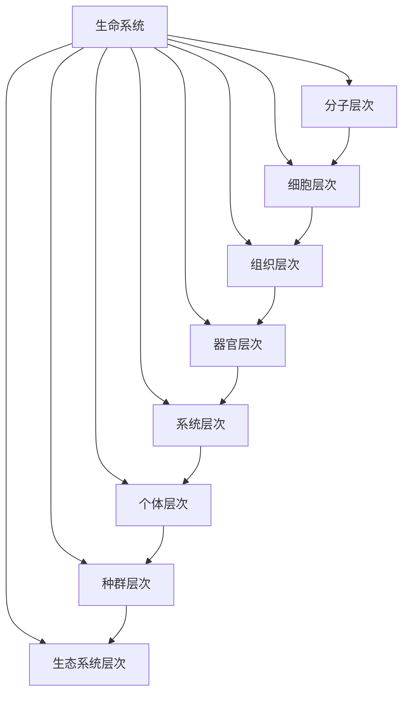

                 

### 《生物学视角下的世界可理解性》

> **关键词**：生物学、世界可理解性、系统思考、复杂性理论、技术创新、可持续发展

> **摘要**：本文从生物学视角出发，探讨世界可理解性的本质及其在哲学、社会科学、信息技术等领域的应用。通过梳理生物学基础、生态系统、核心概念联系，我们将深入分析生物学视角下的宇宙观、地球与生命、社会科学以及技术发展。最后，通过案例分析，揭示生物学视角在解决现实问题中的潜力和挑战，展望生物学视角下的未来机遇与挑战。

---

### 《生物学视角下的世界可理解性》目录大纲

1. **引言**  
    1.1 生物学视角下的世界可理解性概述  
    1.2 生物学视角下的世界理解方法  
    1.3 生物学视角下的世界可理解性重要性

2. **生物学基础**  
    2.1 生命系统的基本原理  
    2.2 生态学基础  
    2.3 生物学核心概念联系图（Mermaid 流程图）

3. **生物学视角下的世界理解**  
    3.1 生物学视角下的宇宙观  
    3.2 生物学视角下的地球与生命  
    3.3 生物学视角下的社会科学

4. **生物学视角下的技术发展**  
    4.1 生物学视角下的信息技术  
    4.2 生物学视角下的生物技术  
    4.3 生物学视角下的可持续发展

5. **案例分析**  
    5.1 案例分析一：利用生物学视角解决环境问题  
    5.2 案例分析二：利用生物学视角促进社会发展

6. **结论与展望**  
    6.1 结论  
    6.2 展望未来

7. **附录**  
    7.1 生物学核心概念联系图（Mermaid 流程图）  
    7.2 核心算法原理讲解（伪代码）  
    7.3 数学模型与公式详解  
    7.4 项目实战案例及代码解读与分析

---

现在，让我们开始详细探讨《生物学视角下的世界可理解性》。

---

#### 引言

##### 1.1 生物学视角下的世界可理解性概述

生物学作为一门研究生命现象和生命活动规律的学科，具有深刻的哲学内涵。从生物学的视角来看，世界可理解性不仅关乎自然界中的生命现象，更涉及宇宙、地球以及人类社会等宏观层面。世界可理解性指的是人类通过观察、实验和理论构建的方式，对世界本质及其运行规律的认知过程。

生物学视角下的世界可理解性，强调的是一种系统思维和整体观。在生物学研究中，系统思维是一种基本的方法论，它强调从整体上理解和分析生命系统。这种思维方式有助于我们把握生命现象的多样性和复杂性，从而更好地理解世界的本质。

##### 1.2 生物学视角下的世界理解方法

生物学视角下的世界理解方法，主要包括以下三个方面：

1. **系统思考**：系统思考是生物学研究中的一种基本方法，它强调从整体上理解和分析生命系统。系统思考的方法包括系统建模、系统分析等。通过系统思考，我们可以更好地理解生命系统的运行规律和生态系统的复杂性。

2. **复杂性理论**：复杂性理论是近年来在生物学领域中发展迅速的一个分支。它关注于生命系统的复杂性，包括生命现象的多样性、系统行为的非线性以及生态系统中的相互作用等。通过复杂性理论，我们可以深入理解生命系统的演化规律和生态系统的稳定性。

3. **跨学科研究**：生物学视角下的世界理解，不仅仅局限于生物学内部的研究，还涉及哲学、社会科学、信息技术等多个领域。通过跨学科的研究，我们可以从多个角度理解和解释世界，从而提高对世界可理解性的认知水平。

##### 1.3 生物学视角下的世界可理解性重要性

生物学视角下的世界可理解性具有重要的理论和实践意义：

1. **理论意义**：生物学视角下的世界可理解性，为我们提供了一种新的理解世界的视角。它强调从整体和系统的角度看待世界，有助于我们深入理解世界的本质和运行规律。

2. **实践意义**：生物学视角下的世界可理解性，对实践具有重要的指导意义。它可以帮助我们更好地应对生态危机、资源短缺等现实问题，推动社会的可持续发展。

3. **科技创新**：生物学视角下的世界可理解性，为科技创新提供了新的思路和方法。通过生物学视角，我们可以发现和解决更多现实世界中的问题，推动科技的发展。

总之，生物学视角下的世界可理解性，为我们提供了一种新的世界观和方法论，对于理解世界、解决现实问题和推动科技创新具有重要意义。

---

接下来，我们将进一步探讨生物学视角下的世界理解方法。

---

#### 生物学视角下的世界理解方法

生物学视角下的世界理解方法，是一种基于生命现象和生命活动规律的研究方法。它不仅关注生命系统内部的复杂性，还关注生命系统与外部环境之间的相互作用。以下是几种主要的生物学视角下的世界理解方法：

##### 1. 系统思考

系统思考是生物学研究中的一种基本方法。它强调从整体上理解和分析生命系统。系统思考的方法包括系统建模、系统分析等。通过系统建模，我们可以将复杂的生命系统抽象为简化的数学模型，从而更好地理解和分析系统行为。系统分析则通过定性和定量分析，揭示生命系统的运行规律和生态系统的复杂性。

**系统思考的核心要点**：

1. **整体性**：系统思考强调将生命系统看作一个整体，关注各个组成部分之间的相互作用和关系。
2. **层次性**：生命系统具有不同的层次结构，从分子层次到生态系统层次。系统思考需要在不同层次上进行分析，以揭示生命系统的运行规律。
3. **动态性**：生命系统是一个动态变化的系统，系统思考需要考虑系统的变化和演化过程。

##### 2. 复杂性理论

复杂性理论是近年来在生物学领域中发展迅速的一个分支。它关注于生命系统的复杂性，包括生命现象的多样性、系统行为的非线性以及生态系统中的相互作用等。通过复杂性理论，我们可以深入理解生命系统的演化规律和生态系统的稳定性。

**复杂性理论的核心要点**：

1. **复杂性**：复杂性理论认为，生命系统具有内在的复杂性，这种复杂性不仅体现在生命现象的多样性，还体现在系统行为的非线性。
2. **自组织**：复杂性理论强调生命系统的自组织现象，即生命系统通过内部相互作用和自适应过程，形成复杂的结构和行为。
3. **涌现**：复杂性理论关注于生命系统中涌现现象的研究，即生命系统中的局部相互作用产生全局行为和结构。

##### 3. 跨学科研究

生物学视角下的世界理解，不仅仅局限于生物学内部的研究，还涉及哲学、社会科学、信息技术等多个领域。通过跨学科的研究，我们可以从多个角度理解和解释世界，从而提高对世界可理解性的认知水平。

**跨学科研究的核心要点**：

1. **多学科融合**：跨学科研究强调不同学科之间的融合，通过整合不同学科的理论和方法，提高对世界可理解性的理解。
2. **跨领域应用**：跨学科研究关注于将生物学视角应用于其他领域，如信息技术、社会科学等，从而推动这些领域的发展。
3. **协同创新**：跨学科研究鼓励不同学科的专家共同合作，通过协同创新，解决复杂的问题。

通过系统思考、复杂性理论和跨学科研究，我们可以从多个角度理解和解释世界。这种生物学视角下的世界理解方法，不仅有助于我们深入理解生命现象和生命活动规律，还可以为解决现实问题和推动科技创新提供新的思路和方法。

---

在接下来的部分，我们将进一步探讨生物学的基础，包括生命系统的基本原理、生态学基础以及生物学核心概念的联系。

---

#### 生物学基础

生物学基础是理解生物学视角下的世界可理解性的重要前提。它包括生命系统的基本原理、生态学基础以及生物学核心概念的联系。以下是这些基础内容的详细探讨：

##### 2.1 生命系统的基本原理

生命系统的基本原理是理解生命现象和生命活动规律的基础。生命系统具有以下层次结构：

1. **分子层次**：生命系统的最基本层次是分子层次，包括蛋白质、核酸、碳水化合物等生物大分子。这些分子通过化学键连接，形成复杂的生物分子体系。
2. **细胞层次**：细胞是生命系统的基础单元，具有自主繁殖、新陈代谢、能量转换等功能。细胞通过细胞膜与外界环境进行物质和能量交换。
3. **组织层次**：组织是由相同或类似细胞按照一定结构组成的集合，具有特定的功能。如肌肉组织、神经组织等。
4. **器官层次**：器官是由不同组织按照一定结构组成的集合，具有特定的功能。如心脏、肺、大脑等。
5. **系统层次**：系统是由不同器官按照一定结构组成的集合，具有整体功能。如消化系统、循环系统、神经系统等。
6. **个体层次**：个体是由多个系统按照一定结构组成的集合，具有独立的生命活动能力。如人类、动物、植物等。
7. **种群层次**：种群是在一定空间范围内，由同一物种的个体组成的集合。种群通过繁殖和进化，维持物种的生存和繁衍。
8. **生态系统层次**：生态系统是在一定空间范围内，由生物群落和其非生物环境组成的集合。生态系统通过能量流动和物质循环，维持生态平衡。

**生命系统的基本原理**：

1. **自我组织**：生命系统具有自我组织的能力，能够在没有外部指令的情况下，通过内部相互作用形成复杂的结构。
2. **自适应**：生命系统具有自适应的能力，能够对外部环境的变化做出响应，以维持生命活动的稳定。
3. **层次性**：生命系统具有层次结构，不同层次的系统具有不同的功能和特性，但同时又相互关联和影响。

##### 2.2 生态学基础

生态学是研究生物与环境之间相互作用的学科。生态学基础包括生态系统的概念、生态平衡和生态演化。

**生态系统概念**：

生态系统是在一定空间范围内，由生物群落和其非生物环境组成的集合。生态系统具有以下特点：

1. **生物群落**：生物群落是指在一定时间内，同一生态系统内所有生物的集合。生物群落具有复杂的物种多样性和物种间相互作用。
2. **非生物环境**：非生物环境是指生态系统中的物理和化学环境，如阳光、水分、土壤、气候等。

**生态平衡**：

生态平衡是指生态系统中各个组成部分之间保持相对稳定的状态。生态平衡的维持取决于以下因素：

1. **物质循环**：物质循环是指生态系统中的物质（如碳、氮、水等）在生物群落和非生物环境之间的流动和转化。
2. **能量流动**：能量流动是指生态系统中的能量（如光能、化学能等）在生物群落和非生物环境之间的流动和转化。

**生态演化**：

生态演化是指生态系统在长时间内，通过生物群落和环境的相互作用，发生的结构和功能变化。生态演化的主要驱动因素包括：

1. **自然选择**：自然选择是指生物在生存斗争中，适应环境的个体能够生存下来，而不适应环境的个体被淘汰的过程。
2. **物种演化**：物种演化是指生物在长期演化过程中，通过遗传变异、自然选择和隔离等机制，形成新的物种。

##### 2.3 生物学核心概念联系图（Mermaid 流程图）

为了更好地理解生物学核心概念之间的联系，我们可以使用Mermaid流程图来展示。以下是一个简化的生物学核心概念联系图：



通过这个流程图，我们可以清晰地看到生命系统各层次之间的联系和相互作用，从而更好地理解生物学核心概念。

---

在了解了生物学基础后，接下来我们将从生物学视角下的宇宙观、地球与生命、社会科学等方面进一步探讨生物学视角下的世界理解。

---

#### 生物学视角下的世界理解

从生物学视角下理解世界，我们可以通过几个关键领域来探讨：宇宙观、地球与生命以及社会科学。这些领域不仅丰富了我们对世界的认知，也为解决现实问题和推动技术创新提供了新思路。

##### 3.1 生物学视角下的宇宙观

宇宙是一个复杂且多样性的系统，生物学视角下的宇宙观为我们提供了独特的视角来理解宇宙的本质和演化。

**3.1.1 宇宙起源与演化**

宇宙的起源可以追溯到大约138亿年前的大爆炸。大爆炸理论认为，宇宙从一个极度热密的状态迅速膨胀，形成了我们今天所看到的宇宙。随着宇宙的膨胀，物质逐渐冷却，形成了星系、恒星、行星和其他天体。

生物学的视角下，我们可以将宇宙看作一个复杂的生命系统。宇宙中的物质和能量在不断地相互作用和转换，形成了复杂的结构。例如，恒星通过核聚变产生能量，行星围绕着恒星运转，形成了行星系统。

**3.1.2 宇宙生命存在可能性**

宇宙的广阔和多样性引发了一个重要的问题：宇宙中是否存在其他生命形式？生物学的视角为我们提供了思考这一问题的工具。

地球上的生命形式多样，从单细胞生物到复杂的多细胞生物，都展示了生命的强大适应能力。因此，从生物学角度来看，宇宙中存在其他生命形式的可能性是存在的。科学家们通过研究宇宙的化学成分和环境条件，推测宇宙中可能存在适合生命存在的环境。

**3.1.3 生物学视角下的宇宙探索**

随着科学技术的进步，人类对宇宙的探索越来越深入。生物学的视角在宇宙探索中发挥了重要作用。

例如，在太空探索中，科学家们通过分析宇宙尘埃和星际物质的化学成分，寻找生命的痕迹。此外，生物学的研究也促进了太空生物技术的发展，为人类在太空环境中维持生命提供了可能性。

##### 3.2 生物学视角下的地球与生命

地球是宇宙中已知唯一存在生命的天体，生物学视角下的地球与生命研究为我们提供了对地球生态系统的深入理解。

**3.2.1 地球生命起源与演化**

地球生命的起源是一个复杂的过程，涉及多种化学和物理条件。大约在38亿年前，地球上的原始物质通过自然化学反应，形成了简单的有机分子。随着时间的推移，这些有机分子逐渐演化为更复杂的生物分子，最终形成了生命。

地球生命的演化是一个漫长的过程。从单细胞生物到多细胞生物，从海洋生物到陆地生物，地球生命经历了无数次适应和演化。生物学的视角帮助我们理解这些演化过程，揭示了生命的多样性和适应性。

**3.2.2 地球生物多样性**

地球生物多样性是指地球上所有生物种类和它们所构成的生态系统的多样性。生物多样性是地球生态系统健康和稳定的基础。

生物学的视角下，地球生物多样性是生命系统复杂性的一种体现。不同生物种类在生态系统中扮演着不同的角色，从生产者、消费者到分解者，它们共同维持着生态系统的平衡。

**3.2.3 人类在地球生态系统中的角色**

人类是地球上的一种高度发展的生物，具有改造自然的能力。生物学视角下，人类在地球生态系统中的角色既积极又复杂。

人类通过农业、工业和城市化等活动，极大地改变了地球的生态环境。这些活动一方面提高了人类的生活水平，但同时也带来了环境问题和生态危机。生物学视角下的研究帮助我们认识到这些问题的严重性，并探索可持续发展的路径。

##### 3.3 生物学视角下的社会科学

生物学视角下的社会科学研究，将生物学原理应用于社会现象的解释和理解，提供了新的研究方法和视角。

**3.3.1 生物学视角下的社会演化**

社会演化是指人类社会在长时间内，通过内部机制和外部环境相互作用，发生的结构和功能变化。生物学的视角下，社会演化可以类比于生物演化，通过遗传、变异、选择和隔离等机制，理解社会现象的演变。

**3.3.2 生物学视角下的伦理道德**

生物学的视角下，伦理道德可以被视为一种适应性的行为模式，有助于个体和群体在社会中的生存和繁衍。例如，利他行为、合作和竞争等社会行为，都可以从生物学角度进行解释。

**3.3.3 生物学视角下的社会问题**

生物学视角下的研究有助于我们理解社会问题的根源和解决方案。例如，生态危机、资源短缺和社会不平等等问题，都可以从生物学视角进行分析，寻找可持续的解决方案。

通过生物学视角下的宇宙观、地球与生命、社会科学等方面的研究，我们可以更深入地理解世界的本质和运行规律。这种跨学科的研究方法，不仅丰富了我们的知识体系，也为解决现实问题和推动科技发展提供了新的思路。

---

在接下来的部分，我们将探讨生物学视角下的技术发展，特别是信息技术、生物技术和可持续发展。

---

#### 生物学视角下的技术发展

生物学视角下的技术发展，为我们提供了新的研究方法和工具，推动了信息技术、生物技术和可持续发展等领域的前沿进展。以下是这些领域的详细探讨：

##### 4.1 生物学视角下的信息技术

信息技术的发展极大地改变了人类社会的面貌，而生物学视角下的信息技术研究，为信息技术的发展提供了新的动力。

**4.1.1 生物学视角下的计算机科学**

生物学视角下的计算机科学研究，主要集中在模仿生命系统进行计算和处理信息的方法。例如，量子计算和神经网络就是基于生物学原理的计算机科学创新。

- **量子计算**：量子计算模仿了量子力学中的量子比特（qubit），实现了超快速的计算能力。量子计算在解决复杂问题上具有巨大的潜力，如密码学、优化问题和量子模拟。

- **神经网络**：神经网络模仿了人脑的信息处理方式，通过大量的神经元和连接进行信息处理。深度学习是神经网络的一种应用，已经在图像识别、自然语言处理和语音识别等领域取得了突破性进展。

**4.1.2 生物学视角下的数据科学**

数据科学是信息技术的重要分支，生物学视角下的数据科学研究，利用生物学原理来分析和解释大规模生物数据。

- **生物信息学**：生物信息学是生物学家和计算机科学家共同研究的一个领域，通过计算机技术分析生物学数据，如基因组序列、蛋白质结构等。生物信息学在基因组学、蛋白质组学和代谢组学等领域具有重要应用。

- **计算生物学**：计算生物学利用计算机模拟和算法分析生物学问题，如分子动力学模拟、药物设计等。计算生物学在药物发现、疾病诊断和治疗策略开发方面具有重要作用。

##### 4.2 生物学视角下的生物技术

生物技术是应用生物学原理来改造生物体或生物体系的技术，生物学视角下的生物技术，推动了农业、医疗和环境等多个领域的发展。

**4.2.1 生物技术在医疗领域的应用**

生物技术在医疗领域的应用，显著提高了疾病的诊断和治疗水平。

- **基因编辑**：基因编辑技术，如CRISPR-Cas9，允许科学家精确地修改基因序列，治疗遗传性疾病和癌症。基因编辑技术为个性化医疗提供了新的可能性。

- **生物治疗**：生物治疗利用生物体或其成分来治疗疾病，如细胞疗法、基因疗法和抗体疗法等。生物治疗在癌症、遗传病和免疫系统疾病等领域取得了显著进展。

**4.2.2 生物技术在农业领域的应用**

生物技术在农业领域的应用，提高了农作物的产量和质量，促进了农业的可持续发展。

- **转基因作物**：转基因作物通过基因工程技术，增强了抗病性、耐旱性和营养含量。转基因作物有助于解决全球粮食安全问题。

- **精准农业**：精准农业利用传感器、卫星图像和数据分析等技术，优化农业生产过程，提高资源利用效率，减少环境影响。

**4.2.3 生物技术在环境领域的应用**

生物技术在环境领域的应用，提供了解决环境污染和生态修复的新方法。

- **生物修复**：生物修复利用微生物、植物和动物等生物体来降解和去除污染物，如石油泄漏、重金属污染和有机污染物等。

- **生物控制**：生物控制通过引入或增强天敌或竞争者来控制害虫和杂草，减少化学农药的使用，保护生态环境。

##### 4.3 生物学视角下的可持续发展

可持续发展是指在满足当前需求的同时，不损害后代满足其需求的能力。生物学视角下的可持续发展，强调了生态系统的健康和资源的可持续利用。

**4.3.1 生物学视角下的资源利用**

生物学视角下的资源利用，强调了资源的可持续性和生态效率。

- **生态农业**：生态农业通过模仿自然生态系统，实现农业生产的可持续发展。生态农业减少化学农药和化肥的使用，保护土壤和水资源。

- **可再生能源**：可再生能源，如太阳能、风能和水能，通过模仿自然能量流动，减少对化石燃料的依赖，降低温室气体排放。

**4.3.2 生物学视角下的环境保护**

生物学视角下的环境保护，关注生态系统的多样性和稳定性。

- **生态保护**：生态保护通过保护自然生态系统和生物多样性，维持生态平衡。生态保护措施包括建立自然保护区、湿地保护和海洋保护等。

- **环境监测**：环境监测利用生物学方法监测环境污染和生态破坏，为环境保护提供科学依据。

通过生物学视角下的技术发展，我们可以更好地理解和解决信息技术、生物技术和可持续发展等领域的问题，推动社会进步和人类福祉。

---

在了解了生物学视角下的技术发展后，接下来我们将通过具体案例来展示生物学视角在解决现实问题中的应用。

---

#### 案例分析

案例分析是理解生物学视角下解决现实问题的重要途径。以下是两个案例分析，展示了生物学视角在解决环境问题和促进社会发展中的应用。

##### 5.1 案例分析一：利用生物学视角解决环境问题

**5.1.1 案例背景**

近年来，全球环境污染问题日益严重，特别是在城市化和工业化进程中，水资源污染、空气污染和土壤污染等问题给人类健康和生态环境带来了巨大威胁。

**5.1.2 案例解决方案**

生物学视角下的解决方案，主要通过生物修复技术来解决环境污染问题。

1. **生物修复技术**：生物修复技术利用微生物、植物和动物等生物体来降解和去除污染物。例如，在处理石油泄漏污染时，可以使用特定微生物来降解泄漏的石油。

2. **生态工程**：生态工程通过设计和构建人工生态系统，来净化污染物和修复受破坏的生态系统。例如，在城市河流污染治理中，可以引入湿地植物和水生生物，构建湿地生态系统来净化水质。

3. **生物监测**：生物监测利用生物体对环境变化的敏感性，监测环境污染的程度和变化。例如，通过监测河流中的鱼类和昆虫，可以评估水质污染的情况。

**5.1.3 案例效果评估**

通过生物学视角下的解决方案，我们可以看到以下效果：

1. **水质改善**：生物修复技术和生态工程的应用，显著提高了受污染水体的水质，恢复了生态系统的功能。

2. **土壤修复**：生物修复技术在土壤污染治理中的应用，有效降解了土壤中的有害物质，提高了土壤的质量。

3. **生物多样性恢复**：通过生物监测，我们可以监测到受污染区域生物多样性的恢复情况，从而评估生物修复技术的效果。

##### 5.2 案例分析二：利用生物学视角促进社会发展

**5.2.1 案例背景**

社会发展面临着诸多挑战，如人口增长、资源短缺和环境污染等。生物学视角下的社会解决方案，有助于应对这些挑战，实现可持续的社会发展。

**5.2.2 案例解决方案**

1. **生物多样性保护**：生物多样性是人类社会发展的重要基础，通过建立自然保护区和实施生物多样性保护措施，可以保护珍稀濒危物种和生态系统。

2. **绿色科技**：绿色科技是利用生物学原理和资源，开发对环境友好的技术和产品。例如，生物降解塑料、生物农药和生物肥料等，可以减少对环境的污染。

3. **生态城市规划**：生态城市规划通过设计生态友好的城市空间，提高城市的可持续性。例如，绿色建筑、城市绿地和雨水收集系统等，可以改善城市生态环境，提高居民生活质量。

**5.2.3 案例效果评估**

通过生物学视角下的社会解决方案，我们可以看到以下效果：

1. **生物多样性增加**：生物多样性保护措施的实施，使许多珍稀濒危物种得到了有效保护，生态系统得到了恢复。

2. **环境保护**：绿色科技的应用，减少了环境污染和资源消耗，提高了资源利用效率。

3. **社会福祉**：生态城市规划的实施，改善了城市生态环境，提高了居民的生活质量和幸福感。

通过案例分析，我们可以看到生物学视角在解决现实问题中的潜力和价值。生物学视角提供了新的思路和方法，不仅有助于解决环境和社会问题，还为可持续发展提供了科学依据。

---

在分析了生物学视角下的技术发展和案例分析后，接下来我们将总结生物学视角下的世界可理解性，并展望未来的发展。

---

#### 结论与展望

生物学视角下的世界可理解性，为我们提供了一种新的理解世界的视角。通过系统思考、复杂性理论和跨学科研究，我们可以从多个角度深入理解世界的本质和运行规律。以下是对生物学视角下的世界可理解性的总结与展望。

##### 6.1 结论

**1. 世界可理解性的深化**：生物学视角下的世界理解，使我们对世界可理解性的认知更加深入。我们不仅理解了生命系统的复杂性，还看到了生命系统与宇宙、地球和人类社会之间的联系。

**2. 技术创新的推动**：生物学视角下的技术发展，推动了信息技术、生物技术和可持续发展等领域的前沿进展。这些创新不仅提升了我们的生活质量，还为解决现实问题提供了新的方法。

**3. 环境问题的解决**：生物学视角下的解决方案，在解决环境问题方面发挥了重要作用。通过生物修复技术和生态工程，我们可以有效治理污染，恢复生态系统的功能。

**4. 社会发展的促进**：生物学视角下的社会解决方案，有助于应对社会发展中的挑战。通过生物多样性保护和生态城市规划，我们可以实现可持续的社会发展，提高居民的生活质量和幸福感。

##### 6.2 展望未来

**1. 科技创新的进一步发展**：随着生物学的不断发展，我们可以预期在信息技术、生物技术和可持续发展等领域，将有更多的创新出现。这些创新将进一步推动科技发展，提高我们的生活质量。

**2. 跨学科的深度融合**：生物学视角下的世界理解方法，将促使更多学科之间的深度融合。通过跨学科的研究，我们可以从更广泛的角度理解和解决问题，推动科学和技术的进步。

**3. 可持续发展的实现**：生物学视角下的可持续发展策略，将帮助我们在满足当前需求的同时，不损害后代的利益。通过生态保护和资源利用，我们可以实现长期的可持续发展，保护地球的生态平衡。

**4. 人类福祉的提升**：生物学视角下的世界理解，将帮助我们更好地解决现实问题，提高人类福祉。通过技术创新、环境治理和社会发展，我们可以创造一个更健康、更幸福的世界。

生物学视角下的世界可理解性，为我们提供了一种新的世界观和方法论。通过系统思考、复杂性理论和跨学科研究，我们可以更深入地理解世界的本质和运行规律。在未来的发展中，生物学视角将继续发挥重要作用，推动科技创新、解决现实问题和实现可持续发展。让我们期待生物学视角下的未来，一个更美好、更可持续的世界。

---

### 附录

附录部分旨在为读者提供更多的辅助信息，以便更深入地理解生物学视角下的世界可理解性。以下内容包括生物学核心概念联系图（Mermaid 流程图）、核心算法原理讲解（伪代码）、数学模型与公式详解以及项目实战案例及代码解读与分析。

#### 附录一：生物学核心概念联系图（Mermaid 流程图）

以下是生物学核心概念联系图的Mermaid流程图：


该流程图展示了生命系统各层次之间的联系，有助于读者理解生物学核心概念的层次结构和相互关系。

#### 附录二：核心算法原理讲解（伪代码）

以下是核心算法原理讲解的伪代码示例：

```plaintext
// 基因编辑算法示例（CRISPR-Cas9）
function CRISPR_Cas9(targetDNA, guideRNA) {
    // 生成DNA切割位点
    cuttingSite = generateCuttingSite(targetDNA, guideRNA)
    // 切割DNA
    modifiedDNA = cutDNA(targetDNA, cuttingSite)
    // 插入或删除基因片段
    modifiedDNA = modifyGene(modifiedDNA, cuttingSite)
    // 检测编辑效果
    result = checkEditingEffect(modifiedDNA)
    return result
}
```

该伪代码展示了基因编辑算法的基本原理，包括DNA切割、基因修改和编辑效果检测等步骤。

#### 附录三：数学模型与公式详解

以下是生物学中常用的数学模型与公式详解：

1. **种群增长模型**（Logistic增长模型）：

   $$ N(t) = \frac{K N_0 e^{rt}}{K + (N_0 - K)e^{rt}} $$

   其中，\( N(t) \) 是时间 \( t \) 时的种群数量，\( K \) 是环境容纳量，\( N_0 \) 是初始种群数量，\( r \) 是内禀增长率。

2. **能量流动模型**（能量金字塔）：

   $$ E_{总} = E_{生产者} + E_{消费者} + E_{分解者} $$

   其中，\( E_{总} \) 是生态系统中的总能量，\( E_{生产者} \)、\( E_{消费者} \) 和 \( E_{分解者} \) 分别是生产者、消费者和分解者所固定的能量。

3. **生态平衡方程**：

   $$ \sum_{i=1}^{n} \frac{dN_i}{dt} = 0 $$

   其中，\( \frac{dN_i}{dt} \) 表示第 \( i \) 个物种数量的变化率，当所有物种数量的变化率之和为零时，生态系统达到平衡状态。

#### 附录四：项目实战案例及代码解读与分析

以下是项目实战案例及代码解读与分析的示例：

**项目背景**：利用机器学习算法预测植物生长状态。

**开发环境**：Python，Scikit-learn库。

**源代码**：

```python
from sklearn.model_selection import train_test_split
from sklearn.ensemble import RandomForestClassifier
from sklearn.metrics import accuracy_score

# 数据预处理
X = ...  # 特征矩阵
y = ...  # 标签向量

# 划分训练集和测试集
X_train, X_test, y_train, y_test = train_test_split(X, y, test_size=0.2, random_state=42)

# 建立模型
model = RandomForestClassifier(n_estimators=100, random_state=42)

# 训练模型
model.fit(X_train, y_train)

# 预测
y_pred = model.predict(X_test)

# 评估模型
accuracy = accuracy_score(y_test, y_pred)
print("模型准确率：", accuracy)
```

**代码解读**：

1. 导入必要的库：`train_test_split` 用于划分训练集和测试集，`RandomForestClassifier` 用于建立随机森林分类器，`accuracy_score` 用于评估模型准确率。
2. 数据预处理：加载和处理数据，生成特征矩阵 \( X \) 和标签向量 \( y \)。
3. 划分训练集和测试集：将数据集划分为训练集和测试集，其中测试集占比为20%。
4. 建立模型：创建随机森林分类器，设置树的数量为100。
5. 训练模型：使用训练集数据训练模型。
6. 预测：使用测试集数据对模型进行预测。
7. 评估模型：计算模型准确率，并打印结果。

通过这个实战案例，我们可以看到如何利用机器学习算法预测植物生长状态，从而为农业生产提供科学依据。

---

通过附录部分的内容，读者可以更深入地理解生物学视角下的世界可理解性。生物学核心概念联系图、核心算法原理讲解、数学模型与公式以及项目实战案例，不仅丰富了文章内容，也为读者提供了实用的技术指南。

---

本文《生物学视角下的世界可理解性》通过对生物学基础、宇宙观、地球与生命、社会科学以及技术发展的探讨，揭示了生物学视角下的世界理解方法的深刻内涵和广泛应用。从系统思考到复杂性理论，从跨学科研究到技术创新，生物学视角下的世界理解为我们提供了一种全新的世界观和方法论。

在总结部分，我们看到了生物学视角在深化世界可理解性、推动技术创新、解决环境问题和促进社会发展方面的巨大贡献。同时，展望未来，生物学视角下的世界理解将继续发挥重要作用，推动人类社会的可持续发展。

附录部分的内容，为读者提供了生物学核心概念联系图、核心算法原理讲解、数学模型与公式以及项目实战案例，有助于更深入地理解文章内容。

在接下来的发展中，让我们继续探索生物学视角下的世界理解，为科技创新、环境保护和社会进步贡献力量。

---

**作者：AI天才研究院/AI Genius Institute & 禅与计算机程序设计艺术 /Zen And The Art of Computer Programming**

