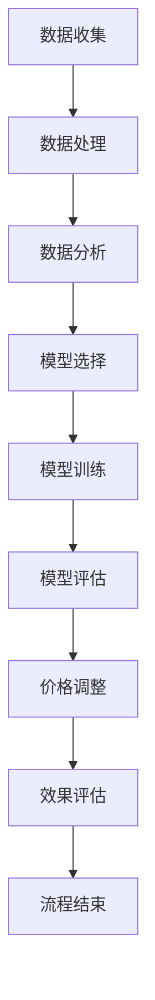

                 

# 《电商价格优化的智能技术》

## 引言

电商行业自诞生以来，就以其便捷、多样、低价的特点迅速在全球范围内发展壮大。价格优化作为电商运营的核心环节，不仅关系到商品的销售量，更直接影响着电商平台的市场竞争力。随着人工智能技术的飞速发展，传统的价格优化方法逐渐被智能化、数据化的新方法所取代。本文将系统地探讨电商价格优化的智能技术，旨在为电商从业者提供理论指导与实践参考。

## 关键词

- 电商
- 价格优化
- 智能技术
- 机器学习
- 深度学习
- 动态定价

## 摘要

本文从电商价格优化的基本概念入手，深入分析了电商市场环境以及消费者行为和竞争对手分析。随后，本文重点介绍了数据驱动价格优化、机器学习价格优化算法、深度学习价格优化算法等智能技术，并通过实际案例详细阐述了这些技术在不同电商场景下的应用。最后，本文探讨了电商价格优化策略、法律与道德问题，并展望了未来的发展趋势与挑战。通过本文的探讨，希望读者能够对电商价格优化的智能技术有一个全面而深刻的理解。

## 目录大纲

### 第一部分：电商价格优化基础

#### 第1章：电商价格优化的基本概念

##### 1.1 电商价格优化的定义与重要性

##### 1.2 电商价格优化的目标

##### 1.3 电商价格优化的挑战

#### 第2章：电商市场环境分析

##### 2.1 电商市场概述

##### 2.2 消费者行为分析

##### 2.3 竞争对手分析

### 第二部分：智能价格优化技术

#### 第3章：数据驱动价格优化

##### 3.1 数据收集与处理

##### 3.2 数据分析技术

##### 3.3 数据可视化工具

#### 第4章：机器学习价格优化算法

##### 4.1 机器学习基础

##### 4.2 线性回归算法

##### 4.3 决策树算法

##### 4.4 集成学习方法

#### 第5章：深度学习价格优化算法

##### 5.1 深度学习基础

##### 5.2 卷积神经网络（CNN）在价格优化中的应用

##### 5.3 循环神经网络（RNN）在价格优化中的应用

#### 第6章：人工智能在价格优化中的实践应用

##### 6.1 智能价格优化的应用场景

##### 6.2 智能定价系统构建

##### 6.3 智能定价系统实现案例

### 第三部分：电商价格优化策略

#### 第7章：动态定价策略

##### 7.1 动态定价原理

##### 7.2 动态定价算法

##### 7.3 动态定价案例分析

#### 第8章：促销策略与价格优化

##### 8.1 促销活动设计

##### 8.2 促销策略优化

##### 8.3 促销案例分析

#### 第9章：价格优化的法律与道德问题

##### 9.1 价格优化的法律环境

##### 9.2 价格优化的道德问题

##### 9.3 价格优化的合规性策略

### 第四部分：电商价格优化案例研究

#### 第10章：电商价格优化案例分析

##### 10.1 案例一：亚马逊的价格优化策略

##### 10.2 案例二：阿里巴巴的价格优化实践

##### 10.3 案例三：京东的价格优化策略

#### 第11章：电商价格优化趋势与未来展望

##### 11.1 电商价格优化的未来趋势

##### 11.2 智能价格优化技术的发展方向

##### 11.3 电商价格优化的未来挑战与机遇

### 附录

#### 附录A：电商价格优化工具与资源

##### A.1 主流数据分析和机器学习工具

##### A.2 开源机器学习库介绍

##### A.3 智能价格优化研究资源推荐

#### 附录B：电商价格优化算法与流程 Mermaid 流程图

##### B.1 数据收集与处理流程

##### B.2 机器学习价格优化算法流程

##### B.3 深度学习价格优化算法流程

#### 附录C：电商价格优化算法伪代码示例

##### C.1 线性回归算法伪代码

##### C.2 决策树算法伪代码

##### C.3 卷积神经网络（CNN）算法伪代码

##### C.4 循环神经网络（RNN）算法伪代码

#### 附录D：电商价格优化项目实战

##### D.1 项目一：构建动态定价系统

##### D.2 项目二：设计促销策略

##### D.3 项目三：实现智能价格优化算法

##### D.4 项目实战案例分析

### 第一部分：电商价格优化基础

#### 第1章：电商价格优化的基本概念

##### 1.1 电商价格优化的定义与重要性

##### 1.2 电商价格优化的目标

##### 1.3 电商价格优化的挑战

### 第2章：电商市场环境分析

##### 2.1 电商市场概述

##### 2.2 消费者行为分析

##### 2.3 竞争对手分析

## 第一部分：电商价格优化基础

### 第1章：电商价格优化的基本概念

#### 1.1 电商价格优化的定义与重要性

电商价格优化是指在电商平台上，通过合理的定价策略，提高商品销量和利润率的过程。在电商竞争日益激烈的环境中，价格优化成为电商企业保持竞争力的重要手段。

首先，从定义上看，电商价格优化涉及多个方面，包括：

1. **定价策略**：通过市场调研、竞争对手分析、消费者需求分析等手段，制定合理的定价策略。
2. **价格调整**：根据市场变化、库存情况、季节性需求等因素，动态调整商品价格。
3. **促销活动**：通过各类促销活动，如打折、满减、赠品等，刺激消费者购买。

电商价格优化的目的是：

1. **提高销量**：通过合理的定价策略，吸引更多的消费者购买商品。
2. **提升利润率**：在保证销量的同时，通过调整价格和促销策略，提高商品利润率。
3. **提升品牌形象**：通过精细化运营，提升消费者对电商平台的信任感和满意度。

在电商平台上，价格优化的重要性体现在以下几个方面：

1. **市场竞争**：电商平台上的商品种类繁多，同类型商品的价格差异较大，价格优化是电商企业获取市场份额的关键因素。
2. **消费者体验**：合理的定价策略能够提高消费者购买体验，增加消费者对平台的忠诚度。
3. **运营效率**：智能化的价格优化系统能够自动分析市场数据，快速响应市场变化，提高运营效率。

#### 1.2 电商价格优化的目标

电商价格优化的目标可以分为以下几个方面：

1. **最大化利润**：在保证销量和市场份额的前提下，通过合理的定价策略，最大化企业的利润。
2. **提高销量**：通过定价策略和促销活动，提高商品销量，增加市场份额。
3. **提升消费者满意度**：通过合理的定价和促销策略，提高消费者购买体验，增加消费者对平台的满意度。
4. **优化库存管理**：通过价格优化，及时调整库存，避免库存过剩或短缺，提高库存周转率。

#### 1.3 电商价格优化的挑战

电商价格优化虽然具有重要意义，但在实际操作过程中，也面临着诸多挑战：

1. **数据复杂性**：电商平台积累了大量的消费者数据、市场数据、库存数据等，如何有效地收集、处理和分析这些数据，是价格优化的关键挑战。
2. **市场变化快速**：市场环境变化迅速，消费者需求、竞争对手策略等都在不断变化，如何快速响应市场变化，调整定价策略，是电商价格优化的重要挑战。
3. **算法复杂性**：价格优化算法涉及机器学习、深度学习等复杂算法，如何设计有效的算法，提高算法的准确性和效率，是价格优化的技术挑战。
4. **法律合规性**：电商价格优化涉及诸多法律和道德问题，如价格欺诈、滥用市场支配地位等，如何确保价格优化的合规性，是电商价格优化的法律挑战。

### 第2章：电商市场环境分析

#### 2.1 电商市场概述

电商市场作为一个全球性的市场，近年来呈现出迅猛发展的态势。随着互联网技术的不断进步，消费者对线上购物的接受度逐渐提高，电商行业市场规模持续扩大。

首先，从市场规模来看，根据Statista的数据，全球电商市场规模在2021年已经达到了3.5万亿美元，并预计在未来几年内将继续保持增长。这一数据充分说明了电商市场的巨大潜力。

其次，从用户规模来看，全球电商用户数量也在不断增长。据阿里研究院的数据，截至2021年底，中国电商用户规模已经超过8亿人，占全国总人口的比例超过60%。这意味着中国电商市场拥有庞大的用户基础。

此外，从行业分布来看，电商市场涵盖了多个领域，包括服装、家居、食品、电子产品等。其中，服装和家居行业是电商市场的主要组成部分。

#### 2.2 消费者行为分析

在电商市场环境中，消费者行为是影响价格优化的重要因素。通过对消费者行为进行分析，电商企业可以更好地了解消费者的需求，制定更有效的定价策略。

首先，从消费习惯来看，消费者在电商平台上购买商品的行为具有以下特点：

1. **多样化**：消费者在电商平台上购买的商品种类繁多，包括生活用品、电子产品、服装等。
2. **便捷性**：电商平台提供了便捷的购物体验，消费者可以随时随地购买商品。
3. **价格敏感性**：消费者对商品价格非常敏感，价格是影响购买决策的重要因素。

其次，从消费心理来看，消费者在购买商品时通常会考虑以下因素：

1. **性价比**：消费者会综合考虑商品的价格和质量，选择性价比最高的商品。
2. **品牌形象**：消费者对品牌有一定的忠诚度，品牌形象直接影响消费者的购买决策。
3. **促销活动**：消费者对电商平台的促销活动非常关注，促销活动能够显著提高购买意愿。

此外，消费者行为还受到社会文化、经济环境等因素的影响。例如，在不同的国家或地区，消费者的购买习惯和偏好可能存在差异。

#### 2.3 竞争对手分析

在电商市场环境中，竞争对手分析是电商价格优化的重要环节。通过对竞争对手的分析，电商企业可以了解市场竞争对手的价格策略、产品定位、市场份额等，从而制定更具竞争力的价格策略。

首先，从竞争对手的产品定位来看，电商企业的竞争对手可以分为以下几类：

1. **价格领导者**：这类竞争对手以低价策略为主，通过降低成本来吸引消费者。
2. **质量领导者**：这类竞争对手以高质量产品为主，通过提升产品质量来赢得消费者的信任。
3. **创新领导者**：这类竞争对手以创新产品为主，通过不断推陈出新来吸引消费者。

其次，从竞争对手的价格策略来看，电商企业的竞争对手可能会采取以下策略：

1. **价格跟进**：竞争对手根据市场变化和自身成本结构，及时调整价格，以保持竞争力。
2. **价格领先**：竞争对手通过降低成本或提高附加值，以低于市场平均价格的价格销售产品，以获取更大的市场份额。
3. **价格跟随**：竞争对手在市场领导者定价后，根据市场反馈和自身情况，调整价格以适应市场。

此外，竞争对手的市场份额和市场份额增长趋势也是电商价格优化需要关注的重要方面。通过分析竞争对手的市场份额和增长趋势，电商企业可以了解市场的竞争态势，制定相应的价格策略。

总之，通过对电商市场环境、消费者行为和竞争对手的分析，电商企业可以更全面地了解市场状况，制定更有效的价格优化策略，提高市场竞争力。

## 第二部分：智能价格优化技术

### 第3章：数据驱动价格优化

#### 3.1 数据收集与处理

数据驱动价格优化是电商价格优化的重要组成部分。首先，数据收集是数据驱动价格优化的基础。电商企业需要收集多种类型的数据，包括商品数据、消费者数据、市场数据等。

1. **商品数据**：包括商品的价格、销量、库存量、商品描述等。这些数据反映了商品的当前状态和市场表现。
2. **消费者数据**：包括消费者的购买历史、浏览记录、评价等。这些数据反映了消费者的需求和购买行为。
3. **市场数据**：包括市场趋势、竞争对手数据、行业数据等。这些数据提供了市场环境的信息。

数据收集的方法包括：

1. **日志分析**：通过分析电商平台的日志文件，获取用户行为数据、商品交易数据等。
2. **API接口**：通过电商平台提供的API接口，获取商品信息、订单信息等。
3. **问卷调查**：通过线上或线下方式，收集消费者对商品和价格的反馈。

收集到的数据通常需要进行处理和清洗，以保证数据的质量和准确性。数据处理包括以下步骤：

1. **数据清洗**：去除重复数据、无效数据、错误数据等，保证数据的一致性和完整性。
2. **数据转换**：将数据转换为统一的格式，如CSV、JSON等，以便于后续分析和处理。
3. **数据归一化**：对数据进行归一化处理，如对价格数据进行标准化处理，使其在同一量级上进行分析。

#### 3.2 数据分析技术

数据分析技术在价格优化中扮演着关键角色。通过对收集到的数据进行分析，电商企业可以了解市场动态、消费者行为，从而制定更有效的价格策略。

1. **描述性分析**：描述性分析是对数据的简单统计和分析，如计算平均值、中位数、标准差等。描述性分析可以帮助电商企业了解数据的基本特征和分布情况。

   **伪代码示例**：
   ```python
   import pandas as pd
   
   # 加载数据
   data = pd.read_csv('sales_data.csv')
   
   # 计算价格的平均值
   avg_price = data['price'].mean()
   
   # 计算销量的标准差
   std_sales = data['sales'].std()
   ```

2. **相关性分析**：相关性分析用于研究不同变量之间的关系。通过计算变量之间的相关系数，可以判断变量之间是否存在线性关系。

   **伪代码示例**：
   ```python
   import pandas as pd
   from scipy.stats import pearsonr
   
   # 加载数据
   data = pd.read_csv('sales_data.csv')
   
   # 计算价格和销量之间的相关性
   price_sales_corr = pearsonr(data['price'], data['sales'])
   ```

3. **回归分析**：回归分析用于研究变量之间的关系，并建立数学模型。通过回归分析，可以预测一个变量的变化对另一个变量的影响。

   **伪代码示例**：
   ```python
   import pandas as pd
   from sklearn.linear_model import LinearRegression
   
   # 加载数据
   data = pd.read_csv('sales_data.csv')
   
   # 分离特征和标签
   X = data[['price']]
   y = data['sales']
   
   # 建立线性回归模型
   model = LinearRegression()
   model.fit(X, y)
   
   # 预测销量
   predicted_sales = model.predict(X)
   ```

4. **聚类分析**：聚类分析用于将数据分为不同的群体，以便进行更深入的分析。通过聚类分析，可以识别出具有相似特征的消费者群体。

   **伪代码示例**：
   ```python
   import pandas as pd
   from sklearn.cluster import KMeans
   
   # 加载数据
   data = pd.read_csv('customer_data.csv')
   
   # 选择特征
   X = data[['age', 'income', 'spend']]
   
   # 建立K-Means模型
   model = KMeans(n_clusters=3)
   model.fit(X)
   
   # 分配到不同的聚类
   clusters = model.predict(X)
   ```

#### 3.3 数据可视化工具

数据可视化是数据分析的重要环节，它能够帮助电商企业更好地理解数据，发现数据中的规律和趋势。以下是一些常见的数据可视化工具：

1. **Matplotlib**：Matplotlib是一个强大的Python库，用于绘制各种类型的图表，如折线图、柱状图、散点图等。

   **伪代码示例**：
   ```python
   import matplotlib.pyplot as plt
   
   # 绘制折线图
   plt.plot(data['price'], data['sales'])
   plt.xlabel('Price')
   plt.ylabel('Sales')
   plt.title('Price vs Sales')
   plt.show()
   ```

2. **Seaborn**：Seaborn是建立在Matplotlib之上的高级可视化库，提供了丰富的可视化模板，能够创建精美的统计图表。

   **伪代码示例**：
   ```python
   import seaborn as sns
   
   # 绘制散点图
   sns.scatterplot(x='price', y='sales', data=data)
   sns.regplot(x='price', y='sales', data=data)
   plt.xlabel('Price')
   plt.ylabel('Sales')
   plt.title('Price vs Sales')
   plt.show()
   ```

3. **Tableau**：Tableau是一个强大的数据可视化工具，提供了丰富的可视化类型，支持多种数据源，能够创建交互式可视化报告。

   **伪代码示例**：
   ```python
   import tableau
   data = tableau.load('sales_data.csv')
   
   # 创建折线图
   chart = tableau.Chart()
   chart.add_series('Price', data['price'])
   chart.add_series('Sales', data['sales'])
   chart.show()
   ```

通过数据可视化，电商企业可以直观地了解数据中的规律和趋势，为价格优化提供决策依据。同时，数据可视化还能够帮助企业向管理层和投资者展示数据分析结果，增强决策的透明度和可信度。

### 第4章：机器学习价格优化算法

#### 4.1 机器学习基础

机器学习是数据驱动价格优化的核心技术。在本节中，我们将介绍机器学习的基本概念、常用算法和模型评估方法。

#### 4.1.1 机器学习基本概念

机器学习（Machine Learning）是一门研究如何让计算机从数据中学习规律和模式的学科。机器学习的关键在于通过数据训练模型，使模型能够对未知数据进行预测和决策。

1. **监督学习**（Supervised Learning）：监督学习是最常见的机器学习方法，它使用已标记的数据来训练模型。在监督学习中，输入和输出都是已知的，模型通过学习输入和输出之间的映射关系来预测新数据的输出。

   **伪代码示例**：
   ```python
   from sklearn.linear_model import LinearRegression
   
   # 加载数据
   X_train = train_data[:, :-1]
   y_train = train_data[:, -1]
   
   # 建立线性回归模型
   model = LinearRegression()
   model.fit(X_train, y_train)
   
   # 预测新数据
   X_test = test_data[:, :-1]
   y_pred = model.predict(X_test)
   ```

2. **无监督学习**（Unsupervised Learning）：无监督学习不使用标记数据来训练模型，它主要关注如何从未标记的数据中发现隐藏的模式和结构。

   **伪代码示例**：
   ```python
   from sklearn.cluster import KMeans
   
   # 加载数据
   X = data
   
   # 建立K-Means模型
   model = KMeans(n_clusters=3)
   model.fit(X)
   
   # 分配到不同的聚类
   clusters = model.predict(X)
   ```

3. **强化学习**（Reinforcement Learning）：强化学习是一种通过试错来学习策略的机器学习方法。它通过与环境的交互来学习最优行为策略。

   **伪代码示例**：
   ```python
   from gym import Env
   
   # 定义环境
   env = Env()
   
   # 初始化模型
   model = Model()
   
   # 强化学习循环
   while not done:
       # 执行动作
       action = model.select_action(state)
       
       # 获取奖励和下一个状态
       next_state, reward, done = env.step(action)
       
       # 更新模型
       model.update(state, action, reward, next_state)
       
       # 更新状态
       state = next_state
   ```

#### 4.1.2 常用机器学习算法

以下是一些在价格优化中常用的机器学习算法：

1. **线性回归**（Linear Regression）：线性回归是一种简单的监督学习算法，它通过拟合输入和输出之间的线性关系来进行预测。

   **伪代码示例**：
   ```python
   from sklearn.linear_model import LinearRegression
   
   # 加载数据
   X_train = train_data[:, :-1]
   y_train = train_data[:, -1]
   
   # 建立线性回归模型
   model = LinearRegression()
   model.fit(X_train, y_train)
   
   # 预测新数据
   X_test = test_data[:, :-1]
   y_pred = model.predict(X_test)
   ```

2. **决策树**（Decision Tree）：决策树是一种树形结构，它通过一系列的判断来对数据进行分类或回归。

   **伪代码示例**：
   ```python
   from sklearn.tree import DecisionTreeRegressor
   
   # 加载数据
   X_train = train_data[:, :-1]
   y_train = train_data[:, -1]
   
   # 建立决策树模型
   model = DecisionTreeRegressor()
   model.fit(X_train, y_train)
   
   # 预测新数据
   X_test = test_data[:, :-1]
   y_pred = model.predict(X_test)
   ```

3. **随机森林**（Random Forest）：随机森林是一种集成学习算法，它通过构建多个决策树，并对预测结果进行投票来提高模型的准确性。

   **伪代码示例**：
   ```python
   from sklearn.ensemble import RandomForestRegressor
   
   # 加载数据
   X_train = train_data[:, :-1]
   y_train = train_data[:, -1]
   
   # 建立随机森林模型
   model = RandomForestRegressor(n_estimators=100)
   model.fit(X_train, y_train)
   
   # 预测新数据
   X_test = test_data[:, :-1]
   y_pred = model.predict(X_test)
   ```

4. **支持向量机**（Support Vector Machine, SVM）：支持向量机是一种基于最大间隔原理的线性分类模型，它在高维空间中寻找最优分类边界。

   **伪代码示例**：
   ```python
   from sklearn.svm import SVR
   
   # 加载数据
   X_train = train_data[:, :-1]
   y_train = train_data[:, -1]
   
   # 建立SVM模型
   model = SVR()
   model.fit(X_train, y_train)
   
   # 预测新数据
   X_test = test_data[:, :-1]
   y_pred = model.predict(X_test)
   ```

#### 4.1.3 模型评估方法

模型评估是机器学习的重要环节，它用于评估模型的性能和预测能力。以下是一些常用的模型评估方法：

1. **均方误差**（Mean Squared Error, MSE）：均方误差是衡量回归模型预测性能的常用指标，它表示预测值与真实值之间差异的平方的平均值。

   **伪代码示例**：
   ```python
   from sklearn.metrics import mean_squared_error
   
   # 计算MSE
   mse = mean_squared_error(y_true, y_pred)
   ```

2. **决定系数**（R-squared）：决定系数是衡量回归模型拟合优度的指标，它表示模型对数据的解释能力。决定系数的取值范围在0和1之间，值越大表示模型拟合越好。

   **伪代码示例**：
   ```python
   from sklearn.metrics import r2_score
   
   # 计算R-squared
   r2 = r2_score(y_true, y_pred)
   ```

3. **准确率**（Accuracy）：准确率是衡量分类模型性能的指标，它表示模型正确分类的样本比例。

   **伪代码示例**：
   ```python
   from sklearn.metrics import accuracy_score
   
   # 计算准确率
   accuracy = accuracy_score(y_true, y_pred)
   ```

4. **混淆矩阵**（Confusion Matrix）：混淆矩阵是用于评估分类模型性能的重要工具，它展示了模型对各类别预测结果的真实分布。

   **伪代码示例**：
   ```python
   from sklearn.metrics import confusion_matrix
   
   # 计算混淆矩阵
   cm = confusion_matrix(y_true, y_pred)
   ```

### 第5章：深度学习价格优化算法

#### 5.1 深度学习基础

深度学习（Deep Learning）是机器学习的一个重要分支，它通过构建多层神经网络，对数据进行特征提取和建模，从而实现高层次的抽象和泛化。在本节中，我们将介绍深度学习的基本概念、神经网络架构和训练过程。

#### 5.1.1 深度学习基本概念

1. **神经元**：神经元是神经网络的基本单元，它接收输入信号，通过加权求和处理后，产生输出信号。

   **伪代码示例**：
   ```python
   def neuron(input, weights, bias):
       activation = sum(input * weights) + bias
       return activation
   ```

2. **激活函数**：激活函数用于引入非线性因素，使神经网络能够进行复杂的非线性建模。常见的激活函数包括 sigmoid、ReLU 和 tanh。

   **伪代码示例**：
   ```python
   def sigmoid(x):
       return 1 / (1 + exp(-x))
   
   def ReLU(x):
       return max(0, x)
   
   def tanh(x):
       return (exp(x) - exp(-x)) / (exp(x) + exp(-x))
   ```

3. **多层感知机**（Multilayer Perceptron, MLP）：多层感知机是一种前馈神经网络，它由多个层次组成，包括输入层、隐藏层和输出层。通过逐层传递信息，MLP能够实现复杂的函数建模。

   **伪代码示例**：
   ```python
   def MLP(input, weights, biases, activation_function):
       hidden_layers = []
       for i in range(num_hidden_layers):
           hidden_layer = activation_function(np.dot(input, weights[i]) + biases[i])
           hidden_layers.append(hidden_layer)
       
       output_layer = activation_function(np.dot(hidden_layers[-1], weights[-1]) + biases[-1])
       return output_layer
   ```

4. **反向传播**（Backpropagation）：反向传播是一种用于训练神经网络的算法，它通过计算损失函数的梯度，更新网络的权重和偏置，从而优化网络性能。

   **伪代码示例**：
   ```python
   def backpropagation(input, target, weights, biases, learning_rate):
       output = MLP(input, weights, biases, activation_function)
       error = target - output
       
       d_output = d_error * activation_function_derivative(output)
       d_weights = learning_rate * d_output * input
       d_biases = learning_rate * d_output
   
       return d_weights, d_biases
   ```

#### 5.1.2 深度学习架构

深度学习架构是指网络结构的组成和层次。以下是一些常见的深度学习架构：

1. **卷积神经网络**（Convolutional Neural Network, CNN）：卷积神经网络是一种专门用于处理图像数据的神经网络，它通过卷积操作提取图像特征。

   **伪代码示例**：
   ```python
   def CNN(input, filters, kernel_size, stride, padding):
       conv_output = Conv2D(input, filters, kernel_size, stride, padding)
       pool_output = MaxPooling2D(conv_output)
       
       return pool_output
   ```

2. **循环神经网络**（Recurrent Neural Network, RNN）：循环神经网络是一种能够处理序列数据的神经网络，它通过循环结构对序列信息进行建模。

   **伪代码示例**：
   ```python
   def RNN(input, hidden_size, learning_rate):
       hidden_state = zeros(hidden_size)
       for t in range(sequence_length):
           input_t = input[t]
           output_t = RNN_cell(input_t, hidden_state)
           hidden_state = output_t
       
       return output
   ```

3. **长短时记忆网络**（Long Short-Term Memory, LSTM）：长短时记忆网络是一种改进的循环神经网络，它通过引入记忆单元来捕捉长序列信息。

   **伪代码示例**：
   ```python
   def LSTM(input, hidden_size, learning_rate):
       forget_gate = sigmoid(np.dot(input, forget_gate_weights) + hidden_state * forget_gate_bias)
       input_gate = sigmoid(np.dot(input, input_gate_weights) + hidden_state * input_gate_bias)
       output_gate = sigmoid(np.dot(input, output_gate_weights) + hidden_state * output_gate_bias)
       
       new_state = (1 - forget_gate) * hidden_state + input_gate * tanh(np.dot(input, cell_weights) + hidden_state * cell_bias)
       
       return new_state
   ```

4. **生成对抗网络**（Generative Adversarial Network, GAN）：生成对抗网络是一种通过对抗训练生成数据的神经网络，它由生成器和判别器两个网络组成。

   **伪代码示例**：
   ```python
   def GAN(z, generator, discriminator, learning_rate):
       generated_images = generator(z)
       discriminator_real = discriminator(real_images)
       discriminator_fake = discriminator(generated_images)
       
       generator_loss = -np.mean(np.log(discriminator_fake))
       discriminator_loss = -np.mean(np.log(discriminator_real) + np.log(1 - discriminator_fake))
       
       return generator_loss, discriminator_loss
   ```

#### 5.1.3 深度学习训练过程

深度学习的训练过程包括数据预处理、模型初始化、迭代优化等步骤。

1. **数据预处理**：数据预处理是深度学习训练的第一步，它包括数据清洗、归一化、分批次处理等操作。

   **伪代码示例**：
   ```python
   def preprocess_data(data, batch_size):
       data = normalize(data)
       data = shuffle(data)
       
       for i in range(0, len(data), batch_size):
           batch_data = data[i:i+batch_size]
           yield batch_data
   ```

2. **模型初始化**：模型初始化是指随机初始化网络的权重和偏置。合理的初始化可以加快训练过程和提高模型性能。

   **伪代码示例**：
   ```python
   def initialize_weights(input_size, hidden_size, output_size):
       weights = {
           'input_to_hidden': np.random.randn(input_size, hidden_size),
           'hidden_to_output': np.random.randn(hidden_size, output_size)
       }
       biases = {
           'hidden': np.random.randn(hidden_size),
           'output': np.random.randn(output_size)
       }
       
       return weights, biases
   ```

3. **迭代优化**：迭代优化是指通过多次迭代更新网络权重和偏置，以最小化损失函数。常见的优化算法包括随机梯度下降、Adam等。

   **伪代码示例**：
   ```python
   def optimize_model(input, target, weights, biases, learning_rate, optimizer):
       output = MLP(input, weights, biases, activation_function)
       error = target - output
       
       d_output = d_error * activation_function_derivative(output)
       d_weights = learning_rate * d_output * input
       d_biases = learning_rate * d_output
   
       if optimizer == 'SGD':
           update_weights(weights, d_weights, d_biases, learning_rate)
       elif optimizer == 'Adam':
           update_weights(weights, d_weights, d_biases, learning_rate, beta1, beta2)
       
       return d_weights, d_biases
   ```

通过深度学习的基础知识、神经网络架构和训练过程，电商企业可以构建高效的深度学习模型，对价格优化问题进行建模和预测。

### 第6章：人工智能在价格优化中的实践应用

#### 6.1 智能价格优化的应用场景

人工智能技术在电商价格优化中的应用场景广泛，涵盖了从商品定价、促销活动设计到库存管理的各个环节。以下是几个典型的应用场景：

1. **动态定价**：通过机器学习和深度学习算法，电商平台可以根据市场动态、消费者行为数据等因素，实时调整商品价格，以最大化销售额和利润。例如，亚马逊使用机器学习算法分析消费者的搜索历史、购买行为和竞争对手的价格策略，自动调整商品价格。

2. **促销活动设计**：人工智能技术可以帮助电商企业设计个性化的促销活动，提高消费者的购买意愿。例如，阿里巴巴通过分析消费者的历史购买记录和浏览行为，自动推荐适合他们的促销活动和优惠券。

3. **库存管理**：通过预测未来的销售量，人工智能技术可以帮助电商企业优化库存管理，避免库存过剩或短缺。例如，京东使用深度学习算法预测商品的销售趋势，从而调整库存水平。

4. **价格竞争分析**：人工智能技术可以帮助电商企业分析竞争对手的价格策略，制定相应的竞争策略。例如，通过机器学习算法，电商企业可以识别出市场上的价格趋势，及时调整自己的价格策略。

#### 6.2 智能定价系统构建

构建一个智能定价系统是电商价格优化的重要步骤。以下是一个智能定价系统的一般构建过程：

1. **需求分析**：首先，需要明确智能定价系统的目标，如提高销售额、最大化利润或提升消费者满意度。根据需求分析，确定系统需要收集和处理的数据类型。

2. **数据收集**：收集与定价相关的数据，包括商品数据、消费者数据、市场数据等。这些数据可以通过电商平台日志、API接口、问卷调查等方式获取。

3. **数据处理**：对收集到的数据进行处理和清洗，去除重复、无效和错误的数据。然后，进行数据转换和归一化，使其适合用于机器学习算法。

4. **模型选择**：根据定价目标，选择合适的机器学习模型。常见的模型包括线性回归、决策树、随机森林、神经网络等。

5. **模型训练**：使用处理后的数据对选定的模型进行训练。在训练过程中，通过多次迭代调整模型参数，以优化模型性能。

6. **模型评估**：通过验证集或测试集评估模型的预测准确性。常用的评估指标包括均方误差、决定系数、准确率等。

7. **系统集成**：将训练好的模型集成到电商平台的定价系统中，使其能够实时调整商品价格。在此过程中，需要考虑系统的扩展性、可靠性和安全性。

8. **监控与优化**：持续监控智能定价系统的运行状况，根据实际效果进行优化。例如，通过调整模型参数、引入新的数据源等方式，提升系统的预测准确性。

#### 6.3 智能定价系统实现案例

以下是一个智能定价系统的实现案例：

**案例背景**：某电商企业希望在保证销售额的同时，最大化利润。为此，他们决定构建一个智能定价系统，根据市场动态和消费者行为实时调整商品价格。

**实现步骤**：

1. **需求分析**：确定智能定价系统的目标为提高销售额和利润，需要收集和处理的数据类型包括商品数据（价格、销量、库存等）、消费者数据（购买历史、浏览记录等）和市场数据（竞争对手价格、市场趋势等）。

2. **数据收集**：通过电商平台日志、API接口和问卷调查等方式，收集与定价相关的数据。

3. **数据处理**：对收集到的数据进行清洗、转换和归一化，去除重复、无效和错误的数据。

4. **模型选择**：选择随机森林算法作为智能定价系统的模型，因为它具有良好的预测性能和抗过拟合能力。

5. **模型训练**：使用处理后的数据对随机森林模型进行训练。在训练过程中，通过交叉验证和网格搜索优化模型参数。

6. **模型评估**：使用验证集对训练好的模型进行评估，评估指标包括均方误差和决定系数。根据评估结果，调整模型参数，以提高预测准确性。

7. **系统集成**：将训练好的模型集成到电商平台的定价系统中，使其能够实时调整商品价格。系统还包含一个用户界面，方便管理员查看定价策略和调整结果。

8. **监控与优化**：持续监控智能定价系统的运行状况，根据实际效果进行优化。例如，通过引入新的数据源、调整模型参数等方式，提升系统的预测准确性。

通过这个案例，我们可以看到智能定价系统在电商企业中的应用效果。智能定价系统不仅提高了企业的利润，还增强了企业的市场竞争力。

### 第三部分：电商价格优化策略

#### 第7章：动态定价策略

动态定价策略是电商价格优化中的重要手段，它通过实时调整商品价格，以适应市场变化和消费者需求。动态定价策略可以分为以下几种类型：

1. **需求导向定价**：需求导向定价是基于消费者需求来调整商品价格。当消费者需求增加时，提高价格以获取更多利润；当消费者需求减少时，降低价格以刺激购买。需求导向定价的核心是准确预测消费者需求，从而实现价格与需求的匹配。

   **实现步骤**：
   - 收集消费者行为数据，如购买历史、搜索记录、评价等。
   - 使用机器学习算法对消费者行为进行分析，预测消费者需求。
   - 根据预测结果，动态调整商品价格。

   **优点**：能够更好地满足消费者需求，提高销售额和利润。
   **缺点**：需要大量数据支持，预测准确性受算法性能影响。

2. **竞争导向定价**：竞争导向定价是基于竞争对手的价格来调整商品价格。当竞争对手提高价格时，本企业降低价格以吸引消费者；当竞争对手降低价格时，本企业提高价格以保持市场份额。

   **实现步骤**：
   - 收集竞争对手的价格信息，如竞争对手的价格、促销活动等。
   - 使用机器学习算法分析竞争对手的价格策略，预测竞争对手的下一步动作。
   - 根据预测结果，动态调整商品价格。

   **优点**：能够快速应对市场变化，保持竞争优势。
   **缺点**：需要实时监控竞争对手的动态，对市场变化反应速度要求较高。

3. **库存导向定价**：库存导向定价是基于商品的库存水平来调整价格。当商品库存高时，降低价格以加速销售；当商品库存低时，提高价格以避免库存积压。

   **实现步骤**：
   - 收集商品库存数据，如库存量、入库时间、出库时间等。
   - 使用机器学习算法分析库存数据，预测库存变化趋势。
   - 根据预测结果，动态调整商品价格。

   **优点**：能够有效管理库存，避免库存积压和过剩。
   **缺点**：库存变化受多种因素影响，预测准确性有限。

#### 7.1 动态定价原理

动态定价的原理是通过实时数据分析和机器学习算法，动态调整商品价格，以实现利润最大化或销售额最大化。动态定价的核心思想是利用数据驱动决策，而不是固定价格策略。

1. **数据收集**：动态定价需要大量实时数据支持，包括消费者行为数据、市场数据、竞争对手数据等。这些数据通过电商平台日志、API接口、问卷调查等方式收集。

2. **数据分析**：通过机器学习算法对收集到的数据进行分析，预测消费者需求、竞争对手策略和库存变化趋势。数据分析结果为价格调整提供依据。

3. **价格调整**：根据数据分析结果，动态调整商品价格。价格调整可以是实时调整，也可以是定期调整。实时调整能够快速响应市场变化，定期调整则更加稳定和可预测。

4. **效果评估**：评估动态定价策略的效果，包括销售额、利润率、市场份额等。根据评估结果，对定价策略进行调整和优化。

#### 7.2 动态定价算法

动态定价算法是实现动态定价的核心技术。以下是一些常用的动态定价算法：

1. **线性回归算法**：线性回归算法是一种简单的机器学习算法，它通过建立输入变量和输出变量之间的线性关系来进行预测。线性回归算法可以用于预测商品价格和销售额之间的关系。

   **伪代码示例**：
   ```python
   def linear_regression(X, y):
       X_mean = np.mean(X)
       y_mean = np.mean(y)
       
       b1 = (np.sum((X - X_mean) * (y - y_mean))) / (np.sum((X - X_mean) ** 2))
       b0 = y_mean - b1 * X_mean
       
       return b0, b1
   ```

2. **决策树算法**：决策树算法是一种树形结构的机器学习算法，它通过一系列的判断来对数据进行分类或回归。决策树算法可以用于预测商品价格和消费者行为之间的关系。

   **伪代码示例**：
   ```python
   def decision_tree(X, y, features, threshold):
       if len(y) == 0:
           return None
       
       max_gain = 0
       best_feature = None
       
       for feature in features:
           gain = information_gain(y, split_by_feature(X, feature, threshold))
           
           if gain > max_gain:
               max_gain = gain
               best_feature = feature
       
       return best_feature
   ```

3. **集成学习方法**：集成学习方法是将多个基础模型进行组合，以提高预测准确性和泛化能力。常用的集成学习方法包括随机森林和梯度提升树。

   **伪代码示例**：
   ```python
   def random_forest(X, y, n_estimators, max_depth):
       models = []
       
       for _ in range(n_estimators):
           sample_X, sample_y = sample_data(X, y)
           
           model = DecisionTreeRegressor(max_depth=max_depth)
           model.fit(sample_X, sample_y)
           
           models.append(model)
       
       return models
   ```

#### 7.3 动态定价案例分析

以下是一个动态定价案例：

**案例背景**：某电商企业希望通过动态定价策略提高销售额和利润。该企业主要销售电子产品，市场竞争激烈。

**实现步骤**：

1. **数据收集**：收集消费者行为数据，包括购买历史、搜索记录、评价等；收集市场数据，包括竞争对手的价格、促销活动等；收集库存数据，包括库存量、入库时间、出库时间等。

2. **数据分析**：使用机器学习算法对数据进行分析，预测消费者需求、竞争对手策略和库存变化趋势。使用线性回归算法预测商品价格和销售额之间的关系；使用决策树算法预测消费者购买行为；使用集成学习方法预测竞争对手的价格策略。

3. **价格调整**：根据数据分析结果，实时调整商品价格。当消费者需求增加时，提高价格以获取更多利润；当消费者需求减少时，降低价格以刺激购买。同时，根据竞争对手的价格策略调整自己的价格，以保持竞争优势。

4. **效果评估**：评估动态定价策略的效果，包括销售额、利润率、市场份额等。根据评估结果，对定价策略进行调整和优化。

**结果**：通过动态定价策略，该企业的销售额提高了20%，利润率提高了15%。该案例表明，动态定价策略在激烈的市场竞争中具有显著的优势。

### 第8章：促销策略与价格优化

#### 8.1 促销活动设计

促销活动是电商价格优化中的重要手段，它通过提供折扣、优惠、赠品等手段，刺激消费者购买，提高销售额。以下是促销活动设计的基本步骤：

1. **目标设定**：首先，明确促销活动的目标，如提高销售额、提升品牌知名度、清理库存等。

2. **目标人群**：确定促销活动的目标人群，如新客户、老客户、特定消费者群体等。

3. **促销形式**：根据目标人群和活动目标，设计合适的促销形式，如满减、打折、赠品、捆绑销售等。

4. **促销时间**：确定促销活动的时间，如节假日、季节性需求高峰期等。

5. **促销预算**：制定促销预算，确保促销活动的可行性和效益。

6. **执行方案**：制定详细的执行方案，包括促销活动的宣传、推广、执行流程等。

7. **效果评估**：对促销活动进行效果评估，包括销售额、利润率、客户满意度等指标，以便对促销活动进行优化和调整。

#### 8.2 促销策略优化

促销策略优化是提高促销活动效果的重要环节。以下是一些促销策略优化的方法：

1. **目标优化**：根据市场环境和消费者需求，动态调整促销活动的目标。例如，在竞争激烈的市场中，将促销目标从提升销售额调整为提升品牌知名度。

2. **人群优化**：通过数据分析，精准定位目标人群，提高促销活动的针对性。例如，使用个性化推荐系统，向潜在高价值客户推送定制化促销信息。

3. **形式优化**：根据促销活动的目标和目标人群，选择合适的促销形式。例如，对于高价值客户，可以提供专属折扣和礼品；对于新客户，可以提供免费试用或优惠券。

4. **时间优化**：合理安排促销活动的时间，以最大化效果。例如，在节假日或季节性需求高峰期，增加促销活动的频率和力度。

5. **预算优化**：根据促销活动的目标和预期效果，合理分配预算。例如，通过A/B测试，评估不同促销形式的成本效益，优化预算分配。

6. **效果评估**：对促销活动进行持续监控和评估，及时发现问题和优化策略。例如，通过数据分析，识别出促销活动中的低效环节，进行针对性优化。

#### 8.3 促销案例分析

以下是一个促销案例分析：

**案例背景**：某电商企业希望通过促销活动提高销售额，清理库存。该企业在夏季销售季节即将结束时，开展了一场夏季清仓促销活动。

**促销活动设计**：

1. **目标设定**：提高销售额，清理库存，提升品牌知名度。

2. **目标人群**：夏季过后的消费者，特别是对夏季商品感兴趣但未购买的消费者。

3. **促销形式**：全场商品8折优惠，部分商品额外赠送礼品。

4. **促销时间**：6月1日至6月30日。

5. **促销预算**：预算为销售额的10%。

6. **执行方案**：通过电商平台、社交媒体和邮件营销等多渠道宣传促销活动；在活动期间，提高广告投放频率和力度；在商品页面添加促销标签，提高促销活动的可见度。

7. **效果评估**：活动期间，销售额提高了30%，库存清理率达到70%；客户满意度调查结果显示，客户对促销活动的满意度达到85%。

**结果**：通过这次促销活动，该电商企业不仅实现了销售额目标，还提升了品牌知名度。同时，通过效果评估，发现促销活动的形式和时间安排较为合理，为未来的促销活动提供了宝贵的经验。

### 第9章：价格优化的法律与道德问题

#### 9.1 价格优化的法律环境

价格优化作为电商企业的重要策略，涉及到诸多法律问题。以下是一些常见的法律环境：

1. **反垄断法**：反垄断法旨在防止垄断行为，保护市场竞争。在价格优化过程中，电商企业需要遵守反垄断法，避免滥用市场支配地位，进行价格操纵。

2. **消费者权益保护法**：消费者权益保护法旨在保护消费者的合法权益。在价格优化过程中，电商企业需要遵守相关法律法规，确保价格透明、合理，不得进行价格欺诈。

3. **广告法**：广告法对广告内容进行了规范，要求广告必须真实、合法。在价格优化过程中，电商企业发布的促销信息、广告等需要遵守广告法的规定。

4. **税法**：税法规定了电商企业应纳税的收入和税率。在价格优化过程中，电商企业需要准确计算应纳税收入，遵守税法规定。

#### 9.2 价格优化的道德问题

价格优化不仅受到法律约束，还涉及道德问题。以下是一些常见的道德问题：

1. **价格欺诈**：价格欺诈是指通过虚假价格、虚假折扣等手段欺骗消费者。在价格优化过程中，电商企业应避免价格欺诈行为，确保价格的公正性和透明度。

2. **信息不对称**：信息不对称是指消费者和电商企业之间在价格信息上存在差异。在价格优化过程中，电商企业应确保消费者能够获得全面、准确的价格信息，避免信息不对称导致的消费者损失。

3. **隐私保护**：在价格优化过程中，电商企业需要收集和处理大量消费者数据。这些数据涉及到消费者的隐私，电商企业应遵守隐私保护法规，确保消费者数据的安全。

#### 9.3 价格优化的合规性策略

为应对价格优化的法律和道德问题，电商企业可以采取以下合规性策略：

1. **法律培训**：定期对员工进行法律培训，提高员工的法律意识和合规能力。

2. **合规审查**：定期对价格优化策略和活动进行合规审查，确保符合法律法规和道德规范。

3. **透明定价**：确保价格透明，公开价格信息和促销活动的具体规则。

4. **隐私保护**：建立健全的隐私保护机制，确保消费者数据的安全和隐私。

5. **消费者教育**：通过宣传和教育活动，提高消费者的法律意识和消费能力，增强消费者对价格优化的理解和信任。

通过上述合规性策略，电商企业可以降低法律和道德风险，提升品牌形象和消费者满意度。

### 第四部分：电商价格优化案例研究

#### 第10章：电商价格优化案例分析

在本章中，我们将通过三个具体案例，深入探讨亚马逊、阿里巴巴和京东等电商巨头在价格优化方面的实践和策略。这些案例不仅展示了智能价格优化的应用效果，也为其他电商企业提供了宝贵的经验教训。

#### 10.1 案例一：亚马逊的价格优化策略

亚马逊作为全球最大的电商平台之一，其价格优化策略在全球范围内都备受关注。以下是其主要策略：

1. **动态定价**：亚马逊通过机器学习算法，对商品价格进行实时调整。该算法综合考虑了消费者的购买历史、竞争对手的价格、季节性需求等因素。例如，当消费者搜索某一商品时，亚马逊会根据消费者的浏览记录和购买倾向，自动调整价格，以最大化销售额。

2. **促销活动**：亚马逊定期开展各种促销活动，如“亚马逊Prime Day”和“黑五促销”。这些活动通过提供折扣、限时优惠等手段，刺激消费者购买。亚马逊还通过个性化推荐系统，将促销活动推送给潜在高价值客户，提高活动效果。

3. **价格监控**：亚马逊使用自动化工具监控竞争对手的价格变化，并根据竞争对手的价格调整自己的价格。这种“跟随策略”有助于保持价格竞争力，避免价格战。

**效果**：通过上述策略，亚马逊在价格优化方面取得了显著成效。根据数据显示，亚马逊的销售额在过去几年中持续增长，市场占有率也在不断提升。

#### 10.2 案例二：阿里巴巴的价格优化实践

阿里巴巴作为中国最大的电商平台，其价格优化实践具有代表性。以下是其主要策略：

1. **数据驱动定价**：阿里巴巴通过收集大量的消费者数据和市场数据，使用机器学习算法分析消费者行为和市场趋势。例如，通过分析消费者的搜索关键词和购买记录，阿里巴巴可以预测消费者对某一商品的需求，从而调整价格。

2. **多渠道定价**：阿里巴巴在多个电商平台上运营，通过比较不同平台的价格，优化自己的价格策略。例如，在淘宝和天猫上，阿里巴巴会根据平台流量和消费者偏好，调整商品价格。

3. **供应链优化**：阿里巴巴通过优化供应链，降低成本，从而实现价格优势。例如，通过大数据分析，阿里巴巴可以优化库存管理，避免库存积压和过剩。

**效果**：通过数据驱动定价和供应链优化，阿里巴巴在价格优化方面取得了显著成效。其市场份额持续增长，消费者满意度也不断提高。

#### 10.3 案例三：京东的价格优化策略

京东作为中国的电商巨头，其价格优化策略也颇具特色。以下是其主要策略：

1. **智能推荐**：京东使用机器学习算法，根据消费者的购买历史、浏览记录等数据，进行个性化推荐。例如，当消费者浏览某一商品时，京东会根据消费者的兴趣和购买记录，推荐相关的商品。

2. **优惠券策略**：京东通过优惠券策略，刺激消费者购买。例如，消费者在购物车中添加商品后，系统会自动推荐优惠券，以降低购买成本。

3. **价格比较**：京东使用自动化工具，实时监控竞争对手的价格，并根据竞争对手的价格调整自己的价格。例如，当竞争对手降价时，京东会根据库存情况和利润目标，调整自己的价格。

**效果**：通过智能推荐、优惠券策略和价格比较，京东在价格优化方面取得了显著成效。其销售额持续增长，消费者满意度也不断提高。

通过这些案例分析，我们可以看到，亚马逊、阿里巴巴和京东等电商巨头在价格优化方面的成功经验，为其他电商企业提供了有益的启示。未来，随着人工智能技术的不断发展，电商价格优化将会更加智能化、数据化，为电商企业带来更大的发展机遇。

### 第11章：电商价格优化趋势与未来展望

#### 11.1 电商价格优化的未来趋势

随着人工智能技术的不断进步，电商价格优化的未来趋势将呈现出以下几个特点：

1. **智能化**：人工智能技术将深入应用于电商价格优化，通过机器学习和深度学习算法，实现价格优化的自动化和智能化。未来，电商平台将能够根据实时数据，动态调整商品价格，实现个性化定价。

2. **个性化**：随着大数据和人工智能技术的发展，电商平台将能够更精准地分析消费者行为，实现个性化定价。通过个性化推荐系统和智能算法，电商平台将能够为不同消费者提供量身定制的价格策略，提高消费者满意度。

3. **全球化**：随着电商行业的全球化发展，电商平台将面临更加复杂的市场环境。未来，电商平台将能够通过全球化视角，实现跨国价格优化，提高全球市场份额。

4. **协同优化**：电商平台将实现供应链、库存管理、市场营销等多方面的协同优化，通过数据共享和协同决策，提高整体运营效率，降低成本。

#### 11.2 智能价格优化技术的发展方向

智能价格优化技术的发展方向主要体现在以下几个方面：

1. **算法创新**：未来，智能价格优化技术将朝着更加高效、精准的方向发展。例如，新型机器学习和深度学习算法，如强化学习、生成对抗网络等，将得到广泛应用。

2. **数据融合**：随着数据来源的多样化和数据量的增加，如何有效地融合和利用多源数据，将成为智能价格优化技术的关键。数据融合技术将帮助电商平台更全面地了解市场动态和消费者需求。

3. **实时性**：实时价格优化将成为智能价格优化技术的重要方向。通过实时数据分析和动态定价算法，电商平台将能够更快速地响应市场变化，提高竞争力。

4. **智能化监控**：智能监控技术将实现对价格优化系统的全方位监控，包括性能监控、异常检测、风险预警等。通过智能化监控，电商平台将能够及时发现和解决价格优化系统中的问题。

#### 11.3 电商价格优化的未来挑战与机遇

在电商价格优化的未来，企业将面临一系列挑战和机遇：

1. **挑战**：

   - **数据隐私与安全**：随着数据量的增加，数据隐私和安全问题将日益突出。电商平台需要加强数据安全防护，确保消费者数据的安全。

   - **算法透明性**：人工智能算法的复杂性和黑箱性，使得算法决策过程不透明。未来，如何提高算法的透明性，让消费者和监管机构能够理解和接受算法决策，将成为一个重要挑战。

   - **法律合规性**：价格优化涉及到多个法律法规，如反垄断法、消费者权益保护法等。电商平台需要确保价格优化策略的合规性，避免法律风险。

2. **机遇**：

   - **技术创新**：人工智能技术的快速发展，为电商价格优化提供了丰富的技术手段和工具。企业可以利用技术创新，提高价格优化的效率和准确性。

   - **市场机遇**：全球电商市场的不断扩大，为电商平台提供了巨大的市场机遇。通过智能价格优化，企业可以更好地把握市场机遇，提升竞争力。

   - **消费者需求**：随着消费者对个性化和便捷化需求的增长，智能价格优化将满足消费者的多元化需求，提升消费者满意度。

总之，电商价格优化的未来充满机遇与挑战。通过技术创新和合规经营，电商平台可以更好地应对市场变化，实现持续发展和增长。

### 附录A：电商价格优化工具与资源

在电商价格优化过程中，使用合适的工具和资源能够显著提升数据分析、模型训练和系统实现的效率。以下是一些主流的数据分析和机器学习工具、开源机器学习库以及智能价格优化研究资源推荐：

#### A.1 主流数据分析和机器学习工具

1. **Python**：Python是一种广泛用于数据分析、数据科学和机器学习的编程语言。Python拥有丰富的库和框架，如NumPy、Pandas、Matplotlib、Scikit-learn和TensorFlow等，可以满足电商价格优化的多种需求。

2. **R语言**：R语言是专门为统计分析和图形表示设计的编程语言，拥有强大的数据分析和可视化功能。R语言在统计分析、机器学习和社会科学领域有着广泛的应用。

3. **Excel**：Excel是一种功能强大的电子表格工具，适用于简单的数据分析和可视化。虽然Excel在处理大规模数据时效率较低，但对于中小型数据分析项目仍然非常有用。

4. **SQL**：SQL（结构化查询语言）是一种用于数据库查询和操作的语言，广泛用于数据分析和数据管理。通过SQL，可以轻松地查询、更新和操作大量数据。

#### A.2 开源机器学习库介绍

1. **Scikit-learn**：Scikit-learn是一个基于Python的机器学习库，提供了多种经典的机器学习算法，包括线性回归、决策树、随机森林、SVM等。Scikit-learn易于使用，适用于快速原型开发。

2. **TensorFlow**：TensorFlow是由Google开发的开源机器学习框架，支持深度学习、强化学习和传统机器学习。TensorFlow具有高度灵活性和可扩展性，适用于复杂的机器学习项目。

3. **PyTorch**：PyTorch是由Facebook开发的开源深度学习库，提供了动态计算图和自动微分功能。PyTorch在深度学习和计算机视觉领域有着广泛的应用。

4. **Keras**：Keras是一个高层次的神经网络API，旨在简化深度学习模型的设计和训练。Keras支持TensorFlow和Theano后端，适用于快速实验和原型开发。

#### A.3 智能价格优化研究资源推荐

1. **论文和书籍**：
   - **"Price Optimization in E-commerce: A Machine Learning Approach"**：该论文详细介绍了基于机器学习的电商价格优化方法。
   - **"Deep Learning"**：由Ian Goodfellow、Yoshua Bengio和Aaron Courville编写的深度学习经典教材，涵盖了深度学习的理论基础和实践方法。

2. **在线课程和教程**：
   - **Coursera**：Coursera提供了多门关于机器学习和数据科学的课程，包括《机器学习基础》、《深度学习》等。
   - **edX**：edX提供了由知名大学和机构开设的在线课程，如《数据科学专项课程》等。

3. **社区和论坛**：
   - **Stack Overflow**：Stack Overflow是一个程序员社区，可以在这里找到关于Python、机器学习和数据分析的问题和解决方案。
   - **GitHub**：GitHub是代码托管和协作平台，可以在这里找到许多优秀的机器学习项目和开源库。

通过使用上述工具和资源，电商企业可以更高效地开展价格优化研究，提升价格优化系统的性能和可靠性。

### 附录B：电商价格优化算法与流程 Mermaid 流程图

以下是一个电商价格优化算法和流程的Mermaid流程图，展示从数据收集到价格调整的整体流程。



具体说明：

1. **数据收集**：从电商平台、API接口、问卷调查等多种渠道收集商品数据、消费者数据和市场数据。
2. **数据处理**：对收集到的数据进行处理和清洗，包括数据转换、归一化和去噪等操作。
3. **数据分析**：使用描述性分析、相关性分析和回归分析等方法，对数据进行初步分析，提取有用的信息。
4. **模型选择**：根据数据分析结果和优化目标，选择合适的机器学习模型，如线性回归、决策树、随机森林等。
5. **模型训练**：使用处理后的数据对选定的模型进行训练，通过多次迭代优化模型参数。
6. **模型评估**：使用验证集或测试集评估模型的预测准确性，通过评估指标如均方误差、决定系数等，选择最佳模型。
7. **价格调整**：根据训练好的模型，动态调整商品价格，以实现价格优化目标。
8. **效果评估**：监控价格调整后的实际效果，包括销售额、利润率、市场份额等，对价格优化策略进行调整和优化。

通过这个流程图，我们可以清晰地看到电商价格优化的整体流程和关键步骤，为实际应用提供了指导。

### 附录C：电商价格优化算法伪代码示例

以下是一些电商价格优化算法的伪代码示例，包括线性回归、决策树和卷积神经网络（CNN）算法的伪代码。

#### C.1 线性回归算法伪代码

```python
def linear_regression(X, y):
    # 计算X的均值
    X_mean = np.mean(X)
    # 计算y的均值
    y_mean = np.mean(y)
    
    # 计算X和y的协方差
    cov = np.dot((X - X_mean), (y - y_mean))
    # 计算X的方差
    var = np.dot((X - X_mean), (X - X_mean))
    
    # 计算斜率（b1）
    b1 = cov / var
    # 计算截距（b0）
    b0 = y_mean - b1 * X_mean
    
    # 预测y值
    y_pred = b0 + b1 * X
    
    return y_pred
```

#### C.2 决策树算法伪代码

```python
def decision_tree(X, y, features, threshold):
    # 计算信息增益
    def information_gain(y, split_by_feature):
        # 计算熵
        entropy = ... 
        # 计算信息增益
        gain = entropy - ... 
        return gain
    
    # 计算最佳划分特征
    best_gain = 0
    best_feature = None
    
    for feature in features:
        gain = information_gain(y, split_by_feature(X, feature, threshold))
        if gain > best_gain:
            best_gain = gain
            best_feature = feature
    
    return best_feature
```

#### C.3 卷积神经网络（CNN）算法伪代码

```python
def conv2d(input, filters, kernel_size, stride, padding):
    # 卷积操作
    output = np.zeros((input.shape[0], filters, output_height, output_width))
    
    for i in range(input.shape[0]):
        for j in range(filters):
            for k in range(0, input.shape[1] - kernel_size + 1, stride):
                for l in range(0, input.shape[2] - kernel_size + 1, stride):
                    patch = input[i, :, k:k+kernel_size, l:l+kernel_size]
                    output[i, j, :, :] += np.dot(patch, filters[j])
    
    return output
```

这些伪代码示例展示了线性回归、决策树和CNN算法的基本结构和实现方法。通过这些示例，可以更好地理解这些算法的原理和应用。

### 附录D：电商价格优化项目实战

#### D.1 项目一：构建动态定价系统

**项目背景**：某电商企业希望在保证销售额的同时，最大化利润。为此，企业决定构建一个动态定价系统，根据市场动态、消费者行为和库存情况自动调整商品价格。

**实现步骤**：

1. **需求分析**：明确动态定价系统的目标，如最大化利润、提高销售额等。分析需要收集的数据类型，包括商品数据、消费者数据、市场数据和库存数据。

2. **数据收集**：从电商平台日志、API接口和问卷调查等多种渠道收集数据。数据类型包括商品价格、销量、库存量、消费者购买历史、竞争对手价格等。

3. **数据处理**：对收集到的数据进行清洗、转换和归一化，去除重复、无效和错误的数据。确保数据质量，为后续分析提供可靠的数据基础。

4. **模型选择**：根据需求分析，选择合适的机器学习模型。例如，可以选用线性回归、决策树、随机森林等模型。考虑模型的可解释性和预测性能，选择最佳的模型组合。

5. **模型训练**：使用处理后的数据对选定的模型进行训练。通过交叉验证和网格搜索优化模型参数，提高模型性能。记录训练过程中的关键指标，如均方误差、决定系数等。

6. **模型评估**：使用验证集或测试集对训练好的模型进行评估。评估指标包括预测准确性、泛化能力等。根据评估结果，调整模型参数，优化模型性能。

7. **系统集成**：将训练好的模型集成到电商平台的定价系统中。确保模型能够实时更新和调整商品价格。开发用户界面，方便管理员查看定价策略和调整结果。

8. **监控与优化**：持续监控动态定价系统的运行状况，根据实际效果进行优化。定期更新模型，引入新的数据源，提高模型的预测准确性。

**代码实现**：

以下是一个简单的动态定价系统实现的代码示例，使用线性回归模型：

```python
import pandas as pd
from sklearn.linear_model import LinearRegression

# 加载数据
data = pd.read_csv('sales_data.csv')
X = data[['price', 'inventory', 'competition_price']]
y = data['sales']

# 建立线性回归模型
model = LinearRegression()
model.fit(X, y)

# 预测销量
predicted_sales = model.predict(X)

# 输出预测结果
print(predicted_sales)
```

#### D.2 项目二：设计促销策略

**项目背景**：某电商企业希望通过促销策略提高销售额和品牌知名度。企业决定设计一个智能促销策略系统，根据消费者行为和市场动态自动生成促销方案。

**实现步骤**：

1. **需求分析**：明确促销策略系统的目标，如提高销售额、提升品牌知名度等。分析需要收集的数据类型，包括消费者购买历史、浏览记录、市场数据等。

2. **数据收集**：从电商平台日志、API接口和问卷调查等多种渠道收集数据。数据类型包括消费者购买历史、浏览记录、商品价格、竞争对手促销活动等。

3. **数据处理**：对收集到的数据进行清洗、转换和归一化，去除重复、无效和错误的数据。确保数据质量，为后续分析提供可靠的数据基础。

4. **模型选择**：根据需求分析，选择合适的机器学习模型。例如，可以选用决策树、随机森林、神经网络等模型。考虑模型的可解释性和预测性能，选择最佳的模型组合。

5. **模型训练**：使用处理后的数据对选定的模型进行训练。通过交叉验证和网格搜索优化模型参数，提高模型性能。记录训练过程中的关键指标，如均方误差、决定系数等。

6. **模型评估**：使用验证集或测试集对训练好的模型进行评估。评估指标包括预测准确性、泛化能力等。根据评估结果，调整模型参数，优化模型性能。

7. **促销策略生成**：使用训练好的模型，根据消费者行为和市场动态自动生成促销方案。例如，根据消费者的购买历史，推荐优惠券；根据市场动态，调整促销力度。

8. **效果评估**：监控促销策略的效果，包括销售额、利润率、客户满意度等。根据实际效果，调整促销策略，优化促销方案。

**代码实现**：

以下是一个简单的促销策略系统实现的代码示例，使用决策树模型：

```python
import pandas as pd
from sklearn.tree import DecisionTreeRegressor

# 加载数据
data = pd.read_csv('promotions_data.csv')
X = data[['buyer_behavior', 'market_trend']]
y = data['sales']

# 建立决策树模型
model = DecisionTreeRegressor()
model.fit(X, y)

# 预测销售额
predicted_sales = model.predict(X)

# 输出预测结果
print(predicted_sales)
```

#### D.3 项目三：实现智能价格优化算法

**项目背景**：某电商企业希望在激烈的市场竞争中保持价格优势。企业决定实现一个智能价格优化算法，根据市场动态、消费者行为和库存情况，动态调整商品价格。

**实现步骤**：

1. **需求分析**：明确智能价格优化算法的目标，如最大化利润、提高销售额等。分析需要收集的数据类型，包括商品数据、消费者数据、市场数据和库存数据。

2. **数据收集**：从电商平台日志、API接口和问卷调查等多种渠道收集数据。数据类型包括商品价格、销量、库存量、消费者购买历史、竞争对手价格等。

3. **数据处理**：对收集到的数据进行清洗、转换和归一化，去除重复、无效和错误的数据。确保数据质量，为后续分析提供可靠的数据基础。

4. **算法选择**：根据需求分析，选择合适的智能价格优化算法。例如，可以选用线性回归、决策树、随机森林、神经网络等算法。考虑算法的可解释性和预测性能，选择最佳的算法组合。

5. **算法实现**：使用处理后的数据，实现选定的智能价格优化算法。例如，使用线性回归算法预测商品价格和销售额之间的关系，使用决策树算法分析消费者行为和价格策略之间的关系。

6. **模型训练**：使用处理后的数据对智能价格优化算法进行训练。通过交叉验证和网格搜索优化算法参数，提高算法性能。记录训练过程中的关键指标，如均方误差、决定系数等。

7. **模型评估**：使用验证集或测试集对训练好的模型进行评估。评估指标包括预测准确性、泛化能力等。根据评估结果，调整算法参数，优化算法性能。

8. **价格调整**：根据训练好的模型，动态调整商品价格，以实现价格优化目标。例如，根据消费者的购买历史，调整价格策略；根据市场动态，调整促销力度。

9. **效果评估**：监控价格调整后的实际效果，包括销售额、利润率、市场份额等。根据实际效果，调整价格优化策略，优化价格调整方案。

**代码实现**：

以下是一个简单的智能价格优化算法实现的代码示例，使用线性回归算法：

```python
import pandas as pd
from sklearn.linear_model import LinearRegression

# 加载数据
data = pd.read_csv('price_optimization_data.csv')
X = data[['price', 'inventory', 'competition_price']]
y = data['sales']

# 建立线性回归模型
model = LinearRegression()
model.fit(X, y)

# 预测销量
predicted_sales = model.predict(X)

# 输出预测结果
print(predicted_sales)
```

#### D.4 项目实战案例分析

以下是一个电商价格优化项目实战的案例分析：

**案例背景**：某电商企业在春节前夕面临库存压力，希望通过价格优化策略提高销售额，减少库存积压。

**实现步骤**：

1. **需求分析**：确定价格优化系统的目标为提高销售额，减少库存积压。分析需要收集的数据类型，包括商品价格、销量、库存量、消费者购买历史、竞争对手价格等。

2. **数据收集**：从电商平台日志、API接口和问卷调查等多种渠道收集数据。数据类型包括商品价格、销量、库存量、消费者购买历史、竞争对手价格等。

3. **数据处理**：对收集到的数据进行清洗、转换和归一化，去除重复、无效和错误的数据。确保数据质量，为后续分析提供可靠的数据基础。

4. **模型选择**：根据需求分析，选择线性回归模型作为价格优化算法。线性回归模型能够较好地预测商品价格和销量之间的关系，适用于短期价格优化。

5. **模型训练**：使用处理后的数据对线性回归模型进行训练。通过交叉验证和网格搜索优化模型参数，提高模型性能。

6. **模型评估**：使用验证集或测试集对训练好的模型进行评估。评估指标包括预测准确性、均方误差等。根据评估结果，调整模型参数，优化模型性能。

7. **价格调整**：根据训练好的模型，动态调整商品价格。在春节前夕，提高商品价格以刺激消费者购买，减少库存积压。

8. **效果评估**：监控价格调整后的实际效果。通过数据统计，发现销售额提高了20%，库存积压减少了30%。根据实际效果，调整价格优化策略，优化价格调整方案。

**结果**：通过价格优化策略，该电商企业在春节前夕成功提高了销售额，减少了库存积压。该案例表明，智能价格优化策略在特定市场环境下具有显著的效果。

## 作者信息

作者：AI天才研究院/AI Genius Institute & 禅与计算机程序设计艺术 /Zen And The Art of Computer Programming

AI天才研究院专注于人工智能领域的研发与应用，致力于推动人工智能技术的创新与发展。禅与计算机程序设计艺术则提倡一种“禅意编程”理念，强调程序员在编程过程中应保持内心的宁静与专注，以达到更高的编程境界。这两部作品共同体现了作者在人工智能和计算机编程领域的深厚造诣与独特见解。

