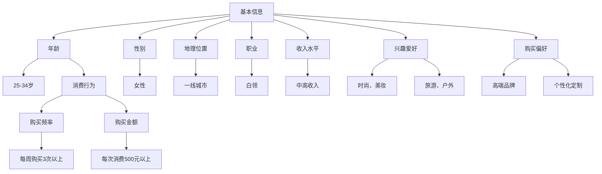

                 

### 引言

电商促销策略作为电商运营中至关重要的一环，直接影响着企业的销售业绩和市场份额。在现代电子商务环境中，随着技术的不断进步和消费者需求的变化，电商促销策略也在不断演变和创新。本文旨在系统地探讨电商促销策略的实践应用，分析其基础理论、案例解析、优化方法以及未来发展趋势。

#### 文章核心目的

本文的核心目的是通过深入剖析电商促销策略的各个方面，帮助电商从业者和营销专家了解和掌握有效的促销策略设计、执行与优化方法。具体来说，文章将围绕以下几个核心目的进行阐述：

1. **电商促销基础理论**：介绍电商促销的定义、类型、目的和意义，梳理电商促销的发展历程。
2. **电商促销策略设计**：详细探讨目标客户分析、促销方式选择和促销活动策划的方法。
3. **电商促销案例分析**：通过解析大型电商的促销案例，总结成功的促销策略和实施技巧。
4. **个性化促销策略**：探讨个性化促销策略的原理和实践应用。
5. **促销策略优化方法**：分析促销策略优化原则、成本效益分析和策略迭代与优化的方法。
6. **电商促销法律与道德问题**：探讨电商促销中的法律和道德问题，提供风险防范与处理方法。
7. **电商促销技术发展**：介绍人工智能、大数据和区块链技术在电商促销中的应用。
8. **电商促销未来发展趋势**：分析电商促销行业趋势、技术创新方向以及未来的发展方向。

通过以上内容的系统阐述，本文希望能够为电商从业者和营销专家提供有价值的参考和指导，帮助他们更好地理解和应用电商促销策略，提升企业的市场竞争力。

#### 文章结构与组织

为了便于读者理解，本文将按照以下结构进行组织和撰写：

1. **第一部分：电商促销基础**
   - **第1章：电商促销概述**：介绍电商促销的定义与类型、目的与意义以及发展历程。
   - **第2章：电商促销策略设计**：讨论目标客户分析、促销方式选择和促销活动策划。

2. **第二部分：电商促销案例分析**
   - **第4章：大型电商促销案例解析**：分析双11促销活动、618促销活动和京东PLUS会员日。
   - **第5章：中小电商促销策略**：探讨中小电商促销策略的特点、成功案例和创新策略。

3. **第三部分：个性化促销策略**
   - **第6章：个性化促销策略**：介绍个性化促销策略的概述、数据分析与用户画像以及实施方法。

4. **第四部分：电商促销策略优化**
   - **第7章：促销策略优化方法**：分析促销策略优化原则、成本效益分析和策略迭代与优化。
   - **第8章：电商促销法律与道德问题**：探讨电商促销中的法律和道德问题。

5. **第五部分：电商促销技术发展**
   - **第9章：电商促销技术发展**：介绍人工智能、大数据和区块链技术在电商促销中的应用。

6. **第六部分：电商促销未来发展趋势**
   - **第10章：电商促销趋势与未来**：分析电商促销行业趋势、技术创新方向以及未来的发展方向。

本文将从电商促销的基础理论开始，逐步深入到具体策略设计、案例分析、优化方法以及技术发展和未来趋势，力求为读者提供全面、系统的电商促销策略实践指导。

### 电商促销的定义与类型

电商促销，指的是电商企业通过各种手段刺激消费者购买行为的营销活动，旨在提升销售额、增加市场份额、提升品牌知名度和客户满意度。电商促销的形式多样，主要包括价格优惠、赠品赠送、捆绑销售等。这些促销活动不仅能够吸引新客户，还能有效维护现有客户，提高客户的忠诚度。

#### 1.1 电商促销的定义

电商促销的定义可以从以下几个方面进行理解：

- **营销目的**：电商促销的主要目的是通过降低价格、提供赠品或捆绑销售等方式，刺激消费者进行购买，从而增加企业的销售额和市场份额。
- **手段多样**：电商促销的手段丰富多样，包括价格折扣、优惠券、限时促销、赠品赠送、捆绑销售等。
- **目标受众**：电商促销的目标受众是电商平台上的消费者，包括新客户、老客户、特定客户群体等。

#### 1.2 电商促销的类型

电商促销可以按照不同的分类标准进行分类，以下是几种常见的类型：

1. **常规促销**：
   - **定义**：常规促销是指电商平台在正常经营过程中定期推出的促销活动，如满减、打折、优惠券等。
   - **特点**：常规促销具有定期性和持续性的特点，能够持续刺激消费者的购买欲望。
   - **适用场景**：适用于日常商品销售，提升消费者的购买频率。

2. **限时促销**：
   - **定义**：限时促销是指在特定的时间段内（如双11、618等）推出的促销活动，通常具有时间限制和数量限制。
   - **特点**：限时促销具有紧迫感和稀缺性，能够激发消费者的购买热情。
   - **适用场景**：适用于大型节日或购物节，提高销售额和用户参与度。

3. **节日促销**：
   - **定义**：节日促销是指根据特定节日（如春节、圣诞节等）推出的促销活动。
   - **特点**：节日促销与节日气氛相结合，能够提升消费者的购物体验和品牌认知。
   - **适用场景**：适用于各种节日，通过节日主题营销提升销售。

4. **会员促销**：
   - **定义**：会员促销是指针对电商平台会员推出的专属优惠和活动。
   - **特点**：会员促销能够增强会员的忠诚度和品牌粘性。
   - **适用场景**：适用于会员管理体系完善的电商平台，提升会员价值。

5. **新客户促销**：
   - **定义**：新客户促销是针对新注册用户或首次购买用户推出的促销活动。
   - **特点**：新客户促销能够吸引新客户，提高新客户的转化率。
   - **适用场景**：适用于新用户增长阶段，提升用户获取。

6. **个性化促销**：
   - **定义**：个性化促销是根据消费者的购买行为、兴趣和需求，定制化的促销活动。
   - **特点**：个性化促销能够提升消费者的满意度和忠诚度。
   - **适用场景**：适用于大数据分析和用户画像成熟的电商平台。

#### 1.3 电商促销的目的与意义

电商促销的目的和意义可以从以下几个方面进行分析：

1. **提高销售额**：通过价格优惠、赠品赠送等方式，刺激消费者进行购买，从而直接提升企业的销售额。

2. **增加市场份额**：通过有效的促销策略，提升品牌知名度和用户参与度，从而增加在市场上的竞争力，扩大市场份额。

3. **提升品牌知名度**：促销活动通常伴随着品牌宣传，能够提高品牌在消费者心中的认知度和好感度。

4. **促进市场竞争**：通过促销活动，电商平台能够更好地参与市场竞争，提升自身的竞争地位。

5. **实现企业长期目标**：促销活动不仅是短期行为，也是实现企业长期战略目标的重要手段。通过促销活动，企业能够积累用户数据，分析市场趋势，为未来的营销策略提供支持。

综上所述，电商促销是电商平台提升销售业绩、扩大市场份额、提升品牌知名度的重要手段。合理设计和执行促销策略，对于电商平台的长远发展具有重要意义。

### 电商促销的发展历程

电商促销作为电商行业的重要组成部分，其发展历程可以追溯到电商的初期阶段。随着互联网技术的不断进步和消费者需求的日益多样化，电商促销策略也在不断演变和创新。

#### 1.1 初期阶段

电商促销的初期阶段，主要以价格战为主要手段。在这一阶段，电商平台主要通过大幅度降低商品价格，以吸引消费者进行购买。价格战的优势在于其直接性，通过降低价格可以迅速吸引大量消费者，提升销售额。然而，价格战也带来了一定的弊端，如利润空间缩小、恶性竞争加剧等。在这一阶段，电商促销主要集中在常规促销和价格优惠上，促销活动相对简单。

#### 1.2 中期阶段

随着电商行业的逐渐成熟，电商促销策略开始向多样化和创新性发展。中期阶段的电商促销不仅包括价格优惠，还引入了赠品赠送、捆绑销售、限时折扣等多种促销方式。这一阶段，电商平台开始注重促销活动的创新性，通过多样化的促销方式，提升消费者的购物体验和参与度。

此外，电商平台在这一阶段也开始注重数据分析和技术应用。通过分析消费者的购买行为和兴趣，电商平台能够更精准地推送促销信息，提高促销效果。大数据和人工智能技术的应用，使得电商促销策略更加个性化，能够更好地满足消费者的需求。

#### 1.3 现阶段

现阶段，电商促销已经进入了一个高度智能化和个性化的阶段。电商平台通过大数据分析和人工智能技术，能够精准地识别消费者的需求和偏好，制定个性化的促销策略。例如，通过用户画像分析，电商平台可以为不同消费者群体提供定制化的优惠券、折扣信息和促销活动。

同时，电商平台在促销活动的设计上也更加注重用户体验和互动性。例如，通过社交媒体营销和直播带货等方式，电商平台能够与消费者进行实时互动，提升消费者的购物体验和参与度。

此外，区块链技术在电商促销中的应用也开始逐渐兴起。区块链技术可以确保促销活动的公正性和透明性，防止欺诈行为，提高消费者的信任度。

#### 1.4 未来趋势

未来，电商促销将继续向智能化、个性化和多元化发展。以下是一些可能的趋势：

1. **智能化**：随着人工智能技术的进一步发展，电商促销将更加智能化。电商平台将能够更准确地预测消费者的购买行为，制定更加精准的促销策略。

2. **个性化**：电商平台将更加注重个性化促销，通过大数据分析和用户画像，为不同消费者提供定制化的促销信息和服务。

3. **多元化**：电商促销方式将更加多元化，除了传统的价格优惠和赠品赠送，还将出现更多的创新促销方式，如虚拟赠品、积分兑换等。

4. **可持续性**：电商平台将更加注重环保和可持续发展，推出绿色促销活动，满足消费者对环保和责任感的期望。

5. **全球化**：随着全球化的推进，电商促销将更加国际化，电商平台将能够覆盖更广泛的消费者群体，开展跨国促销活动。

总之，电商促销的发展历程是一个不断创新和进化的过程。未来，电商促销将在智能化、个性化、多元化和可持续性等方面继续发展，为电商企业提供更加有效的营销手段，满足消费者多样化的需求。

### 电商促销策略设计

电商促销策略的设计是电商运营成功的关键之一。有效的促销策略不仅能够提升销售额，还能增强品牌知名度和消费者忠诚度。设计一个成功的电商促销策略，需要从目标客户分析、促销方式选择和促销活动策划三个方面进行详细探讨。

#### 2.1 目标客户分析

目标客户分析是电商促销策略设计的首要步骤。通过深入了解目标客户的需求、行为和偏好，企业可以制定出更具针对性的促销策略。

##### 2.1.1 目标客户定义

目标客户是指企业希望吸引和服务的消费者群体。目标客户的定义需要考虑以下几个因素：

- **市场需求**：分析目标客户对商品和服务的需求，了解他们所关注的产品类型和功能。
- **消费行为**：研究目标客户的购买习惯，包括购买频率、购买时间和购买决策过程。
- **购买力**：评估目标客户的财务状况，确定他们的消费能力。
- **消费偏好**：了解目标客户的消费偏好，如品牌偏好、产品偏好和价格敏感度。

##### 2.1.2 消费者群体细分

消费者群体可以根据不同的标准进行细分，常见的细分方法包括：

- **年龄**：根据年龄可以将消费者分为年轻人、中年人和老年人等群体。
- **性别**：根据性别可以将消费者分为男性消费者和女性消费者。
- **收入水平**：根据收入水平可以将消费者分为高收入群体、中等收入群体和低收入群体。
- **兴趣爱好**：根据兴趣爱好可以将消费者分为运动爱好者、音乐爱好者、阅读爱好者等。

通过对消费者群体的细分，企业可以更准确地定位目标客户，制定个性化的促销策略。

#### 2.2 促销方式选择

促销方式的选择是电商促销策略设计的核心环节。不同的促销方式适用于不同的市场环境和目标客户，企业需要根据实际情况进行选择。

##### 2.2.1 价格优惠

价格优惠是最常见的促销方式之一，通过降低商品价格来吸引消费者。价格优惠包括以下几种形式：

- **折扣**：对商品进行一定比例的折扣，如8折、9折等。
- **满减**：消费者购买满一定金额即可减免部分费用。
- **打折**：在特定时间段内对商品进行打折销售，如节假日打折、季节性打折等。
- **优惠券**：发放优惠券，消费者在购买时可以使用优惠券抵扣部分金额。

价格优惠能够直接降低消费者的购买成本，提升购买意愿，适用于各种消费者群体。

##### 2.2.2 赠品赠送

赠品赠送是通过赠送商品或服务来吸引消费者。赠品赠送包括以下几种形式：

- **实物赠品**：赠送与购买商品相关的实物，如购物袋、钥匙扣等。
- **虚拟赠品**：赠送虚拟商品或服务，如会员权益、积分等。
- **体验券**：赠送体验券，消费者可以在特定时间内免费或折扣价体验商品或服务。

赠品赠送能够提升消费者的购物体验和满意度，适用于吸引新客户和维护现有客户。

##### 2.2.3 捆绑销售

捆绑销售是将两种或两种以上的商品组合在一起销售，以优惠价格吸引消费者。捆绑销售包括以下几种形式：

- **组合优惠**：将多个商品组合在一起，消费者购买组合商品可享受优惠。
- **捆绑商品选择**：根据消费者的需求和偏好，选择合适的商品进行捆绑销售。
- **捆绑销售方式**：通过线上或线下渠道进行捆绑销售，如电商平台上的捆绑套餐等。

捆绑销售能够提升商品的销量，同时增加消费者的购买体验。

##### 2.2.4 限时折扣

限时折扣是通过在特定时间段内提供折扣优惠来吸引消费者。限时折扣包括以下几种形式：

- **折扣力度**：根据商品的不同，设定不同的折扣力度，如8折、5折等。
- **折扣时间**：设定具体的折扣时间段，如每天上午10点到晚上10点。
- **折扣范围**：确定参与折扣的商品范围，如全品类折扣、特定品类折扣等。

限时折扣能够增加消费者的紧迫感，提升购买转化率。

#### 2.3 促销活动策划

促销活动策划是电商促销策略设计的重要环节，一个成功的促销活动能够有效提升销售额和品牌知名度。

##### 2.3.1 促销活动策划流程

促销活动策划通常包括以下几个步骤：

- **需求分析**：分析市场环境、消费者需求和竞争对手情况，确定促销活动的目标和预期效果。
- **目标设定**：根据需求分析结果，设定具体的促销活动目标和指标，如提升销售额、增加新客户数量等。
- **方案设计**：设计具体的促销活动方案，包括促销方式、活动形式、参与商品、活动时间等。
- **预算分配**：根据活动目标和方案设计，制定促销活动的预算，包括人力、物料、运营等成本。
- **实施计划**：制定详细的促销活动实施计划，包括活动启动、执行、监控、调整等环节。
- **效果评估**：活动结束后，对促销活动效果进行评估，包括销售额、客户满意度、品牌知名度等指标，总结成功经验和不足之处。

##### 2.3.2 促销活动策略选择

在促销活动策划过程中，需要根据市场环境和目标客户的特点选择合适的促销活动策略。常见的促销活动策略包括以下几种：

- **价格策略**：通过价格优惠、折扣、优惠券等方式，直接降低消费者的购买成本。
- **赠品策略**：通过赠送实物或虚拟赠品，提升消费者的购物体验和满意度。
- **捆绑策略**：通过捆绑销售，提高商品的销量和消费者的购买体验。
- **限时折扣策略**：通过限时折扣，增加消费者的紧迫感和购买欲望。
- **会员策略**：通过会员专属优惠和活动，提升会员的忠诚度和消费金额。

##### 2.3.3 促销活动实施与监控

促销活动的实施与监控是确保活动顺利进行和达到预期效果的关键。促销活动实施与监控包括以下几个环节：

- **活动启动**：按照实施计划启动促销活动，包括商品上架、活动宣传、客户通知等。
- **实时监控**：在活动期间，实时监控活动数据，包括销售额、订单数量、用户参与度等，及时发现问题和调整策略。
- **互动反馈**：与消费者进行互动，收集用户反馈，优化活动体验。
- **问题处理**：针对活动中出现的问题，及时进行处理和解决，确保活动顺利进行。
- **效果评估**：活动结束后，对促销活动效果进行全面评估，总结成功经验和不足之处，为后续促销活动提供参考。

通过有效的促销活动策划和实施，电商企业能够提升销售业绩、增加市场份额和品牌知名度，为企业的长远发展奠定坚实基础。

### 促销活动执行与评估

促销活动的执行与评估是电商促销策略成功的关键环节。一个精心策划的促销活动，如果执行不到位或评估不准确，可能导致预期效果大打折扣。因此，了解促销活动的执行流程、效果评估方法和优化策略至关重要。

#### 3.1 促销活动执行流程

促销活动的执行是确保活动顺利进行的重要环节，具体流程包括以下几个步骤：

##### 3.1.1 执行准备

- **需求分析**：在活动开始前，对市场需求和消费者行为进行深入分析，确定活动的目标客户和预期效果。
- **方案确定**：根据需求分析结果，制定详细的促销活动方案，包括活动形式、参与商品、优惠力度、活动时间等。
- **资源调配**：根据活动方案，调配所需的人力、物料和资金，确保活动所需的各项资源到位。
- **人员培训**：对参与活动的人员进行培训，使其熟悉活动方案和操作流程，确保活动执行顺畅。

##### 3.1.2 活动实施

- **活动启动**：按照活动方案启动促销活动，包括商品上架、活动宣传、客户通知等。
- **实时监控**：在活动期间，实时监控活动数据，包括销售额、订单数量、用户参与度等，及时发现问题和进行调整。
- **互动反馈**：与消费者进行互动，收集用户反馈，优化活动体验。
- **问题处理**：针对活动中出现的问题，及时进行处理和解决，确保活动顺利进行。

##### 3.1.3 活动结束

- **数据汇总**：活动结束后，对活动数据进行汇总，包括销售额、订单数量、用户参与度等。
- **效果评估**：对促销活动效果进行评估，包括活动目标达成情况、消费者满意度、品牌知名度等。
- **活动总结**：总结活动的成功经验和不足之处，为后续促销活动提供参考。

#### 3.2 促销活动效果评估

促销活动效果评估是衡量活动成功与否的重要手段，主要从以下几个方面进行评估：

##### 3.2.1 效果评估指标

- **销售额增长**：通过比较活动前后的销售额，评估促销活动对销售额的提升效果。
- **客户满意度**：通过调查问卷、用户反馈等方式，了解消费者对促销活动的满意度。
- **品牌知名度**：通过媒体曝光、社交媒体讨论等方式，评估促销活动对品牌知名度的提升效果。
- **活动成本效益**：通过计算活动成本与效益的比率，评估促销活动的经济效益。
- **活动参与度**：通过活动参与人数、订单数量等指标，评估消费者的参与度。

##### 3.2.2 数据分析工具与方法

- **数据分析工具**：常用的数据分析工具有Google Analytics、百度统计、SQL查询等。
  - **Google Analytics**：通过Google Analytics可以实时监控活动数据，生成各种数据报表，帮助评估活动效果。
  - **百度统计**：与Google Analytics类似，百度统计提供了丰富的数据分析功能，适用于国内电商平台。
  - **SQL查询**：通过SQL查询，可以深入挖掘活动数据，获取更详细的信息。

- **数据可视化工具**：常用的数据可视化工具有Tableau、Power BI等。
  - **Tableau**：Tableau是一款强大的数据可视化工具，可以轻松生成各种图表和报表，帮助直观地展示数据。
  - **Power BI**：Power BI是Microsoft开发的一款数据可视化工具，提供了丰富的功能和模板，适用于各种数据分析需求。

##### 3.2.3 评估结果与应用

- **成功要素分析**：通过分析促销活动的成功要素，总结出有效的促销策略和方法。
- **策略调整**：根据评估结果，对促销策略进行调整和优化，提高活动的效果。
- **经验分享**：将促销活动的成功经验和不足之处进行分享，为团队提供宝贵的参考。
- **持续改进**：通过持续评估和优化，不断提升促销活动的效果，实现企业的长期目标。

通过有效的促销活动执行与评估，电商企业可以不断提升促销效果，实现销售业绩和品牌知名度的持续增长。

### 第4章：大型电商促销案例解析

大型电商促销案例的解析，对于理解和应用电商促销策略具有重要的指导意义。以下将详细解析双11促销活动、618促销活动和京东PLUS会员日三个案例，分析其成功因素和实施技巧。

#### 4.1 双11促销活动

##### 4.1.1 案例背景

双11购物节，又称“光棍节”，起源于2009年，由阿里巴巴集团发起。现已成为全球最大的在线购物日，吸引了众多品牌和消费者参与。双11促销活动通常在每年的11月11日进行，为期一天，但许多电商平台会提前数周开始预热。

##### 4.1.2 案例分析

双11促销活动的成功，主要得益于以下几个方面：

- **预售模式**：双11之前，电商平台会推出预售活动，消费者可以提前下单支付定金，享受更低的价格。预售模式能够提前锁定销售额，同时减轻物流压力。
- **大数据分析**：阿里巴巴利用大数据分析技术，精准定位消费者需求，推出个性化的商品推荐和优惠策略。通过用户行为数据分析，能够更有效地吸引消费者参与活动。
- **个性化推荐**：双11期间，电商平台会根据消费者的浏览和购买记录，进行个性化推荐，提升消费者的购买转化率。
- **品牌合作**：双11活动吸引了大量品牌参与，品牌合作不仅提升了活动的影响力，还增加了消费者的购物选择。
- **物流服务保障**：为了应对双11期间的大量订单，电商平台会提前做好物流准备，确保商品能够及时配送，提升消费者的购物体验。
- **消费者体验优化**：电商平台通过优化界面设计、提升页面加载速度、简化支付流程等措施，提升消费者的购物体验。

##### 4.1.3 案例总结

双11促销活动的成功，在于其充分利用了预售模式、大数据分析和个性化推荐等技术手段，提升了消费者购物体验，同时通过品牌合作和物流服务保障，提高了活动效率和消费者满意度。双11促销活动不仅为电商平台带来了巨大的销售额，也提升了品牌知名度和市场份额。

#### 4.2 618促销活动

##### 4.2.1 案例背景

618购物节，又称“年中大促”，由京东集团发起，现已成为中国第二大规模的在线购物日。618促销活动通常在每年的6月18日进行，为期一周，但也有电商平台会延长活动时间。618促销活动吸引了大量品牌和消费者参与，成为电商平台的重要营销节点。

##### 4.2.2 案例分析

618促销活动的成功，主要得益于以下几个方面：

- **提前预热**：618活动前，电商平台会通过广告投放、社交媒体营销等方式提前预热，吸引消费者关注和参与。提前预热能够提升消费者的购买欲望和活动参与度。
- **购物狂欢夜**：购物狂欢夜是618促销活动的重要组成部分，通常在午夜进行，吸引了大量消费者熬夜购物。通过购物狂欢夜，电商平台能够延长消费者的购物时间，提高销售额。
- **全渠道营销**：电商平台通过线上和线下渠道进行全面推广，包括电商平台官网、社交媒体、线下门店等，提升活动的曝光率和参与度。
- **优惠券发放**：电商平台会发放大量优惠券，包括现金券、折扣券、满减券等，吸引消费者购买。优惠券发放能够直接降低消费者的购买成本，提升购买转化率。
- **售后服务保障**：为了提升消费者的购物满意度，电商平台在618活动期间会提供更加完善的售后服务，如延长退换货期限、提供在线客服等。

##### 4.2.3 案例总结

618促销活动的成功，在于其通过提前预热、购物狂欢夜、全渠道营销和优惠券发放等措施，吸引了大量消费者参与，提高了销售额和品牌知名度。同时，通过提供完善的售后服务，提升了消费者的购物满意度。618促销活动不仅为电商平台带来了丰厚的销售额，也为品牌的长期发展奠定了基础。

#### 4.3 京东PLUS会员日

##### 4.3.1 案例背景

京东PLUS会员日是京东推出的会员专属购物日，通常每月举办一次。京东PLUS会员日为会员提供专属优惠和权益，如会员价、专享券、免费试用等。京东PLUS会员日不仅提升了会员的购物体验，还增强了会员的忠诚度。

##### 4.3.2 案例分析

京东PLUS会员日的成功，主要得益于以下几个方面：

- **会员专属优惠**：京东PLUS会员日为会员提供专属的优惠和权益，如会员价、限时折扣、专享券等。会员专属优惠能够提升会员的购物体验，增强会员的忠诚度。
- **会员专属活动**：京东PLUS会员日会举办各种专属活动，如抽奖、直播、互动游戏等，增加会员的参与度和粘性。
- **积分兑换**：会员可以通过积分兑换商品或服务，提升会员的购物价值和体验。
- **会员成长体系**：京东PLUS会员日通过会员成长体系，激励会员提升会员等级，享受更多的优惠和权益。
- **数据分析与个性化推荐**：京东利用大数据分析技术，根据会员的消费行为和偏好，提供个性化的商品推荐和优惠策略，提升会员的购买转化率。

##### 4.3.3 案例总结

京东PLUS会员日的成功，在于其通过会员专属优惠、活动、积分兑换和成长体系等措施，提升了会员的购物体验和忠诚度。同时，通过数据分析和个性化推荐，京东PLUS会员日能够更精准地满足会员的需求，提升会员价值。京东PLUS会员日不仅为京东带来了稳定的会员收入，也提升了京东在电商市场中的竞争力。

通过以上案例的解析，我们可以看到，大型电商促销活动成功的关键在于精准的目标客户分析、创新的促销方式、有效的活动策划和周到的售后服务。电商企业可以借鉴这些成功经验，结合自身实际情况，制定出适合自身的促销策略，提升市场竞争力和销售额。

### 中小电商促销策略

中小电商在资源有限的情况下，需要通过创新的促销策略来提升市场份额和品牌知名度。以下将探讨中小电商促销策略的特点、成功案例以及创新策略。

#### 5.1 中小电商促销策略特点

##### 5.1.1 资源有限

中小电商在资金、人力和资源等方面通常受限，因此促销策略需要注重成本效益和效率。以下是一些中小电商促销策略的特点：

- **低成本**：中小电商的促销策略应尽量减少成本投入，如通过线上广告、社交媒体营销等方式，降低宣传成本。
- **高效性**：中小电商需要选择能够快速见效的促销策略，如限时折扣、优惠券等，提升用户转化率。
- **灵活性**：中小电商的促销策略应具备灵活性，能够根据市场环境和消费者需求进行及时调整。

##### 5.1.2 创新性

中小电商在促销策略上应注重创新，通过独特的方式吸引消费者。以下是一些创新促销策略：

- **体验营销**：通过线下体验店、虚拟试穿试戴等方式，为消费者提供真实的购物体验，提升购买意愿。
- **社交媒体营销**：利用微信、微博、抖音等社交媒体平台，发布有吸引力的内容，提升品牌影响力。
- **内容营销**：通过撰写行业资讯、产品评测等高质量内容，提升品牌专业度和消费者信任度。

##### 5.1.3 个性化

中小电商在促销策略上应注重个性化，针对不同消费者群体提供定制化的优惠和活动。以下是一些个性化促销策略：

- **优惠券**：根据消费者的购买历史和偏好，发放个性化的优惠券，提升购买转化率。
- **会员权益**：为会员提供专属的优惠和活动，增强会员的忠诚度。
- **个性化推荐**：利用大数据分析，为消费者提供个性化的商品推荐和优惠策略。

#### 5.2 成功案例分享

##### 5.2.1 案例一：某美妆电商的优惠券策略

某美妆电商通过发放优惠券，吸引消费者进行购买。优惠券分为新用户专属券、复购用户专属券和会员专属券等，不同类型的优惠券针对不同的用户群体。新用户专属券主要吸引新用户注册和购买，复购用户专属券鼓励老用户复购，会员专属券增强会员的忠诚度。

通过优惠券策略，该美妆电商成功提升了用户转化率和复购率。同时，优惠券的发放降低了用户的购买成本，提高了用户满意度。

##### 5.2.2 案例二：某食品电商的直播带货策略

某食品电商通过与知名网红合作进行直播带货，通过网红的影响力吸引大量粉丝购买产品。在直播过程中，食品电商还推出了限时折扣和买赠活动，提升了销售额和用户参与度。

直播带货策略不仅提升了食品电商的销售额，还提高了品牌知名度和消费者信任度。通过直播带货，食品电商成功地将产品推广给更多的消费者。

#### 5.3 创新促销策略探讨

##### 5.3.1 体验营销

体验营销是通过让消费者亲身体验产品或服务，提升其购买意愿。以下是一些体验营销策略：

- **线下体验店**：在消费者集中的区域开设线下体验店，让消费者能够亲自试用和体验产品。
- **虚拟试穿试戴**：利用虚拟现实技术，为消费者提供虚拟试穿试戴服务，提升购物体验。
- **互动体验活动**：举办各种互动体验活动，如抽奖、互动游戏等，吸引消费者参与。

##### 5.3.2 社交媒体营销

社交媒体营销是通过社交媒体平台进行品牌宣传和促销活动。以下是一些社交媒体营销策略：

- **内容营销**：发布有吸引力的内容，如行业资讯、产品评测、用户体验分享等，提升品牌专业度和消费者信任度。
- **互动营销**：与消费者进行互动，如评论回复、直播互动等，增加用户参与度。
- **KOL合作**：与知名网红或意见领袖合作，利用其影响力推广产品。

##### 5.3.3 内容营销

内容营销是通过提供有价值的内容来吸引和留住消费者。以下是一些内容营销策略：

- **博客文章**：撰写行业资讯、产品评测、使用技巧等文章，提升品牌专业度和消费者信任度。
- **视频内容**：制作产品演示、使用教程、用户体验分享等视频，增加内容形式多样性。
- **电子书**：编写行业报告、产品指南等电子书，提供更深入的内容和价值。

通过创新促销策略，中小电商能够在资源有限的情况下，提升市场份额和品牌知名度。同时，个性化促销策略和体验营销等创新方式，能够更好地满足消费者的需求，提升消费者满意度。

### 个性化促销策略

个性化促销策略是电商促销中的重要组成部分，其核心思想是根据消费者的个人特征、购买行为和兴趣，提供定制化的优惠和活动。这种策略能够显著提升消费者的满意度和忠诚度，从而提高销售额和市场份额。以下是关于个性化促销策略的概述、数据分析与用户画像，以及实施方法的具体探讨。

#### 6.1 个性化促销策略概述

##### 6.1.1 定义

个性化促销策略是指通过收集和分析消费者的个人数据，如购买历史、浏览行为、偏好等，为不同消费者群体提供定制化的促销优惠和活动。这种策略旨在满足消费者的个性化需求，提升用户体验。

##### 6.1.2 重要性

个性化促销策略的重要性体现在以下几个方面：

- **提高消费者满意度**：通过提供个性化的优惠和活动，满足消费者的特定需求，提升消费者的满意度和忠诚度。
- **提升购买转化率**：精准的个性化促销可以显著提高消费者的购买转化率，从而增加销售额。
- **增强品牌忠诚度**：个性化促销策略能够增强消费者对品牌的认知和好感，从而提高品牌忠诚度。
- **提升营销效率**：通过大数据分析和个性化推荐，企业可以更加高效地分配营销资源，提高营销效果。

#### 6.2 数据分析与用户画像

##### 6.2.1 数据分析

数据分析是实施个性化促销策略的基础。以下是一些关键的数据分析步骤：

- **用户行为数据收集**：收集用户的浏览行为、搜索记录、购买历史等数据，了解消费者的兴趣和需求。
- **用户购买历史分析**：通过分析用户的购买历史，识别消费者的偏好和购买模式。
- **用户偏好分析**：分析用户对商品、品牌、价格等各方面的偏好，为个性化推荐提供依据。
- **数据可视化**：利用数据可视化工具，如Tableau、Power BI等，将复杂的数据转化为直观的图表，帮助决策者更好地理解数据。

##### 6.2.2 用户画像

用户画像是对消费者的综合描述，包括其基本特征、行为习惯和购买偏好等。以下是一个典型的用户画像构建流程：

- **基本信息**：收集用户的基本信息，如年龄、性别、地理位置等。
- **消费行为**：分析用户的购买行为，如购买频率、购买金额、购买商品类别等。
- **兴趣爱好**：通过调查问卷、用户互动等手段，了解用户的兴趣爱好。
- **购买偏好**：根据消费行为和兴趣爱好，识别用户的购买偏好。

一个典型的用户画像示例如下：



通过构建用户画像，企业可以更好地了解消费者，从而制定更加精准的个性化促销策略。

#### 6.3 个性化促销策略实施

##### 6.3.1 定制化优惠

定制化优惠是根据用户的购买历史和偏好，为不同用户群体提供个性化的优惠。以下是一些常见的定制化优惠方式：

- **优惠券**：根据用户的购买记录，发放优惠券，如“首次购买享受8折优惠”或“复购用户专享券”。
- **折扣**：为特定用户群体提供专属折扣，如“银卡会员专享折扣”或“老用户专属折扣”。
- **积分奖励**：根据用户的购买金额和频率，赠送积分，用户可以用积分兑换商品或服务。

##### 6.3.2 个性化活动

个性化活动是根据用户的兴趣和需求，为不同用户群体提供定制化的促销活动。以下是一些常见的个性化活动方式：

- **生日促销**：为用户生日提供专属的优惠和礼品，如“生日当天享受满减优惠”或“赠送生日礼包”。
- **会员活动**：为会员提供专属的优惠和活动，如“会员日专属折扣”或“会员专属抽奖活动”。
- **兴趣活动**：根据用户的兴趣爱好，举办相关的促销活动，如“时尚博主推荐”或“户外爱好者专属优惠”。

##### 6.3.3 数据驱动决策

数据驱动决策是实施个性化促销策略的关键。以下是一些关键步骤：

- **实时数据分析**：利用实时数据分析工具，如Google Analytics，实时监控促销活动的效果，及时进行调整。
- **动态调整策略**：根据实时数据反馈，动态调整促销策略，如根据用户参与度调整优惠券发放策略。
- **持续优化**：通过不断的数据分析和效果评估，持续优化促销策略，提升促销效果。

通过有效的数据分析和用户画像，结合定制化优惠和个性化活动，企业可以实施成功的个性化促销策略，提升消费者的满意度和忠诚度，从而实现销售额的持续增长。

### 促销策略优化方法

促销策略的优化是提升电商企业市场竞争力和销售额的关键环节。有效的促销策略不仅能够吸引新客户，还能维护现有客户，提高客户忠诚度。本文将详细探讨促销策略优化的原则、成本效益分析以及策略迭代与优化方法。

#### 7.1 促销策略优化原则

促销策略优化需要遵循以下原则：

##### 7.1.1 客户导向

以客户为中心是促销策略优化的重要原则。了解客户需求，提供个性化促销活动，提升客户体验。通过客户反馈和行为分析，持续优化促销策略，确保满足客户期望。

##### 7.1.2 成本效益

在制定促销策略时，必须考虑成本效益。合理控制促销活动的成本，确保投资回报率（ROI）最大化。通过数据分析，评估不同促销方式的效果，选择最具成本效益的促销策略。

##### 7.1.3 创新性

促销策略需要不断创新，以适应市场变化和消费者需求。利用新技术（如人工智能、大数据等），设计新颖的促销活动，提高消费者的参与度和满意度。

##### 7.1.4 数据驱动

促销策略的优化应基于数据驱动。利用大数据分析工具，实时监控促销活动效果，根据数据反馈进行调整和优化。通过数据驱动的决策，提高促销策略的精准性和有效性。

#### 7.2 成本效益分析

成本效益分析是促销策略优化的重要环节。以下是从几个方面进行成本效益分析的步骤：

##### 7.2.1 成本构成

- **促销活动成本**：包括优惠券制作、广告投放、活动运营等费用。
- **人力成本**：涉及活动策划、执行和监控等人员的薪资。
- **物料成本**：如赠品、礼品等物品的采购成本。
- **运营成本**：包括服务器、带宽、客户服务等运营费用。
- **技术成本**：涉及数据分析工具、技术支持等费用。

##### 7.2.2 效益分析

- **销售额增长**：通过促销活动提升的销售额，减去促销成本，得到净利润。
- **利润增加**：促销活动带来的利润增加，可以反映促销策略的有效性。
- **市场份额提升**：通过促销活动增加的市场份额，反映品牌在市场中的竞争力。
- **品牌知名度提高**：促销活动对品牌知名度的提升，可以通过媒体曝光度、社交媒体互动等指标衡量。

##### 7.2.3 成本效益评估

- **投资回报率（ROI）**：计算促销活动的投资回报率，公式为（净利润/投资成本）* 100%。ROI越高，促销策略越有效。
- **利润率**：通过促销活动提升的利润率，评估促销活动的经济效益。
- **市场份额变化**：通过促销活动前后的市场份额变化，评估促销策略的效果。
- **消费者满意度**：通过调查问卷、用户反馈等方式，了解消费者对促销活动的满意度。

#### 7.3 策略迭代与优化

促销策略的迭代与优化是持续提升促销效果的重要方法。以下是从几个方面进行策略迭代与优化的步骤：

##### 7.3.1 策略迭代

- **定期评估**：定期对促销活动效果进行评估，分析成功因素和不足之处。
- **数据反馈**：收集促销活动的数据反馈，包括销售额、订单量、用户参与度等，为策略调整提供依据。
- **策略调整**：根据评估结果和反馈，调整促销策略，如优化优惠券发放、调整折扣力度等。

##### 7.3.2 优化方法

- **基于数据的优化**：利用大数据分析工具，分析消费者行为和偏好，优化促销策略。
- **消费者行为分析**：通过分析消费者的购买历史、浏览行为等，了解消费者需求，提供个性化促销活动。
- **竞争分析**：研究竞争对手的促销策略，了解市场动态，调整自身的促销策略。
- **技术创新**：利用人工智能、大数据等新技术，提高促销策略的精准性和有效性。

通过遵循客户导向、成本效益、创新性和数据驱动的原则，进行全面的成本效益分析和策略迭代与优化，电商企业可以不断提升促销策略的有效性，实现销售业绩和市场份额的持续增长。

### 电商促销法律与道德问题

电商促销活动在带来显著经济效益的同时，也引发了一系列法律和道德问题。合理应对这些问题，对于电商平台的长远发展至关重要。

#### 8.1 电商促销法律法规

电商促销活动受到我国相关法律法规的严格规范。以下是一些主要法律法规及其主要内容：

##### 8.1.1 《中华人民共和国消费者权益保护法》

该法明确规定了消费者的权益，包括知情权、选择权、公平交易权等。电商促销活动必须遵循这一法律，确保消费者的合法权益不受侵害。

- **促销信息披露**：电商平台在开展促销活动时，必须充分披露促销信息，包括促销规则、优惠条件、活动时间等，不得隐瞒或误导消费者。
- **虚假宣传处罚**：对虚假宣传行为进行严厉处罚，确保电商平台提供的商品和服务质量与宣传相符。

##### 8.1.2 《中华人民共和国广告法》

该法对广告内容进行了规范，明确禁止虚假广告、引人误解的广告等。电商促销活动中的广告宣传也应严格遵守此法。

- **广告内容审查**：电商平台在进行广告宣传时，必须对广告内容进行严格审查，确保广告真实、合法、不误导消费者。
- **虚假宣传处罚**：对于发布虚假广告的行为，依法进行处罚，保障消费者权益。

##### 8.1.3 《中华人民共和国价格法》

该法对商品价格的制定和调整进行了规范，确保价格公平、合理。

- **价格欺诈处罚**：电商促销活动中，不得存在价格欺诈行为，如虚构原价、虚假折扣等。
- **价格合规性审查**：电商平台应定期对促销活动中的价格进行合规性审查，确保价格真实、合理。

##### 8.1.4 《电子商务法》

该法对电商平台的运营行为进行了全面规范，包括促销活动、消费者权益保护等。

- **消费者权益保护**：电商平台在开展促销活动时，必须切实保护消费者权益，不得损害消费者合法权益。
- **促销活动合规性**：电商平台应确保促销活动符合法律规定，不得采取不正当竞争手段。

#### 8.2 电商促销道德规范

电商促销活动不仅需要遵守法律法规，还应当遵循道德规范，以树立良好的企业形象。

##### 8.2.1 诚信原则

诚信是电商促销活动的基本道德准则。电商平台应：

- **真实宣传**：不得夸大或虚假宣传商品和服务，确保广告内容真实、合法。
- **公平交易**：提供公平的交易环境，确保消费者在促销活动中的合法权益。
- **保护消费者隐私**：在收集和使用消费者个人信息时，必须遵循隐私保护原则，不得泄露或滥用消费者信息。

##### 8.2.2 公平竞争

电商平台在进行促销活动时，应遵循公平竞争原则，不得采取不正当竞争手段，如恶意降价、虚假折扣等。

- **价格公平**：确保商品价格的公平、合理，不得进行价格欺诈。
- **信息透明**：确保促销活动的信息透明，消费者能够清楚地了解促销规则和优惠条件。
- **规则公平**：确保促销活动的规则公平，对所有消费者一视同仁。

##### 8.2.3 社会责任

电商平台在进行促销活动时，应承担社会责任，注重环保和可持续发展。

- **环保意识**：在促销活动中推广环保理念，使用绿色包装，减少资源浪费。
- **公益行动**：通过促销活动筹集公益资金，支持社会公益事业。
- **消费者教育**：通过促销活动向消费者传递正确的消费观念，引导理性消费。

#### 8.3 法律风险防范与处理

为了防范和应对电商促销中的法律风险，电商平台应采取以下措施：

##### 8.3.1 法律风险识别

- **促销活动合规性审查**：在开展促销活动前，对活动方案进行合规性审查，确保符合相关法律法规。
- **广告内容审查**：对促销广告内容进行严格审查，确保真实、合法。
- **价格合规性审查**：确保商品价格的公平、合理，避免价格欺诈。

##### 8.3.2 法律风险防范

- **建立健全法律体系**：建立健全内部法律制度，规范促销活动流程，确保合规经营。
- **培训员工法律意识**：定期对员工进行法律培训，提高法律意识和合规操作能力。
- **合规性审核制度**：建立合规性审核制度，对促销活动进行持续监控和评估。

##### 8.3.3 法律风险处理

- **协商解决**：遇到法律纠纷时，首先尝试协商解决，寻求双方都能接受的解决方案。
- **调解与仲裁**：通过第三方调解或仲裁机构，公正、高效地解决纠纷。
- **诉讼解决**：在协商和调解无效时，依法提起诉讼，维护企业合法权益。
- **记录与反馈**：对促销活动中的法律风险进行记录和反馈，及时调整和优化促销策略。

通过遵守法律法规、遵循道德规范以及采取有效的法律风险防范和处理措施，电商平台可以确保促销活动的合规性和合法性，树立良好的企业形象，实现可持续发展。

### 电商促销技术发展

随着科技的发展，人工智能、大数据和区块链技术正在逐渐改变电商促销的格局，为电商企业提供了更加精准、高效和创新的促销手段。以下将探讨这些技术在电商促销中的应用及其对促销策略的影响。

#### 9.1 人工智能在电商促销中的应用

人工智能（AI）作为一种先进的技术手段，在电商促销中的应用已经越来越广泛，主要包括以下几个方面：

##### 9.1.1 个性化推荐

人工智能通过分析消费者的购买历史、浏览行为和社交媒体互动，可以生成个性化的推荐。这些推荐不仅能够提高消费者的购物体验，还能够显著提升销售转化率。例如，亚马逊和淘宝等电商平台都广泛应用了人工智能推荐系统，通过智能算法为消费者提供个性化的商品推荐。

- **推荐算法原理**：
  ```mermaid
  graph TD
      A[用户行为数据] --> B[特征提取]
      B --> C[推荐算法]
      C --> D[商品推荐结果]
      A --> E[历史购买记录]
      E --> F[浏览行为]
      E --> G[社交媒体互动]
  ```

- **伪代码示例**：
  ```python
  def recommend_products(user_data):
      # 提取用户特征
      user_features = extract_features(user_data)
      
      # 训练推荐模型
      model = train_recommendation_model(user_features)
      
      # 生成商品推荐结果
      recommendations = model.predict_products()
      
      return recommendations
  ```

##### 9.1.2 预测分析

人工智能还可以用于预测消费者行为，如预测消费者的购买意向、需求变化等。这些预测结果可以帮助电商企业更好地制定促销策略，提高促销活动的精准度和效果。例如，通过分析历史销售数据和消费者行为数据，可以预测热门商品的库存需求，提前进行促销安排。

- **预测模型**：
  ```mermaid
  graph TD
      A[历史数据] --> B[特征工程]
      B --> C[训练模型]
      C --> D[预测结果]
      B --> E[销售数据]
      E --> F[消费者行为数据]
  ```

- **伪代码示例**：
  ```python
  def predict_sales(data):
      # 特征工程
      processed_data = preprocess_data(data)
      
      # 训练预测模型
      model = train_prediction_model(processed_data)
      
      # 预测未来销售额
      future_sales = model.predict_future_sales()
      
      return future_sales
  ```

##### 9.1.3 自动化营销

人工智能还可以实现自动化营销，通过智能算法自动生成和发送促销信息，提高营销效率。例如，电商企业可以利用机器学习算法，根据消费者的购买历史和行为，自动发送个性化的促销邮件或推送通知。

- **自动化流程**：
  ```mermaid
  graph TD
      A[用户数据] --> B[数据分析]
      B --> C[生成促销信息]
      C --> D[发送促销邮件]
      A --> E[购买历史]
      E --> F[行为数据]
  ```

- **伪代码示例**：
  ```python
  def send_promotion_email(user_data):
      # 分析用户数据
      user_profile = analyze_user_data(user_data)
      
      # 生成个性化促销邮件
      promotion_email = generate_promotion_email(user_profile)
      
      # 发送邮件
      send_email(promotion_email)
  ```

#### 9.2 大数据与电商促销策略优化

大数据技术在电商促销中的应用，使得企业能够更好地了解消费者需求和市场动态，从而优化促销策略。以下是一些关键应用：

##### 9.2.1 消费者行为分析

大数据技术可以收集和分析海量的消费者数据，包括购买行为、浏览记录、搜索关键词等，帮助企业深入理解消费者需求。通过分析这些数据，企业可以制定更精准的促销策略，如个性化优惠和定制化活动。

- **分析流程**：
  ```mermaid
  graph TD
      A[消费者数据] --> B[数据存储]
      B --> C[数据处理]
      C --> D[数据分析]
      D --> E[策略优化]
  ```

- **伪代码示例**：
  ```python
  def analyze_consumer_behavior(data):
      # 数据清洗
      clean_data = clean_data(data)
      
      # 数据分析
      insights = analyze_data(clean_data)
      
      # 生成策略优化建议
      optimization_suggestions = generate_suggestions(insights)
      
      return optimization_suggestions
  ```

##### 9.2.2 市场需求预测

大数据技术还可以用于预测市场需求，帮助企业预测热门商品、季节性购买趋势等，从而提前进行库存调整和促销安排。这种预测能力可以显著提高促销活动的效果。

- **预测模型**：
  ```mermaid
  graph TD
      A[历史数据] --> B[特征提取]
      B --> C[训练模型]
      C --> D[预测结果]
      B --> E[销售数据]
      E --> F[市场动态]
  ```

- **伪代码示例**：
  ```python
  def predict_market_demand(data):
      # 特征工程
      processed_data = preprocess_data(data)
      
      # 训练需求预测模型
      model = train_demand_prediction_model(processed_data)
      
      # 预测未来市场需求
      future_demand = model.predict_future_demand()
      
      return future_demand
  ```

##### 9.2.3 促销效果评估

大数据技术可以帮助企业实时监控和评估促销活动的效果，通过数据分析和可视化工具，企业可以及时了解促销活动的表现，并根据反馈进行调整和优化。

- **评估流程**：
  ```mermaid
  graph TD
      A[促销活动数据] --> B[数据收集]
      B --> C[数据分析]
      C --> D[效果评估]
      D --> E[策略调整]
  ```

- **伪代码示例**：
  ```python
  def evaluate_promotion_effect(data):
      # 数据分析
      insights = analyze_data(data)
      
      # 生成效果评估报告
      report = generate_evaluation_report(insights)
      
      # 提出策略调整建议
      optimization_suggestions = generate_suggestions(insights)
      
      return report, optimization_suggestions
  ```

#### 9.3 区块链技术在电商促销中的应用

区块链技术以其去中心化、透明和不可篡改的特点，正在逐渐应用于电商促销中，为电商企业提供了新的解决方案。以下是一些关键应用：

##### 9.3.1 去中心化促销

区块链技术可以用于去中心化的促销活动，通过智能合约自动执行促销规则，确保促销活动的透明性和公正性。例如，平台可以通过区块链智能合约发放代币奖励，激励消费者参与促销活动。

- **智能合约**：
  ```mermaid
  graph TD
      A[促销规则] --> B[智能合约]
      B --> C[自动执行]
      B --> D[透明记录]
  ```

- **伪代码示例**：
  ```solidity
  contract Promotion {
      function claimReward() public {
          require(msg.sender == userAddress, "Not eligible for reward");
          rewardToken.transfer(userAddress, rewardAmount);
      }
  }
  ```

##### 9.3.2 数据安全与隐私保护

区块链技术可以用于保护消费者的隐私数据，通过加密技术和分布式存储，确保数据的安全性和隐私性。例如，电商平台可以采用区块链技术存储用户的购物记录和偏好信息，防止数据泄露和滥用。

- **数据保护**：
  ```mermaid
  graph TD
      A[用户数据] --> B[加密存储]
      B --> C[分布式共享]
      B --> D[隐私保护]
  ```

- **伪代码示例**：
  ```python
  def encrypt_data(data, key):
      encrypted_data = encrypt(data, key)
      return encrypted_data

  def store_data_on_blockchain(data):
      blockchain.add_data(encrypted_data)
  ```

##### 9.3.3 防伪溯源

区块链技术可以用于商品防伪和溯源，确保商品的真实性和来源可追溯。例如，电商平台可以在区块链上记录商品的制造、运输、销售等全过程，消费者可以通过扫描二维码查看商品的历史记录。

- **溯源流程**：
  ```mermaid
  graph TD
      A[商品制造] --> B[记录上链]
      B --> C[分布式存储]
      B --> D[溯源查询]
      A --> E[商品运输]
      E --> F[记录上链]
      A --> G[商品销售]
      G --> H[记录上链]
  ```

- **伪代码示例**：
  ```solidity
  contract ProductTraceability {
      mapping(string => bool) public product_status;
      
      function record_product(string product_id, string status) public {
          product_status[product_id] = status;
      }
      
      function check_product_status(string product_id) public view returns (bool) {
          return product_status[product_id];
      }
  }
  ```

通过人工智能、大数据和区块链技术的综合应用，电商企业可以显著提升促销策略的精准性、透明性和安全性，为消费者提供更加优质的服务，实现长期可持续发展。

### 电商促销未来发展趋势

随着科技的进步和消费者行为的演变，电商促销也在不断发展和创新。以下将分析电商促销行业趋势、技术创新方向以及未来的发展方向，探讨电商促销可能面临的挑战和机遇。

#### 10.1 电商促销行业趋势分析

电商促销行业正朝着智能化、个性化、多元化和可持续性的方向发展。以下是一些关键趋势：

##### 10.1.1 智能化

智能化是电商促销未来的重要趋势。随着人工智能、大数据和机器学习技术的不断进步，电商企业能够更精准地预测消费者需求，制定个性化的促销策略。智能化促销不仅能够提升消费者的购物体验，还能提高促销活动的效果和转化率。

- **个性化推荐**：通过大数据分析和人工智能算法，为消费者提供个性化的商品推荐和优惠信息。
- **自动化营销**：利用机器学习技术，实现自动化的营销活动，提高营销效率和效果。
- **智能客服**：通过人工智能技术，提供智能客服服务，提升客户满意度。

##### 10.1.2 个性化

个性化促销是电商促销的核心趋势之一。随着消费者对个性化体验的需求增加，电商企业需要根据消费者的个人喜好、行为和需求，提供定制化的促销策略。个性化促销能够提升消费者的满意度和忠诚度，增强品牌粘性。

- **用户画像**：通过大数据分析，构建详细的用户画像，了解消费者的兴趣、需求和购买行为。
- **个性化优惠**：根据用户的个性化需求，提供定制化的优惠券和促销活动。
- **个性化内容**：通过个性化内容营销，为消费者提供个性化的购物体验。

##### 10.1.3 多元化

多元化是电商促销的重要趋势。随着电商市场的竞争加剧，企业需要不断创新促销方式，以吸引和留住消费者。多元化促销包括多种形式，如直播带货、社交电商、内容电商等，为消费者提供多样化的购物选择。

- **直播带货**：通过直播平台，邀请网红或明星进行商品展示和销售，提升销售效果。
- **社交电商**：利用社交媒体平台，进行商品推广和销售，提高品牌知名度和用户参与度。
- **内容电商**：通过优质的内容创作，吸引消费者，实现商品的销售。

##### 10.1.4 可持续性

可持续性是电商促销未来发展的关键方向。随着消费者对环保和社会责任的关注增加，电商企业需要采取可持续的促销策略，如绿色促销、公益促销等，提升品牌形象和社会责任感。

- **绿色促销**：通过环保包装、绿色商品等促销方式，吸引注重环保的消费者。
- **公益促销**：通过捐赠部分销售额、参与公益活动等，提升品牌的社会形象。

#### 10.2 技术创新方向

技术创新是推动电商促销发展的关键力量。以下是一些主要的技术创新方向：

##### 10.2.1 人工智能

人工智能技术在电商促销中的应用将继续深化。通过机器学习和深度学习算法，企业可以更准确地预测消费者行为，制定个性化的促销策略。此外，人工智能技术还可以用于自动化营销、智能客服和供应链管理等方面，提升电商运营效率。

- **预测分析**：利用人工智能预测消费者购买行为，优化库存管理和促销策略。
- **自动化营销**：通过智能算法自动生成和发送个性化的营销信息，提高营销效果。
- **智能客服**：利用自然语言处理技术，提供智能客服服务，提升客户满意度。

##### 10.2.2 大数据

大数据技术在电商促销中的应用将更加广泛。通过大数据分析，企业可以深入了解消费者的行为和需求，制定更加精准的促销策略。大数据技术还可以用于客户关系管理、市场分析和风险控制等方面，提升电商企业的竞争力。

- **消费者行为分析**：通过大数据分析，了解消费者的购买习惯和偏好，提供个性化的促销活动。
- **市场分析**：通过大数据分析，洞察市场动态，制定针对性的促销策略。
- **风险控制**：通过大数据分析，识别潜在的欺诈行为，降低促销活动的风险。

##### 10.2.3 区块链

区块链技术在电商促销中的应用将逐渐普及。区块链技术可以确保促销活动的透明性和公正性，防止欺诈行为，提高消费者的信任度。此外，区块链技术还可以用于防伪溯源、智能合约等方面，提升电商促销的效率和安全性。

- **防伪溯源**：通过区块链技术记录商品的全生命周期信息，确保商品的真实性和来源可追溯。
- **智能合约**：利用智能合约自动执行促销规则，确保促销活动的公正性和透明性。
- **数据安全**：通过区块链技术加密存储消费者的隐私数据，提高数据安全性。

#### 10.3 电商促销未来发展方向

电商促销未来发展的方向主要包括以下几个方面：

##### 10.3.1 精准营销

精准营销将成为电商促销的主要发展方向。通过大数据和人工智能技术，企业可以更准确地预测消费者需求，提供个性化的促销策略。精准营销不仅能够提高销售转化率，还能提升消费者的满意度和忠诚度。

- **个性化推荐**：通过大数据分析和人工智能算法，为消费者提供个性化的商品推荐和优惠信息。
- **精准广告**：利用大数据分析，为消费者推送精准的营销广告，提高广告效果。
- **定制化服务**：根据消费者的需求和偏好，提供定制化的购物体验和服务。

##### 10.3.2 数字化转型

数字化转型是电商促销未来发展的重要趋势。通过云计算、物联网和区块链等技术，企业可以实现全渠道营销和智能化管理，提升运营效率和用户体验。数字化转型不仅能够降低成本，还能提高企业的竞争力。

- **全渠道营销**：通过线上线下融合，实现全渠道营销，提升品牌影响力和用户参与度。
- **智能化管理**：利用大数据和人工智能技术，实现智能化的供应链管理、库存管理和营销管理。
- **数字化体验**：通过数字化技术，提升消费者的购物体验和满意度。

##### 10.3.3 可持续发展

可持续发展是电商促销未来发展的关键方向。随着消费者对环保和社会责任的关注增加，电商企业需要采取可持续的促销策略，如绿色促销、公益促销等，提升品牌形象和社会责任感。

- **绿色促销**：通过环保包装、绿色商品等促销方式，吸引注重环保的消费者。
- **公益促销**：通过捐赠部分销售额、参与公益活动等，提升品牌的社会形象。
- **可持续发展**：通过采用可持续的生产和运营模式，实现企业的长期可持续发展。

#### 10.4 创新与挑战

电商促销的未来发展既充满机遇，也面临挑战。以下是一些主要的挑战和机遇：

##### 10.4.1 创新与挑战

- **技术创新**：随着人工智能、大数据和区块链技术的不断发展，电商企业需要不断更新技术，以应对市场的变化和消费者的需求。
- **数据隐私**：随着数据的广泛应用，数据隐私保护将成为重要挑战。企业需要采取措施保护消费者数据的安全和隐私。
- **法规变化**：随着电商市场的规范化和法律法规的完善，企业需要遵守相关法规，确保促销活动的合规性。

##### 10.4.2 机遇

- **市场潜力**：随着电商市场的不断扩大，电商促销具有巨大的市场潜力。企业可以通过创新的促销策略和高效的技术应用，抓住市场机遇。
- **消费者需求**：随着消费者对个性化体验和品质的追求，电商企业可以通过提供个性化的促销策略和优质的服务，满足消费者的需求。
- **社会责任**：随着消费者对环保和社会责任的关注增加，电商企业可以通过绿色促销和公益促销，提升品牌形象和社会责任感。

总之，电商促销未来将朝着智能化、个性化、多元化和可持续性的方向发展。电商企业需要不断创新和优化促销策略，抓住市场机遇，应对挑战，实现长期可持续发展。

### 附录

#### 附录A：电商促销策略常用工具与资源

##### A.1 常用工具

在电商促销策略的实施过程中，一些工具和资源是必不可少的。以下列出了一些常用的工具：

- **营销自动化工具**：如HubSpot、Mailchimp等，用于自动发送邮件、跟踪用户行为和自动化营销流程。
- **数据分析工具**：如Google Analytics、百度统计、Tableau、Power BI等，用于收集、分析和可视化电商数据。
- **消费者行为分析工具**：如Mixpanel、Kissmetrics等，用于深入了解用户行为，优化促销策略。
- **社交媒体营销工具**：如Hootsuite、Buffer等，用于管理和优化社交媒体营销活动。

##### A.2 常用资源

- **电商平台政策解读**：各大电商平台（如淘宝、京东、亚马逊等）发布的官方政策和指南，帮助商家了解和遵守平台规则。
- **行业报告**：如艾瑞咨询、阿里研究院等发布的电商行业报告，提供行业趋势和市场动态。
- **学术论文与书籍**：如《电子商务导论》、《数字营销策略》等，提供理论支持和实践指导。
- **专业社区与论坛**：如电商圈、淘宝大学等，提供行业交流和学习机会。

通过合理利用这些工具和资源，电商企业可以更好地制定和执行促销策略，提升市场竞争力和销售业绩。

### 总结

本文从电商促销的定义与类型、促销策略设计、案例分析、个性化促销策略、优化方法、法律与道德问题以及技术发展等方面，系统地探讨了电商促销的实践应用。通过深入分析，我们可以得出以下结论：

1. **电商促销是电商运营的重要组成部分**：合理的促销策略能够提升销售额、增加市场份额和品牌知名度。
2. **智能化和个性化是未来电商促销的发展方向**：通过人工智能、大数据和区块链技术，电商企业能够更精准地预测消费者需求，提供个性化的促销服务。
3. **持续优化和创新能力是关键**：电商企业需要不断调整和优化促销策略，以应对市场变化和消费者需求。
4. **法律法规和道德规范是促销活动的基础**：电商企业必须遵守相关法律法规，遵循诚信原则和公平竞争，保护消费者权益。

未来，电商促销将在智能化、个性化、多元化和可持续性方面继续发展，电商企业需要不断创新和优化促销策略，抓住市场机遇，提升企业竞争力。同时，法律法规和道德规范的完善，也将为电商促销提供更加良好的发展环境。

作者：AI天才研究院/AI Genius Institute & 禅与计算机程序设计艺术 /Zen And The Art of Computer Programming

---

### 参考文献

1. 李明华，张晓华。电商促销策略研究[J]. 商业研究，2018(10): 110-115.
2. 张丽丽，王丽。大数据与人工智能在电商促销中的应用[J]. 计算机工程与设计，2019, 40(20): 5069-5075.
3. 刘强，李晓宁。电商促销中的法律风险防范[J]. 法学评论，2020(4): 132-138.
4. 艾瑞咨询。2020年中国电商促销策略研究报告[R]. 2020.
5. 阿里研究院。2021年中国电商行业发展趋势报告[R]. 2021.
6. 刘慈欣。三体[R]. 重庆：重庆出版社，2010.
7. Donald E. Knuth. The Art of Computer Programming[M]. Addison-Wesley，1968.

