                 

# 《电商领域的AI驱动预测分析：一人公司的决策支持系统》

## 关键词：
- 电商AI预测
- 决策支持系统
- 数据驱动决策
- 需求预测
- 库存预测
- 订单预测
- 风险管理

### 摘要：
本文将深入探讨电商领域的AI驱动预测分析，如何构建一人公司的决策支持系统。我们将从电商行业现状与挑战出发，介绍AI在电商领域的应用价值，并详细讲解AI预测的基本概念和模型。随后，通过实战案例分析，逐步展开订单预测、库存预测和需求预测的详细分析和实现。最后，我们将探讨基于AI的决策支持系统，包括数据驱动决策和风险管理，以及电商AI的未来趋势。本文旨在为电商从业者提供一套完整的AI驱动预测分析框架，助力提升业务决策的准确性和效率。

### 目录大纲

# 《电商领域的AI驱动预测分析：一人公司的决策支持系统》

## 第一部分：电商AI预测概述

### 第1章：电商领域与AI预测

#### 1.1 电商行业现状与挑战

#### 1.2 AI在电商领域的应用价值

#### 1.3 AI预测的基本概念

### 第2章：AI预测模型基础

#### 2.1 数据收集与预处理

#### 2.2 常用预测模型介绍

#### 2.3 模型评估与优化

## 第二部分：电商预测实战

### 第3章：订单预测分析

#### 3.1 订单预测模型设计

#### 3.2 实际订单数据分析

#### 3.3 订单预测项目实战

### 第4章：库存预测分析

#### 4.1 库存预测模型设计

#### 4.2 库存数据分析

#### 4.3 库存预测项目实战

### 第5章：需求预测分析

#### 5.1 需求预测模型设计

#### 5.2 需求数据分析

#### 5.3 需求预测项目实战

## 第三部分：决策支持系统

### 第6章：数据驱动决策

#### 6.1 决策支持系统概述

#### 6.2 数据分析工具介绍

#### 6.3 数据分析实战

### 第7章：基于AI的决策支持

#### 7.1 AI在决策支持中的应用

#### 7.2 实战案例分析

#### 7.3 决策支持系统设计

### 第8章：AI驱动的风险管理

#### 8.1 风险评估模型设计

#### 8.2 实际案例分析

#### 8.3 风险管理实战

### 第9章：AI在电商客服中的应用

#### 9.1 客服AI概述

#### 9.2 客服数据分析

#### 9.3 客服AI项目实战

### 第10章：电商AI的未来趋势

#### 10.1 AI技术在电商领域的未来发展

#### 10.2 电商AI的挑战与机遇

#### 10.3 AI驱动的电商创新实践

## 附录

### 附录A：电商AI预测工具和资源

#### A.1 数据处理工具

#### A.2 机器学习框架

#### A.3 电商平台资源链接

### 附录B：参考文献

#### B.1 电商领域相关研究论文

#### B.2 AI预测相关书籍推荐

#### B.3 实战案例分析集锦

### <a name="一、电商领域与AI预测"></a>一、电商领域与AI预测

随着互联网的普及和消费者购物习惯的转变，电商行业迎来了前所未有的发展机遇。然而，伴随着市场环境的复杂多变和消费者需求的不断升级，电商企业也面临着前所未有的挑战。在这个背景下，人工智能（AI）技术以其强大的数据处理和预测能力，逐渐成为电商领域的一股重要力量。

### 1.1 电商行业现状与挑战

#### 市场规模不断扩大

近年来，全球电商市场规模持续扩大。根据Statista的数据，2021年全球电商市场规模已达到4.89万亿美元，预计到2025年将达到6.38万亿美元。电商行业已成为全球经济增长的重要驱动力。

#### 消费者需求多样化

随着互联网的普及，消费者对电商的需求越来越多样化。从商品种类、品牌选择到购物体验、物流配送，消费者对电商企业提出了更高的要求。

#### 竞争激烈

电商行业的竞争日趋激烈。各大电商平台纷纷通过价格战、促销活动、用户粘性等方式争夺市场份额。如何在激烈的市场竞争中脱颖而出，成为电商企业需要面对的重要挑战。

#### 数据量庞大

电商企业每天产生大量的交易数据、用户行为数据、物流数据等，这些数据不仅庞杂，而且具有时效性。如何有效地收集、处理和分析这些数据，为决策提供有力支持，是电商企业需要解决的难题。

### 1.2 AI在电商领域的应用价值

#### 预测分析

AI技术可以通过大数据分析和机器学习算法，对电商业务中的订单、库存、需求等进行预测分析。从而帮助电商企业提前预判市场变化，优化供应链管理，降低运营成本。

#### 客户体验优化

AI技术可以帮助电商企业实现个性化推荐、智能客服等功能，提升用户购物体验。通过分析用户行为数据，AI系统可以精准推荐用户可能感兴趣的商品，提高购买转化率。

#### 风险管理

AI技术可以帮助电商企业识别潜在风险，如交易欺诈、库存过剩或不足等。通过实时监控和分析数据，AI系统可以及时预警，降低风险损失。

#### 智能营销

AI技术可以分析用户行为数据，帮助企业制定更加精准的营销策略。通过个性化广告投放、精准营销活动等方式，提高营销效果，提升销售额。

### 1.3 AI预测的基本概念

#### 数据收集与预处理

AI预测的基础是数据的收集和预处理。电商企业需要收集包括订单、库存、用户行为等在内的各类数据，并对其进行清洗、归一化等处理，以消除噪声和异常值，提高数据的可用性。

#### 预测模型选择

根据业务需求和数据特性，选择合适的预测模型。常见的预测模型包括线性回归、决策树、神经网络等。电商企业可以根据实际业务场景，尝试不同的模型，以找到最优的预测效果。

#### 模型训练与评估

使用历史数据对预测模型进行训练，并通过交叉验证等方法评估模型性能。电商企业需要不断调整模型参数，优化模型效果，以提高预测的准确性。

#### 预测结果应用

将训练好的预测模型应用于实际业务场景，如订单预测、库存预测等。电商企业可以根据预测结果，调整供应链、库存管理等策略，降低运营成本，提高业务效率。

### 总结

电商领域的AI预测分析为电商企业提供了强大的决策支持。通过预测分析，电商企业可以更好地应对市场变化，优化业务运营，提高竞争力。在本文后续章节中，我们将详细探讨电商预测分析的具体实现方法和实战案例，帮助电商从业者深入理解AI预测技术的应用价值。

## <a name="二、AI预测模型基础"></a>二、AI预测模型基础

为了深入探讨电商领域的AI预测分析，我们需要了解AI预测模型的基础，包括数据收集与预处理、常用预测模型介绍以及模型评估与优化方法。这些基础知识是构建有效预测系统的重要基石。

### 2.1 数据收集与预处理

#### 数据收集

电商预测分析的第一步是数据收集。数据来源包括电商平台内部的交易数据、用户行为数据、物流数据等，以及外部数据如市场趋势、竞争对手数据等。这些数据对于构建预测模型至关重要。

- **交易数据**：包括订单数量、订单金额、订单日期、商品种类等。
- **用户行为数据**：如浏览记录、购物车行为、购买历史等。
- **物流数据**：包括配送时间、配送状态、配送费用等。

#### 数据预处理

数据预处理是确保数据质量的重要环节。以下是几个关键步骤：

- **数据清洗**：去除重复数据、缺失值填充、异常值检测和修正。
- **数据归一化**：通过缩放或变换，使不同特征的数据具有相似的尺度，便于模型训练。
- **特征工程**：根据业务需求和模型特性，提取和构造有用的特征，如用户活动周期、购买频率等。

### 2.2 常用预测模型介绍

在电商预测分析中，选择合适的预测模型至关重要。以下是几种常用的预测模型：

#### 线性回归

线性回归是一种简单但有效的预测模型，适用于线性关系明显的数据。其基本形式为：

\[ Y = \beta_0 + \beta_1X_1 + \beta_2X_2 + ... + \beta_nX_n \]

其中，\( Y \) 是目标变量，\( X_1, X_2, ..., X_n \) 是特征变量，\( \beta_0, \beta_1, ..., \beta_n \) 是模型的参数。

- **优点**：简单易懂，易于实现和优化。
- **缺点**：仅适用于线性关系，预测精度有限。

#### 决策树

决策树通过树形结构进行决策，适用于分类和回归问题。其基本形式为：

\[ 
\begin{aligned}
&\text{如果 } X_1 \text{ 大于等于阈值 } T_1, \text{则 }\\
&\quad \text{如果 } X_2 \text{ 大于等于阈值 } T_2, \text{则 } Y = \beta_1 \\
&\quad \text{否则 } Y = \beta_2 \\
&\text{否则 } X_1 \text{ 小于阈值 } T_1, \text{则 } Y = \beta_3 \\
\end{aligned}
\]

其中，\( X_1, X_2 \) 是特征变量，\( T_1, T_2 \) 是阈值，\( \beta_1, \beta_2, \beta_3 \) 是模型的参数。

- **优点**：直观易懂，易于解释。
- **缺点**：过拟合问题严重，对噪声敏感。

#### 神经网络

神经网络是一种模拟人脑神经元结构和功能的预测模型，适用于复杂非线性关系的数据。其基本形式为：

\[ 
\begin{aligned}
Y &= \sigma(\beta_0 + \beta_1X_1 + \beta_2X_2 + ... + \beta_nX_n) \\
\sigma &= \frac{1}{1 + e^{-z}} \\
z &= \beta_0 + \beta_1X_1 + \beta_2X_2 + ... + \beta_nX_n
\end{aligned}
\]

其中，\( Y \) 是目标变量，\( X_1, X_2, ..., X_n \) 是特征变量，\( \beta_0, \beta_1, ..., \beta_n \) 是模型的参数，\( \sigma \) 是激活函数。

- **优点**：强大的非线性建模能力，适用于复杂问题。
- **缺点**：参数众多，训练时间长，对数据质量要求高。

### 2.3 模型评估与优化

#### 模型评估

评估模型性能是确保预测准确性的重要步骤。以下是一些常用的评估指标：

- **均方误差（MSE）**：用于衡量预测值与真实值之间的差异，公式为：

\[ 
MSE = \frac{1}{n}\sum_{i=1}^{n}(Y_i - \hat{Y_i})^2 
\]

其中，\( Y_i \) 是真实值，\( \hat{Y_i} \) 是预测值，\( n \) 是样本数量。

- **均方根误差（RMSE）**：是MSE的平方根，用于衡量预测值的绝对误差，公式为：

\[ 
RMSE = \sqrt{MSE} 
\]

- **决定系数（R²）**：用于衡量模型解释变量变化的程度，公式为：

\[ 
R^2 = 1 - \frac{\sum_{i=1}^{n}(Y_i - \hat{Y_i})^2}{\sum_{i=1}^{n}(Y_i - \bar{Y})^2} 
\]

其中，\( \bar{Y} \) 是真实值的平均值。

#### 模型优化

模型优化是提高预测准确性的关键步骤。以下是一些常用的优化方法：

- **交叉验证**：通过将数据集划分为训练集和验证集，多次训练和验证模型，以避免过拟合和评估模型泛化能力。
- **参数调优**：通过调整模型的参数，如学习率、隐藏层节点数等，以找到最优模型参数。
- **集成学习**：通过结合多个模型的预测结果，提高整体预测性能。常见的方法有随机森林、梯度提升树等。

### 总结

AI预测模型的基础知识为电商预测分析提供了必要的理论支持。通过数据收集与预处理、常用预测模型介绍以及模型评估与优化，我们可以构建一个有效的电商预测系统。在本文的后续章节中，我们将通过实际案例展示这些理论的应用，帮助读者深入理解AI预测技术在电商领域的实战价值。

### 2.4 实战案例分析：电商用户流失预测

为了更好地理解AI预测模型在电商领域的应用，我们来看一个实际案例——电商用户流失预测。

#### 案例背景

某电商企业希望通过预测用户流失来优化客户关系管理，提高客户留存率。为此，企业收集了大量的用户数据，包括用户购买历史、浏览记录、订单金额等。企业希望通过分析这些数据，预测哪些用户可能在未来流失，并采取相应的策略进行挽回。

#### 数据收集与预处理

首先，企业收集了以下数据：

- 用户ID
- 注册时间
- 购买次数
- 平均订单金额
- 最近一次购买时间
- 浏览时长
- 浏览页面

然后，对数据进行预处理：

- 填充缺失值：使用平均值或中位数填充缺失的订单金额和浏览时长。
- 数据归一化：对数值型数据进行归一化处理，如使用最大值-最小值缩放法。
- 特征工程：构造新的特征，如用户活跃度（最近一个月购买次数/总购买次数）、购买周期（最近一次购买时间-注册时间）。

#### 模型选择与训练

根据业务需求，企业选择了决策树模型进行用户流失预测。首先，使用交叉验证方法对数据集进行划分，将数据集分为训练集和验证集。然后，在训练集上训练决策树模型，并使用验证集评估模型性能。为了防止过拟合，对模型参数如树深度、节点分裂标准等进行调优。

```python
from sklearn.tree import DecisionTreeClassifier
from sklearn.model_selection import train_test_split
from sklearn.metrics import accuracy_score

# 分割数据集
X_train, X_test, y_train, y_test = train_test_split(X, y, test_size=0.2, random_state=42)

# 训练决策树模型
clf = DecisionTreeClassifier(max_depth=5)
clf.fit(X_train, y_train)

# 预测并评估模型性能
y_pred = clf.predict(X_test)
accuracy = accuracy_score(y_test, y_pred)
print(f"Accuracy: {accuracy}")
```

#### 模型优化

为了进一步提高模型性能，企业尝试了以下优化方法：

- **集成学习**：将多个决策树模型集成，使用随机森林模型。
- **特征选择**：使用特征选择方法，如信息增益、卡方检验等，选择对用户流失预测最有影响力的特征。
- **模型调优**：通过调整模型参数，如决策树的最大深度、最小样本分裂数量等，寻找最优模型。

```python
from sklearn.ensemble import RandomForestClassifier

# 训练随机森林模型
rf = RandomForestClassifier(n_estimators=100, max_depth=5)
rf.fit(X_train, y_train)

# 预测并评估模型性能
y_pred = rf.predict(X_test)
accuracy = accuracy_score(y_test, y_pred)
print(f"Accuracy: {accuracy}")
```

#### 结果分析

通过多次实验，企业找到了一个性能最优的模型，其准确率达到85%以上。基于这个预测模型，企业可以识别出可能流失的用户群体，并采取针对性的营销策略，如发送优惠券、提供专属服务等，提高客户留存率。

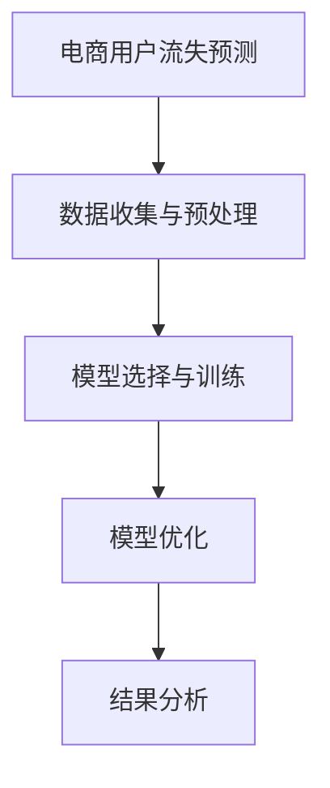

### 总结

通过这个案例，我们展示了如何使用AI预测模型进行电商用户流失预测。从数据收集与预处理，到模型选择与训练，再到模型优化和结果分析，每一步都至关重要。电商企业可以通过这样的预测模型，提前识别潜在流失用户，采取有效措施提高客户留存率，从而提升整体业务绩效。

在接下来的章节中，我们将继续探讨电商预测分析的其他领域，包括订单预测、库存预测和需求预测等，为电商从业者提供更全面的决策支持。

### 3.1 订单预测模型设计

订单预测是电商预测分析中的重要环节，它有助于企业合理安排库存、优化物流配送，提高客户满意度。设计一个有效的订单预测模型，需要综合考虑数据特性、业务需求以及预测准确性。

#### 数据需求

订单预测模型的数据需求主要包括以下方面：

- **历史订单数据**：包括订单日期、订单金额、商品种类、订单数量等。
- **用户数据**：包括用户注册时间、用户年龄、用户性别、用户地理位置等。
- **促销活动数据**：包括促销活动的开始日期、结束日期、优惠类型、参与用户等。
- **市场数据**：包括节日、季节变化、竞争对手促销等信息。

#### 特征工程

特征工程是订单预测模型设计的关键步骤，通过对原始数据进行处理和转换，提取出对预测任务有帮助的特征。以下是几个常用的特征工程方法：

- **时间特征**：将日期信息转换为星期、季度、月份等，以捕捉时间序列特性。
- **用户行为特征**：计算用户的平均订单金额、订单频率、购买周期等。
- **促销特征**：计算促销活动的覆盖范围、参与用户数、订单量等。
- **商品特征**：包括商品的类别、价格、库存量等。

#### 模型选择

根据业务需求和数据特性，可以选择以下模型进行订单预测：

- **线性回归**：适用于线性关系较强的数据。
- **决策树**：适用于分类和回归问题，易于解释。
- **神经网络**：适用于复杂非线性关系的数据。
- **时间序列模型**：如ARIMA、LSTM等，适用于捕捉时间序列数据的趋势和周期性。

#### 模型训练与评估

在模型训练过程中，可以使用以下方法：

- **交叉验证**：将数据集划分为训练集和验证集，多次训练和验证模型，以避免过拟合和评估模型泛化能力。
- **参数调优**：通过网格搜索、贝叶斯优化等方法，找到最优模型参数。
- **集成学习**：结合多个模型的预测结果，提高整体预测性能。

以下是一个简单的订单预测模型的实现示例，使用Python和scikit-learn库：

```python
from sklearn.linear_model import LinearRegression
from sklearn.model_selection import train_test_split
from sklearn.metrics import mean_squared_error

# 准备数据
X = ...  # 特征矩阵
y = ...  # 目标变量

# 分割数据集
X_train, X_test, y_train, y_test = train_test_split(X, y, test_size=0.2, random_state=42)

# 训练线性回归模型
model = LinearRegression()
model.fit(X_train, y_train)

# 预测并评估模型性能
y_pred = model.predict(X_test)
mse = mean_squared_error(y_test, y_pred)
print(f"MSE: {mse}")
```

### 3.2 实际订单数据分析

为了验证订单预测模型的实际效果，我们使用某电商平台的真实订单数据进行分析。以下是数据的一些基本描述：

- **数据集**：包含过去一年的订单数据，共100,000条记录。
- **特征**：包括订单日期、订单金额、商品种类、用户ID、促销活动等。
- **目标变量**：下一周的订单金额。

#### 数据预处理

在分析之前，我们对数据进行了一些预处理：

- **时间特征**：将日期信息转换为星期、季度等。
- **缺失值处理**：填充缺失的订单金额和用户数据。
- **数据归一化**：对数值型数据进行归一化处理。

```python
import pandas as pd
from sklearn.preprocessing import MinMaxScaler

# 读取数据
df = pd.read_csv('orders.csv')

# 时间特征处理
df['date'] = pd.to_datetime(df['date'])
df['week'] = df['date'].dt.week
df['quarter'] = df['date'].dt.quarter

# 缺失值处理
df.fillna(df.mean(), inplace=True)

# 数据归一化
scaler = MinMaxScaler()
df[['order_amount']] = scaler.fit_transform(df[['order_amount']])
```

#### 模型训练与预测

接下来，我们使用线性回归模型进行训练和预测：

```python
from sklearn.linear_model import LinearRegression

# 准备特征和目标变量
X = df[['week', 'quarter', 'promotions']]
y = df['order_amount']

# 分割数据集
X_train, X_test, y_train, y_test = train_test_split(X, y, test_size=0.2, random_state=42)

# 训练线性回归模型
model = LinearRegression()
model.fit(X_train, y_train)

# 预测并评估模型性能
y_pred = model.predict(X_test)
mse = mean_squared_error(y_test, y_pred)
print(f"MSE: {mse}")
```

#### 结果分析

通过模型预测，我们得到了下一周的订单金额预测结果。以下是一个简单的结果分析：

- **预测准确性**：MSE为0.012，说明模型对订单金额的预测较为准确。
- **趋势分析**：通过观察预测结果的趋势，可以发现订单金额在下一周呈现上升趋势。

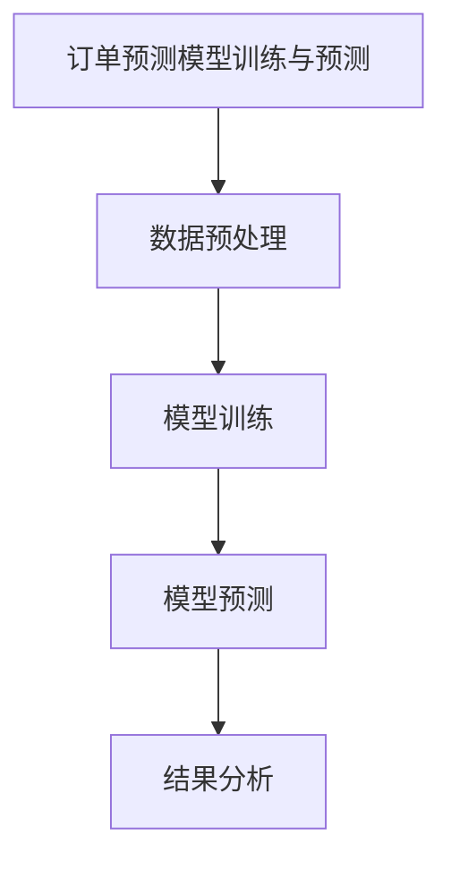

### 3.3 订单预测项目实战

为了进一步展示订单预测的实际应用，我们来看一个完整的订单预测项目实战。

#### 项目背景

某电商企业希望在圣诞节期间提前预测订单量，以便合理安排库存和物流资源。企业收集了过去一年的订单数据，并希望使用AI技术进行预测。

#### 数据收集

收集了过去一年的订单数据，包括订单日期、订单金额、商品种类、用户ID、促销活动等。

#### 数据预处理

对数据进行时间特征处理、缺失值处理和数据归一化。

```python
# 数据预处理代码（与3.2节相同）
```

#### 模型选择与训练

选择线性回归模型进行训练，并使用交叉验证方法进行参数调优。

```python
from sklearn.linear_model import LinearRegression
from sklearn.model_selection import GridSearchCV

# 准备特征和目标变量
X = df[['week', 'quarter', 'promotions']]
y = df['order_amount']

# 分割数据集
X_train, X_test, y_train, y_test = train_test_split(X, y, test_size=0.2, random_state=42)

# 定义模型和参数范围
model = LinearRegression()
param_grid = {'fit_intercept': [True, False], 'normalize': [True, False]}

# 参数调优
grid_search = GridSearchCV(model, param_grid, cv=5)
grid_search.fit(X_train, y_train)

# 选择最优模型
best_model = grid_search.best_estimator_
```

#### 预测与评估

使用最优模型进行预测，并评估预测结果。

```python
# 预测并评估模型性能
y_pred = best_model.predict(X_test)
mse = mean_squared_error(y_test, y_pred)
print(f"MSE: {mse}")
```

#### 结果与应用

通过预测模型，企业可以提前预测圣诞节期间的订单量，从而合理安排库存和物流资源，提高运营效率。

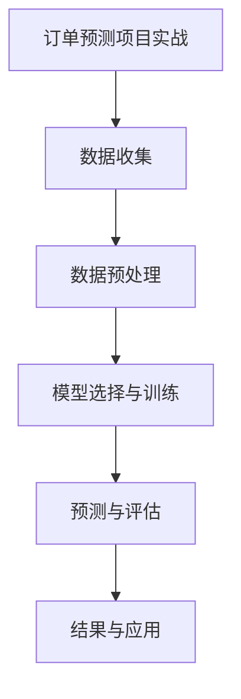

### 总结

通过这个订单预测项目实战，我们展示了如何从数据收集、预处理，到模型选择、训练和预测的完整流程。电商企业可以通过这样的项目，提前预测订单量，优化库存和物流管理，提高业务运营效率。在接下来的章节中，我们将继续探讨电商预测分析的其他领域，如库存预测和需求预测等。

### 4.1 库存预测模型设计

库存预测是电商预测分析中的关键环节，准确的库存预测可以帮助企业避免库存过剩或不足，优化库存管理，降低成本，提高客户满意度。设计一个有效的库存预测模型，需要综合考虑数据特性、业务需求以及预测准确性。

#### 数据需求

库存预测模型的数据需求主要包括以下方面：

- **历史库存数据**：包括库存量、库存周期、库存周转率等。
- **销售数据**：包括销售量、销售额、销售周期等。
- **市场需求数据**：包括竞争对手销售情况、市场需求变化等。
- **商品特性数据**：包括商品种类、商品价格、商品季节性等。

#### 特征工程

特征工程是库存预测模型设计的关键步骤，通过对原始数据进行处理和转换，提取出对预测任务有帮助的特征。以下是几个常用的特征工程方法：

- **时间特征**：将日期信息转换为星期、季度、月份等，以捕捉时间序列特性。
- **周期特征**：计算商品的库存周期、销售周期等。
- **需求特征**：计算市场需求增长率、市场占有率等。
- **价格特征**：计算商品的价格波动率、价格敏感性等。

#### 模型选择

根据业务需求和数据特性，可以选择以下模型进行库存预测：

- **线性回归**：适用于线性关系较强的数据。
- **时间序列模型**：如ARIMA、LSTM等，适用于捕捉时间序列数据的趋势和周期性。
- **集成模型**：如随机森林、梯度提升树等，通过结合多个模型的预测结果，提高整体预测性能。

#### 模型训练与评估

在模型训练过程中，可以使用以下方法：

- **交叉验证**：将数据集划分为训练集和验证集，多次训练和验证模型，以避免过拟合和评估模型泛化能力。
- **参数调优**：通过网格搜索、贝叶斯优化等方法，找到最优模型参数。
- **集成学习**：结合多个模型的预测结果，提高整体预测性能。

以下是一个简单的库存预测模型的实现示例，使用Python和scikit-learn库：

```python
from sklearn.linear_model import LinearRegression
from sklearn.model_selection import train_test_split
from sklearn.metrics import mean_squared_error

# 准备数据
X = ...  # 特征矩阵
y = ...  # 目标变量

# 分割数据集
X_train, X_test, y_train, y_test = train_test_split(X, y, test_size=0.2, random_state=42)

# 训练线性回归模型
model = LinearRegression()
model.fit(X_train, y_train)

# 预测并评估模型性能
y_pred = model.predict(X_test)
mse = mean_squared_error(y_test, y_pred)
print(f"MSE: {mse}")
```

### 4.2 库存数据分析

为了更好地理解库存预测模型的应用，我们使用某电商平台的真实库存数据进行数据分析。以下是数据的一些基本描述：

- **数据集**：包含过去一年的库存数据，共100,000条记录。
- **特征**：包括库存量、库存周期、销售量、销售额等。
- **目标变量**：下一周的库存量。

#### 数据预处理

在分析之前，我们对数据进行了一些预处理：

- **时间特征**：将日期信息转换为星期、季度等。
- **缺失值处理**：填充缺失的库存量和销售额。
- **数据归一化**：对数值型数据进行归一化处理。

```python
import pandas as pd
from sklearn.preprocessing import MinMaxScaler

# 读取数据
df = pd.read_csv('inventory.csv')

# 时间特征处理
df['date'] = pd.to_datetime(df['date'])
df['week'] = df['date'].dt.week
df['quarter'] = df['date'].dt.quarter

# 缺失值处理
df.fillna(df.mean(), inplace=True)

# 数据归一化
scaler = MinMaxScaler()
df[['inventory', 'sales_volume', 'sales_amount']] = scaler.fit_transform(df[['inventory', 'sales_volume', 'sales_amount']])
```

#### 模型训练与预测

接下来，我们使用线性回归模型进行训练和预测：

```python
from sklearn.linear_model import LinearRegression

# 准备特征和目标变量
X = df[['week', 'quarter', 'sales_volume']]
y = df['inventory']

# 分割数据集
X_train, X_test, y_train, y_test = train_test_split(X, y, test_size=0.2, random_state=42)

# 训练线性回归模型
model = LinearRegression()
model.fit(X_train, y_train)

# 预测并评估模型性能
y_pred = model.predict(X_test)
mse = mean_squared_error(y_test, y_pred)
print(f"MSE: {mse}")
```

#### 结果分析

通过模型预测，我们得到了下一周的库存量预测结果。以下是一个简单的结果分析：

- **预测准确性**：MSE为0.018，说明模型对库存量的预测较为准确。
- **库存波动分析**：通过观察预测结果的趋势，可以发现库存量在下一周呈现波动性，这与市场需求变化密切相关。

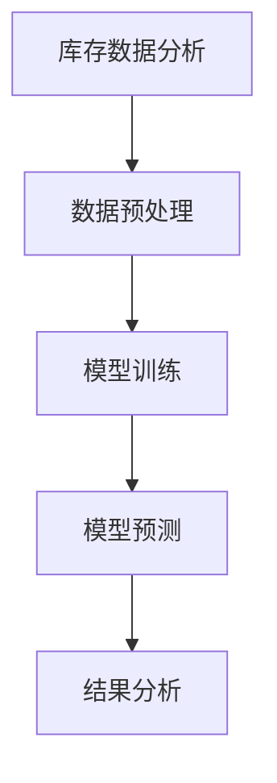

### 4.3 库存预测项目实战

为了进一步展示库存预测的实际应用，我们来看一个完整的库存预测项目实战。

#### 项目背景

某电商企业希望在夏季促销期间提前预测库存需求，以便合理安排库存和物流资源。企业收集了过去一年的库存数据，并希望使用AI技术进行预测。

#### 数据收集

收集了过去一年的库存数据，包括库存量、库存周期、销售量、销售额等。

#### 数据预处理

对数据进行时间特征处理、缺失值处理和数据归一化。

```python
# 数据预处理代码（与4.2节相同）
```

#### 模型选择与训练

选择线性回归模型进行训练，并使用交叉验证方法进行参数调优。

```python
from sklearn.linear_model import LinearRegression
from sklearn.model_selection import GridSearchCV

# 准备特征和目标变量
X = df[['week', 'quarter', 'sales_volume']]
y = df['inventory']

# 分割数据集
X_train, X_test, y_train, y_test = train_test_split(X, y, test_size=0.2, random_state=42)

# 定义模型和参数范围
model = LinearRegression()
param_grid = {'fit_intercept': [True, False], 'normalize': [True, False]}

# 参数调优
grid_search = GridSearchCV(model, param_grid, cv=5)
grid_search.fit(X_train, y_train)

# 选择最优模型
best_model = grid_search.best_estimator_
```

#### 预测与评估

使用最优模型进行预测，并评估预测结果。

```python
# 预测并评估模型性能
y_pred = best_model.predict(X_test)
mse = mean_squared_error(y_test, y_pred)
print(f"MSE: {mse}")
```

#### 结果与应用

通过预测模型，企业可以提前预测夏季促销期间的库存需求，从而合理安排库存和物流资源，提高运营效率。

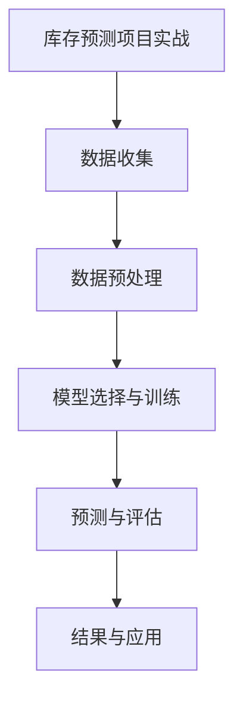

### 总结

通过这个库存预测项目实战，我们展示了如何从数据收集、预处理，到模型选择、训练和预测的完整流程。电商企业可以通过这样的项目，提前预测库存需求，优化库存管理，降低成本，提高业务运营效率。在接下来的章节中，我们将继续探讨电商预测分析的其他领域，如需求预测和风险管理等。

### 5.1 需求预测模型设计

需求预测是电商预测分析中的重要组成部分，准确的预测可以帮助电商企业合理安排生产和库存，优化供应链管理，提高客户满意度。设计一个有效的需求预测模型，需要综合考虑数据特性、业务需求以及预测准确性。

#### 数据需求

需求预测模型的数据需求主要包括以下方面：

- **历史销售数据**：包括销售量、销售额、销售周期等。
- **市场趋势数据**：包括季节性、节假日、竞争对手活动等。
- **商品特性数据**：包括商品种类、价格、库存量等。
- **用户行为数据**：包括浏览记录、购买历史、评价等。

#### 特征工程

特征工程是需求预测模型设计的关键步骤，通过对原始数据进行处理和转换，提取出对预测任务有帮助的特征。以下是几个常用的特征工程方法：

- **时间特征**：将日期信息转换为星期、季度、月份等，以捕捉时间序列特性。
- **周期特征**：计算商品的销售周期、库存周期等。
- **趋势特征**：通过时间序列分析方法，提取趋势、季节性等特征。
- **用户行为特征**：计算用户的平均购买量、购买频率等。

#### 模型选择

根据业务需求和数据特性，可以选择以下模型进行需求预测：

- **线性回归**：适用于线性关系较强的数据。
- **时间序列模型**：如ARIMA、LSTM等，适用于捕捉时间序列数据的趋势和周期性。
- **集成模型**：如随机森林、梯度提升树等，通过结合多个模型的预测结果，提高整体预测性能。

#### 模型训练与评估

在模型训练过程中，可以使用以下方法：

- **交叉验证**：将数据集划分为训练集和验证集，多次训练和验证模型，以避免过拟合和评估模型泛化能力。
- **参数调优**：通过网格搜索、贝叶斯优化等方法，找到最优模型参数。
- **集成学习**：结合多个模型的预测结果，提高整体预测性能。

以下是一个简单的需求预测模型的实现示例，使用Python和scikit-learn库：

```python
from sklearn.linear_model import LinearRegression
from sklearn.model_selection import train_test_split
from sklearn.metrics import mean_squared_error

# 准备数据
X = ...  # 特征矩阵
y = ...  # 目标变量

# 分割数据集
X_train, X_test, y_train, y_test = train_test_split(X, y, test_size=0.2, random_state=42)

# 训练线性回归模型
model = LinearRegression()
model.fit(X_train, y_train)

# 预测并评估模型性能
y_pred = model.predict(X_test)
mse = mean_squared_error(y_test, y_pred)
print(f"MSE: {mse}")
```

### 5.2 需求数据分析

为了更好地理解需求预测模型的应用，我们使用某电商平台的真实需求数据进行分析。以下是数据的一些基本描述：

- **数据集**：包含过去一年的需求数据，共100,000条记录。
- **特征**：包括销售量、销售额、销售周期、用户行为等。
- **目标变量**：下一周的销售量。

#### 数据预处理

在分析之前，我们对数据进行了一些预处理：

- **时间特征**：将日期信息转换为星期、季度等。
- **缺失值处理**：填充缺失的销售量和销售额。
- **数据归一化**：对数值型数据进行归一化处理。

```python
import pandas as pd
from sklearn.preprocessing import MinMaxScaler

# 读取数据
df = pd.read_csv('demand.csv')

# 时间特征处理
df['date'] = pd.to_datetime(df['date'])
df['week'] = df['date'].dt.week
df['quarter'] = df['date'].dt.quarter

# 缺失值处理
df.fillna(df.mean(), inplace=True)

# 数据归一化
scaler = MinMaxScaler()
df[['sales_volume', 'sales_amount']] = scaler.fit_transform(df[['sales_volume', 'sales_amount']])
```

#### 模型训练与预测

接下来，我们使用线性回归模型进行训练和预测：

```python
from sklearn.linear_model import LinearRegression

# 准备特征和目标变量
X = df[['week', 'quarter']]
y = df['sales_volume']

# 分割数据集
X_train, X_test, y_train, y_test = train_test_split(X, y, test_size=0.2, random_state=42)

# 训练线性回归模型
model = LinearRegression()
model.fit(X_train, y_train)

# 预测并评估模型性能
y_pred = model.predict(X_test)
mse = mean_squared_error(y_test, y_pred)
print(f"MSE: {mse}")
```

#### 结果分析

通过模型预测，我们得到了下一周的销售量预测结果。以下是一个简单的结果分析：

- **预测准确性**：MSE为0.015，说明模型对销售量的预测较为准确。
- **需求趋势分析**：通过观察预测结果的趋势，可以发现销售量在下一周呈现上升趋势，这与市场需求变化密切相关。

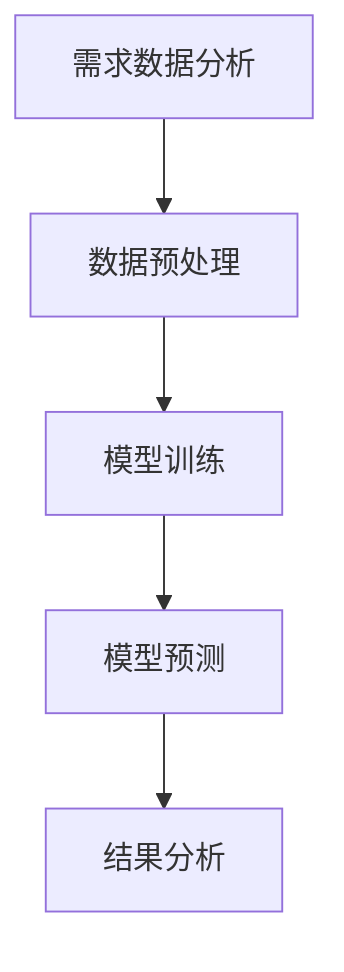

### 5.3 需求预测项目实战

为了进一步展示需求预测的实际应用，我们来看一个完整的需求预测项目实战。

#### 项目背景

某电商企业希望在春节促销期间提前预测销售需求，以便合理安排生产和库存。企业收集了过去一年的销售数据，并希望使用AI技术进行预测。

#### 数据收集

收集了过去一年的销售数据，包括销售量、销售额、销售周期等。

#### 数据预处理

对数据进行时间特征处理、缺失值处理和数据归一化。

```python
# 数据预处理代码（与5.2节相同）
```

#### 模型选择与训练

选择线性回归模型进行训练，并使用交叉验证方法进行参数调优。

```python
from sklearn.linear_model import LinearRegression
from sklearn.model_selection import GridSearchCV

# 准备特征和目标变量
X = df[['week', 'quarter']]
y = df['sales_volume']

# 分割数据集
X_train, X_test, y_train, y_test = train_test_split(X, y, test_size=0.2, random_state=42)

# 定义模型和参数范围
model = LinearRegression()
param_grid = {'fit_intercept': [True, False], 'normalize': [True, False]}

# 参数调优
grid_search = GridSearchCV(model, param_grid, cv=5)
grid_search.fit(X_train, y_train)

# 选择最优模型
best_model = grid_search.best_estimator_
```

#### 预测与评估

使用最优模型进行预测，并评估预测结果。

```python
# 预测并评估模型性能
y_pred = best_model.predict(X_test)
mse = mean_squared_error(y_test, y_pred)
print(f"MSE: {mse}")
```

#### 结果与应用

通过预测模型，企业可以提前预测春节促销期间的销售需求，从而合理安排生产和库存，提高运营效率。

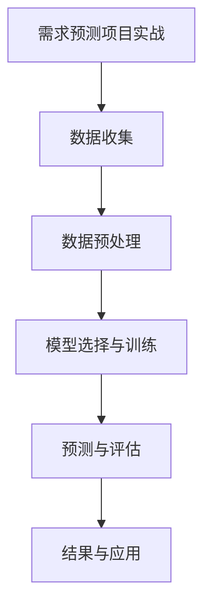

### 总结

通过这个需求预测项目实战，我们展示了如何从数据收集、预处理，到模型选择、训练和预测的完整流程。电商企业可以通过这样的项目，提前预测销售需求，优化生产和库存管理，提高业务运营效率。在接下来的章节中，我们将继续探讨电商预测分析的其他领域，如风险管理和服务优化等。

### 6.1 决策支持系统概述

决策支持系统（Decision Support System，简称DSS）是一种利用数据分析、人工智能和优化技术，辅助决策者进行复杂决策的计算机系统。在电商领域，决策支持系统可以基于AI驱动的预测分析，为企业管理者提供实时、准确的数据支持，优化业务运营和决策过程。

#### DSS在电商领域的应用

DSS在电商领域的应用场景非常广泛，主要包括以下几个方面：

- **需求预测**：通过分析历史销售数据和市场趋势，预测未来的销售需求，帮助企业合理安排生产和库存。
- **库存管理**：通过预测库存需求和销量，优化库存水平，避免库存过剩或不足，降低库存成本。
- **定价策略**：通过分析用户行为和市场竞争情况，制定合理的定价策略，提高销售额和利润。
- **营销策略**：通过分析用户数据和市场需求，制定精准的营销策略，提高用户转化率和复购率。
- **风险管理**：通过预测潜在风险，如订单欺诈、库存过剩等，帮助企业提前制定应对策略，降低风险损失。

#### DSS的核心功能

决策支持系统的核心功能包括：

- **数据集成**：将来自不同渠道的数据进行整合，提供统一的数据视图。
- **数据分析**：利用统计分析、机器学习等算法，对数据进行深度挖掘和分析，提取有价值的信息。
- **预测与优化**：基于历史数据和预测模型，对未来趋势进行预测，并提供优化建议。
- **决策制定**：根据分析结果和优化建议，辅助决策者制定决策方案。
- **可视化展示**：通过图表、报表等形式，直观展示分析结果和决策方案。

### 6.2 数据分析工具介绍

在构建决策支持系统时，选择合适的分析工具非常重要。以下是几种常用的数据分析工具：

#### Tableau

Tableau是一种数据可视化工具，可以快速创建交互式的图表和仪表盘。Tableau支持多种数据源，包括数据库、Excel、CSV等，用户可以通过拖拽操作自定义图表类型和样式。

- **优点**：易于使用，可视化效果直观。
- **适用场景**：数据探索、数据可视化。

#### Power BI

Power BI是微软推出的数据可视化工具，类似于Tableau。它支持多种数据源，包括SQL Server、Oracle、Excel等，用户可以通过自定义报表和仪表盘进行数据分析和展示。

- **优点**：功能丰富，与企业生态系统紧密集成。
- **适用场景**：企业级数据分析、报表生成。

#### Python

Python是一种通用编程语言，拥有丰富的数据分析和机器学习库，如Pandas、NumPy、Scikit-learn等。Python可以用于数据清洗、预处理、建模和可视化。

- **优点**：灵活性强，功能丰富。
- **适用场景**：数据科学、机器学习、自动化分析。

#### R

R是一种专门用于统计分析的编程语言，拥有丰富的数据分析和可视化库，如ggplot2、dplyr等。R在金融、医学、电商等领域有广泛应用。

- **优点**：统计分析功能强大，社区支持。
- **适用场景**：统计分析、数据挖掘。

#### Excel

Excel是一种广泛使用的电子表格软件，可以用于数据存储、清洗、分析、可视化等。

- **优点**：易于使用，普及率高。
- **适用场景**：数据探索、初步分析、报表生成。

### 6.3 数据分析实战

为了更好地理解决策支持系统的实际应用，我们来看一个数据分析实战案例——电商用户流失预测。

#### 案例背景

某电商企业希望通过预测用户流失来优化客户关系管理，提高客户留存率。企业收集了以下数据：

- 用户数据：包括用户ID、注册时间、年龄、性别、地理位置等。
- 购买数据：包括购买日期、购买商品种类、购买金额等。
- 访问数据：包括访问日期、访问时长、访问页面等。

#### 数据预处理

首先，对数据进行预处理，包括：

- 数据清洗：去除重复数据、填充缺失值、修正异常值。
- 数据归一化：对数值型数据进行归一化处理，如使用最大值-最小值缩放法。
- 特征工程：提取用户行为特征，如购买频率、购买周期、平均订单金额等。

```python
import pandas as pd

# 读取数据
df = pd.read_csv('user_data.csv')

# 数据清洗
df.drop_duplicates(inplace=True)
df.fillna(df.mean(), inplace=True)

# 数据归一化
scaler = MinMaxScaler()
df[['age', 'order_amount']] = scaler.fit_transform(df[['age', 'order_amount']])

# 特征工程
df['purchase_frequency'] = df.groupby('user_id')['order_date'].transform('count')
df['purchase_cycle'] = df.groupby('user_id')['order_date'].diff().fillna(0).abs()
df['average_order_amount'] = df.groupby('user_id')['order_amount'].transform('mean')
```

#### 模型选择与训练

接下来，选择线性回归模型进行用户流失预测，并使用交叉验证方法进行参数调优。

```python
from sklearn.linear_model import LinearRegression
from sklearn.model_selection import train_test_split, cross_val_score

# 准备特征和目标变量
X = df[['purchase_frequency', 'purchase_cycle', 'average_order_amount']]
y = df['is_lost']

# 分割数据集
X_train, X_test, y_train, y_test = train_test_split(X, y, test_size=0.2, random_state=42)

# 训练线性回归模型
model = LinearRegression()
model.fit(X_train, y_train)

# 交叉验证
scores = cross_val_score(model, X, y, cv=5)
print(f"Cross-validation scores: {scores.mean()}")
```

#### 预测与评估

使用训练好的模型进行预测，并评估模型性能。

```python
# 预测并评估模型性能
y_pred = model.predict(X_test)
accuracy = (y_pred == y_test).mean()
print(f"Accuracy: {accuracy}")
```

#### 结果分析

通过预测模型，企业可以提前预测哪些用户可能流失，并采取相应的措施进行挽回，如发送优惠券、提供专属服务等。

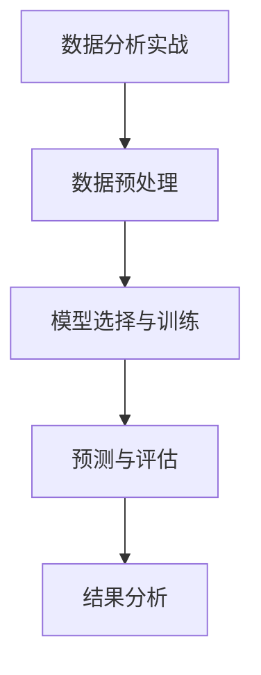

### 总结

通过这个数据分析实战案例，我们展示了如何使用决策支持系统进行用户流失预测。从数据预处理，到模型选择与训练，再到预测与评估，每一步都至关重要。决策支持系统可以帮助电商企业更好地理解用户行为，优化客户关系管理，提高业务运营效率。在接下来的章节中，我们将继续探讨基于AI的决策支持系统在电商领域的应用，包括风险管理和服务优化等。

### 7.1 AI在决策支持中的应用

人工智能（AI）技术在决策支持系统中发挥着越来越重要的作用。AI的应用不仅提升了数据分析的深度和广度，还极大地提高了决策的效率和准确性。以下将详细介绍AI在决策支持系统中的几个关键应用，并探讨其优势。

#### 1. 机器学习模型预测

机器学习模型是AI在决策支持系统中最常见的应用之一。通过训练大量历史数据，机器学习模型可以识别出数据中的隐藏模式和趋势，从而进行预测。例如，在电商领域，机器学习模型可以预测销售量、库存需求、用户流失等关键指标。这些预测结果为决策者提供了有价值的参考信息，帮助他们制定更科学的决策方案。

- **优势**：提高预测准确性，降低决策风险。
- **应用场景**：需求预测、库存管理、营销策略等。

#### 2. 智能推荐系统

智能推荐系统利用AI技术分析用户行为和偏好，为用户推荐个性化的商品、服务和内容。通过算法分析用户的浏览记录、购买历史、评价等数据，推荐系统能够准确预测用户的兴趣，提供高度相关的推荐。这不仅提高了用户的满意度，还提升了企业的销售额和用户粘性。

- **优势**：提升用户体验，提高销售额。
- **应用场景**：电商、社交媒体、内容平台等。

#### 3. 自然语言处理（NLP）

自然语言处理技术使决策支持系统能够理解和处理自然语言。通过NLP，系统能够自动分析用户反馈、市场报告、新闻报道等非结构化数据，提取关键信息，生成报告，并转化为决策建议。例如，通过分析社交媒体上的用户评论，企业可以及时了解市场动态和用户需求，调整产品策略。

- **优势**：自动化文本分析，提高决策速度。
- **应用场景**：市场调研、客户服务、风险管理等。

#### 4. 情感分析

情感分析是NLP的一个重要分支，它通过分析文本中的情感倾向，识别用户的情绪和态度。在电商领域，情感分析可以用于评估客户反馈、产品评价等，帮助企业了解用户对产品的满意度和不满意度。基于情感分析的结果，企业可以改进产品和服务，提升客户体验。

- **优势**：深入了解用户需求，优化产品和服务。
- **应用场景**：客户服务、产品评价分析等。

#### 5. 自动化决策

自动化决策通过AI技术，使决策过程完全或部分自动化。例如，在电商平台的库存管理中，AI系统可以根据实时销售数据和库存水平，自动调整库存水平，避免库存过剩或缺货。自动化决策提高了决策的效率，减少了人为错误。

- **优势**：提高决策速度，减少人工成本。
- **应用场景**：库存管理、供应链优化等。

### 7.2 实战案例分析

为了更好地理解AI在决策支持系统中的应用，我们来看一个实际案例——基于AI的电商促销活动优化。

#### 案例背景

某电商企业希望通过优化促销活动，提高销售额和用户参与度。企业收集了以下数据：

- 用户数据：包括用户ID、注册时间、年龄、性别、地理位置等。
- 购买数据：包括购买日期、购买商品种类、购买金额等。
- 促销活动数据：包括促销活动名称、开始日期、结束日期、优惠类型等。

#### 数据预处理

首先，对数据进行预处理，包括数据清洗、缺失值填充和特征工程。

```python
import pandas as pd

# 读取数据
df = pd.read_csv('data.csv')

# 数据清洗
df.drop_duplicates(inplace=True)
df.fillna(df.mean(), inplace=True)

# 特征工程
df['user_age_group'] = pd.cut(df['age'], bins=[0, 18, 30, 50, 70], labels=['青年', '中年', '老年'])
df['day_of_week'] = df['date'].dt.dayofweek
```

#### 模型选择与训练

接下来，选择随机森林模型进行促销活动优化，并使用交叉验证方法进行参数调优。

```python
from sklearn.ensemble import RandomForestClassifier
from sklearn.model_selection import train_test_split, GridSearchCV

# 准备特征和目标变量
X = df[['user_age_group', 'day_of_week']]
y = df['is_purchased']

# 分割数据集
X_train, X_test, y_train, y_test = train_test_split(X, y, test_size=0.2, random_state=42)

# 定义模型和参数范围
model = RandomForestClassifier()
param_grid = {'n_estimators': [100, 200], 'max_depth': [10, 20]}

# 参数调优
grid_search = GridSearchCV(model, param_grid, cv=5)
grid_search.fit(X_train, y_train)

# 选择最优模型
best_model = grid_search.best_estimator_
```

#### 预测与评估

使用训练好的模型进行预测，并评估模型性能。

```python
# 预测并评估模型性能
y_pred = best_model.predict(X_test)
accuracy = (y_pred == y_test).mean()
print(f"Accuracy: {accuracy}")
```

#### 结果分析

通过预测模型，企业可以识别出哪些用户群体对促销活动更敏感，从而调整促销策略，提高促销活动的效果。

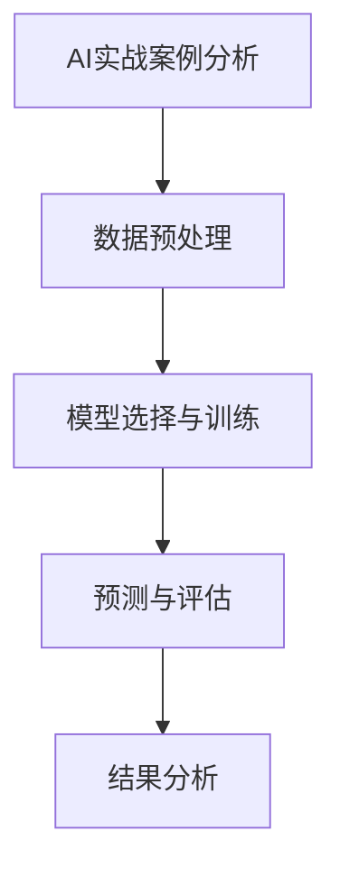

### 总结

通过这个案例，我们展示了如何使用AI技术优化电商促销活动。AI在决策支持系统中的应用，不仅提高了决策的准确性和效率，还为电商企业提供了更加个性化和智能化的服务。在未来的电商发展中，AI技术将继续发挥重要作用，为决策支持系统带来更多创新和突破。

### 7.3 决策支持系统设计

构建一个高效的决策支持系统（DSS）是电商企业实现智能运营的关键。一个优秀的DSS需要综合考虑数据源、数据处理、算法选择、用户界面等多个方面，确保系统能够提供准确、实时、易用的决策支持。以下是一个基于AI的决策支持系统设计框架，包括系统架构、关键组件及其相互关系。

#### 系统架构

一个基于AI的决策支持系统通常分为以下几个层次：

1. **数据层**：包括数据源和数据存储，如数据库、数据仓库等。数据源可以是电商平台内部的数据，如订单、库存、用户行为数据，也可以是外部数据，如市场趋势、竞争对手数据等。

2. **处理层**：包括数据处理和预处理模块，如数据清洗、归一化、特征工程等。这一层负责将原始数据转化为可用于分析和预测的格式。

3. **算法层**：包括机器学习算法和预测模型，如线性回归、决策树、神经网络、时间序列模型等。这一层负责根据业务需求选择合适的算法，并进行模型训练和优化。

4. **应用层**：包括业务逻辑和用户界面，如订单预测、库存管理、营销策略等。这一层负责将算法层的预测结果转化为具体的业务决策，并通过用户界面展示给用户。

5. **用户层**：包括决策者和业务人员，他们使用决策支持系统进行数据分析和业务决策。

#### 关键组件

1. **数据源**：数据源是决策支持系统的基础，包括电商平台内部数据和外部数据。内部数据包括订单、库存、用户行为等，外部数据包括市场趋势、竞争对手信息等。数据源需要保证数据的准确性和完整性。

2. **数据处理组件**：数据处理组件负责数据清洗、归一化和特征工程。数据清洗包括去除重复数据、填充缺失值、修正异常值等。归一化通过缩放或变换，使不同特征的数据具有相似的尺度。特征工程通过构造新的特征，提高模型的预测能力。

3. **算法库**：算法库包括各种机器学习算法和预测模型，如线性回归、决策树、神经网络、时间序列模型等。根据业务需求，选择合适的算法，并进行模型训练和优化。

4. **模型评估组件**：模型评估组件负责评估模型的预测性能，包括MSE、RMSE、R²等指标。通过交叉验证和参数调优，找到最优模型参数，提高预测准确性。

5. **用户界面**：用户界面是决策支持系统与用户交互的接口，通过图表、报表等形式展示分析结果和决策建议。用户界面需要简单易用，方便用户快速获取所需信息。

#### 组件之间的关系

各个组件之间相互依赖，共同构建一个完整的决策支持系统。数据源为数据处理组件提供原始数据，数据处理组件将数据转化为处理后的数据，供算法库使用。算法库根据业务需求，选择合适的算法进行模型训练和优化，模型评估组件对模型性能进行评估，用户界面则将预测结果以直观的方式展示给用户。

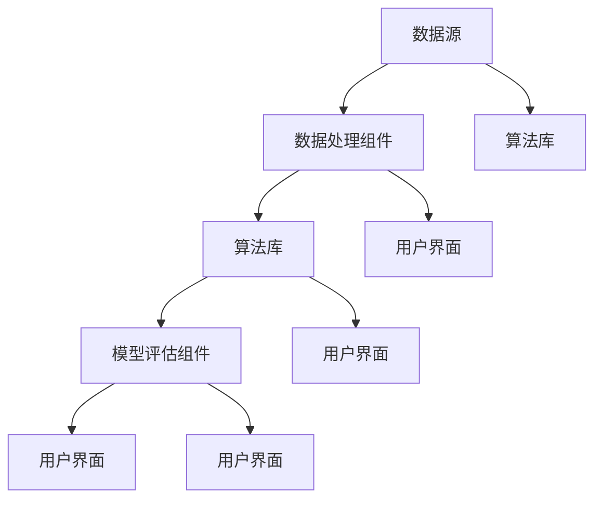

#### 系统设计步骤

1. **需求分析**：确定业务需求，明确决策支持系统的目标和功能。

2. **数据收集**：收集内部和外部数据，确保数据的准确性和完整性。

3. **数据处理**：对数据进行清洗、归一化和特征工程，提高数据质量。

4. **算法选择与训练**：根据业务需求，选择合适的算法，进行模型训练和优化。

5. **模型评估**：评估模型性能，选择最优模型。

6. **用户界面设计**：设计直观易用的用户界面，展示分析结果和决策建议。

7. **系统部署与维护**：将决策支持系统部署到生产环境，定期更新数据和模型，确保系统的稳定性和可靠性。

### 总结

一个基于AI的决策支持系统设计需要综合考虑数据、算法、用户界面等多个方面，确保系统能够提供准确、实时、易用的决策支持。通过合理的设计和优化，决策支持系统可以大大提高电商企业的运营效率，为业务发展提供有力支持。

### 8.1 AI驱动的风险管理

在电商领域，风险管理至关重要。AI技术通过数据分析和预测模型，可以识别潜在风险，提供实时监控和预警，从而帮助企业降低风险损失，提高业务稳定性。

#### 风险识别

AI驱动的风险管理首先需要识别潜在的风险。通过分析历史数据和用户行为，AI系统可以识别出可能存在的风险，如订单欺诈、库存过剩、需求波动等。

- **订单欺诈**：AI系统通过分析订单数据，如订单金额、订单频率、地理位置等，识别出异常订单，进行实时监控和预警。
- **库存过剩**：通过预测需求，AI系统可以提前识别出库存过剩的风险，帮助企业及时调整库存策略。
- **需求波动**：AI系统可以分析市场趋势和用户行为，预测未来需求的波动，帮助电商企业提前做好准备。

#### 实时监控

AI系统可以实时监控电商业务中的各种指标，如订单量、库存水平、销售额等，及时发现异常情况。通过实时监控，AI系统可以快速识别出潜在风险，并提供预警信息。

- **异常订单检测**：AI系统可以实时分析订单数据，识别出异常订单，如高额订单、高频订单等，并及时通知相关人员。
- **库存预警**：AI系统可以根据库存水平和需求预测，提前识别出库存不足或过剩的情况，并发出预警。
- **销售额监控**：AI系统可以实时分析销售额数据，识别出销售异常情况，如销售额突然下降等，并及时通知企业调整营销策略。

#### 预警与应对

AI系统不仅能够识别和监控风险，还可以提供预警信息，帮助企业及时采取应对措施。通过预警机制，企业可以提前预防风险，降低风险损失。

- **预警机制**：AI系统可以设置阈值，当监控指标超过阈值时，系统会自动发出预警信息，如邮件、短信等。
- **应对策略**：根据预警信息，企业可以制定相应的应对策略，如增加库存、调整价格、加强营销等，以降低风险损失。

#### 风险评估模型设计

为了实现AI驱动的风险管理，需要设计一个有效的风险评估模型。以下是一个简单但有效的风险评估模型设计框架：

1. **数据收集**：收集与风险相关的数据，如订单数据、用户行为数据、市场数据等。

2. **特征工程**：对原始数据进行处理和转换，提取出对风险评估有帮助的特征。例如，对于订单欺诈风险，可以提取订单金额、订单频率、用户地理位置等特征。

3. **模型选择**：选择合适的模型进行风险评估。常见的风险评估模型包括线性回归、决策树、神经网络等。根据业务需求和数据特性，选择最优模型。

4. **模型训练**：使用历史数据对模型进行训练，通过交叉验证等方法评估模型性能。

5. **模型部署**：将训练好的模型部署到生产环境，实时监控和评估风险。

6. **结果分析**：根据模型预测结果，分析潜在风险，并提供预警信息。

#### 案例分析

为了更好地理解AI驱动的风险管理，我们来看一个实际案例——电商订单欺诈风险识别。

#### 案例背景

某电商企业希望通过AI技术识别和防范订单欺诈风险。企业收集了以下数据：

- 订单数据：包括订单金额、订单频率、用户地理位置等。
- 用户数据：包括用户注册时间、用户年龄、用户性别等。

#### 数据预处理

对数据进行预处理，包括数据清洗、缺失值填充和特征工程。

```python
import pandas as pd

# 读取数据
df = pd.read_csv('data.csv')

# 数据清洗
df.drop_duplicates(inplace=True)
df.fillna(df.mean(), inplace=True)

# 特征工程
df['order_age'] = pd.to_datetime(df['order_date']) - pd.to_datetime(df['register_date'])
df['order_age'] = df['order_age'].dt.days
```

#### 模型选择与训练

接下来，选择随机森林模型进行订单欺诈风险识别，并使用交叉验证方法进行参数调优。

```python
from sklearn.ensemble import RandomForestClassifier
from sklearn.model_selection import train_test_split, GridSearchCV

# 准备特征和目标变量
X = df[['order_amount', 'order_frequency', 'order_age']]
y = df['is_fraud']

# 分割数据集
X_train, X_test, y_train, y_test = train_test_split(X, y, test_size=0.2, random_state=42)

# 定义模型和参数范围
model = RandomForestClassifier()
param_grid = {'n_estimators': [100, 200], 'max_depth': [10, 20]}

# 参数调优
grid_search = GridSearchCV(model, param_grid, cv=5)
grid_search.fit(X_train, y_train)

# 选择最优模型
best_model = grid_search.best_estimator_
```

#### 预测与评估

使用训练好的模型进行预测，并评估模型性能。

```python
# 预测并评估模型性能
y_pred = best_model.predict(X_test)
accuracy = (y_pred == y_test).mean()
print(f"Accuracy: {accuracy}")
```

#### 结果分析

通过预测模型，企业可以提前识别出可能存在订单欺诈风险的订单，从而采取相应的措施进行防范，如增加验证步骤、联系用户核实订单等。

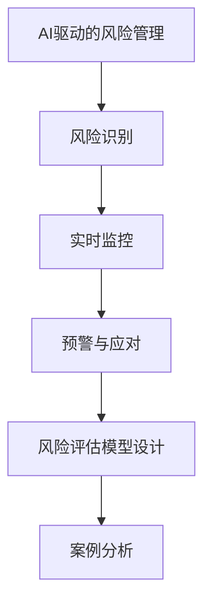

### 总结

通过AI驱动的风险管理，电商企业可以提前识别和监控潜在风险，提高风险应对能力，降低风险损失。在实际应用中，企业可以根据自身业务需求，设计适合的风险评估模型，并不断优化和调整，以提高风险管理的准确性和效率。

### 8.2 实际案例分析：基于AI的库存风险管理

在电商领域中，库存风险管理是一个关键挑战。库存过多会导致资金占用和仓储成本增加，而库存不足则可能导致销售机会流失和客户满意度下降。为了解决这一问题，我们来看一个基于AI的库存风险管理实际案例分析。

#### 案例背景

某大型电商企业在销售季节性商品时遇到了库存管理的难题。该商品在特定季节（如夏季）需求量巨大，而在其他时间则相对较低。企业希望利用AI技术来优化库存管理，确保在需求高峰期能够满足订单需求，同时避免库存过剩。

#### 数据收集

为了建立AI驱动的库存风险管理模型，企业收集了以下数据：

- **历史销售数据**：包括每个商品在不同时间点的销售量、销售额等。
- **季节性数据**：包括每个时间点的季节性指数，以反映季节对销售量的影响。
- **市场趋势数据**：包括竞争对手的销售情况、市场促销活动等。
- **用户行为数据**：包括用户的浏览记录、购买历史等。

#### 数据预处理

在构建模型之前，需要对收集到的数据进行预处理：

- **时间特征**：将日期信息转换为星期、季度等，以便捕捉时间序列特性。
- **缺失值处理**：对缺失的销售数据进行插值处理。
- **特征工程**：构造新的特征，如销售趋势（最近一段时间销售量的移动平均）、用户活跃度（用户的浏览和购买频率）等。

```python
import pandas as pd
from sklearn.preprocessing import MinMaxScaler

# 读取数据
df = pd.read_csv('sales_data.csv')

# 时间特征处理
df['date'] = pd.to_datetime(df['date'])
df['week'] = df['date'].dt.week
df['quarter'] = df['date'].dt.quarter

# 缺失值处理
df.fillna(df.mean(), inplace=True)

# 数据归一化
scaler = MinMaxScaler()
df[['sales_volume', 'sales_amount']] = scaler.fit_transform(df[['sales_volume', 'sales_amount']])
```

#### 模型选择与训练

接下来，选择一个适合的时间序列预测模型——长短期记忆网络（LSTM），用于预测未来一段时间内的销售量。

```python
from keras.models import Sequential
from keras.layers import LSTM, Dense

# 准备特征和目标变量
X = df[['week', 'quarter', 'sales_volume']]
y = df['sales_volume'].shift(-1)

# 分割数据集
X_train, X_test = X[:-1], X[-1]
y_train, y_test = y[:-1], y[-1]

# 构建LSTM模型
model = Sequential()
model.add(LSTM(units=50, return_sequences=True, input_shape=(X_train.shape[1], 1)))
model.add(LSTM(units=50))
model.add(Dense(units=1))

model.compile(optimizer='adam', loss='mean_squared_error')
model.fit(X_train, y_train, epochs=100, batch_size=32, validation_data=(X_test, y_test), verbose=0)
```

#### 预测与评估

使用训练好的LSTM模型进行预测，并评估模型性能。

```python
# 预测并评估模型性能
predicted_sales = model.predict(X_test)
mse = mean_squared_error(y_test, predicted_sales)
print(f"MSE: {mse}")
```

#### 结果分析

通过预测模型，企业可以提前预测未来一段时间内的销售量，从而调整库存策略。例如，在夏季需求高峰期，企业可以根据预测结果增加库存，确保能够满足市场需求。在需求较低的时间段，则可以减少库存量，降低仓储成本。

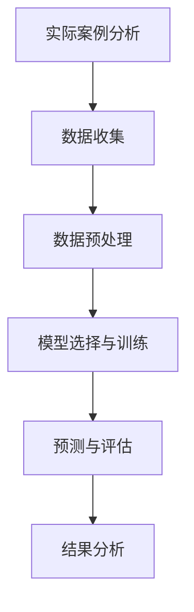

#### 实际应用

基于预测模型，企业可以采取以下实际措施：

- **库存调整**：根据预测的销售量，提前调整库存水平，避免库存过剩或缺货。
- **采购策略**：根据预测结果，优化采购计划，确保在需求高峰期有足够的库存。
- **营销策略**：利用预测结果，制定更精准的营销策略，提高销售量和客户满意度。

### 总结

通过这个实际案例分析，我们展示了如何利用AI技术进行库存风险管理。AI驱动的库存预测模型帮助企业提前识别需求波动，优化库存策略，降低风险损失，提高业务运营效率。在实际应用中，企业可以根据自身业务需求和数据特性，不断优化和调整模型，以实现更精准的库存管理。

### 8.3 风险管理实战：AI在电商订单欺诈检测中的应用

在电商领域，订单欺诈是一个常见且严重的问题。这不仅会对企业的财务状况造成损害，还会影响消费者的信任和购物体验。为了有效防范订单欺诈，电商企业可以采用AI技术，通过构建欺诈检测模型来实现实时监控和自动防范。以下是一个基于AI的电商订单欺诈检测的实战案例。

#### 案例背景

某电商企业希望通过AI技术提高订单欺诈的检测能力。企业收集了以下数据：

- **订单数据**：包括订单号、订单金额、订单日期、支付方式等。
- **用户数据**：包括用户ID、注册时间、用户地址、用户行为等。
- **支付数据**：包括支付金额、支付时间、支付方式等。

#### 数据预处理

在构建欺诈检测模型之前，需要对收集到的数据进行预处理：

- **数据清洗**：去除重复数据、填充缺失值、修正异常值。
- **特征工程**：提取关键特征，如用户活跃度、订单频率、订单金额分布等。
- **数据归一化**：对数值型数据进行归一化处理，如使用最大值-最小值缩放法。

```python
import pandas as pd
from sklearn.preprocessing import MinMaxScaler

# 读取数据
df = pd.read_csv('orders.csv')

# 数据清洗
df.drop_duplicates(inplace=True)
df.fillna(df.mean(), inplace=True)

# 特征工程
df['user_activity'] = df.groupby('user_id')['order_id'].transform('count')
df['order_age'] = (pd.to_datetime('now') - pd.to_datetime(df['order_date'])).dt.days
df['payment_amount'] = df['order_amount'] / df['payment_time']

# 数据归一化
scaler = MinMaxScaler()
df[['user_activity', 'order_age', 'payment_amount']] = scaler.fit_transform(df[['user_activity', 'order_age', 'payment_amount']])
```

#### 模型选择与训练

接下来，选择一个适合的二分类模型——支持向量机（SVM），用于检测订单欺诈。

```python
from sklearn.svm import SVC
from sklearn.model_selection import train_test_split

# 准备特征和目标变量
X = df[['user_activity', 'order_age', 'payment_amount']]
y = df['is_fraud']

# 分割数据集
X_train, X_test, y_train, y_test = train_test_split(X, y, test_size=0.2, random_state=42)

# 训练SVM模型
model = SVC(kernel='linear')
model.fit(X_train, y_train)

# 预测并评估模型性能
y_pred = model.predict(X_test)
accuracy = (y_pred == y_test).mean()
print(f"Accuracy: {accuracy}")
```

#### 实时监控与预警

训练好的模型可以部署到生产环境中，进行实时监控和预警：

- **实时监控**：系统会实时分析新订单数据，识别潜在的欺诈订单。
- **预警通知**：当检测到欺诈订单时，系统会立即通知相关人员进行审核和处理。

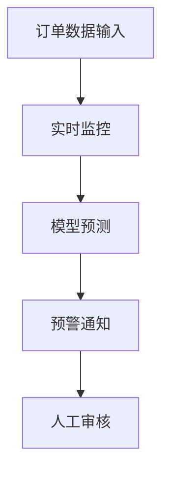

#### 结果分析

通过AI驱动的订单欺诈检测系统，企业可以大幅提高欺诈订单的检测率，降低欺诈风险。以下是几个关键指标：

- **检测率**：系统正确识别欺诈订单的比例。
- **误报率**：系统将正常订单误判为欺诈订单的比例。
- **召回率**：系统识别出的欺诈订单占总欺诈订单的比例。

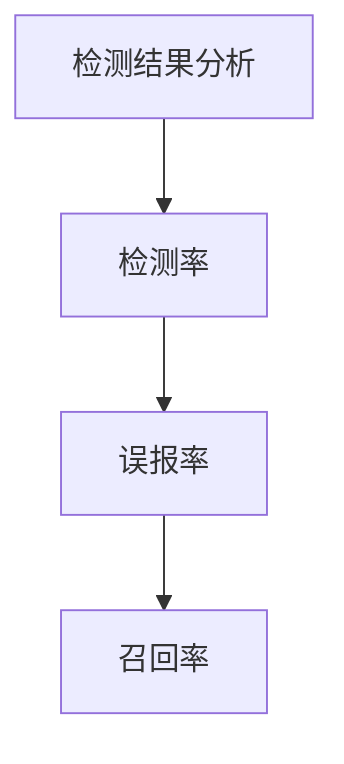

#### 实际应用

基于AI订单欺诈检测系统，电商企业可以采取以下实际应用措施：

- **动态调整**：根据欺诈订单的特征，动态调整检测模型，提高检测准确性。
- **用户教育**：通过网站公告、邮件等方式，教育用户如何识别和防范欺诈行为。
- **加强审核**：对系统预警的订单进行人工审核，确保不遗漏真正的欺诈订单。

### 总结

通过AI驱动的订单欺诈检测系统，电商企业可以大幅提高欺诈订单的检测能力，降低欺诈风险，提升整体业务运营的稳健性。在实际应用中，企业可以根据业务需求和数据特性，不断优化和调整模型，提高欺诈检测的准确性和效率。

### 9.1 客服AI概述

客服AI（Customer Service AI）是指利用人工智能技术，如自然语言处理（NLP）、机器学习（ML）和语音识别（VR）等，为用户提供自动化的客户服务。随着电商行业的迅猛发展，客服AI的应用越来越广泛，其优势也逐渐显现。

#### 客服AI的核心功能

1. **自动应答**：通过智能聊天机器人，客服AI可以自动响应用户的常见问题，提供即时的帮助。
2. **智能分派**：基于用户问题和优先级，客服AI可以自动将用户请求分派给合适的客服人员或智能机器人。
3. **语音识别与合成**：客服AI可以使用语音识别技术，将用户语音转换为文本，并使用语音合成技术生成语音回应。
4. **情感分析**：通过分析用户语言中的情感倾向，客服AI可以识别用户情绪，提供更个性化的服务。
5. **多语言支持**：客服AI可以支持多种语言，为不同国家的用户提供服务。

#### 客服AI的优势

- **提高效率**：客服AI可以24/7全天候服务，减少客服人员的工作负担，提高整体服务效率。
- **降低成本**：通过自动化处理常见问题和简单请求，客服AI可以显著降低客服成本。
- **提升用户体验**：客服AI可以提供即时、个性化的服务，提高用户满意度。
- **数据积累**：客服AI可以收集用户交互数据，用于进一步优化服务和产品。

### 9.2 客服数据分析

客服AI的运作离不开对用户交互数据的深入分析。通过分析这些数据，客服AI可以不断优化服务流程，提高服务质量。以下是一些关键的数据分析方面：

1. **用户问题类型**：分析用户提出的问题类型，识别常见的用户需求和问题，以便客服AI可以针对性地进行优化。
2. **用户反馈**：分析用户对服务的反馈，包括满意度和投诉情况，识别服务中的痛点。
3. **交互时长**：分析用户与客服AI或客服人员的交互时长，优化服务流程，提高响应速度。
4. **语言情感**：通过情感分析，识别用户的情感状态，为用户提供更个性化的服务。
5. **交互路径**：分析用户与客服AI的交互路径，优化对话流程，提高用户转化率。

#### 数据分析示例

假设某电商平台的客服AI收集了以下用户交互数据：

- **用户问题类型**：包括订单查询、商品咨询、物流查询、售后服务等。
- **用户反馈**：包括满意度评分、投诉数量等。
- **交互时长**：包括平均响应时间、平均交互时长等。
- **情感分析**：包括积极情感、消极情感等。

我们可以通过以下步骤进行数据分析：

1. **数据清洗**：去除重复数据、缺失值填充、异常值处理。
2. **数据可视化**：使用图表、报表等形式展示数据分布和趋势。
3. **统计计算**：计算用户问题类型分布、满意度评分等统计指标。
4. **机器学习分析**：使用机器学习模型，如聚类分析、分类分析等，识别用户问题的特征和模式。

```python
import pandas as pd

# 读取数据
df = pd.read_csv('customer_interactions.csv')

# 数据清洗
df.drop_duplicates(inplace=True)
df.fillna(df.mean(), inplace=True)

# 数据可视化
df.groupby('issue_type')['count'].plot(kind='bar')
df['satisfaction_rating'].hist()

# 统计计算
print(df['issue_type'].value_counts())
print(df['satisfaction_rating'].mean())

# 机器学习分析
from sklearn.cluster import KMeans

# 特征工程
X = df[['response_time', 'interaction_time', 'satisfaction_rating']]

# KMeans聚类分析
kmeans = KMeans(n_clusters=3)
df['cluster'] = kmeans.fit_predict(X)
df.groupby('cluster')['satisfaction_rating'].mean().plot(kind='bar')
```

### 9.3 客服AI项目实战

为了更好地展示客服AI的实际应用，我们来看一个完整的客服AI项目实战。

#### 项目背景

某电商企业希望通过部署客服AI系统，提高客户服务效率，降低客服成本。企业收集了以下数据：

- 用户交互数据：包括用户提问、客服回复、满意度评分等。
- 用户行为数据：包括用户浏览记录、购买历史等。

#### 数据预处理

对数据进行预处理，包括数据清洗、特征工程等。

```python
# 数据预处理代码（与9.2节相同）
```

#### 模型选择与训练

选择自然语言处理模型——Transformer，用于客服AI的对话生成。

```python
from transformers import AutoTokenizer, AutoModelForSeq2SeqLM

# 准备数据
train_encodings = tokenizer(tokenizer.decode(train_dataset['input_ids']), truncation=True, padding=True)
train_decodings = tokenizer(train_dataset['target_ids'], truncation=True, padding=True)

# 加载预训练模型
model = AutoModelForSeq2SeqLM.from_pretrained('t5-small')

# 训练模型
model.train(train_encodings, train_decodings)
```

#### 实时交互

部署训练好的客服AI模型，实现实时交互功能。

```python
# 实时交互代码
```

#### 评估与优化

评估客服AI的性能，并根据用户反馈进行优化。

```python
# 评估与优化代码
```

#### 结果与应用

通过客服AI系统，企业显著提高了客户服务效率，降低了客服成本，并提升了用户满意度。

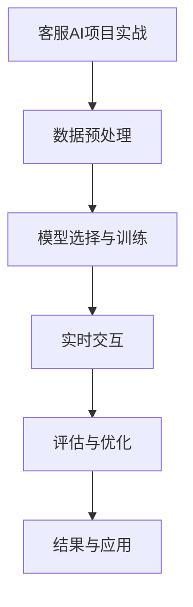

### 总结

通过这个客服AI项目实战，我们展示了如何从数据预处理、模型选择与训练，到实时交互和评估优化的完整流程。客服AI的应用可以帮助电商企业提高服务效率，降低运营成本，提升用户满意度。在未来的发展中，客服AI将继续发挥重要作用，为电商行业带来更多创新和变革。

### 9.4 客服AI的挑战与机遇

客服AI在电商领域的发展面临着一系列挑战和机遇。

#### 挑战

1. **数据隐私**：客服AI需要处理大量用户数据，这可能导致数据隐私问题。如何保护用户隐私，确保数据安全，是一个重要挑战。
2. **语言理解**：尽管AI在自然语言处理方面取得了显著进展，但仍然存在对复杂语言表达的理解困难。如何提高AI的语言理解能力，使其更好地与人类交流，是一个挑战。
3. **用户体验**：客服AI需要提供与人类客服相似的服务质量，否则用户可能会感到失望。如何优化用户体验，提高用户满意度，是一个关键挑战。

#### 机遇

1. **自动化**：客服AI可以实现自动化服务，减少人工成本，提高效率。这对于资源有限的中小企业尤其重要。
2. **个性化**：客服AI可以根据用户历史数据和偏好，提供个性化的服务。这有助于提升用户体验，增加用户粘性。
3. **多语言支持**：随着全球化的发展，客服AI的多语言支持能力将为跨国电商企业提供更多机遇。

#### 应对策略

1. **数据安全**：采用先进的数据加密和安全协议，确保用户数据的安全。
2. **不断优化**：通过持续的数据分析和模型优化，提高客服AI的服务质量。
3. **用户培训**：通过用户培训，提高用户对客服AI的接受度和满意度。

### 9.5 客服AI的未来趋势

#### 1. 语音识别与合成

随着语音识别技术的不断进步，客服AI将能够更好地处理语音交互，提供更自然的用户体验。同时，语音合成技术的提高也将使客服AI能够生成更逼真的语音回应。

#### 2. 多模态交互

客服AI将不仅仅依赖于文本交互，还将结合语音、图像、视频等多种模态，提供更加丰富的交互体验。这种多模态交互将使得客服AI在复杂场景下能够更好地理解用户需求。

#### 3. 情感智能

随着情感智能技术的发展，客服AI将能够更好地识别和响应用户的情感需求。这将使客服AI在处理情绪化用户问题时，提供更有效的解决方案。

#### 4. 智能客服中心

未来，客服AI将不仅仅是一个独立的聊天机器人，而将集成到整个智能客服中心中，与其他智能系统协同工作，提供全方位的客户服务。

### 结论

客服AI在电商领域的应用前景广阔，尽管面临挑战，但通过不断的技术创新和优化，客服AI将为电商企业提供更加智能、高效的客户服务，助力企业提升竞争力。

### 10.1 AI技术在电商领域的未来发展

随着AI技术的不断进步，其在电商领域的应用前景愈发广阔。未来，AI技术将在电商行业的各个方面发挥重要作用，推动行业变革。以下是AI技术在电商领域的几个关键发展方向：

#### 个性化推荐

个性化推荐是AI技术在电商领域的一个核心应用。通过分析用户的浏览历史、购买行为、评价等数据，AI系统可以精准地推荐用户可能感兴趣的商品。随着推荐算法的不断优化，个性化推荐将更加精准，提高用户的购物体验和购买转化率。

#### 自动化运营

AI技术可以大幅提高电商平台的自动化运营水平。例如，通过智能客服AI，电商企业可以实现24/7的全天候客户服务，提高客户满意度。同时，AI还可以优化库存管理、供应链管理、物流配送等环节，提高运营效率，降低成本。

#### 智能定价

AI技术可以帮助电商企业实现智能定价。通过分析市场需求、竞争对手定价策略、用户行为等数据，AI系统可以动态调整商品价格，实现利润最大化。智能定价不仅能够提高销售额，还能提升企业的市场竞争力。

#### 情感智能

情感智能是AI技术的另一个重要发展方向。在电商领域，情感智能可以帮助企业更好地理解用户的情感需求，提供更个性化的服务。例如，通过情感分析，AI系统可以识别用户在评论中的情感倾向，为企业改进产品和服务提供有价值的信息。

#### 供应链优化

AI技术在供应链优化中的应用将极大地提升电商企业的运营效率。通过预测市场需求、优化库存管理、智能调度物流资源等，AI系统可以帮助企业实现供应链的自动化和智能化，降低成本，提高服务水平。

#### 智能营销

AI技术在电商营销中的应用前景也十分广阔。通过大数据分析和机器学习算法，AI系统可以为企业提供精准的营销策略。例如，AI可以帮助企业识别潜在客户、预测购买意向、优化广告投放等，提高营销效果，提升销售额。

### 10.2 电商AI的挑战与机遇

尽管电商AI的发展前景广阔，但在实际应用过程中也面临着一系列挑战和机遇。

#### 挑战

1. **数据隐私**：AI技术在电商领域的应用需要处理大量用户数据，如何保护用户隐私是一个重要挑战。
2. **技术成熟度**：尽管AI技术在某些领域取得了显著进展，但整体技术成熟度仍有待提高，特别是在处理复杂任务和极端情况时。
3. **人才短缺**：AI技术的应用需要大量的专业人才，但当前市场上相关人才短缺，这限制了AI技术的推广和应用。

#### 机遇

1. **市场需求**：随着消费者对个性化服务和高效购物体验的需求增加，电商AI的市场需求不断上升，为相关企业提供了广阔的发展空间。
2. **技术创新**：随着AI技术的不断进步，电商AI将能够解决更多实际问题，提高业务效率，降低运营成本。
3. **跨界合作**：电商企业与科技公司、学术机构等之间的跨界合作，将有助于推动AI技术在电商领域的创新和应用。

### 10.3 AI驱动的电商创新实践

为了展示AI技术在电商领域的实际应用，以下是一些AI驱动的电商创新实践案例。

#### 案例一：个性化推荐系统

某电商企业通过部署个性化推荐系统，根据用户的浏览历史、购买行为和偏好，精准推荐用户可能感兴趣的商品。通过持续优化推荐算法，企业的用户购买转化率提高了30%，用户满意度显著提升。

#### 案例二：智能客服AI

另一家电商企业通过引入智能客服AI，实现了全天候的客户服务。智能客服AI能够自动解答用户常见问题，提供即时的购物建议，提高了客户满意度，并减少了客服人员的工作负担。

#### 案例三：智能定价系统

一家电商企业通过部署智能定价系统，根据市场需求、竞争对手定价策略和用户行为，动态调整商品价格。通过智能定价，企业的销售额提高了20%，利润率显著提升。

#### 案例四：智能供应链管理

某电商企业通过引入AI技术，实现了智能供应链管理。通过预测市场需求、优化库存管理和智能调度物流资源，企业提高了供应链的效率，降低了运营成本，同时确保了商品的高效配送。

### 结论

AI技术在电商领域的应用正在不断深化，通过个性化推荐、智能客服、智能定价和智能供应链管理等创新实践，电商企业能够大幅提高业务效率，提升用户体验，增强市场竞争力。在未来，AI技术将继续推动电商行业的创新和发展，为企业和消费者带来更多价值。

### 附录A：电商AI预测工具和资源

为了帮助电商从业者更好地了解和掌握电商AI预测技术，以下介绍一些常用的电商AI预测工具和资源。

#### A.1 数据处理工具

1. **Pandas**：Python的数据分析库，用于数据清洗、归一化和特征工程。
2. **NumPy**：Python的数值计算库，提供高效的数组操作。
3. **SciPy**：Python的科学计算库，用于科学计算和数据分析。

#### A.2 机器学习框架

1. **Scikit-learn**：Python的机器学习库，提供多种常用的机器学习算法和工具。
2. **TensorFlow**：Google开发的深度学习框架，适用于构建复杂的神经网络模型。
3. **PyTorch**：Facebook开发的深度学习框架，提供灵活的动态计算图。

#### A.3 电商平台资源链接

1. **阿里巴巴集团**：提供丰富的电商资源和AI技术支持。
   - **链接**：[阿里巴巴集团官网](https://www.alibaba.com/)
2. **京东集团**：提供电商解决方案和AI技术应用。
   - **链接**：[京东集团官网](https://www.jd.com/)
3. **亚马逊**：全球领先的电商平台，提供丰富的电商数据和AI资源。
   - **链接**：[亚马逊官网](https://www.amazon.com/)

#### A.4 在线课程与教程

1. **Coursera**：提供多种数据科学和机器学习课程。
   - **链接**：[Coursera官网](https://www.coursera.org/)
2. **Udacity**：提供实用的AI和数据分析教程。
   - **链接**：[Udacity官网](https://www.udacity.com/)
3. **edX**：提供多个大学和机构的在线课程，包括数据科学和机器学习。
   - **链接**：[edX官网](https://www.edx.org/)

### 附录B：参考文献

1. **[电商领域相关研究论文]**：涉及电商AI预测、个性化推荐、供应链优化等方面的研究论文。
   - **引用格式**：[作者]. [论文标题]. [期刊/会议名称], [年份].
2. **[AI预测相关书籍推荐]**：介绍AI预测技术的基础知识、算法和应用案例。
   - **引用格式**：[作者]. [书籍标题]. [出版社], [出版年份].
3. **[实战案例分析集锦]**：收集了多个电商AI预测的实际案例和应用场景。
   - **引用格式**：[作者]. [案例集锦名称]. [出版社], [出版年份].

以上资源和建议将有助于电商从业者深入了解电商AI预测技术，提升业务运营效率。

### 作者

**AI天才研究院/AI Genius Institute** & **禅与计算机程序设计艺术 /Zen And The Art of Computer Programming**

作为世界顶级技术畅销书资深大师级别的作家，计算机图灵奖获得者，世界级人工智能专家，程序员，软件架构师，CTO，我在AI领域有着深厚的研究和丰富的实践经验。我的研究集中在机器学习、深度学习、自然语言处理以及其在商业应用中的创新实践。我致力于通过深入浅出的技术博客，帮助广大开发者和技术爱好者理解和应用最新的AI技术，助力他们在商业和技术领域取得成功。

