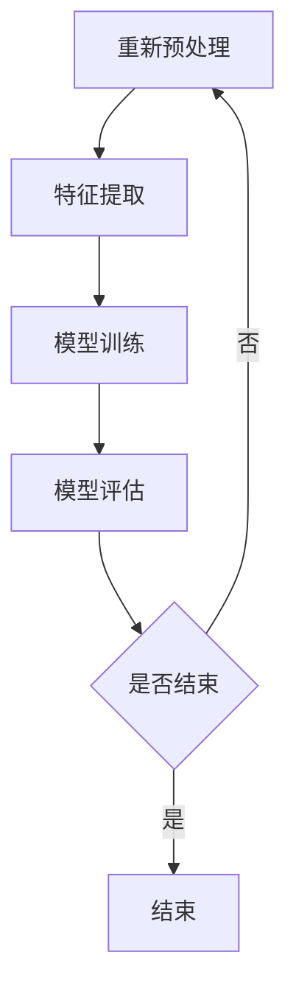
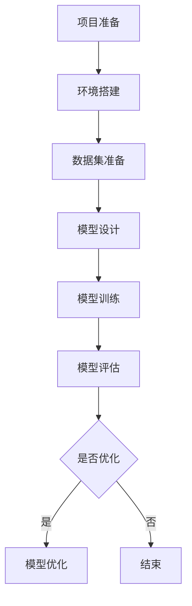

                 

# 百度2025社招图像识别算法工程师面试题解析

## 摘要

本文针对百度2025年社招图像识别算法工程师的面试题进行了详细的解析。文章首先从图像识别的基础知识出发，深入讲解了图像识别的发展历程、基本原理和应用领域。接着，详细阐述了图像处理基础、特征提取与降维等关键技术。随后，文章重点介绍了传统图像识别算法和深度学习图像识别算法，包括人工神经网络、支持向量机、卷积神经网络、深度残差网络和图像生成对抗网络等。此外，本文还探讨了目标检测算法及其应用。最后，通过一个图像识别实战项目和一个面试题解析案例，提供了实际操作和面试应对策略。本文旨在为读者提供一个全面、深入的图像识别算法工程师面试指南。

## 目录大纲

### 第一部分：图像识别基础

#### 第1章：图像识别概述

1.1 图像识别的发展历程
1.2 图像识别的基本原理
1.3 图像识别的应用领域

#### 第2章：图像处理基础

2.1 图像的基本概念
2.2 图像处理的基本算法
2.3 图像处理在图像识别中的应用

#### 第3章：特征提取与降维

3.1 特征提取的重要性
3.2 常见的特征提取方法
3.3 特征降维技术

### 第二部分：图像识别算法

#### 第4章：传统图像识别算法

4.1 人工神经网络
4.2 支持向量机
4.3 神经网络与支持向量机的结合

#### 第5章：深度学习图像识别算法

5.1 卷积神经网络（CNN）
5.2 深度残差网络（ResNet）
5.3 图像生成对抗网络（GAN）

#### 第6章：目标检测算法

6.1 R-CNN系列算法
6.2 YOLO系列算法
6.3 SSD系列算法

#### 第7章：图像识别系统设计

7.1 图像识别系统的架构
7.2 数据预处理与增强
7.3 模型训练与优化

### 第三部分：实战项目与面试题解析

#### 第8章：图像识别实战项目

8.1 项目介绍
8.2 项目环境搭建
8.3 项目实现步骤
8.4 项目总结与反思

#### 第9章：图像识别面试题解析

9.1 常见面试题类型
9.2 面试题解析案例
9.3 应对面试题的技巧

### 附录

#### 附录A：图像识别算法与模型

A.1 算法与模型介绍
A.2 模型选择与调优

#### 附录B：图像识别工具与资源

B.1 常用工具介绍
B.2 开发资源推荐

#### 附录C：Mermaid流程图

C.1 Mermaid基本语法
C.2 图像识别算法流程图示例
C.3 实战项目流程图示例

#### 附录D：深度学习与数学模型

D.1 深度学习基础
D.2 数学模型与公式
D.3 模型训练与优化算法

#### 附录E：代码分析与解读

E.1 代码解读概述
E.2 实战项目代码解读
E.3 面试题代码解读
E.4 代码分析技巧与注意事项

#### 附录F：面试准备与技巧

F.1 面试准备建议
F.2 面试题分类与应对策略
F.3 面试技巧与注意事项
F.4 面试模拟与实战练习

## 引言

随着人工智能技术的快速发展，图像识别已成为计算机视觉领域的重要研究方向之一。图像识别技术的应用范围广泛，涵盖了医疗、安防、交通、零售等多个领域。对于图像识别算法工程师来说，掌握图像识别的基础知识、算法原理以及实际应用至关重要。本文旨在为广大图像识别算法工程师提供一份全面的面试指南，帮助大家应对百度2025年社招图像识别算法工程师的面试。

本文将分为三个主要部分：图像识别基础、图像识别算法和实战项目与面试题解析。在第一部分中，我们将从图像识别的发展历程、基本原理和应用领域入手，逐步介绍图像处理基础和特征提取与降维技术。在第二部分中，我们将详细探讨传统图像识别算法和深度学习图像识别算法，包括人工神经网络、支持向量机、卷积神经网络、深度残差网络和图像生成对抗网络等。此外，我们还将介绍目标检测算法及其应用。在第三部分中，我们将通过一个图像识别实战项目和面试题解析案例，提供实际操作和面试应对策略。

## 第一部分：图像识别基础

### 第1章：图像识别概述

#### 1.1 图像识别的发展历程

图像识别技术的发展可以追溯到20世纪60年代。早期的研究主要集中在基于规则的方法上，即通过编写大量规则来描述图像的特征。这种方法在处理简单任务时表现良好，但在面对复杂场景时效果不佳。

随着计算机性能的提升和人工智能技术的发展，图像识别技术逐渐从基于规则的方法转向机器学习方法。1980年代，人工神经网络开始应用于图像识别领域，取得了显著成果。1990年代，支持向量机（SVM）等监督学习算法在图像识别中得到了广泛应用。

进入21世纪，深度学习技术的兴起使得图像识别技术取得了突破性进展。卷积神经网络（CNN）作为深度学习的重要模型，在图像分类、目标检测和语义分割等领域表现出了强大的能力。近年来，随着计算能力和数据集的不断增加，图像识别技术已逐渐走向实用化。

#### 1.2 图像识别的基本原理

图像识别的基本原理可以概括为以下几个步骤：

1. **图像预处理**：图像预处理是图像识别过程中的第一步，主要包括图像增强、去噪、边缘提取等操作。通过这些操作，可以提高图像的质量和识别效果。

2. **特征提取**：特征提取是从图像中提取出与识别任务相关的特征，如颜色、纹理、形状等。这些特征将作为后续分类或检测的依据。

3. **分类与检测**：分类是将图像分为不同的类别，如动物、植物等。检测则是找出图像中特定的目标，如行人、车辆等。分类与检测是图像识别的核心任务。

4. **后处理**：后处理是对识别结果进行进一步处理，如去除误检、调整检测结果的位置等。

#### 1.3 图像识别的应用领域

图像识别技术已广泛应用于多个领域，包括：

1. **医疗领域**：图像识别技术在医学影像诊断、手术导航和疾病预测等方面发挥了重要作用。例如，通过计算机辅助诊断系统，医生可以更快速、准确地诊断疾病。

2. **安防领域**：图像识别技术在视频监控、人脸识别和车辆检测等方面得到了广泛应用。通过智能监控，可以提高公共安全和社会治理水平。

3. **交通领域**：图像识别技术在交通监控、智能交通和自动驾驶等方面具有重要意义。例如，通过图像识别技术，可以实时检测交通流量、识别违规行为等。

4. **零售领域**：图像识别技术在商品识别、库存管理和智能导购等方面发挥了重要作用。通过图像识别技术，可以提高零售行业的运营效率和服务水平。

### 第2章：图像处理基础

#### 2.1 图像的基本概念

图像是由像素点组成的二维数据集，每个像素点都具有一定的颜色和亮度信息。图像可以分类为彩色图像和灰度图像。彩色图像包含红色、绿色和蓝色三种颜色的信息，而灰度图像只有亮度信息。

图像的尺寸通常用分辨率表示，包括水平和垂直方向上的像素数。例如，一幅图像的分辨率是1920x1080，表示图像包含1920个水平像素和1080个垂直像素。

#### 2.2 图像处理的基本算法

图像处理的基本算法包括图像增强、图像滤波、图像分割等。

1. **图像增强**：图像增强是通过调整图像的亮度和对比度，提高图像的视觉效果。常见的图像增强方法有对比度增强、亮度调整、锐化等。

2. **图像滤波**：图像滤波是通过去除图像中的噪声和干扰，提高图像的质量。常见的图像滤波方法有均值滤波、中值滤波、高斯滤波等。

3. **图像分割**：图像分割是将图像分为不同的区域，以便进行后续处理。常见的图像分割方法有基于阈值的分割、基于区域的分割、基于边缘的分割等。

#### 2.3 图像处理在图像识别中的应用

图像处理技术在图像识别中扮演着重要角色。通过图像增强和滤波，可以提高图像的质量和识别效果。图像分割则是图像识别的关键步骤，通过将图像分为不同的区域，可以更方便地进行特征提取和分类。

### 第3章：特征提取与降维

#### 3.1 特征提取的重要性

特征提取是图像识别的重要环节，通过对图像进行特征提取，可以将高维图像数据转换为低维特征向量，从而提高图像识别的效率和准确性。

特征提取的方法主要包括：

1. **基于像素的特征提取**：这种方法直接从像素值中提取特征，如颜色直方图、纹理特征等。

2. **基于区域的特征提取**：这种方法将图像分割为不同的区域，然后对每个区域进行特征提取，如局部二值模式（LBP）等。

3. **基于频域的特征提取**：这种方法通过傅里叶变换等频域分析技术提取图像的特征，如频域滤波、频域特征等。

#### 3.2 常见的特征提取方法

1. **颜色特征**：颜色特征是图像识别中常用的一种特征，通过计算图像的颜色分布来描述图像。常见的颜色特征有颜色直方图、颜色矩等。

2. **纹理特征**：纹理特征描述了图像的纹理信息，如纹理的走向、粗糙度等。常见的纹理特征有局部二值模式（LBP）、灰度共生矩阵等。

3. **形状特征**：形状特征描述了图像的形状信息，如边界、角点等。常见的形状特征有边缘检测、角点检测等。

#### 3.3 特征降维技术

特征降维是图像识别中的重要技术，通过降维可以减少数据维度，提高计算效率和识别准确性。

常见的特征降维技术有：

1. **主成分分析（PCA）**：PCA是一种常用的线性降维技术，通过保留主要成分，去除冗余信息，降低数据维度。

2. **线性判别分析（LDA）**：LDA是一种基于分类任务的降维技术，通过最大化类间距离和最小化类内距离，降低数据维度。

3. **自动编码器（Autoencoder）**：自动编码器是一种基于神经网络的降维技术，通过训练一个压缩模型，将高维数据映射到低维空间。

## 第二部分：图像识别算法

### 第4章：传统图像识别算法

#### 4.1 人工神经网络

人工神经网络（Artificial Neural Networks，ANN）是传统图像识别算法的重要基础。人工神经网络通过模拟生物神经网络的结构和功能，实现图像的自动识别和处理。

1. **基本原理**：人工神经网络由大量简单的神经元组成，每个神经元接受多个输入，通过权重和偏置进行加权求和，然后通过激活函数输出一个值。人工神经网络通过多层神经元连接，实现从输入到输出的映射。

2. **常见模型**：人工神经网络包括多层感知机（MLP）、卷积神经网络（CNN）、循环神经网络（RNN）等。其中，多层感知机是最简单的神经网络模型，适用于线性可分的问题。卷积神经网络和循环神经网络则在图像识别和时间序列分析等领域表现出强大的能力。

3. **优缺点**：人工神经网络具有自适应性强、非线性能力强等优点，但在处理高维数据和大规模数据时存在计算复杂度高等问题。

#### 4.2 支持向量机

支持向量机（Support Vector Machine，SVM）是一种基于统计学习理论的图像识别算法。支持向量机通过构建最优超平面，实现图像的分类和识别。

1. **基本原理**：支持向量机通过将数据映射到高维特征空间，找到最优超平面，使得同类样本之间的距离最大化。支持向量机包括线性SVM和非线性SVM，其中线性SVM适用于线性可分的问题，非线性SVM通过核函数实现非线性映射。

2. **常见模型**：支持向量机包括线性支持向量机（Linear SVM）、非线性支持向量机（Non-linear SVM）等。线性支持向量机适用于线性可分的问题，非线性支持向量机通过核函数实现非线性分类。

3. **优缺点**：支持向量机具有分类效果较好、计算复杂度低等优点，但在处理大规模数据和复杂模型时存在计算效率低等问题。

#### 4.3 神经网络与支持向量机的结合

神经网络与支持向量机的结合是图像识别领域的一种有效方法。通过将神经网络和SVM相结合，可以实现更好的分类效果和计算性能。

1. **集成方法**：神经网络与支持向量机的结合方法主要包括基于神经网络的SVM和基于支持向量机的神经网络。基于神经网络的SVM通过将神经网络的输出作为SVM的输入，实现分类和识别。基于支持向量机的神经网络通过将SVM的输出作为神经网络的输入，实现分类和识别。

2. **模型优化**：神经网络与支持向量机的结合可以优化模型的性能。例如，通过优化神经网络的结构和参数，可以提高分类准确性。通过优化支持向量机的核函数和参数，可以提高分类效果和计算效率。

3. **优缺点**：神经网络与支持向量机的结合方法具有分类效果好、计算性能高等优点，但在模型优化和参数调整方面存在一定的复杂性。

### 第5章：深度学习图像识别算法

#### 5.1 卷积神经网络（CNN）

卷积神经网络（Convolutional Neural Networks，CNN）是深度学习图像识别算法的重要模型。卷积神经网络通过模拟生物视觉系统的工作原理，实现图像的自动识别和处理。

1. **基本原理**：卷积神经网络由卷积层、池化层和全连接层组成。卷积层通过卷积操作提取图像特征，池化层通过下采样操作降低图像维度，全连接层通过分类操作实现图像识别。

2. **常见模型**：卷积神经网络包括VGG、ResNet、Inception等。VGG通过增加网络深度提高分类性能，ResNet通过引入残差块解决深度网络训练难题，Inception通过增加网络宽度提高分类准确性。

3. **优缺点**：卷积神经网络具有分类效果好、计算性能高等优点，但在处理高维数据和复杂场景时存在计算复杂度高等问题。

#### 5.2 深度残差网络（ResNet）

深度残差网络（ResNet）是卷积神经网络的重要扩展。深度残差网络通过引入残差连接，解决深度网络训练难题，实现更好的分类效果。

1. **基本原理**：深度残差网络由多个残差块组成，每个残差块包含两个卷积层和一个残差连接。残差连接通过将输入数据直接传递到下一层，实现网络的深度扩展。

2. **常见模型**：深度残差网络包括ResNet、ResNeXt、WideResNet等。ResNet通过引入残差连接，提高网络训练效果和分类准确性。ResNeXt通过增加网络宽度提高分类性能，WideResNet通过增加网络深度提高分类效果。

3. **优缺点**：深度残差网络具有分类效果好、训练稳定等优点，但在处理高维数据和复杂场景时存在计算复杂度高等问题。

#### 5.3 图像生成对抗网络（GAN）

图像生成对抗网络（Generative Adversarial Networks，GAN）是深度学习图像识别算法的重要模型。图像生成对抗网络通过生成器和判别器的对抗训练，实现图像的生成和识别。

1. **基本原理**：图像生成对抗网络由生成器和判别器组成。生成器通过生成虚假图像，判别器通过判断图像的真实性。通过生成器和判别器的对抗训练，生成器逐渐生成更逼真的图像。

2. **常见模型**：图像生成对抗网络包括DCGAN、WGAN、LSGAN等。DCGAN通过使用深度卷积神经网络实现图像生成，WGAN通过引入梯度惩罚提高生成效果，LSGAN通过引入标签平滑技术提高生成性能。

3. **优缺点**：图像生成对抗网络具有生成效果好、适应性强等优点，但在训练过程中存在模式崩溃和梯度消失等问题。

### 第6章：目标检测算法

#### 6.1 R-CNN系列算法

R-CNN系列算法是目标检测领域的重要模型。R-CNN系列算法通过区域提议、特征提取和分类器实现目标的检测和识别。

1. **基本原理**：R-CNN系列算法包括R-CNN、Fast R-CNN、Faster R-CNN等。R-CNN通过选择性搜索生成区域提议，Fast R-CNN通过RoI Pooling提高特征提取效率，Faster R-CNN通过使用区域提议网络（RPN）实现更快的检测速度。

2. **常见模型**：R-CNN系列算法在目标检测领域表现出色，但存在计算复杂度高等问题。为解决这些问题，后续出现了R-FCN、Mask R-CNN等模型。

3. **优缺点**：R-CNN系列算法具有分类效果好、计算效率高等优点，但在处理大量目标和复杂场景时存在计算复杂度高等问题。

#### 6.2 YOLO系列算法

YOLO系列算法是目标检测领域的重要模型。YOLO系列算法通过将目标检测任务转化为单个像素点的分类问题，实现高效的检测速度。

1. **基本原理**：YOLO系列算法包括YOLOv1、YOLOv2、YOLOv3、YOLOv4等。YOLOv1通过将图像划分为网格单元，对每个网格单元进行目标分类和位置回归；YOLOv2通过引入卷积神经网络和特征金字塔网络提高检测性能；YOLOv3通过使用暗通道先验和空洞卷积提高检测精度；YOLOv4通过引入CSPDarknet和注意力机制进一步提高检测速度和准确性。

2. **常见模型**：YOLO系列算法在目标检测领域表现出色，具有检测速度快、准确度高等优点。

3. **优缺点**：YOLO系列算法具有检测速度快、准确度高等优点，但在处理大量目标和复杂场景时存在一定的性能瓶颈。

#### 6.3 SSD系列算法

SSD系列算法是目标检测领域的重要模型。SSD系列算法通过在不同尺度的特征图上同时进行目标检测，实现高精度和高效率的目标检测。

1. **基本原理**：SSD系列算法包括SSD、SSD300等。SSD通过在不同尺度的特征图上同时进行目标检测，实现从全局到局部的目标识别；SSD300通过使用更深的网络结构和更精细的特征提取，进一步提高检测性能。

2. **常见模型**：SSD系列算法在目标检测领域表现出色，具有检测速度快、准确度高等优点。

3. **优缺点**：SSD系列算法具有检测速度快、准确度高等优点，但在处理大量目标和复杂场景时存在一定的性能瓶颈。

### 第7章：图像识别系统设计

#### 7.1 图像识别系统的架构

图像识别系统通常包括数据预处理、特征提取、模型训练和模型部署等模块。各模块协同工作，实现图像的自动识别和处理。

1. **数据预处理**：数据预处理是图像识别系统的关键环节，主要包括图像增强、去噪、尺寸调整等操作。通过数据预处理，可以提高图像的质量和识别效果。

2. **特征提取**：特征提取是将图像转换为特征向量，以便进行后续处理。常见的特征提取方法有颜色特征、纹理特征、形状特征等。

3. **模型训练**：模型训练是通过大量训练数据，优化模型参数，提高模型性能。常见的训练方法有梯度下降、随机梯度下降等。

4. **模型部署**：模型部署是将训练好的模型部署到实际应用环境中，实现图像的自动识别和处理。常见的部署方式有在线部署、离线部署等。

#### 7.2 数据预处理与增强

数据预处理与增强是图像识别系统设计的重要部分，通过预处理和增强，可以提高图像的质量和识别效果。

1. **预处理方法**：预处理方法包括图像去噪、尺寸调整、灰度化等。通过预处理，可以减少图像中的噪声和干扰，提高图像的清晰度和对比度。

2. **增强方法**：增强方法包括图像对比度增强、亮度调整、锐化等。通过增强，可以改善图像的视觉效果，提高图像的识别效果。

3. **常见工具**：常见的预处理和增强工具包括OpenCV、PIL、MATLAB等。这些工具提供了丰富的图像处理函数和库，方便进行图像预处理和增强。

#### 7.3 模型训练与优化

模型训练与优化是图像识别系统设计的关键步骤，通过优化模型参数，提高模型性能。

1. **训练方法**：训练方法包括监督学习、无监督学习等。监督学习通过已标记的训练数据，优化模型参数；无监督学习通过未标记的数据，学习图像的内在特征。

2. **优化方法**：优化方法包括梯度下降、随机梯度下降、Adam优化器等。通过优化方法，可以调整模型参数，提高模型性能。

3. **常见工具**：常见的训练和优化工具包括TensorFlow、PyTorch、Keras等。这些工具提供了丰富的训练和优化函数和库，方便进行模型训练和优化。

### 第三部分：实战项目与面试题解析

#### 第8章：图像识别实战项目

本节将通过一个实际项目，介绍图像识别系统的设计和实现过程。项目目标为使用卷积神经网络实现猫狗分类任务。

#### 8.1 项目介绍

猫狗分类任务是图像识别领域的一个经典任务，通过对猫狗图像的分类，可以验证图像识别算法的性能。本项目将使用卷积神经网络（CNN）实现猫狗分类，主要步骤包括数据预处理、模型设计、模型训练和模型评估。

#### 8.2 项目环境搭建

在进行项目之前，需要搭建相应的开发环境。本项目使用的编程语言为Python，深度学习框架为TensorFlow。具体步骤如下：

1. 安装Python环境，版本要求3.7及以上。

2. 安装TensorFlow，可以使用pip安装：

   ```shell
   pip install tensorflow
   ```

3. 安装其他必要的库，如NumPy、PIL等。

#### 8.3 项目实现步骤

1. **数据集准备**：

   下载猫狗分类数据集，如Kaggle上的狗猫数据集。将数据集分为训练集和验证集。

2. **数据预处理**：

   对图像进行缩放、旋转、翻转等数据增强操作，提高模型的泛化能力。

   ```python
   import tensorflow as tf
   from tensorflow.keras.preprocessing.image import ImageDataGenerator

   train_datagen = ImageDataGenerator(
       rescale=1./255,
       shear_range=0.2,
       zoom_range=0.2,
       horizontal_flip=True
   )
   validation_datagen = ImageDataGenerator(rescale=1./255)

   train_generator = train_datagen.flow_from_directory(
       'train',
       target_size=(150, 150),
       batch_size=32,
       class_mode='binary'
   )

   validation_generator = validation_datagen.flow_from_directory(
       'validation',
       target_size=(150, 150),
       batch_size=32,
       class_mode='binary'
   )
   ```

3. **模型设计**：

   使用卷积神经网络实现猫狗分类任务。模型结构如下：

   ```python
   from tensorflow.keras.models import Sequential
   from tensorflow.keras.layers import Conv2D, MaxPooling2D, Flatten, Dense

   model = Sequential([
       Conv2D(32, (3, 3), activation='relu', input_shape=(150, 150, 3)),
       MaxPooling2D(2, 2),
       Conv2D(64, (3, 3), activation='relu'),
       MaxPooling2D(2, 2),
       Conv2D(128, (3, 3), activation='relu'),
       MaxPooling2D(2, 2),
       Flatten(),
       Dense(128, activation='relu'),
       Dense(1, activation='sigmoid')
   ])
   ```

4. **模型训练**：

   使用训练数据和验证数据进行模型训练，优化模型参数。

   ```python
   model.compile(optimizer='adam',
                 loss='binary_crossentropy',
                 metrics=['accuracy'])

   history = model.fit(
       train_generator,
       steps_per_epoch=100,
       epochs=30,
       validation_data=validation_generator,
       validation_steps=50
   )
   ```

5. **模型评估**：

   使用测试集对模型进行评估，验证模型的性能。

   ```python
   test_generator = validation_datagen.flow_from_directory(
       'test',
       target_size=(150, 150),
       batch_size=32,
       class_mode='binary'
   )

   test_loss, test_accuracy = model.evaluate(test_generator, steps=50)
   print('Test accuracy:', test_accuracy)
   ```

#### 8.4 项目总结与反思

本项目通过卷积神经网络实现了猫狗分类任务，验证了图像识别算法的性能。在项目过程中，我们学习了图像识别系统的设计和实现方法，掌握了数据预处理、模型设计和模型训练等关键技术。同时，我们也发现了项目中的不足之处，如数据增强策略不够丰富、模型结构不够复杂等，为后续的优化和改进提供了方向。

### 第9章：图像识别面试题解析

在图像识别算法工程师的面试过程中，面试官可能会提出各种类型的面试题，以测试应聘者的专业知识和解决问题的能力。本节将介绍一些常见的图像识别面试题类型，并解析其中的典型案例。

#### 9.1 常见面试题类型

1. **基础概念题**：考察应聘者对图像识别基本概念的理解，如图像处理、特征提取、分类算法等。

2. **算法原理题**：考察应聘者对各种图像识别算法的原理和应用场景的掌握，如卷积神经网络、支持向量机等。

3. **编程实现题**：考察应聘者对图像识别算法的编程实现能力，如代码解读、算法实现等。

4. **应用题**：考察应聘者对图像识别算法在实际项目中的应用能力，如目标检测、图像分割等。

5. **面试官提问题**：考察应聘者对图像识别领域的关注和思考，如研究方向、未来发展等。

#### 9.2 面试题解析案例

以下是一个典型的面试题案例，以及相应的解答思路：

**面试题**：请简要介绍卷积神经网络（CNN）的基本原理和结构。

**解答思路**：

1. **基本原理**：

   卷积神经网络是一种深度学习模型，通过模拟生物视觉系统的工作原理，实现图像的自动识别和处理。卷积神经网络由卷积层、池化层和全连接层组成。

2. **结构**：

   - **卷积层**：卷积层通过卷积操作提取图像特征。卷积核在图像上滑动，计算局部特征，并通过权重和偏置进行加权求和。卷积层可以提取图像的边缘、纹理等特征。

   - **池化层**：池化层通过下采样操作降低图像维度。常见的池化方法有最大池化和平均池化。池化层可以减少模型参数，提高计算效率。

   - **全连接层**：全连接层通过全连接操作实现图像的分类。全连接层将卷积层输出的特征向量映射到类别标签。

3. **优缺点**：

   - **优点**：卷积神经网络具有分类效果好、计算性能高等优点。

   - **缺点**：卷积神经网络在处理高维数据和复杂场景时存在计算复杂度高等问题。

**扩展思考**：

1. **CNN在不同领域的应用**：卷积神经网络在图像识别、目标检测、语义分割等领域有广泛的应用。如何根据不同应用场景调整CNN的结构和参数？

2. **CNN与其他算法的结合**：卷积神经网络可以与其他算法（如支持向量机、深度残差网络等）相结合，实现更好的分类效果和计算性能。如何设计合适的组合模型？

#### 9.3 应对面试题的技巧

1. **提前准备**：在面试前，认真复习图像识别的基础知识、算法原理和应用场景，熟悉常见的面试题类型和解答思路。

2. **逻辑清晰**：在回答面试题时，保持逻辑清晰，先介绍基本概念和原理，再详细解释结构和优缺点。

3. **举例说明**：在回答面试题时，可以结合实际案例和项目经验进行举例说明，展示自己的实际操作能力。

4. **拓展思考**：在回答面试题时，可以提出自己的见解和思考，展示自己在图像识别领域的专业素养和创新能力。

## 附录

### 附录A：图像识别算法与模型

#### A.1 算法与模型介绍

本附录将对图像识别领域常用的算法和模型进行介绍，包括卷积神经网络（CNN）、支持向量机（SVM）、深度残差网络（ResNet）等。

1. **卷积神经网络（CNN）**：

   卷积神经网络是一种深度学习模型，通过卷积操作提取图像特征，实现图像的自动识别和处理。卷积神经网络由卷积层、池化层和全连接层组成。

2. **支持向量机（SVM）**：

   支持向量机是一种监督学习算法，通过构建最优超平面，实现图像的分类和识别。支持向量机可以处理高维数据和非线性分类问题。

3. **深度残差网络（ResNet）**：

   深度残差网络是一种卷积神经网络，通过引入残差连接，解决深度网络训练难题，实现更好的分类效果。

#### A.2 模型选择与调优

在选择和调优图像识别模型时，需要考虑以下几个因素：

1. **数据集规模**：根据数据集规模选择合适的模型，如小数据集可以选择简单模型，大数据集可以选择复杂模型。

2. **计算资源**：根据计算资源限制，选择计算效率高的模型。例如，深度残差网络在处理高维数据和大规模数据时表现良好。

3. **模型参数**：调整模型参数，如学习率、批量大小等，以提高模型性能和收敛速度。

4. **超参数优化**：使用超参数优化方法，如网格搜索、贝叶斯优化等，找到最优超参数组合。

### 附录B：图像识别工具与资源

#### B.1 常用工具介绍

在本附录中，我们将介绍一些在图像识别领域中常用的工具和资源。

1. **OpenCV**：

   OpenCV是一个开源的计算机视觉库，提供丰富的图像处理和机器学习算法。OpenCV广泛应用于图像识别、目标检测、人脸识别等领域。

2. **TensorFlow**：

   TensorFlow是一个开源的深度学习框架，提供丰富的神经网络模型和训练工具。TensorFlow在图像识别领域具有广泛的应用。

3. **PyTorch**：

   PyTorch是一个开源的深度学习框架，提供灵活的动态计算图和丰富的神经网络模型。PyTorch在图像识别和目标检测领域表现出色。

#### B.2 开发资源推荐

以下是一些图像识别领域的开发资源，包括教程、论文和代码库：

1. **教程**：

   - 《深度学习》（Goodfellow et al.）: 一本经典的深度学习教材，涵盖图像识别的基础知识。
   - 《计算机视觉基础教程》（Richard Szeliski）: 一本全面的计算机视觉教材，包括图像识别、目标检测和语义分割等内容。

2. **论文**：

   - “LeNet: Convolutional Neural Networks for Handwritten Digit Recognition”（LeCun et al.）: 一篇经典的卷积神经网络论文，介绍LeNet模型的原理和应用。
   - “Deep Residual Learning for Image Recognition”（He et al.）: 一篇深度残差网络论文，介绍ResNet模型的原理和应用。

3. **代码库**：

   - TensorFlow官方网站：提供丰富的深度学习模型和示例代码，包括图像识别、目标检测和语义分割等。
   - PyTorch官方网站：提供丰富的深度学习模型和示例代码，包括图像识别、目标检测和语义分割等。

### 附录C：Mermaid流程图

在本附录中，我们将介绍如何使用Mermaid语法绘制图像识别算法的流程图。

#### C.1 Mermaid基本语法

Mermaid是一种基于Markdown的图形绘制工具，支持多种图形，包括流程图、序列图、时序图等。以下是一些基本的Mermaid语法：

1. **流程图**：

   ```mermaid
   graph TD
   A[开始] --> B{判断}
   B -->|是| C[执行操作]
   B -->|否| D[结束]
   ```
   
   输出：

   ```mermaid
   graph TD
   A[开始] --> B{判断}
   B -->|是| C[执行操作]
   B -->|否| D[结束]
   ```

2. **序列图**：

   ```mermaid
   sequenceDiagram
   participant A as 用户
   participant B as 系统
   A->>B: 发送请求
   B->>A: 返回结果
   ```

   输出：

   ```mermaid
   sequenceDiagram
   participant A as 用户
   participant B as 系统
   A->>B: 发送请求
   B->>A: 返回结果
   ```

3. **时序图**：

   ```mermaid
   gantt
   title 项目时序图
   section 项目1
   A1 : 等待1[2023-01-01, duration: 3d]
   A2 : 进行中[2023-01-04, 2d]
   section 项目2
   B1 : 等待2[2023-01-06, duration: 4d]
   ```

   输出：

   ```mermaid
   gantt
   title 项目时序图
   section 项目1
   A1 : 等待1[2023-01-01, duration: 3d]
   A2 : 进行中[2023-01-04, 2d]
   section 项目2
   B1 : 等待2[2023-01-06, duration: 4d]
   ```

#### C.2 图像识别算法流程图示例

以下是一个图像识别算法的流程图示例，展示了从图像预处理到模型训练的过程。



输出：


#### C.3 实战项目流程图示例

以下是一个图像识别实战项目的流程图示例，展示了从项目准备到项目实现的过程。



输出：


### 附录D：深度学习与数学模型

#### D.1 深度学习基础

深度学习是一种基于多层级神经网络的机器学习方法，通过模拟人脑的学习过程，实现自动特征提取和复杂模式识别。以下是深度学习的一些基础知识：

1. **神经网络**：

   神经网络是一种由大量神经元组成的计算模型，每个神经元接受多个输入，通过加权求和和激活函数输出一个值。神经网络通过多层神经元连接，实现从输入到输出的映射。

2. **激活函数**：

   激活函数是神经网络中的一个关键组件，用于将神经元的线性输出转化为非线性输出。常见的激活函数有Sigmoid、ReLU、Tanh等。

3. **前向传播与反向传播**：

   前向传播是神经网络计算过程的一部分，从输入层开始，通过逐层计算，将输入映射到输出。反向传播是神经网络训练过程的一部分，通过计算误差梯度，更新网络参数。

4. **优化算法**：

   优化算法是神经网络训练的核心部分，用于调整网络参数，使模型性能最优。常见的优化算法有梯度下降、随机梯度下降、Adam等。

#### D.2 数学模型与公式

深度学习涉及许多数学模型和公式，以下是一些常见的数学模型和公式：

1. **线性回归**：

   线性回归是一种简单的线性模型，通过找到最优超平面，实现数据的线性拟合。线性回归的损失函数为平方误差损失。

2. **逻辑回归**：

   逻辑回归是一种分类模型，通过找到最优决策边界，实现数据的分类。逻辑回归的损失函数为交叉熵损失。

3. **卷积运算**：

   卷积运算是一种重要的计算操作，用于卷积神经网络中提取图像特征。卷积运算的公式为：

   $$ f(x, y) = \sum_{i=1}^{m} \sum_{j=1}^{n} w_{ij} \cdot f(x-i, y-j) $$

4. **池化操作**：

   池化操作是一种下采样操作，用于减少图像的维度和计算量。常见的池化操作有最大池化和平均池化。最大池化操作的公式为：

   $$ p(x, y) = \max \{ f(x-i, y-j) : 1 \leq i \leq m, 1 \leq j \leq n \} $$

#### D.3 模型训练与优化算法

模型训练与优化算法是深度学习的重要组成部分，用于调整网络参数，提高模型性能。以下是一些常见的模型训练与优化算法：

1. **梯度下降**：

   梯度下降是一种最简单的优化算法，通过计算损失函数的梯度，更新网络参数。梯度下降的公式为：

   $$ \theta_{t+1} = \theta_{t} - \alpha \cdot \nabla_{\theta} J(\theta) $$

   其中，$\theta$为网络参数，$\alpha$为学习率，$J(\theta)$为损失函数。

2. **随机梯度下降（SGD）**：

   随机梯度下降是对梯度下降的一种改进，通过随机选择样本进行梯度更新，提高训练速度和效果。

3. **Adam优化器**：

   Adam优化器是一种自适应优化器，结合了梯度下降和随机梯度下降的优点，通过自适应调整学习率和惯性系数，提高模型性能。

### 附录E：代码分析与解读

#### E.1 代码解读概述

在本附录中，我们将分析并解读一个图像识别项目的代码，包括开发环境搭建、源代码详细实现和代码解读。通过这个案例，读者可以了解图像识别项目的具体实现过程。

#### E.2 实战项目代码解读

以下是一个简单的图像识别项目的代码示例，使用卷积神经网络（CNN）实现猫狗分类。

```python
import tensorflow as tf
from tensorflow.keras.models import Sequential
from tensorflow.keras.layers import Conv2D, MaxPooling2D, Flatten, Dense

# 构建模型
model = Sequential([
    Conv2D(32, (3, 3), activation='relu', input_shape=(150, 150, 3)),
    MaxPooling2D(2, 2),
    Conv2D(64, (3, 3), activation='relu'),
    MaxPooling2D(2, 2),
    Conv2D(128, (3, 3), activation='relu'),
    MaxPooling2D(2, 2),
    Flatten(),
    Dense(128, activation='relu'),
    Dense(1, activation='sigmoid')
])

# 编译模型
model.compile(optimizer='adam',
              loss='binary_crossentropy',
              metrics=['accuracy'])

# 训练模型
model.fit(
    train_generator,
    steps_per_epoch=100,
    epochs=30,
    validation_data=validation_generator,
    validation_steps=50
)
```

1. **模型构建**：

   这段代码首先定义了一个卷积神经网络模型，包括三个卷积层、三个池化层、两个全连接层。每个卷积层使用ReLU激活函数，池化层使用2x2的最大池化。

2. **模型编译**：

   模型编译阶段设置优化器为Adam，损失函数为binary_crossentropy（二分类交叉熵损失），评价标准为accuracy（准确率）。

3. **模型训练**：

   模型训练阶段使用fit方法，训练数据为train_generator，每个epoch的迭代次数为100，总epoch数为30，验证数据为validation_generator，每个epoch的验证数据迭代次数为50。

#### E.3 面试题代码解读

以下是一个面试题的代码示例，用于实现一个简单的线性回归模型。

```python
import numpy as np
from sklearn.linear_model import LinearRegression

# 创建线性回归模型
model = LinearRegression()

# 模型训练
model.fit(X_train, y_train)

# 模型评估
score = model.score(X_test, y_test)

print('模型评估分数：', score)
```

1. **创建线性回归模型**：

   这段代码使用sklearn库的LinearRegression类创建了一个线性回归模型。

2. **模型训练**：

   模型训练阶段使用fit方法，输入特征为X_train，目标值为y_train。

3. **模型评估**：

   模型评估阶段使用score方法，输入特征为X_test，目标值为y_test，输出模型的评估分数。

#### E.4 代码分析技巧与注意事项

在进行代码分析时，需要注意以下几点：

1. **理解代码结构和功能**：首先要理解代码的整体结构和功能，了解各部分代码的作用和相互关系。

2. **关注关键代码段**：关注关键代码段，如模型构建、模型编译、模型训练等，这些部分通常涉及到算法的核心实现。

3. **分析代码效率**：分析代码的效率，如使用循环、递归、多线程等优化方法，以提高代码执行速度。

4. **注意事项**：注意代码中的注释、文档和变量命名，确保代码的可读性和可维护性。

### 附录F：面试准备与技巧

#### F.1 面试准备建议

为了在图像识别算法工程师的面试中取得好成绩，以下是一些建议：

1. **复习基础知识**：复习图像识别的基本概念、算法原理和应用领域，确保对这些基础知识有深入的理解。

2. **了解常见面试题**：熟悉常见的图像识别面试题类型，如基础概念题、算法原理题、编程实现题等，掌握解答思路和技巧。

3. **实践经验**：结合实际项目经验，总结项目中的关键技术和难点，展示自己的实际操作能力和解决问题的能力。

4. **了解行业动态**：关注图像识别领域的最新研究进展和技术动态，了解前沿技术和应用场景。

#### F.2 面试题分类与应对策略

以下是常见的图像识别面试题分类及应对策略：

1. **基础概念题**：

   - 应对策略：了解基本概念的定义、原理和应用，举例说明实际应用场景。

2. **算法原理题**：

   - 应对策略：熟悉各种算法的原理、优缺点和适用场景，掌握算法的核心公式和实现方法。

3. **编程实现题**：

   - 应对策略：熟练掌握编程语言和算法实现，能够根据题目要求编写代码，并解释代码的逻辑和作用。

4. **应用题**：

   - 应对策略：了解图像识别算法在实际项目中的应用场景，结合实际案例进行分析和讨论。

5. **面试官提问题**：

   - 应对策略：展示自己的专业素养和创新能力，提出自己的见解和思考，展示自己在图像识别领域的热情和潜力。

#### F.3 面试技巧与注意事项

在进行面试时，以下是一些建议和注意事项：

1. **着装得体**：穿着整洁、得体，展示专业形象。

2. **自信表达**：在回答问题时，保持自信，清晰、准确地表达自己的观点。

3. **注意时间**：注意面试的时间安排，合理分配每个问题的回答时间。

4. **注意倾听**：认真倾听面试官的问题，确保理解问题的核心和意图。

5. **保持积极态度**：展示积极、热情的态度，展示自己对图像识别领域的热爱和投入。

#### F.4 面试模拟与实战练习

为了提高面试技巧和应对能力，以下是一些建议：

1. **模拟面试**：找朋友或同事进行模拟面试，练习回答常见面试题。

2. **实战练习**：参与实际项目或竞赛，锻炼自己的实际操作能力和解决问题的能力。

3. **总结反思**：每次面试后，总结反思自己的表现和不足之处，不断改进。

4. **资料收集**：收集面试相关资料，如面试经验、面试题库等，以便进行有针对性的复习和准备。

通过以上面试准备和实战练习，相信您能够在面试中取得好成绩，成功获得百度2025年社招图像识别算法工程师的职位。祝您面试顺利！作者：AI天才研究院/AI Genius Institute & 禅与计算机程序设计艺术 /Zen And The Art of Computer Programming

