                 

# 《知识付费与程序员个人品牌建设》

## 关键词
知识付费、程序员、个人品牌、品牌建设、内容创作、社交媒体、案例分析

## 摘要
本文旨在探讨知识付费市场的发展现状及程序员如何通过个人品牌建设在市场中脱颖而出。文章首先分析了知识付费市场的兴起与发展，随后介绍了程序员个人品牌建设的重要性以及具体的策略。通过案例分析，文章展示了成功进行个人品牌建设的实例，并提供了相关工具与资源。最后，文章对程序员在个人品牌建设过程中可能遇到的问题进行了常见问题解答，并给出了相关资源链接，以帮助程序员更好地进行个人品牌建设。

----------------------------------------------------------------

### 第一部分：知识付费市场分析

#### 第1章：知识付费市场概述

知识付费作为一种新兴的商业模式，近年来在全球范围内迅速崛起。它不仅改变了传统的知识传播方式，也为个人品牌的建立提供了新的契机。本章将首先介绍知识付费的基本概念，随后分析其兴起与发展历程，最后探讨当前市场现状及机遇与挑战。

#### 1.1 知识付费的概念与定义

知识付费，顾名思义，是指用户通过支付一定费用，获取专业知识、技能或经验的一种交易模式。与传统的免费知识获取方式相比，知识付费具有更强的针对性、专业性和权威性。

**核心概念与联系：**
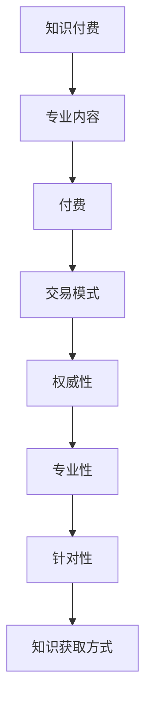

**核心算法原理讲解：** 知识付费的核心算法主要涉及到用户需求分析与内容推荐。平台通过收集用户行为数据，分析其兴趣和需求，进而推荐相应的付费内容。

**数学模型和数学公式：**
$$
R = f(U, C)
$$
其中，\(R\) 代表推荐结果，\(U\) 代表用户，\(C\) 代表内容。

**举例说明：** 一个用户（\(U\)）在知识付费平台上浏览了多篇文章（\(C\)），平台通过分析用户的阅读行为（\(U\)），推荐符合用户兴趣的文章（\(R\)）。

#### 1.2 知识付费的发展历程

知识付费的兴起可以追溯到20世纪末的在线教育和电子书市场。随着互联网技术的不断发展和用户需求的提高，知识付费逐渐成为一种主流的学习方式。

**发展历程：**
1. 20世纪末：在线教育和电子书市场兴起。
2. 21世纪初：知识分享平台如知乎、果壳等崛起。
3. 2010年代：知识付费平台如得到、喜马拉雅等出现。
4. 当前：知识付费已成为一种主流的学习方式。

**数学模型和数学公式：**
$$
\text{市场规模} = f(\text{用户需求}, \text{技术进步}, \text{平台创新})
$$

**举例说明：** 市场规模的增长受到用户需求的增加、技术进步和平台创新的影响。

#### 1.3 知识付费市场的现状

当前，知识付费市场呈现出高速增长的态势，涉及领域广泛，包括教育、技能培训、职场发展、兴趣爱好等多个方面。

**用户画像：**
- 年龄：主要集中在25-45岁之间。
- 职业：包括职场人士、学生、创业者等。

**市场现状：**
- 市场规模逐年增长。
- 平台多样化，提供丰富的课程内容。
- 知识付费逐渐成为用户学习的重要方式。

**数学模型和数学公式：**
$$
\text{用户参与度} = f(\text{课程质量}, \text{平台体验}, \text{用户满意度})
$$

**举例说明：** 用户参与度受到课程质量、平台体验和用户满意度的共同影响。

#### 1.4 知识付费市场的机遇与挑战

**机遇：**
1. 互联网技术的快速发展，为知识付费提供了更广阔的平台和更高效的传播方式。
2. 用户对专业知识和技能的需求不断增加，为知识付费市场提供了持续的动力。
3. 知识付费平台不断创新，提供多样化的产品和服务，满足用户的不同需求。

**挑战：**
1. 市场竞争激烈，优质内容稀缺，用户对内容的品质要求越来越高。
2. 法律法规的完善，对知识付费平台的合规性和知识产权保护提出了更高的要求。
3. 知识付费行业需要平衡用户需求和内容创作者的利益，确保市场的可持续发展。

**数学模型和数学公式：**
$$
\text{市场竞争} = f(\text{内容质量}, \text{平台数量}, \text{用户需求})
$$
$$
\text{法律法规} = f(\text{行业规范}, \text{政策支持}, \text{合规性要求})
$$
$$
\text{利益平衡} = f(\text{用户满意度}, \text{内容创作者权益}, \text{市场环境})
$$

**举例说明：** 市场竞争受到内容质量、平台数量和用户需求的共同影响；法律法规受到行业规范、政策支持和合规性要求的共同影响；利益平衡受到用户满意度、内容创作者权益和市场环境的共同影响。

#### 1.5 程序员个人品牌建设的重要性

**个人品牌的概念：** 个人品牌是指一个人在公众面前的形象、声誉和影响力的总和，它反映了个人在某个领域的专业能力和价值。

**核心概念与联系：**
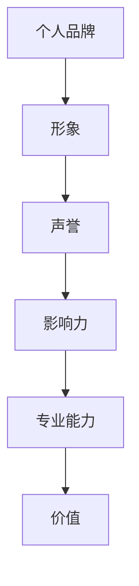

**核心算法原理讲解：** 个人品牌建设涉及到个人形象管理、内容创作、社交媒体运营等多个方面。通过持续的内容输出和有效的推广策略，提升个人在公众中的形象和影响力。

**数学模型和数学公式：**
$$
\text{个人品牌影响力} = f(\text{内容质量}, \text{推广效果}, \text{用户互动})
$$

**举例说明：** 个人品牌影响力受到内容质量、推广效果和用户互动的共同影响。

**程序员个人品牌的重要性：**
1. 提高知名度和影响力，为职业发展带来更多机会。
2. 增强职业竞争力，提升议价能力。
3. 促进知识付费业务，提高收入。

**数学模型和数学公式：**
$$
\text{职业发展机会} = f(\text{个人品牌影响力}, \text{市场需求}, \text{行业动态})
$$
$$
\text{议价能力} = f(\text{个人品牌价值}, \text{行业地位}, \text{专业技能})
$$
$$
\text{知识付费收入} = f(\text{个人品牌影响力}, \text{课程质量}, \text{用户需求})
$$

**举例说明：** 职业发展机会受到个人品牌影响力、市场需求和行业动态的共同影响；议价能力受到个人品牌价值、行业地位和专业技能的共同影响；知识付费收入受到个人品牌影响力、课程质量和用户需求的共同影响。

#### 1.6 个人品牌建设的方法

**定位与目标受众：** 明确个人品牌定位，确定自己在某个领域的专业方向。了解目标受众的需求和痛点，为他们提供有价值的内容。

**核心概念与联系：**
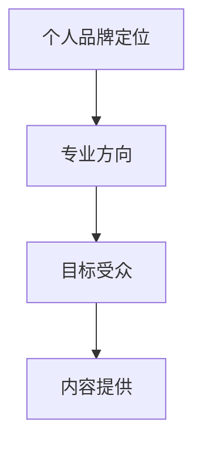

**核心算法原理讲解：** 个人品牌定位涉及到市场调研、自身优势和目标受众分析。通过精准定位，确保内容创作和推广策略的有效性。

**数学模型和数学公式：**
$$
\text{个人品牌定位} = f(\text{市场调研}, \text{自身优势}, \text{目标受众分析})
$$

**举例说明：** 个人品牌定位受到市场调研、自身优势和目标受众分析的共同影响。

**内容创作与推广：** 创作高质量的内容，包括技术博客、教程、案例分析等。利用社交媒体、知识付费平台等渠道进行内容推广，吸引更多关注。

**核心概念与联系：**
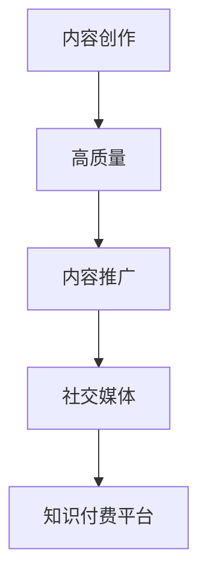

**核心算法原理讲解：** 内容创作与推广涉及到内容质量评估、渠道选择和推广策略制定。通过有效的推广策略，提升内容的曝光率和用户参与度。

**数学模型和数学公式：**
$$
\text{内容创作与推广效果} = f(\text{内容质量}, \text{渠道选择}, \text{推广策略})
$$

**举例说明：** 内容创作与推广效果受到内容质量、渠道选择和推广策略的共同影响。

**社交媒体与网络营销：** 利用社交媒体平台（如微博、微信公众号、知乎等）建立个人品牌形象。进行网络营销，通过广告、合作、推荐等方式扩大影响力。

**核心概念与联系：**
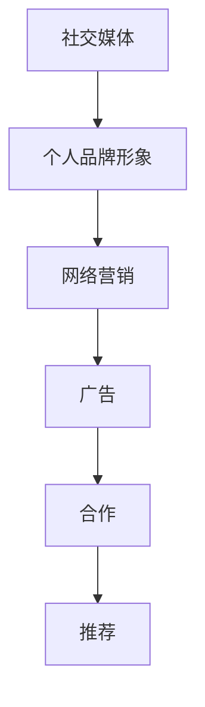

**核心算法原理讲解：** 社交媒体与网络营销涉及到平台选择、内容传播和效果评估。通过合理的平台选择和有效的传播策略，提升个人品牌的知名度和影响力。

**数学模型和数学公式：**
$$
\text{社交媒体影响力} = f(\text{平台选择}, \text{内容传播}, \text{用户互动})
$$
$$
\text{网络营销效果} = f(\text{广告投入}, \text{合作效果}, \text{推荐率})
$$

**举例说明：** 社交媒体影响力受到平台选择、内容传播和用户互动的共同影响；网络营销效果受到广告投入、合作效果和推荐率的共同影响。

#### 1.7 个人品牌建设案例分析

**案例一：程序员A的个人品牌建设之路**

程序员A在技术博客中分享了自己的编程经验和心得，逐渐积累了一定的读者群体。他积极参与技术社区，通过回答问题和参与讨论，提升了个人知名度。此外，程序员A还在知识付费平台上开设了课程，通过内容变现获得了稳定的收入。

**案例二：知名知识付费平台的运营模式**

知名知识付费平台通过吸引专业讲师和优质内容，建立了强大的内容库。平台提供多样化的课程，满足用户的不同需求。通过广告、会员、课程销售等方式，平台实现了收入的多元化。

**案例三：跨界成功：程序员X的知识付费项目**

程序员X在某一领域有深入的研究，开设了知识付费课程。课程内容涵盖了该领域的理论知识与实践技巧。通过口碑传播和社交媒体推广，程序员X吸引了大量学员，实现了跨界成功。

**数学模型和数学公式：**
$$
\text{个人品牌建设效果} = f(\text{内容质量}, \text{推广效果}, \text{用户参与度})
$$

**举例说明：** 个人品牌建设效果受到内容质量、推广效果和用户参与度的共同影响。

### 第二部分：知识付费与程序员个人品牌建设策略

#### 第2章：构建个人品牌的策略

个人品牌建设是程序员在知识付费市场中脱颖而出的关键。本章将详细探讨构建个人品牌的策略，包括定位与目标受众、内容创作与推广、社交媒体与网络营销等方面。

#### 2.1 定位与目标受众

**个人品牌定位的重要性：** 明确个人品牌定位有助于明确自己在某个领域的专业方向，从而有针对性地进行内容创作和推广。

**核心概念与联系：**

**核心算法原理讲解：** 个人品牌定位涉及到市场调研、自身优势和目标受众分析。通过精准定位，确保内容创作和推广策略的有效性。

**数学模型和数学公式：**
$$
\text{个人品牌定位} = f(\text{市场调研}, \text{自身优势}, \text{目标受众分析})
$$

**举例说明：** 假设一个程序员擅长Java开发，他可以通过市场调研发现，Java开发领域对框架和架构设计的需求较高，因此可以将个人品牌定位为“Java框架与架构设计专家”。

**定位与目标受众的策略：**
1. **市场调研：** 了解行业动态、用户需求和竞争对手情况。
2. **自身优势：** 结合自己的兴趣和特长，找到最具竞争力的领域。
3. **目标受众：** 确定目标受众的需求和痛点，为他们提供有价值的内容。

**数学模型和数学公式：**
$$
\text{定位与目标受众策略} = f(\text{市场调研}, \text{自身优势}, \text{目标受众需求})
$$

**举例说明：** 假设一个程序员在区块链技术领域有深入研究，他可以通过市场调研发现，企业对区块链应用开发的需求较高，因此可以将个人品牌定位为“区块链应用开发专家”。

#### 2.2 内容创作与推广

**内容创作的重要性：** 内容是个人品牌的核心资产，高质量的原创内容有助于提升个人品牌的影响力。

**核心概念与联系：**

**核心算法原理讲解：** 内容创作与推广涉及到内容质量评估、渠道选择和推广策略制定。通过有效的推广策略，提升内容的曝光率和用户参与度。

**数学模型和数学公式：**
$$
\text{内容创作与推广效果} = f(\text{内容质量}, \text{渠道选择}, \text{推广策略})
$$

**举例说明：** 假设一个程序员创作了一篇关于微服务架构的博客文章，他可以通过选择合适的渠道（如技术社区、微信公众号等）和推广策略（如分享、广告等），提升文章的曝光率和用户参与度。

**内容创作与推广的策略：**
1. **内容质量：** 提高内容质量，确保内容的专业性和实用性。
2. **渠道选择：** 选择合适的渠道进行内容推广，如技术社区、博客、微信公众号等。
3. **推广策略：** 制定有效的推广策略，如分享、广告、合作等。

**数学模型和数学公式：**
$$
\text{内容创作与推广效果} = f(\text{内容质量}, \text{渠道选择}, \text{推广策略})
$$

**举例说明：** 假设一个程序员在技术社区上分享了一篇关于容器技术的文章，他可以通过与其他技术博主合作、发布广告等方式，提升文章的曝光率和用户参与度。

#### 2.3 社交媒体与网络营销

**社交媒体的重要性：** 社交媒体是个人品牌建设的重要渠道，有助于扩大个人影响力。

**核心概念与联系：**

**核心算法原理讲解：** 社交媒体与网络营销涉及到平台选择、内容传播和效果评估。通过合理的平台选择和有效的传播策略，提升个人品牌的知名度和影响力。

**数学模型和数学公式：**
$$
\text{社交媒体影响力} = f(\text{平台选择}, \text{内容传播}, \text{用户互动})
$$
$$
\text{网络营销效果} = f(\text{广告投入}, \text{合作效果}, \text{推荐率})
$$

**举例说明：** 假设一个程序员在微信上发布了一篇关于人工智能技术的文章，他可以通过与其他技术博主合作、发布广告等方式，提升文章的传播效果和用户互动。

**社交媒体与网络营销的策略：**
1. **平台选择：** 选择合适的社交媒体平台，如微博、微信公众号、知乎等。
2. **内容传播：** 制定有效的传播策略，如分享、广告、合作等。
3. **用户互动：** 通过互动提升用户参与度，如回复评论、参与讨论等。

**数学模型和数学公式：**
$$
\text{社交媒体影响力} = f(\text{平台选择}, \text{内容传播}, \text{用户互动})
$$
$$
\text{网络营销效果} = f(\text{广告投入}, \text{合作效果}, \text{推荐率})
$$

**举例说明：** 假设一个程序员在知乎上回答了一个关于云计算的问题，他可以通过与其他用户互动、分享经验等方式，提升自己的影响力和知名度。

#### 2.4 个人品牌建设案例分析

**案例一：程序员A的个人品牌建设之路**

程序员A在技术博客中分享了自己的编程经验和心得，逐渐积累了一定的读者群体。他积极参与技术社区，通过回答问题和参与讨论，提升了个人知名度。此外，程序员A还在知识付费平台上开设了课程，通过内容变现获得了稳定的收入。

**案例二：知名知识付费平台的运营模式**

知名知识付费平台通过吸引专业讲师和优质内容，建立了强大的内容库。平台提供多样化的课程，满足用户的不同需求。通过广告、会员、课程销售等方式，平台实现了收入的多元化。

**案例三：跨界成功：程序员X的知识付费项目**

程序员X在某一领域有深入的研究，开设了知识付费课程。课程内容涵盖了该领域的理论知识与实践技巧。通过口碑传播和社交媒体推广，程序员X吸引了大量学员，实现了跨界成功。

**数学模型和数学公式：**
$$
\text{个人品牌建设效果} = f(\text{内容质量}, \text{推广效果}, \text{用户参与度})
$$

**举例说明：** 个人品牌建设效果受到内容质量、推广效果和用户参与度的共同影响。

### 第三部分：程序员个人品牌建设工具与资源

#### 第3章：个人品牌建设工具推荐

个人品牌建设需要借助多种工具和资源，包括个人博客、社交媒体、知识付费平台等。本章将介绍这些工具的使用方法和推荐资源，帮助程序员更好地进行个人品牌建设。

#### 3.1 个人博客

**个人博客的重要性：** 个人博客是展示个人专业能力和成果的重要平台，有助于建立个人品牌形象。

**核心概念与联系：**
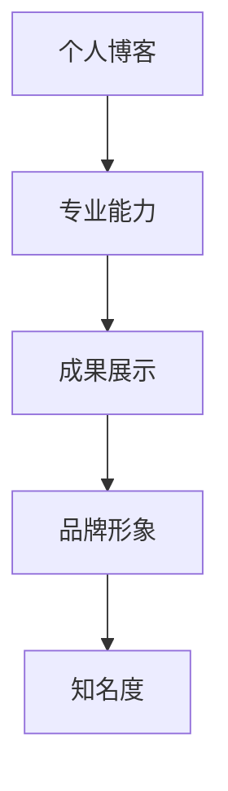

**核心算法原理讲解：** 个人博客通过内容创作和传播，提升个人在公众中的知名度和影响力。

**数学模型和数学公式：**
$$
\text{博客影响力} = f(\text{内容质量}, \text{用户互动}, \text{传播渠道})
$$

**举例说明：** 一个程序员通过在个人博客上分享高质量的编程技术文章，吸引了大量读者，从而提升了个人品牌影响力。

**使用方法：**
1. **选择博客平台：** 如CSDN、简书等。
2. **定期更新内容：** 保持博客活跃，提供有价值的内容。
3. **优化搜索引擎：** 使用SEO技巧，提高博客的搜索引擎排名。

**推荐资源：**
- CSDN：[CSDN博客](https://blog.csdn.net/)
- 简书：[简书](https://www.jianshu.com/)

#### 3.2 社交媒体平台

**社交媒体平台的重要性：** 社交媒体平台是个人品牌建设的重要渠道，有助于扩大个人影响力。

**核心概念与联系：**
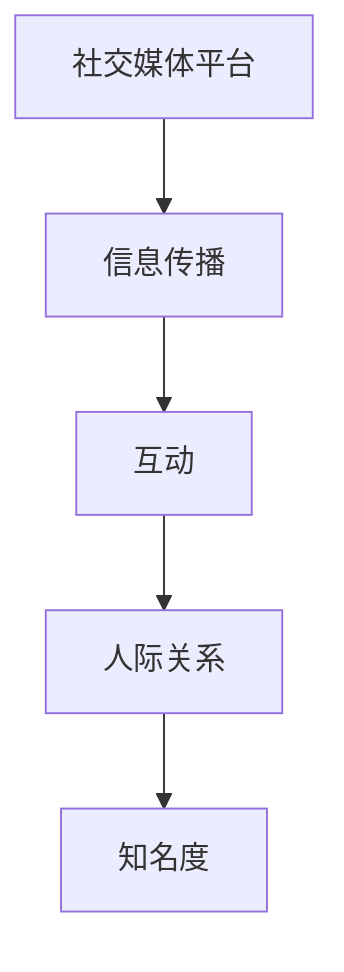

**核心算法原理讲解：** 社交媒体平台通过用户互动和信息传播，提升个人在公众中的知名度和影响力。

**数学模型和数学公式：**
$$
\text{社交媒体影响力} = f(\text{用户互动}, \text{内容传播}, \text{平台选择})
$$

**举例说明：** 一个程序员通过在微信、微博等社交媒体上发布技术文章和心得，吸引了大量粉丝，从而提升了个人品牌影响力。

**使用方法：**
1. **选择合适的平台：** 如微信、微博、知乎等。
2. **定期发布内容：** 提供有价值的内容，保持活跃。
3. **互动与回复：** 积极与粉丝互动，提升用户粘性。

**推荐资源：**
- 微信公众号：[微信公众平台](https://mp.weixin.qq.com/)
- 微博：[微博](https://weibo.com/)
- 知乎：[知乎](https://www.zhihu.com/)

#### 3.3 知识付费平台

**知识付费平台的重要性：** 知识付费平台是进行知识分享和变现的重要途径，有助于提高个人收入和品牌影响力。

**核心概念与联系：**
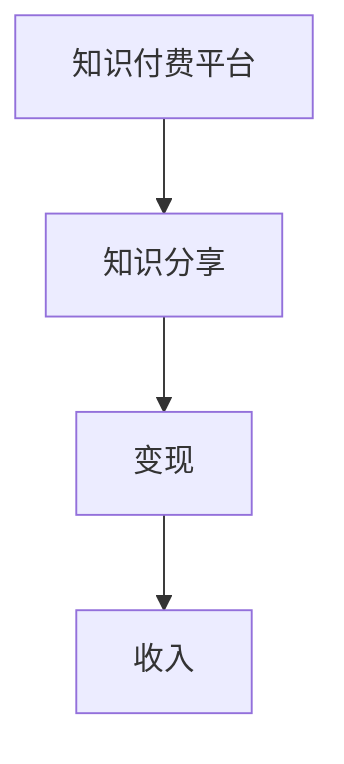

**核心算法原理讲解：** 知识付费平台通过用户支付费用获取收益，从而实现知识的商业价值。

**数学模型和数学公式：**
$$
\text{知识付费收入} = f(\text{课程质量}, \text{用户数量}, \text{平台收益模式})
$$

**举例说明：** 一个程序员通过在网易云课堂等知识付费平台上开设课程，吸引了大量学员，从而获得了稳定的收入。

**使用方法：**
1. **选择合适的平台：** 如网易云课堂、得到等。
2. **创作优质课程：** 提供有价值的内容，提升用户满意度。
3. **推广课程：** 利用社交媒体等渠道进行推广。

**推荐资源：**
- 网易云课堂：[网易云课堂](https://study.163.com/)
- 得到：[得到](https://www.getting.com/)

#### 3.4 其他工具与资源

除了个人博客、社交媒体和知识付费平台，程序员还可以利用其他工具和资源进行个人品牌建设。

**核心概念与联系：**
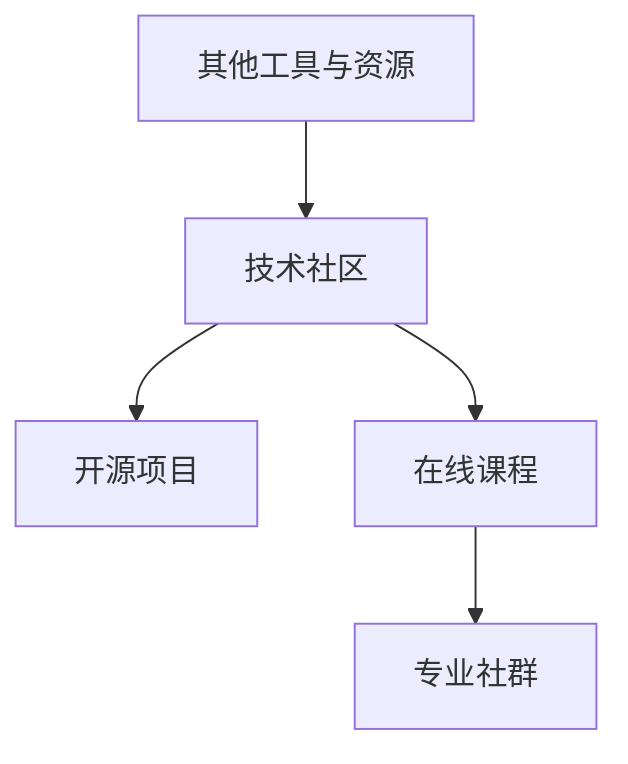

**核心算法原理讲解：** 技术社区、开源项目、在线课程和专业社群等工具和资源，可以帮助程序员提升专业技能、扩大人脉圈和获取更多职业机会。

**数学模型和数学公式：**
$$
\text{个人品牌建设效果} = f(\text{专业技能}, \text{人脉圈}, \text{职业机会})
$$

**举例说明：** 一个程序员通过参与GitHub上的开源项目、参加技术社区的活动和在线课程，提升了专业技能，同时结识了更多的业内同行。

**推荐资源：**
- 技术社区：GitHub、Stack Overflow
- 开源项目：GitHub、GitLab
- 在线课程：网易云课堂、慕课网
- 专业社群：微信群、QQ群、知乎Live

### 第四部分：程序员个人品牌建设实战

#### 第4章：个人品牌建设实战

个人品牌建设需要通过实际行动来实现，本章将结合实际案例，详细讲解个人品牌建设的实战步骤，包括内容创作、推广策略和平台选择等。

#### 4.1 内容创作实战

**内容创作是个人品牌建设的基础，以下是一个内容创作实战案例：**

**案例背景：** 张三是一位专注于Python开发的程序员，他在GitHub上有一个个人仓库，定期分享Python编程心得和项目代码。

**内容创作步骤：**
1. **确定内容主题：** 张三根据自己在Python开发领域的专长，确定了“Python进阶技巧”和“Python项目实战”两个主题。
2. **编写内容：** 张三利用Markdown语法，在GitHub仓库中编写了详细的文章，包括代码示例、详细解释和实战案例。
3. **内容发布：** 张三将文章发布到GitHub仓库，并在GitHub的“Readme”文件中添加了链接，方便读者访问。

**核心概念与联系：**
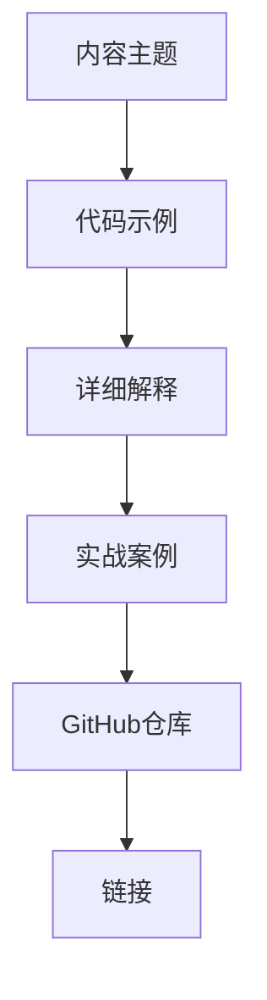

**核心算法原理讲解：** 内容创作涉及到主题确定、编写和发布。通过高质量的原创内容，吸引读者关注，提升个人品牌影响力。

**数学模型和数学公式：**
$$
\text{内容质量} = f(\text{主题相关度}, \text{代码准确性}, \text{实战案例丰富度})
$$

**举例说明：** 张三通过编写与Python开发相关的文章，提供丰富的代码示例和实战案例，确保内容质量。

#### 4.2 推广策略实战

**推广策略是提升内容影响力的重要手段，以下是一个推广策略实战案例：**

**案例背景：** 李四是一位在技术社区活跃的程序员，他在CSDN上写了一篇关于Docker容器技术的文章，希望吸引更多读者。

**推广策略步骤：**
1. **选择推广平台：** 李四选择了CSDN、微博、知乎等平台进行推广。
2. **发布内容：** 李四在CSDN上发布文章，同时在微博、知乎上分享文章链接。
3. **互动与回复：** 李四积极回复读者评论，解答问题，提升用户体验。
4. **合作推广：** 李四与技术社区的其他博主合作，互相推广，扩大影响力。

**核心概念与联系：**
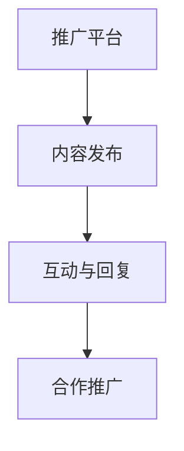

**核心算法原理讲解：** 推广策略涉及到平台选择、内容发布、互动与回复和合作推广。通过多样化的推广手段，提升内容曝光率和用户参与度。

**数学模型和数学公式：**
$$
\text{推广效果} = f(\text{平台数量}, \text{内容曝光率}, \text{用户互动})
$$

**举例说明：** 李四通过在多个平台上发布文章，积极互动和合作推广，提升了文章的曝光率和用户参与度。

#### 4.3 平台选择实战

**平台选择是个人品牌建设的关键一步，以下是一个平台选择实战案例：**

**案例背景：** 王五是一位对大数据技术有深入研究的程序员，他希望通过开设在线课程进行知识付费。

**平台选择步骤：**
1. **分析需求：** 王五分析了市场需求和个人优势，确定了开设大数据技术课程的目标。
2. **评估平台：** 王五评估了多个知识付费平台，如网易云课堂、慕课网、千锋等。
3. **选择平台：** 王五选择了网易云课堂，因为它在大数据领域有丰富的课程资源和广泛的用户基础。
4. **准备课程：** 王五准备了详细的课程大纲和教学内容，确保课程质量。

**核心概念与联系：**
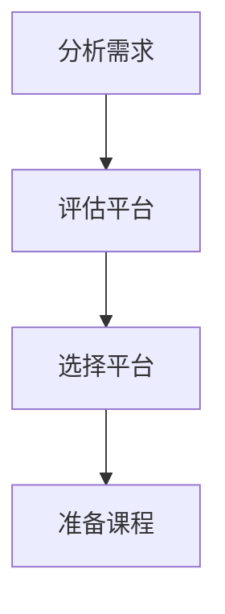

**核心算法原理讲解：** 平台选择涉及到需求分析、平台评估、选择和准备课程。通过选择合适的平台，确保课程的受众和教学质量。

**数学模型和数学公式：**
$$
\text{平台选择效果} = f(\text{市场需求匹配度}, \text{用户基础}, \text{教学质量})
$$

**举例说明：** 王五通过分析市场需求，评估多个平台，选择了适合的网易云课堂，从而确保了课程的成功。

### 第五部分：程序员个人品牌建设常见问题解答

#### 第5章：程序员个人品牌建设常见问题解答

在个人品牌建设过程中，程序员可能会遇到各种问题和挑战。以下是一些常见问题及解答，以帮助程序员更好地进行个人品牌建设。

#### 5.1 如何在个人品牌建设中保持持续更新？

**解答：**
1. **制定更新计划：** 制定内容更新计划，确保定期发布新内容。
2. **持续学习：** 保持对新知识和技能的学习，为内容创作提供源源不断的灵感。
3. **用户反馈：** 关注用户反馈，根据用户需求调整内容创作方向。

**数学模型和数学公式：**
$$
\text{内容更新率} = f(\text{更新计划}, \text{学习频率}, \text{用户反馈})
$$

#### 5.2 如何平衡工作和个人品牌建设？

**解答：**
1. **时间管理：** 提高工作效率，合理安排时间，确保工作和个人品牌建设之间的平衡。
2. **任务优先级：** 将个人品牌建设任务列入优先级，确保有足够的时间进行。
3. **利用碎片时间：** 充分利用碎片时间，进行内容创作和推广。

**数学模型和数学公式：**
$$
\text{工作-品牌平衡度} = f(\text{时间管理}, \text{任务优先级}, \text{碎片时间利用})
$$

#### 5.3 如何从零开始建立个人品牌？

**解答：**
1. **确定方向：** 明确自己的兴趣和特长，确定个人品牌定位。
2. **内容创作：** 从自己擅长的领域开始，创作高质量的内容。
3. **互动与推广：** 积极参与技术社区和社交媒体，与用户互动，扩大影响力。

**数学模型和数学公式：**
$$
\text{个人品牌建设效果} = f(\text{方向明确度}, \text{内容质量}, \text{用户互动})
$$

#### 5.4 个人品牌建设过程中可能会遇到的挑战有哪些？

**解答：**
1. **内容创作困难：** 可能会遇到灵感不足、内容质量不高等问题。
2. **推广困难：** 可能会遇到用户关注不足、推广效果不明显等问题。
3. **时间精力有限：** 可能会面临工作和个人品牌建设之间的冲突。

**数学模型和数学公式：**
$$
\text{挑战难度} = f(\text{内容创作难度}, \text{推广效果}, \text{时间精力限制})
$$

#### 5.5 如何克服个人品牌建设中的挑战？

**解答：**
1. **持续学习：** 通过学习提高自己的专业能力，为内容创作提供支持。
2. **借助工具：** 利用社交媒体、知识付费平台等工具，提高推广效果。
3. **寻求帮助：** 与他人合作，共同提升个人品牌建设的效果。

**数学模型和数学公式：**
$$
\text{个人品牌建设效果} = f(\text{学习频率}, \text{工具使用}, \text{合作机会})
$$

### 第六部分：知识付费与个人品牌建设相关资源链接

#### 第6章：知识付费与个人品牌建设相关资源链接

为了帮助程序员更好地进行知识付费和个人品牌建设，本章提供了相关的资源链接，包括知识付费平台、个人品牌建设工具、技术社区等。

#### 6.1 知识付费平台链接

1. 得到：[得到官网](https://www.getting.com/)
2. 喜马拉雅：[喜马拉雅官网](https://www.ximalaya.com/)
3. 知识星球：[知识星球官网](https://www.zsxq.com/)

#### 6.2 个人品牌建设工具链接

1. 个人博客平台：[CSDN官网](https://www.csdn.net/)
2. 社交媒体平台：[微博官网](https://www.weibo.com/)，[微信公众号](https://mp.weixin.qq.com/)
3. 知识付费平台：[网易云课堂](https://study.163.com/)

#### 6.3 程序员社群与圈子链接

1. GitHub：[GitHub官网](https://github.com/)
2. 技术社区：[Stack Overflow](https://stackoverflow.com/)
3. 专业社群：[百度贴吧](https://tieba.baidu.com/)，[知乎](https://www.zhihu.com/)

### 附录

#### 附录A：程序员个人品牌建设常见问题解答

在本附录中，我们针对程序员在个人品牌建设过程中可能遇到的一些常见问题，提供详细的解答和建议。

**Q1：如何保持持续更新？**
**A1：**
- 制定内容更新计划，确保定期发布新内容。
- 持续学习新知识和技能，为内容创作提供源源不断的灵感。
- 关注用户反馈，根据用户需求调整内容创作方向。

**Q2：如何平衡工作和个人品牌建设？**
**A2：**
- 提高工作效率，合理安排时间，确保工作和个人品牌建设之间的平衡。
- 将个人品牌建设任务列入优先级，确保有足够的时间进行。
- 充分利用碎片时间，进行内容创作和推广。

**Q3：如何从零开始建立个人品牌？**
**A3：**
- 确定个人品牌定位，明确自己的兴趣和特长。
- 从自己擅长的领域开始，创作高质量的内容。
- 积极参与技术社区和社交媒体，与用户互动，扩大影响力。

**Q4：个人品牌建设过程中可能会遇到的挑战有哪些？**
**A4：**
- 可能会遇到灵感不足、内容质量不高等问题。
- 可能会遇到用户关注不足、推广效果不明显等问题。
- 可能会面临工作和个人品牌建设之间的冲突。

**Q5：如何克服个人品牌建设中的挑战？**
**A5：**
- 持续学习，提高自己的专业能力，为内容创作提供支持。
- 利用社交媒体、知识付费平台等工具，提高推广效果。
- 与他人合作，共同提升个人品牌建设的效果。

### 附录B：知识付费与个人品牌建设相关资源链接

在本附录中，我们提供了知识付费与个人品牌建设相关的资源链接，包括知识付费平台、个人品牌建设工具、技术社区等。

**知识付费平台链接：**
- 得到：[得到官网](https://www.getting.com/)
- 喜马拉雅：[喜马拉雅官网](https://www.ximalaya.com/)
- 知识星球：[知识星球官网](https://www.zsxq.com/)

**个人品牌建设工具链接：**
- 个人博客平台：[CSDN官网](https://www.csdn.net/)
- 社交媒体平台：[微博官网](https://www.weibo.com/)，[微信公众号](https://mp.weixin.qq.com/)
- 知识付费平台：[网易云课堂](https://study.163.com/)

**程序员社群与圈子链接：**
- GitHub：[GitHub官网](https://github.com/)
- 技术社区：[Stack Overflow](https://stackoverflow.com/)
- 专业社群：[百度贴吧](https://tieba.baidu.com/)，[知乎](https://www.zhihu.com/)

