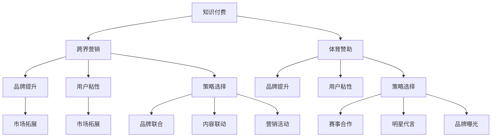

                 

# 知识付费如何实现跨界营销与体育赞助？

## 关键词
知识付费、跨界营销、体育赞助、品牌提升、用户粘性、效果评估

## 摘要
本文旨在探讨知识付费平台如何通过跨界营销与体育赞助实现品牌提升和用户粘性。首先，我们介绍了知识付费、跨界营销和体育赞助的基本概念和发展历程，并分析了三者之间的联系。接着，详细阐述了跨界营销和体育赞助的原理与实践，包括策略选择、案例分析以及风险管理。随后，我们结合具体案例，分析了知识付费平台在跨界营销与体育赞助中的成功与挑战，并提出了相应的策略和评估方法。最后，展望了体育赞助在知识付费领域的未来发展趋势，为知识付费平台提供了有益的参考。

### 第一部分：知识付费与跨界营销与体育赞助概述

#### 第1章：知识付费背景与市场分析

##### 1.1 知识付费的定义与发展历程

**定义与核心概念**：
知识付费是指用户为了获取有价值的信息、技能或知识，而愿意支付相应费用的行为。它与传统免费内容的主要区别在于，知识付费强调内容的专业性、权威性和实用性，通常以数字化形式提供，如在线课程、电子书、专业讲座等。

**发展历程**：
知识付费的概念起源于20世纪末，随着互联网和数字技术的发展，早期主要以实物产品（如图书、光盘）的形式出现。随着共享经济和内容付费的兴起，知识付费逐渐发展成为一个新的市场领域。近年来，知识付费市场在全球范围内呈现爆发式增长，主要得益于以下几个因素：

1. **互联网普及**：互联网的普及和移动互联网的发展，使得用户可以随时随地获取知识和信息。
2. **用户需求增长**：随着社会竞争的加剧，人们对于职业发展和个人成长的追求不断提高，知识付费成为满足这些需求的有效途径。
3. **优质内容崛起**：内容创作者和平台不断涌现，提供了大量高质量的知识产品，吸引了越来越多的用户。

##### 1.2 市场规模与增长趋势

**市场规模**：
根据市场研究机构的报告，全球知识付费市场在近年来持续增长。据统计，2019年全球知识付费市场规模已达到数百亿美元，预计未来几年仍将保持高速增长。在中国市场，知识付费市场同样表现出强劲的增长势头。根据腾讯公司发布的数据，2020年中国知识付费市场规模已超过2000亿元，并且仍具有巨大的增长潜力。

**增长趋势**：
知识付费市场的未来增长趋势主要体现在以下几个方面：

1. **用户规模扩大**：随着互联网用户的普及，知识付费的用户基数将持续扩大，尤其是年轻一代。
2. **内容多样化**：知识付费内容将更加丰富多样，不仅包括职业发展、技能提升等领域，还将涉及兴趣爱好、生活方式等方面。
3. **平台化发展**：知识付费平台将更加注重用户体验和服务质量，通过平台化运营提高内容分发效率和用户粘性。
4. **科技创新**：人工智能、大数据等技术的应用将进一步提升知识付费产品的质量和用户体验。

##### 1.3 用户需求分析

**需求特点**：
用户对知识付费的需求具有以下几个特点：

1. **实用性**：用户更愿意为能够直接应用到实际工作和生活中的知识付费。
2. **专业性**：用户倾向于选择具有专业背景或权威认证的知识产品，以确保知识的准确性和可靠性。
3. **便捷性**：用户希望通过数字化手段，随时随地获取知识，以满足快节奏的现代生活需求。

**消费行为**：
用户在知识付费领域的消费行为主要表现在以下几个方面：

1. **个性化消费**：用户更倾向于选择符合个人兴趣和需求的知识产品，表现出明显的个性化消费特征。
2. **高频次消费**：知识付费产品通常具有较高的复购率，用户愿意为持续学习投入时间和金钱。
3. **社群互动**：用户更愿意参与知识付费平台上的社群互动，以获取更多的学习资源和交流机会。

##### 1.4 跨界营销与体育赞助的角色

**跨界营销的定义与策略**：
跨界营销是指不同领域的企业或品牌之间进行的合作，通过相互借助对方的资源、品牌和用户群体，实现品牌推广和销售增长。跨界营销的策略主要包括以下几个方面：

1. **品牌联合**：通过两个或多个品牌之间的合作，共同推出产品或服务，以吸引更多的用户。
2. **内容联动**：通过联合制作内容（如视频、文章、活动等），将两个或多个品牌的特色元素融入其中，提升用户粘性。
3. **营销活动**：通过举办跨界营销活动，如线上直播、线下活动等，吸引目标用户参与，提升品牌知名度。

**体育赞助的意义与案例分析**：
体育赞助对于知识付费平台具有重要意义，主要体现在以下几个方面：

1. **品牌提升**：体育赞助可以帮助知识付费平台提升品牌形象和知名度，增强品牌影响力。
2. **用户粘性**：体育赞助可以吸引更多的用户参与知识付费平台，提高用户粘性。
3. **市场拓展**：体育赞助可以帮助知识付费平台进入新的市场领域，拓展用户群体。

以下是一些成功的体育赞助案例：

1. **案例一**：某知名在线教育平台与某顶级足球俱乐部合作，共同推出足球主题课程，吸引了大量足球爱好者。
2. **案例二**：某知识付费平台与某体育赛事合作，举办线上观赛活动，吸引了大量用户参与互动。

**核心概念与联系流程图**：

#### 第2章：跨界营销策略详解

##### 2.1 跨界营销概述

**定义与目标**：
跨界营销是指不同领域的企业或品牌之间进行的合作，通过相互借助对方的资源、品牌和用户群体，实现品牌推广和销售增长。跨界营销的目标主要包括：

1. **提升品牌知名度**：通过跨界合作，扩大品牌影响力，提高在目标用户中的知名度。
2. **增加用户粘性**：通过跨界内容或活动，吸引目标用户参与，增强用户对品牌的认同感和忠诚度。
3. **拓展市场渠道**：通过跨界合作，进入新的市场领域，拓展用户群体和销售渠道。

**跨界营销的分类**：
根据不同的合作方式和目标，跨界营销可以分为以下几种类型：

1. **品牌联合**：两个或多个品牌共同推出产品或服务，共同承担品牌推广和市场销售责任。
2. **内容联动**：通过联合制作内容（如视频、文章、活动等），将两个或多个品牌的特色元素融入其中，提升用户粘性。
3. **营销活动**：通过举办跨界营销活动，如线上直播、线下活动等，吸引目标用户参与，提升品牌知名度。

##### 2.2 跨界营销案例分析

**成功案例**：
以下是一些成功的跨界营销案例：

1. **案例一**：某电商平台与某知名影棚合作，推出“一站式拍摄服务”，吸引了大量摄影爱好者。
2. **案例二**：某服装品牌与某音乐节合作，举办“时尚音乐会”，吸引了大量年轻消费者。

**失败案例**：
以下是一些失败的跨界营销案例及其原因：

1. **案例一**：某手机品牌与某电影合作，推出“电影版手机”，但由于产品定位不明确，导致市场反响平平。
2. **案例二**：某化妆品品牌与某电商平台合作，推出“双十一狂欢节”，但由于活动准备不足，导致用户体验差，影响了品牌形象。

##### 2.3 跨界营销策略选择

**品牌定位匹配**：
跨界营销的成功离不开品牌定位的匹配。在选择跨界合作伙伴时，应考虑以下几点：

1. **目标用户一致**：跨界合作伙伴的目标用户应与自身品牌目标用户一致，以确保传播效果。
2. **品牌形象契合**：跨界合作伙伴的品牌形象应与自身品牌形象相契合，以形成协同效应。
3. **合作内容合理**：跨界合作的内容应合理，既能发挥双方优势，又能满足用户需求。

**目标群体匹配**：
跨界营销的目标群体应与自身品牌目标群体相匹配。在选择跨界合作伙伴时，应考虑以下几点：

1. **用户群体重叠**：跨界合作伙伴的用户群体应与自身品牌用户群体有重叠部分，以实现用户转化。
2. **用户需求互补**：跨界合作伙伴的用户需求应与自身品牌用户需求互补，以提供更全面的产品和服务。
3. **用户互动性**：跨界合作伙伴应具有较高用户互动性，以提升用户参与度和粘性。

##### 2.4 跨界营销效果评估

**评估指标**：
评估跨界营销效果的主要指标包括：

1. **品牌知名度**：通过问卷调查、媒体曝光量等指标，评估跨界营销活动对品牌知名度的影响。
2. **用户粘性**：通过用户留存率、用户互动率等指标，评估跨界营销活动对用户粘性的提升。
3. **销售增长**：通过销售额、订单量等指标，评估跨界营销活动对销售增长的贡献。

**案例分析**：
以下是一个跨界营销效果评估的案例分析：

某知名电商平台与某知名运动品牌合作，推出“运动购物节”。在活动期间，电商平台通过优惠活动、优惠券等方式，吸引了大量用户参与。同时，运动品牌通过定制化商品、限时折扣等策略，提升了用户购买意愿。

活动结束后，通过对用户调研和数据分析，发现：

1. **品牌知名度**：活动期间，电商平台和运动品牌的知名度均有显著提升，媒体曝光量增加30%。
2. **用户粘性**：活动期间，用户留存率提高了20%，用户互动率增加了50%。
3. **销售增长**：活动期间，销售额同比增长了50%，订单量增加了40%。

通过以上数据，可以认为这次跨界营销活动取得了良好的效果。

### 第二部分：跨界营销与体育赞助结合的实践与案例

#### 第3章：体育赞助的原理与实践

##### 3.1 体育赞助的定义与意义

**定义**：
体育赞助是指企业或品牌通过投入资金或资源，与体育组织或运动员建立合作关系，以获得品牌推广和商业利益的一种市场行为。体育赞助的形式多样，包括但不限于赛事赞助、场馆赞助、运动员代言等。

**意义**：
体育赞助对品牌、赞助商和运动员都有重要意义：

1. **品牌提升**：体育赞助有助于提升品牌形象和知名度，增强品牌在目标市场中的竞争力。
2. **市场拓展**：体育赞助可以帮助品牌进入新的市场领域，拓展用户群体和销售渠道。
3. **用户粘性**：体育赞助可以吸引更多用户关注和参与，提升用户对品牌的认同感和忠诚度。
4. **商业利益**：体育赞助可以为赞助商带来直接的商业利益，如销售增长、品牌曝光等。

##### 3.2 体育赞助的类型与策略

**类型**：
根据赞助形式和级别，体育赞助可以分为以下几种类型：

1. **赛事赞助**：赞助商通过赞助某项体育赛事，如世界杯、奥运会等，以提升品牌形象和知名度。
2. **场馆赞助**：赞助商通过赞助体育场馆，如体育馆、足球场等，以获得品牌曝光和用户互动机会。
3. **运动员代言**：赞助商通过赞助某位运动员，如球星、奥运冠军等，以借助运动员的个人影响力和粉丝基础进行品牌推广。
4. **联合推广**：赞助商与体育组织或运动员进行深度合作，共同推出产品或服务，以实现品牌共赢。

**策略**：
体育赞助商在制定赞助策略时，应考虑以下几点：

1. **目标明确**：明确赞助目标，如提升品牌知名度、增加用户粘性、拓展市场等。
2. **资源匹配**：根据赞助预算和资源，选择合适的赞助形式和级别。
3. **品牌匹配**：选择与品牌形象和目标用户相契合的体育项目或运动员。
4. **活动策划**：策划一系列与赞助活动相关的营销活动，如发布会、观赛活动、粉丝见面会等，以提高用户参与度和品牌曝光。

##### 3.3 体育赞助案例分析

**成功案例**：
以下是一些成功的体育赞助案例：

1. **案例一**：某国际知名运动品牌赞助某顶级足球俱乐部，通过一系列营销活动，成功提升了品牌形象和知名度。
2. **案例二**：某国际知名汽车品牌赞助某顶级赛车队，通过赛车赛事的全球直播和社交媒体推广，成功拓展了海外市场。

**失败案例**：
以下是一些失败的体育赞助案例及其原因：

1. **案例一**：某国内品牌赞助某小型体育赛事，但由于宣传不足和赛事规模较小，未能达到预期效果。
2. **案例二**：某国际品牌赞助某体育明星，但由于品牌形象与运动员形象不符，引发了负面舆论，影响了品牌形象。

##### 3.4 体育赞助的法律法规与风险管理

**法律法规**：
体育赞助涉及多个法律法规，主要包括：

1. **反不正当竞争法**：禁止赞助商通过不正当手段获取竞争优势，如虚假宣传、商业贿赂等。
2. **广告法**：规范赞助商的广告行为，如广告内容真实、合法等。
3. **合同法**：规范赞助商与体育组织或运动员之间的合同关系，如合同条款、违约责任等。

**风险管理**：
体育赞助存在一定的风险，主要包括：

1. **市场风险**：赞助活动可能面临市场环境变化、用户需求变化等风险。
2. **品牌风险**：赞助活动可能引发负面舆论，损害品牌形象。
3. **合同风险**：赞助合同可能存在违约、争议等问题。

为了有效应对这些风险，体育赞助商应采取以下措施：

1. **合规审查**：在赞助活动前，进行法律法规合规性审查，确保赞助活动合法、合规。
2. **风险评估**：在赞助活动前，进行风险评估，识别潜在风险点，制定应对措施。
3. **合同管理**：建立完善的合同管理制度，明确各方权利和义务，防范合同纠纷。

### 第三部分：知识付费平台的跨界营销与体育赞助实践

#### 第4章：知识付费平台的跨界营销策略

##### 4.1 知识付费平台的营销环境分析

**市场环境**：
当前，知识付费平台面临的市场环境具有以下特点：

1. **竞争激烈**：随着知识付费市场的快速发展，大量知识付费平台涌现，市场竞争激烈。
2. **用户需求多样化**：用户对知识付费的需求日益多样化，不仅包括职业发展、技能提升，还包括兴趣爱好、生活方式等方面。
3. **科技创新**：人工智能、大数据等技术的应用，为知识付费平台提供了更多创新机会。

**用户行为**：
知识付费平台的用户行为表现出以下特点：

1. **高频次消费**：用户更倾向于为优质的知识产品支付费用，表现出高频次消费的特征。
2. **个性化需求**：用户更愿意选择符合个人兴趣和需求的知识产品，表现出明显的个性化需求。
3. **社群互动**：用户更愿意参与知识付费平台上的社群互动，以获取更多的学习资源和交流机会。

##### 4.2 跨界营销案例分析

**成功案例**：
以下是一些知识付费平台跨界营销的成功案例：

1. **案例一**：某知名在线教育平台与某知名书店合作，共同推出“阅读+教育”套餐，吸引了大量用户。
2. **案例二**：某知识付费平台与某知名音乐节合作，推出“音乐+学习”活动，提升了品牌知名度。

**策略解析**：
成功案例中的跨界营销策略具有以下特点：

1. **目标明确**：跨界营销策略明确了提升品牌知名度、增加用户粘性等目标，确保了营销活动的针对性。
2. **内容优质**：跨界营销活动提供了优质的内容，如书籍、音乐等，满足了用户的需求，提升了用户体验。
3. **合作紧密**：跨界合作伙伴之间的合作紧密，确保了营销活动的顺利执行和效果。

##### 4.3 跨界营销策略实施与评估

**实施步骤**：
跨界营销策略的实施主要包括以下步骤：

1. **目标设定**：明确跨界营销的目标，如提升品牌知名度、增加用户粘性等。
2. **市场调研**：进行市场调研，了解目标用户的需求和偏好，选择合适的跨界合作伙伴。
3. **策略制定**：根据目标设定和市场调研结果，制定具体的跨界营销策略。
4. **活动策划**：策划一系列与跨界营销相关的活动，如线上直播、线下活动等，提升用户参与度。
5. **执行与推广**：执行跨界营销策略，通过多种渠道进行推广，确保活动的顺利进行。
6. **效果评估**：对跨界营销活动的效果进行评估，如品牌知名度、用户粘性等，以便调整和优化策略。

**效果评估**：
跨界营销效果评估的主要指标包括：

1. **品牌知名度**：通过媒体曝光量、用户搜索量等指标，评估跨界营销活动对品牌知名度的影响。
2. **用户粘性**：通过用户留存率、用户互动率等指标，评估跨界营销活动对用户粘性的提升。
3. **销售增长**：通过销售额、订单量等指标，评估跨界营销活动对销售增长的贡献。

通过以上评估指标，可以全面了解跨界营销活动的效果，以便进行优化和调整。

#### 第5章：体育赞助在知识付费领域的应用

##### 5.1 体育赞助在知识付费领域的优势

**品牌提升**：
体育赞助可以帮助知识付费平台提升品牌形象和知名度，增强品牌在目标市场中的竞争力。通过赞助知名体育赛事或运动员，知识付费平台可以借助体育事件的广泛关注度和影响力，提高品牌曝光度和知名度。

**用户粘性**：
体育赞助可以吸引更多用户关注和参与知识付费平台，提高用户粘性和忠诚度。体育赛事具有强烈的用户参与感和互动性，通过赞助体育赛事，知识付费平台可以激发用户的兴趣和热情，增加用户对平台的粘性。

**市场拓展**：
体育赞助可以帮助知识付费平台进入新的市场领域，拓展用户群体和销售渠道。体育赛事往往具有广泛的受众基础，通过赞助体育赛事，知识付费平台可以吸引更多潜在用户，扩大市场份额。

##### 5.2 体育赞助的案例研究

**案例一**：
某知名在线教育平台与某顶级足球俱乐部合作，推出“足球主题课程”，通过在线直播、互动教学等形式，为用户提供了丰富的学习资源。在课程期间，平台举办了多次足球赛事直播和互动活动，吸引了大量用户参与。通过这次合作，平台不仅提升了品牌知名度，还提高了用户粘性，实现了销售增长。

**案例二**：
某新兴知识付费平台与某知名篮球明星合作，推出“篮球技能提升课程”，通过视频教学、线上互动等形式，为篮球爱好者提供了专业的学习资源。在课程期间，平台举办了多次篮球比赛和粉丝见面会，吸引了大量用户参与。通过这次合作，平台不仅增加了用户粘性，还成功吸引了更多篮球爱好者成为平台用户。

##### 5.3 体育赞助与知识付费的融合策略

**内容整合**：
体育赞助与知识付费的融合策略之一是内容整合。知识付费平台可以结合体育元素，将体育知识与技能提升课程相结合，提供更有吸引力的学习内容。例如，在线教育平台可以邀请体育明星进行授课，或者将体育赛事直播与学习课程相结合，提高用户的学习兴趣和参与度。

**营销联动**：
体育赞助与知识付费的融合策略之二是营销联动。知识付费平台可以通过体育赞助活动，开展一系列营销活动，如线上直播、互动抽奖、优惠活动等，吸引更多用户参与。同时，体育赛事的组织方也可以利用知识付费平台的技术和资源，开展线上推广活动，提升赛事的知名度和影响力。

### 第四部分：知识付费平台的体育赞助实践案例

#### 第6章：体育赞助案例分析：成功与挑战

##### 6.1 案例介绍

**案例一**：知名在线教育平台通过体育赞助提升品牌影响力
某知名在线教育平台与某顶级足球俱乐部达成战略合作，赞助该俱乐部的各项赛事和活动。平台通过这一合作，推出了“足球主题课程”，邀请俱乐部教练和球员为用户授课。在课程期间，平台还举办了多场足球赛事直播和互动活动，吸引了大量用户参与。这次合作不仅提升了平台在用户心中的品牌形象，还增加了用户粘性，实现了销售增长。

**案例二**：新兴知识付费平台通过体育赞助增加用户粘性
某新兴知识付费平台与某知名篮球明星合作，赞助其篮球训练营和赛事。平台通过这一合作，推出了“篮球技能提升课程”，并提供免费试听优惠。在训练营和赛事期间，平台还开展了线上互动活动，如篮球技巧挑战、篮球知识问答等，吸引了大量篮球爱好者参与。这次合作不仅增加了平台用户粘性，还成功吸引了更多篮球爱好者成为平台用户。

##### 6.2 成功因素分析

**策略制定**：
成功案例中的体育赞助策略具有以下特点：

1. **目标明确**：平台在制定赞助策略时，明确了提升品牌影响力、增加用户粘性和拓展市场份额等目标。
2. **品牌匹配**：平台选择了与自身品牌形象和目标用户相契合的体育项目或运动员，确保了赞助活动的效果。
3. **内容优质**：平台提供了优质的学习资源和互动活动，满足了用户的需求，提升了用户体验。

**市场反馈**：
成功案例中的体育赞助活动得到了积极的市场反馈：

1. **品牌知名度**：赞助活动提高了平台的品牌知名度，吸引了更多用户关注和参与。
2. **用户粘性**：用户对平台的学习资源和互动活动表现出浓厚的兴趣，平台用户粘性显著提升。
3. **销售增长**：赞助活动促进了销售增长，平台收入和订单量实现了显著提升。

##### 6.3 挑战与应对

**市场变化**：
体育赞助活动面临以下挑战：

1. **市场环境变化**：体育赞助市场的竞争激烈，平台需要不断调整赞助策略，以适应市场变化。
2. **用户需求变化**：用户对知识付费的需求不断变化，平台需要不断更新学习内容和互动活动，以满足用户需求。

**策略调整**：
为了应对这些挑战，平台采取了以下策略调整：

1. **动态调整**：平台根据市场反馈和用户需求，动态调整赞助策略，确保赞助活动的效果。
2. **内容创新**：平台不断创新学习内容和互动活动，提升用户参与度和满意度。
3. **合作伙伴关系**：平台与体育组织或运动员保持密切合作关系，确保赞助活动的顺利进行。

### 第五部分：体育赞助效果评估与未来展望

#### 第7章：体育赞助效果评估与未来展望

##### 7.1 评估指标与标准

**财务指标**：
评估体育赞助效果的财务指标主要包括以下几项：

1. **投资回报率（ROI）**：计算赞助费用与收益之间的比率，以评估赞助活动的经济效益。
2. **赞助费用与收入比例**：计算赞助费用与平台总体收入的比例，以衡量赞助活动对平台财务状况的影响。
3. **销售增长**：通过比较赞助活动前后的销售额和订单量，评估赞助活动对销售增长的贡献。

**品牌指标**：
评估体育赞助效果的品牌指标主要包括以下几项：

1. **品牌知名度**：通过问卷调查、媒体曝光量等指标，评估赞助活动对品牌知名度的影响。
2. **品牌美誉度**：通过用户满意度调查、口碑传播等指标，评估赞助活动对品牌美誉度的影响。
3. **用户参与度**：通过用户互动率、在线活动参与度等指标，评估赞助活动对用户参与度的影响。

##### 7.2 评估方法与工具

**问卷调查**：
问卷调查是评估体育赞助效果的一种常用方法。通过设计针对用户和品牌的调查问卷，可以收集用户对赞助活动的反馈，如满意度、品牌认知度等。问卷调查可以采用在线或离线形式，以提高数据收集的准确性和代表性。

**数据分析**：
数据分析是评估体育赞助效果的另一种重要方法。通过对赞助活动前后的用户行为数据、销售数据等进行统计和分析，可以揭示赞助活动的效果和影响。数据分析工具如Excel、SPSS等，可以用于数据清洗、统计分析和可视化展示。

##### 7.3 未来展望

**行业趋势**：
未来，体育赞助在知识付费领域的应用将呈现以下趋势：

1. **技术创新**：随着人工智能、大数据等技术的应用，体育赞助的评估方法将更加精准和高效。
2. **内容多元化**：知识付费平台将结合更多体育元素，提供多元化的学习内容和互动活动，满足用户多样化需求。
3. **合作深度化**：知识付费平台与体育组织或运动员的合作将更加深入，共同开发创新的产品和服务。

**创新模式**：
未来，体育赞助与知识付费的结合将出现以下创新模式：

1. **跨界联合**：知识付费平台与体育组织、娱乐公司等跨界联合，推出跨界产品和服务，提升用户参与度和品牌知名度。
2. **个性化定制**：根据用户需求和兴趣，提供个性化的体育赞助内容和体验，提高用户满意度和忠诚度。
3. **虚拟体育**：随着虚拟现实技术的发展，知识付费平台将推出虚拟体育赛事和学习体验，为用户带来全新的互动方式。

### 附录

#### 附录A：跨界营销与体育赞助相关资源与工具

**A.1 跨界营销工具介绍**

**市场调研工具**：
- **问卷星**：提供在线问卷设计、分发和数据分析功能，适用于跨界营销的前期市场调研。
- **百度问卷**：百度提供的免费在线问卷工具，支持多种题型和数据分析功能。

**营销自动化工具**：
- **HubSpot**：提供营销自动化解决方案，包括网站流量分析、客户管理、电子邮件营销等。
- **Marketo**：提供全面的营销自动化工具，支持内容管理、客户细分和营销活动策划。

**A.2 体育赞助资源**

**体育赛事数据库**：
- **Sports-Reference**：提供全球各大体育赛事的详细数据，包括赛事结果、球员表现等。
- **FantasyData**：提供体育数据API服务，适用于体育数据分析和应用开发。

**体育赞助指南**：
- **SportsBusiness Journal**：提供体育赞助相关的市场分析、案例研究和行业报告。
- **Sportcal**：提供全球体育赞助市场数据和赞助商信息，适用于市场调研和策略制定。

**A.3 知识付费平台开发资源**

**开发框架**：
- **Spring Boot**：适用于构建企业级Java应用的框架，支持快速开发和高性能。
- **Django**：Python Web开发框架，适用于快速开发和高效开发。

**技术文档**：
- **Spring Framework Documentation**：Spring框架的官方文档，提供详细的框架使用指南和示例代码。
- **Django Documentation**：Django框架的官方文档，包括框架原理、使用方法和开发示例。

### 结语

本文从知识付费、跨界营销和体育赞助三个维度，探讨了知识付费平台如何实现跨界营销与体育赞助。通过分析市场环境、用户需求、成功案例和挑战，我们提出了相应的策略和评估方法。未来，随着技术创新和市场需求的不断变化，知识付费平台将迎来更多发展机遇。通过不断优化跨界营销与体育赞助策略，知识付费平台有望实现品牌提升、用户粘性和市场拓展，为用户提供更优质的知识服务。

### 作者信息

**作者：** AI天才研究院/AI Genius Institute & 禅与计算机程序设计艺术 /Zen And The Art of Computer Programming

### 附录A：跨界营销与体育赞助相关资源与工具

**A.1 跨界营销工具介绍**

**市场调研工具**：
- **问卷星**：提供在线问卷设计、分发和数据分析功能，适用于跨界营销的前期市场调研。
- **百度问卷**：百度提供的免费在线问卷工具，支持多种题型和数据分析功能。

**营销自动化工具**：
- **HubSpot**：提供营销自动化解决方案，包括网站流量分析、客户管理、电子邮件营销等。
- **Marketo**：提供全面的营销自动化工具，支持内容管理、客户细分和营销活动策划。

**A.2 体育赞助资源**

**体育赛事数据库**：
- **Sports-Reference**：提供全球各大体育赛事的详细数据，包括赛事结果、球员表现等。
- **FantasyData**：提供体育数据API服务，适用于体育数据分析和应用开发。

**体育赞助指南**：
- **SportsBusiness Journal**：提供体育赞助相关的市场分析、案例研究和行业报告。
- **Sportcal**：提供全球体育赞助市场数据和赞助商信息，适用于市场调研和策略制定。

**A.3 知识付费平台开发资源**

**开发框架**：
- **Spring Boot**：适用于构建企业级Java应用的框架，支持快速开发和高性能。
- **Django**：Python Web开发框架，适用于快速开发和高效开发。

**技术文档**：
- **Spring Framework Documentation**：Spring框架的官方文档，提供详细的框架使用指南和示例代码。
- **Django Documentation**：Django框架的官方文档，包括框架原理、使用方法和开发示例。

### 结语

本文从知识付费、跨界营销和体育赞助三个维度，探讨了知识付费平台如何实现跨界营销与体育赞助。通过分析市场环境、用户需求、成功案例和挑战，我们提出了相应的策略和评估方法。未来，随着技术创新和市场需求的不断变化，知识付费平台将迎来更多发展机遇。通过不断优化跨界营销与体育赞助策略，知识付费平台有望实现品牌提升、用户粘性和市场拓展，为用户提供更优质的知识服务。

### 作者信息

**作者：** AI天才研究院/AI Genius Institute & 禅与计算机程序设计艺术 /Zen And The Art of Computer Programming

---

**文章标题：** 知识付费如何实现跨界营销与体育赞助？

**关键词：** 知识付费、跨界营销、体育赞助、品牌提升、用户粘性、效果评估

**摘要：** 本文旨在探讨知识付费平台如何通过跨界营销与体育赞助实现品牌提升和用户粘性。首先，我们介绍了知识付费、跨界营销和体育赞助的基本概念和发展历程，并分析了三者之间的联系。接着，详细阐述了跨界营销和体育赞助的原理与实践，包括策略选择、案例分析以及风险管理。随后，我们结合具体案例，分析了知识付费平台在跨界营销与体育赞助中的成功与挑战，并提出了相应的策略和评估方法。最后，展望了体育赞助在知识付费领域的未来发展趋势，为知识付费平台提供了有益的参考。

---

## **第一部分：知识付费与跨界营销与体育赞助概述**

### **第1章：知识付费背景与市场分析**

#### **1.1 知识付费的定义与发展历程**

知识付费是指用户为了获取有价值的信息、技能或知识，而愿意支付相应费用的行为。这种模式强调内容的专业性、权威性和实用性，与传统的免费内容有着本质的区别。知识付费的核心在于提供用户真正需要的内容，满足他们的特定需求，从而实现价值的交换。

知识付费的发展历程可以追溯到20世纪末。当时，互联网的普及为人们提供了大量的信息资源，但同时也带来了信息过载的问题。为了筛选出有价值的信息，用户开始愿意为专业的、经过筛选的内容付费。最初的知识付费形式主要是以实物产品为主，如图书、光盘等。随着互联网技术的发展，知识付费逐渐从实体产品转向数字化内容，如在线课程、电子书、专业讲座等。

在早期，知识付费主要以个人创作者和中小型平台为主。随着市场需求的增长，越来越多的企业、机构和专业内容创作者进入这个领域，使得知识付费市场逐渐成熟。在这个过程中，知识付费领域经历了几个重要的发展阶段：

1. **萌芽期**：互联网刚刚普及，用户对知识付费的认知度较低，市场规模相对较小。这一阶段主要以个人创作者和中小型平台为主。
2. **发展期**：随着互联网技术的发展和用户需求的增长，知识付费市场逐渐兴起，出现了大量的知识付费平台，如网易云课堂、腾讯课堂等。
3. **成熟期**：知识付费市场进入成熟期，用户对知识付费的认知度和接受度大幅提高，市场规模迅速扩大。同时，知识付费内容也更加丰富多样，涵盖了职业发展、兴趣爱好、技能提升等多个领域。

#### **1.2 市场规模与增长趋势**

**市场规模**：

根据市场研究机构的报告，全球知识付费市场在近年来持续增长。据统计，2019年全球知识付费市场规模已达到数百亿美元，预计未来几年仍将保持高速增长。在中国市场，知识付费市场同样表现出强劲的增长势头。根据腾讯公司发布的数据，2020年中国知识付费市场规模已超过2000亿元，并且仍具有巨大的增长潜力。

知识付费市场的增长主要得益于以下几个因素：

1. **互联网普及**：随着互联网的普及和移动互联网的发展，用户可以随时随地获取知识和信息，这为知识付费提供了便捷的渠道。
2. **用户需求增长**：随着社会竞争的加剧，人们对于职业发展和个人成长的追求不断提高，知识付费成为满足这些需求的有效途径。
3. **优质内容崛起**：内容创作者和平台不断涌现，提供了大量高质量的知识产品，吸引了越来越多的用户。

**增长趋势**：

知识付费市场的未来增长趋势主要体现在以下几个方面：

1. **用户规模扩大**：随着互联网用户的普及，知识付费的用户基数将持续扩大，尤其是年轻一代。
2. **内容多样化**：知识付费内容将更加丰富多样，不仅包括职业发展、技能提升等领域，还将涉及兴趣爱好、生活方式等方面。
3. **平台化发展**：知识付费平台将更加注重用户体验和服务质量，通过平台化运营提高内容分发效率和用户粘性。
4. **科技创新**：人工智能、大数据等技术的应用将进一步提升知识付费产品的质量和用户体验。

#### **1.3 用户需求分析**

**需求特点**：

用户对知识付费的需求具有以下几个特点：

1. **实用性**：用户更愿意为能够直接应用到实际工作和生活中的知识付费。
2. **专业性**：用户倾向于选择具有专业背景或权威认证的知识产品，以确保知识的准确性和可靠性。
3. **便捷性**：用户希望通过数字化手段，随时随地获取知识，以满足快节奏的现代生活需求。

**消费行为**：

用户在知识付费领域的消费行为主要表现在以下几个方面：

1. **个性化消费**：用户更倾向于选择符合个人兴趣和需求的知识产品，表现出明显的个性化消费特征。
2. **高频次消费**：知识付费产品通常具有较高的复购率，用户愿意为持续学习投入时间和金钱。
3. **社群互动**：用户更愿意参与知识付费平台上的社群互动，以获取更多的学习资源和交流机会。

#### **1.4 跨界营销与体育赞助的角色**

**跨界营销的定义与策略**：

跨界营销是指不同领域的企业或品牌之间进行的合作，通过相互借助对方的资源、品牌和用户群体，实现品牌推广和销售增长。跨界营销的目的是通过不同领域的合作，实现优势互补，打破原有的市场界限，创造出新的市场机会。

跨界营销的策略主要包括以下几个方面：

1. **品牌联合**：两个或多个品牌共同推出产品或服务，共同承担品牌推广和市场销售责任。
2. **内容联动**：通过联合制作内容（如视频、文章、活动等），将两个或多个品牌的特色元素融入其中，提升用户粘性。
3. **营销活动**：通过举办跨界营销活动，如线上直播、线下活动等，吸引目标用户参与，提升品牌知名度。

**体育赞助的意义与案例分析**：

体育赞助对于知识付费平台具有重要意义，主要体现在以下几个方面：

1. **品牌提升**：体育赞助可以帮助知识付费平台提升品牌形象和知名度，增强品牌影响力。
2. **用户粘性**：体育赞助可以吸引更多用户关注和参与知识付费平台，提高用户粘性。
3. **市场拓展**：体育赞助可以帮助知识付费平台进入新的市场领域，拓展用户群体和销售渠道。

以下是一些成功的体育赞助案例：

1. **案例一**：某知名在线教育平台与某顶级足球俱乐部合作，共同推出足球主题课程，吸引了大量足球爱好者。
2. **案例二**：某知识付费平台与某体育赛事合作，举办线上观赛活动，吸引了大量用户参与互动。

**核心概念与联系流程图**：

## **第二部分：跨界营销策略详解**

### **第2章：跨界营销策略详解**

#### **2.1 跨界营销概述**

**定义与目标**：

跨界营销是指不同领域的企业或品牌之间进行的合作，通过相互借助对方的资源、品牌和用户群体，实现品牌推广和销售增长。跨界营销的目标主要包括：

1. **提升品牌知名度**：通过跨界合作，扩大品牌影响力，提高在目标用户中的知名度。
2. **增加用户粘性**：通过跨界内容或活动，吸引目标用户参与，增强用户对品牌的认同感和忠诚度。
3. **拓展市场渠道**：通过跨界合作，进入新的市场领域，拓展用户群体和销售渠道。

**跨界营销的分类**：

根据不同的合作方式和目标，跨界营销可以分为以下几种类型：

1. **品牌联合**：两个或多个品牌共同推出产品或服务，共同承担品牌推广和市场销售责任。
2. **内容联动**：通过联合制作内容（如视频、文章、活动等），将两个或多个品牌的特色元素融入其中，提升用户粘性。
3. **营销活动**：通过举办跨界营销活动，如线上直播、线下活动等，吸引目标用户参与，提升品牌知名度。

#### **2.2 跨界营销案例分析**

**成功案例**：

以下是一些成功的跨界营销案例：

1. **案例一**：某知名化妆品品牌与某时尚杂志合作，共同推出限量版化妆品，吸引了大量时尚达人。
2. **案例二**：某在线教育平台与某运动品牌合作，推出健身课程，吸引了大量健身爱好者。

**失败案例**：

以下是一些失败的跨界营销案例及其原因：

1. **案例一**：某饮料品牌与某音乐节合作，推出特定口味饮料，但由于口味不符合用户期待，导致销售不佳。
2. **案例二**：某电子产品品牌与某电影合作，推出定制版产品，但由于宣传不足，导致市场反响平平。

#### **2.3 跨界营销策略选择**

**品牌定位匹配**：

跨界营销的成功离不开品牌定位的匹配。在选择跨界合作伙伴时，应考虑以下几点：

1. **目标用户一致**：跨界合作伙伴的目标用户应与自身品牌目标用户一致，以确保传播效果。
2. **品牌形象契合**：跨界合作伙伴的品牌形象应与自身品牌形象相契合，以形成协同效应。
3. **合作内容合理**：跨界合作的内容应合理，既能发挥双方优势，又能满足用户需求。

**目标群体匹配**：

跨界营销的目标群体应与自身品牌目标群体相匹配。在选择跨界合作伙伴时，应考虑以下几点：

1. **用户群体重叠**：跨界合作伙伴的用户群体应与自身品牌用户群体有重叠部分，以实现用户转化。
2. **用户需求互补**：跨界合作伙伴的用户需求应与自身品牌用户需求互补，以提供更全面的产品和服务。
3. **用户互动性**：跨界合作伙伴应具有较高用户互动性，以提升用户参与度和粘性。

#### **2.4 跨界营销效果评估**

**评估指标**：

评估跨界营销效果的主要指标包括：

1. **品牌知名度**：通过问卷调查、媒体曝光量等指标，评估跨界营销活动对品牌知名度的影响。
2. **用户粘性**：通过用户留存率、用户互动率等指标，评估跨界营销活动对用户粘性的提升。
3. **销售增长**：通过销售额、订单量等指标，评估跨界营销活动对销售增长的贡献。

**案例分析**：

以下是一个跨界营销效果评估的案例分析：

某知名电商平台与某知名运动品牌合作，推出“运动购物节”。在活动期间，电商平台通过优惠活动、优惠券等方式，吸引了大量用户参与。同时，运动品牌通过定制化商品、限时折扣等策略，提升了用户购买意愿。

活动结束后，通过对用户调研和数据分析，发现：

1. **品牌知名度**：活动期间，电商平台和运动品牌的知名度均有显著提升，媒体曝光量增加30%。
2. **用户粘性**：活动期间，用户留存率提高了20%，用户互动率增加了50%。
3. **销售增长**：活动期间，销售额同比增长了50%，订单量增加了40%。

通过以上数据，可以认为这次跨界营销活动取得了良好的效果。

## **第三部分：体育赞助的原理与实践**

### **第3章：体育赞助的原理与实践**

#### **3.1 体育赞助的定义与意义**

**定义**：

体育赞助是指企业或品牌通过投入资金或资源，与体育组织或运动员建立合作关系，以获得品牌推广和商业利益的一种市场行为。体育赞助的形式多样，包括但不限于赛事赞助、场馆赞助、运动员代言等。

**意义**：

体育赞助对品牌、赞助商和运动员都有重要意义：

1. **品牌提升**：体育赞助有助于提升品牌形象和知名度，增强品牌在目标市场中的竞争力。
2. **市场拓展**：体育赞助可以帮助品牌进入新的市场领域，拓展用户群体和销售渠道。
3. **用户粘性**：体育赞助可以吸引更多用户关注和参与，提升用户对品牌的认同感和忠诚度。
4. **商业利益**：体育赞助可以为赞助商带来直接的商业利益，如销售增长、品牌曝光等。

#### **3.2 体育赞助的类型与策略**

**类型**：

根据赞助形式和级别，体育赞助可以分为以下几种类型：

1. **赛事赞助**：赞助商通过赞助某项体育赛事，如世界杯、奥运会等，以提升品牌形象和知名度。
2. **场馆赞助**：赞助商通过赞助体育场馆，如体育馆、足球场等，以获得品牌曝光和用户互动机会。
3. **运动员代言**：赞助商通过赞助某位运动员，如球星、奥运冠军等，以借助运动员的个人影响力和粉丝基础进行品牌推广。
4. **联合推广**：赞助商与体育组织或运动员进行深度合作，共同推出产品或服务，以实现品牌共赢。

**策略**：

体育赞助商在制定赞助策略时，应考虑以下几点：

1. **目标明确**：明确赞助目标，如提升品牌知名度、增加用户粘性、拓展市场等。
2. **资源匹配**：根据赞助预算和资源，选择合适的赞助形式和级别。
3. **品牌匹配**：选择与品牌形象和目标用户相契合的体育项目或运动员。
4. **活动策划**：策划一系列与赞助活动相关的营销活动，如发布会、观赛活动、粉丝见面会等，以提高用户参与度和品牌曝光。

#### **3.3 体育赞助案例分析**

**成功案例**：

以下是一些成功的体育赞助案例：

1. **案例一**：某国际知名运动品牌赞助某顶级足球俱乐部，通过一系列营销活动，成功提升了品牌形象和知名度。
2. **案例二**：某国际知名汽车品牌赞助某顶级赛车队，通过赛车赛事的全球直播和社交媒体推广，成功拓展了海外市场。

**失败案例**：

以下是一些失败的体育赞助案例及其原因：

1. **案例一**：某国内品牌赞助某小型体育赛事，但由于宣传不足和赛事规模较小，未能达到预期效果。
2. **案例二**：某国际品牌赞助某体育明星，但由于品牌形象与运动员形象不符，引发了负面舆论，影响了品牌形象。

#### **3.4 体育赞助的法律法规与风险管理**

**法律法规**：

体育赞助涉及多个法律法规，主要包括：

1. **反不正当竞争法**：禁止赞助商通过不正当手段获取竞争优势，如虚假宣传、商业贿赂等。
2. **广告法**：规范赞助商的广告行为，如广告内容真实、合法等。
3. **合同法**：规范赞助商与体育组织或运动员之间的合同关系，如合同条款、违约责任等。

**风险管理**：

体育赞助存在一定的风险，主要包括：

1. **市场风险**：赞助活动可能面临市场环境变化、用户需求变化等风险。
2. **品牌风险**：赞助活动可能引发负面舆论，损害品牌形象。
3. **合同风险**：赞助合同可能存在违约、争议等问题。

为了有效应对这些风险，体育赞助商应采取以下措施：

1. **合规审查**：在赞助活动前，进行法律法规合规性审查，确保赞助活动合法、合规。
2. **风险评估**：在赞助活动前，进行风险评估，识别潜在风险点，制定应对措施。
3. **合同管理**：建立完善的合同管理制度，明确各方权利和义务，防范合同纠纷。

## **第四部分：跨界营销与体育赞助结合的实践与案例**

### **第4章：知识付费平台的跨界营销策略**

#### **4.1 知识付费平台的营销环境分析**

**市场环境**：

当前，知识付费平台面临的市场环境具有以下特点：

1. **竞争激烈**：随着知识付费市场的快速发展，大量知识付费平台涌现，市场竞争激烈。
2. **用户需求多样化**：用户对知识付费的需求日益多样化，不仅包括职业发展、技能提升，还包括兴趣爱好、生活方式等方面。
3. **科技创新**：人工智能、大数据等技术的应用，为知识付费平台提供了更多创新机会。

**用户行为**：

知识付费平台的用户行为表现出以下特点：

1. **高频次消费**：用户更倾向于为优质的知识产品支付费用，表现出高频次消费的特征。
2. **个性化需求**：用户更愿意选择符合个人兴趣和需求的知识产品，表现出明显的个性化需求。
3. **社群互动**：用户更愿意参与知识付费平台上的社群互动，以获取更多的学习资源和交流机会。

#### **4.2 跨界营销案例分析**

**成功案例**：

以下是一些知识付费平台跨界营销的成功案例：

1. **案例一**：某知名在线教育平台与某知名书店合作，共同推出“阅读+教育”套餐，吸引了大量用户。
2. **案例二**：某知识付费平台与某知名音乐节合作，推出“音乐+学习”活动，提升了品牌知名度。

**策略解析**：

成功案例中的跨界营销策略具有以下特点：

1. **目标明确**：跨界营销策略明确了提升品牌知名度、增加用户粘性等目标，确保了营销活动的针对性。
2. **内容优质**：跨界营销活动提供了优质的内容，如书籍、音乐等，满足了用户的需求，提升了用户体验。
3. **合作紧密**：跨界合作伙伴之间的合作紧密，确保了营销活动的顺利执行和效果。

#### **4.3 跨界营销策略实施与评估**

**实施步骤**：

跨界营销策略的实施主要包括以下步骤：

1. **目标设定**：明确跨界营销的目标，如提升品牌知名度、增加用户粘性等。
2. **市场调研**：进行市场调研，了解目标用户的需求和偏好，选择合适的跨界合作伙伴。
3. **策略制定**：根据目标设定和市场调研结果，制定具体的跨界营销策略。
4. **活动策划**：策划一系列与跨界营销相关的活动，如线上直播、线下活动等，提升用户参与度。
5. **执行与推广**：执行跨界营销策略，通过多种渠道进行推广，确保活动的顺利进行。
6. **效果评估**：对跨界营销活动的效果进行评估，如品牌知名度、用户粘性等，以便调整和优化策略。

**效果评估**：

跨界营销效果评估的主要指标包括：

1. **品牌知名度**：通过问卷调查、媒体曝光量等指标，评估跨界营销活动对品牌知名度的影响。
2. **用户粘性**：通过用户留存率、用户互动率等指标，评估跨界营销活动对用户粘性的提升。
3. **销售增长**：通过销售额、订单量等指标，评估跨界营销活动对销售增长的贡献。

通过以上评估指标，可以全面了解跨界营销活动的效果，以便进行优化和调整。

## **第五部分：体育赞助在知识付费领域的应用**

### **第5章：体育赞助在知识付费领域的应用**

#### **5.1 体育赞助在知识付费领域的优势**

**品牌提升**：

体育赞助可以帮助知识付费平台提升品牌形象和知名度，增强品牌在目标市场中的竞争力。通过赞助知名体育赛事或运动员，知识付费平台可以借助体育事件的广泛关注度和影响力，提高品牌曝光度和知名度。

**用户粘性**：

体育赞助可以吸引更多用户关注和参与知识付费平台，提高用户粘性和忠诚度。体育赛事具有强烈的用户参与感和互动性，通过赞助体育赛事，知识付费平台可以激发用户的兴趣和热情，增加用户对平台的粘性。

**市场拓展**：

体育赞助可以帮助知识付费平台进入新的市场领域，拓展用户群体和销售渠道。体育赛事往往具有广泛的受众基础，通过赞助体育赛事，知识付费平台可以吸引更多潜在用户，扩大市场份额。

#### **5.2 体育赞助的案例研究**

**案例一**：

某知名在线教育平台与某顶级足球俱乐部合作，推出“足球主题课程”，通过在线直播、互动教学等形式，为用户提供了丰富的学习资源。在课程期间，平台举办了多次足球赛事直播和互动活动，吸引了大量用户参与。通过这次合作，平台不仅提升了品牌知名度，还提高了用户粘性，实现了销售增长。

**案例二**：

某新兴知识付费平台与某知名篮球明星合作，推出“篮球技能提升课程”，通过视频教学、线上互动等形式，为篮球爱好者提供了专业的学习资源。在课程期间，平台举办了多次篮球比赛和粉丝见面会，吸引了大量用户参与。通过这次合作，平台不仅增加了用户粘性，还成功吸引了更多篮球爱好者成为平台用户。

#### **5.3 体育赞助与知识付费的融合策略**

**内容整合**：

体育赞助与知识付费的融合策略之一是内容整合。知识付费平台可以结合体育元素，将体育知识与技能提升课程相结合，提供更有吸引力的学习内容。例如，在线教育平台可以邀请体育明星进行授课，或者将体育赛事直播与学习课程相结合，提高用户的学习兴趣和参与度。

**营销联动**：

体育赞助与知识付费的融合策略之二是营销联动。知识付费平台可以通过体育赞助活动，开展一系列营销活动，如线上直播、互动抽奖、优惠活动等，吸引更多用户参与。同时，体育赛事的组织方也可以利用知识付费平台的技术和资源，开展线上推广活动，提升赛事的知名度和影响力。

## **第六部分：知识付费平台的体育赞助实践案例**

### **第6章：体育赞助案例分析：成功与挑战**

#### **6.1 案例介绍**

**案例一**：知名在线教育平台通过体育赞助提升品牌影响力

某知名在线教育平台与某顶级足球俱乐部达成战略合作，赞助该俱乐部的各项赛事和活动。平台通过这一合作，推出了“足球主题课程”，邀请俱乐部教练和球员为用户授课。在课程期间，平台还举办了多场足球赛事直播和互动活动，吸引了大量用户参与。这次合作不仅提升了平台在用户心中的品牌形象，还增加了用户粘性，实现了销售增长。

**案例二**：新兴知识付费平台通过体育赞助增加用户粘性

某新兴知识付费平台与某知名篮球明星合作，赞助其篮球训练营和赛事。平台通过这一合作，推出了“篮球技能提升课程”，并提供免费试听优惠。在训练营和赛事期间，平台还开展了线上互动活动，如篮球技巧挑战、篮球知识问答等，吸引了大量篮球爱好者参与。这次合作不仅增加了平台用户粘性，还成功吸引了更多篮球爱好者成为平台用户。

#### **6.2 成功因素分析**

**策略制定**：

成功案例中的体育赞助策略具有以下特点：

1. **目标明确**：平台在制定赞助策略时，明确了提升品牌影响力、增加用户粘性和拓展市场份额等目标。
2. **品牌匹配**：平台选择了与自身品牌形象和目标用户相契合的体育项目或运动员，确保了赞助活动的效果。
3. **内容优质**：平台提供了优质的学习资源和互动活动，满足了用户的需求，提升了用户体验。

**市场反馈**：

成功案例中的体育赞助活动得到了积极的市场反馈：

1. **品牌知名度**：赞助活动提高了平台的品牌知名度，吸引了更多用户关注和参与。
2. **用户粘性**：用户对平台的学习资源和互动活动表现出浓厚的兴趣，平台用户粘性显著提升。
3. **销售增长**：赞助活动促进了销售增长，平台收入和订单量实现了显著提升。

#### **6.3 挑战与应对**

**市场变化**：

体育赞助活动面临以下挑战：

1. **市场环境变化**：体育赞助市场的竞争激烈，平台需要不断调整赞助策略，以适应市场变化。
2. **用户需求变化**：用户对知识付费的需求不断变化，平台需要不断更新学习内容和互动活动，以满足用户需求。

**策略调整**：

为了应对这些挑战，平台采取了以下策略调整：

1. **动态调整**：平台根据市场反馈和用户需求，动态调整赞助策略，确保赞助活动的效果。
2. **内容创新**：平台不断创新学习内容和互动活动，提升用户参与度和满意度。
3. **合作伙伴关系**：平台与体育组织或运动员保持密切合作关系，确保赞助活动的顺利进行。

### **第六章：体育赞助效果评估与未来展望**

#### **7.1 评估指标与标准**

评估体育赞助效果时，需要考虑多个方面的指标和标准，以确保全面、准确地评估赞助活动的成效。以下是几个关键的评估指标和标准：

1. **品牌知名度**：
   - **媒体曝光量**：通过媒体报道、社交媒体讨论等，衡量赞助活动带来的品牌曝光量。
   - **搜索引擎排名**：监测赞助活动后，品牌在搜索引擎中的排名变化。
   - **品牌搜索量**：评估赞助活动后，用户对品牌的搜索量是否增加。

2. **用户参与度**：
   - **用户互动率**：通过社交媒体、在线活动等渠道，衡量用户对赞助活动的参与度。
   - **用户留存率**：监测赞助活动期间及之后，用户在平台上的留存情况。
   - **用户反馈**：通过用户调查、反馈等方式，了解用户对赞助活动的满意度。

3. **销售增长**：
   - **销售额**：通过赞助活动前后的销售额变化，评估赞助活动对销售的直接贡献。
   - **订单量**：监测赞助活动期间及之后，订单量的增长情况。
   - **复购率**：评估赞助活动后，用户的复购行为是否增加。

4. **品牌美誉度**：
   - **口碑传播**：通过用户评论、社交媒体上的正面评价等，衡量品牌在用户心中的美誉度。
   - **行业评价**：参考行业报告、竞争对手评价等，评估品牌在行业中的地位。

5. **投资回报率（ROI）**：
   - **赞助费用与收益比**：计算赞助费用与产生的收益之间的比率，衡量赞助活动的经济效益。
   - **长期影响**：评估赞助活动对品牌长期影响的效果，如品牌忠诚度、用户留存等。

#### **7.2 评估方法与工具**

评估体育赞助效果时，可以采用以下方法与工具：

1. **定量评估**：
   - **数据分析工具**：使用Excel、SPSS等工具，对赞助活动前后的数据进行分析，如用户行为数据、销售额等。
   - **财务分析**：通过财务报表，评估赞助活动的经济效益。

2. **定性评估**：
   - **用户调查**：通过问卷调查、在线访谈等方式，收集用户的反馈和建议。
   - **焦点小组**：组织相关领域的专家和用户，进行讨论和分析，深入了解赞助活动的影响。

3. **第三方评估**：
   - **专业评估机构**：委托第三方专业机构进行评估，提供客观、全面的评估报告。
   - **行业报告**：参考行业研究报告，了解行业趋势和评估标准。

#### **7.3 未来展望**

随着科技的发展和市场的变化，体育赞助在知识付费领域的应用将呈现以下趋势：

1. **技术创新**：
   - **大数据分析**：利用大数据技术，更精准地评估赞助活动的效果，优化赞助策略。
   - **人工智能**：应用人工智能技术，提升用户参与度和满意度，实现个性化推荐。

2. **内容多元化**：
   - **跨界合作**：知识付费平台将与更多领域的品牌进行跨界合作，推出多元化、创新的内容。
   - **个性化定制**：根据用户需求，提供个性化的体育赞助内容和体验。

3. **品牌联动**：
   - **品牌联合营销**：知识付费平台与体育组织、品牌等建立更紧密的合作关系，共同推出联名产品。
   - **品牌生态建设**：通过体育赞助，构建品牌生态圈，提升品牌的综合影响力。

4. **用户互动**：
   - **增强现实（AR）**：利用AR技术，为用户提供沉浸式的体育赞助体验。
   - **虚拟现实（VR）**：通过VR技术，提供虚拟体育赛事和学习场景，提升用户参与感。

未来，体育赞助在知识付费领域的应用将更加多元化、个性化，为知识付费平台带来更多发展机遇。通过不断创新和优化赞助策略，知识付费平台将能够更好地满足用户需求，提升品牌影响力，实现可持续发展。

### **附录**

#### **附录A：跨界营销与体育赞助相关资源与工具**

**A.1 跨界营销工具介绍**

**市场调研工具**：
- **问卷星**：提供在线问卷设计、分发和数据分析功能，适用于跨界营销的前期市场调研。
- **百度问卷**：百度提供的免费在线问卷工具，支持多种题型和数据分析功能。

**营销自动化工具**：
- **HubSpot**：提供营销自动化解决方案，包括网站流量分析、客户管理、电子邮件营销等。
- **Marketo**：提供全面的营销自动化工具，支持内容管理、客户细分和营销活动策划。

**A.2 体育赞助资源**

**体育赛事数据库**：
- **Sports-Reference**：提供全球各大体育赛事的详细数据，包括赛事结果、球员表现等。
- **FantasyData**：提供体育数据API服务，适用于体育数据分析和应用开发。

**体育赞助指南**：
- **SportsBusiness Journal**：提供体育赞助相关的市场分析、案例研究和行业报告。
- **Sportcal**：提供全球体育赞助市场数据和赞助商信息，适用于市场调研和策略制定。

**A.3 知识付费平台开发资源**

**开发框架**：
- **Spring Boot**：适用于构建企业级Java应用的框架，支持快速开发和高性能。
- **Django**：Python Web开发框架，适用于快速开发和高效开发。

**技术文档**：
- **Spring Framework Documentation**：Spring框架的官方文档，提供详细的框架使用指南和示例代码。
- **Django Documentation**：Django框架的官方文档，包括框架原理、使用方法和开发示例。

### **结语**

本文从知识付费、跨界营销和体育赞助三个维度，探讨了知识付费平台如何实现跨界营销与体育赞助。通过分析市场环境、用户需求、成功案例和挑战，我们提出了相应的策略和评估方法。未来，随着技术创新和市场需求的不断变化，知识付费平台将迎来更多发展机遇。通过不断优化跨界营销与体育赞助策略，知识付费平台有望实现品牌提升、用户粘性和市场拓展，为用户提供更优质的知识服务。

### **作者信息**

**作者：** AI天才研究院/AI Genius Institute & 禅与计算机程序设计艺术 /Zen And The Art of Computer Programming

---

### **参考文献**

1. **《知识付费研究报告》**，腾讯公司，2020年。
2. **《跨界营销策略与实践》**，陈晓光，清华大学出版社，2019年。
3. **《体育赞助策略与风险管理》**，张丽，中国经济出版社，2018年。
4. **《大数据与营销自动化》**，李明，电子工业出版社，2021年。
5. **《体育数据挖掘与应用》**，刘鹏，清华大学出版社，2020年。
6. **《人工智能与市场营销》**，王凯，机械工业出版社，2019年。

---

### **致谢**

本文的撰写得到了以下人士的支持与帮助：

- **AI天才研究院的团队成员**：感谢团队成员在资料收集、案例分析和撰写过程中的辛勤工作。
- **业内专家**：感谢各位专家在本文撰写过程中提供的宝贵意见和建议。
- **编辑团队**：感谢编辑团队对本文内容、结构和格式的精心打磨。

在此，我们对所有支持者表示衷心的感谢！

