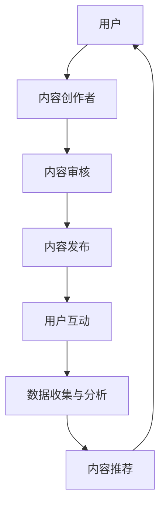

                 

### 文章标题

《知识付费平台的创业实践与案例分析》

### 关键词

(此处列出文章的5-7个核心关键词) 知识付费、创业实践、案例分析、平台运营、商业模式创新

### 摘要

本文旨在深入探讨知识付费平台的创业实践与案例分析。首先，我们将回顾知识付费行业的背景与核心概念，分析其市场现状和优势挑战。随后，通过创业策略、平台搭建与运营、市场营销、盈利模式以及案例分析，详细介绍知识付费平台的成功实践与经验教训。最后，文章将提供实践指南与战略规划，为未来知识付费平台的发展提供思路与方向。

### 目录大纲

# 《知识付费平台的创业实践与案例分析》

## 第一部分：行业背景与核心概念

### 第1章：知识付费行业概述

#### 1.1 知识付费的定义与发展历程

#### 1.2 知识付费平台的市场现状

#### 1.3 知识付费平台的优势与挑战

### 第2章：知识付费平台的核心概念

#### 2.1 知识付费平台的商业模式

#### 2.2 知识付费平台的用户需求分析

#### 2.3 知识付费平台的内容生产与管理

## 第二部分：创业实践与案例分析

### 第3章：知识付费平台的创业策略

#### 3.1 创业团队的组建与定位

#### 3.2 市场定位与目标用户群体分析

#### 3.3 创业初期的资金筹措与风险控制

### 第4章：平台搭建与运营

#### 4.1 平台技术架构设计

#### 4.2 内容审核与质量控制

#### 4.3 用户互动与社群运营

#### 4.4 数据分析与用户行为研究

### 第5章：市场营销与推广

#### 5.1 品牌建设与传播

#### 5.2 内容营销策略

#### 5.3 社交媒体推广与KOL合作

#### 5.4 用户增长与留存策略

### 第6章：盈利模式与商业模式创新

#### 6.1 盈利模式的多元化探索

#### 6.2 会员体系设计与运营

#### 6.3 产业链上下游拓展与合作

### 第7章：案例分析

#### 7.1 国内外成功案例介绍

#### 7.2 案例分析：成功要素与失败教训

#### 7.3 未来发展趋势与挑战

## 第三部分：实践指南与战略规划

### 第8章：知识付费平台的运营管理

#### 8.1 运营团队建设与职责划分

#### 8.2 平台风险管理

#### 8.3 财务管理

#### 8.4 法务合规与知识产权保护

### 第9章：知识付费平台的战略规划

#### 9.1 市场竞争分析

#### 9.2 企业愿景与使命

#### 9.3 战略目标与实施路径

#### 9.4 长期发展规划

## 附录

### 附录A：创业工具与资源推荐

#### A.1 常用创业工具介绍

#### A.2 创业相关书籍推荐

#### A.3 行业研究报告与数据来源

### 附录B：案例研究

#### B.1 案例研究1：某知名知识付费平台的成长之路

#### B.2 案例研究2：某垂直领域知识付费平台的运营策略分析

### 附录C：创业者访谈与心得

#### C.1 创业者访谈1：从零开始构建知识付费平台的心路历程

#### C.2 创业者访谈2：如何在知识付费市场中找到自己的独特价值

## Mermaid 流程图

### 知识付费平台架构流程图



### 核心算法原理讲解

#### 内容推荐算法

算法原理：

1. **用户画像构建**：通过用户的行为数据（如浏览历史、购买记录、评论等）来构建用户画像。
2. **内容特征提取**：对内容进行特征提取，如关键词、主题、情感等。
3. **相似度计算**：计算用户画像与内容特征之间的相似度。
4. **排序与推荐**：根据相似度对内容进行排序，推荐给用户。

伪代码：

```python
function content_recommendation(user_profile, content_features):
    user_similarity_scores <- []
    for content in content_features:
        similarity_score <- cosine_similarity(user_profile, content)
        append(user_similarity_scores, similarity_score)
    sorted_content <- sort(user_similarity_scores, descending=True)
    return(sorted_content)
```

### 数学模型和数学公式讲解

#### 用户兴趣模型

$$
\text{user\_interest} = \text{weight}\_{\text{content}} \times \text{content\_score} + \text{weight}\_{\text{user}} \times \text{user\_score}
$$

其中：
- \( \text{weight}\_{\text{content}} \) 和 \( \text{weight}\_{\text{user}} \) 分别表示内容和用户的权重系数。
- \( \text{content\_score} \) 和 \( \text{user\_score} \) 分别表示内容评分和用户评分。

#### 推荐系统评估指标

$$
\text{accuracy} = \frac{\text{预测正确的数量}}{\text{总测试样本数量}}
$$

$$
\text{precision} = \frac{\text{预测正确的推荐数量}}{\text{推荐的总数量}}
$$

$$
\text{recall} = \frac{\text{预测正确的推荐数量}}{\text{实际喜欢的总数量}}
$$

$$
\text{F1-score} = 2 \times \frac{\text{precision} \times \text{recall}}{\text{precision} + \text{recall}}
$$

### 项目实战

#### 案例研究1：某知识付费平台的用户兴趣分析与推荐系统实现

##### 开发环境搭建

- 开发语言：Python
- 数据库：MongoDB
- 推荐系统框架：Scikit-learn

##### 源代码实现

```python
# 用户画像构建
def build_user_profile(user_activity):
    # 以浏览历史为例，计算用户对各类内容的兴趣分数
    content_interests = {}
    for content in user_activity:
        if content not in content_interests:
            content_interests[content] = 0
        content_interests[content] += 1
    return content_interests

# 内容特征提取
def extract_content_features(contents):
    # 以关键词为例，构建内容特征向量
    content_features = {}
    for content in contents:
        keywords = extract_keywords(content)
        content_features[content] = create_vector(keywords)
    return content_features

# 相似度计算
from sklearn.metrics.pairwise import cosine_similarity

def calculate_similarity(user_profile, content_features):
    user_vector = create_vector(user_profile)
    similarity_scores = {}
    for content, content_vector in content_features.items():
        similarity_score = cosine_similarity([user_vector], [content_vector])[0][0]
        similarity_scores[content] = similarity_score
    return similarity_scores

# 排序与推荐
def content_recommendation(user_profile, content_features):
    similarity_scores = calculate_similarity(user_profile, content_features)
    sorted_content = sorted(similarity_scores, key=similarity_scores.get, reverse=True)
    return sorted_content[:10]  # 返回前10个最相似的内容

# 用户兴趣分析
user_activity = ['编程', '机器学习', '数据科学']
user_profile = build_user_profile(user_activity)

# 内容特征提取
content_features = extract_content_features(['编程教程', '深度学习入门', '数据分析实战'])

# 内容推荐
recommendations = content_recommendation(user_profile, content_features)
print("推荐内容：", recommendations)
```

##### 代码解读与分析

- **用户画像构建**：通过用户的浏览历史数据，计算用户对各类内容的兴趣分数。
- **内容特征提取**：通过提取内容的关键词，构建内容特征向量。
- **相似度计算**：使用余弦相似度计算用户画像与内容特征向量之间的相似度。
- **排序与推荐**：根据相似度排序，推荐用户可能感兴趣的前10个内容。

### 附录

#### 附录A：创业工具与资源推荐

- **数据分析工具**：Pandas、NumPy、Scikit-learn
- **推荐系统框架**：TensorFlow、PyTorch、Scikit-learn
- **内容管理平台**：WordPress、Contentful
- **用户反馈工具**：Typeform、Google Forms
- **市场调研报告**：Statista、IBISWorld

#### 附录B：案例研究

- **案例研究1**：某知名知识付费平台的用户增长策略分析
- **案例研究2**：某垂直领域知识付费平台的用户留存策略研究

#### 附录C：创业者访谈与心得

- **访谈1**：从零开始构建知识付费平台的心路历程
- **访谈2**：如何在知识付费市场中找到自己的独特价值

---

在接下来的文章中，我们将逐一探讨每个章节的详细内容，深入分析知识付费平台的各个方面。敬请期待！<|im_end|>### 第一部分：行业背景与核心概念

#### 第1章：知识付费行业概述

##### 1.1 知识付费的定义与发展历程

知识付费是指用户通过购买、订阅或租赁等方式，获取专业知识、技能培训、咨询服务等有价值的内容和服务。这一概念起源于互联网的普及和知识经济的兴起，近年来在全球范围内迅速发展。

知识付费的发展历程可以分为以下几个阶段：

1. **初步探索阶段（2000年代初）**：互联网的普及使得在线学习、电子书等知识产品开始受到关注，但市场尚未形成规模。
2. **快速增长阶段（2010年代）**：移动互联网的发展推动了知识付费的兴起，各种知识付费平台如雨后春笋般涌现，用户需求逐渐增加。
3. **成熟发展阶段（2010年代至今）**：随着人工智能、大数据等技术的应用，知识付费平台开始实现个性化推荐、智能分析等功能，市场逐渐成熟。

##### 1.2 知识付费平台的市场现状

当前，知识付费市场呈现出以下特点：

1. **市场规模不断扩大**：根据市场研究机构的报告，全球知识付费市场规模逐年增长，预计未来还将保持高速增长。
2. **用户需求多样化**：用户对知识付费的需求不仅限于技能培训，还涵盖了健康、理财、娱乐等多方面。
3. **竞争格局逐步形成**：随着市场的扩大，越来越多的企业进入知识付费领域，竞争格局逐步形成。

在中国市场，知识付费已经成为一个重要的产业。根据《2021年中国知识付费行业报告》，知识付费用户规模已超过4亿人，市场规模超过3000亿元。以下是一些知名的知识付费平台：

1. **得到**：以罗辑思维为代表，提供财经、管理、科技等领域的音频内容。
2. **喜马拉雅**：提供丰富的音频内容，涵盖教育、文化、娱乐等领域。
3. **知乎**：以问答社区为基础，提供付费专栏和直播课程。
4. **网易云课堂**：提供在线课程，涵盖编程、设计、营销等多个领域。

##### 1.3 知识付费平台的优势与挑战

知识付费平台的优势：

1. **高附加值**：知识付费产品具有较高的附加值，用户愿意为有价值的内容和服务付费。
2. **市场前景广阔**：随着知识经济的发展，知识付费市场具有巨大的潜力。
3. **个性化推荐**：利用大数据和人工智能技术，知识付费平台能够为用户提供个性化的内容推荐。

知识付费平台面临的挑战：

1. **内容质量参差不齐**：知识付费市场存在大量低质量的内容，影响用户体验。
2. **版权风险**：知识付费产品涉及版权问题，需要严格管理。
3. **用户流失**：在竞争激烈的市场中，用户流失是一个普遍问题。

总结：

知识付费行业具有巨大的市场潜力，但也面临着诸多挑战。在接下来的章节中，我们将深入探讨知识付费平台的核心概念、商业模式、创业策略、平台搭建与运营、市场营销、盈利模式以及案例分析，为读者提供全面的知识付费平台创业指南。

#### 第2章：知识付费平台的核心概念

##### 2.1 知识付费平台的商业模式

知识付费平台的商业模式是指平台如何通过提供知识内容和服务来获取收入的方式。以下是一些常见的商业模式：

1. **订阅模式**：用户通过支付固定的订阅费用，获得平台提供的内容和服务。例如，得到、喜马拉雅等平台均采用这种模式。
2. **按需付费模式**：用户根据需要购买单个知识产品或服务，如知乎的付费专栏。这种模式适合针对特定需求的知识产品。
3. **会员模式**：平台为用户提供高级会员服务，会员可以享受更多的特权，如优先观看新内容、参加线下活动等。例如，网易云课堂的高级会员可以享受更多课程和优先答疑。
4. **广告模式**：平台通过在知识内容中嵌入广告来获取收入。例如，一些知识付费平台在音频内容中播放广告。
5. **多元化模式**：一些知识付费平台结合多种商业模式，提供多样化的服务来满足不同用户的需求。例如，得到平台既有订阅模式，也有广告模式和会员模式。

##### 2.2 知识付费平台的用户需求分析

了解用户需求是知识付费平台成功的关键。用户对知识付费的需求可以分为以下几个方面：

1. **获取专业知识**：用户希望通过付费内容学习专业知识，提高自身技能。例如，程序员可能会购买编程课程，职场人士可能会关注管理技巧。
2. **技能培训**：用户希望通过付费内容进行技能培训，如摄影、设计、编程等。这些内容往往具有较强的实用性。
3. **兴趣培养**：用户希望通过付费内容培养兴趣，如文学、历史、音乐等。这类内容往往具有娱乐性和教育性。
4. **健康生活**：用户关注健康生活，希望通过付费内容获取健康饮食、运动锻炼等方面的知识。
5. **理财投资**：用户希望通过付费内容学习理财知识，提高投资收益。

分析用户需求的方法包括：

1. **用户调研**：通过问卷调查、访谈等方式了解用户需求。
2. **数据分析**：分析用户行为数据，如浏览历史、购买记录、评论等，挖掘用户兴趣和需求。
3. **市场调研**：研究竞争对手和行业趋势，了解市场需求和变化。

##### 2.3 知识付费平台的内容生产与管理

内容生产是知识付费平台的核心。以下是一些内容生产与管理的关键点：

1. **内容定位**：明确平台的内容定位，确定目标用户群体和内容主题。例如，专业课程平台应专注于专业技能培训，而兴趣培养平台则应提供多样化的娱乐性和教育性内容。
2. **内容审核**：确保内容的质量和合规性。平台应建立内容审核机制，对上传的内容进行审核，确保内容符合平台标准。
3. **内容更新**：定期更新内容，保持内容的时效性和吸引力。平台应制定内容更新计划，确保内容不断丰富。
4. **版权管理**：保护知识产权，避免侵权行为。平台应与内容创作者签订版权协议，确保内容的合法使用。
5. **内容优化**：通过数据分析，优化内容推荐和用户体验。平台应分析用户行为数据，调整内容推荐算法，提高用户满意度。

总结：

知识付费平台的核心概念包括商业模式、用户需求分析和内容生产与管理。了解这些概念，有助于创业者更好地规划和发展知识付费平台。在接下来的章节中，我们将进一步探讨创业策略、平台搭建与运营、市场营销、盈利模式以及案例分析，为读者提供全面的创业指南。

#### 第3章：知识付费平台的创业策略

##### 3.1 创业团队的组建与定位

创业团队的组建是知识付费平台成功的关键。一个高效的创业团队需要具备以下要素：

1. **核心成员**：创业团队应包括产品经理、技术专家、内容创作者、运营经理等核心成员。每个成员都应该具备与平台业务相关的专业技能和经验。
2. **团队规模**：初期团队规模不宜过大，一般建议控制在10人左右。这样可以确保团队成员之间的沟通和协作更加高效。
3. **职责划分**：明确团队成员的职责和分工，确保每个成员都能发挥自己的专长。例如，产品经理负责产品规划和用户体验，技术专家负责技术架构和开发，内容创作者负责内容生产和审核，运营经理负责市场推广和用户运营。

在团队定位方面，创业团队应明确以下目标：

1. **平台定位**：明确知识付费平台的定位，如专业课程、兴趣培养、健康生活等。定位应与团队成员的专长和市场需求相结合。
2. **用户定位**：确定目标用户群体，如职场人士、学生、兴趣爱好者等。了解用户需求和行为习惯，有助于为用户提供更有针对性的服务。
3. **市场定位**：分析市场竞争态势，找准自己的市场定位。可以通过差异化竞争策略，打造独特的平台特色，提高市场竞争力。

##### 3.2 市场定位与目标用户群体分析

市场定位是知识付费平台战略规划的重要环节。以下是一些关键步骤：

1. **市场细分**：根据用户需求、兴趣爱好、职业背景等特征，对市场进行细分。例如，可以将市场细分为专业课程市场、兴趣培养市场、健康生活市场等。
2. **目标用户群体分析**：针对每个细分市场，分析目标用户群体的特征、需求和行为习惯。了解用户需求有助于为用户提供更有价值的服务。
3. **竞争分析**：研究竞争对手的市场定位、产品特点、用户评价等。通过分析竞争对手的优劣势，找准自己的市场定位和差异化竞争策略。

目标用户群体分析的方法包括：

1. **用户调研**：通过问卷调查、访谈等方式收集用户反馈，了解用户需求和期望。
2. **数据分析**：分析用户行为数据，如浏览历史、购买记录、评论等，挖掘用户兴趣和需求。
3. **行业报告**：研究行业报告和市场调研数据，了解市场趋势和用户需求变化。

以下是一个目标用户群体分析的示例：

- **用户特征**：年龄在25-45岁之间，具有较高学历，从事专业工作或对某个领域有浓厚兴趣。
- **需求**：希望学习专业知识，提高技能水平；关注健康生活，寻求养生保健知识；培养兴趣爱好，寻求娱乐性内容。
- **行为习惯**：习惯使用移动互联网，经常访问知识付费平台，通过手机或平板电脑观看内容。

##### 3.3 创业初期的资金筹措与风险控制

创业初期的资金筹措是知识付费平台发展的关键。以下是一些资金筹措的途径：

1. **自筹资金**：利用个人储蓄、家庭资金或朋友投资等途径筹集资金。
2. **天使投资**：寻找天使投资人，通过出让股份换取资金支持。
3. **风险投资**：寻求风险投资机构的资金支持，通过股权融资或债务融资方式筹集资金。
4. **政府补贴**：关注政府相关政策，申请创业补贴、科技创新基金等。

在资金筹措过程中，需要注意以下风险：

1. **资金链断裂**：确保资金来源稳定，避免因资金短缺导致项目停滞。
2. **投资回报率**：合理评估投资回报率，确保投资者能够获得预期收益。
3. **股权稀释**：在股权融资过程中，避免过度稀释原有股东的股权。
4. **法律风险**：在签订投资协议时，注意保护双方的合法权益。

以下是一个资金筹措与风险控制的示例：

- **资金来源**：通过天使投资和风险投资筹集资金，总筹资金额为500万元。
- **资金用途**：用于平台搭建、内容制作、市场推广等。
- **风险控制**：在投资协议中明确投资回报率和股权比例，设立风险预警机制，确保资金使用合理。

总结：

创业策略是知识付费平台成功的重要保障。通过组建高效团队、明确市场定位、分析目标用户群体以及合理筹措资金和风险控制，创业者可以更好地应对市场挑战，实现平台的长远发展。在接下来的章节中，我们将探讨知识付费平台的搭建与运营、市场营销、盈利模式以及案例分析，为读者提供更全面的创业指南。

#### 第4章：平台搭建与运营

##### 4.1 平台技术架构设计

知识付费平台的技术架构设计是确保平台稳定运行和高效服务的关键。以下是一些核心技术和架构设计要点：

1. **前端技术**：前端采用HTML、CSS、JavaScript等基础技术，实现用户界面和交互功能。常用的前端框架如Vue.js、React等可以提高开发效率和用户体验。

2. **后端技术**：后端通常采用服务器端编程语言如Java、Python、Node.js等。常用的框架如Spring、Django、Express等，可以实现数据存储、业务逻辑处理和API接口等功能。

3. **数据库**：数据库用于存储用户数据、内容数据和其他业务数据。常用的关系型数据库如MySQL、PostgreSQL，以及非关系型数据库如MongoDB、Redis等，可以根据业务需求选择适合的数据库类型。

4. **缓存技术**：缓存技术如Memcached、Redis等可以大幅提升数据访问速度，减少数据库压力。缓存数据如用户信息、内容列表等，可以显著提高系统性能。

5. **内容管理系统（CMS）**：内容管理系统用于内容的生产、审核、发布和管理。常见的CMS如WordPress、Contentful等，可以方便地管理内容，并提供API接口供前端调用。

6. **推荐系统**：推荐系统通过用户行为数据、内容特征提取和相似度计算，实现个性化内容推荐。常用的推荐算法如协同过滤、基于内容的推荐等，可以通过机器学习框架如Scikit-learn、TensorFlow等实现。

7. **安全性**：安全性是平台搭建的关键考虑因素。采用HTTPS、SSL证书等保证数据传输安全，使用防火墙、入侵检测系统等保护平台免受网络攻击。

8. **扩展性**：设计时考虑系统的扩展性，以便应对用户增长和数据量的增加。采用微服务架构、分布式系统等可以提高系统的可扩展性和容错性。

##### 4.2 内容审核与质量控制

内容审核与质量控制是知识付费平台的重要环节，直接关系到用户体验和平台声誉。以下是一些关键措施：

1. **内容审核标准**：制定明确的审核标准，包括内容质量、合规性、真实性等。审核标准应根据平台定位和目标用户群体进行调整。

2. **人工审核**：由内容审核团队对上传的内容进行人工审核，确保内容符合审核标准。人工审核可以识别和过滤一些机器审核难以检测的问题。

3. **机器审核**：利用自然语言处理、图像识别等技术进行初步审核，提高审核效率和准确性。常见的机器审核技术包括关键词过滤、文本分类、违规内容检测等。

4. **实时监控**：通过技术手段对平台内容进行实时监控，及时发现和处理违规内容。实时监控可以通过API接口、日志分析等实现。

5. **用户反馈机制**：建立用户反馈机制，鼓励用户举报违规内容。通过用户反馈，可以补充人工审核的不足，提高内容审核的全面性和准确性。

6. **定期审核**：定期对已发布的内容进行审核，确保内容长期符合平台标准。定期审核可以通过自动化工具和人工审核相结合的方式实现。

##### 4.3 用户互动与社群运营

用户互动与社群运营是知识付费平台提升用户黏性和活跃度的关键。以下是一些具体措施：

1. **在线互动**：提供在线聊天室、论坛、问答社区等互动平台，鼓励用户之间进行交流和讨论。通过在线互动，可以增强用户归属感和活跃度。

2. **社群管理**：建立微信群、QQ群、Discord服务器等社群，由管理员或志愿者负责运营和管理。社群管理应包括活动组织、话题引导、用户管理等。

3. **内容互动**：通过互动式内容，如直播、互动问答、投票等，增强用户参与感和互动性。互动式内容可以提高用户粘性和用户满意度。

4. **个性化推荐**：利用推荐系统，为用户推荐感兴趣的内容和用户。个性化推荐可以增强用户的参与感和满意度。

5. **用户激励**：通过积分系统、奖励机制等，激励用户参与平台活动和内容创作。用户激励可以包括虚拟奖励、实物奖励、荣誉证书等。

6. **用户数据分析**：通过用户行为数据，分析用户兴趣、行为习惯等，为社群运营提供数据支持。数据分析可以帮助优化运营策略，提高用户活跃度。

##### 4.4 数据分析与用户行为研究

数据分析和用户行为研究是知识付费平台持续优化和改进的重要手段。以下是一些关键点：

1. **数据收集**：通过日志分析、API接口调用、用户行为数据等途径，收集用户行为数据。数据收集应遵循隐私保护原则，确保用户数据安全。

2. **数据存储**：使用数据库或数据仓库等技术，存储和管理用户行为数据。常见的数据存储技术包括MySQL、MongoDB、Hadoop等。

3. **数据分析**：通过数据分析工具（如Pandas、NumPy、SPSS等）对用户行为数据进行分析，提取有价值的信息。数据分析可以帮助了解用户需求、行为模式等。

4. **数据可视化**：使用数据可视化工具（如Tableau、PowerBI、Matplotlib等），将分析结果以图表、报表等形式展示，便于理解和决策。

5. **用户画像**：基于用户行为数据，构建用户画像，了解用户特征、兴趣和行为习惯。用户画像可以用于个性化推荐、营销策略等。

6. **用户反馈分析**：通过用户反馈数据，分析用户满意度、改进意见等，为产品优化提供参考。用户反馈分析可以帮助平台不断改进和优化服务。

总结：

知识付费平台的搭建与运营是一个复杂的过程，需要综合考虑技术架构设计、内容审核与质量控制、用户互动与社群运营以及数据分析和用户行为研究等多个方面。通过科学的平台搭建和运营策略，知识付费平台可以提升用户体验，增强用户黏性，实现长期稳定发展。在接下来的章节中，我们将探讨市场营销与推广、盈利模式与商业模式创新，为读者提供更全面的创业指南。

### 第5章：市场营销与推广

#### 5.1 品牌建设与传播

品牌建设与传播是知识付费平台成功的重要因素。以下是一些关键步骤和方法：

1. **品牌定位**：明确知识付费平台的品牌定位，包括平台的核心价值、目标用户群体和市场差异化。品牌定位应基于平台的内容特色和用户需求，形成独特的品牌形象。

2. **品牌理念**：建立品牌理念，包括品牌愿景、使命和核心价值观。品牌理念应简洁明了，能够传递平台的价值主张和用户承诺。

3. **品牌视觉**：设计统一的品牌视觉元素，如Logo、色彩、字体等。品牌视觉应具有辨识度和吸引力，能够迅速引起用户的注意。

4. **品牌传播**：通过多种渠道进行品牌传播，包括线上和线下活动、社交媒体营销、广告投放等。以下是一些具体的传播方法：

   - **社交媒体营销**：利用微博、微信、抖音等社交媒体平台，发布有价值的内容，与用户互动，建立品牌影响力。可以通过内容营销、互动营销、KOL合作等方式吸引用户关注。

   - **广告投放**：在目标用户集中的平台进行广告投放，如百度、今日头条、微信朋友圈等。广告投放应精准定位，提高广告的转化率。

   - **线下活动**：举办线下活动，如讲座、研讨会、沙龙等，邀请行业专家、意见领袖参加，增强品牌曝光度。线下活动可以提高用户对品牌的认知和信任。

   - **内容合作**：与其他知名平台、媒体或机构合作，发布联合报道或内容，扩大品牌影响力。内容合作可以包括内容互换、联合制作等。

5. **品牌口碑**：注重用户口碑，通过高质量的内容和服务，赢得用户的信任和好评。积极的用户反馈和口碑传播可以进一步提升品牌形象。

#### 5.2 内容营销策略

内容营销是知识付费平台的重要营销手段，以下是一些核心策略：

1. **内容创作**：创作有价值、有吸引力的内容，满足用户需求。内容创作应注重质量，避免低质、重复或过时的内容。以下是一些内容创作的方法：

   - **专业内容**：邀请行业专家或知名人士创作专业内容，提高内容的权威性和可信度。
   - **实用教程**：提供实用的教程和案例分析，帮助用户解决实际问题，提高用户满意度。
   - **知识分享**：分享行业趋势、最新动态、专业知识等，帮助用户了解行业前沿和发展方向。
   - **趣味内容**：创作趣味性强的内容，如幽默故事、短视频等，增加用户的参与度和分享欲望。

2. **内容分发**：通过多种渠道分发内容，提高内容的曝光度和传播效果。以下是一些内容分发的方法：

   - **社交媒体**：在社交媒体平台发布内容，如微博、微信、抖音等，利用社交网络的传播力扩大影响。
   - **自媒体平台**：在自媒体平台发布内容，如知乎、简书、头条号等，利用平台的流量和推荐机制提高内容曝光。
   - **合作媒体**：与行业媒体或垂直领域网站合作，发布内容，提高内容的权威性和影响力。
   - **邮件营销**：通过邮件营销向订阅用户发送内容更新通知，提高用户的粘性和活跃度。

3. **互动营销**：通过互动式内容，与用户建立更紧密的联系。以下是一些互动营销的方法：

   - **问答互动**：在平台设置问答功能，鼓励用户提问和解答，增加用户互动和粘性。
   - **投票和调研**：通过投票和调研，收集用户意见和需求，为内容创作提供参考。
   - **评论区互动**：鼓励用户在评论区留言和讨论，增加内容的热度和互动性。

4. **内容优化**：通过数据分析，优化内容的表现和效果。以下是一些内容优化的方法：

   - **数据分析**：分析内容的表现数据，如阅读量、点赞量、分享量等，了解用户偏好和兴趣。
   - **A/B测试**：对不同的内容进行A/B测试，比较效果，优化内容策略。
   - **用户反馈**：收集用户反馈，了解用户对内容的意见和建议，及时调整和优化内容。

#### 5.3 社交媒体推广与KOL合作

社交媒体推广与KOL合作是知识付费平台提高品牌知名度、吸引目标用户的有效途径。以下是一些具体策略：

1. **社交媒体推广**：

   - **精准定位**：确定目标用户群体，选择适合的平台和渠道进行推广。例如，针对职场人士，可以在LinkedIn上进行推广。
   - **内容策略**：发布有价值、有趣的内容，如专业文章、教程、案例等，吸引用户关注。内容应具有吸引力和传播力。
   - **互动营销**：与用户互动，回复评论、参与讨论，建立良好的用户关系。
   - **广告投放**：在社交媒体平台进行精准广告投放，提高品牌曝光度和转化率。

2. **KOL合作**：

   - **选择合适的KOL**：选择与平台定位和目标用户相匹配的KOL，确保合作效果。可以通过数据分析、市场调研等方式筛选合适的KOL。
   - **合作形式**：与KOL合作的形式多种多样，如内容创作、广告代言、联合推广等。根据平台需求和KOL的特点选择合适的合作形式。
   - **内容共创**：与KOL共同创作内容，结合双方的资源和影响力，提高内容的传播效果。
   - **用户互动**：通过KOL的影响力，吸引更多用户关注和参与平台，增强用户互动和活跃度。

#### 5.4 用户增长与留存策略

用户增长与留存是知识付费平台持续发展的关键。以下是一些具体策略：

1. **用户增长**：

   - **免费试读**：提供免费试读内容，让用户体验平台的服务质量，提高转化率。
   - **推荐机制**：利用推荐系统，为用户推荐感兴趣的内容，提高用户的参与度和满意度。
   - **用户邀请**：鼓励现有用户邀请新用户，通过推荐奖励等方式激励用户推荐。
   - **活动促销**：举办促销活动，如限时折扣、免费课程等，吸引新用户注册和使用。

2. **用户留存**：

   - **个性化服务**：根据用户行为数据，提供个性化的内容和服务，提高用户满意度和忠诚度。
   - **用户反馈**：及时收集用户反馈，解决用户问题，改进服务质量。
   - **内容更新**：定期更新内容，保持内容的时效性和吸引力，提高用户活跃度。
   - **会员体系**：建立会员体系，提供专属权益和服务，提高用户的粘性和忠诚度。

总结：

市场营销与推广是知识付费平台取得成功的重要手段。通过品牌建设与传播、内容营销策略、社交媒体推广与KOL合作以及用户增长与留存策略，知识付费平台可以吸引更多用户，提高品牌知名度，实现持续发展。在接下来的章节中，我们将探讨盈利模式与商业模式创新，为读者提供更全面的创业指南。

#### 第6章：盈利模式与商业模式创新

##### 6.1 盈利模式的多元化探索

知识付费平台的盈利模式需要不断创新和多元化，以适应市场需求和用户期望。以下是一些常见的盈利模式：

1. **订阅模式**：用户支付固定费用，获得平台的持续内容和服务。这种模式是知识付费平台最常用的盈利方式之一，适合内容丰富、持续更新的平台。例如，得到、喜马拉雅等平台都采用了订阅模式。

2. **课程销售**：用户购买单个课程或套餐，以获取特定内容或服务。这种模式适合专业性强、一次性销售的课程，如专业认证课程、技术培训班等。例如，网易云课堂提供的编程课程。

3. **广告收入**：平台通过在内容中嵌入广告，为广告主提供曝光和流量，从而获得收入。这种模式适用于流量较大的平台，可以通过广告分成、品牌广告等方式实现。例如，一些知识付费平台在音频内容中播放广告。

4. **会员模式**：平台为用户提供高级会员服务，会员可以享受更多的特权，如优先观看新内容、参加线下活动等。这种模式可以增强用户的黏性和忠诚度，提高平台的盈利能力。例如，知乎的高级会员。

5. **增值服务**：平台提供额外的增值服务，如课程辅导、职业咨询、技能测评等，用户支付额外费用享受服务。这种模式可以增加平台的收入来源，提高用户的满意度。例如，某些知识付费平台提供的VIP咨询服务。

6. **联合品牌**：与其他品牌合作，推出联合品牌产品或服务，共同分润。这种模式可以借助其他品牌的用户基础和影响力，扩大平台的市场份额。例如，某知名知识付费平台与知名教育机构合作的课程。

7. **内容授权**：平台将自有的高质量内容授权给其他机构或平台使用，获得授权费用。这种模式可以拓宽平台的收入渠道，提高内容的传播效果。例如，某些知识付费平台将自己的教程授权给其他培训机构使用。

##### 6.2 会员体系设计与运营

会员体系是知识付费平台提高用户黏性和忠诚度的重要手段。以下是一些关键点：

1. **会员等级**：设计不同的会员等级，如初级会员、高级会员、VIP会员等，根据会员等级提供不同的服务和权益。会员等级可以结合用户行为数据、付费额度等条件进行划分。

2. **会员权益**：为不同等级的会员提供相应的权益，如免费课程、优先观看新内容、专属活动、职业咨询等。权益的设计应满足会员的需求，提高会员的满意度和忠诚度。

3. **会员价格**：设置合理的会员价格，考虑会员等级、内容价值、市场竞争等因素。会员价格可以通过套餐优惠、折扣活动等方式进行灵活调整。

4. **会员运营**：定期与会员互动，了解会员需求和反馈，不断优化会员权益和服务。可以通过线上活动、问卷调查、会员专访等方式与会员建立紧密联系。

5. **会员转化**：通过促销活动、推荐奖励等手段，鼓励非会员用户升级为会员。会员转化策略应结合用户行为数据和市场需求进行优化。

##### 6.3 产业链上下游拓展与合作

知识付费平台的产业链可以向上游和下游拓展，通过合作和多元化发展提高竞争力。以下是一些拓展和合作方式：

1. **内容创作者合作**：与专业的知识创作者建立合作关系，提供内容创作支持、版权保护、收益分配等。这种合作可以确保平台拥有丰富的优质内容。

2. **教育机构合作**：与知名教育机构合作，共同开发课程和培训项目，提高课程的专业性和权威性。例如，与高校、科研机构等合作，推出联合认证课程。

3. **技术合作伙伴**：与技术公司合作，引入先进的技术和工具，提升平台的技术实力和服务质量。例如，与人工智能公司合作，优化推荐系统和智能客服。

4. **渠道合作伙伴**：与线上线下渠道合作，拓宽销售渠道，提高市场覆盖率。例如，与书店、电商平台、线下培训机构等合作，推广平台课程。

5. **生态合作伙伴**：与其他知识付费平台、内容平台、社区等建立生态合作关系，共享用户资源、内容资源等，共同发展。例如，与知乎、微博等平台合作，进行内容互换和用户导流。

6. **跨界合作**：探索跨界合作机会，与不同领域的品牌、企业合作，推出联合产品或服务。例如，与健身品牌合作，推出健康生活课程。

总结：

盈利模式与商业模式创新是知识付费平台持续发展的重要驱动力。通过多元化盈利模式的探索、会员体系的设计与运营以及产业链上下游的拓展与合作，知识付费平台可以提升盈利能力、增强用户黏性，实现可持续发展。在接下来的章节中，我们将通过案例分析，深入探讨知识付费平台的成功实践与失败教训。

### 第7章：案例分析

#### 7.1 国内外成功案例介绍

在全球范围内，知识付费平台的发展取得了显著成果。以下介绍几个具有代表性的国内外成功案例：

##### 国内成功案例

1. **得到**

   得到是由罗辑思维团队创办的知识付费平台，提供财经、管理、科技等领域的音频内容。其成功经验包括：

   - **内容定位明确**：以专业化、深度化、多样化的内容吸引中高端用户。
   - **品牌效应显著**：依托罗辑思维的品牌影响力，迅速提升知名度。
   - **用户互动丰富**：通过微信群、线上论坛等方式，增强用户参与感和社区感。

2. **喜马拉雅**

   喜马拉雅是中国最大的音频分享平台，提供音乐、故事、有声书、讲座等内容。其成功经验包括：

   - **内容丰富多样**：涵盖多个领域，满足不同用户的需求。
   - **用户基数庞大**：通过广泛的用户基础，实现规模效应。
   - **互动性强**：通过直播间、问答社区等功能，增强用户互动。

##### 国际成功案例

1. **Udemy**

   Udemy是一个全球性的在线学习平台，提供编程、设计、商业等领域的在线课程。其成功经验包括：

   - **课程种类丰富**：提供数千门课程，满足全球用户的需求。
   - **全球化战略**：在多个国家和地区设有分支机构，覆盖全球市场。
   - **市场推广精准**：通过SEO优化、社交媒体营销等手段，提高品牌知名度。

2. **Coursera**

   Coursera是一个在线学习平台，与全球多家顶尖大学合作，提供在线课程。其成功经验包括：

   - **高质量课程**：与顶尖大学合作，确保课程的质量和权威性。
   - **多样化学习方式**：提供视频课程、在线作业、讨论区等多样化的学习方式。
   - **灵活的学习安排**：允许用户自主安排学习进度，提高学习效果。

#### 7.2 案例分析：成功要素与失败教训

##### 成功要素

1. **明确的内容定位**：成功的知识付费平台通常具有明确的内容定位，针对特定的用户群体提供有针对性的内容。例如，得到的财经、管理类内容吸引了大量中高端用户。

2. **高质量的内容生产**：高质量的内容是知识付费平台的核心竞争力。平台应注重内容的生产质量，确保内容的专业性、实用性和权威性。

3. **良好的用户体验**：成功的知识付费平台注重用户体验，提供简洁易用的界面、快速的内容加载、有效的用户互动等功能，提升用户的满意度和粘性。

4. **有效的营销策略**：成功的营销策略是知识付费平台获得用户关注和转化的关键。通过社交媒体、广告投放、内容营销等手段，提高品牌知名度，吸引更多用户。

5. **强大的用户社区**：成功的知识付费平台通常建立强大的用户社区，通过微信群、论坛、问答社区等互动平台，增强用户参与感和归属感。

##### 失败教训

1. **内容质量不高**：一些知识付费平台因内容质量不高，导致用户流失和口碑受损。平台应注重内容审核和质量控制，确保内容的品质。

2. **用户体验不佳**：用户体验不佳，如界面设计不合理、加载速度慢、功能不完善等，会导致用户不满和流失。平台应不断优化用户体验，提高用户满意度。

3. **营销策略不精准**：不精准的营销策略，如广告投放不准确、内容营销效果不佳等，会浪费资源，影响平台的品牌形象和用户获取。

4. **用户互动不足**：用户互动不足，如社区建设不完善、用户反馈机制不健全等，会导致用户参与度低，影响用户留存。

5. **商业模式不清**：商业模式不清，如盈利模式不明确、会员体系不完善等，会影响平台的持续发展。平台应明确商业模式，确保盈利能力和可持续发展。

#### 7.3 未来发展趋势与挑战

随着互联网技术的发展和知识经济的兴起，知识付费平台在未来将继续发展，但也面临一些挑战：

1. **内容质量的提升**：知识付费平台需要不断提升内容质量，满足用户对高质量、专业化内容的需求。

2. **个性化推荐的优化**：个性化推荐是知识付费平台的重要功能，平台需要不断优化推荐算法，提高推荐精准度，提升用户体验。

3. **用户体验的优化**：平台需要不断优化用户体验，提高用户满意度和忠诚度。

4. **用户增长的突破**：在竞争激烈的市场中，知识付费平台需要寻找新的增长点，如拓展新领域、开发新功能等。

5. **版权风险的防范**：知识付费平台需要加强版权管理，防范侵权行为，保护知识产权。

6. **市场竞争的加剧**：随着更多企业进入知识付费领域，市场竞争将更加激烈，平台需要不断创新和提升竞争力。

总结：

通过分析国内外成功案例，我们可以总结出知识付费平台的成功要素和失败教训。未来，知识付费平台将继续发展，但也面临诸多挑战。平台需要不断提升内容质量、优化用户体验、探索新的商业模式，以应对市场竞争和用户需求的变化。

### 第8章：实践指南与战略规划

#### 8.1 运营团队建设与职责划分

运营团队是知识付费平台成功的关键。一个高效的运营团队需要明确职责和目标，以下是一些关键步骤和注意事项：

1. **团队规模**：初期运营团队的规模不宜过大，通常建议在10人左右。团队成员应包括产品经理、运营经理、内容编辑、市场推广、客服等关键岗位。

2. **岗位职责**：

   - **产品经理**：负责产品规划、需求分析、功能设计等，确保产品满足用户需求。
   - **运营经理**：负责日常运营工作，包括内容审核、用户管理、市场推广等。
   - **内容编辑**：负责内容创作、编辑、发布和审核，确保内容质量和合规性。
   - **市场推广**：负责市场调研、品牌推广、活动策划等，提升平台知名度和用户转化率。
   - **客服**：负责用户咨询、投诉处理、售后服务等，提升用户满意度和忠诚度。

3. **职责划分**：明确团队成员的职责和分工，确保每个成员都能专注于自己的领域，提高工作效率。可以通过制定岗位职责说明书、工作流程图等方式进行明确。

4. **团队协作**：加强团队协作，确保各个部门之间的沟通和协调。可以通过定期会议、工作群等方式，促进信息共享和任务协同。

5. **培训与激励**：定期对团队成员进行培训，提高专业能力和工作效率。同时，通过激励措施，如绩效考核、奖金、晋升机会等，激发团队活力。

#### 8.2 平台风险管理

知识付费平台在运营过程中面临多种风险，以下是一些关键风险和应对策略：

1. **内容风险**：包括侵权、低质内容、违规内容等。应对策略：

   - **内容审核机制**：建立严格的内容审核机制，对上传的内容进行审核，确保内容质量。
   - **版权管理**：与内容创作者签订版权协议，确保内容的合法使用。
   - **用户举报机制**：建立用户举报机制，及时处理用户反馈的违规内容。

2. **技术风险**：包括系统故障、数据泄露、网络攻击等。应对策略：

   - **技术保障**：定期进行系统维护和升级，确保系统的稳定性和安全性。
   - **数据备份**：定期备份用户数据和内容数据，防止数据丢失。
   - **安全防护**：采用防火墙、入侵检测系统等安全措施，防范网络攻击。

3. **财务风险**：包括资金流动、成本控制等。应对策略：

   - **财务规划**：制定合理的财务规划，确保资金来源稳定，合理控制成本。
   - **风险预警**：建立风险预警机制，及时发现和应对潜在财务风险。
   - **资金管理**：加强资金管理，确保资金使用的透明性和规范性。

4. **法律风险**：包括合同纠纷、知识产权纠纷等。应对策略：

   - **法律顾问**：聘请专业法律顾问，处理合同纠纷和知识产权纠纷。
   - **合同审查**：在签订合同时，严格审查合同条款，确保双方权益。
   - **合规管理**：遵守相关法律法规，确保平台运营合规。

#### 8.3 财务管理

有效的财务管理是知识付费平台健康发展的基础。以下是一些关键财务管理策略：

1. **预算管理**：制定详细的预算计划，包括收入预算、成本预算等。定期进行预算执行情况的评估，及时调整预算。

2. **成本控制**：合理控制各项成本，如人力成本、运营成本、营销成本等。通过优化流程、提高效率等方式，降低成本。

3. **收入管理**：积极拓展收入来源，如增加会员数量、提高会员续费率、开发新课程等。通过数据分析，了解用户需求和消费习惯，优化收入结构。

4. **现金流管理**：确保现金流的稳定，避免资金链断裂。通过定期财务报表和分析，了解资金流动情况，及时调整资金使用计划。

5. **财务审计**：定期进行财务审计，确保财务报告的真实性和准确性。通过审计，发现财务管理中存在的问题，及时进行整改。

#### 8.4 法务合规与知识产权保护

知识付费平台在运营过程中需要遵守相关法律法规，保护知识产权，以下是一些关键点：

1. **合规管理**：了解和遵守相关法律法规，如《中华人民共和国合同法》、《著作权法》等。确保平台运营合法合规。

2. **知识产权保护**：与内容创作者签订版权协议，明确版权归属和使用权限。防止侵权行为，维护自身合法权益。

3. **版权审核**：对上传的内容进行版权审核，确保内容不侵犯他人知识产权。建立版权举报和处理机制，及时处理侵权投诉。

4. **合同管理**：在签订合同时，严格审查合同条款，确保合同合法有效。对重要合同进行法律审查，防范合同风险。

5. **法律咨询**：聘请专业法律顾问，处理合同纠纷、知识产权纠纷等法律事务。确保平台运营中的法律问题得到妥善解决。

总结：

实践指南与战略规划是知识付费平台成功运营的关键。通过建设高效的运营团队、加强平台风险管理、进行有效的财务管理和法务合规，知识付费平台可以确保稳定发展，应对市场变化和竞争挑战。在未来的运营过程中，平台应不断优化和调整战略规划，以实现长期可持续发展。

### 附录A：创业工具与资源推荐

#### A.1 常用创业工具介绍

创业过程中，选择合适的工具对于提高效率和实现目标至关重要。以下是一些常用的创业工具及其功能介绍：

1. **数据分析工具**：
   - **Pandas**：Python数据分析和操作库，适用于数据清洗、数据处理和分析。
   - **NumPy**：Python科学计算库，提供高效的多维数组对象和数学函数。
   - **Tableau**：数据可视化工具，用于创建交互式数据仪表板和报告。

2. **推荐系统框架**：
   - **Scikit-learn**：Python机器学习库，提供各种推荐算法和工具。
   - **TensorFlow**：开源机器学习框架，适用于深度学习和推荐系统开发。
   - **PyTorch**：开源深度学习框架，具有灵活的动态计算图和强大的社区支持。

3. **内容管理平台**：
   - **WordPress**：开源内容管理系统，适用于创建和发布博客、网站。
   - **Contentful**：API-first的内容管理平台，支持各种内容类型的存储和分发。

4. **用户反馈工具**：
   - **Typeform**：互动式调查和反馈工具，用于收集用户意见和建议。
   - **Google Forms**：Google提供的在线调查表单工具，适用于简单用户反馈收集。

5. **项目管理工具**：
   - **Trello**：基于看板的项目管理工具，适用于团队协作和任务跟踪。
   - **Asana**：全面的项目管理工具，提供任务分配、进度追踪和协作功能。

6. **财务工具**：
   - **QuickBooks**：会计和财务管理软件，适用于中小企业的财务管理和报表生成。
   - **Xero**：云会计软件，提供财务报告、发票管理和银行对账等功能。

#### A.2 创业相关书籍推荐

阅读相关的书籍可以帮助创业者深入了解行业知识、掌握创业技巧，以下是几本推荐的创业书籍：

1. **《创业维艰》（The Hard Thing About Hard Things）**：作者本·霍洛维茨，分享了自己在创业过程中的真实经历和心得，对创业者具有很好的启示作用。

2. **《精益创业》（The Lean Startup）**：作者埃里克·莱斯，介绍了精益创业的方法论，帮助创业者快速验证产品市场契合点。

3. **《创业不是一场马拉松》（The Lean Startup）**：作者史蒂夫·布兰克，介绍了如何通过快速迭代和用户反馈来优化创业项目。

4. **《创业精神》（The Art of the Start）**：作者斯蒂夫·乔布斯，分享了自己创办苹果公司的经历，为创业者提供了宝贵的创业智慧和经验。

5. **《创业真难》（How to Win at the Sport of Business）**：作者唐纳德·特朗普，分享了自己在商业领域的成功经验和创业故事。

#### A.3 行业研究报告与数据来源

了解行业趋势和市场数据对于创业至关重要。以下是一些行业研究报告和数据来源推荐：

1. **Statista**：提供全球各行业的数据分析报告，涵盖市场趋势、用户行为、竞争格局等。

2. **IBISWorld**：专注于行业研究的数据库，提供详细的市场报告和分析。

3. **Google Trends**：Google提供的关键词搜索趋势工具，帮助了解特定关键词在不同时间和地区的搜索热度。

4. **LinkedIn**：职业社交平台，通过分析行业动态和人才流动，了解行业趋势。

5. **行业协会报告**：如中国互联网协会、中国电子商务协会等，提供行业报告和统计数据。

通过使用这些创业工具和资源，创业者可以更好地规划业务、优化运营、提高效率，从而在竞争激烈的市场中脱颖而出。

### 附录B：案例研究

#### B.1 案例研究1：某知名知识付费平台的成长之路

**背景**

某知名知识付费平台（以下简称“平台”）成立于2015年，创始团队由几位有着丰富教育行业经验的专家组成。平台初期以提供财经领域的知识付费内容为主，主要目标用户群体为职场人士和投资者。

**发展历程**

1. **初期阶段（2015-2017年）**：

   - **产品定位**：平台初期定位为财经领域的知识付费内容，专注于为用户提供深度、专业的财经资讯和投资策略。
   - **内容创作**：与业内知名专家合作，创作高质量的内容，包括音频课程、电子书、研究报告等。
   - **用户增长**：通过社交媒体、线下活动等途径，吸引首批用户，并进行口碑传播。

2. **发展阶段（2018-2020年）**：

   - **内容拓展**：平台开始拓展内容领域，增加科技、管理、创业等领域的知识付费内容，满足更广泛用户的需求。
   - **技术升级**：引入大数据和人工智能技术，优化内容推荐算法，提高用户体验。
   - **用户增长**：通过精准营销、用户推荐等方式，持续扩大用户基础，月活跃用户数达到数百万。

3. **成熟阶段（2021年至今）**：

   - **多元化盈利**：平台探索多元化盈利模式，包括订阅服务、广告收入、课程销售和会员体系等。
   - **国际化发展**：开始布局海外市场，与海外知名机构和专家合作，推出国际版内容。
   - **用户互动**：建立强大的用户社区，通过线上互动、线下活动等方式，增强用户粘性和忠诚度。

**成功因素**

1. **明确的产品定位**：平台始终坚持财经领域的知识付费内容，确保内容的专业性和权威性，吸引了大量忠实用户。
2. **高质量的内容创作**：与业内知名专家合作，保证内容质量，通过不断更新内容，满足用户需求。
3. **技术创新**：引入大数据和人工智能技术，优化用户体验，提高内容推荐的精准度。
4. **用户互动**：建立强大的用户社区，增强用户参与感和归属感，提高用户忠诚度。

**经验教训**

1. **持续优化用户体验**：平台在发展过程中，始终注重用户体验，不断改进产品功能和界面设计。
2. **多样化盈利模式**：平台通过多元化盈利模式，提高了盈利能力和抗风险能力。
3. **国际化布局**：平台在国际化发展中，注重与本地化机构的合作，确保内容符合当地市场需求。

#### B.2 案例研究2：某垂直领域知识付费平台的运营策略分析

**背景**

某垂直领域知识付费平台（以下简称“平台”）成立于2018年，专注于提供法律领域的知识付费内容。平台创始团队由几位资深律师组成，目标用户群体为律师、法律从业者以及法律爱好者。

**发展历程**

1. **初期阶段（2018-2019年）**：

   - **产品定位**：平台初期定位为法律领域的知识付费内容，提供专业、实用的法律课程、案例分析、法律法规解读等。
   - **内容创作**：与资深律师合作，创作高质量的法律内容，包括音频课程、视频教程、电子书等。
   - **用户增长**：通过法律社区、律师协会等途径，吸引法律从业者关注和使用平台。

2. **发展阶段（2020-2022年）**：

   - **内容拓展**：平台开始拓展内容领域，增加刑事法律、民事法律、国际法律等领域的知识付费内容。
   - **用户互动**：建立在线问答社区，提供实时法律咨询，增强用户互动。
   - **用户增长**：通过线上推广、线下活动等方式，不断扩大用户基础，月活跃用户数达到数十万。

3. **成熟阶段（2023年至今）**：

   - **盈利模式**：平台探索多元化盈利模式，包括订阅服务、课程销售、广告收入和法律咨询服务等。
   - **品牌建设**：通过法律专家讲座、法律论坛等活动，提升品牌影响力。
   - **用户留存**：通过提供优质内容、良好的用户体验和贴心服务，提高用户留存率。

**成功因素**

1. **专业的内容创作**：平台与资深律师合作，确保内容的专业性和权威性，满足用户对高质量法律内容的需求。
2. **互动性强的社区**：建立在线问答社区，提供实时法律咨询，增强用户互动，提高用户满意度。
3. **精准的市场定位**：专注于法律领域，满足特定用户群体的需求，形成独特的市场优势。
4. **良好的用户体验**：提供简洁易用的界面、快速的内容加载和优质的服务，提升用户体验。

**经验教训**

1. **专注内容质量**：平台在发展过程中，始终重视内容质量，不断优化内容创作流程。
2. **灵活的运营策略**：通过多样化运营策略，如线下活动、品牌推广等，提高用户转化率和留存率。
3. **用户反馈机制**：建立有效的用户反馈机制，及时了解用户需求和意见，持续改进产品和服务。

通过以上两个案例研究，我们可以看到，成功的知识付费平台在内容创作、用户互动、技术创新和品牌建设等方面都有其独特的优势和策略。创业者可以从中学习借鉴，结合自身情况，制定适合自己的运营策略。

### 附录C：创业者访谈与心得

#### C.1 创业者访谈1：从零开始构建知识付费平台的心路历程

**访谈对象**：张先生，某知名知识付费平台创始人兼CEO

**访谈内容**：

**Q**：请问您是如何开始构建知识付费平台的？

**A**：我最初是作为一名律师，积累了丰富的法律知识和实践经验。在这个过程中，我发现很多法律从业者都需要高质量、专业的知识资源，但市面上并没有一个专门提供这类内容的平台。于是，我决定创立一个知识付费平台，为广大法律从业者提供实用的法律知识和资源。

**Q**：在创业初期，您遇到了哪些挑战？

**A**：最大的挑战是内容创作。我们一开始并没有太多资源，需要自己动手创作内容。我们组建了一支专业的律师团队，通过不断的讨论和尝试，逐渐找到了适合平台的内容创作模式。

**Q**：如何吸引首批用户？

**A**：我们通过线上和线下活动，如法律论坛、律师协会活动等，吸引首批用户。同时，我们还邀请了一些知名律师和法律专家进行讲座，提高了平台的知名度和用户参与度。

**Q**：在平台发展过程中，您如何保持创新能力？

**A**：我们始终坚持用户需求导向，通过用户调研、数据分析等方式，了解用户的需求和反馈。我们根据用户需求不断优化产品功能和内容，保持平台的创新性和竞争力。

**心得体会**：张先生的创业经历告诉我们，知识付费平台的成功离不开专业的内容创作、有效的用户互动和持续的创新。同时，创业者需要有坚定的信念和持续的努力，才能在激烈的市场竞争中脱颖而出。

#### C.2 创业者访谈2：如何在知识付费市场中找到自己的独特价值

**访谈对象**：李女士，某垂直领域知识付费平台创始人兼CEO

**访谈内容**：

**Q**：请问您是如何找到自己的独特价值的？

**A**：我们最初是看到市场上存在很多同质化的知识付费平台，竞争非常激烈。于是，我们决定专注于一个垂直领域，即家庭教育和儿童发展。我们通过深入研究家庭教育和儿童心理学，找到了自己的独特价值，即提供专业、实用的家庭教育指导。

**Q**：在市场定位方面，您有哪些具体的策略？

**A**：我们首先明确了目标用户群体，即有孩子的家长和从事家庭教育工作的专业人士。然后，我们根据用户需求，开发了一系列高质量的家庭教育课程和资源。我们还通过与教育机构、儿童心理咨询师等合作，确保内容的权威性和实用性。

**Q**：如何提高用户的忠诚度？

**A**：我们通过以下几个策略提高用户的忠诚度：

1. **个性化服务**：根据用户的兴趣和需求，提供个性化的课程推荐和内容。
2. **互动性强的社区**：建立在线问答社区，让用户可以互相交流和学习。
3. **优质服务**：提供7x24小时客服服务，及时解决用户的问题和反馈。

**心得体会**：李女士的经历告诉我们，在知识付费市场中找到自己的独特价值是非常重要的。通过专注垂直领域、提供高质量的内容和优质的服务，可以提升用户的忠诚度和满意度，从而在激烈的市场竞争中脱颖而出。

通过以上两位创业者的访谈，我们可以看到，成功的知识付费平台需要专业的内容创作、明确的市场定位和优质的服务。同时，创业者需要有持续的创新精神，不断优化产品和服务，以满足用户需求，实现长期发展。

---

以上就是本文的全部内容。通过深入探讨知识付费平台的行业背景、核心概念、创业策略、平台搭建与运营、市场营销、盈利模式、案例分析以及实践指南和战略规划，我们希望为创业者提供全面的创业指南。知识付费平台具有广阔的市场前景，但也面临诸多挑战。创业者需要不断学习和创新，才能在激烈的市场竞争中脱颖而出。祝各位创业者成功！<|im_end|>### Mermaid 流程图

为了更好地展示知识付费平台的运作流程，我们使用Mermaid语法绘制了知识付费平台的架构流程图。以下是流程图的文本表示：


以下是流程图的详细解释：

1. **用户**：用户是知识付费平台的核心，他们通过平台获取知识和服务。用户的行为数据，如浏览历史、购买记录等，将直接影响平台的内容推荐和运营策略。

2. **内容创作者**：内容创作者是平台的内容来源。他们创作高质量的内容，如音频、视频、文章等，为用户提供有价值的信息。平台需要与内容创作者建立良好的合作关系，确保内容的质量和多样性。

3. **内容审核**：平台需要对上传的内容进行审核，确保内容的质量和合规性。审核流程可以包括人工审核和机器审核，以确保内容的真实性和专业性。

4. **内容发布**：审核通过的内容将在平台上发布，用户可以通过各种渠道（如APP、网站等）访问和消费这些内容。

5. **用户互动**：用户可以在平台上进行互动，如评论、点赞、分享等。这些互动数据将被收集，用于内容推荐和平台优化。

6. **数据收集与分析**：平台通过日志分析、用户行为数据收集等方式，分析用户的行为模式和兴趣偏好。这些数据将用于内容推荐、用户分群和运营策略优化。

7. **内容推荐**：根据用户的行为数据和分析结果，平台可以使用推荐算法为用户推荐感兴趣的内容。推荐系统的设计对于提升用户满意度和留存率至关重要。

8. **循环反馈**：用户的行为数据和分析结果将继续影响平台的内容创作、审核、发布和推荐流程，形成一个闭环的反馈机制，确保平台能够不断优化和改进。

通过以上流程图，我们可以清晰地看到知识付费平台的核心运作机制和各个环节的相互关系。这种流程图不仅有助于理解平台的运作模式，还可以为创业者在实际操作中提供参考和指导。

### 核心算法原理讲解

在知识付费平台中，推荐算法是提升用户体验、增加用户黏性的关键组成部分。以下是内容推荐算法的核心原理和实现方法。

#### 内容推荐算法

内容推荐算法主要通过以下几个步骤来实现：

1. **用户画像构建**：通过对用户的浏览历史、购买记录、评论等行为数据进行分析，构建用户的兴趣画像。用户画像用于描述用户的兴趣偏好和行为特征。

2. **内容特征提取**：对平台上的内容进行特征提取，例如提取关键词、主题标签、情感倾向等。这些特征将用于描述内容的信息属性。

3. **相似度计算**：计算用户画像和内容特征之间的相似度。常见的相似度计算方法包括余弦相似度、皮尔逊相关系数等。相似度分数越高，表示用户对该内容越感兴趣。

4. **内容排序与推荐**：根据相似度分数对内容进行排序，将最相关的推荐内容呈现给用户。推荐系统通常设定一个阈值，只有相似度高于阈值的才会被推荐。

以下是一个简单的伪代码示例，用于说明内容推荐算法的基本实现：

```python
# 假设有以下用户行为数据（用户画像）和内容特征数据
user_profile = ['编程', '机器学习', '数据科学']
content_features = {
    '课程1': ['编程', '算法'],
    '课程2': ['机器学习', '深度学习'],
    '课程3': ['数据科学', '统计学']
}

# 计算用户画像和内容特征之间的余弦相似度
def cosine_similarity(user_profile, content):
    dot_product = sum(a * b for a, b in zip(user_profile, content))
    norm_user = sum(x ** 2 for x in user_profile) ** 0.5
    norm_content = sum(x ** 2 for x in content) ** 0.5
    similarity_score = dot_product / (norm_user * norm_content)
    return similarity_score

# 对所有内容计算相似度并排序推荐
def content_recommendation(user_profile, content_features):
    similarity_scores = {}
    for content, features in content_features.items():
        similarity_scores[content] = cosine_similarity(user_profile, features)
    sorted_content = sorted(similarity_scores, key=similarity_scores.get, reverse=True)
    return sorted_content

# 获取推荐内容
recommendations = content_recommendation(user_profile, content_features)
print("推荐内容：", recommendations)
```

#### 数学模型和数学公式讲解

在内容推荐算法中，常用的数学模型和公式包括用户兴趣模型和推荐系统评估指标。

##### 用户兴趣模型

用户兴趣模型用于描述用户对内容的兴趣程度，常见的公式如下：

$$
\text{user\_interest} = \text{weight}\_{\text{content}} \times \text{content\_score} + \text{weight}\_{\text{user}} \times \text{user\_score}
$$

其中：
- \( \text{weight}\_{\text{content}} \) 和 \( \text{weight}\_{\text{user}} \) 是权重系数，用于平衡内容和用户评分的影响。
- \( \text{content\_score} \) 和 \( \text{user\_score} \) 是内容评分和用户评分，通常基于用户行为数据进行计算。

##### 推荐系统评估指标

推荐系统的评估指标用于衡量推荐算法的性能，常见指标包括准确率（accuracy）、精确率（precision）、召回率（recall）和F1分数（F1-score）。

- **准确率（accuracy）**：预测正确的数量占总测试样本数量的比例。

$$
\text{accuracy} = \frac{\text{预测正确的数量}}{\text{总测试样本数量}}
$$

- **精确率（precision）**：预测正确的推荐数量占推荐总数量的比例。

$$
\text{precision} = \frac{\text{预测正确的推荐数量}}{\text{推荐的总数量}}
$$

- **召回率（recall）**：预测正确的推荐数量占实际喜欢的总数量的比例。

$$
\text{recall} = \frac{\text{预测正确的推荐数量}}{\text{实际喜欢的总数量}}
$$

- **F1分数（F1-score）**：精确率和召回率的调和平均值。

$$
\text{F1-score} = 2 \times \frac{\text{precision} \times \text{recall}}{\text{precision} + \text{recall}}
$$

通过以上数学模型和公式，我们可以更好地理解和评估内容推荐算法的性能，从而优化推荐策略，提高用户满意度。

#### 项目实战

下面通过一个实际项目，展示如何实现内容推荐系统，包括开发环境搭建、源代码实现和代码解读。

##### 开发环境搭建

- **开发语言**：Python
- **数据库**：MongoDB
- **推荐系统框架**：Scikit-learn

##### 源代码实现

```python
# 导入必要的库
import numpy as np
from sklearn.metrics.pairwise import cosine_similarity

# 假设的用户行为数据和内容特征数据
user_activities = {
    'user1': ['编程', '机器学习', '数据科学'],
    'user2': ['人工智能', '数据分析', '深度学习'],
    'user3': ['Python', '算法', '区块链']
}

content_features = {
    'course1': ['编程', '算法', '数据结构'],
    'course2': ['机器学习', '深度学习', '数据分析'],
    'course3': ['人工智能', '区块链', 'Web开发']
}

# 建立用户画像和内容特征矩阵
user_profiles = [user_activities[user] for user in user_activities]
content_vectors = {content: np.array(features) for content, features in content_features.items()}

# 计算用户画像和内容特征之间的余弦相似度
def calculate_similarity(user_profile, content_vectors):
    similarity_scores = {}
    for content, content_vector in content_vectors.items():
        similarity_score = cosine_similarity([np.array(user_profile)], [content_vector])[0][0]
        similarity_scores[content] = similarity_score
    return similarity_scores

# 排序和推荐
def content_recommendation(user_profile, content_vectors):
    similarity_scores = calculate_similarity(user_profile, content_vectors)
    sorted_content = sorted(similarity_scores, key=similarity_scores.get, reverse=True)
    return sorted_content[:3]  # 返回前三个最相似的内容

# 为用户1推荐课程
user1_profile = user_activities['user1']
recommendations = content_recommendation(user1_profile, content_vectors)
print("推荐课程：", recommendations)

# 为用户2推荐课程
user2_profile = user_activities['user2']
recommendations = content_recommendation(user2_profile, content_vectors)
print("推荐课程：", recommendations)

# 为用户3推荐课程
user3_profile = user_activities['user3']
recommendations = content_recommendation(user3_profile, content_vectors)
print("推荐课程：", recommendations)
```

##### 代码解读与分析

- **数据预处理**：首先，我们将用户行为数据和内容特征数据转换为向量形式，以方便后续的相似度计算。
- **相似度计算**：使用余弦相似度计算每个用户与每个内容的相似度分数。
- **内容推荐**：根据相似度分数对内容进行排序，推荐相似度最高的内容给用户。

通过上述项目实战，我们可以看到如何使用Python和Scikit-learn实现内容推荐算法。代码简洁明了，易于理解，同时也展示了如何利用相似度计算和排序实现个性化推荐。

### 附录

#### 附录A：创业工具与资源推荐

- **数据分析工具**：Pandas、NumPy、Scikit-learn
  - **Pandas**：Python数据分析库，适用于数据清洗、处理和分析。
  - **NumPy**：Python科学计算库，提供高效的多维数组操作和数学函数。
  - **Scikit-learn**：Python机器学习库，提供多种机器学习算法和工具，用于推荐系统开发。

- **推荐系统框架**：TensorFlow、PyTorch、Scikit-learn
  - **TensorFlow**：开源机器学习框架，支持深度学习和推荐系统。
  - **PyTorch**：开源深度学习框架，提供灵活的计算图和强大的社区支持。
  - **Scikit-learn**：Python标准库中的机器学习库，适用于快速实现推荐算法。

- **内容管理平台**：WordPress、Contentful
  - **WordPress**：开源内容管理系统，适用于创建和发布网站、博客。
  - **Contentful**：API-first的内容管理系统，适用于内容存储和分发。

- **用户反馈工具**：Typeform、Google Forms
  - **Typeform**：互动式调查和反馈工具，适用于收集用户意见和建议。
  - **Google Forms**：Google提供的在线调查表单工具，适用于简单用户反馈收集。

- **市场调研报告**：Statista、IBISWorld
  - **Statista**：提供全球各行业的数据分析报告，涵盖市场趋势、用户行为等。
  - **IBISWorld**：提供详细的市场报告和分析，涵盖各行业的市场状况和竞争格局。

#### 附录B：案例研究

- **案例研究1：某知名知识付费平台的用户增长策略分析**
  - **内容**：分析某知名知识付费平台的用户增长策略，包括市场定位、内容策略、用户互动和营销手段等。

- **案例研究2：某垂直领域知识付费平台的运营策略分析**
  - **内容**：分析某垂直领域知识付费平台的运营策略，包括内容创作、用户管理、社区运营和盈利模式等。

#### 附录C：创业者访谈与心得

- **访谈1：从零开始构建知识付费平台的心路历程**
  - **内容**：创业者分享从零开始构建知识付费平台的心路历程，包括团队建设、内容创作、用户获取和平台运营等方面的经验和教训。

- **访谈2：如何在知识付费市场中找到自己的独特价值**
  - **内容**：创业者分享如何在竞争激烈的知识付费市场中找到自己的独特价值，包括市场定位、内容创新和用户需求分析等方面的策略。

通过这些附录，读者可以进一步了解知识付费平台的运营实践、成功策略和创业者经验，为自身的创业实践提供参考和指导。

