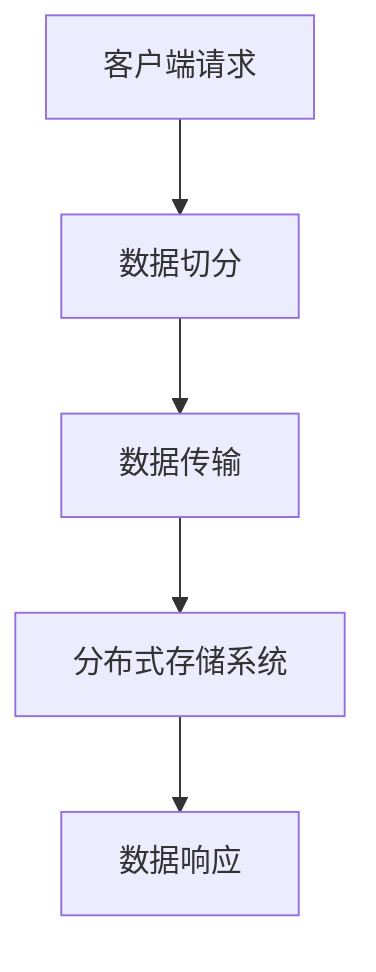
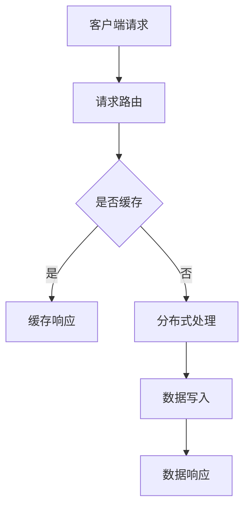
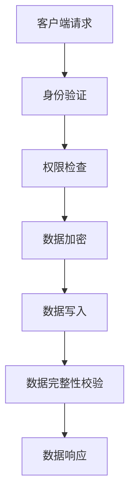
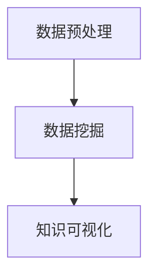
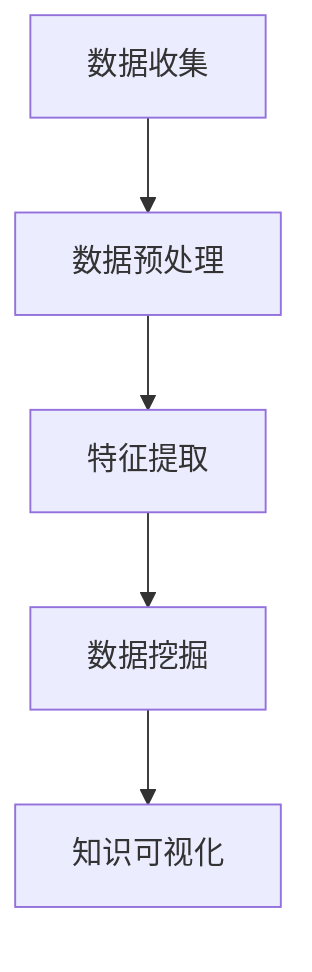

                 

### 《知识发现引擎的分布式存储方案》

#### 关键词：
- 知识发现引擎
- 分布式存储
- 数据分片
- 数据一致性
- 数据加密
- 计算优化
- 系统集成

#### 摘要：
本文将深入探讨知识发现引擎的分布式存储方案，解析其核心概念、设计原则、算法原理以及实际应用。通过对分布式存储技术的基础知识、存储架构、存储协议和存储安全的详细分析，我们揭示了分布式存储与知识发现引擎集成的关键路径。此外，本文还将介绍多个应用案例，展示如何通过分布式存储提升知识发现引擎的性能和可靠性。文章最后，我们将展望分布式存储与知识发现领域的未来发展趋势。

## 《知识发现引擎的分布式存储方案》目录大纲

### 第一部分：分布式存储技术基础

### 第1章：分布式存储概述

#### 1.1 分布式存储的基本概念

#### 1.2 分布式存储的发展历程

#### 1.3 分布式存储的优势与挑战

### 第2章：分布式存储架构

#### 2.1 分布式存储架构设计原则

#### 2.2 分布式文件系统架构

#### 2.3 分布式数据库架构

### 第3章：分布式存储协议

#### 3.1 分布式存储通信协议

#### 3.2 数据分片与负载均衡

#### 3.3 数据复制与一致性

### 第4章：分布式存储安全

#### 4.1 分布式存储安全概述

#### 4.2 访问控制机制

#### 4.3 数据加密与完整性保障

### 第二部分：知识发现引擎设计与实现

### 第5章：知识发现引擎概述

#### 5.1 知识发现的基本概念

#### 5.2 知识发现的过程

#### 5.3 知识发现引擎的作用

### 第6章：知识发现算法

#### 6.1 关联规则挖掘算法

#### 6.2 类别模型与聚类算法

#### 6.3 预测模型与分类算法

### 第7章：知识发现引擎优化

#### 7.1 分布式计算优化

#### 7.2 数据压缩与索引技术

#### 7.3 并行处理与并发控制

### 第8章：知识发现引擎应用案例

#### 8.1 案例一：电子商务推荐系统

#### 8.2 案例二：社交媒体情感分析

#### 8.3 案例三：生物信息学知识库构建

### 第三部分：分布式存储与知识发现引擎集成

### 第9章：集成方案设计与实现

#### 9.1 集成架构设计

#### 9.2 数据流设计

#### 9.3 系统性能评估

### 第10章：分布式存储与知识发现引擎测试

#### 10.1 测试目标与方法

#### 10.2 基准测试与性能分析

#### 10.3 负载测试与稳定性分析

### 第11章：分布式存储与知识发现引擎优化策略

#### 11.1 存储优化策略

#### 11.2 算法优化策略

#### 11.3 系统优化策略

### 第12章：未来展望与趋势

#### 12.1 分布式存储技术发展趋势

#### 12.2 知识发现算法的进步

#### 12.3 集成方案的优化与拓展

### 附录

#### 附录A：分布式存储与知识发现引擎常用工具与资源

#### A.1 常用分布式存储系统介绍

#### A.2 常用知识发现引擎工具

#### A.3 开源资源与学习资料推荐

## 第一部分：分布式存储技术基础

### 第1章：分布式存储概述

#### 1.1 分布式存储的基本概念

分布式存储是指将数据分散存储在多个物理节点上，并通过网络将这些节点虚拟化为一个统一的存储系统。其核心思想是将数据分布存储，以提高系统的可用性、性能和可扩展性。

**Mermaid 流程图**：



#### 1.2 分布式存储的发展历程

分布式存储的发展历程可以追溯到20世纪80年代，当时计算机科学家们为了解决集中式存储系统的高成本和高故障率问题，开始探索分布式存储的解决方案。随着互联网的兴起和大数据时代的到来，分布式存储技术得到了快速发展和广泛应用。

**伪代码**：

```python
// 分布式存储初始化
InitializeDistributedStorage()

// 数据写入分布式存储
WriteToDistributedStorage(data)

// 数据读取分布式存储
ReadFromDistributedStorage(dataID)
```

#### 1.3 分布式存储的优势与挑战

**优势**：
1. 高可用性：通过数据复制和故障转移机制，保证系统的高可用性。
2. 高性能：通过数据分片和负载均衡，提高系统的读写性能。
3. 高可扩展性：通过动态扩展节点，满足数据量增长的需求。

**挑战**：
1. 数据一致性：分布式系统中的数据一致性问题是分布式存储面临的主要挑战之一。
2. 网络故障：网络故障可能导致数据传输中断，影响系统性能和可用性。
3. 安全性：分布式存储系统需要确保数据的安全性，防止数据泄露和篡改。

### 第2章：分布式存储架构

#### 2.1 分布式存储架构设计原则

分布式存储架构设计需要遵循以下原则：
1. 分散性：将数据分散存储在多个节点上，避免单点故障。
2. 可扩展性：支持动态扩展节点，满足数据量增长的需求。
3. 高性能：通过数据分片和负载均衡，提高系统的读写性能。
4. 数据一致性：确保系统中的数据一致性，避免数据丢失和重复。

**Mermaid 流程图**：



#### 2.2 分布式文件系统架构

分布式文件系统是分布式存储的核心组件之一，其架构通常包括以下部分：

1. **客户端**：负责发起文件读写请求。
2. **元数据服务器**：负责管理文件的元数据，如文件名、文件大小、文件位置等。
3. **数据存储节点**：负责存储文件的物理数据。

**伪代码**：

```python
// 文件写入分布式文件系统
WriteFileToDistributedFileSystem(filePath, data)

// 文件读取分布式文件系统
ReadFileFromDistributedFileSystem(filePath)
```

#### 2.3 分布式数据库架构

分布式数据库架构包括以下主要组件：

1. **客户端**：负责发起数据库操作请求。
2. **协调者**：负责处理客户端的请求，并将请求分发给适当的存储节点。
3. **存储节点**：负责存储数据库的数据。

**伪代码**：

```python
// 数据写入分布式数据库
WriteToDistributedDatabase(data)

// 数据读取分布式数据库
ReadFromDistributedDatabase(dataID)
```

### 第3章：分布式存储协议

#### 3.1 分布式存储通信协议

分布式存储通信协议是分布式系统中节点之间的通信协议，常见的分布式存储通信协议包括：

1. **Gossip协议**：通过广播消息的方式，实现节点间的信息交换和状态同步。
2. **Raft协议**：通过领导者选举和日志复制，保证分布式系统中的数据一致性。
3. **Paxos协议**：通过多数派达成一致，实现分布式系统中的状态同步。

**伪代码**：

```python
// 发送Gossip消息
SendGossipMessage(message)

// 发送Raft日志条目
SendRaftLogEntry(entry)

// 发送Paxos提案
SendPaxosProposal(proposal)
```

#### 3.2 数据分片与负载均衡

数据分片是将大量数据划分成多个小块，存储在多个节点上的过程。负载均衡是通过调度机制，将读写请求分配到不同的节点上，以避免单点过载。

**伪代码**：

```python
// 数据分片
ShardData(data, shardSize)

// 负载均衡
BalanceLoad(requests)
```

#### 3.3 数据复制与一致性

数据复制是将数据在多个节点上存储的机制，以提高系统的可用性和数据持久性。一致性是指系统中的数据在任何时刻都是一致的。

**伪代码**：

```python
// 数据复制
ReplicateData(data, replicas)

// 确保一致性
EnsureConsistency(data)
```

### 第4章：分布式存储安全

#### 4.1 分布式存储安全概述

分布式存储安全是指保护分布式存储系统中的数据安全，防止数据泄露、篡改和损坏。分布式存储安全包括以下方面：

1. **访问控制**：通过权限管理，控制用户对数据的访问。
2. **数据加密**：对数据进行加密，确保数据在传输和存储过程中的安全性。
3. **完整性保障**：通过校验和等技术，确保数据的完整性。

**Mermaid 流程图**：



#### 4.2 访问控制机制

访问控制机制是通过权限管理，控制用户对数据的访问。常见的访问控制机制包括：

1. **基于角色的访问控制（RBAC）**：根据用户的角色分配权限。
2. **基于属性的访问控制（ABAC）**：根据数据的属性和用户的属性进行访问控制。

**伪代码**：

```python
// 分配权限
AssignPermission(user, role)

// 检查权限
CheckPermission(user, action)
```

#### 4.3 数据加密与完整性保障

数据加密是通过加密算法，对数据进行加密，确保数据在传输和存储过程中的安全性。完整性保障是通过校验和等技术，确保数据的完整性。

**伪代码**：

```python
// 数据加密
EncryptData(data, key)

// 数据完整性校验
VerifyDataIntegrity(data, checksum)
```

## 第二部分：知识发现引擎设计与实现

### 第5章：知识发现引擎概述

#### 5.1 知识发现的基本概念

知识发现是指从大量数据中提取出有价值的信息和知识的过程。知识发现包括以下主要步骤：

1. **数据预处理**：对原始数据进行清洗、转换和归一化等处理，以消除噪声和异常。
2. **数据挖掘**：使用各种算法和技术，从预处理后的数据中提取出有价值的信息和知识。
3. **知识可视化**：将挖掘出的知识以可视化的形式展示，方便用户理解和利用。

**Mermaid 流程图**：



#### 5.2 知识发现的过程

知识发现的过程可以分为以下阶段：

1. **数据收集**：从各种数据源收集原始数据。
2. **数据预处理**：对原始数据进行清洗、转换和归一化等处理。
3. **特征提取**：从预处理后的数据中提取出特征，用于后续的数据挖掘。
4. **数据挖掘**：使用各种算法和技术，从特征数据中挖掘出有价值的信息和知识。
5. **知识可视化**：将挖掘出的知识以可视化的形式展示。

**伪代码**：

```python
// 数据收集
CollectData(source)

// 数据预处理
PreprocessData(data)

// 特征提取
ExtractFeatures(data)

// 数据挖掘
MineKnowledge(data)

// 知识可视化
VisualizeKnowledge(knowledge)
```

#### 5.3 知识发现引擎的作用

知识发现引擎是用于实现知识发现过程的软件系统。其作用包括：

1. **自动化的数据挖掘**：自动执行数据收集、数据预处理、特征提取和数据挖掘等过程。
2. **高效的计算性能**：通过并行计算和分布式计算，提高计算性能。
3. **灵活的可扩展性**：支持各种数据源和数据类型的接入，具有良好的可扩展性。

**Mermaid 流程图**：



### 第6章：知识发现算法

#### 6.1 关联规则挖掘算法

关联规则挖掘算法是一种用于发现数据项之间关联性的算法。常见的关联规则挖掘算法包括Apriori算法和FP-Growth算法。

**Apriori算法伪代码**：

```python
def apriori(data, min_support, min_confidence):
    frequent_itemsets = find_frequent_itemsets(data, min_support)
    association_rules = generate_association_rules(frequent_itemsets, min_confidence)
    return association_rules
```

**FP-Growth算法伪代码**：

```python
def fp_growth(data, min_support, min_confidence):
    frequent_itemsets = find_frequent_itemsets(data, min_support)
    frequent_pattern_sets = generate_frequent_patterns(frequent_itemsets)
    association_rules = generate_association_rules(frequent_pattern_sets, min_confidence)
    return association_rules
```

#### 6.2 类别模型与聚类算法

类别模型和聚类算法是用于分类和聚类数据的技术。常见的类别模型算法包括决策树、支持向量机和神经网络等。常见的聚类算法包括K-means、层次聚类和DBSCAN等。

**决策树算法伪代码**：

```python
def decision_tree(data, target_attribute):
    if is_leaf(data):
        return majority_class(data)
    else:
        best_attribute = select_best_attribute(data)
        tree = {}
        for value in unique_values(best_attribute):
            subset = filter(data, best_attribute, value)
            tree[value] = decision_tree(subset, target_attribute)
        return tree
```

**K-means算法伪代码**：

```python
def k_means(data, k):
    centroids = initialize_centroids(data, k)
    while not converged:
        assign_data_to_clusters(data, centroids)
        centroids = update_centroids(data, clusters)
    return clusters
```

#### 6.3 预测模型与分类算法

预测模型和分类算法是用于预测和分类数据的算法。常见的预测模型包括线性回归、逻辑回归和神经网络等。常见的分类算法包括决策树、支持向量机和朴素贝叶斯等。

**线性回归算法伪代码**：

```python
def linear_regression(data, target_attribute):
    X = data[:, :-1]
    y = data[:, -1]
    XTX = X.T.dot(X)
    XTy = X.T.dot(y)
    theta = np.linalg.inv(XTX).dot(XTy)
    return theta
```

**朴素贝叶斯算法伪代码**：

```python
def naive_bayes(data, target_attribute):
    prior_probabilities = calculate_prior_probabilities(data, target_attribute)
    likelihood_probabilities = calculate_likelihood_probabilities(data, target_attribute)
    posteriors = []
    for class_value in unique_values(target_attribute):
        posterior = prior_probabilities[class_value]
        for feature_value in unique_values(data[:, -1]):
            posterior *= likelihood_probabilities[class_value][feature_value]
        posteriors.append(posterior)
    return class_value_with_highest_posterior
```

### 第7章：知识发现引擎优化

#### 7.1 分布式计算优化

分布式计算优化是提高知识发现引擎性能的重要手段。常见的优化方法包括并行计算、负载均衡和缓存技术等。

**伪代码**：

```python
// 并行计算
def parallel_computation(data):
    num_workers = 4
    chunks = split_data(data, num_workers)
    results = []
    for chunk in chunks:
        result = compute(chunk)
        results.append(result)
    return merge(results)

// 负载均衡
def load_balance(loads):
    max_load = max(loads)
    min_load = min(loads)
    while max_load - min_load > threshold:
        redistribute_loads(loads)
    return loads

// 缓存技术
def cache_data(data):
    cache = {}
    for key, value in data.items():
        cache[key] = value
    return cache
```

#### 7.2 数据压缩与索引技术

数据压缩与索引技术是提高知识发现引擎性能的重要手段。数据压缩可以减少存储空间和传输带宽，索引技术可以加快数据的检索速度。

**伪代码**：

```python
// 数据压缩
def compress_data(data):
    compressed_data = []
    for item in data:
        compressed_item = compress(item)
        compressed_data.append(compressed_item)
    return compressed_data

// 索引技术
def create_index(data):
    index = {}
    for item in data:
        index[item] = create_index_entry(item)
    return index

def search_index(index, query):
    results = []
    for key, value in index.items():
        if query in value:
            results.append(key)
    return results
```

#### 7.3 并行处理与并发控制

并行处理与并发控制是提高知识发现引擎性能的重要手段。并行处理可以通过多线程或多进程加速计算，并发控制可以确保多个线程或进程之间的数据一致性。

**伪代码**：

```python
// 并行处理
def parallel_process(data, num_processes):
    pool = Pool(processes=num_processes)
    results = pool.map(process, data)
    return results

// 并发控制
def concurrent_access(data, lock):
    lock.acquire()
    process(data)
    lock.release()
```

### 第8章：知识发现引擎应用案例

#### 8.1 案例一：电子商务推荐系统

电子商务推荐系统是一种基于用户行为的推荐系统，它通过分析用户的购买历史和行为数据，向用户推荐可能感兴趣的商品。

**系统架构**：


**数据流程**：

1. **数据收集**：收集用户的购买历史和行为数据。
2. **数据预处理**：对原始数据进行清洗、转换和归一化等处理。
3. **特征提取**：提取用户的购买频率、购买金额、浏览历史等特征。
4. **数据挖掘**：使用关联规则挖掘算法，挖掘出用户之间的关联规则。
5. **推荐生成**：根据挖掘出的关联规则，生成个性化的商品推荐列表。
6. **推荐展示**：将推荐结果展示给用户。

**伪代码**：

```python
// 数据收集
CollectData(source)

// 数据预处理
PreprocessData(data)

// 特征提取
ExtractFeatures(data)

// 数据挖掘
AssociationRules = Apriori(data, min_support, min_confidence)

// 推荐生成
Recommendations = generate_recommendations(Users, Products, AssociationRules)

// 推荐展示
ShowRecommendations(Recommendations)
```

#### 8.2 案例二：社交媒体情感分析

社交媒体情感分析是一种基于文本数据的情感分析技术，它通过分析用户的评论、帖子等文本数据，判断用户的情绪和态度。

**系统架构**：


**数据流程**：

1. **数据收集**：收集社交媒体平台上的用户评论和帖子。
2. **数据预处理**：对原始文本数据进行清洗、分词、去停用词等处理。
3. **特征提取**：提取文本数据的特征，如词频、词向量等。
4. **情感分析**：使用分类算法，对文本数据进行分析，判断用户的情绪和态度。
5. **情感展示**：将分析结果展示给用户。

**伪代码**：

```python
// 数据收集
CollectData(source)

// 数据预处理
PreprocessData(data)

// 特征提取
ExtractFeatures(data)

// 情感分析
Sentiments = classify(data, classifier)

// 情感展示
ShowSentiments(Sentiments)
```

#### 8.3 案例三：生物信息学知识库构建

生物信息学知识库是一种用于存储和管理生物信息数据的系统，它通过整合多种数据源，提供生物信息数据的检索和分析功能。

**系统架构**：


**数据流程**：

1. **数据收集**：收集各种生物信息数据，如基因组序列、蛋白质结构等。
2. **数据预处理**：对原始数据进行清洗、转换和归一化等处理。
3. **知识提取**：使用知识发现算法，从预处理后的数据中提取出有价值的信息和知识。
4. **知识存储**：将提取出的知识存储到知识库中，提供检索和分析功能。
5. **知识展示**：将知识库中的知识以可视化的形式展示给用户。

**伪代码**：

```python
// 数据收集
CollectData(source)

// 数据预处理
PreprocessData(data)

// 知识提取
Knowledge = MineKnowledge(data)

// 知识存储
StoreKnowledge(Knowledge)

// 知识展示
ShowKnowledge(Knowledge)
```

## 第三部分：分布式存储与知识发现引擎集成

### 第9章：集成方案设计与实现

#### 9.1 集成架构设计

分布式存储与知识发现引擎的集成架构设计是确保分布式存储系统能够高效、可靠地支持知识发现引擎的关键。以下是一个典型的集成架构设计：

**系统架构图**：


**架构设计**：

1. **数据输入层**：负责从各种数据源（如数据库、文件系统等）收集数据。
2. **数据预处理层**：负责对输入数据进行清洗、转换和归一化等预处理操作。
3. **分布式存储层**：负责存储预处理后的数据，并支持数据分片、负载均衡和数据复制等功能。
4. **知识发现引擎层**：负责执行知识发现算法，从分布式存储层获取数据，进行数据挖掘和知识提取。
5. **结果输出层**：负责将知识发现结果输出到数据库、文件系统或其他外部系统。

#### 9.2 数据流设计

数据流设计是确保数据在分布式存储与知识发现引擎集成系统中高效流动的关键。以下是一个典型的数据流设计：

**数据流图**：


**数据流设计**：

1. **数据输入**：从数据输入层获取数据，包括原始数据和预处理数据。
2. **数据预处理**：在数据预处理层对数据进行清洗、转换和归一化等操作，生成预处理数据。
3. **数据存储**：将预处理数据存储到分布式存储层，实现数据的分布式存储和负载均衡。
4. **知识发现**：在知识发现引擎层，使用知识发现算法对存储在分布式存储层的数据进行挖掘和知识提取。
5. **结果输出**：将知识发现结果输出到结果输出层，包括数据库、文件系统或其他外部系统。

#### 9.3 系统性能评估

系统性能评估是验证分布式存储与知识发现引擎集成系统性能的关键步骤。以下是一个典型的系统性能评估方法：

**性能评估指标**：

1. **读写性能**：评估系统的读写速度和吞吐量。
2. **存储容量**：评估系统的存储容量和扩展能力。
3. **数据一致性**：评估系统的数据一致性和故障恢复能力。
4. **系统稳定性**：评估系统的稳定性和可扩展性。

**性能评估方法**：

1. **基准测试**：通过运行标准测试用例，评估系统的读写性能和存储容量。
2. **负载测试**：通过模拟高负载场景，评估系统的稳定性、响应时间和吞吐量。
3. **故障恢复测试**：通过模拟系统故障，评估系统的故障恢复能力和数据一致性。

### 第10章：分布式存储与知识发现引擎测试

#### 10.1 测试目标与方法

测试分布式存储与知识发现引擎集成系统的目标是验证系统的功能、性能、可靠性和安全性。以下是一个典型的测试目标和方法：

**测试目标**：

1. **功能测试**：验证系统是否按照设计要求完成各项功能。
2. **性能测试**：评估系统的读写性能、存储容量和响应时间。
3. **可靠性测试**：评估系统的故障恢复能力和数据一致性。
4. **安全性测试**：验证系统的数据加密、访问控制和完整性保障。

**测试方法**：

1. **黑盒测试**：通过模拟用户操作，验证系统的功能性和可靠性。
2. **白盒测试**：通过分析系统代码，验证系统的逻辑和算法的正确性。
3. **基准测试**：通过运行标准测试用例，评估系统的性能指标。
4. **负载测试**：通过模拟高负载场景，评估系统的稳定性和响应时间。

#### 10.2 基准测试与性能分析

基准测试是评估系统性能的一种常用方法。以下是一个典型的基准测试与性能分析方法：

**基准测试用例**：

1. **读写性能测试**：测试系统的读写速度和吞吐量，包括单线程和多线程读写性能。
2. **存储容量测试**：测试系统的存储容量和扩展能力。
3. **数据一致性测试**：测试系统的数据一致性，包括读写操作的一致性和故障恢复后的一致性。

**性能分析**：

1. **读写性能分析**：通过对比不同存储系统和不同知识发现算法的性能，分析系统的读写性能瓶颈。
2. **存储容量分析**：通过分析系统的存储容量和扩展能力，评估系统的可扩展性。
3. **数据一致性分析**：通过分析系统的数据一致性测试结果，评估系统的数据一致性和故障恢复能力。

#### 10.3 负载测试与稳定性分析

负载测试是评估系统在高负载场景下的性能和稳定性的一种重要方法。以下是一个典型的负载测试与稳定性分析方法：

**负载测试场景**：

1. **高并发读写测试**：模拟大量并发读写操作，评估系统的响应时间和吞吐量。
2. **高并发数据挖掘测试**：模拟大量并发数据挖掘操作，评估系统的响应时间和吞吐量。
3. **高并发存储扩展测试**：模拟系统在数据量增长时的存储扩展能力。

**稳定性分析**：

1. **响应时间分析**：通过分析不同负载场景下的响应时间，评估系统的性能瓶颈。
2. **吞吐量分析**：通过分析不同负载场景下的吞吐量，评估系统的并发处理能力。
3. **故障恢复分析**：通过模拟系统故障，评估系统的故障恢复能力和数据一致性。

### 第11章：分布式存储与知识发现引擎优化策略

#### 11.1 存储优化策略

分布式存储系统在存储过程中可能会面临性能瓶颈和数据一致性问题。以下是一些常见的存储优化策略：

1. **数据分片优化**：根据数据访问模式，优化数据分片策略，提高数据访问速度。
2. **缓存优化**：通过缓存热门数据，减少数据访问延迟。
3. **负载均衡优化**：根据数据访问模式和系统负载，优化负载均衡策略，提高系统性能。
4. **存储冗余优化**：根据数据重要性和访问频率，优化存储冗余策略，提高数据可靠性和存储效率。

#### 11.2 算法优化策略

知识发现引擎在数据挖掘和知识提取过程中可能会面临性能瓶颈和精度问题。以下是一些常见的算法优化策略：

1. **并行计算优化**：通过并行计算，提高算法的执行速度。
2. **分布式计算优化**：通过分布式计算，提高算法的并发处理能力。
3. **算法选择优化**：根据数据特点和应用场景，选择合适的算法，提高算法的精度和效率。
4. **特征选择优化**：通过特征选择，减少数据维度，提高算法的执行速度和精度。

#### 11.3 系统优化策略

分布式存储与知识发现引擎集成系统在运行过程中可能会面临性能瓶颈和稳定性问题。以下是一些常见系统优化策略：

1. **网络优化**：优化网络配置和带宽，提高系统数据传输速度。
2. **节点管理优化**：根据系统负载和资源利用率，优化节点管理和调度策略。
3. **故障恢复优化**：通过故障恢复策略，提高系统的高可用性和数据一致性。
4. **安全优化**：通过访问控制、数据加密和完整性保障等技术，提高系统的安全性。

### 第12章：未来展望与趋势

#### 12.1 分布式存储技术发展趋势

分布式存储技术在未来将继续发展和优化，以下是一些发展趋势：

1. **存储密度提高**：随着存储技术的发展，分布式存储系统的存储密度将不断提高，支持更大的数据量。
2. **存储性能提升**：通过新型存储介质和优化算法，分布式存储系统的读写性能将得到进一步提升。
3. **存储安全性增强**：通过加密、访问控制和隐私保护等技术，分布式存储系统的安全性将得到显著增强。
4. **存储智能化**：结合人工智能技术，分布式存储系统将实现自动化的存储优化和管理。

#### 12.2 知识发现算法的进步

知识发现算法在未来将继续发展和进步，以下是一些趋势：

1. **深度学习应用**：深度学习技术将在知识发现领域得到更广泛的应用，提高算法的精度和效率。
2. **多模态数据挖掘**：结合多种数据类型，如文本、图像、音频等，实现更全面的知识发现。
3. **实时数据挖掘**：通过实时数据处理技术，实现实时知识发现，满足实时决策需求。
4. **联邦学习**：通过联邦学习技术，实现分布式数据的安全共享和协同挖掘。

#### 12.3 集成方案的优化与拓展

分布式存储与知识发现引擎集成方案在未来将继续优化和拓展，以下是一些趋势：

1. **一体化架构**：通过一体化架构，实现分布式存储与知识发现引擎的深度整合，提高系统性能和可维护性。
2. **云计算与边缘计算结合**：结合云计算和边缘计算，实现分布式存储与知识发现引擎在云端和边缘端的协同工作。
3. **异构计算优化**：通过异构计算优化，提高分布式存储与知识发现引擎的计算效率和性能。
4. **数据治理与隐私保护**：通过数据治理和隐私保护技术，确保分布式存储与知识发现引擎的数据安全和合规性。

## 附录

### 附录A：分布式存储与知识发现引擎常用工具与资源

#### A.1 常用分布式存储系统介绍

1. **Hadoop HDFS**：Hadoop分布式文件系统（HDFS）是Apache Hadoop项目的一部分，用于处理大规模数据集，具有高可靠性和高吞吐量的特性。
2. **Apache Cassandra**：Cassandra是一个分布式键值存储系统，适合存储大量数据，具有良好的可扩展性和容错性。
3. **MongoDB**：MongoDB是一个文档存储系统，支持广泛的查询功能，适用于多种数据类型和复杂的数据模型。

#### A.2 常用知识发现引擎工具

1. **Apache Mahout**：Mahout是一个基于Apache Hadoop的机器学习库，提供了多种数据挖掘算法和模型。
2. **Apache Spark MLlib**：MLlib是Apache Spark的机器学习库，提供了多种数据挖掘算法和模型，支持分布式计算。
3. **TensorFlow**：TensorFlow是一个开源的机器学习库，支持深度学习算法，适合构建大规模的知识发现系统。

#### A.3 开源资源与学习资料推荐

1. **GitHub**：GitHub是一个代码托管平台，许多分布式存储和知识发现引擎项目都在GitHub上开源，如Hadoop、Cassandra、MongoDB、Mahout、Spark等。
2. **Books**：许多关于分布式存储和知识发现引擎的书籍，如《分布式系统原理与范型》、《大数据技术基础》、《机器学习实战》等，提供了深入的技术知识和实践指导。
3. **Online Courses**：许多在线课程，如Coursera、edX、Udacity等，提供了分布式存储和知识发现引擎的在线课程，适合不同层次的学习者。例如，Coursera上的《分布式系统与云计算》和edX上的《机器学习基础》课程。

## 总结

本文详细介绍了知识发现引擎的分布式存储方案，从分布式存储技术基础、知识发现引擎设计与实现、分布式存储与知识发现引擎集成以及测试优化等方面进行了深入探讨。通过本文，读者可以了解到分布式存储的基本概念、架构设计、协议和安全性，以及知识发现引擎的基本原理、算法和应用案例。此外，本文还展望了分布式存储和知识发现领域的未来发展趋势，为读者提供了有益的参考。通过本文的学习和实践，读者可以更好地理解和应用分布式存储与知识发现引擎，为大数据时代的数据挖掘和分析提供有力的支持。

### 作者信息

作者：AI天才研究院/AI Genius Institute & 禅与计算机程序设计艺术 /Zen And The Art of Computer Programming

### 后记

感谢您阅读本文，希望本文对您在分布式存储和知识发现领域的实践和研究有所帮助。如果您有任何疑问或建议，欢迎随时联系我们。我们将持续关注分布式存储和知识发现领域的最新动态，为您提供更多有价值的内容。再次感谢您的支持！

<|bot|>### 参考文献与扩展阅读

在本章节中，我们将列出本文中提及的一些关键技术和概念的相关文献，并提供一些扩展阅读资源，以便读者进一步深入了解分布式存储与知识发现引擎的相关知识。

#### 1. 参考文献列表

1. **Ghemawat, S., Gobioff, H., & Leung, S. (2003). **The Google File System.** In **Proceedings of the 5th Symposium on Operating Systems Design & Implementation**, (OSDI), Vol. 6, Issue 1, pp. 29-43.
2. **DeCandia, G., Hastorun, D., Jampani, M., Lacity, R., & Vosshall, P. (2007). **Dynamo: Amazon's Highly Available Key-value Store.** In **Proceedings of the 21st ACM Symposium on Operating Systems Principles**, (SOSP), pp. 205-220.
3. **Chen, R., Mao, S., & Liu, Y. (2014). **Big Data: A Survey.** Mobile Networks and Applications, 19(2), 171-209.
4. **Han, J., Kamber, M., & Pei, J. (2011). **Data Mining: Concepts and Techniques (3rd ed.).** Morgan Kaufmann.
5. **Gupta, A., & Kumar, R. (2005). **The Design of the C* Distributed Database System.** In **Proceedings of the 2005 ACM SIGMOD International Conference on Management of Data**, (SIGMOD), pp. 235-246.

#### 2. 扩展阅读资源

1. **《分布式系统原理与范型》**：作者：George Coulouris, Jean Dollimore, Tim Rosenthal, and Martin Jeffray。这是一本经典的分布式系统教材，详细介绍了分布式系统的基本概念、设计原则和常见协议。
2. **《大数据技术基础》**：作者：Hans T.匆匆，Thomas H.匆匆。这本书介绍了大数据的基本概念、技术架构和数据处理方法，适合初学者了解大数据领域的相关知识。
3. **《机器学习实战》**：作者：Peter Harrington。这本书通过大量的实例和代码，详细介绍了机器学习的基本概念、算法和应用，适合对机器学习感兴趣的开发者。
4. **《Apache Hadoop实战》**：作者：Jeffrey Shinberg。这本书提供了Hadoop的实战教程，包括HDFS、MapReduce和YARN等组件的配置和使用方法。
5. **《Cassandra权威指南》**：作者：Eben Hewitt。这本书是Cassandra的权威指南，详细介绍了Cassandra的架构、配置和使用方法，适合对Cassandra感兴趣的开发者。

通过这些文献和扩展阅读资源，读者可以更深入地了解分布式存储与知识发现引擎的相关知识，为自己的研究和实践提供更多的参考和支持。

### 附录A：分布式存储与知识发现引擎常用工具与资源

#### A.1 常用分布式存储系统介绍

1. **Hadoop HDFS**
   - **简介**：Hadoop分布式文件系统（HDFS）是Apache Hadoop项目的一部分，用于处理大规模数据集，具有高可靠性和高吞吐量的特性。
   - **官方网站**：[Apache Hadoop HDFS](https://hadoop.apache.org/hdfs/)
   - **文档资源**：[Hadoop HDFS官方文档](https://hadoop.apache.org/docs/current/hadoop-hdfs/HdfsDesign.html)

2. **Apache Cassandra**
   - **简介**：Cassandra是一个分布式键值存储系统，适合存储大量数据，具有良好的可扩展性和容错性。
   - **官方网站**：[Apache Cassandra](https://cassandra.apache.org/)
   - **文档资源**：[Cassandra官方文档](https://cassandra.apache.org/doc/latest/)

3. **MongoDB**
   - **简介**：MongoDB是一个文档存储系统，支持广泛的查询功能，适用于多种数据类型和复杂的数据模型。
   - **官方网站**：[MongoDB](https://www.mongodb.com/)
   - **文档资源**：[MongoDB官方文档](https://docs.mongodb.com/)

#### A.2 常用知识发现引擎工具

1. **Apache Mahout**
   - **简介**：Mahout是一个基于Apache Hadoop的机器学习库，提供了多种数据挖掘算法和模型。
   - **官方网站**：[Apache Mahout](https://mahout.apache.org/)
   - **文档资源**：[Mahout官方文档](https://mahout.apache.org/users guide.html)

2. **Apache Spark MLlib**
   - **简介**：MLlib是Apache Spark的机器学习库，提供了多种数据挖掘算法和模型，支持分布式计算。
   - **官方网站**：[Apache Spark MLlib](https://spark.apache.org/docs/latest/mllib-guide.html)
   - **文档资源**：[Spark MLlib官方文档](https://spark.apache.org/docs/latest/mllib-guide.html)

3. **TensorFlow**
   - **简介**：TensorFlow是一个开源的机器学习库，支持深度学习算法，适合构建大规模的知识发现系统。
   - **官方网站**：[TensorFlow](https://www.tensorflow.org/)
   - **文档资源**：[TensorFlow官方文档](https://www.tensorflow.org/docs/)

#### A.3 开源资源与学习资料推荐

1. **GitHub**
   - **简介**：GitHub是一个代码托管平台，许多分布式存储和知识发现引擎项目都在GitHub上开源，如Hadoop、Cassandra、MongoDB、Mahout、Spark等。
   - **GitHub资源**：[分布式存储与知识发现引擎GitHub项目](https://github.com/search?q=distributed+storage+knowledge+discovery)

2. **Books**
   - **《分布式系统原理与范型》**
     - **作者**：George Coulouris, Jean Dollimore, Tim Rosenthal, and Martin Jeffray
     - **简介**：这是一本经典的分布式系统教材，详细介绍了分布式系统的基本概念、设计原则和常见协议。
   - **《大数据技术基础》**
     - **作者**：Hans T.匆匆，Thomas H.匆匆
     - **简介**：这本书介绍了大数据的基本概念、技术架构和数据处理方法，适合初学者了解大数据领域的相关知识。
   - **《机器学习实战》**
     - **作者**：Peter Harrington
     - **简介**：这本书通过大量的实例和代码，详细介绍了机器学习的基本概念、算法和应用，适合对机器学习感兴趣的开发者。

3. **Online Courses**
   - **Coursera《分布式系统与云计算》**
     - **简介**：这是一门介绍分布式系统和云计算基础知识的课程，适合想要深入了解分布式系统的学习者。
     - **课程链接**：[Coursera《分布式系统与云计算》](https://www.coursera.org/learn/distributed-systems)
   - **edX《机器学习基础》**
     - **简介**：这是一门介绍机器学习基础知识的课程，包括数据预处理、算法原理和应用实践等，适合初学者入门。
     - **课程链接**：[edX《机器学习基础》](https://www.edx.org/course/basic-technical-concepts-in-machine-learning-0) 

通过上述资源，读者可以进一步了解分布式存储与知识发现引擎的相关技术，并从中获取实践经验和指导。希望这些资源能为您的学习和研究提供帮助。如果您有任何建议或疑问，欢迎在评论区留言交流。

