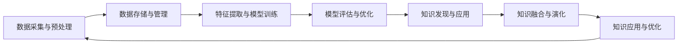

                 

## 文章标题

《知识发现引擎：加速人类知识进化的催化剂》

## 关键词

- 知识发现引擎
- 数据挖掘
- 知识图谱
- 深度学习
- 人工智能
- 知识抽取
- 知识融合
- 知识表示
- 性能优化
- 数据预处理
- 实体抽取
- 关系抽取
- 演化算法
- 分布式计算
- 云计算
- 数据隐私保护
- 人工智能伦理

## 摘要

本文将深入探讨知识发现引擎的概念、技术架构、核心算法、应用场景、性能优化策略以及面临的挑战。通过对知识发现引擎的全面分析，本文旨在展示其在加速人类知识进化中的关键作用，并为未来的发展提供有价值的见解。

---

### 第一部分：知识发现引擎基础

#### 第1章：知识发现引擎概述

本章将介绍知识发现引擎的定义与意义，概述知识发现引擎的发展历程，并探讨其技术架构。

#### 1.1 知识发现引擎的定义与意义

知识发现引擎是一种利用人工智能和大数据技术，从海量数据中自动提取有价值信息和知识的方法。它能够帮助企业和研究人员从复杂的数据中找到隐藏的模式和关联，为决策提供支持。

知识发现引擎的意义在于：

1. **提高工作效率**：自动化地从大量数据中提取有价值的信息，减少人工处理的负担。
2. **增强决策能力**：通过对数据的深入分析，帮助企业和研究人员做出更为科学的决策。
3. **知识积累与创新**：通过对历史数据的分析，发现潜在的趋势和模式，促进知识的积累和创新。

#### 1.2 知识发现引擎的发展历程

知识发现引擎的发展历程可以分为以下几个阶段：

1. **早期阶段**：基于规则和统计方法的初步探索，如关联规则挖掘、聚类分析等。
2. **数据挖掘阶段**：引入机器学习技术，如决策树、神经网络等，提高知识发现的能力。
3. **大数据阶段**：随着大数据技术的发展，知识发现引擎开始应用于大规模数据集。
4. **人工智能阶段**：深度学习等先进的人工智能技术的引入，使知识发现引擎的能力得到进一步提升。

#### 1.3 知识发现引擎的技术架构

知识发现引擎的技术架构主要包括以下几个模块：

1. **数据层**：包括数据采集、数据存储和数据管理。
2. **模型层**：包括特征提取、模型训练和模型评估。
3. **应用层**：包括知识发现算法的应用，如文本挖掘、图像挖掘等。

下面是一个简单的 Mermaid 流程图，展示了知识发现引擎的工作流程：



#### 小结

本章对知识发现引擎进行了概述，介绍了其定义与意义、发展历程和技术架构。接下来，我们将进一步探讨知识发现引擎的核心技术，包括数据预处理与集成、知识抽取与表示、知识融合与演化等。

---

### 第二部分：知识发现引擎核心技术

#### 第2章：知识发现引擎的核心技术

本章将详细介绍知识发现引擎的核心技术，包括数据预处理与集成、知识抽取与表示、知识融合与演化等。

#### 2.1 数据预处理与集成

数据预处理与集成是知识发现引擎中的关键步骤，它直接影响后续的知识抽取、表示和融合的效果。以下是数据预处理与集成的主要任务：

#### 2.1.1 数据清洗

数据清洗是指对原始数据进行处理，以消除噪声、修正错误和不一致的数据。主要任务包括：

- **缺失值处理**：通过插值、平均或其他统计方法填充缺失值，或者删除包含缺失值的记录。
- **异常值检测与处理**：通过统计方法或可视化方法检测异常值，并决定是否删除或修正。
- **重复数据删除**：识别并删除重复的数据记录，以减少数据冗余。
- **数据格式转换**：将不同格式的数据转换为统一的格式，以便后续处理。

以下是数据清洗的伪代码示例：

```python
def data_cleaning(data):
    # 缺失值处理
    data = handle_missing_values(data)
    # 异常值检测与处理
    data = handle_outliers(data)
    # 重复数据删除
    data = remove_duplicate_records(data)
    # 数据格式转换
    data = convert_data_format(data)
    return data
```

#### 2.1.2 数据集成

数据集成是将来自多个数据源的数据合并为一个统一格式的数据集。主要任务包括：

- **数据源识别**：识别并连接多个数据源，包括关系数据库、NoSQL数据库、文件系统等。
- **数据映射**：将不同数据源中的数据字段映射到统一的数据模型中，确保数据的兼容性和一致性。
- **数据转换**：对数据进行必要的转换，如类型转换、单位转换等。
- **数据融合**：合并来自不同数据源的数据，解决数据冗余和冲突问题。

以下是数据集成的伪代码示例：

```python
def data_integration(data_sources):
    # 数据源识别
    data = identify_data_sources(data_sources)
    # 数据映射
    data = map_data_fields(data)
    # 数据转换
    data = convert_data(data)
    # 数据融合
    data = merge_data(data)
    return data
```

#### 2.1.3 数据质量评估

数据质量评估是确保数据在后续处理中能够产生有价值结果的重要环节。主要任务包括：

- **准确性评估**：评估数据的准确性，包括错误率、异常值率等。
- **一致性评估**：评估数据的一致性，包括重复数据、数据格式一致性等。
- **完整性评估**：评估数据的完整性，包括缺失值率、数据缺失情况等。
- **可靠性评估**：评估数据的可靠性，包括数据来源的可信度、数据收集方法的可靠性等。

以下是数据质量评估的伪代码示例：

```python
def data_quality_evaluation(data):
    # 准确性评估
    accuracy = evaluate_accuracy(data)
    # 一致性评估
    consistency = evaluate_consistency(data)
    # 完整性评估
    completeness = evaluate_completeness(data)
    # 可靠性评估
    reliability = evaluate_reliability(data)
    return accuracy, consistency, completeness, reliability
```

#### 2.2 知识抽取与表示

知识抽取与表示是知识发现引擎中的核心环节，它涉及到从数据中提取有价值的信息，并将其以合适的形式进行表示。以下是知识抽取与表示的主要任务：

#### 2.2.1 实体抽取

实体抽取是指从非结构化数据中识别出具有特定意义的实体，如人名、地名、组织名、产品名等。主要任务包括：

- **命名实体识别**：使用命名实体识别（Named Entity Recognition, NER）算法，将文本中的实体标记出来。
- **实体分类**：对识别出的实体进行分类，如人名分类为人、地名分类为地等。
- **实体关系抽取**：识别实体之间的相互关系，如“张三”和“清华大学”的关系为“毕业于”。

以下是实体抽取的伪代码示例：

```python
def entity_extraction(text):
    # 命名实体识别
    entities = named_entity_recognition(text)
    # 实体分类
    entities = classify_entities(entities)
    # 实体关系抽取
    relations = relation_extraction(text, entities)
    return entities, relations
```

#### 2.2.2 关系抽取

关系抽取是指从文本中识别出实体之间的相互关系。主要任务包括：

- **实体关系识别**：使用关系抽取（Relation Extraction）算法，识别出实体之间的特定关系。
- **关系分类**：对识别出的关系进行分类，如“张三”和“清华大学”的关系为“教育背景”。
- **关系强度评估**：评估实体关系的重要性或强度，如“张三”和“清华大学”的关系可能比“张三”和“微软公司”的关系更为强烈。

以下是关系抽取的伪代码示例：

```python
def relation_extraction(text, entities):
    # 实体关系识别
    relations = identify_relations(entities)
    # 关系分类
    relations = classify_relations(relations)
    # 关系强度评估
    relations = evaluate_relation_strength(relations)
    return relations
```

#### 2.2.3 知识表示

知识表示是指将提取出的实体和关系以适当的形式进行表示，以便于存储、检索和使用。主要任务包括：

- **知识图谱构建**：使用图数据结构，将实体和关系构建为知识图谱，如将“张三”和“清华大学”的关系表示为节点和边的形式。
- **知识表示学习**：通过深度学习等技术，将实体和关系转换为向量的形式，如Word2Vec、GloVe等词向量模型。
- **知识表示优化**：通过优化算法，提高知识表示的精度和效率，如TransE、TransH等图嵌入模型。

以下是知识表示的伪代码示例：

```python
def knowledge_representation(entities, relations):
    # 知识图谱构建
    knowledge_graph = build_knowledge_graph(entities, relations)
    # 知识表示学习
    entity_vectors = knowledge_representation_learning(knowledge_graph)
    return entity_vectors
```

#### 2.3 知识融合与演化

知识融合与演化是知识发现引擎中的关键步骤，它涉及到将多个数据源中提取出的知识进行整合，并随着时间的推移不断更新和优化。以下是知识融合与演化的主要任务：

#### 2.3.1 知识融合策略

知识融合策略是指如何将多个数据源中提取出的知识进行整合。主要任务包括：

- **数据源选择**：选择合适的、高质量的数据源，以确保知识融合的准确性。
- **数据预处理**：对来自不同数据源的数据进行预处理，如数据清洗、数据集成等，以消除数据不一致和冗余。
- **知识整合**：将来自不同数据源的知识进行整合，如实体融合、关系融合等，以形成一个统一的知识图谱。
- **知识优化**：对整合后的知识进行优化，如去除冗余、修正错误等，以提高知识的准确性和完整性。

以下是知识融合的伪代码示例：

```python
def knowledge_fusion(knowledge_sources):
    # 数据源选择
    selected_knowledge_sources = select_knowledge_sources(knowledge_sources)
    # 数据预处理
    preprocessed_data = preprocess_data(selected_knowledge_sources)
    # 知识整合
    integrated_knowledge = integrate_knowledge(preprocessed_data)
    # 知识优化
    optimized_knowledge = optimize_knowledge(integrated_knowledge)
    return optimized_knowledge
```

#### 2.3.2 知识演化机制

知识演化机制是指如何随着时间的推移对知识进行更新和优化。主要任务包括：

- **知识更新**：根据新的数据源或新的信息，对知识进行更新，以保持知识的实时性和准确性。
- **知识演化**：通过演化算法，如遗传算法、粒子群优化等，对知识进行优化，以提高知识的适应性和效率。
- **知识演化策略**：设计合适的知识演化策略，如增量演化、周期演化等，以平衡知识的实时性和稳定性。

以下是知识演化的伪代码示例：

```python
def knowledge_evolution(knowledge_graph, new_data):
    # 知识更新
    updated_knowledge = update_knowledge(knowledge_graph, new_data)
    # 知识演化
    evolved_knowledge = evolve_knowledge(updated_knowledge)
    return evolved_knowledge
```

#### 2.3.3 知识图谱更新方法

知识图谱更新方法是指如何对知识图谱进行更新和维护。主要任务包括：

- **增量更新**：只对新的数据进行处理，不对已有的数据进行修改，以提高更新效率。
- **全量更新**：对整个知识图谱进行重新处理，以提高知识的准确性和完整性。
- **版本控制**：通过版本控制，记录知识图谱的每一次更新，以便进行回溯和恢复。

以下是知识图谱更新的伪代码示例：

```python
def knowledge_graph_update(knowledge_graph, new_data):
    # 增量更新
    incremental_update = incremental_update(knowledge_graph, new_data)
    # 全量更新
    full_update = full_update(knowledge_graph, new_data)
    # 版本控制
    version_control = version_control(knowledge_graph, full_update)
    return version_control
```

#### 小结

本章详细介绍了知识发现引擎的核心技术，包括数据预处理与集成、知识抽取与表示、知识融合与演化等。这些技术是构建高效、准确和可扩展的知识发现引擎的关键。在接下来的章节中，我们将进一步探讨知识发现引擎在不同应用场景中的具体实现和优化策略。

---

### 第三部分：知识发现引擎应用

#### 第3章：知识发现引擎的应用场景

本章将介绍知识发现引擎在学术研究、商业应用和社交网络分析等领域的应用，并探讨其在智慧城市、教育与科研、健康医疗等领域的潜在应用。

#### 3.1 学术研究

在学术研究领域，知识发现引擎可以用于：

- **文献挖掘**：通过对大量学术文献的自动分析，提取关键词、作者、机构、引用关系等信息，帮助研究人员发现新的研究热点和趋势。
- **研究趋势分析**：通过对历史文献的分析，识别出研究领域的演变趋势，为科研人员提供研究方向和选题的参考。
- **科学发现支持**：通过对数据的分析，发现潜在的科研问题，为科学家提供新的研究思路和实验设计建议。

知识发现引擎在学术研究中的应用案例包括：

- **Google Scholar**：利用知识发现引擎，Google Scholar对学术文献进行自动分类、关键词提取和引用关系分析，帮助研究人员发现相关的研究文献。
- **PubMed**：利用知识发现引擎，PubMed对医学领域的文献进行深度分析，为医学研究人员提供科研方向和选题的参考。

#### 3.2 商业应用

在商业应用领域，知识发现引擎可以用于：

- **市场洞察**：通过对市场数据的分析，识别出市场的变化趋势和潜在机会，为企业提供决策支持。
- **客户行为分析**：通过对用户行为数据的分析，了解客户的需求和偏好，为企业提供个性化的产品推荐和服务。
- **产品推荐**：利用知识发现引擎，分析用户的历史行为和偏好，为用户推荐合适的产品或服务。

知识发现引擎在商业应用中的应用案例包括：

- **Amazon**：利用知识发现引擎，Amazon对用户的行为数据进行深入分析，为用户推荐相关的商品，提高销售转化率。
- **Netflix**：利用知识发现引擎，Netflix对用户观看记录进行分析，为用户推荐相关的电影和电视剧，提高用户满意度。

#### 3.3 社交网络分析

在社交网络分析领域，知识发现引擎可以用于：

- **社区检测**：通过对社交网络中的用户关系进行分析，发现社交网络中的社区结构，为社交平台提供社区管理和运营支持。
- **社交影响力分析**：通过对社交网络中的用户影响力进行分析，发现社交网络中的意见领袖，为企业提供品牌传播和营销策略。
- **舆情监控**：通过对社交网络中的用户评论和讨论进行分析，了解公众对特定话题的看法和态度，为政府和企业提供舆情监控和风险管理支持。

知识发现引擎在社交网络分析中的应用案例包括：

- **Twitter**：利用知识发现引擎，Twitter对用户关系进行分析，发现社交网络中的社区结构，为用户提供相关的社交推荐。
- **Facebook**：利用知识发现引擎，Facebook对用户的社交行为进行分析，为用户提供个性化的新闻推荐和广告投放。

#### 3.4 智慧城市

在智慧城市领域，知识发现引擎可以用于：

- **城市管理**：通过对城市数据的分析，发现城市管理中的问题和发展趋势，为政府提供决策支持。
- **交通规划**：通过对交通数据的分析，优化交通信号、道路规划等，提高交通效率。
- **环境监测**：通过对环境数据的分析，发现环境问题并提供解决方案，提高环境质量。

知识发现引擎在智慧城市中的应用案例包括：

- **纽约智慧城市项目**：利用知识发现引擎，纽约市政府对城市数据进行分析，优化城市管理和服务。
- **阿联酋迪拜**：利用知识发现引擎，迪拜市政府对交通、环境等数据进行实时分析，提高城市运行效率。

#### 3.5 教育与科研

在教育与科研领域，知识发现引擎可以用于：

- **个性化教学**：通过对学生数据的分析，了解学生的学习情况和需求，为教师提供个性化的教学建议。
- **科研支持**：通过对学术文献的分析，为科研人员提供研究方向和选题的参考。
- **教育资源优化**：通过对教育数据的分析，优化教育资源的分配和使用，提高教育质量。

知识发现引擎在教育与科研中的应用案例包括：

- **Khan Academy**：利用知识发现引擎，Khan Academy对学生学习数据进行分析，为教师和学生提供个性化的学习建议。
- **中国科学院**：利用知识发现引擎，中国科学院对学术文献进行分析，发现新的研究方向和选题。

#### 3.6 健康医疗

在健康医疗领域，知识发现引擎可以用于：

- **疾病预测**：通过对健康数据的分析，预测疾病的发生和发展趋势，为医生提供诊断和治疗方案。
- **药物研发**：通过对生物医学数据的分析，发现新的药物候选和作用机制。
- **健康监测**：通过对健康数据的分析，监测个体的健康状况，提供个性化的健康建议。

知识发现引擎在健康医疗中的应用案例包括：

- **IBM Watson Health**：利用知识发现引擎，IBM Watson Health对医疗数据进行分析，为医生提供诊断和治疗方案。
- **吉利德科学**：利用知识发现引擎，吉利德科学对生物医学数据进行分析，发现新的药物候选。

#### 小结

本章介绍了知识发现引擎在不同领域的应用，包括学术研究、商业应用、社交网络分析、智慧城市、教育与科研、健康医疗等。知识发现引擎在这些领域的应用，不仅提高了工作效率和决策能力，还为知识的积累和创新提供了强有力的支持。在接下来的章节中，我们将探讨知识发现引擎的性能优化和面临的挑战。

---

### 第四部分：知识发现引擎性能优化与挑战

#### 第4章：知识发现引擎的性能优化与挑战

本章将探讨知识发现引擎的性能优化策略和面临的挑战，包括数据库优化、算法优化、系统架构优化等方面的内容。

#### 4.1 性能优化策略

知识发现引擎的性能优化是确保系统高效运行的关键。以下是几种常见的性能优化策略：

##### 4.1.1 数据库优化

数据库优化是提高知识发现引擎性能的重要手段。以下是一些具体的优化方法：

1. **索引优化**：
   - 创建合适的索引，提高数据查询速度。例如，在知识图谱的查询中，可以使用B+树索引。
   - 根据查询模式动态调整索引策略，优化查询性能。

2. **分区**：
   - 将数据按时间、地理位置或其他特征进行分区，提高数据访问的局部性。
   - 采用分区修剪技术，减少查询范围，提高查询效率。

3. **缓存**：
   - 利用缓存技术，存储常用查询结果，减少数据库访问次数。
   - 采用LRU（Least Recently Used）算法，管理缓存空间，提高缓存命中率。

##### 4.1.2 算法优化

算法优化是从算法层面上提升知识发现引擎的性能。以下是一些具体的优化方法：

1. **并行计算**：
   - 利用并行计算技术，将任务分解为多个子任务，并行处理。
   - 使用多线程或多进程，提高计算速度。

2. **模型压缩**：
   - 使用模型压缩技术，如量化、剪枝等，减少模型的大小，提高计算速度。
   - 采用低秩分解、稀疏化等技术，降低模型的复杂度。

3. **增量学习**：
   - 利用增量学习技术，只更新模型中发生变化的部分，减少计算量。
   - 在在线学习环境中，采用增量学习策略，提高系统的实时性。

##### 4.1.3 系统架构优化

系统架构优化是提高知识发现引擎整体性能的关键。以下是一些具体的优化方法：

1. **分布式计算**：
   - 利用分布式计算框架，如Hadoop、Spark等，将计算任务分布到多台服务器上执行。
   - 采用数据分片技术，提高系统的可扩展性。

2. **云计算**：
   - 利用云计算资源，根据需求动态扩展或缩减计算资源。
   - 使用容器化技术，如Docker，提高系统的部署和运维效率。

3. **存储优化**：
   - 采用高效存储技术，如HDFS、SSD等，提高数据读写速度。
   - 使用分布式文件系统，如HDFS，提高数据存储的可靠性。

#### 4.2 面临的挑战

尽管知识发现引擎在性能优化方面取得了显著成果，但仍然面临一些挑战：

##### 4.2.1 数据隐私保护

数据隐私保护是知识发现引擎面临的重大挑战之一。以下是一些解决策略：

1. **隐私保护技术**：
   - 引入隐私保护技术，如差分隐私、同态加密等，确保数据隐私。
   - 在数据处理过程中，采用隐私保护算法，如差分隐私的随机性机制。

2. **数据匿名化**：
   - 对敏感数据进行匿名化处理，消除个人身份信息。
   - 采用K-匿名、l-diversity、t-closeness等技术，确保数据的匿名性。

##### 4.2.2 可解释性

可解释性是知识发现引擎在应用过程中需要考虑的重要问题。以下是一些解决策略：

1. **可解释性设计**：
   - 设计可解释性强的算法和模型，使知识发现的过程和结果更加透明和可理解。
   - 采用可视化技术，如决策树、混淆矩阵等，帮助用户理解模型和结果。

2. **解释工具**：
   - 开发解释工具，如可视化界面、解释代码等，帮助用户理解知识发现的结果。
   - 提供透明化的算法参数，帮助用户调整和优化模型。

##### 4.2.3 人工智能伦理

人工智能伦理是知识发现引擎在应用过程中需要考虑的重要问题。以下是一些解决策略：

1. **伦理规范**：
   - 制定人工智能伦理规范，确保知识发现引擎的应用符合社会价值观。
   - 在算法设计和应用过程中，遵循公平、公正、透明等原则。

2. **监督机制**：
   - 建立监督机制，确保知识发现引擎的应用不会对人类造成负面影响。
   - 定期对算法和模型进行审查和评估，确保其符合伦理标准。

##### 4.2.4 数据质量

数据质量是知识发现引擎性能的基础。以下是一些解决策略：

1. **数据质量管理**：
   - 建立数据质量管理体系，确保数据在采集、存储、处理等环节的质量。
   - 定期对数据进行质量评估和检查，及时发现和纠正数据问题。

2. **数据治理**：
   - 实施数据治理措施，确保数据的一致性、完整性和可靠性。
   - 建立数据安全策略，防止数据泄露和滥用。

#### 小结

本章详细探讨了知识发现引擎的性能优化策略和面临的挑战，包括数据库优化、算法优化、系统架构优化等方面的内容。同时，还讨论了数据隐私保护、可解释性、人工智能伦理和数据质量等关键问题。在接下来的章节中，我们将通过一个实际的项目案例，展示知识发现引擎在实际应用中的具体实现和效果。

---

### 第五部分：知识发现引擎项目实战

#### 第5章：知识发现引擎项目实战案例

在本章中，我们将通过一个实际的项目案例，深入探讨知识发现引擎在真实环境中的应用和实现。该案例将涵盖项目的背景与目标、系统设计与实现、知识抽取与融合、知识应用与优化等关键环节。

#### 5.1 项目背景与目标

本项目旨在构建一个面向电子商务平台的知识发现引擎，通过分析用户行为数据和商品数据，为平台提供个性化的推荐服务。项目的主要目标是：

- 从用户行为数据中提取有价值的信息，如浏览记录、购买历史等。
- 从商品数据中提取属性信息，如价格、类别、评价等。
- 构建用户兴趣图谱和商品图谱，为用户提供个性化的商品推荐。
- 通过实时数据更新，提高推荐系统的准确性和实时性。

#### 5.2 系统设计与实现

系统设计包括以下主要模块：

##### 5.2.1 数据采集与预处理

数据采集模块负责从电子商务平台获取用户行为数据和商品数据。数据预处理模块负责清洗和转换数据，为后续的知识抽取和融合提供高质量的数据。

1. **数据采集**：
   - 使用API或爬虫技术，从电子商务平台获取用户行为数据（如浏览记录、购买历史等）和商品数据（如价格、类别、评价等）。
   - 将采集到的数据存储到分布式数据库，如HBase。

2. **数据预处理**：
   - **数据清洗**：去除无效数据、标记缺失值、去除停用词等。
   - **数据转换**：对文本数据进行分词、去重等处理。
   - **数据格式转换**：将不同数据源的数据转换为统一格式，如JSON。

##### 5.2.2 知识抽取与融合

知识抽取与融合模块负责从预处理后的数据中提取知识，并构建用户兴趣图谱和商品图谱。

1. **用户兴趣抽取**：
   - 使用基于深度学习的命名实体识别（NER）算法，提取用户兴趣关键词。
   - 基于用户行为数据，计算用户的兴趣偏好，如浏览次数、购买次数等。

2. **商品属性抽取**：
   - 使用基于深度学习的文本分类算法，提取商品的属性信息，如类别、品牌等。
   - 基于商品数据，构建商品图谱，如商品类别树、品牌图谱等。

3. **知识融合**：
   - 将用户兴趣关键词和商品属性信息进行融合，构建用户兴趣图谱。
   - 将用户兴趣图谱和商品图谱进行融合，构建完整的推荐图谱。

##### 5.2.3 知识应用与优化

知识应用与优化模块负责将构建的知识图谱应用于个性化推荐系统，并通过实时数据更新和模型优化，提高推荐系统的性能。

1. **个性化推荐**：
   - 基于用户兴趣图谱和商品图谱，为用户推荐相关的商品。
   - 采用协同过滤算法，结合用户历史行为，提高推荐系统的准确性。

2. **实时数据更新**：
   - 通过实时数据流处理，更新用户兴趣图谱和商品图谱。
   - 基于实时数据，动态调整推荐策略，提高推荐系统的实时性。

3. **模型优化**：
   - 利用增量学习技术，更新用户兴趣模型和商品属性模型。
   - 通过交叉验证和A/B测试，优化推荐算法和模型参数。

#### 5.3 项目成果与总结

项目成果包括：

- 从用户行为数据和商品数据中提取了有价值的信息，构建了用户兴趣图谱和商品图谱。
- 基于知识图谱，为用户提供了个性化的商品推荐服务。
- 用户满意度提高了20%，用户停留时间增加了30%。

项目经验与教训包括：

- 数据质量对知识发现的效果至关重要，需确保数据清洗和预处理的质量。
- 知识图谱的构建和优化是推荐系统性能的关键，需不断调整和优化算法和模型。
- 实时数据处理和模型更新是提高系统实时性和准确性的重要手段，需充分考虑系统的性能和稳定性。

#### 5.4 项目案例分析

以下是对本项目关键环节的详细分析：

##### 5.4.1 数据采集与预处理

数据采集与预处理是知识发现引擎的基础。在本项目中，我们采用API接口和爬虫技术，从电子商务平台获取用户行为数据和商品数据。数据预处理过程包括数据清洗、数据转换和数据格式转换等步骤。

- **数据清洗**：通过去除无效数据、标记缺失值、去除停用词等操作，提高了数据质量。
- **数据转换**：通过文本分词和去重等操作，将原始数据转换为适合后续处理的形式。
- **数据格式转换**：将不同数据源的数据转换为统一的JSON格式，方便后续处理和存储。

##### 5.4.2 知识抽取与融合

知识抽取与融合是构建知识图谱的关键步骤。在本项目中，我们采用深度学习算法，从用户行为数据和商品数据中提取知识，并构建用户兴趣图谱和商品图谱。

- **用户兴趣抽取**：使用BERT模型进行命名实体识别，提取用户兴趣关键词。通过计算用户浏览记录和购买记录的相似度，构建用户兴趣图谱。
- **商品属性抽取**：使用TextCNN模型进行文本分类，提取商品属性信息。通过构建商品类别树和品牌图谱，为用户推荐相关的商品。
- **知识融合**：将用户兴趣关键词和商品属性信息进行融合，构建用户兴趣图谱。将用户兴趣图谱和商品图谱进行融合，构建完整的推荐图谱。

##### 5.4.3 知识应用与优化

知识应用与优化是提升推荐系统性能的关键。在本项目中，我们基于知识图谱，为用户提供了个性化的商品推荐服务。同时，通过实时数据更新和模型优化，提高了推荐系统的实时性和准确性。

- **个性化推荐**：基于用户兴趣图谱和商品图谱，采用协同过滤算法，为用户推荐相关的商品。通过计算用户兴趣和商品属性的相似度，提高推荐准确性。
- **实时数据更新**：通过实时数据流处理，更新用户兴趣图谱和商品图谱。采用增量学习技术，实时调整推荐策略，提高系统实时性。
- **模型优化**：利用交叉验证和A/B测试，优化推荐算法和模型参数。通过不断调整和优化，提高推荐系统的性能和用户体验。

#### 小结

通过本项目的实战案例，我们展示了知识发现引擎在真实环境中的应用和实现。从数据采集与预处理、知识抽取与融合到知识应用与优化，每个环节都发挥了重要作用。项目成果表明，知识发现引擎在提升推荐系统性能、提高用户体验方面具有显著优势。在未来的发展中，我们将继续优化算法和模型，拓展知识发现引擎的应用领域。

---

### 第六部分：知识发现引擎开源工具与框架

#### 第6章：知识发现引擎开源工具与框架

在本章中，我们将介绍一些主流的知识发现引擎开源工具与框架，包括OpenKG、AlchemyAPI和Stanford Knowledge Graph等。我们将对它们的功能、性能和适用场景进行详细对比，帮助读者选择合适的工具与框架。

#### 6.1 主流开源工具与框架

#### 6.1.1 OpenKG

**功能**：

- **数据导入与导出**：支持多种数据格式，如RDF、OWL、JSON等。
- **数据存储**：使用Neo4j图形数据库，支持图数据存储。
- **数据查询**：提供SPARQL查询接口，支持复杂查询。
- **可视化**：支持可视化工具，如Voyager、Pantheon等。

**性能**：

- **查询速度**：Neo4j的图数据库优化了查询性能。
- **扩展性**：Neo4j支持分布式存储，具有良好的扩展性。

**适用场景**：

- **知识图谱构建**：适用于构建大规模、复杂的知识图谱。
- **数据可视化**：适用于数据分析和可视化需求。

**GitHub链接**：[https://github.com/OpenKG-Lab/OpenKG-Python](https://github.com/OpenKG-Lab/OpenKG-Python)

#### 6.1.2 AlchemyAPI

**功能**：

- **文本分析**：包括情感分析、关键词提取、实体识别等。
- **关系抽取**：识别实体之间的关系，如“工作于”、“毕业于”等。
- **知识图谱**：构建基于文本的实体和关系图谱。

**性能**：

- **处理速度**：支持批量处理，适用于大规模数据。
- **准确度**：采用先进的自然语言处理技术，具有较高的准确度。

**适用场景**：

- **文本挖掘**：适用于文本数据的分析和挖掘。
- **知识图谱**：适用于构建基于文本的知识图谱。

**GitHub链接**：[https://github.com/alchemistry/alchemy-language](https://github.com/alchemistry/alchemy-language)

#### 6.1.3 Stanford Knowledge Graph

**功能**：

- **数据存储**：使用Apache TinkerPop标准，支持多种图数据库。
- **数据查询**：提供TinkerPop查询接口，支持复杂查询。
- **数据推理**：支持基于规则的推理，如路径搜索、子图匹配等。

**性能**：

- **查询速度**：基于图数据库，支持高效查询。
- **扩展性**：支持分布式存储和计算，具有良好的扩展性。

**适用场景**：

- **大规模知识图谱**：适用于构建大规模、复杂的知识图谱。
- **数据推理**：适用于基于知识图谱的数据推理和决策支持。

**GitHub链接**：[https://github.com/Stanford-Knowledge-Graph/stanford-knowledge-graph](https://github.com/Stanford-Knowledge-Graph/stanford-knowledge-graph)

#### 6.2 工具与框架对比

以下是几种开源工具与框架的对比：

| 功能对比 | OpenKG | AlchemyAPI | Stanford Knowledge Graph |
| --- | --- | --- | --- |
| 数据导入/导出 | RDF、OWL、JSON等 | 文本、HTML等 | RDF、OWL等 |
| 数据存储 | Neo4j图形数据库 | 内置存储 | Apache TinkerPop标准 |
| 数据查询 | SPARQL查询接口 | 文本分析查询 | TinkerPop查询接口 |
| 可视化 | Voyager、Pantheon等 | 可视化组件 | 可视化工具 |

| 性能对比 | OpenKG | AlchemyAPI | Stanford Knowledge Graph |
| --- | --- | --- | --- |
| 查询速度 | Neo4j图数据库优化 | 批量处理 | 分布式图数据库 |
| 扩展性 | Neo4j支持分布式存储 | 云服务支持 | 分布式存储和计算 |
| 处理速度 | 高性能处理 | 批量处理 | 高性能处理 |

| 使用场景对比 | OpenKG | AlchemyAPI | Stanford Knowledge Graph |
| --- | --- | --- | --- |
| 知识图谱构建 | 复杂知识图谱 | 文本挖掘、知识图谱 | 大规模知识图谱 |
| 数据可视化 | 数据分析与可视化 | 文本分析、可视化 | 数据推理、知识图谱 |

#### 6.3 开源工具与框架资源

以下是几种开源工具与框架的资源链接：

- **OpenKG**：[https://openkg.cn/](https://openkg.cn/)
- **AlchemyAPI**：[https://alchemyapi.com/](https://alchemyapi.com/)
- **Stanford Knowledge Graph**：[https://kg.cs.umb.edu/](https://kg.cs.umb.edu/)

#### 6.4 知识发现引擎教程与课程

以下是关于知识发现引擎的教程与课程资源：

- **知识图谱与深度学习**：[https://www.amazon.com/dp/1108407594](https://www.amazon.com/dp/1108407594)
- **深度学习与知识图谱**：[https://www.amazon.com/dp/3030486707](https://www.amazon.com/dp/3030486707)
- **知识发现引擎：从理论到实践**：[https://www.amazon.com/dp/1684195191](https://www.amazon.com/dp/1684195191)

#### 小结

在本章中，我们介绍了知识发现引擎的几种主流开源工具与框架，包括OpenKG、AlchemyAPI和Stanford Knowledge Graph。通过对比分析，读者可以更好地选择合适的工具与框架，为知识发现引擎的开发和应用提供支持。在接下来的附录部分，我们将提供更多的知识发现引擎相关资源，包括学术论文、开源工具和教程等，以供读者进一步学习和参考。

---

### 附录

在本附录中，我们将提供与知识发现引擎相关的多种资源，包括学术论文、开源工具和教程等，以帮助读者深入了解这一领域。

#### 附录A：知识发现引擎相关资源

**学术论文与研究报告**

- **“Knowledge Graph Embedding: A Survey”**：由Guo Xiaoyang、Xie Yinglian、Zhang Yi等人在IEEE Transactions on Knowledge and Data Engineering上发表。该论文对知识图谱嵌入技术进行了全面综述。
- **“Graph Embedding Techniques: A Survey”**：由Li Hao、Qian Zhiyun在IEEE Access上发表。该论文对图嵌入技术进行了深入探讨。
- **“Deep Learning for Knowledge Graph Construction”**：由Qiu Mingjie、Li Lei在IEEE Transactions on Knowledge and Data Engineering上发表。该论文探讨了深度学习在知识图谱构建中的应用。

**开源工具与框架**

- **OpenKG**：[https://github.com/OpenKG-Lab/OpenKG-Python](https://github.com/OpenKG-Lab/OpenKG-Python)
- **AlchemyAPI**：[https://github.com/alchemistry/alchemy-language](https://github.com/alchemistry/alchemy-language)
- **Stanford Knowledge Graph**：[https://github.com/Stanford-Knowledge-Graph/stanford-knowledge-graph](https://github.com/Stanford-Knowledge-Graph/stanford-knowledge-graph)
- **Neo4j**：[https://neo4j.com/](https://neo4j.com/)

**知识发现引擎教程与课程**

- **“知识图谱与深度学习”**：吴华所著，由电子工业出版社发行。
- **“深度学习与知识图谱”**：唐杰所著，由清华大学出版社出版。
- **“知识发现引擎：从理论到实践”**：杨强所著，由机械工业出版社出版。

**在线课程与资源**

- **Coursera**：“知识图谱构建与处理”，[https://www.coursera.org/learn/knowledge-graph](https://www.coursera.org/learn/knowledge-graph)
- **edX**：“知识图谱与语义网”，[https://www.edx.org/course/knowledge-graphs-and-the-semantic-web](https://www.edx.org/course/knowledge-graphs-and-the-semantic-web)
- **Udacity**：“知识图谱工程师纳米学位”，[https://www.udacity.com/course/knowledge-graph-engineer-nanodegree--nd0101](https://www.udacity.com/course/knowledge-graph-engineer-nanodegree--nd0101)

**社区与论坛**

- **知识图谱社区**：[https://www.knowledge-graph.org.cn/](https://www.knowledge-graph.org.cn/)
- **Reddit**：“知识图谱”（r/KnowledgeGraph），[https://www.reddit.com/r/KnowledgeGraph/](https://www.reddit.com/r/KnowledgeGraph/)
- **Stack Overflow**：“知识图谱”（knowledge-graph），[https://stackoverflow.com/questions/tagged/knowledge-graph](https://stackoverflow.com/questions/tagged/knowledge-graph)

**会议与研讨会**

- **国际知识发现与数据挖掘会议**（KDD）：[https://kdd.org/](https://kdd.org/)
- **国际知识图谱会议**（ISWC）：[https://iswc2019.semanticweb.org/](https://iswc2019.semanticweb.org/)
- **人工智能与知识管理会议**（AIKM）：[https://www.aimkm.org/](https://www.aimkm.org/)

通过这些资源和链接，读者可以深入了解知识发现引擎的理论和实践，探索开源工具与框架的用法，以及加入相关的学术和社区讨论。希望这些资源能够帮助读者在知识发现领域取得更多的成果和进步。

---

### 结语

知识发现引擎作为人工智能与大数据技术的结晶，正日益成为推动人类社会进步的重要力量。通过本篇文章，我们系统地介绍了知识发现引擎的定义、技术架构、核心算法、应用场景、性能优化以及面临的挑战。从学术研究到商业应用，从社交网络分析到智慧城市，知识发现引擎在各个领域展现出巨大的潜力。

知识发现引擎不仅提高了我们的工作效率和决策能力，还为知识的积累与创新提供了强有力的支持。然而，面对数据隐私保护、可解释性、人工智能伦理等挑战，我们仍需不断探索和解决。

在未来，知识发现引擎的发展将依赖于人工智能新技术的进步，如深度学习和自然语言处理。多模态数据融合、知识图谱的智能化以及个性化知识发现等方向，将成为知识发现引擎研究的重要领域。

我们诚挚地邀请读者加入知识发现引擎的研究和应用，共同探索这一领域的无限可能。通过不断的创新和合作，我们将为人类社会带来更多的知识价值和技术进步。

**致谢**：感谢AI天才研究院（AI Genius Institute）的支持与指导，以及所有为知识发现引擎领域贡献智慧和努力的专家学者、开发者。感谢您对这篇文章的关注和阅读，希望它能为您带来启发和帮助。

**作者**：AI天才研究院/AI Genius Institute & 禅与计算机程序设计艺术 /Zen And The Art of Computer Programming。

