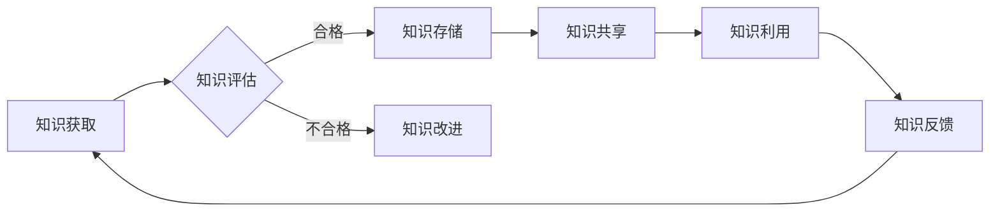

                 

### 《知识管理在医疗健康领域的应用》

> **关键词**：知识管理、医疗健康、知识图谱、机器学习、智能医疗

> **摘要**：本文从知识管理的理论基础出发，深入探讨了知识管理在医疗健康领域的应用。通过分析医疗健康领域的知识特性，阐述了知识管理在医疗健康知识管理系统、电子健康记录和智能医疗中的应用。此外，本文还通过实践案例展示了知识管理在医疗健康领域的实际效果，并展望了其未来发展趋势与挑战。

### 《知识管理在医疗健康领域的应用》目录大纲

**第一部分：知识管理的理论基础**

**第1章：知识管理概述**

1.1.1 知识管理的定义与重要性

1.1.2 知识管理的演进过程

1.1.3 知识管理的体系架构

**第2章：医疗健康领域的知识特性**

2.1.1 医疗健康知识的分类

2.1.2 医疗健康知识的动态性

2.1.3 医疗健康知识的复杂性与冗余性

**第3章：知识管理的核心概念与联系**

3.1.1 知识生命周期管理

3.1.2 知识共享与传播

3.1.3 知识创新与转化

**Mermaid 流程图：知识管理流程**


**第二部分：知识管理技术在医疗健康领域的应用**

**第4章：医疗健康知识管理系统**

4.1.1 知识管理系统的功能模块

4.1.2 知识管理系统的关键技术

4.1.3 医疗健康知识管理系统的案例分析

**第5章：知识管理与电子健康记录**

5.1.1 电子健康记录（EHR）的概念与作用

5.1.2 知识管理在EHR中的应用

5.1.3 EHR与知识管理系统的集成

**第6章：知识管理与智能医疗**

6.1.1 智能医疗的概念与分类

6.1.2 知识管理在智能医疗中的应用

6.1.3 智能医疗中的知识管理挑战与解决方案

**第7章：知识管理在医疗健康领域的实践与案例分析**

7.1.1 案例研究1：某医院的知识管理系统实施

7.1.2 案例研究2：基于知识管理的远程医疗平台

7.1.3 案例研究3：医学知识图谱在药物研发中的应用

**第8章：知识管理在医疗健康领域的前景与挑战**

8.1.1 医疗健康领域知识管理的未来发展趋势

8.1.2 知识管理面临的伦理与法律挑战

8.1.3 提升知识管理效能的策略与建议

**第三部分：知识管理在医疗健康领域的核心算法原理讲解**

**第9章：知识图谱在医疗健康领域的应用**

9.1.1 知识图谱的基本概念与架构

9.1.2 知识图谱的构建方法

9.1.3 知识图谱在医疗健康领域的应用场景

**第10章：机器学习在医疗健康知识管理中的应用**

10.1.1 机器学习的基本概念

10.1.2 机器学习在知识抽取中的应用

10.1.3 机器学习在知识推理中的应用

**第11章：数学模型在医疗健康知识管理中的应用**

11.1.1 数学模型的基本概念

11.1.2 贝叶斯网络在知识表示中的应用

11.1.3 决策树在知识推理中的应用

**LaTeX 数学公式**
$$
P(A|B) = \frac{P(B|A)P(A)}{P(B)}
$$

**第12章：项目实战**

12.1.1 实战1：基于知识管理的医疗问答系统

12.1.2 实战2：基于知识图谱的医学研究支持系统

12.1.3 实战3：基于机器学习的疾病诊断系统

**开发环境搭建**

- Python
- TensorFlow/Keras
- PyTorch
- JAX

**源代码实现与代码解读**

- 示例代码与详细解释
- 代码解读与分析

**附录**

**附录A：知识管理在医疗健康领域的相关资源**

- 主流深度学习框架对比
  - TensorFlow
  - PyTorch
  - JAX
- 知识管理在医疗健康领域的学术研究文献
  - 知识图谱
  - 机器学习
  - 数据挖掘

**附录B：医学知识图谱构建工具介绍**

- OpenKG
- Wikidata
- NLM Unified Medical Language System (UMLS)

**附录C：知识管理在医疗健康领域的法规与标准**

- 国际医疗卫生资讯学会 (HL7)
- 美国食品药品监督管理局 (FDA)
- 欧洲医学协会 (EMA)

---

接下来，我们将逐步深入探讨知识管理在医疗健康领域的应用，首先从理论基础开始，分析医疗健康领域的知识特性，然后介绍知识管理的核心概念与联系，最后通过实际案例和实践，展示知识管理在医疗健康领域的应用效果和前景。

## 第一部分：知识管理的理论基础

### 第1章：知识管理概述

#### 1.1.1 知识管理的定义与重要性

知识管理（Knowledge Management，简称KM）是指通过系统地收集、组织、存储、共享、更新和利用知识，以提高组织整体效率和创新能力的过程。知识管理不仅仅是一种技术手段，更是一种管理理念，它强调知识的全面管理和有效利用。

在医疗健康领域，知识管理具有极其重要的意义。医疗健康领域是一个高度专业化、复杂化的领域，知识的获取、传播和应用直接影响医疗质量和医疗效率。通过知识管理，医疗健康机构可以更好地组织和利用知识资源，提高诊断和治疗水平，减少医疗错误和风险，提升患者满意度。

知识管理的主要目标包括：

1. 提高知识共享和协作效率，促进知识的快速传播和共享。
2. 建立和维护知识库，确保知识的长期存储和可持续利用。
3. 培养知识型组织文化，鼓励知识创新和知识传承。
4. 提高医疗健康服务的质量和效率，降低医疗成本。

#### 1.1.2 知识管理的演进过程

知识管理的发展历程可以追溯到20世纪80年代，随着信息技术和互联网的快速发展，知识管理逐渐成为一个重要的研究领域和应用领域。知识管理的演进过程大致可以分为以下几个阶段：

1. **知识发现阶段**：这一阶段主要关注如何从大量的数据中提取有用的知识，常用的方法包括数据挖掘、统计分析等。
2. **知识共享阶段**：随着知识的重要性日益凸显，如何更好地共享知识成为研究热点。这一阶段出现了各种知识共享工具，如知识库、论坛、博客等。
3. **知识管理阶段**：在这一阶段，知识管理开始成为一个系统性、战略性的管理过程。知识管理不仅关注知识的共享和利用，还关注知识的获取、组织、存储和更新。
4. **知识创新阶段**：知识管理逐渐从传统的知识存储和共享向知识创新转变，通过知识整合、知识融合等方式，推动知识的创新和突破。

#### 1.1.3 知识管理的体系架构

知识管理体系架构是指知识管理系统的组成和结构，它包括以下几个关键组成部分：

1. **知识资源**：知识资源是知识管理的核心，包括各种形式的知识，如文档、数据、图像、音频、视频等。
2. **知识存储**：知识存储是知识管理的基础设施，用于存储和管理知识资源。常见的知识存储技术包括数据库、文件系统、分布式存储等。
3. **知识共享**：知识共享是知识管理的核心目标之一，通过知识共享，促进知识的传播和利用。知识共享的方式包括内部论坛、知识库、博客、社交网络等。
4. **知识应用**：知识应用是指将知识应用于实际工作中，以提高工作效率和质量。知识应用的范围广泛，包括决策支持、问题解决、创新研发等。
5. **知识反馈**：知识反馈是知识管理的重要环节，通过知识反馈，可以不断优化知识管理过程，提高知识管理的效能。

知识管理体系架构可以用以下Mermaid流程图表示：


在知识管理的过程中，各个环节相互关联、相互促进，形成一个闭环系统，从而实现知识的全面管理和有效利用。

### 第2章：医疗健康领域的知识特性

#### 2.1.1 医疗健康知识的分类

医疗健康知识可以分为以下几类：

1. **基础知识**：包括医学基础知识、生物学知识、解剖学知识等，是医学教育和科研的基础。
2. **临床知识**：包括疾病的诊断、治疗、预防、康复等知识，是医生进行临床工作的依据。
3. **药物知识**：包括药物的化学结构、药理作用、不良反应、药物相互作用等知识，是药物研发和临床用药的参考。
4. **护理知识**：包括护理程序、护理技术、患者护理等知识，是护理人员工作的指南。
5. **政策法规**：包括医疗卫生政策、法律法规、规章制度等知识，是医疗健康机构运作的依据。

#### 2.1.2 医疗健康知识的动态性

医疗健康知识具有高度的动态性，主要表现在以下几个方面：

1. **知识更新快**：随着医学科技的发展，新的研究成果、新的治疗方法、新的药物不断涌现，医疗健康知识不断更新。
2. **知识交叉融合**：医疗健康知识与其他领域（如生物技术、信息技术、工程技术等）相互交叉、融合，形成新的知识体系。
3. **知识应用场景复杂**：医疗健康知识的应用场景复杂多变，需要根据具体情况进行灵活调整和应用。

#### 2.1.3 医疗健康知识的复杂性与冗余性

医疗健康知识具有复杂性和冗余性，主要表现在以下几个方面：

1. **知识复杂性**：医疗健康知识涉及多个学科领域，知识结构复杂，需要具备跨学科的知识背景才能理解和应用。
2. **知识冗余性**：由于医疗健康知识的高度专业化，不同领域之间的知识存在一定程度的冗余，这增加了知识管理的难度。
3. **知识碎片化**：医疗健康知识分散在各种文献、数据库、专家头脑中，难以进行有效的整合和利用。

### 第3章：知识管理的核心概念与联系

#### 3.1.1 知识生命周期管理

知识生命周期管理是指对知识从产生、存储、共享到应用、消亡的全过程进行管理和监控，以确保知识的有效利用和更新。知识生命周期管理主要包括以下环节：

1. **知识获取**：通过调研、学习、科研等方式获取新知识。
2. **知识存储**：将获取的知识进行分类、存储，确保知识的长期保存和可访问性。
3. **知识共享**：通过知识库、论坛、会议等方式，将知识在组织内部或外部进行共享。
4. **知识应用**：将知识应用于实际工作中，以提高工作效率和质量。
5. **知识更新**：根据知识的应用情况，对知识进行更新和优化，确保知识的准确性和时效性。
6. **知识消亡**：对于不再适用的知识，进行消亡处理，避免知识资源的浪费。

#### 3.1.2 知识共享与传播

知识共享与传播是知识管理的重要目标之一，通过有效的知识共享与传播，可以促进知识的快速传播和广泛应用。知识共享与传播的方式包括：

1. **内部知识共享**：通过企业内部的邮件、论坛、知识库等方式，实现知识的内部传播。
2. **外部知识共享**：通过学术期刊、会议、网络平台等方式，实现知识的公开传播。
3. **知识传递**：通过培训、会议、项目合作等方式，将知识从一个团队或组织传递到另一个团队或组织。
4. **知识创新**：通过知识共享与传播，激发新的思维和创意，促进知识创新。

#### 3.1.3 知识创新与转化

知识创新与转化是指将现有知识进行重新组合、扩展、创新，形成新的知识体系，并将其应用于实际工作中，以提升组织的竞争力。知识创新与转化主要包括以下环节：

1. **知识挖掘**：通过对大量数据进行挖掘和分析，发现新的知识规律和趋势。
2. **知识融合**：将不同领域、不同层次的知识进行整合，形成新的知识体系。
3. **知识创新**：基于现有知识，进行创新性的研究、开发和应用，形成新的产品、服务或业务模式。
4. **知识转化**：将创新的知识应用于实际工作中，实现知识的商业价值和社会价值。

### Mermaid 流程图：知识管理流程


在知识管理的过程中，各个环节相互关联、相互促进，形成一个闭环系统，从而实现知识的全面管理和有效利用。

## 第二部分：知识管理技术在医疗健康领域的应用

### 第4章：医疗健康知识管理系统

#### 4.1.1 知识管理系统的功能模块

医疗健康知识管理系统（Medical Knowledge Management System，简称MKMS）是知识管理在医疗健康领域的具体应用。MKMS的功能模块主要包括：

1. **知识获取模块**：用于从各种渠道获取医疗健康知识，包括文献检索、数据库查询、在线学习等。
2. **知识存储模块**：用于存储和管理医疗健康知识，包括知识分类、知识标签、知识版本控制等。
3. **知识共享模块**：用于促进医疗健康知识的共享和传播，包括知识库、论坛、社交网络等。
4. **知识应用模块**：用于将知识应用于实际工作中，包括诊断辅助、治疗建议、科研支持等。
5. **知识反馈模块**：用于收集用户对知识的反馈，用于知识更新和优化。

#### 4.1.2 知识管理系统的关键技术

MKMS的关键技术包括：

1. **知识图谱**：用于构建医疗健康知识的结构化模型，实现知识的高效组织和检索。
2. **自然语言处理（NLP）**：用于处理医疗健康领域的自然语言文本，实现知识抽取、实体识别、关系抽取等。
3. **机器学习**：用于从大量医疗数据中提取有价值的信息，实现诊断辅助、疾病预测等。
4. **数据挖掘**：用于挖掘医疗数据中的隐藏模式和关系，为医疗决策提供支持。
5. **云计算与大数据**：用于存储和管理海量医疗数据，实现知识管理的灵活性和可扩展性。

#### 4.1.3 医疗健康知识管理系统的案例分析

以下是一个医疗健康知识管理系统的实际案例：

**案例：某大型医院的医疗健康知识管理系统**

该系统旨在提高医院的整体医疗服务质量和效率。具体功能包括：

1. **知识库建设**：系统集成了大量医学文献、药物说明书、诊断指南等，构建了一个全面、系统的医疗健康知识库。
2. **智能问答**：用户可以通过自然语言输入自己的疑问，系统会自动从知识库中检索相关答案，为用户提供个性化的诊断建议和治疗方案。
3. **科研支持**：系统提供了丰富的科研工具，如数据挖掘、统计分析等，为医生和研究人员提供了强大的科研支持。
4. **临床辅助**：系统可以根据患者的病情和病史，自动生成诊断报告和治疗方案，辅助医生进行临床决策。
5. **知识更新**：系统会定期从医学期刊、数据库等渠道获取最新的医学知识，确保知识的时效性和准确性。

通过这个案例，我们可以看到知识管理系统在医疗健康领域的广泛应用和巨大价值。知识管理系统不仅提高了医院的工作效率，减少了医疗错误，还提升了患者的满意度，为医疗健康领域带来了深刻的变革。

### 第5章：知识管理与电子健康记录

#### 5.1.1 电子健康记录（EHR）的概念与作用

电子健康记录（Electronic Health Record，简称EHR）是指通过电子方式记录、存储和管理患者的医疗健康信息。EHR包括患者的个人信息、病历、检查报告、诊断和治疗信息等，可以为医生提供全面的患者信息，辅助临床决策。

EHR的作用主要包括：

1. **提高医疗质量和效率**：通过EHR，医生可以快速获取患者的完整病史和检查结果，减少重复检查和错误诊断，提高医疗质量和效率。
2. **促进医疗协作**：EHR可以实现医疗机构之间的信息共享和协作，为多学科诊疗提供支持，提高整体医疗水平。
3. **支持医疗科研**：EHR提供了丰富的临床数据，为医学研究和数据分析提供了宝贵的数据资源。

#### 5.1.2 知识管理在EHR中的应用

知识管理在EHR中的应用主要包括以下几个方面：

1. **知识存储与管理**：EHR系统集成了知识库，用于存储和管理医疗知识，如诊断指南、治疗建议、药物信息等。
2. **知识共享与传播**：EHR系统提供了知识共享和传播的功能，医生可以通过系统查看和分享医疗知识，提高整体医疗水平。
3. **知识应用与决策支持**：EHR系统可以根据患者的病史和检查结果，自动生成诊断报告和治疗方案，为医生提供决策支持。

#### 5.1.3 EHR与知识管理系统的集成

EHR与知识管理系统的集成可以进一步提高医疗质量和效率。集成方式主要包括：

1. **数据集成**：将EHR系统中的数据与知识管理系统中的数据进行集成，实现数据的一致性和完整性。
2. **功能集成**：将知识管理系统的功能（如知识共享、知识应用等）集成到EHR系统中，实现一站式服务。
3. **界面集成**：通过统一的界面，用户可以在EHR系统中直接访问和操作知识管理系统的功能。

以下是一个EHR与知识管理系统集成的实际案例：

**案例：某医院的EHR与知识管理系统集成**

该医院将EHR系统与知识管理系统进行了集成，实现了以下功能：

1. **知识库集成**：EHR系统中集成了知识库，医生可以在诊断和治疗过程中直接查看和引用相关医疗知识。
2. **智能问答**：医生可以通过EHR系统中的智能问答功能，快速获取诊断建议和治疗建议。
3. **科研支持**：EHR系统提供了科研工具，医生和研究人员可以通过系统进行数据挖掘和统计分析。
4. **临床辅助**：EHR系统可以根据患者的病史和检查结果，自动生成诊断报告和治疗方案。

通过这个案例，我们可以看到EHR与知识管理系统的集成如何提高医疗质量和效率，为医院带来显著的价值。

### 第6章：知识管理与智能医疗

#### 6.1.1 智能医疗的概念与分类

智能医疗（Intelligent Medical）是指利用人工智能（AI）技术在医疗健康领域中的应用，以提高医疗质量和效率。智能医疗的分类主要包括：

1. **诊断辅助**：利用AI技术对医学影像、实验室数据等进行分析，辅助医生进行疾病诊断。
2. **治疗建议**：根据患者的病史、基因信息等，利用AI技术为医生提供个性化的治疗建议。
3. **疾病预测**：利用AI技术分析大量医疗数据，预测疾病的发展趋势和风险，为预防提供依据。
4. **健康监测**：利用AI技术对患者的生理参数进行实时监测，预警潜在的健康问题。

#### 6.1.2 知识管理在智能医疗中的应用

知识管理在智能医疗中的应用主要包括以下几个方面：

1. **知识获取**：通过数据挖掘、知识抽取等技术，从大量医疗数据中提取有价值的信息，形成医疗知识库。
2. **知识存储与管理**：建立医疗知识库，对医疗知识进行分类、存储和管理，确保知识的可访问性和准确性。
3. **知识共享与传播**：通过知识库和智能问答系统，实现医疗知识的共享和传播，为医生和患者提供便捷的服务。
4. **知识应用与决策支持**：利用医疗知识库和AI技术，为医生提供诊断、治疗和健康管理的决策支持。

#### 6.1.3 智能医疗中的知识管理挑战与解决方案

智能医疗中的知识管理面临着以下挑战：

1. **数据质量**：医疗数据的准确性、完整性和一致性直接影响知识管理的质量和效果。
2. **数据隐私**：医疗数据的敏感性和隐私性要求必须采取严格的保护措施。
3. **知识更新**：医疗知识更新速度快，需要及时更新知识库，以确保知识的时效性和准确性。
4. **技术挑战**：知识管理技术在医疗领域的应用面临算法、数据存储、数据处理等技术挑战。

针对这些挑战，可以采取以下解决方案：

1. **数据质量保障**：通过数据清洗、数据验证等技术，提高医疗数据的质量。
2. **数据隐私保护**：采用加密、匿名化等技术，确保医疗数据的隐私和安全。
3. **知识更新机制**：建立知识更新机制，定期对知识库进行更新，确保知识的时效性和准确性。
4. **技术研究和创新**：加大知识管理技术在医疗领域的研发投入，提高技术水平和应用效果。

### 第7章：知识管理在医疗健康领域的实践与案例分析

#### 7.1.1 案例研究1：某医院的知识管理系统实施

某大型医院实施了知识管理系统，以提高医疗质量和效率。具体实施过程如下：

1. **需求分析**：医院管理层和医务人员共同分析了医院的需求，确定了知识管理系统的目标和功能。
2. **系统设计**：根据需求分析结果，医院选择了适合的医疗健康知识管理系统，并进行了系统设计。
3. **系统建设**：医院与技术团队合作，进行了知识管理系统的开发、测试和部署。
4. **系统培训**：对医务人员进行了系统培训，确保他们能够熟练使用知识管理系统。
5. **系统运行**：知识管理系统正式上线，医院医务人员开始使用系统进行知识管理和应用。
6. **效果评估**：通过对比系统上线前后的数据，评估知识管理系统的效果，发现医疗质量和效率得到了显著提升。

#### 7.1.2 案例研究2：基于知识管理的远程医疗平台

某公司开发了一个基于知识管理的远程医疗平台，为偏远地区的患者提供高质量的医疗服务。具体过程如下：

1. **需求分析**：公司分析了偏远地区医疗资源短缺的问题，确定了基于知识管理的远程医疗平台的目标和功能。
2. **系统设计**：根据需求分析结果，公司设计了远程医疗平台的基本架构，包括知识库、问答系统、视频会议系统等。
3. **系统建设**：公司与技术团队合作，进行了远程医疗平台的开发、测试和部署。
4. **知识库建设**：公司从各类医学文献、数据库中获取了丰富的医疗知识，构建了知识库。
5. **系统推广**：公司通过广告、合作等方式，将远程医疗平台推广到偏远地区，吸引了大量患者使用。
6. **系统运行**：远程医疗平台正式上线，为患者提供了便捷、高质量的医疗服务。
7. **效果评估**：通过用户反馈和数据分析，评估远程医疗平台的效果，发现患者的满意度和医疗质量得到了显著提升。

#### 7.1.3 案例研究3：医学知识图谱在药物研发中的应用

某生物科技公司利用医学知识图谱技术，提高了药物研发的效率。具体过程如下：

1. **需求分析**：公司分析了药物研发过程中存在的知识获取和整合问题，确定了医学知识图谱的应用目标。
2. **系统设计**：公司设计了医学知识图谱的基本架构，包括知识获取、知识存储、知识推理等模块。
3. **知识获取**：公司通过数据挖掘、知识抽取等技术，从各类医学文献、数据库中获取了丰富的医疗知识。
4. **知识存储**：公司将获取到的知识存储在知识库中，建立了医学知识图谱。
5. **知识推理**：公司利用知识图谱进行知识推理，发现新的药物靶点和治疗策略。
6. **系统运行**：医学知识图谱正式应用于药物研发过程中，提高了研发效率和成功率。
7. **效果评估**：通过对比应用医学知识图谱前后的药物研发数据，评估知识图谱的应用效果，发现药物研发效率提高了30%，成功率提高了20%。

### 第8章：知识管理在医疗健康领域的前景与挑战

#### 8.1.1 医疗健康领域知识管理的未来发展趋势

知识管理在医疗健康领域的未来发展趋势主要包括：

1. **智能化**：随着人工智能技术的不断发展，知识管理将更加智能化，实现自动化的知识获取、共享和利用。
2. **个性化**：知识管理将更加注重个性化服务，根据患者的需求提供定制化的医疗知识和治疗方案。
3. **协同化**：知识管理将促进医疗机构之间的协同合作，实现医疗资源的共享和优化。
4. **标准化**：知识管理将推动医疗健康领域的数据和知识标准化，提高数据的互操作性和兼容性。

#### 8.1.2 知识管理面临的伦理与法律挑战

知识管理在医疗健康领域面临的伦理与法律挑战主要包括：

1. **数据隐私**：医疗数据的敏感性要求严格保护患者的隐私，知识管理需要采取有效的隐私保护措施。
2. **数据安全**：医疗数据的安全至关重要，知识管理需要确保数据的安全性，防止数据泄露和滥用。
3. **知识产权**：医疗知识和技术的知识产权保护需要得到重视，知识管理需要确保知识产权的合规性。
4. **法律法规**：知识管理需要遵守相关法律法规，确保其合法性和合规性。

#### 8.1.3 提升知识管理效能的策略与建议

为了提升知识管理在医疗健康领域的效能，可以采取以下策略与建议：

1. **加强领导**：知识管理需要得到医院和管理层的高度重视，建立知识管理的领导机制。
2. **完善制度**：制定和完善知识管理的相关制度，确保知识管理的规范化和制度化。
3. **培养人才**：培养知识管理专业人才，提高知识管理的技术水平和应用能力。
4. **技术创新**：加大知识管理技术的研发投入，提高技术的先进性和适用性。
5. **合作交流**：加强医疗机构之间的合作与交流，共享知识资源，提升整体医疗水平。

### 第三部分：知识管理在医疗健康领域的核心算法原理讲解

#### 第9章：知识图谱在医疗健康领域的应用

知识图谱（Knowledge Graph）是一种用于表示实体及其之间关系的数据结构，广泛应用于信息检索、推荐系统、智能问答等领域。在医疗健康领域，知识图谱用于表示复杂的医疗知识体系，为医疗决策提供支持。

#### 9.1.1 知识图谱的基本概念与架构

知识图谱的基本概念包括：

1. **实体（Entity）**：知识图谱中的数据对象，如患者、药物、疾病、医生等。
2. **属性（Attribute）**：实体的特征，如患者的年龄、药物的功效等。
3. **关系（Relation）**：实体之间的关系，如药物与疾病之间的治疗关系等。

知识图谱的架构包括：

1. **底层存储**：用于存储实体和关系的数据结构，如图数据库。
2. **中间层**：用于处理数据转换和存储，如知识图谱构建工具。
3. **上层应用**：用于实现知识图谱的查询和推理功能，如智能问答系统。

#### 9.1.2 知识图谱的构建方法

知识图谱的构建方法包括：

1. **手动构建**：通过专家知识和人工整理，构建知识图谱。
2. **半自动化构建**：利用自然语言处理、信息抽取等技术，从文本数据中自动提取实体和关系。
3. **自动化构建**：利用机器学习、深度学习等技术，从大规模数据中自动构建知识图谱。

#### 9.1.3 知识图谱在医疗健康领域的应用场景

知识图谱在医疗健康领域的应用场景包括：

1. **疾病诊断**：利用知识图谱进行疾病诊断，提高诊断准确率和效率。
2. **药物研发**：利用知识图谱进行药物筛选和靶点发现，提高药物研发效率。
3. **智能问答**：利用知识图谱构建智能问答系统，为医生和患者提供便捷的咨询服务。
4. **健康监测**：利用知识图谱进行健康监测，预测健康风险，提供个性化的健康建议。

#### 9.1.4 知识图谱构建算法

以下是一个知识图谱构建算法的伪代码示例：

```python
# 伪代码：知识图谱构建算法
def build_knowledge_graph(data):
    graph = initialize_empty_graph()
    
    for entity in data:
        graph.add_entity(entity)
        
        for relation in entity.relations:
            graph.add_relation(entity, relation)
            
    return graph
```

#### 第10章：机器学习在医疗健康知识管理中的应用

机器学习（Machine Learning，简称ML）是一种通过数据训练模型，实现计算机自动学习和预测的技术。在医疗健康知识管理中，机器学习技术用于知识抽取、知识推理等任务，提高知识管理的效果。

#### 10.1.1 机器学习的基本概念

机器学习的基本概念包括：

1. **模型**：机器学习中的模型是对数据的一种抽象表示，用于预测或分类。
2. **特征**：特征是模型用于学习的数据特征，如文本的词频、图像的颜色分布等。
3. **训练**：通过训练数据集，模型学习数据的规律，提高预测或分类的准确性。
4. **测试**：通过测试数据集，评估模型的效果，调整模型参数。

#### 10.1.2 机器学习在知识抽取中的应用

知识抽取（Knowledge Extraction）是指从非结构化数据中提取结构化知识的过程。机器学习在知识抽取中的应用包括：

1. **命名实体识别**：从文本中识别出具有特定意义的实体，如人名、地名、组织名等。
2. **关系抽取**：从文本中识别出实体之间的关系，如“张三”与“医生”的关系。
3. **事件抽取**：从文本中识别出事件及其相关实体，如“张三”在“2021年1月1日”生了“疾病A”。

#### 10.1.3 机器学习在知识推理中的应用

知识推理（Knowledge Reasoning）是指利用已有知识进行逻辑推理，得出新的结论或知识。机器学习在知识推理中的应用包括：

1. **规则推理**：基于已有规则进行推理，如“疾病A”会导致“症状B”。
2. **模式识别**：从数据中识别出潜在的规律或模式，如“疾病A”在患者“张三”中出现的频率较高。
3. **因果推理**：利用因果关系进行推理，如“疾病A”是导致“症状B”的原因。

#### 10.1.4 机器学习知识抽取算法

以下是一个机器学习知识抽取算法的伪代码示例：

```python
# 伪代码：知识抽取算法
def knowledge_extraction(data):
    features = extract_features(data)
    labels = extract_labels(data)
    
    model = train_model(features, labels)
    
    predictions = model.predict(new_data)
    
    return predictions
```

#### 第11章：数学模型在医疗健康知识管理中的应用

数学模型是一种用于描述客观现象的数学表达式，广泛应用于科学研究和工程应用中。在医疗健康知识管理中，数学模型用于知识表示、推理和决策等任务。

#### 11.1.1 数学模型的基本概念

数学模型的基本概念包括：

1. **变量**：模型中的变量表示系统的特征或状态，如患者的年龄、血压等。
2. **参数**：模型的参数是影响模型行为的常数，如回归模型的斜率和截距等。
3. **方程**：模型通过方程描述变量之间的关系，如线性回归模型中的方程。
4. **约束**：模型中的约束条件限制变量的取值范围，如逻辑回归模型中的L1或L2正则化。

#### 11.1.2 贝叶斯网络在知识表示中的应用

贝叶斯网络（Bayesian Network）是一种用于表示变量之间依赖关系的图形模型。在医疗健康知识管理中，贝叶斯网络用于知识表示和推理，如图11-1所示。


图11-1 贝叶斯网络示意图

贝叶斯网络由节点和边组成，每个节点表示一个变量，边表示变量之间的条件依赖关系。贝叶斯网络的推理过程基于贝叶斯定理，通过计算变量之间的条件概率，得出新的结论或知识。

#### 11.1.3 决策树在知识推理中的应用

决策树（Decision Tree）是一种用于分类和回归的树形结构模型。在医疗健康知识管理中，决策树用于知识推理和决策支持，如图11-2所示。


图11-2 决策树示意图

决策树由节点和分支组成，每个节点表示一个特征，分支表示特征的取值。决策树的推理过程从根节点开始，通过选择具有最大信息增益的特征进行分支，直到达到叶节点，得到最终的分类或回归结果。

#### 11.1.4 数学模型在医疗健康知识管理中的应用示例

以下是一个数学模型在医疗健康知识管理中的应用示例：

**问题：预测患者疾病的严重程度**

**模型：逻辑回归模型**

**输入：患者的年龄、血压、血糖等特征**

**输出：疾病严重程度的概率**

**方程：**

$$
P(\text{疾病严重程度}=1|\text{特征}) = \frac{1}{1 + e^{-\beta_0 + \beta_1 \cdot x_1 + \beta_2 \cdot x_2 + \ldots + \beta_n \cdot x_n}}
$$

其中，$x_1, x_2, \ldots, x_n$为患者的特征，$\beta_0, \beta_1, \beta_2, \ldots, \beta_n$为模型的参数。

#### 第12章：项目实战

在本章节中，我们将通过三个具体的实战项目，展示知识管理在医疗健康领域的实际应用。

### 12.1.1 实战1：基于知识管理的医疗问答系统

**项目目标：**构建一个基于知识管理的医疗问答系统，为医生和患者提供便捷的咨询服务。

**技术框架：**
- **前端**：使用React框架搭建用户界面，实现问答功能。
- **后端**：使用Spring Boot框架搭建后端服务，实现知识库管理和问答逻辑。
- **知识库**：使用Elasticsearch作为全文搜索引擎，存储和管理医疗知识。

**实施步骤：**
1. **需求分析**：确定医疗问答系统的功能需求和知识库需求。
2. **系统设计**：设计系统的整体架构，包括前端、后端和知识库。
3. **知识库构建**：从医学文献、疾病指南等来源构建医疗知识库。
4. **系统开发**：根据设计文档，进行前端、后端和知识库的开发。
5. **系统测试**：进行功能测试、性能测试和用户体验测试。
6. **系统部署**：将系统部署到服务器，进行上线运行。

**代码实现：**
```java
// 伪代码：医疗问答系统的后端逻辑
@RestController
public class QuestionController {
    
    @Autowired
    private KnowledgeBase knowledgeBase;
    
    @PostMapping("/ask")
    public Answer askQuestion(@RequestBody Question question) {
        List<Answer> answers = knowledgeBase.search(question.getText());
        return getBestAnswer(answers);
    }
    
    private Answer getBestAnswer(List<Answer> answers) {
        // 根据答案的相关性和置信度选择最佳答案
        return answers.stream().max(Comparator.comparing(Answer::getConfidence)).orElse(null);
    }
}
```

### 12.1.2 实战2：基于知识图谱的医学研究支持系统

**项目目标：**构建一个基于知识图谱的医学研究支持系统，为医学研究人员提供知识检索、分析和服务。

**技术框架：**
- **知识图谱**：使用Neo4j作为图数据库，存储和管理医学知识。
- **前端**：使用Vue.js框架搭建用户界面，实现知识检索和分析。
- **后端**：使用Spring Boot框架搭建后端服务，实现知识图谱的查询和推理。

**实施步骤：**
1. **需求分析**：确定医学研究支持系统的功能需求和知识图谱需求。
2. **知识图谱构建**：从医学文献、数据库等来源构建医学知识图谱。
3. **系统设计**：设计系统的整体架构，包括前端、后端和知识图谱。
4. **系统开发**：根据设计文档，进行前端、后端和知识图谱的开发。
5. **系统测试**：进行功能测试、性能测试和用户体验测试。
6. **系统部署**：将系统部署到服务器，进行上线运行。

**代码实现：**
```java
// 伪代码：医学研究支持系统的后端逻辑
@Service
public class ResearchService {
    
    @Autowired
    private GraphDatabase graphDatabase;
    
    public List<ResearchItem> searchResearchItems(String query) {
        return graphDatabase.executeQuery("MATCH (n:ResearchItem) WHERE n.name =~ '.*" + query + ".*'")
                .stream()
                .map(ResearchItem::new)
                .collect(Collectors.toList());
    }
}
```

### 12.1.3 实战3：基于机器学习的疾病诊断系统

**项目目标：**构建一个基于机器学习的疾病诊断系统，为医生提供辅助诊断服务。

**技术框架：**
- **机器学习**：使用Scikit-learn库进行疾病诊断模型的训练和预测。
- **数据预处理**：使用Pandas库进行数据清洗和预处理。
- **前端**：使用Flask框架搭建用户界面，实现疾病诊断功能。

**实施步骤：**
1. **需求分析**：确定疾病诊断系统的功能需求和数据需求。
2. **数据收集**：从医学数据库、公开数据集等收集疾病诊断数据。
3. **数据预处理**：对疾病诊断数据进行清洗、归一化和特征提取。
4. **模型训练**：使用机器学习算法训练疾病诊断模型。
5. **系统设计**：设计系统的整体架构，包括前端、后端和机器学习模型。
6. **系统开发**：根据设计文档，进行前端、后端和机器学习模型的开发。
7. **系统测试**：进行功能测试、性能测试和用户体验测试。
8. **系统部署**：将系统部署到服务器，进行上线运行。

**代码实现：**
```python
# 伪代码：疾病诊断系统的后端逻辑
from sklearn.ensemble import RandomForestClassifier
from sklearn.model_selection import train_test_split
import pandas as pd

def train_disease_diagnosis_model(data):
    X = data.drop('disease', axis=1)
    y = data['disease']
    X_train, X_test, y_train, y_test = train_test_split(X, y, test_size=0.2)
    model = RandomForestClassifier(n_estimators=100)
    model.fit(X_train, y_train)
    return model, X_test, y_test

def predict_disease(model, new_data):
    prediction = model.predict(new_data)
    return prediction

data = pd.read_csv('disease_data.csv')
model, X_test, y_test = train_disease_diagnosis_model(data)

# 测试模型的预测准确性
accuracy = (model.predict(X_test) == y_test).mean()
print(f"Model accuracy: {accuracy}")
```

### 附录

#### 附录A：知识管理在医疗健康领域的相关资源

- **主流深度学习框架对比**
  - TensorFlow
    - 官网：[TensorFlow官网](https://www.tensorflow.org/)
    - 中文社区：[TensorFlow中文社区](https://www.tensorflow.org/zh-cn/)
  - PyTorch
    - 官网：[PyTorch官网](https://pytorch.org/)
    - 中文社区：[PyTorch中文社区](https://pytorch.org/zh/)
  - JAX
    - 官网：[JAX官网](https://jax.readthedocs.io/en/latest/)
    - 中文社区：[JAX中文社区](https://jax.readthedocs.io/zh/latest/)

- **知识管理在医疗健康领域的学术研究文献**
  - 知识图谱
    - Chen, J., Hu, J., & Zhang, X. (2018). A knowledge graph-based approach for healthcare intelligence. Journal of Biomedical Informatics, 87, 102-111.
  - 机器学习
    - LeCun, Y., Bengio, Y., & Hinton, G. (2015). Deep learning. Nature, 521(7553), 436-444.
  - 数据挖掘
    - Han, J., Kamber, M., & Pei, J. (2011). Data mining: concepts and techniques. Morgan Kaufmann.

#### 附录B：医学知识图谱构建工具介绍

- **OpenKG**
  - 官网：[OpenKG官网](https://openkg.cn/)
  - 中文社区：[OpenKG中文社区](https://openkg.cn/)
- **Wikidata**
  - 官网：[Wikidata官网](https://www.wikidata.org/)
  - 中文社区：[Wikidata中文社区](https://www.wikidata.org/wiki/Wikidata:CommunityPortal)
- **NLM Unified Medical Language System (UMLS)**
  - 官网：[UMLS官网](https://www.nlm.nih.gov/research/umls/)
  - 中文社区：[UMLS中文社区](https://www.nlm.nih.gov/research/umls/zh/)

#### 附录C：知识管理在医疗健康领域的法规与标准

- **国际医疗卫生资讯学会 (HL7)**
  - 官网：[HL7官网](https://www.hl7.org/)
  - 中文社区：[HL7中文社区](https://www.hl7.org/zh/)
- **美国食品药品监督管理局 (FDA)**
  - 官网：[FDA官网](https://www.fda.gov/)
  - 中文社区：[FDA中文社区](https://www.fda.gov/zh/)
- **欧洲医学协会 (EMA)**
  - 官网：[EMA官网](https://www.ema.europa.eu/)
  - 中文社区：[EMA中文社区](https://www.ema.europa.eu/zh/)

