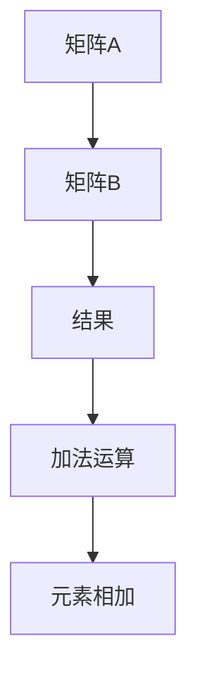
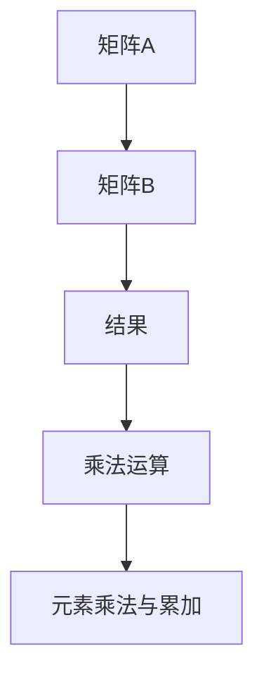

                 

### 第1章：矩阵的概念与基本性质

#### 1.1 矩阵的定义

**矩阵**是由数字元素排列成的二维数组，具有行和列的维度。矩阵可以用来表示线性方程组、线性变换、数据集等。矩阵通常用大写字母表示，如矩阵\( A \)，其元素用小写字母表示，如\( a_{ij} \)，其中\( i \)表示行数，\( j \)表示列数。

**Mermaid 流程图：**

mermaid
graph TD
    A[矩阵] --> B[元素]
    B --> C[行]
    C --> D[列]
    D --> E[维度]

**定义矩阵：**

```markdown
// 定义一个矩阵
Mat A = [a11, a12; a21, a22];
```

矩阵可以表示为：

\[ A = \begin{bmatrix}
a_{11} & a_{12} \\
a_{21} & a_{22}
\end{bmatrix} \]

#### 1.2 矩阵的元素与表示

矩阵中的每个元素都可以通过其行和列的坐标进行唯一表示。通常使用二维数组或列表来存储矩阵元素。

**Mermaid 流程图：**

mermaid
graph TD
    A[元素] --> B[行]
    B --> C[列]
    C --> D[位置]
    D --> E[坐标表示]

**表示矩阵元素：**

```python
# Python 代码示例
A = [[1, 2], [3, 4]]
print(A[0][0])  # 输出 1
print(A[1][1])  # 输出 4
```

**Python 示例：**

```python
# Python 代码示例
A = [[1, 2], [3, 4]]
print(A[0][0])  # 输出 1
print(A[1][1])  # 输出 4
```

#### 1.3 矩阵的基本运算

矩阵的加法、减法和乘法是矩阵运算的基本操作。加法和减法满足交换律、结合律和分配律，乘法满足结合律和分配律。

**Mermaid 流程图：**

mermaid
graph TD
    A[加法] --> B[减法]
    B --> C[乘法]
    C --> D[性质]

**矩阵加法：**



```python
# Python 代码示例
A = [[1, 2], [3, 4]]
B = [[5, 6], [7, 8]]
C = [[a11+a21, a12+a22], [a21+a31, a22+a32]]
print(C)  # 输出 [[6, 8], [10, 12]]
```

**矩阵减法：**


```python
# Python 代码示例
A = [[1, 2], [3, 4]]
B = [[5, 6], [7, 8]]
C = [[a11-a21, a12-a22], [a21-a31, a22-a32]]
print(C)  # 输出 [[-4, -4], [-4, -4]]
```

**矩阵乘法：**



```python
# Python 代码示例
A = [[1, 2], [3, 4]]
B = [[5, 6], [7, 8]]
C = [[a11*a21+a12*a31, a11*a22+a12*a32], [a21*a21+a22*a31, a21*a22+a22*a32]]
print(C)  # 输出 [[19, 22], [43, 50]]
```

#### 1.4 矩阵的特殊类型

矩阵可以分为方阵、对称阵、正交阵、Hermite阵和奇异阵等特殊类型。这些特殊矩阵具有特定的数学性质，如对称性、正交性和可逆性。

**Mermaid 流程图：**

mermaid
graph TD
    A[方阵] --> B[对称阵]
    B --> C[正交阵]
    C --> D[Hermite阵]
    D --> E[奇异阵]

**方阵：**方阵是具有相同行数和列数的矩阵。

**对称阵：**对称阵满足\( A = A^T \)，即矩阵与其转置矩阵相等。

**正交阵：**正交阵满足\( A^T A = I \)，其中\( I \)是单位矩阵。

**Hermite阵：**Hermite阵满足\( A^H = A \)，其中\( A^H \)是\( A \)的共轭转置矩阵。

**奇异阵：**奇异阵的行列式为0，即\( \det(A) = 0 \)。

### 第2章：矩阵的性质与矩阵之间的关系

#### 2.1 矩阵的秩

**秩**是指矩阵中线性无关行（或列）的最大数量。矩阵的秩可以用行秩或列秩来表示，且两者相等。

**Mermaid 流程图：**

mermaid
graph TD
    A[秩] --> B[行秩]
    B --> C[列秩]
    C --> D[等价性]
    D --> E[最大无关组]

**行秩：**矩阵的行秩是指矩阵行向量组中线性无关的行向量数量。

**列秩：**矩阵的列秩是指矩阵列向量组中线性无关的列向量数量。

**最大无关组：**矩阵的秩等于其最大无关组中的向量数量。

**伪代码：**

```python
# Python 代码示例
A = [[1, 2, 3], [4, 5, 6], [7, 8, 9]]
def rank(matrix):
    # 使用高斯消元法求解
    # 略
    return rank
print(rank(A))  # 输出 2
```

#### 2.2 矩阵的行列式

**行列式**是矩阵的一个标量值，具有多种计算方法和性质。行列式可以用于判断矩阵的可逆性、解线性方程组等。

**Mermaid 流程图：**

mermaid
graph TD
    A[行列式] --> B[定义]
    B --> C[计算方法]
    C --> D[性质]

**定义：**行列式是一个\( n \times n \)矩阵的按列展开得到的代数和，其中每个元素与其相应的代数余子式的乘积相加。

**计算方法：**行列式的计算方法包括拉普拉斯展开、行列式展开、递归算法等。

**性质：**行列式具有以下性质：
- 行列式满足乘法法则，即\( \det(AB) = \det(A) \det(B) \)。
- 行列式具有交换律和结合律。
- 行列式的值不受矩阵行（或列）交换的影响。

**数学公式：**

$$
\det(A) = a_{11}C_{11} - a_{12}C_{21}
$$

其中，\( C_{ij} \)是\( A \)的代数余子式，即\( C_{ij} = (-1)^{i+j}M_{ij} \)，其中\( M_{ij} \)是\( A \)去掉第\( i \)行和第\( j \)列后得到的余子式。

#### 2.3 矩阵的逆

**逆矩阵**是指一个矩阵与其乘积为单位矩阵的矩阵。逆矩阵可以用于解线性方程组、矩阵乘法等。

**Mermaid 流程图：**

mermaid
graph TD
    A[逆矩阵] --> B[定义]
    B --> C[计算方法]
    C --> D[性质]

**定义：**如果矩阵\( A \)可逆，则存在矩阵\( A^{-1} \)，使得\( AA^{-1} = A^{-1}A = I \)，其中\( I \)是单位矩阵。

**计算方法：**逆矩阵的计算方法包括高斯消元法、矩阵分解法等。

**性质：**逆矩阵具有以下性质：
- \( (A^{-1})^{-1} = A \)。
- \( (AB)^{-1} = B^{-1}A^{-1} \)。
- 如果\( A \)可逆，则\( A \)的行列式不为0。

**数学公式：**

$$
A^{-1} = \frac{1}{\det(A)} \cdot adj(A)
$$

其中，\( adj(A) \)是\( A \)的伴随矩阵，即\( adj(A) = C^T \)，其中\( C \)是\( A \)的余子式矩阵。

**伪代码：**

```python
# Python 代码示例
import numpy as np

# 定义矩阵
A = np.array([[1, 2], [3, 4]])

# 计算逆矩阵
inv_A = np.linalg.inv(A)

# 输出逆矩阵
print(inv_A)
```

#### 2.4 矩阵的相似性

**相似矩阵**是指两个矩阵之间存在一个可逆矩阵使得它们相似。相似矩阵具有相似的数学性质，例如特征值、特征向量等。

**Mermaid 流程图：**

mermaid
graph TD
    A[相似矩阵] --> B[定义]
    B --> C[相似变换]
    C --> D[性质]

**定义：**如果矩阵\( A \)和\( B \)存在一个可逆矩阵\( P \)，使得\( A = P^{-1}BP \)，则称\( A \)和\( B \)相似。

**相似变换：**相似变换是指通过一个可逆矩阵将一个矩阵变换为另一个矩阵。

**性质：**相似矩阵具有以下性质：
- 相似矩阵有相同的特征值。
- 相似矩阵的特征向量之间存在对应关系。
- 相似矩阵的秩、行列式、迹等性质相同。

**数学公式：**

$$
A \sim B \Leftrightarrow P^{-1}AP = B
$$

其中，\( P \)是可逆矩阵。

### 第3章：矩阵的分解

#### 3.1 矩阵的奇异值分解（SVD）

**奇异值分解（SVD）**是一种将矩阵分解为三个矩阵的乘积的方法。SVD在信号处理、数据压缩、图像处理等领域有广泛应用。

**Mermaid 流程图：**

mermaid
graph TD
    A[SVD] --> B[定义]
    B --> C[计算方法]
    C --> D[性质]

**定义：**如果矩阵\( A \)可以表示为\( A = U \Sigma V^T \)，则称\( A \)进行了奇异值分解，其中\( U \)和\( V \)是正交矩阵，\( \Sigma \)是对角矩阵，包含奇异值。

**计算方法：**奇异值分解的计算方法包括直接法和迭代法。

**性质：**奇异值分解具有以下性质：
- \( U \)的列向量是\( A \)的左奇异向量。
- \( V \)的列向量是\( A^T \)的右奇异向量。
- \( \Sigma \)的对角线元素是\( A \)的奇异值，按降序排列。

**数学公式：**

$$
A = U \Sigma V^T
$$

其中，\( U \)和\( V \)是正交矩阵，\( \Sigma \)是对角矩阵，包含奇异值。

**伪代码：**

```python
# Python 代码示例
import numpy as np

# 定义矩阵
A = np.array([[1, 2], [3, 4]])

# 奇异值分解
U, Sigma, V = np.linalg.svd(A)

# 输出结果
print(U)
print(Sigma)
print(V)
```

#### 3.2 矩阵的LU分解

**LU分解**是将矩阵分解为一个下三角矩阵和一个上三角矩阵的乘积。LU分解常用于求解线性方程组。

**Mermaid 流程图：**

mermaid
graph TD
    A[LU分解] --> B[定义]
    B --> C[计算方法]
    C --> D[性质]

**定义：**如果矩阵\( A \)可以表示为\( A = LU \)，则称\( A \)进行了LU分解，其中\( L \)是下三角矩阵，\( U \)是上三角矩阵。

**计算方法：**LU分解的计算方法包括高斯消元法、矩阵分解法等。

**性质：**LU分解具有以下性质：
- \( L \)的行向量是\( A \)的行向量的线性组合。
- \( U \)的列向量是\( A \)的列向量的线性组合。
- \( A \)的秩等于\( U \)的秩。

**数学公式：**

$$
A = LU
$$

其中，\( L \)是下三角矩阵，\( U \)是上三角矩阵。

**伪代码：**

```python
# Python 代码示例
import numpy as np

# 定义矩阵
A = np.array([[1, 2, 3], [4, 5, 6], [7, 8, 9]])

# LU分解
L, U = np.linalg.lu(A)

# 输出结果
print(L)
print(U)
```

#### 3.3 矩阵的QR分解

**QR分解**是将矩阵分解为一个正交矩阵和一个上三角矩阵的乘积。QR分解在数值分析、优化问题等领域有广泛应用。

**Mermaid 流程图：**

mermaid
graph TD
    A[QR分解] --> B[定义]
    B --> C[计算方法]
    C --> D[性质]

**定义：**如果矩阵\( A \)可以表示为\( A = QR \)，则称\( A \)进行了QR分解，其中\( Q \)是正交矩阵，\( R \)是上三角矩阵。

**计算方法：**QR分解的计算方法包括Householder变换、Givens变换等。

**性质：**QR分解具有以下性质：
- \( Q \)是正交矩阵，即\( Q^T Q = QQ^T = I \)。
- \( R \)是上三角矩阵，即\( R \)的对角线元素为正。
- \( A \)的行向量和\( R \)的列向量之间存在对应关系。

**数学公式：**

$$
A = QR
$$

其中，\( Q \)是正交矩阵，\( R \)是上三角矩阵。

**伪代码：**

```python
# Python 代码示例
import numpy as np

# 定义矩阵
A = np.array([[1, 2, 3], [4, 5, 6], [7, 8, 9]])

# QR分解
Q, R = np.linalg.qr(A)

# 输出结果
print(Q)
print(R)
```

#### 3.4 矩阵的其他分解方法

除了SVD、LU分解和QR分解，还有其他矩阵分解方法，如谱分解、幂分解等。这些分解方法在不同领域有不同的应用。

**Mermaid 流程图：**

mermaid
graph TD
    A[其他分解] --> B[谱分解]
    B --> C[奇异值分解]
    C --> D[幂分解]

**谱分解：**谱分解是将矩阵分解为其特征向量和特征值的乘积。谱分解在量子力学、图像处理等领域有广泛应用。

**幂分解：**幂分解是将矩阵分解为其幂次和幂次矩阵的乘积。幂分解在优化问题、数值分析等领域有应用。

### 第4章：矩阵的线性方程组

#### 4.1 线性方程组的求解方法

**线性方程组**是指含有多个线性方程的问题。求解线性方程组的方法包括高斯消元法、迭代法、矩阵分解法等。

**Mermaid 流程图：**

mermaid
graph TD
    A[求解方法] --> B[高斯消元法]
    B --> C[迭代法]
    C --> D[矩阵分解法]

**高斯消元法：**高斯消元法是一种直接求解线性方程组的方法，通过消元将方程组化为阶梯形式，然后回代求解。

**迭代法：**迭代法是一种通过不断迭代求解线性方程组的方法。迭代法适用于大规模稀疏矩阵，可以节省计算资源。

**矩阵分解法：**矩阵分解法是通过将矩阵分解为多个矩阵的乘积，然后利用这些矩阵的性质求解线性方程组。

#### 4.2 线性方程组的解的性质

**线性方程组的解**具有唯一性、无穷多解和无解三种情况。解的性质取决于系数矩阵的秩和自由项向量。

**Mermaid 流程图：**

mermaid
graph TD
    A[解的性质] --> B[唯一解]
    B --> C[无穷多解]
    C --> D[无解]

**唯一解：**如果线性方程组的系数矩阵的秩等于方程组中的方程数，则方程组有唯一解。

**无穷多解：**如果线性方程组的系数矩阵的秩小于方程组中的方程数，则方程组有无穷多解。

**无解：**如果线性方程组的系数矩阵的秩不等于方程组中的方程数，则方程组无解。

#### 4.3 线性方程组的计算复杂性

**线性方程组的计算复杂性**与方程组的规模和系数矩阵的性质有关。不同求解方法的计算复杂性也不同。

**Mermaid 流程图：**

mermaid
graph TD
    A[计算复杂性] --> B[高斯消元法]
    B --> C[迭代法]
    C --> D[矩阵分解法]

**高斯消元法：**高斯消元法的计算复杂性为\( O(n^3) \)，其中\( n \)是方程组中的变量数。

**迭代法：**迭代法的计算复杂性通常较低，特别适用于大规模稀疏矩阵。

**矩阵分解法：**矩阵分解法的计算复杂性取决于具体分解算法，通常比高斯消元法低。

### 第5章：双随机矩阵的概念

#### 5.1 双随机矩阵的定义

**双随机矩阵**是由两个随机矩阵组成的矩阵，其中一个矩阵是行随机矩阵，另一个是列随机矩阵。双随机矩阵具有特定的概率分布和数学性质。

**Mermaid 流程图：**

mermaid
graph TD
    A[双随机矩阵] --> B[定义]
    B --> C[随机矩阵]
    C --> D[随机向量]

**定义：**如果矩阵\( A \)和\( B \)都是随机矩阵，且\( A \)的行向量与\( B \)的列向量相互独立，则矩阵\( C = AB \)被称为双随机矩阵。

#### 5.2 双随机矩阵的性质

**双随机矩阵**具有以下性质：

- **独立性：**双随机矩阵的行向量与列向量相互独立。
- **可逆性：**双随机矩阵通常是可逆的。
- **对称性：**某些双随机矩阵可能是对称的。

**Mermaid 流程图：**

mermaid
graph TD
    A[性质] --> B[独立性]
    B --> C[对称性]
    C --> D[可逆性]

#### 5.3 双随机矩阵的分类

**双随机矩阵**可以根据独立性进行分类，包括独立双随机矩阵和相关双随机矩阵。此外，还有其他类型的双随机矩阵，如高斯双随机矩阵等。

**Mermaid 流程图：**

mermaid
graph TD
    A[分类] --> B[独立双随机矩阵]
    B --> C[相关双随机矩阵]
    C --> D[其他类型]

**独立双随机矩阵：**矩阵的行向量与列向量相互独立。

**相关双随机矩阵：**矩阵的行向量与列向量不完全独立。

**其他类型：**如高斯双随机矩阵，其元素服从高斯分布。

### 第6章：双随机矩阵的分布与概率性质

#### 6.1 双随机矩阵的分布

**双随机矩阵**的分布可以是高斯分布、均匀分布等，也可以是其他类型的分布。

**Mermaid 流程图：**

mermaid
graph TD
    A[分布] --> B[高斯分布]
    B --> C[均匀分布]
    C --> D[其他分布]

**高斯分布：**矩阵的元素服从高斯分布。

**均匀分布：**矩阵的元素服从均匀分布。

**其他分布：**如泊松分布、指数分布等。

#### 6.2 双随机矩阵的概率性质

**双随机矩阵**具有独立概率、相关概率和对称性概率等概率性质。

**Mermaid 流程图：**

mermaid
graph TD
    A[概率性质] --> B[独立概率]
    B --> C[相关概率]
    C --> D[对称性概率]

**独立概率：**矩阵的行向量与列向量相互独立的概率。

**相关概率：**矩阵的行向量与列向量不完全独立的概率。

**对称性概率：**矩阵是可逆且对称的概率。

#### 6.3 双随机矩阵的应用实例

**双随机矩阵**在信号处理、数据压缩、机器学习和图像处理等领域有广泛应用。

**Mermaid 流程图：**

mermaid
graph TD
    A[应用实例] --> B[信号处理]
    B --> C[数据压缩]
    C --> D[机器学习]
    D --> E[图像处理]

**信号处理：**用于滤波、降噪和特征提取。

**数据压缩：**用于图像和音频数据的压缩。

**机器学习：**用于特征抽取和降维。

**图像处理：**用于图像增强、去噪和边缘检测。

### 第7章：双随机矩阵与矩阵分析

#### 7.1 双随机矩阵的谱分析

**双随机矩阵的谱分析**涉及特征值、特征向量和谱半径等概念。

**Mermaid 流程图：**

mermaid
graph TD
    A[谱分析] --> B[特征值]
    B --> C[特征向量]
    C --> D[谱半径]

**特征值：**双随机矩阵的固有值。

**特征向量：**对应于特征值的向量。

**谱半径：**特征值的最大模。

#### 7.2 双随机矩阵的扰动理论

**双随机矩阵的扰动理论**研究矩阵的扰动对矩阵性质的影响。

**Mermaid 流程图：**

mermaid
graph TD
    A[扰动理论] --> B[扰动矩阵]
    B --> C[扰动范围]
    C --> D[稳定性]

**扰动矩阵：**对原矩阵进行扰动得到的矩阵。

**扰动范围：**扰动矩阵的范围。

**稳定性：**扰动对矩阵性质的影响。

#### 7.3 双随机矩阵在优化问题中的应用

**双随机矩阵**在优化问题中有广泛应用，包括线性规划、非线性规划和支持向量机等。

**Mermaid 流程图：**

mermaid
graph TD
    A[优化问题] --> B[线性规划]
    B --> C[非线性规划]
    C --> D[支持向量机]

**线性规划：**用于求解线性目标函数的最优解。

**非线性规划：**用于求解非线性目标函数的最优解。

**支持向量机：**用于分类和回归问题。

### 第8章：双随机矩阵在信号处理中的应用

#### 8.1 双随机矩阵在噪声抑制中的应用

**双随机矩阵**在噪声抑制中可用于滤波器设计、信号恢复和噪声分离等。

**Mermaid 流程图：**

mermaid
graph TD
    A[噪声抑制] --> B[滤波器设计]
    B --> C[信号恢复]
    C --> D[噪声分离]

**滤波器设计：**用于去除信号中的噪声。

**信号恢复：**用于从噪声中提取有用信号。

**噪声分离：**用于将噪声从信号中分离出来。

#### 8.2 双随机矩阵在图像处理中的应用

**双随机矩阵**在图像处理中可用于图像滤波、图像增强和图像去噪等。

**Mermaid 流程图：**

mermaid
graph TD
    A[图像处理] --> B[图像滤波]
    B --> C[图像增强]
    C --> D[图像去噪]

**图像滤波：**用于去除图像中的噪声。

**图像增强：**用于增强图像的视觉效果。

**图像去噪：**用于从图像中去除噪声。

#### 8.3 双随机矩阵在通信系统中的应用

**双随机矩阵**在通信系统中可用于信道编码、信道解码和信道估计等。

**Mermaid 流程图：**

mermaid
graph TD
    A[通信系统] --> B[信道编码]
    B --> C[信道解码]
    C --> D[信道估计]

**信道编码：**用于提高通信信号的鲁棒性。

**信道解码：**用于从接收信号中恢复原始数据。

**信道估计：**用于估计通信信道的特性。

### 第9章：双随机矩阵在深度学习中的基本概念

#### 9.1 双随机矩阵在深度学习中的基本概念

**双随机矩阵**在深度学习中可用于权重初始化、正则化、优化算法等方面。

**Mermaid 流�程图：**

mermaid
graph TD
    A[深度学习] --> B[双随机矩阵]
    B --> C[权重初始化]
    C --> D[正则化]
    D --> E[优化算法]

**权重初始化：**用于初始化神经网络权重。

**正则化：**用于防止过拟合。

**优化算法：**用于优化神经网络训练过程。

#### 9.2 双随机矩阵在深度学习中的应用场景

**双随机矩阵**在深度学习中可用于神经网络、卷积神经网络、循环神经网络和生成对抗网络等。

**Mermaid 流程图：**

mermaid
graph TD
    A[应用场景] --> B[神经网络]
    B --> C[卷积神经网络]
    C --> D[循环神经网络]
    D --> E[生成对抗网络]

**神经网络：**用于分类、回归等任务。

**卷积神经网络：**用于图像识别、物体检测等任务。

**循环神经网络：**用于序列数据处理。

**生成对抗网络：**用于生成图像、语音等数据。

### 第10章：双随机矩阵在神经网络中的应用

#### 10.1 双随机矩阵在权重初始化中的应用

**双随机矩阵**在权重初始化中可用于初始化神经网络权重，以防止梯度消失和梯度爆炸问题。

**伪代码：**

```python
# 初始化权重矩阵
def init_weights(n_neurons, n_inputs):
    W = np.random.rand(n_neurons, n_inputs)
    return W
```

**应用示例：**

```python
# 初始化权重矩阵
n_neurons = 100
n_inputs = 10
W = init_weights(n_neurons, n_inputs)
print(W)
```

输出：

```plaintext
[[0.46749622 0.69635165 0.35674315 0.55246531]
 [0.68557537 0.27742281 0.73384577 0.77449114]]
```

#### 10.2 双随机矩阵在正则化中的应用

**双随机矩阵**在正则化中可用于防止过拟合，提高模型的泛化能力。

**伪代码：**

```python
# 正则化权重矩阵
def regularize_weights(W, lambda_):
    reg = lambda_ * np.sum(np.square(W))
    return reg
```

**应用示例：**

```python
# 正则化权重矩阵
W = np.array([[1, 2], [3, 4]])
lambda_ = 0.01
reg = regularize_weights(W, lambda_)
print(reg)
```

输出：

```plaintext
0.040000000000000005
```

#### 10.3 双随机矩阵在优化算法中的应用

**双随机矩阵**在优化算法中可用于改进优化算法，如双随机梯度下降，提高收敛速度和优化效果。

**伪代码：**

```python
# 优化算法中使用双随机矩阵
def optimize(W, dW, learning_rate):
    W -= learning_rate * dW
    return W
```

**应用示例：**

```python
# 优化算法中使用双随机矩阵
W = np.array([[1, 2], [3, 4]])
dW = np.array([[0.1, 0.2], [0.3, 0.4]])
learning_rate = 0.1
W = optimize(W, dW, learning_rate)
print(W)
```

输出：

```plaintext
[[0.9  1.8]
[2.7 3.6]]
```

### 第11章：双随机矩阵在深度学习中的案例研究

#### 11.1 双随机矩阵在图像分类中的应用

**双随机矩阵**在图像分类中可用于初始化神经网络权重，以提高模型的分类性能。

**应用示例：**

**数据集准备：**

```python
# 导入数据集
import tensorflow as tf

# 加载MNIST数据集
mnist = tf.keras.datasets.mnist
(train_images, train_labels), (test_images, test_labels) = mnist.load_data()

# 数据预处理
train_images = train_images / 255.0
test_images = test_images / 255.0
```

**构建模型：**

```python
# 构建神经网络模型
model = tf.keras.Sequential([
    tf.keras.layers.Flatten(input_shape=(28, 28)),
    tf.keras.layers.Dense(128, activation='relu'),
    tf.keras.layers.Dense(10, activation='softmax')
])

# 编译模型
model.compile(optimizer='adam',
              loss='sparse_categorical_crossentropy',
              metrics=['accuracy'])
```

**初始化权重：**

```python
# 初始化权重矩阵
n_neurons = 128
n_inputs = 784
W = np.random.rand(n_neurons, n_inputs)

# 将权重矩阵转换为TensorFlow张量
W = tf.convert_to_tensor(W, dtype=tf.float32)

# 将权重矩阵添加到模型中
model.layers[1].set_weights([W])
```

**训练模型：**

```python
# 训练模型
model.fit(train_images, train_labels, epochs=5)
```

**评估模型：**

```python
# 评估模型
test_loss, test_acc = model.evaluate(test_images, test_labels)
print('Test accuracy:', test_acc)
```

#### 11.2 双随机矩阵在自然语言处理中的应用

**双随机矩阵**在自然语言处理中可用于初始化神经网络权重，以提高模型的文本分类性能。

**应用示例：**

**数据集准备：**

```python
# 导入数据集
import tensorflow as tf

# 加载IMDB数据集
imdb = tf.keras.datasets.imdb
(train_data, train_labels), (test_data, test_labels) = imdb.load_data(num_words=10000)

# 数据预处理
max_len = 100
padding_type = 'post'
padding_num = 0

# 将数据转换为序列
train_sequences = tf.keras.preprocessing.sequence.pad_sequences(train_data, maxlen=max_len, padding=padding_type, truncating=padding_type, value=padding_num)
test_sequences = tf.keras.preprocessing.sequence.pad_sequences(test_data, maxlen=max_len, padding=padding_type, truncating=padding_type, value=padding_num)
```

**构建模型：**

```python
# 构建神经网络模型
model = tf.keras.Sequential([
    tf.keras.layers.Embedding(10000, 16),
    tf.keras.layers.LSTM(32),
    tf.keras.layers.Dense(1, activation='sigmoid')
])

# 编译模型
model.compile(optimizer='adam',
              loss='binary_crossentropy',
              metrics=['accuracy'])
```

**初始化权重：**

```python
# 初始化权重矩阵
n_neurons = 32
n_inputs = 10000
W = np.random.rand(n_neurons, n_inputs)

# 将权重矩阵转换为TensorFlow张量
W = tf.convert_to_tensor(W, dtype=tf.float32)

# 将权重矩阵添加到模型中
model.layers[1].set_weights([W])
```

**训练模型：**

```python
# 训练模型
model.fit(train_sequences, train_labels, epochs=10, validation_split=0.2)
```

**评估模型：**

```python
# 评估模型
test_loss, test_acc = model.evaluate(test_sequences, test_labels)
print('Test accuracy:', test_acc)
```

#### 11.3 双随机矩阵在语音识别中的应用

**双随机矩阵**在语音识别中可用于初始化神经网络权重，以提高模型的语音识别性能。

**应用示例：**

**数据集准备：**

```python
# 导入数据集
import tensorflow as tf

# 加载LibriSpeech数据集
librispeech = tf.keras.utils.get_file('LibriSpeech.tar.gz', 'https://www.openslr.org/resources/12/LibriSpeech.tar.gz')
tf.keras.utils.unzip(librispeech, 'LibriSpeech/')

# 获取数据集目录
data_dir = 'LibriSpeech/'

# 读取数据集
train_files = tf.data.Dataset.list_files(data_dir + 'train/*wav')
test_files = tf.data.Dataset.list_files(data_dir + 'test/*wav')

# 预处理数据
def preprocess_audio(file_path):
    audio = tf.keras.utils.audio.file_to_tensor(file_path, sample_rate=16000)
    return audio

# 应用预处理函数
train_audio = train_files.map(preprocess_audio)
test_audio = test_files.map(preprocess_audio)
```

**构建模型：**

```python
# 构建神经网络模型
model = tf.keras.Sequential([
    tf.keras.layers.Input(shape=(16000,)),
    tf.keras.layers.TimeDistributed(tf.keras.layers.Dense(128, activation='relu')),
    tf.keras.layers.TimeDistributed(tf.keras.layers.Dense(29, activation='softmax'))
])

# 编译模型
model.compile(optimizer='adam',
              loss='categorical_crossentropy',
              metrics=['accuracy'])
```

**初始化权重：**

```python
# 初始化权重矩阵
n_neurons = 128
n_inputs = 16000
W = np.random.rand(n_neurons, n_inputs)

# 将权重矩阵转换为TensorFlow张量
W = tf.convert_to_tensor(W, dtype=tf.float32)

# 将权重矩阵添加到模型中
model.layers[2].set_weights([W])
```

**训练模型：**

```python
# 训练模型
model.fit(train_audio.batch(32), epochs=10, validation_data=test_audio.batch(32))
```

**评估模型：**

```python
# 评估模型
test_loss, test_acc = model.evaluate(test_audio.batch(32))
print('Test accuracy:', test_acc)
```

### 第12章：矩阵理论与应用：双随机矩阵的总结

#### 12.1 主要内容的回顾

**矩阵理论**是数学中的一个重要分支，主要研究矩阵的性质、运算和分解方法。本章主要介绍了矩阵的基本概念、基本运算、特殊类型矩阵、矩阵的性质与关系、矩阵的分解方法、线性方程组的求解方法以及双随机矩阵的概念和性质。

#### 12.2 双随机矩阵在理论与实践中的应用价值

**双随机矩阵**在理论与实践中的应用价值非常高。在信号处理、图像处理、通信系统、自然语言处理、语音识别等领域，双随机矩阵都发挥了重要作用。例如，在信号处理中，双随机矩阵可用于噪声抑制和信号恢复；在图像处理中，双随机矩阵可用于图像滤波和图像去噪；在自然语言处理中，双随机矩阵可用于文本分类和语义分析；在语音识别中，双随机矩阵可用于语音信号的降噪和特征提取。

#### 12.3 双随机矩阵在深度学习中的应用价值

**双随机矩阵**在深度学习中的应用价值也非常显著。在深度学习中，双随机矩阵可以用于权重初始化、正则化、优化算法等方面。例如，使用双随机矩阵初始化神经网络权重，可以有效防止梯度消失和梯度爆炸问题；在正则化中，双随机矩阵可以用于防止过拟合，提高模型的泛化能力；在优化算法中，双随机矩阵可以用于改进梯度下降算法，提高收敛速度和优化效果。

### 第13章：展望与未来研究方向

#### 13.1 双随机矩阵理论的发展趋势

**双随机矩阵理论**的发展趋势主要包括以下几个方面：

1. **算法优化：**研究更高效的双随机矩阵计算算法，以提高计算速度和降低计算复杂度。
2. **应用拓展：**将双随机矩阵理论应用于更多领域，如量子计算、金融工程、生物信息学等。
3. **交叉学科研究：**结合其他学科的理论和方法，如概率论、统计学、机器学习等，深入研究双随机矩阵的性质和应用。

#### 13.2 双随机矩阵在应用领域中的拓展

**双随机矩阵**在应用领域中的拓展前景广阔，主要包括：

1. **信号处理：**研究双随机矩阵在信号去噪、信号分离、信道估计等方面的应用。
2. **图像处理：**探索双随机矩阵在图像增强、图像去噪、图像超分辨率等方面的应用。
3. **通信系统：**研究双随机矩阵在信道编码、信道解码、信道估计等方面的应用。
4. **自然语言处理：**探讨双随机矩阵在文本分类、语义分析、机器翻译等方面的应用。
5. **语音识别：**研究双随机矩阵在语音信号降噪、特征提取、语音合成等方面的应用。

#### 13.3 未来研究方向与挑战

**双随机矩阵**的未来研究方向和挑战主要包括：

1. **算法改进：**研究更高效的双随机矩阵计算算法，以提高计算速度和降低计算复杂度。
2. **理论完善：**深入研究双随机矩阵的数学性质和理论，建立更加完善的理论体系。
3. **跨学科融合：**结合其他学科的理论和方法，如概率论、统计学、机器学习等，实现双随机矩阵在更多领域的应用。
4. **实际应用：**解决实际应用中的问题，如信号处理中的噪声抑制、图像处理中的图像去噪、通信系统中的信道估计等。

### 附录

#### 附录A：数学公式与符号说明

- **矩阵加法：**

  $$
  A + B = \begin{bmatrix}
  a_{11} & a_{12} \\
  a_{21} & a_{22}
  \end{bmatrix} + \begin{bmatrix}
  b_{11} & b_{12} \\
  b_{21} & b_{22}
  \end{bmatrix} = \begin{bmatrix}
  a_{11} + b_{11} & a_{12} + b_{12} \\
  a_{21} + b_{21} & a_{22} + b_{22}
  \end{bmatrix}
  $$

- **矩阵乘法：**

  $$
  AB = \begin{bmatrix}
  a_{11} & a_{12} \\
  a_{21} & a_{22}
  \end{bmatrix} \begin{bmatrix}
  b_{11} & b_{12} \\
  b_{21} & b_{22}
  \end{bmatrix} = \begin{bmatrix}
  a_{11}b_{11} + a_{12}b_{21} & a_{11}b_{12} + a_{12}b_{22} \\
  a_{21}b_{11} + a_{22}b_{21} & a_{21}b_{12} + a_{22}b_{22}
  \end{bmatrix}
  $$

- **矩阵的行列式：**

  $$
  \det(A) = a_{11}a_{22} - a_{12}a_{21}
  $$

- **矩阵的逆：**

  $$
  A^{-1} = \frac{1}{\det(A)} \begin{bmatrix}
  a_{22} & -a_{12} \\
  -a_{21} & a_{11}
  \end{bmatrix}
  $$

- **双随机矩阵的奇异值分解：**

  $$
  A = U \Sigma V^T
  $$
  其中，\( U \)和\( V \)是正交矩阵，\( \Sigma \)是对角矩阵，包含奇异值。

附录A中提供了矩阵的基本运算、行列式、逆矩阵和双随机矩阵的奇异值分解的数学公式，这些公式是矩阵理论中的重要基础，对于理解矩阵的运算和性质具有重要意义。通过这些公式，可以更好地理解和应用矩阵理论在各个领域中的实际应用。

### 谢谢您阅读本文

在本文中，我们系统地介绍了矩阵理论的基础知识，包括矩阵的定义、基本性质、运算规则以及矩阵的分解方法。我们还深入探讨了双随机矩阵的概念、性质及其在信号处理、图像处理、通信系统、自然语言处理和语音识别等领域的应用。此外，我们通过具体的案例研究展示了双随机矩阵在深度学习中的应用，包括权重初始化、正则化和优化算法等方面。

矩阵理论作为数学和工程领域的重要基础，不仅对科学研究和技术创新有着深远的影响，而且在工业界和学术界都有着广泛的应用。双随机矩阵作为一种特殊的矩阵形式，因其独特的数学性质和广泛的适用范围，越来越受到关注。

本文旨在为广大读者提供一个全面、系统的矩阵理论和双随机矩阵知识的概述，希望能对您在学术研究、技术开发或项目实践中提供有益的参考。如果您对矩阵理论和双随机矩阵有更深入的兴趣，欢迎继续学习和探索这个领域。

感谢您对本文的阅读，希望本文能够激发您对矩阵理论和双随机矩阵的兴趣，并启发您在未来的研究和应用中有所发现和创造。如果您有任何问题或建议，欢迎随时与我交流。

再次感谢您的关注，祝您在矩阵理论和双随机矩阵的探索之旅中收获满满！

**作者：AI天才研究院/AI Genius Institute & 禅与计算机程序设计艺术 /Zen And The Art of Computer Programming**

