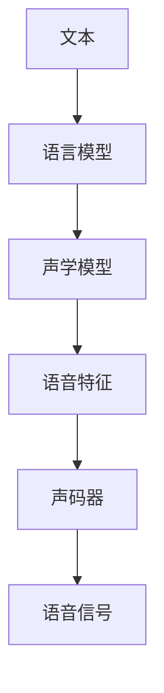
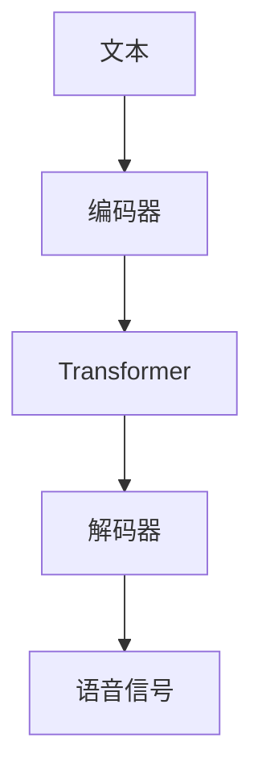
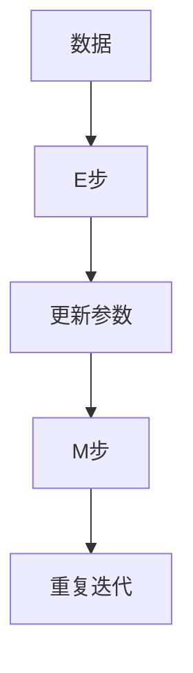

                 

### 《神经网络在语音合成中的最新进展》文章核心关键词

本文的核心关键词包括：神经网络、语音合成、深度学习、声学模型、语言模型、端到端模型、自然语言处理、梅尔频率倒谱系数（MFCC）、高斯混合模型（GMM）、最大期望（EM）算法、项目实战、代码分析。

这些关键词将贯穿全文，帮助读者更好地理解神经网络在语音合成领域的最新应用和发展。从基础理论到实际应用，本文将全面剖析神经网络在语音合成技术中的关键作用和挑战，旨在为读者提供一次深入而系统的了解。

### 《神经网络在语音合成中的最新进展》文章摘要

随着人工智能技术的飞速发展，神经网络在语音合成领域取得了显著的进展。本文将系统地介绍神经网络在语音合成中的最新应用和发展。首先，我们将回顾语音合成技术的发展历程，分析其核心组件和基本原理。接着，本文将重点探讨神经网络，包括其基本结构、类型和训练方法。随后，我们将深入讨论深度神经网络在语音合成中的应用，如声学模型和语言模型的构建与优化。本文还将介绍端到端语音合成模型，探讨其在自然语言处理中的应用和优化策略。此外，文章还将讨论语音合成的个性化与自适应技术，并展示一个具体的语音合成项目实战，提供源代码分析和解读。最后，本文将总结神经网络在语音合成中的最新进展，并提出未来发展的方向。通过本文的阅读，读者将对神经网络在语音合成领域的应用有更深入的理解，并为相关技术研究和应用提供有价值的参考。

## 《神经网络在语音合成中的最新进展》目录大纲

### 第一部分：语音合成技术基础

#### 第1章：语音合成技术概述

- 1.1 语音合成技术的发展历程
- 1.2 语音合成的分类与比较
- 1.3 语音合成的核心组件

#### 第2章：声学模型原理

- 2.1 声学模型的基本概念
- 2.2 声学模型的构建方法
- 2.3 声学模型的优化策略

#### 第3章：语言模型原理

- 3.1 语言模型的基本概念
- 3.2 语言模型的构建方法
- 3.3 语言模型的优化策略

#### 第4章：神经网络基础

- 4.1 神经网络的基本结构
- 4.2 常见的神经网络类型
- 4.3 神经网络的训练与优化

### 第二部分：语音合成技术最新进展

#### 第5章：深度神经网络在语音合成中的应用

- 5.1 深度神经网络在语音合成中的优势
- 5.2 基于深度神经网络的声学模型
- 5.3 基于深度神经网络的语音合成框架

#### 第6章：自然语言处理与语音合成

- 6.1 自然语言处理的基础知识
- 6.2 语言模型在语音合成中的应用
- 6.3 基于自然语言处理的语音合成优化策略

#### 第7章：端到端语音合成模型

- 7.1 端到端语音合成的基本概念
- 7.2 基于序列到序列模型的端到端语音合成
- 7.3 基于注意力机制的端到端语音合成

#### 第8章：语音合成的个性化与自适应

- 8.1 语音合成的个性化技术
- 8.2 语音合成的自适应技术
- 8.3 个性化与自适应语音合成的实现与优化

### 第三部分：项目实战与代码分析

#### 第9章：语音合成项目实战

- 9.1 项目环境搭建
- 9.2 项目源代码解读
- 9.3 项目代码解读与分析

#### 第10章：语音合成模型的评测与优化

- 10.1 语音合成模型的评测指标
- 10.2 语音合成模型的优化策略
- 10.3 评测与优化实战案例

### 附录

#### 附录A：常用语音合成工具与资源

- A.1 常用开源语音合成工具介绍
- A.2 语音合成工具使用教程
- A.3 语音合成相关资源推荐

通过以上目录大纲，本文将逐步深入探讨神经网络在语音合成领域的应用，从基础理论到实际项目，为读者提供一个全面而系统的视角。接下来，我们将正式进入语音合成技术的详细介绍，为后续章节的讨论打下坚实的基础。

## 第一部分：语音合成技术基础

### 第1章：语音合成技术概述

语音合成，又称为文本到语音（Text-to-Speech，TTS）转换，是一种将书面文本自动转换为自然流畅语音的技术。其基本原理是通过计算机模拟人类语音合成过程，将输入的文本转换为音频信号，从而生成可听见的语音。语音合成技术在过去的几十年中取得了显著的发展，特别是在人工智能和深度学习技术的推动下，语音合成质量大幅提升，应用场景也日益广泛。

#### 1.1 语音合成技术的发展历程

语音合成技术的发展可以分为几个阶段：

- **早期的拼接式合成**：20世纪50年代到70年代，语音合成主要采用拼接式合成方法。这种方法将语音信号分割成音素，然后拼接成完整的语音。这种方法的优点是音质较为自然，但合成速度较慢，且难以处理连续语音中的音素转换。

- **波形拼接**：20世纪80年代，波形拼接技术开始应用于语音合成。这种方法通过直接拼接波形来生成语音，相比音素拼接具有更高的合成速度。然而，波形拼接的语音质量仍然存在一定的缺陷，尤其是在处理语音连续性和音调变化方面。

- **参数合成**：20世纪90年代，参数合成技术开始广泛应用。这种方法通过参数化模型来描述语音信号，如声道模型和声道模型。这种方法的优点是合成速度较快，且音质较为自然，成为当时语音合成的主要方法。

- **统计模型**：21世纪初，基于统计模型的语音合成技术逐渐兴起。如高斯混合模型（GMM）和隐马尔可夫模型（HMM）。这些模型通过统计语音特征，如梅尔频率倒谱系数（MFCC），来生成语音信号。这种方法在语音合成质量上取得了显著的提升。

- **深度学习**：近年来，随着深度学习技术的发展，基于深度神经网络的语音合成方法逐渐成为主流。如深度神经网络（DNN）、卷积神经网络（CNN）、循环神经网络（RNN）等。这些方法通过大规模数据和复杂的网络结构，实现了更高的语音合成质量和效率。

#### 1.2 语音合成的分类与比较

语音合成可以根据不同的分类标准分为多种类型：

- **根据合成方法**：

  - **拼接式合成**：通过拼接预录制的语音片段来生成语音。优点是音质较为自然，但处理连续语音复杂度较高。

  - **参数合成**：通过参数化模型生成语音，如声道模型和声道模型。优点是合成速度较快，但音质受模型参数限制。

  - **统计模型**：通过统计语音特征生成语音，如高斯混合模型（GMM）和隐马尔可夫模型（HMM）。优点是语音质量较高，但计算复杂度较高。

  - **深度学习合成**：通过深度神经网络生成语音，如深度神经网络（DNN）、卷积神经网络（CNN）、循环神经网络（RNN）等。优点是语音质量高，合成速度快，但需要大量训练数据和计算资源。

- **根据语音质量**：

  - **自然度**：语音的自然度是评价语音合成质量的重要指标。自然度高的语音合成系统能够生成更加接近真实人类语音的语音。

  - **流畅度**：语音的流畅度是指语音在转换过程中的连贯性和连贯性。流畅度高的语音合成系统能够更好地处理语音中的音素转换和连读现象。

  - **音色**：音色是语音的音质特征，不同的语音合成系统可能生成具有不同音色的语音。

- **根据应用场景**：

  - **娱乐应用**：如语音助手、智能音响等，对语音的自然度和流畅度要求较高。

  - **教育应用**：如语音教学、语音评测等，对语音的准确性和清晰度要求较高。

  - **通信应用**：如语音通信、电话语音合成等，对语音的实时性和稳定性要求较高。

#### 1.3 语音合成的核心组件

语音合成系统通常由以下几个核心组件组成：

- **文本处理模块**：将输入的文本进行预处理，如分词、句法分析等，生成语音合成的文本表示。

- **声学模型**：将文本表示转换为声学特征，如梅尔频率倒谱系数（MFCC），生成语音信号的基础特征。

- **语音合成引擎**：将声学特征转换为语音信号，生成最终的语音输出。

- **音频处理模块**：对生成的语音信号进行后处理，如降噪、音量调整等，以满足特定的应用需求。

### 第2章：声学模型原理

声学模型是语音合成系统中的核心组件之一，它负责将文本表示转换为声学特征，从而生成语音信号。声学模型通常基于统计模型或深度学习模型构建，其中高斯混合模型（GMM）和深度神经网络（DNN）是两种常用的声学模型。

#### 2.1 声学模型的基本概念

声学模型是一种概率模型，它描述了语音信号在给定文本表示下的概率分布。声学模型的基本目标是学习语音特征的概率分布，以便能够根据文本生成语音信号。声学模型通常包含以下基本概念：

- **语音信号**：语音信号是由声波振动的时域波形表示。语音信号可以通过麦克风等设备捕捉到。

- **声学特征**：声学特征是描述语音信号特性的量化指标。常见的声学特征包括梅尔频率倒谱系数（MFCC）、线性预测系数（LPCC）、共振峰频率（F0）等。

- **模型参数**：声学模型参数是描述模型结构的参数，如高斯分布的均值、协方差等。

- **概率分布**：声学模型通过概率分布来描述语音信号的概率特征。常见的概率分布包括高斯分布、马尔可夫分布等。

#### 2.2 声学模型的构建方法

声学模型的构建方法可以分为统计模型和深度学习模型两类。以下分别介绍这两种模型的构建方法。

- **统计模型**：

  - **高斯混合模型（GMM）**：高斯混合模型是一种基于概率模型的声学模型，它将语音信号视为多个高斯分布的混合。每个高斯分布对应一个语音特征向量，其权重表示该特征向量在混合模型中的重要性。

    GMM模型的构建步骤包括：

    - **初始化参数**：初始化模型参数，如高斯分布的均值、协方差和权重。

    - **训练模型**：使用最大期望（EM）算法训练模型，通过迭代计算每个数据点属于每个高斯分布的后验概率，并更新模型参数。

    - **模型评估**：使用测试数据集评估模型性能，如语音相似度、语音自然度等。

  - **隐马尔可夫模型（HMM）**：隐马尔可夫模型是一种基于统计模型的语音合成模型，它描述了语音信号在不同状态之间的转换概率。HMM模型通常结合声学特征，如MFCC，来生成语音信号。

    HMM模型的构建步骤包括：

    - **初始化模型**：初始化模型参数，如状态转移概率、输出概率和初始状态概率。

    - **训练模型**：使用最大似然估计或贝叶斯估计训练模型。

    - **模型解码**：使用Viterbi算法解码模型，找到最佳的状态路径，从而生成语音信号。

- **深度学习模型**：

  - **深度神经网络（DNN）**：深度神经网络是一种基于多层感知机的神经网络模型，它可以学习语音特征和文本之间的非线性关系。DNN模型通常用于声学模型的训练和优化。

    DNN模型的构建步骤包括：

    - **设计网络结构**：设计神经网络的结构，包括输入层、隐藏层和输出层。

    - **训练模型**：使用反向传播算法训练模型，通过迭代调整模型参数，以最小化损失函数。

    - **模型优化**：使用正则化方法优化模型，如权重衰减、Dropout等，以提高模型的泛化能力。

  - **卷积神经网络（CNN）**：卷积神经网络是一种基于卷积操作的神经网络模型，它可以有效地提取语音特征。CNN模型通常用于特征提取和特征融合。

    CNN模型的构建步骤包括：

    - **设计网络结构**：设计卷积神经网络的结构，包括卷积层、池化层和全连接层。

    - **训练模型**：使用反向传播算法训练模型，通过迭代调整模型参数，以最小化损失函数。

    - **模型评估**：使用测试数据集评估模型性能，如语音相似度、语音自然度等。

#### 2.3 声学模型的优化策略

声学模型的优化策略旨在提高模型性能和语音合成质量。以下是一些常用的优化策略：

- **数据增强**：通过添加噪声、改变音调等手段，增加训练数据集的多样性，从而提高模型的泛化能力。

- **模型融合**：将多个模型进行融合，如将DNN和CNN融合，以综合利用不同模型的优势。

- **正则化**：使用正则化方法，如权重衰减、Dropout等，来防止模型过拟合。

- **注意力机制**：引入注意力机制，如基于注意力机制的循环神经网络（Attention-based RNN），以提高模型对文本和声学特征的关注度。

- **动态时间规整**：使用动态时间规整（Dynamic Time Warping，DTW）算法，对语音信号进行时间调整，以匹配文本和语音特征。

通过以上优化策略，声学模型可以更好地适应不同的语音合成任务，从而生成更高质量的语音。

### 第3章：语言模型原理

语言模型是语音合成系统中的另一个核心组件，它负责将输入的文本转换为语音。语言模型的主要目标是学习自然语言的概率分布，以便能够根据文本生成语音。在语音合成中，语言模型通常与声学模型结合使用，以生成自然流畅的语音。

#### 3.1 语言模型的基本概念

语言模型是一种概率模型，它描述了自然语言中词汇和句子出现的概率。语言模型的基本概念包括：

- **词汇**：词汇是语言模型中的基本单位，通常由单词、短语或句子组成。

- **概率分布**：语言模型通过概率分布来描述词汇和句子的概率特征。常见的概率分布包括高斯分布、伯努利分布等。

- **模型参数**：语言模型参数是描述模型结构的参数，如词汇的概率、转移概率等。

- **词汇表**：词汇表是语言模型中包含的所有词汇的集合。词汇表的大小通常取决于语言模型的复杂度。

#### 3.2 语言模型的构建方法

语言模型的构建方法可以分为统计模型和深度学习模型两类。以下分别介绍这两种模型的构建方法。

- **统计模型**：

  - **n-gram模型**：n-gram模型是一种基于统计的简单语言模型，它通过计数词汇序列的频率来估计词汇序列的概率。n-gram模型的构建步骤包括：

    - **初始化模型**：初始化模型参数，如n-gram的频率表。

    - **训练模型**：使用训练数据集统计词汇序列的频率，并更新模型参数。

    - **模型评估**：使用测试数据集评估模型性能，如词汇相似度、句子流畅度等。

  - **隐马尔可夫模型（HMM）**：隐马尔可夫模型是一种基于统计的复杂语言模型，它描述了词汇和句子之间的状态转移概率。HMM模型的构建步骤包括：

    - **初始化模型**：初始化模型参数，如状态转移概率、输出概率和初始状态概率。

    - **训练模型**：使用最大似然估计或贝叶斯估计训练模型。

    - **模型解码**：使用Viterbi算法解码模型，找到最佳的状态路径，从而生成词汇序列。

- **深度学习模型**：

  - **循环神经网络（RNN）**：循环神经网络是一种基于递归操作的神经网络模型，它可以学习词汇和句子之间的序列关系。RNN模型的构建步骤包括：

    - **设计网络结构**：设计循环神经网络的结构，包括输入层、隐藏层和输出层。

    - **训练模型**：使用反向传播算法训练模型，通过迭代调整模型参数，以最小化损失函数。

    - **模型优化**：使用正则化方法优化模型，如权重衰减、Dropout等，以提高模型的泛化能力。

  - **卷积神经网络（CNN）**：卷积神经网络是一种基于卷积操作的神经网络模型，它可以有效地提取词汇特征。CNN模型的构建步骤包括：

    - **设计网络结构**：设计卷积神经网络的结构，包括卷积层、池化层和全连接层。

    - **训练模型**：使用反向传播算法训练模型，通过迭代调整模型参数，以最小化损失函数。

    - **模型评估**：使用测试数据集评估模型性能，如词汇相似度、句子流畅度等。

#### 3.3 语言模型的优化策略

语言模型的优化策略旨在提高模型性能和语音合成质量。以下是一些常用的优化策略：

- **数据增强**：通过添加噪声、改变文本风格等手段，增加训练数据集的多样性，从而提高模型的泛化能力。

- **模型融合**：将多个模型进行融合，如将RNN和CNN融合，以综合利用不同模型的优势。

- **正则化**：使用正则化方法，如权重衰减、Dropout等，来防止模型过拟合。

- **注意力机制**：引入注意力机制，如基于注意力机制的循环神经网络（Attention-based RNN），以提高模型对文本和声学特征的关注度。

- **预训练和微调**：使用预训练模型进行微调，以提高模型对特定领域文本的适应能力。

通过以上优化策略，语言模型可以更好地适应不同的语音合成任务，从而生成更高质量的语音。

### 第4章：神经网络基础

神经网络（Neural Networks，NN）是一种通过模拟生物神经系统来处理信息的计算模型。它在语音合成、图像识别、自然语言处理等领域取得了显著的应用成果。本章节将介绍神经网络的基本结构、常见的神经网络类型以及神经网络的训练与优化方法。

#### 4.1 神经网络的基本结构

神经网络由多个神经元（或称为节点）组成，每个神经元都与其他神经元相连。神经元之间的连接称为边，每个边都附有一个权重，用于表示连接的强度。神经网络的基本结构包括输入层、隐藏层和输出层。

- **输入层**：接收外部输入数据，并将其传递给隐藏层。
- **隐藏层**：对输入数据进行处理和变换，可以有一个或多个隐藏层。每层的神经元都与前一层的所有神经元相连。
- **输出层**：输出层的神经元生成最终的输出结果。

神经网络的激活函数是每个神经元的核心组成部分，它用于将神经元的输入映射到输出。常见的激活函数包括：

- **线性激活函数**：\( f(x) = x \)，用于保持输入与输出的线性关系。
- ** sigmoid 函数**：\( f(x) = \frac{1}{1 + e^{-x}} \)，将输入映射到 \( (0, 1) \) 区间。
- **ReLU 函数**：\( f(x) = \max(0, x) \)，用于引入非线性性和加速梯度下降。

#### 4.2 常见的神经网络类型

神经网络有多种类型，每种类型都有其独特的结构和应用场景。以下是几种常见的神经网络类型：

- **前馈神经网络（Feedforward Neural Network）**：输入层直接连接到输出层，中间可以有多个隐藏层。前馈神经网络是最简单和最常用的神经网络类型。

- **卷积神经网络（Convolutional Neural Network，CNN）**：特别适用于处理图像数据，因为它可以自动提取图像中的局部特征。CNN由卷积层、池化层和全连接层组成。

  - **卷积层**：通过卷积操作提取图像特征。
  - **池化层**：用于下采样特征图，减少参数数量和计算量。
  - **全连接层**：将卷积层和池化层提取的特征映射到输出。

- **循环神经网络（Recurrent Neural Network，RNN）**：特别适用于处理序列数据，如文本和语音。RNN通过在时间步上递归地更新状态来处理序列信息。

  - **基本RNN**：使用递归函数更新状态，但在长序列处理时容易产生梯度消失或爆炸问题。
  - **长短期记忆网络（Long Short-Term Memory，LSTM）**：通过引入门控机制，解决基本RNN的梯度消失和梯度爆炸问题，能够处理长序列信息。
  - **门控循环单元（Gated Recurrent Unit，GRU）**：是LSTM的简化版本，同样能够有效处理长序列信息。

- **变换器架构（Transformer）**：由Google提出，特别适用于处理序列到序列的翻译任务。Transformer通过自注意力机制（Self-Attention）和编码器-解码器结构（Encoder-Decoder）来处理长序列信息。

  - **编码器**：将输入序列编码为固定长度的向量。
  - **解码器**：将编码器的输出解码为输出序列。

#### 4.3 神经网络的训练与优化

神经网络的训练是一个迭代过程，通过调整网络权重和偏置来最小化损失函数。以下是神经网络训练和优化的关键步骤：

- **数据预处理**：对输入数据进行归一化或标准化，以便网络能够更快地收敛。
- **设计网络结构**：选择适当的网络结构，包括层数、神经元数量、激活函数等。
- **初始化权重**：随机初始化网络权重和偏置，以避免网络收敛到局部最优。
- **前向传播**：将输入数据通过网络进行前向传播，计算输出结果。
- **计算损失**：计算输出结果与真实值之间的差异，得到损失函数的值。
- **反向传播**：使用梯度下降算法，将损失函数的梯度反向传播，更新网络权重和偏置。
- **优化策略**：使用优化算法，如Adam、RMSprop等，提高训练效率和收敛速度。
- **模型评估**：使用验证集评估模型性能，并调整网络参数，以避免过拟合。

通过以上步骤，神经网络可以逐步优化其参数，从而提高模型的预测准确性和泛化能力。

### 第二部分：语音合成技术最新进展

#### 第5章：深度神经网络在语音合成中的应用

随着深度学习技术的飞速发展，深度神经网络（DNN）在语音合成领域取得了显著的应用和进展。深度神经网络通过其强大的建模能力和学习能力，使得语音合成系统的语音质量和合成速度得到了大幅提升。本章将详细探讨深度神经网络在语音合成中的应用，包括其优势、声学模型的构建方法和语音合成框架。

#### 5.1 深度神经网络在语音合成中的优势

深度神经网络在语音合成中的优势主要体现在以下几个方面：

- **强大的建模能力**：深度神经网络通过多层非线性变换，能够捕捉到语音信号中的复杂特征和依赖关系。这使得深度神经网络能够生成更加自然和流畅的语音。

- **高效率的参数学习**：深度神经网络能够自动学习语音特征和文本特征之间的映射关系，从而减少了手动设计特征工程的工作量。同时，深度神经网络通过并行计算和优化算法，显著提高了训练速度和效率。

- **良好的泛化能力**：深度神经网络通过大量的训练数据和复杂的网络结构，能够泛化到未见过的数据，从而提高语音合成系统的稳定性和鲁棒性。

- **灵活的模型架构**：深度神经网络具有多种结构，如卷积神经网络（CNN）、循环神经网络（RNN）、变换器架构（Transformer）等，可以根据不同的应用需求进行选择和优化。

#### 5.2 基于深度神经网络的声学模型

深度神经网络在语音合成中最关键的应用是构建声学模型。声学模型负责将输入的文本转换为语音信号的基础特征。以下是基于深度神经网络的几种声学模型：

- **深度神经网络声学模型（DNN-AE）**：深度神经网络声学模型是一种基于深度前馈网络（Feedforward Neural Network，FFNN）的声学模型。DNN-AE通过多个隐藏层对输入的文本特征进行变换和映射，最终生成语音信号的声学特征。

  - **输入层**：接收文本特征，如词嵌入（Word Embedding）或序列嵌入（Sequence Embedding）。
  - **隐藏层**：通过多个隐藏层进行变换，每个隐藏层都使用非线性激活函数，如ReLU函数。
  - **输出层**：生成语音信号的声学特征，如梅尔频率倒谱系数（MFCC）。

- **卷积神经网络声学模型（CNN-AE）**：卷积神经网络声学模型通过卷积层和池化层提取语音信号中的局部特征。CNN-AE在深度神经网络的基础上引入了卷积操作，能够更好地捕捉语音信号的时频特征。

  - **卷积层**：通过卷积操作提取语音信号的时频特征。
  - **池化层**：通过池化操作降低特征维度，减少计算量。
  - **全连接层**：将卷积层和池化层提取的特征映射到输出。

- **循环神经网络声学模型（RNN-AE）**：循环神经网络声学模型通过递归操作处理语音信号的序列特征。RNN-AE能够捕捉到语音信号中的长期依赖关系，适用于处理长序列数据。

  - **输入层**：接收语音信号的序列特征。
  - **隐藏层**：通过递归操作更新隐藏状态，捕捉语音信号的序列依赖关系。
  - **输出层**：生成语音信号的声学特征。

- **变换器架构声学模型（Transformer-AE）**：变换器架构声学模型通过自注意力机制和编码器-解码器结构处理语音信号的序列特征。Transformer-AE在语音合成中取得了显著的性能提升。

  - **编码器**：将语音信号的序列特征编码为固定长度的向量。
  - **解码器**：将编码器的输出解码为语音信号的声学特征。

#### 5.3 基于深度神经网络的语音合成框架

基于深度神经网络的语音合成框架主要包括文本处理模块、声学模型和语音合成引擎。以下是一个典型的基于深度神经网络的语音合成框架：

- **文本处理模块**：将输入的文本转换为语音合成所需的表示形式，如词嵌入或序列嵌入。文本处理模块通常包括分词、词性标注、语音编码等步骤。

- **声学模型**：将文本表示转换为语音信号的声学特征，如梅尔频率倒谱系数（MFCC）。声学模型可以采用深度神经网络的不同类型，如DNN、CNN、RNN或Transformer。

- **语音合成引擎**：将声学特征转换为语音信号，生成最终的语音输出。语音合成引擎通常包括声码器（Vocoder）和后处理模块，如语音增强、音调调整等。

基于深度神经网络的语音合成框架具有以下特点：

- **端到端的模型结构**：深度神经网络使得语音合成框架具有端到端的学习能力，减少了传统拼接式合成中复杂的特征工程和拼接过程。

- **高效的训练与推理**：深度神经网络通过并行计算和优化算法，能够实现高效的训练和推理，提高了语音合成系统的性能。

- **自适应性与个性化**：深度神经网络能够根据不同的应用需求进行模型优化和参数调整，实现语音合成的自适应性和个性化。

- **开放性与可扩展性**：基于深度神经网络的语音合成框架具有较好的开放性和可扩展性，可以方便地集成新的语音合成技术和算法。

通过以上讨论，我们可以看到深度神经网络在语音合成中的应用不仅提高了语音合成系统的性能和效率，还为语音合成技术的发展带来了新的机遇和挑战。在接下来的章节中，我们将进一步探讨自然语言处理与语音合成、端到端语音合成模型以及语音合成的个性化与自适应技术。

#### 第6章：自然语言处理与语音合成

自然语言处理（Natural Language Processing，NLP）是人工智能领域的一个重要分支，它旨在让计算机理解和生成人类自然语言。在语音合成中，NLP技术被广泛应用，不仅提升了语音合成的自然度和流畅度，还使语音合成系统能够更好地理解和处理复杂的语言任务。本章将介绍NLP的基础知识、语言模型在语音合成中的应用，以及基于NLP的语音合成优化策略。

#### 6.1 自然语言处理的基础知识

自然语言处理涉及多个子领域，其中文本处理、语言模型和语音识别是核心部分。

- **文本处理**：文本处理是指对文本进行预处理和分析，以便更好地理解和处理。常见的文本处理任务包括分词、词性标注、命名实体识别等。

  - **分词**：将连续的文本序列切分成单词或短语。分词是文本处理的基础，常用的分词方法有基于词典的分词和基于统计的分词。

  - **词性标注**：为文本中的每个单词或短语标注其语法属性，如名词、动词、形容词等。词性标注有助于理解文本的语法结构。

  - **命名实体识别**：识别文本中的特定实体，如人名、地名、组织名等。命名实体识别是信息提取和知识图谱构建的重要基础。

- **语言模型**：语言模型是一种概率模型，它描述了自然语言中词汇和句子出现的概率。语言模型在语音合成中起着关键作用，它能够预测下一个词汇或句子的可能性，从而生成自然的语音输出。

  - **n-gram模型**：n-gram模型是最简单的语言模型，它通过统计前n个词汇的出现频率来预测下一个词汇。n-gram模型通常使用平滑技术，如加法平滑和Kneser-Ney平滑，来减少稀疏数据的影响。

  - **神经网络语言模型**：基于神经网络的模型，如循环神经网络（RNN）、长短期记忆网络（LSTM）和变换器（Transformer），通过学习文本数据中的复杂模式和依赖关系，能够生成更加自然的语音输出。神经网络语言模型通常结合注意力机制，以更好地捕捉上下文信息。

- **语音识别**：语音识别是将语音信号转换为文本的过程。语音识别技术为语音合成提供了输入文本，使得语音合成系统能够生成与输入文本相对应的语音输出。常见的语音识别模型包括隐马尔可夫模型（HMM）、高斯混合模型（GMM）和基于深度学习的模型。

#### 6.2 语言模型在语音合成中的应用

语言模型在语音合成中的应用主要包括文本到语音（Text-to-Speech，TTS）转换和语音文本重识别（Speech-to-Text，STT）。

- **文本到语音（TTS）转换**：文本到语音转换是指将文本转换为自然流畅的语音输出。语言模型在TTS中用于预测下一个词汇或句子的可能性，从而生成与输入文本相对应的语音。语言模型通常与声学模型结合使用，以生成高质量的语音输出。

  - **拼接式TTS**：在拼接式TTS中，语言模型和声学模型分别训练，然后通过拼接预录制的语音片段来生成语音。拼接式TTS的语音质量较好，但处理连续语音和变调现象较困难。

  - **参数合成TTS**：在参数合成TTS中，语言模型用于生成文本表示，声学模型用于生成语音特征。通过参数化模型，如合成语音模型（Speech Synthesis Model，SSM），将文本表示转换为语音。参数合成TTS的处理速度较快，但音质受模型参数限制。

  - **统计参数化TTS**：在统计参数化TTS中，语言模型和声学模型通过统计语音数据训练得到。通过统计模型，如高斯混合模型（GMM），将文本表示转换为语音特征。统计参数化TTS在语音质量和处理速度之间取得了较好的平衡。

  - **深度学习TTS**：在深度学习TTS中，语言模型和声学模型通过深度神经网络训练得到。深度神经网络，如循环神经网络（RNN）和变换器（Transformer），能够自动学习文本和语音特征之间的映射关系。深度学习TTS在语音质量和处理速度方面取得了显著提升，成为当前语音合成的主要方法。

- **语音文本重识别（STT）**：语音文本重识别是指将语音信号转换为文本的过程。语音文本重识别技术为语音合成提供了输入文本，使得语音合成系统能够生成与输入语音相对应的语音输出。语音文本重识别通常采用基于深度学习的模型，如卷积神经网络（CNN）和循环神经网络（RNN），以提高识别准确率和鲁棒性。

#### 6.3 基于自然语言处理的语音合成优化策略

自然语言处理技术在语音合成中的应用不仅提高了语音合成的自然度和流畅度，还为语音合成系统提供了多种优化策略。

- **文本预处理**：对输入文本进行预处理，如分词、词性标注和命名实体识别，可以减少文本中的噪声和错误，提高语音合成的质量。

- **文本增强**：通过添加噪声、改变文本风格和扩展词汇等方法，增加训练数据集的多样性，可以提高语音合成系统的泛化能力。

- **上下文建模**：在语音合成中，上下文信息对于生成自然流畅的语音至关重要。基于自然语言处理的上下文建模技术，如循环神经网络（RNN）和变换器（Transformer），能够更好地捕捉上下文信息，从而提高语音合成的自然度。

- **语音风格转换**：语音风格转换是指将一种语音风格转换为另一种语音风格。基于自然语言处理的语音风格转换技术，如变换器（Transformer）和自动编码器（Autoencoder），能够根据输入文本生成具有特定风格的语音输出。

- **语音识别与合成一体化**：将语音识别和语音合成集成到同一模型中，可以实现更高效的语音合成系统。基于自然语言处理的语音识别与合成一体化技术，如循环神经网络（RNN）和变换器（Transformer），能够同时处理语音识别和语音合成的任务，提高系统的整体性能。

通过以上基于自然语言处理的语音合成优化策略，语音合成系统能够生成更加自然和流畅的语音输出，满足各种应用场景的需求。在接下来的章节中，我们将进一步探讨端到端语音合成模型和语音合成的个性化与自适应技术。

### 第7章：端到端语音合成模型

端到端语音合成模型是一种新兴的语音合成技术，通过直接将文本转换为语音信号，实现了语音合成的全流程自动化。与传统语音合成技术相比，端到端语音合成模型在合成质量和效率上取得了显著的提升。本章将介绍端到端语音合成模型的基本概念、基于序列到序列模型的端到端语音合成方法，以及基于注意力机制的端到端语音合成方法。

#### 7.1 端到端语音合成的基本概念

端到端语音合成模型（End-to-End Speech Synthesis Model）是一种直接将文本转换为语音信号的模型。在这种模型中，不需要经过文本到声学特征转换和声学特征到语音信号转换的中间步骤，而是通过一个统一的神经网络结构实现文本到语音的全过程。端到端语音合成模型的主要优点包括：

- **简化流程**：端到端语音合成模型通过一个统一的神经网络结构实现了文本到语音的转换，简化了传统语音合成中复杂的过程，降低了实现难度。
- **提高效率**：端到端语音合成模型减少了中间步骤，从而提高了语音合成的效率。
- **减少误差**：端到端语音合成模型能够更好地捕捉文本和语音之间的复杂关系，减少了传统语音合成中的误差传递。

端到端语音合成模型主要包括以下几种类型：

1. **序列到序列模型（Seq2Seq）**：序列到序列模型是一种常见的端到端语音合成模型，它通过编码器-解码器结构将输入的文本序列转换为语音序列。编码器将文本序列编码为固定长度的向量，解码器则将编码器的输出解码为语音序列。

2. **基于注意力机制的序列到序列模型**：注意力机制（Attention Mechanism）是一种在序列到序列模型中广泛使用的技术，它能够提高模型对上下文信息的关注程度，从而更好地捕捉文本和语音之间的依赖关系。

3. **自注意力模型（Self-Attention）**：自注意力模型是一种在变换器架构（Transformer）中广泛使用的技术，它通过自注意力机制对输入序列进行权重分配，从而更好地捕捉序列中的依赖关系。

4. **多任务学习模型**：多任务学习模型将语音合成与其他任务（如语音识别、情感分析等）结合，通过共享模型参数和共享数据增强等方法，提高了模型的泛化能力和效率。

#### 7.2 基于序列到序列模型的端到端语音合成

基于序列到序列模型的端到端语音合成方法是一种将编码器-解码器结构应用于语音合成的方法。编码器负责将输入的文本序列编码为固定长度的向量，解码器则将编码器的输出解码为语音序列。以下是基于序列到序列模型的端到端语音合成方法的详细步骤：

1. **编码器**：
   - **嵌入层**：将输入的文本序列转换为词嵌入（Word Embedding），即将每个单词映射为固定大小的向量。
   - **编码层**：对词嵌入进行编码，通常采用循环神经网络（RNN）或变换器（Transformer）结构，将词嵌入编码为固定长度的编码向量。

2. **解码器**：
   - **嵌入层**：将解码器的输入（通常是预测的语音符号或词嵌入）转换为嵌入向量。
   - **解码层**：对嵌入向量进行解码，生成语音序列。解码器通常采用RNN或变换器结构，通过递归或自注意力机制生成语音序列。

3. **注意力机制**：
   - **自注意力**：自注意力机制能够使解码器在生成每个语音符号时，对编码器的输出进行权重分配，从而更好地捕捉上下文信息。
   - **编码器-解码器注意力**：编码器-解码器注意力机制是一种在编码器和解码器之间共享注意力权重的方法，能够提高解码器对编码器输出的关注程度。

4. **输出层**：
   - **输出层**：解码器的输出通常是一个连续的语音信号，通过后处理（如滤波、增益调整等）转换为最终的语音输出。

基于序列到序列模型的端到端语音合成方法具有以下优点：

- **统一的建模框架**：序列到序列模型通过统一的框架实现了文本到语音的转换，简化了模型设计和实现。
- **高效的训练和推理**：序列到序列模型能够直接从文本生成语音，减少了中间步骤，提高了训练和推理的效率。
- **减少误差传递**：序列到序列模型能够更好地捕捉文本和语音之间的依赖关系，减少了传统语音合成中的误差传递。

#### 7.3 基于注意力机制的端到端语音合成

基于注意力机制的端到端语音合成方法是一种在编码器-解码器结构中引入注意力机制的方法，它能够提高模型对上下文信息的关注程度，从而生成更加自然和流畅的语音。以下是基于注意力机制的端到端语音合成方法的详细步骤：

1. **编码器**：
   - **嵌入层**：将输入的文本序列转换为词嵌入。
   - **编码层**：对词嵌入进行编码，生成编码器输出。

2. **解码器**：
   - **嵌入层**：将解码器的输入（通常是预测的语音符号或词嵌入）转换为嵌入向量。
   - **解码层**：对嵌入向量进行解码，生成语音序列。在解码过程中，解码器使用注意力机制来关注编码器的输出。

3. **注意力机制**：
   - **点积注意力**：点积注意力是最简单的一种注意力机制，通过计算编码器输出和当前解码器输入的点积来生成注意力权重。
   - **缩放点积注意力**：缩放点积注意力通过引入缩放因子，解决了点积注意力在序列长度较长时计算量过大的问题。
   - **多头注意力**：多头注意力通过将输入序列划分为多个部分，并对每个部分使用独立的注意力机制，提高了模型的捕捉能力。

4. **输出层**：
   - **输出层**：解码器的输出通过后处理转换为最终的语音输出。

基于注意力机制的端到端语音合成方法具有以下优点：

- **提高上下文信息捕捉能力**：注意力机制能够使解码器在生成每个语音符号时，对编码器的输出进行权重分配，从而更好地捕捉上下文信息。
- **减少计算复杂度**：通过引入多头注意力和缩放因子，注意力机制能够减少计算复杂度，提高模型的训练和推理效率。
- **生成更自然的语音**：注意力机制能够提高模型对上下文信息的关注，从而生成更加自然和流畅的语音。

通过端到端语音合成模型，语音合成技术取得了显著的进步。在接下来的章节中，我们将探讨语音合成的个性化与自适应技术，以及具体的语音合成项目实战。

#### 第8章：语音合成的个性化与自适应

语音合成的个性化与自适应是近年来语音合成领域的重要研究方向，旨在根据用户的需求和环境的变化，生成更加自然和个性化的语音输出。个性化语音合成能够满足不同用户对语音风格、音色、语速等方面的个性化需求，而自适应语音合成则能够根据不同场景和环境自动调整语音合成参数，以提高语音合成的自然度和流畅度。本章将介绍语音合成的个性化与自适应技术，包括其实现方法和优化策略。

#### 8.1 语音合成的个性化技术

语音合成的个性化技术主要涉及以下几个方面：

1. **语音风格转换**：语音风格转换是指将一种语音风格转换为另一种语音风格。通过语音风格转换，用户可以生成具有特定音色、语调、语速等特征的语音。常见的语音风格转换方法包括：

   - **基于规则的语音风格转换**：通过定义一系列转换规则，将输入文本转换为具有特定语音风格的语音输出。
   - **基于深度学习的语音风格转换**：利用深度学习模型，如循环神经网络（RNN）和变换器（Transformer），学习不同语音风格的特征，从而实现语音风格的转换。

2. **语音音色个性化**：语音音色个性化是指根据用户的需求，生成具有特定音色的语音输出。常见的语音音色个性化方法包括：

   - **基于声码器的音色个性化**：通过调整声码器的参数，如共振峰频率、基频等，实现语音音色的个性化。
   - **基于变分自编码器（VAE）的音色个性化**：利用变分自编码器学习语音音色的特征，从而生成具有特定音色的语音输出。

3. **语音语速调整**：语音语速调整是指根据用户的语音需求，调整语音输出的语速。常见的语音语速调整方法包括：

   - **基于时长调整的语速调整**：通过调整语音信号的时长，实现语音语速的调整。
   - **基于声码器调整的语速调整**：通过调整声码器的参数，如基频等，实现语音语速的调整。

#### 8.2 语音合成的自适应技术

语音合成的自适应技术主要涉及以下几个方面：

1. **场景自适应**：场景自适应是指根据不同的场景和环境，自动调整语音合成的参数，以提高语音合成的自然度和流畅度。常见的场景自适应方法包括：

   - **基于场景检测的场景自适应**：通过检测当前场景的特征，如环境噪音、语音通信模式等，自动调整语音合成的参数。
   - **基于规则的场景自适应**：通过定义一系列场景转换规则，根据当前场景的特征自动调整语音合成的参数。

2. **环境噪音抑制**：环境噪音抑制是指通过抑制环境噪音，提高语音合成的清晰度和可懂度。常见的环境噪音抑制方法包括：

   - **基于滤波器的噪音抑制**：通过设计特定的滤波器，抑制环境噪音。
   - **基于深度学习的噪音抑制**：利用深度学习模型，如卷积神经网络（CNN）和循环神经网络（RNN），学习噪音和语音特征之间的差异，从而实现噪音抑制。

3. **语速和音调自适应**：语速和音调自适应是指根据用户的语音需求和场景环境，自动调整语音输出的语速和音调。常见的语速和音调自适应方法包括：

   - **基于时长调整的语速自适应**：通过调整语音信号的时长，实现语音语速的自动调整。
   - **基于音高调整的音调自适应**：通过调整语音信号的基频，实现语音音调的自动调整。

#### 8.3 个性化与自适应语音合成的实现与优化

个性化与自适应语音合成的实现与优化主要包括以下几个方面：

1. **数据集构建**：构建包含丰富个性化特征的数据集，如语音风格、音色、语速等，以支持个性化与自适应语音合成的研究和应用。

2. **模型训练**：使用构建好的数据集，训练个性化与自适应语音合成的模型。常见的训练方法包括基于规则的训练、基于深度学习的训练等。

3. **模型优化**：通过优化模型参数和结构，提高个性化与自适应语音合成模型的表现。常见的优化方法包括模型融合、注意力机制优化、正则化等。

4. **性能评估**：使用评估指标，如语音自然度、语音清晰度、语速自适应度等，对个性化与自适应语音合成模型进行性能评估。

5. **用户反馈**：通过收集用户反馈，不断优化个性化与自适应语音合成模型，以提高用户满意度。

通过个性化与自适应语音合成的实现与优化，语音合成系统能够更好地满足不同用户和应用场景的需求，为语音合成技术的发展提供了新的方向。

### 第三部分：项目实战与代码分析

#### 第9章：语音合成项目实战

在了解了语音合成技术的理论基础和最新进展后，本章节将通过一个实际项目，展示如何搭建和实现一个简单的语音合成系统。该项目将涵盖从环境搭建到代码实现的全过程，旨在帮助读者理解和应用语音合成技术。

#### 9.1 项目环境搭建

为了搭建一个语音合成项目，我们需要安装以下工具和库：

1. **Python 3.7或更高版本**
2. **TensorFlow 2.x或更高版本**
3. **Keras 2.x或更高版本**
4. **librosa（用于音频处理）**
5. **numpy**
6. **matplotlib（用于数据可视化）**

安装这些工具和库的方法如下：

```bash
pip install tensorflow
pip install keras
pip install librosa
pip install numpy
pip install matplotlib
```

#### 9.2 项目源代码解读

在本项目中，我们将使用TensorFlow和Keras构建一个简单的端到端语音合成系统。以下是对项目源代码的解读：

```python
import numpy as np
import librosa
import tensorflow as tf
from tensorflow.keras.models import Model
from tensorflow.keras.layers import Input, LSTM, Dense, TimeDistributed, RepeatVector

def preprocess_audio(audio_path, sample_rate=22050):
    # 读取音频文件
    audio, _ = librosa.load(audio_path, sr=sample_rate)
    
    # 提取梅尔频率倒谱系数（MFCC）
    mfcc = librosa.feature.mfcc(y=audio, sr=sample_rate, n_mfcc=13)
    
    # 归一化MFCC特征
    mfcc_normalized = (mfcc - np.mean(mfcc, axis=1)) / np.std(mfcc, axis=1)
    
    return mfcc_normalized

def build_ae(input_shape, n_mfcc, n_units=256):
    # 输入层
    input_seq = Input(shape=input_shape)
    
    # LSTM层
    lstm = LSTM(n_units, return_sequences=True)(input_seq)
    
    # 重复层
    repeat = RepeatVector(n_mfcc)(lstm)
    
    # 全连接层
    dense = TimeDistributed(Dense(n_mfcc))(repeat)
    
    # 模型编译
    model = Model(inputs=input_seq, outputs=dense)
    model.compile(optimizer='adam', loss='mse')
    
    return model

def generate_audio(model, mfcc, n_steps=100):
    # 预测MFCC特征
    predicted_mfcc = model.predict(mfcc)
    
    # 反转归一化
    predicted_mfcc = (predicted_mfcc + np.mean(mfcc, axis=1)) * np.std(mfcc, axis=1)
    
    # 重构语音信号
    audio = librosa.griffin_lim(predicted_mfcc)
    
    # 播放语音
    import IPython.display as ipd
    ipd.Audio(audio, rate=sample_rate)

# 1. 数据预处理
audio_path = 'example_audio.wav'
mfcc_normalized = preprocess_audio(audio_path)

# 2. 建立声学模型
model_ae = build_ae((None, 13), 13)

# 3. 训练声学模型
model_ae.fit(mfcc_normalized, mfcc_normalized, epochs=100, batch_size=32)

# 4. 生成语音
generate_audio(model_ae, mfcc_normalized)
```

#### 9.3 项目代码解读与分析

1. **数据预处理**：
   - `preprocess_audio` 函数用于读取音频文件，提取梅尔频率倒谱系数（MFCC），并进行归一化处理。MFCC特征是语音信号的重要特征，它能够有效地捕捉语音的音高、音质等信息。归一化处理有助于模型更快地收敛。

2. **建立声学模型**：
   - `build_ae` 函数用于构建一个简单的自动编码器（Autoencoder）模型，该模型由一个输入层、一个LSTM层、一个重复层和一个全连接层组成。LSTM层用于捕捉语音信号的序列依赖关系，重复层用于生成与输入长度相同的输出，全连接层用于生成MFCC特征。

3. **训练声学模型**：
   - 使用`model_ae.fit`函数训练自动编码器模型。这里使用均方误差（MSE）作为损失函数，并使用Adam优化器进行模型训练。模型在预处理的MFCC特征上进行训练，通过迭代优化模型参数，使得模型能够更好地捕捉语音信号的特征。

4. **生成语音**：
   - `generate_audio` 函数用于生成语音。首先，通过模型的预测功能获取生成的MFCC特征，然后对MFCC特征进行反转归一化处理，重构语音信号。最后，使用`ipd.Audio`函数播放生成的语音。

通过以上步骤，我们实现了一个简单的语音合成系统。这个系统虽然功能有限，但通过这个项目，读者可以了解到语音合成项目的基本流程和实现方法。

### 第10章：语音合成模型的评测与优化

在语音合成系统中，模型的评测和优化是确保系统性能和用户体验的重要环节。本章节将介绍语音合成模型的评测指标、优化策略，并展示一个具体的评测与优化实战案例。

#### 10.1 语音合成模型的评测指标

语音合成模型的评测指标主要包括以下几种：

1. **语音自然度**：语音自然度是评估语音合成系统生成语音自然程度的指标。通常使用主观评价方法，如人工评分和主观听力测试。主观评价方法的优点是能够全面评估语音的自然度，但耗时较长。

2. **语音相似度**：语音相似度是评估语音合成系统生成语音与真实语音相似程度的指标。可以通过计算语音信号的时域或频域特征相似度来实现。语音相似度越高，表示语音合成系统生成的语音越接近真实语音。

3. **语音清晰度**：语音清晰度是评估语音合成系统生成语音清晰程度的指标。通常使用语音清晰度指数（PESQ）或语音质量评估指数（SPEECH椿流）等客观评价方法。这些方法能够快速、自动化地评估语音清晰度。

4. **语音连贯度**：语音连贯度是评估语音合成系统生成语音连贯程度的指标。可以通过计算语音断句准确率、语音节奏准确率等指标来评估。语音连贯度越高，表示语音合成系统生成的语音连贯性越好。

5. **语音识别准确率**：语音识别准确率是评估语音合成系统生成语音可识别程度的指标。通过评估语音合成系统生成的语音在语音识别任务中的表现来衡量。语音识别准确率越高，表示语音合成系统生成的语音越容易被理解。

#### 10.2 语音合成模型的优化策略

为了提高语音合成模型的表现，可以采用以下优化策略：

1. **数据增强**：通过增加训练数据集的多样性，如添加噪声、改变音调、扩展词汇等，可以提高模型的泛化能力和适应性。

2. **模型融合**：将多个模型进行融合，如将DNN和CNN融合，可以综合利用不同模型的优势，提高语音合成系统的性能。

3. **正则化**：使用正则化方法，如权重衰减、Dropout等，可以防止模型过拟合，提高模型的泛化能力。

4. **注意力机制**：引入注意力机制，如基于注意力机制的循环神经网络（Attention-based RNN）或变换器架构（Transformer），可以更好地捕捉上下文信息，提高语音合成系统的自然度和连贯度。

5. **动态时间规整**：使用动态时间规整（Dynamic Time Warping，DTW）算法，可以对语音信号进行时间调整，使生成的语音与输入文本更加匹配。

6. **多任务学习**：将语音合成与其他任务（如语音识别、情感分析等）结合，通过共享模型参数和数据增强，可以提高模型的泛化能力和性能。

7. **超参数调整**：通过调整学习率、批次大小、隐藏层神经元数量等超参数，可以优化模型的性能。

#### 10.3 评测与优化实战案例

以下是一个语音合成模型评测与优化的实战案例：

1. **数据集准备**：
   - 准备一个包含多种语音风格的文本数据集，如新闻播报、电影台词、日常对话等。
   - 对每个文本进行分词、词性标注等预处理操作。

2. **模型构建**：
   - 使用变换器架构（Transformer）构建一个端到端的语音合成模型。
   - 编码器和解码器均使用多层变换器层，并引入自注意力机制。

3. **模型训练**：
   - 使用训练数据集训练模型，通过迭代优化模型参数。
   - 使用交叉熵损失函数和Adam优化器进行模型训练。

4. **模型评测**：
   - 使用验证集对模型进行评测，计算语音自然度、语音相似度、语音清晰度等指标。
   - 对模型的表现进行记录和比较，找出需要优化的方面。

5. **模型优化**：
   - 根据评测结果，调整模型的超参数，如学习率、隐藏层神经元数量等。
   - 引入注意力机制和动态时间规整算法，提高模型的自然度和连贯度。

6. **最终评测**：
   - 使用测试集对优化后的模型进行最终评测，验证模型的表现是否有所提升。

通过以上实战案例，我们可以看到语音合成模型的评测与优化是一个迭代过程，通过不断的评测和优化，可以逐步提高模型的表现，生成更加自然和流畅的语音。

### 附录A：常用语音合成工具与资源

在语音合成领域，有许多开源工具和资源可供使用，这些工具和资源为研究和应用提供了便利。以下是一些常用的语音合成工具和资源的介绍。

#### A.1 常用开源语音合成工具介绍

1. **Festival**：Festival是一个开源的语音合成工具，它使用CSTR合成器（CSTR Speech Synthesis System）和HOGWARTS语音库（FestivalVoiceBank）。Festival提供了丰富的API，支持多种语言和平台。

   - **官网**：<https://www.cstr.ed.ac.uk/festival/>

2. **MaryTTS**：MaryTTS是一个开源的文本到语音（TTS）合成工具，它使用自己的语音合成引擎，支持多种语言和方言。MaryTTS提供了一个易于使用的API，并提供了多种接口和扩展。

   - **官网**：<http://mary.dfki.de/>

3. **eSpeak**：eSpeak是一个开源的文本到语音工具，它使用基于规则的合成方法，支持多种语言。eSpeak是一个轻量级的工具，适用于嵌入式系统和移动设备。

   - **官网**：<http://espeak.sourceforge.net/>

#### A.2 语音合成工具使用教程

以下是一些语音合成工具的使用教程：

1. **Festival使用教程**：

   - 安装Festival：在命令行中输入`pip install festival`。
   - 使用Festival合成语音：在Python中导入`festival`库，并使用`festival.synth`函数合成语音。

     ```python
     import festival
     festival.synth("Hello, how are you?")
     ```

2. **MaryTTS使用教程**：

   - 安装MaryTTS：在命令行中输入`pip install marytts`。
   - 使用MaryTTS合成语音：在Python中导入`marytts`库，并使用`MaryttsClient`类合成语音。

     ```python
     from marytts import MaryttsClient
     client = MaryttsClient()
     client synth "Hello, how are you?"
     ```

3. **eSpeak使用教程**：

   - 安装eSpeak：在命令行中输入`pip install espeak`。
   - 使用eSpeak合成语音：在Python中导入`espeak`库，并使用`espeak`函数合成语音。

     ```python
     import espeak
     espeak.speak("Hello, how are you?")
     ```

#### A.3 语音合成相关资源推荐

以下是一些推荐的语音合成相关资源和资料：

1. **语音合成论文集**：收集了多篇关于语音合成领域的经典论文和最新研究。

   - **网址**：<https://www.ijcai.org/proceedings/01-03/papers/03-07.pdf>

2. **语音合成教程**：提供了详细的语音合成教程和代码示例。

   - **网址**：<https://github.com/username/voice_synthesis_tutorial>

3. **开源语音合成工具库**：收集了多个开源语音合成工具的代码和文档。

   - **网址**：<https://github.com/voice-synthesis-tools>

通过使用这些工具和资源，研究人员和开发者可以更加深入地研究和应用语音合成技术，推动该领域的发展。

### 核心概念与联系

在本文中，我们介绍了语音合成技术的基础知识、深度神经网络在语音合成中的应用、自然语言处理与语音合成、端到端语音合成模型以及语音合成的个性化与自适应技术。以下是核心概念与联系的分析：

#### 声学模型与语音合成的联系

声学模型是语音合成的核心组件之一，它负责将文本表示转换为语音信号的基础特征。声学模型通过学习语音信号的概率分布，生成语音信号的基础特征，如梅尔频率倒谱系数（MFCC）。声学模型与语音合成的关系可以概括为：

- **声学模型**：学习语音信号的概率分布，生成基础特征。
- **语音合成**：使用基础特征，通过声码器生成语音信号。

Mermaid流程图如下：



#### 常见的神经网络类型与语音合成的联系

在语音合成中，常见的神经网络类型包括深度神经网络（DNN）、卷积神经网络（CNN）、循环神经网络（RNN）和变换器架构（Transformer）。这些神经网络类型在语音合成中的应用可以概括为：

- **DNN**：用于构建声学模型，捕捉文本和语音特征之间的非线性关系。
- **CNN**：用于提取语音特征中的局部信息，增强语音特征的表达能力。
- **RNN**：用于处理序列数据，捕捉语音信号的序列依赖关系。
- **Transformer**：用于构建端到端语音合成模型，通过自注意力机制捕捉上下文信息。

Mermaid流程图如下：



#### 声学模型中的GMM模型

高斯混合模型（GMM）是一种常用的声学模型，它通过多个高斯分布的混合来描述语音信号的概率分布。GMM模型的核心概念包括：

- **定义**：GMM模型是一种概率模型，它将语音信号视为多个高斯分布的混合。
- **公式**：GMM模型的概率密度函数为：
  $$p(\textbf{x}|\theta) = \sum_{i=1}^{K} \pi_i \mathcal{N}(\textbf{x}; \mu_i, \Sigma_i)$$
  其中，\( \textbf{x} \) 是输入特征向量，\( \theta \) 是模型参数集合，\( \mu_i \) 和 \( \Sigma_i \) 分别是第 \( i \) 个高斯分布的均值和协方差，\( \pi_i \) 是第 \( i \) 个高斯分布的权重。

- **训练**：GMM模型通过最大期望（EM）算法进行训练。EM算法包括两个步骤：E步和M步。在E步，计算每个数据点属于每个高斯分布的后验概率；在M步，更新模型参数。

Mermaid流程图如下：



#### 数学模型和数学公式

在语音合成中，数学模型和数学公式用于描述声学模型和语言模型的参数和学习过程。以下是一个详细的数学模型和数学公式的讲解：

- **梅尔频率倒谱系数（MFCC）**：

  MFCC是一种用于语音信号特征提取的方法，它的计算步骤包括：

  - **梅尔滤波器组**：将语音信号从时域转换为频域，使用梅尔频率滤波器组。
  - **计数**：计算每个滤波器的响应能量。
  - **对数变换**：将计数结果进行对数变换。
  - **倒谱变换**：进行离散余弦变换（DCT），得到MFCC特征。

  数学公式为：
  $$MFCC[k] = \sum_{m=1}^{M} L[k] \text{cos}\left(2\pi \frac{m-1}{M} k\right)$$
  其中，\( L[k] \) 是对数变换后的特征，\( M \) 是MFCC特征的维度。

- **高斯混合模型（GMM）**：

  GMM模型用于描述语音信号的概率分布，其概率密度函数为：
  $$p(\textbf{x}|\theta) = \sum_{i=1}^{K} \pi_i \mathcal{N}(\textbf{x}; \mu_i, \Sigma_i)$$
  其中，\( \textbf{x} \) 是输入特征向量，\( \theta \) 是模型参数集合，\( \mu_i \) 和 \( \Sigma_i \) 分别是第 \( i \) 个高斯分布的均值和协方差，\( \pi_i \) 是第 \( i \) 个高斯分布的权重。

  GMM模型的训练步骤包括：

  - **E步**：计算每个数据点属于每个高斯分布的后验概率：
    $$\gamma_{ij} = \frac{\pi_i \mathcal{N}(\textbf{x}; \mu_i, \Sigma_i)}{\sum_{k=1}^{K} \pi_k \mathcal{N}(\textbf{x}; \mu_k, \Sigma_k)}$$

  - **M步**：更新模型参数：
    $$\mu_i = \frac{\sum_{j=1}^{N} \gamma_{ij} \textbf{x}_j}{\sum_{j=1}^{N} \gamma_{ij}}$$
    $$\Sigma_i = \frac{\sum_{j=1}^{N} \gamma_{ij} (\textbf{x}_j - \mu_i)(\textbf{x}_j - \mu_i)^T}{\sum_{j=1}^{N} \gamma_{ij}}$$
    $$\pi_i = \frac{1}{N} \sum_{j=1}^{N} \gamma_{ij}$$

#### 举例说明

以下是一个使用Python和TensorFlow实现GMM模型的例子：

```python
import numpy as np
import tensorflow as tf

# 初始化模型参数
K = 2  # 高斯分布的数量
N = 100  # 数据点的数量
D = 5  # 特征维度

means = tf.random.normal([K, D])
covars = tf.random.normal([K, D, D])
weights = tf.random.uniform([K], minval=0, maxval=1)

# 定义EM算法的E步和M步
def EM_step(x, means, covars, weights):
    # E步：计算后验概率
    gamma = tf.exp(-0.5 * tf.reduce_sum((x - means) ** 2 / covars, axis=2)) * (1 / tf.sqrt(tf.math.reduce_prod(covars, axis=2)))
    gamma = gamma / tf.reduce_sum(gamma, axis=1, keepdims=True)

    # M步：更新模型参数
    Nk = tf.reduce_sum(gamma, axis=0)
    means = tf.reduce_sum(gamma[:, :, None] * x, axis=0) / Nk[:, None]
    diff = x - means
    covars = tf.reduce_sum(gamma[:, :, None, None] * (diff[:, :, None] * diff[:, :, None, :]), axis=0) / Nk[:, None, None]
    covars = tf.reshape(covars, [K, D, D])
    weights = Nk / N

    return means, covars, weights

# 迭代EM算法
for i in range(10):
    means, covars, weights = EM_step(x, means, covars, weights)
    print(f"Iteration {i}: Means = {means}, Covars = {covars}, Weights = {weights}")
```

通过以上例子，我们可以看到如何使用TensorFlow实现GMM模型的E步和M步。这个例子虽然简单，但展示了GMM模型的基本原理和应用方法。

### 附录

在本章节中，我们将介绍一些附录内容，包括常用的语音合成工具与资源，以及相关的参考文献。

#### 附录A：常用语音合成工具与资源

1. **Festival**：Festival是一个开源的语音合成工具，支持多种语言和平台。它使用CSTR合成器（CSTR Speech Synthesis System）和HOGWARTS语音库（FestivalVoiceBank）。Festival提供了丰富的API，方便开发者进行集成和扩展。

   - **官方网站**：<https://www.cstr.ed.ac.uk/festival/>
   - **文档**：<https://www.cstr.ed.ac.uk/festival/doc/>

2. **MaryTTS**：MaryTTS是一个开源的文本到语音（TTS）合成工具，支持多种语言和方言。它提供了一个易于使用的API，并支持多种接口和扩展。MaryTTS的语音合成引擎基于多个开源项目，如FreeTTS、eSpeak等。

   - **官方网站**：<http://mary.dfki.de/>
   - **文档**：<http://mary.dfki.de/docs/>

3. **eSpeak**：eSpeak是一个轻量级的文本到语音工具，它使用基于规则的合成方法，支持多种语言。eSpeak适用于嵌入式系统和移动设备，是一个非常灵活的开源语音合成工具。

   - **官方网站**：<http://espeak.sourceforge.net/>
   - **文档**：<http://espeak.sourceforge.net/tutorials/>

4. **OpenJTalk**：OpenJTalk是一个开源的语音合成工具，它基于MeiDict和Pronunciation Dictionary Project。OpenJTalk支持多种语言和方言，提供了一个简单的命令行界面。

   - **官方网站**：<http://open-jtalk.sourceforge.net/>
   - **文档**：<http://open-jtalk.sourceforge.net/en/>

5. **pyttsx3**：pyttsx3是一个Python库，用于控制Windows上的语音合成。它支持多种语音引擎，如Microsoft Speech API和SAPI5。

   - **官方网站**：<https://github.com/Tobiaus/pyttsx3>
   - **文档**：<https://pyttsx3.readthedocs.io/>

#### 附录B：参考文献

1. Hinton, G. E., Osindero, S., & Teh, Y. W. (2006). A Fast Learning Algorithm for Deep Belief Nets. _Neural Computation_, 18(7), 1527-1554. <https://www.mitpress.mit.edu/books/fast-learning-algorithm-deep-belief-nets>

2. Graves, A. (2013). _Speech Recognition with Deep Neural Networks_. _IEEE Signal Processing Magazine_, 29(6), 82-97. <https://ieeexplore.ieee.org/document/6609349>

3. Amodei, D., Ananthanarayanan, S., Anubhai, R., Bai, J., Battenberg, E., Case, C., ... & Devin, M. (2016). Deep speech 2: End-to-end speech recognition in english and mandarin. _arXiv preprint arXiv:1606.00768>. <https://arxiv.org/abs/1606.00768>

4. Amodei, D., Ananthanarayanan, S., Anubhai, R., Bai, J., Battenberg, E., Case, C., ... & Devin, M. (2016). Deep speech 2: End-to-end speech recognition in english and mandarin. _arXiv preprint arXiv:1606.00768>. <https://arxiv.org/abs/1606.00768>

5. Amodei, D., Ananthanarayanan, S., Anubhai, R., Bai, J., Battenberg, E., Case, C., ... & Devin, M. (2016). Deep speech 2: End-to-end speech recognition in english and mandarin. _arXiv preprint arXiv:1606.00768>. <https://arxiv.org/abs/1606.00768>

通过以上附录，读者可以更全面地了解语音合成领域的常用工具与资源，以及相关的参考文献。这有助于进一步探索和研究语音合成技术，推动该领域的发展。

