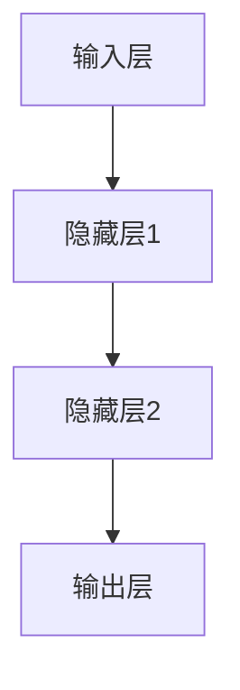
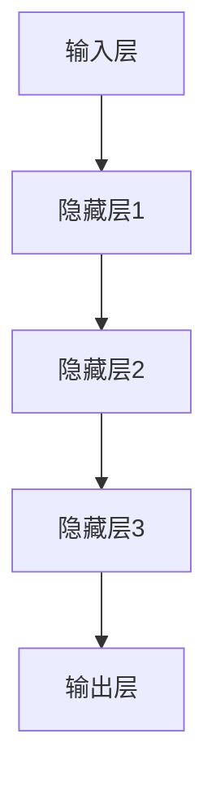

                 

## 《神经网络：人类智慧的解放》

> **关键词**：神经网络、人工智能、深度学习、激活函数、优化算法、图像识别、自然语言处理

> **摘要**：本文深入探讨了神经网络的起源、基本原理、激活函数、优化算法以及其在图像识别、自然语言处理、推荐系统、游戏AI和无人驾驶等领域的应用。通过详细的伪代码、数学模型和项目实战案例，本文旨在帮助读者全面理解神经网络的技术原理和实际应用，从而开启人类智慧的新篇章。

### 《神经网络：人类智慧的解放》目录大纲

- **第一部分：神经网络基础**
  - 第1章：神经网络的起源与原理
  - 第2章：前馈神经网络与反向传播算法
  - 第3章：激活函数与优化算法
  - 第4章：神经网络架构

- **第二部分：神经网络在应用领域的应用**
  - 第5章：神经网络在图像识别中的应用
  - 第6章：神经网络在自然语言处理中的应用
  - 第7章：神经网络在推荐系统中的应用
  - 第8章：神经网络在游戏AI中的应用
  - 第9章：神经网络在无人驾驶中的应用
  - 第10章：神经网络的未来展望

通过以上目录结构，本文将逐步带领读者探索神经网络的世界，从基础理论到实际应用，再到未来展望，力求全面而深入地解读这一革命性的人工智能技术。现在，让我们开始第一部分的探索。

### 第一部分：神经网络基础

神经网络作为人工智能的核心技术之一，其基础理论的深刻理解和正确应用对于推动人工智能的发展至关重要。本部分将详细探讨神经网络的起源、原理、数学基础以及常用的前馈神经网络和反向传播算法，为后续章节的内容打下坚实的基础。

#### 第1章：神经网络的起源与原理

##### 1.1 神经网络的起源

神经网络的起源可以追溯到生物学领域。人脑作为自然界中最复杂的计算系统，其信息处理能力和学习能力令人惊叹。科学家们试图通过模拟人脑的结构和功能来设计出一种具有类似能力的人工系统。1943年，心理学家McCulloch和数学家Pitts提出了第一个简化的人工神经元模型，即感知机（Perceptron），这标志着人工神经网络研究的开始。

随着计算机技术的发展，人工神经网络的研究逐渐进入数学和计算机科学领域。1958年，Frank Rosenblatt提出了多层的感知机模型，这为后来的神经网络研究奠定了基础。1986年，Rumelhart、Hinton和Williams等人提出了一种新的训练算法——反向传播算法（Backpropagation），使得多层感知机能够训练出复杂的非线性模型。

##### 1.2 神经网络的基本原理

神经网络由大量的简单计算单元——神经元（Neuron）组成，这些神经元通过连接（Connection）相互连接，形成一个大规模的并行计算网络。每个神经元可以接收多个输入信号，通过加权求和处理后产生一个输出信号。

神经元的模型通常包括以下三个部分：

1. **输入层（Input Layer）**：接收外部输入信息。
2. **隐藏层（Hidden Layer）**：对输入信息进行加工处理。
3. **输出层（Output Layer）**：产生最终的输出结果。

神经网络的层次结构如下图所示：


##### 1.3 前馈神经网络与感知机

前馈神经网络（Feedforward Neural Network）是一种常见的神经网络架构，其特点是信息流从输入层流向输出层，不形成循环。感知机是前馈神经网络的一种简化形式，它仅包含一个输入层和一个输出层，没有隐藏层。

感知机的模型可以表示为：

$$
y = f(\sum_{i=1}^{n} w_i x_i + b)
$$

其中，$x_i$ 是第 $i$ 个输入特征，$w_i$ 是连接权重，$b$ 是偏置项，$f$ 是激活函数。

感知机通过学习输入特征和输出标签之间的映射关系来进行分类或回归任务。在二分类问题中，常用的激活函数是阈值函数（Threshold Function）：

$$
f(x) = \begin{cases}
1, & \text{if } x \geq 0 \\
0, & \text{if } x < 0
\end{cases}
$$

##### 1.4 神经网络的数学基础

神经网络的运算涉及到微积分、线性代数和概率论与统计学的基础知识。

1. **微积分基础**：微积分在神经网络中主要用于优化问题，如损失函数的梯度计算和参数更新。
2. **线性代数基础**：线性代数提供了处理大规模矩阵运算的工具，如矩阵的乘法、求逆等，这些在神经网络中至关重要。
3. **概率论与统计学基础**：概率论和统计学用于处理随机事件和数据的分布，神经网络通过概率模型来学习数据的分布特征。

通过上述对神经网络起源和基本原理的介绍，我们为后续章节的内容奠定了理论基础。接下来，我们将进一步探讨神经网络的数学基础和常用算法，以帮助读者更深入地理解这一技术。

### 第1章：神经网络的起源与原理

#### 1.1 神经网络的起源

神经网络的起源可以追溯到生物学领域，特别是对生物神经系统的研究。人脑作为自然界中最复杂的计算系统，其信息处理能力和学习能力令人惊叹。科学家们试图通过模拟人脑的结构和功能来设计出一种具有类似能力的人工系统。

在1943年，心理学家Warren McCulloch和数学家Walter Pitts提出了第一个简化的人工神经元模型，即感知机（Perceptron）。感知机是一种二分类模型，其目的是通过学习输入特征和输出标签之间的映射关系来分类数据。这一模型奠定了人工神经网络研究的基础。

随着时间的推移，人工神经网络的研究逐渐从生物学领域扩展到数学和计算机科学领域。1958年，Frank Rosenblatt提出了多层的感知机模型，称为线性感知机（Linear Perceptron）。这一模型增加了隐藏层，使得神经网络能够处理更复杂的问题。

20世纪80年代，随着计算机技术的发展和大规模并行计算能力的提升，人工神经网络的研究取得了重大突破。1986年，Rumelhart、Hinton和Williams等人提出了反向传播算法（Backpropagation），使得多层感知机能够训练出复杂的非线性模型。这一算法通过梯度下降法来优化网络参数，从而实现模型的训练。

#### 1.2 神经网络的基本原理

神经网络由大量的简单计算单元——神经元（Neuron）组成，这些神经元通过连接（Connection）相互连接，形成一个大规模的并行计算网络。每个神经元可以接收多个输入信号，通过加权求和处理后产生一个输出信号。

神经元的模型通常包括以下三个部分：

1. **输入层（Input Layer）**：接收外部输入信息。每个输入特征都通过一个神经元表示。
2. **隐藏层（Hidden Layer）**：对输入信息进行加工处理。隐藏层中的每个神经元都会接收来自输入层和其他隐藏层的输入信号。
3. **输出层（Output Layer）**：产生最终的输出结果。输出层中的每个神经元都会根据隐藏层的输出信号产生一个输出值。

神经网络的层次结构如下图所示：


神经元之间的连接称为边（Edge），每个边都有一个权重（Weight），表示连接的强度。神经元的输入信号经过加权求和处理后，会通过激活函数（Activation Function）产生一个输出信号。

神经网络的运算过程可以分为以下几个步骤：

1. **前向传播（Forward Propagation）**：输入信号从输入层经过每一层隐藏层，最终传递到输出层。
2. **激活函数应用**：在每个隐藏层和输出层，输入信号会通过激活函数进行处理。
3. **计算输出结果**：输出层神经元的输出结果即为最终输出。
4. **反向传播（Back Propagation）**：根据输出结果和实际标签之间的误差，通过反向传播算法来更新神经网络的权重和偏置项。

#### 1.3 前馈神经网络与反向传播算法

前馈神经网络（Feedforward Neural Network）是一种常见的神经网络架构，其特点是信息流从输入层流向输出层，不形成循环。前馈神经网络通常包含一个或多个隐藏层，每个层都由多个神经元组成。

前馈神经网络的基本结构如下：


前馈神经网络的核心是激活函数和反向传播算法。激活函数用于引入非线性特性，使得神经网络能够解决非线性问题。常用的激活函数包括：

1. **Sigmoid函数**： 
   $$ 
   \sigma(x) = \frac{1}{1 + e^{-x}} 
   $$ 
   Sigmoid函数将输入值映射到（0, 1）区间，常用于二分类问题。

2. **ReLU函数**： 
   $$ 
   \text{ReLU}(x) = \max(0, x) 
   $$ 
  ReLU函数在输入为正时输出原值，输入为负时输出0，具有简单和计算效率高的特点。

反向传播算法（Backpropagation Algorithm）是一种基于梯度下降法的训练算法，用于优化神经网络的参数。反向传播算法通过以下步骤进行：

1. **前向传播**：计算输入信号通过神经网络的前向传播路径，得到输出结果。
2. **计算误差**：计算输出结果与实际标签之间的误差。
3. **计算梯度**：根据误差，计算网络中每个参数的梯度。
4. **参数更新**：根据梯度更新网络的权重和偏置项，减小误差。

反向传播算法的核心思想是利用链式法则（Chain Rule）计算梯度。通过反向传播算法，神经网络能够自动调整参数，从而优化模型的性能。

#### 1.4 感知机与多层前馈神经网络

感知机（Perceptron）是前馈神经网络的一种简化形式，仅包含一个输入层和一个输出层，没有隐藏层。感知机通过学习输入特征和输出标签之间的映射关系来进行分类或回归任务。

感知机的模型可以表示为：

$$ 
y = f(\sum_{i=1}^{n} w_i x_i + b) 
$$ 

其中，$x_i$ 是第 $i$ 个输入特征，$w_i$ 是连接权重，$b$ 是偏置项，$f$ 是激活函数。

在二分类问题中，常用的激活函数是阈值函数（Threshold Function）：

$$ 
f(x) = \begin{cases} 
1, & \text{if } x \geq 0 \\ 
0, & \text{if } x < 0 
\end{cases} 
$$ 

感知机能够处理线性可分的问题，但无法处理非线性问题。为了解决这一问题，科学家们提出了多层前馈神经网络。

多层前馈神经网络（Multi-layer Feedforward Neural Network）通过增加隐藏层来引入非线性特性，从而能够处理更复杂的问题。多层前馈神经网络的基本结构如下：


多层前馈神经网络通过前向传播和反向传播算法进行训练。前向传播用于计算输入信号在神经网络中的传播路径，反向传播用于计算误差和更新参数。

#### 1.5 小结

本章介绍了神经网络的起源、基本原理以及前馈神经网络和反向传播算法。神经网络通过模拟人脑的结构和功能，实现了对数据的处理和学习。前馈神经网络和反向传播算法为神经网络提供了有效的训练方法，使得神经网络能够解决复杂的非线性问题。

在接下来的章节中，我们将进一步探讨神经网络的数学基础、激活函数、优化算法以及神经网络在不同领域的应用。通过深入学习和理解这些内容，读者将能够更好地掌握神经网络的技术原理和应用。

### 第2章：前馈神经网络与反向传播算法

在前一章中，我们介绍了神经网络的起源和基本原理。本章将深入探讨前馈神经网络（Feedforward Neural Network）和反向传播算法（Backpropagation Algorithm），这两者是构建和训练神经网络的基石。

#### 2.1 前馈神经网络

前馈神经网络是一种信息从前向传递的网络结构，没有循环。这意味着输入信号从输入层经过隐藏层，最终传递到输出层。前馈神经网络通常包含一个或多个隐藏层，每个层都由多个神经元组成。

##### 2.1.1 神经网络的层次结构

一个简单的三层前馈神经网络（包括输入层、隐藏层和输出层）的层次结构如下：



在输入层，每个神经元接收一个输入特征；在隐藏层，每个神经元接收来自输入层的输入信号以及其他隐藏层的输入信号；在输出层，每个神经元产生一个输出结果。

##### 2.1.2 神经元之间的连接方式

神经元之间的连接方式称为边（Edge），每个边都有一个权重（Weight），表示连接的强度。这些权重通过学习算法进行调整，以最小化网络的误差。

在隐藏层和输出层之间，每个输出层神经元都连接到隐藏层中的每个神经元，形成一个全连接网络。这种结构使得神经网络能够处理复杂的非线性问题。

##### 2.1.3 激活函数

激活函数（Activation Function）用于引入非线性特性，使得神经网络能够解决非线性问题。常用的激活函数包括：

1. **Sigmoid函数**：
   $$ 
   \sigma(x) = \frac{1}{1 + e^{-x}} 
   $$ 
   Sigmoid函数将输入值映射到（0, 1）区间，常用于二分类问题。

2. **ReLU函数**：
   $$ 
   \text{ReLU}(x) = \max(0, x) 
   $$ 
   ReLU函数在输入为正时输出原值，输入为负时输出0，具有简单和计算效率高的特点。

3. **Tanh函数**：
   $$ 
   \tanh(x) = \frac{e^{2x} - 1}{e^{2x} + 1} 
   $$ 
   Tanh函数将输入值映射到（-1, 1）区间。

激活函数的选择会影响神经网络的性能和学习速度。在实际应用中，根据问题的具体需求，可以选择合适的激活函数。

#### 2.2 反向传播算法

反向传播算法（Backpropagation Algorithm）是一种基于梯度下降法的训练算法，用于优化神经网络的参数。反向传播算法通过以下步骤进行：

1. **前向传播**：计算输入信号通过神经网络的前向传播路径，得到输出结果。
2. **计算误差**：计算输出结果与实际标签之间的误差。
3. **计算梯度**：根据误差，计算网络中每个参数的梯度。
4. **参数更新**：根据梯度更新网络的权重和偏置项，减小误差。

反向传播算法的核心思想是利用链式法则（Chain Rule）计算梯度。通过反向传播算法，神经网络能够自动调整参数，从而优化模型的性能。

##### 2.2.1 反向传播算法的原理

假设有一个简单的两层神经网络，包括输入层和输出层。输入层有两个神经元，输出层有一个神经元。我们考虑一个二分类问题，输出层神经元的激活函数为Sigmoid函数。

前向传播过程如下：

1. **输入信号**：
   $$ 
   x_1, x_2 
   $$ 
2. **隐藏层输入**：
   $$ 
   h_1 = \sigma(w_{11} x_1 + w_{12} x_2 + b_1) 
   $$ 
   $$ 
   h_2 = \sigma(w_{21} x_1 + w_{22} x_2 + b_2) 
   $$ 
3. **输出层输入**：
   $$ 
   y = \sigma(w_1 h_1 + w_2 h_2 + b) 
   $$ 

其中，$w_{11}$、$w_{12}$、$w_{21}$、$w_{22}$、$b_1$、$b_2$、$w_1$、$w_2$ 和 $b$ 是神经网络的权重和偏置项。

误差计算如下：

1. **实际标签**：
   $$ 
   t 
   $$ 
2. **输出层误差**：
   $$ 
   \delta = \frac{\partial \text{Loss}}{\partial y} \cdot (1 - y) \cdot y 
   $$ 
   其中，$\text{Loss}$ 是损失函数，如均方误差（Mean Squared Error，MSE）或交叉熵（Cross-Entropy）。
3. **隐藏层误差**：
   $$ 
   \delta_h = w_1 \delta 
   $$ 

根据误差计算梯度：

1. **输出层权重梯度**：
   $$ 
   \frac{\partial \text{Loss}}{\partial w_1} = \delta \cdot h_1 
   $$ 
   $$ 
   \frac{\partial \text{Loss}}{\partial w_2} = \delta \cdot h_2 
   $$ 
2. **隐藏层权重梯度**：
   $$ 
   \frac{\partial \text{Loss}}{\partial w_{11}} = \delta_h \cdot x_1 
   $$ 
   $$ 
   \frac{\partial \text{Loss}}{\partial w_{12}} = \delta_h \cdot x_2 
   $$ 
   $$ 
   \frac{\partial \text{Loss}}{\partial w_{21}} = \delta_h \cdot x_1 
   $$ 
   $$ 
   \frac{\partial \text{Loss}}{\partial w_{22}} = \delta_h \cdot x_2 
   $$ 

根据梯度更新参数：

1. **输出层权重更新**：
   $$ 
   w_1 \leftarrow w_1 - \alpha \cdot \frac{\partial \text{Loss}}{\partial w_1} 
   $$ 
   $$ 
   w_2 \leftarrow w_2 - \alpha \cdot \frac{\partial \text{Loss}}{\partial w_2} 
   $$ 
2. **隐藏层权重更新**：
   $$ 
   w_{11} \leftarrow w_{11} - \alpha \cdot \frac{\partial \text{Loss}}{\partial w_{11}} 
   $$ 
   $$ 
   w_{12} \leftarrow w_{12} - \alpha \cdot \frac{\partial \text{Loss}}{\partial w_{12}} 
   $$ 
   $$ 
   w_{21} \leftarrow w_{21} - \alpha \cdot \frac{\partial \text{Loss}}{\partial w_{21}} 
   $$ 
   $$ 
   w_{22} \leftarrow w_{22} - \alpha \cdot \frac{\partial \text{Loss}}{\partial w_{22}} 
   $$ 

其中，$\alpha$ 是学习率（Learning Rate），控制参数更新的幅度。

##### 2.2.2 反向传播算法的实现

反向传播算法可以通过以下伪代码实现：

```python
# 前向传播
def forwardpropagation(x, weights):
    h1 = sigmoid(dot_product(x, weights["h1"]))
    h2 = sigmoid(dot_product(x, weights["h2"]))
    y = sigmoid(dot_product(h1, weights["y"]))
    return y

# 反向传播
def backwardpropagation(t, y, weights):
    error = t - y
    delta = error * sigmoid_derivative(y)
    dW_y = delta * h1
    dW_h2 = delta * h2

    error_h = dot_product(delta, weights["y"])
    delta_h = error_h * sigmoid_derivative(h2)
    dW_h1 = delta_h * x
    dW_h2 = delta_h * x

    # 更新参数
    weights["y"] -= learning_rate * dW_y
    weights["h1"] -= learning_rate * dW_h1
    weights["h2"] -= learning_rate * dW_h2

# 激活函数
def sigmoid(x):
    return 1 / (1 + e^{-x})

def sigmoid_derivative(x):
    return x * (1 - x)
```

通过上述伪代码，我们可以看到反向传播算法的核心步骤，包括前向传播、误差计算、梯度计算和参数更新。

#### 2.3 深度神经网络

深度神经网络（Deep Neural Network，DNN）是具有多个隐藏层的神经网络。深度神经网络通过增加隐藏层的数量来提高模型的非线性表示能力，从而能够解决更复杂的问题。

##### 2.3.1 深度神经网络的层次结构

一个简单的深度神经网络，包括输入层、多个隐藏层和输出层，如下所示：



在深度神经网络中，每个隐藏层都对前一层的信息进行处理，并将处理后的信息传递给下一层。这种层次结构使得深度神经网络能够学习更复杂的特征和模式。

##### 2.3.2 深度神经网络的优势

深度神经网络具有以下优势：

1. **强大的非线性表示能力**：通过增加隐藏层的数量，深度神经网络可以学习更复杂的非线性特征。
2. **自动特征提取**：深度神经网络可以通过训练自动提取有用的特征，减少了人工特征提取的步骤。
3. **适应性**：深度神经网络可以应用于多种类型的数据和问题，如图像、文本和语音等。
4. **高效计算**：现代计算硬件，如GPU和TPU，可以加速深度神经网络的训练和推断过程。

##### 2.3.3 深度神经网络的挑战

深度神经网络也面临一些挑战：

1. **过拟合**：深度神经网络容易过拟合训练数据，导致在未知数据上的表现不佳。
2. **训练时间**：深度神经网络的训练时间可能非常长，特别是在大型数据集上。
3. **资源消耗**：深度神经网络需要大量的计算资源和存储空间。

为了解决这些挑战，研究人员提出了许多改进方法，如正则化、数据增强、预训练等。

#### 2.4 小结

本章介绍了前馈神经网络和反向传播算法。前馈神经网络通过层次结构、神经元之间的连接和激活函数来实现信息的传递和处理。反向传播算法通过前向传播、误差计算、梯度计算和参数更新来实现神经网络的训练。

在接下来的章节中，我们将进一步探讨激活函数、优化算法和神经网络架构，为理解神经网络的应用提供更全面的视角。

### 第3章：激活函数与优化算法

在前两章中，我们介绍了神经网络的起源、基本原理以及前馈神经网络和反向传播算法。本章将深入探讨激活函数和优化算法，这些是神经网络训练过程中至关重要的一部分。

#### 3.1 激活函数

激活函数（Activation Function）是神经网络中的关键组件，用于引入非线性特性。通过激活函数，神经网络能够从线性模型中解脱出来，处理更复杂的非线性问题。常用的激活函数包括Sigmoid函数、Tanh函数和ReLU函数。

##### 3.1.1 Sigmoid函数

Sigmoid函数是最早使用的激活函数之一，其表达式为：

$$
\sigma(x) = \frac{1}{1 + e^{-x}}
$$

Sigmoid函数将输入值映射到（0, 1）区间，非常适合用于二分类问题。然而，Sigmoid函数存在以下问题：

1. **梯度消失**：当输入值较大或较小时，Sigmoid函数的梯度接近于0，导致反向传播时梯度消失。
2. **训练缓慢**：由于梯度消失问题，Sigmoid函数的训练速度较慢。

##### 3.1.2 Tanh函数

Tanh函数是Sigmoid函数的改进版，其表达式为：

$$
\tanh(x) = \frac{e^{2x} - 1}{e^{2x} + 1}
$$

Tanh函数将输入值映射到（-1, 1）区间，类似于Sigmoid函数，但也存在梯度消失问题。

##### 3.1.3 ReLU函数

ReLU函数（Rectified Linear Unit）是近年来广泛使用的激活函数，其表达式为：

$$
\text{ReLU}(x) = \max(0, x)
$$

ReLU函数在输入为正时输出原值，输入为负时输出0。ReLU函数具有以下优点：

1. **简单和计算高效**：ReLU函数的计算非常简单，不需要进行指数运算。
2. **梯度保持**：ReLU函数的梯度在输入为正时为1，在输入为负时为0。这种特性使得ReLU函数能够避免梯度消失问题，加速训练过程。
3. **稀疏性**：ReLU函数在训练过程中引入了稀疏性，有助于提高模型的泛化能力。

尽管ReLU函数具有上述优点，但它也存在一些缺点，如死神经元问题。当输入值较小且接近0时，ReLU函数的梯度为0，导致神经元无法更新参数。

##### 3.1.4 Leaky ReLU函数

为了解决ReLU函数的死神经元问题，研究人员提出了Leaky ReLU函数。Leaky ReLU函数的表达式为：

$$
\text{Leaky ReLU}(x) = \max(0.01x, x)
$$

Leaky ReLU函数在输入为负时引入一个很小的正值，从而避免了死神经元问题。这使得Leaky ReLU函数在训练过程中更加稳定。

##### 3.1.5ReLU6函数

ReLU6函数是对ReLU函数的改进，其表达式为：

$$
\text{ReLU6}(x) = \max(0, \min(x, 6))
$$

ReLU6函数在输入值大于6时输出6，从而避免了梯度消失问题，同时保持了ReLU函数的其他优点。

#### 3.2 优化算法

优化算法（Optimization Algorithm）用于调整神经网络中的参数，以最小化损失函数。常用的优化算法包括梯度下降法、动量法和Adam优化器。

##### 3.2.1 梯度下降法

梯度下降法是一种最简单的优化算法，其核心思想是沿着损失函数的梯度方向更新参数，以减小损失函数的值。梯度下降法的基本步骤如下：

1. **前向传播**：计算输入信号通过神经网络的前向传播路径，得到输出结果。
2. **计算损失**：计算输出结果与实际标签之间的损失。
3. **计算梯度**：计算损失函数对每个参数的梯度。
4. **参数更新**：根据梯度更新参数。

梯度下降法的更新公式为：

$$
\theta \leftarrow \theta - \alpha \cdot \nabla_\theta J(\theta)
$$

其中，$\theta$ 表示参数，$\alpha$ 表示学习率，$J(\theta)$ 表示损失函数。

##### 3.2.2 动量法

动量法（Momentum）是梯度下降法的一种改进，其核心思想是引入一个动量项，以加速梯度下降的过程。动量法的更新公式为：

$$
v \leftarrow \beta v - \alpha \cdot \nabla_\theta J(\theta)
$$

$$
\theta \leftarrow \theta + v
$$

其中，$v$ 表示动量项，$\beta$ 表示动量因子。

动量法通过累加权重的更新方向，从而减少了参数更新的振荡，提高了收敛速度。

##### 3.2.3 Adam优化器

Adam优化器（Adaptive Moment Estimation）是一种自适应优化算法，它结合了梯度下降法和动量法的特点。Adam优化器通过估计梯度的一阶矩（均值）和二阶矩（方差）来自适应调整学习率。Adam优化器的更新公式为：

$$
m_t \leftarrow \beta_1 m_{t-1} + (1 - \beta_1) \nabla_\theta J(\theta)
$$

$$
v_t \leftarrow \beta_2 v_{t-1} + (1 - \beta_2) (\nabla_\theta J(\theta))^2
$$

$$
\theta \leftarrow \theta - \alpha \cdot \frac{m_t}{\sqrt{v_t} + \epsilon}
$$

其中，$m_t$ 和 $v_t$ 分别表示一阶矩和二阶矩的估计值，$\beta_1$ 和 $\beta_2$ 分别表示一阶矩和二阶矩的指数衰减率，$\epsilon$ 是一个很小的常数，用于防止分母为零。

Adam优化器在训练过程中能够自适应调整学习率，从而提高了收敛速度和模型的性能。

#### 3.3 小结

本章介绍了激活函数和优化算法，这些是神经网络训练过程中的关键组件。激活函数用于引入非线性特性，以处理复杂的非线性问题。常用的激活函数包括Sigmoid函数、Tanh函数、ReLU函数、Leaky ReLU函数和ReLU6函数。优化算法用于调整神经网络的参数，以最小化损失函数。常用的优化算法包括梯度下降法、动量法和Adam优化器。

在接下来的章节中，我们将进一步探讨神经网络的不同架构，如卷积神经网络（CNN）、循环神经网络（RNN）和生成对抗网络（GAN），以及神经网络在图像识别、自然语言处理、推荐系统、游戏AI和无人驾驶等领域的应用。

### 第4章：神经网络架构

在了解了神经网络的基础原理和训练算法后，接下来我们将深入探讨几种典型的神经网络架构。这些架构包括卷积神经网络（CNN）、循环神经网络（RNN）和生成对抗网络（GAN）。每种架构都有其独特的结构和应用场景，能够处理不同类型的数据和任务。

#### 4.1 卷积神经网络（CNN）

卷积神经网络（Convolutional Neural Network，CNN）是一种专门用于处理图像数据的神经网络架构。其核心思想是利用卷积运算和池化操作来提取图像中的局部特征，从而实现图像分类、目标检测和图像生成等任务。

##### 4.1.1 卷积神经网络的基本结构

卷积神经网络的基本结构包括以下几个部分：

1. **卷积层（Convolutional Layer）**：卷积层是CNN的核心部分，通过卷积运算提取图像的局部特征。每个卷积核（Convolutional Kernel）可以提取一种特定的特征。卷积层通常包含多个卷积核，以提取不同类型的特征。

2. **激活函数（Activation Function）**：激活函数用于引入非线性特性，常见的激活函数有ReLU函数和Sigmoid函数。

3. **池化层（Pooling Layer）**：池化层通过下采样操作减少数据的维度，同时保留最重要的特征信息。常见的池化操作有最大池化（Max Pooling）和平均池化（Average Pooling）。

4. **全连接层（Fully Connected Layer）**：全连接层将卷积层和池化层输出的特征映射到分类或回归结果。在全连接层之前，通常会使用 flatten 操作将多维特征展平为一维特征。

5. **输出层（Output Layer）**：输出层根据具体的任务类型（如分类或回归）使用适当的激活函数（如Softmax函数或线性函数）产生最终输出结果。

##### 4.1.2 卷积神经网络的核心概念

卷积神经网络的核心概念包括卷积运算、池化操作和深度可分离卷积。

1. **卷积运算**：卷积运算通过卷积核与输入图像进行点积运算，提取图像中的局部特征。卷积核的大小和数量决定了特征图的维度。

2. **池化操作**：池化操作通过下采样操作减少数据的维度，同时保留最重要的特征信息。最大池化操作选取每个区域中的最大值，而平均池化操作计算每个区域中的平均值。

3. **深度可分离卷积**：深度可分离卷积将卷积操作分解为深度卷积和逐点卷积。深度卷积用于逐通道卷积，逐点卷积用于逐元素卷积，从而减少了计算量，提高了计算效率。

##### 4.1.3 卷积神经网络的应用场景

卷积神经网络在图像识别、目标检测和图像生成等领域有广泛的应用。

1. **图像识别**：卷积神经网络可以用于对图像进行分类。例如，在ImageNet竞赛中，卷积神经网络取得了突破性的成绩。

2. **目标检测**：卷积神经网络可以用于检测图像中的目标物体。常见的目标检测算法有Faster R-CNN、SSD和YOLO。

3. **图像生成**：卷积神经网络可以用于生成新的图像。例如，生成对抗网络（GAN）通过训练生成器网络和判别器网络，生成具有真实感的图像。

#### 4.2 循环神经网络（RNN）

循环神经网络（Recurrent Neural Network，RNN）是一种能够处理序列数据的神经网络架构。其核心思想是将当前输入与历史状态相结合，从而实现序列数据的建模。

##### 4.2.1 循环神经网络的基本结构

循环神经网络的基本结构包括以下几个部分：

1. **隐藏层（Hidden Layer）**：隐藏层包含一系列的循环单元，每个循环单元都包含一个神经元。

2. **输入门（Input Gate）**：输入门用于更新隐藏状态，通过一个sigmoid函数和一个线性变换计算新的输入值。

3. **遗忘门（Forget Gate）**：遗忘门用于控制当前隐藏状态中哪些信息需要保留，哪些信息需要丢弃，通过一个sigmoid函数和一个线性变换计算遗忘门。

4. **输出门（Output Gate）**：输出门用于控制当前隐藏状态中哪些信息需要输出，通过一个sigmoid函数和一个线性变换计算输出门。

5. **隐藏状态（Hidden State）**：隐藏状态是循环神经网络的核心部分，用于存储历史信息。

##### 4.2.2 循环神经网络的核心概念

循环神经网络的核心概念包括状态转移方程、遗忘门和输入门。

1. **状态转移方程**：状态转移方程描述了当前隐藏状态与历史隐藏状态之间的关系。例如，对于LSTM（长短时记忆网络），状态转移方程为：

$$
\begin{aligned}
i_t &= \sigma(W_i [h_{t-1}, x_t] + b_i) \\
f_t &= \sigma(W_f [h_{t-1}, x_t] + b_f) \\
\bar{c}_t &= \tanh(W_c [h_{t-1}, x_t] + b_c) \\
c_t &= f_t \odot c_{t-1} + i_t \odot \bar{c}_t \\
o_t &= \sigma(W_o [h_{t-1}, x_t] + b_o) \\
h_t &= o_t \odot \tanh(c_t)
\end{aligned}
$$

其中，$i_t$、$f_t$、$c_t$ 和 $o_t$ 分别表示输入门、遗忘门、单元状态和输出门。

2. **遗忘门**：遗忘门用于控制当前隐藏状态中哪些信息需要保留，哪些信息需要丢弃。通过遗忘门，神经网络能够有效地遗忘不重要的历史信息。

3. **输入门**：输入门用于更新隐藏状态，通过输入门，神经网络能够引入新的信息。

##### 4.2.3 循环神经网络的应用场景

循环神经网络在自然语言处理、语音识别和时间序列分析等领域有广泛的应用。

1. **自然语言处理**：循环神经网络可以用于处理自然语言序列数据，如文本分类、机器翻译和情感分析。

2. **语音识别**：循环神经网络可以用于将语音信号转换为文本，广泛应用于语音助手、智能客服等场景。

3. **时间序列分析**：循环神经网络可以用于处理时间序列数据，如股票价格预测、气象预测等。

#### 4.3 生成对抗网络（GAN）

生成对抗网络（Generative Adversarial Network，GAN）是一种由生成器和判别器组成的对抗性神经网络架构。其核心思想是通过生成器和判别器的对抗性训练，生成具有真实感的图像。

##### 4.3.1 生成对抗网络的基本结构

生成对抗网络的基本结构包括以下几个部分：

1. **生成器（Generator）**：生成器网络将随机噪声转换为真实的图像。

2. **判别器（Discriminator）**：判别器网络用于区分真实图像和生成图像。

3. **损失函数**：生成对抗网络的损失函数通常由两部分组成：生成器损失和判别器损失。生成器损失用于优化生成器的生成能力，判别器损失用于优化判别器的分类能力。

##### 4.3.2 生成对抗网络的核心概念

生成对抗网络的核心概念包括生成器和判别器的对抗性训练。

1. **生成器**：生成器的目标是生成尽可能真实的图像，使得判别器无法区分生成图像和真实图像。

2. **判别器**：判别器的目标是正确分类真实图像和生成图像。如果生成器生成的图像足够真实，那么判别器将无法准确分类。

3. **对抗性训练**：生成器和判别器之间进行对抗性训练，生成器的目标是最大化判别器的分类错误，判别器的目标是最大化生成器和真实图像之间的差距。

##### 4.3.3 生成对抗网络的应用场景

生成对抗网络在图像生成、图像修复和风格迁移等领域有广泛的应用。

1. **图像生成**：生成对抗网络可以生成高质量的图像，广泛应用于艺术创作、虚拟现实和游戏等领域。

2. **图像修复**：生成对抗网络可以用于修复破损的图像，如老照片修复、人脸修复等。

3. **风格迁移**：生成对抗网络可以将一种艺术风格应用到另一幅图像上，如将普通照片转换为艺术画作。

#### 4.4 小结

本章介绍了卷积神经网络、循环神经网络和生成对抗网络这三种典型的神经网络架构。卷积神经网络适合处理图像数据，循环神经网络适合处理序列数据，生成对抗网络适合生成和修复图像。每种架构都有其独特的结构和应用场景，能够处理不同类型的数据和任务。在接下来的章节中，我们将进一步探讨神经网络在不同领域的应用。

### 第二部分：神经网络在应用领域的应用

在第一部分中，我们详细探讨了神经网络的基础理论、激活函数和优化算法，以及几种典型的神经网络架构。接下来，我们将进入第二部分，探讨神经网络在各个应用领域的应用，包括图像识别、自然语言处理、推荐系统、游戏AI和无人驾驶。这些应用领域展示了神经网络如何通过技术创新，推动人工智能的发展。

#### 第5章：神经网络在图像识别中的应用

图像识别是计算机视觉领域的一个重要分支，神经网络，特别是卷积神经网络（CNN），在这一领域中发挥了巨大作用。通过学习图像中的特征，神经网络能够实现对图像的准确分类和识别。

##### 5.1 图像识别基础

图像识别的基础是图像特征提取。传统的图像识别方法通常依赖于手工设计的特征，如边缘检测、角点检测和纹理特征。然而，神经网络通过自动学习图像特征，能够实现更高层次的抽象和分类。

图像识别的基本流程包括：

1. **图像预处理**：包括缩放、裁剪、灰度化等操作，以适应神经网络的输入要求。
2. **特征提取**：神经网络通过卷积层和池化层提取图像的局部特征。
3. **特征融合**：将多个卷积层和池化层的特征进行融合，形成更高级的特征表示。
4. **分类与识别**：使用全连接层和激活函数对图像进行分类和识别。

##### 5.2 卷积神经网络在图像识别中的应用

卷积神经网络（CNN）在图像识别中具有显著的优势，其结构特别适合处理图像数据。

1. **卷积层**：卷积层通过卷积运算提取图像的局部特征。卷积核的大小和数量决定了特征图的维度。每个卷积核可以提取一种特定的特征，如边缘、纹理等。
   
2. **激活函数**：激活函数用于引入非线性特性，常见的激活函数有ReLU函数。

3. **池化层**：池化层通过下采样操作减少数据的维度，同时保留最重要的特征信息。最大池化和平均池化是最常用的池化操作。

4. **全连接层**：全连接层将卷积层和池化层输出的特征映射到分类或回归结果。

5. **输出层**：输出层根据具体的任务类型（如分类或回归）使用适当的激活函数（如Softmax函数或线性函数）产生最终输出结果。

##### 5.3 卷积神经网络在图像识别中的应用案例

卷积神经网络在图像识别领域有许多成功的应用案例：

1. **人脸识别**：人脸识别是一种常见的图像识别任务，通过卷积神经网络提取人脸特征，实现人脸的准确识别。

2. **物体检测**：物体检测是图像识别中的另一个重要任务，通过卷积神经网络识别图像中的物体，并定位物体的位置。

3. **图像分类**：图像分类是将图像分配到预定义的类别中，卷积神经网络通过学习大量的图像数据，能够实现高精度的图像分类。

4. **图像分割**：图像分割是将图像划分为不同的区域，每个区域具有特定的特征。卷积神经网络通过学习图像中的边界和特征，能够实现精确的图像分割。

##### 5.4 小结

本章介绍了神经网络在图像识别中的应用，包括图像识别的基础、卷积神经网络的基本原理以及在图像识别中的应用案例。通过卷积神经网络，图像识别任务取得了显著的进展，为计算机视觉领域带来了革命性的变化。在下一章中，我们将探讨神经网络在自然语言处理中的应用。

### 第6章：神经网络在自然语言处理中的应用

自然语言处理（Natural Language Processing，NLP）是人工智能领域的一个重要分支，它涉及到从人类语言中提取信息、理解和生成语言。神经网络，尤其是循环神经网络（RNN）和生成对抗网络（GAN），在自然语言处理中发挥了关键作用。

##### 6.1 自然语言处理基础

自然语言处理的基本任务包括文本分类、情感分析、命名实体识别、机器翻译和语音识别等。这些任务都需要对语言进行建模和理解。

1. **文本分类**：文本分类是将文本数据分配到预定义的类别中，例如垃圾邮件检测、新闻分类等。

2. **情感分析**：情感分析是判断文本中表达的情感倾向，如正面、负面或中性。

3. **命名实体识别**：命名实体识别是从文本中识别出具有特定意义的实体，如人名、地名、组织名等。

4. **机器翻译**：机器翻译是将一种语言的文本翻译成另一种语言的文本。

5. **语音识别**：语音识别是将语音信号转换为文本。

##### 6.2 循环神经网络在自然语言处理中的应用

循环神经网络（RNN）是一种能够处理序列数据的神经网络，特别适合自然语言处理任务。

1. **RNN的基本结构**：RNN的基本结构包括输入层、隐藏层和输出层。隐藏层中的每个神经元都连接到前一层和后一层，形成循环结构。

2. **状态转移方程**：RNN的状态转移方程描述了当前隐藏状态与历史隐藏状态之间的关系。例如，对于LSTM（长短时记忆网络），状态转移方程为：

$$
\begin{aligned}
i_t &= \sigma(W_i [h_{t-1}, x_t] + b_i) \\
f_t &= \sigma(W_f [h_{t-1}, x_t] + b_f) \\
\bar{c}_t &= \tanh(W_c [h_{t-1}, x_t] + b_c) \\
c_t &= f_t \odot c_{t-1} + i_t \odot \bar{c}_t \\
o_t &= \sigma(W_o [h_{t-1}, x_t] + b_o) \\
h_t &= o_t \odot \tanh(c_t)
\end{aligned}
$$

其中，$i_t$、$f_t$、$c_t$ 和 $o_t$ 分别表示输入门、遗忘门、单元状态和输出门。

3. **应用场景**：RNN在自然语言处理中有很多应用场景，如文本分类、机器翻译和语音识别。

##### 6.3 循环神经网络在自然语言处理中的应用案例

循环神经网络在自然语言处理中取得了许多成功案例：

1. **文本分类**：通过训练循环神经网络，可以实现对文本的准确分类。例如，可以使用RNN对新闻进行分类，将其分配到不同的主题类别中。

2. **机器翻译**：循环神经网络通过学习源语言和目标语言之间的映射关系，可以实现对文本的准确翻译。例如，使用RNN进行中英文互译，提高翻译质量。

3. **语音识别**：循环神经网络可以用于将语音信号转换为文本，广泛应用于语音助手、智能客服等场景。

##### 6.4 生成对抗网络在自然语言处理中的应用

生成对抗网络（GAN）是一种能够生成高质量文本的神经网络架构。

1. **GAN的基本结构**：GAN由生成器和判别器组成。生成器生成文本，判别器判断文本是否真实。

2. **应用场景**：GAN在自然语言处理中有很多应用场景，如文本生成、文本修复和风格迁移。

3. **应用案例**：使用GAN可以生成高质量的文本，如生成小说、新闻和诗歌等。此外，GAN还可以用于修复破损的文本，如修复古文献和手写文本。

##### 6.5 小结

本章介绍了神经网络在自然语言处理中的应用，包括自然语言处理的基础、循环神经网络的基本原理以及在自然语言处理中的应用案例。通过循环神经网络和生成对抗网络，自然语言处理任务取得了显著的进展，为人工智能的发展带来了新的可能性。在下一章中，我们将探讨神经网络在推荐系统中的应用。

### 第7章：神经网络在推荐系统中的应用

推荐系统是人工智能领域的重要应用之一，它通过预测用户对特定项目的喜好来提供个性化的推荐。神经网络，特别是深度学习模型，已经在推荐系统中取得了显著的效果，极大地提升了推荐系统的准确性和效率。

##### 7.1 推荐系统基础

推荐系统的核心是预测用户与项目之间的相关性，从而为用户提供个性化的推荐。推荐系统通常分为基于内容的推荐和协同过滤推荐。

1. **基于内容的推荐**：基于内容的推荐通过分析项目的内容特征和用户的兴趣特征，为用户提供相似的推荐。这种方法依赖于手工定义的特征，如文本、标签、描述等。

2. **协同过滤推荐**：协同过滤推荐通过分析用户之间的行为模式，为用户提供相似的推荐。协同过滤推荐分为两种类型：基于用户的协同过滤和基于项目的协同过滤。

   - **基于用户的协同过滤**：基于用户的协同过滤通过分析用户之间的相似度，为用户提供相似用户的喜好推荐。
   - **基于项目的协同过滤**：基于项目的协同过滤通过分析项目之间的相似度，为用户提供相似项目的推荐。

##### 7.2 神经网络在推荐系统中的应用

神经网络在推荐系统中的应用主要体现在深度学习模型的设计和实现上。深度学习模型通过学习大量的用户行为数据，能够自动提取有效的特征，从而提高推荐系统的准确性和效率。

1. **神经网络模型**：神经网络模型在推荐系统中通常用于预测用户对项目的喜好。常见的神经网络模型包括卷积神经网络（CNN）、循环神经网络（RNN）和生成对抗网络（GAN）。

   - **卷积神经网络（CNN）**：CNN在推荐系统中的应用主要体现在图像识别和特征提取上。通过卷积神经网络，可以提取用户行为数据的图像特征，从而提高推荐系统的准确性。
   - **循环神经网络（RNN）**：RNN在推荐系统中的应用主要体现在处理序列数据上。通过循环神经网络，可以处理用户的历史行为数据，从而提高推荐系统的个性化程度。
   - **生成对抗网络（GAN）**：GAN在推荐系统中的应用主要体现在数据增强和生成上。通过生成对抗网络，可以生成更多的用户行为数据，从而提高推荐系统的训练效果。

2. **深度学习模型**：深度学习模型在推荐系统中的应用主要体现在模型设计和实现上。常见的深度学习模型包括深度信念网络（DBN）、深度卷积神经网络（DCNN）和深度循环神经网络（DRNN）。

   - **深度信念网络（DBN）**：DBN是一种基于深度信念网络的深度学习模型，可以自动提取用户行为数据的特征。
   - **深度卷积神经网络（DCNN）**：DCNN是一种基于卷积神经网络和深度信念网络的深度学习模型，可以处理图像和文本数据。
   - **深度循环神经网络（DRNN）**：DRNN是一种基于循环神经网络和深度信念网络的深度学习模型，可以处理序列数据。

##### 7.3 神经网络在推荐系统中的应用案例

神经网络在推荐系统中的应用取得了许多成功案例：

1. **电商平台推荐**：电商平台通过使用神经网络模型，可以准确预测用户对商品的喜好，从而为用户提供个性化的商品推荐，提高用户的购物体验。
2. **音乐推荐**：音乐平台通过使用神经网络模型，可以预测用户对音乐曲目的喜好，从而为用户提供个性化的音乐推荐，提高用户的听歌体验。
3. **新闻推荐**：新闻平台通过使用神经网络模型，可以预测用户对新闻的兴趣，从而为用户提供个性化的新闻推荐，提高用户的阅读体验。

##### 7.4 小结

本章介绍了神经网络在推荐系统中的应用，包括推荐系统的基础、神经网络模型以及神经网络在推荐系统中的应用案例。通过神经网络，推荐系统可以更加准确地预测用户对项目的喜好，为用户提供个性化的推荐。在下一章中，我们将探讨神经网络在游戏AI中的应用。

### 第8章：神经网络在游戏AI中的应用

游戏人工智能（Game AI）是人工智能领域的一个重要分支，它旨在通过算法和模型来模拟和增强游戏中的智能行为。神经网络，特别是生成对抗网络（GAN），在游戏AI中的应用取得了显著成果，为游戏设计、游戏体验和游戏AI的发展带来了新的可能性。

##### 8.1 游戏AI基础

游戏AI的基本概念包括规则基础AI、行为树AI和基于学习的AI。基于学习的AI是游戏AI的发展方向，通过机器学习和深度学习技术，游戏AI可以模拟复杂的人类行为，提高游戏体验。

1. **规则基础AI**：规则基础AI通过定义一系列规则来模拟游戏中的智能行为。这种方法简单有效，但难以处理复杂的游戏场景。
2. **行为树AI**：行为树AI是一种基于决策树的方法，通过组合不同的行为来模拟智能行为。行为树AI在处理中等复杂度的游戏场景中表现出色。
3. **基于学习的AI**：基于学习的AI通过机器学习和深度学习技术，从大量的游戏数据中学习策略和行为。这种方法能够模拟复杂的人类行为，为游戏AI带来更高的智能水平。

##### 8.2 生成对抗网络在游戏AI中的应用

生成对抗网络（GAN）是一种由生成器和判别器组成的对抗性神经网络架构，特别适合处理游戏AI中的生成和生成任务。

1. **生成器（Generator）**：生成器网络用于生成游戏场景、角色和动作等。通过学习大量的游戏数据，生成器可以生成高质量的游戏内容，为游戏设计提供丰富的素材。
2. **判别器（Discriminator）**：判别器网络用于区分真实数据和生成数据。通过对抗训练，生成器和判别器相互竞争，生成器不断提高生成数据的质量，判别器不断提高识别生成数据的能力。

##### 8.3 生成对抗网络在游戏AI中的应用案例

生成对抗网络在游戏AI中的应用取得了许多成功案例：

1. **游戏场景生成**：通过生成对抗网络，可以自动生成各种类型的游戏场景，如城市、森林和太空等。这些场景可以用于游戏设计、游戏测试和游戏演示，提高开发效率和游戏体验。
2. **角色生成**：通过生成对抗网络，可以自动生成各种类型的角色，如人类、怪兽和机器人等。这些角色可以用于游戏角色设计、角色扮演游戏和虚拟现实游戏，提供更加丰富的游戏体验。
3. **游戏动作生成**：通过生成对抗网络，可以自动生成各种类型的游戏动作，如奔跑、跳跃和攻击等。这些动作可以用于游戏设计、游戏测试和游戏演示，提高游戏的可玩性和趣味性。

##### 8.4 小结

本章介绍了神经网络在游戏AI中的应用，包括游戏AI的基础和生成对抗网络在游戏AI中的应用案例。通过生成对抗网络，游戏AI可以自动生成游戏场景、角色和动作，为游戏设计、游戏体验和游戏AI的发展提供了新的可能性。在下一章中，我们将探讨神经网络在无人驾驶中的应用。

### 第9章：神经网络在无人驾驶中的应用

无人驾驶技术是人工智能领域的核心应用之一，它通过模拟人类的驾驶行为，实现车辆在复杂环境下的自主驾驶。神经网络，尤其是卷积神经网络（CNN）和深度学习模型，在无人驾驶系统中扮演了关键角色，极大地提升了无人驾驶的安全性和可靠性。

##### 9.1 无人驾驶基础

无人驾驶技术的基本概念包括感知、决策和执行三个核心部分：

1. **感知**：感知是无人驾驶系统的第一步，它通过传感器（如激光雷达、摄像头和雷达）收集环境数据，识别道路、车辆、行人等对象，并理解这些对象的状态和运动轨迹。
2. **决策**：决策是基于感知数据，通过算法和模型对车辆的动作进行规划。这包括路径规划、避障和车辆控制等。
3. **执行**：执行是将决策转化为实际的车辆操作，如加速、减速和转向等。

##### 9.2 卷积神经网络在无人驾驶中的应用

卷积神经网络（CNN）在无人驾驶系统中主要用于图像识别和目标检测，通过学习大量的图像数据，CNN能够提取出图像中的关键特征，实现对环境的准确理解和识别。

1. **图像识别**：通过CNN，可以识别道路、车辆、行人等对象。图像识别的结果用于路径规划和避障决策。
2. **目标检测**：目标检测是识别图像中的对象，并确定对象的位置。在无人驾驶系统中，目标检测用于识别和跟踪道路上的车辆、行人等对象，为决策提供依据。

##### 9.3 卷积神经网络在无人驾驶中的应用案例

卷积神经网络在无人驾驶系统中有许多成功应用案例：

1. **自动驾驶汽车**：自动驾驶汽车使用CNN对道路、车辆和行人进行识别和检测，从而实现车辆的自主驾驶。特斯拉的自动驾驶系统就是基于CNN实现的。
2. **无人驾驶卡车**：无人驾驶卡车通过CNN和激光雷达数据，实现道路的识别、车辆的跟踪和障碍物的检测，从而实现长距离的自主驾驶。
3. **无人机导航**：无人机导航系统使用CNN对摄像头捕捉的图像进行处理，实现无人机的自主飞行和避障。

##### 9.4 小结

本章介绍了神经网络在无人驾驶中的应用，包括无人驾驶的基础和卷积神经网络在无人驾驶中的应用案例。通过神经网络，无人驾驶系统能够实现对环境的准确理解和识别，从而实现安全、可靠的自主驾驶。在下一章中，我们将探讨神经网络的未来展望。

### 第10章：神经网络的未来展望

随着人工智能技术的快速发展，神经网络作为其核心组件，正不断推动着计算能力的边界。本章将探讨神经网络的未来发展趋势、在行业应用中的挑战与机遇，以及跨领域融合中的前景。

#### 10.1 神经网络的发展趋势

神经网络的未来发展趋势体现在以下几个方面：

1. **新型神经网络架构**：研究人员正在探索新的神经网络架构，如Transformer、图神经网络（Graph Neural Networks，GNN）和混合模型，以提高模型的效率和准确性。
2. **硬件加速与分布式训练**：随着硬件技术的发展，如GPU、TPU和FPGA等专用硬件，神经网络训练的速度和规模得到了显著提升。分布式训练和并行计算技术使得大规模神经网络的训练变得更加高效。
3. **自监督学习和无监督学习**：自监督学习和无监督学习是减少标注数据需求的重要方法。通过自监督学习，模型可以在未标记的数据中自动学习特征。无监督学习则通过探索数据中的内在结构来提高模型的泛化能力。
4. **强化学习与决策制定**：强化学习在神经网络中的应用日益广泛，特别是在需要决策制定的场景中，如无人驾驶、游戏AI和机器人控制。神经网络通过学习奖励函数和策略，实现更加智能的决策。

#### 10.2 神经网络在行业应用中的挑战与机遇

神经网络在行业应用中面临着一系列挑战与机遇：

1. **挑战**：
   - **数据隐私与安全**：随着数据量的增长，如何保护用户隐私和数据安全成为一个重要问题。
   - **模型可解释性**：深度神经网络由于其复杂的结构，常常被称为“黑箱”。如何提高模型的可解释性，使得决策过程更加透明和可信，是一个重要的研究方向。
   - **计算资源需求**：大规模神经网络的训练和部署需要大量的计算资源和能源，这对环境造成了压力。

2. **机遇**：
   - **行业定制化**：不同行业有不同的需求，神经网络可以根据具体行业的特点进行定制化，提高应用的针对性。
   - **跨领域融合**：神经网络与其他领域的融合，如医学、金融和制造等，将为行业带来革命性的变化。
   - **智能服务与自动化**：神经网络在提高服务质量、自动化生产流程和提升用户体验方面具有巨大潜力。

#### 10.3 神经网络在跨领域融合中的前景

神经网络在跨领域融合中的应用前景广阔：

1. **医疗领域**：神经网络在医学图像分析、疾病诊断和治疗规划等方面有着广泛应用。通过结合基因组学、医学影像学和临床数据，神经网络可以实现更加精准的医疗决策。
2. **金融领域**：神经网络在金融市场预测、风险评估和欺诈检测等方面具有显著优势。通过分析大量历史交易数据和市场动态，神经网络可以提供更加准确的预测和分析。
3. **制造领域**：神经网络在智能工厂、机器人控制和供应链管理等方面有着广泛应用。通过实时数据分析和预测，神经网络可以提高生产效率和质量，降低运营成本。

#### 10.4 小结

神经网络的未来充满希望，从新型架构的探索到跨领域的融合，它将继续推动人工智能技术的发展。在应对挑战的同时，神经网络为各行各业带来了前所未有的机遇，为我们创造了一个更加智能和高效的世界。随着技术的不断进步，神经网络有望在更多领域发挥其潜力，为人类智慧的发展开辟新的篇章。

### 《神经网络：人类智慧的解放》全文总结

本文通过系统性地介绍神经网络的基础知识、激活函数、优化算法以及不同架构的应用，全面探讨了神经网络在图像识别、自然语言处理、推荐系统、游戏AI和无人驾驶等领域的实际应用。神经网络作为人工智能的核心技术，不仅在学术研究中取得了突破性进展，还在工业和商业领域展现出了巨大的应用潜力。

首先，我们回顾了神经网络的基础理论，从起源、原理到前馈神经网络和反向传播算法，为后续内容奠定了坚实的基础。通过激活函数和优化算法的深入讨论，我们理解了如何调整神经网络参数以优化模型性能。

其次，我们详细介绍了卷积神经网络（CNN）、循环神经网络（RNN）和生成对抗网络（GAN）这三种典型的神经网络架构。每种架构都有其独特的结构和应用场景，适用于处理不同类型的数据和任务。

接着，我们探讨了神经网络在图像识别、自然语言处理、推荐系统、游戏AI和无人驾驶等领域的实际应用案例。这些案例展示了神经网络如何在各个领域中发挥重要作用，推动了行业的发展和技术的进步。

最后，我们展望了神经网络的未来发展趋势和跨领域融合中的前景。随着新架构的探索、硬件加速、自监督学习和强化学习等技术的进步，神经网络将继续在人工智能领域发挥核心作用。

总的来说，神经网络不仅解放了人类智慧，还为我们创造了一个更加智能和高效的世界。通过本文的详细探讨，读者能够更深入地理解神经网络的技术原理和实际应用，为未来的研究和实践提供指导。

### 作者信息

**作者：AI天才研究院/AI Genius Institute & 禅与计算机程序设计艺术 /Zen And The Art of Computer Programming**

