                 

### 《神经网络：改变世界的技术》

> 关键词：神经网络、深度学习、人工智能、机器学习、计算机视觉、自然语言处理、强化学习

> 摘要：神经网络作为人工智能的核心技术之一，正引领着科技领域的变革。本文将系统地介绍神经网络的基础知识、应用领域、学习算法及其未来发展趋势，旨在为读者提供一个全面而深入的神经网络学习资源。

### 《神经网络：改变世界的技术》目录大纲

#### 第一部分：神经网络基础

#### 第1章：神经网络的概述

##### 1.1 神经网络的历史与发展

###### 1.1.1 神经网络的概念

###### 1.1.2 神经网络的发展历程

###### 1.1.3 神经网络的应用领域

##### 1.2 人工神经网络的数学基础

###### 1.2.1 线性代数基础

###### 1.2.2 概率论与统计学基础

###### 1.2.3 梯度下降算法

#### 第2章：神经网络的结构与类型

##### 2.1 神经网络的基本结构

###### 2.1.1 单层感知机

###### 2.1.2 多层感知机

###### 2.1.3 循环神经网络（RNN）

##### 2.2 特定类型的神经网络

###### 2.2.1 卷积神经网络（CNN）

###### 2.2.2 生成对抗网络（GAN）

###### 2.2.3 递归神经网络（RNN）

###### 2.2.4 长短时记忆网络（LSTM）

###### 2.2.5 生成式模型（VAE）

#### 第3章：神经网络的学习算法

##### 3.1 前向传播与反向传播

###### 3.1.1 前向传播算法

###### 3.1.2 反向传播算法

##### 3.2 梯度下降算法

###### 3.2.1 小批量梯度下降

###### 3.2.2 随机梯度下降（SGD）

###### 3.2.3 批量梯度下降

##### 3.3 优化算法

###### 3.3.1 动量法

###### 3.3.2 RMSprop

###### 3.3.3 Adam优化器

#### 第4章：神经网络的应用

##### 4.1 机器学习基础

###### 4.1.1 数据预处理

###### 4.1.2 特征提取

##### 4.2 计算机视觉应用

###### 4.2.1 图像分类

###### 4.2.2 目标检测

###### 4.2.3 图像生成

##### 4.3 自然语言处理应用

###### 4.3.1 文本分类

###### 4.3.2 命名实体识别

###### 4.3.3 机器翻译

##### 4.4 强化学习应用

###### 4.4.1 游戏AI

###### 4.4.2 自动驾驶

###### 4.4.3 机器人控制

#### 第5章：深度学习框架

##### 5.1 TensorFlow

###### 5.1.1 TensorFlow基础

###### 5.1.2 TensorFlow高级应用

##### 5.2 PyTorch

###### 5.2.1 PyTorch基础

###### 5.2.2 PyTorch高级应用

##### 5.3 其他深度学习框架

###### 5.3.1 Keras

###### 5.3.2 Theano

#### 第二部分：神经网络的未来

#### 第6章：神经网络的挑战与趋势

##### 6.1 神经网络的可解释性

###### 6.1.1 可解释性的重要性

###### 6.1.2 可解释性方法

##### 6.2 神经网络的效率优化

###### 6.2.1 神经网络的压缩技术

###### 6.2.2 神经网络的并行化

##### 6.3 神经网络的泛化能力

###### 6.3.1 泛化能力的挑战

###### 6.3.2 提高泛化能力的策略

#### 第7章：神经网络的未来应用

##### 7.1 新兴应用领域

###### 7.1.1 生物信息学

###### 7.1.2 金融科技

###### 7.1.3 能源领域

##### 7.2 跨领域合作与融合

###### 7.2.1 神经网络与其他技术的结合

###### 7.2.2 神经网络在教育、医疗等领域的应用前景

##### 7.3 神经网络的社会影响

###### 7.3.1 伦理与隐私问题

###### 7.3.2 神经网络对就业市场的影响

#### 附录：资源与工具

##### 附录 A：神经网络学习资源

###### A.1 在线课程与教程

###### A.2 论文与书籍推荐

###### A.3 神经网络开源框架

##### 附录 B：神经网络常用算法与模型详解

###### B.1 算法伪代码

###### B.2 模型结构图

###### B.3 实例代码与解读

以上是《神经网络：改变世界的技术》的完整目录大纲，包含了神经网络的基础知识、应用领域、学习算法、未来趋势等内容，旨在为读者提供一个全面、深入的神经网络学习资源。每个章节都将包含详细的原理讲解、代码案例和实际应用分析，帮助读者更好地理解和掌握神经网络技术。

### 导读：为何神经网络如此重要？

神经网络（Neural Networks）是人工智能（AI）领域中的一种算法模型，它模仿人脑的工作方式，通过对大量数据的处理和分析来学习规律和模式。自20世纪80年代以来，神经网络经历了多次技术迭代和应用场景的拓展，已经成为现代AI技术的重要基石。

首先，神经网络的强大之处在于其自适应性。通过调整网络的权重和偏置，神经网络可以学习和适应不同的数据集，从而在图像识别、语音识别、自然语言处理等领域表现出色。其次，神经网络具有并行处理的能力，这使得它们在处理大规模数据时更加高效。此外，随着计算能力的提升和数据量的增加，神经网络的训练效果也在不断提升。

本文旨在通过系统性地介绍神经网络的基础知识、应用领域和学习算法，帮助读者深入了解这一改变世界的技术。文章还将探讨神经网络面临的挑战和未来的发展趋势，为读者提供全面的技术参考。

### 第一部分：神经网络基础

#### 第1章：神经网络的概述

##### 1.1 神经网络的历史与发展

神经网络（Neural Networks）的概念最早可以追溯到1943年，由心理学家McCulloch和数学家Pitts提出，他们提出了一个简单的数学模型，称为“McCulloch-Pitts神经元”。随后，1958年，弗兰克·罗森布拉特（Frank Rosenblatt）提出了感知机（Perceptron）模型，这是第一个能够学习的二分类神经网络。然而，在1969年，马文·闵斯基（Marvin Minsky）和西摩·帕普特（Seymour Papert）指出感知机的局限性，特别是在处理非线性和多维数据时。这一事件导致神经网络的研究进入了一个相对低潮期。

直到20世纪80年代，随着计算机性能的提升和数据量的增加，神经网络的研究开始复苏。1986年，Rumelhart、Hinton和Williams提出了反向传播算法（Backpropagation Algorithm），这一突破性的算法使得多层神经网络的学习成为可能，也标志着神经网络重新崛起的开始。

进入21世纪，特别是2012年，Alex Krizhevsky等人使用深层卷积神经网络（Deep Convolutional Neural Network）在ImageNet图像识别竞赛中取得了显著成绩，这一成就激发了全球对深度学习（Deep Learning）的极大兴趣，也推动了神经网络在各个领域的广泛应用。

##### 1.1.1 神经网络的概念

神经网络是一种由大量人工神经元组成的计算系统，这些神经元通过模拟生物神经元的结构和功能来实现信息处理和模式识别。每个神经元都与其他神经元相连，并通过加权连接传递信号。神经网络的输入层接收外部信息，隐藏层对信息进行处理，输出层产生最终结果。

神经网络的核心在于其学习机制。通过不断调整网络中的权重和偏置，神经网络能够从数据中学习到复杂的模式和规律。这个过程通常被称为“训练”。训练完成后，神经网络就可以用于预测和决策，实现自动化的信息处理。

##### 1.1.2 神经网络的发展历程

神经网络的发展可以分为几个主要阶段：

1. **初始阶段（1943-1969）**：在这一阶段，神经网络的基础理论被提出，包括McCulloch-Pitts神经元和感知机模型。

2. **停滞阶段（1969-1986）**：由于感知机的局限性，神经网络的研究进入低潮期。然而，这一阶段的研究为后来的发展奠定了基础。

3. **复苏阶段（1986-2006）**：反向传播算法的提出使得多层神经网络的学习成为可能，神经网络的研究逐渐复苏。

4. **蓬勃发展阶段（2006至今）**：深度学习的兴起使得神经网络在图像识别、语音识别、自然语言处理等领域取得了突破性进展。随着计算能力和数据量的提升，神经网络的应用范围不断扩大。

##### 1.1.3 神经网络的应用领域

神经网络在多个领域展现出了强大的应用潜力：

1. **计算机视觉**：神经网络在图像识别、目标检测、图像生成等领域有广泛应用，如人脸识别、自动驾驶等。

2. **自然语言处理**：神经网络在文本分类、机器翻译、情感分析等任务中表现优异，如搜索引擎、智能客服等。

3. **强化学习**：神经网络在游戏AI、机器人控制、自动驾驶等领域有重要应用。

4. **生物信息学**：神经网络用于基因表达分析、蛋白质结构预测等生物信息学领域。

5. **金融科技**：神经网络在风险控制、投资组合优化、欺诈检测等领域有广泛应用。

6. **医疗健康**：神经网络在医学图像分析、疾病预测、个性化医疗等领域有重要应用。

#### 第2章：人工神经网络的数学基础

##### 2.1 线性代数基础

线性代数是神经网络的基础数学工具之一，它在神经网络模型中扮演着至关重要的角色。以下是线性代数在神经网络中的重要概念和应用：

###### 2.1.1 矩阵与向量

矩阵和向量是线性代数的基本对象。在神经网络中，输入数据、权重、偏置和输出数据都可以表示为矩阵或向量。例如，一个\( m \times n \)的矩阵可以表示为\( m \)个\( n \)维的向量组成的数组。

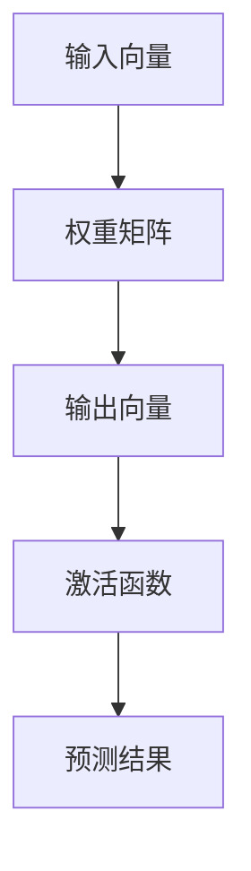

###### 2.1.2 矩阵乘法

矩阵乘法是神经网络中频繁使用的运算。给定两个矩阵\( A \)和\( B \)，它们的乘积\( C = AB \)是一个新矩阵，其元素是通过逐元素乘积并求和得到的。

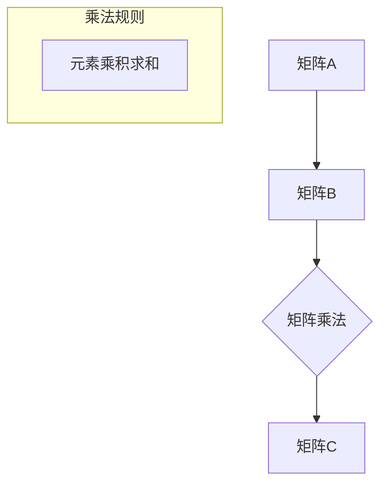

###### 2.1.3 矩阵求导

在训练神经网络时，需要计算梯度以更新网络的权重。矩阵求导是这一过程中的关键步骤。给定一个函数\( f(x) \)，其关于变量\( x \)的导数可以表示为\( \frac{df}{dx} \)。在神经网络中，通常使用偏导数来计算梯度。

```mermaid
graph TD
    A[函数f(x)] --> B[变量x]
    B --> C{求偏导数}
    C --> D[梯度矩阵]
```

##### 2.2 概率论与统计学基础

概率论和统计学在神经网络模型的设计和训练过程中起着重要作用。以下是一些基本概念和原理：

###### 2.2.1 概率分布

概率分布描述了随机变量在不同取值上的概率分布。在神经网络中，常用的概率分布包括伯努利分布、高斯分布等。

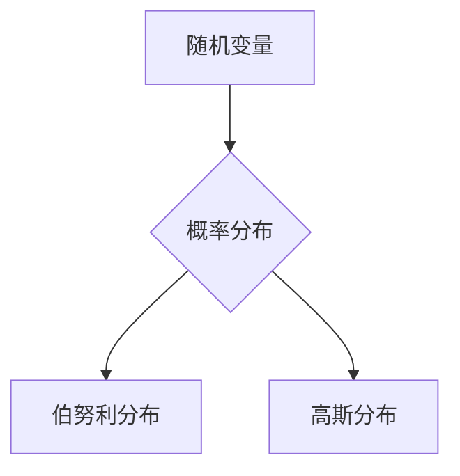

###### 2.2.2 最大似然估计

最大似然估计是一种参数估计方法，它通过最大化观测数据的似然函数来确定模型参数。在神经网络中，最大似然估计用于优化网络权重。

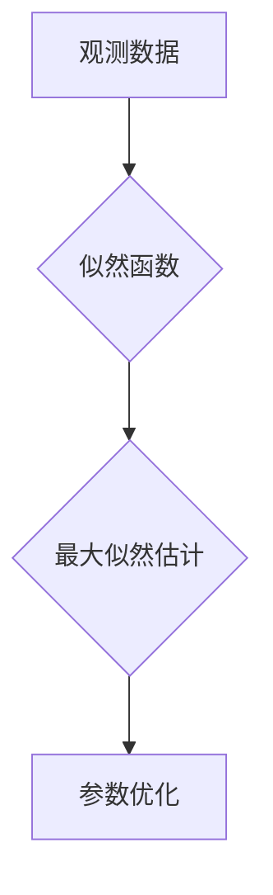

###### 2.2.3 马尔可夫链

马尔可夫链是一种随机过程模型，它描述了系统状态序列的演变。在序列模型中，如循环神经网络（RNN），马尔可夫链用于建模状态转移概率。

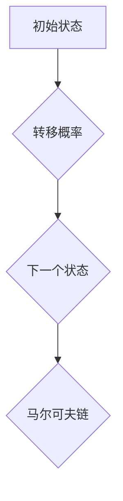

##### 2.3 梯度下降算法

梯度下降算法是一种优化方法，用于寻找函数的最小值。在神经网络中，梯度下降算法用于更新网络权重，以最小化损失函数。

###### 2.3.1 基本概念

梯度下降算法的核心思想是沿着函数的梯度方向进行迭代更新，从而逐渐逼近最小值。梯度表示函数在某一位置的变化率，其方向指向函数值增加最快的方向。

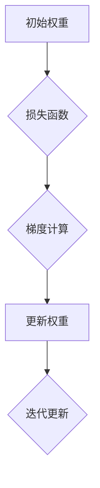

###### 2.3.2 梯度下降的变体

梯度下降算法有多种变体，包括随机梯度下降（SGD）、批量梯度下降和Adam优化器。这些变体通过调整学习率、批量大小和动量等因素，提高算法的收敛速度和稳定性。

1. **随机梯度下降（SGD）**：每次迭代仅使用一个样本计算梯度，从而加快收敛速度。

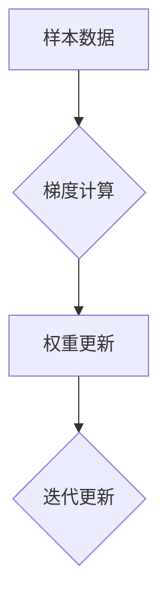

2. **批量梯度下降**：每次迭代使用整个数据集计算梯度，从而确保梯度估计的准确性。

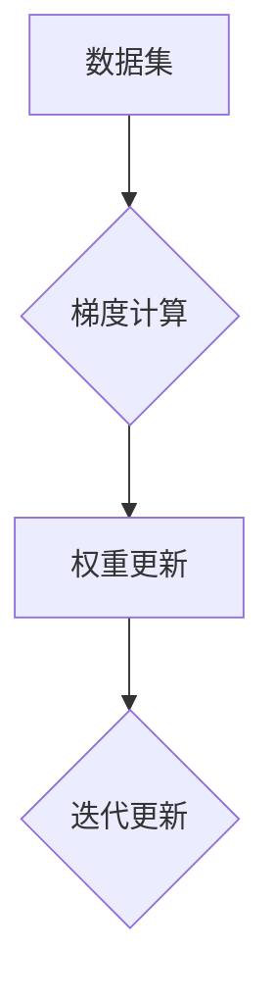

3. **Adam优化器**：结合SGD和批量梯度下降的优点，同时引入动量项和指数衰减率，提高收敛速度和稳定性。

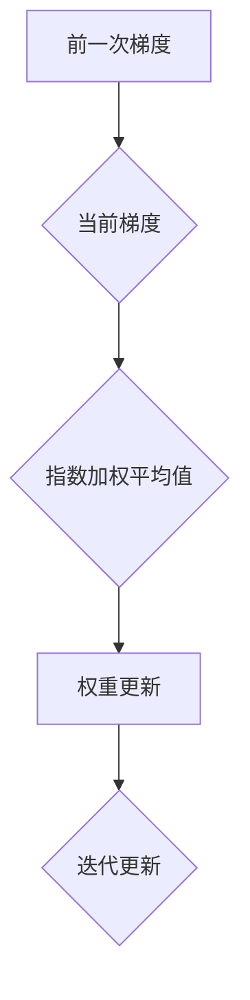

#### 第3章：神经网络的结构与类型

##### 3.1 神经网络的基本结构

神经网络的基本结构由三个主要部分组成：输入层、隐藏层和输出层。每个层由多个神经元组成，神经元之间通过加权连接相连。

###### 3.1.1 单层感知机

单层感知机是最简单的神经网络结构，仅包含输入层和输出层。输入层接收外部输入，输出层产生最终结果。单层感知机主要用于二分类问题，如手写数字识别、垃圾邮件分类等。

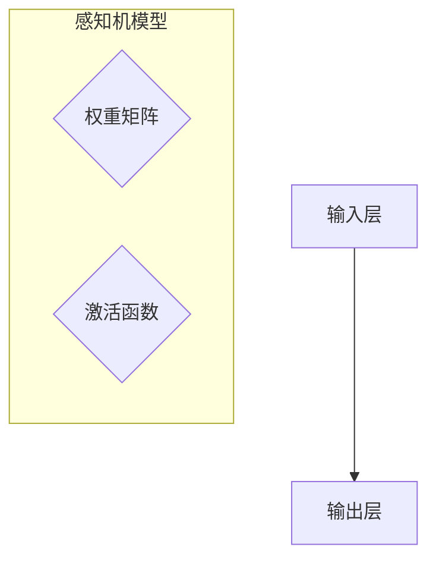

###### 3.1.2 多层感知机

多层感知机（MLP）是在单层感知机基础上引入隐藏层，可以处理更复杂的非线性问题。多层感知机通常由一个输入层、多个隐藏层和一个输出层组成。每个隐藏层通过激活函数引入非线性，从而提高模型的表示能力。

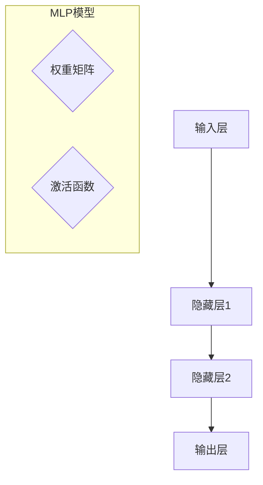

###### 3.1.3 循环神经网络（RNN）

循环神经网络（RNN）是一种能够处理序列数据的神经网络结构。RNN的主要特点是具有循环连接，即隐藏状态在时间步之间传递，使得模型能够保持长期依赖关系。

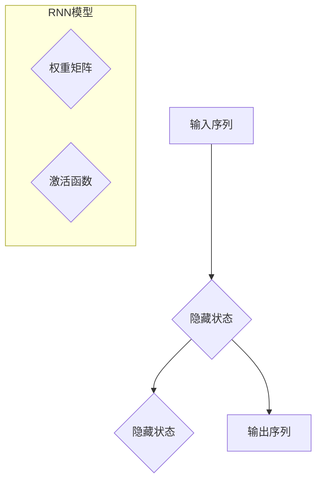

##### 3.2 特定类型的神经网络

除了基本结构和多层感知机，还有许多特定类型的神经网络，它们在处理特定类型的数据和任务时表现出色。

###### 3.2.1 卷积神经网络（CNN）

卷积神经网络（CNN）是专门用于处理图像数据的神经网络结构。CNN的核心是卷积层，它通过局部感知和共享权重的机制，有效地提取图像特征。

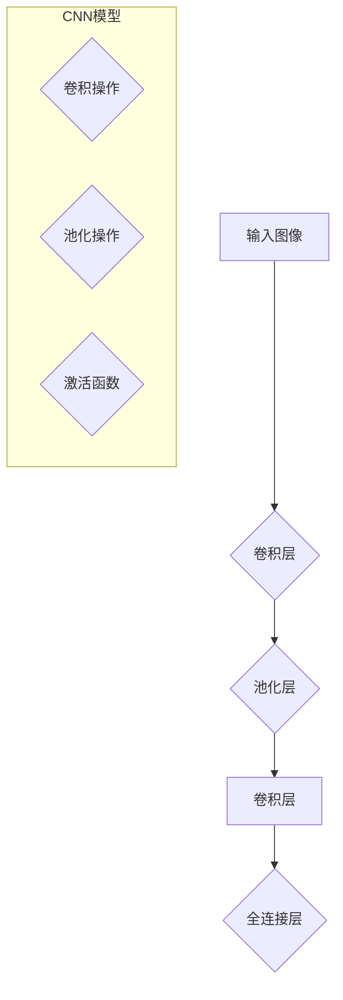

###### 3.2.2 生成对抗网络（GAN）

生成对抗网络（GAN）是一种由生成器和判别器组成的对抗性神经网络结构。生成器生成数据，判别器区分真实数据和生成数据，通过不断对抗训练，生成器逐渐生成更真实的数据。

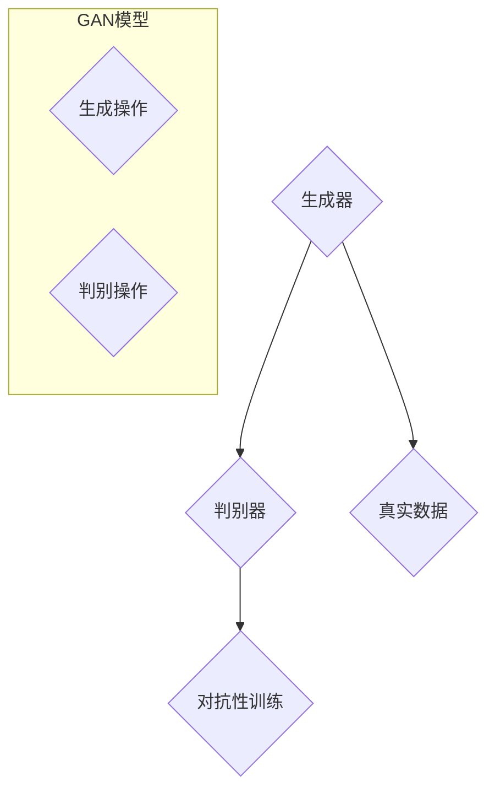

###### 3.2.3 递归神经网络（RNN）

递归神经网络（RNN）是一种能够处理序列数据的神经网络结构，其核心是递归连接，即隐藏状态在时间步之间传递。RNN在处理自然语言处理、语音识别等任务时表现出色。


###### 3.2.4 长短时记忆网络（LSTM）

长短时记忆网络（LSTM）是RNN的一种变体，它引入了门控机制，有效地解决了RNN在处理长期依赖关系时的梯度消失问题。LSTM在自然语言处理、语音识别等任务中表现出色。

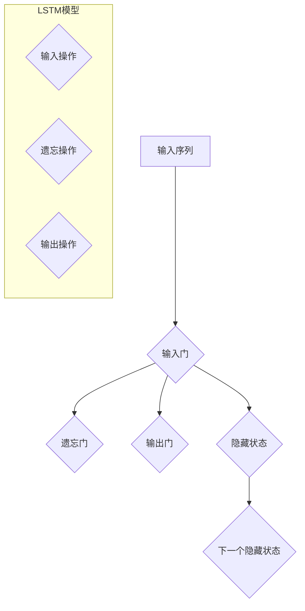

###### 3.2.5 生成式模型（VAE）

生成式模型（Variational Autoencoder，VAE）是一种基于概率编码的生成模型。VAE通过优化编码器和解码器的参数，生成具有高多样性的数据。

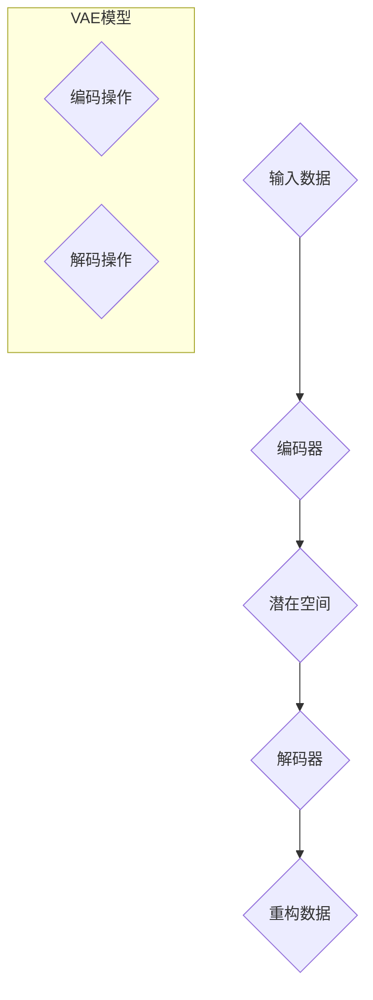

### 第二部分：神经网络的学习算法

#### 第4章：神经网络的学习算法

##### 4.1 前向传播与反向传播

神经网络的学习过程主要包括前向传播（Forward Propagation）和反向传播（Back Propagation）两个步骤。前向传播是将输入数据通过网络层进行计算，最终得到输出结果；反向传播则是通过计算输出结果与真实值之间的误差，反向更新网络的权重和偏置。

###### 4.1.1 前向传播算法

前向传播算法的基本步骤如下：

1. **输入层到隐藏层**：输入数据经过输入层传递到隐藏层，每个隐藏层的神经元通过加权连接计算输入并传递到下一层。

2. **激活函数应用**：在每个隐藏层，神经元通过激活函数（如ReLU、Sigmoid、Tanh等）将线性组合的输入转换为非线性输出。

3. **输出层计算**：最后，输出层神经元将隐藏层的输出传递到输出层，得到预测结果。

前向传播的核心公式如下：

$$
\text{输出} = \sigma(\text{权重} \cdot \text{输入} + \text{偏置})
$$

其中，$\sigma$表示激活函数。

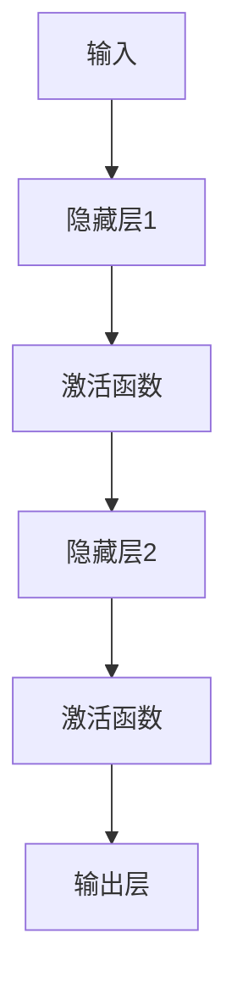

###### 4.1.2 反向传播算法

反向传播算法的基本步骤如下：

1. **计算损失**：计算预测结果与真实结果之间的损失，常用的损失函数包括均方误差（MSE）、交叉熵损失等。

2. **计算梯度**：根据损失函数，计算每个神经元的梯度，包括输入层、隐藏层和输出层的梯度。

3. **权重更新**：使用梯度下降算法，根据计算得到的梯度更新网络的权重和偏置。

反向传播算法的核心公式如下：

$$
\text{权重} \leftarrow \text{权重} - \text{学习率} \cdot \text{梯度}
$$

其中，学习率是调整权重更新步长的参数。

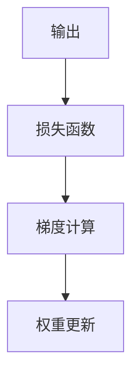

##### 4.2 梯度下降算法

梯度下降算法是一种用于优化神经网络参数的常用算法。它的核心思想是沿着损失函数的梯度方向进行迭代更新，以最小化损失函数。

###### 4.2.1 小批量梯度下降

小批量梯度下降（Mini-batch Gradient Descent）是一种改进的梯度下降算法，它将整个数据集分成多个小批量，每个小批量包含一部分样本。在每个迭代中，算法计算每个小批量的梯度，并使用这些梯度来更新权重。

```mermaid
graph TD
    A[数据集] --> B{小批量划分}
    B --> C[梯度计算]
    C --> D[权重更新]
```

小批量梯度下降的优点是减少了计算量，同时提高了收敛速度。

###### 4.2.2 随机梯度下降（SGD）

随机梯度下降（Stochastic Gradient Descent，SGD）是一种更简单的梯度下降算法，它在每个迭代中仅使用一个样本计算梯度。SGD的优点是计算速度快，但收敛速度相对较慢。

```mermaid
graph TD
    A[样本数据] --> B[梯度计算]
    B --> C[权重更新]
```

随机梯度下降的缺点是梯度噪声较大，可能导致收敛不稳定。

###### 4.2.3 批量梯度下降

批量梯度下降（Batch Gradient Descent）是一种标准的梯度下降算法，它在每个迭代中计算整个数据集的梯度。批量梯度下降的优点是梯度估计准确，但计算量较大。

```mermaid
graph TD
    A[数据集] --> B[梯度计算]
    B --> C[权重更新]
```

批量梯度下降的缺点是收敛速度较慢，但它在优化理论上有更好的理论基础。

##### 4.3 优化算法

除了基本的梯度下降算法，还有许多优化算法用于提高神经网络的训练效率和性能。以下是一些常见的优化算法：

###### 4.3.1 动量法

动量法（Momentum）是一种改进的梯度下降算法，它引入了动量项，使得权重更新更加平滑。动量法通过计算前一次梯度的一定比例，结合当前梯度进行权重更新。

```mermaid
graph TD
    A[当前梯度] --> B[前一次梯度]
    B --> C[动量项]
    C --> D[权重更新]
```

动量法的优点是减少了梯度噪声，提高了收敛速度。

###### 4.3.2 RMSprop

RMSprop（Root Mean Square Propagation）是一种基于梯度的优化算法，它使用了梯度的一阶矩估计和二阶矩估计来更新权重。RMSprop通过计算梯度平方的指数加权平均值，动态调整学习率。

```mermaid
graph TD
    A[当前梯度] --> B[梯度平方]
    B --> C{指数加权平均值}
    C --> D[学习率调整]
    D --> E[权重更新]
```

RMSprop的优点是自适应调整学习率，提高了训练的稳定性。

###### 4.3.3 Adam优化器

Adam优化器（Adaptive Moment Estimation）是一种基于梯度的优化算法，它同时考虑了梯度的一阶矩估计和二阶矩估计。Adam优化器通过计算梯度的指数加权平均值和梯度的平方的指数加权平均值，自适应调整学习率。

```mermaid
graph TD
    A[当前梯度] --> B[梯度的一阶矩估计]
    B --> C[梯度的一阶矩估计]
    C --> D{指数加权平均值}
    D --> E[学习率调整]
    E --> F[权重更新]
```

Adam优化器的优点是收敛速度较快，且在多种任务上表现出色。

### 第三部分：神经网络的应用

#### 第5章：深度学习框架

深度学习框架是为了简化深度学习模型的设计、训练和部署而开发的一系列库和工具。以下是一些广泛使用的深度学习框架及其特点。

##### 5.1 TensorFlow

TensorFlow是由Google开发的开源深度学习框架，它支持多种编程语言，包括Python、C++和Java。TensorFlow的主要特点包括：

###### 5.1.1 TensorFlow基础

- **动态图计算**：TensorFlow使用动态计算图，允许用户在运行时定义和修改计算流程。

- **广泛的API支持**：TensorFlow提供了丰富的API，包括高级API（如Keras）和底层API，方便用户在不同层次上进行开发。

- **分布式训练**：TensorFlow支持分布式训练，可以跨多台机器或GPU进行训练，提高计算效率。

- **预训练模型**：TensorFlow提供了大量预训练模型和预训练权重，方便用户快速构建和部署深度学习应用。

###### 5.1.2 TensorFlow高级应用

- **迁移学习**：TensorFlow支持迁移学习，用户可以将预训练模型应用于新任务，快速提升模型的性能。

- **自定义模型**：用户可以使用TensorFlow的底层API自定义复杂的深度学习模型。

- **推理优化**：TensorFlow提供了多种推理优化工具，如TensorRT和XLA，提高模型在部署时的性能。

##### 5.2 PyTorch

PyTorch是由Facebook开发的深度学习框架，它以Python为主编程语言，具有动态计算图和自动微分功能。PyTorch的主要特点包括：

###### 5.2.1 PyTorch基础

- **动态计算图**：PyTorch使用动态计算图，允许用户在运行时定义和修改计算流程，灵活且直观。

- **自动微分**：PyTorch提供了自动微分功能，简化了复杂的数学运算，提高了开发效率。

- **简单的API**：PyTorch的API设计简单易懂，适合初学者和研究人员快速上手。

- **丰富的库和社区**：PyTorch拥有丰富的库和社区支持，包括预训练模型、数据集和工具，方便用户进行研究和开发。

###### 5.2.2 PyTorch高级应用

- **强化学习**：PyTorch在强化学习领域有广泛应用，提供了丰富的强化学习库和工具。

- **计算机视觉**：PyTorch在计算机视觉任务中表现出色，支持多种图像处理和卷积神经网络。

- **自然语言处理**：PyTorch在自然语言处理领域拥有强大的功能，支持多种文本处理和序列模型。

##### 5.3 其他深度学习框架

除了TensorFlow和PyTorch，还有许多其他深度学习框架，如Keras、Theano和MXNet等。以下是这些框架的简要介绍：

###### 5.3.1 Keras

Keras是一个高层次的深度学习框架，它基于TensorFlow和Theano开发，提供简洁的API和易于使用的工具。Keras的特点包括：

- **简洁的API**：Keras使用Python编写，具有简洁的API，适合快速原型开发和实验。

- **兼容性**：Keras支持TensorFlow和Theano，可以方便地迁移模型和代码。

- **丰富的预训练模型**：Keras提供了大量预训练模型和数据集，方便用户快速构建和部署深度学习应用。

###### 5.3.2 Theano

Theano是一个开源的深度学习框架，它使用Python编写，提供静态计算图和自动微分功能。Theano的特点包括：

- **静态计算图**：Theano使用静态计算图，使得模型在编译时可以优化计算过程，提高性能。

- **高效的数值计算**：Theano支持GPU计算，利用CUDA和OpenCL等库，提高模型的计算效率。

- **Python和Numpy兼容性**：Theano与Python和Numpy兼容，方便用户进行开发和迁移。

###### 5.3.3 MXNet

MXNet是Apache Software Foundation的一个开源深度学习框架，它支持多种编程语言，包括Python、C++和R。MXNet的特点包括：

- **灵活的API**：MXNet提供灵活的API，支持动态图和静态图两种计算模式，方便用户在不同场景下进行开发。

- **分布式训练**：MXNet支持分布式训练，可以跨多台机器和GPU进行训练，提高计算效率。

- **云计算支持**：MXNet与AWS、Azure等云计算平台集成，方便用户在云上进行深度学习开发和部署。

### 第四部分：神经网络的未来

#### 第6章：神经网络的挑战与趋势

##### 6.1 神经网络的可解释性

神经网络，特别是深度神经网络，由于其复杂的结构和高度的非线性特性，往往被认为是一个“黑箱”。这使得神经网络在实际应用中缺乏可解释性，从而限制了其推广和应用。可解释性（Explainability）是当前神经网络研究中的一个重要方向，旨在提高神经网络决策过程的透明度和可理解性。

###### 6.1.1 可解释性的重要性

可解释性在多个领域具有重要意义：

- **医疗诊断**：在医疗领域，医生需要理解诊断结果的依据，以便做出正确的临床决策。

- **法律应用**：在法律领域，需要确保自动化决策系统符合法律和伦理标准。

- **金融风险管理**：在金融领域，需要确保模型的决策过程符合监管要求。

- **社会信任**：提高神经网络的可解释性有助于增强公众对人工智能技术的信任，从而减少其潜在的负面影响。

###### 6.1.2 可解释性方法

目前，研究人员提出了多种方法来提高神经网络的可解释性，包括：

1. **注意力机制**：注意力机制（Attention Mechanism）可以揭示神经网络在处理输入数据时关注的关键部分，从而提高模型的透明度。

2. **可视化技术**：通过可视化神经网络中的激活图、权重图等，可以直观地展示模型的决策过程。

3. **原型分析**：原型分析（Prototype Analysis）通过识别模型中的原型样本，帮助理解模型对输入数据的分类依据。

4. **模型压缩与剪枝**：通过模型压缩与剪枝技术，减少模型参数的数量，从而简化模型的复杂度，提高可解释性。

5. **对抗性解释**：对抗性解释（Adversarial Explanation）通过引入对抗性攻击，揭示模型在决策过程中可能存在的漏洞。

##### 6.2 神经网络的效率优化

随着神经网络模型变得越来越复杂，其计算和存储需求也在不断增长。为了提高神经网络在现实世界中的部署和运行效率，研究人员不断探索各种优化方法。

###### 6.2.1 神经网络的压缩技术

神经网络压缩技术旨在减少模型的大小和计算复杂度，主要包括以下几种方法：

1. **模型剪枝**：通过剪枝冗余的权重和神经元，减少模型的参数数量。

2. **量化**：将模型中的浮点数参数转换为低精度数值，如整数或二进制数，从而减少存储和计算需求。

3. **知识蒸馏**：通过将大型教师模型的知识传递给小型学生模型，降低模型的复杂度。

4. **网络剪裁**：在训练过程中逐步去除不重要的神经元和连接，从而简化模型结构。

###### 6.2.2 神经网络的并行化

并行化是提高神经网络计算效率的重要手段。通过在多核CPU、GPU和其他异构计算平台上进行并行计算，可以显著缩短模型的训练时间。神经网络并行化的主要方法包括：

1. **数据并行**：将数据集分成多个子集，并在不同GPU或CPU上分别训练模型，最后汇总结果。

2. **模型并行**：将大型模型分解为多个子模型，并在不同计算单元上分别训练，最后组合子模型的输出。

3. **算法并行**：通过并行计算梯度、矩阵乘法等基本操作，提高训练效率。

4. **内存并行**：优化内存访问模式，减少内存瓶颈，提高数据传输速度。

##### 6.3 神经网络的泛化能力

神经网络的泛化能力（Generalization Ability）是指模型在未见过的数据上表现良好的能力。当前，深度神经网络在特定任务上表现出色，但其泛化能力仍然是一个挑战。

###### 6.3.1 泛化能力的挑战

1. **数据偏差**：神经网络在训练过程中容易受到数据分布的影响，导致在未见过的数据上表现不佳。

2. **过拟合**：神经网络模型可能在学习训练数据时过度拟合，从而在测试数据上表现较差。

3. **模型可解释性**：缺乏可解释性使得难以理解模型的决策过程，从而影响其泛化能力。

4. **计算资源限制**：在资源受限的设备上，深度神经网络可能无法实现足够的泛化能力。

###### 6.3.2 提高泛化能力的策略

1. **数据增强**：通过增加数据的多样性和复杂性，提高模型的泛化能力。

2. **正则化**：使用正则化技术（如L1、L2正则化），避免模型过度拟合。

3. **交叉验证**：通过交叉验证技术，确保模型在多个数据集上表现良好。

4. **提前停止**：在训练过程中，当模型性能不再提高时停止训练，避免过拟合。

5. **集成学习**：通过集成多个模型的预测结果，提高模型的泛化能力。

### 第五部分：神经网络的未来应用

#### 第7章：神经网络的未来应用

##### 7.1 新兴应用领域

神经网络的快速发展使得其在新兴应用领域中也展现出了巨大的潜力。以下是一些神经网络的未来应用领域：

###### 7.1.1 生物信息学

在生物信息学领域，神经网络被广泛应用于基因表达分析、蛋白质结构预测、药物发现和疾病诊断等任务。例如，神经网络可以用于识别DNA序列中的功能区域，预测蛋白质的结构和功能，以及开发新的药物分子。

###### 7.1.2 金融科技

金融科技（FinTech）是神经网络应用的另一个重要领域。神经网络在风险管理、市场预测、信用评分和欺诈检测等方面具有广泛的应用。例如，神经网络可以用于预测市场趋势，识别潜在的信用风险，以及检测金融交易中的欺诈行为。

###### 7.1.3 能源领域

在能源领域，神经网络被用于优化能源生产和消费，提高能源利用效率。例如，神经网络可以用于预测电力需求，优化风力发电和太阳能发电的调度，以及提高电网的稳定性和可靠性。

##### 7.2 跨领域合作与融合

神经网络的应用不仅限于单一领域，还与其他技术领域相互融合，产生新的应用场景。以下是一些跨领域合作与融合的例子：

###### 7.2.1 神经网络与其他技术的结合

- **强化学习与神经网络的结合**：强化学习（Reinforcement Learning）与神经网络的结合，可以用于解决复杂的决策问题，如自动驾驶、游戏AI和机器人控制。

- **区块链与神经网络的结合**：区块链（Blockchain）与神经网络的结合，可以用于构建去中心化的智能合约和分布式数据存储系统。

- **计算机视觉与自然语言处理的结合**：计算机视觉（Computer Vision）与自然语言处理（Natural Language Processing）的结合，可以用于构建多模态的智能系统，如智能客服、图像识别和语音识别。

###### 7.2.2 神经网络在教育、医疗等领域的应用前景

- **教育领域**：神经网络在教育领域具有广泛的应用前景，如个性化学习、智能教学系统和智能评估。例如，神经网络可以用于分析学生的学习行为，提供个性化的学习建议，以及评估学生的学习效果。

- **医疗领域**：神经网络在医疗领域也有重要的应用潜力，如医学图像分析、疾病预测和个性化医疗。例如，神经网络可以用于分析医学图像，识别疾病标志物，以及开发个性化治疗方案。

##### 7.3 神经网络的社会影响

神经网络的快速发展对社会产生了深远的影响，同时也带来了一些挑战和争议。以下是一些神经网络的社会影响：

###### 7.3.1 伦理与隐私问题

- **伦理问题**：神经网络在决策过程中可能存在歧视、偏见和不公平问题，需要制定相应的伦理准则和监管措施。

- **隐私问题**：神经网络在处理个人数据时，可能涉及隐私泄露和数据滥用问题，需要加强隐私保护。

###### 7.3.2 神经网络对就业市场的影响

- **就业机会**：神经网络的快速发展创造了大量就业机会，如数据科学家、机器学习工程师和深度学习研究员。

- **就业挑战**：神经网络的发展也可能导致一些传统职业的消失，如制造业、零售业和金融服务业。

### 附录：资源与工具

##### 附录 A：神经网络学习资源

以下是一些神经网络学习的资源，包括在线课程、教程、论文和书籍。

###### A.1 在线课程与教程

- **斯坦福大学深度学习课程**：由Andrew Ng教授讲授的深度学习课程，涵盖了深度学习的基本概念和应用。

- **Udacity深度学习纳米学位**：Udacity提供的深度学习纳米学位，包括一系列在线课程和项目，适合初学者和进阶者。

- **Fast.ai深度学习课程**：Fast.ai提供的免费深度学习课程，适合对深度学习感兴趣但数学基础较弱的人。

###### A.2 论文与书籍推荐

- **《深度学习》（Deep Learning）**：Ian Goodfellow、Yoshua Bengio和Aaron Courville合著的深度学习经典教材，全面介绍了深度学习的理论基础和应用。

- **《神经网络与深度学习》**：邱锡鹏教授编写的中文教材，系统地介绍了神经网络和深度学习的基础知识。

- **《机器学习实战》**：Peter Harrington编写的书籍，通过实际案例和代码示例，介绍了机器学习和深度学习的基本方法。

###### A.3 神经网络开源框架

- **TensorFlow**：Google开发的深度学习框架，支持多种编程语言和操作系统。

- **PyTorch**：Facebook开发的深度学习框架，以Python为主编程语言。

- **Keras**：基于Theano和TensorFlow的高层次深度学习框架。

- **MXNet**：Apache Software Foundation开发的深度学习框架。

### 附录 B：神经网络常用算法与模型详解

##### 附录 B.1 算法伪代码

以下是一些神经网络常用算法的伪代码，帮助读者理解其基本原理。

###### 伪代码：前向传播算法

```
function forward_propagation(X, W, b, activation_function):
    Z = W * X + b
    A = activation_function(Z)
    return A
```

###### 伪代码：反向传播算法

```
function backward_propagation(dA, activation_derivative, Z):
    dZ = dA * activation_derivative
    dW = X.T * dZ
    db = dZ.sum(axis=0)
    return dW, db
```

###### 伪代码：梯度下降算法

```
function gradient_descent(parameters, gradients, learning_rate):
    parameters = parameters - learning_rate * gradients
    return parameters
```

##### 附录 B.2 模型结构图

以下是一些常见神经网络模型的Mermaid结构图，帮助读者直观地理解模型的结构。

###### Mermaid结构图：多层感知机

```
graph TD
    A[输入层] --> B[隐藏层1]
    B --> C[隐藏层2]
    C --> D[输出层]
    subgraph 权重与偏置
        E{W1}
        F{b1}
        G{W2}
        H{b2}
    end
```

###### Mermaid结构图：卷积神经网络

```
graph TD
    A[输入图像] --> B[卷积层1]
    B --> C[池化层1]
    C --> D[卷积层2]
    D --> E[池化层2]
    E --> F[全连接层]
    subgraph 权重与偏置
        G{W1}
        H{b1}
        I{W2}
        J{b2}
    end
```

##### 附录 B.3 实例代码与解读

以下是一个使用Python和PyTorch实现的多层感知机模型的实例代码，包括模型定义、前向传播和反向传播。

###### 实例代码：多层感知机模型

```python
import torch
import torch.nn as nn
import torch.optim as optim

# 定义多层感知机模型
class MLP(nn.Module):
    def __init__(self, input_size, hidden_size, output_size):
        super(MLP, self).__init__()
        self.fc1 = nn.Linear(input_size, hidden_size)
        self.fc2 = nn.Linear(hidden_size, output_size)
        
    def forward(self, x):
        x = torch.relu(self.fc1(x))
        x = self.fc2(x)
        return x

# 创建模型、损失函数和优化器
model = MLP(input_size=784, hidden_size=256, output_size=10)
criterion = nn.CrossEntropyLoss()
optimizer = optim.Adam(model.parameters(), lr=0.001)

# 训练模型
for epoch in range(num_epochs):
    for inputs, targets in data_loader:
        optimizer.zero_grad()
        outputs = model(inputs)
        loss = criterion(outputs, targets)
        loss.backward()
        optimizer.step()
    print(f'Epoch {epoch+1}/{num_epochs}, Loss: {loss.item()}')

# 评估模型
with torch.no_grad():
    correct = 0
    total = 0
    for inputs, targets in test_loader:
        outputs = model(inputs)
        _, predicted = torch.max(outputs.data, 1)
        total += targets.size(0)
        correct += (predicted == targets).sum().item()
    print(f'Accuracy: {100 * correct / total}%')
```

###### 代码解读：

1. **模型定义**：`MLP`类继承自`nn.Module`，定义了两个全连接层（`fc1`和`fc2`），并使用ReLU激活函数。

2. **前向传播**：在`forward`方法中，输入数据通过`fc1`层后应用ReLU激活函数，然后通过`fc2`层得到输出结果。

3. **损失函数与优化器**：使用交叉熵损失函数和Adam优化器。

4. **训练过程**：在训练过程中，每次迭代通过`optimizer.zero_grad()`将梯度清零，然后计算损失、反向传播和优化更新。

5. **评估过程**：在评估过程中，使用`torch.no_grad()`减少内存占用，计算模型的准确率。

### 作者信息

作者：AI天才研究院/AI Genius Institute & 禅与计算机程序设计艺术 /Zen And The Art of Computer Programming

AI天才研究院致力于推动人工智能技术的发展和创新应用，致力于培养下一代人工智能科学家和工程师。同时，作者长期关注人工智能领域的理论研究和实践探索，通过深入思考和持续创新，为读者提供高质量的学术成果和技术指导。在《禅与计算机程序设计艺术》一书中，作者结合禅宗哲学与计算机编程，提出了独特的编程理念和方法，深受读者喜爱。

