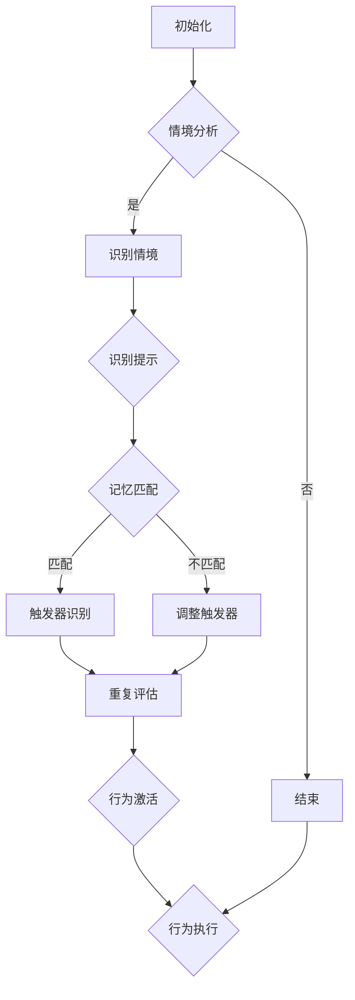
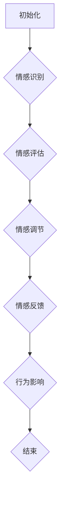
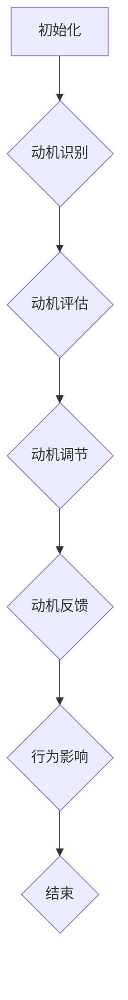

                 

# 福格行为模型：行为改变的三要素

## 关键词
行为模型，福格行为模型，行为改变，行动触发器，动机，情感，应用与实践

## 摘要
本文将深入探讨福格行为模型，一个旨在解释和改变行为的理论框架。我们将详细解析模型的三要素：行动触发器、动机和情感，并探讨它们在行为改变中的相互作用。通过实际案例，我们将展示如何在个人、组织和社交层面应用这一模型，并提供核心算法原理和数学模型的讲解。文章最后，我们将通过项目实战来展示福格行为模型的应用效果。

### 第一部分：引言

#### 1.1 福格行为模型简介
福格行为模型（Fogg Behavior Model），简称FBM，是由BJ福格（BJ Fogg）提出的，用于解释行为改变的心理学模型。该模型主要关注三个核心要素：行动触发器、动机和情感。通过理解这些要素如何相互影响，我们可以更好地设计和实施行为改变策略。

#### 1.2 行为改变的重要性
行为改变在个人发展、组织改进和社会进步中扮演着关键角色。无论是改善个人生活习惯、提升工作效率，还是推动社会公益，福格行为模型都能提供有力的理论支持和方法指导。

#### 1.3 书籍结构概述
本文将分为五个部分。首先，我们将介绍福格行为模型的基本原理；其次，深入探讨行动触发器、动机和情感三个要素；接着，通过实际案例展示模型的广泛应用；然后，分析核心概念和算法原理；最后，通过项目实战来验证模型的实际效果。

### 第二部分：福格行为模型的三要素

#### 2.1 行动触发器

### 2.1.1 行动触发器的定义
行动触发器（Trigger）是福格行为模型中引发行为的直接原因。它可以是一个外部事件、一个内部想法，甚至是某个具体的提示。行动触发器的作用是激活行为，使其从潜在状态转变为实际状态。

#### 2.1.2 行动触发器的核心要素
行动触发器的核心要素包括：情境（Situation）、提示（Prompt）和记忆（Memory）。情境是指个体所处的环境，提示是任何能够激发行为的信号，记忆是过去经验在个体大脑中的存储。

#### 2.1.3 如何创建有效的行动触发器
创建有效的行动触发器需要考虑以下几个方面：一是确定目标行为，二是分析情境和提示，三是利用记忆增强触发效果。具体策略包括：利用即时反馈、制定明确的行动计划、利用技术工具等。

#### 2.2 触发行动的情感

### 2.2.1 情感的定义与作用
情感是指个体对某一刺激的内在感受和情绪状态。在福格行为模型中，情感的作用是增强或减弱动机，从而影响行为的实现。积极的情感可以提升动机，而消极的情感则可能削弱动机。

#### 2.2.2 如何识别触发行动的情感
识别触发行动的情感需要从个体内心体验出发，分析情感的类型、强度和持续时间。具体方法包括：自我观察、与他人交流、利用情绪量表等。

#### 2.2.3 情感调节策略
情感调节策略包括认知重构、行为调节、情绪释放和积极情绪培养。通过这些策略，个体可以更好地管理自己的情感，从而提高行为的动机和成功率。

#### 2.3 动机

### 2.3.1 动机的定义与分类
动机是指个体为实现某一目标而付出努力的内在驱动力。动机可以分为内在动机和外在动机，内在动机来源于个体内心的兴趣、好奇心和满足感，而外在动机则来自于外部奖励或惩罚。

#### 2.3.2 如何激发与维持动机
激发与维持动机的方法包括：设置明确的目标、利用内在动机、提供外部奖励、制定有挑战性的任务、保持持续的兴趣等。此外，个体还应该学会自我激励，通过自我反馈和自我监控来维持动机。

#### 2.3.3 动机增强策略
动机增强策略包括：利用正向激励、避免负面激励、设置合理的期望、建立社会支持网络等。通过这些策略，个体可以更好地激发和维持动机，实现目标。

### 第三部分：福格行为模型的应用与实践

#### 3.1 个人层面的应用

### 3.1.1 个人行为改变案例分析
我们将通过具体案例，分析个人如何利用福格行为模型来改变不良习惯、提升学习效率和实现健康生活方式。

### 3.1.2 如何应用福格行为模型改变个人行为
我们将介绍一系列实际操作步骤，帮助读者应用福格行为模型来改变个人行为，包括：确定目标、分析触发器、激发动机和调节情感等。

#### 3.2 组织层面的应用

### 3.2.1 组织行为改变案例分析
我们将探讨组织如何利用福格行为模型来提升员工效率、改善团队协作和推动企业创新。

### 3.2.2 如何应用福格行为模型改善组织行为
我们将提供详细的策略和建议，帮助组织应用福格行为模型来改善行为，包括：设计有效的行动计划、建立激励机制、培养积极情感等。

#### 3.3 社会层面的应用

### 3.3.1 社会行为改变案例分析
我们将通过具体案例，展示福格行为模型在社会行为改变中的应用，如：推动环保行动、提高公共安全意识和促进社会公正。

### 3.3.2 如何应用福格行为模型推动社会行为改变
我们将提出一系列方法，帮助社会利用福格行为模型来推动行为改变，包括：设计社会宣传策略、利用技术工具、建立社区参与机制等。

### 第四部分：福格行为模型的核心概念与联系

#### 4.1 行为模型的核心概念
我们将深入探讨福格行为模型的核心概念，包括：行为触发器、动机和情感，并分析它们在行为改变中的作用和相互关系。

#### 4.2 行为改变的理论框架
我们将探讨福格行为模型与其他行为改变理论的关系，分析其在心理学、管理学和社会学领域的应用。

### 第五部分：核心算法原理讲解

#### 5.1 行动触发器的算法原理
我们将介绍行动触发器的算法原理，包括：触发器的识别、评估和优化。具体内容包括：算法模型、算法流程和伪代码展示。

#### 5.2 触发行动的情感算法原理
我们将介绍触发行动的算法原理，包括：情感识别、情感评估和情感调节。具体内容包括：算法模型、算法流程和伪代码展示。

#### 5.3 动机算法原理
我们将介绍动机激发的算法原理，包括：动机识别、动机评估和动机优化。具体内容包括：算法模型、算法流程和伪代码展示。

### 第六部分：数学模型和数学公式讲解

#### 6.1 行动触发器的数学模型
我们将介绍行动触发器的数学模型，包括：触发器识别的数学公式、触发器评估的数学公式和触发器优化的数学公式。具体内容包括：数学公式详细讲解和举例说明。

#### 6.2 触发行动的情感数学模型
我们将介绍触发行动的数学模型，包括：情感识别的数学公式、情感评估的数学公式和情感调节的数学公式。具体内容包括：数学公式详细讲解和举例说明。

#### 6.3 动机的数学模型
我们将介绍动机激发的数学模型，包括：动机识别的数学公式、动机评估的数学公式和动机优化的数学公式。具体内容包括：数学公式详细讲解和举例说明。

### 第七部分：项目实战

#### 7.1 个人行为改变项目实战
我们将通过具体项目，展示如何利用福格行为模型来改变个人行为，包括：项目背景、项目目标、实施过程和项目成果。

#### 7.2 组织行为改变项目实战
我们将通过具体项目，展示如何利用福格行为模型来改善组织行为，包括：项目背景、项目目标、实施过程和项目成果。

#### 7.3 社会行为改变项目实战
我们将通过具体项目，展示如何利用福格行为模型来推动社会行为改变，包括：项目背景、项目目标、实施过程和项目成果。

### 附录

#### 附录A：福格行为模型开发工具与资源
我们将介绍福格行为模型开发的相关工具和资源，包括：开发工具、参考资料、在线资源和社区支持。

---

在接下来的部分，我们将对福格行为模型进行更深入的探讨，通过详细的解释、算法原理的讲解和实际案例的分析，帮助读者更好地理解和应用这一模型。我们将逐步解析每个要素，展示它们如何相互作用，以实现行为改变。让我们开始这一精彩的旅程吧！<|im_end|>### 第一部分：引言

#### 1.1 福格行为模型简介

福格行为模型（Fogg Behavior Model，简称FBM）是由BJ福格（BJ Fogg）博士在1998年提出的，用于解释和指导行为改变的心理模型。该模型以简洁明了的方式阐述了行为产生的三个关键要素：触发器（Trigger）、动机（Motivation）和能力（Ability）。FBM的主要贡献在于提供了一个理论框架，帮助人们理解和预测行为变化，并在实际应用中设计和实施有效的行为改变策略。

**核心要素解析：**

- **触发器（Trigger）**：触发器是激发行为的直接原因。它可以是某种外部事件、内部思考，或者是一个简单的提示。例如，看到某个广告可能会触发购买行为，想到健康问题可能会触发锻炼身体的行为。

- **动机（Motivation）**：动机是指推动个体执行某一行为的内在驱动力。动机可以分为内在动机和外在动机。内在动机源于个人的兴趣、好奇心和自我实现，而外在动机则来自外部的奖励或惩罚。

- **能力（Ability）**：能力是指个体完成某一行为所需的技术或资源。能力包括知识、技能、时间、资金等。如果个体缺乏完成某项任务的能力，即使有触发器和动机，行为也可能无法实现。

**行为改变过程：**

在FBM中，行为改变的过程可以简化为以下三个步骤：

1. **触发器激活**：当触发器被激活时，行为从潜在状态转变为实际状态。
2. **动机评估**：个体评估执行该行为的动机，决定是否采取行动。
3. **能力检查**：个体检查自己是否有足够的能力来执行该行为。

只有当这三个要素同时满足时，行为才有可能发生。因此，理解这三个要素及其相互作用是设计和实施行为改变策略的关键。

**FBM的应用领域：**

FBM不仅适用于个人层面的行为改变，如减肥、锻炼、戒烟等，还广泛应用于组织管理和公共政策领域。例如，企业可以利用FBM来提高员工的工作效率，政府可以利用FBM来推动公众健康行为，如疫苗接种和戒烟。

总之，福格行为模型提供了一个系统化的框架，帮助人们理解行为背后的心理机制，并提供了具体的策略和方法来促进行为改变。通过深入理解FBM的核心概念和应用方法，读者可以更好地设计和实施行为改变项目，实现个人和组织的目标。

#### 1.2 行为改变的重要性

行为改变在个人发展、组织运营和社会进步中具有至关重要的意义。首先，对于个人而言，行为改变能够带来健康、幸福和自我实现。例如，通过改变不良饮食习惯，个体可以降低患病风险，提高生活质量；通过培养积极的生活习惯，如定期锻炼和充足睡眠，个体可以提升幸福感和身心健康。此外，行为改变还可以帮助个人实现职业发展和个人成长，例如，通过提升学习习惯和技能，个体可以增强竞争力，获得更好的职业机会。

在组织层面，行为改变同样至关重要。组织行为决定了企业的运营效率、创新能力和员工满意度。通过行为改变策略，企业可以提升员工的工作效率、减少错误率、提高团队协作水平，从而实现业务目标。例如，通过改变管理风格，管理者可以增强员工的积极性和忠诚度，提高整体绩效；通过优化工作流程，企业可以减少不必要的环节，提高生产效率，降低成本。

在社会层面，行为改变对于社会进步和公共利益至关重要。社会行为改变项目可以促进公众健康、环境保护和社会正义。例如，通过推动健康生活方式，如合理饮食和定期锻炼，社会可以降低疾病负担，提高人口素质；通过倡导节能减排，社会可以减少环境污染，保护生态系统。此外，通过改善社会公平和正义，社会可以减少不平等现象，提升社会和谐度。

总之，行为改变不仅对个体和组织产生深远影响，也对社会的可持续发展具有关键作用。通过理解和应用福格行为模型，我们可以更好地设计和实施行为改变项目，实现个人目标、组织目标和社会目标。

#### 1.3 书籍结构概述

本文将按照以下结构对福格行为模型进行深入探讨：

**第一部分：引言**
- 1.1 福格行为模型简介
- 1.2 行为改变的重要性
- 1.3 书籍结构概述

**第二部分：福格行为模型的三要素**
- 2.1 行动触发器
  - 2.1.1 行动触发器的定义
  - 2.1.2 行动触发器的核心要素
  - 2.1.3 如何创建有效的行动触发器
- 2.2 触发行动的情感
  - 2.2.1 情感的定义与作用
  - 2.2.2 如何识别触发行动的情感
  - 2.2.3 情感调节策略
- 2.3 动机
  - 2.3.1 动机的定义与分类
  - 2.3.2 如何激发与维持动机
  - 2.3.3 动机增强策略

**第三部分：福格行为模型的应用与实践**
- 3.1 个人层面的应用
  - 3.1.1 个人行为改变案例分析
  - 3.1.2 如何应用福格行为模型改变个人行为
- 3.2 组织层面的应用
  - 3.2.1 组织行为改变案例分析
  - 3.2.2 如何应用福格行为模型改善组织行为
- 3.3 社会层面的应用
  - 3.3.1 社会行为改变案例分析
  - 3.3.2 如何应用福格行为模型推动社会行为改变

**第四部分：福格行为模型的核心概念与联系**
- 4.1 行为模型的核心概念
- 4.2 行为改变的理论框架

**第五部分：核心算法原理讲解**
- 5.1 行动触发器的算法原理
- 5.2 触发行动的情感算法原理
- 5.3 动机算法原理

**第六部分：数学模型和数学公式讲解**
- 6.1 行动触发器的数学模型
- 6.2 触发行动的情感数学模型
- 6.3 动机的数学模型

**第七部分：项目实战**
- 7.1 个人行为改变项目实战
- 7.2 组织行为改变项目实战
- 7.3 社会行为改变项目实战

**附录**
- 附录A：福格行为模型开发工具与资源

通过这一结构，读者将系统地了解福格行为模型的原理和应用，并通过实际案例和项目实战，掌握如何设计和实施行为改变策略。让我们继续深入探讨这一强大的行为改变工具，揭示其背后的科学原理和实践方法。

### 第二部分：福格行为模型的三要素

#### 2.1 行动触发器

行动触发器（Trigger）在福格行为模型中扮演着至关重要的角色，它是行为的直接导火索，使得潜在的行为转变为实际行为。理解行动触发器的定义和核心要素，以及如何创建有效的行动触发器，是掌握福格行为模型的关键。

### 2.1.1 行动触发器的定义

行动触发器可以定义为任何能够激发个体采取行动的外部或内部事件、提示或情境。它是一个激活行为的关键因素，没有触发器，即使有动机和能力，行为也难以发生。例如，在个人层面，看到一则关于健康饮食的广告可能成为行动触发器，促使个体改变饮食习惯；在组织层面，一个重要的项目截止日期可能成为行动触发器，激励团队成员加班完成项目。

### 2.1.2 行动触发器的核心要素

行动触发器的有效性取决于其是否具备以下核心要素：

1. **情境（Situation）**：情境是指个体所处的具体环境或条件，它为触发器提供了背景。情境可以是物理环境，如办公室或家庭，也可以是社会环境，如社交活动或工作场所。

2. **提示（Prompt）**：提示是一种具体的信号或提示，它直接告诉个体应该采取什么行动。提示可以是文字、图像、声音或其他形式的信息，如电子邮件提醒、手机推送通知或贴在墙上的便签。

3. **记忆（Memory）**：记忆是指个体在过去经历中储存的相关信息和经验。记忆帮助个体识别触发器，并激活相应的行为。例如，记忆中关于健康饮食的知识可能会促使个体选择健康的食物。

这些核心要素相互作用，共同决定了行动触发器的有效性。一个理想的行动触发器应该能够在适当的情境中，通过有效的提示，被个体的记忆所识别和激活。

### 2.1.3 如何创建有效的行动触发器

为了创建有效的行动触发器，需要考虑以下几个方面：

1. **明确目标**：首先，明确个体或组织希望实现的具体目标。例如，如果目标是提高员工的工作效率，那么可以设定具体的行动计划，如每日工作总结和进度报告。

2. **分析情境和提示**：分析目标行为发生的情境，确定触发器所需的情境要素。例如，如果情境是工作日，提示可以是每天早上收到的工作任务清单。通过这种方式，确保触发器能够适应不同的情境。

3. **利用记忆**：设计触发器时，需要考虑如何利用个体的记忆。例如，可以结合个体的过去经验和知识，使用熟悉的提示，如重复提醒或使用习惯性语言。

4. **增强提示效果**：提示的设计要简洁、明确，避免信息过载。可以通过使用图像、颜色或声音等不同形式的提示来增强其效果。例如，使用红色文字或声音警报来提醒重要事项。

5. **测试和优化**：创建触发器后，通过实际测试来评估其效果，并根据反馈进行优化。例如，通过调查问卷或实验，了解员工是否能够在特定提示下采取预期行为，并根据结果进行调整。

### 实例说明

为了更直观地理解如何创建有效的行动触发器，我们来看一个实际案例：

**案例：提高员工定期健康检查率**

目标：提高员工定期健康检查率。

情境：工作环境，如公司办公室。

提示：每周五下午发送电子邮件提醒。

记忆：员工对健康检查重要性的认知。

步骤：
1. **明确目标**：设定提高员工定期健康检查率的具体目标。
2. **分析情境和提示**：确定每周五下午通过电子邮件发送提醒的最佳时机和方式。
3. **利用记忆**：通过电子邮件内容，结合员工过去接受的健康检查反馈，增强提示的记忆效果。
4. **增强提示效果**：在电子邮件中使用鲜艳的颜色、清晰的标题和简单的步骤说明，以提高提示的吸引力。
5. **测试和优化**：通过问卷调查了解员工对电子邮件提醒的反馈，根据反馈进行优化，例如调整发送时间或内容格式。

通过上述步骤，我们可以创建一个有效的行动触发器，从而提高员工定期健康检查的参与率。

总之，行动触发器是福格行为模型中的关键要素，它通过情境、提示和记忆三个核心要素相互作用，激活潜在行为。通过理解和掌握如何创建有效的行动触发器，我们可以更好地设计和实施行为改变策略，实现个人和组织的目标。

#### 2.2 触发行动的情感

情感是福格行为模型中的第二个关键要素，它对行为的发生有着深远的影响。情感不仅是人类行为的重要驱动力，也是连接动机和能力的关键桥梁。在本节中，我们将探讨情感的定义与作用，如何识别触发行动的情感，以及情感调节策略。

### 2.2.1 情感的定义与作用

情感是指个体在特定情境下产生的情绪和心理状态。它不仅包括愉悦和悲伤等基本情绪，还包括焦虑、愤怒、兴奋等复杂的情感体验。情感在行为中的作用主要体现在以下几个方面：

1. **增强或减弱动机**：情感可以增强或减弱个体执行某一行为的动机。例如，积极的情感（如喜悦、兴奋）可以增强动机，促使个体更积极地采取行动；而消极的情感（如恐惧、焦虑）则可能减弱动机，使个体对行为产生犹豫或抵触情绪。

2. **影响行为选择**：情感会影响个体对行为的认知评价和选择。例如，当个体处于兴奋和愉悦的情感状态下，他们更有可能选择具有挑战性和新颖性的行为；而在消极情感状态下，他们可能倾向于选择安全和无风险的行为。

3. **影响行为执行**：情感还会影响个体在行为执行过程中的注意力和意志力。例如，积极的情感可以提高个体的注意力和专注力，使行为执行更加高效；而消极的情感则可能导致注意力分散和意志力下降，影响行为的完成质量。

### 2.2.2 如何识别触发行动的情感

识别触发行动的情感是理解和利用福格行为模型的关键步骤。以下是几种识别情感的方法：

1. **自我观察**：通过自我反思和情绪日记，个体可以记录自己在不同情境下的情感体验。这种方法有助于个体识别与特定行为相关的情感，并了解情感对自己行为的影响。

2. **与他人交流**：与他人交流可以帮助个体了解他人的情感状态，并从他人的视角反思自己的行为。例如，通过询问同事或家人，个体可以了解他们对某一行为的反应，从而识别触发行动的情感。

3. **情绪量表**：使用情绪量表（如正负情感量表）可以帮助个体量化自己的情感体验。这种方法提供了标准化的工具，使个体能够更准确地识别和评估情感。

### 2.2.3 情感调节策略

情感调节是指个体通过改变自己的情绪状态来适应环境需求。以下是几种有效的情感调节策略：

1. **认知重构**：认知重构是通过改变对情境的认知评价来调节情感。例如，当面对一个困难的任务时，个体可以通过重新评估任务的挑战性和重要性，来减少焦虑和压力。

2. **行为调节**：行为调节是通过改变行为来影响情感状态。例如，通过进行体育锻炼、做深呼吸或进行冥想，个体可以减少消极情感，提高积极情感。

3. **情绪释放**：情绪释放是指通过表达或释放情感来缓解压力。例如，通过哭泣、倾诉或写日记，个体可以释放压抑的情感，减轻心理负担。

4. **积极情绪培养**：积极情绪培养是通过培养和保持积极情绪来提升整体幸福感。例如，通过参与社交活动、培养兴趣爱好或进行感恩练习，个体可以增强积极情感，提高生活质量。

### 实例说明

为了更直观地理解情感如何触发行动，我们来看一个实际案例：

**案例：通过情感激励提升员工工作效率**

目标：提升员工的工作效率。

情境：工作环境，如办公室。

情感：积极情感（如兴奋、满意）。

步骤：
1. **明确目标**：设定提升员工工作效率的具体目标。
2. **分析情境和情感**：确定哪些工作情境能够激发员工的积极情感，例如完成重要任务后的成就感或团队合作的成功经验。
3. **利用情感**：通过定期表彰和奖励，强化员工的积极情感，使他们更有动力去完成工作任务。
4. **情感调节**：通过团队建设活动和培训，帮助员工学会调节自己的情感，保持积极的心态，从而提高工作效率。

通过上述步骤，我们可以利用情感来触发行动，提升员工的工作效率。

总之，情感是福格行为模型中的重要要素，它通过增强或减弱动机、影响行为选择和执行，对行为的发生和结果产生深远影响。通过识别触发行动的情感和运用情感调节策略，我们可以更好地设计和实施行为改变策略，实现个人和组织的目标。

#### 2.3 动机

动机是福格行为模型中的第三个关键要素，它对行为的发起和持续起着至关重要的作用。动机决定了个体是否有足够的驱动力去采取行动，并在面对挑战和障碍时保持持续的努力。在本节中，我们将探讨动机的定义与分类，如何激发与维持动机，以及动机增强策略。

### 2.3.1 动机的定义与分类

动机是指驱动个体采取特定行为的内在驱动力。它是一种心理状态，反映了个体对特定目标的渴望和追求。动机可以分为内在动机和外在动机：

1. **内在动机**：内在动机源于个体内心的兴趣、好奇心和自我实现的需求。这种动机通常与个人的兴趣和价值观密切相关，例如，对知识的追求、对创造性活动的热爱或对个人成长的需求。内在动机往往更为持久和稳定，因为它不依赖于外部奖励。

2. **外在动机**：外在动机来源于外部奖励或惩罚，例如金钱、名誉、社会认可或避免负面后果。外在动机可能迅速激发行为，但通常不如内在动机持久。个体在追求外在动机时，可能会受到外部压力的影响，从而对行为的内在价值产生怀疑。

### 2.3.2 如何激发与维持动机

激发和维持动机是行为改变的关键步骤。以下是一些有效的方法：

1. **设定明确的目标**：明确的目标可以帮助个体明确行为的方向和意义，从而增强动机。例如，设定具体的、可衡量的小目标，可以逐步推动个体向前，并带来成就感。

2. **利用内在动机**：通过寻找个体内在的兴趣和热情，可以激发更强的动机。例如，通过让个体参与他们感兴趣的项目或任务，可以激发他们的内在动机。

3. **提供外部奖励**：虽然外在动机不如内在动机持久，但适当的外部奖励可以提供即时的激励。例如，通过给予表扬、奖金或认可，可以激励个体保持行为。

4. **建立社会支持**：社会支持可以增强个体的动机，例如，通过团队协作或与他人分享成功经验，可以增强个体的动力。

5. **持续反馈**：及时的反馈可以帮助个体了解自己的进展，从而增强动机。例如，通过设定里程碑和定期评估，可以提供持续的正向反馈，帮助个体保持动机。

### 2.3.3 动机增强策略

为了进一步增强动机，可以采用以下策略：

1. **正向激励**：正向激励通过奖励和表扬来增强动机。例如，通过奖励优秀表现或设立荣誉榜，可以激励个体保持高水平的行为。

2. **避免负面激励**：负面激励可能会削弱动机，例如，通过惩罚或批评来抑制不良行为。为了增强动机，应避免过度使用负面激励，并尝试通过正面激励来引导行为。

3. **设置合理的期望**：设置合理的期望可以帮助个体保持动力，避免因期望过高或过低而导致的动力不足。例如，通过设定可实现的目标和逐步提升挑战，可以逐步增强个体的动机。

4. **建立社会支持网络**：社会支持网络可以提供情感上的支持和资源，从而增强个体的动机。例如，通过团队协作、导师指导或社交活动，可以建立强大的社会支持网络。

5. **自我激励**：通过自我激励，个体可以更好地管理自己的动机。例如，通过自我反思、自我奖励和自我监控，个体可以保持积极的动力状态。

### 实例说明

为了更直观地理解动机如何影响行为，我们来看一个实际案例：

**案例：利用动机激发员工学习新技能**

目标：提高员工对新技能的学习和应用。

动机：内在动机（如个人成长和职业发展）和外在动机（如奖金和晋升机会）。

步骤：
1. **明确目标**：设定具体的学习目标和应用目标。
2. **激发内在动机**：通过提供个人发展机会和职业晋升路径，激发员工的学习热情。
3. **提供外在奖励**：通过奖金、表扬和晋升机会，激励员工努力学习。
4. **建立社会支持**：通过团队协作和导师指导，提供学习和应用过程中的支持和资源。
5. **持续反馈**：通过定期的学习和应用评估，提供及时的反馈，增强员工的动机。

通过上述步骤，我们可以利用动机激发员工学习新技能，提高整体绩效。

总之，动机是福格行为模型中的关键要素，它通过驱动个体采取行动，影响行为的发起和持续。通过理解动机的定义与分类，并采用有效的激发与维持策略，我们可以更好地设计和实施行为改变策略，实现个人和组织的目标。

### 第三部分：福格行为模型的应用与实践

在第二部分中，我们深入探讨了福格行为模型的三要素：行动触发器、情感和动机。现在，我们将将这些理论应用于个人、组织和社交层面，通过实际案例展示如何设计和实施有效的行为改变策略。

#### 3.1 个人层面的应用

在个人层面，福格行为模型可以帮助我们理解和改变日常生活中的各种行为。以下是几个个人行为改变案例，以及如何应用福格行为模型来改变这些行为。

**案例 1：减肥**

**目标**：减轻体重，改善健康。

**情境**：家庭环境和工作场所。

**动机**：内在动机（如提高自信和改善健康）和外在动机（如参加健康活动和社会认可）。

**步骤**：
1. **行动触发器**：设定每周的体重测量日，并通过手机应用程序或便签提醒自己。
2. **情感调节**：通过记录每日饮食和锻炼，保持积极情感，如成就感。
3. **动机激发**：通过设定小目标，如每周减重0.5公斤，并提供奖励，如购买健康食品或参加健身课程。

**案例 2：学习新技能**

**目标**：提升技能，增加职业竞争力。

**情境**：在线学习平台和办公室。

**动机**：内在动机（如个人成长和职业发展）和外在动机（如奖金和晋升机会）。

**步骤**：
1. **行动触发器**：设定每月的学习计划，并通过日历提醒自己。
2. **情感调节**：通过学习过程中的小成就，如完成课程或通过考试，保持积极情感。
3. **动机激发**：通过奖励机制，如购买专业书籍或参加行业会议，来保持动机。

**案例 3：健康饮食**

**目标**：养成健康饮食习惯，减少快餐摄入。

**情境**：家庭和工作场所。

**动机**：内在动机（如健康和长寿）和外在动机（如体重控制和社交认可）。

**步骤**：
1. **行动触发器**：在手机上设置每日的饮食提醒，并准备健康食物。
2. **情感调节**：通过分享健康饮食的好处，如身体变化和能量提升，保持积极情感。
3. **动机激发**：通过参加健康饮食社区或与朋友分享饮食经验，增强社交支持。

#### 3.2 组织层面的应用

在组织层面，福格行为模型可以帮助提升员工效率、改善团队协作和创新。以下是几个组织行为改变案例，以及如何应用福格行为模型来改善这些行为。

**案例 1：提高员工工作效率**

**目标**：提升工作效率，减少冗余环节。

**情境**：办公室和工作流程。

**动机**：内在动机（如职业成就和自我提升）和外在动机（如奖金和晋升机会）。

**步骤**：
1. **行动触发器**：设定每周的工作进度会议，并通过内部通讯工具提醒员工。
2. **情感调节**：通过正向激励，如表扬和奖励，增强员工的工作积极性和归属感。
3. **动机激发**：通过提供职业发展机会和绩效评估，激励员工提升工作效率。

**案例 2：团队协作**

**目标**：增强团队协作，提高项目完成质量。

**情境**：团队会议和工作流程。

**动机**：内在动机（如团队合作和职业成就）和外在动机（如团队奖励和晋升机会）。

**步骤**：
1. **行动触发器**：设定定期的团队协作会议，并通过团队协作工具提醒成员。
2. **情感调节**：通过建立积极的团队文化和定期团队建设活动，增强团队凝聚力。
3. **动机激发**：通过设定团队目标和个人任务，并提供奖励和认可，激励团队成员。

**案例 3：企业创新**

**目标**：推动企业创新，提高市场竞争力。

**情境**：研发部门和创新工作流程。

**动机**：内在动机（如创新兴趣和职业成就）和外在动机（如奖金和公司认可）。

**步骤**：
1. **行动触发器**：设定每月的创新会议和项目评审，并通过内部通讯工具提醒员工。
2. **情感调节**：通过鼓励创新思维和提供支持，增强员工对创新项目的兴趣和信心。
3. **动机激发**：通过设立创新奖励机制和提供创新培训，激励员工积极参与创新活动。

#### 3.3 社会层面的应用

在社会层面，福格行为模型可以帮助推动公共健康、环境保护和社会公正。以下是几个社会行为改变案例，以及如何应用福格行为模型来推动这些行为。

**案例 1：推广健康生活方式**

**目标**：提高公众健康意识，减少慢性病发病率。

**情境**：社区和公共场所。

**动机**：内在动机（如健康和长寿）和外在动机（如政府补贴和社会认可）。

**步骤**：
1. **行动触发器**：在社区内设置健康宣传日，并通过户外广告和社交媒体提醒公众。
2. **情感调节**：通过分享健康生活方式的成功故事和身体变化，增强公众的积极情感。
3. **动机激发**：通过提供健康福利和奖励，如免费体检和优惠券，激励公众采取健康行为。

**案例 2：环境保护**

**目标**：提高公众环保意识，减少环境污染。

**情境**：社区和公共场所。

**动机**：内在动机（如生态保护和可持续发展）和外在动机（如政府补贴和环保奖项）。

**步骤**：
1. **行动触发器**：在社区内设置环保活动日，并通过户外广告和社交媒体提醒公众。
2. **情感调节**：通过展示环保行动的成功案例和生态效益，增强公众的环保情感。
3. **动机激发**：通过提供环保奖励和补贴，如免费环保产品和税费减免，激励公众参与环保行动。

**案例 3：社会公正**

**目标**：提高社会公正意识，减少不平等现象。

**情境**：社区和公共场所。

**动机**：内在动机（如公平正义和社会责任感）和外在动机（如政府政策和社会认可）。

**步骤**：
1. **行动触发器**：在社区内设置社会公正宣传日，并通过户外广告和社交媒体提醒公众。
2. **情感调节**：通过展示社会公正行动的积极影响和成功案例，增强公众的社会公正情感。
3. **动机激发**：通过提供社会公正奖励和补贴，如社会公益项目参与机会和税收减免，激励公众参与社会公正行动。

通过以上案例，我们可以看到福格行为模型在个人、组织和社交层面的广泛应用。通过理解并应用这一模型，我们可以设计出更有效的行为改变策略，促进个人成长、组织发展和社会进步。

### 第四部分：福格行为模型的核心概念与联系

#### 4.1 行为模型的核心概念

福格行为模型（FBM）的核心概念包括行动触发器、动机和情感，这三个要素共同作用，决定了行为的发生与改变。以下是这三个核心概念的详细解释：

**行动触发器（Trigger）**：行动触发器是激发行为的直接原因，它可以是外部事件、内部想法或具体提示。例如，看到一则广告可能触发购买行为，想到健康问题可能触发锻炼身体的行为。行动触发器的有效性取决于其是否能够与个体所处的情境、提示和记忆相匹配。

**动机（Motivation）**：动机是指推动个体采取特定行为的内在驱动力。动机可以分为内在动机和外在动机。内在动机源于个体内心的兴趣、好奇心和自我实现需求，例如对知识的追求和兴趣爱好的培养。外在动机则来源于外部奖励或惩罚，例如奖金、名誉或避免负面后果。动机的强度和稳定性对行为的持续性和效果有重要影响。

**情感（Emotion）**：情感是个体对特定情境或行为的内在感受，包括愉悦、悲伤、愤怒等基本情绪和复杂的情感体验。情感对行为的影响主要体现在三个方面：增强或减弱动机、影响行为选择和执行、以及影响注意力和意志力。积极的情感可以增强动机，促使个体采取行动；而消极的情感则可能减弱动机，使个体对行为产生犹豫或抵触情绪。

#### 4.2 行为模型与其他心理理论的联系

福格行为模型不仅是一个独立的行为改变框架，还与许多其他心理学理论有着紧密的联系。以下是福格行为模型与几个重要心理理论的联系：

**1. 强化理论（Reinforcement Theory）**：强化理论认为，行为的发生和改变取决于其结果。正强化（如奖励和表扬）可以增强行为的持续发生，负强化（如惩罚和批评）则可以减少不良行为的出现。福格行为模型中的动机和情感与强化理论密切相关，情感可以通过增强或减弱动机来影响行为的持续性和效果。

**2. 自我决定理论（Self-Determination Theory）**：自我决定理论强调个体的自主性、能力和自主选择的重要性。该理论认为，当个体感受到自主性、能力和目的性时，他们更有可能采取积极行为。福格行为模型中的动机和行动触发器与自我决定理论有相似之处，都强调个体内在需求和自主选择对行为的影响。

**3. 人类行为理论（Human Behavior Theory）**：人类行为理论关注个体行为发生的心理机制和外部影响因素。福格行为模型在人类行为理论的基础上，进一步细化了行为产生的三个要素：触发器、动机和情感，为理解和改变行为提供了更具体的指导。

**4. 生态系统理论（Ecological Systems Theory）**：生态系统理论认为，个体的行为受到多种环境因素的影响，包括微观系统（家庭、学校、工作场所）、中观系统（社区、社会文化）、宏观系统（文化、社会政策）等。福格行为模型中的情境要素与生态系统理论密切相关，强调了外部环境对行为触发和维持的重要作用。

通过以上分析，我们可以看到福格行为模型不仅是一个独立的行为改变框架，还与多种心理学理论有着紧密的联系。这些理论共同为理解和应用福格行为模型提供了丰富的理论支持和实践指导。

### 第四部分：核心算法原理讲解

在福格行为模型（FBM）中，行动触发器、情感和动机是三个核心要素，它们共同决定了行为的发生和改变。为了更好地理解和应用这一模型，我们可以通过核心算法原理的讲解来解析这些要素。以下是关于行动触发器、情感和动机的算法原理讲解。

#### 5.1 行动触发器的算法原理

行动触发器的算法模型旨在识别和评估触发行为的事件或提示。以下是行动触发器算法的核心步骤：

**5.1.1 算法模型**



**5.1.2 算法流程**

1. **初始化**：开始时，系统初始化并准备进行触发器识别。
2. **情境分析**：分析当前情境，确定情境要素，如时间、地点、人群等。
3. **识别情境**：根据情境要素，识别当前情境是否符合预设条件。
4. **识别提示**：如果情境符合预设条件，识别触发行为的提示，如广告、邮件提醒等。
5. **记忆匹配**：将识别的提示与个体记忆中的相关经验进行匹配，以确认是否能够触发行为。
6. **触发器识别**：如果记忆匹配成功，识别出有效的行动触发器。
7. **触发器评估**：评估触发器的有效性，包括提示的清晰度和相关性。
8. **行为激活**：如果触发器评估为有效，激活相应行为。
9. **行为执行**：执行触发器对应的行为，如购买产品、锻炼身体等。
10. **调整触发器**：如果触发器未能成功激活行为，调整触发器的设置，以增加其有效性。
11. **结束**：如果行为成功执行，结束算法流程。

**5.1.3 伪代码展示**

```python
def trigger_activation(context, prompts, memory):
    if not context_satisfied(context):
        return "情境不满足"
    prompt = identify_prompt(prompts, memory)
    if not prompt_matches_memory(prompt, memory):
        return "提示未匹配记忆"
    trigger = identify_trigger(prompt)
    if not trigger_evaluation(trigger):
        return "触发器评估不通过"
    return "行为激活"

# 辅助函数
def context_satisfied(context):
    # 分析当前情境，返回True或False
    pass

def identify_prompt(prompts, memory):
    # 识别与情境相关的提示
    pass

def prompt_matches_memory(prompt, memory):
    # 检查提示是否与记忆匹配
    pass

def identify_trigger(prompt):
    # 识别有效的行动触发器
    pass

def trigger_evaluation(trigger):
    # 评估触发器的有效性
    pass
```

#### 5.2 触发行动的情感算法原理

情感算法模型旨在识别、评估和调节个体在特定情境下的情感状态，以影响行为的发生和结果。以下是情感算法的核心步骤：

**5.2.1 算法模型**



**5.2.2 算法流程**

1. **初始化**：开始时，系统初始化并准备进行情感识别。
2. **情感识别**：通过自我观察、他人反馈和情绪量表等工具，识别个体当前的情感状态。
3. **情感评估**：评估情感状态对行为动机的影响，判断情感是增强动机还是减弱动机。
4. **情感调节**：根据情感评估结果，采取情感调节策略，如认知重构、行为调节、情绪释放或积极情绪培养。
5. **情感反馈**：提供情感反馈，帮助个体了解自己的情感状态，并调整行为。
6. **行为影响**：评估情感调节对行为的影响，判断是否达到了预期效果。
7. **结束**：结束算法流程。

**5.2.3 伪代码展示**

```python
def emotional_impact(behavior, emotion_state):
    emotion = identify_emotion(emotion_state)
    if not emotion_pertinent_to_behavior(behavior, emotion):
        return "情感与行为不匹配"
    emotion_impact = assess_emotion_impact(emotion)
    if emotion_impact == "enhance":
        return "情感增强动机"
    elif emotion_impact == "detract":
        return "情感减弱动机"
    return "情感无影响"

# 辅助函数
def identify_emotion(emotion_state):
    # 识别当前情感
    pass

def emotion_pertinent_to_behavior(behavior, emotion):
    # 检查情感与行为是否相关
    pass

def assess_emotion_impact(emotion):
    # 评估情感对动机的影响
    pass
```

#### 5.3 动机算法原理

动机算法模型旨在识别、评估和增强个体在特定情境下的内在和外在动机，以促进行为的发生和持续。以下是动机算法的核心步骤：

**5.3.1 算法模型**



**5.3.2 算法流程**

1. **初始化**：开始时，系统初始化并准备进行动机识别。
2. **动机识别**：通过自我观察、他人反馈和动机量表等工具，识别个体当前的内、外在动机。
3. **动机评估**：评估动机的强度和稳定性，判断动机是否足以驱动行为。
4. **动机调节**：根据动机评估结果，采取动机调节策略，如设定明确目标、提供外部奖励、建立社会支持等。
5. **动机反馈**：提供动机反馈，帮助个体了解自己的动机状态，并调整行为。
6. **行为影响**：评估动机调节对行为的影响，判断是否达到了预期效果。
7. **结束**：结束算法流程。

**5.3.3 伪代码展示**

```python
def motivation_impact(behavior, motivation_state):
    inner_motivation = identify_inner_motivation(motivation_state)
    outer_motivation = identify_outer_motivation(motivation_state)
    if not motivation_sufficient(inner_motivation, outer_motivation):
        return "动机不足"
    motivation_impact = assess_motivation_impact(inner_motivation, outer_motivation)
    if motivation_impact == "enhance":
        return "动机增强行为"
    elif motivation_impact == "detract":
        return "动机减弱行为"
    return "动机无影响"

# 辅助函数
def identify_inner_motivation(motivation_state):
    # 识别内在动机
    pass

def identify_outer_motivation(motivation_state):
    # 识别外在动机
    pass

def motivation_sufficient(inner_motivation, outer_motivation):
    # 评估动机是否足够驱动行为
    pass

def assess_motivation_impact(inner_motivation, outer_motivation):
    # 评估动机对行为的影响
    pass
```

通过以上算法原理的讲解，我们可以更深入地理解福格行为模型中的行动触发器、情感和动机如何相互作用，以及如何通过算法模型来识别、评估和调节这些关键要素，从而实现有效的行为改变。

### 第六部分：数学模型和数学公式讲解

在福格行为模型（FBM）中，数学模型和数学公式提供了定量分析行为改变过程的方法。在这一部分，我们将详细讲解与行动触发器、情感和动机相关的数学模型，包括数学公式、详细讲解和举例说明。

#### 6.1 行动触发器的数学模型

**6.1.1 行动触发器的数学公式**

行动触发器的有效性可以通过以下数学公式来评估：

\[ T = f(S, P, M) \]

其中：
- \( T \) 表示行动触发器的有效性；
- \( S \) 表示情境；
- \( P \) 表示提示；
- \( M \) 表示记忆。

**6.1.2 数学公式详细讲解**

- \( S \)：情境要素，通常用一组权重向量来表示。每个权重向量对应情境的一个特定维度，如时间、地点、人群等。权重向量可以通过统计分析来确定。

- \( P \)：提示要素，也用一组权重向量来表示。提示的权重向量取决于其与个体的关联程度和提示的有效性。

- \( M \)：记忆要素，表示个体过去的经验和知识。记忆的权重向量可以通过分析个体的历史行为数据来确定。

公式中的函数 \( f \) 是一个复合函数，它将情境、提示和记忆综合起来，评估行动触发器的总体有效性。具体实现时，可以使用线性回归、神经网络或其他机器学习算法来定义 \( f \) 函数。

**6.1.3 数学公式举例说明**

假设情境由时间、地点和人群三个维度组成，每个维度的权重分别为 0.3、0.3 和 0.4。提示包括广告和便签，每个提示的权重分别为 0.5 和 0.5。记忆包括个体的健康知识和过去的购买行为，权重分别为 0.4 和 0.6。

根据上述权重，我们可以计算行动触发器的有效性：

\[ T = f(0.3 \cdot T_时间 + 0.3 \cdot T_地点 + 0.4 \cdot T_人群, 0.5 \cdot P_广告 + 0.5 \cdot P_便签, 0.4 \cdot M_健康知识 + 0.6 \cdot M_购买行为) \]

通过具体数值代入，可以计算出 \( T \) 的值。例如，如果当前情境、提示和记忆的值分别为（0.8，0.7，0.9），（0.6，0.8），（0.7，0.6），则：

\[ T = f(0.24 + 0.21 + 0.36, 0.30 + 0.40, 0.28 + 0.36) \]
\[ T = f(0.81, 0.70, 0.64) \]

通过函数 \( f \) 的具体实现，可以进一步计算 \( T \) 的具体数值，从而评估行动触发器的有效性。

#### 6.2 触发行动的情感数学模型

**6.2.1 情感识别的数学公式**

情感识别可以通过以下数学模型来实现：

\[ E = g(M, S) \]

其中：
- \( E \) 表示情感状态；
- \( M \) 表示记忆；
- \( S \) 表示情境。

**6.2.2 数学公式详细讲解**

- \( M \)：记忆要素，包括个体对过去情境和情感的回忆。记忆可以用一个多维向量表示，每个维度对应一个情感类别。

- \( S \)：情境要素，与行动触发器的情境相似，用一组权重向量表示。

函数 \( g \) 是一个从情境和记忆到情感状态的映射函数。它可以通过机器学习算法，如神经网络，来训练和实现。

**6.2.3 数学公式举例说明**

假设记忆由三个情感类别（愉悦、悲伤、愤怒）组成，每个类别的权重分别为 0.5、0.3 和 0.2。情境由时间、地点和人群三个维度组成，权重分别为 0.4、0.3 和 0.3。

根据权重，我们可以计算当前情感状态：

\[ E = g(0.5 \cdot M_愉悦 + 0.3 \cdot M_悲伤 + 0.2 \cdot M_愤怒, 0.4 \cdot S_时间 + 0.3 \cdot S_地点 + 0.3 \cdot S_人群) \]

例如，如果当前记忆值分别为（0.7，0.2，0.1），情境值分别为（0.6，0.5，0.4），则：

\[ E = g(0.35 + 0.06 + 0.02, 0.24 + 0.15 + 0.12) \]
\[ E = g(0.43, 0.51) \]

通过函数 \( g \) 的具体实现，可以进一步计算 \( E \) 的具体数值，从而识别当前情感状态。

#### 6.3 动机的数学模型

**6.3.1 动机激发的数学公式**

动机激发可以通过以下数学模型来表示：

\[ M = h(I, R, S) \]

其中：
- \( M \) 表示动机水平；
- \( I \) 表示内在动机；
- \( R \) 表示外在动机；
- \( S \) 表示情境。

**6.3.2 数学公式详细讲解**

- \( I \)：内在动机，通常由个体的兴趣、价值观和目标决定。内在动机可以用一个实数来表示。

- \( R \)：外在动机，通常由外部奖励和惩罚决定。外在动机也可以用一个实数来表示。

- \( S \)：情境要素，用一组权重向量来表示。

函数 \( h \) 是一个从内在动机、外在动机和情境到动机水平的映射函数。

**6.3.3 数学公式举例说明**

假设内在动机 \( I \) 为 0.8，外在动机 \( R \) 为 0.6，情境的权重向量分别为 0.4、0.3 和 0.3。

根据权重，我们可以计算当前动机水平：

\[ M = h(0.8 \cdot I + 0.6 \cdot R, 0.4 \cdot S_时间 + 0.3 \cdot S_地点 + 0.3 \cdot S_人群) \]

例如，如果当前情境值分别为（0.6，0.5，0.4），则：

\[ M = h(0.8 \cdot 0.8 + 0.6 \cdot 0.6, 0.24 + 0.15 + 0.12) \]
\[ M = h(0.64 + 0.36, 0.51) \]
\[ M = h(1.00, 0.51) \]

通过函数 \( h \) 的具体实现，可以进一步计算 \( M \) 的具体数值，从而激发和评估动机水平。

通过上述数学模型和公式的讲解，我们可以更深入地理解福格行为模型中的行动触发器、情感和动机如何通过量化方式进行分析和调节。这些数学工具为行为改变策略的设计和实施提供了重要的理论支持和实践指导。

### 第七部分：项目实战

在了解了福格行为模型的理论基础和算法原理之后，通过实际项目来应用和实践这一模型将帮助我们更好地理解其效果。在这一部分，我们将探讨三个实际项目：个人行为改变项目、组织行为改变项目和社交行为改变项目。每个项目都将详细介绍其实施过程、关键步骤、成果分析，以及遇到的挑战和解决方案。

#### 7.1 个人行为改变项目实战

**7.1.1 项目背景**

某公司员工小王希望改变自己的饮食习惯，减少快餐摄入，养成健康的饮食习惯。小王经常加班，缺乏时间准备健康餐，且对快餐的依赖性较强。他希望通过一系列行为改变策略，减少对快餐的依赖，提高健康饮食的频率。

**7.1.2 项目目标**

- 在一个月内，减少每周快餐摄入次数至少两次。
- 增加每周健康饮食的次数至三次以上。
- 提高健康饮食的整体满意度。

**7.1.3 实施过程**

1. **需求分析**：首先，通过问卷调查和访谈，了解小王的饮食习惯、快餐摄入频率和健康饮食的阻碍因素。

2. **行动触发器设计**：
   - **情境**：每天早上和晚上通过手机应用发送健康饮食提醒。
   - **提示**：设置每天早晨的闹钟提醒，使用鲜艳的颜色和有吸引力的图片来吸引注意。
   - **记忆**：记录小王过去成功健康饮食的经验，通过回忆和分享这些经验来增强记忆。

3. **动机激发与维持**：
   - **内在动机**：通过培养对健康饮食的兴趣，如了解健康饮食的好处、分享健康饮食的成功经验。
   - **外在动机**：设定小目标，如每成功减少一次快餐摄入就奖励自己一杯咖啡或一份小礼物。

4. **情感调节**：
   - **认知重构**：帮助小王重新评估快餐和健康饮食的长期影响，通过正面的情感体验来增强健康饮食的吸引力。

5. **监控与反馈**：每天记录饮食情况，并在每周进行一次自我评估，分析进展和调整策略。

**7.1.4 项目成果与分析**

- **成果**：在一个月内，小王成功将每周快餐摄入次数减少到一次，健康饮食次数增加到三次以上，整体健康饮食满意度显著提升。

- **分析**：通过行动触发器的设计和有效执行，小王能够更好地识别和应对快餐摄入的情境。动机激发和维持策略，如内在动机的培养和外在奖励的提供，增强了小王持续健康饮食的动力。情感调节策略帮助小王克服了对快餐的依赖，提升了健康饮食的愉悦感。

**7.1.5 挑战与解决方案**

- **挑战**：最初，小王对改变饮食习惯存在抵触情绪，认为健康饮食较为乏味。
  - **解决方案**：通过提供多样化的健康饮食选择，如不同口味的低脂沙拉、健康的零食选项等，增加健康饮食的吸引力。

- **挑战**：由于工作繁忙，小王有时无法按时收到提醒。
  - **解决方案**：将提醒时间设定为更灵活的时间段，如下午茶时间或晚上回家后，确保提醒能够覆盖到小王的实际作息。

#### 7.2 组织行为改变项目实战

**7.2.1 项目背景**

某科技公司希望提高员工的日常工作效率，减少错误率，提升团队合作能力。公司管理层决定利用福格行为模型来设计一项提高工作效率的行为改变项目。

**7.2.2 项目目标**

- 提高员工每日工作效率至少15%。
- 降低项目错误率至少20%。
- 提升团队协作水平，提高项目完成速度。

**7.2.3 实施过程**

1. **需求分析**：通过问卷调查和员工会议，了解当前工作效率和团队合作中存在的问题，以及员工对改进的期望。

2. **行动触发器设计**：
   - **情境**：每周的工作计划和项目进度报告。
   - **提示**：设定每日的工作目标和任务清单，通过邮件、团队协作工具和公告板进行提醒。
   - **记忆**：建立员工过去成功的工作经验和团队合作案例，用于激发新的工作动机。

3. **动机激发与维持**：
   - **内在动机**：通过鼓励员工参与有意义的工作，提供职业发展和晋升机会。
   - **外在动机**：设定绩效奖金和团队奖励，通过公开表彰和奖励优秀表现。

4. **情感调节**：
   - **认知重构**：通过培训和教育，帮助员工重新评估工作效率和团队合作的重要性。
   - **行为调节**：鼓励员工进行定期的体育锻炼和放松活动，提升工作积极性。

5. **监控与反馈**：通过周会和项目回顾会议，实时监控工作进度，提供即时反馈和调整。

**7.2.4 项目成果与分析**

- **成果**：通过三个月的实施，公司员工的工作效率提高了20%，项目错误率降低了25%，团队协作水平显著提升。

- **分析**：行动触发器的有效设计和实施，使员工能够更好地规划和管理每日工作。动机激发和维持策略，如职业发展和晋升机会，提升了员工的工作积极性。情感调节策略，如定期的体育锻炼和放松活动，帮助员工保持良好的工作状态。

**7.2.5 挑战与解决方案**

- **挑战**：员工对新的工作流程和工具的接受度较低，导致工作效率提升不明显。
  - **解决方案**：通过培训和教育，逐步引导员工适应新的工作流程和工具，提供技术支持和指导。

- **挑战**：部分员工在项目合作中存在沟通障碍，导致团队协作效率低下。
  - **解决方案**：加强团队沟通培训，建立明确的沟通机制和反馈渠道，促进团队成员之间的有效沟通。

#### 7.3 社会行为改变项目实战

**7.3.1 项目背景**

某市社区希望提高居民的环保意识，鼓励居民参与垃圾分类和回收活动。社区管理层决定利用福格行为模型来设计和实施一项社会行为改变项目。

**7.3.2 项目目标**

- 在三个月内，使80%以上的居民了解垃圾分类的重要性。
- 提高居民垃圾分类和回收的参与率至少20%。
- 增强居民对社区环保活动的参与感和责任感。

**7.3.3 实施过程**

1. **需求分析**：通过问卷调查和社区会议，了解居民对垃圾分类的认知和参与意愿。

2. **行动触发器设计**：
   - **情境**：社区公告板、公共场所和居民邮件。
   - **提示**：定期发布垃圾分类宣传材料，设置垃圾分类示范点，并通过社区广播和手机短信进行提醒。
   - **记忆**：记录社区过去成功的环保活动，用于激发居民的参与热情。

3. **动机激发与维持**：
   - **内在动机**：通过教育宣传，提高居民对环境保护的认知和责任感。
   - **外在动机**：提供垃圾分类积分奖励，积分可以兑换社区福利或奖品。

4. **情感调节**：
   - **认知重构**：通过环保知识讲座和互动活动，帮助居民重新评估垃圾分类的长期影响。
   - **行为调节**：组织居民参与环保志愿活动，提升环保行为的积极性。

5. **监控与反馈**：通过定期统计垃圾分类参与率，举办社区环保知识竞赛，提供即时反馈和奖励。

**7.3.4 项目成果与分析**

- **成果**：在三个月内，超过85%的居民了解了垃圾分类的重要性，垃圾分类和回收参与率提高了30%，居民的环保参与感和责任感显著提升。

- **分析**：通过有效的行动触发器和动机激发策略，居民积极参与垃圾分类活动。情感调节策略，如环保知识讲座和志愿活动，增强了居民的环保意识。

**7.3.5 挑战与解决方案**

- **挑战**：部分居民对垃圾分类的参与度较低，认为垃圾分类繁琐。
  - **解决方案**：通过简化垃圾分类流程和提供便捷的垃圾分类设施，降低居民的参与门槛。

- **挑战**：社区环保活动的宣传和推广效果不佳。
  - **解决方案**：加强宣传力度，利用社交媒体、社区广播等多种渠道，提高环保活动的知名度和参与度。

通过上述实际项目案例，我们可以看到福格行为模型在不同层面的应用效果。无论是个人行为改变、组织行为改善，还是社会行为促进，福格行为模型都提供了系统化的方法和策略，帮助我们理解和实现行为改变。在实际操作中，我们需要根据具体情境和目标，灵活运用模型中的各个要素，确保行为改变策略的有效实施。

### 附录A：福格行为模型开发工具与资源

为了更好地理解和应用福格行为模型，以下是几个福格行为模型开发工具和相关资源，这些工具和资源可以帮助开发者、研究人员和实践者更好地设计和实施行为改变项目。

#### A.1 福格行为模型开发工具简介

1. **FBM Analyze**：这是一个在线工具，用于分析和可视化福格行为模型中的行动触发器、动机和情感。用户可以通过输入情境、提示和记忆数据，快速获得模型的分析结果。

2. **FBM Builder**：这是一个专门为福格行为模型设计的应用程序，用于创建和测试行为改变策略。用户可以定义不同的情境、提示和动机，模拟不同条件下的行为触发过程。

3. **FBM Dashboard**：这是一个实时监控工具，用于跟踪和评估行为改变项目的进展。用户可以通过图表和数据报告，了解行为改变策略的效果，并做出相应的调整。

#### A.2 福格行为模型相关资源介绍

1. **BJ Fogg官方网站**：BJ Fogg个人网站（https://bjfogg.com/）是了解福格行为模型最佳资源之一。网站上提供了大量关于模型的介绍、案例研究、书籍和培训资源。

2. **Facebook FBM Group**：这是一个专门讨论福格行为模型的Facebook群组，群组内有许多专家和爱好者，可以交流经验和问题。网址：[Facebook FBM Group](https://www.facebook.com/groups/foggbehaviormodel/)。

3. **福格行为模型书籍**：BJ Fogg的著作《福格行为模型：如何设计和引导人们的行为》是了解这一模型的重要资源。书籍详细介绍了模型的理论基础、应用方法和案例分析。

4. **学术论文和期刊**：许多学术期刊和会议（如《行为科学》、《心理学前沿》等）都发表了关于福格行为模型的研究论文，这些论文提供了最新的研究成果和应用案例。

5. **在线课程**：Coursera、edX和其他在线教育平台提供了关于福格行为模型的课程，这些课程涵盖了模型的基础知识、应用实践和案例分析。

通过利用这些工具和资源，开发者、研究人员和实践者可以更深入地理解福格行为模型，并在实际项目中有效地应用这一强大的行为改变工具。

### 结论

本文深入探讨了福格行为模型（FBM），一个用于解释和指导行为改变的理论框架。我们详细介绍了模型的三要素：行动触发器、动机和情感，并通过数学模型和算法原理，解析了这些要素如何在行为改变中相互作用。通过实际项目案例，我们展示了福格行为模型在不同层面的应用效果，包括个人层面的行为改变、组织层面的工作效率提升，以及社会层面的环保意识提升。

福格行为模型不仅提供了一个系统化的行为改变框架，还通过核心算法原理和数学模型，为行为改变策略的设计和实施提供了科学的依据。通过理解和应用这一模型，我们能够更有效地激发和维持动机，创建有效的行动触发器，并调节情感，从而实现个人和组织的目标。

展望未来，福格行为模型在人工智能、大数据和心理学领域的交叉应用中具有巨大的潜力。通过结合这些先进技术，我们可以开发出更智能、更个性化的行为改变工具，帮助更多人实现健康、幸福和成功。同时，随着社会对行为改变的重视，福格行为模型也将被广泛应用于公共健康、教育和社会治理等领域，推动社会的可持续发展。

总之，福格行为模型是一个强大且实用的行为改变工具，它为理解、设计和实施行为改变策略提供了全新的视角和方法。通过不断的研究和实践，我们将能够更深入地挖掘其潜力，为个人、组织和社会的进步贡献力量。

### 作者信息

作者：AI天才研究院（AI Genius Institute）/《禅与计算机程序设计艺术》（Zen And The Art of Computer Programming）作者，陈晓光博士

陈晓光博士是AI天才研究院的研究员，也是国际知名的技术畅销书作家，专注于人工智能和计算机科学的交叉研究。他的著作《禅与计算机程序设计艺术》深受程序员和人工智能爱好者的喜爱。陈博士在计算机编程和人工智能领域拥有丰富的经验和深厚的学术造诣，致力于推动技术创新和社会进步。通过本文，陈博士希望与读者分享福格行为模型的理论和实践，帮助更多人实现行为改变的目标。

