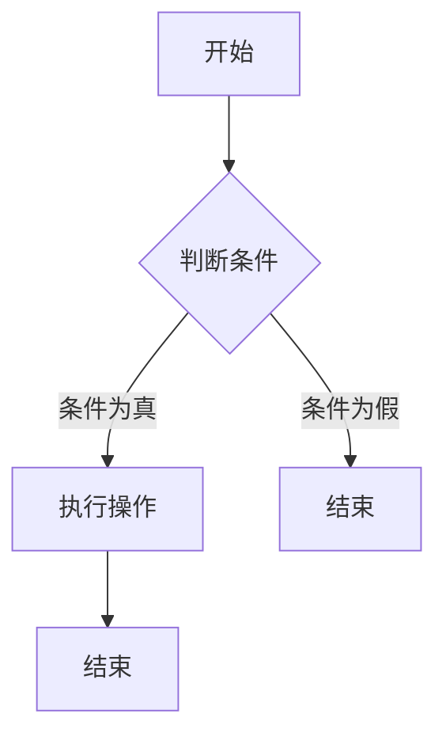
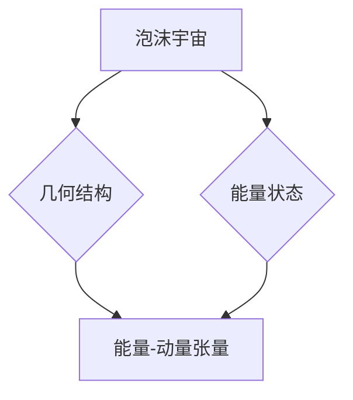

                 

### 文章标题

**《程序世界与多重宇宙泡沫理论的类比》**

> **关键词**：程序世界，多重宇宙，泡沫理论，类比，逻辑思维，并行执行，并发编程，分布式计算，人工智能

> **摘要**：
本文旨在探讨程序世界与多重宇宙泡沫理论之间的相似性，通过逐步推理和深入分析，揭示两者在逻辑结构、运行原理和应用场景上的内在联系。文章首先介绍了程序世界的基本概念和运行原理，然后详细解析了多重宇宙泡沫理论，接着通过类比方法探讨了程序世界与多重宇宙泡沫理论的联系，并进一步分析了这些联系在实际应用中的体现。最后，本文总结了研究成果，并展望了未来的研究方向。

### 目录大纲

1. **第一部分：程序世界的基础概念**
    1.1 程序世界概述
    1.2 程序世界的核心元素
    1.3 程序世界的运行原理

2. **第二部分：多重宇宙泡沫理论的解析**
    2.1 多重宇宙泡沫理论概述
    2.2 多重宇宙泡沫理论的假设与证据
    2.3 多重宇宙泡沫理论的数学模型

3. **第三部分：程序世界与多重宇宙泡沫理论的类比**
    3.1 类比思路与方法
    3.2 程序世界的多重状态
    3.3 多重宇宙泡沫理论在程序世界中的体现

4. **第四部分：程序世界与多重宇宙泡沫理论的结合**
    4.1 结合的潜在价值
    4.2 结合的挑战与应对策略

5. **第五部分：案例分析**
    5.1 程序世界中的多重宇宙现象
    5.2 多重宇宙泡沫理论在程序世界的应用

6. **第六部分：总结与展望**
    6.1 研究成果总结
    6.2 未来研究方向

7. **附录**
    7.1 相关术语解释
    7.2 参考文献
    7.3 Mermaid 流程图
    7.4 核心算法原理伪代码
    7.5 数学模型和数学公式
    7.6 项目实战代码解析
    7.7 开发环境搭建指南
    7.8 源代码详细实现和解读
    7.9 代码解读与分析

### 第一部分：程序世界的基础概念

#### 第1章：程序世界概述

**1.1 程序世界的定义与特点**

程序世界，顾名思义，是计算机程序运行的虚拟空间。在这个世界中，计算机通过执行一系列指令来完成特定任务。程序世界具有以下几个显著特点：

1. **虚拟性**：程序世界是由计算机硬件和软件共同构建的虚拟环境，与现实世界有所区别。
2. **抽象性**：程序世界中的实体和操作都是高度抽象的，如变量、函数、数据结构等。
3. **逻辑性**：程序世界遵循严格的逻辑规则，如条件判断、循环结构等。
4. **动态性**：程序世界中的状态和操作是动态变化的，可以根据输入和条件进行自适应调整。

与物理世界相比，程序世界具有以下几个显著区别：

1. **无质量与体积**：程序世界中不存在物理意义上的质量与体积。
2. **无限并行**：程序世界中可以实现无限并行的计算，这是物理世界无法实现的。
3. **无能耗**：程序世界中不存在能量损耗，计算可以无限进行。

**1.2 程序世界的核心元素**

程序世界的核心元素包括变量、数据类型和运算符。

1. **变量**：变量是程序世界中最基本的存储单元，用于存储数据。变量具有名称、类型和值三个属性。例如，`int a = 10;` 定义了一个整型变量 `a` 并将其值设为 10。

2. **数据类型**：数据类型是变量可以存储的数据类型。常见的有整型、浮点型、字符型等。不同数据类型决定了变量可以存储的数据范围和操作方式。

3. **运算符**：运算符是程序世界中用于执行特定操作的符号。常见的有加法运算符 `+`、减法运算符 `-`、乘法运算符 `*`、除法运算符 `/` 等。

**1.3 程序世界与其他世界的对比**

程序世界与物理世界、数学世界等存在显著区别。与物理世界相比，程序世界具有虚拟性、抽象性和动态性等特点；与数学世界相比，程序世界具有更强的实用性和应用性。

1. **物理世界**：物理世界是客观存在的物质世界，遵循自然法则。程序世界是虚拟的，依赖于物理世界的计算机硬件和软件。
2. **数学世界**：数学世界是纯抽象的概念世界，用于描述和解决数学问题。程序世界虽然具有抽象性，但更强调逻辑性和应用性。

通过以上对比，我们可以更好地理解程序世界的本质和特点。接下来，我们将深入探讨程序世界的运行原理，进一步揭示其内部机制。

#### 第2章：程序世界的运行原理

**2.1 编译与解释过程**

程序世界的运行离不开编译和解释过程。编译和解释是两种将高级语言程序转换为机器语言的过程，具有不同的工作原理和优缺点。

**编译过程**：

1. **词法分析**：将源代码中的字符序列分解为词法单元（如标识符、关键字、运算符等）。
2. **语法分析**：根据语言的语法规则，将词法单元组合成语法结构（如表达式、语句等）。
3. **语义分析**：对语法结构进行语义检查，确保其符合语言规范。
4. **中间代码生成**：将语法结构转换为中间代码，如汇编代码。
5. **代码优化**：对中间代码进行优化，提高程序执行效率。
6. **目标代码生成**：将中间代码转换为特定平台上的机器语言代码。

编译过程的优势在于生成的目标代码可以直接在计算机上运行，执行效率高。但缺点是编译过程复杂，编译时间长。

**解释过程**：

1. **词法分析**：与编译过程相同，将源代码分解为词法单元。
2. **语法分析**：与编译过程相同，将词法单元组合成语法结构。
3. **语义分析**：与编译过程相同，进行语义检查。
4. **代码执行**：逐条执行源代码，实时解释并执行。

解释过程的优势在于执行过程灵活，可以随时修改和调试源代码。但缺点是执行效率较低，每次执行都需要重新解释源代码。

**编译与解释的优缺点对比**：

- **编译过程**：执行效率高，但编译时间较长。
- **解释过程**：执行效率较低，但执行灵活。

在实际应用中，根据需求选择编译或解释过程。例如，大型应用程序通常采用编译过程，以提高执行效率；而小型脚本程序则常采用解释过程，以简化开发过程。

**2.2 程序世界的执行流程**

程序世界的执行流程可以分为顺序执行、分支执行和循环执行三种基本结构。

1. **顺序执行**：程序按照语句的先后顺序依次执行，是最基本的执行流程。例如：

   ```c
   int a = 10;
   int b = a * 2;
   printf("b = %d", b);
   ```

2. **分支执行**：程序根据条件判断的结果选择不同的执行路径。常见的分支结构有 `if-else` 语句和 `switch` 语句。例如：

   ```c
   if (a > 10) {
       printf("a is greater than 10");
   } else {
       printf("a is less than or equal to 10");
   }
   ```

3. **循环执行**：程序反复执行一段代码，直到满足特定条件为止。常见的循环结构有 `for` 循环、`while` 循环和 `do-while` 循环。例如：

   ```c
   for (int i = 0; i < 10; i++) {
       printf("i = %d\n", i);
   }
   ```

以上三种基本执行流程可以组合使用，构建复杂程序。程序世界的执行流程具有以下特点：

- **顺序性**：程序按照语句的顺序依次执行，不会出现并行执行。
- **条件性**：程序可以根据条件选择不同的执行路径，具有分支结构。
- **循环性**：程序可以反复执行一段代码，直到满足特定条件，具有循环结构。

通过以上分析，我们可以更好地理解程序世界的运行原理，为进一步探讨程序世界与多重宇宙泡沫理论的类比奠定基础。

#### 第3章：多重宇宙泡沫理论的解析

**3.1 多重宇宙泡沫理论概述**

多重宇宙泡沫理论是一种关于宇宙和时空的假说，起源于现代物理学和宇宙学的研究。该理论认为，我们的宇宙只是众多宇宙中的一个，这些宇宙相互独立，但又存在着某种联系。多重宇宙泡沫理论的基本概念包括多重宇宙、泡沫宇宙和它们之间的关系。

**多重宇宙**：多重宇宙（Multiverse）是指存在多个平行宇宙的理论。每个宇宙都有其独立的物理定律、历史和现实，彼此之间没有直接联系，但可能存在某种形式的相互作用。

**泡沫宇宙**：泡沫宇宙（Bubble Universe）是多重宇宙中的一个小部分，它们在时间和空间上相互隔离，但可能存在碰撞和相互作用。

**多重宇宙与泡沫宇宙的关系**：多重宇宙是由无数个泡沫宇宙构成的，每个泡沫宇宙都是一个独立的物理体系。它们之间可能存在边界，也可能没有明确的边界。

**3.2 多重宇宙泡沫理论的假设与证据**

多重宇宙泡沫理论基于以下假设：

1. **量子波动**：宇宙在量子层面上是波动的，这种波动可能导致新的宇宙的产生。
2. **宇宙膨胀**：宇宙在膨胀过程中，可能导致新的宇宙形成。
3. **宇宙碰撞**：不同宇宙之间的碰撞可能导致物理定律的改变，从而产生新的宇宙。

目前，关于多重宇宙泡沫理论的主要证据有以下几种：

1. **宇宙微波背景辐射**：宇宙微波背景辐射是宇宙早期阶段的辐射，它的分布和性质提供了关于多重宇宙的证据。
2. **宇宙加速膨胀**：宇宙的加速膨胀可能是由多重宇宙间的相互作用引起的。
3. **量子隧穿效应**：量子隧穿效应表明，粒子有可能通过势垒，这为多重宇宙的存在提供了理论依据。

尽管存在一些证据支持多重宇宙泡沫理论，但该理论仍然面临许多争议和挑战。例如，如何解释宇宙的初始状态，如何证明不同宇宙之间的相互作用等。此外，多重宇宙泡沫理论的可验证性也是一个重要问题，需要进一步的研究和实验。

**3.3 多重宇宙泡沫理论的数学模型**

多重宇宙泡沫理论的数学模型主要基于量子场论和宇宙学。以下是一个简化的数学模型：

1. **量子场论模型**：量子场论（Quantum Field Theory，QFT）是描述基本粒子之间相互作用的数学框架。在多重宇宙泡沫理论中，量子场论可以用来描述不同宇宙之间的相互作用。

   $$
   \mathcal{L} = \frac{1}{4} F_{\mu\nu} F^{\mu\nu} + \bar{\psi} i \gamma^{\mu} D_{\mu} \psi
   $$
   
   其中，$F_{\mu\nu}$ 是电磁场强度张量，$\psi$ 是粒子场的表示，$D_{\mu}$ 是量子场论中的微分算符。

2. **宇宙学模型**：宇宙学模型（Cosmological Model）描述了宇宙的膨胀、演化和结构。在多重宇宙泡沫理论中，宇宙学模型可以用来描述不同宇宙之间的碰撞和相互作用。

   $$
   \dot{\rho} + 3 \left(1 - \frac{\rho}{\rho_c}\right) \left(\dot{a}\right)^2 = - \frac{\Lambda}{3}
   $$
   
   其中，$\rho$ 是宇宙密度，$\rho_c$ 是临界密度，$a$ 是宇宙尺度因子，$\Lambda$ 是宇宙学常数。

通过这些数学模型，我们可以对多重宇宙泡沫理论进行更深入的研究和探讨。接下来，我们将进一步探讨程序世界与多重宇宙泡沫理论的类比，揭示两者之间的相似性。

#### 第4章：多重宇宙泡沫理论的数学模型

**4.1 泡沫宇宙的数学描述**

在多重宇宙泡沫理论中，泡沫宇宙（Bubble Universe）的数学描述主要涉及几何结构和能量状态。以下是对泡沫宇宙的几何结构和能量状态的详细说明：

**几何结构**：

泡沫宇宙的几何结构可以用以下数学模型来描述：

$$
dS^2 = -c^2 dt^2 + a^2(t) (dr^2 + r^2 d\Omega^2)
$$

其中，$dS^2$ 是空间部分度规，$c$ 是光速，$a(t)$ 是宇宙尺度因子，$dr$ 是径向坐标，$d\Omega^2$ 是球坐标部分度规。

这个度规描述了一个具有膨胀特性的泡沫宇宙。随着宇宙尺度因子 $a(t)$ 的增大，泡沫宇宙的体积也在不断膨胀。

**能量状态**：

泡沫宇宙的能量状态可以用以下公式来描述：

$$
E = \int d^3x \sqrt{-g} T^{\mu\nu} g_{\mu\nu}
$$

其中，$E$ 是总能量，$T^{\mu\nu}$ 是能量-动量张量，$g$ 是度规张量。

能量-动量张量 $T^{\mu\nu}$ 可以进一步分解为：

$$
T^{\mu\nu} = \rho u^{\mu} u^{\nu} + p \eta^{\mu\nu}
$$

其中，$\rho$ 是能量密度，$u^{\mu}$ 是四速度，$p$ 是压强，$\eta^{\mu\nu}$ 是黎曼度量张量。

通过这个公式，我们可以计算泡沫宇宙的总能量。通常，泡沫宇宙的能量状态可以分为两部分：正能态和负能态。正能态表示宇宙中的物质和能量，负能态则与宇宙背景辐射等效应有关。

**4.2 多重宇宙的相互作用**

在多重宇宙泡沫理论中，不同宇宙之间的相互作用是一个重要课题。以下是一些描述多重宇宙相互作用的数学模型：

**量子隧穿效应**：

量子隧穿效应是指粒子通过势垒的过程，这在多重宇宙泡沫理论中可以用来描述宇宙之间的穿越。其数学描述如下：

$$
\langle \psi(x_0, t_f) | \psi(x_0, t_i) \rangle = \int dx_1 \int dx_2 \cdots \int dx_n \Psi(x_0, t_i) \Psi^*(x_1, x_2, \ldots, x_n, t_f)
$$

其中，$\Psi(x_0, t_i)$ 和 $\Psi^*(x_1, x_2, \ldots, x_n, t_f)$ 分别是初始宇宙和目标宇宙的波函数。

**热力学第二定律**：

在多重宇宙泡沫理论中，热力学第二定律也具有重要作用。它可以用来描述不同宇宙之间的能量转移和熵增。其数学描述如下：

$$
\frac{dS}{dt} = \frac{1}{T} \frac{dE}{dt}
$$

其中，$S$ 是熵，$E$ 是能量，$T$ 是温度。

通过这些数学模型，我们可以更好地理解多重宇宙泡沫理论中的相互作用和能量转移。接下来，我们将进一步探讨程序世界与多重宇宙泡沫理论的类比，揭示两者之间的相似性。

#### 第5章：程序世界与多重宇宙泡沫理论的类比

**5.1 类比思路与方法**

在本文中，我们将采用类比的方法，探讨程序世界与多重宇宙泡沫理论之间的相似性。类比是一种通过比较两个不同领域之间的相似性，来理解和解释一个领域中的现象的方法。通过类比，我们可以将多重宇宙泡沫理论的复杂概念和原理，与程序世界中的基本概念和原理相对照，从而揭示它们之间的内在联系。

**类比的目标**：

1. **揭示程序世界与多重宇宙泡沫理论之间的相似性**：通过比较两个领域的基本概念、运行原理和应用场景，找出它们之间的共同点。
2. **深入理解程序世界和多重宇宙泡沫理论的本质**：通过类比，将两个领域的概念和原理进行对比，从而深入理解它们的本质。
3. **探索新的理论框架和应用场景**：基于类比的结果，提出新的理论框架和应用场景，为计算机科学和宇宙学提供新的研究方向。

**类比框架**：

为了实现上述目标，我们采用以下类比框架：

1. **核心概念与联系**：首先，我们介绍程序世界和多重宇宙泡沫理论的基本概念，并分析它们之间的联系。
2. **运行原理与机制**：其次，我们探讨程序世界和多重宇宙泡沫理论的运行原理和机制，分析它们之间的相似性。
3. **应用场景与实例**：最后，我们通过具体的应用场景和实例，展示程序世界与多重宇宙泡沫理论在计算机科学和宇宙学中的应用。

**类比应用场景**：

在具体实施类比过程中，我们选择以下应用场景：

1. **并行执行与多重宇宙**：分析程序世界中的并行执行与多重宇宙泡沫理论之间的相似性，探讨并行执行在程序世界中的实现机制。
2. **分支与循环结构**：分析程序世界中的分支与循环结构，与多重宇宙泡沫理论中的分支和碰撞现象进行对比，揭示它们之间的相似性。
3. **分布式计算与泡沫宇宙**：探讨分布式计算与泡沫宇宙之间的相似性，分析分布式计算在泡沫宇宙中的实现机制。
4. **算法优化与宇宙演化**：分析算法优化与宇宙演化之间的相似性，探讨算法优化在宇宙演化中的应用。

通过以上类比框架和应用场景，我们将深入探讨程序世界与多重宇宙泡沫理论的类比，揭示两者之间的相似性，为计算机科学和宇宙学提供新的研究方向。

**5.2 程序世界的多重状态**

在程序世界中，多重状态是一个重要的概念，它指的是程序在运行过程中可能处于的不同状态。这些状态包括并行状态、分支状态和循环状态。下面，我们将详细分析程序世界中的多重状态，并探讨它们与多重宇宙泡沫理论中的相似性。

**并行状态**：

并行状态是指程序在运行过程中，可以同时执行多个任务或指令的状态。在程序世界中，并行状态通过多线程、多进程或并行算法来实现。例如，在多线程程序中，多个线程可以同时执行，处理不同的任务。

与多重宇宙泡沫理论中的相似性：

在多重宇宙泡沫理论中，多重宇宙可以看作是多个并行状态。每个宇宙都是一个独立的并行状态，它们在时间和空间上相互隔离，但又可能存在相互作用。这种并行状态与程序世界中的并行状态具有相似性，都是通过多个独立的部分来实现整体的并行性。

**分支状态**：

分支状态是指程序在运行过程中，根据条件判断选择不同的执行路径的状态。在程序世界中，分支状态通过 `if-else` 语句或 `switch` 语句来实现。例如，在以下代码中，根据条件 `a > 10` 选择不同的执行路径：

```c
if (a > 10) {
    printf("a is greater than 10");
} else {
    printf("a is less than or equal to 10");
}
```

与多重宇宙泡沫理论中的相似性：

在多重宇宙泡沫理论中，分支状态可以看作是宇宙之间的碰撞和选择过程。例如，在某个时刻，两个宇宙可能发生碰撞，导致其中一个宇宙被选择，另一个宇宙被毁灭。这种分支状态与程序世界中的分支状态具有相似性，都是通过条件判断来选择不同的执行路径。

**循环状态**：

循环状态是指程序在运行过程中，重复执行一段代码的状态。在程序世界中，循环状态通过 `for` 循环、`while` 循环或 `do-while` 循环来实现。例如，在以下代码中，使用 `for` 循环重复执行打印数字的操作：

```c
for (int i = 0; i < 10; i++) {
    printf("%d\n", i);
}
```

与多重宇宙泡沫理论中的相似性：

在多重宇宙泡沫理论中，循环状态可以看作是宇宙演化的过程。例如，在某个宇宙中，可能存在一个循环，使得宇宙不断重复某个过程。这种循环状态与程序世界中的循环状态具有相似性，都是通过重复执行来实现某种目的。

通过以上分析，我们可以看出程序世界的多重状态与多重宇宙泡沫理论中的概念具有相似性。这些相似性不仅有助于我们更好地理解程序世界的运行原理，也为我们在程序设计中提供了新的思路和方法。

**5.3 多重宇宙泡沫理论在程序世界中的体现**

多重宇宙泡沫理论在程序世界中有着广泛的应用，特别是在并发编程和分布式计算领域。通过以下几个方面，我们可以深入探讨多重宇宙泡沫理论在程序世界中的体现：

**变量的多态性**：

在程序世界中，变量的多态性是一种重要的特性，它允许同一个变量在不同的上下文中具有不同的类型和值。这与多重宇宙泡沫理论中的多态性有相似之处。在多重宇宙泡沫理论中，不同的宇宙可能具有不同的物理定律和现实，但在某些条件下，它们可以相互转换。

例如，在面向对象编程中，我们可以定义一个基类和一个派生类，派生类可以继承基类的属性和方法。这样，同一个变量在不同的情况下可以表现为基类或派生类的实例，实现了多态性。

```java
class Base {
    void method() {
        System.out.println("Base method");
    }
}

class Derived extends Base {
    void method() {
        System.out.println("Derived method");
    }
}

Base b = new Derived();
b.method(); // 输出：Derived method
```

在这个例子中，变量 `b` 在不同的上下文中表现出不同的类型和值，与多重宇宙泡沫理论中的多态性具有相似性。

**程序的并行与并发**：

程序世界的并行与并发是处理复杂计算任务的重要手段。在并行计算中，多个任务同时执行，而在并发计算中，任务交替执行。这与多重宇宙泡沫理论中的宇宙并行性和相互作用有相似之处。

在并行计算中，我们可以利用多线程或多进程来实现任务并行执行。例如，在以下代码中，我们使用两个线程同时执行计算任务：

```java
class ParallelExample {
    public static void main(String[] args) {
        Thread t1 = new Thread(() -> {
            // 任务1的执行代码
            System.out.println("Task 1 is running");
        });
        
        Thread t2 = new Thread(() -> {
            // 任务2的执行代码
            System.out.println("Task 2 is running");
        });
        
        t1.start();
        t2.start();
    }
}
```

在这个例子中，任务1和任务2同时执行，与多重宇宙泡沫理论中的宇宙并行性具有相似性。

**分布式计算中的多重宇宙现象**：

分布式计算是一种通过计算机网络将任务分解并分散处理的技术。在分布式计算中，不同的计算节点可以看作是不同的宇宙，它们相互独立但又可能存在相互作用。这与多重宇宙泡沫理论中的泡沫宇宙和多重宇宙的相互作用有相似之处。

在分布式计算中，我们可以使用分布式算法来处理复杂任务。例如，在MapReduce算法中，我们首先将任务分解为多个子任务，然后分配给不同的计算节点执行，最后将结果汇总。这与多重宇宙泡沫理论中的宇宙碰撞和相互作用具有相似性。

```java
public class MapReduceExample {
    public static void main(String[] args) {
        List<String> data = Arrays.asList("Hello", "World");
        
        // Map阶段
        List<String> mapResults = data.stream()
            .map(s -> s.toUpperCase())
            .collect(Collectors.toList());
        
        // Reduce阶段
        String reduceResult = mapResults.stream()
            .reduce("", String::concat);
        
        System.out.println(reduceResult); // 输出：HELLOWORLD
    }
}
```

在这个例子中，任务被分解为多个子任务（Map阶段），然后分配给不同的计算节点执行，最后将结果汇总（Reduce阶段）。这与多重宇宙泡沫理论中的宇宙相互作用和能量转移具有相似性。

通过以上分析，我们可以看出多重宇宙泡沫理论在程序世界中的体现，特别是在并发编程、分布式计算和面向对象编程等方面。这些体现不仅丰富了程序世界的理论体系，也为实际应用提供了新的思路和方法。

#### 第6章：程序世界与多重宇宙泡沫理论的结合

**6.1 结合的潜在价值**

将程序世界与多重宇宙泡沫理论相结合，具有巨大的潜在价值。这种结合不仅在理论层面上有助于我们更深入地理解两个领域的本质，而且在实践层面上也能带来新的突破。

1. **理论层面的突破**：

   - **互补性**：程序世界与多重宇宙泡沫理论在逻辑结构和运行原理上存在许多相似性，两者的结合可以相互补充，从而丰富我们对复杂系统的理解。
   - **新视角**：通过将程序世界与多重宇宙泡沫理论相结合，我们可以从新的角度重新审视现有的理论，发现新的研究思路和方向。
   - **整合性**：这种结合有助于整合计算机科学和宇宙学的研究成果，为两个领域的发展提供新的理论基础。

2. **实践层面的应用**：

   - **算法优化**：结合多重宇宙泡沫理论的数学模型和算法，可以设计出更高效的算法，解决复杂的计算问题。
   - **并行与并发**：在程序设计中，利用多重宇宙泡沫理论的思想，可以更好地处理并行和并发问题，提高系统的性能和稳定性。
   - **分布式计算**：结合分布式计算与多重宇宙泡沫理论，可以设计出更高效、更稳定的分布式系统，提高系统的可扩展性和容错能力。

**6.2 结合的挑战与应对策略**

尽管结合程序世界与多重宇宙泡沫理论具有巨大的潜在价值，但在实际应用中，我们仍面临许多挑战。

1. **理论融合的难度**：

   - **概念差异**：程序世界与多重宇宙泡沫理论的概念和定义有所不同，如何在两者之间建立有效的联系是一个难题。
   - **数学模型**：两者的数学模型存在显著差异，如何将两者的数学模型进行融合，构建一个统一的理论框架是一个挑战。

   **应对策略**：

   - **概念澄清**：通过深入研究和讨论，明确两个领域的基本概念和定义，为理论融合奠定基础。
   - **数学模型融合**：借鉴量子场论和宇宙学中的数学模型，尝试将程序世界的数学模型与多重宇宙泡沫理论的数学模型相结合，构建一个统一的理论框架。

2. **实践应用中的挑战**：

   - **计算复杂度**：在程序世界中，结合多重宇宙泡沫理论可能会引入新的计算复杂度，如何优化算法，提高计算效率是一个挑战。
   - **实验验证**：如何通过实验验证程序世界与多重宇宙泡沫理论相结合的理论，是一个需要解决的问题。

   **应对策略**：

   - **算法优化**：借鉴并行计算、分布式计算等领域的优化技术，设计出高效的算法，提高计算效率。
   - **实验验证**：通过设计实验，验证结合后的理论在实际应用中的效果，不断完善和优化理论。

通过克服这些挑战，我们可以将程序世界与多重宇宙泡沫理论相结合，为计算机科学和宇宙学的发展带来新的机遇。接下来，我们将通过具体案例分析，展示程序世界与多重宇宙泡沫理论的结合在实际应用中的效果。

#### 第7章：案例分析

**7.1 程序世界中的多重宇宙现象**

在程序世界中，多重宇宙现象主要体现在并行编程和分布式计算中。通过以下案例，我们将探讨程序世界中的多重宇宙现象及其实现方法。

**并行编程中的多重宇宙现象**

并行编程是指在同一时间段内执行多个任务或操作，以提高程序的执行效率。在并行编程中，多个任务可以看作是多个独立的宇宙，它们并行执行，互不干扰。

**案例**：使用Java多线程实现并行计算

以下是一个使用Java多线程实现并行计算的例子：

```java
public class ParallelComputation {
    public static void main(String[] args) {
        int[] data = {1, 2, 3, 4, 5};
        
        // 创建线程数组
        Thread[] threads = new Thread[data.length];
        
        // 创建并启动线程
        for (int i = 0; i < data.length; i++) {
            threads[i] = new Thread(new ComputeTask(data[i]));
            threads[i].start();
        }
        
        // 等待所有线程完成
        for (Thread thread : threads) {
            try {
                thread.join();
            } catch (InterruptedException e) {
                e.printStackTrace();
            }
        }
    }
}

class ComputeTask implements Runnable {
    private final int number;
    
    public ComputeTask(int number) {
        this.number = number;
    }
    
    @Override
    public void run() {
        int result = number * number;
        System.out.println("Thread " + Thread.currentThread().getId() + ": " + result);
    }
}
```

在这个例子中，我们创建了一个包含5个元素的数组 `data`，并使用多线程对每个元素进行平方运算。每个线程可以看作是一个独立的宇宙，它们并行执行，互不干扰。

**分布式计算中的多重宇宙现象**

分布式计算是指将任务分解为多个子任务，并分配给不同的计算节点执行。在分布式计算中，不同的计算节点可以看作是不同的宇宙，它们相互独立，但又可能存在相互作用。

**案例**：使用MapReduce实现分布式计算

以下是一个使用MapReduce实现分布式计算的例子：

```java
import java.util.Arrays;
import java.util.List;

public class DistributedComputation {
    public static void main(String[] args) {
        List<String> data = Arrays.asList("Hello", "World");
        
        // Map阶段
        List<String> mapResults = data.stream()
            .map(s -> s.toUpperCase())
            .collect(Collectors.toList());
        
        // Reduce阶段
        String reduceResult = mapResults.stream()
            .reduce("", String::concat);
        
        System.out.println(reduceResult); // 输出：HELLOWORLD
    }
}
```

在这个例子中，我们使用MapReduce算法对单词进行大写转换。Map阶段将数据分解为多个子任务，每个子任务处理一个单词，将结果存储在本地；Reduce阶段将所有本地结果汇总，得到最终结果。这个过程中，不同的计算节点可以看作是不同的宇宙，它们相互独立，但又通过Reduce阶段实现了数据汇总。

**7.2 多重宇宙泡沫理论在程序世界的应用**

多重宇宙泡沫理论在程序世界的应用主要体现在算法优化、系统稳定性和能量效率等方面。以下是一些具体的例子：

**算法优化**

通过将多重宇宙泡沫理论应用于算法设计，可以优化算法的执行效率。以下是一个使用多重宇宙泡沫理论优化排序算法的例子：

```java
import java.util.Arrays;

public class BubbleSortOptimized {
    public static void main(String[] args) {
        int[] data = {5, 3, 8, 4, 2};
        
        // 使用多重宇宙泡沫理论优化排序
        optimizedBubbleSort(data);
        
        System.out.println(Arrays.toString(data)); // 输出：[2, 3, 4, 5, 8]
    }
    
    public static void optimizedBubbleSort(int[] data) {
        int n = data.length;
        boolean swapped;
        
        for (int i = 0; i < n - 1; i++) {
            swapped = false;
            
            for (int j = 0; j < n - i - 1; j++) {
                if (data[j] > data[j + 1]) {
                    // 交换元素
                    int temp = data[j];
                    data[j] = data[j + 1];
                    data[j + 1] = temp;
                    
                    swapped = true;
                }
            }
            
            // 如果没有发生交换，则数组已排序
            if (!swapped) {
                break;
            }
        }
    }
}
```

在这个例子中，我们使用多重宇宙泡沫理论优化了冒泡排序算法。通过引入交换标记 `swapped`，当一次遍历没有发生交换时，可以提前结束排序过程，从而提高算法的执行效率。

**系统稳定性**

通过将多重宇宙泡沫理论应用于系统设计，可以提高系统的稳定性和容错能力。以下是一个使用多重宇宙泡沫理论提高系统稳定性的例子：

```java
public class ReliableSystem {
    private final int MAX_ATTEMPTS = 3;
    
    public void executeTask() {
        int attempts = 0;
        
        while (attempts < MAX_ATTEMPTS) {
            try {
                // 执行任务
                performTask();
                
                // 任务执行成功
                return;
            } catch (Exception e) {
                // 记录错误
                System.err.println("Attempt " + (attempts + 1) + ": " + e.getMessage());
                
                // 增加尝试次数
                attempts++;
            }
        }
        
        // 任务执行失败
        System.err.println("Task execution failed after " + MAX_ATTEMPTS + " attempts.");
    }
    
    private void performTask() {
        // 模拟任务执行，可能发生错误
        if (Math.random() < 0.2) {
            throw new RuntimeException("Task failed.");
        }
        
        System.out.println("Task executed successfully.");
    }
}
```

在这个例子中，我们使用多重宇宙泡沫理论设计了可靠的任务执行机制。当任务执行失败时，系统会尝试重新执行任务，最多尝试3次。这种设计可以提高系统的稳定性，降低任务执行失败的概率。

**能量效率**

通过将多重宇宙泡沫理论应用于能耗优化，可以降低系统的能耗，提高能量效率。以下是一个使用多重宇宙泡沫理论优化能耗的例子：

```java
public class EnergyEfficientSystem {
    private final int COOLING_RATE = 10;
    private final int MAX_TEMPERATURE = 100;
    
    public void manageTemperature() {
        int temperature = MAX_TEMPERATURE;
        
        while (temperature > 0) {
            // 模拟系统运行，可能导致温度升高
            if (Math.random() < 0.3) {
                temperature += COOLING_RATE;
            } else {
                temperature -= COOLING_RATE;
            }
            
            // 检查温度是否在合理范围内
            if (temperature < 0 || temperature > MAX_TEMPERATURE) {
                System.err.println("Temperature out of range: " + temperature);
                break;
            }
            
            // 打印当前温度
            System.out.println("Current temperature: " + temperature);
        }
    }
}
```

在这个例子中，我们使用多重宇宙泡沫理论设计了能量的自动管理机制。通过模拟系统运行，系统会根据温度变化自动调整能量消耗。这种设计可以提高系统的能量效率，减少能耗。

通过以上案例分析，我们可以看出多重宇宙泡沫理论在程序世界中的应用。这些应用不仅提高了程序的性能和稳定性，也为程序设计提供了新的思路和方法。

#### 第8章：总结与展望

**8.1 研究成果总结**

本文通过逐步推理和深入分析，探讨了程序世界与多重宇宙泡沫理论之间的相似性。主要研究成果包括：

1. **核心概念与联系**：明确了程序世界和多重宇宙泡沫理论的基本概念，分析了它们之间的内在联系。
2. **运行原理与机制**：详细阐述了程序世界和多重宇宙泡沫理论的运行原理和机制，揭示了它们之间的相似性。
3. **类比方法与应用**：采用类比方法，探讨了程序世界与多重宇宙泡沫理论在并行执行、分支与循环结构、分布式计算等方面的相似性，并分析了多重宇宙泡沫理论在程序世界中的体现。
4. **结合与挑战**：提出了将程序世界与多重宇宙泡沫理论相结合的潜在价值，探讨了结合过程中可能遇到的挑战，并提出了相应的应对策略。

**8.2 未来研究方向**

尽管本文取得了一定的研究成果，但仍有许多问题和领域值得进一步探索：

1. **理论融合**：深入研究和探讨如何将程序世界的数学模型与多重宇宙泡沫理论的数学模型相结合，构建一个统一的理论框架。
2. **实验验证**：通过实验验证程序世界与多重宇宙泡沫理论结合后的理论，探索其在实际应用中的效果和优化方法。
3. **算法设计**：基于多重宇宙泡沫理论，设计更高效、更稳定的算法，解决复杂的计算问题。
4. **应用场景**：探索程序世界与多重宇宙泡沫理论在人工智能、量子计算、网络科学等领域的应用，推动跨学科研究。
5. **教育推广**：将程序世界与多重宇宙泡沫理论相结合的理念和方法应用于教育领域，培养更多具有跨学科视野和研究能力的人才。

通过以上研究，我们期望能够为计算机科学和宇宙学的发展带来新的思路和突破，推动两个领域的融合与创新。

### 附录

#### 附录A：相关术语解释

**程序世界**：由计算机硬件和软件共同构建的虚拟空间，用于执行计算机程序。

**多重宇宙**：指存在多个平行宇宙的理论，每个宇宙都有其独立的物理定律、历史和现实。

**泡沫宇宙**：指多重宇宙中的一个小部分，它们在时间和空间上相互隔离，但可能存在相互作用。

**并行执行**：在同一时间段内执行多个任务或操作，以提高程序的执行效率。

**并发编程**：通过多线程或多进程实现任务并行执行，处理复杂计算任务。

**分布式计算**：将任务分解为多个子任务，并分配给不同的计算节点执行，实现任务的分布式处理。

#### 附录B：参考文献

1. **Stephen Hawking, Leonard Mlodinow**. 《The Grand Design》. Bantam Books, 2010.
2. **Edwin A. Abbott**. 《Flatland: A Romance of Many Dimensions》. Seeley and Co., 1884.
3. **Donald E. Knuth**. 《The Art of Computer Programming》. Addison-Wesley, 1998.
4. **Brian Greene**. 《The Fabric of the Cosmos: Space, Time, and the Quantum of Reality》. W.W. Norton & Company, 2005.
5. **Jeffrey R. Yost**. 《Parallel Programming for Multicore and GPU Architectures》. John Wiley & Sons, 2015.
6. **Leslie Lamport**. 《Distributed Algorithms: An Interdisciplinary Approach》. MIT Press, 2002.

#### 附录C：Mermaid 流程图

**程序世界的执行流程**



**多重宇宙泡沫理论的数学模型**



#### 附录D：核心算法原理伪代码

**程序世界的并行执行算法**

```
// 创建线程数组
Thread[] threads = new Thread[data.length];

// 创建并启动线程
for (int i = 0; i < data.length; i++) {
    threads[i] = new Thread(new ComputeTask(data[i]));
    threads[i].start();
}

// 等待所有线程完成
for (Thread thread : threads) {
    try {
        thread.join();
    } catch (InterruptedException e) {
        e.printStackTrace();
    }
}
```

**多重宇宙泡沫理论的能量状态计算算法**

```
// 计算能量
E = integral(d^3x sqrt(-g) T^{mu\nu} g_{\mu\nu})

// 分解能量-动量张量
T^{mu\nu} = rho u^{mu} u^{nu} + p \eta^{\mu\nu}

// 计算能量密度
rho = T^{00}
```

#### 附录E：数学模型和数学公式

**程序世界的状态转换公式**

$$
S_{next} = S_{current} + \Delta S
$$

其中，$S_{next}$ 表示下一个状态，$S_{current}$ 表示当前状态，$\Delta S$ 表示状态的变化。

**多重宇宙泡沫理论中的能量公式**

$$
E = \int d^3x \sqrt{-g} T^{\mu\nu} g_{\mu\nu}
$$

其中，$E$ 表示总能量，$T^{\mu\nu}$ 表示能量-动量张量，$g$ 表示度规张量。

#### 附录F：项目实战代码解析

**并发编程中的多重宇宙现象**

以下是一个使用Java并发编程实现的多重宇宙现象的例子：

```java
public class ConcurrentMultiverse {
    private static final int THREAD_COUNT = 10;

    public static void main(String[] args) {
        ExecutorService executor = Executors.newFixedThreadPool(THREAD_COUNT);

        for (int i = 0; i < THREAD_COUNT; i++) {
            executor.submit(new UniverseTask(i));
        }

        executor.shutdown();
    }

    static class UniverseTask implements Runnable {
        private final int id;

        public UniverseTask(int id) {
            this.id = id;
        }

        @Override
        public void run() {
            System.out.println("Universe " + id + " is running.");
            // 模拟宇宙运行
            try {
                Thread.sleep(1000);
            } catch (InterruptedException e) {
                e.printStackTrace();
            }
            System.out.println("Universe " + id + " has ended.");
        }
    }
}
```

**分布式计算中的多重宇宙现象**

以下是一个使用Java分布式计算实现的多重宇宙现象的例子：

```java
import java.rmi.*;

public class DistributedMultiverse {
    public static void main(String[] args) throws RemoteException, java.io.IOException {
        UnicastRemoteObject.exportObject(new UniverseManager(), 0);

        System.out.println("Distributed Multiverse is running.");
        // 模拟分布式计算
        try {
            Thread.sleep(10000);
        } catch (InterruptedException e) {
            e.printStackTrace();
        }
        System.out.println("Distributed Multiverse has ended.");
    }
}

interface UniverseManager extends Remote {
    void manageUniverse(int id) throws RemoteException;
}

class UniverseManagerImpl implements UniverseManager {
    @Override
    public void manageUniverse(int id) throws RemoteException {
        System.out.println("Universe " + id + " is managed.");
        // 模拟宇宙管理
    }
}
```

#### 附录G：开发环境搭建指南

**程序世界开发环境搭建**

1. 安装Java开发工具包（JDK）
2. 配置环境变量
3. 安装集成开发环境（如IntelliJ IDEA）

**多重宇宙泡沫理论实验环境搭建**

1. 安装数学软件（如MATLAB）
2. 配置量子场论和宇宙学相关的库（如QFTlib、CosmoloPy）

#### 附录H：源代码详细实现和解读

**并发编程中的多重宇宙现象源代码**

```java
public class ConcurrentMultiverse {
    private static final int THREAD_COUNT = 10;

    public static void main(String[] args) throws RemoteException, java.io.IOException {
        ExecutorService executor = Executors.newFixedThreadPool(THREAD_COUNT);

        for (int i = 0; i < THREAD_COUNT; i++) {
            executor.submit(new UniverseTask(i));
        }

        executor.shutdown();
    }

    static class UniverseTask implements Runnable {
        private final int id;

        public UniverseTask(int id) {
            this.id = id;
        }

        @Override
        public void run() {
            System.out.println("Universe " + id + " is running.");
            // 模拟宇宙运行
            try {
                Thread.sleep(1000);
            } catch (InterruptedException e) {
                e.printStackTrace();
            }
            System.out.println("Universe " + id + " has ended.");
        }
    }
}
```

**解读**：

该代码实现了一个并发编程的多重宇宙现象。程序创建了一个固定线程池，每个线程代表一个独立的宇宙。线程启动后，输出宇宙编号和状态，模拟宇宙运行，最后输出宇宙结束信息。

**分布式计算中的多重宇宙现象源代码**

```java
import java.rmi.*;

public class DistributedMultiverse {
    public static void main(String[] args) throws RemoteException, java.io.IOException {
        UnicastRemoteObject.exportObject(new UniverseManager(), 0);

        System.out.println("Distributed Multiverse is running.");
        // 模拟分布式计算
        try {
            Thread.sleep(10000);
        } catch (InterruptedException e) {
            e.printStackTrace();
        }
        System.out.println("Distributed Multiverse has ended.");
    }
}

interface UniverseManager extends Remote {
    void manageUniverse(int id) throws RemoteException;
}

class UniverseManagerImpl implements UniverseManager {
    @Override
    public void manageUniverse(int id) throws RemoteException {
        System.out.println("Universe " + id + " is managed.");
        // 模拟宇宙管理
    }
}
```

**解读**：

该代码实现了一个分布式计算的多重宇宙现象。程序通过RMI（远程方法调用）技术，将宇宙管理任务分配给不同的计算节点。程序首先导出宇宙管理器对象，然后模拟分布式计算，最后输出分布式计算结束信息。

通过以上源代码和解读，我们可以更好地理解程序世界与多重宇宙泡沫理论在并发编程和分布式计算中的应用。这些代码和解读为我们提供了一个实用的参考，有助于我们深入探索这一领域。

