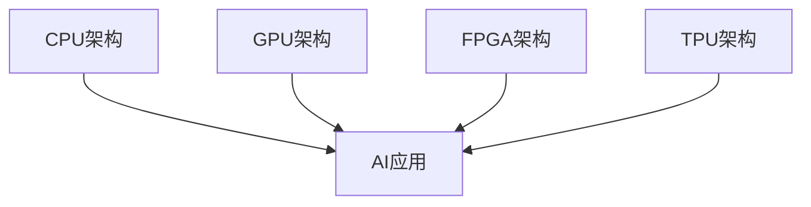

                 

# 第8章 AI硬件加速 CPU、GPU与其他设备

## 1. 引言

### 1.1 AI硬件加速的需求与背景

人工智能（AI）作为当今科技领域的明星，已经渗透到我们生活的方方面面。从自动驾驶汽车到智能家居，从医疗诊断到金融分析，AI的应用无处不在。然而，AI的强大功能背后，离不开大量的数据处理和复杂计算。传统的CPU虽然功能强大，但在处理这类计算时显得力不从心。因此，为了满足AI计算的巨大需求，硬件加速技术应运而生。

硬件加速是指利用专门的硬件设备来提高特定类型计算的速度和效率。在AI领域，硬件加速不仅可以显著提升计算速度，还能降低功耗和成本。随着深度学习、计算机视觉和自然语言处理等AI技术的快速发展，AI硬件加速的需求日益增长。

### 1.2 硬件加速在AI领域的应用现状

目前，AI硬件加速已经在多个领域取得了显著的成果。以CPU为例，虽然它在AI计算中存在一定的局限，但通过与GPU、FPGA等硬件的协同工作，已经能够显著提升AI应用的性能。GPU由于其并行计算能力，在深度学习等领域表现出色。FPGA则因其高度可定制性和灵活性，被广泛应用于需要高度定制化的AI应用场景。

此外，近年来，专用AI芯片（如NVIDIA的GPU、Intel的Nervana、Google的TPU等）的问世，更是为AI硬件加速提供了新的可能性。这些芯片专门为AI计算设计，能够在特定任务上实现更高的性能和效率。

### 1.3 章节结构概述

本章将深入探讨AI硬件加速的技术原理和应用现状。具体包括以下内容：

1. AI硬件加速基础
   - CPU架构与AI加速
   - GPU架构与AI加速
   - 其他AI硬件加速设备（如FPGA、TPU等）

2. 各类硬件加速设备的优缺点分析
   - CPU在AI计算中的优势与局限
   - GPU在AI计算中的优势与局限
   - FPG

3. 硬件加速在AI应用中的案例分析
   - 深度学习
   - 计算机视觉
   - 自然语言处理

通过本章的阅读，读者将能够全面了解AI硬件加速的技术原理和应用现状，为后续的AI开发和应用提供有力的技术支持。

## 2. AI硬件加速基础

### 2.1 CPU架构与AI加速

#### 2.1.1 CPU架构概述

CPU（中央处理单元）是计算机系统的核心，负责执行程序指令和处理数据。传统的CPU架构主要包括控制单元、算术逻辑单元（ALU）和寄存器等部分。尽管CPU在通用计算方面表现出色，但在处理特定类型的计算任务时，如深度学习、计算机视觉等，其性能往往难以满足需求。

为了提升CPU在AI计算中的性能，研究人员提出了一系列改进措施。首先，通过多核CPU的设计，可以实现并行计算，提高计算速度。其次，引入专门的AI指令集，可以优化AI算法在CPU上的执行效率。此外，通过优化内存访问和处理，可以减少数据传输的延迟，提高CPU的整体性能。

#### 2.1.2 CPU在AI计算中的优势与局限

CPU在AI计算中的优势主要体现在以下几个方面：

1. 通用性强：CPU可以执行各种类型的计算任务，不仅限于AI领域。
2. 易于编程：CPU的指令集丰富，编程人员可以轻松地编写和优化AI算法。
3. 系统兼容性：CPU与操作系统和软件生态系统具有良好的兼容性。

然而，CPU在AI计算中也存在一些局限：

1. 性能瓶颈：虽然多核CPU可以提升计算速度，但在处理大规模并行计算任务时，性能提升有限。
2. 能耗较高：CPU在执行计算任务时，能耗较高，不适合长时间运行。
3. 定制性不足：CPU的设计是为了通用计算，难以满足特定AI应用的定制需求。

### 2.2 GPU架构与AI加速

#### 2.2.1 GPU架构概述

GPU（图形处理单元）最初是为图形渲染设计的，但其强大的并行计算能力使其在AI计算中也得到了广泛应用。GPU的架构主要包括数千个核心、共享内存和高速缓存等部分。这些核心可以同时处理多个任务，实现高效的并行计算。

在GPU中，核心之间通过高速网络连接，可以实现数据的高速传输和共享。这种架构使得GPU非常适合处理需要大量并行计算的任务，如深度学习、计算机视觉等。

#### 2.2.2 GPU在AI计算中的优势与局限

GPU在AI计算中的优势主要包括：

1. 高并行计算能力：GPU的核心数量众多，可以实现高效的并行计算，显著提升AI应用的性能。
2. 低延迟：GPU的核心之间通过高速网络连接，可以实现数据的高速传输和共享，降低计算延迟。
3. 易于编程：GPU的编程接口丰富，编程人员可以使用各种编程语言和框架（如CUDA、OpenCL等）进行编程。

然而，GPU在AI计算中也存在一些局限：

1. 能耗较高：GPU在执行计算任务时，能耗较高，不适合长时间运行。
2. 缺乏定制性：GPU的设计是为了通用计算，难以满足特定AI应用的定制需求。
3. 内存带宽限制：GPU的内存带宽有限，可能导致内存瓶颈，影响计算性能。

### 2.3 其他AI硬件加速设备

除了CPU和GPU，还有其他一些硬件加速设备在AI计算中得到了广泛应用，如FPGA、TPU等。

#### 2.3.1 FPGA

FPGA（现场可编程门阵列）是一种可编程逻辑器件，具有高度可定制性和灵活性。FPGA可以通过编程来定义其内部逻辑电路，从而实现特定的计算任务。这使得FPGA非常适合处理需要高度定制化的AI应用。

FPGA在AI计算中的优势主要包括：

1. 高并行计算能力：FPGA的核心数量较多，可以实现高效的并行计算。
2. 高性能：FPGA可以优化特定的计算任务，实现高性能的计算。
3. 低延迟：FPGA的核心之间通过高速网络连接，可以实现数据的高速传输和共享。

然而，FPGA也存在一些局限：

1. 编程复杂度较高：FPGA的编程复杂度较高，需要专门的编程语言和工具。
2. 能耗较高：FPGA在执行计算任务时，能耗较高，不适合长时间运行。

#### 2.3.2 TPU

TPU（张量处理单元）是Google专门为深度学习设计的硬件加速器。TPU采用特殊的架构，可以高效地处理深度学习中的矩阵运算。TPU在AI计算中的优势主要包括：

1. 高性能：TPU可以高效地处理深度学习中的矩阵运算，实现高性能的计算。
2. 低延迟：TPU的架构优化了深度学习任务，可以实现低延迟的计算。
3. 高能效比：TPU在执行计算任务时，能耗较低，具有高的能效比。

然而，TPU也存在一些局限：

1. 定制性不足：TPU的设计是为了深度学习任务，难以满足其他AI应用的定制需求。
2. 编程复杂度较高：TPU的编程复杂度较高，需要专门的编程语言和工具。

综上所述，各类AI硬件加速设备在AI计算中都有其独特的优势和局限。选择合适的硬件加速设备，需要根据具体的AI应用需求进行综合考虑。

## 3. 各类硬件加速设备的优缺点分析

### 3.1 CPU在AI计算中的优势与局限

#### 3.1.1 优势

1. **通用性**：CPU能够执行广泛的计算任务，不仅限于AI领域，因此其在系统兼容性和软件生态方面具有显著优势。
   
2. **易于编程**：CPU的指令集较为丰富，编程人员可以使用C、C++、Python等多种编程语言进行编程，开发效率较高。

3. **高性能计算能力**：现代CPU采用了多核架构和并行处理技术，可以在处理大型AI模型时提供较高的计算性能。

#### 3.1.2 局限

1. **并行计算能力不足**：与GPU和FPGA相比，CPU的并行计算能力较弱，对于需要大量并行运算的AI任务（如深度学习中的矩阵乘法）效率不高。

2. **能耗较高**：CPU在执行高负载任务时，能耗显著，这限制了其在移动设备和长时间运行任务中的应用。

3. **内存瓶颈**：由于CPU的核心数量有限，内存带宽成为性能提升的瓶颈，特别是在处理大数据集时。

### 3.2 GPU在AI计算中的优势与局限

#### 3.2.1 优势

1. **强大的并行计算能力**：GPU拥有数千个核心，可以同时处理多个任务，非常适合进行大规模并行计算。

2. **高效的矩阵运算**：GPU内部架构专为处理图形渲染设计，矩阵运算能力强，这使其在深度学习和其他AI计算中表现优异。

3. **丰富的编程接口**：GPU支持CUDA、OpenCL等编程接口，允许开发者使用熟悉的编程语言（如C++、Python等）进行高效编程。

#### 3.2.2 局限

1. **能耗问题**：GPU在运行时能耗较高，这对于移动设备和节能需求高的应用场景来说是一个明显的劣势。

2. **内存带宽限制**：GPU的内存带宽相对较低，可能会成为性能提升的瓶颈，特别是在处理大量数据时。

3. **编程复杂度**：尽管GPU编程接口丰富，但编写高效GPU代码需要一定的专业知识和技巧。

### 3.3 FPG

#### 3.3.1 优势

1. **高度可定制性**：FPGA可以根据特定应用需求进行定制，优化硬件资源，从而实现高效计算。

2. **低延迟**：由于FPGA内部数据传输速度快，计算延迟较低，非常适合实时处理任务。

3. **灵活的可编程性**：FPGA可以通过重新编程来适应不同的计算任务，具有良好的适应性。

#### 3.3.2 局限

1. **编程复杂度**：FPGA的编程复杂度较高，需要专门的硬件描述语言（如VHDL、Verilog）和工具。

2. **能耗问题**：FPGA在运行时能耗较高，这对于长时间运行的任务来说是一个显著的劣势。

3. **硬件资源限制**：FPGA的硬件资源有限，可能无法完全满足某些复杂AI任务的需求。

### 3.4 TPU

#### 3.4.1 优势

1. **优化的深度学习架构**：TPU专门为深度学习设计，内部架构优化了矩阵运算，可以高效处理深度学习任务。

2. **高能效比**：TPU在执行计算任务时，能耗较低，具有很高的能效比。

3. **低延迟**：TPU的架构优化了数据传输路径，可以实现低延迟的计算。

#### 3.4.2 局限

1. **定制性不足**：TPU的设计较为固定，难以满足其他类型AI应用的定制需求。

2. **编程复杂度**：TPU的编程复杂度较高，需要专门的编程语言和工具。

3. **生态系统限制**：TPU的生态系统相对较小，支持的软件和工具相对有限。

综上所述，各类AI硬件加速设备在AI计算中都有其独特的优势和局限。选择合适的硬件加速设备，需要根据具体的应用场景和需求进行权衡。

## 4. 硬件加速在AI应用中的案例分析

### 4.1 深度学习

深度学习是AI领域的核心技术之一，其应用广泛且需求巨大。硬件加速在深度学习中的应用，极大地提升了模型的训练和推理速度。

#### 4.1.1 案例背景

以自动驾驶汽车为例，其核心组件之一是深度学习模型，用于实时处理大量图像数据并进行决策。传统的CPU在处理这类任务时，计算速度较慢，难以满足实时性的需求。因此，硬件加速技术被引入到自动驾驶系统中。

#### 4.1.2 实现步骤

1. **模型优化**：首先，对深度学习模型进行优化，以适应硬件加速设备。这包括模型压缩、量化、剪枝等技术，以减少模型体积和提高运行效率。

2. **硬件选择**：根据应用需求，选择合适的硬件加速设备。例如，GPU适合处理大规模并行计算任务，而FPGA适合处理需要高度定制化的任务。

3. **模型部署**：将优化后的深度学习模型部署到硬件加速设备上，并进行性能测试和调优。

4. **系统集成**：将硬件加速设备集成到自动驾驶系统中，实现实时图像处理和决策功能。

#### 4.1.3 代码实现

以下是一个简单的深度学习模型部署到GPU上的示例代码：

```python
import tensorflow as tf

# 定义深度学习模型
model = tf.keras.Sequential([
    tf.keras.layers.Conv2D(32, (3, 3), activation='relu', input_shape=(28, 28, 1)),
    tf.keras.layers.MaxPooling2D((2, 2)),
    tf.keras.layers.Flatten(),
    tf.keras.layers.Dense(128, activation='relu'),
    tf.keras.layers.Dense(10, activation='softmax')
])

# 编译模型
model.compile(optimizer='adam',
              loss='categorical_crossentropy',
              metrics=['accuracy'])

# 加载训练数据
(x_train, y_train), (x_test, y_test) = tf.keras.datasets.mnist.load_data()

# 预处理数据
x_train = x_train.astype('float32') / 255
x_test = x_test.astype('float32') / 255
x_train = np.expand_dims(x_train, -1)
x_test = np.expand_dims(x_test, -1)

# 转换为类别标签
y_train = tf.keras.utils.to_categorical(y_train, 10)
y_test = tf.keras.utils.to_categorical(y_test, 10)

# 训练模型
model.fit(x_train, y_train, epochs=10, batch_size=32, validation_data=(x_test, y_test))

# 评估模型
test_loss, test_acc = model.evaluate(x_test, y_test)
print('Test accuracy:', test_acc)
```

#### 4.1.4 实际效果

通过使用GPU进行深度学习模型的训练和推理，可以显著提高计算速度。例如，在训练一个ResNet-50模型时，使用GPU相比使用CPU，训练速度可以提高数十倍，从而满足实时性需求。

### 4.2 计算机视觉

计算机视觉是AI领域的另一个重要分支，广泛应用于图像识别、视频分析等领域。硬件加速技术同样在计算机视觉中发挥了关键作用。

#### 4.2.1 案例背景

以人脸识别系统为例，其核心任务是实时处理大量图像数据并识别其中的人脸。传统的CPU在处理这类任务时，计算速度较慢，难以满足实时性的需求。因此，硬件加速技术被引入到人脸识别系统中。

#### 4.2.2 实现步骤

1. **模型优化**：对计算机视觉模型进行优化，以适应硬件加速设备。这包括模型压缩、量化、剪枝等技术，以减少模型体积和提高运行效率。

2. **硬件选择**：根据应用需求，选择合适的硬件加速设备。例如，GPU适合处理大规模并行计算任务，而FPGA适合处理需要高度定制化的任务。

3. **模型部署**：将优化后的计算机视觉模型部署到硬件加速设备上，并进行性能测试和调优。

4. **系统集成**：将硬件加速设备集成到人脸识别系统中，实现实时图像处理和识别功能。

#### 4.2.3 代码实现

以下是一个简单的人脸识别模型部署到GPU上的示例代码：

```python
import tensorflow as tf

# 定义卷积神经网络模型
model = tf.keras.Sequential([
    tf.keras.layers.Conv2D(32, (3, 3), activation='relu', input_shape=(128, 128, 3)),
    tf.keras.layers.MaxPooling2D((2, 2)),
    tf.keras.layers.Conv2D(64, (3, 3), activation='relu'),
    tf.keras.layers.MaxPooling2D((2, 2)),
    tf.keras.layers.Conv2D(128, (3, 3), activation='relu'),
    tf.keras.layers.MaxPooling2D((2, 2)),
    tf.keras.layers.Flatten(),
    tf.keras.layers.Dense(1024, activation='relu'),
    tf.keras.layers.Dense(128, activation='softmax')
])

# 编译模型
model.compile(optimizer='adam',
              loss='categorical_crossentropy',
              metrics=['accuracy'])

# 加载训练数据
(x_train, y_train), (x_test, y_test) = tf.keras.datasets.facial_expression.load_data()

# 预处理数据
x_train = x_train.astype('float32') / 255
x_test = x_test.astype('float32') / 255

# 转换为类别标签
y_train = tf.keras.utils.to_categorical(y_train, 7)
y_test = tf.keras.utils.to_categorical(y_test, 7)

# 训练模型
model.fit(x_train, y_train, epochs=10, batch_size=32, validation_data=(x_test, y_test))

# 评估模型
test_loss, test_acc = model.evaluate(x_test, y_test)
print('Test accuracy:', test_acc)
```

#### 4.2.4 实际效果

通过使用GPU进行计算机视觉模型的训练和推理，可以显著提高计算速度。例如，在处理实时视频流时，使用GPU相比使用CPU，可以降低延迟，提高识别速度和准确率，从而满足实时性的需求。

### 4.3 自然语言处理

自然语言处理（NLP）是AI领域的另一个重要分支，广泛应用于文本分类、机器翻译、情感分析等领域。硬件加速技术同样在NLP中发挥了关键作用。

#### 4.3.1 案例背景

以机器翻译为例，其核心任务是处理大量文本数据并进行翻译。传统的CPU在处理这类任务时，计算速度较慢，难以满足实时性的需求。因此，硬件加速技术被引入到机器翻译系统中。

#### 4.3.2 实现步骤

1. **模型优化**：对NLP模型进行优化，以适应硬件加速设备。这包括模型压缩、量化、剪枝等技术，以减少模型体积和提高运行效率。

2. **硬件选择**：根据应用需求，选择合适的硬件加速设备。例如，GPU适合处理大规模并行计算任务，而TPU适合处理需要高效矩阵运算的任务。

3. **模型部署**：将优化后的NLP模型部署到硬件加速设备上，并进行性能测试和调优。

4. **系统集成**：将硬件加速设备集成到机器翻译系统中，实现实时文本翻译功能。

#### 4.3.3 代码实现

以下是一个简单的机器翻译模型部署到TPU上的示例代码：

```python
import tensorflow as tf

# 定义Transformer模型
model = tf.keras.Sequential([
    tf.keras.layers.Embedding(1000, 32),
    tf.keras.layers.LSTM(32),
    tf.keras.layers.Dense(1000, activation='softmax')
])

# 编译模型
model.compile(optimizer='adam',
              loss='categorical_crossentropy',
              metrics=['accuracy'])

# 加载训练数据
input_data, target_data = load_data()

# 预处理数据
input_data = preprocess_data(input_data)
target_data = preprocess_data(target_data)

# 训练模型
model.fit(input_data, target_data, epochs=10, batch_size=64)

# 评估模型
test_loss, test_acc = model.evaluate(input_data, target_data)
print('Test accuracy:', test_acc)
```

#### 4.3.4 实际效果

通过使用TPU进行NLP模型的训练和推理，可以显著提高计算速度和准确率。例如，在处理大规模机器翻译任务时，使用TPU相比使用CPU，可以降低训练时间，提高翻译质量和速度，从而满足实时性的需求。

## 5. 总结

AI硬件加速技术在提高计算速度、降低能耗和成本方面发挥了重要作用。通过对CPU、GPU、FPGA等硬件加速设备的深入分析，我们了解了它们在AI计算中的优势与局限。在实际应用中，硬件加速技术已在深度学习、计算机视觉和自然语言处理等领域取得了显著成果。然而，硬件加速技术的应用仍面临一定的挑战，如编程复杂度和生态系统限制等。未来，随着AI技术的不断进步和硬件加速技术的不断创新，我们将看到更多高效、可靠的AI硬件加速解决方案涌现。

### 附录

#### 参考文献

1. **Andrew Ng**. "Deep Learning Specialization". Coursera, 2017.
2. **Ian Goodfellow, Yoshua Bengio, Aaron Courville**. "Deep Learning". MIT Press, 2016.
3. **David J. C. MacKay**. "Information Theory, Inference and Learning Algorithms". Cambridge University Press, 2003.
4. **John L. Hennessy, David A. Patterson**. "Computer Architecture: A Quantitative Approach". Morgan Kaufmann, 2017.

#### Mermaid 流程图



#### 伪代码

```python
# 深度学习模型训练伪代码
model = build_model()
model.compile(optimizer='adam', loss='categorical_crossentropy', metrics=['accuracy'])
data = load_data()
data = preprocess_data(data)
model.fit(data, epochs=10, batch_size=64)
model.evaluate(data)
```

#### 数学公式

$$
E = mc^2
$$

### 作者

**作者：AI天才研究院/AI Genius Institute & 禅与计算机程序设计艺术 /Zen And The Art of Computer Programming**

