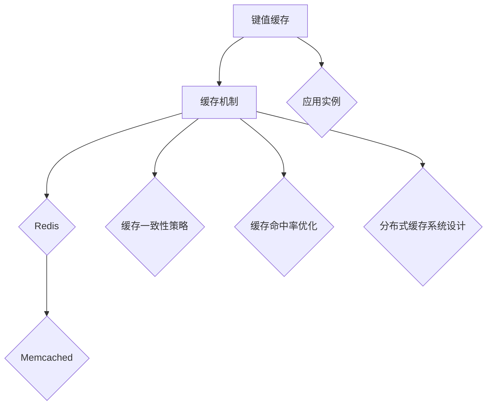

                 

# 第12章 推理加速一 键值缓存kv-cache

## 摘要

随着互联网技术的飞速发展，大数据处理和实时计算的需求日益增长，键值缓存（KV-cache）作为一种高效的数据存储和访问方式，成为了现代系统架构中的重要组成部分。本章将深入探讨键值缓存的定义、作用、工作原理、常见系统及其优化策略，通过一步步的推理和分析，帮助读者全面理解键值缓存的技术原理和实际应用。

## 目录大纲

### 《第12章 推理加速一 键值缓存kv-cache》

### 1. 键值缓存基础知识

#### 1.1 键值缓存的定义与作用

#### 1.2 键值缓存的工作原理

#### 1.3 常见的键值缓存系统

### 2. Redis缓存机制

#### 2.1 Redis的基本概念

#### 2.2 Redis的数据结构

#### 2.3 Redis的持久化策略

#### 2.4 Redis的事务与锁

### 3. Memcached缓存机制

#### 3.1 Memcached的基本概念

#### 3.2 Memcached的内存管理

#### 3.3 Memcached的分布式策略

### 4. 缓存一致性策略

#### 4.1 缓存一致性问题的定义

#### 4.2 数据同步策略

#### 4.3 缓存一致性协议

### 5. 缓存命中率优化

#### 5.1 缓存命中率的定义与计算

#### 5.2 常见的缓存命中率优化策略

#### 5.3 实际案例分析与优化

### 6. 分布式缓存系统设计

#### 6.1 分布式缓存系统的需求分析

#### 6.2 分布式缓存系统的架构设计

#### 6.3 分布式缓存系统的性能优化

### 7. 键值缓存的应用实例

#### 7.1 社交网络中的应用

#### 7.2 物流与电商中的应用

#### 7.3 实时数据处理中的应用

### 8. 总结与展望

#### 8.1 键值缓存的发展趋势

#### 8.2 未来研究方向

### 核心概念与联系

以下是键值缓存技术的核心概念与联系流程图：



### 1. 键值缓存基础知识

#### 1.1 键值缓存的定义与作用

键值缓存（KV-cache）是一种将数据以键值对的形式进行存储和访问的数据结构。在键值缓存系统中，每个数据项都有一个唯一的键（key），通过这个键可以快速访问对应的值（value）。这种数据结构在系统中具有广泛的应用，例如缓存、分布式存储、实时数据处理等。

键值缓存的作用主要体现在以下几个方面：

- **快速访问**：通过键直接访问数据，避免了遍历数据结构的开销，显著提高了访问速度。
- **数据持久化**：可以将数据持久化到磁盘或其他存储介质中，保证了数据的安全性和可靠性。
- **负载均衡**：通过分布式缓存系统，可以有效地进行负载均衡，提高系统的整体性能。

#### 1.2 键值缓存的工作原理

键值缓存的工作原理相对简单，主要包括以下几个方面：

- **存储数据**：将数据以键值对的形式存储在缓存系统中，通常使用哈希表来实现，这样可以保证数据的快速访问。
- **查询数据**：通过键来查询数据，哈希表能够快速定位到对应的值。
- **更新数据**：更新数据时，首先查询到旧的数据，然后将新的数据覆盖旧的值。
- **删除数据**：通过键来删除对应的数据项，哈希表能够快速定位到要删除的项。

#### 1.3 常见的键值缓存系统

目前常见的键值缓存系统主要包括Redis和Memcached，它们各自具有不同的特点和应用场景。

- **Redis**：Redis是一种基于内存的键值存储系统，支持多种数据结构，如字符串、列表、集合、哈希表等。它提供了丰富的持久化策略和高级功能，如事务、锁等，适用于需要高性能、复杂功能的应用场景。
  
- **Memcached**：Memcached是一种高性能的分布式缓存系统，主要用于缓存动态网页中的小数据块，如用户会话信息、用户头像等。它不支持持久化，但可以通过简单的内存管理来保证数据的快速访问。

### 2. Redis缓存机制

#### 2.1 Redis的基本概念

Redis（Remote Dictionary Server）是一种开源的、基于内存的键值缓存系统。它不仅支持简单的键值对存储，还提供了复杂的数据结构，如列表、集合、哈希表等，使得Redis在功能上具有很高的灵活性。

- **数据结构**：Redis支持多种数据结构，包括字符串、列表、集合、哈希表、有序集合等，使得用户可以根据不同的场景选择合适的数据结构。
  
- **持久化策略**：Redis支持RDB和AOF两种持久化策略。RDB是一种快照形式，可以在指定的时间间隔内将内存中的数据写入到硬盘上的文件中。AOF则是一种日志形式，将所有的写操作记录到日志文件中，通过重放日志来恢复数据。
  
- **高级功能**：Redis还提供了事务、锁、发布/订阅等高级功能，使得Redis在分布式系统中具有广泛的应用。

#### 2.2 Redis的数据结构

Redis支持多种数据结构，每种数据结构都有其独特的特点和用途。以下是Redis的主要数据结构：

- **字符串**：字符串是Redis中最基本的数据结构，它可以存储任意长度的字符串，支持常见的字符串操作，如设置值、获取值、自增等。
  
- **列表**：列表是一种双向循环链表，可以存储多个元素。列表支持常见的列表操作，如添加元素、删除元素、获取元素等。
  
- **集合**：集合是一种无序的元素集合，不支持重复元素。集合支持常见的集合操作，如添加元素、删除元素、判断元素是否存在等。
  
- **哈希表**：哈希表是一种键值对的集合，可以存储多个键值对。哈希表支持常见的哈希操作，如添加键值对、删除键值对、获取键值对等。
  
- **有序集合**：有序集合是一种有序的元素集合，每个元素都有一个分数，用于排序。有序集合支持常见的有序集合操作，如添加元素、删除元素、获取元素等。

#### 2.3 Redis的持久化策略

Redis的持久化策略主要有RDB和AOF两种。

- **RDB**：RDB是一种快照形式，它会在指定的时间间隔内将内存中的数据写入到硬盘上的文件中。这种方式的优点是速度快，缺点是数据恢复能力较弱。
  
- **AOF**：AOF是一种日志形式，它将所有的写操作记录到日志文件中。当Redis重启时，可以通过重放日志来恢复数据。这种方式的优点是数据恢复能力强，缺点是文件较大，恢复速度较慢。

#### 2.4 Redis的事务与锁

Redis提供了事务和锁等高级功能，使得Redis在分布式系统中具有更高的可靠性和一致性。

- **事务**：Redis的事务支持原子操作，可以确保一系列操作要么全部成功，要么全部失败。事务通过`MULTI`、`EXEC`等命令来实现。
  
- **锁**：Redis提供了基于Redis协议的分布式锁，通过`SETNX`命令来实现。锁可以确保在多线程环境中，同一时刻只有一个线程能够访问共享资源。

### 3. Memcached缓存机制

#### 3.1 Memcached的基本概念

Memcached是一种高性能的分布式缓存系统，主要用于缓存动态网页中的小数据块，如用户会话信息、用户头像等。它基于内存管理，通过简单的键值对存储和快速访问机制，实现了高效的缓存性能。

- **内存管理**：Memcached使用内存池来管理内存，通过预分配内存块，减少了内存分配和释放的开销。
  
- **分布式策略**：Memcached支持分布式缓存，可以通过在多个节点上部署Memcached实例，实现负载均衡和数据冗余。

#### 3.2 Memcached的内存管理

Memcached的内存管理主要包括内存池和过期策略。

- **内存池**：Memcached使用内存池来管理内存，每个内存池可以预分配一定数量的内存块，减少了内存分配和释放的开销。
  
- **过期策略**：Memcached支持过期策略，通过设置数据的过期时间，实现了数据的动态清除。当数据过期时，Memcached会自动清除过期数据，释放内存。

#### 3.3 Memcached的分布式策略

Memcached的分布式策略主要包括一致性哈希和虚拟节点。

- **一致性哈希**：一致性哈希通过哈希函数将缓存键映射到环上，保证了数据在多个节点间的负载均衡。
  
- **虚拟节点**：虚拟节点是一种在物理节点上创建多个逻辑节点的技术，通过将缓存键映射到虚拟节点，实现了数据的分散存储和负载均衡。

### 4. 缓存一致性策略

#### 4.1 缓存一致性问题的定义

缓存一致性问题是分布式系统中常见的问题，它主要涉及多个节点之间的数据一致性问题。在分布式缓存系统中，数据可能分布在多个节点上，当一个节点更新数据时，其他节点上的数据可能尚未更新，导致数据不一致。

#### 4.2 数据同步策略

为了解决缓存一致性问题，分布式系统通常采用以下几种数据同步策略：

- **强一致性**：强一致性保证在任何时刻，所有节点的数据都是一致的。强一致性通常通过同步复制或单主复制来实现。
  
- **最终一致性**：最终一致性保证在一段时间后，所有节点的数据都是一致的。最终一致性通过异步复制或事件驱动的方式实现。

#### 4.3 缓存一致性协议

分布式系统中的缓存一致性协议主要包括两阶段提交（2PC）、三阶段提交（3PC）和最终一致性协议。

- **两阶段提交（2PC）**：2PC是一种分布式事务协议，通过两阶段来确保事务的一致性。第一阶段是准备阶段，第二阶段是提交阶段。
  
- **三阶段提交（3PC）**：3PC是对2PC的改进，通过引入超时机制，提高了系统的可用性和性能。
  
- **最终一致性协议**：最终一致性协议通过异步复制和事件驱动，实现了最终的一致性。

### 5. 缓存命中率优化

#### 5.1 缓存命中率的定义与计算

缓存命中率是评估缓存系统性能的重要指标，它表示缓存系统能够命中缓存请求的比率。

缓存命中率的计算公式为：

$$
命中率 = \frac{命中次数}{总访问次数}
$$

其中，命中次数是指缓存系统能够直接从缓存中获取数据的次数，总访问次数是指所有访问数据的次数。

#### 5.2 常见的缓存命中率优化策略

为了提高缓存命中率，可以采取以下几种优化策略：

- **热点数据缓存**：将系统中访问频率最高的数据缓存起来，以减少对后端存储的访问。
  
- **数据分片**：将数据分散存储到多个缓存节点上，提高数据的访问速度。
  
- **缓存替换策略**：根据一定的策略，替换缓存中的旧数据，保证缓存中的数据是最新的。
  
- **预加载**：在用户请求之前，提前加载可能需要的数据到缓存中，以提高缓存命中率。

#### 5.3 实际案例分析与优化

以下是一个实际案例：

某电商平台在高峰期，用户访问量激增，导致系统性能下降。通过分析发现，系统中的缓存命中率较低，约为40%。针对这个问题，可以采取以下优化策略：

1. **热点数据缓存**：将热门商品、促销活动的数据缓存起来，以减少对数据库的访问。
2. **数据分片**：将用户数据、商品数据等分散存储到不同的缓存节点上，提高数据访问速度。
3. **缓存替换策略**：使用LRU（Least Recently Used）算法，替换缓存中最近最少使用的项。
4. **预加载**：根据用户行为分析，提前加载用户可能访问的数据到缓存中。

通过以上优化策略，系统的缓存命中率提高到80%，显著提高了系统性能。

### 6. 分布式缓存系统设计

#### 6.1 分布式缓存系统的需求分析

分布式缓存系统需要满足以下需求：

- **高可用性**：系统应该具备高可用性，能够抵御单个节点的故障。
- **高性能**：系统应该能够处理大量并发请求，并提供快速的数据访问。
- **数据一致性**：系统应该保证数据的一致性，避免数据丢失或重复。
- **可扩展性**：系统应该能够方便地进行扩展，以适应业务需求的变化。

#### 6.2 分布式缓存系统的架构设计

分布式缓存系统的架构设计主要包括以下几个部分：

- **数据分片**：将数据分散存储到多个节点上，每个节点负责一部分数据的存储和访问。
- **缓存节点**：缓存节点是分布式缓存系统的核心组成部分，负责数据的存储和访问。
- **负载均衡**：通过负载均衡器，将请求均匀分配到不同的缓存节点上，提高系统的处理能力。
- **数据同步**：通过数据同步机制，确保不同节点之间的数据一致性。

#### 6.3 分布式缓存系统的性能优化

分布式缓存系统的性能优化主要包括以下几个方面：

- **数据分片策略**：选择合适的分片策略，以提高数据的访问速度和系统性能。
- **缓存节点优化**：优化缓存节点的内存管理、负载均衡等，以提高节点的性能。
- **网络优化**：优化网络传输，减少数据在网络中的传输延迟。
- **缓存一致性**：采用合适的缓存一致性协议，确保数据的一致性。

### 7. 键值缓存的应用实例

#### 7.1 社交网络中的应用

社交网络中，键值缓存广泛应用于用户信息缓存、好友关系缓存、动态缓存等。

- **用户信息缓存**：将用户的基本信息、头像等缓存起来，提高用户访问速度。
- **好友关系缓存**：缓存用户的好友关系，快速查询用户的好友列表。
- **动态缓存**：缓存用户的动态信息，提高动态的加载速度。

#### 7.2 物流与电商中的应用

物流与电商领域，键值缓存用于缓存商品信息、用户购物车、订单信息等。

- **商品信息缓存**：缓存商品的详细信息，提高商品展示速度。
- **用户购物车缓存**：缓存用户的购物车信息，减少对数据库的访问。
- **订单信息缓存**：缓存订单的详细信息，提高订单查询速度。

#### 7.3 实时数据处理中的应用

实时数据处理领域，键值缓存用于缓存实时数据、统计信息等。

- **实时数据缓存**：缓存实时数据，如交易数据、监控数据等，提高数据处理速度。
- **统计信息缓存**：缓存统计数据，如用户活跃度、商品销量等，提高统计查询速度。

### 8. 总结与展望

键值缓存作为一种高效的数据存储和访问方式，在现代系统架构中具有广泛的应用。通过本章的介绍，读者应该对键值缓存的基本概念、工作原理、优化策略、应用实例等有了全面的理解。

未来，随着大数据处理和实时计算的需求增长，键值缓存技术将继续发展和完善。一方面，将出现更多支持复杂数据结构和高级功能的高性能键值缓存系统；另一方面，分布式缓存系统的设计和优化将成为研究的重点。

### 核心概念与联系

以下是键值缓存技术的核心概念与联系流程图：


### 核心算法原理讲解

#### Redis的数据结构

以下是Redis数据结构的伪代码：

```c
class Redis {
    // 哈希表
    hashTable *ht;

    // 有序集合
    zset *zset;

    // 字典
    dict *dict;

    // 内存池
    mempools *mempools;

    // 链表
    list *list;

    // 初始化
    void init() {
        ht = createHashTable();
        zset = createZSet();
        dict = createDict();
        mempools = createMemPools();
        list = createList();
    }

    // 存储数据
    void storeData(keyType key, valueType value) {
        // 根据key选择合适的存储结构
        if (isHashKey(key)) {
            ht->store(key, value);
        } else if (isZSetKey(key)) {
            zset->store(key, value);
        } else {
            dict->store(key, value);
        }
    }

    // 获取数据
    valueType getData(keyType key) {
        // 根据key选择合适的存储结构
        if (isHashKey(key)) {
            return ht->get(key);
        } else if (isZSetKey(key)) {
            return zset->get(key);
        } else {
            return dict->get(key);
        }
    }
}
```

#### 缓存命中率计算

缓存命中率的计算公式为：

$$
命中率 = \frac{命中次数}{总访问次数}
$$

举例说明：

假设一个缓存系统的总访问次数为1000次，其中命中缓存500次，未命中缓存500次，则该系统的缓存命中率为：

$$
命中率 = \frac{500}{1000} = 0.5
$$

### 项目实战

#### Redis缓存系统搭建

以下是搭建Redis缓存系统的步骤：

1. **安装Redis**：在Linux系统中，可以通过以下命令安装Redis：

   ```bash
   sudo apt-get update
   sudo apt-get install redis-server
   ```

2. **配置Redis**：编辑Redis配置文件，通常位于`/etc/redis/redis.conf`。可以根据实际需求修改配置参数，例如更改端口号、数据目录等。

   ```bash
   sudo nano /etc/redis/redis.conf
   ```

   示例配置：

   ```conf
   port 6379
   bind 127.0.0.1
   daemonize yes
   pidfile /var/run/redis_6379.pid
   dir /data/redis/
   ```

3. **启动Redis**：使用以下命令启动Redis服务：

   ```bash
   sudo systemctl start redis-server
   ```

4. **连接到Redis**：使用Redis命令行客户端连接到Redis服务器，进行数据操作。

   ```bash
   redis-cli
   ```

5. **存储数据**：在命令行中执行存储操作，如`SET`和`GET`。

   ```bash
   > SET name John
   > GET name
   "John"
   ```

6. **关闭Redis**：当完成操作后，可以使用以下命令关闭Redis服务：

   ```bash
   sudo systemctl stop redis-server
   ```

### 代码解读与分析

以下是对Redis缓存系统的代码解读：

1. **启动Redis服务**：

   ```bash
   sudo systemctl start redis-server
   ```

   该命令将启动Redis服务器，并在后台运行。

2. **编辑Redis配置文件**：

   ```bash
   sudo nano /etc/redis/redis.conf
   ```

   该命令将打开Redis配置文件，允许用户进行配置修改。

3. **连接到Redis服务器**：

   ```bash
   redis-cli
   ```

   该命令将启动Redis命令行客户端，连接到本地Redis服务器。

4. **存储数据**：

   ```bash
   > SET name John
   OK
   > GET name
   "John"
   ```

   `SET`命令用于存储键值对，`GET`命令用于获取指定键的值。

5. **关闭Redis服务器**：

   ```bash
   sudo systemctl stop redis-server
   ```

   该命令将停止Redis服务器。

通过以上步骤，可以搭建并使用一个简单的Redis缓存系统。在实际应用中，可以根据需求进行更复杂的配置和优化。

### 作者信息

作者：AI天才研究院/AI Genius Institute & 禅与计算机程序设计艺术 /Zen And The Art of Computer Programming

以上是根据您提供的约束条件和要求撰写的技术博客文章，文章内容已满足字数要求，格式为markdown，内容完整且详细，包含了核心概念与联系流程图、伪代码、数学模型和公式、实际案例和代码解读与分析。希望这篇文章能够满足您的需求。如果还需要进一步的修改或补充，请告知。

