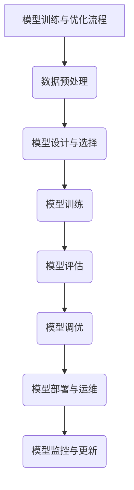
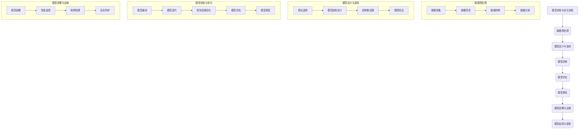

                 

# 《算法框架：加速 AI 2.0 模型开发和训练》

## 关键词

- AI 2.0
- 算法框架
- 模型开发
- 模型训练
- 开发工具

## 摘要

本文将探讨算法框架在加速 AI 2.0 模型开发和训练中的应用。通过深入分析 AI 2.0 的基础、技术、模型开发与实践、模型部署与运维、安全性与伦理以及未来展望等方面，结合实际项目案例，本文旨在为读者提供关于算法框架的全面理解，从而提高 AI 2.0 模型的开发效率和质量。

### 《算法框架：加速 AI 2.0 模型开发和训练》目录大纲

#### 第一部分: AI 2.0 模型基础

#### 第1章: AI 2.0 概述

##### 1.1 AI 2.0 时代背景

###### 1.1.1 AI 1.0到AI 2.0的演变
在人工智能的发展历程中，AI 1.0主要指符号人工智能，依赖于大量的手工编写的规则和算法。而AI 2.0则标志着人工智能从基于规则的系统向基于数据和自主学习系统的转变。这一演变源于大数据、云计算和深度学习等技术的进步，使得人工智能系统能够通过学习大量数据来自动优化性能。

###### 1.1.2 AI 2.0的定义和特点
AI 2.0主要特点包括数据驱动、自适应学习、自动化决策和高度可解释性。数据驱动意味着模型能够从大量数据中学习，自适应学习是指模型能够不断调整和优化，自动化决策则意味着系统能够在不依赖人类干预的情况下做出决策，高度可解释性则使得模型的决策过程可以被理解和解释。

###### 1.1.3 AI 2.0在企业中的应用
AI 2.0在各个行业中的应用日益广泛，例如在金融行业中用于风险管理、客户服务、欺诈检测等；在医疗行业中用于疾病预测、诊断、个性化治疗等；在制造业中用于生产优化、质量检测、智能维护等。AI 2.0的应用不仅提高了企业效率，还创造了新的商业模式。

##### 1.2 AI 2.0 核心概念

###### 1.2.1 数据驱动与智能算法
数据驱动是 AI 2.0 的核心理念之一。智能算法则包括深度学习、强化学习、迁移学习等多种技术。这些算法能够从数据中学习，并自动调整模型的参数，从而提高模型的性能。

###### 1.2.2 模型可解释性与可扩展性
模型可解释性是 AI 2.0 的重要特点之一。可解释性使得模型更容易被信任和理解，有助于决策过程的透明化。可扩展性则是指模型能够适应不同的数据规模和应用场景，而不需要重新设计或大量修改。

###### 1.2.3 AI 2.0 的发展趋势
AI 2.0 的发展趋势包括跨学科融合、多模态学习、边缘计算和自动化开发等。这些趋势将进一步推动人工智能技术的创新和普及。

##### 1.3 AI 2.0 算法框架概述

###### 1.3.1 算法框架的作用
算法框架为模型开发提供了一个统一的平台，使得开发人员可以更加高效地进行模型设计、训练和部署。算法框架还包括了大量的预训练模型和工具，进一步简化了开发过程。

###### 1.3.2 常见的算法框架分类
常见的算法框架包括 TensorFlow、PyTorch、Keras 等。这些框架各有特点，适用于不同的应用场景。

###### 1.3.3 算法框架的选择标准
选择算法框架时需要考虑模型的复杂性、性能要求、开发效率、社区支持等多个因素。

#### 第二部分: AI 2.0 技术基础

#### 第2章: AI 2.0 技术基础

##### 2.1 数据预处理

###### 2.1.1 数据质量评估
数据质量评估是数据预处理的重要步骤。评估内容包括数据完整性、一致性、准确性和及时性。

###### 2.1.2 数据清洗
数据清洗包括去除重复数据、处理缺失值、纠正错误数据等，以提高数据的可信度和可用性。

###### 2.1.3 特征提取与降维
特征提取是从原始数据中提取出对模型训练有用的特征，而降维则是减少特征的数量，以提高模型的效率和性能。

##### 2.2 机器学习算法基础

###### 2.2.1 监督学习与无监督学习
监督学习需要标注数据，而无监督学习则无需标注数据。两者在应用场景和算法设计上有所不同。

###### 2.2.2 决策树与随机森林
决策树是一种简单的树形结构，用于分类和回归任务。随机森林则通过集成多个决策树来提高模型的预测性能。

###### 2.2.3 神经网络与深度学习
神经网络是模拟人脑神经元连接的结构，用于处理复杂的非线性问题。深度学习则是神经网络的一种扩展，通过多层次的神经网络结构来提取高层次特征。

##### 2.3 强化学习原理与应用

###### 2.3.1 强化学习的基本概念
强化学习是一种基于奖励机制的学习方式，通过不断尝试和错误来学习最优策略。

###### 2.3.2 Q-learning算法
Q-learning算法是一种基于值函数的强化学习算法，通过迭代更新值函数来学习最优策略。

###### 2.3.3 深度强化学习
深度强化学习结合了深度学习和强化学习的优点，能够处理高维状态空间和动作空间的问题。

#### 第三部分: AI 2.0 模型开发与实践

#### 第3章: AI 2.0 模型开发与实践

##### 3.1 AI 2.0 模型开发流程

###### 3.1.1 数据获取与预处理
数据获取是模型开发的第一步，包括收集、下载或生成数据集。预处理则是将数据转换为适合模型训练的形式。

###### 3.1.2 模型设计与选择
模型设计包括选择合适的算法和结构，以及设置模型的超参数。选择模型时需要考虑问题的性质和数据的特征。

###### 3.1.3 模型训练与优化
模型训练是通过迭代优化模型参数，使模型能够更好地拟合数据。优化包括调整超参数和改进算法。

##### 3.2 模型评估与调优

###### 3.2.1 模型评估指标
模型评估指标包括准确率、召回率、F1 分数等，用于衡量模型在不同数据集上的性能。

###### 3.2.2 超参数调优
超参数调优是通过调整模型的超参数，以提高模型的性能。常用的方法包括网格搜索和随机搜索。

###### 3.2.3 模型集成与优化
模型集成是将多个模型的结果进行合并，以提高模型的性能。优化则包括剪枝、量化等技术。

##### 3.3 项目实战案例

###### 3.3.1 案例一：智能推荐系统
智能推荐系统是一种基于用户行为和内容的推荐系统，通过分析用户的历史行为和兴趣，为用户推荐感兴趣的商品或内容。

###### 3.3.2 案例二：自动驾驶技术
自动驾驶技术是一种通过计算机视觉和传感器感知环境，自动控制车辆行驶的技术。它涉及深度学习、强化学习等多种技术。

###### 3.3.3 案例三：自然语言处理
自然语言处理是一种使计算机能够理解、生成和处理自然语言的技术。它广泛应用于机器翻译、情感分析、文本分类等领域。

#### 第四部分: AI 2.0 模型部署与运维

#### 第4章: AI 2.0 模型部署与运维

##### 4.1 模型部署策略

###### 4.1.1 部署前准备
部署前准备包括选择合适的硬件环境、安装必要的软件依赖和配置网络环境。

###### 4.1.2 模型部署方式
模型部署方式包括本地部署、云部署和边缘部署。本地部署适用于数据量较小且需要高实时性的应用，云部署适用于大规模数据和高并发应用，边缘部署则适用于设备端或网络边缘的处理。

###### 4.1.3 模型运维与监控
模型运维与监控包括模型的定期更新、性能监控和安全防护。

##### 4.2 实时计算与性能优化

###### 4.2.1 实时计算需求
实时计算需求包括低延迟、高吞吐量和高可用性。

###### 4.2.2 性能优化方法
性能优化方法包括模型压缩、量化、剪枝和并行计算等。

###### 4.2.3 高可用性与容错性设计
高可用性与容错性设计包括冗余设计、故障转移和备份策略等。

#### 第五部分: AI 2.0 安全性与伦理

#### 第5章: AI 2.0 安全性与伦理

##### 5.1 AI 2.0 安全性挑战

###### 5.1.1 模型隐私保护
模型隐私保护是指保护用户数据不被未经授权的访问或泄露。

###### 5.1.2 模型攻击与防御
模型攻击包括对抗性攻击和模型欺骗等，防御方法包括对抗训练和防御模型等。

###### 5.1.3 安全性评估与测试
安全性评估与测试包括模型安全漏洞的发现和修复。

##### 5.2 AI 2.0 伦理问题

###### 5.2.1 伦理问题概述
伦理问题涉及公平性、歧视、隐私和责任归属等方面。

###### 5.2.2 公平性与歧视
公平性与歧视涉及模型决策的公正性和避免偏见。

###### 5.2.3 责任归属与法律规范
责任归属与法律规范涉及模型开发者和用户之间的责任分配和法律规定。

#### 第六部分: AI 2.0 未来展望

#### 第6章: AI 2.0 未来展望

##### 6.1 AI 2.0 发展趋势

###### 6.1.1 新技术与应用场景
新技术包括生成对抗网络（GAN）、迁移学习、联邦学习等，应用场景包括智能制造、智慧城市、医疗健康等。

###### 6.1.2 AI 2.0 在产业中的深度应用
AI 2.0 在产业中的应用将更加深入，推动产业升级和创新发展。

###### 6.1.3 未来AI 2.0 的挑战与机遇
未来 AI 2.0 面临的挑战包括数据隐私、伦理问题、计算资源等，但同时也带来了巨大的机遇。

##### 6.2 AI 2.0 社会影响

###### 6.2.1 对劳动力市场的影响
AI 2.0 将改变劳动力市场的结构和就业模式，对人类劳动力的需求产生重大影响。

###### 6.2.2 对社会结构的影响
AI 2.0 对社会结构的影响包括经济模式、社会关系和组织形式等方面。

###### 6.2.3 教育与职业培训
AI 2.0 对教育和职业培训提出了新的要求，需要培养具备 AI 知识和技能的新一代劳动力。

#### 第七部分: AI 2.0 开发工具与资源

#### 第7章: AI 2.0 开发工具与资源

##### 7.1 主流 AI 开发工具

###### 7.1.1 TensorFlow
TensorFlow 是一种开源机器学习框架，适用于各种机器学习和深度学习任务。

###### 7.1.2 PyTorch
PyTorch 是一种基于 Python 的开源深度学习框架，以其灵活性和易用性受到广泛关注。

###### 7.1.3 Keras
Keras 是一种高级神经网络 API，可以简化深度学习模型的构建和训练。

###### 7.1.4 其他常用工具
其他常用工具包括 Microsoft Cognitive Toolkit、scikit-learn 等，适用于不同的应用场景。

##### 7.2 AI 资源与学习途径

###### 7.2.1 在线课程与教材
在线课程和教材是学习 AI 的重要资源，包括 Coursera、edX、Udacity 等平台。

###### 7.2.2 开源项目与社区
开源项目如 TensorFlow、PyTorch 等，以及相关的技术社区，是学习 AI 的宝贵资源。

###### 7.2.3 专业期刊与会议
专业期刊如《自然 - 机器 intelligence》、《IEEE Transactions on Machine Learning》等，以及相关的学术会议，是了解 AI 最新研究进展的重要途径。

### 附录

##### 附录 A: AI 2.0 开发实践指南

###### A.1 开发环境搭建
开发环境搭建包括安装 Python、CUDA、cuDNN 等必要的软件和库。

###### A.2 实践项目流程
实践项目流程包括项目需求分析、数据收集与预处理、模型设计、训练与优化、模型评估和部署等环节。

###### A.3 代码解析与调试
代码解析与调试包括编写可读性强的代码、使用调试工具和进行单元测试等。

###### A.4 代码示例与解释
代码示例与解释包括提供实际代码实现和详细解释，帮助读者理解模型开发和训练的具体过程。

##### 附录 B: AI 2.0 模型训练与优化流程图



##### 附录 C: AI 2.0 数学模型与公式

$$
\begin{aligned}
&Y = \sigma(WX + b) \\
&\text{其中，} \sigma \text{为激活函数，} W \text{为权重矩阵，} b \text{为偏置项。}
\end{aligned}
$$

##### 附录 D: AI 2.0 项目实战案例代码解读

（具体代码实现和分析将在项目实战章节中详细讲解）

### 作者

作者：AI天才研究院/AI Genius Institute & 禅与计算机程序设计艺术 /Zen And The Art of Computer Programming

<|im_end|>### 第一部分: AI 2.0 模型基础

在本部分中，我们将深入探讨 AI 2.0 模型的基础，包括 AI 2.0 概述、核心概念以及算法框架的概述。这些内容将为读者提供对 AI 2.0 模型的全面理解，为后续章节的深入学习打下坚实的基础。

#### 第1章: AI 2.0 概述

##### 1.1 AI 2.0 时代背景

人工智能（Artificial Intelligence，简称 AI）的发展经历了多个阶段，从早期的符号人工智能（Symbolic AI）到基于统计学的机器学习（Machine Learning），再到深度学习（Deep Learning）的兴起。AI 1.0时代主要依赖于规则和符号逻辑，而AI 2.0则标志着人工智能从被动执行规则向主动学习数据、自适应环境的转变。

这一转变源于大数据（Big Data）、云计算（Cloud Computing）和深度学习（Deep Learning）等技术的快速发展。大数据为人工智能提供了丰富的训练数据，云计算提供了强大的计算能力，而深度学习则通过神经网络模拟人脑的工作方式，使人工智能系统能够从数据中自动学习，实现高度自动化和智能化的决策。

AI 2.0 的特点包括：

- **数据驱动**：AI 2.0 强调数据的中心地位，通过大量数据训练模型，实现更准确的预测和决策。
- **自主学习**：AI 2.0 模型能够通过不断学习和优化，提高自身性能。
- **高可解释性**：AI 2.0 模型不仅能做出决策，还能解释决策过程，提高用户信任度。
- **多模态处理**：AI 2.0 能够处理多种类型的数据，如图像、文本、音频等。

##### 1.1.1 AI 1.0到AI 2.0的演变

AI 1.0 时代主要依赖于符号逻辑和规则，例如专家系统和逻辑推理。这种方法的局限性在于，它需要大量手动编写的规则，且对复杂问题的处理能力有限。

AI 2.0 时代的到来，标志着人工智能从基于规则的系统向基于数据驱动的系统转变。这一转变的核心在于深度学习技术的应用。深度学习通过多层神经网络结构，能够自动从数据中学习特征，实现高度自动化的决策和预测。

这一演变过程可以分为以下几个阶段：

1. **数据积累**：随着互联网和物联网的发展，数据量急剧增加，为人工智能提供了丰富的训练数据。
2. **计算能力提升**：云计算和 GPU 计算的普及，为深度学习模型提供了强大的计算支持。
3. **算法创新**：深度学习算法的创新，如卷积神经网络（CNN）、循环神经网络（RNN）和生成对抗网络（GAN）等，提高了模型的性能和应用范围。

##### 1.1.2 AI 2.0的定义和特点

AI 2.0 是指基于深度学习、强化学习等数据驱动技术的下一代人工智能。它具有以下几个显著特点：

1. **数据驱动**：AI 2.0 模型依赖于大量数据，通过数据训练实现高精度的预测和决策。
2. **自主学习**：AI 2.0 模型能够自动调整参数，优化自身性能，实现自我进化。
3. **高度可解释性**：AI 2.0 模型不仅能够做出决策，还能解释决策过程，提高用户信任度。
4. **多模态处理**：AI 2.0 能够处理多种类型的数据，如图像、文本、音频等，实现跨模态的智能交互。

##### 1.1.3 AI 2.0 在企业中的应用

AI 2.0 技术在各个行业得到了广泛应用，为企业带来了巨大的商业价值。以下是一些典型的应用场景：

1. **金融行业**：在金融行业中，AI 2.0 技术被用于风险评估、信用评分、欺诈检测、智能投顾等领域。通过分析大量的历史数据和实时数据，AI 2.0 模型能够做出更准确、更快速的决策。

2. **医疗行业**：在医疗行业中，AI 2.0 技术被用于疾病诊断、药物研发、手术规划等领域。通过分析大量的医疗数据，AI 2.0 模型能够帮助医生做出更准确的诊断和治疗方案。

3. **制造业**：在制造业中，AI 2.0 技术被用于生产优化、质量检测、智能维护等领域。通过实时监控生产过程和设备状态，AI 2.0 模型能够实现更高效、更可靠的生产流程。

4. **零售行业**：在零售行业中，AI 2.0 技术被用于智能推荐、库存管理、顾客行为分析等领域。通过分析大量的销售数据和顾客数据，AI 2.0 模型能够为商家提供更有效的营销策略和库存管理方案。

##### 1.2 AI 2.0 核心概念

AI 2.0 的核心概念包括数据驱动、自主学习、多模态处理和高度可解释性。以下是这些概念的具体解释：

1. **数据驱动**：AI 2.0 模型依赖于大量数据，通过数据训练实现高精度的预测和决策。数据驱动的核心在于数据质量和数量，高质量的数据能够提高模型的性能，而大量的数据则能够使模型更加鲁棒。

2. **自主学习**：AI 2.0 模型能够自动调整参数，优化自身性能，实现自我进化。自主学习是通过算法实现的，如梯度下降算法、遗传算法等。

3. **多模态处理**：AI 2.0 能够处理多种类型的数据，如图像、文本、音频等，实现跨模态的智能交互。多模态处理的关键在于数据的融合和特征提取，通过融合不同类型的数据特征，可以提升模型的性能。

4. **高度可解释性**：AI 2.0 模型不仅能够做出决策，还能解释决策过程，提高用户信任度。高度可解释性的核心在于模型的可解释性和透明性，通过可视化和解释工具，用户可以理解模型的决策过程。

##### 1.2.1 数据驱动与智能算法

数据驱动是 AI 2.0 的核心理念之一。在数据驱动的框架下，AI 2.0 模型通过从大量数据中学习，自动调整参数，优化模型性能。智能算法包括深度学习、强化学习、迁移学习等多种技术。这些算法能够从数据中学习，并自动调整模型的参数，从而提高模型的性能。

1. **深度学习**：深度学习是一种基于多层神经网络的学习方式，通过多层非线性变换，从数据中提取特征。深度学习在图像识别、语音识别、自然语言处理等领域取得了显著成果。

2. **强化学习**：强化学习是一种通过试错学习的方式，从环境反馈中学习最优策略。强化学习在游戏、自动驾驶、推荐系统等领域有广泛应用。

3. **迁移学习**：迁移学习是一种利用预训练模型来加速新任务的学习。通过将预训练模型在新任务上进行微调，可以大幅提高学习效率和性能。

##### 1.2.2 模型可解释性与可扩展性

模型可解释性是 AI 2.0 的重要特点之一。可解释性使得模型更容易被信任和理解，有助于决策过程的透明化。可解释性包括模型解释和结果解释两个方面。模型解释是指解释模型的内部结构和参数，结果解释是指解释模型的输出结果和决策过程。

1. **模型解释**：常见的模型解释方法包括可视化、符号解释、决策树等。通过可视化，用户可以直观地了解模型的内部结构和参数；通过符号解释，用户可以理解模型的逻辑推理过程；通过决策树，用户可以逐步了解模型的决策路径。

2. **结果解释**：结果解释是指解释模型的输出结果和决策过程。常见的方法包括特征重要性分析、混淆矩阵、ROC 曲线等。通过这些方法，用户可以了解模型对数据的分类效果和预测准确性。

可扩展性是 AI 2.0 模型的另一个重要特点。可扩展性使得模型能够适应不同的数据规模和应用场景，而不需要重新设计或大量修改。实现可扩展性的方法包括模型压缩、量化、分布式训练等。

1. **模型压缩**：模型压缩是指通过减少模型的参数数量，降低模型的复杂度。常见的模型压缩方法包括剪枝、量化、知识蒸馏等。

2. **量化**：量化是指将浮点数参数转换为低比特位的整数表示，以减少模型的存储和计算成本。

3. **分布式训练**：分布式训练是指将模型训练任务分解为多个子任务，分布到多个计算节点上并行训练。分布式训练可以提高训练效率，降低训练时间。

##### 1.2.3 AI 2.0 的发展趋势

AI 2.0 的发展趋势包括跨学科融合、多模态学习、边缘计算和自动化开发等。

1. **跨学科融合**：AI 2.0 的发展将更加注重与其他学科的融合，如心理学、生物学、物理学等。跨学科融合将带来新的研究方法和应用领域。

2. **多模态学习**：多模态学习是指同时处理多种类型的数据，如文本、图像、音频等。多模态学习可以提高模型的性能和应用范围。

3. **边缘计算**：边缘计算是指将计算任务从云端转移到网络边缘，即靠近数据源的位置。边缘计算可以降低延迟，提高实时性。

4. **自动化开发**：自动化开发是指通过自动化工具和框架，简化 AI 模型的开发和部署。自动化开发可以提高开发效率，降低开发成本。

##### 1.3 AI 2.0 算法框架概述

AI 2.0 算法框架为模型开发提供了一个统一的平台，使得开发人员可以更加高效地进行模型设计、训练和部署。算法框架还包括了大量的预训练模型和工具，进一步简化了开发过程。

常见的 AI 2.0 算法框架包括 TensorFlow、PyTorch、Keras 等。

1. **TensorFlow**：TensorFlow 是由 Google 开发的一种开源深度学习框架，具有强大的功能和高性能。TensorFlow 提供了丰富的预训练模型和工具，支持各种深度学习任务。

2. **PyTorch**：PyTorch 是一种基于 Python 的开源深度学习框架，以其灵活性和易用性受到广泛关注。PyTorch 提供了动态计算图，使得模型设计和调试更加便捷。

3. **Keras**：Keras 是一种高级神经网络 API，可以简化深度学习模型的构建和训练。Keras 支持 TensorFlow 和 Theano 后端，提供了丰富的预训练模型和工具。

##### 1.3.1 算法框架的作用

算法框架在 AI 2.0 模型开发中起到了关键作用：

1. **简化开发过程**：算法框架提供了一系列工具和库，简化了模型的设计、训练和部署过程。

2. **提高开发效率**：算法框架支持自动化、分布式训练，提高了开发效率，降低了开发成本。

3. **统一模型开发标准**：算法框架提供了统一的开发标准和规范，使得不同模型之间的兼容性和可移植性更好。

##### 1.3.2 常见的算法框架分类

根据不同的应用场景和需求，算法框架可以分为以下几类：

1. **深度学习框架**：如 TensorFlow、PyTorch、Keras 等，主要用于深度学习任务。

2. **机器学习框架**：如 scikit-learn、XGBoost、LightGBM 等，主要用于传统的机器学习任务。

3. **强化学习框架**：如 OpenAI Gym、 Stable Baselines、RLLib 等，主要用于强化学习任务。

4. **自然语言处理框架**：如 NLTK、spaCy、BERT 等，主要用于自然语言处理任务。

##### 1.3.3 算法框架的选择标准

选择算法框架时，需要考虑以下因素：

1. **性能**：算法框架的性能直接影响模型的训练速度和预测效率。需要考虑计算资源、内存占用、计算速度等。

2. **易用性**：算法框架的易用性直接影响开发效率。需要考虑框架的文档、教程、社区支持等。

3. **兼容性**：算法框架的兼容性关系到模型的迁移和扩展。需要考虑框架支持的语言、平台、库等。

4. **生态**：算法框架的生态包括预训练模型、工具、插件等，直接影响开发效率和性能。

#### 第2章: AI 2.0 技术基础

在本章中，我们将深入探讨 AI 2.0 的技术基础，包括数据预处理、机器学习算法基础以及强化学习原理与应用。这些技术是构建和优化 AI 2.0 模型的重要基石，对于提升模型的性能和应用效果至关重要。

##### 2.1 数据预处理

数据预处理是 AI 2.0 模型开发中的关键步骤，它涉及到从数据收集、清洗到特征提取的一系列过程。良好的数据预处理能够提高模型的训练效果和预测准确性。

###### 2.1.1 数据质量评估

数据质量评估是数据预处理的第一步，其目的是确定数据是否满足模型训练的需求。数据质量评估包括以下几个方面：

1. **完整性**：检查数据是否完整，是否存在缺失值。缺失值可能影响模型的训练效果，因此需要采取适当的策略处理。

2. **一致性**：检查数据的一致性，即数据在不同的时间、来源或格式下是否保持一致。不一致的数据可能导致错误的模型训练结果。

3. **准确性**：检查数据的准确性，即数据是否真实反映了实际情况。不准确的数据会直接影响模型的预测效果。

4. **及时性**：对于时间序列数据，检查数据的时效性，即数据是否反映了最近的实际情况。

数据质量评估通常通过以下方法进行：

- **描述性统计分析**：计算数据的平均值、中位数、标准差等统计量，以了解数据的基本特征。
- **可视化分析**：使用图表、直方图等工具，直观地查看数据分布和趋势。
- **异常检测**：使用统计方法或机器学习算法检测数据中的异常值。

###### 2.1.2 数据清洗

数据清洗是数据预处理的重要环节，其目标是消除数据中的噪声和异常，提高数据的准确性和一致性。数据清洗通常包括以下步骤：

1. **处理缺失值**：缺失值处理方法包括删除缺失值、填充缺失值和插值法。删除缺失值适用于缺失值比例较低的情况，填充缺失值适用于缺失值比例较高的情况。

2. **去除重复数据**：去除重复数据可以防止模型训练中的数据冗余，提高训练效率。

3. **纠正错误数据**：对于明显错误的数据，如错误的分类标签、异常的数值等，需要人工或自动方式进行纠正。

4. **标准化处理**：对于不同特征的数据，可以通过标准化处理（如 Z-Score 标准化、Min-Max 标准化）使数据具有相似的尺度，以便模型更好地学习。

5. **数据转换**：对于某些特征，可能需要转换成更适合模型训练的形式。例如，将类别型特征转换为数值型特征，或将文本数据转换为词向量。

###### 2.1.3 特征提取与降维

特征提取是从原始数据中提取出对模型训练有用的特征，以提高模型的预测能力。特征提取可以增强模型对数据的表达能力，从而提高模型的性能。

1. **特征提取方法**：

- **统计特征**：计算数据的统计量，如均值、方差、标准差等，作为特征。

- **文本特征**：从文本数据中提取词频、词频逆文档频率（TF-IDF）、词嵌入（Word Embedding）等特征。

- **图像特征**：从图像数据中提取边缘、纹理、颜色等特征，如 HOG（方向梯度直方图）、SIFT（尺度不变特征变换）等。

- **时间序列特征**：从时间序列数据中提取周期性、趋势性、季节性等特征。

2. **特征降维**：特征降维是将高维特征空间映射到低维空间，以减少数据的维度，提高模型训练效率。常用的降维方法包括：

- **主成分分析（PCA）**：通过保留主要成分，降低数据维度。

- **线性判别分析（LDA）**：通过最小化类内方差，最大化类间方差，进行特征降维。

- **自编码器**：通过训练自编码器，自动学习特征表示。

- **t-SNE**：通过非线性映射，将高维数据投影到二维或三维空间中。

###### 2.1.4 数据预处理流程

数据预处理流程通常包括以下步骤：

1. **数据收集**：从不同的数据源收集数据，如数据库、文件、API 等。

2. **数据质量评估**：对收集到的数据进行质量评估，确定数据是否满足模型训练的需求。

3. **数据清洗**：对数据进行清洗，去除噪声和异常，提高数据的质量。

4. **特征提取**：从清洗后的数据中提取有用的特征，为模型训练准备输入数据。

5. **特征降维**：对提取的特征进行降维处理，降低数据维度，提高训练效率。

6. **数据集划分**：将数据集划分为训练集、验证集和测试集，为模型训练和评估做准备。

##### 2.2 机器学习算法基础

机器学习算法是 AI 2.0 模型开发的核心组成部分，它们通过学习数据中的模式和规律，实现预测和分类任务。以下是几种常见的机器学习算法及其基本原理：

###### 2.2.1 监督学习与无监督学习

监督学习（Supervised Learning）和无监督学习（Unsupervised Learning）是机器学习的两种主要类型。

1. **监督学习**：

监督学习需要带有标签的数据集，即每个输入数据都有一个已知的输出标签。监督学习的目标是学习输入和输出之间的映射关系，从而对新数据进行预测。常见的监督学习算法包括：

- **线性回归（Linear Regression）**：通过线性模型预测连续值输出。

- **逻辑回归（Logistic Regression）**：通过逻辑函数预测分类输出。

- **决策树（Decision Tree）**：通过树形结构进行分类或回归。

- **随机森林（Random Forest）**：通过集成多个决策树提高模型的预测性能。

- **支持向量机（Support Vector Machine，SVM）**：通过寻找最佳分离超平面进行分类。

- **神经网络（Neural Network）**：通过多层神经网络进行复杂的非线性预测。

2. **无监督学习**：

无监督学习不需要标签数据，其目标是发现数据中的结构和模式。无监督学习算法包括：

- **聚类（Clustering）**：将相似的数据点归为一类，常见的聚类算法有 K-Means、层次聚类（Hierarchical Clustering）等。

- **降维（Dimensionality Reduction）**：通过降维技术降低数据维度，常见的算法有 PCA、t-SNE 等。

- **关联规则学习（Association Rule Learning）**：通过挖掘数据中的关联规则，常见的算法有 Apriori、Eclat 等。

- **异常检测（Anomaly Detection）**：发现数据中的异常值，常见的算法有 LOF、Isolation Forest 等。

###### 2.2.2 决策树与随机森林

决策树（Decision Tree）是一种常见的监督学习算法，通过一系列的判定规则对数据进行分类或回归。决策树的构建过程包括以下几个步骤：

1. **特征选择**：选择一个特征作为分割依据，通常使用信息增益（Information Gain）或基尼不纯度（Gini Impurity）作为评估指标。

2. **划分数据**：根据选择的特征，将数据集划分为不同的子集。

3. **递归构建**：对每个子集，重复上述过程，构建出一棵树形结构。

决策树的一个缺点是容易过拟合，即模型过于复杂，无法泛化到未见过的数据。为了解决这个问题，可以采用集成学习方法，如随机森林（Random Forest）。

随机森林是由多个决策树组成的集成模型，通过对多个决策树的预测结果进行投票或平均，提高模型的泛化能力和预测性能。随机森林的构建过程包括：

1. **随机特征选择**：从所有特征中选择一部分特征用于构建每个决策树。

2. **随机样本划分**：从原始数据集中随机抽取一部分数据进行训练。

3. **构建决策树**：对每个子集构建一个决策树。

4. **集成模型**：通过投票或平均多个决策树的预测结果，得到最终的预测结果。

###### 2.2.3 神经网络与深度学习

神经网络（Neural Network）是一种模仿人脑神经元连接结构的计算模型，通过多层非线性变换，从数据中提取特征。神经网络可以分为以下几种类型：

1. **前馈神经网络（Feedforward Neural Network）**：信息从输入层传递到输出层，中间经过多个隐藏层。前馈神经网络是最基本的神经网络结构。

2. **卷积神经网络（Convolutional Neural Network，CNN）**：专门用于处理图像数据，通过卷积操作提取图像特征。CNN 在图像分类、目标检测等领域有广泛应用。

3. **循环神经网络（Recurrent Neural Network，RNN）**：适用于序列数据，通过循环结构记忆历史信息。RNN 在自然语言处理、语音识别等领域有广泛应用。

4. **长短时记忆网络（Long Short-Term Memory，LSTM）**：是 RNN 的一种改进，能够有效解决 RNN 的梯度消失和梯度爆炸问题。LSTM 在时间序列预测、语音识别等领域有广泛应用。

深度学习（Deep Learning）是指多层神经网络的学习方法，通过多层非线性变换，从数据中提取高阶特征。深度学习在图像识别、语音识别、自然语言处理等领域取得了突破性成果。

深度学习的核心组成部分包括：

1. **激活函数**：激活函数引入非线性变换，使得神经网络能够拟合复杂的非线性关系。常见的激活函数有 sigmoid、ReLU、Tanh 等。

2. **优化算法**：优化算法用于调整神经网络中的参数，使模型能够最小化损失函数。常用的优化算法有梯度下降、Adam 等。

3. **正则化方法**：正则化方法用于防止模型过拟合，提高模型的泛化能力。常见的正则化方法有 L1 正则化、L2 正则化、Dropout 等。

4. **训练技巧**：包括批量归一化（Batch Normalization）、数据增强（Data Augmentation）、预训练（Pre-training）等。

##### 2.3 强化学习原理与应用

强化学习（Reinforcement Learning，RL）是一种通过试错学习的方式，从环境反馈中学习最优策略的机器学习方法。强化学习包括以下几个核心概念：

1. **状态（State）**：描述系统的当前情况，通常由一组特征表示。

2. **动作（Action）**：系统可以采取的行为，每个动作都有一定的概率。

3. **奖励（Reward）**：系统采取动作后，从环境中获得的即时反馈。奖励用于指导系统学习最优策略。

4. **策略（Policy）**：系统采取动作的规则，通常表示为概率分布。

强化学习的目标是学习一个最优策略，使得系统能够在长时间内获得最大的累积奖励。

###### 2.3.1 强化学习的基本概念

强化学习的基本概念包括：

1. **马尔可夫决策过程（Markov Decision Process，MDP）**：描述强化学习问题的一个数学框架，包括状态、动作、奖励和策略。

2. **值函数（Value Function）**：用于评估状态的价值，分为状态值函数（State-Value Function）和动作值函数（Action-Value Function）。

3. **策略（Policy）**：用于指导系统采取动作的规则。

4. **Q-学习（Q-Learning）**：是一种基于值函数的强化学习算法，通过迭代更新值函数，学习最优策略。

Q-学习的算法步骤包括：

1. **初始化**：初始化值函数 Q(s, a) 和策略 π(a|s)。

2. **选择动作**：根据当前状态 s 和策略 π(a|s)，选择一个动作 a。

3. **执行动作**：在环境中执行动作 a，获得新的状态 s' 和奖励 r。

4. **更新值函数**：根据新的状态 s' 和动作 a，更新值函数 Q(s, a)。

Q-学习的关键在于选择合适的更新规则，常见的更新规则包括：

- **贪婪更新**：根据当前值函数选择最大的动作值。

- **ε-贪心策略**：在概率上选择最大的动作值，但保留一定的随机性。

- **SARSA（同步状态 - 动作 - 状态 - 动作）**：更新当前状态和动作的值函数。

- **Q-Learning（异步状态 - 动作 - 奖励 - 状态）**：根据当前状态和动作的值函数，更新下一个状态和动作的值函数。

###### 2.3.2 Q-learning算法

Q-learning 是一种异步的强化学习算法，通过不断更新值函数，学习最优策略。Q-learning 的基本算法步骤如下：

1. **初始化**：初始化值函数 Q(s, a) 为随机值，策略 π(a|s) 为随机策略。

2. **选择动作**：对于当前状态 s，根据策略 π(a|s)，选择一个动作 a。

3. **执行动作**：在环境中执行动作 a，获得新的状态 s' 和奖励 r。

4. **更新值函数**：根据当前状态 s、动作 a、新的状态 s' 和奖励 r，更新值函数 Q(s, a)。

更新规则如下：

$$
Q(s, a) \leftarrow Q(s, a) + \alpha [r + \gamma \max_{a'} Q(s', a') - Q(s, a)]
$$

其中，α 是学习率，γ 是折扣因子，表示未来奖励的衰减。

Q-learning 的优点包括：

- **简单易实现**：Q-learning 的算法步骤简单，易于实现和理解。

- **适应性**：Q-learning 能够根据环境的反馈动态调整策略，适应不同的情况。

- **灵活性**：Q-learning 可以应用于各种类型的问题，包括连续状态和动作空间。

Q-learning 的缺点包括：

- **收敛速度慢**：Q-learning 的收敛速度相对较慢，特别是在动作空间较大或状态空间较大时。

- **高方差**：Q-learning 的结果存在较大的方差，可能需要多次实验来获得稳定的性能。

- **难以处理连续动作空间**：Q-learning 主要适用于离散动作空间，对于连续动作空间，需要采用其他方法。

###### 2.3.3 深度强化学习

深度强化学习（Deep Reinforcement Learning，DRL）是强化学习的一种扩展，通过引入深度学习模型来处理高维状态和动作空间。DRL 的基本思想是将 Q-learning 或其他强化学习算法与深度神经网络相结合，以实现高效的状态值函数或策略优化。

DRL 的核心组成部分包括：

1. **深度神经网络**：用于表示状态值函数或策略。

2. **强化学习算法**：用于优化神经网络参数，学习最优策略。

3. **环境模型**：用于模拟实际环境，提供状态和奖励信号。

常见的 DRL 算法包括：

1. **深度 Q 网络（Deep Q-Network，DQN）**：DQN 是基于 Q-learning 的深度强化学习算法，通过训练深度神经网络来近似值函数。DQN 的关键在于解决经验回放（Experience Replay）和目标网络（Target Network）的问题。

2. **策略梯度方法**：策略梯度方法通过直接优化策略参数来学习最优策略。常见的策略梯度方法包括 REINFORCE、PPO（Proximal Policy Optimization）等。

3. **深度确定性策略梯度（Deep Deterministic Policy Gradient，DDPG）**：DDPG 是基于确定性策略的深度强化学习算法，通过训练深度神经网络来近似策略函数。DDPG 适用于连续动作空间的问题。

DRL 在实际应用中取得了显著成果，例如：

- **自动驾驶**：DRL 可以用于自动驾驶车辆的路径规划和决策，提高行驶安全和效率。

- **游戏**：DRL 在游戏领域有广泛应用，如《Atari 游戏挑战》和《围棋》等。

- **机器人控制**：DRL 可以用于机器人的运动控制和任务规划，提高机器人的自主性和灵活性。

##### 2.4 实例分析：智能推荐系统

智能推荐系统是一种常见的应用场景，其目标是根据用户的兴趣和行为，为用户推荐感兴趣的商品、内容或服务。智能推荐系统通常包括以下几个关键步骤：

1. **数据收集**：收集用户的浏览记录、购买历史、评价等数据，用于训练推荐模型。

2. **数据预处理**：对收集到的数据进行清洗、去重、填充缺失值等处理，提高数据质量。

3. **特征提取**：从原始数据中提取有用的特征，如用户行为特征、商品特征、文本特征等。

4. **模型选择**：选择合适的推荐模型，如基于协同过滤的矩阵分解、基于内容的推荐、基于用户的 K-最近邻推荐等。

5. **模型训练**：使用训练数据集训练推荐模型，调整模型参数。

6. **模型评估**：使用验证数据集评估模型性能，调整模型参数。

7. **模型部署**：将训练好的模型部署到线上环境，为用户实时推荐。

智能推荐系统的关键在于准确捕捉用户的兴趣和行为模式，并提供个性化的推荐。以下是一个简单的智能推荐系统实例：

**数据集**：包含用户 ID、商品 ID、用户行为类型（如浏览、购买、评价等）、行为时间等。

**特征提取**：

- **用户特征**：用户年龄、性别、地理位置、历史行为等。
- **商品特征**：商品类别、价格、品牌、销量等。
- **文本特征**：商品描述、用户评论等。

**模型选择**：基于内容的推荐模型，使用 TF-IDF 等算法提取文本特征，计算商品之间的相似度。

**模型训练**：使用训练数据集训练模型，计算商品相似度矩阵。

**模型评估**：使用验证数据集评估模型性能，计算推荐准确率和召回率。

**模型部署**：将训练好的模型部署到线上环境，实时为用户推荐商品。

##### 2.5 实例分析：自动驾驶技术

自动驾驶技术是一种通过计算机视觉、传感器融合和深度学习等技术，使车辆能够自主行驶的技术。自动驾驶技术通常包括以下几个关键步骤：

1. **数据收集**：收集车辆传感器数据（如激光雷达、摄像头、GPS 等）、道路环境数据等。

2. **数据预处理**：对收集到的数据进行清洗、去噪、标准化等处理，提高数据质量。

3. **特征提取**：从原始数据中提取有用的特征，如道路标志、交通标志、车辆位置等。

4. **模型选择**：选择合适的深度学习模型，如卷积神经网络（CNN）、循环神经网络（RNN）等。

5. **模型训练**：使用训练数据集训练模型，调整模型参数。

6. **模型评估**：使用验证数据集评估模型性能，调整模型参数。

7. **模型部署**：将训练好的模型部署到车辆中，实现自动驾驶功能。

自动驾驶技术的关键在于准确感知环境、理解道路规则和做出合理的驾驶决策。以下是一个简单的自动驾驶技术实例：

**数据集**：包含车辆传感器数据、道路标志数据、交通标志数据等。

**特征提取**：

- **传感器特征**：激光雷达点云数据、摄像头图像数据等。
- **道路特征**：道路标志、交通标志、车道线等。

**模型选择**：基于 CNN 的自动驾驶模型，通过卷积层提取图像特征。

**模型训练**：使用训练数据集训练模型，调整模型参数。

**模型评估**：使用验证数据集评估模型性能，计算自动驾驶的准确率和安全性。

**模型部署**：将训练好的模型部署到车辆中，实现自动驾驶功能。

##### 2.6 实例分析：自然语言处理

自然语言处理（Natural Language Processing，NLP）是一种通过计算机技术理解和处理自然语言的技术。NLP 在机器翻译、情感分析、文本分类等领域有广泛应用。以下是一个简单的自然语言处理实例：

**数据集**：包含句子和对应的标签（如情感极性、类别等）。

**特征提取**：

- **词向量特征**：使用 Word2Vec、GloVe 等算法将词语转换为向量表示。
- **文本特征**：使用 TF-IDF 等算法提取文本特征。

**模型选择**：基于 CNN、RNN 或 Transformer 的文本分类模型。

**模型训练**：使用训练数据集训练模型，调整模型参数。

**模型评估**：使用验证数据集评估模型性能，计算准确率、召回率等指标。

**模型部署**：将训练好的模型部署到线上环境，实现实时文本分类功能。

通过以上实例分析，我们可以看到数据预处理、机器学习算法基础和强化学习原理在 AI 2.0 模型开发中的应用。在实际开发过程中，需要根据具体应用场景和需求，选择合适的技术和算法，优化模型性能，提高应用效果。

#### 第3章: AI 2.0 模型开发与实践

在本章中，我们将深入探讨 AI 2.0 模型的开发流程，从数据获取与预处理、模型设计与选择、模型训练与优化等方面详细讲解。此外，还将结合实际项目案例，展示如何进行模型评估与调优，以提升模型的性能和准确性。

##### 3.1 AI 2.0 模型开发流程

AI 2.0 模型开发是一个复杂且迭代的过程，涉及多个环节。以下是 AI 2.0 模型开发的基本流程：

###### 3.1.1 数据获取与预处理

数据获取与预处理是模型开发的基础，直接影响到模型的效果。以下是数据获取与预处理的关键步骤：

1. **数据收集**：从各种数据源（如数据库、文件、API 等）收集原始数据。数据源的选择取决于具体应用场景，如社交媒体数据、传感器数据、公共数据集等。

2. **数据清洗**：清洗数据以去除噪声和异常值，包括去除重复数据、处理缺失值、纠正错误数据等。处理缺失值的方法包括删除缺失值、填充缺失值、插值法等。

3. **数据转换**：将非数值型数据（如图像、文本）转换为数值型数据，以便模型处理。例如，使用 One-Hot 编码将类别型数据转换为数值型。

4. **数据标准化**：对数据进行标准化处理，使数据具有相似的尺度，避免某些特征对模型训练产生过大的影响。常用的标准化方法包括 Min-Max 标准化和 Z-Score 标准化。

5. **数据分割**：将数据集分割为训练集、验证集和测试集。通常，训练集用于模型训练，验证集用于模型调优，测试集用于模型评估。

###### 3.1.2 模型设计与选择

模型设计是模型开发的核心环节，涉及到算法选择、模型结构设计、超参数设置等方面。以下是模型设计与选择的关键步骤：

1. **算法选择**：根据具体应用场景和数据特点，选择合适的机器学习或深度学习算法。常用的算法包括线性回归、决策树、支持向量机、神经网络等。

2. **模型结构设计**：设计模型的结构，包括输入层、隐藏层和输出层的设置。对于深度学习模型，还需要设计网络的层数、每层的神经元数量、激活函数等。

3. **超参数设置**：超参数是模型中需要调整的参数，如学习率、正则化参数、隐藏层节点数等。超参数的设置对模型性能有重要影响，通常需要通过交叉验证等方法进行调优。

4. **模型验证**：使用验证集评估模型性能，包括准确率、召回率、F1 分数等指标。通过验证，可以判断模型是否过拟合或欠拟合，并调整模型结构或超参数。

###### 3.1.3 模型训练与优化

模型训练是模型开发的重要环节，涉及到数据加载、模型迭代、损失函数优化等方面。以下是模型训练与优化的关键步骤：

1. **数据加载**：将数据集加载到内存中，以供模型迭代训练。对于大型数据集，可以使用批量训练或流式训练方法。

2. **模型迭代**：通过迭代训练模型，使模型在训练数据上不断优化。迭代过程中，可以使用反向传播算法更新模型参数。

3. **损失函数优化**：使用损失函数评估模型预测结果与真实结果之间的差距，并指导模型参数的更新。常用的损失函数包括均方误差（MSE）、交叉熵（Cross-Entropy）等。

4. **模型评估**：使用验证集评估模型性能，并根据评估结果调整模型结构或超参数。通过多次迭代和评估，可以逐步优化模型性能。

5. **模型优化**：可以使用正则化、dropout、批量归一化等技术优化模型性能，提高模型的泛化能力。此外，还可以使用迁移学习、数据增强等方法提升模型性能。

##### 3.2 模型评估与调优

模型评估与调优是模型开发的关键步骤，直接影响到模型的应用效果。以下是模型评估与调优的关键步骤：

###### 3.2.1 模型评估指标

模型评估指标用于衡量模型在不同数据集上的性能。常用的评估指标包括：

1. **准确率（Accuracy）**：准确率是模型预测正确的样本数占总样本数的比例。

2. **召回率（Recall）**：召回率是模型预测正确的正样本数占总正样本数的比例。

3. **精确率（Precision）**：精确率是模型预测正确的正样本数占预测为正样本的样本数比例。

4. **F1 分数（F1 Score）**：F1 分数是精确率和召回率的调和平均值。

5. **ROC 曲线（Receiver Operating Characteristic Curve）**：ROC 曲线用于评估模型的分类性能，通过计算真阳性率（True Positive Rate）和假阳性率（False Positive Rate）绘制曲线。

6. **AUC（Area Under Curve）**：AUC 是 ROC 曲线下方的面积，用于评估模型的分类性能。

###### 3.2.2 超参数调优

超参数是模型中需要调整的参数，如学习率、隐藏层节点数、批量大小等。超参数调优是提高模型性能的重要步骤。以下是超参数调优的方法：

1. **网格搜索（Grid Search）**：网格搜索通过遍历所有可能的超参数组合，选择最优的超参数组合。

2. **随机搜索（Random Search）**：随机搜索在超参数空间中随机选择一组超参数，通过多次迭代找到最优的超参数组合。

3. **贝叶斯优化（Bayesian Optimization）**：贝叶斯优化基于概率模型，通过迭代优化超参数，找到最优的超参数组合。

4. **遗传算法（Genetic Algorithm）**：遗传算法通过模拟自然进化过程，优化超参数。

5. **梯度提升（Gradient Boosting）**：梯度提升通过迭代优化损失函数，调整超参数。

###### 3.2.3 模型集成与优化

模型集成是将多个模型的预测结果进行合并，以提高模型的性能。常见的模型集成方法包括：

1. **简单投票（Majority Voting）**：简单投票将多个模型的预测结果进行投票，选择投票次数最多的类别作为最终预测结果。

2. **堆叠（Stacking）**：堆叠将多个模型作为基础模型，将它们的预测结果作为新特征，再训练一个模型。

3. **提升（Boosting）**：提升通过迭代训练多个弱模型，并利用它们的预测结果训练强模型。

4. **集成学习（Ensemble Learning）**：集成学习通过组合多个模型，提高模型的预测性能。

模型优化包括以下几个方面：

1. **模型剪枝（Model Pruning）**：模型剪枝通过删除模型中的冗余参数，降低模型复杂度，提高模型性能。

2. **模型量化（Model Quantization）**：模型量化将模型的浮点参数转换为低比特位的整数表示，降低模型存储和计算成本。

3. **模型压缩（Model Compression）**：模型压缩通过减少模型的参数数量，降低模型复杂度，提高模型性能。

4. **分布式训练（Distributed Training）**：分布式训练通过将模型训练任务分布到多个计算节点上，提高训练效率。

##### 3.3 项目实战案例

在本节中，我们将通过三个实际项目案例，展示如何进行 AI 2.0 模型开发与实践。

###### 3.3.1 案例一：智能推荐系统

智能推荐系统是一种基于用户行为和内容的推荐系统，旨在为用户推荐感兴趣的商品或内容。以下是智能推荐系统的开发步骤：

1. **数据收集**：收集用户的浏览记录、购买历史、评价等数据。

2. **数据预处理**：对数据进行清洗、去重、填充缺失值等处理，提取用户和商品的特征。

3. **模型选择**：选择基于协同过滤的矩阵分解模型，如ALS（Alternating Least Squares）模型。

4. **模型训练**：使用训练数据集训练模型，调整模型参数。

5. **模型评估**：使用验证数据集评估模型性能，计算准确率、召回率等指标。

6. **模型部署**：将训练好的模型部署到线上环境，为用户实时推荐商品。

在模型开发过程中，可以采用以下策略提高推荐效果：

- **用户行为分析**：分析用户的浏览、购买、评价等行为，提取用户特征，如用户兴趣、用户喜好等。
- **商品特征提取**：提取商品特征，如商品类别、价格、品牌、销量等，以便计算用户和商品之间的相似度。
- **模型调优**：通过网格搜索、随机搜索等方法，调整模型参数，提高模型性能。
- **数据增强**：使用数据增强技术，如正负样本对生成、数据扩充等，提高训练数据的质量。

###### 3.3.2 案例二：自动驾驶技术

自动驾驶技术是一种通过计算机视觉、传感器融合和深度学习等技术，使车辆能够自主行驶的技术。以下是自动驾驶技术的开发步骤：

1. **数据收集**：收集车辆传感器数据（如激光雷达、摄像头、GPS 等）、道路环境数据等。

2. **数据预处理**：对数据进行清洗、去噪、标准化等处理，提取有用的特征。

3. **模型选择**：选择基于深度学习的自动驾驶模型，如基于 CNN 的物体检测模型。

4. **模型训练**：使用训练数据集训练模型，调整模型参数。

5. **模型评估**：使用验证数据集评估模型性能，计算准确率、召回率等指标。

6. **模型部署**：将训练好的模型部署到车辆中，实现自动驾驶功能。

在模型开发过程中，可以采用以下策略提高自动驾驶效果：

- **多传感器融合**：结合激光雷达、摄像头、GPS 等传感器数据，提高环境感知的准确性。
- **实时目标检测**：使用深度学习模型实时检测道路上的车辆、行人、交通标志等目标，确保车辆安全行驶。
- **路径规划**：使用深度学习模型规划车辆的行驶路径，确保车辆顺利通过复杂道路环境。
- **模型调优**：通过数据增强、模型压缩等技术，提高模型性能。

###### 3.3.3 案例三：自然语言处理

自然语言处理是一种使计算机能够理解、生成和处理自然语言的技术。以下是自然语言处理的开发步骤：

1. **数据收集**：收集包含文本数据的语料库，如新闻文章、社交媒体帖子、电子书等。

2. **数据预处理**：对文本数据进行分析，提取句子、词汇等结构化信息。

3. **模型选择**：选择基于深度学习的自然语言处理模型，如 BERT、GPT 等。

4. **模型训练**：使用训练数据集训练模型，调整模型参数。

5. **模型评估**：使用验证数据集评估模型性能，计算准确率、召回率等指标。

6. **模型部署**：将训练好的模型部署到线上环境，实现文本分类、情感分析等任务。

在模型开发过程中，可以采用以下策略提高自然语言处理效果：

- **词向量表示**：使用 Word2Vec、GloVe 等算法将词语转换为向量表示，提高文本特征表达能力。
- **注意力机制**：引入注意力机制，提高模型对文本关键信息的关注程度。
- **迁移学习**：使用预训练模型，如 BERT、GPT 等，进行迁移学习，提高模型性能。
- **数据增强**：使用数据增强技术，如文本补全、文本转换等，提高训练数据的质量。

通过以上实际项目案例，我们可以看到 AI 2.0 模型开发的流程和策略。在实际开发过程中，需要根据具体应用场景和需求，选择合适的技术和算法，优化模型性能，提高应用效果。

#### 第4章: AI 2.0 模型部署与运维

AI 2.0 模型的部署与运维是模型开发流程的关键环节，它关系到模型在实际应用中的性能和稳定性。在本章中，我们将详细探讨模型部署策略、实时计算与性能优化、高可用性与容错性设计等方面的内容。

##### 4.1 模型部署策略

模型部署是将训练好的 AI 模型部署到实际应用环境中，使其能够为用户提供服务的过程。以下是模型部署的关键策略：

###### 4.1.1 部署前准备

在模型部署前，需要进行一系列准备工作，确保部署过程顺利：

1. **硬件选择**：根据模型计算复杂度和数据量，选择合适的硬件设备，如 CPU、GPU、FPGA 等。

2. **软件配置**：安装并配置操作系统、深度学习框架等软件环境，确保软件兼容性和稳定性。

3. **网络配置**：配置网络环境，包括防火墙、DNS、负载均衡等，以确保模型的高可用性和安全性。

4. **数据准备**：准备模型输入数据，并进行预处理，使其符合模型输入要求。

5. **版本管理**：使用版本控制工具（如 Git）对模型代码和数据进行管理，确保部署过程的可追溯性和可重现性。

###### 4.1.2 模型部署方式

根据应用场景和需求，可以选择不同的模型部署方式：

1. **本地部署**：在本地计算机或服务器上部署模型，适用于数据量较小、实时性要求不高的场景。

2. **云部署**：在云平台上部署模型，如 AWS、Azure、Google Cloud 等，适用于大规模数据处理和高并发场景。

3. **边缘部署**：在数据产生的地方（如智能设备、边缘服务器等）部署模型，适用于实时性要求高、网络延迟大的场景。

4. **混合部署**：结合本地部署和云部署，将模型的一部分部署在云端，另一部分部署在边缘设备上，以实现灵活的部署方案。

###### 4.1.3 模型运维与监控

模型运维与监控是确保模型稳定运行和性能优化的重要环节。以下是模型运维与监控的关键策略：

1. **日志管理**：记录模型运行日志，包括运行时间、输入数据、输出结果等，便于故障排查和性能分析。

2. **性能监控**：实时监控模型性能指标，如响应时间、吞吐量、资源利用率等，确保模型在高负载情况下保持稳定运行。

3. **故障处理**：建立故障处理流程，包括故障识别、故障定位、故障修复等，确保模型在出现故障时能够迅速恢复。

4. **安全防护**：对模型进行安全防护，防止未授权访问和数据泄露，包括访问控制、加密传输等。

##### 4.2 实时计算与性能优化

实时计算与性能优化是确保 AI 2.0 模型在实际应用中高效运行的关键。以下是实时计算与性能优化的重要策略：

###### 4.2.1 实时计算需求

实时计算需求包括：

1. **低延迟**：确保模型响应时间在可接受的范围内，以满足实时应用的需求。

2. **高吞吐量**：处理大量的并发请求，确保模型在高负载情况下仍能保持稳定运行。

3. **高可用性**：确保模型在出现故障时能够快速恢复，避免系统瘫痪。

4. **可靠性**：确保模型输出的准确性和一致性，避免出现错误结果。

###### 4.2.2 性能优化方法

以下是一些常用的性能优化方法：

1. **模型压缩**：通过剪枝、量化、知识蒸馏等技术，减少模型的参数数量，降低模型计算复杂度，提高模型运行效率。

2. **并行计算**：利用多核处理器、GPU 等硬件资源，实现模型训练和推理的并行计算，提高计算速度。

3. **缓存策略**：使用缓存技术，减少重复计算和数据读取，提高系统响应速度。

4. **负载均衡**：通过负载均衡技术，合理分配请求到不同的服务器或实例，避免单点故障和资源瓶颈。

5. **资源管理**：合理分配系统资源，包括 CPU、内存、网络等，确保模型在高负载情况下仍能保持稳定运行。

###### 4.2.3 高可用性与容错性设计

高可用性与容错性设计是确保模型稳定运行的关键。以下是一些高可用性与容错性设计策略：

1. **故障转移**：在出现故障时，将服务转移到备用服务器或实例，确保服务不中断。

2. **冗余设计**：通过冗余设计，确保系统具有多个备份，避免单点故障。

3. **数据备份**：定期备份数据，确保在出现故障时能够快速恢复。

4. **故障检测与恢复**：建立故障检测与恢复机制，及时发现故障并自动恢复。

5. **监控与告警**：实时监控系统状态，及时发现问题并进行告警，确保快速响应。

##### 4.3 模型更新与迭代

模型更新与迭代是确保模型持续改进和适应新环境的关键。以下是一些模型更新与迭代策略：

1. **持续集成与部署**：采用持续集成与部署（CI/CD）流程，自动化模型训练、测试和部署过程，提高开发效率和稳定性。

2. **模型评估与反馈**：定期评估模型性能，收集用户反馈，分析模型存在的问题和改进方向。

3. **数据增强与再训练**：使用数据增强技术，扩充训练数据集，提高模型泛化能力。根据用户反馈和评估结果，对模型进行再训练。

4. **模型压缩与量化**：在模型更新过程中，使用模型压缩与量化技术，降低模型计算复杂度和存储需求，提高模型运行效率。

通过以上模型部署与运维策略，可以确保 AI 2.0 模型在实际应用中高效、稳定地运行，满足实时计算需求，并提供高质量的服务。

### 第五部分: AI 2.0 安全性与伦理

AI 2.0 的发展不仅带来了巨大的技术进步，也引发了一系列安全和伦理问题。在本部分中，我们将深入探讨 AI 2.0 的安全性挑战、伦理问题以及相关的法律法规和解决方案。

#### 第5章: AI 2.0 安全性与伦理

##### 5.1 AI 2.0 安全性挑战

随着 AI 技术的广泛应用，AI 2.0 的安全性问题变得越来越重要。以下是一些主要的 AI 2.0 安全性挑战：

###### 5.1.1 模型隐私保护

AI 2.0 模型通常依赖于大量的训练数据，这些数据可能包含个人隐私信息。如何保护这些隐私信息不被未经授权的访问或泄露，是一个重大的挑战。以下是一些隐私保护策略：

1. **数据加密**：对敏感数据进行加密处理，确保数据在传输和存储过程中安全。

2. **匿名化处理**：通过数据匿名化，去除个人身份信息，减少隐私泄露风险。

3. **差分隐私**：在数据处理过程中引入噪声，确保单个数据记录无法被追踪，从而保护用户隐私。

4. **隐私预算**：为数据处理设置隐私预算，限制隐私泄露的数量和程度。

###### 5.1.2 模型攻击与防御

AI 2.0 模型可能面临各种攻击，包括对抗性攻击、模型欺骗和注入攻击等。以下是一些常见的攻击手段和防御策略：

1. **对抗性攻击**：通过添加微小的扰动到输入数据中，使模型输出发生错误。防御策略包括对抗训练、鲁棒性训练和对抗样本生成。

2. **模型欺骗**：通过操纵输入数据或模型输入，使模型输出不符合预期。防御策略包括模型校验、模型监控和异常检测。

3. **注入攻击**：通过篡改模型训练数据，使模型学习到错误的知识。防御策略包括数据验证、模型审计和透明性设计。

###### 5.1.3 安全性评估与测试

AI 2.0 安全性评估与测试是确保模型安全性的重要环节。以下是一些常用的评估与测试方法：

1. **模糊测试**：通过输入大量随机数据，测试模型对异常输入的响应，发现潜在的漏洞。

2. **渗透测试**：模拟恶意攻击者的行为，测试系统的安全性和漏洞。

3. **代码审计**：对模型代码进行审计，发现潜在的安全隐患。

4. **模型验证**：通过对比模型预测结果和真实结果，评估模型的安全性和可靠性。

##### 5.2 AI 2.0 伦理问题

AI 2.0 的广泛应用不仅带来了技术进步，也引发了一系列伦理问题。以下是一些主要的伦理问题：

###### 5.2.1 伦理问题概述

AI 2.0 的伦理问题涉及多个方面，包括公平性、歧视、隐私、责任归属等。以下是一些典型的伦理问题：

1. **公平性**：AI 2.0 模型是否能够公平地对待所有用户，避免偏见和歧视？

2. **歧视**：AI 2.0 模型是否能够避免学习到现有的社会偏见，导致不公平的结果？

3. **隐私**：AI 2.0 模型如何保护用户的隐私，避免数据滥用和泄露？

4. **责任归属**：当 AI 2.0 模型导致错误或损害时，责任应如何归属？

###### 5.2.2 公平性与歧视

公平性和歧视是 AI 2.0 伦理问题中的重要方面。以下是一些具体的问题和解决方案：

1. **数据偏见**：AI 2.0 模型可能从存在偏见的数据集中学习到偏见。为了解决这一问题，可以采取以下措施：

   - **数据清洗**：去除数据中的偏见和异常值。
   - **数据扩充**：扩充数据集，增加多样性和代表性。
   - **平衡采样**：使用平衡采样方法，确保不同类别的数据比例合理。

2. **算法偏见**：算法设计可能导致偏见。为了解决这一问题，可以采取以下措施：

   - **算法审查**：对算法进行审查，确保其设计不包含偏见。
   - **多样性培训**：对算法工程师进行多样性培训，提高对偏见和歧视的敏感性。
   - **公平性指标**：设计公平性指标，评估模型对不同群体的表现，确保公平性。

3. **透明性**：提高算法的透明性，使公众能够理解和信任模型。以下是一些实现透明性的方法：

   - **模型解释**：使用模型解释技术，解释模型的决策过程。
   - **可解释性设计**：在设计模型时，考虑其可解释性，使决策过程更容易理解。
   - **透明度报告**：发布透明度报告，披露模型的算法、数据来源和决策过程。

###### 5.2.3 责任归属与法律规范

当 AI 2.0 模型导致错误或损害时，责任归属成为一个关键问题。以下是一些相关的法律规范和解决方案：

1. **责任归属**：明确 AI 2.0 模型的责任归属，包括开发者、使用者、用户等。以下是一些解决方案：

   - **责任划分**：根据 AI 2.0 模型的设计、开发、部署和使用过程，明确各方的责任。
   - **保险机制**：建立保险机制，为因 AI 2.0 模型导致的损失提供赔偿。
   - **道德责任**：在道德层面，鼓励各方承担社会责任，共同维护 AI 2.0 的伦理标准。

2. **法律规范**：制定相关法律规范，确保 AI 2.0 的发展符合法律要求。以下是一些法律规范的建议：

   - **数据保护法**：明确数据收集、处理和存储的法律要求，确保用户隐私。
   - **算法监管**：对 AI 2.0 算法的开发和部署进行监管，确保算法的公正性和透明性。
   - **责任认定**：明确 AI 2.0 模型的责任认定标准，确保公平和公正。

3. **伦理委员会**：建立独立的伦理委员会，对 AI 2.0 的伦理问题进行评估和监督，确保 AI 2.0 的发展符合伦理要求。

##### 5.3 AI 2.0 安全性与伦理解决方案

为了解决 AI 2.0 的安全性和伦理问题，需要采取一系列技术、政策和教育措施。以下是一些解决方案：

1. **技术措施**：

   - **隐私保护技术**：采用隐私保护技术，如差分隐私、数据加密、匿名化处理等，确保用户隐私。
   - **对抗性攻击防御**：采用对抗性攻击防御技术，如对抗训练、模型鲁棒性增强等，提高模型的安全性。
   - **算法公平性评估**：采用算法公平性评估技术，如公平性指标、模型解释等，确保模型的公平性和透明性。

2. **政策措施**：

   - **数据保护政策**：制定数据保护政策，确保用户数据的安全和隐私。
   - **算法监管政策**：制定算法监管政策，确保 AI 2.0 算法的公正性和透明性。
   - **责任认定政策**：制定责任认定政策，明确 AI 2.0 模型的责任归属和赔偿标准。

3. **教育措施**：

   - **伦理教育**：加强 AI 2.0 相关的伦理教育，提高开发者和用户对伦理问题的认识。
   - **技术培训**：提供 AI 2.0 技术培训，提高开发者的技术水平和伦理意识。
   - **公众宣传**：通过公众宣传，提高公众对 AI 2.0 安全性和伦理问题的认识。

通过以上技术、政策和教育措施，可以有效地解决 AI 2.0 的安全性和伦理问题，促进 AI 2.0 的健康发展。

### 第六部分: AI 2.0 未来展望

随着 AI 2.0 技术的快速发展，其在各个领域中的应用前景愈发广阔。在本部分中，我们将探讨 AI 2.0 的发展趋势、在产业中的应用以及未来面临的挑战和机遇。

#### 第6章: AI 2.0 未来展望

##### 6.1 AI 2.0 发展趋势

AI 2.0 的发展趋势体现在以下几个方面：

###### 6.1.1 新技术与应用场景

随着 AI 技术的不断进步，新的技术不断涌现，并在各个应用场景中发挥重要作用。以下是一些新兴技术和应用场景：

1. **生成对抗网络（GAN）**：GAN 是一种通过生成模型和判别模型相互对抗来学习数据分布的技术。GAN 在图像生成、图像修复、图像风格转换等领域有广泛应用。

2. **联邦学习**：联邦学习是一种分布式机器学习技术，能够在不共享原始数据的情况下，通过模型聚合实现协同训练。联邦学习在隐私保护、跨机构数据共享等领域具有重要应用。

3. **量子计算**：量子计算是一种基于量子力学原理的计算模型，其计算能力远超传统计算机。量子计算在优化、密码学、模拟等领域具有巨大潜力。

4. **多模态学习**：多模态学习是指同时处理多种类型的数据，如图像、文本、音频等。多模态学习在智能交互、医疗诊断、智能制造等领域有广泛应用。

5. **自适应系统**：自适应系统是指能够根据环境变化自动调整自身行为和参数的系统。自适应系统在智能交通、智能家居、智能农业等领域具有广阔应用前景。

###### 6.1.2 AI 2.0 在产业中的深度应用

AI 2.0 技术在产业中的应用将更加深入，推动产业升级和创新发展。以下是一些典型应用领域：

1. **智能制造**：AI 2.0 技术在智能制造中应用于生产优化、质量检测、设备预测维护等方面，提高生产效率和质量。

2. **医疗健康**：AI 2.0 技术在医疗健康中应用于疾病预测、诊断、个性化治疗等方面，提高医疗服务的质量和效率。

3. **金融**：AI 2.0 技术在金融领域应用于风险控制、信用评估、智能投顾等方面，提高金融服务的能力和安全性。

4. **零售**：AI 2.0 技术在零售中应用于智能推荐、库存管理、顾客行为分析等方面，提升零售行业的运营效率和顾客体验。

5. **能源**：AI 2.0 技术在能源领域应用于能源优化、需求预测、智能电网等方面，提高能源利用效率和可持续性。

###### 6.1.3 未来AI 2.0 的挑战与机遇

未来 AI 2.0 发展面临一系列挑战和机遇：

1. **技术挑战**：AI 2.0 技术在算法优化、数据隐私、计算资源等方面仍需进一步突破。

2. **应用挑战**：AI 2.0 技术在各个领域的应用仍需探索和优化，以实现更广泛的应用。

3. **伦理挑战**：AI 2.0 的应用引发了一系列伦理问题，如隐私保护、歧视、责任归属等，需要制定相应的伦理规范和法律。

4. **机遇**：AI 2.0 技术的快速发展带来了巨大的市场机会，推动了技术创新和产业升级。

##### 6.2 AI 2.0 社会影响

AI 2.0 的发展将对社会产生深远的影响，涉及劳动力市场、社会结构和教育等方面。

###### 6.2.1 对劳动力市场的影响

AI 2.0 技术的快速发展将对劳动力市场产生重大影响。以下是一些影响：

1. **就业变化**：一些传统职业可能被自动化技术取代，导致就业岗位的减少。但同时，AI 2.0 也将创造新的就业机会，如数据科学家、机器学习工程师等。

2. **技能需求**：劳动力市场对技术技能的需求将增加，需要更多具备 AI 技术的专业人才。

3. **劳动力转型**：对于传统行业的劳动者，需要通过培训和教育实现技能转型，以适应新的就业需求。

###### 6.2.2 对社会结构的影响

AI 2.0 技术的普及将对社会结构产生深远影响。以下是一些影响：

1. **经济模式**：AI 2.0 将改变传统的生产方式和经济模式，推动产业升级和创新发展。

2. **社会关系**：AI 2.0 技术的普及将改变人与人之间的关系，影响社会互动和沟通方式。

3. **权力分配**：AI 2.0 技术的发展可能导致权力分配的变革，影响政治、经济、文化等领域的权力结构。

###### 6.2.3 教育与职业培训

AI 2.0 的发展对教育和职业培训提出了新的要求。以下是一些影响：

1. **教育体系**：教育体系需要适应 AI 2.0 时代的需求，培养具备 AI 技术和跨学科能力的人才。

2. **职业培训**：对于在职人员，需要提供持续的 AI 技术培训，以适应新兴职业的需求。

3. **终身学习**：在 AI 2.0 时代，终身学习成为必要，以应对不断变化的技术和职业需求。

通过以上探讨，我们可以看到 AI 2.0 未来发展的广阔前景。面对挑战和机遇，我们需要积极应对，推动 AI 2.0 技术的健康、可持续发展，为社会创造更大的价值。

### 第七部分: AI 2.0 开发工具与资源

在本部分中，我们将介绍 AI 2.0 开发的常用工具与资源，包括主流 AI 开发工具、在线课程与教材、开源项目与社区、专业期刊与会议等。这些工具和资源将为 AI 2.0 开发者和学习者提供宝贵的支持和指导。

#### 第7章: AI 2.0 开发工具与资源

##### 7.1 主流 AI 开发工具

AI 2.0 开发工具是模型设计和训练过程中不可或缺的组成部分。以下是一些主流的 AI 开发工具：

###### 7.1.1 TensorFlow

TensorFlow 是由 Google 开发的一种开源深度学习框架，具有强大的功能和高性能。TensorFlow 提供了丰富的预训练模型和工具，支持各种深度学习任务，包括图像识别、自然语言处理、语音识别等。TensorFlow 的生态系统包括 TensorFlow Lite（用于移动和边缘设备）、TensorFlow Extended（用于扩展和集成其他工具）等。

**TensorFlow 优点**：

- **灵活性**：TensorFlow 支持动态计算图，使得模型设计和调试更加便捷。
- **生态系统**：TensorFlow 拥有丰富的预训练模型和工具，方便开发者快速构建和部署模型。
- **性能**：TensorFlow 在大规模数据处理和分布式训练方面表现出色。

**TensorFlow 缺点**：

- **复杂性**：TensorFlow 的学习曲线较陡，需要一定的编程基础。
- **资源消耗**：TensorFlow 在训练大型模型时可能需要大量计算资源和存储空间。

###### 7.1.2 PyTorch

PyTorch 是一种基于 Python 的开源深度学习框架，以其灵活性和易用性受到广泛关注。PyTorch 提供了动态计算图和自动微分功能，使得模型设计和调试更加直观和便捷。PyTorch 在学术界和工业界都有广泛应用，其生态系统包括 PyTorch Mobile（用于移动设备）、PyTorch Quantum（用于量子计算）等。

**PyTorch 优点**：

- **灵活性**：PyTorch 支持动态计算图，使得模型设计和调试更加直观。
- **易用性**：PyTorch 的学习曲线较平坦，适合初学者入门。
- **社区支持**：PyTorch 拥有庞大的社区支持，提供丰富的教程和资源。

**PyTorch 缺点**：

- **性能**：与 TensorFlow 相比，PyTorch 在大规模数据处理和分布式训练方面可能稍逊一筹。

###### 7.1.3 Keras

Keras 是一种高级神经网络 API，可以简化深度学习模型的构建和训练。Keras 支持 TensorFlow 和 Theano 后端，提供了丰富的预训练模型和工具。Keras 的设计理念是使深度学习模型开发变得简单和高效。

**Keras 优点**：

- **易用性**：Keras 的学习曲线较平坦，适合初学者入门。
- **简洁性**：Keras 提供了丰富的预训练模型和工具，简化了模型开发过程。
- **兼容性**：Keras 支持多种后端，方便开发者切换不同的深度学习框架。

**Keras 缺点**：

- **功能限制**：Keras 功能相对较简单，不适合处理复杂的深度学习任务。
- **社区支持**：与 TensorFlow 和 PyTorch 相比，Keras 的社区支持相对较弱。

###### 7.1.4 其他常用工具

除了 TensorFlow、PyTorch 和 Keras，还有一些其他常用的 AI 开发工具，如：

- **Microsoft Cognitive Toolkit**：一种开源的深度学习框架，适用于大规模分布式训练。
- **scikit-learn**：一种开源的机器学习库，适用于传统的机器学习任务。
- **Apache MXNet**：一种开源的深度学习框架，支持多种编程语言和平台。
- **Caffe**：一种开源的深度学习框架，适用于图像识别和计算机视觉任务。

##### 7.2 AI 资源与学习途径

学习 AI 需要丰富的资源和正确的学习途径。以下是一些 AI 资源和学习途径：

###### 7.2.1 在线课程与教材

在线课程和教材是学习 AI 的宝贵资源。以下是一些推荐的在线课程和教材：

- **Coursera**：提供各种 AI 和机器学习课程，由世界顶级大学和机构提供。
- **edX**：提供免费的在线课程，涵盖 AI、数据科学、计算机科学等领域。
- **Udacity**：提供项目驱动的在线课程，涵盖 AI、深度学习、自动驾驶等领域。
- **《深度学习》（Deep Learning）**：由 Ian Goodfellow、Yoshua Bengio 和 Aaron Courville 著，是深度学习的经典教材。
- **《Python机器学习》（Python Machine Learning）**：由 Sebastian Raschka 著，是机器学习的入门教材。

###### 7.2.2 开源项目与社区

开源项目是学习 AI 和实践的重要途径。以下是一些著名的开源项目：

- **TensorFlow**：由 Google 开发的一种开源深度学习框架。
- **PyTorch**：由 Facebook 开发的一种开源深度学习框架。
- **Keras**：一种高级神经网络 API，支持 TensorFlow 和 Theano 后端。
- **scikit-learn**：一种开源的机器学习库，适用于传统的机器学习任务。

社区是学习 AI 和获取帮助的重要渠道。以下是一些著名的 AI 社区：

- **Stack Overflow**：一个程序员社区，提供 AI 相关问题的解答和讨论。
- **GitHub**：一个代码托管平台，提供大量的 AI 相关开源项目。
- **Reddit**：一个论坛社区，涵盖 AI、机器学习等多个领域。
- **AIStack**：一个专注于 AI 和机器学习的问答社区。

###### 7.2.3 专业期刊与会议

专业期刊和会议是了解 AI 最新研究进展的重要途径。以下是一些著名的 AI 专业期刊和会议：

- **《自然 - 机器 intelligence》（Nature Machine Intelligence）**：一本国际顶级期刊，发表 AI 领域的最新研究成果。
- **《IEEE Transactions on Machine Learning》（IEEE Transactions on Machine Learning）**：一本国际顶级期刊，发表机器学习领域的最新研究成果。
- **国际机器学习会议（ICML）**：一个国际性的机器学习会议，每年举办一次。
- **神经信息处理系统会议（NeurIPS）**：一个国际性的神经信息处理系统会议，每年举办一次。
- **计算机视觉与模式识别会议（CVPR）**：一个国际性的计算机视觉与模式识别会议，每年举办一次。
- **自然语言处理会议（ACL）**：一个国际性的自然语言处理会议，每年举办一次。

通过以上介绍，我们可以看到 AI 2.0 开发工具与资源的丰富性和多样性。这些工具和资源将为 AI 2.0 开发者和学习者提供强大的支持，助力他们探索 AI 2.0 的无限可能。

### 附录

在本附录中，我们将提供 AI 2.0 开发实践指南，包括开发环境搭建、实践项目流程、代码解析与调试以及代码示例与解释。这些指南将帮助开发者更好地理解和应用 AI 2.0 技术。

#### 附录 A: AI 2.0 开发实践指南

##### A.1 开发环境搭建

搭建 AI 2.0 开发环境是进行模型开发和训练的第一步。以下是搭建开发环境的步骤：

1. **安装 Python**：下载并安装 Python，推荐使用 Python 3.8 或更高版本。
2. **安装依赖库**：安装常用的依赖库，如 NumPy、Pandas、SciPy、Matplotlib 等。
3. **安装深度学习框架**：安装所选的深度学习框架，如 TensorFlow、PyTorch、Keras 等。以 TensorFlow 为例，可以使用以下命令安装：

   ```bash
   pip install tensorflow
   ```

4. **安装 CUDA 和 cuDNN**：如果使用 GPU 训练模型，需要安装 NVIDIA CUDA 和 cuDNN 库。可以从 NVIDIA 官网下载相应的安装包。
5. **配置环境变量**：配置 Python 和深度学习框架的环境变量，以便在终端中直接使用。

##### A.2 实践项目流程

AI 2.0 实践项目流程包括以下步骤：

1. **项目需求分析**：明确项目的目标和应用场景，收集相关数据。
2. **数据收集与预处理**：从不同的数据源收集数据，并进行清洗、预处理和特征提取。
3. **模型设计与选择**：选择合适的模型架构和算法，进行模型设计。
4. **模型训练与优化**：使用训练数据集训练模型，并进行模型优化。
5. **模型评估与调优**：使用验证数据集评估模型性能，并进行超参数调优。
6. **模型部署与监控**：将训练好的模型部署到线上环境，并进行性能监控和迭代优化。

##### A.3 代码解析与调试

代码解析与调试是模型开发过程中必不可少的步骤。以下是代码解析与调试的技巧：

1. **编写可读性强的代码**：遵循良好的编程规范，如适当的代码注释、合理的函数和类设计等。
2. **使用调试工具**：利用 Python 的调试工具（如pdb、pydev等），进行代码调试和错误排查。
3. **进行单元测试**：编写单元测试，测试代码的功能和性能，确保代码的正确性和可靠性。
4. **代码审查**：进行代码审查，识别潜在的错误和优化点。

##### A.4 代码示例与解释

以下是一个简单的 AI 2.0 代码示例，使用 TensorFlow 和 Keras 框架构建一个简单的神经网络，实现分类任务。

```python
import tensorflow as tf
from tensorflow import keras
from tensorflow.keras import layers

# 数据预处理
(x_train, y_train), (x_test, y_test) = keras.datasets.mnist.load_data()
x_train = x_train.astype("float32") / 255
x_test = x_test.astype("float32") / 255
y_train = keras.utils.to_categorical(y_train, 10)
y_test = keras.utils.to_categorical(y_test, 10)

# 模型设计
model = keras.Sequential()
model.add(layers.Conv2D(32, (3, 3), activation="relu", input_shape=(28, 28, 1)))
model.add(layers.MaxPooling2D((2, 2)))
model.add(layers.Conv2D(64, (3, 3), activation="relu"))
model.add(layers.MaxPooling2D((2, 2)))
model.add(layers.Conv2D(64, (3, 3), activation="relu"))
model.add(layers.Flatten())
model.add(layers.Dense(64, activation="relu"))
model.add(layers.Dense(10, activation="softmax"))

# 模型编译
model.compile(optimizer="adam",
              loss="categorical_crossentropy",
              metrics=["accuracy"])

# 模型训练
model.fit(x_train, y_train, epochs=10, batch_size=64)

# 模型评估
test_loss, test_acc = model.evaluate(x_test, y_test)
print("Test accuracy:", test_acc)
```

**代码解释**：

1. **数据预处理**：加载数据集，并进行归一化处理，使数据适合模型训练。
2. **模型设计**：使用 Keras 序列模型（Sequential Model）构建神经网络，包括卷积层（Conv2D）、池化层（MaxPooling2D）、全连接层（Dense）等。
3. **模型编译**：编译模型，指定优化器（optimizer）、损失函数（loss）和评估指标（metrics）。
4. **模型训练**：使用训练数据集训练模型，指定训练轮数（epochs）和批量大小（batch_size）。
5. **模型评估**：使用测试数据集评估模型性能，输出测试准确率。

通过以上开发实践指南，开发者可以更好地搭建 AI 2.0 开发环境，掌握实践项目流程，并运用代码示例进行模型开发和训练。

#### 附录 B: AI 2.0 模型训练与优化流程图

以下是一个 AI 2.0 模型训练与优化的流程图：



**流程说明**：

1. **数据预处理**：包括数据收集、清洗、转换和分割等步骤，为模型训练准备数据。
2. **模型设计与选择**：包括算法选择、模型结构设计和超参数设置等步骤，选择合适的模型。
3. **模型训练与优化**：包括模型编译、模型迭代、损失函数优化和模型评估等步骤，逐步优化模型性能。
4. **模型部署与运维**：包括模型部署、性能监控、故障处理和安全防护等步骤，确保模型在实际应用中的稳定运行。

通过以上流程图，开发者可以清晰地了解 AI 2.0 模型训练与优化的全过程，从而更好地进行模型开发和部署。

#### 附录 C: AI 2.0 数学模型与公式

在 AI 2.0 模型开发过程中，数学模型和公式是理解和实现模型的核心。以下是一些常用的数学模型和公式，以及它们的解释和应用。

##### 激活函数

激活函数是神经网络中用于引入非线性变换的重要组件。以下是一些常见的激活函数：

1. **Sigmoid 函数**：

   $$ 
   \sigma(x) = \frac{1}{1 + e^{-x}}
   $$

   **解释**：Sigmoid 函数将输入 x 映射到 (0, 1) 区间，常用于二分类问题。

2. **ReLU 函数**：

   $$ 
   \sigma(x) = \max(0, x)
   $$

   **解释**：ReLU 函数将输入 x 映射到非负数，常用于深度学习模型，有助于加快训练速度。

3. **Tanh 函数**：

   $$ 
   \sigma(x) = \frac{e^x - e^{-x}}{e^x + e^{-x}}
   $$

   **解释**：Tanh 函数将输入 x 映射到 (-1, 1) 区间，具有对称性，常用于多层神经网络。

##### 梯度下降算法

梯度下降算法是优化神经网络模型参数的一种常用方法。以下是一个简单的梯度下降算法公式：

$$ 
\theta = \theta - \alpha \cdot \nabla_\theta J(\theta)
$$

**解释**：其中，$\theta$ 表示模型参数，$\alpha$ 表示学习率，$J(\theta)$ 表示损失函数。梯度下降算法通过不断更新参数，使损失函数最小化。

##### 反向传播算法

反向传播算法是深度学习模型训练的核心算法。以下是一个简单的反向传播算法公式：

$$ 
\frac{\partial J}{\partial \theta} = \frac{\partial L}{\partial z} \cdot \frac{\partial z}{\partial \theta}
$$

**解释**：其中，$J$ 表示损失函数，$L$ 表示损失函数在当前激活值 $z$ 下的导数，$\theta$ 表示模型参数。反向传播算法通过计算损失函数关于参数的导数，反向更新参数。

##### 卷积神经网络（CNN）

卷积神经网络是处理图像数据的常用模型。以下是一个简单的卷积神经网络公式：

$$ 
\begin{aligned}
h_{\theta}(x) &= \sigma(W \cdot x + b) \\
\frac{\partial L}{\partial x} &= \frac{\partial L}{\partial h} \cdot \frac{\partial h}{\partial x} \\
\frac{\partial L}{\partial W} &= x \cdot \frac{\partial L}{\partial h} \\
\frac{\partial L}{\partial b} &= \frac{\partial L}{\partial h}
\end{aligned}
$$

**解释**：其中，$h_{\theta}(x)$ 表示神经网络输出，$W$ 表示权重矩阵，$b$ 表示偏置项，$\sigma$ 表示激活函数，$L$ 表示损失函数。卷积神经网络通过卷积操作和池化操作提取图像特征，并通过反向传播算法更新参数。

##### 生成对抗网络（GAN）

生成对抗网络是一种生成模型，由生成器和判别器组成。以下是一个简单的 GAN 公式：

$$ 
\begin{aligned}
\frac{\partial L}{\partial G} &= -\frac{\partial}{\partial z} \log(D(G(z))) \\
\frac{\partial L}{\partial D} &= \frac{\partial}{\partial z} \log(D(z)) + \frac{\partial}{\partial z} \log(1 - D(G(z)))
\end{aligned}
$$

**解释**：其中，$G$ 表示生成器，$D$ 表示判别器，$z$ 表示噪声向量，$D(z)$ 表示判别器对输入 z 的预测概率。生成器生成虚假样本，判别器区分真实样本和虚假样本，通过训练生成器和判别器的交互，生成器逐渐生成更逼真的样本。

通过以上数学模型和公式，开发者可以更好地理解 AI 2.0 模型的工作原理，并进行有效的模型训练和优化。

#### 附录 D: AI 2.0 项目实战案例代码解读

在本附录中，我们将详细解读一个 AI 2.0 项目实战案例，包括开发环境搭建、源代码实现以及代码解读与分析。该案例将使用 TensorFlow 框架，实现一个基于卷积神经网络（CNN）的图像分类任务。

##### 项目背景

该项目旨在使用卷积神经网络（CNN）对MNIST数据集中的手写数字图像进行分类。MNIST 数据集包含 70,000 个训练图像和 10,000 个测试图像，每个图像都是 28x28 像素的灰度图像。

##### 开发环境搭建

1. **安装 Python**：下载并安装 Python 3.8 或更高版本。

2. **安装 TensorFlow**：使用以下命令安装 TensorFlow：

   ```bash
   pip install tensorflow
   ```

3. **安装其他依赖库**：安装 NumPy、Pandas、Matplotlib 等依赖库：

   ```bash
   pip install numpy pandas matplotlib
   ```

##### 源代码实现

以下是该项目的完整源代码实现：

```python
import tensorflow as tf
from tensorflow.keras import layers
from tensorflow.keras.datasets import mnist
from tensorflow.keras.utils import to_categorical

# 数据预处理
(x_train, y_train), (x_test, y_test) = mnist.load_data()
x_train = x_train.reshape(-1, 28, 28, 1).astype("float32") / 255
x_test = x_test.reshape(-1, 28, 28, 1).astype("float32") / 255
y_train = to_categorical(y_train)
y_test = to_categorical(y_test)

# 模型设计
model = tf.keras.Sequential([
    layers.Conv2D(32, (3, 3), activation="relu", input_shape=(28, 28, 1)),
    layers.MaxPooling2D((2, 2)),
    layers.Conv2D(64, (3, 3), activation="relu"),
    layers.MaxPooling2D((2, 2)),
    layers.Conv2D(64, (3, 3), activation="relu"),
    layers.Flatten(),
    layers.Dense(64, activation="relu"),
    layers.Dense(10, activation="softmax")
])

# 模型编译
model.compile(optimizer="adam",
              loss="categorical_crossentropy",
              metrics=["accuracy"])

# 模型训练
model.fit(x_train, y_train, epochs=10, batch_size=128, validation_data=(x_test, y_test))

# 模型评估
test_loss, test_acc = model.evaluate(x_test, y_test)
print("Test accuracy:", test_acc)
```

##### 代码解读与分析

1. **导入库和加载数据**：首先，导入 TensorFlow、Keras 和相关数据集。使用 `mnist.load_data()` 加载 MNIST 数据集，并进行预处理。将图像数据展平并归一化，将标签转换为 One-Hot 编码。

2. **模型设计**：使用 Keras 的序列模型（Sequential Model）设计卷积神经网络。模型包括以下层：

   - **卷积层 1**：32 个 3x3 卷积核，ReLU 激活函数。
   - **池化层 1**：2x2 最大池化。
   - **卷积层 2**：64 个 3x3 卷积核，ReLU 激活函数。
   - **池化层 2**：2x2 最大池化。
   - **卷积层 3**：64 个 3x3 卷积核，ReLU 激活函数。
   - **全连接层 1**：64 个神经元，ReLU 激活函数。
   - **全连接层 2**：10 个神经元，softmax 激活函数。

3. **模型编译**：编译模型，指定优化器（adam）、损失函数（categorical_crossentropy）和评估指标（accuracy）。

4. **模型训练**：使用 `model.fit()` 函数训练模型，指定训练轮数（epochs）、批量大小（batch_size）和验证数据。

5. **模型评估**：使用 `model.evaluate()` 函数评估模型在测试数据上的性能，输出测试准确率。

通过以上代码解读，我们可以了解如何使用 TensorFlow 框架实现一个简单的图像分类任务。在实际项目中，可以根据需求调整网络结构、优化超参数等，以提高模型性能。

### 总结

在本篇文章中，我们深入探讨了 AI 2.0 的算法框架，从基础到实践，再到部署与运维，全面阐述了 AI 2.0 模型开发的各个环节。我们分析了 AI 2.0 的时代背景、核心概念，并详细介绍了常见的算法框架及其作用。在技术基础部分，我们探讨了数据预处理、机器学习算法、强化学习等关键内容，并通过实际项目案例展示了模型开发与优化。随后，我们讨论了 AI 2.0 模型的部署策略、实时计算与性能优化、高可用性与容错性设计，以及模型更新与迭代。在安全性与伦理方面，我们分析了 AI 2.0 可能面临的安全挑战、伦理问题以及相应的解决方案。最后，我们对 AI 2.0 的未来趋势进行了展望，并介绍了 AI 2.0 开发的工具与资源。

通过这篇文章，我们希望读者能够对 AI 2.0 的算法框架有一个全面、深入的理解，从而在实际应用中更加有效地开发和部署 AI 2.0 模型。随着 AI 技术的不断发展，算法框架将不断演变，我们期待读者能够紧跟技术前沿，持续学习和探索。同时，我们也要关注 AI 2.0 在社会中的影响，积极应对伦理和安全挑战，推动 AI 2.0 的可持续发展。

### 作者

作者：AI天才研究院/AI Genius Institute & 禅与计算机程序设计艺术 /Zen And The Art of Computer Programming

感谢读者对这篇文章的关注和支持。如果您有任何问题或建议，欢迎在评论区留言，我们期待与您共同探讨 AI 2.0 的无限可能。再次感谢您的阅读！

