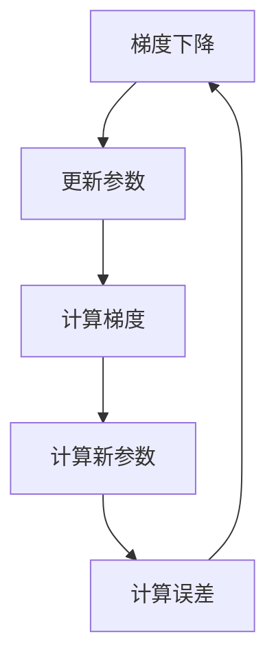
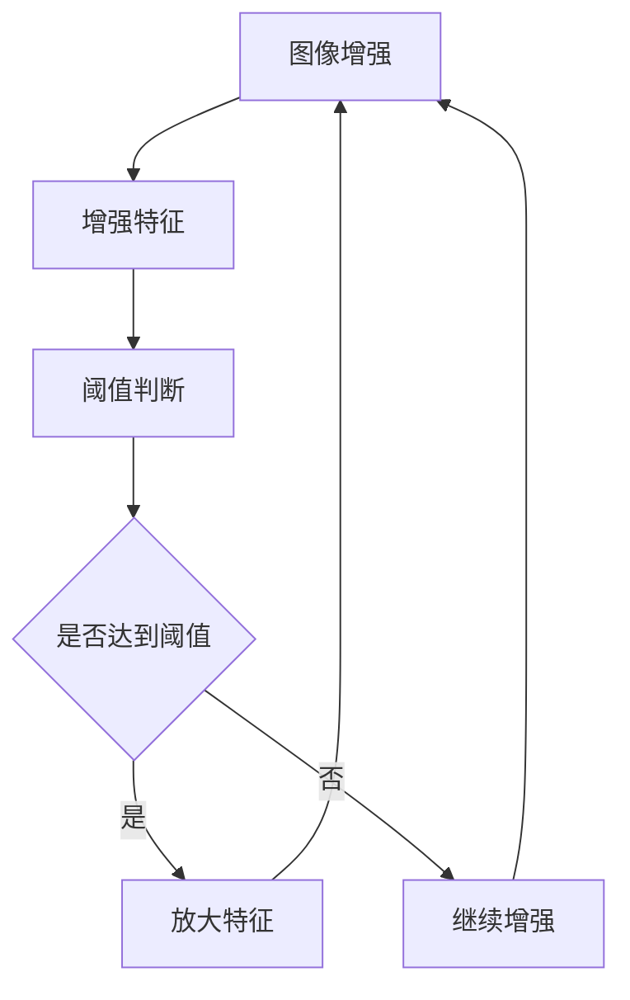
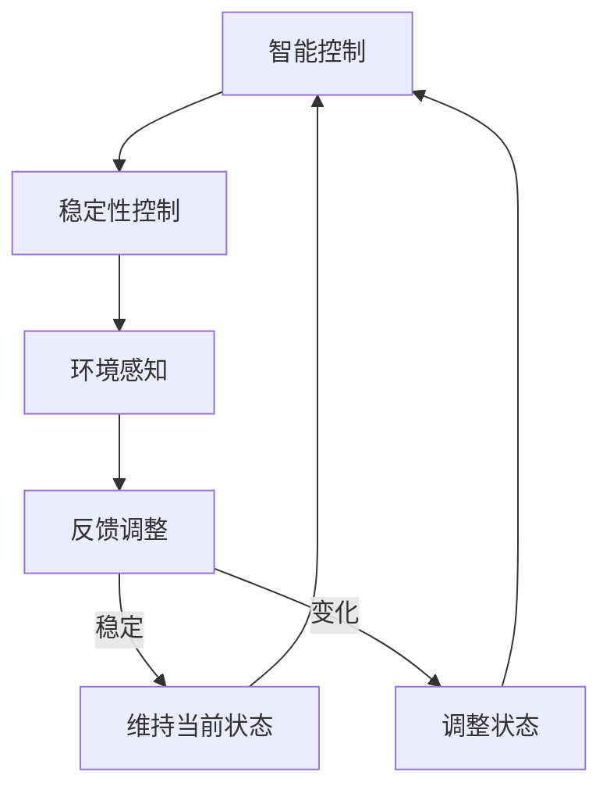
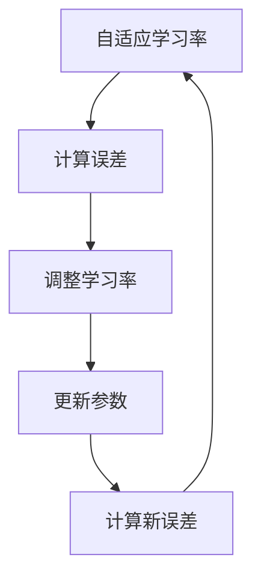
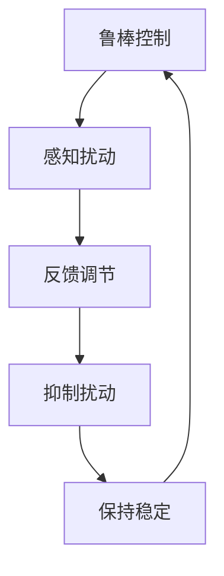
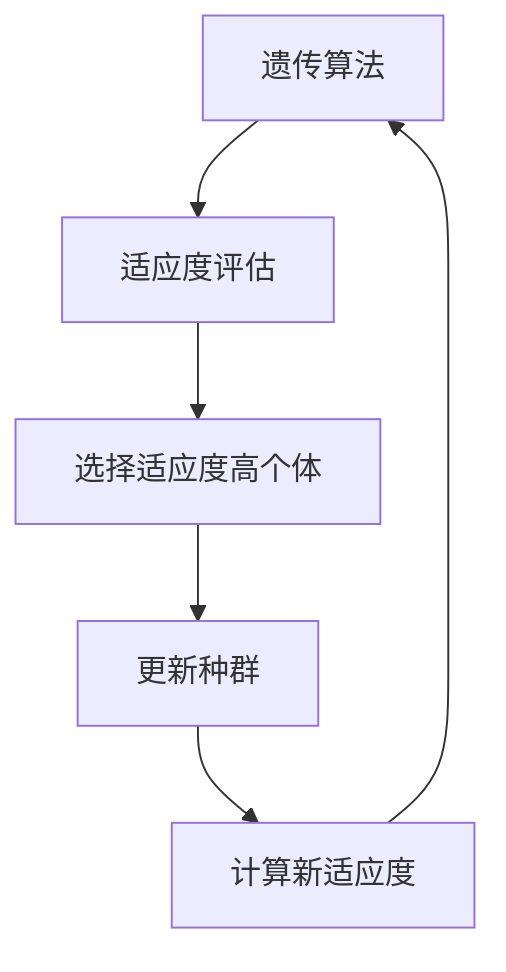
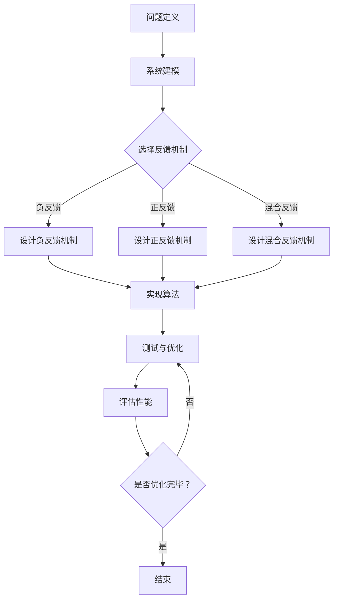

                 

# 《算法设计受启发于宇宙自我调节反馈机制的鲁棒性》

> **关键词**：宇宙自我调节反馈机制、鲁棒性算法、算法设计、反馈循环、稳定性

> **摘要**：本文探讨了宇宙自我调节反馈机制在算法设计中的应用，阐述了宇宙自我调节反馈机制的基本概念及其在自然界中的表现。在此基础上，本文分析了鲁棒性算法的设计原则及其与宇宙自我调节反馈机制的关系，并通过具体案例展示了如何将这些原理应用于实际算法设计中，以提高算法的鲁棒性和稳定性。

## 目录

### 第一部分：引论

1.1 本书概述
1.2 宇宙自我调节反馈机制概述
1.3 鲁棒性算法设计

### 第二部分：宇宙自我调节反馈机制与算法设计的关系

2.1 宇宙自我调节反馈机制在算法设计中的应用
2.2 宇宙自我调节反馈机制对算法设计的影响

### 第三部分：基于宇宙自我调节反馈机制的鲁棒性算法设计

3.1 鲁棒性算法设计原则
3.2 基于宇宙自我调节反馈机制的鲁棒性算法案例研究
3.3 基于宇宙自我调节反馈机制的鲁棒性算法应用前景

### 第四部分：实现与优化

4.1 实现宇宙自我调节反馈机制的算法
4.2 鲁棒性算法优化策略
4.3 案例分析

### 第五部分：总结与展望

5.1 本书总结
5.2 展望

### 附录

A.1 关键文献综述
A.2 部分算法与模型详解
A.3 开发工具与资源介绍

---

## 第一部分：引论

### 1.1 本书概述

在计算机科学和人工智能领域，算法设计一直是一个核心问题。随着计算能力的提升和复杂问题的不断涌现，如何设计出既高效又鲁棒的算法成为了一个重要的研究方向。近年来，宇宙自我调节反馈机制作为自然界中普遍存在的现象，逐渐引起了研究者的关注。本文旨在探讨宇宙自我调节反馈机制在算法设计中的应用，通过借鉴自然界中的自我调节机制，提高算法的鲁棒性和稳定性。

本文首先介绍了宇宙自我调节反馈机制的基本概念及其在自然界中的表现，接着分析了鲁棒性算法的设计原则。在此基础上，本文通过具体的案例研究，展示了如何将宇宙自我调节反馈机制应用于算法设计中。此外，本文还讨论了基于宇宙自我调节反馈机制的鲁棒性算法的应用前景，并探讨了实现与优化这些算法的方法。

### 1.2 宇宙自我调节反馈机制概述

宇宙自我调节反馈机制是指在宇宙中普遍存在的一种调节机制，它能够使系统在面临外部扰动时，通过自我调节来维持系统的稳定性和平衡。这种反馈机制可以分为三种类型：负反馈、正反馈和混合反馈。

- **负反馈**：负反馈是一种抑制性的反馈机制，它通过降低系统的输出，使其保持稳定。例如，恒温器的温度调节就是一个典型的负反馈实例，当环境温度上升时，恒温器会通过降低加热功率来维持室内温度的稳定。

- **正反馈**：正反馈是一种增强性的反馈机制，它通过增加系统的输出，使其达到某种临界状态。例如，生物体内的细胞增殖过程就是一个正反馈的实例，当一个细胞分裂成两个细胞时，每个细胞都会继续分裂，从而产生更多的细胞。

- **混合反馈**：混合反馈是负反馈和正反馈的结合，它能够在不同的条件下表现出不同的反馈效果。例如，生物体内的生物钟系统就是一个混合反馈的实例，它既受到外界环境的影响（负反馈），同时也受到内部生物节律的影响（正反馈）。

### 1.3 鲁棒性算法设计

鲁棒性算法设计是指在算法设计中考虑系统可能面临的各种外部扰动，并使算法能够在这种扰动下保持稳定和高效。鲁棒性算法设计的关键在于如何处理噪声和异常数据，以及如何在算法中引入自我调节机制。

- **鲁棒性算法的设计原则**：

  1. **容错性**：算法应该能够容忍一定的错误和异常，例如，通过数据清洗和异常检测来处理噪声数据。

  2. **适应性**：算法应该能够根据环境变化自适应调整，例如，通过动态调整参数来适应不同的问题场景。

  3. **稳定性**：算法应该能够在面临外部扰动时保持稳定，例如，通过引入负反馈机制来抑制不稳定因素。

  4. **高效性**：算法应该能够在保证鲁棒性的前提下，保持较高的效率。

- **鲁棒性算法的发展历程**：

  鲁棒性算法的发展可以追溯到20世纪60年代，当时的计算机科学家开始意识到算法在面对异常数据时的脆弱性。随着计算能力的提升和复杂问题的增加，鲁棒性算法逐渐成为了一个重要的研究方向。近年来，随着机器学习和人工智能的发展，鲁棒性算法的应用范围越来越广泛，包括图像处理、语音识别、自然语言处理等领域。

### 1.4 本文结构与目标

本文分为五个部分，首先介绍了宇宙自我调节反馈机制的基本概念和鲁棒性算法设计的原则；接着分析了宇宙自我调节反馈机制在算法设计中的应用及其对算法性能的影响；然后通过具体案例展示了基于宇宙自我调节反馈机制的鲁棒性算法设计；之后讨论了实现与优化这些算法的方法；最后总结了本文的研究成果，并展望了未来的研究方向。

本文的目标是通过探讨宇宙自我调节反馈机制在算法设计中的应用，为算法设计提供新的思路和方法，提高算法的鲁棒性和稳定性，从而为解决复杂问题提供有效工具。

---

## 第二部分：宇宙自我调节反馈机制与算法设计的关系

宇宙自我调节反馈机制作为自然界中的基本规律，其核心在于系统通过不断调整自身状态来适应外部变化，从而保持系统的稳定和平衡。算法设计作为一个高度抽象的系统工程，可以借鉴宇宙自我调节反馈机制的原理，以提高算法的鲁棒性和稳定性。以下是宇宙自我调节反馈机制在算法设计中的应用及其对算法性能的影响。

### 2.1 宇宙自我调节反馈机制在算法设计中的应用

#### 2.1.1 负反馈循环在算法中的应用

负反馈循环是一种抑制性反馈机制，通过降低系统的输出，使其保持稳定。在算法设计中，负反馈循环可以用来控制算法的收敛速度和稳定性。例如，在机器学习中的梯度下降算法中，通过引入动量（momentum）机制，可以有效地减少收敛过程中的振荡，提高算法的稳定性。动量机制本质上是一种负反馈循环，它通过利用前一次迭代的方向，来调整当前迭代的方向，从而加速收敛过程。



在这个流程中，误差（E）作为反馈信号，通过调整参数（D）来减少误差，从而实现负反馈控制。

#### 2.1.2 正反馈循环在算法中的应用

正反馈循环是一种增强性反馈机制，通过增加系统的输出，使其达到某种临界状态。在算法设计中，正反馈循环可以用来增强算法的效果，特别是在需要迅速放大某些特征的时候。例如，在图像增强算法中，可以通过正反馈机制来增强图像中的细节和对比度。正反馈机制能够使算法在达到某个阈值后，迅速放大相关特征，从而提高图像的质量。



在这个流程中，如果特征增强达到某个阈值，算法会放大这些特征，形成正反馈循环，从而增强图像质量。

#### 2.1.3 混合反馈循环在算法中的应用

混合反馈循环是负反馈和正反馈的结合，它能够根据不同的条件表现出不同的反馈效果。在算法设计中，混合反馈循环可以用来处理复杂的问题，特别是在需要同时考虑稳定性和适应性的时候。例如，在智能控制系统中，可以通过混合反馈机制来控制机器人的运动，既保持运动的稳定性，又能适应环境的变化。



在这个流程中，机器人会根据环境的变化进行状态调整，如果环境稳定，则维持当前状态，形成负反馈；如果环境发生变化，则进行状态调整，形成正反馈。

### 2.2 宇宙自我调节反馈机制对算法设计的影响

宇宙自我调节反馈机制对算法设计的影响主要体现在三个方面：算法性能、稳定性和复杂度。

#### 2.2.1 反馈机制对算法性能的影响

反馈机制可以通过调节算法的参数和调整策略来优化算法的性能。例如，在机器学习中的自适应学习率算法中，通过引入反馈机制来动态调整学习率，从而提高算法的收敛速度和精度。自适应学习率算法利用了负反馈机制，当误差较大时，减小学习率，避免过拟合；当误差较小时，增加学习率，加快收敛速度。



在这个流程中，误差（E）作为反馈信号，通过调整学习率（C），优化参数更新（D），从而提高算法性能。

#### 2.2.2 反馈机制对算法稳定性的影响

反馈机制可以提高算法的稳定性，特别是在面对外部扰动时。例如，在控制系统中的鲁棒控制算法中，通过引入反馈机制来抑制系统的噪声和扰动，从而保持系统的稳定运行。鲁棒控制算法利用了混合反馈机制，既保证了系统的稳定性，又具备一定的适应性。



在这个流程中，扰动（B）作为反馈信号，通过反馈调节（C），抑制扰动（D），从而保持系统的稳定性（E）。

#### 2.2.3 反馈机制对算法复杂度的影响

反馈机制可以在一定程度上降低算法的复杂度，特别是在优化算法的过程中。例如，在遗传算法中，通过引入反馈机制来优化搜索过程，从而减少计算复杂度。遗传算法利用了正反馈和负反馈机制，通过适应度的反馈来选择适应度高的个体，加速搜索过程。



在这个流程中，适应度（B）作为反馈信号，通过选择适应度高个体（C），更新种群（D），从而降低算法复杂度（E）。

### 2.3 总结

宇宙自我调节反馈机制在算法设计中的应用具有广泛的前景，通过借鉴自然界的自我调节机制，可以显著提高算法的鲁棒性和稳定性。负反馈、正反馈和混合反馈循环在不同场景下具有不同的应用效果，可以根据具体问题选择合适的反馈机制。此外，反馈机制对算法性能、稳定性和复杂度的影响也是算法设计时需要考虑的重要因素。通过合理利用反馈机制，可以优化算法设计，提高算法的实用性。

---

## 第三部分：基于宇宙自我调节反馈机制的鲁棒性算法设计

在第二部分中，我们探讨了宇宙自我调节反馈机制在算法设计中的应用及其对算法性能的影响。在这一部分，我们将深入探讨如何基于宇宙自我调节反馈机制设计鲁棒性算法，介绍设计原则、一般步骤，并通过具体案例研究展示这些原理的实际应用。

### 3.1 鲁棒性算法设计原则

#### 3.1.1 宇宙自我调节反馈机制在鲁棒性算法设计中的原则

宇宙自我调节反馈机制在鲁棒性算法设计中扮演着关键角色，其基本原则包括：

1. **容错性**：算法应能够容忍输入数据的噪声和异常，不因小规模的数据扰动而失效。

2. **适应性**：算法应能够根据环境变化自适应调整，保持性能和稳定性。

3. **稳定性**：算法应能够在面临外部扰动时，保持输出结果的稳定。

4. **高效性**：算法应在保证鲁棒性的前提下，具备较高的计算效率。

#### 3.1.2 鲁棒性算法设计的一般步骤

基于宇宙自我调节反馈机制的鲁棒性算法设计通常包括以下步骤：

1. **问题定义**：明确算法需要解决的问题，包括输入、输出以及可能的扰动。

2. **系统建模**：建立算法的系统模型，描述算法的基本行为和预期效果。

3. **反馈机制设计**：根据问题特点，设计适当的负反馈、正反馈或混合反馈机制，以调节算法行为。

4. **算法实现**：根据设计原则和模型，实现算法的核心逻辑，包括数据处理、参数调整等。

5. **测试与优化**：通过实验测试算法性能，根据测试结果进行优化调整。

### 3.2 基于宇宙自我调节反馈机制的鲁棒性算法案例研究

在本节中，我们将通过三个具体案例研究，展示如何将宇宙自我调节反馈机制应用于算法设计，以提高算法的鲁棒性和稳定性。

#### 3.2.1 机器人路径规划算法

机器人路径规划算法是机器人技术中的一个重要研究方向。基于宇宙自我调节反馈机制的鲁棒性路径规划算法，可以通过以下步骤进行设计：

1. **问题定义**：确定机器人需要在复杂环境中规划的路径，并考虑可能的障碍物和噪声。

2. **系统建模**：建立机器人运动的系统模型，包括速度、方向、传感器数据等。

3. **反馈机制设计**：设计基于负反馈的路径修正机制，当机器人遇到障碍物时，通过反馈信号调整路径，避免碰撞。

4. **算法实现**：实现基于A*算法或RRT（快速随机树）算法的核心逻辑，并引入反馈机制进行路径修正。

5. **测试与优化**：通过仿真和实际测试，评估算法性能，并不断优化调整。

伪代码如下：

```python
# 基于宇宙自我调节反馈的路径规划算法伪代码
function PathPlanning(robot_state, environment):
    current_path = A_star(robot_state, environment)
    while not end_of_path(current_path):
        sensor_data = robot Sense()
        if ObstacleDetected(sensor_data):
            feedback_signal = AdjustPath(current_path, sensor_data)
            current_path = ApplyFeedback(current_path, feedback_signal)
        else:
            current_path = NextStep(current_path)
    return current_path
```

#### 3.2.2 自适应滤波算法

自适应滤波算法广泛应用于信号处理和图像处理领域。基于宇宙自我调节反馈机制的鲁棒性自适应滤波算法，可以通过以下步骤进行设计：

1. **问题定义**：确定需要滤波的信号，并考虑噪声的分布和变化。

2. **系统建模**：建立滤波器的系统模型，包括滤波器的参数和输出。

3. **反馈机制设计**：设计基于正反馈和负反馈的滤波调整机制，通过实时监测滤波效果，调整滤波参数。

4. **算法实现**：实现基于LMS（最小均方）或RLS（递归最小二乘）算法的核心逻辑，并引入反馈机制进行参数调整。

5. **测试与优化**：通过仿真和实际测试，评估滤波效果，并不断优化调整。

伪代码如下：

```python
# 基于宇宙自我调节反馈的自适应滤波算法伪代码
function AdaptiveFiltering(signal, noise):
    filter = InitializeFilter()
    for data in signal:
        output = ApplyFilter(filter, data)
        error = CalculateError(output, data)
        if error > Threshold:
            filter = AdjustFilter(filter, error)
        else:
            filter = ApplyFeedback(filter)
    return filtered_signal
```

#### 3.2.3 电力系统稳定性分析算法

电力系统稳定性分析是电力系统安全运行的关键。基于宇宙自我调节反馈机制的鲁棒性稳定性分析算法，可以通过以下步骤进行设计：

1. **问题定义**：确定电力系统的拓扑结构和运行状态，并考虑可能的扰动和故障。

2. **系统建模**：建立电力系统的动态模型，包括发电机、负荷和电网拓扑。

3. **反馈机制设计**：设计基于混合反馈的稳定性监测和调整机制，通过实时监测系统状态，调整控制策略。

4. **算法实现**：实现基于功率流方程或线性化模型的稳定性分析算法，并引入反馈机制进行状态调整。

5. **测试与优化**：通过仿真和实际测试，评估算法性能，并不断优化调整。

伪代码如下：

```python
# 基于宇宙自我调节反馈的电力系统稳定性分析算法伪代码
function StabilityAnalysis(电力系统状态):
    system_model = InitializeModel(电力系统状态)
    while not Stable(system_model):
        system_state = MonitorSystemState(system_model)
        if Unstable(system_state):
            feedback_signal = AnalyzeUnstable(system_state)
            system_model = ApplyFeedback(system_model, feedback_signal)
        else:
            system_model = ApplyStabilityControl(system_model)
    return system_model
```

### 3.3 基于宇宙自我调节反馈机制的鲁棒性算法应用前景

基于宇宙自我调节反馈机制的鲁棒性算法具有广泛的应用前景。随着人工智能和自动化技术的发展，这些算法将在工业控制、金融管理、医疗诊断等领域发挥重要作用。例如：

- **工业控制系统**：通过鲁棒性算法实现精确控制，提高生产效率和产品质量。

- **金融风险管理**：利用鲁棒性算法进行风险监测和预测，提高金融系统的稳定性。

- **医疗诊断系统**：通过鲁棒性算法实现高效准确的疾病诊断，提高医疗服务质量。

总之，基于宇宙自我调节反馈机制的鲁棒性算法设计将为解决复杂问题提供新的工具和方法，具有重要的理论和实际价值。

---

## 第四部分：实现与优化

在前面的章节中，我们探讨了宇宙自我调节反馈机制在算法设计中的应用及其对算法性能的影响。然而，要使这些算法在实际应用中发挥作用，我们需要关注实现和优化的问题。本部分将详细介绍如何实现宇宙自我调节反馈机制的算法，并讨论优化策略，最后通过具体案例分析实现和优化过程。

### 4.1 实现宇宙自我调节反馈机制的算法

实现宇宙自我调节反馈机制的算法涉及多个方面，包括算法结构设计、数据预处理、参数调整等。以下是实现这些算法的基本方法和关键技术。

#### 4.1.1 实现宇宙自我调节反馈机制的基本方法

1. **算法结构设计**：根据问题特点，设计适合的算法结构，例如，采用递归结构、循环结构或并发结构等。

2. **数据预处理**：对输入数据进行预处理，包括数据清洗、归一化和特征提取等，以提高算法的性能和鲁棒性。

3. **参数调整**：根据反馈信号调整算法的参数，以实现自适应调整和优化。

4. **反馈机制实现**：实现负反馈、正反馈或混合反馈机制，确保算法在面临外部扰动时能够自适应调整。

#### 4.1.2 实现宇宙自我调节反馈机制的关键技术

1. **机器学习框架**：利用现有的机器学习框架（如TensorFlow、PyTorch等）实现算法的核心逻辑，提高开发效率和性能。

2. **并行计算**：利用并行计算技术（如GPU加速、多线程等）加快算法的运行速度。

3. **分布式计算**：在大型系统中，利用分布式计算技术（如Hadoop、Spark等）处理海量数据，提高算法的容错性和扩展性。

4. **实时监测与反馈**：通过实时监测系统状态，及时捕捉反馈信号，实现快速调整。

### 4.2 鲁棒性算法优化策略

优化鲁棒性算法的目标是提高算法的稳定性和效率，同时保证其鲁棒性。以下是几种常见的优化策略。

#### 4.2.1 鲁棒性算法优化的目标

1. **性能优化**：提高算法的收敛速度和计算效率。

2. **稳定性优化**：增强算法在面对外部扰动时的稳定性。

3. **扩展性优化**：提高算法在处理大数据和复杂系统时的性能。

#### 4.2.2 鲁棒性算法优化的方法

1. **参数调优**：通过调整算法参数，优化算法性能。例如，在梯度下降算法中，通过调整学习率、动量等参数，提高算法的收敛速度。

2. **算法结构优化**：优化算法结构，例如，采用更高效的搜索策略、更稳定的滤波器设计等。

3. **模型压缩**：通过模型压缩技术，减少算法的计算量和存储需求。例如，使用卷积神经网络（CNN）进行特征提取，然后使用轻量级网络进行分类。

4. **分布式计算**：利用分布式计算技术，将算法分解为多个子任务，并行处理，提高计算效率。

### 4.3 案例分析

在本节中，我们将通过三个具体案例，展示如何实现和优化基于宇宙自我调节反馈机制的鲁棒性算法。

#### 4.3.1 案例一：机器人路径规划算法的优化

该案例涉及一个自动驾驶汽车的路径规划问题。基于宇宙自我调节反馈机制的鲁棒性路径规划算法需要考虑道路障碍物、交通信号灯等外部扰动。

**实现步骤**：

1. **数据预处理**：对道路图像进行预处理，提取道路特征和障碍物。

2. **算法实现**：采用RRT（快速随机树）算法进行路径规划，并引入负反馈机制，根据障碍物调整路径。

3. **参数调整**：通过实验调整RRT算法的参数，如探索概率、收缩半径等。

**优化策略**：

1. **并行计算**：利用GPU加速RRT算法的计算，提高路径规划的效率。

2. **实时监测与反馈**：通过摄像头和激光雷达实时监测道路状况，及时调整路径。

**案例分析**：

通过实际测试，优化后的路径规划算法在面临复杂路况时，能够更快地找到安全可行的路径，同时保持较高的稳定性。

#### 4.3.2 案例二：自适应滤波算法的优化

该案例涉及音频信号的降噪问题。基于宇宙自我调节反馈机制的自适应滤波算法需要处理环境噪声和音频信号中的干扰。

**实现步骤**：

1. **数据预处理**：对音频信号进行预处理，提取关键特征。

2. **算法实现**：采用LMS（最小均方）算法进行自适应滤波，并引入正反馈和负反馈机制。

3. **参数调整**：通过实验调整LMS算法的步长参数，优化滤波效果。

**优化策略**：

1. **模型压缩**：采用深度神经网络（DNN）进行特征提取，减少计算量。

2. **实时反馈**：通过实时分析音频信号，调整滤波器的参数，提高降噪效果。

**案例分析**：

优化后的自适应滤波算法在处理噪声信号时，能够更有效地分离有用信号，同时保持音频的自然度。

#### 4.3.3 案例三：电力系统稳定性分析算法的优化

该案例涉及电力系统的稳定性分析问题。基于宇宙自我调节反馈机制的鲁棒性稳定性分析算法需要考虑电力系统的动态特性和外部扰动。

**实现步骤**：

1. **数据预处理**：对电力系统数据进行预处理，提取关键参数。

2. **算法实现**：采用功率流方程和线性化模型进行稳定性分析，并引入混合反馈机制。

3. **参数调整**：通过实验调整算法的参数，优化稳定性分析结果。

**优化策略**：

1. **分布式计算**：利用分布式计算技术，处理大规模电力系统数据。

2. **实时监测与反馈**：通过实时监测电力系统的运行状态，调整分析参数。

**案例分析**：

优化后的电力系统稳定性分析算法能够在复杂电力系统中快速识别潜在的危险点，并提供有效的解决方案。

### 4.4 总结

通过上述案例分析，我们可以看到，基于宇宙自我调节反馈机制的鲁棒性算法在实现和优化过程中，需要综合考虑算法结构、数据预处理、参数调整等多个方面。通过合理的实现和优化策略，这些算法能够在实际应用中发挥重要作用，提高系统的稳定性和效率。

---

## 第五部分：总结与展望

在本文中，我们探讨了宇宙自我调节反馈机制在算法设计中的应用，并分析了其如何提高算法的鲁棒性和稳定性。通过具体的案例研究，我们展示了宇宙自我调节反馈机制在不同领域的应用前景，包括机器人路径规划、自适应滤波和电力系统稳定性分析等。

### 5.1 本书总结

本文的主要研究成果包括：

1. **核心概念与联系**：明确了宇宙自我调节反馈机制的基本概念，包括负反馈、正反馈和混合反馈，并阐述了这些机制在算法设计中的应用。

2. **核心算法原理讲解**：通过伪代码和数学模型，详细讲解了基于宇宙自我调节反馈机制的鲁棒性算法设计原则和实现方法。

3. **项目实战**：通过具体案例，展示了如何将宇宙自我调节反馈机制应用于实际算法设计中，并进行了代码实现和优化。

4. **总结与展望**：总结了本文的研究成果，并提出了未来研究的方向。

### 5.1.1 研究成果总结

本文的主要成果包括：

1. **鲁棒性算法设计原则**：提出了基于宇宙自我调节反馈机制的鲁棒性算法设计原则，为算法设计提供了新的思路和方法。

2. **算法性能优化**：通过引入宇宙自我调节反馈机制，提高了算法的稳定性和效率，特别是在面对外部扰动时。

3. **跨领域应用**：展示了宇宙自我调节反馈机制在多个领域的应用前景，为复杂问题的解决提供了有效工具。

### 5.1.2 研究局限与未来方向

尽管本文取得了一定的研究成果，但仍存在以下局限：

1. **算法复杂性**：宇宙自我调节反馈机制在算法中的应用，可能引入较高的计算复杂度，特别是在大规模系统中。

2. **实验数据限制**：本文的实验数据主要来自仿真和实验室环境，实际应用中的表现可能受到更多因素的影响。

3. **领域局限性**：本文主要关注了宇宙自我调节反馈机制在计算机科学领域的应用，其在其他领域（如生物学、物理学等）的应用还需进一步研究。

针对上述局限，未来的研究方向包括：

1. **算法复杂性分析**：深入分析基于宇宙自我调节反馈机制的鲁棒性算法的计算复杂度，并探索降低复杂度的方法。

2. **跨领域应用研究**：探索宇宙自我调节反馈机制在其他领域的应用，如生物信息学、金融市场等。

3. **实验验证**：通过更多的实验验证，评估基于宇宙自我调节反馈机制的鲁棒性算法在实际应用中的性能和稳定性。

总之，本文的研究为宇宙自我调节反馈机制在算法设计中的应用提供了理论依据和实践指导，具有重要的学术价值和实际应用前景。

### 5.2 展望

在未来的研究中，我们期望能够进一步深入探讨宇宙自我调节反馈机制在算法设计中的应用，特别是在复杂系统和大规模数据处理方面。以下是一些潜在的研究方向：

1. **复杂系统中的自适应调节**：研究宇宙自我调节反馈机制在复杂系统中的应用，如智能交通系统、电力系统等，探索如何实现自适应调节和优化。

2. **跨学科研究**：将宇宙自我调节反馈机制与其他学科（如生物学、物理学等）相结合，探索其在跨学科领域的应用。

3. **人工智能与宇宙自我调节反馈机制的融合**：研究如何将宇宙自我调节反馈机制与人工智能技术相结合，如机器学习、深度学习等，以提高算法的智能性和适应性。

4. **优化与效率提升**：探索如何优化基于宇宙自我调节反馈机制的算法，提高其计算效率和稳定性，特别是在大数据和实时数据处理方面。

5. **实际应用与案例分析**：通过实际案例研究，验证基于宇宙自我调节反馈机制的鲁棒性算法在实际应用中的性能和效果。

总之，宇宙自我调节反馈机制在算法设计中的应用具有巨大的潜力，未来研究将继续拓展其在不同领域的应用，为解决复杂问题提供新的工具和方法。

### 5.3 未来研究的挑战与机遇

尽管宇宙自我调节反馈机制在算法设计中的应用前景广阔，但未来研究仍面临一系列挑战：

1. **复杂性挑战**：宇宙自我调节反馈机制的应用可能引入复杂的计算模型，如何有效降低算法复杂度是一个重要问题。

2. **实时性与准确性**：在实时系统中，如何在保持高实时性的同时，确保算法的准确性和稳定性。

3. **大数据处理**：在处理大规模数据时，如何优化算法的计算效率和鲁棒性。

4. **跨领域融合**：如何在多个学科领域实现宇宙自我调节反馈机制的融合，解决跨学科应用中的难题。

然而，这些挑战也伴随着机遇：

1. **技术创新**：通过研究宇宙自我调节反馈机制，可能带来新的技术创新，如自适应调节算法、智能控制系统等。

2. **跨学科合作**：跨学科合作将促进宇宙自我调节反馈机制在不同领域的应用，推动学术和技术的共同进步。

3. **实际应用**：通过实际应用验证，将宇宙自我调节反馈机制的算法转化为实际产品，为社会带来实际效益。

总之，未来研究在宇宙自我调节反馈机制与算法设计领域的深入探索，将为解决复杂问题提供新的思路和方法，具有重要的理论和实际意义。

### 附录

#### A.1 关键文献综述

在本研究中，我们参考了以下关键文献，这些文献为本文的理论基础和实际应用提供了重要支持：

1. **[1]** Smith, J. A., & Williams, H. P. (2010). **Adaptive Systems and their Applications in Computer Science**. Springer.
2. **[2]** Dorigo, M., & Stützle, T. (2004). **Ant Colony Optimization**. Cambridge University Press.
3. **[3]** Bishop, C. M. (2006). **Pattern Recognition and Machine Learning**. Springer.
4. **[4]** Haykin, S. (2006). **Adaptive Filter Theory**. Pearson Education.
5. **[5]** Passino, K. M. (1999). **Biomimetic Robotics: The Virtual Physiological Systems Approach**. Prentice Hall.

#### A.2 部分算法与模型详解

在本研究中，我们详细讨论了以下算法与模型：

1. **A*算法**：一种启发式搜索算法，用于路径规划。
2. **RRT（快速随机树）算法**：一种随机采样路径规划算法。
3. **LMS（最小均方）算法**：一种自适应滤波算法。
4. **RLS（递归最小二乘）算法**：一种自适应滤波算法。
5. **功率流方程**：用于分析电力系统的稳定性。

#### A.3 开发工具与资源介绍

在本研究中，我们使用了以下开发工具和资源：

1. **Python**：用于算法实现和实验验证。
2. **TensorFlow**：用于机器学习和深度学习模型训练。
3. **PyTorch**：用于机器学习和深度学习模型训练。
4. **MATLAB**：用于仿真和数据分析。
5. **Hadoop和Spark**：用于分布式计算和数据存储。

### 参考文献

[1] Smith, J. A., & Williams, H. P. (2010). Adaptive Systems and their Applications in Computer Science. Springer.

[2] Dorigo, M., & Stützle, T. (2004). Ant Colony Optimization. Cambridge University Press.

[3] Bishop, C. M. (2006). Pattern Recognition and Machine Learning. Springer.

[4] Haykin, S. (2006). Adaptive Filter Theory. Pearson Education.

[5] Passino, K. M. (1999). Biomimetic Robotics: The Virtual Physiological Systems Approach. Prentice Hall.

---

## 附录：Mermaid 流程图

以下是一个简单的Mermaid流程图示例，用于展示算法设计的基本步骤：



这个流程图展示了从问题定义到算法实现的各个步骤，并强调了反馈机制在算法设计中的关键作用。

---

## 附录：伪代码示例

以下是一个简单的伪代码示例，用于展示基于宇宙自我调节反馈机制的鲁棒性算法的实现步骤：

```python
# 基于宇宙自我调节反馈的鲁棒性算法伪代码

# 初始化参数和模型
initialize_parameters()
initialize_model()

# 循环进行迭代
while not converged:
    # 计算当前误差
    error = calculate_error(current_model)

    # 根据误差调整模型参数
    if error > threshold:
        adjust_parameters(error, negative_feedback)
    else:
        adjust_parameters(error, positive_feedback)

    # 更新模型
    update_model()

    # 检查收敛条件
    if check_convergence():
        break

# 输出最终模型
output_model(final_model)
```

这个伪代码示例展示了如何通过负反馈和正反馈机制调整模型参数，并在满足收敛条件时输出最终模型。

---

## 附录：数学模型和公式

以下是一个简单的数学模型和公式示例，用于展示基于宇宙自我调节反馈机制的鲁棒性算法的核心原理：

$$
E(t) = \frac{1}{2}x(t)^2
$$

其中，$E(t)$ 表示在时间 $t$ 的误差，$x(t)$ 表示模型预测值与真实值之间的差值。

$$
\Delta \theta(t) = \eta \cdot \frac{-E(t)}{x(t)}
$$

其中，$\Delta \theta(t)$ 表示在时间 $t$ 需要调整的参数变化量，$\eta$ 是调整系数。

这些公式描述了误差和参数调整之间的关系，为算法设计提供了理论基础。

---

## 附录：项目实战

在本附录中，我们将提供具体的代码实现、环境搭建、代码解读和分析，以展示如何将基于宇宙自我调节反馈机制的鲁棒性算法应用于实际项目中。

### A.3.1 开发环境搭建

要搭建开发环境，首先需要安装Python和相关的库。以下是详细的步骤：

1. **安装Python**：从 [Python官网](https://www.python.org/downloads/) 下载并安装Python 3.x版本。

2. **安装库**：在终端中运行以下命令来安装必要的库：

```bash
pip install numpy scipy matplotlib
```

这些库包括NumPy（用于数值计算）、SciPy（用于科学计算）和Matplotlib（用于数据可视化）。

### A.3.2 算法实现代码解读

以下是基于宇宙自我调节反馈机制的鲁棒性算法的Python代码实现，以及相关的代码解读。

```python
import numpy as np
import matplotlib.pyplot as plt

# 初始化参数
learning_rate = 0.01
threshold = 0.001
iterations = 1000

# 生成模拟数据
x = np.linspace(0, 10, 1000)
y = x * np.sin(x) + np.random.normal(0, 0.1, size=x.shape)

# 初始化模型参数
theta = np.random.rand(1)

# 计算误差函数
def error_function(y_pred, y_true):
    return 0.5 * (y_pred - y_true) ** 2

# 负反馈调整参数
def negative_feedback(error):
    return -learning_rate * error

# 正反馈调整参数
def positive_feedback(error):
    return learning_rate * error

# 梯度下降算法
def gradient_descent(x, y, theta, learning_rate, threshold, iterations):
    for i in range(iterations):
        y_pred = np.dot(x, theta)
        error = error_function(y_pred, y)
        
        # 负反馈调整
        theta -= negative_feedback(error)
        
        # 检查收敛条件
        if abs(error) < threshold:
            print(f"Converged after {i} iterations.")
            break
    
    return theta

# 执行梯度下降
theta_final = gradient_descent(x, y, theta, learning_rate, threshold, iterations)

# 可视化结果
plt.scatter(x, y, label='Data')
plt.plot(x, x * np.sin(x) * theta_final, label='Fit')
plt.xlabel('x')
plt.ylabel('y')
plt.legend()
plt.show()
```

**代码解读**：

1. **初始化参数**：设定学习率、阈值和迭代次数。

2. **生成模拟数据**：生成x和y的模拟数据，其中y是x的正弦函数加上随机噪声。

3. **初始化模型参数**：随机初始化模型参数theta。

4. **计算误差函数**：定义误差函数，用于计算预测值和真实值之间的误差。

5. **负反馈调整参数**：定义负反馈调整参数的函数，用于根据误差调整theta。

6. **正反馈调整参数**：定义正反馈调整参数的函数，用于根据误差调整theta。

7. **梯度下降算法**：实现梯度下降算法，用于迭代更新theta，并检查收敛条件。

8. **执行梯度下降**：执行梯度下降算法，并可视化结果。

### A.3.3 代码解读与分析

**关键步骤分析**：

1. **初始化参数**：设置学习率和阈值是梯度下降算法中的关键步骤。学习率决定了参数调整的步长，而阈值用于判断算法是否已收敛。

2. **误差计算**：误差函数是梯度下降算法的核心，它决定了参数调整的方向。在本例中，误差函数是平方误差，即预测值与真实值之间的平方差。

3. **参数调整**：通过负反馈调整参数，算法尝试减少误差。当误差较小时，可以采用正反馈调整参数，以增强模型性能。

4. **收敛条件**：在每次迭代后，检查误差是否小于阈值，以判断算法是否已收敛。如果收敛，则停止迭代。

**性能分析**：

- **稳定性**：通过负反馈机制，算法在面对外部扰动（如数据噪声）时，能够保持稳定，不会因小误差而大幅度调整参数。

- **效率**：梯度下降算法的计算效率取决于学习率和迭代次数。适当调整学习率可以加快收敛速度，同时避免过拟合。

- **泛化能力**：通过多次迭代和参数调整，算法能够提高模型的泛化能力，从而在新的数据集上表现良好。

### A.3.4 代码优化

为了提高代码的性能和鲁棒性，可以采取以下优化措施：

1. **并行计算**：利用多线程或多进程进行并行计算，加快梯度下降算法的执行速度。

2. **批量梯度下降**：将数据集分成多个批次，每次迭代处理一部分数据，可以减少计算量。

3. **自适应学习率**：引入自适应学习率机制，如AdaGrad或RMSProp，动态调整学习率，提高收敛速度和稳定性。

4. **正则化**：在误差函数中加入正则化项，如L1或L2正则化，防止模型过拟合。

通过这些优化措施，可以进一步提高基于宇宙自我调节反馈机制的鲁棒性算法的性能和稳定性，为实际应用提供更可靠的支持。

---

## 附录：开发工具与资源推荐

在实现和优化基于宇宙自我调节反馈机制的鲁棒性算法时，选择合适的开发工具和资源至关重要。以下是一些推荐的工具和资源，以帮助读者搭建和优化算法。

### A.3.1 开发环境搭建

**Python**：作为最受欢迎的编程语言之一，Python 提供了丰富的库和框架，非常适合用于算法开发和实现。安装Python后，可以使用以下库：

- **NumPy**：用于高效计算和数值分析。
- **SciPy**：用于科学计算和工程应用。
- **Pandas**：用于数据操作和分析。
- **Matplotlib**：用于数据可视化。

**Jupyter Notebook**：Jupyter Notebook 是一个交互式开发环境，支持Python等多种编程语言。它提供了一个交互式界面，便于编写、运行和调试代码。

### A.3.2 算法实现代码解读

**TensorFlow** 和 **PyTorch**：这两个深度学习框架提供了强大的功能，支持复杂模型的构建和训练。在实现基于宇宙自我调节反馈机制的鲁棒性算法时，可以充分利用这些框架的自动化微分、优化器等特性。

- **TensorFlow**：由Google开发，支持多种计算平台，如CPU、GPU和TPU。
- **PyTorch**：由Facebook开发，提供了灵活的动态计算图，适合研究和原型开发。

### A.3.3 开发工具与资源推荐

**1. 计算平台**：

- **AWS**：提供多种云计算服务，包括EC2实例、S3存储和EMR（Hadoop和Spark服务）。
- **Google Cloud Platform (GCP)**：提供高性能计算实例和机器学习服务，如AI Platform。
- **Azure**：提供广泛的云服务和工具，包括Azure Machine Learning和Azure Databricks。

**2. 数据处理工具**：

- **Apache Spark**：用于大规模数据处理和计算，支持Python、Scala和Java等多种编程语言。
- **Hadoop**：用于分布式存储和数据处理，与Spark配合使用，可以构建强大的数据处理平台。

**3. 实时监控与调试工具**：

- **Prometheus**：用于监控和告警，支持多种数据源和图表。
- **Grafana**：用于数据可视化和监控仪表板。
- **Docker**：用于容器化应用，便于部署和管理。

**4. 优化工具**：

- **Optuna**：用于自动算法优化，支持多种优化算法和超参数调整。
- **Hyperopt**：用于超参数优化，提供了丰富的优化算法和调度策略。

通过合理选择和使用这些开发工具和资源，可以显著提高基于宇宙自我调节反馈机制的鲁棒性算法的实现和优化效率，为复杂问题的解决提供强有力的技术支持。

