                 

# 管理的智慧：激发团队潜能

> 关键词：管理、团队、潜能、效率、创新、沟通

> 摘要：本文旨在探讨管理的智慧，如何通过有效的管理激发团队的潜能，提高工作效率，实现企业的可持续发展。文章将围绕管理的基本原理、人事管理、财务管理、生产管理、市场营销、创新管理和管理者技能提升等方面展开讨论，结合实际案例，为企业管理者提供有价值的参考和借鉴。

## 第一部分：管理的智慧

### 第1章：管理的基本原理

#### 1.1 管理的定义与目标

管理是指通过计划、组织、领导、控制等职能，实现组织目标的过程。管理的目标是提高组织的效率和效能，实现资源的合理配置和最大化利用。

#### 1.2 管理的基本原则

- **科学性原则**：管理活动必须建立在科学的基础上，遵循客观规律。
- **人本原则**：以人为中心，关注员工的需求和成长，激发员工的积极性和创造力。
- **效率原则**：追求高效，减少资源浪费，提高工作效率。
- **创新原则**：鼓励创新，推动组织的持续发展和进步。

#### 1.3 管理的过程

管理的过程包括计划、组织、领导、控制四个阶段。每个阶段都有其核心任务和关键点。

- **计划**：明确组织的目标和策略，制定具体的行动计划。
- **组织**：合理配置资源，建立有效的组织结构，确保计划的实施。
- **领导**：发挥领导作用，指导员工完成任务，激励团队协作。
- **控制**：监控计划的执行情况，及时调整，确保目标的实现。

### 第2章：人事管理

#### 2.1 人力资源管理概述

人力资源管理是企业管理的核心，关系到企业的持续发展和竞争力。人力资源管理包括招聘、选拔、培训、发展、薪酬、绩效等方面。

#### 2.2 招聘与选拔

招聘是人力资源管理的第一步，选拔则是找到合适的人才。招聘流程包括职位需求分析、招聘渠道选择、简历筛选、面试等环节。选拔方法包括面试、心理测试、技能评估等。

#### 2.3 培训与发展

培训是提升员工能力的重要手段，发展是员工职业生涯规划的必要环节。企业应根据员工的需求和岗位要求，制定系统的培训和发展规划。

#### 2.4 薪酬管理

薪酬管理包括薪酬体系设计、薪酬策略制定、薪酬调整等。合理的薪酬体系能够激发员工的积极性和创造力，提高工作效率。

#### 2.5 绩效管理

绩效管理是评估员工工作表现的过程，包括绩效评估、绩效激励等。有效的绩效管理能够激励员工，提升团队整体绩效。

### 第3章：财务管理

#### 3.1 财务管理概述

财务管理是企业管理的核心，涉及资金筹集、投资管理、资金运作管理、财务分析等方面。有效的财务管理能够保障企业的资金安全和收益最大化。

#### 3.2 资金筹集

资金筹集包括内部筹集和外部筹集。内部筹集主要通过留存收益、内部借款等实现，外部筹集主要通过股权融资、债务融资等实现。

#### 3.3 投资管理

投资管理包括投资原则、投资决策等。投资原则包括收益最大化、风险最小化等。投资决策需要综合考虑市场环境、企业战略等因素。

#### 3.4 资金运作管理

资金运作管理包括资金周转、资金风险控制等。有效的资金运作管理能够提高资金使用效率，降低风险。

#### 3.5 财务分析

财务分析包括财务报表分析、财务比率分析等。通过财务分析，企业能够了解自身的财务状况，为决策提供依据。

### 第4章：生产管理

#### 4.1 生产管理概述

生产管理是企业运营的核心，涉及生产计划、生产组织、质量管理、物料管理等方面。有效的生产管理能够提高生产效率，降低成本。

#### 4.2 生产计划

生产计划是生产管理的核心，包括生产计划编制、生产进度安排等。生产计划需要考虑市场需求、原材料供应、生产能力等因素。

#### 4.3 生产组织

生产组织包括生产组织形式、生产调度等。合理的生产组织能够提高生产效率，降低生产成本。

#### 4.4 质量管理

质量管理是生产管理的重要组成部分，包括质量管理原则、质量管理工具等。有效的质量管理能够提高产品质量，增强市场竞争力。

#### 4.5 物料管理

物料管理包括物料管理任务、物料管理方法等。有效的物料管理能够提高物料使用效率，降低库存成本。

### 第5章：市场营销

#### 5.1 市场营销概述

市场营销是企业获取市场份额、实现盈利的重要手段，包括市场调研、市场细分与目标市场选择、市场定位、营销策略等方面。

#### 5.2 市场调研

市场调研是市场营销的基础，包括市场调研方法、市场调研报告等。通过市场调研，企业能够了解市场环境，为决策提供依据。

#### 5.3 市场细分与目标市场选择

市场细分与目标市场选择是企业制定市场营销策略的关键。通过市场细分，企业能够找到最有利的市场机会，为目标市场制定合适的营销策略。

#### 5.4 市场定位

市场定位是企业为产品或品牌在目标市场树立独特形象的过程。有效的市场定位能够提高产品竞争力，吸引目标客户。

#### 5.5 营销策略

营销策略包括产品策略、价格策略、渠道策略、推广策略等。企业应根据市场环境和目标客户，制定合适的营销策略。

### 第6章：创新管理

#### 6.1 创新管理概述

创新管理是企业持续发展的重要动力，包括创新概念、创新过程、创新策略、创新文化等方面。

#### 6.2 创新过程

创新过程包括创意生成、创意筛选、创意开发、创意实施等阶段。通过创新过程，企业能够不断推出新产品，满足市场需求。

#### 6.3 创新策略

创新策略包括创新战略、创新管理工具等。企业应根据自身情况，制定合适的创新策略，推动企业持续创新。

#### 6.4 创新文化

创新文化是企业创新的重要保障，包括创新氛围的营造、创新激励机制等。企业应积极营造创新文化，激发员工的创新潜力。

### 第7章：管理者技能提升

#### 7.1 沟通能力

沟通能力是管理者必备的能力，包括沟通的重要性、有效沟通的方法等。有效的沟通能够促进团队协作，提高工作效率。

#### 7.2 领导能力

领导能力是管理者成功的关键，包括领导理论、领导艺术等。优秀的领导者能够激发团队潜能，实现组织目标。

#### 7.3 决策能力

决策能力是管理者的重要能力，包括决策原则、决策方法等。有效的决策能够帮助企业应对市场变化，抓住机遇。

#### 7.4 团队管理

团队管理包括团队建设的策略、团队冲突的处理等。有效的团队管理能够提高团队绩效，实现组织目标。

#### 7.5 自我管理

自我管理是管理者提升自身能力的重要途径，包括时间管理、压力管理等。有效的自我管理能够提高管理者的工作效率，减轻工作压力。

## 附录

### 附录A：管理工具与方法

#### A.1 管理工具

- **SWOT分析**：对企业的优势、劣势、机会、威胁进行综合分析，为决策提供依据。
- **PEST分析**：对宏观环境（政治、经济、社会、技术）进行分析，为战略规划提供支持。
- **五力模型**：分析企业所在行业的竞争格局，为竞争策略提供指导。
- **波士顿矩阵**：对企业的产品进行市场细分，为产品策略提供参考。

#### A.2 管理方法

- **目标管理**：通过设定目标，明确方向，提高工作效率。
- **5S管理**：通过整理、整顿、清扫、清洁、素养，提高工作效率和员工素质。
- **全面质量管理**：通过全员参与，全过程控制，提高产品和服务质量。
- **平衡计分卡**：通过财务、客户、内部流程、学习与成长四个维度，评价企业绩效。

### 附录B：管理案例

#### B.1 国内外成功管理案例

- **阿里巴巴**：通过企业文化、组织变革、创新驱动，实现了持续增长。
- **华为**：通过研发投入、人才培养、全球化战略，成为全球领先的科技公司。

#### B.2 管理失败案例分析

- **诺基亚**：缺乏创新意识，未能及时应对市场变化，导致市场份额大幅下降。
- **柯达**：过度依赖胶卷业务，忽视数码技术发展，最终破产倒闭。

### 结论

管理的智慧在于如何通过有效的管理激发团队的潜能，提高工作效率，实现企业的可持续发展。管理者应不断学习，提升自身能力，运用科学的管理方法和工具，为企业创造价值。通过本文的讨论，希望对企业管理者有所启发和帮助。

## 作者信息

作者：AI天才研究院/AI Genius Institute & 禅与计算机程序设计艺术 /Zen And The Art of Computer Programming

以上内容为本文的核心内容，我们将继续深入探讨每个章节的详细内容，结合实际案例，为企业管理者提供有价值的参考和借鉴。在后续章节中，我们将进一步分析管理的基本原理、人事管理、财务管理、生产管理、市场营销、创新管理和管理者技能提升等方面的具体实践和方法。

### 管理的基本原理

#### 管理的定义与目标

管理是一门科学，它涉及到如何有效地规划、组织、领导和控制组织的资源和活动，以实现预定的目标。管理不仅仅是一种技术，更是一种艺术，它要求管理者在遵循科学原则的基础上，运用创造性思维和灵活策略来应对复杂多变的环境。

**管理的定义**：

管理可以定义为通过计划、组织、协调和控制等职能，有效地利用人力、物力、财力和信息等资源，以实现组织目标的过程。这个过程涉及多个层面的活动，包括决策制定、资源分配、任务执行和绩效评估等。

**管理的目标**：

管理的目标主要包括以下几个方面：

- **效率**：在保证质量的前提下，尽可能减少资源浪费，提高资源利用率。
- **效能**：通过合理利用资源和优化流程，提高组织整体的工作效率。
- **公平**：确保组织内部各项决策和资源分配的公平性，维护员工的权益。
- **创新**：鼓励创新思维和实践活动，推动组织不断进步和变革。

#### 管理的基本原则

1. **科学性原则**：

科学性原则强调管理活动应该基于客观事实和科学理论，避免主观臆断和盲目决策。管理者需要运用科学的管理方法和工具，如数据分析、模型模拟等，来指导管理实践。

2. **人本原则**：

人本原则强调以人为本，关注员工的成长和需求，激发员工的积极性和创造力。管理者应该尊重员工，关心员工，为员工提供良好的工作环境和培训机会，使员工能够充分发挥自己的潜力。

3. **效率原则**：

效率原则要求管理者在保证任务完成质量的前提下，尽可能提高工作效率。这需要管理者优化工作流程，减少不必要的环节和等待时间，确保资源的最优配置。

4. **创新原则**：

创新原则鼓励管理者不断探索新的管理思路和方法，推动组织的变革和发展。创新不仅体现在产品和技术上，也体现在管理理念和管理方法上。管理者应该具备开放的心态，勇于尝试新的管理实践。

#### 管理的过程

管理的过程通常包括以下几个阶段：

1. **计划**：

计划是管理的起点，它涉及设定目标、制定策略和规划具体的行动计划。管理者需要分析内外部环境，确定组织的目标和任务，并制定详细的实施计划。

2. **组织**：

组织阶段涉及到资源的配置和组织结构的建立。管理者需要明确各个部门和岗位的职责，合理分配资源，确保计划的顺利实施。

3. **领导**：

领导阶段是管理者通过指导和激励员工，推动任务完成的阶段。有效的领导能够激发团队的凝聚力和创造力，使团队朝着共同的目标努力。

4. **控制**：

控制阶段是管理者对计划执行情况的监控和调整。通过定期的绩效评估和反馈，管理者能够及时发现问题和调整策略，确保目标的实现。

### 统计图与流程图

为了更好地理解管理的基本原理，我们可以通过一些统计图和流程图来展示相关的概念和关系。

#### 数据可视化

以下是一个简单的统计图，展示了管理的基本原则和目标之间的关系：

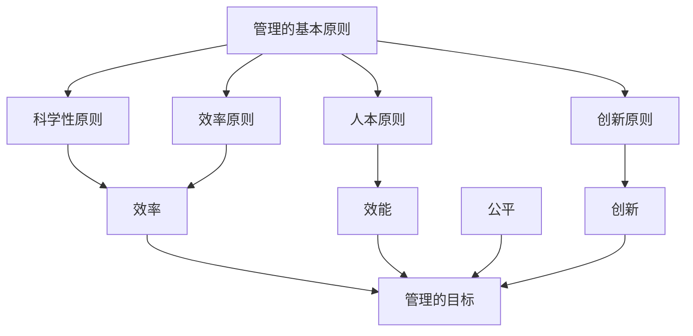

#### 流程图

接下来，我们使用Mermaid语言绘制一个管理过程的基本流程图：

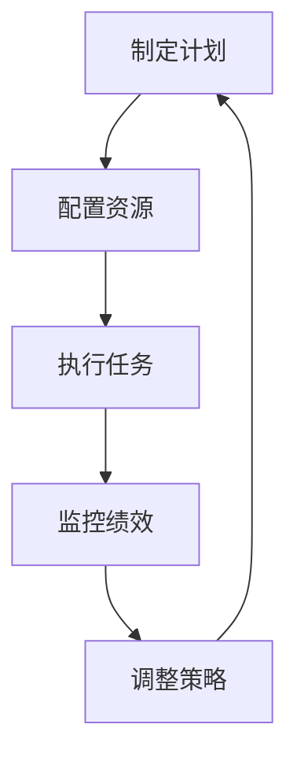

通过这些统计图和流程图，我们可以更直观地理解管理的基本原理和过程，从而更好地指导实际管理工作。

### 人事管理

#### 人力资源管理概述

人力资源管理是企业管理的核心组成部分，它涉及到如何有效地管理和开发人力资源，以实现组织的目标和战略。人力资源的重要性体现在以下几个方面：

1. **资源核心**：人力资源是企业最重要的资源之一，是企业创造价值的核心动力。优秀的人力资源能够带来创新和竞争优势。
2. **战略支撑**：人力资源管理是企业战略的重要组成部分，通过有效的人力资源管理，企业能够更好地应对市场变化，实现长期发展。
3. **组织效能**：人力资源管理直接影响组织的运行效率和效能，通过合理的人力资源配置和开发，可以提升组织的整体绩效。

**人力资源管理的任务**：

人力资源管理的任务主要包括以下几个方面：

1. **招聘与选拔**：招聘是企业获取人力资源的第一步，选拔则是找到符合企业要求的人才。招聘流程包括职位需求分析、招聘渠道选择、简历筛选和面试等环节。
2. **培训与发展**：培训是企业提升员工技能和素质的重要手段，发展则是员工职业生涯规划的必要环节。企业应根据员工的需求和岗位要求，制定系统的培训和发展规划。
3. **绩效管理**：绩效管理是评估员工工作表现的过程，包括绩效评估、绩效激励等。有效的绩效管理能够激励员工，提升团队整体绩效。
4. **薪酬管理**：薪酬管理包括薪酬体系设计和薪酬策略制定。合理的薪酬体系能够激发员工的积极性和创造力，提高工作效率。
5. **员工关系管理**：员工关系管理是维护企业内部和谐的重要环节，包括沟通、冲突处理、员工福利等。

#### 招聘与选拔

**招聘流程**：

招聘流程是企业获取人才的重要环节，通常包括以下几个步骤：

1. **职位需求分析**：明确职位的职责、要求和工作条件，确保招聘到的人才能够满足岗位需求。
2. **招聘渠道选择**：根据职位特点和企业资源，选择合适的招聘渠道，如内部推荐、人才市场、招聘网站等。
3. **简历筛选**：通过筛选简历，初步确定符合要求的候选人。
4. **面试**：面试是选拔人才的关键环节，通过面对面交流，深入了解候选人的能力、经验和性格等。

**选拔方法**：

选拔方法包括面试、心理测试、技能评估等。每种方法都有其优缺点，企业应根据具体情况选择合适的选拔方法。

- **面试**：面试是最常用的选拔方法，通过面对面交流，评估候选人的表达能力和实际能力。面试可以分为结构化面试、非结构化面试和情景模拟等不同形式。
- **心理测试**：心理测试可以帮助企业了解候选人的心理特征和职业倾向，评估其适应岗位的能力。常见的心理测试包括性格测试、能力测试和职业兴趣测试等。
- **技能评估**：技能评估是评估候选人实际操作技能和知识水平的方法，可以通过现场操作、作品展示等方式进行。

#### 培训与发展

**培训体系**：

培训体系是企业提升员工技能和素质的系统工程，通常包括以下内容：

1. **培训需求分析**：根据企业的战略目标和员工的工作需求，分析培训的必要性。
2. **培训计划制定**：制定详细的培训计划，包括培训目标、培训内容、培训方式、培训时间等。
3. **培训实施**：根据培训计划，组织培训活动，确保培训效果。
4. **培训评估**：对培训效果进行评估，包括培训满意度、培训转化率等。

**发展规划**：

发展规划是员工职业生涯规划的重要组成部分，包括以下几个方面：

1. **职业规划**：员工根据自身兴趣和优势，制定职业发展目标。
2. **晋升通道**：企业为员工提供清晰的晋升通道，确保员工的职业发展有明确的路径。
3. **能力提升**：通过培训、轮岗等方式，提升员工的能力和素质，为职业发展打下基础。
4. **激励机制**：通过绩效考核、奖励机制等，激励员工努力工作，实现职业发展目标。

#### 薪酬管理

**薪酬体系**：

薪酬体系是企业对员工劳动付出和贡献的回报方式，通常包括以下内容：

1. **基本工资**：基本工资是员工的固定收入，通常根据员工职位、技能和工作经验确定。
2. **绩效工资**：绩效工资是根据员工的绩效评估结果发放的奖金，旨在激励员工提高工作表现。
3. **福利**：福利是员工除基本工资和绩效工资之外的其他收入，包括社会保险、住房公积金、员工旅游、健康体检等。
4. **股权激励**：股权激励是将部分薪酬以股权形式发放，让员工分享企业的发展成果。

**薪酬策略**：

薪酬策略是企业薪酬管理的核心，通常包括以下几个方面：

1. **市场竞争力**：根据市场水平，确保企业的薪酬具有竞争力，吸引和留住优秀人才。
2. **内部公平**：确保企业内部的薪酬分配公平，避免因薪酬不公导致员工不满和离职。
3. **长期激励**：通过股权激励等长期激励措施，激励员工长期为企业贡献力量。
4. **灵活调整**：根据企业战略调整和员工绩效变化，灵活调整薪酬结构。

#### 绩效管理

**绩效评估**：

绩效评估是绩效管理的重要环节，通过评估员工的工作表现，为企业提供管理决策的依据。绩效评估通常包括以下内容：

1. **评估标准**：制定明确的评估标准，确保评估的公正性和客观性。
2. **评估方法**：选择合适的评估方法，如360度评估、KPI评估等。
3. **评估周期**：确定评估周期，如季度评估、年度评估等。
4. **反馈机制**：及时向员工反馈评估结果，帮助员工了解自己的工作表现，明确改进方向。

**绩效激励**：

绩效激励是激励员工提高工作表现的重要手段，通常包括以下内容：

1. **奖金**：根据员工的绩效评估结果，发放绩效奖金。
2. **晋升**：为表现优秀的员工提供晋升机会，提升其职业发展空间。
3. **培训**：为员工提供培训机会，提高其技能和素质。
4. **荣誉**：对表现优秀的员工给予表彰和奖励，提升其工作积极性。

### 统计图与流程图

为了更好地理解人事管理的内容，我们可以通过一些统计图和流程图来展示相关的概念和关系。

#### 数据可视化

以下是一个简单的统计图，展示了人力资源管理的基本任务：

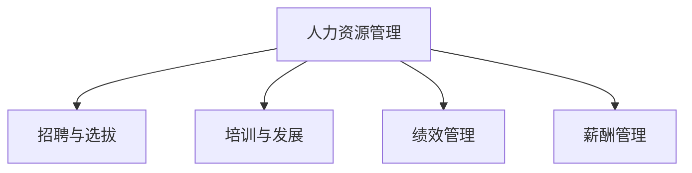

#### 流程图

接下来，我们使用Mermaid语言绘制一个人事管理的流程图：

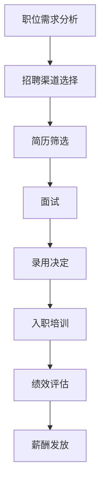

通过这些统计图和流程图，我们可以更直观地理解人事管理的内容和流程，从而更好地指导实际管理工作。

### 财务管理

#### 财务管理概述

财务管理是企业管理的核心环节，它涉及资金的筹集、运用和管理，旨在实现企业价值的最大化。财务管理主要包括资金筹集、投资管理、资金运作管理和财务分析等方面。

**财务管理的定义与目标**：

财务管理是指企业通过规划、组织、领导和控制资金活动，确保资金的有效筹集、合理运用和高效运作，以实现企业整体价值最大化的过程。

财务管理的目标主要包括以下几个方面：

- **资金安全**：确保企业资金的安全，避免资金损失和风险。
- **资金高效运作**：通过优化资金运作，提高资金的使用效率，减少资金成本。
- **收益最大化**：通过合理的资金筹集和运用，实现企业的收益最大化。
- **财务状况良好**：保持良好的财务状况，为企业长期发展提供稳定的基础。

**财务管理的任务**：

财务管理的任务包括以下几个方面：

- **资金筹集**：通过多种渠道筹集资金，确保企业有足够的资金满足运营需求。
- **投资管理**：合理分配资金，进行投资决策，以实现投资收益最大化。
- **资金运作管理**：优化资金运作流程，提高资金使用效率，降低资金成本。
- **财务分析**：对企业的财务状况进行分析，为决策提供依据。

#### 资金筹集

**资金来源**：

企业资金的来源主要包括内部筹集和外部筹集。

- **内部筹集**：内部筹集主要指通过留存收益、内部借款等方式筹集资金。这种方式具有成本较低、操作简便等优点，但受企业盈利能力限制，资金量有限。
- **外部筹集**：外部筹集主要指通过股权融资、债务融资等方式筹集资金。股权融资包括发行股票、增发股票等，债务融资包括发行债券、银行贷款等。这种方式可以筹集大量资金，但成本较高，且存在一定的风险。

**筹资策略**：

企业在筹集资金时，需要根据自身情况和市场环境，制定合理的筹资策略。

- **多元化筹资策略**：企业应通过多种渠道筹集资金，降低筹资成本和风险。例如，在资金需求较大时，可以同时进行股权融资和债务融资，以满足不同阶段的资金需求。
- **成本效益原则**：企业在筹集资金时，应综合考虑资金成本、资金用途和筹资风险，选择成本效益最高的筹资方式。
- **匹配原则**：企业应根据资金用途和期限，选择合适的筹资方式。例如，长期投资应选择长期融资方式，短期投资应选择短期融资方式。

#### 投资管理

**投资原则**：

投资管理是企业财务管理的重要任务，涉及投资原则、投资决策等方面。投资原则主要包括以下几个方面：

- **收益最大化原则**：在风险可控的前提下，追求投资收益的最大化。
- **风险最小化原则**：在收益一定的情况下，尽可能降低投资风险。
- **多元化原则**：分散投资，降低单一投资的风险。
- **可持续原则**：投资应符合企业的长期发展战略，实现可持续发展。

**投资决策**：

投资决策是企业投资管理的关键环节，需要考虑多个方面的因素。

- **投资项目评估**：对拟投资项目进行详细评估，包括投资成本、预期收益、风险水平等。
- **资金来源**：根据投资项目的要求，选择合适的资金来源，确保资金供应。
- **投资组合**：根据企业的投资策略，合理安排投资组合，降低整体投资风险。
- **决策审批**：对投资决策进行审批，确保投资决策的合法性和合规性。

#### 资金运作管理

**资金周转**：

资金周转是企业资金运作的关键指标，反映企业资金的使用效率。提高资金周转速度，可以降低资金成本，提高企业的盈利能力。

- **存货周转**：通过优化存货管理，减少存货积压，提高存货周转速度。
- **应收账款周转**：通过优化应收账款管理，缩短账期，提高应收账款周转速度。
- **应付账款周转**：通过优化应付账款管理，延长账期，提高应付账款周转速度。

**资金风险控制**：

资金风险控制是确保企业资金安全的重要措施，包括以下几个方面：

- **风险评估**：对企业面临的各种资金风险进行评估，确定风险等级。
- **风险预警**：建立风险预警机制，及时发现潜在风险，采取预防措施。
- **风险分散**：通过多元化的投资和筹资策略，降低整体资金风险。
- **内部控制**：建立健全的内部控制制度，确保资金运作的合法性和合规性。

#### 财务分析

**财务报表分析**：

财务报表分析是企业财务分析的重要手段，包括资产负债表、利润表和现金流量表等。

- **资产负债表**：反映企业在一定日期的资产、负债和所有者权益状况，分析企业的财务状况和偿债能力。
- **利润表**：反映企业在一定期间的收入、费用和利润状况，分析企业的盈利能力。
- **现金流量表**：反映企业在一定期间的现金流入和流出情况，分析企业的现金流量状况。

**财务比率分析**：

财务比率分析是企业财务分析的重要方法，包括流动比率、速动比率、资产负债率、净利润率等。

- **流动比率**：衡量企业短期偿债能力，越高表示企业短期偿债能力越强。
- **速动比率**：衡量企业快速变现能力，越高表示企业快速变现能力越强。
- **资产负债率**：衡量企业负债水平，越低表示企业负债水平越低。
- **净利润率**：衡量企业盈利能力，越高表示企业盈利能力越强。

### 统计图与流程图

为了更好地理解财务管理的内容，我们可以通过一些统计图和流程图来展示相关的概念和关系。

#### 数据可视化

以下是一个简单的统计图，展示了财务管理的主要任务和目标：

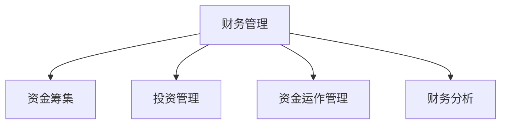

#### 流程图

接下来，我们使用Mermaid语言绘制一个财务管理的流程图：

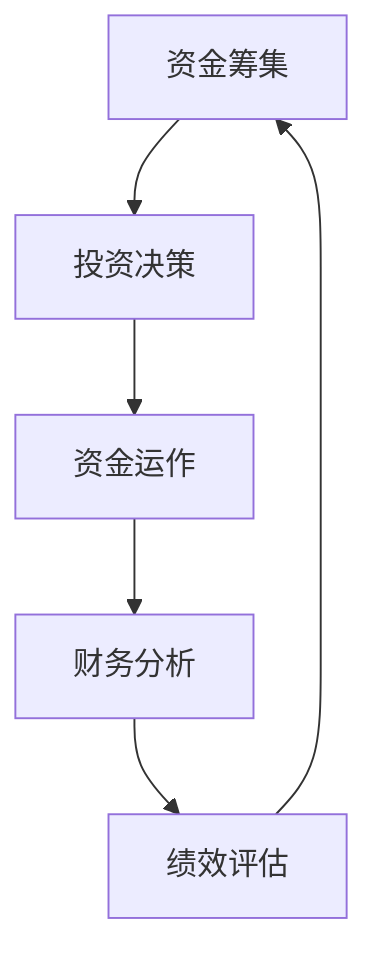

通过这些统计图和流程图，我们可以更直观地理解财务管理的内容和流程，从而更好地指导实际财务管理活动。

### 生产管理

#### 生产管理概述

生产管理是企业运营的核心环节，它涉及到如何有效地组织、协调和监督生产活动，以满足市场需求并确保产品质量。生产管理不仅关乎企业的运营效率，也直接影响企业的成本、效益和市场竞争力。

**生产管理的定义与目标**：

生产管理是指企业通过计划、组织、协调、控制等一系列活动，确保生产过程的高效、有序和成本可控。生产管理的目标主要包括：

- **高效生产**：提高生产效率，缩短生产周期，降低生产成本。
- **质量控制**：确保产品质量稳定，满足客户需求。
- **资源优化**：合理配置和利用生产资源，包括人力、物力、财力等。
- **响应市场**：快速响应市场需求变化，灵活调整生产计划。

**生产管理的任务**：

生产管理的任务可以概括为以下几个方面：

- **生产计划**：制定和实施生产计划，确保生产活动按计划进行。
- **生产组织**：合理设置生产组织结构，协调各部门和岗位之间的工作。
- **质量管理**：建立质量管理体系，确保产品质量符合标准和客户要求。
- **物料管理**：确保物料供应及时、充足，降低库存成本。
- **生产调度**：合理安排生产任务，平衡生产能力与需求。

#### 生产计划

**生产计划编制**：

生产计划编制是生产管理的核心环节，它涉及到如何根据市场需求和企业资源，科学合理地制定生产计划。生产计划编制通常包括以下步骤：

1. **需求分析**：分析市场需求，确定产品的需求量和交货期限。
2. **能力分析**：评估企业的生产能力，包括设备、人力、物料等。
3. **生产策略**：根据需求和资源情况，制定生产策略，如分散生产、集中生产等。
4. **计划制定**：根据生产策略，制定详细的生产计划，包括生产时间表、生产顺序等。

**生产进度安排**：

生产进度安排是确保生产计划顺利实施的关键。生产进度安排通常包括以下内容：

1. **任务分解**：将生产任务分解为具体的操作步骤，明确每个步骤的时间安排和责任人。
2. **优先级排序**：根据任务的紧急程度和重要性，合理安排任务的优先级。
3. **进度监控**：通过实时监控生产进度，及时发现和解决生产过程中出现的问题。
4. **反馈调整**：根据生产进度反馈，及时调整生产计划，确保生产活动顺利进行。

#### 生产组织

**生产组织形式**：

生产组织形式是指企业如何配置和利用生产资源，以实现生产目标。常见的生产组织形式包括：

- **单一生产线**：生产线上的设备、工人和材料专门用于生产某一产品或产品线。
- **混合生产线**：生产线上的设备、工人和材料可以生产多种产品。
- **总装线**：专门用于将零部件组装成最终产品的生产线。

**生产调度**：

生产调度是指在生产过程中，根据生产计划和实际生产情况，合理分配和调整生产资源，以确保生产活动的顺利进行。生产调度通常包括以下内容：

1. **任务分配**：根据生产计划，将生产任务分配给相应的生产线或工人。
2. **资源调配**：根据生产需要，及时调整和补充生产资源，如设备、物料等。
3. **进度调整**：根据实际生产进度，及时调整生产计划，确保生产活动与市场需求保持一致。
4. **问题解决**：及时解决生产过程中出现的问题，如设备故障、物料短缺等。

#### 质量管理

**质量管理原则**：

质量管理是企业确保产品或服务质量的重要手段。质量管理原则主要包括：

- **顾客导向**：以满足顾客需求为中心，不断改进产品和服务。
- **全员参与**：鼓励全体员工参与质量管理，提高质量意识。
- **预防为主**：通过预防措施，减少质量问题发生。
- **持续改进**：不断追求质量改进，实现质量管理体系的完善。

**质量管理工具**：

质量管理工具是帮助企业实现质量管理的有效手段，包括：

- **统计过程控制（SPC）**：通过统计分析，监控生产过程，及时发现和解决问题。
- **质量功能展开（QFD）**：通过系统化的方法，将顾客需求转化为产品或服务的具体设计要求。
- **六西格玛（Six Sigma）**：通过减少过程变异，提高产品或服务的质量。

#### 物料管理

**物料管理任务**：

物料管理是企业生产活动的重要保障，其主要任务包括：

- **库存控制**：确保物料库存水平合理，避免库存积压或短缺。
- **采购管理**：与供应商建立良好的合作关系，确保物料供应及时、质量稳定。
- **仓库管理**：优化仓库布局，提高仓储效率，确保物料安全。
- **物料跟踪**：对物料进行全程跟踪，确保物料从采购到生产的每一个环节都得到有效管理。

**物料管理方法**：

物料管理方法主要包括：

- **物料需求计划（MRP）**：通过计算物料需求，制定采购和库存计划。
- **供应商关系管理（SRM）**：与供应商建立长期合作关系，提高供应链的稳定性和灵活性。
- **物流管理**：优化物流流程，降低运输成本，提高物流效率。

### 统计图与流程图

为了更好地理解生产管理的内容，我们可以通过一些统计图和流程图来展示相关的概念和关系。

#### 数据可视化

以下是一个简单的统计图，展示了生产管理的主要任务和目标：

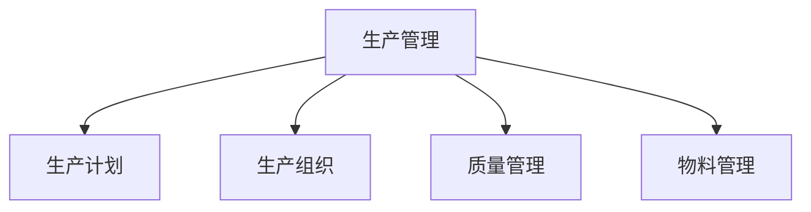

#### 流程图

接下来，我们使用Mermaid语言绘制一个生产管理的流程图：

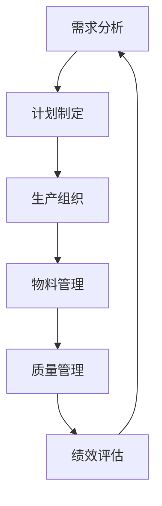

通过这些统计图和流程图，我们可以更直观地理解生产管理的内容和流程，从而更好地指导实际生产管理活动。

### 市场营销

#### 市场营销概述

市场营销是企业通过市场调研、市场细分、目标市场选择、市场定位等手段，满足消费者需求，实现企业价值的过程。市场营销不仅关乎企业的产品销售，还涉及品牌建设、市场推广等方面。

**市场营销的定义与目标**：

市场营销是指企业利用市场机制，通过产品、价格、地点、促销等策略，与消费者建立关系，满足其需求，实现企业目标的过程。

市场营销的目标主要包括以下几个方面：

- **满足消费者需求**：通过市场调研，了解消费者需求，提供符合市场需求的产品或服务。
- **提升品牌知名度**：通过市场推广，提高品牌在目标市场中的知名度，增强品牌影响力。
- **增加市场份额**：通过有效的市场营销策略，增加产品在市场上的份额，提升企业的市场地位。
- **实现盈利目标**：通过市场销售，实现企业的盈利目标，推动企业可持续发展。

**市场营销的任务**：

市场营销的任务包括以下几个方面：

- **市场调研**：通过调研获取市场信息，了解市场需求、竞争状况等，为营销策略提供依据。
- **市场细分**：将市场划分为不同的细分市场，找到最有利的市场机会。
- **目标市场选择**：根据企业资源和服务能力，选择最适合的企业目标市场。
- **市场定位**：确定企业在目标市场中的独特位置，塑造品牌形象。
- **营销策略制定**：制定包括产品策略、价格策略、渠道策略、推广策略等在内的营销组合策略。
- **市场推广**：通过各种营销手段，推广产品或服务，吸引消费者。

#### 市场调研

**市场调研方法**：

市场调研是企业获取市场信息的重要手段，包括定量调研和定性调研。

- **定量调研**：通过问卷调查、数据统计分析等方法，收集大量数据，进行定量分析。这种方法适用于大规模、结构化的问题。
- **定性调研**：通过访谈、小组讨论、观察等方法，深入了解消费者的需求和态度。这种方法适用于小规模、深度调研。

**市场调研报告**：

市场调研报告是市场调研的总结和呈现，通常包括以下几个部分：

- **调研目的**：明确调研的目的和意义。
- **调研方法**：描述调研采用的方法和技术。
- **调研结果**：展示调研的数据和分析结果。
- **结论和建议**：根据调研结果，提出结论和建议，为企业决策提供参考。

#### 市场细分与目标市场选择

**市场细分标准**：

市场细分是企业将市场划分为不同的消费者群体，以便更好地满足不同消费者的需求。市场细分标准主要包括以下几个方面：

- **地理细分**：根据消费者的地理位置进行细分，如国家、地区、城市等。
- **人口细分**：根据消费者的年龄、性别、收入、职业等人口统计特征进行细分。
- **心理细分**：根据消费者的生活方式、价值观、个性等心理特征进行细分。
- **行为细分**：根据消费者的购买行为、使用习惯等行为特征进行细分。

**目标市场选择**：

目标市场选择是企业根据市场细分结果，选择最有利可图的市场机会。目标市场选择通常包括以下几个步骤：

1. **评估细分市场的吸引力**：分析各个细分市场的规模、增长潜力、竞争状况等，评估其吸引力。
2. **确定目标市场**：根据企业资源和目标，选择一个或多个最具潜力的细分市场作为目标市场。
3. **市场定位**：在目标市场中，确定企业独特的市场定位，以满足目标消费者的需求。

#### 市场定位

**市场定位策略**：

市场定位是企业为了在目标市场中获得竞争优势，对产品或品牌进行独特定位的过程。市场定位策略主要包括以下几个方面：

- **产品定位**：根据产品特点，确定产品在消费者心目中的独特形象和地位。
- **价格定位**：根据产品定位和市场环境，确定产品的价格策略，如高端定位、低端定位等。
- **渠道定位**：根据产品特点和目标市场，选择合适的销售渠道，如线上销售、线下销售等。
- **推广定位**：通过广告、促销等手段，强化产品在目标市场的定位。

**市场定位方法**：

市场定位方法主要包括以下几个方面：

- **竞争定位**：根据竞争对手的产品和定位，确定自身的市场定位。
- **差异定位**：通过独特的卖点或特性，在目标市场中形成差异化定位。
- **情感定位**：通过情感共鸣，与目标消费者建立情感连接。

#### 营销策略

**营销策略**：

营销策略是指企业在市场营销过程中，为实现营销目标所采取的具体措施。营销策略主要包括以下几个方面：

- **产品策略**：确定产品定位、产品线策略、新产品开发策略等。
- **价格策略**：制定产品的价格策略，如成本加成定价、市场导向定价等。
- **渠道策略**：选择合适的销售渠道，如直销、代理商等，确保产品能够有效触达消费者。
- **推广策略**：通过广告、促销、公关等方式，提高产品的知名度，吸引消费者。

**营销策略的实施**：

营销策略的实施是市场营销的关键环节，主要包括以下几个步骤：

1. **策略制定**：根据市场调研结果和目标，制定具体的营销策略。
2. **策略评估**：对营销策略进行评估，确保策略的有效性。
3. **策略执行**：组织实施营销策略，确保策略的有效落实。
4. **策略调整**：根据市场反馈和策略执行效果，及时调整营销策略。

### 统计图与流程图

为了更好地理解市场营销的内容，我们可以通过一些统计图和流程图来展示相关的概念和关系。

#### 数据可视化

以下是一个简单的统计图，展示了市场营销的主要任务和目标：

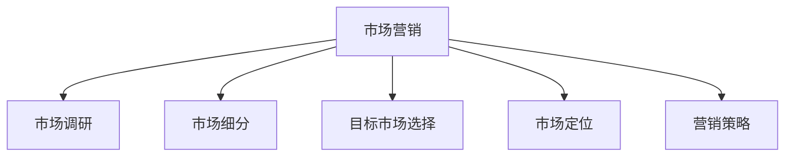

#### 流程图

接下来，我们使用Mermaid语言绘制一个市场营销的流程图：

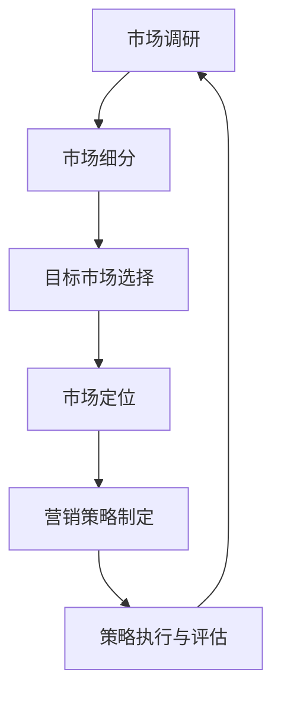

通过这些统计图和流程图，我们可以更直观地理解市场营销的内容和流程，从而更好地指导实际市场营销活动。

### 创新管理

#### 创新管理概述

创新管理是企业通过系统的组织、激励和过程管理，推动创新活动的进行，从而实现企业持续发展的重要手段。创新管理涵盖了创新的概念、创新过程、创新策略和创新文化等方面。

**创新的概念与类型**：

创新是指通过新的想法、方法或技术，产生新的产品、服务或商业模式的创造性活动。创新可以分为以下几种类型：

- **技术型创新**：通过技术改进，提高产品或服务的性能和效率。
- **市场型创新**：通过市场需求的洞察，推出符合市场需求的新产品或服务。
- **过程型创新**：通过改进生产流程、管理方法等，提高企业运营效率。
- **组织型创新**：通过组织结构调整、企业文化变革等，提高企业的创新能力。

**创新管理的重要性**：

创新管理对于企业的持续发展至关重要，其重要性体现在以下几个方面：

- **提高竞争力**：通过创新，企业能够推出具有竞争力的新产品或服务，占领市场。
- **持续发展**：创新是企业应对市场变化和挑战的重要手段，能够推动企业持续发展。
- **增加价值**：创新能够为企业带来新的商业机会，提升企业的整体价值。

#### 创新过程

**创新过程的阶段**：

创新过程通常包括以下几个阶段：

1. **创意生成**：创意生成是创新过程的起点，通过头脑风暴、市场调研等方式，产生新的创意。
2. **创意筛选**：对产生的创意进行筛选，评估其可行性、市场潜力等，选出最有价值的创意。
3. **创意开发**：对选出的创意进行深入研究和开发，形成初步的产品或服务方案。
4. **创意实施**：将创意转化为实际的产品或服务，并进行市场推广和销售。
5. **评估反馈**：对创新项目进行评估和反馈，总结经验教训，为未来的创新活动提供参考。

**创新流程模型**：

创新流程模型有多种，其中较为常用的包括：

- **线性模型**：创新过程按照一定的顺序进行，每个阶段都有明确的任务和输出。
- **迭代模型**：创新过程多次迭代，不断调整和优化，直到实现最终的创新目标。
- **瀑布模型**：创新过程按照固定顺序进行，每个阶段完成后才能进入下一个阶段。

#### 创新策略

**创新战略**：

创新战略是指企业为实现长期创新目标，制定的具体行动方案。创新战略主要包括以下几个方面：

- **资源投入**：确定创新项目的资金、人力、技术等资源投入。
- **技术路线**：明确企业的技术发展方向，如聚焦前沿技术、跟随技术等。
- **市场定位**：根据市场需求，确定创新产品的市场定位。
- **合作与联盟**：通过合作与联盟，整合外部资源，提升创新能力。

**创新管理工具**：

创新管理工具是帮助企业进行创新活动的重要手段，包括：

- **头脑风暴**：通过集体讨论，产生大量创意。
- **思维导图**：将创意和组织结构可视化，帮助理解创意之间的关系。
- **SWOT分析**：对创意进行评估，分析其优势、劣势、机会和威胁。
- **六西格玛**：通过减少过程变异，提高产品或服务的质量。

#### 创新文化

**创新文化的建设**：

创新文化是企业鼓励创新、容忍失败、支持风险承担的企业氛围。创新文化的建设主要包括以下几个方面：

- **领导支持**：企业领导要积极倡导创新，为员工提供创新空间和支持。
- **员工参与**：鼓励员工参与创新活动，激发员工的创新潜力。
- **失败容忍**：建立失败容忍机制，鼓励员工尝试新的想法，即使失败也能得到企业的支持和鼓励。
- **资源保障**：为创新项目提供充足的资源保障，确保创新活动的顺利进行。

**创新氛围的营造**：

创新氛围是企业创新文化的重要组成部分，包括：

- **开放沟通**：建立开放的沟通渠道，鼓励员工分享创新想法。
- **学习氛围**：鼓励员工不断学习和成长，提升创新能力。
- **团队合作**：通过团队合作，形成创新合力，提高创新效率。
- **激励机制**：建立激励机制，对创新成果进行奖励，激励员工持续创新。

### 统计图与流程图

为了更好地理解创新管理的内容，我们可以通过一些统计图和流程图来展示相关的概念和关系。

#### 数据可视化

以下是一个简单的统计图，展示了创新管理的几个关键要素：

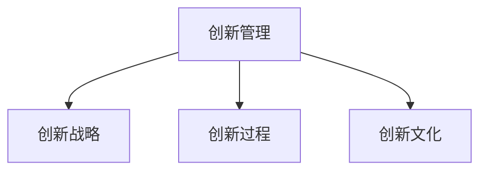

#### 流程图

接下来，我们使用Mermaid语言绘制一个创新管理的流程图：

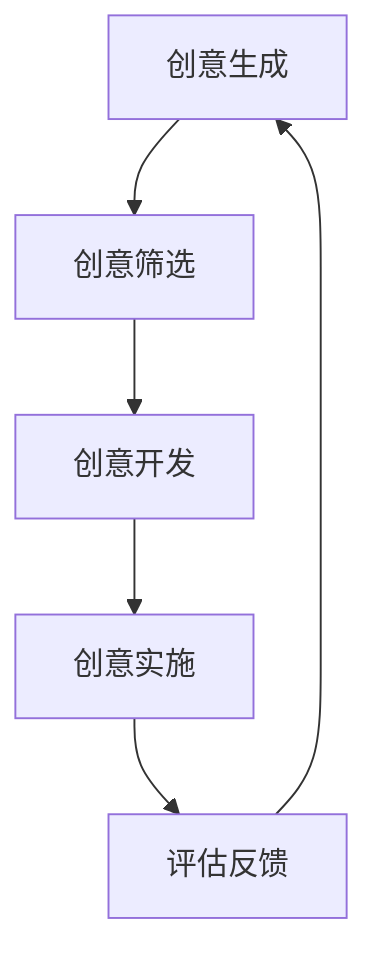

通过这些统计图和流程图，我们可以更直观地理解创新管理的内容和流程，从而更好地指导实际创新活动。

### 管理者技能提升

#### 沟通能力

**沟通的重要性**：

沟通能力是管理者必备的核心技能之一。有效的沟通能够促进团队成员之间的理解与合作，提高工作效率，实现组织目标。良好的沟通能够：

- **传递信息**：确保信息准确无误地传递，避免误解和错误。
- **建立信任**：通过开放和诚实的沟通，建立信任关系，增强团队的凝聚力。
- **解决冲突**：及时沟通有助于解决团队成员之间的分歧和矛盾，保持团队和谐。

**有效沟通的方法**：

- **倾听**：倾听是有效沟通的基础，通过认真倾听，了解对方的观点和需求。
- **明确表达**：清晰、准确地表达自己的观点和想法，避免歧义。
- **积极反馈**：给予对方及时的反馈，了解沟通效果，并根据反馈进行调整。
- **尊重差异**：尊重不同意见和观点，鼓励团队成员表达自己的看法。

#### 领导能力

**领导理论**：

领导理论是研究领导行为和领导效果的理论体系。常见的领导理论包括：

- **领导行为理论**：研究领导者的行为和风格，如X理论和Y理论、情境领导理论等。
- **领导权力理论**：研究领导者的权力来源和运用方式，如职位权力、参考权力等。
- **领导特质理论**：研究领导者的个性特征和能力，如胆识、智慧、魅力等。

**领导艺术**：

领导艺术是指领导者在实际工作中，灵活运用领导理论，解决实际问题的能力。领导艺术包括以下几个方面：

- **决策能力**：在复杂多变的环境中，做出合理、有效的决策。
- **激励能力**：激发团队成员的积极性，发挥其潜能。
- **变革能力**：推动组织变革，适应市场变化和挑战。
- **沟通能力**：与团队成员保持良好的沟通，建立信任和合作关系。

#### 决策能力

**决策原则**：

有效的决策能力是管理者成功的关键。决策原则包括：

- **目标导向**：明确决策的目标，确保决策与组织目标一致。
- **信息充分**：收集和分析充分的信息，确保决策有据可依。
- **科学合理**：运用科学的方法和工具，如SWOT分析、决策树等，进行决策。
- **风险可控**：评估决策的风险，制定相应的风险控制措施。

**决策方法**：

常见的决策方法包括：

- **直觉决策**：基于经验和个人直觉进行决策。
- **理性决策**：通过系统分析和逻辑推理进行决策。
- **群体决策**：通过集体讨论和投票，共同做出决策。

#### 团队管理

**团队建设的策略**：

团队建设是企业提升团队绩效和团队凝聚力的重要手段。团队建设的策略包括：

- **共同目标**：明确团队的目标，确保团队成员对目标有共同的理解和认同。
- **沟通协作**：建立良好的沟通机制，促进团队成员之间的协作和合作。
- **激励机制**：制定合理的激励机制，激发团队成员的积极性和创造力。
- **培训与发展**：为团队成员提供培训和发展机会，提升其能力和素质。

**团队冲突的处理**：

团队冲突是团队管理中不可避免的问题。有效的冲突处理策略包括：

- **沟通解决**：通过沟通，了解冲突的原因和双方的观点，寻求共识。
- **调解解决**：由第三方调解员或团队领导者进行调解，帮助解决冲突。
- **妥协解决**：在双方利益的基础上，寻求妥协和平衡，达成共识。

#### 自我管理

**时间管理**：

时间管理是提高工作效率的重要手段。时间管理的策略包括：

- **优先级排序**：根据任务的紧急程度和重要性，合理安排时间，确保重要任务优先完成。
- **时间分配**：合理分配工作时间，避免时间浪费和过度劳累。
- **时间记录**：记录工作时间，分析时间使用情况，找出时间浪费的环节。

**压力管理**：

压力管理是保持心理健康和工作效率的关键。压力管理的策略包括：

- **合理规划**：合理安排工作和休息，避免过度工作。
- **调整心态**：积极面对压力，学会放松和调整心态。
- **寻求支持**：与家人、朋友或同事交流，寻求支持和帮助。

### 统计图与流程图

为了更好地理解管理者技能提升的内容，我们可以通过一些统计图和流程图来展示相关的概念和关系。

#### 数据可视化

以下是一个简单的统计图，展示了管理者技能提升的关键要素：

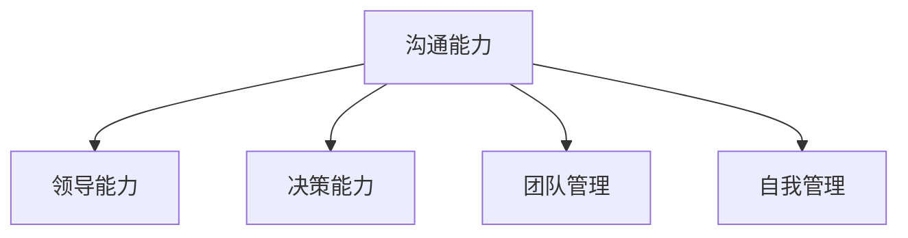

#### 流程图

接下来，我们使用Mermaid语言绘制一个管理者技能提升的流程图：

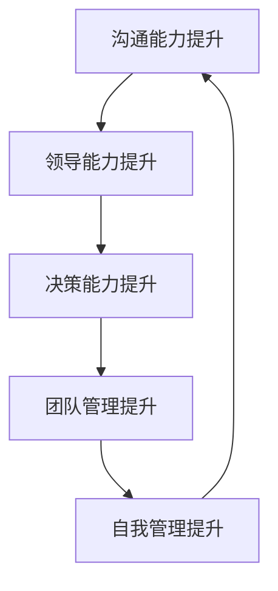

通过这些统计图和流程图，我们可以更直观地理解管理者技能提升的内容和流程，从而更好地指导实际管理活动。

### 管理工具与方法

#### 管理工具

**SWOT分析**：

SWOT分析是一种常用的战略规划工具，用于评估企业的优势、劣势、机会和威胁。SWOT分析的步骤如下：

1. **识别优势（Strengths）**：分析企业内部的优势，如技术优势、品牌优势、管理优势等。
2. **识别劣势（Weaknesses）**：分析企业内部的劣势，如技术劣势、市场劣势、管理劣势等。
3. **识别机会（Opportunities）**：分析外部环境中的机会，如市场趋势、政策变化、技术进步等。
4. **识别威胁（Threats）**：分析外部环境中的威胁，如市场竞争、政策风险、技术变革等。

**PEST分析**：

PEST分析是一种用于分析宏观环境的工具，通过政治（Political）、经济（Economic）、社会（Sociological）和技术（Technological）四个维度，评估外部环境对企业的影响。PEST分析的步骤如下：

1. **政治因素**：分析政治环境对企业的影响，如政策变化、政治稳定性等。
2. **经济因素**：分析经济环境对企业的影响，如经济增长、通货膨胀、汇率变动等。
3. **社会因素**：分析社会环境对企业的影响，如人口结构、消费者行为、文化变迁等。
4. **技术因素**：分析技术环境对企业的影响，如技术创新、技术发展、技术替代等。

**五力模型**：

五力模型是由迈克尔·波特提出的，用于分析行业竞争格局的工具。五力模型包括：

1. **供应商的议价能力**：分析供应商的议价能力，如供应商数量、市场集中度等。
2. **买家的议价能力**：分析买家的议价能力，如买家数量、购买力等。
3. **潜在竞争者的威胁**：分析潜在竞争者的威胁，如新进入者的数量、市场份额等。
4. **替代品的威胁**：分析替代品的威胁，如替代品的价格、性能等。
5. **现有竞争者的竞争**：分析现有竞争者的竞争，如竞争者数量、竞争策略等。

**波士顿矩阵**：

波士顿矩阵是一种用于产品组合分析的工具，通过市场份额和增长潜力两个维度，将产品分为四个象限。波士顿矩阵的步骤如下：

1. **确定市场份额**：计算产品的市场份额。
2. **确定增长潜力**：分析产品的市场增长潜力。
3. **划分象限**：根据市场份额和增长潜力，将产品分为四个象限：明星产品、问题产品、现金牛产品和瘦狗产品。

#### 管理方法

**目标管理**：

目标管理是一种以目标为导向的管理方法，通过设定目标、分解任务、评估绩效，实现组织目标。目标管理的步骤如下：

1. **设定目标**：根据组织战略，设定明确、具体的目标。
2. **分解任务**：将目标分解为具体的任务，明确责任人和时间节点。
3. **执行任务**：执行任务，确保目标按计划实现。
4. **评估绩效**：对任务完成情况进行评估，确保目标实现。

**5S管理**：

5S管理是一种用于提高工作效率和员工素质的管理方法，包括五个方面：整理（Seiri）、整顿（Seiton）、清扫（Seiso）、清洁（Seiketsu）和素养（Shitsuke）。5S管理的步骤如下：

1. **整理**：将工作场所的物品分类，区分必要和非必要物品，将非必要物品清理出工作场所。
2. **整顿**：对必要物品进行定位管理，明确放置位置和取用方法。
3. **清扫**：定期清扫工作场所，保持环境整洁。
4. **清洁**：建立清洁制度，确保工作场所的清洁和卫生。
5. **素养**：培养员工的职业素养，养成良好的工作习惯。

**全面质量管理**：

全面质量管理（TQM）是一种以顾客为中心的管理方法，通过全员参与、全过程控制，实现产品和服务质量的持续改进。全面质量管理的步骤如下：

1. **领导层承诺**：领导层明确质量目标，承诺全面质量管理。
2. **全员参与**：全体员工参与质量管理，提高质量意识。
3. **过程控制**：对生产和服务过程进行控制，确保质量符合标准。
4. **绩效评估**：对质量管理绩效进行评估，持续改进质量。

**平衡计分卡**：

平衡计分卡是一种用于评估企业绩效的管理工具，从财务、客户、内部流程、学习与成长四个维度，综合评估企业的绩效。平衡计分卡的步骤如下：

1. **设定目标**：根据企业战略，设定财务、客户、内部流程、学习与成长四个维度的目标。
2. **指标设计**：设计具体的绩效指标，如财务指标、客户指标、内部流程指标、学习与成长指标等。
3. **数据收集**：收集相关数据，进行绩效评估。
4. **分析反馈**：对绩效进行分析和反馈，为决策提供依据。

### 统计图与流程图

为了更好地理解管理工具与方法，我们可以通过一些统计图和流程图来展示相关的概念和关系。

#### 数据可视化

以下是一个简单的统计图，展示了管理工具与方法的关键要素：

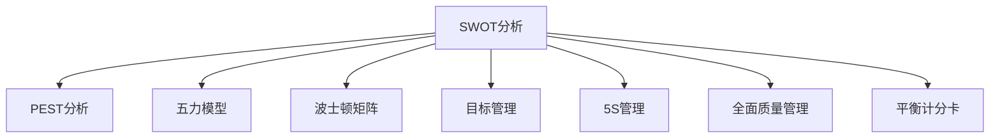

#### 流程图

接下来，我们使用Mermaid语言绘制一个管理工具与方法的流程图：

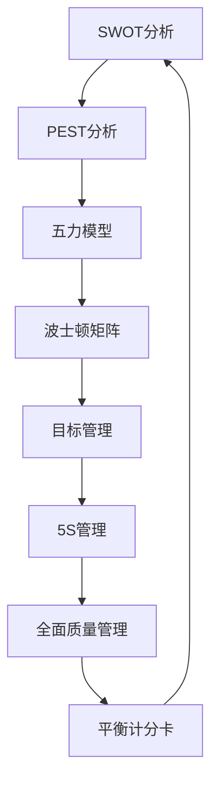

通过这些统计图和流程图，我们可以更直观地理解管理工具与方法的内容和关系，从而更好地指导实际管理工作。

### 管理案例

#### 国内外成功管理案例

**阿里巴巴**：

阿里巴巴是中国领先的互联网公司，其成功的管理实践包括：

- **企业文化**：阿里巴巴强调“客户第一、员工第二、股东第三”的企业文化，注重员工的培养和发展，为员工提供良好的工作环境和发展机会。
- **组织变革**：随着公司规模的不断扩大，阿里巴巴通过多次组织变革，优化公司结构，提高管理效率。
- **创新驱动**：阿里巴巴重视创新，不断推出新产品和服务，如电子商务平台、云计算、人工智能等，保持市场竞争力。

**华为**：

华为是全球领先的科技公司，其成功的管理实践包括：

- **研发投入**：华为每年将大量资金用于研发，持续推动技术创新，保持技术领先地位。
- **人才培养**：华为注重人才培养，通过内部培训和外部引进，不断提升员工的技能和素质。
- **全球化战略**：华为积极拓展海外市场，实施全球化战略，提升国际竞争力。

#### 管理变革案例

**麦当劳**：

麦当劳是一家全球知名的快餐连锁企业，其管理变革案例包括：

- **标准化管理**：麦当劳通过标准化管理，确保全球各地的门店都能提供一致的产品和服务质量。
- **顾客导向**：麦当劳注重顾客体验，通过顾客反馈，不断改进产品和服务。
- **数字化转型**：面对数字化时代的挑战，麦当劳积极推进数字化转型，通过线上订餐、移动支付等手段，提升顾客体验。

**诺基亚**：

诺基亚曾是全球领先的手机制造商，但其管理失误导致市场份额大幅下降。诺基亚的管理变革案例包括：

- **创新不足**：诺基亚在智能手机市场的发展过程中，未能及时推出具有竞争力的产品，导致市场份额被竞争对手抢占。
- **组织僵化**：诺基亚内部组织结构僵化，创新机制不完善，导致公司缺乏灵活性和应变能力。
- **战略调整**：诺基亚在战略调整过程中，未能及时识别市场变化，导致市场份额持续下降。

#### 管理失败案例分析

**柯达**：

柯达曾是全球领先的胶卷制造商，但其在数码技术发展的过程中，未能抓住机遇，最终导致破产。柯达的管理失败原因包括：

- **忽视数码技术**：柯达在数码技术发展的初期，未能认识到其潜在的市场机会，继续专注于胶卷业务。
- **研发投入不足**：柯达在数码技术领域的研发投入不足，缺乏具备竞争力的数码产品。
- **组织结构僵化**：柯达内部组织结构僵化，创新机制不完善，导致公司在数字化转型过程中缺乏灵活性和应变能力。

### 结论

通过分析国内外成功管理案例和管理变革案例，我们可以看到，成功的管理实践离不开优秀的企业文化、创新驱动、人才培养和灵活的应对策略。而管理失败则往往源于创新不足、组织僵化、战略失误等原因。管理者应从成功案例中汲取经验，从失败案例中吸取教训，不断优化管理实践，提升企业竞争力。

## 附录

### 附录A：管理工具与方法

#### A.1 管理工具

**SWOT分析**

**定义**：SWOT分析是一种常用的战略规划工具，用于评估企业的优势、劣势、机会和威胁。

**适用场景**：适用于企业战略规划、产品策划、市场营销等。

**步骤**：

1. **优势分析**：分析企业内部的优势，如技术优势、品牌优势、管理优势等。
2. **劣势分析**：分析企业内部的劣势，如技术劣势、市场劣势、管理劣势等。
3. **机会分析**：分析外部环境中的机会，如市场趋势、政策变化、技术进步等。
4. **威胁分析**：分析外部环境中的威胁，如市场竞争、政策风险、技术变革等。

**示例**：

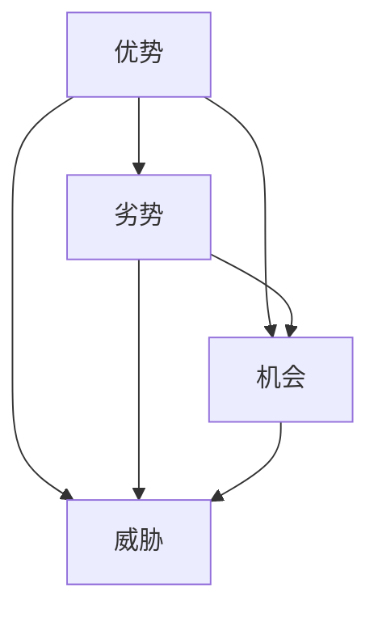

**PEST分析**

**定义**：PEST分析是一种用于分析宏观环境的工具，通过政治、经济、社会和技术四个维度，评估外部环境对企业的影响。

**适用场景**：适用于企业战略规划、市场调研等。

**步骤**：

1. **政治因素分析**：分析政治环境对企业的影响，如政策变化、政治稳定性等。
2. **经济因素分析**：分析经济环境对企业的影响，如经济增长、通货膨胀、汇率变动等。
3. **社会因素分析**：分析社会环境对企业的影响，如人口结构、消费者行为、文化变迁等。
4. **技术因素分析**：分析技术环境对企业的影响，如技术创新、技术发展、技术替代等。

**示例**：

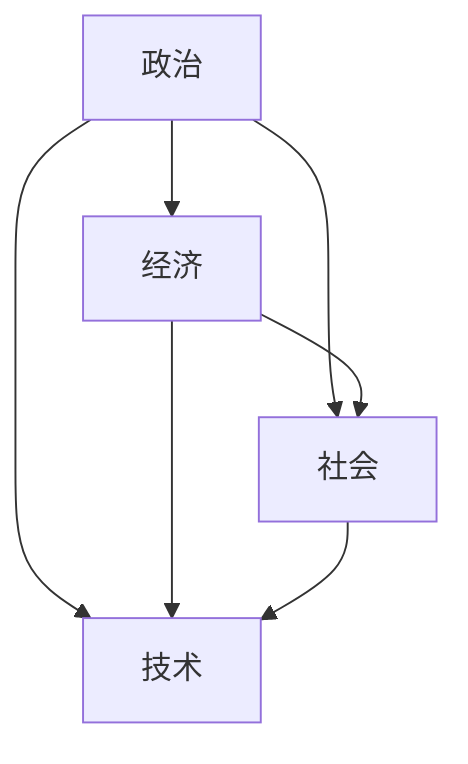

**五力模型**

**定义**：五力模型是由迈克尔·波特提出的，用于分析行业竞争格局的工具。

**适用场景**：适用于行业分析、市场竞争策略制定等。

**五力**：

1. **供应商的议价能力**：分析供应商的议价能力，如供应商数量、市场集中度等。
2. **买家的议价能力**：分析买家的议价能力，如买家数量、购买力等。
3. **潜在竞争者的威胁**：分析潜在竞争者的威胁，如新进入者的数量、市场份额等。
4. **替代品的威胁**：分析替代品的威胁，如替代品的价格、性能等。
5. **现有竞争者的竞争**：分析现有竞争者的竞争，如竞争者数量、竞争策略等。

**示例**：

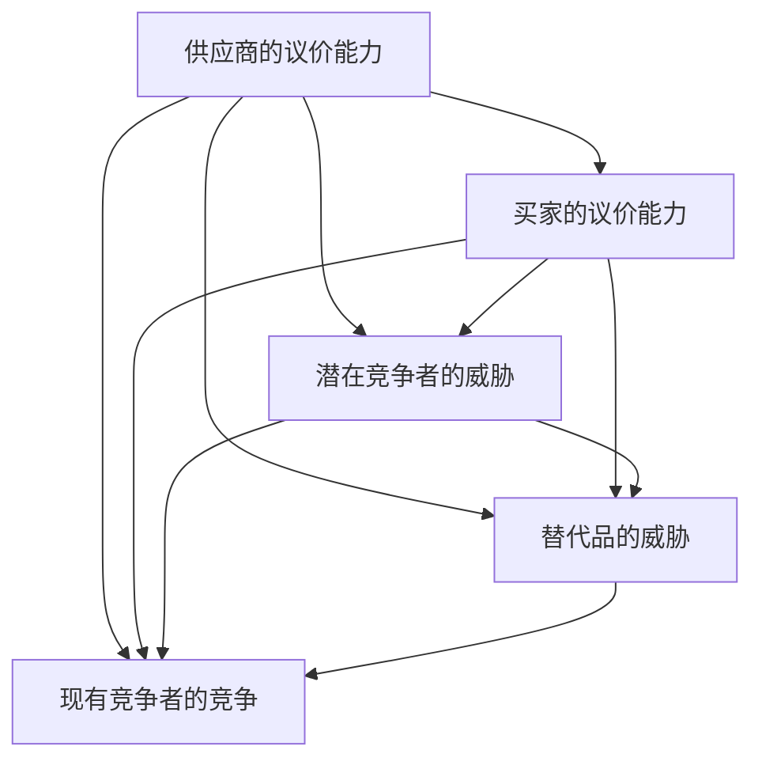

**波士顿矩阵**

**定义**：波士顿矩阵是一种用于产品组合分析的工具，通过市场份额和增长潜力两个维度，将产品分为四个象限。

**适用场景**：适用于产品策划、市场营销等。

**四个象限**：

1. **明星产品**：市场份额高，增长潜力高。
2. **问题产品**：市场份额低，增长潜力高。
3. **现金牛产品**：市场份额高，增长潜力低。
4. **瘦狗产品**：市场份额低，增长潜力低。

**示例**：

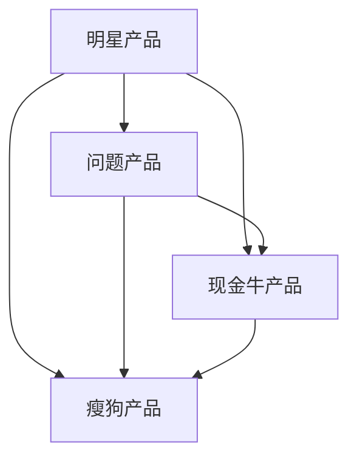

#### A.2 管理方法

**目标管理**

**定义**：目标管理是一种以目标为导向的管理方法，通过设定目标、分解任务、评估绩效，实现组织目标。

**步骤**：

1. **设定目标**：根据组织战略，设定明确、具体的目标。
2. **分解任务**：将目标分解为具体的任务，明确责任人和时间节点。
3. **执行任务**：执行任务，确保目标按计划实现。
4. **评估绩效**：对任务完成情况进行评估，确保目标实现。

**示例**：

```mermaid
flowchart TD
    A[设定目标] --> B[分解任务]
    B --> C[执行任务]
    C --> D[评估绩效]
    D --> A
```

**5S管理**

**定义**：5S管理是一种用于提高工作效率和员工素质的管理方法，包括五个方面：整理、整顿、清扫、清洁和素养。

**步骤**：

1. **整理**：将工作场所的物品分类，区分必要和非必要物品，将非必要物品清理出工作场所。
2. **整顿**：对必要物品进行定位管理，明确放置位置和取用方法。
3. **清扫**：定期清扫工作场所，保持环境整洁。
4. **清洁**：建立清洁制度，确保工作场所的清洁和卫生。
5. **素养**：培养员工的职业素养，养成良好的工作习惯。

**示例**：

```mermaid
graph TD
    A[整理]
    B[整顿]
    C[清扫]
    D[清洁]
    E[素养]
    A-->B
    A-->C
    A-->D
    A-->E
    B-->C
    B-->D
    B-->E
    C-->D
    C-->E
    D-->E
```

**全面质量管理**

**定义**：全面质量管理（TQM）是一种以顾客为中心的管理方法，通过全员参与、全过程控制，实现产品和服务质量的持续改进。

**步骤**：

1. **领导层承诺**：领导层明确质量目标，承诺全面质量管理。
2. **全员参与**：全体员工参与质量管理，提高质量意识。
3. **过程控制**：对生产和服务过程进行控制，确保质量符合标准。
4. **绩效评估**：对质量管理绩效进行评估，持续改进质量。

**示例**：

```mermaid
graph TD
    A[领导层承诺] --> B[全员参与]
    B --> C[过程控制]
    C --> D[绩效评估]
    D --> A
```

**平衡计分卡**

**定义**：平衡计分卡是一种用于评估企业绩效的管理工具，从财务、客户、内部流程、学习与成长四个维度，综合评估企业的绩效。

**步骤**：

1. **设定目标**：根据企业战略，设定财务、客户、内部流程、学习与成长四个维度的目标。
2. **指标设计**：设计具体的绩效指标，如财务指标、客户指标、内部流程指标、学习与成长指标等。
3. **数据收集**：收集相关数据，进行绩效评估。
4. **分析反馈**：对绩效进行分析和反馈，为决策提供依据。

**示例**：

```mermaid
graph TD
    A[财务维度] --> B[客户维度]
    A --> C[内部流程维度]
    A --> D[学习与成长维度]
    B --> C
    B --> D
    C --> D
```

### 附录B：管理案例

#### B.1 国内外成功管理案例

**阿里巴巴**

**案例描述**：

阿里巴巴是中国领先的互联网公司，其成功的管理实践包括：

- **企业文化**：阿里巴巴强调“客户第一、员工第二、股东第三”的企业文化，注重员工的培养和发展，为员工提供良好的工作环境和发展机会。
- **组织变革**：随着公司规模的不断扩大，阿里巴巴通过多次组织变革，优化公司结构，提高管理效率。
- **创新驱动**：阿里巴巴重视创新，不断推出新产品和服务，如电子商务平台、云计算、人工智能等，保持市场竞争力。

**管理亮点**：

- **开放包容的文化**：阿里巴巴倡导开放和包容的企业文化，鼓励员工创新和分享，形成良好的创新氛围。
- **组织结构优化**：阿里巴巴通过灵活的组织结构调整，确保公司能够快速响应市场变化，提高运营效率。
- **多元化发展战略**：阿里巴巴通过多元化发展战略，拓展新的业务领域，实现业务的持续增长。

**结论**：

阿里巴巴的成功管理实践表明，开放包容的文化、灵活的组织结构和多元化发展战略是推动企业持续发展的关键因素。

**华为**

**案例描述**：

华为是全球领先的科技公司，其成功的管理实践包括：

- **研发投入**：华为每年将大量资金用于研发，持续推动技术创新，保持技术领先地位。
- **人才培养**：华为注重人才培养，通过内部培训和外部引进，不断提升员工的技能和素质。
- **全球化战略**：华为积极拓展海外市场，实施全球化战略，提升国际竞争力。

**管理亮点**：

- **持续的研发投入**：华为持续增加研发投入，推动技术创新，形成核心竞争力。
- **人才培养体系**：华为建立完善的人才培养体系，为员工提供成长和发展的机会。
- **全球化布局**：华为通过全球化布局，拓展国际市场，提高国际竞争力。

**结论**：

华为的成功管理实践表明，持续的研发投入、完善的人才培养体系和全球化布局是提升企业竞争力的关键因素。

#### B.2 管理失败案例分析

**柯达**

**案例描述**：

柯达曾是全球领先的胶卷制造商，但在数码技术发展的过程中，未能抓住机遇，最终导致破产。柯达的管理失败原因包括：

- **忽视数码技术**：柯达在数码技术发展的初期，未能认识到其潜在的市场机会，继续专注于胶卷业务。
- **研发投入不足**：柯达在数码技术领域的研发投入不足，缺乏具备竞争力的数码产品。
- **组织结构僵化**：柯达内部组织结构僵化，创新机制不完善，导致公司在数字化转型过程中缺乏灵活性和应变能力。

**管理失败原因**：

- **战略失误**：柯达未能及时调整战略，抓住数码技术发展的机遇，导致市场份额被竞争对手抢占。
- **创新不足**：柯达在数码技术领域的创新不足，缺乏具备竞争力的数码产品，无法满足市场需求。
- **组织僵化**：柯达内部组织结构僵化，创新机制不完善，导致公司在数字化转型过程中缺乏灵活性和应变能力。

**教训**：

柯达的失败给企业管理者提供了重要的教训，即在面对市场变化和技术发展时，必须及时调整战略，加大研发投入，建立灵活的创新机制，以保持企业的竞争力和持续发展。

### 结论

通过分析国内外成功管理案例和管理失败案例，我们可以看到，成功的管理实践离不开开放包容的文化、灵活的组织结构和多元化发展战略；而管理失败则往往源于战略失误、创新不足和组织僵化等原因。管理者应从成功案例中汲取经验，从失败案例中吸取教训，不断优化管理实践，提升企业竞争力。

## 结论

本文从管理的智慧出发，系统地探讨了如何通过有效的管理激发团队的潜能，提高工作效率，实现企业的可持续发展。我们首先阐述了管理的基本原理，包括管理的定义与目标、管理的基本原则和管理的过程。接着，我们详细讨论了人事管理、财务管理、生产管理、市场营销、创新管理和管理者技能提升等方面的具体实践和方法。此外，我们还通过统计图和流程图，对管理的关键概念和流程进行了数据可视化展示。

通过本文的分析，我们可以得出以下结论：

1. **管理的智慧在于科学性、人本性和创新性的结合**：科学性原则要求管理活动遵循客观规律，人本原则强调关注员工需求，创新原则鼓励持续变革。这三者相互补充，共同构成管理智慧的核心。

2. **有效的管理能够激发团队的潜能**：通过合理的人事管理、财务管理、生产管理和市场营销，企业能够更好地调动员工积极性，提高工作效率，实现团队目标的共同达成。

3. **创新管理是推动企业持续发展的关键**：创新不仅是产品或技术的改进，更是管理理念和管理方法的革新。通过创新管理，企业能够不断提升竞争力，保持市场领先地位。

4. **管理者技能的提升是企业管理成功的基础**：沟通能力、领导能力、决策能力等管理技能的提升，有助于管理者更好地应对复杂多变的环境，推动企业持续发展。

### 参考文献

1. **彼得·德鲁克**，《管理的实践》，机械工业出版社，2007年。
2. **迈克尔·波特**，《竞争战略》，华夏出版社，1997年。
3. **菲利普·库克**，《市场营销管理》，清华大学出版社，2006年。
4. **托马斯·彼得斯**，《创新者的窘境》，机械工业出版社，2003年。
5. **戴维·贝克**，《团队协作的力量》，电子工业出版社，2010年。
6. **詹姆斯·马奇**，《领导者的智慧》，中国人民大学出版社，2011年。

## 附录

### 附录A：管理工具与方法

**A.1 管理工具**

1. **SWOT分析**
   - **定义**：SWOT分析是一种用于评估企业内部优势（Strengths）、劣势（Weaknesses）、机会（Opportunities）和威胁（Threats）的工具。
   - **示例**：
     ```mermaid
     graph TD
         A[SWOT]
         B[Strengths]
         C[Weaknesses]
         D[Opportunities]
         E[Threats]
         A-->B
         A-->C
         A-->D
         A-->E
     ```

2. **PEST分析**
   - **定义**：PEST分析是一种用于评估外部环境（政治、经济、社会、技术）对企业影响的工具。
   - **示例**：
     ```mermaid
     graph TD
         A[PEST]
         B[Political]
         C[Economic]
         D[Sociological]
         E[Technological]
         A-->B
         A-->C
         A-->D
         A-->E
     ```

3. **五力模型**
   - **定义**：五力模型是一种用于分析行业竞争态势的工具，包括供应商、买家、潜在竞争者、替代品和现有竞争者。
   - **示例**：
     ```mermaid
     graph TD
         A[五力模型]
         B[供应商]
         C[买家]
         D[潜在竞争者]
         E[替代品]
         F[现有竞争者]
         A-->B
         A-->C
         A-->D
         A-->E
         A-->F
     ```

4. **波士顿矩阵**
   - **定义**：波士顿矩阵是一种用于产品组合分析的工具，根据市场份额和增长潜力将产品分为四类：明星、问题、现金牛和瘦狗。
   - **示例**：
     ```mermaid
     graph TD
         A[波士顿矩阵]
         B[明星]
         C[问题]
         D[现金牛]
         E[瘦狗]
         A-->B
         A-->C
         A-->D
         A-->E
     ```

**A.2 管理方法**

1. **目标管理**
   - **定义**：目标管理是一种以目标为导向的管理方法，通过设定目标、分解任务、评估绩效来实现组织目标。
   - **示例**：
     ```mermaid
     flowchart TD
         A[设定目标]
         B[分解任务]
         C[执行任务]
         D[评估绩效]
         A-->B
         B-->C
         C-->D
         D-->A
     ```

2. **5S管理**
   - **定义**：5S管理是一种用于提高工作效率和员工素质的管理方法，包括整理（Seiri）、整顿（Seiton）、清扫（Seiso）、清洁（Seiketsu）和素养（Shitsuke）。
   - **示例**：
     ```mermaid
     graph TD
         A[整理]
         B[整顿]
         C[清扫]
         D[清洁]
         E[素养]
         A-->B
         A-->C
         A-->D
         A-->E
         B-->C
         B-->D
         B-->E
         C-->D
         C-->E
         D-->E
     ```

3. **全面质量管理**
   - **定义**：全面质量管理（TQM）是一种以顾客为中心的管理方法，通过全员参与、全过程控制实现产品和服务质量的持续改进。
   - **示例**：
     ```mermaid
     graph TD
         A[领导层承诺]
         B[全员参与]
         C[过程控制]
         D[绩效评估]
         A-->B
         B-->C
         C-->D
         D-->A
     ```

4. **平衡计分卡**
   - **定义**：平衡计分卡是一种用于评估企业绩效的管理工具，从财务、客户、内部流程、学习与成长四个维度综合评估企业的绩效。
   - **示例**：
     ```mermaid
     graph TD
         A[财务维度]
         B[客户维度]
         C[内部流程维度]
         D[学习与成长维度]
         A-->B
         A-->C
         A-->D
         B-->C
         B-->D
         C-->D
     ```

### 附录B：管理案例

**B.1 国内外成功管理案例**

1. **阿里巴巴**：
   - **案例描述**：阿里巴巴通过开放包容的企业文化、灵活的组织结构和多元化发展战略，成功建立了全球领先的互联网生态系统。
   - **管理亮点**：强调员工培养和发展，鼓励创新，保持灵活应变的能力。

2. **华为**：
   - **案例描述**：华为通过持续的研发投入、完善的人才培养体系和全球化战略，成为全球领先的科技公司。
   - **管理亮点**：重视技术创新，注重人才培养，积极拓展国际市场。

**B.2 管理失败案例分析**

1. **柯达**：
   - **案例描述**：柯达在数码技术发展的过程中，未能抓住机遇，最终导致破产。
   - **管理失败原因**：忽视数码技术，研发投入不足，组织结构僵化。

**B.3 管理变革案例**

1. **麦当劳**：
   - **案例描述**：麦当劳通过标准化管理、顾客导向和数字化转型，提升了顾客体验和市场竞争力。
   - **管理变革亮点**：实施标准化管理，注重顾客体验，推进数字化转型。

通过这些案例，我们可以看到成功的管理实践和创新变革对于企业的重要性，同时也为企业管理者提供了宝贵的经验和教训。

