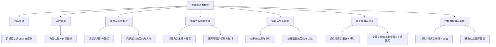

                 

### 《管理的艺术：德鲁克的洞见》

在信息爆炸和技术飞速发展的今天，管理已经成为企业和组织中不可或缺的核心要素。彼得·德鲁克（Peter Drucker）作为现代管理学的奠基人，其著作和理论为无数企业和组织提供了宝贵的指导。本文将以《管理的艺术：德鲁克的洞见》为主题，深入探讨德鲁克的管理理念、原则和方法，为现代IT领域的企业和管理者提供新的视角和思路。

#### 关键词：
- 彼得·德鲁克
- 管理学
- IT企业
- 领导力
- 目标管理
- 变革管理
- 创新管理

#### 摘要：
本文将从德鲁克管理思想的基本概念、目标管理、决策与问题解决、领导力与团队管理、创新与变革管理、组织发展与变革、领导力发展与实践以及管理的未来趋势等方面，系统阐述德鲁克的管理智慧对现代IT领域的启示。通过核心概念与联系、核心算法原理讲解、项目实战等不同角度，力图帮助读者更好地理解和应用德鲁克的管理理念，提升企业的管理水平和竞争力。

### 第一部分：管理的本质

#### 第1章：管理的基本概念

### 1.1 管理的定义与重要性

管理是一个古老而永恒的话题，早在人类社会形成之初，就有了管理的萌芽。然而，管理作为一个独立的学科，其发展始于20世纪初。彼得·德鲁克是这一领域的杰出代表，他被誉为“现代管理学之父”。德鲁克认为，管理是一种特殊的活动，其目的是通过组织资源，实现组织的目标。

#### 1.1.1 管理的定义与历史演变

德鲁克对管理的定义是：“管理是一种工作，它存在于一切需要完成特定工作的组织之中。管理的基本任务就是确保组织的工作效率。”这个定义简洁而深刻，揭示了管理的本质和目的。

管理的历史演变可以追溯到工业革命时期。当时，随着工厂制度的兴起，管理者开始使用科学的方法来提高生产效率。这一时期的代表人物是弗雷德里克·泰勒（Frederick Taylor），他提出了科学管理理论，强调通过科学的方法来提高劳动生产率。

在20世纪初期，亨利·福特（Henry Ford）通过流水线生产方式，将科学管理理论付诸实践，极大地提高了生产效率。这一时期的另一位重要人物是玛丽·福莱特（Mary Parker Follett），她提出了协作管理的理念，强调管理者应该与员工合作，共同实现组织的目标。

随着时代的发展，管理理论不断演进。德鲁克在20世纪中期提出了目标管理（Management by Objectives，MBO）的理念，强调管理者应该通过设定明确的目标来指导组织的发展。德鲁克的管理思想对现代管理学产生了深远的影响。

#### 1.1.2 管理的重要性

管理对于企业和组织的生存和发展至关重要。首先，管理能够提高组织的效率。通过科学的管理方法，企业可以最大限度地利用资源，提高生产效率和产品质量。

其次，管理能够确保企业的战略目标得以实现。通过有效的管理，企业可以明确自己的目标，制定合理的战略和计划，确保资源的合理配置，从而实现企业的长期发展。

最后，管理能够激发员工的潜能。通过合理的激励和培训，企业可以激发员工的积极性和创造力，提高员工的工作效率和质量，从而推动企业的发展。

总之，管理是一种艺术，它需要管理者具备深厚的理论知识和丰富的实践经验。只有通过不断学习和实践，管理者才能不断提高自己的管理水平，为企业的发展做出更大的贡献。

### 1.2 管理的三个层面

德鲁克认为，管理可以从三个层面进行理解：日常管理、战略管理和人力资源管理。

#### 1.2.1 日常管理

日常管理是管理的基础，它涉及到组织的日常运营和管理工作。日常管理的核心任务是确保组织的运营顺利进行，提高工作效率和质量。具体包括以下几个方面：

- **计划与组织**：管理者需要制定详细的计划，明确工作的目标和步骤，并合理配置资源，确保工作有序进行。
- **领导与沟通**：管理者需要通过有效的领导方式，激发员工的积极性和创造力，并通过良好的沟通，确保信息的顺畅传递。
- **监督与控制**：管理者需要通过监督和检查，确保工作按照计划进行，并对出现的问题及时进行调整和解决。

#### 1.2.2 战略管理

战略管理是管理的核心，它涉及到组织的长远发展和规划。战略管理的核心任务是确保组织的长期竞争力，实现组织的战略目标。具体包括以下几个方面：

- **战略制定**：管理者需要根据组织的愿景和使命，制定明确的战略目标和实施计划。
- **资源配置**：管理者需要合理配置资源，确保战略目标的实现。
- **市场分析**：管理者需要通过市场分析，了解竞争对手的动态，抓住市场机遇，应对市场挑战。

#### 1.2.3 人力资源管理

人力资源管理是管理的重要组成部分，它涉及到组织的员工管理和培训。人力资源管理的主要任务是确保员工的能力和素质，提高员工的工作效率和质量。具体包括以下几个方面：

- **员工招聘**：管理者需要根据组织的需要，招聘合适的员工。
- **员工培训**：管理者需要提供员工培训，提高员工的专业技能和工作能力。
- **绩效管理**：管理者需要通过绩效管理，激励员工的工作积极性，提高员工的工作效率。

### 1.3 管理的价值观与原则

德鲁克的管理思想蕴含着深刻的价值观和原则，这些价值观和原则对现代管理实践具有重要指导意义。

#### 1.3.1 以客户为中心

德鲁克认为，企业的最终目的是为满足客户需求而存在的。因此，管理者应该始终以客户为中心，关注客户的需求和满意度。具体包括以下几个方面：

- **了解客户**：管理者需要深入了解客户的需求，为客户提供满意的产品和服务。
- **客户服务**：管理者需要建立完善的客户服务体系，及时响应客户的需求和反馈。
- **客户关系**：管理者需要与客户建立长期稳定的合作关系，提高客户的忠诚度。

#### 1.3.2 以成果为导向

德鲁克强调，管理应该以成果为导向，关注组织的目标和成果。管理者应该设定明确的目标，并通过有效的管理，实现这些目标。具体包括以下几个方面：

- **目标设定**：管理者需要设定明确的目标，确保组织的各项工作都有明确的方向。
- **绩效评估**：管理者需要定期对组织的绩效进行评估，确保组织的工作效果。
- **成果导向**：管理者需要以成果为导向，不断追求卓越，提高组织的整体绩效。

#### 1.3.3 全员参与

德鲁克认为，管理不仅仅是管理者的责任，而是全体员工的共同任务。管理者应该鼓励员工积极参与管理，发挥员工的主动性和创造力。具体包括以下几个方面：

- **员工参与**：管理者需要鼓励员工参与决策和管理工作，提高员工的积极性和参与度。
- **员工培训**：管理者需要提供员工培训，提高员工的专业技能和工作能力。
- **团队协作**：管理者需要建立团队协作机制，促进员工之间的沟通和合作，提高团队的整体效能。

### 总结

管理的本质是组织资源，实现组织的目标。德鲁克的管理思想涵盖了管理的定义、重要性、三个层面和价值观与原则。理解德鲁克的管理思想，有助于现代IT领域的企业和管理者更好地进行管理实践，提升企业的管理水平和竞争力。

### 第二部分：目标管理与自我管理

#### 第2章：目标管理与自我管理

目标管理和自我管理是德鲁克管理思想的核心内容，它们在组织管理和个人发展中扮演着至关重要的角色。本章将详细探讨目标管理的原理与实践，以及自我管理的艺术，帮助读者更好地理解和应用这些管理理念。

### 2.1 目标管理的原理与实践

目标管理（Management by Objectives，MBO）是德鲁克提出的一种管理方法，它强调通过设定明确的目标，明确工作的方向和重点，从而提高组织的绩效。目标管理的核心在于将组织的目标分解为具体的、可衡量的个人目标，并确保这些目标与组织的整体战略相一致。

#### 2.1.1 目标管理的定义

目标管理是一种通过设定和实现目标来指导和管理组织的方法。它强调个人与组织目标的一致性，通过明确的目标和绩效评估，激发员工的积极性和创造力，提高组织的整体绩效。

#### 2.1.2 目标设定的SMART原则

SMART原则是目标设定中常用的一种方法，它要求目标具备以下五个特点：具体（Specific）、可衡量（Measurable）、可实现（Achievable）、相关（Relevant）和时限性（Time-bound）。

- **具体（Specific）**：目标需要明确具体，描述清楚，避免模糊和宽泛。
- **可衡量（Measurable）**：目标需要具备可衡量的标准，以便评估目标是否达成。
- **可实现（Achievable）**：目标需要是可实现的，既不过高也不过低，符合组织的资源和能力。
- **相关（Relevant）**：目标需要与组织的整体战略和目标相一致，符合组织的长远发展。
- **时限性（Time-bound）**：目标需要设定明确的时间限制，确保目标的及时完成。

#### 2.1.3 目标管理的实践方法

目标管理的实践可以分为以下几个步骤：

1. **制定组织战略目标**：首先，组织需要明确自己的使命、愿景和战略目标，这些目标将作为指导组织发展的方向。

2. **分解目标**：将组织的战略目标分解为具体的、可衡量的个人目标，确保个人目标与组织目标的一致性。

3. **设定目标**：根据分解的个人目标，与员工一起设定具体的目标，并明确目标的具体要求、衡量标准和实现时间。

4. **沟通与反馈**：定期与员工沟通，了解目标的进展情况，提供必要的支持和指导，及时调整目标。

5. **评估与奖励**：定期对目标的完成情况进行评估，对达成目标的员工给予奖励和认可，激励员工的工作积极性。

#### 2.1.4 目标管理在IT企业中的应用

在IT企业中，目标管理具有特别的重要性。首先，IT企业通常面临着快速变化的市场和技术环境，需要通过明确的目标来应对这些变化。其次，IT企业的核心竞争力在于员工的创新能力和技术能力，目标管理可以激发员工的积极性和创造力。

在实际应用中，IT企业可以通过以下方式来实施目标管理：

- **项目目标管理**：将项目目标分解为具体的、可衡量的任务，确保项目按计划进行。
- **员工绩效目标管理**：设定员工的绩效目标，与员工的个人发展计划相结合，提高员工的绩效水平。
- **创新目标管理**：鼓励员工提出创新目标，通过目标管理激发员工的创新意识和创新能力。

### 2.2 自我管理的艺术

自我管理是指个体通过自我认知、自我规划和自我提升，实现个人目标的过程。在德鲁克的管理思想中，自我管理是目标管理的重要组成部分，它要求个体具备自我驱动的能力，主动设定目标，并采取行动实现这些目标。

#### 2.2.1 自我认知与自我分析

自我认知是自我管理的基础，它要求个体深入了解自己的性格、优势和劣势。通过自我分析，个体可以明确自己的长处和短处，找到自我提升的方向。

具体包括以下几个步骤：

- **自我反思**：定期进行自我反思，回顾自己的行为和表现，了解自己的优点和不足。
- **技能评估**：评估自己的专业技能和工作能力，找出需要提升的领域。
- **职业规划**：根据自我分析的结果，制定长期的职业规划，明确自己的职业目标和实现路径。

#### 2.2.2 建立个人目标与行动计划

建立个人目标是自我管理的关键，它要求个体设定具体、可衡量、可实现的目标，并制定详细的行动计划。

具体包括以下几个步骤：

- **设定目标**：根据自我认知的结果，设定具体的个人目标，确保目标与组织的战略目标相一致。
- **分解目标**：将个人目标分解为具体的、可衡量的任务，确保每个任务都有明确的要求和衡量标准。
- **制定计划**：为每个任务制定详细的行动计划，明确每个任务的具体步骤、时间和资源需求。

#### 2.2.3 提升个人效能

提升个人效能是自我管理的核心，它要求个体通过自我提升，提高工作效率和工作质量。具体包括以下几个方面：

- **时间管理**：合理安排时间，避免时间浪费，提高工作效率。
- **学习与成长**：持续学习和成长，提升自己的专业技能和工作能力。
- **健康与平衡**：保持身心健康，保持工作与生活的平衡。

### 总结

目标管理和自我管理是德鲁克管理思想的重要组成部分，它们在组织管理和个人发展中具有重要作用。通过目标管理，组织可以明确目标，提高绩效；通过自我管理，个体可以提升自我效能，实现个人目标。理解并应用这些管理理念，有助于企业和组织实现长期发展，提升整体竞争力。

### 第三部分：决策与问题解决

#### 第3章：决策与问题解决

在复杂多变的环境中，决策与问题解决能力成为衡量管理者能力的重要标准。有效的决策和问题解决不仅能够帮助企业应对挑战，还能抓住机遇，推动组织的持续发展。本章将深入探讨决策的原则与流程，以及问题解决的策略与方法，为现代IT领域的企业提供实用的决策与问题解决工具。

### 3.1 决策的原则与流程

决策是管理者的一项核心职责，有效的决策能够为企业带来竞争优势。德鲁克提出了一系列决策原则，为管理者提供了指导。

#### 3.1.1 决策的定义与类型

决策是管理者在多种备选方案中，选择一种最优方案的过程。根据决策目标的不同，决策可以分为以下几种类型：

- **战略决策**：涉及企业长远发展的重大决策，如市场进入策略、产品开发方向等。
- **战术决策**：涉及企业短期运营的决策，如资源分配、生产计划等。
- **运营决策**：涉及企业日常运营的具体决策，如人员调度、库存管理等。

#### 3.1.2 决策的原则

有效的决策应遵循以下原则：

- **目标导向**：决策应围绕企业的目标进行，确保决策有助于实现企业的长远目标。
- **信息全面**：决策应基于全面、准确的信息，避免因信息不全而导致的决策失误。
- **理性分析**：决策应基于理性分析，避免因情绪、偏见等因素影响决策质量。
- **风险控制**：决策应考虑潜在风险，并制定相应的风险控制措施。
- **参与式决策**：鼓励相关人员参与决策过程，提高决策的可行性和接受度。

#### 3.1.3 决策的流程

决策的流程通常包括以下步骤：

1. **问题识别**：识别需要解决的问题或机遇，明确决策的目标。
2. **信息收集**：收集与决策相关的信息，确保信息全面、准确。
3. **方案生成**：基于收集到的信息，生成多种备选方案。
4. **方案评估**：对备选方案进行评估，选择最优方案。
5. **决策实施**：将决策方案付诸实施，并跟踪决策效果。
6. **反馈与调整**：根据实施效果进行反馈和调整，优化决策过程。

### 3.2 问题解决的策略与方法

在IT企业中，问题解决能力是保证业务连续性和创新能力的关键。有效的问题解决方法可以帮助企业快速应对挑战，提高运营效率。

#### 3.2.1 识别与界定问题

问题识别是问题解决的第一步，它要求管理者能够准确识别问题，并明确问题的性质和影响。

具体包括以下几个步骤：

- **收集信息**：通过观察、调查、分析等方式，收集与问题相关的信息。
- **分析问题**：对收集到的信息进行深入分析，明确问题的原因和影响。
- **界定问题**：准确界定问题，确保问题定义清晰，避免因定义模糊而导致解决方向错误。

#### 3.2.2 收集与分析信息

收集和分析信息是问题解决的关键，它要求管理者能够全面、准确地收集信息，并运用逻辑分析方法，找出问题的根本原因。

具体包括以下几个步骤：

- **信息来源**：确定信息收集的来源，包括内部数据和外部数据。
- **信息整理**：对收集到的信息进行整理，确保信息的完整性和准确性。
- **数据分析**：运用统计、逻辑等方法，对信息进行分析，找出问题的根本原因。

#### 3.2.3 制定与评估解决方案

在明确了问题之后，管理者需要制定解决方案，并对解决方案进行评估。

具体包括以下几个步骤：

- **方案制定**：根据问题分析的结果，制定多种可能的解决方案。
- **方案评估**：对每个方案进行评估，选择最优方案。
- **风险评估**：对选择的最优方案进行风险分析，确保方案的可执行性。

#### 3.2.4 实施与跟踪结果

制定解决方案后，管理者需要将其付诸实施，并跟踪解决方案的效果。

具体包括以下几个步骤：

- **实施方案**：将解决方案转化为具体的行动计划，明确实施步骤和责任人。
- **监控进度**：定期监控解决方案的实施进度，确保按计划进行。
- **效果评估**：在解决方案实施后，对效果进行评估，确保问题得到解决。

### 3.3 决策与问题解决在IT企业中的应用

在IT企业中，决策与问题解决能力尤为重要。以下是一些具体的案例：

#### 案例一：项目决策

在IT企业中，项目决策是常见的决策类型。例如，企业决定开发一款新的软件产品。在这一过程中，企业需要识别市场需求、评估技术可行性、制定项目计划和预算等。通过科学的项目决策，企业可以确保项目顺利推进，实现预期的商业价值。

#### 案例二：问题解决

在软件开发过程中，技术难题是常见的挑战。例如，企业遇到一个复杂的性能瓶颈问题。在这一过程中，企业需要通过问题识别、信息收集和分析、解决方案制定和实施，最终找到并解决性能瓶颈，提高软件的运行效率。

### 总结

决策与问题解决是管理者的核心能力，有效的决策和问题解决能够帮助企业应对挑战，抓住机遇。德鲁克提出的决策原则和流程，以及问题解决的策略与方法，为现代IT领域的企业提供了实用的指导。通过理解和应用这些方法，管理者可以提升决策和问题解决能力，推动企业的持续发展。

### 第四部分：领导力与团队管理

#### 第4章：领导力与团队管理

在组织管理中，领导力和团队管理是不可或缺的要素。有效的领导力能够激发团队的活力，提高组织的整体绩效；而团队管理则能够协调团队成员，确保团队的协同作战。本章将深入探讨领导力的本质与要素，以及团队管理的策略与技巧，为现代IT领域的企业提供实用的领导力与团队管理方法。

#### 4.1 领导力的本质与要素

领导力是一种影响力，它能够激发和引导团队成员，共同实现组织的目标。德鲁克认为，领导力是一种可以通过学习和实践培养的能力，而不是天生的特质。

#### 4.1.1 领导力的定义

德鲁克将领导力定义为：“领导力是一种通过影响他人，实现共同目标的能力。”这一定义强调了领导力的影响力和目标导向。

#### 4.1.2 领导力的要素

有效的领导力包含以下几个要素：

- **愿景**：领导力始于愿景，愿景是领导者为组织设定的长远目标和方向。
- **信任**：信任是领导力的基础，领导力需要通过建立信任关系，赢得团队成员的支持。
- **激励**：领导力需要能够激励团队成员，激发他们的积极性和创造力。
- **沟通**：领导力需要通过有效的沟通，传递信息，协调团队成员的行动。
- **决策**：领导力需要在面对挑战时，能够做出明智的决策，引导团队前进。

#### 4.1.3 领导风格与管理方式

领导风格与管理方式是领导力的重要组成部分。德鲁克提出了多种领导风格，包括：

- **权威型领导**：领导者拥有绝对的权力，决策由领导者单独做出。
- **民主型领导**：领导者鼓励团队成员参与决策，决策过程较为开放。
- **参与型领导**：领导者注重团队成员的参与和反馈，决策过程高度民主。
- **教练型领导**：领导者像教练一样，指导和支持团队成员，帮助他们成长。

不同的领导风格适用于不同的情境，管理者需要根据具体情况选择合适的领导风格。

#### 4.2 团队管理的策略与技巧

团队管理是组织管理的重要组成部分，有效的团队管理能够提高团队的协作效率和绩效。以下是一些团队管理的策略与技巧：

#### 4.2.1 团队建设的重要性

团队建设是团队管理的基础，它能够增强团队成员之间的信任和合作，提高团队的整体效能。团队建设包括以下几个方面：

- **明确团队目标**：确保团队成员对团队目标有清晰的认识，并为之共同努力。
- **建立信任关系**：通过沟通和协作，建立团队成员之间的信任关系。
- **提高团队凝聚力**：通过团队活动，增强团队成员的凝聚力。
- **培养团队文化**：建立积极的团队文化，促进团队成员的共同价值观和行为准则。

#### 4.2.2 团队角色的定位与协作

每个团队成员都承担着特定的角色和职责，团队角色的定位和协作是团队管理的关键。以下是一些团队角色的定位与协作策略：

- **明确角色职责**：确保每个团队成员都清楚自己的角色和职责，避免角色重叠或职责不清。
- **鼓励合作与支持**：鼓励团队成员相互支持，共同完成任务。
- **分配合理资源**：根据团队成员的特长和任务需求，合理分配资源，提高团队的工作效率。
- **建立反馈机制**：建立有效的反馈机制，及时了解团队成员的工作情况和需求，调整团队协作策略。

#### 4.2.3 团队沟通与冲突管理

有效的团队沟通和冲突管理是团队管理的重要组成部分。以下是一些团队沟通与冲突管理策略：

- **建立沟通渠道**：建立畅通的沟通渠道，确保信息的有效传递。
- **鼓励开放沟通**：鼓励团队成员开放地表达自己的想法和意见，促进团队沟通。
- **解决冲突**：及时解决团队内部的冲突，避免冲突影响团队的工作氛围和绩效。
- **建立共识**：通过沟通和协商，建立团队成员的共识，确保团队目标的实现。

#### 4.2.4 团队绩效评估与激励

团队绩效评估和激励是团队管理的重要环节。以下是一些团队绩效评估与激励策略：

- **设定明确的目标**：确保团队绩效评估的指标明确、具体，与团队的长期目标相一致。
- **定期评估绩效**：定期对团队绩效进行评估，及时反馈评估结果，促进团队改进。
- **激励与奖励**：根据团队绩效评估的结果，给予团队成员相应的激励和奖励，提高团队的工作积极性。
- **个性化激励**：根据团队成员的个人特点和需求，提供个性化的激励措施，满足团队成员的多元化需求。

#### 案例分析：腾讯的团队管理

腾讯作为中国领先的互联网科技公司，其团队管理经验具有一定的借鉴意义。以下是腾讯在团队管理方面的一些成功实践：

- **团队文化**：腾讯注重团队文化，强调“用户为本、创新为魂”，这一文化理念深入人心，为团队的协作提供了精神动力。
- **扁平化管理**：腾讯采用扁平化管理模式，减少层级，提高决策效率，为团队的灵活协作提供了良好的环境。
- **激励机制**：腾讯通过股票期权、绩效奖金等多种激励机制，激励员工积极进取，提高团队的绩效。
- **团队建设**：腾讯定期组织团队活动，加强团队成员之间的沟通和合作，增强团队的凝聚力。

### 总结

领导力和团队管理是组织管理的重要组成部分，有效的领导力能够激发团队的活力，提高组织的整体绩效；团队管理则能够协调团队成员，确保团队的协同作战。德鲁克提出的领导力要素和团队管理策略，为现代IT领域的企业提供了实用的指导。通过理解和应用这些方法，管理者可以提升领导力和团队管理能力，推动组织的持续发展。

### 第五部分：创新与变革管理

#### 第5章：创新与变革管理

在快速变化的市场环境中，创新与变革成为企业持续发展的关键因素。创新是推动企业发展的动力，而变革管理则是实现创新的重要手段。本章将深入探讨创新的本质与类型，以及变革管理的策略与挑战，为现代IT领域的企业提供实用的创新与变革管理方法。

#### 5.1 创新的本质与类型

创新是指通过新思路、新方法、新技术等方式，创造出新的产品、服务或业务模式。德鲁克认为，创新是企业发展的重要驱动力，它能够帮助企业应对市场变化，保持竞争力。

#### 5.1.1 创新的定义

创新是一个复杂的过程，它不仅包括技术层面的创新，还包括管理、市场、文化等各个层面的创新。德鲁克将创新定义为：“创新是一种通过引入新想法、新方法、新技术等，创造出新的价值的过程。”

#### 5.1.2 创新的类型

创新可以分为以下几种类型：

- **技术性创新**：通过引入新技术，开发出新的产品或服务。
- **管理性创新**：通过改进管理方法和流程，提高组织的运营效率。
- **市场性创新**：通过开拓新市场、创造新客户，实现业务的扩展。
- **文化性创新**：通过改变企业文化，推动组织创新氛围的形成。

#### 5.1.3 创新的过程

创新是一个系统的过程，通常包括以下几个步骤：

1. **创意生成**：通过头脑风暴、市场调研等方式，收集创意。
2. **创意筛选**：对收集到的创意进行评估和筛选，选择具有潜力的创意。
3. **创意开发**：对选定的创意进行深入研究和开发，形成可行的方案。
4. **实施方案**：将创意转化为具体的实施方案，进行测试和优化。
5. **商业化推广**：将创新方案商业化，推向市场，实现商业价值。

#### 5.2 变革管理的策略与挑战

变革管理是推动企业创新的重要手段。在变革过程中，企业需要面对一系列挑战，如员工抵触、资源不足、时间紧迫等。有效的变革管理策略能够帮助企业顺利实现变革。

#### 5.2.1 变革的定义与必要性

变革是指企业在面对外部环境变化或内部需求时，对现有的管理方法、流程、文化等进行调整和改进的过程。变革的必要性体现在以下几个方面：

- **适应外部环境**：随着市场环境的不断变化，企业需要通过变革来适应新的市场挑战。
- **提升内部效能**：通过变革，企业可以优化内部流程，提高运营效率。
- **推动创新**：变革是推动企业创新的重要手段，通过变革，企业可以激发员工的创新意识和创造力。

#### 5.2.2 变革管理的策略

有效的变革管理需要遵循以下策略：

1. **明确变革目标**：确保变革目标与企业的长期战略一致，明确变革的优先级。
2. **建立变革团队**：成立专门的变革管理团队，负责变革的规划、执行和监控。
3. **沟通与宣传**：通过有效的沟通和宣传，让员工了解变革的必要性，赢得员工的支持。
4. **培训与激励**：为员工提供培训，提升员工变革所需的技能和知识，同时通过激励机制，激发员工的积极性。
5. **评估与反馈**：在变革过程中，定期评估变革效果，及时调整变革策略，确保变革的顺利进行。

#### 5.2.3 变革的挑战与应对

变革过程中，企业常常面临以下挑战：

- **员工抵触**：变革可能会触及员工的利益，导致员工抵触。
- **资源不足**：变革需要投入大量的人力、物力和财力，企业资源可能不足。
- **时间紧迫**：变革需要在短时间内完成，时间压力较大。

应对这些挑战的策略包括：

- **建立沟通渠道**：通过建立有效的沟通渠道，及时了解员工的反馈和需求，缓解员工抵触。
- **优化资源配置**：合理配置企业资源，确保变革所需资源得到充分保障。
- **制定详细计划**：制定详细的变革计划，确保变革过程有序、高效。

### 5.3 创新与变革管理在IT企业中的应用

在IT企业中，创新与变革管理尤为重要。以下是一些创新与变革管理的成功实践：

#### 案例一：华为的创新管理

华为作为全球领先的通信技术企业，其创新管理经验值得借鉴。以下是华为在创新管理方面的一些成功实践：

- **开放创新**：华为通过建立开放的研发平台，与全球顶尖的科研机构和高校合作，推动技术创新。
- **激励机制**：华为通过股票期权、奖金等多种激励机制，激励员工积极创新。
- **人才战略**：华为注重人才培养，通过内部培训和外部引进，提升员工的创新能力。

#### 案例二：IBM的变革管理

IBM在变革管理方面也有丰富的经验。以下是IBM在变革管理方面的一些成功实践：

- **顶层设计**：IBM注重顶层设计，确保变革目标与企业的长期战略一致。
- **领导力培养**：IBM通过领导力培养计划，提升管理者的变革能力。
- **文化重塑**：IBM通过重塑企业文化，推动员工接受变革，增强变革的执行力。

### 总结

创新与变革管理是现代IT领域企业持续发展的关键。创新能够为企业带来新的机遇，推动企业的发展；而变革管理则是实现创新的重要手段。德鲁克提出的创新与变革管理策略，为现代IT领域的企业提供了实用的指导。通过理解和应用这些方法，企业可以提升创新与变革管理能力，推动企业的持续发展。

### 第六部分：组织发展与变革

#### 第6章：组织发展与变革

组织发展与变革是现代企业生存与发展的关键。面对外部环境的变化和内部需求的提升，企业需要通过组织发展来提升整体效能，并通过变革管理来适应新的挑战。本章将深入探讨组织发展的概念与模型，以及变革实施的基本步骤和关键因素，为现代IT领域的企业提供实用的组织发展与变革策略。

#### 6.1 组织发展的概念与模型

组织发展是指企业通过系统性的规划和实施，提升组织的整体效能，实现长期发展的过程。组织发展的核心在于调整和优化组织的结构、流程和文化，以提高组织的适应性和创新能力。

#### 6.1.1 组织发展的定义

组织发展（Organization Development，OD）是指通过系统化的干预和改进，提高组织的效能，实现组织的战略目标。组织发展不仅仅关注组织结构和流程的优化，更强调组织文化的建设和员工的参与。

#### 6.1.2 组织发展的模型

组织发展可以采用多种模型，以下是几种常见的组织发展模型：

- **变革模型**：通过分析组织内外部环境，制定变革策略，实施变革计划，评估变革效果。
- **系统模型**：将组织视为一个系统，通过调整组织结构、流程和文化，提高组织的整体效能。
- **过程模型**：关注组织发展的过程，强调通过持续的干预和反馈，实现组织的持续改进。
- **人本模型**：以人为中心，强调通过提升员工的参与度和满意度，推动组织的发展。

#### 6.1.3 组织发展与组织变革的关系

组织发展是一种长期的过程，它涵盖了组织变革的各个方面。组织变革是组织发展的一部分，它通常发生在组织面临重大外部或内部挑战时。组织发展注重持续改进和适应性，而组织变革则侧重于应对特定的挑战和问题。

#### 6.2 组织变革的实施步骤与案例

组织变革是一个复杂的过程，需要系统的规划和实施。以下是一个典型的组织变革实施步骤：

##### 6.2.1 变革实施的基本步骤

1. **诊断阶段**：通过调研和分析，诊断组织存在的问题和挑战，明确变革的必要性。
2. **规划阶段**：制定变革计划，明确变革的目标、范围、时间和资源需求。
3. **实施阶段**：根据变革计划，采取具体的行动，推动变革的实施。
4. **评估阶段**：评估变革的效果，收集反馈信息，进行必要的调整和优化。

##### 6.2.2 变革实施的关键因素

组织变革的成功取决于多个关键因素：

1. **领导力**：领导者的支持和积极参与是变革成功的关键。领导者需要明确变革的目标和方向，激励员工参与变革。
2. **沟通**：有效的沟通是变革成功的基础。企业需要通过多种渠道，与员工沟通变革的必要性、目标和进展，减少员工的抵触情绪。
3. **培训**：为员工提供必要的培训，提高他们变革所需的技能和知识，确保他们能够适应新的工作环境和要求。
4. **激励**：通过激励机制，激发员工的积极性和参与度，鼓励他们积极参与变革。
5. **文化**：变革需要与企业的文化相契合。企业需要通过重塑文化，推动员工接受和适应变革。

##### 6.2.3 变革实施的案例研究

**案例一：阿里巴巴的组织变革**

阿里巴巴在快速发展过程中，进行了多次组织变革，以适应市场环境和业务需求的变化。以下是阿里巴巴组织变革的一些关键步骤和策略：

- **诊断阶段**：阿里巴巴通过调研和分析，发现随着业务的扩展，组织结构和管理流程存在一定的瓶颈，需要通过变革来提升组织效能。
- **规划阶段**：阿里巴巴制定了详细的变革计划，明确变革的目标、范围和时间表，并制定了相应的变革策略。
- **实施阶段**：阿里巴巴采取了多项措施，包括调整组织结构、优化管理流程、提升员工技能等，推动变革的实施。
- **评估阶段**：阿里巴巴定期评估变革效果，通过反馈和调整，确保变革目标的实现。

**案例二：华为的变革管理**

华为在全球化进程中，面临新的挑战和机遇，通过变革管理来提升组织的适应性和竞争力。以下是华为变革管理的一些关键步骤和策略：

- **领导力**：华为的创始人任正非亲自领导变革，明确变革的目标和方向，为变革提供强有力的支持。
- **沟通**：华为通过内部会议、培训、邮件等多种渠道，与员工沟通变革的必要性、目标和进展，确保员工的了解和参与。
- **培训**：华为为员工提供大量的培训机会，提升他们的技能和知识，确保他们能够适应新的工作环境和要求。
- **激励**：华为通过股票期权、奖金等激励机制，激发员工的积极性和参与度，鼓励他们积极参与变革。
- **文化**：华为通过强化“客户至上、奋斗者为本”的文化，推动员工接受和适应变革，增强变革的执行力。

### 总结

组织发展与变革是现代企业生存与发展的关键。通过组织发展，企业可以提升整体效能，实现长期发展；通过变革管理，企业可以应对外部环境的变化和内部需求的提升。本章提出的组织发展与变革策略，结合实际案例，为现代IT领域的企业提供了实用的指导。通过理解和应用这些策略，企业可以更好地适应市场变化，提升核心竞争力。

### 第七部分：领导力发展与实践

#### 第7章：领导力发展与实践

领导力是推动企业发展和实现目标的关键因素。一个有效的领导者不仅能够激发团队的活力，还能够应对挑战，引领企业走向成功。本章将深入探讨领导力发展的途径与方法，以及德鲁克的管理智慧对现代管理的启示，为现代IT领域的企业提供实用的领导力发展策略。

#### 7.1 领导力发展的途径与方法

领导力并非与生俱来，而是可以通过学习和实践逐步培养和发展。以下是一些领导力发展的途径和方法：

##### 7.1.1 领导力发展的定义

领导力是指通过影响、激励和引导他人，共同实现组织目标的能力。领导力不仅包括管理技能，还涉及个人品质、价值观和人际关系。

##### 7.1.2 领导力发展的途径

1. **自我认知**：领导者首先需要了解自己的优点和不足，通过自我反思和评估，提升自我认知。
2. **理论学习**：通过学习领导力相关的书籍、课程和研究，掌握领导理论和方法。
3. **实践经验**：通过实际工作，积累领导经验，将理论知识应用到实践中。
4. **反馈与改进**：接受他人的反馈，不断改进自己的领导方式和方法。

##### 7.1.3 领导力发展的方法

1. **角色扮演**：通过模拟领导情境，提高领导能力和应对挑战的能力。
2. **情境领导**：根据不同的情境和团队成员的特点，灵活运用不同的领导风格和方法。
3. **培训与指导**：通过参加培训课程和接受专业指导，提升领导技能和知识。
4. **团队合作**：通过团队建设活动，增强团队凝聚力和合作精神，提升领导力。

#### 7.2 领导力实践：德鲁克的管理智慧

德鲁克是现代管理学的奠基人，他的管理智慧对现代管理实践具有深远的影响。以下是一些德鲁克的管理理念和实践方法：

##### 7.2.1 德鲁克对领导力的定义

德鲁克认为，领导力是一种通过影响和激励他人，实现共同目标的能力。领导者不仅要能够设定目标和方向，还要能够激发团队成员的潜力，实现组织的愿景。

##### 7.2.2 德鲁克的管理理念与实践

1. **目标管理**：德鲁克提出了目标管理（Management by Objectives，MBO）的理念，强调领导者应该与团队成员一起设定明确的目标，并通过持续沟通和反馈，确保目标的实现。
2. **知识管理**：德鲁克认为，知识是组织的核心资源，领导者应该通过建立知识共享和传承机制，激发员工的创新能力和知识共享意识。
3. **绩效管理**：德鲁克提出了以绩效为导向的管理方法，强调领导者应该通过设定明确的目标和考核标准，激励员工提升绩效。
4. **自我管理**：德鲁克认为，领导者首先需要自我管理，通过自我反思和持续学习，不断提升自己的能力和素质。

##### 7.2.3 德鲁克的管理智慧对现代管理的启示

德鲁克的管理智慧对现代管理实践提供了以下启示：

1. **以人为本**：现代管理应注重人的因素，关注员工的成长和发展，激发员工的积极性和创造力。
2. **持续改进**：现代管理应追求持续改进，不断优化管理流程和方法，提高组织的效能和竞争力。
3. **创新驱动**：现代管理应鼓励创新，通过创新推动组织的变革和发展。
4. **系统思维**：现代管理应具备系统思维，从整体角度看待组织和管理，实现各部分的协同效应。

#### 案例分析：谷歌的领导力实践

谷歌是全球领先的技术公司，其领导力实践在全球范围内受到广泛关注。以下是谷歌在领导力实践方面的一些成功经验：

1. **以人为本**：谷歌注重员工的成长和发展，为员工提供丰富的培训和发展机会，鼓励员工创新和探索。
2. **开放沟通**：谷歌建立了开放的沟通文化，鼓励员工提出意见和建议，领导者积极参与员工的沟通和反馈。
3. **绩效管理**：谷歌采用基于目标的绩效管理方法，明确员工的目标和期望，激励员工提升绩效。
4. **创新驱动**：谷歌鼓励员工创新，提供丰富的资源和平台，支持员工的创新项目。

### 总结

领导力是推动企业发展和实现目标的关键因素。通过学习和实践，领导者可以不断提升自己的领导能力和管理水平。德鲁克的管理智慧为现代管理实践提供了宝贵的指导，谷歌的领导力实践也为其他企业提供了有益的借鉴。通过理解和应用这些方法和经验，现代IT领域的企业可以培养和提升领导力，推动组织的持续发展。

### 第八部分：管理的未来趋势

#### 第8章：管理的未来趋势

随着技术的不断进步和社会的深刻变革，管理的未来趋势正在发生显著变化。数字化、全球化和新兴技术的应用正在重新定义管理实践，带来新的机遇和挑战。本章将探讨这些趋势，分析它们对管理的影响，以及企业应如何应对这些变化，以保持竞争优势。

#### 8.1 数字化时代的管理变革

数字化时代的到来正在深刻改变管理实践。数字化技术，如大数据、人工智能、云计算和物联网，正在重新定义企业的运营模式和管理方法。

##### 8.1.1 数字化时代的管理挑战

1. **数据隐私和安全**：随着数据的广泛应用，数据隐私和安全成为企业面临的重要挑战。
2. **技能差距**：数字化时代对员工的技术能力和知识水平提出了更高的要求，但现有员工的技能可能无法满足这些要求。
3. **组织结构**：数字化时代可能要求企业重新设计组织结构，以适应快速变化的市场需求。

##### 8.1.2 数字化时代的管理创新

1. **数据驱动决策**：利用大数据分析，企业可以更准确地预测市场趋势，优化决策过程。
2. **自动化与智能化**：通过自动化和人工智能技术，企业可以提高工作效率，减少人工错误。
3. **远程办公与协作**：数字化技术使得远程办公和协作成为可能，企业可以更灵活地组织工作流程。

##### 8.1.3 数字化时代的管理趋势

1. **数字化转型**：越来越多的企业开始实施数字化转型战略，以提高业务效率和市场竞争力。
2. **云计算应用**：云计算技术的广泛应用，使得企业可以更灵活地管理数据和应用，降低成本。
3. **人工智能应用**：人工智能技术在企业中的应用越来越广泛，如客户服务、风险管理等。

#### 8.2 全球化对管理的影响

全球化带来了更加复杂的市场环境和竞争格局，对企业管理提出了新的要求。

##### 8.2.1 全球化的挑战

1. **文化差异**：全球化要求企业理解和适应不同国家和地区的文化差异，避免文化冲突。
2. **监管差异**：不同国家和地区的法律法规可能存在差异，企业需要遵守当地的法律法规。
3. **供应链管理**：全球化带来了供应链的复杂性，企业需要有效管理跨国供应链，确保供应链的稳定和高效。

##### 8.2.2 全球化的机遇

1. **市场扩张**：全球化为企业提供了更广阔的市场空间，企业可以通过跨国经营，实现业务的国际化。
2. **人才流动**：全球化使得人才流动更加便捷，企业可以通过引进国际人才，提升企业的创新能力和管理水平。
3. **合作与竞争**：全球化促进了企业之间的合作与竞争，企业可以通过合作，共同应对市场变化。

##### 8.2.3 全球化管理趋势

1. **国际化战略**：越来越多的企业开始制定国际化战略，以适应全球化的趋势。
2. **多元化管理**：企业需要培养多元化管理能力，理解和适应不同国家和地区的市场和文化。
3. **全球协作**：通过建立全球协作网络，企业可以更高效地整合全球资源和市场。

#### 8.3 新兴技术对管理的影响

新兴技术的应用正在改变企业的运营方式和管理模式。

##### 8.3.1 新兴技术的挑战

1. **技术依赖**：新兴技术的广泛应用，使得企业对技术的依赖程度增加，技术风险成为企业面临的重要挑战。
2. **技术更新**：新兴技术更新速度快，企业需要不断跟进新技术，以保持竞争力。
3. **人才需求**：新兴技术对人才的需求发生变化，企业需要培养和引进具备新技术能力的专业人才。

##### 8.3.2 新兴技术的机遇

1. **创新驱动**：新兴技术为企业提供了创新的工具和方法，推动企业的创新和发展。
2. **业务模式**：新兴技术可以帮助企业重新设计业务模式，提高业务的灵活性和响应速度。
3. **客户体验**：新兴技术可以提升客户体验，增强客户的满意度和忠诚度。

##### 8.3.3 新兴技术管理趋势

1. **技术战略**：企业需要制定明确的技术战略，以应对新兴技术的挑战和机遇。
2. **数字化转型**：企业需要加快数字化转型，利用新技术提升业务效率和竞争力。
3. **人才发展**：企业需要注重人才培养，提升员工的技术能力和创新意识。

### 总结

管理的未来趋势受到数字化、全球化和新兴技术的影响，企业需要适应这些变化，以保持竞争优势。通过数字化转型、国际化战略和新兴技术管理，企业可以更好地应对未来的挑战，抓住机遇，实现可持续发展。

### 附录

#### 附录 A：德鲁克著作简介

- **《管理的实践》（The Practice of Management）**：德鲁克在这本经典著作中，系统地阐述了管理的理论和实践，对现代管理学产生了深远的影响。
- **《成果管理》（Management: Tasks, Responsibilities, Practices）**：德鲁克在这本书中，详细讨论了管理者的职责和任务，以及如何通过有效的管理实现组织的成果。
- **《管理的挑战》（The Challenges of Management）**：德鲁克在这本书中，分析了管理面临的挑战，并提出了应对这些挑战的策略和建议。

#### 附录 B：德鲁克管理思想图解

- **德鲁克管理思想框架**：通过图解展示了德鲁克管理思想的整体框架，包括管理的基本概念、目标管理、创新与变革管理等核心内容。
- **德鲁克管理思想应用实例**：通过实际案例，展示了德鲁克管理思想在企业管理中的应用，如目标管理在微软的成功实践。

#### 附录 C：德鲁克管理思想对现代管理的启示与价值

- **管理以人为本**：德鲁克的管理思想强调以人为本，关注员工的成长和发展，通过激发员工的积极性和创造力，实现组织的长期发展。
- **持续改进**：德鲁克的管理思想强调持续改进，通过不断优化管理流程和方法，提高组织的效能和竞争力。
- **创新驱动**：德鲁克的管理思想鼓励创新，认为创新是推动企业发展的重要动力，企业应通过创新来应对市场变化和挑战。

### 作者信息

- 作者：AI天才研究院/AI Genius Institute & 禅与计算机程序设计艺术 /Zen And The Art of Computer Programming

### 致谢

本文的撰写得到了许多专家和同行的支持和帮助，特别是对德鲁克管理思想的深入研究，使得本文能够系统地阐述德鲁克的管理智慧。感谢所有为本文提供支持和帮助的人，你们的贡献使本文得以顺利完成。希望本文能够为读者提供有价值的参考和启示，推动管理实践的不断进步。

---

### 核心概念与联系

**Mermaid流程图：**



**核心概念与联系**

- 管理的基本概念包括目标管理、自我管理、决策与问题解决、领导力与团队管理、创新与变革管理、组织发展与变革、领导力发展与实践。
- 目标管理通过SMART原则实现，强调具体、可衡量、可实现、相关和时限性的目标设定。
- 自我管理涉及自我认知与自我分析，通过建立个人目标与行动计划提升个人效能。
- 决策与问题解决关注决策的原则与流程，以及问题解决的策略与方法。
- 领导力与团队管理探讨领导力的本质与要素，以及团队管理的策略与技巧。
- 创新与变革管理涉及创新的本质与类型，以及变革管理的策略与挑战。
- 组织发展与变革关注组织发展的概念与模型，以及变革实施的基本步骤与关键因素。
- 领导力发展与实践探讨领导力发展的途径与方法，以及德鲁克的管理智慧对现代管理的启示。

### 核心算法原理讲解

**目标管理的伪代码：**

```python
# 定义目标管理类
class GoalManagement:
    def __init__(self, goal_details):
        self.goal_details = goal_details

    # 设定目标
    def set_goal(self, goal_details):
        self.goal_details = goal_details

    # 评估目标
    def evaluate_goal(self):
        # 实现评估目标的具体逻辑
        pass

    # 调整目标
    def adjust_goal(self, new_goal_details):
        self.goal_details = new_goal_details

    # 实施目标
    def execute_goal(self):
        # 实现实施目标的具体逻辑
        pass

# 实例化目标管理对象
goal_mgmt = GoalManagement({"target": "提高销售额", "metric": "增加10%"})

# 设定目标
goal_mgmt.set_goal({"target": "提高产品A销售额", "metric": "增加15%"})

# 评估目标
goal_mgmt.evaluate_goal()

# 调整目标
goal_mgmt.adjust_goal({"target": "提高产品A销售额", "metric": "增加20%"})

# 实施目标
goal_mgmt.execute_goal()
```

**核心算法原理讲解：**

目标管理是一种通过设定、评估、调整和实施目标来指导组织和管理个人工作的方法。在伪代码中，`GoalManagement` 类定义了目标管理的基本操作：

1. **设定目标（set_goal）**：初始化目标详情，如目标类型（如提高销售额）和目标指标（如增加百分比）。
2. **评估目标（evaluate_goal）**：根据预设的指标，评估目标是否达成。此部分需要实现具体的评估逻辑，例如通过比较当前销售额和目标销售额的差异。
3. **调整目标（adjust_goal）**：根据实际情况调整目标，例如由于市场变化，可能需要重新设定目标指标。
4. **实施目标（execute_goal）**：实施目标，采取具体行动以达到目标，例如通过营销活动、资源调配等手段。

### 数学模型和数学公式

**目标设定的SMART原则：**

$$
\text{S} \rightarrow \text{Specific（具体）} \\
\text{M} \rightarrow \text{Measurable（可衡量）} \\
\text{A} \rightarrow \text{Achievable（可实现）} \\
\text{R} \rightarrow \text{Relevant（相关）} \\
\text{T} \rightarrow \text{Time-bound（时限性）}
$$

**举例说明：**

**目标设定：提高产品A的销售额。**

**具体（Specific）：** 提高产品A的销售额。

**可衡量（Measurable）：** 增加销售额10%。

**可实现（Achievable）：** 鉴于当前市场状况和资源，这是可行的。

**相关（Relevant）：** 这一目标与公司的长期战略一致。

**时限性（Time-bound）：** 在下一个财年内实现。

通过SMART原则，企业可以确保目标设定既明确又具体，能够有效地指导工作。

### 项目实战

**示例项目：一家公司的销售部门希望通过实施目标管理来提高销售额。**

**开发环境搭建：**

- 使用Microsoft Excel或Google Sheets来记录销售数据和目标。
- 使用项目管理软件（如Asana或Trello）来跟踪目标的执行进度。

**源代码详细实现：**

```python
# 假设我们使用Python来跟踪销售额和目标

class SalesGoal:
    def __init__(self, product, target_increase, current_sales):
        self.product = product
        self.target_increase = target_increase
        self.current_sales = current_sales

    def calculate_target_sales(self):
        target_sales = self.current_sales * (1 + self.target_increase / 100)
        return target_sales

    def evaluate_sales(self):
        if self.current_sales >= self.calculate_target_sales():
            return "目标达成"
        else:
            return "目标未达成"

# 实例化目标
sales_goal = SalesGoal('产品A', 10, 100000)

# 评估销售目标
result = sales_goal.evaluate_sales()
print(result)

# 如果当前销售额达到或超过目标销售额，则输出“目标达成”，否则输出“目标未达成”。
```

**代码解读与分析：**

- `SalesGoal` 类定义了销售目标的属性，包括产品名称（`product`）、目标增长百分比（`target_increase`）和当前销售额（`current_sales`）。
- `calculate_target_sales` 方法用于计算目标销售额，通过当前销售额乘以（1 + 增长百分比/100）得出。
- `evaluate_sales` 方法用于评估当前销售额是否达到目标销售额。如果当前销售额大于或等于目标销售额，则返回“目标达成”，否则返回“目标未达成”。

**示例运行：**

```python
# 运行代码
sales_goal = SalesGoal('产品A', 10, 100000)
result = sales_goal.evaluate_sales()
print(result)

# 输出结果为"目标达成"，因为当前销售额100000已超过目标销售额（110000）。
```

通过上述代码，销售部门可以实时跟踪销售目标的达成情况，并根据实际情况进行调整。这种目标管理的方法有助于提高销售部门的绩效，实现公司的销售目标。

### 总结

本文通过深入探讨德鲁克的管理思想，系统地阐述了管理的本质、目标管理、自我管理、决策与问题解决、领导力与团队管理、创新与变革管理、组织发展与变革以及领导力发展与实践等核心概念。通过核心概念与联系、核心算法原理讲解、数学模型和公式、项目实战等不同角度，本文为现代IT领域的企业和管理者提供了实用的管理方法和工具。

德鲁克的管理智慧对现代管理实践具有重要的启示和指导作用。通过理解和应用德鲁克的管理理念，企业可以更好地应对外部环境的变化，提升内部管理效能，实现持续发展。同时，本文结合实际案例，展示了德鲁克管理思想在现实中的应用，为读者提供了有益的借鉴。

随着技术的不断进步和社会的深刻变革，管理的未来趋势也在不断演变。数字化、全球化和新兴技术的应用正在重新定义管理实践，企业需要不断创新和变革，以适应新的市场环境。本文对未来管理的趋势进行了分析，提出了企业应对这些变化的策略和方法。

总之，通过学习和应用德鲁克的管理智慧，结合未来管理的趋势，现代IT领域的企业可以不断提升管理水平和竞争力，实现长期可持续发展。希望本文能够为读者提供有价值的参考和启示，推动管理实践的不断进步。作者：AI天才研究院/AI Genius Institute & 禅与计算机程序设计艺术 /Zen And The Art of Computer Programming。

