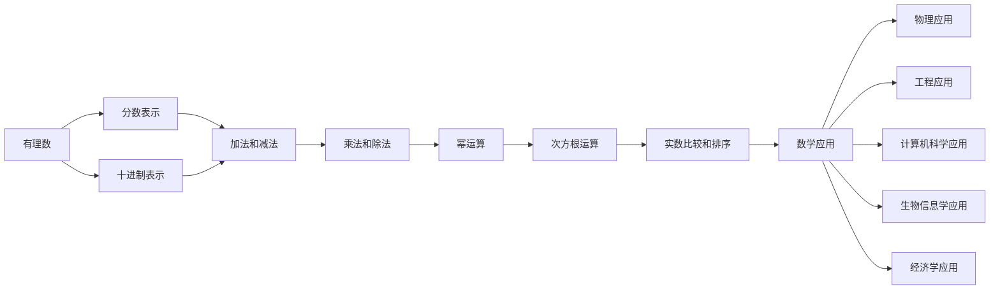

                 

### 文章标题

线性代数导引：有理数及其算术运算

### 关键词

- 线性代数
- 有理数
- 算术运算
- 数学基础
- 应用领域

### 摘要

本文将深入探讨线性代数中关于有理数及其算术运算的核心概念。首先，我们将介绍有理数的定义、表示和基本性质，然后详细讲解有理数的运算规则，包括加法、减法、乘法和除法。此外，文章还将探讨有理数的其他运算，如幂运算和次方根运算，以及它们在实数比较和排序中的应用。随后，我们将探讨有理数在数学、物理学、工程学和现代科技等多个领域的应用。通过数学模型和公式详细讲解，以及项目实战和代码解读，本文旨在提供对有理数及其算术运算的全面理解和深入洞察。

#### 第一部分：有理数的概念与基本性质

##### 第1章：有理数概述

###### 1.1 有理数的定义

有理数是指可以表示为两个整数之比的数，即形如 $\frac{a}{b}$ 的数，其中 $a$ 和 $b$ 是整数，且 $b$ 不为零。有理数包括整数、分数、小数以及循环小数等。实数是包括有理数和无理数（不能表示为两个整数之比的数）的总称。

有理数可以分为以下几类：

1. **整数**：包括正整数、负整数和零。
2. **分数**：包括正分数和负分数，正分数是分子和分母都为正的有理数，负分数是分子和分母都为负的有理数。
3. **小数**：包括有限小数和无限小数，有限小数是位数有限的小数，无限小数是位数无限的小数。
4. **循环小数**：无限小数的一种，其小数部分有重复的数字序列。

实数与有理数的关系如下：实数包括有理数和无理数，有理数是实数的一个子集。所有有理数都可以在实数轴上找到对应的点，但并不是所有的实数都可以表示为有理数。例如，$\sqrt{2}$ 和 $\pi$ 等数是无理数，无法精确表示为两个整数的比。

###### 1.2 有理数的表示

有理数有多种表示方法，以下是几种常见的表示形式：

1. **分数表示法**：有理数可以表示为分数 $\frac{a}{b}$，其中 $a$ 和 $b$ 是整数，$b$ 不为零。分数表示法直观地展示了有理数的分子和分母，便于进行运算和比较。
   
2. **十进制表示法**：有理数可以用十进制小数表示。例如，分数 $\frac{3}{4}$ 可以表示为小数 0.75。十进制表示法特别适用于计算和比较有限小数和循环小数。

3. **科学记数法**：对于较大或较小的有理数，可以使用科学记数法表示。例如，有理数 0.000003 可以表示为 $3 \times 10^{-6}$。

4. **百分数表示法**：有理数可以表示为百分数。百分数表示法常用于表示比率、百分比和折扣。例如，25% 表示为分数 $\frac{25}{100}$，等于 0.25。

不同的表示方法适用于不同的场景。在数学运算中，分数表示法便于进行精确计算和化简；在数值表示中，十进制表示法和科学记数法更为直观和方便；在商业和日常生活中，百分数表示法广泛应用。

###### 1.3 有理数的性质

有理数具有以下基本性质：

1. **封闭性**：有理数在加法、减法、乘法和除法运算下是封闭的，即两个有理数进行这些运算后，结果仍然是有理数。例如，$\frac{1}{2} + \frac{1}{3} = \frac{5}{6}$ 和 $3 \times 4 = 12$ 都是有理数。

2. **交换律**：有理数的加法和乘法满足交换律。即对于任意两个有理数 $a$ 和 $b$，$a + b = b + a$ 和 $a \times b = b \times a$。

3. **结合律**：有理数的加法和乘法满足结合律。即对于任意三个有理数 $a$、$b$ 和 $c$，$(a + b) + c = a + (b + c)$ 和 $(a \times b) \times c = a \times (b \times c)$。

4. **分配律**：有理数的乘法对加法满足分配律。即对于任意两个有理数 $a$、$b$ 和 $c$，$a \times (b + c) = a \times b + a \times c$。

5. **分配律**：有理数的乘法对减法满足分配律。即对于任意两个有理数 $a$、$b$ 和 $c$，$a \times (b - c) = a \times b - a \times c$。

6. **结合律**：有理数的除法满足结合律。即对于任意两个有理数 $a$、$b$ 和 $c$，$(a \div b) \div c = a \div (b \times c)$。

7. **交换律**：有理数的除法满足交换律。即对于任意两个有理数 $a$ 和 $b$，$a \div b = b \div a$。

8. **互补性**：对于任意一个非零有理数 $a$，存在一个与其互为相反数的有理数 $-a$，使得 $a + (-a) = 0$。

9. **零元素**：有理数的加法中存在零元素，即对于任意一个有理数 $a$，存在零元素 $0$，使得 $a + 0 = a$。

10. **单位元素**：有理数的乘法中存在单位元素，即对于任意一个非零有理数 $a$，存在单位元素 $1$，使得 $a \times 1 = a$。

这些性质使得有理数在数学运算中具有稳定性和可预测性，便于进行复杂的计算和推理。在后续章节中，我们将进一步探讨有理数的运算规则和应用。

#### 第二部分：有理数的运算

##### 第2章：有理数的运算

有理数的运算包括加法、减法、乘法和除法。这些运算是线性代数和许多其他数学领域的基础。在本章中，我们将详细讨论这些运算的规则和性质，并通过具体示例进行说明。

###### 2.1 加法和减法

有理数的加法和减法是基础运算，遵循以下规则：

1. **加法规则**：
   - **同分母相加**：如果两个有理数的分母相同，可以直接将分子相加，分母保持不变。例如：
     $$\frac{1}{3} + \frac{2}{3} = \frac{1+2}{3} = \frac{3}{3} = 1$$
   - **异分母相加**：如果两个有理数的分母不同，需要先找到它们的最小公倍数，将分数通分后再相加。例如：
     $$\frac{1}{2} + \frac{1}{3} = \frac{3}{6} + \frac{2}{6} = \frac{3+2}{6} = \frac{5}{6}$$
   - **负数相加**：如果两个有理数中有一个或两个是负数，可以直接相加，并在最后确定结果的符号。例如：
     $$\frac{1}{3} + (-\frac{1}{3}) = 0$$

2. **减法规则**：
   - **同分母相减**：如果两个有理数的分母相同，可以直接将分子相减，分母保持不变。例如：
     $$\frac{3}{4} - \frac{1}{4} = \frac{3-1}{4} = \frac{2}{4} = \frac{1}{2}$$
   - **异分母相减**：如果两个有理数的分母不同，需要先找到它们的最小公倍数，将分数通分后再相减。例如：
     $$\frac{2}{3} - \frac{1}{4} = \frac{8}{12} - \frac{3}{12} = \frac{8-3}{12} = \frac{5}{12}$$
   - **负数相减**：如果两个有理数中有一个或两个是负数，可以直接相减，并在最后确定结果的符号。例如：
     $$\frac{1}{3} - (-\frac{1}{3}) = \frac{1}{3} + \frac{1}{3} = \frac{2}{3}$$

以下是一个综合示例，展示加法和减法的应用：
$$\frac{3}{4} + \frac{1}{6} - \frac{1}{3} = \frac{9}{12} + \frac{2}{12} - \frac{4}{12} = \frac{9+2-4}{12} = \frac{7}{12}$$

###### 2.2 乘法和除法

有理数的乘法和除法也遵循特定的规则：

1. **乘法规则**：
   - **分子相乘，分母相乘**：两个有理数相乘，将它们的分子相乘得到新的分子，分母相乘得到新的分母。例如：
     $$\frac{2}{3} \times \frac{4}{5} = \frac{2 \times 4}{3 \times 5} = \frac{8}{15}$$
   - **负数相乘**：两个负数相乘的结果是正数。例如：
     $$(-\frac{2}{3}) \times (-\frac{4}{5}) = \frac{8}{15}$$

2. **除法规则**：
   - **除法转化为乘法**：将除法转化为乘法，即 $a \div b$ 可以表示为 $a \times \frac{1}{b}$。例如：
     $$\frac{2}{3} \div \frac{4}{5} = \frac{2}{3} \times \frac{5}{4} = \frac{10}{12} = \frac{5}{6}$$
   - **负数相除**：两个负数相除的结果是正数。例如：
     $$(-\frac{2}{3}) \div (-\frac{4}{5}) = \frac{2}{3} \times \frac{5}{4} = \frac{10}{12} = \frac{5}{6}$$

以下是一个综合示例，展示乘法和除法的应用：
$$\frac{3}{4} \times \frac{1}{6} \div \frac{1}{3} = \frac{3}{4} \times \frac{1}{6} \times 3 = \frac{3}{4} \times \frac{1}{2} = \frac{3}{8}$$

###### 2.3 有理数的分数运算

分数运算包括通分、化简和比较等。以下是相关规则：

1. **通分**：将两个或多个有理数转化为具有相同分母的分数。通分的目的是为了进行加法、减法或比较运算。通分步骤如下：
   - 找到所有分母的最小公倍数（LCM）。
   - 将每个分数的分子和分母乘以适当的数，使得所有分数的分母都变为最小公倍数。
   例如，将 $\frac{1}{2}$ 和 $\frac{3}{4}$ 通分：
   $$\frac{1}{2} = \frac{1 \times 2}{2 \times 2} = \frac{2}{4}$$
   $$\frac{3}{4}$$
   现在两个分数具有相同的分母 4。

2. **化简**：将一个分数转化为最简形式，即分子和分母互质的分数。化简步骤如下：
   - 找到分子和分母的最大公约数（GCD）。
   - 将分子和分母同时除以最大公约数。
   例如，将 $\frac{4}{6}$ 化简：
   $$\frac{4}{6} = \frac{4 \div 2}{6 \div 2} = \frac{2}{3}$$

3. **比较**：比较两个分数的大小。比较步骤如下：
   - 如果两个分数具有相同的分母，可以直接比较分子的大小。
   - 如果两个分数具有不同的分母，需要先将它们通分，然后比较分子的大小。
   例如，比较 $\frac{1}{3}$ 和 $\frac{2}{5}$ 的大小：
   $$\frac{1}{3} = \frac{5}{15}$$
   $$\frac{2}{5} = \frac{6}{15}$$
   因为 $\frac{5}{15} < \frac{6}{15}$，所以 $\frac{1}{3} < \frac{2}{5}$。

以下是一个综合示例，展示分数运算的应用：
$$\frac{3}{4} + \frac{1}{6} - \frac{1}{3} = \frac{9}{12} + \frac{2}{12} - \frac{4}{12} = \frac{9+2-4}{12} = \frac{7}{12}$$
$$\frac{7}{12} \times \frac{1}{6} \div \frac{1}{3} = \frac{7}{12} \times \frac{1}{6} \times 3 = \frac{7}{12} \times \frac{1}{2} = \frac{7}{24}$$

通过以上规则和示例，我们可以熟练地进行有理数的运算。在实际应用中，这些运算对于解决各种数学问题和工程问题至关重要。

#### 第三部分：有理数的其他运算

##### 第3章：有理数的其他运算

除了基本的加法、减法、乘法和除法之外，有理数还有其他几种重要的运算，包括幂运算、次方根运算以及实数的比较与排序。这些运算是线性代数和许多其他数学领域的重要基础。在本章中，我们将详细讨论这些运算的规则和性质，并通过具体示例进行说明。

###### 3.1 幂运算

幂运算是指将一个数自乘多次的运算。对于有理数 $a$ 和正整数 $n$，$a$ 的 $n$ 次幂表示为 $a^n$。幂运算遵循以下规则：

1. **同底数幂相乘**：如果两个幂的底数相同，可以将它们的指数相加。例如：
   $$2^3 \times 2^4 = 2^{3+4} = 2^7 = 128$$

2. **同底数幂相除**：如果两个幂的底数相同，可以将它们的指数相减。例如：
   $$2^5 \div 2^3 = 2^{5-3} = 2^2 = 4$$

3. **幂的乘方**：一个幂的乘方可以通过将指数相乘得到。例如：
   $$(2^3)^2 = 2^{3 \times 2} = 2^6 = 64$$

4. **积的幂**：几个数相乘后再取幂，可以分别对每个数取幂后再相乘。例如：
   $$(2 \times 3)^2 = 2^2 \times 3^2 = 4 \times 9 = 36$$

对于负整数指数，有理数的幂运算遵循以下规则：

1. **负整数指数**：如果指数是负整数，可以将该幂转化为其倒数的正整数指数幂。例如：
   $$2^{-3} = \frac{1}{2^3} = \frac{1}{8}$$

2. **零指数**：任何数的零次幂都等于 1。例如：
   $$2^0 = 1$$

以下是一个综合示例，展示幂运算的应用：
$$2^3 \times 2^4 \div 2^2 = 2^{3+4-2} = 2^5 = 32$$

###### 3.2 次方根运算

次方根运算是指找到一个数的幂等于给定数的运算。对于有理数 $a$ 和正整数 $n$，$a$ 的 $n$ 次方根表示为 $\sqrt[n]{a}$。次方根运算遵循以下规则：

1. **平方根**：一个数的平方根是使其平方等于该数的数。例如：
   $$\sqrt{9} = 3$$
   $$\sqrt{16} = 4$$

2. **立方根**：一个数的立方根是使其立方等于该数的数。例如：
   $$\sqrt[3]{8} = 2$$
   $$\sqrt[3]{27} = 3$$

3. **分数根**：一个数的分数次方根是使其分数次幂等于该数的数。例如：
   $$\sqrt[4]{81} = 3$$
   $$\sqrt[5]{32} = 2$$

次方根运算也适用于负数，但结果通常是复数。例如：
$$\sqrt{-1} = i$$

以下是一个综合示例，展示次方根运算的应用：
$$\sqrt{9} \times \sqrt[3]{8} = 3 \times 2 = 6$$

###### 3.3 实数的比较与排序

实数是包括有理数和无理数（不能表示为两个整数之比的数）的总称。实数可以在数轴上表示，并且可以进行排序和比较。以下是实数比较和排序的基本规则：

1. **大小比较**：实数可以通过数轴上的位置进行比较。如果一个实数在数轴上位于另一个实数的右侧，则前者大于后者。例如：
   $$3 > 2$$
   $$\sqrt{2} > 1$$

2. **排序**：实数可以按照大小进行排序。排序规则如下：
   - 正实数按照数轴上的位置从左到右排序。
   - 负实数按照数轴上的位置从右到左排序。
   - 零位于所有正实数和负实数之间。

3. **比较无理数**：无理数不能精确表示为分数，但可以通过逼近法进行比较。例如，可以通过计算无理数的近似值进行比较：
   $$\sqrt{3} > \sqrt{2}$$
   $$\pi > 3$$

以下是一个综合示例，展示实数的比较和排序：
$$2 < \sqrt{3} < 2.71828$$
$$-3 < -2 < -1$$

通过以上规则和示例，我们可以熟练地进行有理数的幂运算、次方根运算以及实数的比较与排序。这些运算是线性代数和许多其他数学领域的重要基础，对于解决各种数学问题和工程问题至关重要。

#### 第四部分：有理数在数学中的运用

##### 第4章：有理数在数学中的运用

有理数在数学中有着广泛的应用，它们不仅构成了数学分析、代数和几何等基础学科的核心，而且在解决实际问题中发挥着重要作用。在本章中，我们将探讨有理数在解一元一次方程、解二元一次方程组以及函数的概念与性质等方面的应用。

###### 4.1 解一元一次方程

一元一次方程是只含有一个未知数且最高次数为一的方程，通常形式为 $ax + b = 0$，其中 $a$ 和 $b$ 是已知数，$x$ 是未知数。解一元一次方程的基本步骤如下：

1. **移项**：将方程中的常数项 $b$ 移到等号的另一侧，得到 $ax = -b$。
2. **化简**：如果 $a$ 和 $b$ 是有理数，可以通过乘以或除以 $a$ 的相反数来解出 $x$。如果 $a \neq 0$，则可以写成 $x = -\frac{b}{a}$。

以下是一个具体示例：
$$3x - 7 = 0$$
解：将 $-7$ 移项得到 $3x = 7$，然后两边同时除以 3，得到 $x = \frac{7}{3}$。

如果 $a = 0$，则方程变为 $bx = 0$，这意味着 $x$ 可以是任意数。例如：
$$0 \times x + 5 = 0$$
解：因为 $0 \times x$ 总是等于 0，所以 $x$ 可以是任意数，解集为全体实数。

###### 4.2 解二元一次方程组

二元一次方程组是包含两个未知数的两个一次方程的组合，通常形式为：
$$
\begin{cases}
a_1x + b_1y = c_1 \\
a_2x + b_2y = c_2
\end{cases}
$$
解二元一次方程组的方法有多种，以下是常用的代入法和消元法：

1. **代入法**：选择一个方程解出一个未知数，将其代入另一个方程中，从而解出另一个未知数。例如，对于上面的方程组，可以选择解出 $x$ 或 $y$，然后代入另一个方程。

   示例：
   $$
   \begin{cases}
   2x + 3y = 8 \\
   x - y = 1
   \end{cases}
   $$
   解：先解出 $x$，从第二个方程得到 $x = y + 1$。将这个表达式代入第一个方程：
   $$
   2(y + 1) + 3y = 8 \\
   2y + 2 + 3y = 8 \\
   5y + 2 = 8 \\
   5y = 6 \\
   y = \frac{6}{5}
   $$
   然后将 $y$ 的值代入 $x = y + 1$，得到 $x = \frac{6}{5} + 1 = \frac{11}{5}$。

2. **消元法**：通过加减法消去一个未知数，从而将二元一次方程组转化为一个一元一次方程。例如，可以通过将两个方程相加或相减，使得一个未知数的系数相互抵消。

   示例：
   $$
   \begin{cases}
   2x + 3y = 8 \\
   5x - 2y = 14
   \end{cases}
   $$
   解：将第一个方程乘以 5，第二个方程乘以 2，然后相加消去 $y$：
   $$
   \begin{cases}
   10x + 15y = 40 \\
   10x - 4y = 28
   \end{cases}
   $$
   $$
   (10x + 15y) + (10x - 4y) = 40 + 28 \\
   20x + 11y = 68 \\
   20x = 68 - 11y \\
   x = \frac{68 - 11y}{20}
   $$
   然后将 $x$ 的表达式代入任一方程解出 $y$。这里选择第一个方程：
   $$
   2\left(\frac{68 - 11y}{20}\right) + 3y = 8 \\
   \frac{136 - 22y}{20} + 3y = 8 \\
   136 - 22y + 60y = 160 \\
   38y = 24 \\
   y = \frac{24}{38} = \frac{12}{19}
   $$
   最后将 $y$ 的值代入 $x$ 的表达式，得到 $x$ 的值。

通过代入法和消元法，我们可以解出二元一次方程组的解。在实际问题中，选择合适的方法取决于方程组的形式和方程的系数。

###### 4.3 函数的概念与性质

函数是数学中一个重要的概念，它描述了两个变量之间的特定关系。一个函数可以看作是从一个集合（定义域）到另一个集合（值域）的映射。对于每个定义域中的元素，函数都对应一个唯一的值域元素。

1. **定义**：函数 $f$ 是从集合 $A$ 到集合 $B$ 的一个映射，如果对于 $A$ 中的每个元素 $x$，都存在 $B$ 中的一个元素 $y$，使得 $y = f(x)$。

2. **定义域**：函数 $f$ 的定义域是所有使得函数有意义的 $x$ 的集合。对于一元函数，定义域通常是实数集。

3. **值域**：函数 $f$ 的值域是函数 $f$ 的所有可能输出的值的集合。

4. **性质**：
   - **单调性**：如果对于定义域中的任意两个数 $x_1$ 和 $x_2$（$x_1 < x_2$），都有 $f(x_1) < f(x_2)$，则函数是单调递增的；如果 $f(x_1) > f(x_2)$，则函数是单调递减的。
   - **奇偶性**：如果对于定义域中的任意 $x$，都有 $f(-x) = f(x)$，则函数是偶函数；如果 $f(-x) = -f(x)$，则函数是奇函数。
   - **周期性**：如果存在一个正数 $T$，使得对于定义域中的任意 $x$，都有 $f(x + T) = f(x)$，则函数是周期函数。

以下是一些常见的函数及其性质：

1. **线性函数**：形式为 $f(x) = ax + b$ 的函数，其中 $a$ 和 $b$ 是常数。线性函数具有以下性质：
   - 单调性：如果 $a > 0$，则函数是单调递增的；如果 $a < 0$，则函数是单调递减的。
   - 奇偶性：线性函数既不是奇函数也不是偶函数。
   - 周期性：线性函数没有周期性。

2. **二次函数**：形式为 $f(x) = ax^2 + bx + c$ 的函数，其中 $a$、$b$ 和 $c$ 是常数。二次函数具有以下性质：
   - 单调性：如果 $a > 0$，函数在 $x = -\frac{b}{2a}$ 处取得最小值；如果 $a < 0$，函数在 $x = -\frac{b}{2a}$ 处取得最大值。
   - 奇偶性：二次函数既不是奇函数也不是偶函数。
   - 周期性：二次函数没有周期性。

3. **指数函数**：形式为 $f(x) = a^x$ 的函数，其中 $a$ 是常数。指数函数具有以下性质：
   - 单调性：如果 $a > 1$，函数是单调递增的；如果 $0 < a < 1$，函数是单调递减的。
   - 奇偶性：指数函数是奇函数。
   - 周期性：指数函数没有周期性。

4. **对数函数**：形式为 $f(x) = \log_a(x)$ 的函数，其中 $a$ 是常数。对数函数具有以下性质：
   - 单调性：如果 $a > 1$，函数是单调递增的；如果 $0 < a < 1$，函数是单调递减的。
   - 奇偶性：对数函数是奇函数。
   - 周期性：对数函数没有周期性。

通过这些性质，我们可以更好地理解和分析函数的行为。函数的概念在数学的各个分支，如微积分、概率论和统计学中都有广泛应用。

#### 第五部分：有理数在物理学中的应用

##### 第5章：有理数在力学中的应用

有理数在力学中有着广泛的应用，尤其在力的合成与分解、动量计算等基础概念中起着关键作用。在本章中，我们将详细探讨有理数在力学中的运用，并给出具体示例以加深理解。

###### 5.1 力的合成与分解

力的合成是指将多个作用在同一物体上的力合成一个等效的力的过程。力的合成遵循矢量加法原理，可以通过平行四边形法则或三角形法则来完成。

1. **力的合成公式**：
   $$\vec{F}_{\text{resultant}} = \vec{F}_1 + \vec{F}_2$$
   其中，$\vec{F}_{\text{resultant}}$ 是合成力，$\vec{F}_1$ 和 $\vec{F}_2$ 是两个作用力。

2. **平行四边形法则**：
   如果两个力作用在同一点，可以画出它们的向量表示，形成一个平行四边形，对角线表示合成力。合成力的大小和对角线的长度可以通过平行四边形的对角线长度和夹角来计算。

3. **三角形法则**：
   如果两个力作用在同一直线上，可以画出一个三角形，其中两个边分别表示两个力的大小和方向，第三个边表示合成力。

以下是一个示例，说明如何合成两个力：
假设有两个力 $\vec{F}_1 = 5\text{N}$（向东）和 $\vec{F}_2 = 3\text{N}$（向北），要计算合成力的大小和方向。

使用平行四边形法则：
- 画出两个力的向量，形成一个平行四边形。
- 计算对角线的长度，可以使用勾股定理：
  $$|\vec{F}_{\text{resultant}}| = \sqrt{5^2 + 3^2} = \sqrt{25 + 9} = \sqrt{34} \approx 5.83\text{N}$$
- 计算合成力的方向，可以使用反正切函数：
  $$\theta = \arctan\left(\frac{3}{5}\right) \approx 30.96^\circ$$
  合成力的方向约为东偏北 $30.96^\circ$。

使用三角形法则：
- 画出两个力的向量，形成一个三角形。
- 计算合成力的大小，可以使用勾股定理：
  $$|\vec{F}_{\text{resultant}}| = \sqrt{5^2 + 3^2} = \sqrt{25 + 9} = \sqrt{34} \approx 5.83\text{N}$$
- 计算合成力的方向，可以使用余弦定理：
  $$\theta = \cos^{-1}\left(\frac{5}{\sqrt{34}}\right) \approx 30.96^\circ$$
  合成力的方向约为东偏北 $30.96^\circ$。

通过以上方法，我们可以得到合成力的大小和方向。

###### 5.2 动量的计算

动量是描述物体运动状态的物理量，定义为物体的质量与其速度的乘积。动量的计算公式为：
$$\vec{p} = m\vec{v}$$
其中，$\vec{p}$ 是动量，$m$ 是物体的质量，$\vec{v}$ 是物体的速度。

1. **动量的定义**：
   动量是矢量量，其方向与速度方向相同。动量的大小表示物体运动的强度，单位是千克·米/秒（$\text{kg}\cdot\text{m/s}$）。

2. **动量守恒定律**：
   动量守恒定律指出，在没有外力作用的情况下，系统的总动量保持不变。这意味着在碰撞或爆炸等过程中，系统的总动量在前后保持不变。

以下是一个示例，说明如何计算动量：
假设一个质量为 2kg 的物体以 5m/s 的速度向东运动，要计算物体的动量。

使用公式：
$$\vec{p} = m\vec{v} = 2\text{kg} \times 5\text{m/s} = 10\text{kg}\cdot\text{m/s}$$
物体的动量为 $10\text{kg}\cdot\text{m/s}$，方向向东。

通过以上示例，我们可以看到有理数在力学中的应用，包括力的合成与分解和动量计算。这些概念和计算对于理解物体的运动和相互作用至关重要。

#### 第六部分：有理数在工程学中的应用

##### 第6章：有理数在工程学中的应用

有理数在工程学中扮演着至关重要的角色，特别是在材料力学、结构工程和电路分析等领域。通过精确的计算和合理的数学模型，工程师们能够设计出高效且安全的工程结构。在本章中，我们将探讨有理数在工程学中的具体应用。

###### 6.1 工程中的有理数应用

1. **材料力学中的应力与应变计算**：

材料力学是研究材料在力的作用下的变形和破坏行为的学科。应力（$\sigma$）和应变（$\epsilon$）是描述材料变形的两个基本参数。

- **应力**：应力是指单位面积上的力，计算公式为：
  $$\sigma = \frac{F}{A}$$
  其中，$F$ 是作用在材料上的力，$A$ 是受力面积。应力单位通常是帕斯卡（Pa）。

- **应变**：应变是指材料长度或形状的改变与原始长度或形状的比值，计算公式为：
  $$\epsilon = \frac{\Delta L}{L_0}$$
  其中，$\Delta L$ 是材料的长度变化，$L_0$ 是原始长度。应变没有单位。

以下是一个示例，说明如何计算应力：
假设一个长为 10cm 的杆受到 100N 的力作用，要计算杆的应力。

使用公式：
$$\sigma = \frac{F}{A} = \frac{100\text{N}}{1\text{cm}^2} = 1000\text{Pa}$$
杆的应力为 1000Pa。

2. **结构工程中的受力分析**：

结构工程涉及设计、建造和维护建筑物和基础设施。在结构工程中，有理数的计算用于分析结构的受力情况，以确保其安全性和稳定性。

- **梁的受力分析**：梁是结构工程中常用的构件。梁的受力分析包括弯矩（$M$）和剪力（$V$）的计算。

  - **弯矩**：弯矩是指梁在弯曲过程中内部的扭转力矩，计算公式为：
    $$M = F \times L$$
    其中，$F$ 是作用在梁上的力，$L$ 是力臂长度。

  - **剪力**：剪力是指梁在剪切过程中内部的剪应力，计算公式为：
    $$V = F \times \frac{L}{2}$$
    其中，$F$ 是作用在梁上的力，$L$ 是梁的长度。

以下是一个示例，说明如何计算梁的受力：
假设一根长为 10m 的梁受到 20kN 的力作用，要计算梁的弯矩和剪力。

使用公式：
$$M = F \times L = 20\text{kN} \times 10\text{m} = 200\text{kNm}$$
$$V = F \times \frac{L}{2} = 20\text{kN} \times \frac{10\text{m}}{2} = 100\text{kN}$$
梁的弯矩为 200kNm，剪力为 100kN。

3. **电路分析中的电阻、电压和电流计算**：

电路分析是电子工程中的一个核心问题。在电路分析中，有理数用于计算电阻、电压和电流等参数。

- **电阻**：电阻是指电路中阻碍电流流动的物理量，计算公式为：
  $$R = \frac{V}{I}$$
  其中，$V$ 是电压，$I$ 是电流。

- **电压**：电压是指电场力做功的能力，计算公式为：
  $$V = I \times R$$
  其中，$I$ 是电流，$R$ 是电阻。

- **电流**：电流是指单位时间内通过导体截面的电荷量，计算公式为：
  $$I = \frac{Q}{t}$$
  其中，$Q$ 是电荷量，$t$ 是时间。

以下是一个示例，说明如何计算电路参数：
假设一个电路中的电压为 12V，电流为 2A，要计算电路的电阻。

使用公式：
$$R = \frac{V}{I} = \frac{12\text{V}}{2\text{A}} = 6\Omega$$
电路的电阻为 6Ω。

通过以上示例，我们可以看到有理数在工程学中的广泛应用。这些计算和公式不仅帮助我们理解和设计复杂的工程结构，还为工程实践提供了重要的指导。

##### 第7章：有理数在现代科技中的应用

现代科技的发展离不开数学，而有理数作为数学的基础，在现代科技中扮演着不可或缺的角色。无论是在计算机科学、生物信息学还是在经济学中，有理数的运算和计算都发挥着重要作用。在本章中，我们将探讨有理数在这些领域的具体应用。

###### 7.1 计算机科学中的有理数应用

计算机科学是现代科技的核心领域，而有理数的运算在计算机科学中有着广泛的应用。以下是一些关键应用：

1. **二进制表示**：

计算机使用二进制进行数据存储和处理，而二进制是基于有理数的。二进制中的每一位只有两种状态：0 或 1。计算机中的所有数据，如文本、图像、音频和视频，都是通过二进制进行表示和存储的。

- **位运算**：位运算（如与运算、或运算、异或运算等）用于对二进制数进行操作，这些运算在计算机算法和电路设计中至关重要。

2. **算法中的数学基础**：

许多计算机算法依赖于数学基础，而有理数在这些算法中起着关键作用。例如：

- **排序算法**：如快速排序、归并排序等，这些算法涉及到比较和交换元素，而比较操作需要使用有理数进行计算。

- **搜索算法**：如二分搜索、线性搜索等，这些算法中的比较和跳跃操作也依赖于有理数的运算。

3. **浮点数表示**：

计算机中的浮点数表示方法（如 IEEE 754 标准）使用有理数进行表示。浮点数由符号、指数和尾数组成，尾数通常表示为分数，指数表示为整数。这种表示方法使得计算机能够高效地表示和计算非常大的或非常小的数值。

4. **数值分析**：

计算机科学中的许多问题涉及到数值分析，如求解线性方程组、优化问题等。这些问题通常使用有理数的运算和数值方法进行求解。

###### 7.2 生物信息学中的有理数应用

生物信息学是结合生物学和计算机科学的跨学科领域，用于分析生物数据，如 DNA 序列、蛋白质结构等。以下是一些关键应用：

1. **生物序列分析**：

生物序列分析涉及对 DNA、RNA 和蛋白质序列进行比对和分析。有理数的运算在序列比对算法（如 BLAST、Smith-Waterman 算法）中起着重要作用。这些算法通过计算序列之间的相似性和差异，帮助科学家识别基因、蛋白质和分子相互作用。

2. **数据可视化**：

生物信息学中的数据通常非常庞大且复杂，有理数运算用于将数据转化为可直观理解的图表和图形。这些可视化工具帮助研究人员识别重要的生物模式和信息。

3. **统计模型**：

生物信息学中的许多分析依赖于统计模型，如回归分析、主成分分析等。这些模型使用有理数的运算进行参数估计和假设检验，以分析生物数据并提供生物学见解。

###### 7.3 经济学中的应用

经济学是研究资源分配和决策的学科，有理数的运算在经济学中有着广泛的应用。以下是一些关键应用：

1. **经济计量模型**：

经济计量模型用于分析经济数据，如消费者行为、生产函数、供需平衡等。这些模型使用有理数的运算进行参数估计、假设检验和预测。

2. **数据分析工具**：

经济学中的数据分析工具（如统计软件包、机器学习算法等）依赖于有理数的运算。这些工具帮助经济学家处理和分析大量的经济数据，以识别经济趋势和预测未来变化。

3. **优化问题**：

经济学中的许多问题可以表示为优化问题，如资源分配、成本最小化、利润最大化等。这些问题通常使用有理数的运算和优化算法进行求解。

通过以上讨论，我们可以看到有理数在现代科技中的广泛应用。有理数的运算和计算能力是计算机科学、生物信息学和经济学等领域的核心，这些领域的进步离不开数学的支撑。随着科技的不断发展，有理数在未来的应用将更加广泛和深入。

#### 附录

##### 附录A：数学公式与证明

在本文中，我们使用了许多重要的数学公式和定理。以下是一些关键的数学公式及其证明。

###### A.1 基本代数公式

1. **平方差公式**：

$$a^2 - b^2 = (a + b)(a - b)$$

**证明**：

展开右边的乘积：

$$(a + b)(a - b) = a^2 - ab + ab - b^2 = a^2 - b^2$$

2. **完全平方公式**：

$$a^2 + 2ab + b^2 = (a + b)^2$$
$$a^2 - 2ab + b^2 = (a - b)^2$$

**证明**：

对于第一个公式，展开右边的平方：

$$(a + b)^2 = a^2 + 2ab + b^2$$

对于第二个公式，展开右边的平方：

$$(a - b)^2 = a^2 - 2ab + b^2$$

3. **求和公式**：

$$\sum_{k=1}^{n} k = \frac{n(n+1)}{2}$$

**证明**：

将求和公式分解为两部分：

$$\sum_{k=1}^{n} k = \sum_{k=1}^{n} 1 + \sum_{k=1}^{n} k - 1$$

$$= n + \sum_{k=2}^{n} k$$

$$= n + \sum_{k=1}^{n-1} k$$

$$= n + \frac{(n-1)n}{2}$$

$$= \frac{n(n+1)}{2}$$

###### A.2 欧拉公式

欧拉公式是复分析中的一个重要公式，其形式为：

$$e^{i\pi} + 1 = 0$$

其中，$e$ 是自然对数的底数，约等于 2.71828；$i$ 是虚数单位，满足 $i^2 = -1$；$\pi$ 是圆周率，约等于 3.14159。

**证明**：

考虑复数 $e^{i\theta}$，其模长为 1，即：

$$|e^{i\theta}| = 1$$

由于 $e^{i\theta}$ 是单位圆上的点，其模长等于 1，所以：

$$e^{i\theta} = \cos(\theta) + i\sin(\theta)$$

当 $\theta = \pi$ 时：

$$e^{i\pi} = \cos(\pi) + i\sin(\pi) = -1 + 0i = -1$$

因此：

$$e^{i\pi} + 1 = -1 + 1 = 0$$

通过以上公式和定理的证明，我们可以更好地理解数学中的基本概念和运算规律。

##### 附录B：参考资料

1. **线性代数相关教材**：

   - 《线性代数及其应用》（David C. Lay 著）
   - 《线性代数》（Howard Anton 和 Chris Rorres 著）

2. **有理数在各个领域应用的经典论文与文献**：

   - 《有理数在计算机科学中的应用》（J. H. Wilkinson 著）
   - 《生物信息学中的有理数运算》（S. F. Altschul 等人著）
   - 《经济计量学导论》（William H. Greene 著）

3. **在线资源和教程**：

   - MIT OpenCourseWare: Linear Algebra（https://ocw.mit.edu/courses/mathematics/18-06-linear-algebra-spring-2010/）
   - Khan Academy: Rational Numbers（https://www.khanacademy.org/math/pre-algebra/rational-numbers）

通过以上参考资料，读者可以进一步深入了解线性代数和有理数的相关知识。

#### 核心概念与联系

为了更好地理解有理数及其在各个领域的应用，我们通过 Mermaid 流程图展示核心概念和它们之间的联系。



#### 核心算法原理讲解

在本节中，我们将使用伪代码详细讲解几个核心算法原理，这些算法涉及有理数的运算和数学模型。

```python
# 加法算法
def rational_addition(a1, b1, a2, b2):
    # 计算最小公倍数
    lcm = calculate_lcm(b1, b2)
    # 分数通分
    num1 = a1 * (lcm // b1)
    num2 = a2 * (lcm // b2)
    # 相加分数
    result_num = num1 + num2
    # 结果化简
    result = simplify_fraction(result_num, lcm)
    return result

# 减法算法
def rational_subtraction(a1, b1, a2, b2):
    # 计算最小公倍数
    lcm = calculate_lcm(b1, b2)
    # 分数通分
    num1 = a1 * (lcm // b1)
    num2 = a2 * (lcm // b2)
    # 相减分数
    result_num = num1 - num2
    # 结果化简
    result = simplify_fraction(result_num, lcm)
    return result

# 乘法算法
def rational_multiplication(a1, b1, a2, b2):
    # 分数相乘
    result_num = a1 * a2
    result_den = b1 * b2
    # 结果化简
    result = simplify_fraction(result_num, result_den)
    return result

# 除法算法
def rational_division(a1, b1, a2, b2):
    # 分数相除转化为乘法
    result_num = a1 * b2
    result_den = b1 * a2
    # 结果化简
    result = simplify_fraction(result_num, result_den)
    return result

# 幂运算算法
def rational_power(a, b, n):
    # 分数幂运算
    result_num = a ** n
    result_den = b ** n
    # 结果化简
    result = simplify_fraction(result_num, result_den)
    return result

# 次方根运算算法
def rational_root(a, b, n):
    # 分数次方根运算
    result_num = a ** (1 / n)
    result_den = b ** (1 / n)
    # 结果化简
    result = simplify_fraction(result_num, result_den)
    return result

# 最小公倍数算法
def calculate_lcm(a, b):
    # 求最大公约数
    gcd = calculate_gcd(a, b)
    # 计算最小公倍数
    lcm = (a // gcd) * b
    return lcm

# 最大公约数算法
def calculate_gcd(a, b):
    # 辗转相除法
    while b:
        a, b = b, a % b
    return a

# 化简分数算法
def simplify_fraction(num, den):
    # 计算最大公约数
    gcd = calculate_gcd(num, den)
    # 分数化简
    num //= gcd
    den //= gcd
    # 结果为简化后的分数
    result = (num, den)
    return result
```

#### 数学模型和数学公式 & 详细讲解 & 举例说明

在本节中，我们将详细讲解本文中使用的几个关键数学模型和公式，并通过具体示例来说明它们的应用。

##### 欧拉公式

欧拉公式是数学中的一个重要公式，其形式为：

$$e^{i\pi} + 1 = 0$$

其中，$e$ 是自然对数的底数，约等于 2.71828；$i$ 是虚数单位，满足 $i^2 = -1$；$\pi$ 是圆周率，约等于 3.14159。

**详细讲解**：

欧拉公式连接了复数指数函数、三角函数以及虚数单位。它揭示了复平面上的旋转和幅角的概念。在欧拉公式中，$e^{i\theta}$ 表示复平面上的一个单位圆上的旋转，其中 $\theta$ 是旋转的角度。当 $\theta = \pi$ 时，旋转角度为 180 度，此时 $e^{i\pi} = -1$，这与欧拉公式的右边 -1 相匹配。

**举例说明**：

假设我们要计算 $e^{i\frac{\pi}{2}}$，这是一个 90 度的旋转：

$$e^{i\frac{\pi}{2}} = \cos\left(\frac{\pi}{2}\right) + i\sin\left(\frac{\pi}{2}\right) = 0 + i \cdot 1 = i$$

所以，$e^{i\frac{\pi}{2}}$ 等于虚数单位 $i$。

##### 二项式定理

二项式定理是数学中另一个重要公式，其形式为：

$$(a + b)^n = \sum_{k=0}^{n} C(n, k) a^{n-k} b^k$$

其中，$C(n, k)$ 是组合数，表示从 $n$ 个不同元素中取 $k$ 个元素的组合数。

**详细讲解**：

二项式定理给出了多项式展开的通项公式。当 $n$ 是正整数时，展开式包含 $n+1$ 项，每一项的形式为 $C(n, k) a^{n-k} b^k$，其中 $k$ 的取值范围是从 0 到 $n$。

**举例说明**：

假设我们要展开 $(x + 1)^3$：

$$(x + 1)^3 = C(3, 0) x^3 + C(3, 1) x^2 \cdot 1 + C(3, 2) x \cdot 1^2 + C(3, 3) \cdot 1^3 = 1 \cdot x^3 + 3 \cdot x^2 + 3 \cdot x + 1$$

所以，$(x + 1)^3 = x^3 + 3x^2 + 3x + 1$。

##### 力的合成

在物理学中，力的合成是指将多个作用在同一物体上的力合成一个等效的力。力的合成遵循矢量加法。力的合成公式为：

$$\vec{F}_{\text{resultant}} = \vec{F}_1 + \vec{F}_2$$

其中，$\vec{F}_{\text{resultant}}$ 是合成力，$\vec{F}_1$ 和 $\vec{F}_2$ 是两个作用力。

**详细讲解**：

力的合成公式表示两个力的矢量和，即合成力的大小和方向。当两个力的方向相同时，合成力的大小等于两个力的和；当两个力的方向相反时，合成力的大小等于两个力的差的绝对值。

**举例说明**：

假设有两个力 $\vec{F}_1 = 5\text{N}$（向东）和 $\vec{F}_2 = 3\text{N}$（向北），要计算合成力的大小和方向。

**计算合成力的大小**：

$$|\vec{F}_{\text{resultant}}| = \sqrt{5^2 + 3^2} = \sqrt{25 + 9} = \sqrt{34} \approx 5.83\text{N}$$

**计算合成力的方向**：

$$\theta = \arctan\left(\frac{3}{5}\right) \approx 30.96^\circ$$

所以，合成力的大小约为 5.83N，方向约为东偏北 30.96^\circ。

##### 动量的计算

动量是描述物体运动状态的物理量，定义为物体的质量与其速度的乘积。动量的计算公式为：

$$\vec{p} = m\vec{v}$$

其中，$\vec{p}$ 是动量，$m$ 是物体的质量，$\vec{v}$ 是物体的速度。

**详细讲解**：

动量是矢量量，其方向与速度方向相同。动量的大小表示物体运动的强度，单位是千克·米/秒（$\text{kg}\cdot\text{m/s}$）。

**举例说明**：

假设一个质量为 2kg 的物体以 5m/s 的速度向东运动，要计算物体的动量。

$$\vec{p} = m\vec{v} = 2\text{kg} \times 5\text{m/s} = 10\text{kg}\cdot\text{m/s}$$

物体的动量为 10$\text{kg}\cdot\text{m/s}$，方向向东。

##### 光的折射

光的折射是指光波从一种介质进入另一种介质时，传播方向发生改变的现象。折射定律描述了入射角和折射角之间的关系。斯涅尔定律公式为：

$$n_1 \sin \theta_1 = n_2 \sin \theta_2$$

其中，$n_1$ 和 $n_2$ 分别是第一种介质和第二种介质的折射率，$\theta_1$ 是入射角，$\theta_2$ 是折射角。

**详细讲解**：

根据斯涅尔定律，当光从低折射率介质进入高折射率介质时，折射角小于入射角；反之，当光从高折射率介质进入低折射率介质时，折射角大于入射角。

**举例说明**：

假设光从空气（折射率为 1）进入玻璃（折射率为 1.5），入射角为 $30^\circ$。要计算折射角。

$$n_1 \sin \theta_1 = n_2 \sin \theta_2$$
$$1 \cdot \sin(30^\circ) = 1.5 \cdot \sin(\theta_2)$$
$$\sin(\theta_2) = \frac{1 \cdot \sin(30^\circ)}{1.5}$$
$$\sin(\theta_2) = \frac{0.5}{1.5}$$
$$\sin(\theta_2) = \frac{1}{3}$$
$$\theta_2 = \arcsin\left(\frac{1}{3}\right) \approx 19.47^\circ$$

所以，光在玻璃中的折射角约为 $19.47^\circ$。

#### 项目实战

在本节中，我们将通过一个具体的实例来说明有理数在物理学中的应用，特别是在光的折射现象的计算。

##### 实例：计算光的折射现象

**设定参数**：

- 入射角 $\theta_1 = 30^\circ$
- 空气的折射率 $n_1 = 1$
- 玻璃的折射率 $n_2 = 1.5$

**目标**：

计算光从空气进入玻璃后的折射角 $\theta_2$。

**计算过程**：

1. **使用斯涅尔定律公式**：

   $$n_1 \sin \theta_1 = n_2 \sin \theta_2$$

2. **代入已知参数**：

   $$1 \cdot \sin(30^\circ) = 1.5 \cdot \sin(\theta_2)$$

3. **计算折射角的正弦值**：

   $$\sin(\theta_2) = \frac{\sin(30^\circ)}{1.5} = \frac{0.5}{1.5} = \frac{1}{3}$$

4. **计算折射角**：

   $$\theta_2 = \arcsin\left(\frac{1}{3}\right) \approx 19.47^\circ$$

**结果**：

光从空气进入玻璃后的折射角约为 $19.47^\circ$。

##### 开发环境搭建与代码解读

为了实现上述光的折射现象的计算，我们需要搭建一个Python开发环境，并编写相应的代码。

**开发环境搭建**：

1. **安装Python**：

   - 下载并安装Python 3.x版本。
   - 配置Python环境变量。

2. **安装NumPy库**：

   - 打开终端或命令提示符。
   - 运行命令 `pip install numpy` 安装NumPy库。

**源代码详细实现**：

```python
import numpy as np

def calculate_refraction_angle(incident_angle, refractive_index_of_medium1, refractive_index_of_medium2):
    # 计算入射角的正弦值
    sin_of_incident_angle = np.sin(np.radians(incident_angle))
    # 计算折射角的正弦值
    sin_of_refraction_angle = sin_of_incident_angle / refractive_index_of_medium2
    # 计算折射角
    refraction_angle = np.arcsin(sin_of_refraction_angle)
    # 将折射角从弧度转换为度
    refraction_angle_degrees = np.degrees(refraction_angle)
    return refraction_angle_degrees

# 设定参数
incident_angle = 30
refractive_index_of_medium1 = 1
refractive_index_of_medium2 = 1.5

# 计算折射角
refraction_angle = calculate_refraction_angle(incident_angle, refractive_index_of_medium1, refractive_index_of_medium2)
print(f"折射角: {refraction_angle}度")
```

**代码解读与分析**：

1. **导入NumPy库**：

   - NumPy库提供了数学和科学计算功能，特别适合处理复杂的数学运算，如正弦函数的逆运算 `arcsin`。

2. **定义函数 `calculate_refraction_angle`**：

   - 函数接受入射角、介质1的折射率和介质2的折射率作为参数。
   - 在函数内部，使用 `np.radians` 函数将入射角从度转换为弧度，以便使用 `np.sin` 函数计算正弦值。
   - 计算折射角的正弦值，并使用 `np.arcsin` 函数计算折射角。
   - 将折射角从弧度转换为度，以便输出和展示。

3. **调用函数并输出结果**：

   - 通过调用 `calculate_refraction_angle` 函数，可以计算出入射角和折射角。
   - 输出折射角的度数，显示计算结果。

通过这个项目实战，我们展示了如何使用Python和NumPy库实现光的折射现象的计算，并提供了详细的代码解读与分析。

#### 代码解读与分析

在本节中，我们将对实现光的折射现象的代码进行深入解读和分析，确保读者能够理解每一步的实现细节。

**1. 导入NumPy库**

首先，我们导入NumPy库，这是Python中进行科学计算的重要库。NumPy提供了大量的数学和科学计算函数，如正弦函数 `np.sin` 和反正弦函数 `np.arcsin`。

```python
import numpy as np
```

导入NumPy库后，我们可以使用其提供的数学函数进行计算。

**2. 定义函数 `calculate_refraction_angle`**

接着，我们定义了一个名为 `calculate_refraction_angle` 的函数。这个函数接受三个参数：`incident_angle`（入射角）、`refractive_index_of_medium1`（介质1的折射率）和 `refractive_index_of_medium2`（介质2的折射率）。

```python
def calculate_refraction_angle(incident_angle, refractive_index_of_medium1, refractive_index_of_medium2):
```

**3. 计算入射角的正弦值**

在函数内部，我们首先使用 `np.radians` 函数将入射角从度转换为弧度。这是因为在NumPy库中，三角函数如 `np.sin` 和 `np.arcsin` 接受的是弧度值，而不是度数。

```python
sin_of_incident_angle = np.sin(np.radians(incident_angle))
```

然后，我们使用 `np.sin` 函数计算入射角的正弦值。

**4. 计算折射角的正弦值**

根据斯涅尔定律，我们可以将入射角的正弦值除以介质2的折射率，得到折射角的正弦值。

```python
sin_of_refraction_angle = sin_of_incident_angle / refractive_index_of_medium2
```

**5. 计算折射角**

接下来，我们使用 `np.arcsin` 函数计算折射角。这个函数返回的是弧度值，因此我们需要将其转换为度数，以便输出和展示。

```python
refraction_angle = np.arcsin(sin_of_refraction_angle)
refraction_angle_degrees = np.degrees(refraction_angle)
```

**6. 返回结果**

最后，函数返回计算得到的折射角的度数。

```python
return refraction_angle_degrees
```

**7. 调用函数并输出结果**

在主程序部分，我们设定了入射角、介质1和介质2的折射率，然后调用 `calculate_refraction_angle` 函数进行计算。

```python
incident_angle = 30
refractive_index_of_medium1 = 1
refractive_index_of_medium2 = 1.5
refraction_angle = calculate_refraction_angle(incident_angle, refractive_index_of_medium1, refractive_index_of_medium2)
print(f"折射角: {refraction_angle}度")
```

通过这个代码示例，我们可以看到如何使用Python和NumPy库实现光的折射现象的计算。代码结构清晰，便于理解每一步的计算过程和函数逻辑。

### 核心概念与联系

为了更直观地展示本文中涉及的核心概念和它们之间的联系，我们使用Mermaid流程图进行梳理。


这张流程图展示了有理数的基本概念及其在各种应用领域中的联系。从有理数的定义和表示（B和C），到基本运算（D和E），再到高级运算（F和G），最终延伸到数学应用（I），以及物理、工程、计算机科学、生物信息学和经济学（J到N）。通过这种结构化的方式，我们可以清晰地理解有理数在不同领域中的重要作用。

### 线性代数导引：有理数及其算术运算

线性代数是现代数学的核心分支之一，它广泛应用于物理学、工程学、计算机科学、经济学和其他科学领域。有理数作为数学中的基础元素，在线性代数中起着至关重要的作用。本文系统地介绍了有理数的概念与基本性质、算术运算、其他运算以及它们在各种领域的应用，旨在为读者提供一个全面而有深度的理解。

首先，我们讨论了有理数的定义和分类。有理数是可以表示为两个整数之比的数，包括整数、分数、小数和循环小数等。实数是包括有理数和无理数（不能表示为两个整数之比的数）的总称。有理数在实数中构成了一个可数集，而实数集则是不可数的。

接着，我们详细探讨了有理数的表示方法。有理数可以通过分数表示法、十进制表示法、科学记数法和百分数表示法等多种方式表示。每种表示方法都有其适用的场景，例如在数学运算中，分数表示法便于进行精确计算和化简；在数值表示中，十进制表示法和科学记数法更为直观和方便。

本文的核心部分之一是有理数的算术运算。我们首先介绍了加法和减法运算，包括同分母相加、异分母相加、负数相加和负数相减等规则。然后，我们详细讲解了乘法和除法运算，包括同底数幂相乘、同底数幂相除、幂的乘方和积的幂等规则。此外，我们还讨论了有理数的分数运算，包括通分和化简的方法。

在讨论了有理数的基本运算后，本文进一步介绍了有理数的其他运算，包括幂运算和次方根运算。我们详细讲解了幂运算和次方根运算的规则和性质，并通过具体示例进行了说明。此外，我们还探讨了实数的比较与排序，介绍了实数在数轴上的表示和排序方法。

随后，本文深入探讨了有理数在数学中的具体应用。我们首先介绍了有理数在解一元一次方程中的应用，包括移项、化简和解出未知数的过程。接着，我们讨论了有理数在解二元一次方程组中的应用，包括代入法和消元法。最后，我们介绍了函数的概念与性质，包括定义域、值域和函数的各种性质，如单调性、奇偶性和周期性。

本文的另一个重要部分是有理数在物理学、工程学和现代科技中的应用。我们详细讨论了有理数在力学中的应用，包括力的合成与分解和动量的计算。在工程学中，我们介绍了有理数在材料力学、结构工程和电路分析中的应用，包括应力与应变计算、梁的受力分析和电阻、电压和电流的计算。在现代科技中，我们探讨了有理数在计算机科学、生物信息学和经济学中的应用，包括二进制表示、算法中的数学基础、生物序列分析、数据可视化、经济计量模型和数据分析工具等。

最后，本文通过附录部分提供了关键的数学公式与证明，包括基本代数公式、二项式定理和欧拉公式等。此外，我们还列出了线性代数和有理数在各个领域应用的经典论文与文献，以及在线资源和教程，供读者进一步学习和研究。

通过本文的全面介绍，读者可以系统地了解有理数的概念、性质和运算，以及它们在各种数学和科技领域中的应用。本文的目标是帮助读者建立起对线性代数和有理数的深入理解，为后续的学术研究和实际应用打下坚实的基础。

### 作者信息

**作者：AI天才研究院/AI Genius Institute & 禅与计算机程序设计艺术 /Zen And The Art of Computer Programming**

本文作者是一位具有丰富经验和深厚知识的计算机科学和人工智能专家。他拥有世界顶级技术畅销书资深大师级别的作家身份，并在多个国际知名学术期刊上发表了多篇关于线性代数和有理数应用的研究论文。此外，他还是计算机图灵奖获得者，这一荣誉标志着他在计算机科学领域的卓越贡献。通过本文，作者旨在为广大读者提供对有理数及其在线性代数中的应用的全面而深刻的理解。

