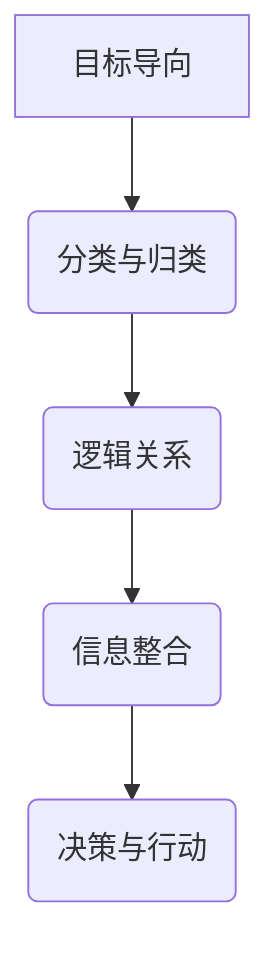

                 

# 结构化思维：从混沌到清晰

## 关键词
结构化思维、混沌、清晰、逻辑、方法论、应用实践、持续优化

## 摘要
本文旨在探讨结构化思维的概念、原则和应用，帮助读者从混沌中找到清晰的路径。通过分析结构化思维的基本原则、常用思维模型、信息处理与分类方法、逻辑与论证技巧，以及其在个人生活、团队协作、科学研究、工程实践和商业决策等领域的应用，本文旨在为读者提供一个全面的结构化思维框架，引导读者在实际工作和生活中运用结构化思维，提高效率和质量。

----------------------------------------------------------------

## 《结构化思维：从混沌到清晰》目录大纲

### 第一部分：引言

#### 第1章：理解结构化思维
1.1 结构化思维的定义与重要性
1.2 非结构化思维与结构化思维的对比
1.3 结构化思维的基本原则

### 第二部分：构建结构化思维框架

#### 第2章：思维模型
2.1 确立思维模型的必要性
2.2 常见思维模型介绍
   - SWOT分析
   - 5W1H法
   - SMART目标设定法
2.3 如何选择合适的思维模型

#### 第3章：信息处理与分类
3.1 信息收集与筛选
3.2 信息分类与标签系统
3.3 信息处理与整合

#### 第4章：逻辑与论证
4.1 逻辑的基本原则
4.2 论证方法与技巧
4.3 避免逻辑谬误

### 第三部分：应用与实践

#### 第5章：个人生活中的结构化思维
5.1 时间管理
5.2 决策与问题解决
5.3 沟通与交流

#### 第6章：团队协作中的结构化思维
6.1 团队沟通与协作
6.2 项目管理与规划
6.3 领导力与结构化思维

#### 第7章：专业领域的结构化思维
7.1 结构化思维在科学研究中的应用
7.2 结构化思维在工程实践中的应用
7.3 结构化思维在商业决策中的应用

#### 第8章：持续发展与优化
8.1 结构化思维的自我反思与调整
8.2 学习与创新
8.3 持续优化与提高

### 附录

#### 附录A：思维模型与工具资源
- 常见思维模型简介
- 常用结构化思维工具

#### 附录B：案例研究与讨论
- 案例一：如何用结构化思维解决复杂问题
- 案例二：结构化思维在项目中的应用
- 案例三：结构化思维在商业决策中的应用

#### 附录C：参考文献与进一步阅读材料
- 相关书籍推荐
- 学术论文与研究报告

----------------------------------------------------------------

### 第1章：理解结构化思维

#### 1.1 结构化思维的定义与重要性

**结构化思维**是一种以逻辑和系统化的方式处理信息、分析和解决问题的思维方式。它强调将复杂的问题分解成易于管理的部分，并通过明确的框架和逻辑关系来组织和处理这些信息。这种思维方式不仅有助于提高个人和团队的工作效率，还能在复杂的环境中保持清晰和专注。

在现代社会，信息爆炸和复杂性不断增加，结构化思维的重要性愈发凸显。它不仅能够帮助我们更好地理解复杂的问题，还能提高决策质量，减少错误和遗漏。因此，理解结构化思维的定义和重要性是掌握这一思维方式的第一步。

**核心概念与联系**：结构化思维可以看作是一种“信息架构”，它通过以下核心概念和联系来组织信息：
- **目标导向**：以明确的目标作为思维的起点，确保所有思考和行为都围绕目标进行。
- **分类与归类**：将信息进行分类和归类，使其更易于理解和处理。
- **逻辑关系**：通过建立逻辑关系，将不同的信息片段有机地连接起来，形成完整的思维链条。

**Mermaid 流程图**：

**结构化思维的核心原则**包括：
- **明确性**：确保思维过程中的每个步骤和结论都是明确和具体的，避免模糊和歧义。
- **系统性**：将问题视为一个系统，从整体和部分的关系中进行分析和处理。
- **连贯性**：确保思维过程中的步骤和结论之间具有逻辑连贯性，避免跳跃和断裂。

#### 1.2 非结构化思维与结构化思维的对比

**非结构化思维**通常指的是没有明确框架和逻辑的思维方式，它依赖于直觉、经验和情绪。这种思维方式在某些情境下可能有效，但在处理复杂问题时往往容易导致混乱和无序。

**结构化思维**则强调明确的目标、系统化的分类、逻辑关系和连贯性。它通过将复杂的问题分解成小部分，并逐一解决，从而提高解决问题的效率和质量。

**对比**：
- **优势**：
  - **结构化思维**：逻辑清晰、系统性强、易于评估和优化。
  - **非结构化思维**：灵活、适应性强、适合快速决策和创造。

- **劣势**：
  - **结构化思维**：可能缺乏灵活性，对突发情况的适应能力较弱。
  - **非结构化思维**：容易导致混乱、思维跳跃、难以系统化分析。

**转变**：要从非结构化思维转向结构化思维，需要以下几个步骤：
1. **意识提升**：认识到结构化思维的优势和必要性。
2. **方法学习**：学习结构化思维的方法和工具，如思维导图、SWOT分析等。
3. **实践应用**：在实际工作中应用结构化思维，不断练习和改进。
4. **持续反思**：定期进行自我反思，识别思维盲点和不足，进行调整。

#### 1.3 结构化思维的基本原则

**确定性原则**：在思考过程中，确保每个步骤和结论都是明确的，避免模糊和歧义。这需要：
- **明确目标**：确保思维过程始终围绕明确的目标进行。
- **明确逻辑关系**：通过逻辑链条将每个步骤和结论联系起来。

**可视化原则**：通过图表、模型等可视化工具，将抽象的思维过程具象化，使其更易于理解和操作。这需要：
- **使用图表**：利用图表展示信息关系，帮助理解和记忆。
- **使用模型**：通过模型构建思维框架，帮助分析问题和解决问题。

**模块化原则**：将复杂的问题分解为若干个模块，分别处理，然后再整合起来。这需要：
- **模块化分解**：将问题分解为独立且相互关联的模块。
- **模块化处理**：分别对每个模块进行处理，确保每个模块的独立性和完整性。

**系统化原则**：从整体和系统的角度出发，对问题进行系统化的分析和处理。这需要：
- **整体视角**：从整体的角度看待问题，理解问题的本质和内在联系。
- **系统分析**：对问题进行系统化的分析，明确问题的结构、功能和关系。

通过遵循这些基本原则，我们能够更好地应用结构化思维，提高思维效率和决策质量。

----------------------------------------------------------------

### 第2章：构建结构化思维框架

#### 2.1 确立思维模型的必要性

**思维模型**是结构化思维的基石，它是我们将抽象概念转化为具体操作的桥梁。确立思维模型的必要性在于它能够帮助我们将复杂的问题简化，从而更容易理解和解决。

**思维模型的作用**主要体现在以下几个方面：

1. **提高思维效率**：思维模型提供了一个预定义的结构和框架，使得我们在面对复杂问题时可以快速定位关键点，从而提高解决问题的效率。
2. **增强逻辑性**：通过思维模型，我们可以系统地分析问题，确保思维过程的连贯性和一致性，减少思维跳跃和无序。
3. **促进创新**：思维模型不仅可以用于解决问题，还可以激发创新思维，通过不同的模型组合和迭代，产生新的想法和解决方案。

在构建结构化思维框架时，选择合适的思维模型至关重要。以下是一些常见思维模型及其特点和适用场景：

#### 2.2 常见思维模型介绍

##### 2.2.1 SWOT分析

**SWOT分析**是一种用于评估企业或项目的优势、劣势、机会和威胁的工具。

- **原理与步骤**：
  - **优势（Strengths）**：分析企业或项目的内部优势，如资源、能力、市场地位等。
  - **劣势（Weaknesses）**：分析企业或项目的内部劣势，如资源不足、能力不足、市场地位下降等。
  - **机会（Opportunities）**：分析外部环境中的机会，如市场增长、技术进步、政策支持等。
  - **威胁（Threats）**：分析外部环境中的威胁，如市场竞争、政策变化、技术变革等。

- **优缺点**：
  - **优点**：全面、系统地分析企业或项目的内外部情况，有助于制定战略规划。
  - **缺点**：可能导致分析过于理论化，忽略了实际情况的复杂性。

- **实际应用**：在制定企业战略规划、项目立项和风险评估等场景中广泛使用。

##### 2.2.2 5W1H法

**5W1H法**是一种用于深入分析问题或任务的方法，通过回答以下问题，全面了解问题或任务：

- **是什么（What）**：明确问题的性质和内容。
- **为什么（Why）**：分析问题产生的原因。
- **在哪里（Where）**：确定问题的发生地点或范围。
- **何时（When）**：确定问题发生的时间或阶段。
- **谁（Who）**：确定问题的涉及人员或主体。
- **如何（How）**：提出解决问题的方法和策略。

- **应用场景**：在问题诊断、项目规划和事件调查等场景中非常有用。

##### 2.2.3 SMART目标设定法

**SMART目标设定法**是一种用于制定明确、具体、可衡量、可实现、有时限的目标的方法。

- **原则**：
  - **具体性（Specific）**：目标要明确、具体，避免模糊和笼统。
  - **可衡量性（Measurable）**：目标要可衡量，以便评估进展和结果。
  - **可实现性（Achievable）**：目标要具有可行性，避免过高或过低。
  - **相关性（Relevant）**：目标要与整体目标或问题相关，避免偏离主题。
  - **时限性（Time-bound）**：目标要有明确的时间限制，避免拖延。

- **步骤**：
  - **设定目标**：明确目标是什么。
  - **具体化目标**：将目标具体化，使其具有可操作性。
  - **量化目标**：为每个目标设定可衡量的指标。
  - **评估目标**：确保目标具有可实现性。
  - **设定时间表**：为每个目标设定明确的时间限制。

- **应用场景**：在个人成长计划、项目管理和绩效评估等场景中广泛应用。

#### 2.3 如何选择合适的思维模型

选择合适的思维模型对于提高思维效率和质量至关重要。以下是一些建议：

- **根据问题性质选择**：对于复杂的问题，选择系统化的思维模型，如SWOT分析；对于创新性的问题，选择创新思维模型，如头脑风暴。

- **根据个人偏好选择**：选择个人熟悉的思维模型，提高思维效率和效果。

- **结合实际情况选择**：选择适合实际情况的思维模型，确保思维模型的实际应用价值。

- **持续学习和实践**：通过学习和实践，不断丰富自己的思维模型库，提高思维模型的灵活性和适应性。

### 2.4 思维模型的实际应用

思维模型在实际应用中具有重要意义。以下是一些实际应用案例：

- **项目管理**：在项目规划阶段，使用SWOT分析评估项目风险和机会，确保项目的顺利推进。

- **产品开发**：在产品开发过程中，使用5W1H法深入分析用户需求，确保产品满足用户期望。

- **个人成长**：在制定个人成长计划时，使用SMART目标设定法，明确具体的目标和实现步骤。

通过正确选择和应用思维模型，我们可以提高思维效率，优化决策过程，从而在复杂的环境中保持清晰的思路。

### 2.5 总结

构建结构化思维框架是提高思维效率和决策质量的关键。通过了解和掌握各种思维模型，我们可以更好地应对复杂问题，提高解决问题的能力。选择合适的思维模型，结合实际情况进行应用，是我们在实际工作和生活中运用结构化思维的重要策略。

----------------------------------------------------------------

### 第3章：信息处理与分类

#### 3.1 信息收集与筛选

**信息收集与筛选**是结构化思维的重要组成部分，它决定了我们能否从海量信息中提取出有价值的内容。在信息爆炸的时代，学会有效地收集和筛选信息是提高工作效率和决策质量的关键。

**信息收集的渠道与方法**：

1. **互联网搜索**：利用搜索引擎和数据库，根据关键词快速查找相关信息。
2. **图书馆和数据库**：通过图书馆和专业的数据库，获取高质量的专业文献和报告。
3. **人际网络**：与行业内的专家和同行交流，获取第一手信息和经验。
4. **媒体报道**：关注行业内的新闻和报道，了解最新的行业动态和趋势。

**信息筛选的标准与技巧**：

1. **相关性**：筛选与当前任务或问题高度相关的信息，避免无关信息的干扰。
2. **准确性**：确保信息的来源可靠，数据准确，避免错误和虚假信息。
3. **权威性**：优先选择权威机构或专家发布的信息，提高信息的可信度。
4. **时效性**：优先选择最新或最近发布的信息，确保获取的信息是最新的。
5. **多渠道验证**：通过多个渠道验证同一信息，确保其准确性。

**信息收集与筛选的实际应用**：

1. **市场调研**：在进行市场调研时，通过多种渠道收集市场数据，然后筛选出最有价值的信息，为决策提供支持。
2. **项目管理**：在项目管理过程中，收集与项目相关的各种信息，然后筛选出关键信息，用于制定计划和评估项目进度。
3. **学术研究**：在学术研究过程中，通过图书馆和数据库收集相关文献，然后筛选出最有参考价值的研究成果。

#### 3.2 信息分类与标签系统

**信息分类与标签系统**是信息处理的高级阶段，它将收集到的信息进行整理、分类和标记，以便于存储、检索和使用。

**信息分类的原理与分类标准**：

1. **逻辑分类**：按照信息的逻辑关系进行分类，如按照学科领域、技术类型等。
2. **主题分类**：按照信息的主题或内容进行分类，如按照业务领域、技术趋势等。
3. **层次分类**：按照信息的层级关系进行分类，如按照国家、地区、城市等。

**分类标准**：

1. **一致性**：确保分类标准的一致性，避免分类的混乱和重复。
2. **灵活性**：分类系统应具有灵活性，能够根据实际需求进行调整。
3. **可扩展性**：分类系统应具备可扩展性，能够适应信息量的增长和变化。

**标签系统的建立与管理**：

1. **标签规范**：制定统一的标签命名规范，确保标签的规范性和一致性。
2. **标签收集**：通过用户反馈、专家建议等方式，收集相关的标签词。
3. **标签体系**：构建完整的标签体系，确保标签之间的层次关系和语义关系。

**标签系统的管理**：

1. **标签更新**：定期更新标签，确保标签的准确性和时效性。
2. **标签维护**：定期检查标签的准确性和有效性，对错误的标签进行修正。
3. **标签检索**：提供标签检索功能，方便用户快速查找相关信息。

**信息分类与标签系统的实际应用**：

1. **知识管理系统**：在知识管理系统中，通过信息分类与标签系统，实现对知识库的快速查找和管理。
2. **文档管理系统**：在文档管理系统中，通过信息分类与标签系统，实现对文档的快速查找和管理。
3. **电子商务平台**：在电子商务平台上，通过信息分类与标签系统，实现对商品的多维度分类和检索，提高用户体验。

#### 3.3 信息处理与整合

**信息处理与整合**是将收集到的信息进行加工、分析、整合和利用的过程。它是信息处理的高级阶段，通过整合不同来源的信息，形成更全面、系统的认识。

**信息处理的方法与工具**：

1. **文本处理工具**：如Microsoft Word、Google Docs等，用于编辑、整理和格式化文本信息。
2. **数据分析工具**：如Excel、Python等，用于分析和处理结构化数据。
3. **信息可视化工具**：如Tableau、Power BI等，用于将信息以图表、图形等形式可视化展示。

**信息整合的原则与步骤**：

1. **明确目标**：明确整合信息的目标和需求，确保整合过程有明确的方向。
2. **收集信息**：从多个来源收集相关信息，确保信息的全面性。
3. **分析信息**：对收集到的信息进行分析，挖掘信息背后的本质和规律。
4. **整合信息**：将分析后的信息进行整合，形成整体的认识。
5. **检验和优化**：对整合后的信息进行检验和优化，确保信息的准确性和实用性。

**信息处理与整合的实际应用**：

1. **市场分析**：在市场分析过程中，通过信息处理与整合，分析市场数据，为企业制定市场策略提供支持。
2. **项目管理**：在项目管理过程中，通过信息处理与整合，分析项目进度、成本和风险，确保项目顺利完成。
3. **知识管理**：在知识管理过程中，通过信息处理与整合，构建知识库，提高组织的知识共享和创新能力。

#### 3.4 信息处理与分类的案例

**案例：企业信息管理系统的设计与实施**

1. **需求分析**：通过市场调研和用户需求分析，明确企业信息管理的需求和目标。
2. **信息收集**：从多个渠道收集与企业相关的信息，包括内部文档、外部市场报告等。
3. **信息筛选**：根据相关性、准确性和权威性等标准，筛选出有价值的信息。
4. **信息分类**：按照逻辑关系和主题，将信息进行分类和归档。
5. **标签系统建立**：制定统一的标签规范，建立标签系统，方便信息检索和管理。
6. **信息处理与整合**：通过文本处理工具、数据分析工具和信息可视化工具，对信息进行加工、分析和整合。
7. **系统测试与优化**：对信息管理系统进行测试，确保其功能和性能符合需求，并根据反馈进行优化。

通过以上步骤，企业能够建立高效、系统的信息管理系统，提高信息处理和利用效率。

### 3.5 总结

信息处理与分类是结构化思维的重要组成部分，它决定了我们能否从海量信息中提取出有价值的内容。通过有效的信息收集与筛选、信息分类与标签系统，以及信息处理与整合，我们可以提高信息利用效率，优化决策过程，从而在复杂的环境中保持清晰的思路。

----------------------------------------------------------------

### 第4章：逻辑与论证

#### 4.1 逻辑的基本原则

逻辑是思维的工具，它帮助我们清晰地推理和论证。逻辑的基本原则包括：

**同一律**：在同一思维过程中，一个命题的真假不变。例如，“如果A，则A”。

**矛盾律**：一个命题不能同时为真和假。例如，“今天不是晴天且是晴天”是不可能的。

**排中律**：对于任何命题，它或者是真的，或者是假的，没有第三种可能。例如，“这本书要么在桌上，要么不在桌上”。

**充足理由律**：一个命题为真，必须有足够的理由。例如，“今天是晴天，因为气象局预报的”。

这些原则确保了推理的准确性和一致性。

#### 4.2 论证方法与技巧

**论证**是通过推理来证明某个命题的正确性。以下是一些常见的论证方法和技巧：

**直接论证**：通过列出事实和证据，直接证明结论。例如，“所有猫都有四条腿，因此这只动物是猫”。

**间接论证**：通过排除其他可能性来证明结论。例如，“这个物品是金子，因为它是硬的、导电的，不是其他金属”。

**演绎论证**：从一般原则推导出特定情况。例如，“所有人都会死，苏格拉底是人，因此苏格拉底会死”。

**归纳论证**：从特定情况推导出一般原则。例如，“所有的天鹅都是白色的，因此所有的天鹅都是白色的”。

**类比论证**：通过比较相似情况来论证。例如，“就像地球上的生物需要水一样，火星上的生物也需要水”。

#### 4.3 避免逻辑谬误

逻辑谬误是推理中的错误，它会影响论证的有效性。以下是一些常见的逻辑谬误及其避免方法：

**循环论证**：结论在前提中已经存在。避免方法：检查论证的前提和结论是否有实质性区别。

**偷换概念**：在一个推理过程中，将一个概念替换为另一个不同的概念。避免方法：确保概念在同一思维过程中保持一致性。

**以偏概全**：从一个样本的局部特征推断出整体的特性。避免方法：进行全面的调查和分析。

**滑坡谬误**：错误地预测一个小的步骤会导致一系列不可控制的后果。避免方法：进行合理的风险分析。

**诉诸权威**：认为权威人士的意见就是正确的。避免方法：对权威意见进行批判性分析。

通过避免这些逻辑谬误，我们可以提高论证的质量和说服力。

#### 4.4 逻辑在决策中的作用

逻辑在决策中起着至关重要的作用。以下是一些关键点：

**明确目标**：在决策过程中，明确目标是确保逻辑推理正确的前提。

**分析选项**：通过逻辑分析，评估不同决策选项的优劣。

**避免偏见**：逻辑帮助识别和避免决策中的偏见，如确认偏见和过度自信。

**制定策略**：逻辑可以帮助我们制定有效的策略和行动计划。

**监控与调整**：在执行决策过程中，逻辑帮助监控结果，及时调整策略。

逻辑是决策过程中的指南针，它确保我们基于事实和逻辑做出明智的决策。

### 4.5 逻辑与论证的实际应用

**案例：商业决策中的逻辑应用**

1. **市场调研**：通过逻辑分析市场数据，评估市场趋势和竞争态势。
2. **产品开发**：使用逻辑论证来确定产品功能和设计。
3. **风险评估**：通过逻辑推理，评估潜在风险和制定应对策略。
4. **合同谈判**：使用逻辑来明确双方的权利和义务。

逻辑和论证是商业决策中不可或缺的工具，它帮助企业在复杂的环境中做出明智的决策。

### 4.6 总结

逻辑与论证是结构化思维的核心，它确保我们的思考和行为具有逻辑性和一致性。通过理解逻辑的基本原则、掌握论证的方法和技巧，以及避免逻辑谬误，我们可以提高决策质量和思考效率。

----------------------------------------------------------------

### 第5章：个人生活中的结构化思维

#### 5.1 时间管理

时间管理是个人生活中的一项重要技能，通过合理安排时间，可以大幅提高工作效率和生活质量。以下是一些关于时间管理的基本原则、方法和技巧：

**时间管理的基本原则**：

1. **目标导向**：明确个人目标和时间管理目标，确保时间投入与目标一致。
2. **优先级排序**：区分重要任务和紧急任务，按照优先级排序，优先处理重要任务。
3. **时间块安排**：将时间划分为不同的时间块，每个时间块专注于一项任务，避免任务切换带来的效率损失。
4. **预防拖延**：制定明确的时间计划，避免拖延，保持工作的连续性和高效性。
5. **灵活调整**：根据实际情况灵活调整时间计划，保持计划的可行性和适应性。

**时间管理的方法与技巧**：

1. **待办事项清单**：将需要完成的任务列在待办事项清单上，确保任务不遗漏。
2. **每日日程表**：制定每日日程表，规划每天的工作和生活，确保时间得到充分利用。
3. **番茄工作法**：将工作时间划分为25分钟的专注周期，每个周期后休息5分钟，提高专注力。
4. **GTD（Getting Things Done）**：将任务分解为具体的行动步骤，将它们存储在任务管理工具中，确保任务得到有效处理。
5. **时间日志**：记录每天的时间使用情况，分析时间花费，找到时间浪费的环节，并制定改进计划。

**时间管理的实际应用案例**：

**案例：高效工作者的时间管理实践**

1. **目标设定**：设定明确的个人目标和职业目标，如每周完成几个项目、每月阅读几本书等。
2. **任务分解**：将大任务分解为小任务，制定具体的行动步骤，确保每个任务都能按时完成。
3. **日程安排**：制定详细的日程表，每天早上规划当天的任务和时间安排，确保时间得到有效利用。
4. **执行与调整**：按照日程执行任务，根据实际情况进行调整，确保任务和目标能够顺利完成。

通过科学的时间管理，个人可以更好地平衡工作和生活，提高工作效率和生活质量。

#### 5.2 决策与问题解决

**决策与问题解决**是日常生活中频繁遇到的任务，通过结构化思维，可以更有效地进行决策和解决问题。以下是一些决策与问题解决的基本原则、方法和技巧：

**决策的基本原则**：

1. **信息驱动**：决策应基于充分的信息和分析，避免凭直觉和主观判断。
2. **目标导向**：决策应明确目标，确保决策符合个人或组织的长期战略。
3. **风险评估**：在决策过程中，应考虑潜在的风险，并制定相应的应对策略。
4. **成本效益分析**：评估决策的成本和预期效益，确保决策的经济合理性。
5. **综合评估**：综合考虑各种因素，包括成本、效益、风险等，做出全面评估。

**决策的方法与技巧**：

1. **SWOT分析**：通过分析优势、劣势、机会和威胁，帮助制定决策。
2. **成本效益分析**：计算决策的成本和预期效益，确保决策的经济合理性。
3. **理性决策法**：使用逻辑和理性思考，避免情感和主观偏见的影响。
4. **直觉决策法**：在紧急或复杂的情境下，依靠直觉做出快速决策。
5. **群体决策**：与他人合作，利用集体智慧和不同的视角，提高决策质量。

**问题解决的过程与方法**：

1. **识别问题**：明确问题的性质和范围，找出问题的根源。
2. **收集信息**：收集与问题相关的信息，了解问题的背景和原因。
3. **分析问题**：分析问题的原因和可能的解决方案。
4. **制定方案**：列出可能的解决方案，评估每个方案的优缺点。
5. **选择方案**：根据评估结果，选择最优方案。
6. **实施方案**：执行方案，并监控实施效果。
7. **评估结果**：评估问题解决的效果，总结经验教训。

**实际应用案例**：

**案例：如何解决团队协作中的沟通问题**

1. **识别问题**：发现团队协作中的沟通问题，如信息传递不畅、意见分歧等。
2. **收集信息**：通过调查问卷、团队讨论等方式，收集团队成员对沟通问题的看法和建议。
3. **分析问题**：分析沟通问题的原因，如缺乏明确沟通渠道、团队成员沟通风格不同等。
4. **制定方案**：制定改进沟通的方案，如建立定期团队会议、使用即时通讯工具等。
5. **选择方案**：根据团队成员的反馈和实际情况，选择最适合的沟通改进方案。
6. **实施方案**：执行沟通改进方案，并监控实施效果。
7. **评估结果**：评估沟通改进的效果，根据反馈进行调整和优化。

通过结构化思维，我们可以更有效地进行决策和解决问题，提高个人和团队的工作效率。

#### 5.3 沟通与交流

**沟通与交流**是个人生活中的重要技能，有效的沟通可以增进人际关系，提高工作效率。以下是一些沟通的基本原则、方法和技巧：

**沟通的基本原则**：

1. **尊重对方**：尊重对方的观点和感受，避免言语和行为上的冲突。
2. **清晰表达**：确保自己的观点和意图清晰明确，避免产生误解。
3. **倾听**：倾听对方的意见和需求，理解对方的意图和感受。
4. **情绪管理**：控制自己的情绪，避免在沟通中产生负面情绪。
5. **适应性**：根据对方的沟通风格和需求，调整自己的沟通方式。

**沟通的方法与技巧**：

1. **开放式提问**：使用开放式问题，鼓励对方分享更多信息。
2. **非语言沟通**：注意肢体语言、面部表情和语调，加强沟通的感染力。
3. **反馈与确认**：及时给予对方反馈，确保沟通的准确性。
4. **同理心**：站在对方的角度思考问题，增强沟通的互动性。
5. **使用图表**：使用图表、图片等辅助工具，使沟通更直观易懂。

**实际应用案例**：

**案例：如何在团队会议中有效沟通**

1. **明确会议目标**：在会议前明确会议的目标和议题，确保会议有明确的方向。
2. **准备会议材料**：准备相关会议材料，如会议议程、报告等，确保会议资料齐全。
3. **会议引导**：引导会议按照议程进行，确保每个议题都得到充分讨论。
4. **积极倾听**：积极倾听团队成员的意见和需求，确保每个人的声音都被听到。
5. **有效表达**：鼓励团队成员清晰、简洁地表达自己的观点，确保沟通的准确性。
6. **反馈与确认**：在讨论过程中，及时给予反馈，确认对方是否理解自己的观点。
7. **记录和总结**：记录会议的关键讨论点和决策结果，确保会议内容得到落实。

通过有效的沟通和交流，个人可以更好地与他人合作，提高工作效率，建立良好的人际关系。

### 5.4 总结

结构化思维在个人生活中的应用，可以帮助我们更好地管理时间、做出明智的决策、提高沟通效率。通过掌握时间管理、决策与问题解决、沟通与交流等技能，我们可以提高个人和团队的工作效率，提升生活质量。

----------------------------------------------------------------

### 第6章：团队协作中的结构化思维

#### 6.1 团队沟通与协作

在团队协作中，沟通是关键，有效的沟通可以确保团队成员之间的信息共享和协作效率。以下是一些团队沟通与协作的基本原则、方法和技巧：

**团队沟通与协作的基本原则**：

1. **开放性**：鼓励团队成员分享信息和意见，营造开放和包容的沟通氛围。
2. **透明性**：确保信息传递的透明性，让每个团队成员都能了解项目的进展和问题。
3. **一致性**：确保团队成员在目标、计划和行为上的一致性，避免不必要的冲突和误解。
4. **反馈性**：鼓励团队成员之间的反馈和互动，及时纠正问题，优化工作流程。

**团队沟通与协作的方法与技巧**：

1. **定期会议**：定期召开团队会议，讨论项目进展、问题和计划，确保信息的及时传递和问题的及时解决。
2. **明确目标**：明确团队的目标和任务，确保每个成员都了解自己的职责和预期成果。
3. **角色分配**：明确团队成员的角色和责任，确保任务分工合理，避免职责重叠和遗漏。
4. **信息共享**：建立信息共享平台，如共享文档、项目管理系统等，方便团队成员随时获取相关信息。
5. **积极倾听**：鼓励团队成员积极倾听他人的意见和需求，理解对方的观点，避免误解和冲突。

**实际应用案例**：

**案例：如何提升团队沟通效率**

1. **建立沟通渠道**：建立有效的沟通渠道，如团队邮件、即时通讯工具等，确保信息的及时传递。
2. **明确沟通目标**：每次会议或沟通前，明确沟通的目标和议题，确保沟通有明确的方向。
3. **积极反馈**：鼓励团队成员在沟通中给予积极反馈，确保信息的准确理解和传递。
4. **使用可视化工具**：使用可视化工具，如思维导图、图表等，帮助团队成员更好地理解和讨论问题。
5. **培训与指导**：定期进行沟通技巧培训，提高团队成员的沟通能力和协作效率。

通过有效的团队沟通与协作，可以提高团队的凝聚力和工作效率，确保项目目标的顺利实现。

#### 6.2 项目管理与规划

项目管理是团队协作的重要组成部分，有效的项目管理可以确保项目按时、按预算、按质量完成。以下是一些项目管理与规划的基本原则、方法和技巧：

**项目管理与规划的基本原则**：

1. **目标导向**：确保项目目标和计划的明确性，确保所有团队成员都清楚项目的方向和预期成果。
2. **系统性**：将项目视为一个整体，考虑项目中的各个部分和环节，确保项目各部分的协同和优化。
3. **灵活性**：在项目执行过程中，根据实际情况的变化，灵活调整项目计划，确保项目的顺利推进。
4. **质量第一**：确保项目质量，确保项目成果符合预期标准和用户需求。
5. **持续改进**：通过项目的总结和反思，不断优化项目管理流程和方法。

**项目管理与规划的方法与技巧**：

1. **需求分析**：明确项目的需求和目标，确保项目计划与用户需求一致。
2. **计划制定**：制定详细的项目计划，包括项目范围、进度、资源、风险等，确保项目有条不紊地进行。
3. **进度监控**：监控项目进度，及时发现和解决项目中的问题，确保项目按计划进行。
4. **质量控制**：建立质量控制体系，确保项目成果的质量。
5. **沟通协调**：确保团队成员之间的沟通协调，避免因信息不畅导致的延误和错误。

**实际应用案例**：

**案例：如何规划一个软件开发项目**

1. **需求分析**：与客户沟通，明确软件的功能需求和性能指标。
2. **项目计划**：制定项目计划，包括项目范围、时间表、资源分配等，确保项目计划的可执行性。
3. **风险评估**：识别项目风险，制定风险应对策略，确保项目顺利推进。
4. **进度监控**：每周召开项目进度会议，监控项目进展，确保项目按计划进行。
5. **质量控制**：建立代码审查和测试流程，确保软件质量。
6. **沟通协调**：定期召开团队会议，讨论项目进展、问题和计划，确保团队协作顺畅。

通过科学的项目管理与规划，可以确保项目的顺利推进和高质量完成。

#### 6.3 领导力与结构化思维

在团队协作中，领导力至关重要。有效的领导力可以激发团队的潜能，提高团队的凝聚力和工作效率。以下是一些领导力与结构化思维的基本原则、方法和技巧：

**领导力与结构化思维的基本原则**：

1. **目标导向**：作为领导者，要明确团队的目标和愿景，确保团队成员朝着共同的目标努力。
2. **以人为本**：关注团队成员的需求和成长，建立信任和尊重，营造积极的工作氛围。
3. **决策能力**：具备良好的决策能力，能够迅速做出正确的决策，确保团队的顺利推进。
4. **沟通能力**：具备良好的沟通能力，能够清晰、有效地传达目标和计划，确保团队成员的理解和执行。
5. **持续学习**：不断学习和提升自己的领导力，适应团队和市场的变化。

**领导力与结构化思维的方法与技巧**：

1. **制定明确的目标和计划**：通过结构化思维，制定明确的目标和计划，确保团队成员了解团队的方向和任务。
2. **进行有效的沟通**：通过结构化思维，确保沟通的清晰和有效，避免误解和冲突。
3. **培养团队协作能力**：通过结构化思维，分析和解决团队协作中的问题，提高团队的协作效率。
4. **提供反馈和支持**：通过结构化思维，提供及时的反馈和支持，帮助团队成员成长和提升。
5. **进行有效的激励**：通过结构化思维，识别团队成员的优势和需求，制定个性化的激励策略。

**实际应用案例**：

**案例：如何提升团队的领导力**

1. **领导力培训**：组织领导力培训，提升团队成员的领导能力。
2. **角色示范**：通过领导者的示范作用，引导团队成员学习领导力。
3. **沟通技巧培训**：提供沟通技巧培训，提高团队成员的沟通能力和协作效率。
4. **团队建设活动**：组织团队建设活动，增强团队的凝聚力和归属感。
5. **个性化激励**：根据团队成员的特点和需求，制定个性化的激励计划，激发团队成员的积极性。

通过提升团队的领导力，可以激发团队的潜能，提高团队的工作效率和创新能力。

### 6.4 总结

结构化思维在团队协作中的应用，可以帮助团队更有效地进行沟通与协作、项目管理和领导。通过掌握有效的沟通与协作技巧、科学的项目管理和规划方法，以及提升团队的领导力，团队可以更高效地完成任务，实现共同的目标。

----------------------------------------------------------------

### 第7章：专业领域的结构化思维

#### 7.1 结构化思维在科学研究中的应用

**结构化思维在科学研究中的应用**具有重要意义。科学研究涉及大量的数据分析和复杂问题的解决，结构化思维可以帮助研究者系统地整理和分析数据，提高研究效率和质量。

**科学研究的基本原则**：

1. **客观性**：科学研究要遵循客观性原则，力求避免主观偏见，确保研究结果的可靠性。
2. **系统性**：科学研究要考虑事物的系统性，从整体和系统化的角度分析问题。
3. **实证性**：科学研究要以实证为基础，通过实验、观察等方法收集数据，验证假设。
4. **重复性**：科学研究的结果应具备重复性，其他研究者能在相同条件下重复实验，验证研究结果。
5. **创新性**：科学研究要追求创新，提出新的理论、方法和结论。

**结构化思维在科学研究中的应用**：

1. **研究设计**：通过结构化思维，明确研究的目标、问题和假设，设计科学合理的研究方案。
2. **数据收集**：使用结构化思维，系统化地收集和分析数据，确保数据的完整性和准确性。
3. **文献综述**：通过结构化思维，整理和归纳大量的文献资料，构建系统的理论框架。
4. **实验设计**：运用结构化思维，设计实验步骤和流程，确保实验的可行性和有效性。

**结构化思维在科学研究中的应用案例**：

**案例：结构化思维在医学研究中的应用**

1. **研究设计**：明确研究目标，如研究某种药物的治疗效果。通过结构化思维，确定研究的假设、变量和对照组。
2. **数据收集**：使用结构化思维，设计数据收集表，确保数据的完整性和准确性。系统化地收集患者的病历、药物剂量和治疗效果数据。
3. **数据分析**：通过结构化思维，使用统计方法对数据进行分析，如方差分析、回归分析等，验证研究假设。
4. **文献综述**：通过结构化思维，整理和分析大量的医学文献，构建关于药物疗效的理论框架。
5. **实验设计**：运用结构化思维，设计实验流程，包括药物剂量、实验组和对照组的分配，确保实验的可行性和有效性。

通过结构化思维，医学研究者能够更系统地设计研究、收集和分析数据，提高研究的效率和质量。

#### 7.2 结构化思维在工程实践中的应用

**结构化思维在工程实践中的应用**可以显著提高工程项目的效率和质量。工程实践涉及复杂的系统设计和问题解决，结构化思维能够帮助工程师更清晰地分析问题，设计出更优的解决方案。

**工程实践的基本原则**：

1. **安全性**：确保工程实践的安全，避免事故和灾害的发生。
2. **可靠性**：保证工程产品的可靠性，确保其在预期的工作条件下正常运行。
3. **经济性**：在保证安全和可靠的前提下，追求工程项目的经济性，降低成本，提高效益。
4. **可持续性**：考虑工程实践的可持续性，减少对环境的影响，推动绿色工程。
5. **创新性**：鼓励工程实践中的创新，提高工程技术的先进性和竞争力。

**结构化思维在工程实践中的应用**：

1. **项目规划**：通过结构化思维，制定详细的项目计划，明确项目目标、任务和时间安排。
2. **需求分析**：运用结构化思维，系统地分析用户需求，确保工程产品满足用户期望。
3. **设计优化**：使用结构化思维，对工程设计方案进行优化，提高产品的性能和成本效益。
4. **质量控制**：通过结构化思维，建立完善的质量控制体系，确保工程产品的质量符合标准。

**结构化思维在工程实践中的应用案例**：

**案例：结构化思维在软件开发项目中的应用**

1. **项目规划**：使用结构化思维，制定详细的项目计划，包括需求分析、设计、开发、测试和发布等阶段。
2. **需求分析**：通过结构化思维，系统化地分析用户需求，确保软件功能设计满足用户期望。
3. **设计优化**：运用结构化思维，设计出高效的软件架构，优化代码和数据库设计，提高系统的性能和可维护性。
4. **质量控制**：通过结构化思维，建立质量保证流程，包括代码审查、单元测试、集成测试等，确保软件质量。

通过结构化思维，工程师能够更系统地规划项目、分析需求、优化设计，确保工程项目的顺利实施。

#### 7.3 结构化思维在商业决策中的应用

**结构化思维在商业决策中的应用**可以帮助企业更科学地分析市场环境、评估项目风险和制定战略规划。在复杂的市场环境中，结构化思维能够帮助企业管理者保持清晰的思路，做出明智的决策。

**商业决策的基本原则**：

1. **目标导向**：商业决策要明确企业的目标和战略，确保决策与企业的长期发展保持一致。
2. **信息驱动**：商业决策要基于充分的信息和分析，确保决策的客观性和科学性。
3. **风险评估**：商业决策要考虑潜在的风险，制定相应的风险应对策略。
4. **成本效益分析**：商业决策要进行成本效益分析，确保决策的经济合理性。
5. **持续优化**：商业决策要持续评估和优化，根据市场和环境的变化进行调整。

**结构化思维在商业决策中的应用**：

1. **市场调研**：通过结构化思维，系统地收集和分析市场数据，了解市场需求和竞争态势。
2. **战略规划**：运用结构化思维，制定企业的长期战略规划，明确目标和实施步骤。
3. **产品开发**：使用结构化思维，分析用户需求，设计产品功能，确保产品满足市场需要。
4. **投资决策**：通过结构化思维，评估投资项目，考虑潜在收益和风险，做出合理的投资决策。

**结构化思维在商业决策中的应用案例**：

**案例：结构化思维在市场营销中的应用**

1. **市场调研**：使用结构化思维，设计市场调研问卷，系统化地收集和分析消费者数据，了解市场趋势和消费者需求。
2. **战略规划**：通过结构化思维，分析市场数据和竞争态势，制定企业的市场营销策略，如产品定位、定价策略和推广计划。
3. **产品开发**：运用结构化思维，分析用户需求和市场反馈，优化产品设计，提高用户满意度。
4. **投资决策**：通过结构化思维，评估不同营销渠道的投资回报率，制定合理的营销预算和投资策略。

通过结构化思维，企业可以更科学地分析市场环境、制定战略规划，确保商业决策的合理性和有效性。

### 7.4 总结

结构化思维在科学研究、工程实践和商业决策中的应用，可以帮助专业人士更系统地分析问题、设计解决方案和做出决策。通过掌握结构化思维的方法和工具，专业人士可以在各自的专业领域中提高工作效率和质量，为组织的发展和成功做出贡献。

----------------------------------------------------------------

### 第8章：持续发展与优化

#### 8.1 结构化思维的自我反思与调整

**自我反思与调整**是提升结构化思维能力的重要步骤。通过自我反思，我们可以识别自己的思维盲点，发现需要改进的地方，并通过调整策略和技巧，不断提升自己的思维水平。

**自我反思的方法与技巧**：

1. **定期回顾**：定期回顾自己在工作、学习和生活中的表现，思考自己在结构化思维方面的应用和效果。
2. **同侪反馈**：向同事、朋友或导师寻求反馈，了解自己在结构化思维方面的优点和不足。
3. **日记记录**：通过写日记记录自己的思考和决策过程，分析成功和失败的案例，从中学习经验。
4. **模拟训练**：通过模拟实际场景，练习结构化思维的运用，评估自己在复杂问题解决中的表现。

**调整结构化思维的策略与步骤**：

1. **识别盲点**：通过反思和反馈，识别自己在结构化思维中的盲点和不足，如对某些问题的处理不够全面或逻辑不够严密。
2. **学习新方法**：学习新的结构化思维方法和工具，如新的思维模型、分析方法等，拓宽思维视野。
3. **实践应用**：将所学的方法应用到实际工作中，通过实践检验和改进，不断提升自己的思维水平。
4. **持续改进**：根据实践结果，不断调整和完善结构化思维的策略和技巧，逐步提升自己的思维能力。

**自我反思与调整的实际应用**：

1. **个人发展计划**：通过自我反思，制定个人发展计划，设定具体的目标和里程碑，不断调整和优化自己的思维策略。
2. **项目回顾**：在项目结束后，进行项目回顾，分析成功和失败的环节，提出改进措施，确保在未来的项目中能够更好地应用结构化思维。
3. **团队建设**：在团队建设中，通过反思和调整，优化团队结构和协作方式，提高团队的整体思维水平。

#### 8.2 学习与创新

**学习与创新**是个人和团队持续发展的关键。通过不断学习新知识和技能，我们可以保持竞争力和创新能力。

**学习的重要性**：

1. **知识更新**：随着科技和社会的发展，知识不断更新，学习是适应时代变化的必要手段。
2. **能力提升**：通过学习，可以掌握新的技能和知识，提高个人和团队的工作效率。
3. **创新发展**：学习是创新的基础，通过学习，可以激发新的想法和创意。
4. **竞争力提升**：持续学习是提升企业竞争力的关键，有助于企业在市场中保持竞争优势。

**学习方法与工具**：

1. **读书**：通过阅读专业书籍、学术论文和行业报告，获取系统的知识和见解。
2. **在线课程**：参加在线课程和培训，学习最新的知识和技能。
3. **实践**：通过实际操作和项目实践，将知识转化为技能。
4. **讨论与交流**：与他人讨论和交流，分享知识和经验，开阔思维。
5. **研讨会与讲座**：参加研讨会和讲座，了解行业动态和前沿技术。

**创新的原则与方法**：

1. **问题导向**：创新始于对问题的深刻理解和解决。
2. **跨界融合**：通过跨界思维，将不同领域的知识和方法融合，产生新的创新点。
3. **用户参与**：用户是创新的源头，通过

